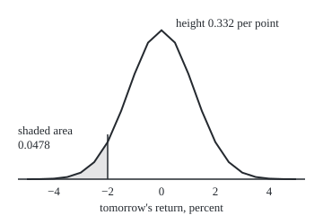
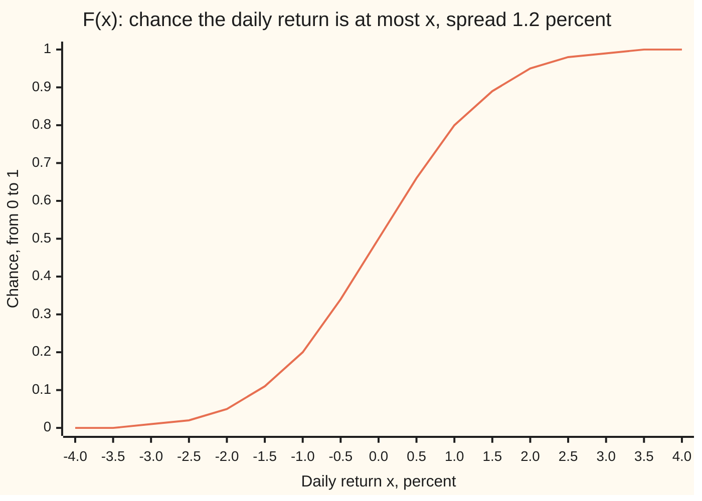

# Densities: probability as area under a curve

Probability and statistics → Continuous Distributions → Area as chance → Densities

---

## General Overview

A share closes today. Tomorrow's close is unknown, and so is tomorrow's return: the percentage change from today's close. Over years of trading, that share's daily returns pile up in a bell shape, centred near 0 with a typical size of 1.2 percent. A risk desk asks one question of it: what is the chance the share falls more than 2 percent tomorrow?

A die has six faces, each with its own chance. A return can land anywhere on a continuous scale, and between any two values lie infinitely many others. For a smooth spread like this one, each single value gets chance zero, yet "below −2 percent" has a real chance. A list of chances per value cannot describe it.

The answer is a curve drawn so that **area under it is chance**. The chance of a return between two values is the area under the curve between them. The whole area is 1. Such a curve is a **density**. The running total of area from the far left, value by value, is a second curve, the **cumulative distribution function**, CDF for short. For this share, the area to the left of −2 percent is 0.0478: a fall of more than 2 percent comes about 1 trading day in 21, some 12 days in a 252-day trading year, if the bell is right.

**A density is a curve whose area over any stretch of values is the chance of landing in that stretch; the CDF is the running total of that area, and the density is the CDF's slope.**

**What kind of fact this is:** a definition, of the density and of the CDF; the link between them, that the density is the CDF's slope, is the fundamental theorem of calculus, proved on its own card and applied in Why it works.

### The picture: the chance of a fall is the shaded area

<p align="center"></p>

The curve is drawn to scale from the `figure,` lines the code prints. The shaded sliver left of −2 holds 4.8 percent of the total area, and the total area is 1. The height at the peak, 0.332, is not a chance of anything: it is chance per percentage point of width, which the rest of the card explains.

---

## The formula

Notation first, in words. As on earlier cards, $X$ is a random variable, here tomorrow's return in percent, and $x$ is one value it might take; P(A) is the chance of the event A. A density is written f(x), read "the density at x". The CDF is written F(x), read "the chance that X is at most x". The long S of an integral, from the calculus wing, adds up area.

$$P(a \le X \le b) = \int_a^b f(x)\,dx$$

**Read it aloud:** the chance that tomorrow's return lands between a and b is the area under the density from a to b.

$$F(x) = P(X \le x) = \int_{-\infty}^{x} f(t)\,dt$$

**Read it aloud:** the CDF at x is all the area under the density from the far left up to x.

$$f(x) = F'(x), \qquad P(a < X \le b) = F(b) - F(a)$$

**Read it aloud:** the density is the slope of the CDF (wherever the density is continuous), and the chance of any window is the CDF at its right end minus the CDF at its left end.

A function qualifies as a density on two conditions: it is never negative, and its total area is 1.

This card's example uses one particular density, the bell shape, whose formula the [normal-distribution](04-normal-distribution.md) card derives:

$$f(x) = \frac{1}{\sigma\sqrt{2\pi}}\; e^{-x^2/(2\sigma^2)}$$

Here σ (the Greek letter sigma) is the spread, 1.2 percentage points; π and e are the usual constants. In words: the height falls off with the square of the distance from 0, measured against the spread; the constant in front is exactly what makes the total area 1.

| Symbol | Plain meaning | In our example | Push it up and the answer… |
| --- | --- | --- | --- |
| $X$ | tomorrow's return, not yet known | a percentage change | — |
| $x$ | one value on the return axis | −2 | F(x) rises, never falls |
| $f$ | the density: chance per percentage point of width near x | f(−2) = 0.0829, f(0) = 0.332 | more chance crowds near that x |
| $F$ | the CDF: chance that X is at most x | F(−2) = 0.0478, F(0) = 0.5 | — |
| $a$, $b$ | the two ends of a window of returns | −12 and −2 on road 1 of the code | a wider window holds more area |
| $t$ | a stand-in that runs along the axis inside the integral | from far left up to x | — |
| $\sigma$ | the spread of the bell, in percentage points | 1.2 | fatter tails: at 1.5 the chance below −2 rises to 0.0912 |
| $\pi$ | the circle constant, circumference over diameter | inside the constant | — |
| $e$ | the base of natural logarithms | inside the bell | — |
| $h$ | the width of one thin strip of the axis | 0.5 by hand, 0.001 for the slope | a strip's chance grows in proportion |
| $z$ | the cut measured in spreads, x divided by σ | −2 / 1.2 = −1.667 | — |

### When it holds

- **No single value carries a lump of chance.** A share on an exchange that caps a day's fall closes exactly at the cap on some days: a lump of chance at one point. No curve's area can put chance on one point. The CDF still works; it jumps there.
- **The curve is never negative.** A dip below zero would give some window a negative chance.
- **Total area 1.** A curve with more area than 1 inflates every chance in the same proportion; divide by the area to repair it.
- **The bell shape is a model, not a law.** The definitions above hold for any density. The bell is this card's modelling choice, and real daily returns have fatter tails than the bell (Cont, 2001), so the bell can understate the chance of large falls; [heavy-tails-pareto-and-cauchy](08-heavy-tails-pareto-and-cauchy.md) measures by how much.

---

## Why it works

### Step 0: chance adds over pieces that do not overlap

The chance of "below −2" is the chance of "below −3" plus the chance of "between −3 and −2", since the two pieces cannot both happen. Area adds the same way. So a curve whose area over every window equals that window's chance stays consistent however the axis is cut up.

### Step 1: a histogram with shrinking bins becomes the density

Take a long record of daily returns and sort them into bins half a percentage point wide. Draw each bar with height equal to the share of days in the bin **divided by the bin's width**. Then each bar's area, height times width, is the share of days in that bin, and all the bars together have area 1.

Narrow the bins and lengthen the record, and the bar tops settle onto a smooth curve: the density. Dividing by width is why its height is chance **per percentage point**.

The code runs this with 400,000 simulated days. In the bin from −2.25 to −1.75 the share of days, per point of width, is 0.0845 (standard error 0.0006). The exact area of that bin, per point of width, is 0.0840: the two agree within one standard error. The height at the bin's centre, f(−2), is 0.0829, a little lower, because the curve bends upward across the bin; a narrower bin closes that gap.

### Step 2: the CDF is a running total, so windows are differences

The event "X at most b" splits into "X at most a" and "X between a and b", which cannot both happen. By Step 0,

$$F(b) = F(a) + P(a < X \le b),$$

so the chance of a window is F(b) − F(a). Three facts follow. F never falls, since chances are not negative. F runs from 0 at the far left to 1 at the far right. And one table of F answers every window question: the chance of a day between −1 and +1 is F(1) − F(−1) = 0.595.

### Step 3: the density is the CDF's slope

F(x) is the area under f up to x. The [fundamental-theorem-of-calculus](../../06-Calculus%20and%20analysis/04-Integrals/02-fundamental-theorem-of-calculus.md) says the rate at which such an area grows, as its right edge moves, is the height of the curve at that edge. So F′(x) = f(x). Numerically: nudge x from −2.001 to −1.999, and F grows by 0.002 × 0.0829; the slope is 0.082898, the same as f(−2) to six decimals.

### Step 4: a single value has chance zero

A strip of width h around −2 has area close to f(−2) × h. Shrink it: width 0.1 holds 0.0083, width 0.01 holds 0.00083, width 0.001 holds 0.000083. The chance falls in proportion to the width, and a single point is a strip of width zero. So P(X = −2) = 0, and "below −2" and "at or below −2" have the same chance.

<details>
<summary>Detailed proof: the slope of F is f, and points carry no chance</summary>

Assume f is continuous at x and h > 0. By Step 2, F(x + h) − F(x) is the area under f from x to x + h. That area lies between h times the smallest value of f on the strip and h times the largest. Divide by h: the ratio lies between the strip's smallest and largest heights. As h shrinks, both close in on f(x), since f is continuous there. So the ratio tends to f(x), which is F′(x) from the right; the same squeeze with the strip on the left gives it from the left.

For the point: the event X = x sits inside the event x − h < X ≤ x for every h > 0. Its chance is at most F(x) − F(x − h), which is at most h times the largest height of f near x. That bound shrinks to 0 with h, and a chance is never negative, so P(X = x) = 0. Only the boundedness of f near x was used.

</details>

<details>
<summary>Why can a density be bigger than 1?</summary>

Its height is chance per unit of width. Measure the same return in decimals instead of percent (0.012 instead of 1.2) and every width shrinks a hundredfold, so every height grows a hundredfold: the peak becomes 33.2 per unit. The areas, which are the chances, do not change. A height above 1 is a warning only if it is being read as a chance.

</details>

A second road reaches the same objects without any curve. The chance of every window determines a CDF, and the CDF alone describes any random variable, lumps included; a density exists exactly when that CDF is the running area of some curve. That view, with lengths replaced by a general measure of size, is [lebesgue-stieltjes-measures](../../10-Measure%20and%20integration/02-Length%20Done%20Properly/06-lebesgue-stieltjes-measures.md).

### The CDF, drawn



The one line is the CDF. It reads 0.05 at −2: the shaded area of the first picture, rounded. It is steepest at 0, where the density is tallest, and flat in the tails, where the density is near zero: slope and height are the same thing.

---

## Worked numbers, by hand

Cut the tail left of −2 into six strips half a point wide, take each strip's height at its centre from the bell formula (a calculator does the exponential), and add the areas.

| Step | Arithmetic | Value |
| --- | --- | --- |
| cut in spreads, z | −2 / 1.2 | −1.667 |
| strip centred at −2.25 | 0.5 × 0.0573 | 0.0287 |
| strip centred at −2.75 | 0.5 × 0.0241 | 0.0120 |
| strip centred at −3.25 | 0.5 × 0.0085 | 0.0042 |
| strip centred at −3.75 | 0.5 × 0.0025 | 0.0013 |
| strip centred at −4.25 | 0.5 × 0.0006 | 0.0003 |
| strip centred at −4.75 | 0.5 × 0.0001 | 0.0001 |
| sum of six strips | 0.0287 + 0.0120 + 0.0042 + 0.0013 + 0.0003 + 0.0001 | 0.0466 |
| area left of −5, left out | from the CDF | 0.000015 |
| exact, F(−2) | 20,000 strips, or the CDF's series | **0.0478** |

The hand sum falls short by 0.0012. In the tail the curve bends upward, so the height at each strip's centre is lower than the strip's average height; thinner strips close the gap, and the code's 20,000 strips land on the exact value. The answer means that a fall of more than 2 percent comes about 1 day in 21, or 12 days in a 252-day year, if the bell shape is right.

### What breaks if you drop a piece

| Mistake | Comes out at | What went wrong |
| --- | --- | --- |
| Reading the height f(−2) as the chance of a fall | 0.0829, not 0.0478 | Height is chance per point of width; only area is chance |
| Returns in decimals, height at the centre read as a chance | 33.2 | A density can exceed 1; the units of width set the height |
| "Falls more than 2 percent" counted as "moves more than 2 percent" | 0.0956 | Added the chance of a gain above +2, the other tail |
| Adding f(−2) for the point −2 itself | 0.1307 | A single value carries chance zero; a height is not a lump |

The code prints all four.

---

## Code, from first principles, and it actually runs

Three independent roads reach the chance of a fall of more than 2 percent. Road 1 adds 20,000 strips under the density by Simpson's rule (a strip sum that fits a parabola across each pair of strips). Road 2 sums the CDF's own power series, with no integrator. Road 3 draws 400,000 simulated days from a seeded generator, SplitMix64, shapes them into bell draws by the Box-Muller recipe, and counts, quoting a standard error. The code also checks that the CDF's slope is the density, that a histogram bar per unit width matches the exact bin area, and that the total area is 1. The generator, integrator and CDF are all written out.

### Python

```python
# Densities and CDFs -- the check behind the card.  Nothing is imported but
# the math primitives.  A share's daily return, in percent, is modelled by a
# bell-shaped density centred at 0 with spread 1.2.  The chance of a fall of
# more than 2 percent is reached three ways: strips under the density, the
# CDF's own power series, and seeded random draws.  Every number is printed.
from math import exp, log, sqrt, cos, pi

SIGMA, CUT, DAYS = 1.2, -2.0, 252

def f(x):                                  # the density: chance per percentage point
    return exp(-x * x / (2 * SIGMA * SIGMA)) / (SIGMA * sqrt(2 * pi))

def simpson(g, a, b, n):                   # area under g from a to b, n even strips
    h = (b - a) / n
    s = g(a) + g(b)
    for i in range(1, n):
        s += (4 if i % 2 else 2) * g(a + i * h)
    return s * h / 3

def F(x):                                  # the CDF by its power series, no integrator
    z, term, total, n = x / SIGMA, x / SIGMA, 0.0, 0
    while abs(term) > 1e-17:               # term n is (-1)^n z^(2n+1) / (2^n n! (2n+1))
        total += term / (2 * n + 1)
        n += 1
        term *= -z * z / (2 * n)
    return 0.5 + total / sqrt(2 * pi)

MASK = (1 << 64) - 1
state = 20260928                           # SplitMix64, seed stated, same in Rust
def uniform():
    global state
    state = (state + 0x9E3779B97F4A7C15) & MASK
    z = state
    z = ((z ^ (z >> 30)) * 0xBF58476D1CE4E5B9) & MASK
    z = ((z ^ (z >> 27)) * 0x94D049BB133111EB) & MASK
    z ^= z >> 31
    return ((z >> 11) + 0.5) / 2.0 ** 53   # strictly between 0 and 1

road1 = simpson(f, -12.0, CUT, 20000)
road2 = F(CUT)
draws, below, in_bin = 400000, 0, 0
for _ in range(draws // 2):                # Box-Muller: two uniforms make two bell draws
    r, t = sqrt(-2 * log(uniform())), 2 * pi * uniform()
    for x in (SIGMA * r * cos(t), SIGMA * r * cos(t - pi / 2)):
        below += x < CUT
        in_bin += -2.25 <= x < -1.75
p3 = below / draws
se3 = sqrt(p3 * (1 - p3) / draws)
hb = in_bin / draws / 0.5
binx = (F(-1.75) - F(-2.25)) / 0.5
seb = sqrt(in_bin / draws * (1 - in_bin / draws) / draws) / 0.5
slope = (F(-1.999) - F(-2.001)) / 0.002

def row(label, value, digits=6):
    print(f"{label:<52} {value:.{digits}f}")

print(f"daily return: bell-shaped density, centre 0%, spread {SIGMA}%")
row("z = -2 / 1.2, the cut in units of spread", CUT / SIGMA)
row("road 1, 20000 strips under f from -12% to -2%", road1)
row("road 2, F(-2) by power series at z = -2/1.2", road2)
row("road 3, share of 400000 seeded draws below -2%", p3)
row("  its standard error", se3)
print(f"  draws below -2%: {below} of {draws}")
row("fall of more than 2% on 252 days, expected count", DAYS * road2, 2)
row("one day in N, N = 1 / F(-2)", 1 / road2, 1)
row("f(-2), density height at -2%, per point", f(CUT))
row("slope of F at -2%, (F(-1.999) - F(-2.001)) / 0.002", slope)
row("draws in -2.25% to -1.75%, per point of width", hb)
row("  its standard error", seb)
row("  exact, (F(-1.75) - F(-2.25)) / 0.5", binx)
row("f(0), density height at the centre, per point", f(0.0))
row("F(0), chance of a return at or below 0%", F(0.0))
row("total area under f, -12% to 12%", simpson(f, -12.0, 12.0, 20000))
row("F(1) - F(-1), a day between -1% and +1%", F(1.0) - F(-1.0))
for w in (0.1, 0.01, 0.001):
    row(f"chance within a strip of width {w} at -2%", F(CUT + w / 2) - F(CUT - w / 2))
row("wrong: height f(-2) read as the chance", f(CUT))
row("wrong: returns as decimals, height at centre", f(0.0) * 100, 3)
row("wrong: either way, below -2% or above +2%", F(CUT) + 1 - F(-CUT))
row("wrong: F(-2) plus f(-2) for the point itself", F(CUT) + f(CUT))
print("by hand: strips 0.5 wide from -5% to -2%, centre, height, area")
hand = 0.0
for c in (-2.25, -2.75, -3.25, -3.75, -4.25, -4.75):
    hand += 0.5 * f(c)
    print(f"  {c:6.2f}  {f(c):.4f}  {0.5 * f(c):.4f}")
row("  sum of the six strip areas", hand, 4)
row("  area left of -5%, left out by hand", F(-5.0))
row("  gap, road 2 minus the hand sum", road2 - hand, 4)
row("try: spread 1.5% instead of 1.2%, chance below -2%", F(CUT * SIGMA / 1.5))
row("try: cut at -3% instead of -2%, chance below it", F(-3.0))
xs = [-4.0 + 0.5 * i for i in range(17)]
print("chart, x   " + " ".join(f"{x:.1f}" for x in xs))
print("chart, F   " + " ".join(f"{F(x):.2f}" for x in xs))
px = lambda x: 180 + 30 * x                # figure: 30 px per point, baseline at y = 200
py = lambda x: 200 - 500 * f(x)
pts = [-5.0 + 0.5 * i for i in range(21)]
for k in range(3):
    print("figure, " + " ".join(f"{px(x):.0f},{py(x):.1f}" for x in pts[7 * k:7 * k + 7]))
print(f"figure, tail from x = {px(-5.0):.0f} to {px(CUT):.0f}, baseline y = 200")

assert abs(road1 - road2) < 1e-9                    # strips against series
assert abs(p3 - road2) < 4 * se3                    # draws against series
assert abs(slope - f(CUT)) < 1e-6                   # CDF's slope is the density
assert abs(hb - binx) < 4 * seb                     # bin share per width vs CDF
assert abs(simpson(f, -12.0, 12.0, 20000) - 1.0) < 1e-9
print("ALL CHECKS PASS")
```

**Ran 2026-09-28 on macOS, Python 3.14.6, standard library only. All checks passed. Output, pasted from the run:**

```
daily return: bell-shaped density, centre 0%, spread 1.2%
z = -2 / 1.2, the cut in units of spread             -1.666667
road 1, 20000 strips under f from -12% to -2%        0.047790
road 2, F(-2) by power series at z = -2/1.2          0.047790
road 3, share of 400000 seeded draws below -2%       0.048008
  its standard error                                 0.000338
  draws below -2%: 19203 of 400000
fall of more than 2% on 252 days, expected count     12.04
one day in N, N = 1 / F(-2)                          20.9
f(-2), density height at -2%, per point              0.082898
slope of F at -2%, (F(-1.999) - F(-2.001)) / 0.002   0.082898
draws in -2.25% to -1.75%, per point of width        0.084450
  its standard error                                 0.000636
  exact, (F(-1.75) - F(-2.25)) / 0.5                 0.083956
f(0), density height at the centre, per point        0.332452
F(0), chance of a return at or below 0%              0.500000
total area under f, -12% to 12%                      1.000000
F(1) - F(-1), a day between -1% and +1%              0.595343
chance within a strip of width 0.1 at -2%            0.008294
chance within a strip of width 0.01 at -2%           0.000829
chance within a strip of width 0.001 at -2%          0.000083
wrong: height f(-2) read as the chance               0.082898
wrong: returns as decimals, height at centre         33.245
wrong: either way, below -2% or above +2%            0.095581
wrong: F(-2) plus f(-2) for the point itself         0.130688
by hand: strips 0.5 wide from -5% to -2%, centre, height, area
   -2.25  0.0573  0.0287
   -2.75  0.0241  0.0120
   -3.25  0.0085  0.0042
   -3.75  0.0025  0.0013
   -4.25  0.0006  0.0003
   -4.75  0.0001  0.0001
  sum of the six strip areas                         0.0466
  area left of -5%, left out by hand                 0.000015
  gap, road 2 minus the hand sum                     0.0012
try: spread 1.5% instead of 1.2%, chance below -2%   0.091211
try: cut at -3% instead of -2%, chance below it      0.006210
chart, x   -4.0 -3.5 -3.0 -2.5 -2.0 -1.5 -1.0 -0.5 0.0 0.5 1.0 1.5 2.0 2.5 3.0 3.5 4.0
chart, F   0.00 0.00 0.01 0.02 0.05 0.11 0.20 0.34 0.50 0.66 0.80 0.89 0.95 0.98 0.99 1.00 1.00
figure, 30,200.0 45,199.9 60,199.4 75,197.6 90,192.7 105,181.0 120,158.6
figure, 135,123.9 150,82.5 165,47.6 180,33.8 195,47.6 210,82.5 225,123.9
figure, 240,158.6 255,181.0 270,192.7 285,197.6 300,199.4 315,199.9 330,200.0
figure, tail from x = 30 to 120, baseline y = 200
ALL CHECKS PASS
```

### Rust

Same roads, same seed, same labels, built with `rustc --edition 2021 -O`.

```rust
// Densities and CDFs -- the same check as the Python, in Rust.  No crates.
// A share's daily return, in percent, is modelled by a bell-shaped density
// centred at 0 with spread 1.2.  The chance of a fall of more than 2 percent
// is reached three ways: strips under the density, the CDF's own power
// series, and seeded random draws.  Every number on the card is printed.
use std::f64::consts::PI;

const SIGMA: f64 = 1.2;
const CUT: f64 = -2.0;
const DAYS: f64 = 252.0;

fn f(x: f64) -> f64 {                          // the density: chance per percentage point
    (-x * x / (2.0 * SIGMA * SIGMA)).exp() / (SIGMA * (2.0 * PI).sqrt())
}

fn simpson(g: fn(f64) -> f64, a: f64, b: f64, n: usize) -> f64 {   // n even strips
    let h = (b - a) / n as f64;
    let mut s = g(a) + g(b);
    for i in 1..n { s += if i % 2 == 1 { 4.0 } else { 2.0 } * g(a + i as f64 * h); }
    s * h / 3.0
}

fn cdf(x: f64) -> f64 {                        // the CDF by its power series, no integrator
    let z = x / SIGMA;
    let (mut term, mut total, mut n) = (z, 0.0, 0.0);
    while term.abs() > 1e-17 {                 // term n is (-1)^n z^(2n+1) / (2^n n! (2n+1))
        total += term / (2.0 * n + 1.0);
        n += 1.0;
        term *= -z * z / (2.0 * n);
    }
    0.5 + total / (2.0 * PI).sqrt()
}

struct SplitMix(u64);                          // SplitMix64, seed stated, same in Python
impl SplitMix {
    fn uniform(&mut self) -> f64 {
        self.0 = self.0.wrapping_add(0x9E3779B97F4A7C15);
        let mut z = self.0;
        z = (z ^ (z >> 30)).wrapping_mul(0xBF58476D1CE4E5B9);
        z = (z ^ (z >> 27)).wrapping_mul(0x94D049BB133111EB);
        z ^= z >> 31;
        ((z >> 11) as f64 + 0.5) / 2f64.powi(53)   // strictly between 0 and 1
    }
}

fn row(label: &str, value: f64, digits: usize) {
    println!("{:<52} {:.*}", label, digits, value);
}

fn main() {
    let road1 = simpson(f, -12.0, CUT, 20000);
    let road2 = cdf(CUT);
    let mut rng = SplitMix(20260928);
    let draws = 400000u64;
    let (mut below, mut in_bin) = (0u64, 0u64);
    for _ in 0..draws / 2 {                    // Box-Muller: two uniforms make two bell draws
        let r = (-2.0 * rng.uniform().ln()).sqrt();
        let t = 2.0 * PI * rng.uniform();
        for x in [SIGMA * r * t.cos(), SIGMA * r * (t - PI / 2.0).cos()] {
            if x < CUT { below += 1 }
            if (-2.25..-1.75).contains(&x) { in_bin += 1 }
        }
    }
    let nd = draws as f64;
    let p3 = below as f64 / nd;
    let se3 = (p3 * (1.0 - p3) / nd).sqrt();
    let hb = in_bin as f64 / nd / 0.5;
    let binx = (cdf(-1.75) - cdf(-2.25)) / 0.5;
    let pb = in_bin as f64 / nd;
    let seb = (pb * (1.0 - pb) / nd).sqrt() / 0.5;
    let slope = (cdf(-1.999) - cdf(-2.001)) / 0.002;
    let total = simpson(f, -12.0, 12.0, 20000);

    println!("daily return: bell-shaped density, centre 0%, spread {}%", SIGMA);
    row("z = -2 / 1.2, the cut in units of spread", CUT / SIGMA, 6);
    row("road 1, 20000 strips under f from -12% to -2%", road1, 6);
    row("road 2, F(-2) by power series at z = -2/1.2", road2, 6);
    row("road 3, share of 400000 seeded draws below -2%", p3, 6);
    row("  its standard error", se3, 6);
    println!("  draws below -2%: {} of {}", below, draws);
    row("fall of more than 2% on 252 days, expected count", DAYS * road2, 2);
    row("one day in N, N = 1 / F(-2)", 1.0 / road2, 1);
    row("f(-2), density height at -2%, per point", f(CUT), 6);
    row("slope of F at -2%, (F(-1.999) - F(-2.001)) / 0.002", slope, 6);
    row("draws in -2.25% to -1.75%, per point of width", hb, 6);
    row("  its standard error", seb, 6);
    row("  exact, (F(-1.75) - F(-2.25)) / 0.5", binx, 6);
    row("f(0), density height at the centre, per point", f(0.0), 6);
    row("F(0), chance of a return at or below 0%", cdf(0.0), 6);
    row("total area under f, -12% to 12%", total, 6);
    row("F(1) - F(-1), a day between -1% and +1%", cdf(1.0) - cdf(-1.0), 6);
    for w in [0.1, 0.01, 0.001] {
        row(&format!("chance within a strip of width {} at -2%", w), cdf(CUT + w / 2.0) - cdf(CUT - w / 2.0), 6);
    }
    row("wrong: height f(-2) read as the chance", f(CUT), 6);
    row("wrong: returns as decimals, height at centre", f(0.0) * 100.0, 3);
    row("wrong: either way, below -2% or above +2%", cdf(CUT) + 1.0 - cdf(-CUT), 6);
    row("wrong: F(-2) plus f(-2) for the point itself", cdf(CUT) + f(CUT), 6);
    println!("by hand: strips 0.5 wide from -5% to -2%, centre, height, area");
    let mut hand = 0.0;
    for c in [-2.25, -2.75, -3.25, -3.75, -4.25, -4.75] {
        hand += 0.5 * f(c);
        println!("  {:6.2}  {:.4}  {:.4}", c, f(c), 0.5 * f(c));
    }
    row("  sum of the six strip areas", hand, 4);
    row("  area left of -5%, left out by hand", cdf(-5.0), 6);
    row("  gap, road 2 minus the hand sum", road2 - hand, 4);
    row("try: spread 1.5% instead of 1.2%, chance below -2%", cdf(CUT * SIGMA / 1.5), 6);
    row("try: cut at -3% instead of -2%, chance below it", cdf(-3.0), 6);
    let xs: Vec<f64> = (0..17).map(|i| -4.0 + 0.5 * i as f64).collect();
    let xl: Vec<String> = xs.iter().map(|x| format!("{:.1}", x)).collect();
    let fl: Vec<String> = xs.iter().map(|&x| format!("{:.2}", cdf(x))).collect();
    println!("chart, x   {}", xl.join(" "));
    println!("chart, F   {}", fl.join(" "));
    let px = |x: f64| 180.0 + 30.0 * x;        // figure: 30 px per point, baseline at y = 200
    let py = |x: f64| 200.0 - 500.0 * f(x);
    let pts: Vec<f64> = (0..21).map(|i| -5.0 + 0.5 * i as f64).collect();
    for k in 0..3 {
        let s: Vec<String> = pts[7 * k..7 * k + 7].iter().map(|&x| format!("{:.0},{:.1}", px(x), py(x))).collect();
        println!("figure, {}", s.join(" "));
    }
    println!("figure, tail from x = {:.0} to {:.0}, baseline y = 200", px(-5.0), px(CUT));

    assert!((road1 - road2).abs() < 1e-9);                // strips against series
    assert!((p3 - road2).abs() < 4.0 * se3);              // draws against series
    assert!((slope - f(CUT)).abs() < 1e-6);               // CDF's slope is the density
    assert!((hb - binx).abs() < 4.0 * seb);               // bin share per width vs CDF
    assert!((total - 1.0).abs() < 1e-9);
    println!("ALL CHECKS PASS");
}
```

**Ran 2026-09-28 on macOS, rustc 1.98.1, no crates. All checks passed. Output, pasted from the run:**

```
daily return: bell-shaped density, centre 0%, spread 1.2%
z = -2 / 1.2, the cut in units of spread             -1.666667
road 1, 20000 strips under f from -12% to -2%        0.047790
road 2, F(-2) by power series at z = -2/1.2          0.047790
road 3, share of 400000 seeded draws below -2%       0.048008
  its standard error                                 0.000338
  draws below -2%: 19203 of 400000
fall of more than 2% on 252 days, expected count     12.04
one day in N, N = 1 / F(-2)                          20.9
f(-2), density height at -2%, per point              0.082898
slope of F at -2%, (F(-1.999) - F(-2.001)) / 0.002   0.082898
draws in -2.25% to -1.75%, per point of width        0.084450
  its standard error                                 0.000636
  exact, (F(-1.75) - F(-2.25)) / 0.5                 0.083956
f(0), density height at the centre, per point        0.332452
F(0), chance of a return at or below 0%              0.500000
total area under f, -12% to 12%                      1.000000
F(1) - F(-1), a day between -1% and +1%              0.595343
chance within a strip of width 0.1 at -2%            0.008294
chance within a strip of width 0.01 at -2%           0.000829
chance within a strip of width 0.001 at -2%          0.000083
wrong: height f(-2) read as the chance               0.082898
wrong: returns as decimals, height at centre         33.245
wrong: either way, below -2% or above +2%            0.095581
wrong: F(-2) plus f(-2) for the point itself         0.130688
by hand: strips 0.5 wide from -5% to -2%, centre, height, area
   -2.25  0.0573  0.0287
   -2.75  0.0241  0.0120
   -3.25  0.0085  0.0042
   -3.75  0.0025  0.0013
   -4.25  0.0006  0.0003
   -4.75  0.0001  0.0001
  sum of the six strip areas                         0.0466
  area left of -5%, left out by hand                 0.000015
  gap, road 2 minus the hand sum                     0.0012
try: spread 1.5% instead of 1.2%, chance below -2%   0.091211
try: cut at -3% instead of -2%, chance below it      0.006210
chart, x   -4.0 -3.5 -3.0 -2.5 -2.0 -1.5 -1.0 -0.5 0.0 0.5 1.0 1.5 2.0 2.5 3.0 3.5 4.0
chart, F   0.00 0.00 0.01 0.02 0.05 0.11 0.20 0.34 0.50 0.66 0.80 0.89 0.95 0.98 0.99 1.00 1.00
figure, 30,200.0 45,199.9 60,199.4 75,197.6 90,192.7 105,181.0 120,158.6
figure, 135,123.9 150,82.5 165,47.6 180,33.8 195,47.6 210,82.5 225,123.9
figure, 240,158.6 255,181.0 270,192.7 285,197.6 300,199.4 315,199.9 330,200.0
figure, tail from x = 30 to 120, baseline y = 200
ALL CHECKS PASS
```

The two outputs match line for line, including the simulated count of 19,203 days below −2: both languages draw the same numbers from the same seed.

> [!TIP]
> **Try changing**
> Guess first, then run it.
> - **Widen the spread.** The code already prints the answer for a spread of 1.5 instead of 1.2: the chance below −2 nearly doubles, to 0.0912. A small change in spread moves a tail chance a lot.
> - **Move the cut.** At −3 instead of −2 the chance drops to 0.0062. Tail areas shrink much faster than the distance grows.
> - **Starve the strips.** Set road 1 to 20 strips instead of 20,000. It still lands close, but it drifts in the sixth decimal and the first assert stops the run.
> - **Change the seed.** Any other seed moves the count of days below −2 by about a standard error, and the second assert, which allows four, almost always passes.

---

## The usual mistake

> [!warning]
> **Reading the height of a density as a chance.** At −2 the curve stands at 0.0829, and it is tempting to call that the chance of a return of −2. The chance of exactly −2 is zero; 0.0829 is chance per percentage point of width near −2. Only areas are chances, and the chance of falling below −2 is the area 0.0478.
>
> - **Surprise at a density above 1.** Measured in decimals, the same bell peaks at 33.2. Nothing is broken: widths shrank, heights grew, areas stayed.
> - **One tail or two.** "Falls more than 2 percent" is one tail, 0.0478. "Moves more than 2 percent" is both, 0.0956.
> - **Fussing over at-most against below.** For a density, F(−2) is both P(X ≤ −2) and P(X < −2). Adding the height f(−2) to one of them gives 0.1307, a wrong answer from a lump that does not exist.
> - **Trusting the bell in the tails.** The definitions are exact; the bell shape is a model. Real returns fall hard more often than the bell predicts.

---

## Where you meet it in real life

- **Risk limits on a trading desk.** "What is the chance of losing more than X tomorrow?" is a CDF read at one point; the finance wing's value-at-risk turns the question round and asks for the point.
- **Option prices.** Prices of options at neighbouring strikes reveal the market's own density for a share's future price: [butterfly-and-the-implied-density](../../12-Financial%20mathematics/10-Digitals%20and%20the%20implied%20density/05-butterfly-and-the-implied-density.md).
- **Waiting times.** The time until the next customer, call or failure has a density; the simplest is the [exponential-distribution](03-exponential-distribution.md).
- **Random numbers in simulations.** Running the CDF backwards turns uniform random numbers into draws from any density: [inverse-transform-sampling](../11-Simulation/02-inverse-transform-sampling.md).

> **Say it back**
> A return can take infinitely many values, so no single value carries chance. Instead, a density is a curve whose area over any window is the chance of landing in it, with total area 1. Its height is chance per unit of width, so it can exceed 1 and is never itself a chance. The CDF is the running total of that area, windows are differences of the CDF, and the density is the CDF's slope. For a share with daily spread 1.2 percent, the area left of −2 is 0.0478: a fall of more than 2 percent about 1 day in 21.

---

## What this builds on

- [random-variables-and-distributions](../02-Random%20Variables/01-random-variables-and-distributions.md): the random variable X and a list of chances per value, which a density replaces when values are uncountably many.
- [fundamental-theorem-of-calculus](../../06-Calculus%20and%20analysis/04-Integrals/02-fundamental-theorem-of-calculus.md): why the rate of growth of an area is the height of the curve, so the density is the CDF's slope.

## Where this goes next

- [uniform-distribution](02-uniform-distribution.md): the flattest density, where area is plain length.
- [exponential-distribution](03-exponential-distribution.md): a density for waiting times, and a CDF in closed form.
- [normal-distribution](04-normal-distribution.md): the bell used here, its constant derived, and its CDF named.
- [heavy-tails-pareto-and-cauchy](08-heavy-tails-pareto-and-cauchy.md): densities whose tails hold far more area than the bell's.
- [transforming-a-random-variable](../05-Transformations%20and%20Joint%20Laws/01-transforming-a-random-variable.md): how a density changes when the variable is rescaled, as in the percent-to-decimal switch.
- [joint-densities-and-marginals](../05-Transformations%20and%20Joint%20Laws/02-joint-densities-and-marginals.md): volume under a surface for two returns at once.
- [priors-posteriors-and-updating](../10-Bayesian%20Inference/01-priors-posteriors-and-updating.md): a density describing belief about an unknown quantity.
- [inverse-transform-sampling](../11-Simulation/02-inverse-transform-sampling.md): the CDF run backwards to draw random numbers.
- [lebesgue-stieltjes-measures](../../10-Measure%20and%20integration/02-Length%20Done%20Properly/06-lebesgue-stieltjes-measures.md): a CDF as a way of measuring the size of sets.
- [pushforward-and-the-law](../../10-Measure%20and%20integration/03-Measurable%20Functions/05-pushforward-and-the-law.md): the law of X, with or without a density.
- [expectation-as-an-integral](../../10-Measure%20and%20integration/04-The%20Lebesgue%20Integral/06-expectation-as-an-integral.md): the average of X as an area weighted by the density.
- [densities-and-likelihood-ratios](../../10-Measure%20and%20integration/08-Densities%20and%20Changing%20Measure/06-densities-and-likelihood-ratios.md): when a density exists at all, and what it means in general.
- [butterfly-and-the-implied-density](../../12-Financial%20mathematics/10-Digitals%20and%20the%20implied%20density/05-butterfly-and-the-implied-density.md): a density read off option prices.
- [volatility-smile-and-skew](../../12-Financial%20mathematics/12-The%20smile%20and%20the%20surface/01-volatility-smile-and-skew.md): what the market's density looks like when it is not a bell.
- [stochastic-dominance](../../12-Financial%20mathematics/36-Returns%20and%20Utility/04-stochastic-dominance.md): ranking two investments by comparing their CDFs.

This card took the bell's formula on trust; where its constant comes from, and how every bell reduces to one standard table, is [normal-distribution](04-normal-distribution.md).

---

## Sources

Verified 2026-09-28: every link below resolves to the publisher's page.

- Blitzstein, Joseph K., and Jessica Hwang. *Introduction to Probability*, 2nd ed. CRC Press, 2019. [Publisher page](https://www.routledge.com/Introduction-to-Probability-Second-Edition/Blitzstein-Hwang/p/book/9781138369917). Chapter 5 builds densities and CDFs from the same area picture.
- Feller, William. *An Introduction to Probability Theory and Its Applications*, Volume 2, 2nd ed. Wiley, 1971. [Publisher page](https://www.wiley.com/en-us/An+Introduction+to+Probability+Theory+and+Its+Applications%2C+Volume+2%2C+2nd+Edition-p-9780471257097). The classic treatment of densities and distribution functions, lumps included.
- Cont, Rama. "Empirical properties of asset returns: stylized facts and statistical issues." *Quantitative Finance* 1, no. 2 (2001): 223–236. [doi:10.1080/713665670](https://doi.org/10.1080/713665670). The evidence that real daily returns have fatter tails than the bell.
