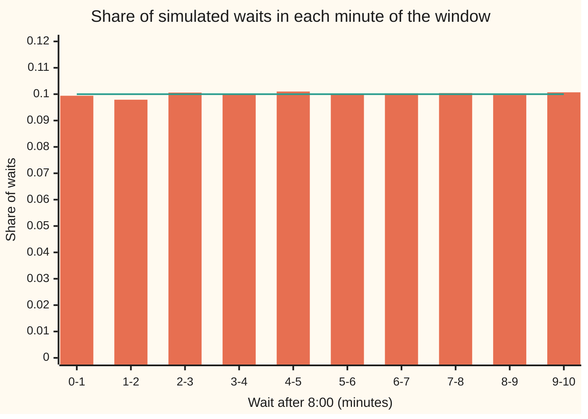
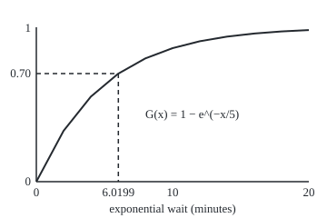

# Uniform: every value in an interval equally likely

[Syllabus](../../../SYLLABUS.md) → [Probability and statistics](../../../SYLLABUS.md#w09) → [Continuous Distributions](../../../SYLLABUS.md#w09-s04) → Uniform

---

## General Overview

A timetable says the number 12 bus comes "between 8:00 and 8:10". Nothing more is known. A rider reaches the stop at 8:00 sharp. How long is the wait?

Any moment in those ten minutes is as likely as any other. So a three-minute stretch holds the same chance wherever it sits: 8:00 to 8:03, or 8:04 to 8:07. Each holds three tenths of the chance, 30 percent. Chance is proportional to length, and that is the whole law. It is called the **uniform distribution**: uniform meaning flat, the same everywhere in the window.

From that one rule come the average wait (5 minutes), the typical spread around it (about 2.9 minutes), and the wait the rider beats nine mornings in ten (9 minutes). A second use matters more. A computer's random numbers are uniform draws between 0 and 1. Much of the other randomness in a simulation (exponential waits, bell curves, default times) is built from them by one move: feed the uniform draw through a quantile, the inverse of a cumulative chance.

**Chance in a uniform law is length divided by the window's length; its mean is the midpoint, its variance is the width squared over 12, its quantiles are straight-line interpolation, and passing uniform draws through any law's quantile manufactures that law.**

**What kind of fact this is:** a definition, which is also a modelling choice for the bus; its mean, variance, quantiles and the inverse-transform rule are theorems proved on this card in Why it works.

### The picture: 100,000 simulated waits, one bar per minute



Bars: the share of 100,000 simulated waits landing in each one-minute slot, printed by both checks. Line: the uniform law's 0.1 per slot. The bars wobble by a few thousandths, the size of chance noise at this sample size; the law is the flat line they scatter around.

---

## The formula

Notation first. $X$ is the wait in minutes, a random variable: a number fixed only when the bus comes. The window runs from $a$ to $b$. The shorthand $X \sim \mathrm{Uniform}(a, b)$, read "X is uniform between a and b", names the law. The density $f(x)$ and the cumulative chance $F(x)$ are the ones from [Densities](01-densities-and-cdfs.md): chance per minute, and chance of waiting at most $x$ minutes.

$$f(x) = \frac{1}{b-a} \text{ for } a \le x \le b, \qquad F(x) = \frac{x-a}{b-a} \text{ for } a \le x \le b$$

Outside the window, $f(x) = 0$; $F(x)$ is 0 before $a$ and 1 after $b$.

**Read it aloud:** the chance per minute is one over the window's length, so the chance of waiting at most $x$ is the fraction of the window already used up.

Three consequences, each proved below:

$$E[X] = \frac{a+b}{2}, \qquad \operatorname{Var}(X) = \frac{(b-a)^2}{12}, \qquad Q(u) = a + (b-a)\,u$$

**Read it aloud:** the average wait is the window's midpoint; the variance is the width squared over twelve; the wait reached with chance $u$ sits the fraction $u$ of the way along the window.

And the rule that makes the uniform the raw material of simulation. If $U \sim \mathrm{Uniform}(0, 1)$ and $G$ is any cumulative chance function with quantile $G^{-1}$, then

$$G^{-1}(U) \text{ has cumulative chance } G.$$

**Read it aloud:** push a uniform draw between 0 and 1 through a law's quantile and out comes a draw from that law.

| Symbol | Plain meaning | In our example | Push it up and the answer… |
| --- | --- | --- | --- |
| $X$, $x$ | the wait, a random variable; $x$ is one particular wait, a plain number | minutes after 8:00; $x = 3$ | $x$ up: $F(x)$ grows |
| $a$ | start of the window | 0 minutes (8:00) | mean rises, spread shrinks |
| $b$ | end of the window | 10 minutes (8:10) | mean and spread both rise |
| $f(x)$ | density: chance per minute inside the window | 0.1 per minute | — (fixed by $a$ and $b$) |
| $F(x)$ | cumulative chance of waiting at most $x$ | $F(3) = 0.3$ | — |
| $E[X]$ | the mean: the average wait in the long run | 5 minutes | — |
| $\operatorname{Var}(X)$, $\sigma$ | variance: the average squared distance from the mean; $\sigma$, the standard deviation, is its square root | 8.3333 minutes squared; $\sigma$ = 2.8868 minutes | — |
| $Q(u)$ | quantile: the wait reached with chance $u$ | $Q(0.9) = 9$ minutes | $u$ up, $Q(u)$ up in a straight line |
| $U$ | a uniform draw between 0 and 1, what a random number generator hands out | 0.7 | — |
| $G$ | the cumulative chance of a target law, with quantile $G^{-1}$ | an exponential wait with mean 5 minutes | — |
| $n$ | number of equally spaced points in a discrete stand-in for the window | 10 and 100 | grid variance climbs to 8.3333 |
| $q$, $y$, $h$ | helper values in the Detailed proof: the least qualifying value, a qualifying value, a small step | — | — |

### When it holds

- **No time in the window is favoured.** If buses bunch toward 8:08, a three-minute stretch near the end holds more chance, and the flat density understates late waits.
- **The window is finite.** "Any time at all, equally likely" has no uniform law: a flat density over an endless line cannot total 1.
- **The endpoints are firm.** A bus that sometimes comes at 8:12 puts chance outside the window, and $Q(0.9) = 9$ undercounts the bad mornings.
- **For the inverse-transform rule, the input is truly uniform.** Feed it anything else and the output follows the wrong law: What breaks shows the mean dropping from 5 to 3.0685.

---

## Why it works

### Step 0: equal chance for equal length forces a flat density

"Every moment equally likely" cannot mean each instant has positive chance: ten minutes hold endlessly many instants, and the chances would total more than 1. The workable meaning is about stretches: two stretches of the same length hold the same chance. Chance per minute, the density, must then be the same everywhere in the window. The total chance is 1 and the window is $b - a$ minutes long, so the density is $1/(b-a)$. For the bus, $1/10 = 0.1$ per minute. A single instant has length zero and so chance zero; the density 0.1 is a rate, not a chance.

### Step 1: the cumulative chance is a straight ramp

The chance of waiting at most $x$ is the area under the density from $a$ to $x$: a rectangle of height $1/(b-a)$ and width $x - a$. So $F(x) = (x-a)/(b-a)$. Any stretch inside the window gets the difference of two ramp heights, which is its length over the window's length. For 8:04 to 8:07 that is $F(7) - F(4) = 3/10 = 0.3$.

### Step 2: the mean is the midpoint

The mean weights each wait by its density and adds up, which for a density means integrating:

$$E[X] = \int_a^b x \cdot \frac{1}{b-a}\,dx = \frac{1}{b-a}\cdot\frac{b^2 - a^2}{2} = \frac{a+b}{2}.$$

The factor $b^2 - a^2 = (b-a)(b+a)$ cancels the width. The shape agrees: a flat block balances at its middle. For the bus, 5 minutes.

### Step 3: the variance is the width squared over 12

Variance is the mean square minus the square of the mean. The mean square is

$$E[X^2] = \int_a^b x^2 \cdot \frac{1}{b-a}\,dx = \frac{b^3 - a^3}{3(b-a)} = \frac{a^2 + ab + b^2}{3}.$$

Subtract $(a+b)^2/4$ over the common denominator 12:

$$\operatorname{Var}(X) = \frac{4a^2 + 4ab + 4b^2 - 3a^2 - 6ab - 3b^2}{12} = \frac{(b-a)^2}{12}.$$

Only the width survives, as it must: sliding the window later moves the mean but not the spread. For the bus, $E[X^2] = 100/3 = 33.3333$, and $\operatorname{Var}(X) = 100/12 = 8.3333$. The standard deviation is $\sigma = 10/\sqrt{12} = 2.8868$ minutes. Doubling the window quadruples the variance and doubles $\sigma$.

### Step 4: the quantile inverts the ramp

The quantile $Q(u)$ is the wait whose cumulative chance is $u$. Set $F(x) = u$ and solve: $(x-a)/(b-a) = u$ gives $x = a + (b-a)\,u$. The ramp climbs steadily across the window, so exactly one $x$ solves it for every $u$ strictly between 0 and 1. For the bus, the median is $Q(0.5) = 5$ minutes and $Q(0.9) = 9$: nine mornings in ten, the bus is there by 8:09.

### Step 5: a uniform draw pushed through a quantile has that quantile's law

Take $U$ uniform between 0 and 1, so $P(U \le u) = u$ for any $u$ in that range: Step 1 with $a = 0$, $b = 1$. Let $G$ be a cumulative chance function with no jumps that climbs steadily wherever it lies strictly between 0 and 1, and $G^{-1}$ its quantile. Then $G^{-1}(U) \le x$ happens exactly when $U \le G(x)$, since $G$ and $G^{-1}$ undo each other and both keep order. So

$$P\big(G^{-1}(U) \le x\big) = P\big(U \le G(x)\big) = G(x).$$

The draw $G^{-1}(U)$ has cumulative chance $G$: it follows the target law. Step 4 is the special case where $G$ is the bus's own ramp, which is why a program makes bus waits as $10 \times U$.

The exponential law, with its own card at [Exponential](03-exponential-distribution.md), is the standard test. With mean 5 minutes its cumulative chance is $G(x) = 1 - e^{-x/5}$ and its quantile is $G^{-1}(u) = -5\ln(1-u)$. The picture reads the rule off the curve.

### The picture: one uniform draw becomes one exponential wait

<p align="center"></p>

Drawn to scale from the checks' `figure,` lines. The uniform draw 0.70 sits on the vertical axis; read across to the curve and down, and the wait is $-5\ln(0.3) = 6.0199$ minutes. Draws spread evenly up the axis; the steep start of the curve packs them into short waits. That packing is the exponential shape.

<details>
<summary>Detailed proof: the rule for any cumulative chance, jumps and flat stretches included</summary>

Real laws can jump (a chance lump at one value) or stay flat (a gap with no chance). Then $G$ has no ordinary inverse, and the quantile is defined as the smallest qualifying value: $G^{-1}(u) = $ the least $x$ with $G(x) \ge u$, for $0 < u < 1$.

**The least value exists.** Fix $u$ strictly between 0 and 1. Since $G$ tends to 0 far left and to 1 far right, some $x$ has $G(x) \ge u$ and every $x$ far enough left has $G(x) < u$. So the qualifying set is non-empty and bounded below, and has a greatest lower bound $q$. For every $h > 0$ some qualifying $y$ lies below $q + h$, and $G$ never decreases, so $G(q + h) \ge u$. A cumulative chance function is continuous from the right, so letting $h$ shrink gives $G(q) \ge u$: $q$ itself qualifies.

**The switch.** Every $x \ge q$ qualifies, since $G$ never decreases, and no $x < q$ does. So $G^{-1}(u) \le x$ exactly when $u \le G(x)$.

**The conclusion.** $P(G^{-1}(U) \le x) = P(U \le G(x)) = G(x)$, as in Step 5. A lump at one value is hit by every $u$ in a stretch of length equal to the lump's chance; a flat stretch of $G$ is skipped, as it should be, since it holds no chance. Draws with $u$ exactly 0 or 1 have chance zero and change nothing.

</details>

Another route to Steps 2 and 3 is to count. Replace the window by $n$ equally spaced points, each with chance $1/n$. The mean is exactly 5 and the variance is $\frac{(b-a)^2}{12}\left(1 - \frac{1}{n^2}\right)$, climbing to the continuous value as $n$ grows; the checks print $n = 10$ and $n = 100$. A generator's output, a 53-bit whole number divided by $2^{53}$, is a grid of the same kind, too fine for any simulation to tell apart.

---

## Worked numbers, by hand

The bus: $a = 0$, $b = 10$ minutes.

| Step | Arithmetic | Value |
| --- | --- | --- |
| density $f(x)$ | $1/(10 - 0)$ | 0.1 per minute |
| chance the wait is at most 3 minutes | $(3 - 0)/10$ | 0.3 |
| chance of arriving between 8:04 and 8:07 | $(7 - 4)/10$ | 0.3 |
| mean $E[X]$ | $(0 + 10)/2$ | 5 minutes |
| mean square $E[X^2]$ | $(0 + 0 + 100)/3$ | 33.3333 |
| variance | $33.3333 - 5^2$ | 8.3333 = 100/12 |
| standard deviation $\sigma$ | $\sqrt{8.3333}$ | 2.8868 minutes |
| chance within one $\sigma$ of the mean | $2 \times 2.8868 / 10$ | 0.5774 |
| 90th-percentile wait $Q(0.9)$ | $0 + 10 \times 0.9$ | **9 minutes** |

Nine mornings in ten, the bus is there by 8:09; on average the wait is 5 minutes, give or take about 3.

**A second case: the rider has already waited 4 minutes.** Given the bus has not come by 8:04, it comes uniformly in the 6 minutes left. The chance it comes by 8:07, written $P(X \le 7 \mid X > 4)$ and read "the chance of a wait of at most 7 given more than 4", is $(7-4)/(10-4) = 0.5$. The mean still to wait is $6/2 = 3$ minutes, down from 5. Waiting has told the rider something. An exponential wait behaves differently, and its card says how.

### What breaks if you drop a piece

| Mistake | Comes out at | What went wrong |
| --- | --- | --- |
| standard deviation taken as $(b-a)/12$ | 0.8333 minutes (right: 2.8868) | the 12 divides the width *squared*; the square root gives $\sqrt{12}$ |
| the window treated as the 11 whole minutes 0 to 10 | variance 10.0000 (right: 8.3333) | a coarse grid with endpoints overweights the edges; the continuous law is the fine-grid limit |
| uniform draw fed to $G$ instead of $G^{-1}$ | mean 0.0937 minutes (right: 5) | $G$ turns waits into chances; a chance is not a wait |
| $U^2$ fed to $G^{-1}$: the input is not uniform | mean 3.0685 exact, 3.0470 simulated (right: 5) | squaring piles draws near 0, so short waits come out too often |

The last row is the inverse-transform rule with its hypothesis dropped. Its exact value $10 - 10\ln 2$ is the integral of $-5\ln(1-u^2)$ from 0 to 1.

---

## Code, from first principles, and it actually runs

Both programs draw 100,000 bus waits from the same SplitMix64 generator (a short published recipe that scrambles a counter into 64 random-looking bits) with seed 20260928, so Python and Rust see identical numbers. Every quantity then comes three ways where it can: the closed formula, a numerical road (Simpson's rule for the integrals, bisection on $F$ for the quantiles, a discrete grid), and the simulation, printed with its standard error. A second 100,000 uniform draws go through the exponential quantile to test the inverse-transform rule, and through two wrong recipes for the What breaks table. Ten asserts compare independent roads; each simulated check allows four standard errors.

### Python

```python
# Uniform law for a bus due any time in a 10-minute window: formulas, integration, simulation.
import math
A, B, N = 0.0, 10.0, 100000              # window starts at minute 0, ends at minute 10; draws
W = B - A
def f(x): return 1.0 / W if A <= x <= B else 0.0     # density: chance per minute
def F(x): return min(1.0, max(0.0, (x - A) / W))     # cumulative chance of waiting at most x
def Q(u): return A + W * u                           # quantile: wait reached with chance u
def simpson(g, lo, hi, n=10):                        # Simpson's rule, n even
    h = (hi - lo) / n
    s = g(lo) + g(hi) + sum((4 if k % 2 else 2) * g(lo + k * h) for k in range(1, n))
    return s * h / 3
def bisect(u, lo=A, hi=B):                           # solve F(x) = u by halving
    for _ in range(60):
        mid = (lo + hi) / 2
        lo, hi = (mid, hi) if F(mid) < u else (lo, mid)
    return (lo + hi) / 2
M64 = 2 ** 64 - 1
state = 20260928                                     # SplitMix64 seed
def rnd():                                           # one uniform draw in [0, 1)
    global state
    state = (state + 0x9E3779B97F4A7C15) & M64
    z = ((state ^ (state >> 30)) * 0xBF58476D1CE4E5B9) & M64
    z = ((z ^ (z >> 27)) * 0x94D049BB133111EB) & M64
    return ((z ^ (z >> 31)) >> 11) / 2.0 ** 53
def se_p(p): return math.sqrt(p * (1 - p) / N)
waits = [A + W * rnd() for _ in range(N)]            # the bus waits, scaled from [0, 1)
print(f"law,a {A:.0f},b {B:.0f},density {1 / W:.4f} per minute,draws {N},splitmix64 seed 20260928")
# chances are lengths
p3 = sum(1 for x in waits if x <= 3) / N
p47 = sum(1 for x in waits if 4 <= x <= 7) / N
print(f"chance wait<=3,formula {F(3):.4f},sim {p3:.4f},se {se_p(p3):.4f}")
print(f"chance 4<=wait<=7,formula {F(7) - F(4):.4f},sim {p47:.4f},se {se_p(p47):.4f}")
# mean, second moment, variance: formula, Simpson, simulation
mean_f, m2_f = (A + B) / 2, (A * A + A * B + B * B) / 3
var_f = W * W / 12
mean_i = simpson(lambda x: x * f(x), A, B)
m2_i = simpson(lambda x: x * x * f(x), A, B)
var_i = m2_i - mean_i ** 2
mean_s = sum(waits) / N
var_s = sum((x - mean_s) ** 2 for x in waits) / (N - 1)
m4_s = sum((x - mean_s) ** 4 for x in waits) / N
se_mean, se_var = math.sqrt(var_s / N), math.sqrt((m4_s - var_s ** 2) / N)
print(f"mean,formula {mean_f:.4f},simpson {mean_i:.4f},sim {mean_s:.4f},se {se_mean:.4f}")
print(f"second moment,formula {m2_f:.4f},simpson {m2_i:.4f}")
print(f"variance,formula {var_f:.4f},simpson {var_i:.4f},sim {var_s:.4f},se {se_var:.4f}")
sd_f = math.sqrt(var_f)
p1sd = sum(1 for x in waits if abs(x - mean_f) <= sd_f) / N
print(f"sd,formula {sd_f:.4f},sim {math.sqrt(var_s):.4f}")
print(f"chance within one sd,formula {2 * sd_f / W:.4f},sim {p1sd:.4f},se {se_p(p1sd):.4f}")
assert abs(mean_i - mean_f) < 1e-9
assert abs(var_i - var_f) < 1e-9
assert abs(mean_s - mean_f) < 4 * se_mean
assert abs(var_s - var_f) < 4 * se_var
# quantiles: formula, bisection on F, sorted sample
srt = sorted(waits)
for u in (0.25, 0.5, 0.9):
    qs, se_q = srt[int(u * N)], math.sqrt(u * (1 - u) / N) * W
    print(f"quantile u={u:.2f},formula {Q(u):.4f},bisection {bisect(u):.4f},sim {qs:.4f},se {se_q:.4f}")
    assert abs(bisect(u) - Q(u)) < 1e-9
    assert abs(qs - Q(u)) < 4 * se_q
# grids: n equally spaced midpoints, each with chance 1/n
for n in (10, 100):
    pts = [A + W * (k + 0.5) / n for k in range(n)]
    gm = sum(pts) / n
    gv = sum((x - gm) ** 2 for x in pts) / n
    print(f"grid n={n},mean {gm:.4f},variance {gv:.4f},gap to 8.3333 {var_f - gv:.4f}")
    assert abs(gv - var_f * (1 - 1 / n ** 2)) < 1e-9
# histogram of the simulated waits, fraction per one-minute bin
hist = [0] * 10
for x in waits: hist[min(9, int(x))] += 1
print("histogram per minute," + ",".join(f"{h / N:.4f}" for h in hist))
# already waited 4 minutes
late = [x for x in waits if x > 4]
pc = sum(1 for x in late if x <= 7) / len(late)
rem = sum(x - 4 for x in late) / len(late)
print(f"given wait>4,chance wait<=7 formula {(F(7) - F(4)) / (1 - F(4)):.4f},sim {pc:.4f}")
print(f"given wait>4,mean still to wait formula {(B - 4) / 2:.4f},sim {rem:.4f},count {len(late)}")
assert abs(rem - (B - 4) / 2) < 4 * math.sqrt((B - 4) ** 2 / 12 / len(late))
# inverse transform: exponential waits with mean 5 from the same generator
us = [rnd() for _ in range(N)]
ex = [-5 * math.log(1 - u) for u in us]
ex_m = sum(ex) / N
ex_se = math.sqrt(sum((x - ex_m) ** 2 for x in ex) / (N - 1) / N)
ex_p = sum(1 for x in ex if x <= 5) / N
print(f"inverse transform,exponential mean formula 5.0000,sim {ex_m:.4f},se {ex_se:.4f}")
print(f"inverse transform,chance <=5 formula {1 - math.exp(-1):.4f},sim {ex_p:.4f},se {se_p(ex_p):.4f}")
assert abs(ex_m - 5) < 4 * ex_se
assert abs(ex_p - (1 - math.exp(-1))) < 4 * se_p(ex_p)
print(f"aside,30-second window density {1 / 0.5:.4f} per minute,rounding error width 1 variance {1 / 12:.4f}")
# what breaks
wrong_cdf = sum(1 - math.exp(-u / 5) for u in us) / N
sq = sum(-5 * math.log(1 - u * u) for u in us) / N
print(f"break,sd as (b-a)/12 {W / 12:.4f},right {sd_f:.4f}")
print(f"break,variance of whole minutes 0..10 {sum((k - 5) ** 2 for k in range(11)) / 11:.4f},right {var_f:.4f}")
print(f"break,U fed to F not Q mean exact {1 - 5 * (1 - math.exp(-0.2)):.4f},sim {wrong_cdf:.4f},right 5.0000")
print(f"break,U^2 fed to Q mean exact {10 - 10 * math.log(2):.4f},sim {sq:.4f},right 5.0000")
# figure: exponential CDF 1 - exp(-x/5), x 0..20 min -> px 40..340; u 0..1 -> px 200..30
px = lambda x: 40 + 15 * x
py = lambda u: 200 - 170 * u
pts = " ".join(f"{px(x):.1f},{py(1 - math.exp(-x / 5)):.1f}" for x in range(0, 21, 2))
xq = -5 * math.log(1 - 0.7)
print("figure,scale 15 per minute across,170 per unit of chance up,curve " + pts)
print(f"figure,u=0.70 at y {py(0.7):.1f},x {xq:.4f} min at px {px(xq):.1f}")
```

**Ran 2026-09-28 on macOS, Python 3.14.6, standard library only. All checks passed. Output, pasted from the run:**

```
law,a 0,b 10,density 0.1000 per minute,draws 100000,splitmix64 seed 20260928
chance wait<=3,formula 0.3000,sim 0.2980,se 0.0014
chance 4<=wait<=7,formula 0.3000,sim 0.3014,se 0.0015
mean,formula 5.0000,simpson 5.0000,sim 5.0116,se 0.0091
second moment,formula 33.3333,simpson 33.3333
variance,formula 8.3333,simpson 8.3333,sim 8.3137,se 0.0236
sd,formula 2.8868,sim 2.8834
chance within one sd,formula 0.5774,sim 0.5787,se 0.0016
quantile u=0.25,formula 2.5000,bisection 2.5000,sim 2.5168,se 0.0137
quantile u=0.50,formula 5.0000,bisection 5.0000,sim 5.0151,se 0.0158
quantile u=0.90,formula 9.0000,bisection 9.0000,sim 9.0070,se 0.0095
grid n=10,mean 5.0000,variance 8.2500,gap to 8.3333 0.0833
grid n=100,mean 5.0000,variance 8.3325,gap to 8.3333 0.0008
histogram per minute,0.0994,0.0979,0.1006,0.0998,0.1010,0.1001,0.1003,0.1004,0.0997,0.1007
given wait>4,chance wait<=7 formula 0.5000,sim 0.5005
given wait>4,mean still to wait formula 3.0000,sim 2.9980,count 60218
inverse transform,exponential mean formula 5.0000,sim 4.9741,se 0.0157
inverse transform,chance <=5 formula 0.6321,sim 0.6350,se 0.0015
aside,30-second window density 2.0000 per minute,rounding error width 1 variance 0.0833
break,sd as (b-a)/12 0.8333,right 2.8868
break,variance of whole minutes 0..10 10.0000,right 8.3333
break,U fed to F not Q mean exact 0.0937,sim 0.0934,right 5.0000
break,U^2 fed to Q mean exact 3.0685,sim 3.0470,right 5.0000
figure,scale 15 per minute across,170 per unit of chance up,curve 40.0,200.0 70.0,144.0 100.0,106.4 130.0,81.2 160.0,64.3 190.0,53.0 220.0,45.4 250.0,40.3 280.0,36.9 310.0,34.6 340.0,33.1
figure,u=0.70 at y 81.0,x 6.0199 min at px 130.3
```

### Rust

```rust
// Uniform law for a bus due any time in a 10-minute window: formulas, integration, simulation.
const A: f64 = 0.0; // window starts at minute 0
const B: f64 = 10.0; // window ends at minute 10
const N: usize = 100000; // draws
const W: f64 = B - A;

fn f(x: f64) -> f64 { if (A..=B).contains(&x) { 1.0 / W } else { 0.0 } } // density: chance per minute
fn cdf(x: f64) -> f64 { ((x - A) / W).max(0.0).min(1.0) } // cumulative chance of waiting at most x
fn q(u: f64) -> f64 { A + W * u } // quantile: wait reached with chance u

fn simpson(g: &dyn Fn(f64) -> f64, lo: f64, hi: f64, n: usize) -> f64 { // Simpson's rule, n even
    let h = (hi - lo) / n as f64;
    let mut s = g(lo) + g(hi);
    for k in 1..n { s += if k % 2 == 1 { 4.0 } else { 2.0 } * g(lo + k as f64 * h); }
    s * h / 3.0
}

fn bisect(u: f64) -> f64 { // solve F(x) = u by halving
    let (mut lo, mut hi) = (A, B);
    for _ in 0..60 {
        let mid = (lo + hi) / 2.0;
        if cdf(mid) < u { lo = mid } else { hi = mid }
    }
    (lo + hi) / 2.0
}

struct SplitMix64(u64);
impl SplitMix64 {
    fn rnd(&mut self) -> f64 { // one uniform draw in [0, 1)
        self.0 = self.0.wrapping_add(0x9E3779B97F4A7C15);
        let mut z = (self.0 ^ (self.0 >> 30)).wrapping_mul(0xBF58476D1CE4E5B9);
        z = (z ^ (z >> 27)).wrapping_mul(0x94D049BB133111EB);
        ((z ^ (z >> 31)) >> 11) as f64 / 2f64.powi(53)
    }
}

fn se_p(p: f64) -> f64 { (p * (1.0 - p) / N as f64).sqrt() }
fn frac(v: &[f64], keep: impl Fn(f64) -> bool) -> f64 { v.iter().filter(|&&x| keep(x)).count() as f64 / v.len() as f64 }

fn main() {
    let nf = N as f64;
    let mut g = SplitMix64(20260928); // seed
    let waits: Vec<f64> = (0..N).map(|_| A + W * g.rnd()).collect(); // the bus waits, scaled from [0, 1)
    println!("law,a {:.0},b {:.0},density {:.4} per minute,draws {},splitmix64 seed 20260928", A, B, 1.0 / W, N);
    // chances are lengths
    let p3 = frac(&waits, |x| x <= 3.0);
    let p47 = frac(&waits, |x| (4.0..=7.0).contains(&x));
    println!("chance wait<=3,formula {:.4},sim {:.4},se {:.4}", cdf(3.0), p3, se_p(p3));
    println!("chance 4<=wait<=7,formula {:.4},sim {:.4},se {:.4}", cdf(7.0) - cdf(4.0), p47, se_p(p47));
    // mean, second moment, variance: formula, Simpson, simulation
    let (mean_f, m2_f, var_f) = ((A + B) / 2.0, (A * A + A * B + B * B) / 3.0, W * W / 12.0);
    let mean_i = simpson(&|x| x * f(x), A, B, 10);
    let m2_i = simpson(&|x| x * x * f(x), A, B, 10);
    let var_i = m2_i - mean_i * mean_i;
    let mean_s = waits.iter().sum::<f64>() / nf;
    let var_s = waits.iter().map(|x| (x - mean_s).powi(2)).sum::<f64>() / (nf - 1.0);
    let m4_s = waits.iter().map(|x| (x - mean_s).powi(4)).sum::<f64>() / nf;
    let (se_mean, se_var) = ((var_s / nf).sqrt(), ((m4_s - var_s * var_s) / nf).sqrt());
    println!("mean,formula {:.4},simpson {:.4},sim {:.4},se {:.4}", mean_f, mean_i, mean_s, se_mean);
    println!("second moment,formula {:.4},simpson {:.4}", m2_f, m2_i);
    println!("variance,formula {:.4},simpson {:.4},sim {:.4},se {:.4}", var_f, var_i, var_s, se_var);
    let sd_f = var_f.sqrt();
    let p1sd = frac(&waits, |x| (x - mean_f).abs() <= sd_f);
    println!("sd,formula {:.4},sim {:.4}", sd_f, var_s.sqrt());
    println!("chance within one sd,formula {:.4},sim {:.4},se {:.4}", 2.0 * sd_f / W, p1sd, se_p(p1sd));
    assert!((mean_i - mean_f).abs() < 1e-9);
    assert!((var_i - var_f).abs() < 1e-9);
    assert!((mean_s - mean_f).abs() < 4.0 * se_mean);
    assert!((var_s - var_f).abs() < 4.0 * se_var);
    // quantiles: formula, bisection on F, sorted sample
    let mut srt = waits.clone();
    srt.sort_by(|x, y| x.partial_cmp(y).unwrap());
    for u in [0.25, 0.5, 0.9] {
        let (qs, se_q) = (srt[(u * nf) as usize], (u * (1.0 - u) / nf).sqrt() * W);
        println!("quantile u={:.2},formula {:.4},bisection {:.4},sim {:.4},se {:.4}", u, q(u), bisect(u), qs, se_q);
        assert!((bisect(u) - q(u)).abs() < 1e-9);
        assert!((qs - q(u)).abs() < 4.0 * se_q);
    }
    // grids: n equally spaced midpoints, each with chance 1/n
    for n in [10usize, 100] {
        let pts: Vec<f64> = (0..n).map(|k| A + W * (k as f64 + 0.5) / n as f64).collect();
        let gm = pts.iter().sum::<f64>() / n as f64;
        let gv = pts.iter().map(|x| (x - gm).powi(2)).sum::<f64>() / n as f64;
        println!("grid n={},mean {:.4},variance {:.4},gap to 8.3333 {:.4}", n, gm, gv, var_f - gv);
        assert!((gv - var_f * (1.0 - 1.0 / (n * n) as f64)).abs() < 1e-9);
    }
    // histogram of the simulated waits, fraction per one-minute bin
    let mut hist = [0usize; 10];
    for &x in &waits { hist[(x as usize).min(9)] += 1; }
    let hs: Vec<String> = hist.iter().map(|&h| format!("{:.4}", h as f64 / nf)).collect();
    println!("histogram per minute,{}", hs.join(","));
    // already waited 4 minutes
    let late: Vec<f64> = waits.iter().cloned().filter(|&x| x > 4.0).collect();
    let pc = frac(&late, |x| x <= 7.0);
    let rem = late.iter().map(|x| x - 4.0).sum::<f64>() / late.len() as f64;
    println!("given wait>4,chance wait<=7 formula {:.4},sim {:.4}", (cdf(7.0) - cdf(4.0)) / (1.0 - cdf(4.0)), pc);
    println!("given wait>4,mean still to wait formula {:.4},sim {:.4},count {}", (B - 4.0) / 2.0, rem, late.len());
    assert!((rem - (B - 4.0) / 2.0).abs() < 4.0 * ((B - 4.0).powi(2) / 12.0 / late.len() as f64).sqrt());
    // inverse transform: exponential waits with mean 5 from the same generator
    let us: Vec<f64> = (0..N).map(|_| g.rnd()).collect();
    let ex: Vec<f64> = us.iter().map(|u| -5.0 * (1.0 - u).ln()).collect();
    let ex_m = ex.iter().sum::<f64>() / nf;
    let ex_se = (ex.iter().map(|x| (x - ex_m).powi(2)).sum::<f64>() / (nf - 1.0) / nf).sqrt();
    let ex_p = frac(&ex, |x| x <= 5.0);
    println!("inverse transform,exponential mean formula 5.0000,sim {:.4},se {:.4}", ex_m, ex_se);
    println!("inverse transform,chance <=5 formula {:.4},sim {:.4},se {:.4}", 1.0 - (-1f64).exp(), ex_p, se_p(ex_p));
    assert!((ex_m - 5.0).abs() < 4.0 * ex_se);
    assert!((ex_p - (1.0 - (-1f64).exp())).abs() < 4.0 * se_p(ex_p));
    println!("aside,30-second window density {:.4} per minute,rounding error width 1 variance {:.4}", 1.0 / 0.5, 1.0 / 12.0);
    // what breaks
    let wrong_cdf = us.iter().map(|u| 1.0 - (-u / 5.0).exp()).sum::<f64>() / nf;
    let sq = us.iter().map(|u| -5.0 * (1.0 - u * u).ln()).sum::<f64>() / nf;
    println!("break,sd as (b-a)/12 {:.4},right {:.4}", W / 12.0, sd_f);
    let whole = (0..11).map(|k| ((k - 5) * (k - 5)) as f64).sum::<f64>() / 11.0;
    println!("break,variance of whole minutes 0..10 {:.4},right {:.4}", whole, var_f);
    println!("break,U fed to F not Q mean exact {:.4},sim {:.4},right 5.0000", 1.0 - 5.0 * (1.0 - (-0.2f64).exp()), wrong_cdf);
    println!("break,U^2 fed to Q mean exact {:.4},sim {:.4},right 5.0000", 10.0 - 10.0 * 2f64.ln(), sq);
    // figure: exponential CDF 1 - exp(-x/5), x 0..20 min -> px 40..340; u 0..1 -> px 200..30
    let px = |x: f64| 40.0 + 15.0 * x;
    let py = |u: f64| 200.0 - 170.0 * u;
    let pts: Vec<String> = (0..=20).step_by(2).map(|x| x as f64)
        .map(|x| format!("{:.1},{:.1}", px(x), py(1.0 - (-x / 5.0).exp()))).collect();
    let xq = -5.0 * (1.0f64 - 0.7).ln();
    println!("figure,scale 15 per minute across,170 per unit of chance up,curve {}", pts.join(" "));
    println!("figure,u=0.70 at y {:.1},x {:.4} min at px {:.1}", py(0.7), xq, px(xq));
}
```

**Ran 2026-09-28 on macOS, rustc 1.98.1, no crates. All checks passed. Output, pasted from the run:**

```
law,a 0,b 10,density 0.1000 per minute,draws 100000,splitmix64 seed 20260928
chance wait<=3,formula 0.3000,sim 0.2980,se 0.0014
chance 4<=wait<=7,formula 0.3000,sim 0.3014,se 0.0015
mean,formula 5.0000,simpson 5.0000,sim 5.0116,se 0.0091
second moment,formula 33.3333,simpson 33.3333
variance,formula 8.3333,simpson 8.3333,sim 8.3137,se 0.0236
sd,formula 2.8868,sim 2.8834
chance within one sd,formula 0.5774,sim 0.5787,se 0.0016
quantile u=0.25,formula 2.5000,bisection 2.5000,sim 2.5168,se 0.0137
quantile u=0.50,formula 5.0000,bisection 5.0000,sim 5.0151,se 0.0158
quantile u=0.90,formula 9.0000,bisection 9.0000,sim 9.0070,se 0.0095
grid n=10,mean 5.0000,variance 8.2500,gap to 8.3333 0.0833
grid n=100,mean 5.0000,variance 8.3325,gap to 8.3333 0.0008
histogram per minute,0.0994,0.0979,0.1006,0.0998,0.1010,0.1001,0.1003,0.1004,0.0997,0.1007
given wait>4,chance wait<=7 formula 0.5000,sim 0.5005
given wait>4,mean still to wait formula 3.0000,sim 2.9980,count 60218
inverse transform,exponential mean formula 5.0000,sim 4.9741,se 0.0157
inverse transform,chance <=5 formula 0.6321,sim 0.6350,se 0.0015
aside,30-second window density 2.0000 per minute,rounding error width 1 variance 0.0833
break,sd as (b-a)/12 0.8333,right 2.8868
break,variance of whole minutes 0..10 10.0000,right 8.3333
break,U fed to F not Q mean exact 0.0937,sim 0.0934,right 5.0000
break,U^2 fed to Q mean exact 3.0685,sim 3.0470,right 5.0000
figure,scale 15 per minute across,170 per unit of chance up,curve 40.0,200.0 70.0,144.0 100.0,106.4 130.0,81.2 160.0,64.3 190.0,53.0 220.0,45.4 250.0,40.3 280.0,36.9 310.0,34.6 340.0,33.1
figure,u=0.70 at y 81.0,x 6.0199 min at px 130.3
```

The two outputs are identical line for line.

> [!TIP]
> **Try changing**
> - **Widen the window.** Guess first: set `B = 20.0` in both programs. The mean doubles to the new midpoint, the variance quadruples, the standard deviation and every quantile double, and all ten asserts still pass.
> - **Change the seed.** Guess first: which numbers move? Every `sim` value shifts by a standard error or two; every `formula`, `simpson` and `bisection` value stays put to the last digit.
> - **Use `u` in place of `1 - u` in the exponential recipe.** Guess first: does anything break? No. If $U$ is uniform between 0 and 1, so is $1 - U$, and both feed the same law; only the individual draws change.

---

## The usual mistake

> [!warning]
> **Reading the density as a chance.** The density 0.1 is chance *per minute*. The chance the bus comes at exactly 8:05:00 is zero, and a density can exceed 1: a bus due in a 30-second window, measured in minutes, has density 2.0000 per minute. Only areas under the density are chances.
>
> - **"Equally likely" from ignorance.** Knowing only that the bus comes between 8:00 and 8:10 does not make it uniform. The flat law is a claim about the timetable; if buses bunch late, the 9-minute answer is wrong.

---

## Where you meet it in real life

- **Random number generators.** Every simulation starts from uniform draws between 0 and 1; the draws in the checks are 53-bit whole numbers divided by $2^{53}$.
- **Rounding.** A reading rounded to the nearest whole unit carries an error roughly uniform between −0.5 and 0.5, so by Step 3 its variance is 0.0833 of a unit squared, whatever the unit.
- **Normal draws.** Pushing uniform draws through the normal quantile of [Normal quantiles](05-normal-quantile.md) makes bell-curve samples by Step 5.
- **Waiting and lifetimes.** Uniform waits leave less to wait as time passes; exponential ones do not, which is the contrast [Exponential](03-exponential-distribution.md) draws. The same contrast shapes the hazard rates of [Weibull and hazards](09-weibull-and-hazard-rates.md).
- **Credit risk.** A bank simulating when a borrower defaults draws a uniform number and inverts a survival curve: [Simulating a default time](../../12-Financial%20mathematics/41-Default%2C%20Survival%20and%20the%20Hazard%20Rate/05-simulating-a-default-time.md).

> **Say it back**
> A uniform law on a window gives every stretch a chance equal to its length over the window's length. Its mean is the midpoint and its variance is the width squared over 12, so the bus due between 8:00 and 8:10 comes after 5 minutes on average, give or take 2.9. Its quantile is a straight line, so nine mornings in ten the bus is there by 8:09. Pushing uniform draws through any law's quantile produces draws from that law, which is the standard way a simulation turns a random number generator into the randomness it needs.

---

## What this builds on

- [Densities](01-densities-and-cdfs.md): density as chance per unit, cumulative chance as area, and the properties of a cumulative chance function used in the Detailed proof.

## Where this goes next

- [Random numbers from a computer](../11-Simulation/01-pseudo-random-numbers.md): how a deterministic program such as SplitMix64 makes numbers that pass for uniform draws, and how to test that they do.
- [Simulating a default time](../../12-Financial%20mathematics/41-Default%2C%20Survival%20and%20the%20Hazard%20Rate/05-simulating-a-default-time.md): the inverse-transform rule applied to a survival curve to draw the date a borrower defaults.

Everything on this card assumed a supply of genuinely uniform draws; whether a machine that follows fixed rules can supply them is the question [Random numbers from a computer](../11-Simulation/01-pseudo-random-numbers.md) answers.

---

## Sources

Verified 2026-09-28: every link below resolves to the publisher's or the author's page.

- Blitzstein, Joseph K., and Jessica Hwang. *Introduction to Probability*, 2nd ed. Chapman and Hall/CRC, 2019. [Publisher page](https://www.routledge.com/Introduction-to-Probability-Second-Edition/Blitzstein-Hwang/p/book/9781138369917). Chapter 5 derives the uniform's mean and variance and proves the inverse-transform rule as the universality of the uniform.
- Devroye, Luc. *Non-Uniform Random Variate Generation*. Springer, 1986. [Author's free edition](http://luc.devroye.org/rnbookindex.html). Chapter 2 states the inversion method for any cumulative chance function, jumps and flat stretches included.
- Siegrist, Kyle. "The Continuous Uniform Distribution." *Random: Probability, Mathematical Statistics, Stochastic Processes*, University of Alabama in Huntsville. [Online chapter](https://www.randomservices.org/random/special/UniformContinuous.html). Density, cumulative chance, moments and quantiles of the uniform law.
- Steele, Guy L., Doug Lea, and Christine H. Flood. "Fast splittable pseudorandom number generators." OOPSLA 2014. [DOI 10.1145/2660193.2660195](https://doi.org/10.1145/2660193.2660195). The SplitMix64 generator used in both checks.
