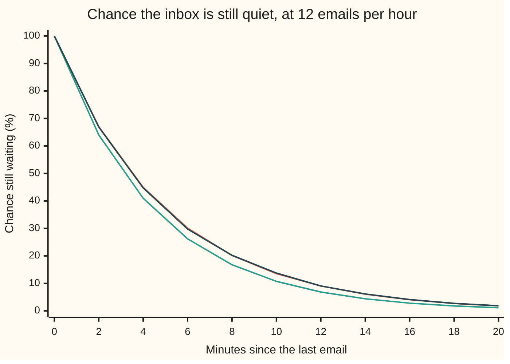
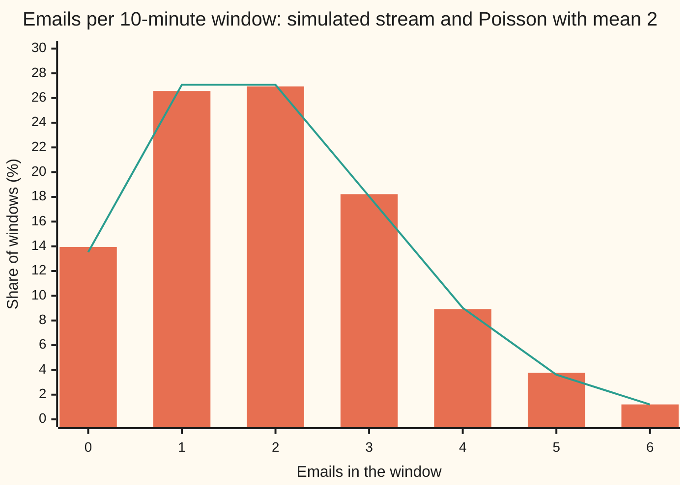

# Exponential: waiting times with no memory

[Syllabus](../../../SYLLABUS.md) → [Probability and statistics](../../../SYLLABUS.md#w09) → [Continuous Distributions](../../../SYLLABUS.md#w09-s04) → Exponential

---

## General Overview

A help desk receives emails at a steady 12 per hour, from customers who do not coordinate. No one can say when the next one lands. What can be said is how the wait is spread out: how often the inbox stays quiet for 10 minutes, how long a typical wait is, and whether a long silence means an email is due.

The answers: the average wait is 5 minutes. The inbox stays quiet for 10 minutes or more about 1 time in 7 (a chance of 0.1353). And a quiet spell changes nothing. After 10 silent minutes, the chance of 5 more is 0.3679, the same as for a desk that has just opened. The wait has no memory.

Both facts come from one assumption: a constant **hazard**. The hazard is the chance per minute of an email arriving now, given none yet; constant means it stays at 0.2 however long the inbox has been quiet. It forces one law for the wait, the **exponential distribution**. That law is the other face of the Poisson count: one asks how many emails land in a window, the other how long until the next.

**A constant chance per minute makes the chance of still waiting shrink by the same factor every minute, which gives the exponential law; that law is the only waiting law that forgets how long it has already waited.**

**What kind of fact this is:** a theorem, proved on this card in Why it works: constant hazard forces this law, and this law alone is memoryless. The law itself, once named, is a definition. Using it for real emails is a model, checked against data rather than proved.

### The picture: the chance of still waiting



Orange: the exponential law. Green: a rough version that checks for email once a minute, with a 0.2 chance each time; it sits below, and Why it works shows it closing in as the checks get finer. Dark blue: 24,000 simulated emails dropped at random moments, which never use the formula. Every 2 minutes the orange curve loses the same share of its height, about a third.

---

## The formula

Notation first. A capital $T$ is the wait itself, a random variable (a quantity whose value is settled by chance), measured in minutes. A lower-case $t$ is one particular number of minutes. $P(T > t)$ reads "the chance the wait is longer than $t$ minutes". The letter $\lambda$, read "lambda", is the rate. The number e, about 2.718, is the base of natural logarithms.

$$S(t) = P(T > t) = e^{-\lambda t}, \qquad F(t) = 1 - e^{-\lambda t}, \qquad f(t) = \lambda e^{-\lambda t}, \qquad t \ge 0$$

**Read it aloud:** the chance of still waiting after $t$ minutes is e to the minus rate times time; the density, which is how thickly the chance is packed near each moment, starts at the rate and falls away by the same factor.

Below zero the density is 0: no wait is negative.

The hazard, the chance per minute of an email right now given none yet, is the density divided by the chance of still waiting:

$$h(t) = \frac{f(t)}{S(t)} = \lambda$$

Memorylessness, for any two lengths of time $s$ and $t$:

$$P(T > s + t \mid T > s) = P(T > t)$$

The bar reads "given".

The average and spread:

$$E[T] = \frac{1}{\lambda}, \qquad \mathrm{Var}(T) = \frac{1}{\lambda^2}, \qquad \text{median} = \frac{\ln 2}{\lambda}$$

| Symbol | Plain meaning | In our example | Push it up and the answer… |
| --- | --- | --- | --- |
| $T$ | the wait until the next email, a random variable | unknown in advance | — |
| $t$, $s$ | fixed numbers of minutes | 10 and 5 | longer $t$: smaller chance of still waiting |
| $\lambda$ | the rate: emails per minute | 0.2 (12 per hour) | waits shorten; mean is $1/\lambda$ |
| $S(t)$ | survival: chance the wait is longer than $t$ | $S(10) = 0.1353$ | — |
| $F(t)$ | cumulative distribution: chance the wait is $t$ or less | $F(5) = 0.6321$ | — |
| $f(t)$ | density: chance per minute of the wait ending near $t$ | $f(0) = 0.2$ | — |
| $h(t)$ | hazard: chance per minute of an email now, given none yet | 0.2 at every $t$ | constant, which is the whole assumption |
| $\delta$, $n$ | slice width in minutes, and number of slices $t/\delta$ | 1 minute, 10 slices | finer slices: closer to $e^{-\lambda t}$ |
| $N(t)$ | count of emails in a window of $t$ minutes | Poisson with mean 2 for 10 minutes | — |
| $E[T]$ | average wait in the long run | 5 minutes | falls as $\lambda$ rises |
| $\mathrm{Var}(T)$ | variance: average squared distance from the mean | 25 square minutes; standard deviation 5 | falls as $\lambda$ rises |
| $G$, $q$, $k$, $m$ | in the proof only: any survival curve, its value at 1 minute, and whole numbers | $q = e^{-0.2}$ here | — |

### When it holds

- **A constant rate.** If the desk is busier at 9 a.m. than at 3 p.m., the hazard moves and a 10-minute gap at 9 a.m. is rarer than 0.1353 says.
- **Independent senders.** A reply-all chain brings emails in bursts: short gaps crowd together, long gaps grow, memorylessness fails.
- **One email at a time.** A nightly batch of 40 is one event, not 40; the gaps inside it are zero.
- **A rate above zero.** At rate 0 the email never comes and there is no law to speak of.
- **No deadline.** A customer certain to write within 10 minutes gives a wait that remembers; What breaks computes it.

---

## Why it works

### Step 0: the same chance in every slice of time

Cut time into short slices. Constant hazard means each slice has the same chance of holding the next email, whatever came before. Staying quiet for $t$ minutes is then a run of quiet slices, and chances of independent events multiply. Everything below is that product, taken to the limit; [Densities](01-densities-and-cdfs.md) then turns it into a density.

### Step 1: a quiet spell is a run of quiet slices

Take slices of $\delta$ minutes. The chance of an email in one slice is $\lambda \delta$, so the chance of none is $1 - \lambda\delta$. A wait of $t$ minutes is $n = t/\delta$ slices, and quiet in all of them has chance

$$S(t) \approx (1 - \lambda\delta)^{n} = \left(1 - \frac{\lambda t}{n}\right)^{n}.$$

With one-minute slices, $0.8^{10} = 0.107374$. With slices of 0.1, 0.01 and 0.001 minutes: 0.132620, 0.135065, 0.135308. They climb toward 0.135335, which is $e^{-2}$. The limit of $(1 - x/n)^n$ as $n$ grows is $e^{-x}$, the same limit that turns ever-more-frequent compounding into e ([Compounding more often, and the number e](../../01-Foundations/04-Compound%20Growth%20and%20Discounting/04-compounding-frequency-and-e.md)), here run downhill. So $S(t) = e^{-\lambda t}$.

### Step 2: the same limit as a rate equation

Quiet up to $t + \delta$ means quiet up to $t$, then quiet in one more slice: $S(t + \delta) = S(t)(1 - \lambda\delta)$. Rearrange and let the slice shrink:

$$\frac{S(t+\delta) - S(t)}{\delta} = -\lambda S(t) \quad\longrightarrow\quad S'(t) = -\lambda S(t), \qquad S(0) = 1.$$

The survival chance falls at a rate proportional to itself. That is the equation of radioactive decay ([Growth, decay and cooling](../../08-Differential%20equations%20and%20dynamics/01-Rate%20Equations/04-exponential-growth-decay-and-cooling.md)), and its only solution is $S(t) = e^{-\lambda t}$. Then $F(t) = 1 - e^{-\lambda t}$, and the density is its slope, $f(t) = \lambda e^{-\lambda t}$. Divide $f$ by $S$ and the hazard comes back as 0.2 at 0, 5 and 20 minutes: the assumption in, the assumption out.

### Step 3: memorylessness

Condition on 10 quiet minutes. The chance of 5 more is a ratio: lasting 15 minutes, out of lasting 10.

$$P(T > s+t \mid T > s) = \frac{e^{-\lambda (s+t)}}{e^{-\lambda s}} = e^{-\lambda t} = P(T > t).$$

The work is done by $e^{-\lambda(s+t)} = e^{-\lambda s} e^{-\lambda t}$: survival over a stretch is survival over its pieces, multiplied. At the desk, $0.0498 / 0.1353 = 0.3679 = P(T > 5)$.

The converse holds too: among waits taking any value from 0 upward, the exponential is the only memoryless law. "No memory" and "constant hazard" are one assumption.

<details>
<summary>Detailed proof: only the exponential law forgets</summary>

Write $G(t) = P(T > t)$. Memorylessness says $G(s + t) = G(s)\,G(t)$ for all $s, t \ge 0$. Let $q = G(1)$.

If $q = 1$, then $G(k) = q^k = 1$ for every whole number $k$: the email never comes. If $q = 0$, then $G(1/m)^m = G(1) = 0$ for every whole $m$, so $G(1/m) = 0$: the wait is 0 with certainty and has no density. Otherwise $0 < q < 1$.

For whole numbers $k$ and $m$, splitting $k/m$ into $k$ equal pieces gives $G(k/m) = G(1/m)^k$, and splitting 1 into $m$ pieces gives $G(1/m) = q^{1/m}$. So $G(r) = q^r$ for every fraction $r \ge 0$.

$G$ never rises: a longer wait is never more likely. Any $t$ sits between fractions $r_1 < t < r_2$ as close to $t$ as wanted, so $q^{r_2} \le G(t) \le q^{r_1}$, and both ends close on $q^t$. Hence $G(t) = q^t = e^{-\lambda t}$ with $\lambda = -\ln q > 0$.

</details>

### Step 4: the mean, the spread and the median

The average wait weights each wait by its density and adds, which here is an integral running to infinity ([Improper integrals](../../06-Calculus%20and%20analysis/04-Integrals/07-improper-integrals.md)). Integration by parts gives $E[T] = 1/\lambda = 5$ minutes and $E[T^2] = 2/\lambda^2 = 50$, so $\mathrm{Var}(T) = 50 - 25 = 25$ square minutes and the standard deviation is 5 minutes, equal to the mean.

<details>
<summary>Detailed proof: the mean and variance by parts</summary>

By parts ([Integration by parts](../../06-Calculus%20and%20analysis/04-Integrals/04-integration-by-parts.md)), with the boundary term $t e^{-\lambda t}$ vanishing at both ends:
$$E[T] = \int_0^\infty t\,\lambda e^{-\lambda t}\,dt = \Big[-t e^{-\lambda t}\Big]_0^\infty + \int_0^\infty e^{-\lambda t}\,dt = \frac{1}{\lambda}.$$
Once more, with $t^2$: $E[T^2] = 0 + \int_0^\infty 2t\,e^{-\lambda t}\,dt = \frac{2}{\lambda} E[T] = \frac{2}{\lambda^2}$. Then $\mathrm{Var}(T) = E[T^2] - E[T]^2 = \frac{1}{\lambda^2}$.

</details>

The median solves $e^{-\lambda t} = 1/2$, so it is $\ln 2 / \lambda = 3.4657$ minutes. Half of all waits are shorter than that, below the 5-minute mean: the rare long gaps pull the average right. In general the wait that a share $u$ of waits fall below solves $1 - e^{-\lambda t} = u$, so it is $-\ln(1-u)/\lambda$; at $u = 0.9$ that is 11.5129 minutes.

### Step 5: the Poisson count is the same event

The inbox is quiet for 10 minutes exactly when no email lands in those 10 minutes: $T > t$ is the event $N(t) = 0$. At 0.2 per minute the 10-minute count is Poisson with mean 2 ([Poisson](../03-Discrete%20Distributions/04-poisson.md)), whose chance of zero is $e^{-2} = 0.1353$, the survival chance again. One mechanism, read two ways: count the emails in a window, or time the gap.

The full statement, independent Poisson counts in separate windows exactly when gaps are independent exponentials, needs a process and is proved on [Poisson process](../../11-Stochastic%20processes%20and%20calculus/04-Poisson%20and%20Jump%20Processes/01-poisson-process.md).

---

## Worked numbers, by hand

| Step | Arithmetic | Value |
| --- | --- | --- |
| rate | 12 per hour ÷ 60 | 0.2 per minute |
| mean wait | 1 ÷ 0.2 | 5 minutes |
| median wait | ln 2 ÷ 0.2 | 3.4657 minutes |
| an email within 1 minute | 1 − e^(−0.2) | 0.1813 |
| quiet for 5 minutes | e^(−1) | 0.3679 |
| quiet for 10 minutes | e^(−2) | 0.1353 |
| quiet for 15 minutes | e^(−3) | 0.0498 |
| 5 more, after 10 quiet | 0.0498 ÷ 0.1353 | **0.3679** |

After 10 silent minutes, the chance of 5 more is 0.3679, the same as from a fresh start: the silence has not brought the next email closer.

### What breaks if you drop a piece

| Mistake | Comes out at | What went wrong |
| --- | --- | --- |
| Rate 12 per hour read as a 12-minute mean wait | P(T > 10) = 0.4346, not 0.1353 | The mean is one over the rate: 5 minutes |
| Forgetting the condition after 10 quiet minutes | 0.0498, not 0.3679 | That is the chance from the start, not from now |
| Mean read as the middle | 0.6321 of waits under 5 minutes, not half | The median is 3.4657; long gaps drag the mean right |
| A sender certain to write within 10 minutes, at a random moment | P(T > 7 given T > 5) = 0.6, fresh P(T > 2) = 0.8 | The hazard rises toward the deadline, so waiting does bring the email closer |

The last row is the hypothesis dropped: a uniform wait (equally likely anywhere in 10 minutes, see [Uniform](02-uniform-distribution.md)) has a climbing hazard, and memorylessness fails. The code prints all four.

---

## Code, from first principles, and it actually runs

The scripts reach the same answers by four roads. The closed form $e^{-\lambda t}$. The slice product of Step 1, with slices shrinking from 1 minute to 0.001. Simpson's rule (an integrator written out in the script) for the total area, the mean, the variance and the 10-minute tail. And a simulation that never uses the exponential formula: 24,000 emails dropped at independent random moments across 120,000 minutes, from a SplitMix64 generator with seed 2026, sorted, and read two ways, as gaps and as counts in 12,000 windows of 10 minutes. Simulated numbers carry a standard error (se), and the asserts allow four of them.

### Python

```python
# Exponential waiting times -- the check behind the card.  Nothing is imported.
# Help desk: emails arrive at a steady 12 per hour, rate LAM = 0.2 per minute.
# Roads: the closed form exp(-LAM t); thin time slices with chance LAM*d each;
# Simpson integration of the density; and a seeded stream of emails dropped at
# random moments, whose gaps and window counts never use the exponential formula.
from math import exp, log, sqrt
LAM, M64 = 0.2, (1 << 64) - 1

def surv(t):                          # road one: chance of no email for t minutes
    return exp(-LAM * t)

def dens(t):
    return LAM * exp(-LAM * t)

def slices(t, d):                     # road two: t/d slices, chance LAM*d in each
    return (1.0 - LAM * d) ** round(t / d)

def simpson(g, a, b, n):              # road three: area under g from a to b
    w = (b - a) / n
    total = g(a) + g(b)
    for j in range(1, n):
        total += (4.0 if j % 2 == 1 else 2.0) * g(a + j * w)
    return total * w / 3.0

class SplitMix64:                     # road four: the same random numbers in both languages
    def __init__(self, seed):
        self.s = seed
    def uniform(self):
        self.s = (self.s + 0x9E3779B97F4A7C15) & M64
        z = self.s
        z = ((z ^ (z >> 30)) * 0xBF58476D1CE4E5B9) & M64
        z = ((z ^ (z >> 27)) * 0x94D049BB133111EB) & M64
        return ((z ^ (z >> 31)) >> 11) / 9007199254740992.0

def frac_se(hits, n):                 # a simulated fraction and its standard error
    p = hits / n
    return p, sqrt(p * (1.0 - p) / n)

def mean_se(xs):
    m = sum(xs) / len(xs)
    v = sum((x - m) ** 2 for x in xs) / (len(xs) - 1)
    return m, sqrt(v / len(xs))

print(f"rate {LAM} emails per minute = {LAM * 60:.0f} per hour")
print(f"mean wait 1/rate = {1 / LAM:.4f} min; median ln2/rate = {log(2) / LAM:.4f} min")
print(f"wait with 0.9 of waits below: -ln(0.1)/rate = {-log(0.1) / LAM:.4f} min")
print(f"P(T > 5) = {surv(5):.4f}; P(T > 10) = {surv(10):.4f}; P(T > 15) = {surv(15):.4f}")
print(f"P(T <= 1) = {1 - surv(1):.4f}; P(T <= 5) = {1 - surv(5):.4f}")
print(f"memoryless: P(T > 15 | T > 10) = {surv(15) / surv(10):.4f} = P(T > 5) = {surv(5):.4f}")
print(f"hazard f(t)/S(t) at t = 0, 5, 20: {dens(0) / surv(0):.4f}, {dens(5) / surv(5):.4f}, {dens(20) / surv(20):.4f}")
for d in (1.0, 0.1, 0.01, 0.001):
    print(f"slices of {d} min: P(no email in 10 min) = {slices(10, d):.6f}")
print(f"closed form exp(-2)                  = {surv(10):.6f}")
mass = simpson(dens, 0.0, 200.0, 20000)
mean = simpson(lambda t: t * dens(t), 0.0, 200.0, 20000)
sq = simpson(lambda t: t * t * dens(t), 0.0, 200.0, 20000)
upto10 = simpson(dens, 0.0, 10.0, 2000)
print(f"Simpson: total area {mass:.8f}; mean {mean:.8f}; E[T^2] {sq:.8f}; variance {sq - mean * mean:.8f}")
print(f"Simpson: standard deviation {sqrt(sq - mean * mean):.4f} min")
print(f"Simpson: 1 - area up to 10 min = {1 - upto10:.8f}")
poisson0 = exp(-LAM * 10)             # Poisson count with mean 2: chance of zero
pmf = [poisson0]
for k in range(1, 7):
    pmf.append(pmf[-1] * (LAM * 10) / k)
print(f"Poisson(2): P(N = 0) = {poisson0:.4f}, the same event as T > 10")

rng = SplitMix64(2026)
K, SPAN = 24000, 120000.0             # 24,000 emails at random moments in 120,000 minutes
times = sorted(SPAN * rng.uniform() for _ in range(K))
gaps = [times[0]] + [times[i] - times[i - 1] for i in range(1, K)]
m, se = mean_se(gaps)
print(f"simulated, seed 2026: {K} emails over {SPAN:.0f} minutes, {K / SPAN} per minute")
print(f"simulated: mean gap {m:.4f} (se {se:.4f})")
p10, se10 = frac_se(sum(g > 10 for g in gaps), K)
print(f"simulated: P(gap > 10) = {p10:.4f} (se {se10:.4f})")
long = [g for g in gaps if g > 10]
pc, sec = frac_se(sum(g > 15 for g in long), len(long))
rest, serest = mean_se([g - 10 for g in long])
print(f"simulated: {len(long)} gaps passed 10 min; of those, P(> 15) = {pc:.4f} (se {sec:.4f})")
print(f"simulated: mean wait still to come after 10 quiet minutes = {rest:.4f} (se {serest:.4f})")
counts = [0] * 12000                  # emails in each 10-minute window
for x in times:
    counts[int(x / 10)] += 1
hist = [sum(c == k for c in counts) / 12000 for k in range(7)]
print(f"windows: {len(counts)} of 10 minutes each")
print("window counts k:       " + " ".join(f"{k:6d}" for k in range(7)))
print("Poisson(2) percent:    " + " ".join(f"{100 * p:6.2f}" for p in pmf))
print("simulated percent:     " + " ".join(f"{100 * h:6.2f}" for h in hist))
grid = list(range(0, 21, 2))
print("figure, minutes:       " + ", ".join(str(t) for t in grid))
print("figure, exact %:       " + ", ".join(f"{100 * surv(t):.2f}" for t in grid))
print("figure, slices %:      " + ", ".join(f"{100 * slices(t, 1.0):.2f}" for t in grid))
print("figure, simulated %:   " + ", ".join(f"{100 * sum(g > t for g in gaps) / K:.2f}" for t in grid))
print(f"mistake, rate read as a 12-minute mean wait: P(T > 10) = {exp(-10 / 12):.4f}")
print(f"mistake, forgetting the condition: P(T > 15) = {surv(15):.4f}, not {surv(5):.4f}")
print(f"mistake, mean read as median: P(T <= 5) = {1 - surv(5):.4f}, not 0.5")
u, fresh = (10.0 - 7.0) / (10.0 - 5.0), (10.0 - 2.0) / 10.0     # a sender who always writes within 10 min
print(f"with memory, uniform wait up to 10 min: P(T > 7 | T > 5) = {u:.4f}, fresh P(T > 2) = {fresh:.4f}")
assert abs(mass - 1.0) < 1e-9 and abs(mean - 1 / LAM) < 1e-8     # integration vs algebra
assert abs(sq - mean * mean - 1 / LAM ** 2) < 1e-6
assert abs((1 - upto10) - poisson0) < 1e-10                      # integral vs Poisson zero term
assert abs(slices(10, 0.001) - surv(10)) < 1e-4 < abs(slices(10, 1.0) - surv(10))
assert abs(p10 - surv(10)) < 4 * se10 and abs(pc - surv(5)) < 4 * sec   # simulation vs formula
assert abs(m - 1 / LAM) < 4 * se and abs(rest - 1 / LAM) < 4 * serest
assert all(abs(hist[k] - pmf[k]) < 4 * sqrt(pmf[k] * (1 - pmf[k]) / 12000) for k in range(7))
print("ALL CHECKS PASS")
```

**Ran 2026-09-28 on macOS, Python 3.14.6, standard library only. All checks passed. Output, pasted from the run:**

```
rate 0.2 emails per minute = 12 per hour
mean wait 1/rate = 5.0000 min; median ln2/rate = 3.4657 min
wait with 0.9 of waits below: -ln(0.1)/rate = 11.5129 min
P(T > 5) = 0.3679; P(T > 10) = 0.1353; P(T > 15) = 0.0498
P(T <= 1) = 0.1813; P(T <= 5) = 0.6321
memoryless: P(T > 15 | T > 10) = 0.3679 = P(T > 5) = 0.3679
hazard f(t)/S(t) at t = 0, 5, 20: 0.2000, 0.2000, 0.2000
slices of 1.0 min: P(no email in 10 min) = 0.107374
slices of 0.1 min: P(no email in 10 min) = 0.132620
slices of 0.01 min: P(no email in 10 min) = 0.135065
slices of 0.001 min: P(no email in 10 min) = 0.135308
closed form exp(-2)                  = 0.135335
Simpson: total area 1.00000000; mean 5.00000000; E[T^2] 50.00000000; variance 25.00000000
Simpson: standard deviation 5.0000 min
Simpson: 1 - area up to 10 min = 0.13533528
Poisson(2): P(N = 0) = 0.1353, the same event as T > 10
simulated, seed 2026: 24000 emails over 120000 minutes, 0.2 per minute
simulated: mean gap 4.9999 (se 0.0325)
simulated: P(gap > 10) = 0.1375 (se 0.0022)
simulated: 3301 gaps passed 10 min; of those, P(> 15) = 0.3735 (se 0.0084)
simulated: mean wait still to come after 10 quiet minutes = 4.9845 (se 0.0894)
windows: 12000 of 10 minutes each
window counts k:            0      1      2      3      4      5      6
Poisson(2) percent:     13.53  27.07  27.07  18.04   9.02   3.61   1.20
simulated percent:      13.95  26.57  26.93  18.22   8.92   3.77   1.21
figure, minutes:       0, 2, 4, 6, 8, 10, 12, 14, 16, 18, 20
figure, exact %:       100.00, 67.03, 44.93, 30.12, 20.19, 13.53, 9.07, 6.08, 4.08, 2.73, 1.83
figure, slices %:      100.00, 64.00, 40.96, 26.21, 16.78, 10.74, 6.87, 4.40, 2.81, 1.80, 1.15
figure, simulated %:   100.00, 66.88, 44.73, 29.79, 20.22, 13.75, 9.07, 6.16, 4.12, 2.72, 1.88
mistake, rate read as a 12-minute mean wait: P(T > 10) = 0.4346
mistake, forgetting the condition: P(T > 15) = 0.0498, not 0.3679
mistake, mean read as median: P(T <= 5) = 0.6321, not 0.5
with memory, uniform wait up to 10 min: P(T > 7 | T > 5) = 0.6000, fresh P(T > 2) = 0.8000
ALL CHECKS PASS
```

### Rust

```rust
// Exponential waiting times -- the check behind the card, std only.
// Help desk: emails arrive at a steady 12 per hour, rate LAM = 0.2 per minute.
// Roads: the closed form exp(-LAM t); thin time slices with chance LAM*d each;
// Simpson integration of the density; and a seeded stream of emails dropped at
// random moments, whose gaps and window counts never use the exponential formula.
const LAM: f64 = 0.2;

fn surv(t: f64) -> f64 { (-LAM * t).exp() }            // road one
fn dens(t: f64) -> f64 { LAM * (-LAM * t).exp() }
fn slices(t: f64, d: f64) -> f64 {                     // road two: t/d slices, chance LAM*d each
    (1.0 - LAM * d).powf((t / d).round())
}
fn simpson<G: Fn(f64) -> f64>(g: G, a: f64, b: f64, n: usize) -> f64 {   // road three
    let w = (b - a) / n as f64;
    let mut total = g(a) + g(b);
    for j in 1..n {
        total += (if j % 2 == 1 { 4.0 } else { 2.0 }) * g(a + j as f64 * w);
    }
    total * w / 3.0
}
struct SplitMix64 { s: u64 }                            // road four: same numbers as Python
impl SplitMix64 {
    fn uniform(&mut self) -> f64 {
        self.s = self.s.wrapping_add(0x9E3779B97F4A7C15);
        let mut z = self.s;
        z = (z ^ (z >> 30)).wrapping_mul(0xBF58476D1CE4E5B9);
        z = (z ^ (z >> 27)).wrapping_mul(0x94D049BB133111EB);
        ((z ^ (z >> 31)) >> 11) as f64 / 9007199254740992.0
    }
}
fn frac_se(hits: usize, n: usize) -> (f64, f64) {
    let p = hits as f64 / n as f64;
    (p, (p * (1.0 - p) / n as f64).sqrt())
}
fn mean_se(xs: &[f64]) -> (f64, f64) {
    let n = xs.len() as f64;
    let m = xs.iter().sum::<f64>() / n;
    let v = xs.iter().map(|x| (x - m) * (x - m)).sum::<f64>() / (n - 1.0);
    (m, (v / n).sqrt())
}
fn join(v: &[f64]) -> String { v.iter().map(|x| format!("{:.2}", x)).collect::<Vec<_>>().join(", ") }

fn main() {
    println!("rate {} emails per minute = {:.0} per hour", LAM, LAM * 60.0);
    println!("mean wait 1/rate = {:.4} min; median ln2/rate = {:.4} min", 1.0 / LAM, 2f64.ln() / LAM);
    println!("wait with 0.9 of waits below: -ln(0.1)/rate = {:.4} min", -(0.1f64).ln() / LAM);
    println!("P(T > 5) = {:.4}; P(T > 10) = {:.4}; P(T > 15) = {:.4}", surv(5.0), surv(10.0), surv(15.0));
    println!("P(T <= 1) = {:.4}; P(T <= 5) = {:.4}", 1.0 - surv(1.0), 1.0 - surv(5.0));
    println!("memoryless: P(T > 15 | T > 10) = {:.4} = P(T > 5) = {:.4}", surv(15.0) / surv(10.0), surv(5.0));
    println!("hazard f(t)/S(t) at t = 0, 5, 20: {:.4}, {:.4}, {:.4}",
             dens(0.0) / surv(0.0), dens(5.0) / surv(5.0), dens(20.0) / surv(20.0));
    for d in [1.0f64, 0.1, 0.01, 0.001] {
        println!("slices of {:?} min: P(no email in 10 min) = {:.6}", d, slices(10.0, d));
    }
    println!("closed form exp(-2)                  = {:.6}", surv(10.0));
    let mass = simpson(dens, 0.0, 200.0, 20000);
    let mean = simpson(|t| t * dens(t), 0.0, 200.0, 20000);
    let sq = simpson(|t| t * t * dens(t), 0.0, 200.0, 20000);
    let upto10 = simpson(dens, 0.0, 10.0, 2000);
    println!("Simpson: total area {:.8}; mean {:.8}; E[T^2] {:.8}; variance {:.8}", mass, mean, sq, sq - mean * mean);
    println!("Simpson: standard deviation {:.4} min", (sq - mean * mean).sqrt());
    println!("Simpson: 1 - area up to 10 min = {:.8}", 1.0 - upto10);
    let poisson0 = (-LAM * 10.0).exp();                 // Poisson count with mean 2: chance of zero
    let mut pmf = vec![poisson0];
    for k in 1..7 { let last = pmf[k - 1]; pmf.push(last * (LAM * 10.0) / k as f64); }
    println!("Poisson(2): P(N = 0) = {:.4}, the same event as T > 10", poisson0);

    let mut rng = SplitMix64 { s: 2026 };
    let (k_n, span) = (24000usize, 120000.0f64);        // 24,000 emails at random moments
    let mut times: Vec<f64> = (0..k_n).map(|_| span * rng.uniform()).collect();
    times.sort_by(|a, b| a.partial_cmp(b).unwrap());
    let mut gaps = vec![times[0]];
    for i in 1..k_n { gaps.push(times[i] - times[i - 1]); }
    let (m, se) = mean_se(&gaps);
    println!("simulated, seed 2026: {} emails over {:.0} minutes, {} per minute", k_n, span, k_n as f64 / span);
    println!("simulated: mean gap {:.4} (se {:.4})", m, se);
    let (p10, se10) = frac_se(gaps.iter().filter(|&&g| g > 10.0).count(), k_n);
    println!("simulated: P(gap > 10) = {:.4} (se {:.4})", p10, se10);
    let long: Vec<f64> = gaps.iter().cloned().filter(|&g| g > 10.0).collect();
    let (pc, sec) = frac_se(long.iter().filter(|&&g| g > 15.0).count(), long.len());
    let rests: Vec<f64> = long.iter().map(|g| g - 10.0).collect();
    let (rest, serest) = mean_se(&rests);
    println!("simulated: {} gaps passed 10 min; of those, P(> 15) = {:.4} (se {:.4})", long.len(), pc, sec);
    println!("simulated: mean wait still to come after 10 quiet minutes = {:.4} (se {:.4})", rest, serest);
    let mut counts = vec![0usize; 12000];               // emails in each 10-minute window
    for &x in &times { counts[(x / 10.0) as usize] += 1; }
    let hist: Vec<f64> = (0..7).map(|k| counts.iter().filter(|&&c| c == k).count() as f64 / 12000.0).collect();
    println!("windows: {} of 10 minutes each", counts.len());
    let ks: Vec<String> = (0..7).map(|k| format!("{:6}", k)).collect();
    println!("window counts k:       {}", ks.join(" "));
    let row = |v: &[f64]| v.iter().map(|p| format!("{:6.2}", 100.0 * p)).collect::<Vec<_>>().join(" ");
    println!("Poisson(2) percent:    {}", row(&pmf));
    println!("simulated percent:     {}", row(&hist));
    let grid: Vec<f64> = (0..11).map(|i| 2.0 * i as f64).collect();
    let gs: Vec<String> = grid.iter().map(|t| format!("{}", t)).collect();
    println!("figure, minutes:       {}", gs.join(", "));
    println!("figure, exact %:       {}", join(&grid.iter().map(|&t| 100.0 * surv(t)).collect::<Vec<_>>()));
    println!("figure, slices %:      {}", join(&grid.iter().map(|&t| 100.0 * slices(t, 1.0)).collect::<Vec<_>>()));
    let simp: Vec<f64> = grid.iter().map(|&t| 100.0 * gaps.iter().filter(|&&g| g > t).count() as f64 / k_n as f64).collect();
    println!("figure, simulated %:   {}", join(&simp));
    println!("mistake, rate read as a 12-minute mean wait: P(T > 10) = {:.4}", (-10.0f64 / 12.0).exp());
    println!("mistake, forgetting the condition: P(T > 15) = {:.4}, not {:.4}", surv(15.0), surv(5.0));
    println!("mistake, mean read as median: P(T <= 5) = {:.4}, not 0.5", 1.0 - surv(5.0));
    let (u, fresh) = ((10.0 - 7.0) / (10.0 - 5.0), (10.0 - 2.0) / 10.0);   // a sender who always writes within 10 min
    println!("with memory, uniform wait up to 10 min: P(T > 7 | T > 5) = {:.4}, fresh P(T > 2) = {:.4}", u, fresh);
    assert!((mass - 1.0).abs() < 1e-9 && (mean - 1.0 / LAM).abs() < 1e-8);   // integration vs algebra
    assert!((sq - mean * mean - 1.0 / (LAM * LAM)).abs() < 1e-6);
    assert!(((1.0 - upto10) - poisson0).abs() < 1e-10);                     // integral vs Poisson zero term
    assert!((slices(10.0, 0.001) - surv(10.0)).abs() < 1e-4 && 1e-4 < (slices(10.0, 1.0) - surv(10.0)).abs());
    assert!((p10 - surv(10.0)).abs() < 4.0 * se10 && (pc - surv(5.0)).abs() < 4.0 * sec);   // simulation vs formula
    assert!((m - 1.0 / LAM).abs() < 4.0 * se && (rest - 1.0 / LAM).abs() < 4.0 * serest);
    assert!((0..7).all(|k| (hist[k] - pmf[k]).abs() < 4.0 * (pmf[k] * (1.0 - pmf[k]) / 12000.0).sqrt()));
    println!("ALL CHECKS PASS");
}
```

**Ran 2026-09-28 on macOS, rustc 1.98.1, no crates. All checks passed. Output, pasted from the run:**

```
rate 0.2 emails per minute = 12 per hour
mean wait 1/rate = 5.0000 min; median ln2/rate = 3.4657 min
wait with 0.9 of waits below: -ln(0.1)/rate = 11.5129 min
P(T > 5) = 0.3679; P(T > 10) = 0.1353; P(T > 15) = 0.0498
P(T <= 1) = 0.1813; P(T <= 5) = 0.6321
memoryless: P(T > 15 | T > 10) = 0.3679 = P(T > 5) = 0.3679
hazard f(t)/S(t) at t = 0, 5, 20: 0.2000, 0.2000, 0.2000
slices of 1.0 min: P(no email in 10 min) = 0.107374
slices of 0.1 min: P(no email in 10 min) = 0.132620
slices of 0.01 min: P(no email in 10 min) = 0.135065
slices of 0.001 min: P(no email in 10 min) = 0.135308
closed form exp(-2)                  = 0.135335
Simpson: total area 1.00000000; mean 5.00000000; E[T^2] 50.00000000; variance 25.00000000
Simpson: standard deviation 5.0000 min
Simpson: 1 - area up to 10 min = 0.13533528
Poisson(2): P(N = 0) = 0.1353, the same event as T > 10
simulated, seed 2026: 24000 emails over 120000 minutes, 0.2 per minute
simulated: mean gap 4.9999 (se 0.0325)
simulated: P(gap > 10) = 0.1375 (se 0.0022)
simulated: 3301 gaps passed 10 min; of those, P(> 15) = 0.3735 (se 0.0084)
simulated: mean wait still to come after 10 quiet minutes = 4.9845 (se 0.0894)
windows: 12000 of 10 minutes each
window counts k:            0      1      2      3      4      5      6
Poisson(2) percent:     13.53  27.07  27.07  18.04   9.02   3.61   1.20
simulated percent:      13.95  26.57  26.93  18.22   8.92   3.77   1.21
figure, minutes:       0, 2, 4, 6, 8, 10, 12, 14, 16, 18, 20
figure, exact %:       100.00, 67.03, 44.93, 30.12, 20.19, 13.53, 9.07, 6.08, 4.08, 2.73, 1.83
figure, slices %:      100.00, 64.00, 40.96, 26.21, 16.78, 10.74, 6.87, 4.40, 2.81, 1.80, 1.15
figure, simulated %:   100.00, 66.88, 44.73, 29.79, 20.22, 13.75, 9.07, 6.16, 4.12, 2.72, 1.88
mistake, rate read as a 12-minute mean wait: P(T > 10) = 0.4346
mistake, forgetting the condition: P(T > 15) = 0.0498, not 0.3679
mistake, mean read as median: P(T <= 5) = 0.6321, not 0.5
with memory, uniform wait up to 10 min: P(T > 7 | T > 5) = 0.6000, fresh P(T > 2) = 0.8000
ALL CHECKS PASS
```

The two outputs match line for line: the same generator gives both languages the same 24,000 emails.

The simulated share of gaps over 10 minutes, 0.1375 (se 0.0022), sits about one standard error from 0.1353. Of the 3301 gaps that passed 10 minutes, 0.3735 (se 0.0084) went past 15, against 0.3679 from a fresh start; their mean wait still to come was 4.9845 (se 0.0894), against 5.



Bars: the 12,000 simulated windows. Line: the Poisson law with mean 2. The first bar is the chance of a 10-minute quiet spell, counted instead of timed.

> [!TIP]
> **Try changing**
> Guess first, then run it. The edits below name the Python script.
> - **Another seed.** Replace `2026` with `7` in the generator. Every simulated number moves by about one standard error; all checks still pass.
> - **Finer slices.** Add `0.0001` to the list of slice widths. The new row lands at 0.135333, two millionths short of 0.135335: the gap shrinks about tenfold with each tenfold finer slice.
> - **Half as many emails.** Set `K` to `12000`. The rate halves, the mean gap roughly doubles to about 10 minutes, and the simulation asserts stop the run, since the formula still says 0.2 per minute.
> - **A rush hour.** Replace `SPAN * rng.uniform()` with `SPAN * rng.uniform() ** 1.5`, which crowds emails toward the start. The rate is no longer constant, the gaps stop being exponential, and an assert stops the run.

---

## The usual mistake

> [!warning]
> **Believing a long silence makes the next email due.** Under constant hazard, 10 quiet minutes leave the chance of 5 more at 0.3679 and the expected wait still to come at 5 minutes, exactly as at the start. Where waiting does bring the event closer, as with a deadline or a part that wears out, the hazard is rising and the law is not exponential.
>
> - **Rate for mean.** Reading 12 per hour as a 12-minute wait gives 0.4346 for a 10-minute silence, not 0.1353.
> - **Mean as middle.** 0.6321 of waits are under the 5-minute mean; the median is 3.4657 minutes.
> - **Forgetting to condition.** 0.0498 is the chance of 15 silent minutes from the start; after 10 quiet minutes it is 0.3679.
> - **Memoryless waits in a bursty stream.** One exponential gap says nothing about the next unless the gaps are independent; reply-all chains break that.

---

## Where you meet it in real life

- **Queues and call centres.** Staffing formulas take gaps between calls as exponential, with the rate re-estimated hour by hour.
- **Radioactive decay.** An atom has a constant chance per second of decaying, so its lifetime is exponential and its half-life is the median, $\ln 2 / \lambda$.
- **Reliability.** Electronic parts past their early failures and before wear-out fail at a roughly constant rate; a rising rate needs [Weibull and hazards](09-weibull-and-hazard-rates.md).
- **Credit risk.** A firm's time to default is modelled with a hazard rate, and at a constant hazard the survival chance is $e^{-\lambda t}$; finance builds on it in [The hazard rate](../../12-Financial%20mathematics/41-Default%2C%20Survival%20and%20the%20Hazard%20Rate/02-hazard-rate-and-survival-probability.md).

> **Say it back**
> If the chance of an email in the next moment never changes, the chance of still waiting shrinks by the same factor every minute, which is $e^{-\lambda t}$. At 12 emails per hour the mean wait is 5 minutes, the median 3.4657, and 10 quiet minutes happen about 1 time in 7. After any quiet spell the wait still to come has the same law as a fresh one, and no other waiting law does that. Timing the gap and counting emails in a window are the same mechanism: no email in 10 minutes has the Poisson chance of zero, 0.1353.

---

## What this builds on

- [Densities](01-densities-and-cdfs.md): the density $f$, the cumulative distribution $F$, and why the density is the slope of $F$.
- [Poisson](../03-Discrete%20Distributions/04-poisson.md): the count of rare independent events, whose chance of zero is the survival chance here.

## Where this goes next

- [Gamma and beta](07-gamma-and-beta-distributions.md): the wait for the third email, not the first, is a sum of three exponential gaps, and has the gamma law.
- [Weibull and hazards](09-weibull-and-hazard-rates.md): hazards that rise or fall with time, for parts that wear out or settle in.
- [Poisson process](../../11-Stochastic%20processes%20and%20calculus/04-Poisson%20and%20Jump%20Processes/01-poisson-process.md): a whole stream of independent exponential gaps, and the proof that its window counts are independent Poisson.
- [The hazard rate](../../12-Financial%20mathematics/41-Default%2C%20Survival%20and%20the%20Hazard%20Rate/02-hazard-rate-and-survival-probability.md): the same survival curve priced into bonds, with the hazard read from market spreads.

This card fixes the hazard; the question it leaves is what the wait looks like when the hazard moves with time, and the Weibull card answers it.

## Sources

Verified 2026-09-28: every link below resolves to the publisher's page.

- Kyle Siegrist, [The Exponential Distribution](https://www.randomservices.org/random/poisson/Exponential.html), Random Services. Free. The density, the memoryless property, constant failure rate, and the link to the Poisson process.
- William Feller, [An Introduction to Probability Theory and Its Applications, Volume 2, 2nd edition](https://www.wiley.com/en-us/An+Introduction+to+Probability+Theory+and+Its+Applications%2C+Volume+2%2C+2nd+Edition-p-9780471257097), Wiley, 1971. Chapter I: the exponential density, and why among continuous waits it alone lacks memory.
- Rick Durrett, [Probability: Theory and Examples, 5th edition](https://doi.org/10.1017/9781108591034), Cambridge University Press, 2019. Exponential waiting times inside the Poisson process, with the lack-of-memory property, at the rigour wing 10 supplies.
