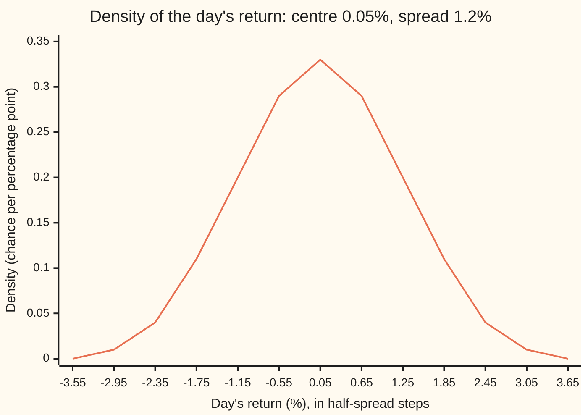

# Normal: the bell curve, its two parameters and the 68-95-99.7 rule

Probability and statistics → Continuous Distributions → Standardising the bell → Normal

---

## General Overview

A share moves every trading day. Over a few years its daily returns, the percentage change from one close to the next, pile up into a familiar shape. Most days sit near zero. Big moves are rare, and big falls about as rare as big rises. The pile is a bell.

Take a share whose average day gains 0.05 percent and whose typical day strays 1.2 percent from that average. The 1.2 percent is the spread. A day more than two spreads from the average, a move bigger than about 2.4 percent either way, comes round roughly one day in 20. That is 11 or 12 days in a year of 252 trading days. A day more than three spreads out is rarer still: about 0.3 percent of days, fewer than one a year.

The bell with exactly these proportions is the **normal distribution** (also called the Gaussian, after Gauss). Two numbers fix it completely: where its centre sits and how wide it spreads. Every question about it reduces to one question about a single standard bell, answered by one table or one short program.

**Subtract the centre, divide by the spread, and every normal question becomes an area under one standard bell: 68.3 percent within one spread, 95.4 within two, 99.7 within three.**

**What kind of fact this is:** a definition of a family of laws; the standardising rule is a theorem proved in Why it works, and the 68-95-99.7 figures are computed from it; using it for a share's returns is a model, and its tails are where the model fails.

### The picture: the bell of daily returns



The one line is the bell's height, to two decimals, at every half spread from −3 spreads to +3; its peak is 0.332452 per percentage point. Area under it between two returns is the chance of a day landing between them. The ticks at −2.35 and 2.45 mark two spreads out; the area outside them is 0.0455.

---

## The formula

Notation first, in words. The capital letter $X$ is the day's return, a random variable, and a lower-case $x$ is one value it could take. The Greek letter $\mu$ (mu) is the centre and $\sigma$ (sigma) is the spread; $\sigma^2$, the spread squared, is the variance. Writing X ~ N(μ, σ^2) means "X follows the normal law with centre μ and variance σ^2"; the second slot holds the variance, not the spread. A reminder from [densities-and-cdfs](01-densities-and-cdfs.md): a density $f$ gives chance per unit as a height, and the cumulative distribution $F$ gives the total chance at or below a value.

$$f(x) = \frac{1}{\sigma\sqrt{2\pi}}\; e^{-(x-\mu)^2/(2\sigma^2)}$$

**Read it aloud:** the height of the bell at a return x falls off with the square of its distance from the centre, measured in spreads, and the constant in front makes the total area exactly 1.

The standard normal is the case μ = 0, σ = 1. Its variable is written $Z$, its values $z$. Its density is written $\varphi$ (lower-case phi) and its cumulative area $\Phi$ (capital phi):

$$\varphi(z) = \frac{1}{\sqrt{2\pi}}\,e^{-z^2/2}, \qquad \Phi(z) = P(Z \le z) = \int_{-\infty}^{z} \varphi(t)\,dt$$

The finance wing writes the same area N(z); it is the same function. The working rule of the card is standardising:

$$P(X \le x) = \Phi\!\left(\frac{x-\mu}{\sigma}\right), \qquad \Phi(-z) = 1 - \Phi(z)$$

**Read it aloud:** to find the chance of a day at or below x, count how many spreads x sits from the centre, and read the standard bell's area to the left of that count.

The 68-95-99.7 rule is the case of a band $k$ spreads wide on each side: the chance of landing inside is 2Φ(k) − 1.

| Symbol | Plain meaning | In our example | Push it up and the answer… |
| --- | --- | --- | --- |
| $X$, $x$ | the day's return, and one value of it | a loss of 2%, x = −2 | larger x: more area to its left |
| $\mu$ | the centre: the average day, E[X] | 0.05% | the whole bell slides right |
| $\sigma$ | the spread: the standard deviation | 1.2% | the bell widens and flattens |
| $\sigma^2$ | the variance, Var(X), the spread squared | 1.44 (percent squared) | as for σ |
| $Z$, $z$ | the standard normal, and a count of spreads | z = −1.7083 for a 2% loss | larger z: more area to its left |
| $f$, $F$ | the return's density and cumulative chance | peak f = 0.332452 per percent | — |
| $\varphi$ | the standard bell's height | peak 0.398942 | — |
| $\Phi$ | the standard bell's area to the left of z | Φ(1.7083) = 0.956210 | rises from 0 to 1 |
| $k$ | a band's half-width, in spreads | 1, 2, 3 | wider band, more inside |
| $t$ | a dummy position under the integral sign | — | — |
| $n$ | the counter of terms in the series for Φ | 1 to 199 in the code | more terms, closer answer |
| $e$, $\pi$ | the constants 2.71828… and 3.14159… | — | — |

### When it holds

The normal law itself is a definition: any μ and any σ above 0 give one. Using it for a share's returns rests on assumptions, each with a way to fail.

- **A positive spread.** At σ = 0 the formula divides by zero; a return fixed at μ has no density at all.
- **Thin tails.** The normal law says a day beyond five spreads comes once in about 6,922 years. Real returns produce such days every few years; the model then understates crash risk by orders of magnitude.
- **A fixed centre and spread.** Spread drifts: quiet years and wild years alternate. With the spread wrong, every probability on the card is off: if the true spread is larger than 1.2%, a 2.4% move is fewer than two true spreads and more common than 0.0455.
- **Alike and independent days.** "11.5 days a year" multiplies one day's chance by 252. That count is an average; it needs each day to follow the same law, and independence for a typical year to land near it.

---

## Why it works

### Step 0: one bell, stretched and shifted

Every normal is the standard bell moved to a new centre and stretched to a new width: X = μ + σZ. Moving a curve does not change its area. Stretching it by σ multiplies widths by σ, so heights must shrink by σ to keep the area 1. That is the whole reason one table of Φ serves every normal law.

### Step 1: the constant makes the area exactly 1

The bell e^(−z^2/2) has area √(2π) over the whole line. That is the Gaussian integral ([gaussian-integral](../../06-Calculus%20and%20analysis/08-Multiple%20Integrals/04-gaussian-integral.md)), rescaled by z = √2·u. Dividing by √(2π) leaves area 1, so $\varphi$ is a density.

For the return's density, put x = μ + σz. Then dx = σ dz, and the σ in front of f cancels it:

$$\int_{-\infty}^{\infty} f(x)\,dx = \int_{-\infty}^{\infty} \frac{1}{\sigma}\,\varphi(z)\,\sigma\,dz = 1$$

The check integrates f numerically across ±12 spreads and gets 1.000000000.

### Step 2: μ really is the centre and σ really is the spread

The bell is symmetric about μ: a return d above the centre has the same height as one d below. So the average day, the balance point, is μ. Its spread is σ because Z has variance exactly 1, and stretching by σ multiplies variance by σ^2. The check measures both by integration: mean 0.050000, standard deviation 1.200000.

<details>
<summary>Detailed proof: E[Z] = 0 and Var(Z) = 1</summary>

**The mean.** First, the average of the size |Z| is finite: ∫ |z| φ(z) dz = 2 ∫ from 0 to ∞ of z φ(z) dz. Since the rate of change of φ(z) is −z φ(z), that integral is 2 [−φ(z)] from 0 to ∞ = 2 φ(0) = √(2/π). With the size finite, the positive and negative halves may be compared. They mirror each other, since φ(−z) = φ(z), so they cancel: E[Z] = 0.

**The variance.** Integrate by parts, with u = z and dv = z φ(z) dz, so v = −φ(z):
∫ z^2 φ(z) dz = [−z φ(z)] + ∫ φ(z) dz.
Over the whole line the bracket vanishes, since z e^(−z^2/2) tends to 0 at both ends, and the last integral is 1 by Step 1. So E[Z^2] = 1 and Var(Z) = E[Z^2] − (E[Z])^2 = 1.

**Scaling.** For X = μ + σZ, the average is μ + σ·0 = μ. Subtracting it leaves σZ, whose square averages σ^2·1. So Var(X) = σ^2 and the standard deviation is σ.

</details>

### Step 3: standardising turns every normal question into one

The event "X at or below x" is the event "μ + σZ at or below x". Subtract μ and divide by σ, which is positive, so the inequality keeps its direction:

$$P(X \le x) = P\!\left(Z \le \frac{x-\mu}{\sigma}\right) = \Phi\!\left(\frac{x-\mu}{\sigma}\right)$$

For the 2% loss, z = (−2 − 0.05)/1.2 = −1.7083. The check computes the chance twice: once through Φ, once by integrating the return's own density f up to −2 with no standardising at all. Both give 0.0438.

### Step 4: symmetry halves the table

The standard bell is a mirror image about 0. So the area left of −z equals the area right of +z, which is 1 − Φ(z). A table needs only positive z. Two consequences follow at once:

- The chance of landing within k spreads of the centre is Φ(k) − Φ(−k) = 2Φ(k) − 1.
- The chance of landing beyond k spreads, either way, is 2(1 − Φ(k)).

### Step 5: computing Φ, since no formula gives it

No finite combination of powers, roots, exponentials and logarithms has φ as its rate of change, so Φ has no closed formula. It has a series instead. Write the exponential as its Taylor series and integrate each term from 0 to z:

$$\Phi(z) = \frac12 + \frac{1}{\sqrt{2\pi}} \sum_{n=0}^{\infty} \frac{(-1)^n\, z^{2n+1}}{2^n\, n!\,(2n+1)}$$

The terms shrink fast once n passes z^2/2, so a few dozen terms give Φ to ten or more decimal places for |z| up to about 5. At k = 1, 2, 3 the series gives 0.682689, 0.954500 and 0.997300. Those are the 68, 95 and 99.7 of the rule, rounded.

A second road never touches the series: Simpson's rule slices the area under φ into thin strips and adds them. A third simulates: a seeded generator draws 200,000 standard normal days and counts. All three agree, the first two to ten decimal places, the third within its standard error. Why so many things in nature and markets follow this bell at all is the central limit theorem: [central-limit-theorem](../06-Limit%20Theorems%20in%20Practice/02-central-limit-theorem.md).

---

## Worked numbers, by hand

The share: centre μ = 0.05%, spread σ = 1.2%. The question: how often does it lose more than 2% in a day?

| Step | Arithmetic | Value |
| --- | --- | --- |
| distance from the centre | −2 − 0.05 | −2.05 points |
| in spreads, z | −2.05 / 1.2 | −1.7083 |
| use the symmetry | Φ(−1.7083) = 1 − Φ(1.7083) | |
| read the standard bell | table, or the series | Φ(1.7083) = 0.956210 |
| chance of a loss worse than 2% | 1 − 0.956210 | **0.0438** |
| as a frequency | 1 / 0.0438 | one day in 22.8 |
| in a year of 252 days | 0.0438 × 252 | 11.0 days |
| beyond two spreads, either way | 2 × (1 − 0.977250) | **0.0455**, one day in 22.0 |

A loss worse than 2% comes about one day in 23, eleven days a year. A move beyond two spreads in either direction, the card's "one day in 20", is exactly 0.0455: one day in 22, or 11.5 days a year.

### What breaks if you drop a piece

The right answer for a loss worse than 2% is 0.0438.

| Mistake | Comes out at | What went wrong |
| --- | --- | --- |
| Centre not subtracted, z = −2/1.2 | 0.0478 | Measured from zero, not from the average day |
| Variance used as the spread, z = −2.05/1.44 | 0.0773 | The second slot of N(μ, σ^2) is σ^2, not σ |
| Φ(+1.7083) read for a loss | 0.9562 | That is the chance of any day better than a 2% loss |
| One tail for "beyond two spreads" | 0.0228 | "Beyond" counts both tails, 0.0455 |
| Normal tails for a crash | once in 6,922 years | Real returns have fat tails: five-spread days come every few years |

The code prints every row. The last row is a hypothesis dropped rather than a slip: the arithmetic is right and the model is wrong.

---

## Code, from first principles, and it actually runs

Nothing imported contains the answer: no statistics module, no random module, no error function. The checks confirm that the density has area 1, centre μ and spread σ by integrating it. They reach Φ by three independent roads: the Taylor series of Step 5, Simpson's rule on the density, and a simulation of 200,000 days from a SplitMix64 generator (a small, fully written-out source of random bits) turned into normal draws by Marsaglia's polar method. The loss worse than 2% is also found by integrating the return's own density without standardising. Every number on the card is printed, and the simulated ones carry their standard errors.

### Python

```python
# Normal distribution -- the check behind the card.  Standard library only.
# A share's daily return is modelled as normal: centre MU = 0.05 percent,
# spread SIGMA = 1.2 percent.  The standard normal's cumulative area Phi is
# built twice, by a power series and by Simpson's rule, and the answers are
# met a third way by a seeded simulation.  Nothing imported holds the answer.
from math import exp, log, sqrt, pi

MU, SIGMA, DAYS = 0.05, 1.2, 252            # percent per day; trading days a year
LOSS = -2.0                                  # the loss threshold, percent

def phi(z):                                  # standard normal density
    return exp(-z * z / 2) / sqrt(2 * pi)

def f(x):                                    # the return's own density, per percent
    return phi((x - MU) / SIGMA) / SIGMA

def Phi_series(z):                           # road 1: Taylor series, integrated term by term
    term, total = z, z                       # term = (-1)^n z^(2n+1) / (2^n n!)
    for n in range(1, 200):
        term *= -z * z / (2 * n)
        total += term / (2 * n + 1)
    return 0.5 + total / sqrt(2 * pi)

def simpson(g, a, b, n=4000):                # road 2: Simpson's rule, n even
    h = (b - a) / n
    s = g(a) + g(b) + sum((4 if i % 2 else 2) * g(a + i * h) for i in range(1, n))
    return s * h / 3

def Phi_simpson(z):                          # area under phi from far left (-12) to z
    return simpson(phi, -12.0, z)

MASK = (1 << 64) - 1
state = 20260928                             # road 3: SplitMix64, seed 20260928

def splitmix():
    global state
    state = (state + 0x9E3779B97F4A7C15) & MASK
    z = state
    z = ((z ^ (z >> 30)) * 0xBF58476D1CE4E5B9) & MASK
    z = ((z ^ (z >> 27)) * 0x94D049BB133111EB) & MASK
    return z ^ (z >> 31)

def uniform():                               # strictly between 0 and 1
    return ((splitmix() >> 11) + 0.5) / 2.0 ** 53

def normal_pair():                           # Marsaglia's polar method
    while True:
        u, v = 2 * uniform() - 1, 2 * uniform() - 1
        s = u * u + v * v
        if 0 < s < 1:
            k = sqrt(-2 * log(s) / s)
            return u * k, v * k

# the parameters mean what they say: area 1, centre MU, spread SIGMA
lo, hi = MU - 12 * SIGMA, MU + 12 * SIGMA
area = simpson(f, lo, hi)
mean = simpson(lambda x: x * f(x), lo, hi)
var = simpson(lambda x: (x - mean) ** 2 * f(x), lo, hi)
print(f"model: centre {MU:.2f}%, spread {SIGMA:.2f}%, variance {SIGMA ** 2:.2f} (percent squared)")
print(f"by Simpson on the return's density: area {area:.9f}, mean {mean:.6f}, sd {sqrt(var):.6f}")
print(f"peak height 1/sqrt(2 pi) = {phi(0):.6f}; divided by the spread = {f(MU):.6f} per percent")

# Phi by two roads
print("z, Phi by series, Phi by Simpson")
for z in (-2.0, -1.0, 0.0, 1.0, 1.7083, 2.0, 3.0):
    print(f"{z:7.4f}  {Phi_series(z):.6f}  {Phi_simpson(z):.6f}")
for k in (1, 2, 3):
    inside = 2 * Phi_series(k) - 1
    print(f"within {k} spread(s), {MU - k * SIGMA:.2f}% to {MU + k * SIGMA:.2f}%: {inside:.6f}; beyond: {1 - inside:.6f}")

# the card's example: a day beyond two spreads, and a loss worse than 2 percent
beyond2 = 2 * (1 - Phi_series(2.0))
print(f"beyond two spreads: {beyond2:.4f}, one day in {1 / beyond2:.1f}, {beyond2 * DAYS:.1f} days a year")
print(f"one tail only, above the mean + 2 spreads: {1 - Phi_series(2.0):.4f}")
z_loss = (LOSS - MU) / SIGMA
p_loss = Phi_series(z_loss)
p_loss_direct = simpson(f, lo, LOSS)         # no standardising: the return's own density
print(f"loss worse than 2%: z = ({LOSS:.2f} - {MU:.2f}) / {SIGMA:.2f} = {z_loss:.4f}")
print(f"  Phi(z) by series {p_loss:.4f}; area under f by Simpson {p_loss_direct:.4f}")
print(f"  one day in {1 / p_loss:.1f}, {p_loss * DAYS:.1f} days a year")
tail5 = 2 * simpson(phi, 5.0, 12.0)          # both tails beyond five spreads
print(f"beyond five spreads, as the model says: {tail5:.9f}, once in {1 / tail5 / DAYS:.0f} years")

# what breaks
print(f"mistake 1, mean not subtracted: Phi({LOSS / SIGMA:.4f}) = {Phi_series(LOSS / SIGMA):.4f}")
print(f"mistake 2, variance used as spread: Phi({(LOSS - MU) / SIGMA ** 2:.4f}) = "
      f"{Phi_series((LOSS - MU) / SIGMA ** 2):.4f}")
print(f"mistake 3, Phi(+z) read for the loss tail: {Phi_series(-z_loss):.4f}")

# road 3: simulate 200,000 days
N = 200_000
cnt = {1: 0, 2: 0, 3: 0}
lost = 0
for _ in range(N // 2):
    for z in normal_pair():
        for k in cnt:
            if abs(z) > k:
                cnt[k] += 1
        if MU + SIGMA * z < LOSS:
            lost += 1
print(f"simulated {N} days, seed 20260928; estimate (standard error)")
sim = {}
for k in cnt:
    p = cnt[k] / N
    sim[k] = (p, sqrt(p * (1 - p) / N))
    print(f"  beyond {k} spread(s): {p:.4f} ({sim[k][1]:.4f})")
p_sim, se_sim = lost / N, sqrt(lost / N * (1 - lost / N) / N)
print(f"  loss worse than 2%: {p_sim:.4f} ({se_sim:.4f})")

# figures: density and cumulative area at half-spread steps
zs = [k / 2 for k in range(-6, 7)]
print("figure, return %: " + ", ".join(f"{MU + z * SIGMA:.2f}" for z in zs))
print("figure, density: " + ", ".join(f"{f(MU + z * SIGMA):.2f}" for z in zs))
print("figure, cumulative: " + ", ".join(f"{Phi_series(z):.3f}" for z in zs))

assert abs(area - 1) < 1e-9 and abs(mean - MU) < 1e-9 and abs(var - SIGMA ** 2) < 1e-9
for z in (-3.0, -1.7083, 0.5, 2.0, 4.0):     # two roads to Phi agree
    assert abs(Phi_series(z) - Phi_simpson(z)) < 1e-10
assert abs(p_loss - p_loss_direct) < 1e-10   # standardising = integrating f itself
assert abs(tail5 - 2 * (1 - Phi_series(5.0))) < 1e-9
for k in cnt:                                # simulation within 4 standard errors
    assert abs(sim[k][0] - (2 - 2 * Phi_series(k))) < 4 * sim[k][1]
assert abs(p_sim - p_loss) < 4 * se_sim
print("ALL CHECKS PASS")
```

**Ran 2026-09-28 on macOS, Python 3.14.6, standard library only. All checks passed. Output, pasted from the run:**

```
model: centre 0.05%, spread 1.20%, variance 1.44 (percent squared)
by Simpson on the return's density: area 1.000000000, mean 0.050000, sd 1.200000
peak height 1/sqrt(2 pi) = 0.398942; divided by the spread = 0.332452 per percent
z, Phi by series, Phi by Simpson
-2.0000  0.022750  0.022750
-1.0000  0.158655  0.158655
 0.0000  0.500000  0.500000
 1.0000  0.841345  0.841345
 1.7083  0.956210  0.956210
 2.0000  0.977250  0.977250
 3.0000  0.998650  0.998650
within 1 spread(s), -1.15% to 1.25%: 0.682689; beyond: 0.317311
within 2 spread(s), -2.35% to 2.45%: 0.954500; beyond: 0.045500
within 3 spread(s), -3.55% to 3.65%: 0.997300; beyond: 0.002700
beyond two spreads: 0.0455, one day in 22.0, 11.5 days a year
one tail only, above the mean + 2 spreads: 0.0228
loss worse than 2%: z = (-2.00 - 0.05) / 1.20 = -1.7083
  Phi(z) by series 0.0438; area under f by Simpson 0.0438
  one day in 22.8, 11.0 days a year
beyond five spreads, as the model says: 0.000000573, once in 6922 years
mistake 1, mean not subtracted: Phi(-1.6667) = 0.0478
mistake 2, variance used as spread: Phi(-1.4236) = 0.0773
mistake 3, Phi(+z) read for the loss tail: 0.9562
simulated 200000 days, seed 20260928; estimate (standard error)
  beyond 1 spread(s): 0.3181 (0.0010)
  beyond 2 spread(s): 0.0457 (0.0005)
  beyond 3 spread(s): 0.0026 (0.0001)
  loss worse than 2%: 0.0439 (0.0005)
figure, return %: -3.55, -2.95, -2.35, -1.75, -1.15, -0.55, 0.05, 0.65, 1.25, 1.85, 2.45, 3.05, 3.65
figure, density: 0.00, 0.01, 0.04, 0.11, 0.20, 0.29, 0.33, 0.29, 0.20, 0.11, 0.04, 0.01, 0.00
figure, cumulative: 0.001, 0.006, 0.023, 0.067, 0.159, 0.309, 0.500, 0.691, 0.841, 0.933, 0.977, 0.994, 0.999
ALL CHECKS PASS
```

### Rust

Same numbers, same labels, built with `rustc --edition 2021 -O`.

```rust
// Normal distribution -- the same check as the Python, in Rust.  No crates.
// A share's daily return is modelled as normal: centre MU = 0.05 percent,
// spread SIGMA = 1.2 percent.  The standard normal's cumulative area Phi is
// built twice, by a power series and by Simpson's rule, and the answers are
// met a third way by a seeded simulation.  Nothing used holds the answer.
use std::f64::consts::PI;

const MU: f64 = 0.05; // percent per day
const SIGMA: f64 = 1.2;
const DAYS: f64 = 252.0; // trading days a year
const LOSS: f64 = -2.0; // the loss threshold, percent

fn phi(z: f64) -> f64 { (-z * z / 2.0).exp() / (2.0 * PI).sqrt() } // standard normal density

fn f(x: f64) -> f64 { phi((x - MU) / SIGMA) / SIGMA } // the return's own density, per percent

fn phi_series(z: f64) -> f64 { // road 1: Taylor series, integrated term by term
    let (mut term, mut total) = (z, z); // term = (-1)^n z^(2n+1) / (2^n n!)
    for n in 1..200 {
        let n = n as f64;
        term *= -z * z / (2.0 * n);
        total += term / (2.0 * n + 1.0);
    }
    0.5 + total / (2.0 * PI).sqrt()
}

fn simpson(g: &dyn Fn(f64) -> f64, a: f64, b: f64, n: usize) -> f64 { // road 2, n even
    let h = (b - a) / n as f64;
    let mut s = g(a) + g(b);
    for i in 1..n {
        s += if i % 2 == 1 { 4.0 } else { 2.0 } * g(a + i as f64 * h);
    }
    s * h / 3.0
}

fn phi_simpson(z: f64) -> f64 { simpson(&phi, -12.0, z, 4000) } // area from far left (-12) to z

struct SplitMix(u64); // road 3: SplitMix64, seed 20260928

impl SplitMix {
    fn next(&mut self) -> u64 {
        self.0 = self.0.wrapping_add(0x9E3779B97F4A7C15);
        let mut z = self.0;
        z = (z ^ (z >> 30)).wrapping_mul(0xBF58476D1CE4E5B9);
        z = (z ^ (z >> 27)).wrapping_mul(0x94D049BB133111EB);
        z ^ (z >> 31)
    }
    fn uniform(&mut self) -> f64 { ((self.next() >> 11) as f64 + 0.5) / 2f64.powi(53) } // in (0, 1)
    fn normal_pair(&mut self) -> [f64; 2] { // Marsaglia's polar method
        loop {
            let (u, v) = (2.0 * self.uniform() - 1.0, 2.0 * self.uniform() - 1.0);
            let s = u * u + v * v;
            if s > 0.0 && s < 1.0 {
                let k = (-2.0 * s.ln() / s).sqrt();
                return [u * k, v * k];
            }
        }
    }
}

fn join(v: &[f64], d: usize) -> String {
    v.iter().map(|x| format!("{:.*}", d, x)).collect::<Vec<_>>().join(", ")
}

fn main() {
    // the parameters mean what they say: area 1, centre MU, spread SIGMA
    let (lo, hi) = (MU - 12.0 * SIGMA, MU + 12.0 * SIGMA);
    let area = simpson(&f, lo, hi, 4000);
    let mean = simpson(&|x| x * f(x), lo, hi, 4000);
    let var = simpson(&|x| (x - mean).powi(2) * f(x), lo, hi, 4000);
    println!("model: centre {:.2}%, spread {:.2}%, variance {:.2} (percent squared)", MU, SIGMA, SIGMA * SIGMA);
    println!("by Simpson on the return's density: area {:.9}, mean {:.6}, sd {:.6}", area, mean, var.sqrt());
    println!("peak height 1/sqrt(2 pi) = {:.6}; divided by the spread = {:.6} per percent", phi(0.0), f(MU));

    // Phi by two roads
    println!("z, Phi by series, Phi by Simpson");
    for z in [-2.0, -1.0, 0.0, 1.0, 1.7083, 2.0, 3.0] {
        println!("{:7.4}  {:.6}  {:.6}", z, phi_series(z), phi_simpson(z));
    }
    for k in [1.0, 2.0, 3.0] {
        let inside = 2.0 * phi_series(k) - 1.0;
        println!("within {} spread(s), {:.2}% to {:.2}%: {:.6}; beyond: {:.6}",
                 k, MU - k * SIGMA, MU + k * SIGMA, inside, 1.0 - inside);
    }

    // the card's example: a day beyond two spreads, and a loss worse than 2 percent
    let beyond2 = 2.0 * (1.0 - phi_series(2.0));
    println!("beyond two spreads: {:.4}, one day in {:.1}, {:.1} days a year", beyond2, 1.0 / beyond2, beyond2 * DAYS);
    println!("one tail only, above the mean + 2 spreads: {:.4}", 1.0 - phi_series(2.0));
    let z_loss = (LOSS - MU) / SIGMA;
    let p_loss = phi_series(z_loss);
    let p_loss_direct = simpson(&f, lo, LOSS, 4000); // no standardising: the return's own density
    println!("loss worse than 2%: z = ({:.2} - {:.2}) / {:.2} = {:.4}", LOSS, MU, SIGMA, z_loss);
    println!("  Phi(z) by series {:.4}; area under f by Simpson {:.4}", p_loss, p_loss_direct);
    println!("  one day in {:.1}, {:.1} days a year", 1.0 / p_loss, p_loss * DAYS);
    let tail5 = 2.0 * simpson(&phi, 5.0, 12.0, 4000); // both tails beyond five spreads
    println!("beyond five spreads, as the model says: {:.9}, once in {:.0} years", tail5, 1.0 / tail5 / DAYS);

    // what breaks
    println!("mistake 1, mean not subtracted: Phi({:.4}) = {:.4}", LOSS / SIGMA, phi_series(LOSS / SIGMA));
    let zv = (LOSS - MU) / (SIGMA * SIGMA);
    println!("mistake 2, variance used as spread: Phi({:.4}) = {:.4}", zv, phi_series(zv));
    println!("mistake 3, Phi(+z) read for the loss tail: {:.4}", phi_series(-z_loss));

    // road 3: simulate 200,000 days
    let n: usize = 200_000;
    let mut rng = SplitMix(20260928);
    let mut cnt = [0usize; 3];
    let mut lost = 0usize;
    for _ in 0..n / 2 {
        for z in rng.normal_pair() {
            for k in 0..3 {
                if z.abs() > (k + 1) as f64 { cnt[k] += 1 }
            }
            if MU + SIGMA * z < LOSS { lost += 1 }
        }
    }
    println!("simulated {} days, seed 20260928; estimate (standard error)", n);
    let nf = n as f64;
    let mut sim = [(0.0, 0.0); 3];
    for k in 0..3 {
        let p = cnt[k] as f64 / nf;
        sim[k] = (p, (p * (1.0 - p) / nf).sqrt());
        println!("  beyond {} spread(s): {:.4} ({:.4})", k + 1, p, sim[k].1);
    }
    let p_sim = lost as f64 / nf;
    let se_sim = (p_sim * (1.0 - p_sim) / nf).sqrt();
    println!("  loss worse than 2%: {:.4} ({:.4})", p_sim, se_sim);

    // figures: density and cumulative area at half-spread steps
    let zs: Vec<f64> = (-6..7).map(|k| k as f64 / 2.0).collect();
    println!("figure, return %: {}", join(&zs.iter().map(|z| MU + z * SIGMA).collect::<Vec<_>>(), 2));
    println!("figure, density: {}", join(&zs.iter().map(|z| f(MU + z * SIGMA)).collect::<Vec<_>>(), 2));
    println!("figure, cumulative: {}", join(&zs.iter().map(|&z| phi_series(z)).collect::<Vec<_>>(), 3));

    assert!((area - 1.0).abs() < 1e-9 && (mean - MU).abs() < 1e-9 && (var - SIGMA * SIGMA).abs() < 1e-9);
    for z in [-3.0, -1.7083, 0.5, 2.0, 4.0] { // two roads to Phi agree
        assert!((phi_series(z) - phi_simpson(z)).abs() < 1e-10);
    }
    assert!((p_loss - p_loss_direct).abs() < 1e-10); // standardising = integrating f itself
    assert!((tail5 - 2.0 * (1.0 - phi_series(5.0))).abs() < 1e-9);
    for k in 0..3 { // simulation within 4 standard errors
        assert!((sim[k].0 - (2.0 - 2.0 * phi_series((k + 1) as f64))).abs() < 4.0 * sim[k].1);
    }
    assert!((p_sim - p_loss).abs() < 4.0 * se_sim);
    println!("ALL CHECKS PASS");
}
```

**Ran 2026-09-28 on macOS, rustc 1.98.1, no crates. All checks passed. Output, pasted from the run:**

```
model: centre 0.05%, spread 1.20%, variance 1.44 (percent squared)
by Simpson on the return's density: area 1.000000000, mean 0.050000, sd 1.200000
peak height 1/sqrt(2 pi) = 0.398942; divided by the spread = 0.332452 per percent
z, Phi by series, Phi by Simpson
-2.0000  0.022750  0.022750
-1.0000  0.158655  0.158655
 0.0000  0.500000  0.500000
 1.0000  0.841345  0.841345
 1.7083  0.956210  0.956210
 2.0000  0.977250  0.977250
 3.0000  0.998650  0.998650
within 1 spread(s), -1.15% to 1.25%: 0.682689; beyond: 0.317311
within 2 spread(s), -2.35% to 2.45%: 0.954500; beyond: 0.045500
within 3 spread(s), -3.55% to 3.65%: 0.997300; beyond: 0.002700
beyond two spreads: 0.0455, one day in 22.0, 11.5 days a year
one tail only, above the mean + 2 spreads: 0.0228
loss worse than 2%: z = (-2.00 - 0.05) / 1.20 = -1.7083
  Phi(z) by series 0.0438; area under f by Simpson 0.0438
  one day in 22.8, 11.0 days a year
beyond five spreads, as the model says: 0.000000573, once in 6922 years
mistake 1, mean not subtracted: Phi(-1.6667) = 0.0478
mistake 2, variance used as spread: Phi(-1.4236) = 0.0773
mistake 3, Phi(+z) read for the loss tail: 0.9562
simulated 200000 days, seed 20260928; estimate (standard error)
  beyond 1 spread(s): 0.3181 (0.0010)
  beyond 2 spread(s): 0.0457 (0.0005)
  beyond 3 spread(s): 0.0026 (0.0001)
  loss worse than 2%: 0.0439 (0.0005)
figure, return %: -3.55, -2.95, -2.35, -1.75, -1.15, -0.55, 0.05, 0.65, 1.25, 1.85, 2.45, 3.05, 3.65
figure, density: 0.00, 0.01, 0.04, 0.11, 0.20, 0.29, 0.33, 0.29, 0.20, 0.11, 0.04, 0.01, 0.00
figure, cumulative: 0.001, 0.006, 0.023, 0.067, 0.159, 0.309, 0.500, 0.691, 0.841, 0.933, 0.977, 0.994, 0.999
ALL CHECKS PASS
```

The two outputs match line for line, simulated counts included: both languages draw the same SplitMix64 bits and apply the same arithmetic.

> [!TIP]
> **Try changing**
> Guess first, then run it.
> - **Forget the centre.** Set `MU` to `0.0`. The series line for a loss worse than 2% now reads 0.0478, the first row of What breaks. Every assert still passes: the mistake is in the question, not the arithmetic.
> - **Mistake the variance for the spread.** Set `SIGMA` to `1.44`. The loss line reads 0.0773, the second row of What breaks. Nothing fails, which is why this slip survives into real spreadsheets.
> - **Change the seed.** Replace `20260928` with any other number. Each simulated line moves by about one standard error, 0.0005 for the two-spread line; the exact lines do not move.
> - **Starve Simpson.** Set `n=4000` to `n=10`. The first assert stops the run: ten strips across ±12 spreads cannot find an area of 1.

---

## The usual mistake

> [!warning]
> **Treating the bell as the truth about markets.** The normal law is exact about itself and approximate about share returns. Near the centre it fits well. In the tails it fails badly: it gives a five-spread day once in about 6,922 years, and real markets deliver such days every few years. Mandelbrot documented this in 1963 for cotton prices; it holds for shares. For crash risk, see [heavy-tails-pareto-and-cauchy](08-heavy-tails-pareto-and-cauchy.md).
>
> - **Variance in the spread's place.** N(0.05, 1.44) has spread 1.2, not 1.44. Dividing by 1.44 gives 0.0773 for a 2% loss instead of 0.0438.
> - **Forgetting to subtract the centre.** Measuring from zero gives 0.0478; the average day is not zero.
> - **One tail for two.** "Beyond two spreads" is 0.0455. One tail alone is 0.0228.
> - **A density height read as a chance.** The peak height 0.332452 per percentage point is not the chance of any single return; a single exact return has chance 0.

---

## Where you meet it in real life

- **Option pricing.** Black-Scholes weights each half of an option by Φ, written N there: [black-scholes-call](../../12-Financial%20mathematics/08-The%20Black-Scholes%20call%20and%20put/01-black-scholes-call.md).
- **Risk limits.** A daily loss limit two spreads below the centre is breached on 0.0228 of days if returns were normal, half the two-sided 0.0455; in practice more often.
- **Measurement error.** An instrument's small, many-sourced errors are modelled as normal, and a reading more than three spreads out is flagged as suspect.
- **Test scores.** Exam scales are built to a centre and spread, so a percentile is Φ of the score in spreads.
- **Quantiles.** The reverse question, which return has 5% of days below it, runs Φ backwards: [normal-quantile](05-normal-quantile.md).

> **Say it back**
> The normal law is a bell fixed by two numbers, its centre μ and its spread σ. Every normal is the standard bell shifted by μ and stretched by σ, so subtracting the centre and dividing by the spread turns any question into an area under the standard bell, Φ. The mirror symmetry gives Φ(−z) = 1 − Φ(z). The areas within one, two and three spreads are 0.682689, 0.954500 and 0.997300. For a share with spread 1.2%, a day beyond two spreads comes about 11.5 times a year, if the model's thin tails were true.

---

## What this builds on

- [densities-and-cdfs](01-densities-and-cdfs.md): a density as chance per unit, and the cumulative chance as its area.
- [gaussian-integral](../../06-Calculus%20and%20analysis/08-Multiple%20Integrals/04-gaussian-integral.md): the area √(2π) that fixes the constant in front.

## Where this goes next

- [normal-quantile](05-normal-quantile.md): Φ run backwards, from a chance to a threshold.
- [lognormal-distribution](06-lognormal-distribution.md): the price whose logarithm is normal.
- [bivariate-normal-and-conditioning](../05-Transformations%20and%20Joint%20Laws/05-bivariate-normal-and-conditioning.md): two correlated bells at once.
- [central-limit-theorem](../06-Limit%20Theorems%20in%20Practice/02-central-limit-theorem.md): why sums of many small effects become this bell.
- [normal-normal](../10-Bayesian%20Inference/03-normal-normal.md): a normal belief updated by normal data stays normal.
- [central-limit-theorem](../../10-Measure%20and%20integration/10-The%20Limit%20Theorems%2C%20Proved/07-central-limit-theorem.md): the same theorem, proved in full.
- [brownian-motion](../../11-Stochastic%20processes%20and%20calculus/05-Brownian%20Motion/01-brownian-motion.md): a path whose every step is normal.
- [black-scholes-call](../../12-Financial%20mathematics/08-The%20Black-Scholes%20call%20and%20put/01-black-scholes-call.md) and [black-scholes-put](../../12-Financial%20mathematics/08-The%20Black-Scholes%20call%20and%20put/02-black-scholes-put.md): option prices written in Φ.
- [cash-or-nothing-digital](../../12-Financial%20mathematics/10-Digitals%20and%20the%20implied%20density/01-cash-or-nothing-digital.md): a payment worth one discounted Φ.
- [garman-kohlhagen](../../12-Financial%20mathematics/21-FX%20vanilla%20options%20-%20Garman-Kohlhagen%20and%20the%20desk%20conventions/01-garman-kohlhagen.md): the same formula for currencies.
- [kemna-vorst-geometric-asian](../../12-Financial%20mathematics/27-Averages%20-%20commodity%20swaps%20and%20Asian%20options/02-kemna-vorst-geometric-asian.md): an average of normal logs is still normal.
- [merton-model-equity-as-a-call](../../12-Financial%20mathematics/43-Structural%20Models%20-%20Default%20from%20the%20Balance%20Sheet/01-merton-model-equity-as-a-call.md): default chance as a normal tail.
- [one-factor-gaussian-copula](../../12-Financial%20mathematics/45-Portfolio%20Credit%20-%20Correlation%2C%20Copulas%2C%20Indices%20and%20Tranches/02-one-factor-gaussian-copula.md): many defaults tied by one shared normal factor.
- channel-capacity-and-the-noisy-channel-theorem: normal noise sets a channel's limit.
- lossy-compression-and-rate-distortion-in-outline: the normal source as the hardest to compress.
- em-algorithm: fitting a mixture of bells.
- gauss-hermite-and-weighted-rules: averages under the bell by a few weighted points.
- heat-kernel-and-fundamental-solution: heat spreading as a widening bell.
- erdos-kac-theorem: the count of a number's prime factors follows the bell.

---

## Sources

Verified 2026-09-28: every link below resolves to the publisher's page.

- Blitzstein, Joseph K., and Jessica Hwang. *Introduction to Probability*, 2nd ed. Chapman and Hall/CRC, 2019. [Publisher page](https://www.routledge.com/Introduction-to-Probability-Second-Edition/Blitzstein-Hwang/p/book/9781138369917). Chapter 5 derives the normal law, standardising and the 68-95-99.7 rule.
- NIST/SEMATECH. *e-Handbook of Statistical Methods*, section 1.3.6.6.1, "Normal Distribution". [NIST page](https://www.itl.nist.gov/div898/handbook/eda/section3/eda3661.htm). The density, the standard form and the cumulative area, with plots.
- NIST. *Digital Library of Mathematical Functions*, §7.6, "Series Expansions". [DLMF page](https://dlmf.nist.gov/7.6). The power series of the error function behind the series for Φ.
- Mandelbrot, Benoit. "The Variation of Certain Speculative Prices." *The Journal of Business* 36(4), 1963, 394–419. [DOI](https://doi.org/10.1086/294632). The classic evidence that price changes have fatter tails than the normal law.
- Marsaglia, George, and Thomas A. Bray. "A Convenient Method for Generating Normal Variables." *SIAM Review* 6(3), 1964, 260–264. [DOI](https://doi.org/10.1137/1006063). The polar method the checks use to turn uniform draws into normal ones.
