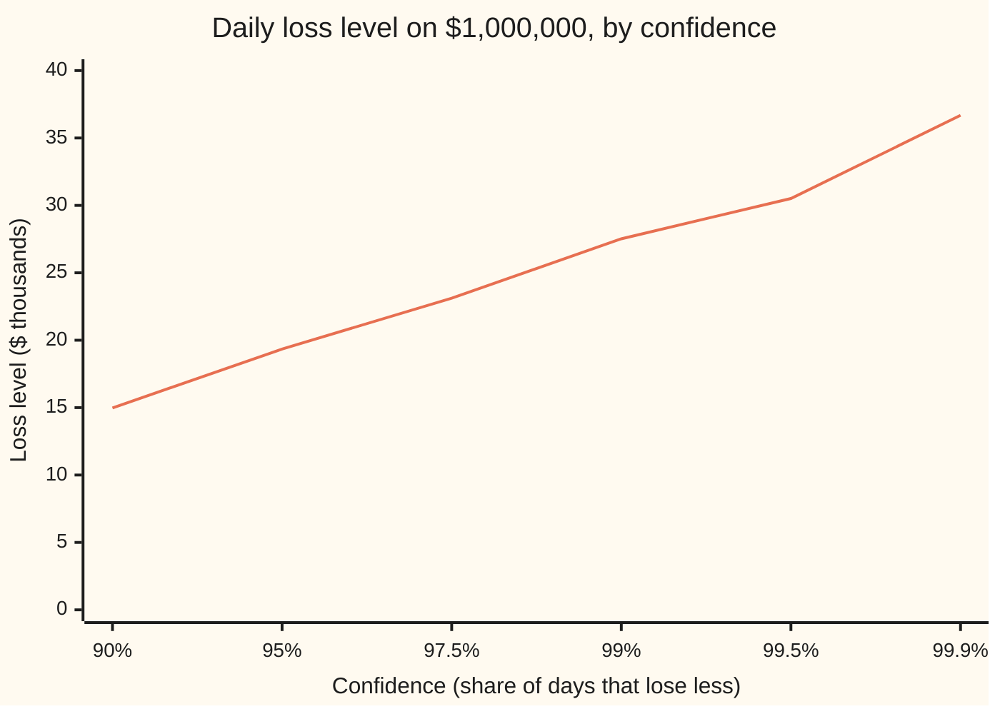
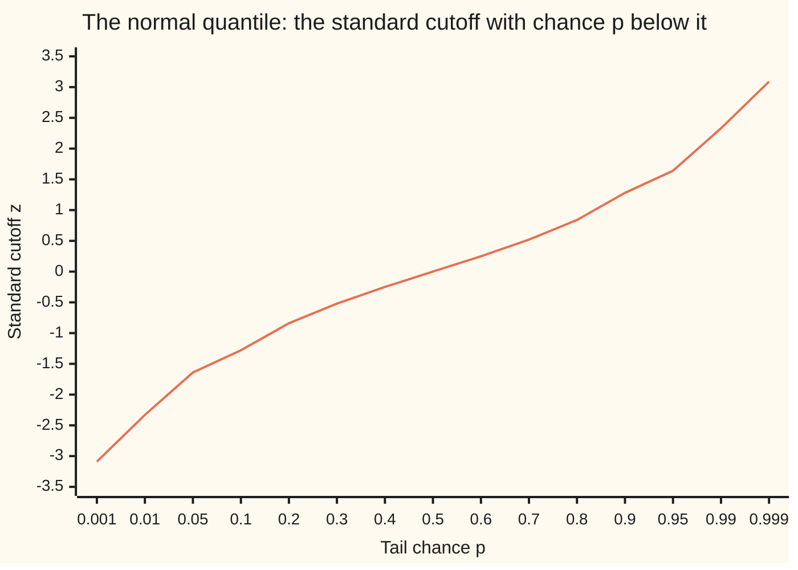

# Normal quantiles: the value with a given probability below it, and how a computer finds it

[Syllabus](../../../SYLLABUS.md) → [Probability and statistics](../README.md) → [Continuous Distributions](../README.md#s04) → Normal quantiles

---

## General Overview

A fund holds $1,000,000 in one share. The share's daily return, the day's gain or loss as a fraction of the money held, follows a bell curve. Its centre is a gain of 0.04 percent a day. Its spread, the standard deviation, is 1.2 percent. The risk desk wants one number before the market opens: a loss so large that only 1 trading day in 100 does worse.

That number is the **99 percent daily loss level**. For this share it is **$27,516.17**. About 2.52 trading days in a 252-day year should lose more than that.

The normal card answers the forward question: given a cutoff, how much probability lies below it? Here the question runs backwards: given the probability, 1 percent, where is the cutoff? The answer is called a **quantile** (the value with a stated probability below it), and the word is used from here on. The 99 percent loss level is the 1 percent quantile of the return, turned into dollars.

No formula made of a finite number of logs, roots and powers is known for the backwards question. A computer finds the quantile by searching: it traps the answer in a shrinking interval, or it starts from a close guess and polishes it with Newton's method. This card does both and checks them against a simulation of 200,000 trading days.

**A normal quantile is the cutoff with a stated probability below it: find it once for the standard bell curve, then stretch by the spread and shift by the centre.**

**What kind of fact this is:** a definition (the quantile) and a method (how to compute it); the quick rational formula used as a starting guess is an approximation, with its error stated.

### The picture: the loss level climbs as the tail shrinks



One line: the loss that only the stated share of days stays under. It is $14,978.62 at 90 percent, $27,516.17 at 99 percent and $36,682.79 at 99.9 percent. The last step, from 99 to 99.9 percent, adds $9,166.62; the nine points from 90 to 99 percent added $12,537.55. The rarer the day, the faster the cutoff runs away.

---

## The formula

Notation first, in words. The normal card wrote $\Phi(z)$ for the area under the standard bell curve to the left of $z$, the chance that a standard normal value lands below $z$. This card writes $\Phi^{-1}(p)$, read "the normal quantile of $p$", for the reverse: the $z$ whose left area is exactly $p$. The finance wing writes the same area $N(z)$ and the quantile $N^{-1}(p)$.

$$\Phi(z_p) = p \quad\Longleftrightarrow\quad z_p = \Phi^{-1}(p)$$

$$x_p = \mu + \sigma\, z_p, \qquad L = -W\, x_p$$

**Read it aloud:** find the standard cutoff with chance $p$ below it, stretch it by the spread, shift it by the centre, and turn the return into dollars lost.

| Symbol | Plain meaning | In our example | Push it up and the answer… |
| --- | --- | --- | --- |
| $p$ | the tail chance: probability that the day lands below the cutoff | 0.01 (99 percent level) | cutoff moves up, loss level falls |
| $\Phi$ | standard normal cumulative area: chance a standard normal value lands left of $z$ | $\Phi(-2.3263478740) = 0.01$ | — |
| $\Phi^{-1}(p)$, $z_p$ | the normal quantile: the standard cutoff with left area $p$ | −2.3263478740 | — |
| $\phi$ | the bell curve's height, $e^{-z^2/2}/\sqrt{2\pi}$; also the slope of $\Phi$ | 0.026652 at $z_p$ | steeper $\Phi$, cutoff easier to pin down |
| $X$, $Z$ | the day's return, and the standard normal value it is built from, $X = \mu + \sigma Z$ | — | — |
| $\mu$ | centre of the daily return | 0.0004 (0.04 percent) | loss level falls by $W$ times the rise |
| $\sigma$ | spread of the daily return (standard deviation) | 0.012 (1.2 percent) | loss level rises in proportion |
| $x_p$ | the return with chance $p$ below it | −0.027516 | — |
| $W$ | dollars held | $1,000,000 | loss level rises in proportion |
| $L$ | the loss level, $-W x_p$ | $27,516.17 | — |
| $t$ | the tail variable $\sqrt{-2\ln p}$ in the rational formula | 3.034854 | — |
| $c_0,c_1,c_2,d_1,d_2,d_3$ | fixed constants of the rational formula | 2.515517, 0.802853, 0.010328, 1.432788, 0.189269, 0.001308 | — |

Three helper formulas do the computing.

Bisection (halving a bracket): keep an interval with $\Phi$ below $p$ at its left end and above $p$ at its right end, test the midpoint, and keep the half that still straddles $p$.

Newton's step (the slope of $\Phi$ is $\phi$):

$$z_{\text{new}} = z - \frac{\Phi(z) - p}{\phi(z)}$$

The rational starting guess, for $p \le 1/2$ (Abramowitz and Stegun formula 26.2.23, due to Cecil Hastings):

$$z_p \approx -\left(t - \frac{c_0 + c_1 t + c_2 t^2}{1 + d_1 t + d_2 t^2 + d_3 t^3}\right), \qquad t = \sqrt{-2\ln p}$$

Its error is below 0.00045 for every $p$ in that range.

### When it holds

- **The return is normal.** Real daily returns have fatter tails than the bell curve. The normal level then understates the worst days; see [Heavy tails](08-heavy-tails-pareto-and-cauchy.md).
- **The centre and spread are known.** In practice both are estimates. An error in $\sigma$ moves the loss level in proportion: a spread of 2.4 percent gives $55,432.35.
- **The tail chance is strictly between 0 and 1.** No finite $z$ has left area 0 or 1: the cutoff runs off to minus infinity as $p \to 0$ and plus infinity as $p \to 1$. The bracket used below, −6 to 6, covers $p$ down to about 1 in a billion, $\Phi(-6)$.
- **The rational formula is for the lower half.** For $p > 1/2$ use symmetry, $z_{1-p} = -z_p$.
- **The area is computed accurately where it is used.** The series for $\Phi$ on this card works for tail chances down to 0.001. Much farther out, one half minus nearly one half loses digits, and a tail formula is needed.

---

## Why it works

### Step 0: read the cumulative curve backwards

The cumulative curve $\Phi$ takes a cutoff and returns a probability. A quantile takes a probability and returns a cutoff. On a graph, that is the same curve read from the other axis: go up the probability axis to 0.01, across to the curve, down to the cutoff. Everything below is about doing that reading precisely, since the curve has no formula that can be turned round by algebra.

### Step 1: there is exactly one answer

$\Phi$ is continuous, climbs strictly (its slope $\phi$ is positive everywhere), tends to 0 far to the left and to 1 far to the right. A continuous curve that goes from below 0.01 to above 0.01 must cross 0.01 somewhere (the intermediate value theorem). A curve that only climbs crosses it once. So for every $p$ strictly between 0 and 1 there is one cutoff, $z_p$, and $\Phi^{-1}$ is a genuine function. Densities and cumulative curves in general are on [Densities](01-densities-and-cdfs.md).

### Step 2: every normal is a stretched standard one

Write the return as $X = \mu + \sigma Z$, where $Z$ is standard normal. For a positive spread, $X$ lands below $\mu + \sigma z$ exactly when $Z$ lands below $z$. So the two events have the same chance, and the cutoffs match:

$$P(X \le \mu + \sigma z_p) = P(Z \le z_p) = p.$$

One standard quantile serves every normal law. For the share: 0.0004 + 0.012 × (−2.3263478740) = −0.027516.

### Step 3: symmetry halves the work

The bell curve is a mirror image about zero. The area left of $-z$ equals the area right of $z$, so $z_{1-p} = -z_p$. The 99 percent upper cutoff is 2.33 and the 1 percent lower cutoff is −2.33, the same number with the sign flipped. Code needs to handle only $p \le 1/2$.

### Step 4: bisection, the search that cannot miss

Start with the bracket from −6 to 6. At −6 the area is below 0.01; at 6 it is above. Test the midpoint. If its area is below 0.01, the answer is to the right, so the midpoint becomes the new left end; otherwise it becomes the new right end. Each test halves the bracket, and the answer never leaves it. Sixty halvings shrink the 12-wide bracket below the spacing of floating-point numbers near 2.3, so what limits the answer is the accuracy of the area, not the bracket. The midpoint agrees with the printed tables to about 14 digits: −2.3263478740.

Bisection is slow, 60 area computations, but it needs only two facts: $\Phi$ climbs, and the bracket straddles $p$.

<details>
<summary>Where the series for the area comes from</summary>

The code computes $\Phi(z) = \tfrac12 + \phi(z)\,\bigl(z + z^3/3 + z^5/(3\cdot 5) + z^7/(3\cdot5\cdot7) + \cdots\bigr)$. Call the bracket $G(z)$. The area from 0 to $z$ is $\phi(z) G(z)$, so $G(z) = e^{z^2/2}\int_0^z e^{-s^2/2}\,ds$. Differentiating the product gives $G'(z) = 1 + z\,G(z)$. Put $G = a_0 z + a_1 z^3 + a_2 z^5 + \cdots$ into that and match powers: $a_0 = 1$ and $(2k+1)a_k = a_{k-1}$, which gives the odd-number products in the denominators. The code checks the result against a Simpson integral at the answer: both give 0.010000000000.

</details>

### Step 5: Newton's method, the fast polish

Newton's method ([Newton's method](../../06-Calculus%20and%20analysis/03-What%20Derivatives%20Tell%20You/06-newtons-method.md)) replaces a curve by its tangent line and jumps to where the tangent hits the target. The slope of $\Phi$ is the bell curve's height $\phi$, so the tangent at $z$ reaches $p$ after a step of $(\Phi(z) - p)/\phi(z)$, the helper formula above.

Near the answer, each step roughly squares the error. From the rational guess, off by 0.0004374585, one step leaves 0.0000002227 and a second step lands on the bisection answer to ten decimals.

<details>
<summary>Detailed proof: why one Newton step squares the error</summary>

Let the current guess be $z = z_p + \varepsilon_0$, off by a small amount. Expand both pieces of the step around $z_p$, using $\Phi' = \phi$ and $\phi'(z) = -z\,\phi(z)$ (differentiate $e^{-z^2/2}$):
$$\Phi(z) - p = \phi(z_p)\,\varepsilon_0 - \tfrac12 z_p \phi(z_p)\,\varepsilon_0^2 + \cdots, \qquad \phi(z) = \phi(z_p)\,(1 - z_p \varepsilon_0 + \cdots).$$
Divide: the step is $\varepsilon_0\,(1 + \tfrac12 z_p \varepsilon_0 + \cdots)$. Subtract it from the guess. The new error is
$$\varepsilon_1 = -\tfrac12 z_p\,\varepsilon_0^2 + (\text{terms in } \varepsilon_0^3).$$
At the 1 percent point $-\tfrac12 z_p$ is half of 2.33. The rational guess had $\varepsilon_0 = -0.0004374585$; half of 2.33 times its square matches the printed one-step error, 0.0000002227. The error's digits double with every step, which is why two steps finish the job.

</details>

The squaring holds only near the answer. Far out in the tail $\phi$ is almost zero, the tangent is almost flat, and the step is enormous: from $z = -5$, one step lands at 6721.0, where $\phi$ is 0.0 in floating point and the next step divides by zero. Libraries therefore start Newton from a guess already close, or fall back to bisection when a step leaves the bracket.

### Step 6: a rational formula for the starting guess

Where does a close guess come from without searching? From the shape of the tail. Far out, the left area is roughly the bell's height divided by the distance, and the height is $e^{-z^2/2}$ up to a constant. Setting $e^{-z^2/2} \approx p$ and solving gives $|z| \approx \sqrt{-2\ln p} = t$. For $p = 0.01$ that is 3.034854, too far out, because the division and the constant were ignored.

Hastings's rational formula subtracts a correction that is a ratio of two short polynomials in $t$, with constants fitted in the 1950s so the error stays below 0.00045 everywhere in the lower half. Here the correction is 0.708069, and the guess is −2.326785. It is fast (one log, one root, a handful of multiplies) and close enough for Newton to finish in one or two steps. Production libraries use longer fitted ratios of the same shape, such as Wichura's algorithm AS 241, accurate to about 16 digits with no polish at all.

### Step 7: the cutoff is touchiest in the tail

The slope of $\Phi^{-1}$ is one over the slope of $\Phi$: $1/\phi(z_p)$. At the median that is 2.5066. At the 1 percent point it is 37.5204. So a small error in the tail chance becomes a large error in the cutoff. Moving $p$ from 1 percent to 1.1 percent shifts the cutoff by 0.035980, which is $431.76 on this fund.



One line: $\Phi^{-1}(p)$ at fifteen tail chances. The chances are unevenly spaced, which squeezes the ends; on an even scale the curve is flat through the middle and near-vertical at both ends. The mirror image about $p = 0.5$ is Step 3.

A fourth road needs no area at all: simulate many standard normal values, sort them, and read off the value 1 percent of the way up. That is inverse sampling run backwards, and the uniform card's inverse-transform idea ([Uniform](02-uniform-distribution.md)) is the same move forwards.

---

## Worked numbers, by hand

| Step | Arithmetic | Value |
| --- | --- | --- |
| tail chance | 1 − 0.99 | 0.01 |
| $-2\ln p$ | −2 × ln 0.01 | 9.210340 |
| $t$ | √9.210340 | 3.034854 |
| numerator | 2.515517 + 0.802853 × 3.034854 + 0.010328 × 3.034854^2 | 5.047183 |
| denominator | 1 + 1.432788 × 3.034854 + 0.189269 × 3.034854^2 + 0.001308 × 3.034854^3 | 7.128096 |
| correction | 5.047183 ÷ 7.128096 | 0.708069 |
| rational guess | −(3.034854 − 0.708069) | −2.326785 |
| area at the guess | $\Phi(-2.326785)$, a little short of 0.01 | 0.00998835 |
| one Newton step | guess + (0.01 − 0.00998835) ÷ (bell height there) | −2.3263476513 |
| second step | same again | −2.3263478740 |
| return at 1 percent | 0.0004 + 0.012 × (−2.3263478740) | −0.027516 |
| loss level | $1,000,000 × 0.027516 | **$27,516.17** |

On 99 trading days in 100 the fund loses less than $27,516.17 (or gains). On about 1 day in 100, 2.52 days in a 252-day year, it loses more, and the number says nothing about how much more.

### What breaks if you drop a piece

| Mistake | Comes out at | What went wrong |
| --- | --- | --- |
| read −2.33 as a percent, skipped the spread | $23,263.48 | the cutoff is in standard units; it must be multiplied by $\sigma$ |
| used the two-sided cutoff 2.575829 | $30,509.95 | that leaves 0.5 percent in each tail; a loss level has one tail, 1 percent |
| stopped at the rational guess | $27,521.42 | a few dollars off $27,516.17: fine for a desk, wrong for a published table |
| Newton from $z = -5$ with no bracket | jumps to 6721.0; next divisor 0.0 | the tangent in the flat tail is nearly horizontal |

---

## Code, from first principles, and it actually runs

The scripts build the area $\Phi$ from its series and check it with a Simpson integral. Then they find the 1 percent point by four roads: the rational formula alone, the rational formula polished by Newton, bisection, and a seeded simulation of 200,000 days drawn with SplitMix64 (a small, fully written-out random generator, seed 20260928) and the Box–Muller transform (which turns two uniform draws into one normal draw with a log, a root and a cosine). The simulation also counts how many simulated days breach the formula's loss level. Asserts compare bisection with the printed tables' value, Newton with bisection, Simpson's area with 1 percent, the rational guess with its stated error bound, and both simulated numbers with the formula within four standard errors.

### Python

```python
# Normal quantiles: the 99 percent daily loss level of $1,000,000 in one share.
# Roads: bisection, Newton polish from a rational start, a Simpson check, a seeded simulation.
from math import exp, log, sqrt, pi, cos

MU, SIGMA, W, P = 0.0004, 0.012, 1_000_000.0, 0.01  # daily mean, daily spread, dollars held, tail chance
TABLE_Z = -2.3263478740408408                        # printed tables' value of the 1% point

def phi(z):                                          # standard normal density
    return exp(-z * z / 2) / sqrt(2 * pi)

def Phi(z):                                          # area left of z: 1/2 + phi(z)(z + z^3/3 + z^5/15 + ...)
    term, total, n = z, z, 1
    while abs(term) > 1e-17 * abs(total):
        term *= z * z / (2 * n + 1)
        total += term
        n += 1
    return 0.5 + phi(z) * total

def Phi_simpson(z, n=2000):                          # second road to the area, for z < 0: 1/2 minus the strip z..0
    h = -z / n
    s = phi(z) + phi(0.0) + sum((4 if k % 2 else 2) * phi(z + k * h) for k in range(1, n))
    return 0.5 - s * h / 3

def bisection(p, lo=-6.0, hi=6.0, steps=60):         # keep the half of the bracket where the root lives
    for _ in range(steps):
        mid = (lo + hi) / 2
        if Phi(mid) < p:
            lo = mid
        else:
            hi = mid
    return (lo + hi) / 2

def newton_step(p, z):                               # slide down the tangent: Phi' = phi
    return z - (Phi(z) - p) / phi(z)

def hastings(p):                                     # Abramowitz and Stegun 26.2.23, lower tail p <= 1/2
    t = sqrt(-2 * log(p))
    num = 2.515517 + 0.802853 * t + 0.010328 * t * t
    den = 1 + 1.432788 * t + 0.189269 * t * t + 0.001308 * t * t * t
    return -(t - num / den), t, num, den

M64 = (1 << 64) - 1
state = 20260928                                     # SplitMix64 seed
def uniform():                                       # strictly between 0 and 1
    global state
    state = (state + 0x9E3779B97F4A7C15) & M64
    x = state
    x = ((x ^ (x >> 30)) * 0xBF58476D1CE4E5B9) & M64
    x = ((x ^ (x >> 27)) * 0x94D049BB133111EB) & M64
    return (((x ^ (x >> 31)) >> 11) + 0.5) / 2.0 ** 53

def show(label, v, fmt="{:.6f}"):
    print(f"{label:<40} {fmt.format(v + 0.0):>14}")

# ---- the 1% point of the standard normal, three computed roads ----
z_bis = bisection(P)
z_h, t, num, den = hastings(P)
z_n1 = newton_step(P, z_h)
z_n2 = newton_step(P, z_n1)
show("hand: -2 ln p", -2 * log(P))
show("hand: t = sqrt(-2 ln p)", t)
show("hand: numerator", num)
show("hand: denominator", den)
show("hand: numerator / denominator", num / den)
show("1 rational approximation z", z_h)
show("  Phi(rational z)", Phi(z_h), "{:.8f}")
show("2 rational + one Newton step", z_n1, "{:.10f}")
show("  rational + two Newton steps", z_n2, "{:.10f}")
show("3 bisection, 60 halvings", z_bis, "{:.10f}")
show("  Phi(bisection) by series", Phi(z_bis), "{:.12f}")
show("  Phi(bisection) by Simpson", Phi_simpson(z_bis), "{:.12f}")
show("  density phi at the 1% point", phi(z_bis))
show("  1/phi: z moves per unit of p", 1 / phi(z_bis), "{:.4f}")
show("  1/phi at the median", 1 / phi(0.0), "{:.4f}")
show("  rational error", z_h - z_bis, "{:.10f}")
show("  one-Newton-step error", z_n1 - z_bis, "{:.10f}")
z_11 = bisection(0.011)
show("  z at p = 0.011, shift from 1%", z_11 - z_bis)
show("  that shift in dollars", W * SIGMA * (z_11 - z_bis), "{:.2f}")

# ---- stretch and shift to the share, then to dollars ----
x_p = MU + SIGMA * z_bis
loss = -W * x_p
show("return at the 1% point", x_p)
show("99% daily loss level ($)", loss, "{:.2f}")
show("expected breach days in 252", 252 * P, "{:.2f}")

# ---- 4 simulation: 200,000 days by Box-Muller ----
N = 200_000
zs = []
for _ in range(N):
    u1, u2 = uniform(), uniform()
    zs.append(sqrt(-2 * log(u1)) * cos(2 * pi * u2))
zs.sort()
z_sim = zs[N // 100 - 1]
se_q = sqrt(P * (1 - P) / N) / phi(z_bis)
breaches = sum(1 for z in zs if MU + SIGMA * z < x_p)
frac = breaches / N
se_f = sqrt(P * (1 - P) / N)
show("4 simulated 1% point of z", z_sim)
show("  its standard error", se_q)
show("  simulated loss level ($)", -W * (MU + SIGMA * z_sim), "{:.2f}")
show("  days below the formula level", breaches, "{:.0f}")
show("  fraction below it", frac)
show("  its standard error", se_f)

# ---- what breaks ----
show("wrong: z read as percent, no sigma ($)", -W * TABLE_Z / 100, "{:.2f}")
z_two = bisection(0.005)
show("wrong: two-sided z at p = 0.005", z_two)
show("wrong: two-sided loss level ($)", -W * (MU + SIGMA * z_two), "{:.2f}")
show("wrong: rational, unpolished ($)", -W * (MU + SIGMA * z_h), "{:.2f}")
z_bad = newton_step(P, -5.0)
show("wrong: Newton from z = -5, one step", z_bad, "{:.1f}")
show("  density there (next divisor)", phi(z_bad), "{:.1f}")

# ---- confidence ladder and the quantile curve, for the charts ----
print("level     z          loss ($)")
ladder = []
for c in (0.90, 0.95, 0.975, 0.99, 0.995, 0.999):
    zc = bisection(1 - c)
    ladder.append(-W * (MU + SIGMA * zc) / 1000)
    print(f"{c:<8} {zc:>9.6f} {-W * (MU + SIGMA * zc):>12.2f}")
print("chart, loss ($ thousands) " + " ".join(f"{v:.2f}" for v in ladder))
ps = (0.001, 0.01, 0.05, 0.1, 0.2, 0.3, 0.4, 0.5, 0.6, 0.7, 0.8, 0.9, 0.95, 0.99, 0.999)
print("chart, z at p " + " ".join(f"{round(bisection(p), 2) + 0.0:.2f}" for p in ps))

# ---- try changing ----
show("try: sigma = 0.024 ($)", -W * (MU + 0.024 * z_bis), "{:.2f}")
show("try: 10 days, sigma*sqrt(10) ($)", -W * (10 * MU + SIGMA * sqrt(10) * z_bis), "{:.2f}")
show("try: mean 0 ($)", -W * SIGMA * z_bis, "{:.2f}")

assert abs(z_bis - TABLE_Z) < 1e-9, "bisection must match the printed tables"
assert abs(z_n2 - z_bis) < 1e-12, "Newton from the rational start must meet bisection"
assert abs(Phi_simpson(z_bis) - P) < 1e-10, "Simpson's area at the answer must be 1%"
assert abs(z_h - z_bis) < 4.5e-4, "rational approximation within its stated error"
assert abs(z_sim - z_bis) < 4 * se_q, "simulated quantile within 4 standard errors"
assert abs(frac - P) < 4 * se_f, "breach fraction within 4 standard errors of 1%"
assert z_bad > 100, "unguarded Newton from the far tail must overshoot"
print("ALL CHECKS PASS")
```

**Ran 2026-09-28 on macOS, Python 3.14.6, standard library only. All checks passed. Output, pasted from the run:**

```
hand: -2 ln p                                  9.210340
hand: t = sqrt(-2 ln p)                        3.034854
hand: numerator                                5.047183
hand: denominator                              7.128096
hand: numerator / denominator                  0.708069
1 rational approximation z                    -2.326785
  Phi(rational z)                            0.00998835
2 rational + one Newton step              -2.3263476513
  rational + two Newton steps             -2.3263478740
3 bisection, 60 halvings                  -2.3263478740
  Phi(bisection) by series               0.010000000000
  Phi(bisection) by Simpson              0.010000000000
  density phi at the 1% point                  0.026652
  1/phi: z moves per unit of p                  37.5204
  1/phi at the median                            2.5066
  rational error                          -0.0004374585
  one-Newton-step error                    0.0000002227
  z at p = 0.011, shift from 1%                0.035980
  that shift in dollars                          431.76
return at the 1% point                        -0.027516
99% daily loss level ($)                       27516.17
expected breach days in 252                        2.52
4 simulated 1% point of z                     -2.320568
  its standard error                           0.008348
  simulated loss level ($)                     27446.81
  days below the formula level                     1965
  fraction below it                            0.009825
  its standard error                           0.000222
wrong: z read as percent, no sigma ($)         23263.48
wrong: two-sided z at p = 0.005               -2.575829
wrong: two-sided loss level ($)                30509.95
wrong: rational, unpolished ($)                27521.42
wrong: Newton from z = -5, one step              6721.0
  density there (next divisor)                      0.0
level     z          loss ($)
0.9      -1.281552     14978.62
0.95     -1.644854     19338.24
0.975    -1.959964     23119.57
0.99     -2.326348     27516.17
0.995    -2.575829     30509.95
0.999    -3.090232     36682.79
chart, loss ($ thousands) 14.98 19.34 23.12 27.52 30.51 36.68
chart, z at p -3.09 -2.33 -1.64 -1.28 -0.84 -0.52 -0.25 0.00 0.25 0.52 0.84 1.28 1.64 2.33 3.09
try: sigma = 0.024 ($)                         55432.35
try: 10 days, sigma*sqrt(10) ($)               84278.69
try: mean 0 ($)                                27916.17
ALL CHECKS PASS
```

### Rust

```rust
// Normal quantiles: the 99 percent daily loss level of $1,000,000 in one share.
// Roads: bisection, Newton polish from a rational start, a Simpson check, a seeded simulation.
use std::f64::consts::PI;

const MU: f64 = 0.0004; // daily mean
const SIGMA: f64 = 0.012; // daily spread
const W: f64 = 1_000_000.0; // dollars held
const P: f64 = 0.01; // tail chance
const TABLE_Z: f64 = -2.3263478740408408; // printed tables' value of the 1% point

fn phi(z: f64) -> f64 {
    (-z * z / 2.0).exp() / (2.0 * PI).sqrt()
}

// area left of z: 1/2 + phi(z)(z + z^3/3 + z^5/15 + ...)
fn big_phi(z: f64) -> f64 {
    let (mut term, mut total, mut n) = (z, z, 1.0);
    while term.abs() > 1e-17 * total.abs() {
        term *= z * z / (2.0 * n + 1.0);
        total += term;
        n += 1.0;
    }
    0.5 + phi(z) * total
}

// second road to the area, for z < 0: 1/2 minus the strip z..0
fn big_phi_simpson(z: f64, n: usize) -> f64 {
    let h = -z / n as f64;
    let mut s = phi(z) + phi(0.0);
    for k in 1..n {
        s += (if k % 2 == 1 { 4.0 } else { 2.0 }) * phi(z + k as f64 * h);
    }
    0.5 - s * h / 3.0
}

// keep the half of the bracket where the root lives
fn bisection(p: f64) -> f64 {
    let (mut lo, mut hi) = (-6.0, 6.0);
    for _ in 0..60 {
        let mid = (lo + hi) / 2.0;
        if big_phi(mid) < p { lo = mid; } else { hi = mid; }
    }
    (lo + hi) / 2.0
}

// slide down the tangent: Phi' = phi
fn newton_step(p: f64, z: f64) -> f64 {
    z - (big_phi(z) - p) / phi(z)
}

// Abramowitz and Stegun 26.2.23, lower tail p <= 1/2
fn hastings(p: f64) -> (f64, f64, f64, f64) {
    let t = (-2.0 * p.ln()).sqrt();
    let num = 2.515517 + 0.802853 * t + 0.010328 * t * t;
    let den = 1.0 + 1.432788 * t + 0.189269 * t * t + 0.001308 * t * t * t;
    (-(t - num / den), t, num, den)
}

struct SplitMix(u64); // SplitMix64
impl SplitMix {
    fn uniform(&mut self) -> f64 { // strictly between 0 and 1
        self.0 = self.0.wrapping_add(0x9E3779B97F4A7C15);
        let mut x = self.0;
        x = (x ^ (x >> 30)).wrapping_mul(0xBF58476D1CE4E5B9);
        x = (x ^ (x >> 27)).wrapping_mul(0x94D049BB133111EB);
        (((x ^ (x >> 31)) >> 11) as f64 + 0.5) / 2f64.powi(53)
    }
}

fn show(label: &str, v: f64, dp: usize) {
    println!("{:<40} {:>14}", label, format!("{:.*}", dp, v + 0.0));
}

fn main() {
    // ---- the 1% point of the standard normal, three computed roads ----
    let z_bis = bisection(P);
    let (z_h, t, num, den) = hastings(P);
    let z_n1 = newton_step(P, z_h);
    let z_n2 = newton_step(P, z_n1);
    show("hand: -2 ln p", -2.0 * P.ln(), 6);
    show("hand: t = sqrt(-2 ln p)", t, 6);
    show("hand: numerator", num, 6);
    show("hand: denominator", den, 6);
    show("hand: numerator / denominator", num / den, 6);
    show("1 rational approximation z", z_h, 6);
    show("  Phi(rational z)", big_phi(z_h), 8);
    show("2 rational + one Newton step", z_n1, 10);
    show("  rational + two Newton steps", z_n2, 10);
    show("3 bisection, 60 halvings", z_bis, 10);
    show("  Phi(bisection) by series", big_phi(z_bis), 12);
    show("  Phi(bisection) by Simpson", big_phi_simpson(z_bis, 2000), 12);
    show("  density phi at the 1% point", phi(z_bis), 6);
    show("  1/phi: z moves per unit of p", 1.0 / phi(z_bis), 4);
    show("  1/phi at the median", 1.0 / phi(0.0), 4);
    show("  rational error", z_h - z_bis, 10);
    show("  one-Newton-step error", z_n1 - z_bis, 10);
    let z_11 = bisection(0.011);
    show("  z at p = 0.011, shift from 1%", z_11 - z_bis, 6);
    show("  that shift in dollars", W * SIGMA * (z_11 - z_bis), 2);

    // ---- stretch and shift to the share, then to dollars ----
    let x_p = MU + SIGMA * z_bis;
    show("return at the 1% point", x_p, 6);
    show("99% daily loss level ($)", -W * x_p, 2);
    show("expected breach days in 252", 252.0 * P, 2);

    // ---- 4 simulation: 200,000 days by Box-Muller ----
    let n = 200_000usize;
    let mut rng = SplitMix(20260928);
    let mut zs: Vec<f64> = Vec::with_capacity(n);
    for _ in 0..n {
        let (u1, u2) = (rng.uniform(), rng.uniform());
        zs.push((-2.0 * u1.ln()).sqrt() * (2.0 * PI * u2).cos());
    }
    zs.sort_by(|a, b| a.partial_cmp(b).unwrap());
    let z_sim = zs[n / 100 - 1];
    let nf = n as f64;
    let se_q = (P * (1.0 - P) / nf).sqrt() / phi(z_bis);
    let breaches = zs.iter().filter(|&&z| MU + SIGMA * z < x_p).count();
    let frac = breaches as f64 / nf;
    let se_f = (P * (1.0 - P) / nf).sqrt();
    show("4 simulated 1% point of z", z_sim, 6);
    show("  its standard error", se_q, 6);
    show("  simulated loss level ($)", -W * (MU + SIGMA * z_sim), 2);
    show("  days below the formula level", breaches as f64, 0);
    show("  fraction below it", frac, 6);
    show("  its standard error", se_f, 6);

    // ---- what breaks ----
    show("wrong: z read as percent, no sigma ($)", -W * TABLE_Z / 100.0, 2);
    let z_two = bisection(0.005);
    show("wrong: two-sided z at p = 0.005", z_two, 6);
    show("wrong: two-sided loss level ($)", -W * (MU + SIGMA * z_two), 2);
    show("wrong: rational, unpolished ($)", -W * (MU + SIGMA * z_h), 2);
    let z_bad = newton_step(P, -5.0);
    show("wrong: Newton from z = -5, one step", z_bad, 1);
    show("  density there (next divisor)", phi(z_bad), 1);

    // ---- confidence ladder and the quantile curve, for the charts ----
    println!("level     z          loss ($)");
    let mut ladder = Vec::new();
    for c in [0.90, 0.95, 0.975, 0.99, 0.995, 0.999] {
        let zc = bisection(1.0 - c);
        ladder.push(format!("{:.2}", -W * (MU + SIGMA * zc) / 1000.0));
        println!("{:<8} {:>9.6} {:>12.2}", c, zc, -W * (MU + SIGMA * zc));
    }
    println!("chart, loss ($ thousands) {}", ladder.join(" "));
    let ps = [0.001, 0.01, 0.05, 0.1, 0.2, 0.3, 0.4, 0.5, 0.6, 0.7, 0.8, 0.9, 0.95, 0.99, 0.999];
    let curve: Vec<String> = ps
        .iter()
        .map(|&p| format!("{:.2}", (bisection(p) * 100.0).round() / 100.0 + 0.0))
        .collect();
    println!("chart, z at p {}", curve.join(" "));

    // ---- try changing ----
    show("try: sigma = 0.024 ($)", -W * (MU + 0.024 * z_bis), 2);
    show("try: 10 days, sigma*sqrt(10) ($)", -W * (10.0 * MU + SIGMA * 10f64.sqrt() * z_bis), 2);
    show("try: mean 0 ($)", -W * SIGMA * z_bis, 2);

    assert!((z_bis - TABLE_Z).abs() < 1e-9, "bisection must match the printed tables");
    assert!((z_n2 - z_bis).abs() < 1e-12, "Newton from the rational start must meet bisection");
    assert!((big_phi_simpson(z_bis, 2000) - P).abs() < 1e-10, "Simpson's area at the answer must be 1%");
    assert!((z_h - z_bis).abs() < 4.5e-4, "rational approximation within its stated error");
    assert!((z_sim - z_bis).abs() < 4.0 * se_q, "simulated quantile within 4 standard errors");
    assert!((frac - P).abs() < 4.0 * se_f, "breach fraction within 4 standard errors of 1%");
    assert!(z_bad > 100.0, "unguarded Newton from the far tail must overshoot");
    println!("ALL CHECKS PASS");
}
```

**Ran 2026-09-28 on macOS, rustc 1.98.1, no crates. All checks passed. Output, pasted from the run:**

```
hand: -2 ln p                                  9.210340
hand: t = sqrt(-2 ln p)                        3.034854
hand: numerator                                5.047183
hand: denominator                              7.128096
hand: numerator / denominator                  0.708069
1 rational approximation z                    -2.326785
  Phi(rational z)                            0.00998835
2 rational + one Newton step              -2.3263476513
  rational + two Newton steps             -2.3263478740
3 bisection, 60 halvings                  -2.3263478740
  Phi(bisection) by series               0.010000000000
  Phi(bisection) by Simpson              0.010000000000
  density phi at the 1% point                  0.026652
  1/phi: z moves per unit of p                  37.5204
  1/phi at the median                            2.5066
  rational error                          -0.0004374585
  one-Newton-step error                    0.0000002227
  z at p = 0.011, shift from 1%                0.035980
  that shift in dollars                          431.76
return at the 1% point                        -0.027516
99% daily loss level ($)                       27516.17
expected breach days in 252                        2.52
4 simulated 1% point of z                     -2.320568
  its standard error                           0.008348
  simulated loss level ($)                     27446.81
  days below the formula level                     1965
  fraction below it                            0.009825
  its standard error                           0.000222
wrong: z read as percent, no sigma ($)         23263.48
wrong: two-sided z at p = 0.005               -2.575829
wrong: two-sided loss level ($)                30509.95
wrong: rational, unpolished ($)                27521.42
wrong: Newton from z = -5, one step              6721.0
  density there (next divisor)                      0.0
level     z          loss ($)
0.9      -1.281552     14978.62
0.95     -1.644854     19338.24
0.975    -1.959964     23119.57
0.99     -2.326348     27516.17
0.995    -2.575829     30509.95
0.999    -3.090232     36682.79
chart, loss ($ thousands) 14.98 19.34 23.12 27.52 30.51 36.68
chart, z at p -3.09 -2.33 -1.64 -1.28 -0.84 -0.52 -0.25 0.00 0.25 0.52 0.84 1.28 1.64 2.33 3.09
try: sigma = 0.024 ($)                         55432.35
try: 10 days, sigma*sqrt(10) ($)               84278.69
try: mean 0 ($)                                27916.17
ALL CHECKS PASS
```

The two outputs are identical line for line. The simulated 1 percent point, −2.320568, lands within one standard error (0.008348) of the exact −2.3263478740. The 1965 breaching days, a fraction of 0.009825, land within one standard error (0.000222) of 1 percent. The two standard errors are linked by Step 7: the quantile's is the fraction's divided by the bell's height at the 1 percent point, 0.026652.

> [!TIP]
> **Try changing**
> - **Double the spread.** Guess first: does the loss level exactly double? Set `SIGMA = 0.024`. It comes out at **$55,432.35**, slightly more than double $27,516.17, because the cushion from the centre does not double.
> - **Ten days instead of one.** Guess first. Multiply the centre by 10 and the spread by √10 (valid only if days are independent). The ten-day level is **$84,278.69**, nowhere near ten times the one-day level.
> - **Drop the centre.** Set `MU = 0.0`. The level becomes **$27,916.17**: the 0.04 percent daily drift was worth the gap between that and $27,516.17.
> - **Change the seed.** Guess first: how far will the simulated 1 percent point move? About one printed standard error, 0.008348 in standard units, either way; the four-standard-error asserts still pass.

---

## The usual mistake

> [!warning]
> **Reading the 99 percent loss level as the worst case.** It is a threshold, not a ceiling. It says how often losses exceed $27,516.17, about 1 day in 100, and nothing about how large they are on those days. Two funds with the same loss level can have very different bad days. The average loss beyond the level, expected shortfall, answers that; see [Value at risk](../../12-Financial%20mathematics/39-Value%20at%20Risk%20and%20Expected%20Shortfall/01-profit-and-loss-distribution-and-var.md).
>
> Smaller traps:
> - **One tail or two.** A loss level has one tail: 2.326348. The familiar 2.575829 leaves 0.5 percent in each of two tails and gives $30,509.95.
> - **The wrong side.** $\Phi^{-1}(0.99)$ is +2.326348, a gain. A loss level uses the lower tail, $p = 0.01$, or flips the sign.
> - **Trusting the bell in the tail.** Real returns have fatter tails, so the true 1 percent loss is usually larger than the normal one. The normal quantile is a model, not a measurement.
> - **Scaling time by the day count.** Ten days multiply the spread by √10, not 10, and only if the days are independent: $84,278.69, not ten times the daily level.

---

## Where you meet it in real life

- **Bank risk reports.** Daily and ten-day value at risk at 99 percent is a normal quantile times a spread, whenever the desk assumes a bell curve: [Value at risk](../../12-Financial%20mathematics/39-Value%20at%20Risk%20and%20Expected%20Shortfall/01-profit-and-loss-distribution-and-var.md).
- **Option desks.** Traders quote strikes by delta, a normal area; turning a delta back into a strike is a normal quantile: [Strike from delta](../../12-Financial%20mathematics/11-Implied%20volatility%20and%20the%20vanilla%20inverses/03-strike-from-delta.md).
- **Bank capital for loans.** The Basel formula feeds a default probability through $\Phi^{-1}$, mixes it with a stress quantile, and feeds the result back through $\Phi$: [Vasicek's large-pool loss curve](../../12-Financial%20mathematics/45-Portfolio%20Credit%20-%20Correlation%2C%20Copulas%2C%20Indices%20and%20Tranches/03-vasicek-loss-distribution-and-basel-capital.md).
- **Stocking a shop.** A newspaper seller facing normal demand orders up to the demand quantile at the critical ratio: the cost of one unit short divided by the cost of one unit short plus one unit left over: Stock.
- **Simulation engines.** Feeding a uniform random number through $\Phi^{-1}$ gives a normal draw, the forward version of this card's fourth road: [Uniform](02-uniform-distribution.md).
- **Growth charts and exam scores.** A child "at the 3rd percentile" or a score "at the 90th" is a quantile, often read off a normal fit.

> **Say it back**
> A quantile is the cutoff with a stated probability below it. For the standard bell curve it exists and is unique, because the cumulative area climbs strictly from 0 to 1. Any normal quantile is the standard one stretched by the spread and shifted by the centre, so the 1 percent point −2.3263478740 turns this share into a 99 percent daily loss level of $27,516.17. A computer finds the standard cutoff by bisection, which cannot miss, or by a rational guess polished with Newton's method, which is fast but needs a close start. The level says how often losses exceed it, not how bad they get.

---

## What this builds on

- [Normal](04-normal-distribution.md): the bell curve, its height $\phi$, its cumulative area $\Phi$, and the stretch-and-shift $X = \mu + \sigma Z$. This card runs $\Phi$ backwards.
- [Newton's method](../../06-Calculus%20and%20analysis/03-What%20Derivatives%20Tell%20You/06-newtons-method.md): the tangent-line step and its error-squaring, used here to polish the rational guess.

## Where this goes next

- [Value at risk](../../12-Financial%20mathematics/39-Value%20at%20Risk%20and%20Expected%20Shortfall/01-profit-and-loss-distribution-and-var.md): the loss level of this card as value at risk, and expected shortfall, the average beyond it.
- [Digital inverses](../../12-Financial%20mathematics/10-Digitals%20and%20the%20implied%20density/06-digital-inverses-vol-and-strike.md): a digital option's price is a normal area; inverting it for the strike or the volatility is a quantile.
- [Strike from delta](../../12-Financial%20mathematics/11-Implied%20volatility%20and%20the%20vanilla%20inverses/03-strike-from-delta.md): the strike with a quoted delta, in one line of $\Phi^{-1}$.
- [Strike from delta](../../12-Financial%20mathematics/21-FX%20vanilla%20options%20-%20Garman-Kohlhagen%20and%20the%20desk%20conventions/06-fx-strike-from-delta.md): the same inversion under currency-desk conventions, where some deltas need a search like Step 4.
- [Vasicek's large-pool loss curve](../../12-Financial%20mathematics/45-Portfolio%20Credit%20-%20Correlation%2C%20Copulas%2C%20Indices%20and%20Tranches/03-vasicek-loss-distribution-and-basel-capital.md): quantiles of a loan book's loss, built from $\Phi^{-1}$ of default probabilities.
- [Expected exposure over time](../../12-Financial%20mathematics/46-Counterparty%20Risk%20and%20CVA/02-expected-exposure-profiles.md): potential future exposure, a high quantile of what a counterparty could owe.
- Stock: the order quantity as a quantile of demand.

This card sets a cutoff when the bell curve is taken as given; the value-at-risk card asks what happens beyond the cutoff, where the bell curve is least trustworthy.

---

## Sources

Verified 2026-09-28: every link below resolves to the publisher's page.

- Abramowitz, Milton, and Irene A. Stegun, eds. *Handbook of Mathematical Functions*. Dover. [Publisher page](https://store.doverpublications.com/products/9780486612720). Formula 26.2.23 and its error bound: the rational starting guess, with Hastings's constants.
- Wichura, Michael J. "Algorithm AS 241: The Percentage Points of the Normal Distribution." *Applied Statistics* 37, no. 3 (1988): 477–484. [doi:10.2307/2347330](https://doi.org/10.2307/2347330). The longer rational formulas used by statistical libraries, accurate to about 16 digits.
- Box, G. E. P., and Mervin E. Muller. "A Note on the Generation of Random Normal Deviates." *Annals of Mathematical Statistics* 29, no. 2 (1958): 610–611. [doi:10.1214/aoms/1177706645](https://doi.org/10.1214/aoms/1177706645). The transform behind the simulation road.
