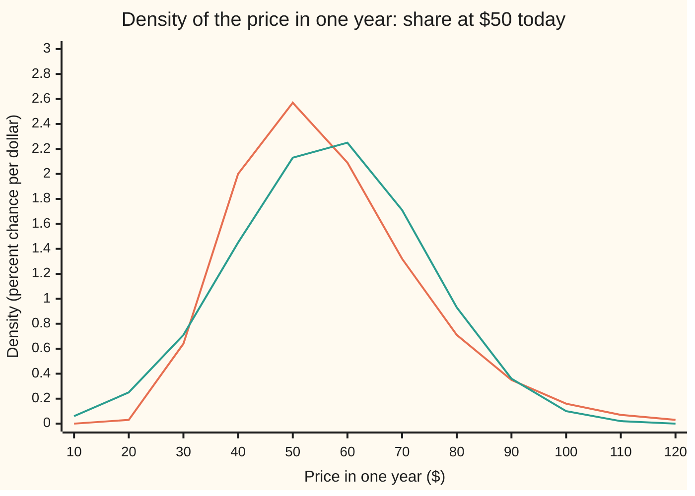

# Lognormal: a quantity whose logarithm is normal, and why prices use it

[Syllabus](../../../SYLLABUS.md) → [Probability and statistics](../../../SYLLABUS.md#w09) → [Continuous Distributions](../../../SYLLABUS.md#w09-s04) → Lognormal

---

## General Overview

A share trades at $50 today. Where will it be in a year?

Prices move by percentages, not by dollars, so a year of 252 trading days is a chain of 252 multiplications, each by a number close to 1. Logarithms turn multiplying into adding. The year's **log return**, the natural logarithm of next year's price divided by today's, is a sum of 252 small daily pieces, and such a sum is close to normal.

Take that log return to be normal with centre 0.08 and spread (standard deviation) 0.30. The price in a year is then $50 times e raised to that normal number. That price follows the **lognormal distribution**: a law for a positive quantity whose logarithm is normal.

Three numbers answer "where will it be". The middle year ends at $54.16. The average over many years is $56.66. The density piles up most at $49.50, below today's price. Rare large gains drag the average up: 56 percent of years end below it.

**A lognormal quantity is e raised to a normal one: never negative, leaning right, with its median below its mean, because a rise of one spread gains more dollars than a fall of one spread loses.**

**What kind of fact this is:** a definition of a family of laws; the density, the median, the mean and the variance are theorems proved on this card in Why it works; using it for a share price is a model, and its thin tails are where the model fails.

### The picture: next year's price, and a bell with the same average



Orange: the lognormal price, climbing steeply from zero, peaking near $50 at 2.57 percent per dollar, trailing off slowly to the right. Green: a normal bell with the same mean, $56.66, and spread, $17.39. The bell is symmetric, so it puts weight below $10, even below zero, and misses the long right tail.

---

## The formula

Notation first, in words. $S_0$ is today's price; $S$ is the price in a year, and $s$ one value of it; $X$ is the year's log return, ln(S/S_0). As on [Normal](04-normal-distribution.md), X ~ N(μ, σ^2) means "X follows the normal law with centre μ and variance σ^2", $Z$ is the standard normal, $\varphi$ its height and $\Phi$ its area to the left. Saying S is **lognormal with parameters μ and σ** means ln(S/S_0) ~ N(μ, σ^2): the two parameters are the centre and spread of the logarithm, not of the price.

$$S = S_0\, e^{X} = S_0\, e^{\mu + \sigma Z}$$

**Read it aloud:** next year's price is today's price times e raised to a normal log return.

Its cumulative distribution and density, for a price s above zero, are

$$F(s) = P(S \le s) = \Phi\!\left(\frac{\ln(s/S_0) - \mu}{\sigma}\right), \qquad f(s) = \frac{1}{s\,\sigma\sqrt{2\pi}}\; e^{-(\ln(s/S_0) - \mu)^2/(2\sigma^2)}$$

and both are zero for s at or below zero.

**Read it aloud:** the chance of ending at or below a price is the bell's area up to that price's log return, counted in spreads; the density is the bell's height there, divided by σ and by the price.

The three centres and the spread:

$$\text{mode} = S_0\,e^{\mu - \sigma^2}, \qquad \text{median} = S_0\,e^{\mu}, \qquad E[S] = S_0\,e^{\mu + \sigma^2/2}, \qquad \mathrm{Var}(S) = E[S]^2\left(e^{\sigma^2} - 1\right)$$

**Read it aloud:** the median is today's price grown at the average log return; the mean adds half the variance to the exponent; the mode, where the density peaks, takes a whole variance away.

All three come from one formula for any power k of the price:

$$E[S^k] = S_0^{\,k}\; e^{k\mu + k^2\sigma^2/2}$$

| Symbol | Plain meaning | In our example | Push it up and the answer… |
| --- | --- | --- | --- |
| $S_0$ | today's price | $50 | every price scales with it |
| $S$, $s$ | the price in a year, and one value of it | median $54.16 | larger s: more area to its left |
| $X$ | the year's log return, ln(S/S_0) | normal, centre 0.08, spread 0.30 | — |
| $\mu$ | centre of the log return, E[X] | 0.08 | mode, median and mean all rise by the same factor |
| $\sigma$ | spread of the log return; σ^2 is its variance | 0.30; 0.09 | mean rises, mode falls, median stays |
| $Z$, $z$ | the standard normal, and a count of spreads | z = −0.2667 for $50 | — |
| $f$, $F$ | the price's density and cumulative chance | peak f = 0.025681 per dollar | — |
| $\varphi$, $\Phi$ | standard bell height and left area | Φ(−0.2667) = 0.3949 | — |
| E[S], Var(S) | the long-run average price and its variance | $56.66; 302.3054 | — |
| $k$ | a power of the price inside E[S^k] | 1 for the mean, 2 for the variance | — |
| $e$, ln | the constant 2.71828… and the natural logarithm | e^0.08 = 1.0833 | — |

### When it holds

The lognormal law itself is a definition: any μ and any σ above 0 give one. Using it for a share price rests on assumptions.

- **Log returns are normal.** Real daily returns have fatter tails than the bell. The lognormal then understates both crashes and spikes; the card [Heavy tails](08-heavy-tails-pareto-and-cauchy.md) shows how badly.
- **A positive spread.** At σ = 0 the price is a fixed $54.16 with no density at all; the formula divides by zero.
- **Fixed centre and spread.** If the spread drifts, the year's log return is a blend of normals, not a normal, and the three centres move.
- **No default.** The model never reaches zero; a bankrupt company does, so default must be added separately.

---

## Why it works

### Step 0: multiplying becomes adding

A price is a product of daily factors: S = S_0 × (1 + r_1) × (1 + r_2) × … for 252 days, where each r is a day's simple return. Take logarithms and the product becomes a sum: ln(S/S_0) is the sum of the 252 daily log returns ln(1 + r) ([Logarithms](../../01-Foundations/03-Powers%2C%20Roots%20and%20Logarithms/05-logarithms.md)). A sum of many small independent pieces is close to normal: the [Central limit theorem](../06-Limit%20Theorems%20in%20Practice/02-central-limit-theorem.md). So the natural model puts the bell on the logarithm, and the price is e raised to a bell.

The code tests this with a year of coin flips. Each day the log price moves 0.08/252 plus or minus 0.0189, with chance one half each. That is nowhere near normal on any single day. After 252 days the average price is $56.6573 against the lognormal formula's $56.6574.

### Step 1: the cumulative chance, by moving the event

For a price s above zero, taking logs keeps order, so S ≤ s exactly when X ≤ ln(s/S_0), that is, Z ≤ (ln(s/S_0) − μ)/σ. So F(s) is Φ at that point.

At s = $50 the point is (0 − 0.08)/0.30 = −0.2667, and Φ(−0.2667) = 0.3949. About two years in five end with a loss.

The median is the price with F equal to one half. Φ is one half at zero, so ln(s/S_0) = μ and the median is S_0 e^μ = $54.16. Exponentiating kept the middle in the middle: half the log returns lie below 0.08, and so half the prices lie below $54.16.

### Step 2: the density, and where the 1/s comes from

A density is the slope of the cumulative chance ([Densities](01-densities-and-cdfs.md)). Differentiate F(s) by the chain rule. The outer slope is the bell's height φ; the inner slope of (ln(s/S_0) − μ)/σ is 1/(sσ). Their product is the density in The formula.

The 1/s has a plain meaning. A small log step is the same percentage move at every price, so it covers twice as many dollars at $100 as at $50. The same chance is spread over twice the width, so the height per dollar halves. That stretching is what tilts the curve: it pushes weight into the right tail and lowers the peak's position.

<details>
<summary>Detailed proof: the density integrates to 1</summary>

Substitute s = S_0 e^{μ + σz}. Then ds = σ s dz, and the density's 1/(sσ) cancels it exactly:
$$\int_0^\infty f(s)\,ds = \int_{-\infty}^{\infty} \varphi(z)\,dz = 1.$$
Each price above zero matches exactly one z, so no chance is lost or counted twice.

</details>

### Step 3: every power of the price, by completing a square

The average of S^k is the bell's average of S_0^k e^{kμ + kσz}. Multiply by the bell's own e^{−z^2/2}: the exponents combine into a bell shifted right by kσ, whose area is 1, times a constant, S_0^k e^{kμ + k^2σ^2/2}.

For k = 1 the mean is S_0 e^{μ + σ^2/2} = 50 × e^{0.125} = $56.66. For k = 2 the average square is S_0^2 e^{2μ + 2σ^2}; subtract the squared mean and factor to get Var(S) = E[S]^2 (e^{σ^2} − 1) = 302.3054, a spread of $17.39.

The road runs back. Given a price mean m and variance v, the variance formula gives σ^2 = ln(1 + v/m^2), and then the mean formula gives μ = ln(m/S_0) − σ^2/2. Any m above 0 and v above 0 give exactly one pair with σ above 0. At v = 0 the answer is σ = 0, a fixed price with no density; a mean at or below zero has no lognormal at all. From the Simpson mean and variance, the code gets back σ^2 = 0.09 and μ = 0.08.

<details>
<summary>Detailed proof: completing the square</summary>

$$E[S^k] = \int_{-\infty}^{\infty} S_0^{\,k}\, e^{k\mu + k\sigma z}\, \frac{e^{-z^2/2}}{\sqrt{2\pi}}\, dz.$$
In the exponent, $k\sigma z - z^2/2 = k^2\sigma^2/2 - (z - k\sigma)^2/2$: expand the square to check. So
$$E[S^k] = S_0^{\,k}\, e^{k\mu + k^2\sigma^2/2} \int_{-\infty}^{\infty} \frac{e^{-(z - k\sigma)^2/2}}{\sqrt{2\pi}}\, dz = S_0^{\,k}\, e^{k\mu + k^2\sigma^2/2},$$
since the last integral is a whole bell moved sideways. The argument works for every real k, negative and fractional included. Then
$$\mathrm{Var}(S) = S_0^2 e^{2\mu + 2\sigma^2} - S_0^2 e^{2\mu + \sigma^2} = E[S]^2\,(e^{\sigma^2} - 1).$$

</details>

### Step 4: why the mean sits above the median

Pair a year one spread up with a year one spread down. Z = +1 gives 50 × e^{0.38} = $73.11; Z = −1 gives 50 × e^{−0.22} = $40.13. Measured from the median of $54.16, the rise gains $18.95 and the fall loses $14.04. Their average is $56.62, already above the median. The exponential is convex, its curve bending upward, so it stretches gains more than falls. Over the whole bell the lift is exactly the factor e^{σ^2/2}.

### Step 5: the peak sits below the median

The density peaks where its slope is zero. Its logarithm is −ln s − (ln(s/S_0) − μ)^2/(2σ^2) plus a constant. The −ln s comes from the 1/s. Without it the peak would be at the median. With it the slope is zero at ln(s/S_0) = μ − σ^2, so the mode is S_0 e^{μ − σ^2} = 50 × 0.9900 = $49.50.

So mode < median < mean, always, for σ above zero: $49.50 < $54.16 < $56.66.

<details>
<summary>Detailed proof: the single peak</summary>

Write w = ln(s/S_0). Then ln f = −ln S_0 − w − (w − μ)^2/(2σ^2) − ln(σ√(2π)). Its slope in w is −1 − (w − μ)/σ^2, positive for w below μ − σ^2 and negative above it. Since w rises with s, the density rises and then falls, with one peak at w = μ − σ^2. At both ends f tends to zero.

</details>

A second road reaches the mean in one line. The moment generating function of a normal X, E[e^{tX}], is e^{μt + σ^2 t^2/2}. The price is S_0 e^X, so its mean is S_0 times that at t = 1.

---

## Worked numbers, by hand

Share at $50; year's log return normal with centre 0.08 and spread 0.30.

| Step | Arithmetic | Value |
| --- | --- | --- |
| median | 50 × e^0.08 = 50 × 1.0833 | $54.16 |
| half the variance | 0.30^2 / 2 = 0.09 / 2 | 0.045 |
| mean | 50 × e^(0.08 + 0.045) = 50 × 1.1331 | **$56.66** |
| mode | 50 × e^(0.08 − 0.09) = 50 × 0.9900 | $49.50 |
| variance | 56.6574^2 × (e^0.09 − 1) = 3,210.06 × 0.094174 | 302.3054 |
| spread of the price | square root of 302.3054 | $17.39 |
| z for a loss | (ln(50/50) − 0.08) / 0.30 | −0.2667 |
| chance of a loss | Φ(−0.2667) | 0.3949 |
| chance of ending below the mean | Φ(0.30/2) = Φ(0.15) | **0.5596** |

The average year ends at $56.66, a 13.31 percent gain; the typical year ends at $54.16. About 56 years in 100 end below the average.

### What breaks if you drop a piece

| Mistake | Comes out at | What went wrong |
| --- | --- | --- |
| Median quoted as the mean, S_0 e^μ | $54.16, not $56.66 | the right tail lifts the average; e^{σ^2/2} was dropped |
| Density written without the 1/s | total area 56.6574, not 1; peak at $54.16, not $49.50 | the dollar width of a log step was ignored |
| Price spread taken as S_0 σ | $15.00, not $17.39 | σ is the spread of the log, not of the price |
| Price itself normal, same mean and spread | chance of a loss 0.3509, not 0.3949; a negative price with chance 0.00056 | the bell is symmetric and unbounded; prices are neither |

---

## Code, from first principles, and it actually runs

Nothing imported contains the answer: no statistics module, no random module, no error function. Four roads: (1) the closed forms, with Φ from its Taylor series; (2) Simpson's rule on the density itself, using no moment formula, plus a grid search for the peak and the road back to μ and σ; (3) 200,000 simulated years from SplitMix64 (a small, written-out source of random bits, seed 20260928) and Marsaglia's polar method (which turns pairs of uniform draws into normal ones), each estimate with its standard error; (4) every outcome of the coin-flip year from Step 0.

### Python

```python
# Lognormal distribution -- the check behind the card.  Standard library only.
# A share at $50 today.  Its log return over the year, X = ln(S/S0), is
# normal with centre MU = 0.08 and spread SIGMA = 0.30, so the price in a
# year is S = S0 e^X.  Roads: the closed forms; Simpson's rule on the
# density; a seeded simulation of 200,000 years; an exact enumeration of a
# 252-day coin-flip year.  Nothing imported holds the answer.
from math import exp, log, sqrt, pi

S0, MU, SIGMA, DAYS = 50.0, 0.08, 0.30, 252

def phi(z):                                  # standard normal density
    return exp(-z * z / 2) / sqrt(2 * pi)
def Phi(z):                                  # standard normal area, Taylor series
    term, total = z, z
    for n in range(1, 200):
        term *= -z * z / (2 * n)
        total += term / (2 * n + 1)
    return 0.5 + total / sqrt(2 * pi)
def f(s):                                    # lognormal density of the price, per dollar
    return phi((log(s / S0) - MU) / SIGMA) / (SIGMA * s)
def simpson(g, a, b, n=40000):               # Simpson's rule, n even
    h = (b - a) / n
    s = g(a) + g(b) + sum((4 if i % 2 else 2) * g(a + i * h) for i in range(1, n))
    return s * h / 3

# road 1: the closed forms
median, mean, mode = S0 * exp(MU), S0 * exp(MU + SIGMA ** 2 / 2), S0 * exp(MU - SIGMA ** 2)
var = mean ** 2 * (exp(SIGMA ** 2) - 1)
sd = sqrt(var)
p_loss = Phi((log(1.0) - MU) / SIGMA)        # chance the year ends below $50
p_below_mean = Phi(SIGMA / 2)                # chance the year ends below the mean price
print(f"model: S0 = {S0:.2f}, log return centre {MU:.2f}, spread {SIGMA:.2f}")
print(f"formula: mode {mode:.4f}, median {median:.4f}, mean {mean:.4f}")
print(f"formula: variance {var:.4f}, spread of price {sd:.4f}")
print(f"formula: P(S < 50) = {p_loss:.4f}, P(S < mean) = {p_below_mean:.4f}")
print(f"by hand: e^0.08 = {exp(MU):.4f}, e^0.125 = {exp(MU + SIGMA ** 2 / 2):.4f}, e^-0.01 = {exp(MU - SIGMA ** 2):.4f},"
      f" e^0.09 - 1 = {exp(SIGMA ** 2) - 1:.4f}, z for $50 = {-MU / SIGMA:.4f}")
print(f"by hand: sigma^2/2 = {SIGMA ** 2 / 2:.4f}, mean^2 = {mean ** 2:.2f}, mean / median = {mean / median:.4f},"
      f" mean - median = {mean - median:.4f}")
print(f"average simple return {mean / S0 - 1:.4f}; average log return {MU:.4f}")

# road 2: Simpson's rule on the density itself, no moment formula used
lo, hi = 0.01, 1200.0
area = simpson(f, lo, hi)
mean_i = simpson(lambda s: s * f(s), lo, hi)
var_i = simpson(lambda s: (s - mean_i) ** 2 * f(s), lo, hi)
p_loss_i = simpson(f, lo, S0)
p_below_mean_i = simpson(f, lo, mean)
grid = [40 + i * 0.001 for i in range(20001)]  # density peak searched on a $0.001 grid
mode_i = max(grid, key=f)
print(f"Simpson: area {area:.9f}, mean {mean_i:.4f}, spread {sqrt(var_i):.4f}")
print(f"Simpson: P(S < 50) = {p_loss_i:.4f}, P(S < mean) = {p_below_mean_i:.4f}")
print(f"grid search: density peaks at {mode_i:.3f}, height {f(mode_i):.6f} per dollar")
s2_back = log(1 + var_i / mean_i ** 2)       # going back: mean and variance give sigma^2, then mu
print(f"back from the Simpson mean and variance: sigma^2 = {s2_back:.6f}, mu = {log(mean_i / S0) - s2_back / 2:.6f}")

# road 3: simulate 200,000 years (SplitMix64, seed 20260928; Marsaglia polar)
MASK = (1 << 64) - 1
state = 20260928
def splitmix():
    global state
    state = (state + 0x9E3779B97F4A7C15) & MASK
    z = state
    z = ((z ^ (z >> 30)) * 0xBF58476D1CE4E5B9) & MASK
    z = ((z ^ (z >> 27)) * 0x94D049BB133111EB) & MASK
    return z ^ (z >> 31)
def uniform():
    return ((splitmix() >> 11) + 0.5) / 2.0 ** 53
def normal_pair():
    while True:
        u, v = 2 * uniform() - 1, 2 * uniform() - 1
        q = u * u + v * v
        if 0 < q < 1:
            k = sqrt(-2 * log(q) / q)
            return u * k, v * k

N = 200_000
prices = []
for _ in range(N // 2):
    for z in normal_pair():
        prices.append(S0 * exp(MU + SIGMA * z))
m_sim = sum(prices) / N
sd_sim = sqrt(sum((p - m_sim) ** 2 for p in prices) / (N - 1))
se_mean = sd_sim / sqrt(N)
fr_loss = sum(p < S0 for p in prices) / N
fr_mean = sum(p < mean for p in prices) / N
se_loss, se_fm = sqrt(fr_loss * (1 - fr_loss) / N), sqrt(fr_mean * (1 - fr_mean) / N)
prices.sort()
med_sim = (prices[N // 2 - 1] + prices[N // 2]) / 2
se_med = 1 / (2 * f(median) * sqrt(N))       # large-sample standard error of a median
print(f"simulated {N} years, seed 20260928; estimate (standard error)")
print(f"  mean {m_sim:.4f} ({se_mean:.4f}), spread {sd_sim:.4f}, median {med_sim:.4f} ({se_med:.4f})")
print(f"  P(S < 50) {fr_loss:.4f} ({se_loss:.4f}), P(S < mean) {fr_mean:.4f} ({se_fm:.4f})")
gaps = ((m_sim - mean) / se_mean, (med_sim - median) / se_med, (fr_loss - p_loss) / se_loss, (fr_mean - p_below_mean) / se_fm)
print("  gaps from the formulas, in standard errors: " + ", ".join(f"{g:.1f}" for g in gaps))

# road 4: a coin-flip year, enumerated exactly: each of 252 days the log price
# moves MU/252 + or - SIGMA/sqrt(252), with chance 1/2 each
a, b = MU / DAYS, SIGMA / sqrt(DAYS)
pk = 0.5 ** DAYS                              # chance of k up-days, k = 0 first
m_tree = cum = 0.0
med_tree = None
for k in range(DAYS + 1):
    s = S0 * exp(DAYS * a + (2 * k - DAYS) * b)
    m_tree += pk * s
    cum += pk
    if med_tree is None and cum >= 0.5:
        med_tree = s
    pk *= (DAYS - k) / (k + 1)
print(f"coin-flip year, daily step {b:.4f}, 253 outcomes: mean {m_tree:.4f}, median {med_tree:.4f}")

# what breaks
bare = simpson(lambda s: phi((log(s / S0) - MU) / SIGMA) / SIGMA, lo, hi)
bare_peak = max(grid, key=lambda s: phi((log(s / S0) - MU) / SIGMA))
print(f"mistake, median quoted as the mean: {median:.4f} instead of {mean:.4f}")
print(f"mistake, drop the 1/s: area {bare:.4f}; its peak sits at {bare_peak:.3f}, the median, not {mode:.4f}")
print(f"mistake, price spread as S0 sigma: {S0 * SIGMA:.4f} instead of {sd:.4f}")
print(f"mistake, price normal with the same mean and spread: P(S < 50) = {Phi((S0 - mean) / sd):.4f},"
      f" P(S < 0) = {Phi(-mean / sd):.5f}")
for lab, mu, sg in (("try: sigma = 0", MU, 0.0), ("try: sigma = 0.60", MU, 0.60), ("try: 4 years, mu = 0.32, variance 0.36", 4 * MU, 2 * SIGMA)):
    print(f"{lab}: mode {S0 * exp(mu - sg * sg):.4f}, median {S0 * exp(mu):.4f}, mean {S0 * exp(mu + sg * sg / 2):.4f}")
up, down = S0 * exp(MU + SIGMA), S0 * exp(MU - SIGMA)
print(f"a pair of years, Z = +1 and -1: e^{MU + SIGMA:.2f} and e^{MU - SIGMA:.2f}, prices {up:.4f} and {down:.4f}")
print(f"  gain over the median {up - median:.4f}, loss {median - down:.4f}, average price {(up + down) / 2:.4f}")

# figure: the price density and a normal with the same mean and spread, percent per dollar
xs = [10 * i for i in range(1, 13)]
print("figure, price $: " + ", ".join(f"{x}" for x in xs))
print("figure, lognormal: " + ", ".join(f"{100 * f(x):.2f}" for x in xs))
print("figure, same-moment normal: " + ", ".join(f"{100 * phi((x - mean) / sd) / sd:.2f}" for x in xs))

assert abs(area - 1) < 1e-8
assert abs(mean_i - mean) < 1e-6 and abs(var_i - var) < 1e-5
assert abs(p_loss_i - p_loss) < 1e-8 and abs(p_below_mean_i - p_below_mean) < 1e-8
assert abs(mode_i - mode) < 0.001
assert abs(s2_back - SIGMA ** 2) < 1e-7 and abs(log(mean_i / S0) - s2_back / 2 - MU) < 1e-7
assert abs(m_sim - mean) < 4 * se_mean and abs(med_sim - median) < 4 * se_med
assert abs(fr_loss - p_loss) < 4 * se_loss and abs(fr_mean - p_below_mean) < 4 * se_fm
assert abs(m_tree - mean) < 0.001
assert abs(bare - mean) < 1e-6 and abs(bare_peak - median) < 0.001
```

**Ran 2026-09-28 on macOS, Python 3.14.6, standard library only. All checks passed. Output, pasted from the run:**

```
model: S0 = 50.00, log return centre 0.08, spread 0.30
formula: mode 49.5025, median 54.1644, mean 56.6574
formula: variance 302.3054, spread of price 17.3869
formula: P(S < 50) = 0.3949, P(S < mean) = 0.5596
by hand: e^0.08 = 1.0833, e^0.125 = 1.1331, e^-0.01 = 0.9900, e^0.09 - 1 = 0.0942, z for $50 = -0.2667
by hand: sigma^2/2 = 0.0450, mean^2 = 3210.06, mean / median = 1.0460, mean - median = 2.4931
average simple return 0.1331; average log return 0.0800
Simpson: area 1.000000000, mean 56.6574, spread 17.3869
Simpson: P(S < 50) = 0.3949, P(S < mean) = 0.5596
grid search: density peaks at 49.502, height 0.025681 per dollar
back from the Simpson mean and variance: sigma^2 = 0.090000, mu = 0.080000
simulated 200000 years, seed 20260928; estimate (standard error)
  mean 56.6612 (0.0389), spread 17.4033, median 54.1683 (0.0455)
  P(S < 50) 0.3955 (0.0011), P(S < mean) 0.5583 (0.0011)
  gaps from the formulas, in standard errors: 0.1, 0.1, 0.6, -1.2
coin-flip year, daily step 0.0189, 253 outcomes: mean 56.6573, median 54.1644
mistake, median quoted as the mean: 54.1644 instead of 56.6574
mistake, drop the 1/s: area 56.6574; its peak sits at 54.164, the median, not 49.5025
mistake, price spread as S0 sigma: 15.0000 instead of 17.3869
mistake, price normal with the same mean and spread: P(S < 50) = 0.3509, P(S < 0) = 0.00056
try: sigma = 0: mode 54.1644, median 54.1644, mean 54.1644
try: sigma = 0.60: mode 37.7892, median 54.1644, mean 64.8465
try: 4 years, mu = 0.32, variance 0.36: mode 48.0395, median 68.8564, mean 82.4361
a pair of years, Z = +1 and -1: e^0.38 and e^-0.22, prices 73.1142 and 40.1259
  gain over the median 18.9499, loss 14.0384, average price 56.6201
figure, price $: 10, 20, 30, 40, 50, 60, 70, 80, 90, 100, 110, 120
figure, lognormal: 0.00, 0.03, 0.64, 2.00, 2.57, 2.09, 1.32, 0.71, 0.35, 0.16, 0.07, 0.03
figure, same-moment normal: 0.06, 0.25, 0.71, 1.45, 2.13, 2.25, 1.71, 0.93, 0.36, 0.10, 0.02, 0.00
```

### Rust

```rust
// Lognormal distribution -- the check behind the card.  Rust std only.
// A share at $50 today.  Its log return over the year, X = ln(S/S0), is
// normal with centre MU = 0.08 and spread SIGMA = 0.30, so the price in a
// year is S = S0 e^X.  Roads: the closed forms; Simpson's rule on the
// density; a seeded simulation of 200,000 years; an exact enumeration of a
// 252-day coin-flip year.  Nothing imported holds the answer.
use std::f64::consts::PI;

const S0: f64 = 50.0;
const MU: f64 = 0.08;
const SIGMA: f64 = 0.30;
const DAYS: usize = 252;

fn phi(z: f64) -> f64 { (-z * z / 2.0).exp() / (2.0 * PI).sqrt() }

fn big_phi(z: f64) -> f64 {                  // standard normal area, Taylor series
    let (mut term, mut total) = (z, z);
    for n in 1..200 {
        let n = n as f64;
        term *= -z * z / (2.0 * n);
        total += term / (2.0 * n + 1.0);
    }
    0.5 + total / (2.0 * PI).sqrt()
}

fn f(s: f64) -> f64 { phi(((s / S0).ln() - MU) / SIGMA) / (SIGMA * s) }

fn simpson(g: &dyn Fn(f64) -> f64, a: f64, b: f64) -> f64 {
    let n = 40000;
    let h = (b - a) / n as f64;
    let mut acc = 0.0;
    for i in 1..n {
        acc += (if i % 2 == 1 { 4.0 } else { 2.0 }) * g(a + i as f64 * h);
    }
    (g(a) + g(b) + acc) * h / 3.0
}

struct Rng(u64);
impl Rng {
    fn next(&mut self) -> u64 {                // SplitMix64
        self.0 = self.0.wrapping_add(0x9E3779B97F4A7C15);
        let mut z = self.0;
        z = (z ^ (z >> 30)).wrapping_mul(0xBF58476D1CE4E5B9);
        z = (z ^ (z >> 27)).wrapping_mul(0x94D049BB133111EB);
        z ^ (z >> 31)
    }
    fn uniform(&mut self) -> f64 { ((self.next() >> 11) as f64 + 0.5) / 2f64.powi(53) }
    fn normal_pair(&mut self) -> (f64, f64) {  // Marsaglia polar method
        loop {
            let (u, v) = (2.0 * self.uniform() - 1.0, 2.0 * self.uniform() - 1.0);
            let q = u * u + v * v;
            if q > 0.0 && q < 1.0 {
                let k = (-2.0 * q.ln() / q).sqrt();
                return (u * k, v * k);
            }
        }
    }
}

fn main() {
    // road 1: the closed forms
    let (median, mean, mode) = (S0 * MU.exp(), S0 * (MU + SIGMA * SIGMA / 2.0).exp(), S0 * (MU - SIGMA * SIGMA).exp());
    let var = mean * mean * ((SIGMA * SIGMA).exp() - 1.0);
    let sd = var.sqrt();
    let p_loss = big_phi((1.0f64.ln() - MU) / SIGMA);
    let p_below_mean = big_phi(SIGMA / 2.0);
    println!("model: S0 = {:.2}, log return centre {:.2}, spread {:.2}", S0, MU, SIGMA);
    println!("formula: mode {:.4}, median {:.4}, mean {:.4}", mode, median, mean);
    println!("formula: variance {:.4}, spread of price {:.4}", var, sd);
    println!("formula: P(S < 50) = {:.4}, P(S < mean) = {:.4}", p_loss, p_below_mean);
    println!("by hand: e^0.08 = {:.4}, e^0.125 = {:.4}, e^-0.01 = {:.4}, e^0.09 - 1 = {:.4}, z for $50 = {:.4}",
             MU.exp(), (MU + SIGMA * SIGMA / 2.0).exp(), (MU - SIGMA * SIGMA).exp(), (SIGMA * SIGMA).exp() - 1.0, -MU / SIGMA);
    println!("by hand: sigma^2/2 = {:.4}, mean^2 = {:.2}, mean / median = {:.4}, mean - median = {:.4}",
             SIGMA * SIGMA / 2.0, mean * mean, mean / median, mean - median);
    println!("average simple return {:.4}; average log return {:.4}", mean / S0 - 1.0, MU);

    // road 2: Simpson's rule on the density itself, no moment formula used
    let (lo, hi) = (0.01, 1200.0);
    let area = simpson(&f, lo, hi);
    let mean_i = simpson(&|s: f64| s * f(s), lo, hi);
    let var_i = simpson(&|s: f64| (s - mean_i) * (s - mean_i) * f(s), lo, hi);
    let p_loss_i = simpson(&f, lo, S0);
    let p_below_mean_i = simpson(&f, lo, mean);
    let mut mode_i = 40.0;
    for i in 0..=20000 {                       // density peak searched on a $0.001 grid
        let s = 40.0 + i as f64 * 0.001;
        if f(s) > f(mode_i) { mode_i = s; }
    }
    println!("Simpson: area {:.9}, mean {:.4}, spread {:.4}", area, mean_i, var_i.sqrt());
    println!("Simpson: P(S < 50) = {:.4}, P(S < mean) = {:.4}", p_loss_i, p_below_mean_i);
    println!("grid search: density peaks at {:.3}, height {:.6} per dollar", mode_i, f(mode_i));
    let s2_back = (1.0 + var_i / (mean_i * mean_i)).ln();  // going back: mean and variance give sigma^2, then mu
    let mu_back = (mean_i / S0).ln() - s2_back / 2.0;
    println!("back from the Simpson mean and variance: sigma^2 = {:.6}, mu = {:.6}", s2_back, mu_back);

    // road 3: simulate 200,000 years (SplitMix64, seed 20260928; Marsaglia polar)
    let n = 200_000usize;
    let mut rng = Rng(20260928);
    let mut prices = Vec::with_capacity(n);
    for _ in 0..n / 2 {
        let (z1, z2) = rng.normal_pair();
        for z in [z1, z2] { prices.push(S0 * (MU + SIGMA * z).exp()); }
    }
    let nf = n as f64;
    let m_sim = prices.iter().sum::<f64>() / nf;
    let sd_sim = (prices.iter().map(|p| (p - m_sim) * (p - m_sim)).sum::<f64>() / (nf - 1.0)).sqrt();
    let se_mean = sd_sim / nf.sqrt();
    let fr_loss = prices.iter().filter(|&&p| p < S0).count() as f64 / nf;
    let fr_mean = prices.iter().filter(|&&p| p < mean).count() as f64 / nf;
    let se_loss = (fr_loss * (1.0 - fr_loss) / nf).sqrt();
    let se_fm = (fr_mean * (1.0 - fr_mean) / nf).sqrt();
    prices.sort_by(|a, b| a.partial_cmp(b).unwrap());
    let med_sim = (prices[n / 2 - 1] + prices[n / 2]) / 2.0;
    let se_med = 1.0 / (2.0 * f(median) * nf.sqrt());
    println!("simulated {} years, seed 20260928; estimate (standard error)", n);
    println!("  mean {:.4} ({:.4}), spread {:.4}, median {:.4} ({:.4})", m_sim, se_mean, sd_sim, med_sim, se_med);
    println!("  P(S < 50) {:.4} ({:.4}), P(S < mean) {:.4} ({:.4})", fr_loss, se_loss, fr_mean, se_fm);
    let gaps = [(m_sim - mean) / se_mean, (med_sim - median) / se_med, (fr_loss - p_loss) / se_loss, (fr_mean - p_below_mean) / se_fm];
    println!("  gaps from the formulas, in standard errors: {}", gaps.iter().map(|g| format!("{:.1}", g)).collect::<Vec<_>>().join(", "));

    // road 4: a coin-flip year, enumerated exactly: each of 252 days the log price
    // moves MU/252 + or - SIGMA/sqrt(252), with chance 1/2 each
    let d = DAYS as f64;
    let (a, b) = (MU / d, SIGMA / d.sqrt());
    let mut pk = 0.5f64.powi(DAYS as i32);     // chance of k up-days, k = 0 first
    let (mut m_tree, mut cum) = (0.0, 0.0);
    let mut med_tree = f64::NAN;
    for k in 0..=DAYS {
        let s = S0 * (d * a + (2.0 * k as f64 - d) * b).exp();
        m_tree += pk * s;
        cum += pk;
        if med_tree.is_nan() && cum >= 0.5 { med_tree = s; }
        pk *= (d - k as f64) / (k as f64 + 1.0);
    }
    println!("coin-flip year, daily step {:.4}, 253 outcomes: mean {:.4}, median {:.4}", b, m_tree, med_tree);

    // what breaks
    let bare = simpson(&|s: f64| phi(((s / S0).ln() - MU) / SIGMA) / SIGMA, lo, hi);
    let g = |s: f64| phi(((s / S0).ln() - MU) / SIGMA);
    let bare_peak = (0..=20000).map(|i| 40.0 + i as f64 * 0.001).fold(40.0, |m, s| if g(s) > g(m) { s } else { m });
    println!("mistake, median quoted as the mean: {:.4} instead of {:.4}", median, mean);
    println!("mistake, drop the 1/s: area {:.4}; its peak sits at {:.3}, the median, not {:.4}", bare, bare_peak, mode);
    println!("mistake, price spread as S0 sigma: {:.4} instead of {:.4}", S0 * SIGMA, sd);
    println!("mistake, price normal with the same mean and spread: P(S < 50) = {:.4}, P(S < 0) = {:.5}",
             big_phi((S0 - mean) / sd), big_phi(-mean / sd));
    for (lab, mu, sg) in [("try: sigma = 0", MU, 0.0), ("try: sigma = 0.60", MU, 0.60), ("try: 4 years, mu = 0.32, variance 0.36", 4.0 * MU, 2.0 * SIGMA)] {
        println!("{}: mode {:.4}, median {:.4}, mean {:.4}", lab, S0 * (mu - sg * sg).exp(), S0 * mu.exp(), S0 * (mu + sg * sg / 2.0).exp());
    }
    let (up, down) = (S0 * (MU + SIGMA).exp(), S0 * (MU - SIGMA).exp());
    println!("a pair of years, Z = +1 and -1: e^{:.2} and e^{:.2}, prices {:.4} and {:.4}", MU + SIGMA, MU - SIGMA, up, down);
    println!("  gain over the median {:.4}, loss {:.4}, average price {:.4}", up - median, median - down, (up + down) / 2.0);

    // figure: the price density and a normal with the same mean and spread, percent per dollar
    let xs: Vec<f64> = (1..=12).map(|i| 10.0 * i as f64).collect();
    let join = |v: Vec<String>| v.join(", ");
    println!("figure, price $: {}", join(xs.iter().map(|x| format!("{}", x)).collect()));
    println!("figure, lognormal: {}", join(xs.iter().map(|&x| format!("{:.2}", 100.0 * f(x))).collect()));
    println!("figure, same-moment normal: {}", join(xs.iter().map(|&x| format!("{:.2}", 100.0 * phi((x - mean) / sd) / sd)).collect()));

    assert!((area - 1.0).abs() < 1e-8);
    assert!((mean_i - mean).abs() < 1e-6 && (var_i - var).abs() < 1e-5);
    assert!((p_loss_i - p_loss).abs() < 1e-8 && (p_below_mean_i - p_below_mean).abs() < 1e-8);
    assert!((mode_i - mode).abs() < 0.001);
    assert!((s2_back - SIGMA * SIGMA).abs() < 1e-7 && (mu_back - MU).abs() < 1e-7);
    assert!((m_sim - mean).abs() < 4.0 * se_mean && (med_sim - median).abs() < 4.0 * se_med);
    assert!((fr_loss - p_loss).abs() < 4.0 * se_loss && (fr_mean - p_below_mean).abs() < 4.0 * se_fm);
    assert!((m_tree - mean).abs() < 0.001);
    assert!((bare - mean).abs() < 1e-6 && (bare_peak - median).abs() < 0.001);
}
```

**Ran 2026-09-28 on macOS, rustc 1.98.1, no crates. All checks passed. Output, pasted from the run:**

```
model: S0 = 50.00, log return centre 0.08, spread 0.30
formula: mode 49.5025, median 54.1644, mean 56.6574
formula: variance 302.3054, spread of price 17.3869
formula: P(S < 50) = 0.3949, P(S < mean) = 0.5596
by hand: e^0.08 = 1.0833, e^0.125 = 1.1331, e^-0.01 = 0.9900, e^0.09 - 1 = 0.0942, z for $50 = -0.2667
by hand: sigma^2/2 = 0.0450, mean^2 = 3210.06, mean / median = 1.0460, mean - median = 2.4931
average simple return 0.1331; average log return 0.0800
Simpson: area 1.000000000, mean 56.6574, spread 17.3869
Simpson: P(S < 50) = 0.3949, P(S < mean) = 0.5596
grid search: density peaks at 49.502, height 0.025681 per dollar
back from the Simpson mean and variance: sigma^2 = 0.090000, mu = 0.080000
simulated 200000 years, seed 20260928; estimate (standard error)
  mean 56.6612 (0.0389), spread 17.4033, median 54.1683 (0.0455)
  P(S < 50) 0.3955 (0.0011), P(S < mean) 0.5583 (0.0011)
  gaps from the formulas, in standard errors: 0.1, 0.1, 0.6, -1.2
coin-flip year, daily step 0.0189, 253 outcomes: mean 56.6573, median 54.1644
mistake, median quoted as the mean: 54.1644 instead of 56.6574
mistake, drop the 1/s: area 56.6574; its peak sits at 54.164, the median, not 49.5025
mistake, price spread as S0 sigma: 15.0000 instead of 17.3869
mistake, price normal with the same mean and spread: P(S < 50) = 0.3509, P(S < 0) = 0.00056
try: sigma = 0: mode 54.1644, median 54.1644, mean 54.1644
try: sigma = 0.60: mode 37.7892, median 54.1644, mean 64.8465
try: 4 years, mu = 0.32, variance 0.36: mode 48.0395, median 68.8564, mean 82.4361
a pair of years, Z = +1 and -1: e^0.38 and e^-0.22, prices 73.1142 and 40.1259
  gain over the median 18.9499, loss 14.0384, average price 56.6201
figure, price $: 10, 20, 30, 40, 50, 60, 70, 80, 90, 100, 110, 120
figure, lognormal: 0.00, 0.03, 0.64, 2.00, 2.57, 2.09, 1.32, 0.71, 0.35, 0.16, 0.07, 0.03
figure, same-moment normal: 0.06, 0.25, 0.71, 1.45, 2.13, 2.25, 1.71, 0.93, 0.36, 0.10, 0.02, 0.00
```

The two outputs agree line for line. The simulated mean, $56.6612 with standard error 0.0389, sits 0.1 standard errors from the formula's $56.6574. The simulated median, the chance of a loss and the chance of ending below the mean sit 0.1, 0.6 and 1.2 standard errors from theirs; the asserts allow 4.

> [!TIP]
> **Try changing**
> - **Set σ to 0.** Guess first: what happens to the three centres? Answer: all three become $54.16. With no spread there is no tail to pull the mean, and no stretching to push the peak.
> - **Double σ to 0.60.** Guess first: which centre stays put? Answer: the median, $54.16. The mean rises to $64.85 and the mode falls to $37.79.
> - **Hold for 4 years.** Log returns add, so μ becomes 0.32 and the variance 0.36. Guess first: is the peak above today's price? Answer: no, the mode is $48.04, while the median is $68.86 and the mean $82.44. The gap widens with the horizon.

---

## The usual mistake

> [!warning]
> **Treating the average as the typical outcome.** The mean price, $56.66, is not what a typical year delivers. The median, $54.16, is. Rare large gains prop up the mean; 56 percent of years end below it. The gap is the factor e^{σ^2/2}, here 1.0460: $2.49 on a share that starts at $50.
>
> Smaller traps:
> - **Mixing the two returns.** The average log return is 8 percent; the average simple return is 13.31 percent. Quoting one where the other belongs misstates the growth.
> - **Reading σ as the price's spread.** σ = 0.30 is the log return's spread. The price's spread is $17.39, not 30 percent of $50.
> - **Positive means lognormal.** Many positive quantities are not lognormal. The law is an assumption about the logarithm, to be checked on the data.

---

## Where you meet it in real life

- **Option pricing.** The Black-Scholes formula is an average of the call's payoff over a lognormal share price; its two terms are lognormal tail areas. See [Black–Scholes call](../../12-Financial%20mathematics/08-The%20Black-Scholes%20call%20and%20put/01-black-scholes-call.md).
- **Price quantiles.** The 5th percentile of the price is S_0 e^{μ + σ z} at the normal quantile z, because exponentiating keeps order: [Normal quantiles](05-normal-quantile.md).
- **Incomes, particle sizes, pollutant levels.** Quantities built by repeated percentage shocks are often near lognormal; the far right tail of incomes is heavier still.
- **Averaging a product, not a sum.** A geometric average of lognormal prices is again lognormal, which is why one kind of Asian option has an exact price: [The geometric Asian call](../../12-Financial%20mathematics/17-Averages%2C%20choosers%2C%20compounds%20and%20forward-starts/01-geometric-asian-kemna-vorst.md).

> **Say it back**
> A lognormal quantity is e raised to a normal one: always positive, leaning right. Prices fit because they multiply, and logs turn the product into a near-normal sum. For a $50 share with log return centre 0.08 and spread 0.30, the peak is $49.50, the median $54.16, the mean $56.66. The median is S_0 e^μ; the mean adds half the variance to the exponent, because a rise stretches more than a fall shrinks. The density carries a 1/s, because a log step covers more dollars at higher prices.

---

## What this builds on

- [Normal](04-normal-distribution.md): the bell, its area Φ and standardising, which every step here reuses.
- [Logarithms](../../01-Foundations/03-Powers%2C%20Roots%20and%20Logarithms/05-logarithms.md): why the log of a product is a sum, and why taking logs keeps order.

## Where this goes next

- [Geometric Brownian motion](../../11-Stochastic%20processes%20and%20calculus/05-Brownian%20Motion/07-geometric-brownian-motion.md): a price wandering in continuous time, lognormal at every horizon.
- [Prices as geometric Brownian motion](../../12-Financial%20mathematics/05-Black-Scholes%20from%20the%20Ground%20Up/01-geometric-brownian-motion-for-prices.md): the same model for a share; its −σ^2/2 drift is this card's gap between mean and median.
- [Black–Scholes call](../../12-Financial%20mathematics/08-The%20Black-Scholes%20call%20and%20put/01-black-scholes-call.md): a call's average payoff over a lognormal price, in closed form.
- [Black-Scholes put](../../12-Financial%20mathematics/08-The%20Black-Scholes%20call%20and%20put/02-black-scholes-put.md): the same average for the right to sell.
- [The geometric Asian call](../../12-Financial%20mathematics/17-Averages%2C%20choosers%2C%20compounds%20and%20forward-starts/01-geometric-asian-kemna-vorst.md): a product of lognormals is lognormal, so a geometric-average option prices exactly.
- [Garman-Kohlhagen](../../12-Financial%20mathematics/21-FX%20vanilla%20options%20-%20Garman-Kohlhagen%20and%20the%20desk%20conventions/01-garman-kohlhagen.md): an exchange rate taken as lognormal.
- [Kemna-Vorst](../../12-Financial%20mathematics/27-Averages%20-%20commodity%20swaps%20and%20Asian%20options/02-kemna-vorst-geometric-asian.md): the geometric Asian again, on commodity averages.

This card fixes the law of the price at one date; what it leaves open is how the price gets there, one instant at a time, which the geometric Brownian motion card answers.

---

## Sources

Verified 2026-09-28: every link below resolves to the publisher's page.

- NIST/SEMATECH. *e-Handbook of Statistical Methods*, section 1.3.6.6.9, "Lognormal Distribution". [Publisher page](https://www.itl.nist.gov/div898/handbook/eda/section3/eda3669.htm). The density, the parameters as the log's centre and spread, and the standard summaries.
- Osborne, M. F. M. "Brownian Motion in the Stock Market." *Operations Research* 7, no. 2 (1959): 145–173. [doi:10.1287/opre.7.2.145](https://doi.org/10.1287/opre.7.2.145). The case that log prices, not prices, behave like a sum of independent steps.
- Limpert, Eckhard, Werner A. Stahel, and Markus Abbt. "Log-normal Distributions across the Sciences: Keys and Clues." *BioScience* 51, no. 5 (2001): 341–352. [doi:10.1641/0006-3568(2001)051%5B0341:LNDATS%5D2.0.CO;2](https://doi.org/10.1641/0006-3568(2001)051%5B0341:LNDATS%5D2.0.CO;2). Multiplicative effects as the source of the law, and lognormal data across biology, geology and economics.
