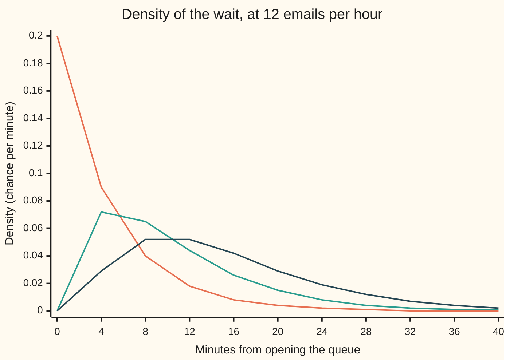
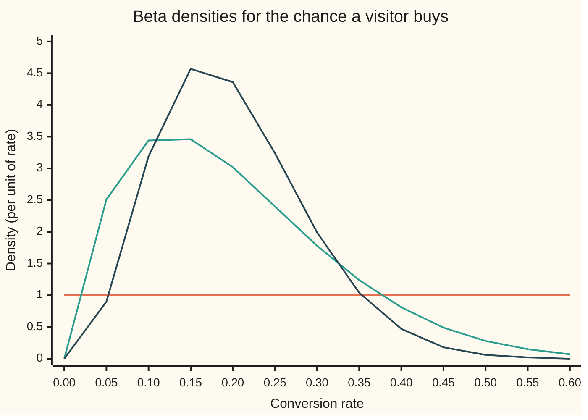

# Gamma and beta: waiting for several events, and a chance that is itself uncertain

Probability and statistics → Continuous Distributions → Sums of waits and uncertain chances → Gamma and beta

---

## General Overview

A help desk receives emails at a steady 12 per hour, independently, as on [exponential-distribution](03-exponential-distribution.md). The wait for the next email averages 5 minutes. The desk answers in batches: it opens the queue once three emails have piled up. How long does that take?

On average 15 minutes, three average gaps. The spread matters more. The wait runs past 20 minutes about 1 time in 4 (a chance of 0.2381) and past 30 minutes about 1 time in 16 (0.0620). The law of this wait is the **gamma distribution**.

A second question sits on the company's website. A new product page goes live, and the chance that a visitor buys, its **conversion rate**, is unknown. Similar pages converted around 20 percent, some 5, some 40. That belief about a chance is itself a distribution over the numbers from 0 to 1, usually a **beta distribution**. The one used here averages 0.2, gives 1 chance in 5 (0.1960) to a rate above 30 percent, and keeps its middle 90 percent between 4.1 and 42.9 percent.

Each law is a simple curve divided by the one integral that makes its area 1. And the two are joined: of the time the desk waits for ten emails, the share taken by the first two follows the same beta law as the conversion rate.

**The wait for several independent exponential events has the gamma law, whose constant is the gamma integral; a quantity between 0 and 1 shaped as a power times a power has the beta law, whose constant is the beta integral; and the beta integral is a ratio of gamma integrals.**

**What kind of fact this is:** two definitions of families of laws; that the wait for three emails follows the gamma law, and that the beta integral equals a ratio of gamma integrals, are theorems proved on this card in Why it works. Using the beta law for a belief about a conversion rate is a model: a choice of shape, not a fact about the page.

### The picture: waiting for one, two and three emails



Orange: the wait for one email, the exponential law. Green: for two. Dark blue: for three, peaking at 10 minutes with a long right tail. Each extra email pushes the hump right and spreads it out.

---

## The formula

Notation first, in words. $T$ is the wait, a random variable, in minutes; $t$ is one number of minutes. $\lambda$ (lambda) is the rate, 0.2 emails per minute. $\alpha$ (alpha) is the **shape**: for a wait, the number of emails awaited, here 3. $\Gamma(\alpha)$ (capital gamma of alpha) is a number, the **gamma integral**:

$$\Gamma(\alpha) = \int_0^\infty x^{\alpha-1}\,e^{-x}\,dx, \qquad \Gamma(\alpha+1) = \alpha\,\Gamma(\alpha), \qquad \Gamma(k) = (k-1)! \text{ for whole } k$$

**Read it aloud:** gamma of alpha is the area under a power of x times a falling exponential; each step up in alpha multiplies it by alpha, so on whole numbers it is a factorial shifted by one.

The gamma density, written T ~ Gamma(α, λ) and read "T follows the gamma law with shape alpha and rate lambda":

$$f_T(t) = \frac{\lambda^{\alpha}\,t^{\alpha-1}\,e^{-\lambda t}}{\Gamma(\alpha)} \quad (t > 0), \qquad E[T] = \frac{\alpha}{\lambda}, \qquad \mathrm{Var}(T) = \frac{\alpha}{\lambda^2}$$

**Read it aloud:** the chance per minute that the wait ends at t is a power of t that pulls the hump away from zero, times an exponential that pulls the tail down, divided by the constant that makes the area 1.

For a whole shape the chance of still waiting is a Poisson sum ([poisson](../03-Discrete%20Distributions/04-poisson.md)), the chance that fewer than α emails have come by time t; $j$ counts the emails that have come:

$$P(T > t) = e^{-\lambda t} \sum_{j=0}^{\alpha - 1} \frac{(\lambda t)^j}{j!}$$

Now the conversion rate. $V$ is the unknown chance a visitor buys; $v$ is one value of it, between 0 and 1. $a$ and $b$ are the two positive parameters. $B(a,b)$ is the **beta integral**. Written V ~ Beta(a, b):

$$f_V(v) = \frac{v^{a-1}(1-v)^{b-1}}{B(a,b)} \quad (0 < v < 1), \qquad B(a,b) = \int_0^1 v^{a-1}(1-v)^{b-1}\,dv = \frac{\Gamma(a)\,\Gamma(b)}{\Gamma(a+b)}$$

$$E[V] = \frac{a}{a+b}, \qquad \mathrm{Var}(V) = \frac{ab}{(a+b)^2\,(a+b+1)}$$

**Read it aloud:** belief in a conversion rate v rises with v to the power a − 1 and with 1 − v to the power b − 1; the average is a's share of a + b; and the larger a + b, the tighter the belief.

| Symbol | Plain meaning | In our example | Push it up and the answer… |
| --- | --- | --- | --- |
| $T$, $t$ | the wait for the α-th email, and one number of minutes | 20 minutes | larger t: a smaller chance of still waiting |
| $\lambda$ | the rate: emails per minute | 0.2 (12 per hour) | every wait shrinks in proportion |
| $\alpha$ | the shape: emails awaited | 3 | the hump moves right and widens |
| $\Gamma(\alpha)$ | the gamma integral, the gamma law's constant | Γ(3) = 2 | — |
| $V$, $v$ | the unknown conversion rate, and one value of it | 0.3 | — |
| $a$, $b$ | beta's two parameters | 2 and 8 | a up: average up; b up: average down |
| $B(a,b)$ | the beta integral, the beta law's constant | 1/72 = 0.013889 | — |
| $f_T$, $f_V$, $F$ | the two densities (chance per minute, chance per unit of rate), and a cumulative chance | peak of f_V: 3.46 near 0.15 | — |
| $E$, $\mathrm{Var}$ | the long-run average, and the variance | E[T] = 15, Var(T) = 75 | — |
| $j$ | the counter in the Poisson and binomial sums | 0 to α − 1 | — |
| $x$, $y$, $s$, $u$ | integration variables; in Step 4, x and y are two waits and u their total | — | — |
| $n$ | a + b − 1, a count of points in the binomial road | 9 | — |

### The picture: three beliefs about the conversion rate



Orange: Beta(1, 1), flat, every rate equally believable; it is the uniform law of [uniform-distribution](02-uniform-distribution.md). Green: Beta(2, 8), the prior used on this card, averaging 0.2. Dark blue: Beta(4, 16), the same average held twice as firmly. The chart stops at 0.6; beyond it the flat line stays at 1 and the other two fade towards 0.

### When it holds

- **Independent gaps at one steady rate.** If the three gaps were one gap counted three times, the chance of waiting past 30 minutes would be 0.1353, not 0.0620.
- **A positive shape.** At α = 0 the gamma integral is infinite and no constant rescues the curve. A non-whole α is allowed but no longer counts emails.
- **Rate, not scale.** Many books use a scale, 1/λ minutes. Reading the rate 0.2 as a scale of 0.2 minutes gives an average wait of 0.600 minutes, not 15.
- **For the beta, a quantity between 0 and 1, and positive a and b.** Otherwise the beta integral diverges at an end.
- **A prior is a choice.** Beta(2, 8) states a belief; a badly chosen one skews every answer until enough visitors outweigh it.

---

## Why it works

### Step 0: a density is a shape divided by its area

The situation fixes the shape of a curve. Dividing by its total area makes the area 1, and a curve with area 1 is a density ([densities-and-cdfs](01-densities-and-cdfs.md)). The gamma and beta laws are two shapes whose areas have names, Γ and B, and whose areas are linked.

### Step 1: the wait for three emails, from the Poisson count

The wait for the third email is longer than t exactly when fewer than three emails arrive in the first t minutes. The count in a window of t minutes is Poisson with average λt ([poisson](../03-Discrete%20Distributions/04-poisson.md)). So the chance of still waiting is the Poisson chance of 0, 1 or 2:

$$P(T > t) = e^{-\lambda t}\left(1 + \lambda t + \frac{(\lambda t)^2}{2}\right)$$

The density is the rate at which that chance falls. Differentiating, all but one term cancel in pairs:

$$f_T(t) = \frac{\lambda^3\,t^2\,e^{-\lambda t}}{2}$$

With α emails in place of three the same cancellation leaves λ^α t^(α−1) e^(−λt) divided by (α − 1)!.

<details>
<summary>Detailed proof: the cancellation, for any whole α</summary>

Write $S(t) = e^{-\lambda t} \sum_{j=0}^{\alpha-1} (\lambda t)^j / j!$. The product rule gives two sums. Differentiating the exponential gives $-\lambda e^{-\lambda t} \sum_{j=0}^{\alpha-1} (\lambda t)^j / j!$. Differentiating each power gives $e^{-\lambda t} \sum_{j=1}^{\alpha-1} \lambda (\lambda t)^{j-1} / (j-1)!$, which is the first sum again, with the opposite sign, missing its last term. Everything cancels except that last term:
$$-S'(t) = \lambda e^{-\lambda t} \frac{(\lambda t)^{\alpha-1}}{(\alpha-1)!} = \frac{\lambda^\alpha t^{\alpha-1} e^{-\lambda t}}{(\alpha-1)!}.$$
The density is $-S'(t)$ because $S(t) = 1 - F(t)$ and the density is the slope of $F$.

</details>

A second road never mentions counts. The wait for three is the wait for two plus one more exponential gap. For the total to land near t, the first two must land near some s and the last gap must last t − s; adding over every s gives an integral, a **convolution**. The check computes that integral numerically and gets 0.054134 at 10 minutes, matching the formula. A third road uses the moment generating function of shelf 02: independent gaps multiply their generating functions, and the cube of the exponential's is the gamma law's own.

### Step 2: the constant is the gamma integral, and it survives non-whole shapes

Put x = λt in the area of λ^α t^(α−1) e^(−λt). The rate cancels and what remains is

$$\int_0^\infty \lambda^\alpha t^{\alpha-1} e^{-\lambda t}\,dt = \int_0^\infty x^{\alpha-1} e^{-x}\,dx = \Gamma(\alpha).$$

So dividing by Γ(α) makes the area 1, and for whole α this is (α − 1)!, the constant Step 1 found. Integration by parts ([integration-by-parts](../../06-Calculus%20and%20analysis/04-Integrals/04-integration-by-parts.md)) gives the step rule: differentiate the power x^α, integrate e^(−x), and the boundary term vanishes at both ends:

$$\Gamma(\alpha + 1) = \alpha \int_0^\infty x^{\alpha-1} e^{-x}\,dx = \alpha\,\Gamma(\alpha).$$

Starting from Γ(1) = 1, the areas for α = 1, 2, 3, 4 are 1, 1, 2, 6. The check integrates each by Simpson's rule and gets 1.000000, 1.000000, 2.000000, 6.000000.

The integral makes sense for any α above 0, not only whole ones. At α = 1/2, putting x = u^2 turns it into twice the area under e^(−u^2) from 0 to infinity, which is √π by the Gaussian integral: 1.772454. So shape 1/2 is a genuine gamma law, though it counts no emails. It is the law behind the chi-square distribution.

### Step 3: reading the gamma's two numbers

Multiplying the density by t raises the power by one, which turns Γ(α) into Γ(α + 1):

$$E[T] = \frac{\Gamma(\alpha+1)}{\lambda\,\Gamma(\alpha)} = \frac{\alpha}{\lambda} = 15, \qquad E[T^2] = \frac{\alpha(\alpha+1)}{\lambda^2} = 300, \qquad \mathrm{Var}(T) = 300 - 225 = 75.$$

The same numbers come from adding. The wait is three independent gaps, each with average 5 and variance 25; averages add, and for independent gaps variances add, giving 15 and 75. The standard deviation is √75 = 8.660 minutes.

So the shape counts events and the rate sets the clock. Double λ and every wait halves. Raise α and the average grows like α but the standard deviation only like √α, so the wait gets steadier relative to its average. The peak, the **mode**, sits at (α − 1)/λ = 10 minutes, before the median of 13.370 and the average of 15: the long right tail drags the average out.

### Step 4: the beta integral is a ratio of gamma integrals

Take two independent gamma waits at the same rate, measured in average gaps so that the rate is 1 (a share does not depend on the clock): X for the first a emails and Y for the next b. The share of the total taken by the first part, V = X/(X + Y), lies between 0 and 1. Its law is found by trading the pair (X, Y) for the pair (total, share).

The joint density of X and Y is the product of their densities. Change variables to the total u and the share v, so X = uv and Y = u(1 − v); the **Jacobian**, the area stretch factor of this change, is u. The exponential depends only on the total, and the powers split:

$$\frac{x^{a-1}\,y^{b-1}\,e^{-(x+y)}}{\Gamma(a)\,\Gamma(b)} \cdot u \;=\; \frac{u^{a+b-1}\,e^{-u}}{\Gamma(a)\,\Gamma(b)} \cdot v^{a-1}(1-v)^{b-1}.$$

Integrate out the total: the u-part gives Γ(a + b). What is left is the density of the share, v^(a−1)(1 − v)^(b−1) times Γ(a + b)/(Γ(a)Γ(b)). It is a density, so its area is 1, and therefore

$$B(a,b) = \frac{\Gamma(a)\,\Gamma(b)}{\Gamma(a+b)}.$$

For the prior used here, B(2, 8) = 1! · 7!/9! = 1/72 = 0.013889. Simpson's rule on the curve v(1 − v)^7 gets the same.

<details>
<summary>Detailed proof: the change of variables</summary>

The map from (u, v), with u > 0 and 0 < v < 1, to (x, y) = (uv, u(1 − v)) is one to one onto the positive quarter-plane, with inverse u = x + y, v = x/(x + y). Its matrix of partial derivatives has rows `(v, u)` and `(1 − v, −u)`, with determinant v(−u) − u(1 − v) = −u, so the area factor is |−u| = u. Then
$$\Gamma(a)\,\Gamma(b) = \int_0^\infty\!\!\int_0^\infty x^{a-1} y^{b-1} e^{-(x+y)}\,dx\,dy = \int_0^\infty u^{a+b-1} e^{-u}\,du \int_0^1 v^{a-1}(1-v)^{b-1}\,dv = \Gamma(a+b)\,B(a,b).$$
Every integrand is positive, so the order of integration can be swapped freely. The factorisation also shows that the total and the share are independent: the share of the wait taken by the first two emails says nothing about how long the whole wait was.

</details>

This is why the conversion rate and the desk share a law. Of the time spent waiting for ten emails, the fraction taken by the first two is Beta(2, 8). The check's simulation builds V exactly that way, from ten exponential gaps, and never touches a beta formula.

### Step 5: reading the beta's two numbers

Multiplying by v raises a by one: E[V] = B(a + 1, b)/B(a, b) = a/(a + b) = 0.2000. Raising a again gives E[V^2] = a(a + 1)/((a + b)(a + b + 1)) = 0.054545, and the variance is 0.054545 − 0.04 = 0.014545, a standard deviation of 0.1206.

Read the parameters as a split and a total. The split a : b sets the average. The total a + b, the **concentration**, sets how firmly it is held. Beta(4, 16) has the same average, standard deviation 0.0873, and 0.1332 above 30 percent instead of 0.1960. Beta(1, 1) is flat: 0.7000 above 30 percent, the width from 0.3 to 1. On [beta-binomial](../10-Bayesian%20Inference/02-beta-binomial.md), data add buyers to a and non-buyers to b, so a + b behaves like a number of visitors already seen. The mode of Beta(2, 8) is (a − 1)/(a + b − 2) = 0.1250, below the average.

### Step 6: whole parameters turn beta tails into binomial sums

For whole a and b, V has the same law as the a-th smallest of n = a + b − 1 points dropped independently and uniformly on the line from 0 to 1. So V is above v exactly when fewer than a of those points fall below v, a binomial count:

$$P(V > v) = \sum_{j=0}^{a-1} \binom{n}{j} v^j (1 - v)^{n-j}.$$

<details>
<summary>Detailed proof: the a-th smallest of n uniform points</summary>

For the a-th smallest point to sit in a thin strip at v of width dv, one point must be in the strip (n choices), a − 1 of the other n − 1 below it and the remaining b − 1 above. The chance is n · C(n − 1, a − 1) · v^(a−1) (1 − v)^(b−1) dv. Since n · C(n − 1, a − 1) = n!/((a − 1)!(b − 1)!) = (a + b − 1)!/((a − 1)!(b − 1)!) = Γ(a + b)/(Γ(a)Γ(b)) = 1/B(a, b), this is the beta density. Counting alone recovers the constant of Step 4.

</details>


---

## Worked numbers, by hand

**The desk.** Rate λ = 0.2 per minute, three emails awaited: how often does the batch take more than 20 minutes?

| Step | Arithmetic | Value |
| --- | --- | --- |
| emails expected in 20 minutes | 0.2 × 20 | λt = 4 |
| chance of none | e^(−4) | 0.018316 |
| chance of 0, 1 or 2, before the common factor | 1 + 4 + 4^2/2 | 13 |
| chance of fewer than three by minute 20 | 13 × 0.018316 | **0.2381** |
| average wait | 3 / 0.2 | 15.000 minutes |
| standard deviation | √3 / 0.2 | 8.660 minutes |

About one batch in four takes longer than 20 minutes, and one in sixteen longer than 30 (0.0620), so the first email of a batch waits more than half an hour about 6 times in 100.

**The page.** Prior Beta(2, 8): how believable is a conversion rate above 30 percent?

| Step | Arithmetic | Value |
| --- | --- | --- |
| points for the binomial road | n = 2 + 8 − 1 | 9 |
| V above 0.3 means fewer than 2 of 9 points below 0.3 | none, or exactly one | two terms |
| none below | 0.7^9 | 0.040354 |
| exactly one below | 9 × 0.3 × 0.7^8 | 0.155650 |
| chance the rate is above 0.3 | 0.040354 + 0.155650 | **0.1960** |
| average belief | 2 / (2 + 8) | 0.2000 |

Before any visitor arrives, a conversion rate above 30 percent carries about 1 chance in 5, and one below 10 percent carries 0.2252, a little more.

### What breaks if you drop a piece

The right answers: P(T > 20) = 0.2381, P(T > 30) = 0.0620, and for the page, average 0.2000 and P(V > 0.3) = 0.1960.

| Mistake | Comes out at | What went wrong |
| --- | --- | --- |
| Rate 0.2 per minute read as a scale of 0.2 minutes | average wait 0.600 minutes | the second parameter was inverted |
| Γ(3) read as 3! = 6 | P(T > 20) = 0.0794 | Γ(k) is (k − 1)!, one factorial lower |
| One gap counted three times: the gaps not independent | variance 225.000; P(T > 20) = 0.2636; P(T > 30) = 0.1353 | variances add only for independent gaps; a tripled gap has three times the spread |
| Beta(8, 2) written for Beta(2, 8) | average 0.8000; P(V > 0.3) = 0.9996 | the first parameter goes with v, the successes |
| Second moment called the variance | 0.054545 | the squared average, 0.04, was not subtracted |

The third row is a hypothesis dropped, not a slip; it equals an exponential wait with the right 15-minute average.

---

## Code, from first principles, and it actually runs

Nothing imported contains the answer: no statistics module, no random module, no gamma function. Three roads: the closed forms (Poisson sum for the wait, binomial sum for the rate); Simpson's rule on the densities, which also builds the gamma integral, Γ(1/2), the beta integral and the convolution; and a simulation of 100,000 waits and 100,000 shares from a SplitMix64 generator (a small, written-out source of random bits, seed 20260928) that only adds exponential gaps, with standard errors. The asserts compare roads, never a number with itself.

### Python

```python
# Gamma and beta distributions -- the check behind the card.  Nothing imported holds the answer.
# Help desk: emails arrive at 12 per hour, rate LAM = 0.2 per minute; T = the wait for the 3rd.
# Shop page: the chance V that a visitor buys, with a Beta(2, 8) prior.  Roads: closed forms
# (the gamma integral, Poisson and binomial sums); Simpson's rule on the densities; and a
# seeded simulation that adds exponential gaps and never uses a gamma or beta formula.
from math import exp, log, sqrt, pi

LAM, K, A, B = 0.2, 3, 2, 8                  # per minute; emails; the prior's two parameters

def simpson(g, a, b, n=4000):                # Simpson's rule, n even
    h = (b - a) / n
    s = g(a) + g(b)
    for i in range(1, n):
        s += (4 if i % 2 else 2) * g(a + i * h)
    return s * h / 3

def fact(n):
    out = 1
    for j in range(2, n + 1):
        out *= j
    return out

def gdens(t, k=K, lam=LAM):                  # gamma density: shape k (whole), rate lam
    return lam ** k * t ** (k - 1) * exp(-lam * t) / fact(k - 1)

def gsurv(t, k=K, lam=LAM):                  # P(T > t) = P(fewer than k emails by t), Poisson sum
    return exp(-lam * t) * sum((lam * t) ** j / fact(j) for j in range(k))

def bdens(v, a=A, b=B):                      # beta density, whole a and b: 1/B(a,b) = (a+b-1)!/((a-1)!(b-1)!)
    return fact(a + b - 1) / (fact(a - 1) * fact(b - 1)) * v ** (a - 1) * (1 - v) ** (b - 1)

def btail(v, a=A, b=B):                      # P(V > v) = P(fewer than a of a+b-1 uniforms below v)
    n = a + b - 1
    return sum(fact(n) // (fact(j) * fact(n - j)) * v ** j * (1 - v) ** (n - j) for j in range(a))

def bisect(g, target, lo, hi):               # g decreasing: find x with g(x) = target
    for _ in range(100):
        mid = (lo + hi) / 2
        lo, hi = (mid, hi) if g(mid) > target else (lo, mid)
    return (lo + hi) / 2

MASK = (1 << 64) - 1
state = 20260928                             # SplitMix64, seed 20260928
def uniform():                               # strictly between 0 and 1
    global state
    state = (state + 0x9E3779B97F4A7C15) & MASK
    z = state
    z = ((z ^ (z >> 30)) * 0xBF58476D1CE4E5B9) & MASK
    z = ((z ^ (z >> 27)) * 0x94D049BB133111EB) & MASK
    return (((z ^ (z >> 31)) >> 11) + 0.5) / 2.0 ** 53

# the gamma integral, and the three-email density built by convolution
gam = [simpson(lambda t: t ** (n - 1) * exp(-t), 0.0, 80.0, 8000) for n in (1, 2, 3, 4)]
print("gamma integral by Simpson, n = 1..4: " + ", ".join(f"{g:.6f}" for g in gam)
      + "; (n-1)! = " + ", ".join(str(fact(n - 1)) for n in (1, 2, 3, 4)))
half = 2 * simpson(lambda u: exp(-u * u), 0.0, 8.0)
print(f"Gamma(1/2) = 2 x area under exp(-u^2): {half:.6f}; sqrt(pi) = {sqrt(pi):.6f}")
conv = [simpson(lambda s: gdens(s, 2) * gdens(t - s, 1), 0.0, t) for t in (10.0, 20.0)]
print(f"3-email density at 10, 20 min: convolution {conv[0]:.6f}, {conv[1]:.6f}; "
      f"formula {gdens(10.0):.6f}, {gdens(20.0):.6f}")
# T, the wait for three emails
mean_s = simpson(lambda t: t * gdens(t), 0.0, 200.0, 8000)
var_s = simpson(lambda t: (t - mean_s) ** 2 * gdens(t), 0.0, 200.0, 8000)
median = bisect(gsurv, 0.5, 0.0, 100.0)
print(f"T: mean k/lam = {K / LAM:.3f}, by Simpson {mean_s:.3f}; variance k/lam^2 = {K / LAM ** 2:.3f}, "
      f"by Simpson {var_s:.3f}; sd {sqrt(K) / LAM:.3f}")
print(f"T: mode (k-1)/lam = {(K - 1) / LAM:.3f} min; median by bisection {median:.3f} min; "
      f"E[T^2] = k(k+1)/lam^2 = {K * (K + 1) / LAM ** 2:.3f}; one gap: mean {1 / LAM:.3f}, variance {1 / LAM ** 2:.3f}")
for t in (20.0, 30.0):
    print(f"P(T > {t:.0f}): Poisson sum {gsurv(t):.4f}; 1 - Simpson area {1 - simpson(gdens, 0.0, t):.4f}")
print(f"P(T <= 10): {1 - gsurv(10.0):.4f}; e^-4 = {exp(-4):.6f}, 13 e^-4 = {13 * exp(-4):.4f}")
# V, the conversion rate
norm_s = simpson(lambda v: v ** (A - 1) * (1 - v) ** (B - 1), 0.0, 1.0)
mean_b = A / (A + B)
var_b = A * B / ((A + B) ** 2 * (A + B + 1))
bmean_s = simpson(lambda v: v * bdens(v), 0.0, 1.0)
bvar_s = simpson(lambda v: (v - bmean_s) ** 2 * bdens(v), 0.0, 1.0)
print(f"B(2,8) by Simpson {norm_s:.6f}; 1! 7! / 9! = 1/{fact(9) // fact(7)} = {1 / 72:.6f}")
print(f"V: mean a/(a+b) = {mean_b:.4f}, by Simpson {bmean_s:.4f}; variance {var_b:.6f}, "
      f"by Simpson {bvar_s:.6f}; sd {sqrt(var_b):.4f}; mode {(A - 1) / (A + B - 2):.4f}")
print(f"P(V > 0.3): binomial sum {btail(0.3):.4f}; Simpson area {simpson(bdens, 0.3, 1.0):.4f}; "
      f"0.7^9 = {0.7 ** 9:.6f}, 9(0.3)(0.7^8) = {9 * 0.3 * 0.7 ** 8:.6f}")
lo90, hi90 = bisect(btail, 0.95, 0.0, 1.0), bisect(btail, 0.05, 0.0, 1.0)
print(f"P(V < 0.1): {1 - btail(0.1):.4f}; middle 90 percent: {lo90:.4f} to {hi90:.4f}")
for a, b in ((4, 16), (1, 1)):
    print(f"Beta({a},{b}): mean {a / (a + b):.4f}, sd {sqrt(a * b / ((a + b) ** 2 * (a + b + 1))):.4f}, "
          f"P(V > 0.3) {btail(0.3, a, b):.4f}")
# simulation: three exponential gaps for T; share of the first 2 of 10 gaps for V
N = 100_000
st, st2, t20, t30 = 0.0, 0.0, 0, 0
for _ in range(N):
    t = sum(-log(uniform()) / LAM for _ in range(K))
    st, st2, t20, t30 = st + t, st2 + t * t, t20 + (t > 20), t30 + (t > 30)
sm = st / N
ssd = sqrt(st2 / N - sm * sm)
p20, p30 = t20 / N, t30 / N
sv, sv2, v3 = 0.0, 0.0, 0
for _ in range(N):
    gaps = [-log(uniform()) for _ in range(A + B)]
    v = sum(gaps[:A]) / sum(gaps)
    sv, sv2, v3 = sv + v, sv2 + v * v, v3 + (v > 0.3)
vm = sv / N
vvar = sv2 / N - vm * vm
pv = v3 / N
print(f"simulated {N} waits and {N} shares, seed 20260928; estimate (standard error)")
print(f"  T: mean {sm:.3f} ({ssd / sqrt(N):.3f}), sd {ssd:.3f}; P(T > 20) {p20:.4f} "
      f"({sqrt(p20 * (1 - p20) / N):.4f}); P(T > 30) {p30:.4f} ({sqrt(p30 * (1 - p30) / N):.4f})")
print(f"  V: mean {vm:.4f} ({sqrt(vvar / N):.4f}), variance {vvar:.6f}; P(V > 0.3) {pv:.4f} "
      f"({sqrt(pv * (1 - pv) / N):.4f})")
# what breaks
print(f"mistake, rate 0.2 read as scale 0.2 min: mean {K * 0.2:.3f} min")
print(f"mistake, Gamma(3) read as 3! = 6: P(T > 20) {gsurv(20.0) * fact(2) / fact(3):.4f}")
print(f"mistake, one gap counted three times: variance {9 / LAM ** 2:.3f}; "
      f"P(T > 20) {exp(-LAM * 20 / 3):.4f}; P(T > 30) {exp(-LAM * 30 / 3):.4f}")
print(f"mistake, Beta(8,2) for Beta(2,8): mean {B / (A + B):.4f}; P(V > 0.3) {btail(0.3, B, A):.4f}")
print(f"mistake, second moment called the variance: {A * (A + 1) / ((A + B) * (A + B + 1)):.6f}; "
      f"squared average {mean_b ** 2:.6f}")
print(f"try: 5 emails, P(T > 20) {gsurv(20.0, 5):.4f}; 24 an hour, P(T > 20) {gsurv(20.0, 3, 0.4):.4f}; "
      f"Beta(20,80) sd {sqrt(1600 / (100 ** 2 * 101)):.4f}")
# figures
ts = [4.0 * i for i in range(11)]
vs = [0.05 * i for i in range(13)]
print("figure, minutes: " + ", ".join(f"{t:.0f}" for t in ts))
for k in (1, 2, 3):
    print(f"figure, {k} email(s): " + ", ".join(f"{gdens(t, k):.3f}" for t in ts))
print("figure, rate: " + ", ".join(f"{v:.2f}" for v in vs))
for a, b in ((1, 1), (2, 8), (4, 16)):
    print(f"figure, Beta({a},{b}): " + ", ".join(f"{bdens(v, a, b):.2f}" for v in vs))
# asserts: every one compares two independent roads
assert all(abs(gam[n - 1] - fact(n - 1)) < 1e-9 for n in (1, 2, 3, 4))
assert abs(half - sqrt(pi)) < 1e-9
assert all(abs(c - gdens(t)) < 1e-9 for c, t in zip(conv, (10.0, 20.0)))
assert abs(mean_s - K / LAM) < 1e-6 and abs(var_s - K / LAM ** 2) < 1e-5
assert abs(gsurv(20.0) - (1 - simpson(gdens, 0.0, 20.0))) < 1e-10
assert abs(norm_s - 1 / 72) < 1e-12
assert abs(bmean_s - mean_b) < 1e-10 and abs(bvar_s - var_b) < 1e-10
assert abs(btail(0.3) - simpson(bdens, 0.3, 1.0)) < 1e-10
assert abs(sm - K / LAM) < 4 * ssd / sqrt(N) and abs(p20 - gsurv(20.0)) < 4 * sqrt(p20 * (1 - p20) / N)
assert abs(vm - mean_b) < 4 * sqrt(vvar / N) and abs(pv - btail(0.3)) < 4 * sqrt(pv * (1 - pv) / N)
```

**Ran 2026-09-28 on macOS, Python 3.14.6, standard library only. All checks passed. Output, pasted from the run:**

```
gamma integral by Simpson, n = 1..4: 1.000000, 1.000000, 2.000000, 6.000000; (n-1)! = 1, 1, 2, 6
Gamma(1/2) = 2 x area under exp(-u^2): 1.772454; sqrt(pi) = 1.772454
3-email density at 10, 20 min: convolution 0.054134, 0.029305; formula 0.054134, 0.029305
T: mean k/lam = 15.000, by Simpson 15.000; variance k/lam^2 = 75.000, by Simpson 75.000; sd 8.660
T: mode (k-1)/lam = 10.000 min; median by bisection 13.370 min; E[T^2] = k(k+1)/lam^2 = 300.000; one gap: mean 5.000, variance 25.000
P(T > 20): Poisson sum 0.2381; 1 - Simpson area 0.2381
P(T > 30): Poisson sum 0.0620; 1 - Simpson area 0.0620
P(T <= 10): 0.3233; e^-4 = 0.018316, 13 e^-4 = 0.2381
B(2,8) by Simpson 0.013889; 1! 7! / 9! = 1/72 = 0.013889
V: mean a/(a+b) = 0.2000, by Simpson 0.2000; variance 0.014545, by Simpson 0.014545; sd 0.1206; mode 0.1250
P(V > 0.3): binomial sum 0.1960; Simpson area 0.1960; 0.7^9 = 0.040354, 9(0.3)(0.7^8) = 0.155650
P(V < 0.1): 0.2252; middle 90 percent: 0.0410 to 0.4291
Beta(4,16): mean 0.2000, sd 0.0873, P(V > 0.3) 0.1332
Beta(1,1): mean 0.5000, sd 0.2887, P(V > 0.3) 0.7000
simulated 100000 waits and 100000 shares, seed 20260928; estimate (standard error)
  T: mean 15.014 (0.028), sd 8.710; P(T > 20) 0.2389 (0.0013); P(T > 30) 0.0625 (0.0008)
  V: mean 0.2002 (0.0004), variance 0.014592; P(V > 0.3) 0.1975 (0.0013)
mistake, rate 0.2 read as scale 0.2 min: mean 0.600 min
mistake, Gamma(3) read as 3! = 6: P(T > 20) 0.0794
mistake, one gap counted three times: variance 225.000; P(T > 20) 0.2636; P(T > 30) 0.1353
mistake, Beta(8,2) for Beta(2,8): mean 0.8000; P(V > 0.3) 0.9996
mistake, second moment called the variance: 0.054545; squared average 0.040000
try: 5 emails, P(T > 20) 0.6288; 24 an hour, P(T > 20) 0.0138; Beta(20,80) sd 0.0398
figure, minutes: 0, 4, 8, 12, 16, 20, 24, 28, 32, 36, 40
figure, 1 email(s): 0.200, 0.090, 0.040, 0.018, 0.008, 0.004, 0.002, 0.001, 0.000, 0.000, 0.000
figure, 2 email(s): 0.000, 0.072, 0.065, 0.044, 0.026, 0.015, 0.008, 0.004, 0.002, 0.001, 0.001
figure, 3 email(s): 0.000, 0.029, 0.052, 0.052, 0.042, 0.029, 0.019, 0.012, 0.007, 0.004, 0.002
figure, rate: 0.00, 0.05, 0.10, 0.15, 0.20, 0.25, 0.30, 0.35, 0.40, 0.45, 0.50, 0.55, 0.60
figure, Beta(1,1): 1.00, 1.00, 1.00, 1.00, 1.00, 1.00, 1.00, 1.00, 1.00, 1.00, 1.00, 1.00, 1.00
figure, Beta(2,8): 0.00, 2.51, 3.44, 3.46, 3.02, 2.40, 1.78, 1.24, 0.81, 0.49, 0.28, 0.15, 0.07
figure, Beta(4,16): 0.00, 0.90, 3.19, 4.57, 4.36, 3.24, 1.99, 1.04, 0.47, 0.18, 0.06, 0.02, 0.00
```

### Rust

```rust
// Gamma and beta distributions -- the same check as the Python, in Rust.  No crates.
// Help desk: emails arrive at 12 per hour, rate LAM = 0.2 per minute; T = the wait for the 3rd.
// Shop page: the chance V that a visitor buys, with a Beta(2, 8) prior.  Roads: closed forms
// (the gamma integral, Poisson and binomial sums); Simpson's rule on the densities; and a
// seeded simulation that adds exponential gaps and never uses a gamma or beta formula.
use std::f64::consts::PI;

const LAM: f64 = 0.2; // per minute
const K: i32 = 3; // emails
const A: i32 = 2; const B: i32 = 8; // the prior's two parameters

fn simpson(g: &dyn Fn(f64) -> f64, a: f64, b: f64, n: usize) -> f64 { // n even
    let h = (b - a) / n as f64;
    let mut s = g(a) + g(b);
    for i in 1..n {
        s += if i % 2 == 1 { 4.0 } else { 2.0 } * g(a + i as f64 * h);
    }
    s * h / 3.0
}

fn fact(n: i32) -> f64 { (2..=n).fold(1.0, |acc, j| acc * j as f64) }

fn gdens(t: f64, k: i32, lam: f64) -> f64 { // gamma density: shape k (whole), rate lam
    lam.powi(k) * t.powi(k - 1) * (-lam * t).exp() / fact(k - 1)
}

fn gsurv(t: f64, k: i32, lam: f64) -> f64 { // P(T > t) = P(fewer than k emails by t), Poisson sum
    let mut s = 0.0;
    for j in 0..k {
        s += (lam * t).powi(j) / fact(j);
    }
    (-lam * t).exp() * s
}

fn bdens(v: f64, a: i32, b: i32) -> f64 { // beta density, whole a and b
    fact(a + b - 1) / (fact(a - 1) * fact(b - 1)) * v.powi(a - 1) * (1.0 - v).powi(b - 1)
}

fn btail(v: f64, a: i32, b: i32) -> f64 { // P(V > v) = P(fewer than a of a+b-1 uniforms below v)
    let n = a + b - 1;
    let mut s = 0.0;
    for j in 0..a {
        s += (fact(n) / (fact(j) * fact(n - j))).round() * v.powi(j) * (1.0 - v).powi(n - j);
    }
    s
}

fn bisect(g: &dyn Fn(f64) -> f64, target: f64, mut lo: f64, mut hi: f64) -> f64 { // g decreasing
    for _ in 0..100 {
        let mid = (lo + hi) / 2.0;
        if g(mid) > target { lo = mid } else { hi = mid }
    }
    (lo + hi) / 2.0
}

struct SplitMix(u64); // SplitMix64, seed 20260928

impl SplitMix {
    fn uniform(&mut self) -> f64 { // strictly between 0 and 1
        self.0 = self.0.wrapping_add(0x9E3779B97F4A7C15);
        let mut z = self.0;
        z = (z ^ (z >> 30)).wrapping_mul(0xBF58476D1CE4E5B9);
        z = (z ^ (z >> 27)).wrapping_mul(0x94D049BB133111EB);
        (((z ^ (z >> 31)) >> 11) as f64 + 0.5) / 2f64.powi(53)
    }
}

fn join(xs: &[f64], d: usize) -> String {
    xs.iter().map(|x| format!("{:.*}", d, x)).collect::<Vec<_>>().join(", ")
}

fn main() {
    let g3 = |t: f64| gdens(t, K, LAM);
    let b28 = |v: f64| bdens(v, A, B);
    // the gamma integral, and the three-email density built by convolution
    let gam: Vec<f64> = (1..=4).map(|n| simpson(&|t: f64| t.powi(n - 1) * (-t).exp(), 0.0, 80.0, 8000)).collect();
    let facts: Vec<String> = (1..=4).map(|n| format!("{}", fact(n - 1))).collect();
    println!("gamma integral by Simpson, n = 1..4: {}; (n-1)! = {}", join(&gam, 6), facts.join(", "));
    let half = 2.0 * simpson(&|u: f64| (-u * u).exp(), 0.0, 8.0, 4000);
    println!("Gamma(1/2) = 2 x area under exp(-u^2): {:.6}; sqrt(pi) = {:.6}", half, PI.sqrt());
    let conv: Vec<f64> = [10.0, 20.0].iter().map(|&t: &f64| simpson(&|s: f64| gdens(s, 2, LAM) * gdens(t - s, 1, LAM), 0.0, t, 4000)).collect();
    println!("3-email density at 10, 20 min: convolution {:.6}, {:.6}; formula {:.6}, {:.6}", conv[0], conv[1], g3(10.0), g3(20.0));
    // T, the wait for three emails
    let (kf, surv) = (K as f64, |t: f64| gsurv(t, K, LAM));
    let mean_s = simpson(&|t: f64| t * g3(t), 0.0, 200.0, 8000);
    let var_s = simpson(&|t: f64| (t - mean_s).powi(2) * g3(t), 0.0, 200.0, 8000);
    let median = bisect(&surv, 0.5, 0.0, 100.0);
    println!("T: mean k/lam = {:.3}, by Simpson {:.3}; variance k/lam^2 = {:.3}, by Simpson {:.3}; sd {:.3}", kf / LAM, mean_s, kf / LAM.powi(2), var_s, kf.sqrt() / LAM);
    println!("T: mode (k-1)/lam = {:.3} min; median by bisection {:.3} min; E[T^2] = k(k+1)/lam^2 = {:.3}; one gap: mean {:.3}, variance {:.3}", (kf - 1.0) / LAM, median, kf * (kf + 1.0) / LAM.powi(2), 1.0 / LAM, 1.0 / LAM.powi(2));
    for t in [20.0f64, 30.0] {
        println!("P(T > {:.0}): Poisson sum {:.4}; 1 - Simpson area {:.4}", t, surv(t), 1.0 - simpson(&g3, 0.0, t, 4000));
    }
    println!("P(T <= 10): {:.4}; e^-4 = {:.6}, 13 e^-4 = {:.4}", 1.0 - surv(10.0), (-4.0f64).exp(), 13.0 * (-4.0f64).exp());
    // V, the conversion rate
    let (af, bf) = (A as f64, B as f64);
    let norm_s = simpson(&|v: f64| v.powi(A - 1) * (1.0 - v).powi(B - 1), 0.0, 1.0, 4000);
    let mean_b = af / (af + bf);
    let var_b = af * bf / ((af + bf).powi(2) * (af + bf + 1.0));
    let bmean_s = simpson(&|v: f64| v * b28(v), 0.0, 1.0, 4000);
    let bvar_s = simpson(&|v: f64| (v - bmean_s).powi(2) * b28(v), 0.0, 1.0, 4000);
    println!("B(2,8) by Simpson {:.6}; 1! 7! / 9! = 1/{} = {:.6}", norm_s, fact(9) / fact(7), 1.0 / 72.0);
    println!("V: mean a/(a+b) = {:.4}, by Simpson {:.4}; variance {:.6}, by Simpson {:.6}; sd {:.4}; mode {:.4}", mean_b, bmean_s, var_b, bvar_s, var_b.sqrt(), (af - 1.0) / (af + bf - 2.0));
    let tail = |v: f64| btail(v, A, B);
    println!("P(V > 0.3): binomial sum {:.4}; Simpson area {:.4}; 0.7^9 = {:.6}, 9(0.3)(0.7^8) = {:.6}", tail(0.3), simpson(&b28, 0.3, 1.0, 4000), 0.7f64.powi(9), 9.0 * 0.3 * 0.7f64.powi(8));
    let (lo90, hi90) = (bisect(&tail, 0.95, 0.0, 1.0), bisect(&tail, 0.05, 0.0, 1.0));
    println!("P(V < 0.1): {:.4}; middle 90 percent: {:.4} to {:.4}", 1.0 - tail(0.1), lo90, hi90);
    for (a, b) in [(4, 16), (1, 1)] {
        let (x, y) = (a as f64, b as f64);
        println!("Beta({},{}): mean {:.4}, sd {:.4}, P(V > 0.3) {:.4}", a, b, x / (x + y), (x * y / ((x + y).powi(2) * (x + y + 1.0))).sqrt(), btail(0.3, a, b));
    }
    // simulation: three exponential gaps for T; share of the first 2 of 10 gaps for V
    let n = 100_000usize;
    let nf = n as f64;
    let mut rng = SplitMix(20260928);
    let (mut st, mut st2, mut t20, mut t30) = (0.0, 0.0, 0usize, 0usize);
    for _ in 0..n {
        let mut t = 0.0;
        for _ in 0..K { t += -rng.uniform().ln() / LAM; }
        st += t; st2 += t * t;
        t20 += (t > 20.0) as usize; t30 += (t > 30.0) as usize;
    }
    let sm = st / nf;
    let ssd = (st2 / nf - sm * sm).sqrt();
    let (p20, p30) = (t20 as f64 / nf, t30 as f64 / nf);
    let (mut sv, mut sv2, mut v3) = (0.0, 0.0, 0usize);
    for _ in 0..n {
        let gaps: Vec<f64> = (0..A + B).map(|_| -rng.uniform().ln()).collect();
        let v = gaps[..A as usize].iter().sum::<f64>() / gaps.iter().sum::<f64>();
        sv += v; sv2 += v * v;
        if v > 0.3 { v3 += 1 }
    }
    let vm = sv / nf;
    let vvar = sv2 / nf - vm * vm;
    let pv = v3 as f64 / nf;
    let se = |p: f64| (p * (1.0 - p) / nf).sqrt();
    println!("simulated {} waits and {} shares, seed 20260928; estimate (standard error)", n, n);
    println!("  T: mean {:.3} ({:.3}), sd {:.3}; P(T > 20) {:.4} ({:.4}); P(T > 30) {:.4} ({:.4})", sm, ssd / nf.sqrt(), ssd, p20, se(p20), p30, se(p30));
    println!("  V: mean {:.4} ({:.4}), variance {:.6}; P(V > 0.3) {:.4} ({:.4})", vm, (vvar / nf).sqrt(), vvar, pv, se(pv));
    // what breaks
    println!("mistake, rate 0.2 read as scale 0.2 min: mean {:.3} min", kf * 0.2);
    println!("mistake, Gamma(3) read as 3! = 6: P(T > 20) {:.4}", surv(20.0) * fact(2) / fact(3));
    println!("mistake, one gap counted three times: variance {:.3}; P(T > 20) {:.4}; P(T > 30) {:.4}", 9.0 / LAM.powi(2), (-LAM * 20.0 / 3.0).exp(), (-LAM * 30.0 / 3.0).exp());
    println!("mistake, Beta(8,2) for Beta(2,8): mean {:.4}; P(V > 0.3) {:.4}", bf / (af + bf), btail(0.3, B, A));
    println!("mistake, second moment called the variance: {:.6}; squared average {:.6}", af * (af + 1.0) / ((af + bf) * (af + bf + 1.0)), mean_b.powi(2));
    println!("try: 5 emails, P(T > 20) {:.4}; 24 an hour, P(T > 20) {:.4}; Beta(20,80) sd {:.4}", gsurv(20.0, 5, LAM), gsurv(20.0, 3, 0.4), (1600.0f64 / (100.0f64.powi(2) * 101.0)).sqrt());
    // figures
    let ts: Vec<f64> = (0..11).map(|i| 4.0 * i as f64).collect();
    let vs: Vec<f64> = (0..13).map(|i| 0.05 * i as f64).collect();
    println!("figure, minutes: {}", join(&ts, 0));
    for k in 1..=3 {
        println!("figure, {} email(s): {}", k, join(&ts.iter().map(|&t| gdens(t, k, LAM)).collect::<Vec<_>>(), 3));
    }
    println!("figure, rate: {}", join(&vs, 2));
    for (a, b) in [(1, 1), (2, 8), (4, 16)] {
        println!("figure, Beta({},{}): {}", a, b, join(&vs.iter().map(|&v| bdens(v, a, b)).collect::<Vec<_>>(), 2));
    }
    // asserts: every one compares two independent roads
    for n in 1..=4 { assert!((gam[(n - 1) as usize] - fact(n - 1)).abs() < 1e-9); }
    assert!((half - PI.sqrt()).abs() < 1e-9);
    for (c, t) in conv.iter().zip([10.0, 20.0]) { assert!((c - g3(t)).abs() < 1e-9); }
    assert!((mean_s - kf / LAM).abs() < 1e-6 && (var_s - kf / LAM.powi(2)).abs() < 1e-5);
    assert!((surv(20.0) - (1.0 - simpson(&g3, 0.0, 20.0, 4000))).abs() < 1e-10);
    assert!((norm_s - 1.0 / 72.0).abs() < 1e-12);
    assert!((bmean_s - mean_b).abs() < 1e-10 && (bvar_s - var_b).abs() < 1e-10);
    assert!((tail(0.3) - simpson(&b28, 0.3, 1.0, 4000)).abs() < 1e-10);
    assert!((sm - kf / LAM).abs() < 4.0 * ssd / nf.sqrt() && (p20 - surv(20.0)).abs() < 4.0 * se(p20));
    assert!((vm - mean_b).abs() < 4.0 * (vvar / nf).sqrt() && (pv - tail(0.3)).abs() < 4.0 * se(pv));
}
```

**Ran 2026-09-28 on macOS, rustc 1.98.1, no crates. All checks passed. Output, pasted from the run:**

```
gamma integral by Simpson, n = 1..4: 1.000000, 1.000000, 2.000000, 6.000000; (n-1)! = 1, 1, 2, 6
Gamma(1/2) = 2 x area under exp(-u^2): 1.772454; sqrt(pi) = 1.772454
3-email density at 10, 20 min: convolution 0.054134, 0.029305; formula 0.054134, 0.029305
T: mean k/lam = 15.000, by Simpson 15.000; variance k/lam^2 = 75.000, by Simpson 75.000; sd 8.660
T: mode (k-1)/lam = 10.000 min; median by bisection 13.370 min; E[T^2] = k(k+1)/lam^2 = 300.000; one gap: mean 5.000, variance 25.000
P(T > 20): Poisson sum 0.2381; 1 - Simpson area 0.2381
P(T > 30): Poisson sum 0.0620; 1 - Simpson area 0.0620
P(T <= 10): 0.3233; e^-4 = 0.018316, 13 e^-4 = 0.2381
B(2,8) by Simpson 0.013889; 1! 7! / 9! = 1/72 = 0.013889
V: mean a/(a+b) = 0.2000, by Simpson 0.2000; variance 0.014545, by Simpson 0.014545; sd 0.1206; mode 0.1250
P(V > 0.3): binomial sum 0.1960; Simpson area 0.1960; 0.7^9 = 0.040354, 9(0.3)(0.7^8) = 0.155650
P(V < 0.1): 0.2252; middle 90 percent: 0.0410 to 0.4291
Beta(4,16): mean 0.2000, sd 0.0873, P(V > 0.3) 0.1332
Beta(1,1): mean 0.5000, sd 0.2887, P(V > 0.3) 0.7000
simulated 100000 waits and 100000 shares, seed 20260928; estimate (standard error)
  T: mean 15.014 (0.028), sd 8.710; P(T > 20) 0.2389 (0.0013); P(T > 30) 0.0625 (0.0008)
  V: mean 0.2002 (0.0004), variance 0.014592; P(V > 0.3) 0.1975 (0.0013)
mistake, rate 0.2 read as scale 0.2 min: mean 0.600 min
mistake, Gamma(3) read as 3! = 6: P(T > 20) 0.0794
mistake, one gap counted three times: variance 225.000; P(T > 20) 0.2636; P(T > 30) 0.1353
mistake, Beta(8,2) for Beta(2,8): mean 0.8000; P(V > 0.3) 0.9996
mistake, second moment called the variance: 0.054545; squared average 0.040000
try: 5 emails, P(T > 20) 0.6288; 24 an hour, P(T > 20) 0.0138; Beta(20,80) sd 0.0398
figure, minutes: 0, 4, 8, 12, 16, 20, 24, 28, 32, 36, 40
figure, 1 email(s): 0.200, 0.090, 0.040, 0.018, 0.008, 0.004, 0.002, 0.001, 0.000, 0.000, 0.000
figure, 2 email(s): 0.000, 0.072, 0.065, 0.044, 0.026, 0.015, 0.008, 0.004, 0.002, 0.001, 0.001
figure, 3 email(s): 0.000, 0.029, 0.052, 0.052, 0.042, 0.029, 0.019, 0.012, 0.007, 0.004, 0.002
figure, rate: 0.00, 0.05, 0.10, 0.15, 0.20, 0.25, 0.30, 0.35, 0.40, 0.45, 0.50, 0.55, 0.60
figure, Beta(1,1): 1.00, 1.00, 1.00, 1.00, 1.00, 1.00, 1.00, 1.00, 1.00, 1.00, 1.00, 1.00, 1.00
figure, Beta(2,8): 0.00, 2.51, 3.44, 3.46, 3.02, 2.40, 1.78, 1.24, 0.81, 0.49, 0.28, 0.15, 0.07
figure, Beta(4,16): 0.00, 0.90, 3.19, 4.57, 4.36, 3.24, 1.99, 1.04, 0.47, 0.18, 0.06, 0.02, 0.00
```

The two outputs are identical, simulation included, because both programs draw the same SplitMix64 numbers in the same order.

> [!TIP]
> **Try changing**
> Guess first, then read the `try:` line or run it.
> - **Wait for five emails, not three.** Guess the chance of waiting past 20 minutes. It is 0.6288: with 4 emails expected in 20 minutes, five is more than an average window brings.
> - **Double the rate to 24 an hour.** Guess again for three emails. The chance past 20 minutes falls from 0.2381 to 0.0138: the same window now expects twice as many emails.
> - **Hold the prior ten times as firmly.** Beta(20, 80) keeps the average at 0.2 and cuts the standard deviation from 0.1206 to 0.0398.
> - **Change the seed.** Replace `20260928` with any other number. The simulated lines move by about one standard error, 0.0013 for P(T > 20); the exact lines do not move, and the asserts, set at four standard errors, pass for almost every seed.

---

## The usual mistake

> [!warning]
> **Treating the wait for three as an exponential wait with the right average.** Both average 15 minutes, but the exponential puts 0.1353 beyond 30 minutes and the gamma 0.0620. In a sum of three independent gaps, long gaps are partly offset by short ones; one stretched gap has no offset. The wrong law more than doubles the tail.
>
> - **Average read as peak.** The prior Beta(2, 8) averages 0.2000 but peaks at 0.1250; the gamma wait averages 15 minutes but peaks at 10.

---

## Where you meet it in real life

- **Call centres and help desks.** The wait for the k-th call at a steady rate is the Erlang law, the gamma law with whole shape, named after A. K. Erlang's telephone-traffic work; queueing models use it for a service made of several equal stages.
- **Insurance and rainfall.** Claim sizes and rainfall totals are positive and skewed right; a gamma law is a standard first fit.
- **A/B tests on web pages.** A beta prior on each page's conversion rate, updated visitor by visitor on [beta-binomial](../10-Bayesian%20Inference/02-beta-binomial.md), gives the chance that one page beats the other.
- **Test statistics.** The chi-square law with k degrees of freedom is the gamma law with shape k/2 and rate 1/2, the reason Γ(1/2) matters: [chi-square-t-and-f-distributions](../07-Sampling%20and%20Estimation/03-chi-square-t-and-f-distributions.md).
- **Lifetimes.** When the chance of failure per hour rises or falls with age, gamma and Weibull laws compete as models: [weibull-and-hazard-rates](09-weibull-and-hazard-rates.md).

> **Say it back**
> The wait for the third email outlasts 20 minutes exactly when fewer than three emails come in 20 minutes, a Poisson chance of 0.2381. Differentiating that chance gives the gamma density; its constant is the gamma integral, a shifted factorial for whole shapes. The share of a total wait taken by its first part has the beta law, which makes the beta integral a ratio of gamma integrals. A beta law on a conversion rate reads as a split and a total: 2 and 8 put the average at 0.2 and hold it loosely.

---

## What this builds on

- [exponential-distribution](03-exponential-distribution.md): the single gap, its rate λ, and its tie to the Poisson count; the gamma wait is several such gaps added.
- [integration-by-parts](../../06-Calculus%20and%20analysis/04-Integrals/04-integration-by-parts.md): the step rule Γ(α + 1) = αΓ(α), which gives the factorials and the moments.

## Where this goes next

- [chi-square-t-and-f-distributions](../07-Sampling%20and%20Estimation/03-chi-square-t-and-f-distributions.md): a sum of squared standard normals is a gamma law with half-whole shape, and ratios of such sums give the t and F laws used in testing.
- [beta-binomial](../10-Bayesian%20Inference/02-beta-binomial.md): visitors who buy or leave update Beta(a, b) to a new beta law by adding counts to a and b.

This card sets up a belief about the conversion rate before any visitor arrives; the question it leaves open is how that belief should move once visitors start buying, and the beta-binomial card answers it.

---

## Sources

Verified 2026-09-28: every link below resolves to the publisher's page.

- NIST. *Digital Library of Mathematical Functions*, §5.2, "Definitions". [DLMF page](https://dlmf.nist.gov/5.2). Euler's integral for the gamma function and the step rule Γ(α + 1) = αΓ(α).
- NIST. *Digital Library of Mathematical Functions*, §5.12, "Beta Function". [DLMF page](https://dlmf.nist.gov/5.12). The beta integral and its expression as a ratio of gamma functions.
- Blitzstein, Joseph K., and Jessica Hwang. *Introduction to Probability*, 2nd ed. Chapman and Hall/CRC, 2019. [Publisher page](https://www.routledge.com/Introduction-to-Probability-Second-Edition/Blitzstein-Hwang/p/book/9781138369917). Chapter 8 builds the beta and gamma laws, the gamma as a sum of exponentials, and the beta-gamma link through total and share.
- Feller, William. *An Introduction to Probability Theory and Its Applications*, Volume 2, 2nd ed. Wiley, 1971. [Publisher page](https://www.wiley.com/en-us/An+Introduction+to+Probability+Theory+and+Its+Applications%2C+Volume+2%2C+2nd+Edition-p-9780471257097). The gamma densities as convolutions of exponential densities, and their tie to the Poisson count.
