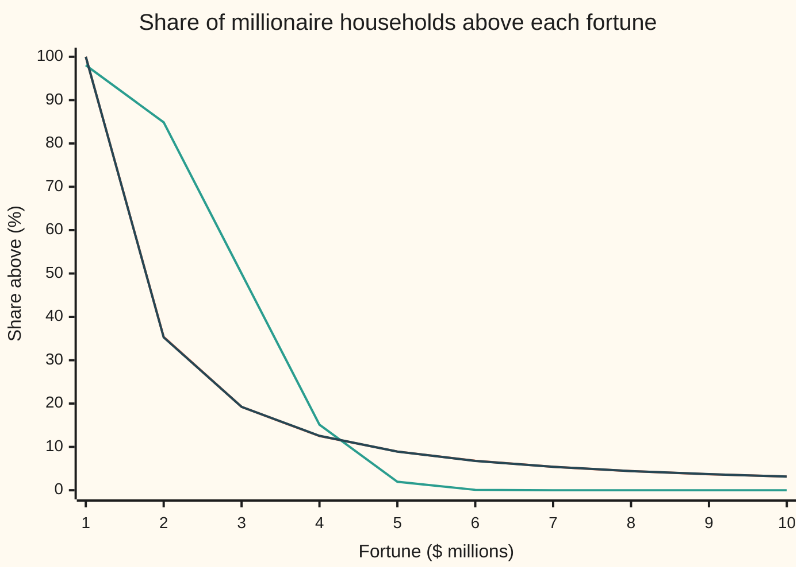
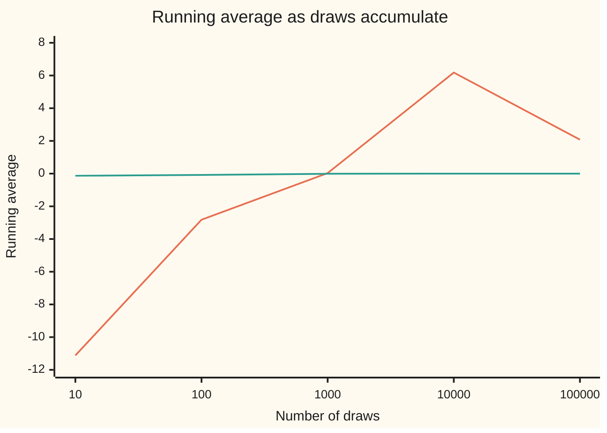

# Heavy tails: distributions where the mean or the variance does not exist

Probability and statistics → Continuous Distributions → Laws with missing averages → Heavy tails

---

## General Overview

Take every household with at least $1 million. Half hold less than $1.59 million; a few hold a thousand times the line. In the model this card follows, the richest 1 percent of the group start at $21.5 million and own 21.5 percent of the group's wealth.

A bell curve with the same average, $3 million, and the same spread across the middle half tells another story. Its richest 1 percent start at $5.26 million and own 1.86 percent. A fortune above $10 million, about 1 household in 32 in the first model (a chance of 0.03162), gets a chance of 2.658 × 10^-13. The bell's far end, its **tail**, thins too fast.

The model that fits is the **Pareto law**, after Vilfredo Pareto, who found the pattern in income records in the 1890s. Its tail thins like a power of the fortune. That slow thinning has a price: weight each fortune by its size, or by its square, add up the whole range, and the total can be infinite. In this model the size-weighted total, the average, is a finite $3 million; the square-weighted one is infinite, and so is the variance (the average squared distance from the mean). For the **Cauchy law**, met below as the ratio of two daily share returns, even the average does not exist. Such laws are called **heavy-tailed**.

**A density can enclose area 1, and so be a valid law, while the area weighted by distance or by squared distance is infinite; Pareto keeps only the moments below its shape number, and Cauchy keeps no mean at all.**

**What kind of fact this is:** a theorem, proved on this card in Why it works: both densities have area 1, and exactly the listed moments are finite. Using Pareto for real fortunes is a model, checked against wealth data rather than proved.

### The picture: the chance of a fortune above each level



Orange: the Pareto law with shape 1.5. Green: the bell curve with the same mean and middle half, at zero by $7 million. Dark blue: 100,000 simulated fortunes from seeded random draws, lying on the orange line.

---

## The formula

Notation first. $X$ is one household's fortune in millions of dollars, a random variable (a quantity settled by chance); $x$ is a particular level. $E[X]$ reads "the average value of X in the long run" ([expectation](../02-Random%20Variables/02-expectation.md)). $E[X^k]$, the average of the fortune to the power $k$, is the $k$-th **moment**. The variance is $E[X^2] - (E[X])^2$ ([variance-and-standard-deviation](../02-Random%20Variables/03-variance-and-standard-deviation.md)), so it needs the second moment.

The Pareto law with lower cutoff $b$ and shape $a$ (both above zero):

$$f(x) = \frac{a\,b^{a}}{x^{a+1}} \ \text{ for } x \ge b, \qquad P(X > x) = \left(\frac{b}{x}\right)^{a}, \qquad E[X^k] = \begin{cases} \dfrac{a\,b^{k}}{a-k} & k < a \\[4pt] \text{infinite} & k \ge a \end{cases}$$

**Read it aloud:** the density falls like one over the fortune to the power a plus one; the chance of exceeding a level falls like one over that level to the power a; and the k-th moment is finite exactly when k is below a.

Below $b$ the density is 0. With $a = 1.5$ and $b = 1$: the mean is $1.5/0.5 = 3$, and the second moment is infinite, since $2 \ge 1.5$. Two consequences used throughout:

$$\text{mean} = \frac{a\,b}{a-1}\ (a > 1), \qquad \text{share of all wealth held by the top fraction } p = p^{\,1 - 1/a}$$

The standard Cauchy law, on the whole number line:

$$g(z) = \frac{1}{\pi\,(1+z^2)}, \qquad F(z) = \frac12 + \frac{\arctan z}{\pi}, \qquad E\big[\,|Z|^{r}\big] \text{ is finite exactly when } r < 1$$

**Read it aloud:** the Cauchy density is one over pi times one plus z squared; its area left of z is a half plus arctangent z over pi; a power of its size has a finite average only for powers below one.

So $E[|Z|]$ is infinite, the mean $E[Z]$ is undefined, and the variance does not exist.

| Symbol | Plain meaning | In our example | Push it up and the answer… |
| --- | --- | --- | --- |
| $X$ | one household's fortune, in millions of dollars | at least 1 | — |
| $x$, $y$, $q$ | particular fortune levels, $y$ above $x$; $q$ marks where a top group starts | 10; 21.5443 | tail chance shrinks as $x^{-a}$ |
| $b$ | the lower cutoff: the smallest fortune in the group | 1 | every fortune scales with it |
| $a$ | the shape, or tail index: how fast the tail thins | 1.5 | more moments exist; top share falls |
| $f(x)$ | the Pareto density: chance per million dollars near $x$ | $1.5\,x^{-2.5}$ | — |
| $k$ | the power in a moment: 1 for the mean, 2 for the second moment | 1 and 2 | at $a$ or above, infinite |
| $R$, $c$ | a cutoff where an integral is stopped; $c$ multiplies the right-hand cutoff | 10 to 1,000,000; $c = 2$ | partial moments reach a limit or grow forever |
| $p$ | a top fraction of households | 0.01 | the top share $p^{1-1/a}$ rises |
| $u$, $U$, $Q(u)$ | a level between 0 and 1; a uniform random draw; the quantile, the fortune below which a share $u$ sits | $Q(0.99) = 21.5443$ | $Q(u) = b(1-u)^{-1/a}$ has no ceiling |
| $Z$ | a Cauchy variable: one daily return divided by another | half its values in −1 to 1 | — |
| $g(z)$, $F(z)$ | the Cauchy density and its cumulative area | $F(1) - F(-1) = 0.5$ | — |
| $r$ | a power, possibly fractional, applied to the size of $Z$ | 0.5 gives 1.4142 | at 1 and above, infinite |

### When it holds

- **A power-law tail above a cutoff.** Wealth follows a power law only above some level; below it looks more like the [lognormal-distribution](06-lognormal-distribution.md). Fit Pareto to everyone and the median comes out wrong.
- **A shape that is really 1.5.** The shape is estimated from the few largest fortunes and carries a wide error. At 2.5 the variance exists; at 0.9 the mean does not.
- **Independent households.** Families that share wealth make the largest values move together, and sums of them swing harder.
- **A Cauchy denominator centred at zero.** A denominator that stays away from zero gives a ratio with ordinary moments.
- **Whole-line integrals.** A mean exists only if the integral of the size converges; Step 4 shows paired cutoffs can make two infinities cancel to any number.

---

## Why it works

### Step 0: the idea: area and weighted area are different questions

A density is a valid law when it is never negative and its area is 1 ([densities-and-cdfs](01-densities-and-cdfs.md)). A moment is a second, separate area: the density multiplied by $x$ or $x^2$. Far out, that multiplier is huge. If the density thins like a power, the product can thin too slowly for its area to be finite. The test is the power test for improper integrals ([improper-integrals](../../06-Calculus%20and%20analysis/04-Integrals/07-improper-integrals.md)): $\int_1^\infty x^{-s}\,dx$ is finite exactly when $s > 1$.

### Step 1: the Pareto density has area 1

Integrate from the cutoff to a far point $R$, then let $R$ grow:

$$\int_b^R \frac{a\,b^a}{x^{a+1}}\,dx = \Big[-\Big(\frac{b}{x}\Big)^{a}\Big]_b^R = 1 - \Big(\frac{b}{R}\Big)^{a} \longrightarrow 1.$$

Any positive shape works. The same integral started at $x$ instead of $b$ gives the tail chance $(b/x)^a$: at $x = 10$, $10^{-1.5} = 0.03162$.

### Step 2: the moments stop at the shape

Multiply by $x^k$. The integrand becomes $a\,b^a x^{k-a-1}$, a power with exponent $k - a - 1$. By the power test its integral to infinity is finite exactly when $k - a - 1 < -1$, that is, $k < a$. Then

$$E[X^k] = a\,b^a \int_b^\infty x^{k-a-1}\,dx = \frac{a\,b^k}{a-k}.$$

At $a = 1.5$ the mean ($k = 1$) is $3$; the second moment ($k = 2$) is not. Watch both as the cutoff $R$ moves out. The partial mean is $3(1 - R^{-1/2})$: 2.0513 at $R = 10$, 2.9970 at $R$ = 1,000,000, closing on 3. The partial second moment is $3(R^{1/2} - 1)$: 6.4868, 27, 297 and 2997 at $R$ = 10, 100, 10,000 and 1,000,000, growing like the square root of the cutoff with no ceiling.

Infinite second moment with finite mean means infinite variance: for fortunes above twice the mean, $(X - 3)^2$ is at least $X^2/4$, and that part alone has infinite average.

The variance formula valid for $a > 2$, $a b^2 / ((a-1)^2 (a-2))$, gives $-12$ at shape 1.5: an impossible negative variance from a formula used outside its range.

### Step 3: the top share and the mean above a level

The wealth held above a level $q$ is the mean integral started at $q$:

$$\int_q^\infty x\,\frac{a\,b^a}{x^{a+1}}\,dx = \frac{a\,b^a\,q^{1-a}}{a-1}.$$

Divide by the mean $ab/(a-1)$ to get the share, $(q/b)^{1-a}$. The top fraction $p$ starts at $q = Q(1-p) = b\,p^{-1/a}$, so the share is $p^{1 - 1/a}$: at $p = 0.01$, $0.01^{1/3} = 0.2154$. The bell curve's share comes from the thin tail of $e^{-x^2/2}$ and is 0.0186.

Above any level $x$, fortunes are Pareto again with cutoff $x$ and the same shape, since the chance of passing a higher level $y$, given $x$, is $(x/y)^a$. So the mean fortune above $x$ is $ax/(a-1)$, three times $x$: households above 10 million dollars average 30 million. For the memoryless [exponential-distribution](03-exponential-distribution.md) the expected excess is constant; for Pareto it grows with the level. The further out, the further the rest of the tail reaches.

### Step 4: the Cauchy law, and why its mean is undefined

Where it comes from. Take the daily returns of two unrelated shares, each a bell curve centred at zero with spread 1.2 percent (the shelf's house example), and divide one by the other. The pair, plotted as a point, has a density that depends only on distance from the origin, so its direction is equally likely to be any angle. The ratio is the tangent of that angle, and a uniform angle between $-\pi/2$ and $\pi/2$ gives $P(Z \le z) = \tfrac12 + \arctan(z)/\pi$. The 1.2 percent cancels. Differentiate to get $g(z)$; its area is 1, and half of it lies between −1 and 1.

The mean. Far out, $z\,g(z)$ behaves like $1/(\pi z)$: exponent 1, just on the wrong side of the power test. Each half diverges:

$$\int_0^R \frac{z}{\pi(1+z^2)}\,dz = \frac{\ln(1+R^2)}{2\pi}: \quad 0.7345,\ 1.4659,\ 2.1988 \text{ at } R = 10,\ 100,\ 1000.$$

It grows like a logarithm, slowly and without limit; the left half mirrors it. Infinity minus infinity has no value, so $E[Z]$ is undefined. Symmetric cutoffs $-R$ and $R$ give 0 every time, which looks like a mean. Stop the right side at $2R$ instead and the limit is $\ln 4 / (2\pi) = 0.2206$; other pairings give any number at all. A mean cannot depend on how cutoffs are paired.

<details>
<summary>Detailed proof: which Cauchy moments exist, and the asymmetric cutoff</summary>

**Fractional powers.** For $0 \le z \le 1$, $z^r g(z) \le 1/\pi$, a bounded piece. For $z \ge 1$, $1 + z^2$ lies between $z^2$ and $2z^2$, so
$$\frac{z^{r-2}}{2\pi} \le z^r g(z) \le \frac{z^{r-2}}{\pi}.$$
Both bounds are powers with exponent $r - 2$. The power test says $\int_1^\infty z^{r-2}\,dz$ is finite exactly when $r - 2 < -1$, that is $r < 1$. The negative half is the mirror image. So $E[|Z|^r]$ is finite for $0 \le r < 1$ and infinite for $r \ge 1$, the divergence at $r = 1$ being logarithmic. The finite values have the closed form $1/\cos(\pi r/2)$, derived by contour integration; at $r = 0.5$ it is $\sqrt 2 = 1.4142$, which the checks confirm by integration.

**Cutoffs.** On $[-R, cR]$ with $c > 0$, the odd part cancels on $[-R, R]$ and leaves
$$\int_{-R}^{cR} \frac{z\,dz}{\pi(1+z^2)} = \frac{1}{2\pi}\ln\frac{1+c^2R^2}{1+R^2} \longrightarrow \frac{\ln c}{\pi}.$$
As $c$ runs over all positive numbers, $\ln c / \pi$ takes every real value. At $c = 2$ it is 0.2206. An expectation must be one number, fixed by the law alone; this is a family of numbers fixed by a choice of cutoffs, so none of them is a mean.

</details>

### Step 5: averages that never settle

The law of large numbers says an average of independent draws settles on the mean, provided the mean exists. Cauchy breaks the proviso exactly: the average of any number of independent standard Cauchy draws is again standard Cauchy, so half of all averages of 100 ratios still land outside −1 to 1. This is stated here, proved with characteristic functions on stable-laws-and-heavy-tails, and checked below by simulation.

Pareto with shape 1.5 sits between. The mean exists, so the average does settle on 3. The variance does not, so the usual error bar, standard deviation over the square root of the sample size, has nothing to stand on: the average settles more slowly and is jolted by single huge draws. The sample standard deviation never settles; it jumps whenever a new largest fortune arrives.

---

## Worked numbers, by hand

| Step | Arithmetic | Value |
| --- | --- | --- |
| mean fortune | 1.5 × 1 ÷ (1.5 − 1) | 3 ($3 million) |
| median fortune | 1 × 0.5^(−1 ÷ 1.5) = 2^(2/3) | 1.5874 |
| chance above $10 million | 10^(−1.5) | 0.03162 |
| where the top 1 percent start | 0.01^(−1 ÷ 1.5) = 100^(2/3) | 21.5443 |
| mean fortune above $10 million | 1.5 × 10 ÷ 0.5 | 30 |
| partial second moment, cutoff 1,000,000 | 3 × (1000 − 1) | 2997, and growing |
| share held by the top 1 percent | 0.01^(1 − 1 ÷ 1.5) = 0.01^(1/3) | **0.2154** |

Among households with at least $1 million, the richest 1 percent hold about a fifth of the group's wealth, more than ten times what a bell curve with the same average and middle allows.

### What breaks if you drop a piece

| Mistake | Comes out at | What went wrong |
| --- | --- | --- |
| A bell curve for wealth, same mean and middle half | top 1 percent hold 0.0186, not 0.2154; P(X > 10) = 2.658 × 10^-13, not 0.03162 | Its tail thins like $e^{-x^2/2}$, far faster than any power |
| The variance formula used at shape 1.5 | −12 | The formula needs $a > 2$; below that the variance is infinite |
| A symmetric cutoff taken as the Cauchy mean | 0; the cutoffs −R and 2R give 0.2206 | Two infinite halves cancel only by choice of cutoffs |
| Averaging 100 Cauchy ratios to tame them | P(−1 < average < 1) = 0.4810, as for one ratio | No mean, so the law of large numbers does not apply |
| Quoting the sample standard deviation of fortunes | 1.0493 at 100 draws, 24.8098 at 1,000,000 | The true value is infinite; the estimate grows with the sample |

The fourth row is the hypothesis dropped: averages of 100 daily returns all land within 1.2 percent of zero, while averages of 100 ratios behave like a single ratio. The code prints every row.

---

## Code, from first principles, and it actually runs

Four roads. The closed forms. Simpson's rule (an integrator written into the script) in log-space, with $x = e^t$, for the area, the top share and the partial moments. The Cauchy area by a fold: $w = 1/z$ maps the tail beyond 1 onto 0 to 1, so the area is four times the area from 0 to 1, with no arctangent. And a SplitMix64 generator, seed 2026, in both languages: 1,000,000 fortunes by the inverse transform $X = b\,U^{-1/a}$, and 100,000 pairs of bell-curve returns by the Box–Muller method (two uniforms turned into a bell-curve draw with a logarithm and a cosine), whose ratios never touch the Cauchy formula. The comparison bell curve comes from its own Taylor series and bisection. Simulated numbers carry a standard error (se), the typical size of a simulation's error; the top share's comes from 10 batches of 100,000, and asserts allow four.

### Python

```python
# Heavy tails -- the check behind the card.  Nothing is imported but math primitives.
# Fortunes of at least $1 million (units: $ millions) follow Pareto with b = 1, a = 1.5.
# Roads: closed forms; Simpson integration in log-space; a bell curve built from its own
# series; and seeded draws (SplitMix64, seed 2026) that never use the closed forms.
from math import exp, log, sqrt, pi, cos, atan
A, B, M64 = 1.5, 1.0, (1 << 64) - 1

def simpson(g, lo, hi, n):
    w = (hi - lo) / n
    s = g(lo) + g(hi) + sum((4.0 if j % 2 else 2.0) * g(lo + j * w) for j in range(1, n))
    return s * w / 3.0

def phi(z):                            # standard normal density
    return exp(-z * z / 2) / sqrt(2 * pi)

def Phi(z):                            # standard normal area left of z, by its Taylor series
    term, s, n = z, z, 0
    while abs(term) > 1e-17:
        n += 1
        term *= -z * z / 2 / n
        s += term / (2 * n + 1)
    return 0.5 + s / sqrt(2 * pi)

def Phi_inv(u):                        # bisection on Phi
    lo, hi = -8.0, 8.0
    for _ in range(100):
        mid = (lo + hi) / 2
        lo, hi = (mid, hi) if Phi(mid) < u else (lo, mid)
    return (lo + hi) / 2

class SplitMix64:
    def __init__(self, seed):
        self.s = seed
    def uniform(self):                 # strictly inside (0, 1)
        self.s = (self.s + 0x9E3779B97F4A7C15) & M64
        z = self.s
        z = ((z ^ (z >> 30)) * 0xBF58476D1CE4E5B9) & M64
        z = ((z ^ (z >> 27)) * 0x94D049BB133111EB) & M64
        return (((z ^ (z >> 31)) >> 11) + 0.5) / 9007199254740992.0

def frac_se(hits, n):
    p = hits / n
    return p, sqrt(p * (1 - p) / n)

def pareto_q(u):                       # quantile: the fortune below which a share u sits
    return B * (1 - u) ** (-1 / A)

mean, share = A * B / (A - 1), 0.01 ** (1 - 1 / A)
print(f"Pareto b = {B}, a = {A}: mean {mean:.4f}; median {pareto_q(0.5):.4f}; P(X > 10) = {10 ** -A:.5f}")
print(f"top 1 percent start at {pareto_q(0.99):.4f} and hold {share:.4f} of all wealth")
print(f"mean fortune above 10 = {A * 10 / (A - 1):.4f}; variance formula at a = 1.5 gives {A * B * B / ((A - 1) ** 2 * (A - 2)):.4f}")
T = 50.0                               # log-space: x = e^t, t from ln(lower) to 50
area = simpson(lambda t: A * exp(-A * t), 0.0, T, 20000)
top = simpson(lambda t: A * exp((1 - A) * t), log(pareto_q(0.99)), T, 20000) / mean
print(f"Simpson: total area {area:.9f}; top 1 percent share {top:.9f}")
gaps = []                              # Simpson minus closed form, for the asserts
for R in (10, 100, 10 ** 4, 10 ** 6):
    m1 = simpson(lambda t: A * exp((1 - A) * t), 0.0, log(R), 4000)
    m2 = simpson(lambda t: A * exp((2 - A) * t), 0.0, log(R), 4000)
    c1, c2 = A / (A - 1) * (1 - R ** (1 - A)), A / (2 - A) * (R ** (2 - A) - 1)
    gaps += [m1 - c1, m2 - c2]
    print(f"cutoff R = {R:>7}: partial mean {m1:.4f} (closed {c1:.4f}); partial E[X^2] {m2:.4f} (closed {c2:.4f})")
z75, z99 = Phi_inv(0.75), Phi_inv(0.99)
sig = (pareto_q(0.75) - pareto_q(0.25)) / (2 * z75)          # bell: same mean, same middle half
nshare = (0.01 * mean + sig * phi(z99)) / mean
nshare_s = simpson(lambda x: x * phi((x - mean) / sig) / sig, mean + z99 * sig, mean + 40 * sig, 20000) / mean
def bell_tail(x):                      # chance the bell exceeds x, by Simpson on its density
    return simpson(phi, (x - mean) / sig, 40.0, 20000)
ntail = bell_tail(10)
print(f"bell curve: mean {mean:.4f}, sd {sig:.4f}; top 1 percent start at {mean + z99 * sig:.4f}, hold {nshare:.4f} (Simpson {nshare_s:.4f})")
print(f"bell curve: P(X > 10) = {ntail:.3e}; P(X < 0) = {Phi(-mean / sig):.5f}")
cm = 4 * simpson(lambda z: 1 / (pi * (1 + z * z)), 0.0, 1.0, 2000)   # w = 1/z folds the tail onto [0, 1]
print(f"Cauchy: total area by folding {cm:.9f}; P(-1 < Z < 1) = {2 * simpson(lambda z: 1 / (pi * (1 + z * z)), 0.0, 1.0, 2000):.6f}")
for R in (10, 100, 1000):
    half = simpson(lambda t: exp(2 * t) / (pi * (1 + exp(2 * t))), -30.0, log(R), 20000)
    gaps.append(half - log(1 + R * R) / (2 * pi))
    print(f"Cauchy: integral of z g(z) from 0 to {R:>4} = {half:.4f} (closed {log(1 + R * R) / (2 * pi):.4f})")
half_m = 2 * simpson(lambda t: exp(1.5 * t) / (pi * (1 + exp(2 * t))), -60.0, 60.0, 20000)
print(f"Cauchy: E|Z|^0.5 by Simpson {half_m:.6f}; closed form 1/cos(pi/4) = {1 / cos(pi / 4):.6f}")
print(f"Cauchy: cutoffs -R and 2R give {log(4) / (2 * pi):.4f} in the limit, not 0; P(|Z| > 10) = {1 - 2 * atan(10) / pi:.4f}")

rng = SplitMix64(2026)
xs, cks, run = [], [], 0.0
for i in range(1, 10 ** 6 + 1):
    x = B * rng.uniform() ** (-1 / A)                         # inverse transform
    xs.append(x); run += x
    if i in (10, 100, 10 ** 3, 10 ** 4, 10 ** 5, 10 ** 6):
        sd = sqrt(sum((v - run / i) ** 2 for v in xs) / (i - 1))
        cks.append((i, run / i, sd))
for i, m, sd in cks:
    print(f"simulated fortunes n = {i:>7}: average {m:.4f}; sample sd {sd:.4f}")
p10, se10 = frac_se(sum(x > 10 for x in xs), len(xs))
print(f"simulated: P(X > 10) = {p10:.5f} (se {se10:.5f}); largest fortune {max(xs):.1f}")
shares = []
for k in range(10):                                           # 10 batches of 100,000
    s = sorted(xs[k * 100000:(k + 1) * 100000], reverse=True)
    shares.append(sum(s[:1000]) / sum(s))
sm = sum(shares) / 10
sse = sqrt(sum((v - sm) ** 2 for v in shares) / 9 / 10)
print(f"simulated: top 1 percent share {sm:.4f} (se {sse:.4f}, from 10 batches of 100000)")
ret, ratio = [], []
for _ in range(10 ** 5):                                      # two daily returns, 1.2 percent spread
    u1, u2, u3, u4 = (rng.uniform() for _ in range(4))
    r1 = 1.2 * sqrt(-2 * log(u1)) * cos(2 * pi * u2)
    r2 = 1.2 * sqrt(-2 * log(u3)) * cos(2 * pi * u4)
    ret.append(r1); ratio.append(r1 / r2)
pin, sein = frac_se(sum(abs(z) < 1 for z in ratio), len(ratio))
pout, seout = frac_se(sum(abs(z) > 10 for z in ratio), len(ratio))
print(f"ratio of two returns: P(-1 < Z < 1) = {pin:.4f} (se {sein:.4f}); P(|Z| > 10) = {pout:.4f} (se {seout:.4f})")
for n in (10, 100, 10 ** 3, 10 ** 4, 10 ** 5):
    print(f"ratio of two returns, running average n = {n:>6}: {sum(ratio[:n]) / n:.4f}")
cav = [sum(ratio[j:j + 100]) / 100 for j in range(0, 10 ** 5, 100)]
rav = [sum(ret[j:j + 100]) / 100 for j in range(0, 10 ** 5, 100)]
pc, sec = frac_se(sum(abs(v) < 1 for v in cav), 1000)
pr, _ = frac_se(sum(abs(v) < 1.2 for v in rav), 1000)
print("figure, ratio averages: " + ", ".join(f"{sum(ratio[:n]) / n:.2f}" for n in (10, 100, 10 ** 3, 10 ** 4, 10 ** 5)))
print("figure, return averages: " + ", ".join(f"{sum(ret[:n]) / n:.2f}" for n in (10, 100, 10 ** 3, 10 ** 4, 10 ** 5)))
print(f"1000 averages of 100 ratios: P(-1 < avg < 1) = {pc:.4f} (se {sec:.4f}); of 100 returns within 1.2: {pr:.4f}")
grid = [1, 2, 3, 4, 5, 6, 7, 8, 9, 10]
print("figure, $ millions:  " + ", ".join(str(x) for x in grid))
print("figure, Pareto %:    " + ", ".join(f"{100 * x ** -A:.2f}" for x in grid))
print("figure, bell %:      " + ", ".join(f"{100 * bell_tail(x):.2f}" for x in grid))
print("figure, simulated %: " + ", ".join(f"{100 * sum(v > x for v in xs[:100000]) / 100000:.2f}" for x in grid))
assert abs(area - 1) < 1e-8 and abs(top - share) < 1e-8          # integration vs algebra
assert max(abs(g) for g in gaps) < 1e-6                         # partial moments vs closed forms
assert abs(cm - 1) < 1e-9 and abs(half_m - sqrt(2)) < 1e-6 and abs(nshare_s - nshare) < 1e-6
assert abs(p10 - 10 ** -A) < 4 * se10 and abs(sm - share) < 4 * sse   # simulation vs formula
assert abs(pin - 0.5) < 4 * sein and abs(pout - (1 - 2 * atan(10) / pi)) < 4 * seout
assert abs(pc - 0.5) < 4 * sec and pr > 0.99                    # Cauchy averages never tighten
print("ALL CHECKS PASS")
```

**Ran 2026-09-28 on macOS, Python 3.14.6, standard library only. All checks passed. Output, pasted from the run:**

```
Pareto b = 1.0, a = 1.5: mean 3.0000; median 1.5874; P(X > 10) = 0.03162
top 1 percent start at 21.5443 and hold 0.2154 of all wealth
mean fortune above 10 = 30.0000; variance formula at a = 1.5 gives -12.0000
Simpson: total area 1.000000000; top 1 percent share 0.215443469
cutoff R =      10: partial mean 2.0513 (closed 2.0513); partial E[X^2] 6.4868 (closed 6.4868)
cutoff R =     100: partial mean 2.7000 (closed 2.7000); partial E[X^2] 27.0000 (closed 27.0000)
cutoff R =   10000: partial mean 2.9700 (closed 2.9700); partial E[X^2] 297.0000 (closed 297.0000)
cutoff R = 1000000: partial mean 2.9970 (closed 2.9970); partial E[X^2] 2997.0000 (closed 2997.0000)
bell curve: mean 3.0000, sd 0.9699; top 1 percent start at 5.2564, hold 0.0186 (Simpson 0.0186)
bell curve: P(X > 10) = 2.658e-13; P(X < 0) = 0.00099
Cauchy: total area by folding 1.000000000; P(-1 < Z < 1) = 0.500000
Cauchy: integral of z g(z) from 0 to   10 = 0.7345 (closed 0.7345)
Cauchy: integral of z g(z) from 0 to  100 = 1.4659 (closed 1.4659)
Cauchy: integral of z g(z) from 0 to 1000 = 2.1988 (closed 2.1988)
Cauchy: E|Z|^0.5 by Simpson 1.414214; closed form 1/cos(pi/4) = 1.414214
Cauchy: cutoffs -R and 2R give 0.2206 in the limit, not 0; P(|Z| > 10) = 0.0635
simulated fortunes n =      10: average 1.5290; sample sd 0.5328
simulated fortunes n =     100: average 1.9282; sample sd 1.0493
simulated fortunes n =    1000: average 3.1481; sample sd 11.2489
simulated fortunes n =   10000: average 2.8640; sample sd 7.0701
simulated fortunes n =  100000: average 2.9938; sample sd 22.3535
simulated fortunes n = 1000000: average 2.9954; sample sd 24.8098
simulated: P(X > 10) = 0.03164 (se 0.00018); largest fortune 10096.4
simulated: top 1 percent share 0.2139 (se 0.0055, from 10 batches of 100000)
ratio of two returns: P(-1 < Z < 1) = 0.4986 (se 0.0016); P(|Z| > 10) = 0.0647 (se 0.0008)
ratio of two returns, running average n =     10: -11.1206
ratio of two returns, running average n =    100: -2.8242
ratio of two returns, running average n =   1000: 0.0349
ratio of two returns, running average n =  10000: 6.1755
ratio of two returns, running average n = 100000: 2.0820
figure, ratio averages: -11.12, -2.82, 0.03, 6.18, 2.08
figure, return averages: -0.13, -0.08, -0.01, 0.00, 0.00
1000 averages of 100 ratios: P(-1 < avg < 1) = 0.4810 (se 0.0158); of 100 returns within 1.2: 1.0000
figure, $ millions:  1, 2, 3, 4, 5, 6, 7, 8, 9, 10
figure, Pareto %:    100.00, 35.36, 19.25, 12.50, 8.94, 6.80, 5.40, 4.42, 3.70, 3.16
figure, bell %:      98.04, 84.87, 50.00, 15.13, 1.96, 0.10, 0.00, 0.00, 0.00, 0.00
figure, simulated %: 100.00, 35.28, 19.25, 12.56, 8.93, 6.78, 5.42, 4.42, 3.71, 3.15
ALL CHECKS PASS
```

### Rust

```rust
// Heavy tails -- the check behind the card, std only.
// Fortunes of at least $1 million (units: $ millions) follow Pareto with b = 1, a = 1.5.
// Roads: closed forms; Simpson integration in log-space; a bell curve built from its own
// series; and seeded draws (SplitMix64, seed 2026) that never use the closed forms.
use std::f64::consts::PI;
const A: f64 = 1.5;
const B: f64 = 1.0;

fn simpson<G: Fn(f64) -> f64>(g: G, lo: f64, hi: f64, n: usize) -> f64 {
    let w = (hi - lo) / n as f64;
    let inner: f64 = (1..n).map(|j| (if j % 2 == 1 { 4.0 } else { 2.0 }) * g(lo + j as f64 * w)).sum();
    (g(lo) + g(hi) + inner) * w / 3.0
}
fn phi(z: f64) -> f64 { (-z * z / 2.0).exp() / (2.0 * PI).sqrt() }   // standard normal density
fn big_phi(z: f64) -> f64 {                          // area left of z, by its Taylor series
    let (mut term, mut s, mut n) = (z, z, 0.0);
    while term.abs() > 1e-17 {
        n += 1.0;
        term *= -z * z / 2.0 / n;
        s += term / (2.0 * n + 1.0);
    }
    0.5 + s / (2.0 * PI).sqrt()
}
fn phi_inv(u: f64) -> f64 {                          // bisection on the area
    let (mut lo, mut hi) = (-8.0f64, 8.0f64);
    for _ in 0..100 {
        let mid = (lo + hi) / 2.0;
        if big_phi(mid) < u { lo = mid } else { hi = mid }
    }
    (lo + hi) / 2.0
}
struct SplitMix64 { s: u64 }
impl SplitMix64 {
    fn uniform(&mut self) -> f64 {                   // strictly inside (0, 1)
        self.s = self.s.wrapping_add(0x9E3779B97F4A7C15);
        let mut z = self.s;
        z = (z ^ (z >> 30)).wrapping_mul(0xBF58476D1CE4E5B9);
        z = (z ^ (z >> 27)).wrapping_mul(0x94D049BB133111EB);
        (((z ^ (z >> 31)) >> 11) as f64 + 0.5) / 9007199254740992.0
    }
}
fn frac_se(hits: usize, n: usize) -> (f64, f64) {
    let p = hits as f64 / n as f64;
    (p, (p * (1.0 - p) / n as f64).sqrt())
}
fn pareto_q(u: f64) -> f64 { B * (1.0 - u).powf(-1.0 / A) }
fn avg(v: &[f64]) -> f64 { v.iter().sum::<f64>() / v.len() as f64 }
fn join(v: &[f64]) -> String { v.iter().map(|x| format!("{:.2}", x)).collect::<Vec<_>>().join(", ") }

fn main() {
    let (mean, share) = (A * B / (A - 1.0), 0.01f64.powf(1.0 - 1.0 / A));
    println!("Pareto b = {:?}, a = {:?}: mean {:.4}; median {:.4}; P(X > 10) = {:.5}", B, A, mean, pareto_q(0.5), 10f64.powf(-A));
    println!("top 1 percent start at {:.4} and hold {:.4} of all wealth", pareto_q(0.99), share);
    println!("mean fortune above 10 = {:.4}; variance formula at a = 1.5 gives {:.4}", A * 10.0 / (A - 1.0), A * B * B / ((A - 1.0).powi(2) * (A - 2.0)));
    let t_hi = 50.0;                                 // log-space: x = e^t, t from ln(lower) to 50
    let area = simpson(|t| A * (-A * t).exp(), 0.0, t_hi, 20000);
    let top = simpson(|t| A * ((1.0 - A) * t).exp(), pareto_q(0.99).ln(), t_hi, 20000) / mean;
    println!("Simpson: total area {:.9}; top 1 percent share {:.9}", area, top);
    let mut gaps: Vec<f64> = Vec::new();              // Simpson minus closed form, for the asserts
    for r in [10.0f64, 100.0, 1e4, 1e6] {
        let m1 = simpson(|t| A * ((1.0 - A) * t).exp(), 0.0, r.ln(), 4000);
        let m2 = simpson(|t| A * ((2.0 - A) * t).exp(), 0.0, r.ln(), 4000);
        let (c1, c2) = (A / (A - 1.0) * (1.0 - r.powf(1.0 - A)), A / (2.0 - A) * (r.powf(2.0 - A) - 1.0));
        gaps.extend([m1 - c1, m2 - c2]);
        println!("cutoff R = {:>7}: partial mean {:.4} (closed {:.4}); partial E[X^2] {:.4} (closed {:.4})",
                 r as u64, m1, c1, m2, c2);
    }
    let (z75, z99) = (phi_inv(0.75), phi_inv(0.99));
    let sig = (pareto_q(0.75) - pareto_q(0.25)) / (2.0 * z75);   // bell: same mean, same middle half
    let nshare = (0.01 * mean + sig * phi(z99)) / mean;
    let nshare_s = simpson(|x| x * phi((x - mean) / sig) / sig, mean + z99 * sig, mean + 40.0 * sig, 20000) / mean;
    let bell_tail = |x: f64| simpson(phi, (x - mean) / sig, 40.0, 20000);
    let ntail = bell_tail(10.0);
    println!("bell curve: mean {:.4}, sd {:.4}; top 1 percent start at {:.4}, hold {:.4} (Simpson {:.4})", mean, sig, mean + z99 * sig, nshare, nshare_s);
    println!("bell curve: P(X > 10) = {:.3e}; P(X < 0) = {:.5}", ntail, big_phi(-mean / sig));
    let g = |z: f64| 1.0 / (PI * (1.0 + z * z));
    let cm = 4.0 * simpson(g, 0.0, 1.0, 2000);        // w = 1/z folds the tail onto [0, 1]
    println!("Cauchy: total area by folding {:.9}; P(-1 < Z < 1) = {:.6}", cm, 2.0 * simpson(g, 0.0, 1.0, 2000));
    for r in [10.0f64, 100.0, 1000.0] {
        let half = simpson(|t| (2.0 * t).exp() / (PI * (1.0 + (2.0 * t).exp())), -30.0, r.ln(), 20000);
        gaps.push(half - (1.0 + r * r).ln() / (2.0 * PI));
        println!("Cauchy: integral of z g(z) from 0 to {:>4} = {:.4} (closed {:.4})", r as u64, half, (1.0 + r * r).ln() / (2.0 * PI));
    }
    let half_m = 2.0 * simpson(|t| (1.5 * t).exp() / (PI * (1.0 + (2.0 * t).exp())), -60.0, 60.0, 20000);
    println!("Cauchy: E|Z|^0.5 by Simpson {:.6}; closed form 1/cos(pi/4) = {:.6}", half_m, 1.0 / (PI / 4.0).cos());
    let pout_exact = 1.0 - 2.0 * 10f64.atan() / PI;
    println!("Cauchy: cutoffs -R and 2R give {:.4} in the limit, not 0; P(|Z| > 10) = {:.4}", 4f64.ln() / (2.0 * PI), pout_exact);

    let mut rng = SplitMix64 { s: 2026 };
    let (mut xs, mut run): (Vec<f64>, f64) = (Vec::new(), 0.0);
    for i in 1..=1_000_000usize {
        let x = B * rng.uniform().powf(-1.0 / A);    // inverse transform
        xs.push(x); run += x;
        if [10, 100, 1000, 10000, 100000, 1000000].contains(&i) {
            let m = run / i as f64;
            let sd = (xs.iter().map(|v| (v - m) * (v - m)).sum::<f64>() / (i - 1) as f64).sqrt();
            println!("simulated fortunes n = {:>7}: average {:.4}; sample sd {:.4}", i, m, sd);
        }
    }
    let (p10, se10) = frac_se(xs.iter().filter(|&&x| x > 10.0).count(), xs.len());
    let biggest = xs.iter().cloned().fold(0.0f64, f64::max);
    println!("simulated: P(X > 10) = {:.5} (se {:.5}); largest fortune {:.1}", p10, se10, biggest);
    let mut shares = Vec::new();
    for k in 0..10 {                                  // 10 batches of 100,000
        let mut s = xs[k * 100000..(k + 1) * 100000].to_vec();
        s.sort_by(|a, b| b.partial_cmp(a).unwrap());
        shares.push(s[..1000].iter().sum::<f64>() / s.iter().sum::<f64>());
    }
    let sm = avg(&shares);
    let sse = (shares.iter().map(|v| (v - sm) * (v - sm)).sum::<f64>() / 9.0 / 10.0).sqrt();
    println!("simulated: top 1 percent share {:.4} (se {:.4}, from 10 batches of 100000)", sm, sse);
    let (mut ret, mut ratio) = (Vec::new(), Vec::new());
    for _ in 0..100000 {                              // two daily returns, 1.2 percent spread
        let (u1, u2, u3, u4) = (rng.uniform(), rng.uniform(), rng.uniform(), rng.uniform());
        let r1 = 1.2 * (-2.0 * u1.ln()).sqrt() * (2.0 * PI * u2).cos();
        let r2 = 1.2 * (-2.0 * u3.ln()).sqrt() * (2.0 * PI * u4).cos();
        ret.push(r1); ratio.push(r1 / r2);
    }
    let (pin, sein) = frac_se(ratio.iter().filter(|z| z.abs() < 1.0).count(), ratio.len());
    let (pout, seout) = frac_se(ratio.iter().filter(|z| z.abs() > 10.0).count(), ratio.len());
    println!("ratio of two returns: P(-1 < Z < 1) = {:.4} (se {:.4}); P(|Z| > 10) = {:.4} (se {:.4})", pin, sein, pout, seout);
    let ns = [10usize, 100, 1000, 10000, 100000];
    for &n in &ns { println!("ratio of two returns, running average n = {:>6}: {:.4}", n, avg(&ratio[..n])); }
    let cav: Vec<f64> = ratio.chunks(100).map(avg).collect();
    let rav: Vec<f64> = ret.chunks(100).map(avg).collect();
    let (pc, sec) = frac_se(cav.iter().filter(|v| v.abs() < 1.0).count(), 1000);
    let (pr, _) = frac_se(rav.iter().filter(|v| v.abs() < 1.2).count(), 1000);
    println!("figure, ratio averages: {}", join(&ns.iter().map(|&n| avg(&ratio[..n])).collect::<Vec<_>>()));
    println!("figure, return averages: {}", join(&ns.iter().map(|&n| avg(&ret[..n])).collect::<Vec<_>>()));
    println!("1000 averages of 100 ratios: P(-1 < avg < 1) = {:.4} (se {:.4}); of 100 returns within 1.2: {:.4}", pc, sec, pr);
    let grid: Vec<f64> = (1..=10).map(|x| x as f64).collect();
    println!("figure, $ millions:  {}", (1..=10).map(|x| x.to_string()).collect::<Vec<_>>().join(", "));
    println!("figure, Pareto %:    {}", join(&grid.iter().map(|x| 100.0 * x.powf(-A)).collect::<Vec<_>>()));
    println!("figure, bell %:      {}", join(&grid.iter().map(|&x| 100.0 * bell_tail(x)).collect::<Vec<_>>()));
    let simp: Vec<f64> = grid.iter().map(|&x| 100.0 * xs[..100000].iter().filter(|&&v| v > x).count() as f64 / 100000.0).collect();
    println!("figure, simulated %: {}", join(&simp));
    assert!((area - 1.0).abs() < 1e-8 && (top - share).abs() < 1e-8);          // integration vs algebra
    assert!(gaps.iter().all(|g| g.abs() < 1e-6));                               // partial moments vs closed forms
    assert!((cm - 1.0).abs() < 1e-9 && (half_m - 2f64.sqrt()).abs() < 1e-6 && (nshare_s - nshare).abs() < 1e-6);
    assert!((p10 - 10f64.powf(-A)).abs() < 4.0 * se10 && (sm - share).abs() < 4.0 * sse);   // simulation vs formula
    assert!((pin - 0.5).abs() < 4.0 * sein && (pout - pout_exact).abs() < 4.0 * seout);
    assert!((pc - 0.5).abs() < 4.0 * sec && pr > 0.99);                         // Cauchy averages never tighten
    println!("ALL CHECKS PASS");
}
```

**Ran 2026-09-28 on macOS, rustc 1.98.1, no crates. All checks passed. Output, pasted from the run:**

```
Pareto b = 1.0, a = 1.5: mean 3.0000; median 1.5874; P(X > 10) = 0.03162
top 1 percent start at 21.5443 and hold 0.2154 of all wealth
mean fortune above 10 = 30.0000; variance formula at a = 1.5 gives -12.0000
Simpson: total area 1.000000000; top 1 percent share 0.215443469
cutoff R =      10: partial mean 2.0513 (closed 2.0513); partial E[X^2] 6.4868 (closed 6.4868)
cutoff R =     100: partial mean 2.7000 (closed 2.7000); partial E[X^2] 27.0000 (closed 27.0000)
cutoff R =   10000: partial mean 2.9700 (closed 2.9700); partial E[X^2] 297.0000 (closed 297.0000)
cutoff R = 1000000: partial mean 2.9970 (closed 2.9970); partial E[X^2] 2997.0000 (closed 2997.0000)
bell curve: mean 3.0000, sd 0.9699; top 1 percent start at 5.2564, hold 0.0186 (Simpson 0.0186)
bell curve: P(X > 10) = 2.658e-13; P(X < 0) = 0.00099
Cauchy: total area by folding 1.000000000; P(-1 < Z < 1) = 0.500000
Cauchy: integral of z g(z) from 0 to   10 = 0.7345 (closed 0.7345)
Cauchy: integral of z g(z) from 0 to  100 = 1.4659 (closed 1.4659)
Cauchy: integral of z g(z) from 0 to 1000 = 2.1988 (closed 2.1988)
Cauchy: E|Z|^0.5 by Simpson 1.414214; closed form 1/cos(pi/4) = 1.414214
Cauchy: cutoffs -R and 2R give 0.2206 in the limit, not 0; P(|Z| > 10) = 0.0635
simulated fortunes n =      10: average 1.5290; sample sd 0.5328
simulated fortunes n =     100: average 1.9282; sample sd 1.0493
simulated fortunes n =    1000: average 3.1481; sample sd 11.2489
simulated fortunes n =   10000: average 2.8640; sample sd 7.0701
simulated fortunes n =  100000: average 2.9938; sample sd 22.3535
simulated fortunes n = 1000000: average 2.9954; sample sd 24.8098
simulated: P(X > 10) = 0.03164 (se 0.00018); largest fortune 10096.4
simulated: top 1 percent share 0.2139 (se 0.0055, from 10 batches of 100000)
ratio of two returns: P(-1 < Z < 1) = 0.4986 (se 0.0016); P(|Z| > 10) = 0.0647 (se 0.0008)
ratio of two returns, running average n =     10: -11.1206
ratio of two returns, running average n =    100: -2.8242
ratio of two returns, running average n =   1000: 0.0349
ratio of two returns, running average n =  10000: 6.1755
ratio of two returns, running average n = 100000: 2.0820
figure, ratio averages: -11.12, -2.82, 0.03, 6.18, 2.08
figure, return averages: -0.13, -0.08, -0.01, 0.00, 0.00
1000 averages of 100 ratios: P(-1 < avg < 1) = 0.4810 (se 0.0158); of 100 returns within 1.2: 1.0000
figure, $ millions:  1, 2, 3, 4, 5, 6, 7, 8, 9, 10
figure, Pareto %:    100.00, 35.36, 19.25, 12.50, 8.94, 6.80, 5.40, 4.42, 3.70, 3.16
figure, bell %:      98.04, 84.87, 50.00, 15.13, 1.96, 0.10, 0.00, 0.00, 0.00, 0.00
figure, simulated %: 100.00, 35.28, 19.25, 12.56, 8.93, 6.78, 5.42, 4.42, 3.71, 3.15
ALL CHECKS PASS
```

The two outputs match line for line: the same generator gives both languages the same draws.

Read against each other: the simulated chance above $10 million, 0.03164 (se 0.00018), and top share, 0.2139 (se 0.0055), sit within one standard error of 0.03162 and 0.2154. The running average of fortunes wanders from 1.5290 to 3.1481 before settling at 2.9954, while the sample standard deviation climbs to 24.8098; the largest fortune drawn is $10,096 million. The ratios land between −1 and 1 with chance 0.4986 (se 0.0016) and beyond ±10 with chance 0.0647 (se 0.0008), against 0.5 and 0.0635 from the formula.



Orange: the running average of ratios of returns, a Cauchy sample, swinging from −11.12 to 6.18 and still moving at 100,000 draws. Green: the running average of the returns themselves, in percent, closing on 0.

> [!TIP]
> **Try changing**
> Guess first, then run it.
> - **Another seed.** Replace `2026` with `7`. The Pareto numbers move by about a standard error and the asserts pass; the Cauchy running averages jump to entirely different values, since no mean holds them.
> - **A thinner tail.** Set `A` to `3.0`. The second moment now exists, the sample standard deviation settles near its true value, 0.866, and the top 1 percent hold under 5 percent; all asserts pass.
> - **A denominator away from zero.** Replace `r1 / r2` with `r1 / (r2 + 5)`. The ratio acquires a mean, its running average settles, and the Cauchy asserts stop the run.
> - **A wrong shape in the share.** Replace `0.01 ** (1 - 1 / A)` with `0.01 ** (1 / A)`. The formula now claims the top 1 percent hold 4.6 percent, and the integration assert stops the run.

---

## The usual mistake

> [!warning]
> **Reading "infinite variance" as "a very large variance".** A large variance still shrinks an average's error like one over the square root of the sample size. An infinite one has no such rule: the sample standard deviation of Pareto fortunes went 0.5328, 1.0493, 11.2489, 7.0701, 22.3535, 24.8098 as the sample grew tenfold at each step, and any error bar built on it is wrong. For Cauchy there is not even a mean to aim at.
>
> - **The centre of a Cauchy law called its mean.** Its median is 0, but the mean is undefined.
> - **The mean as a typical fortune.** The mean is $3 million, the median $1.5874 million; most households hold less than the mean.

---

## Where you meet it in real life

- **Wealth and income.** Above a threshold, fortunes and top incomes follow a power law approximately; the fitted shape decides whether a variance exists and how much the top 1 percent hold.
- **Insurance.** A few storms or lawsuits make most of the losses; actuaries model large claims with Pareto tails ([collective-risk-and-compound-poisson](../../12-Financial%20mathematics/51-Insurance%20and%20Actuarial%20Mathematics/04-collective-risk-and-compound-poisson.md)).
- **Market risk.** Daily returns have fatter tails than the bell curve; tail risk is estimated with the power-law methods of [extreme-value-theory-and-tails](../../12-Financial%20mathematics/39-Value%20at%20Risk%20and%20Expected%20Shortfall/07-extreme-value-theory-and-tails.md).
- **Networks, cities and words.** Links per web page, city populations and word frequencies all show power-law tails; growth where the rich get richer produces them (small-world-and-scale-free-models).
- **Physics.** A spectral line near a resonance has a Cauchy shape, called Lorentzian; its width is quoted as the width at half the peak height, since no standard deviation exists.

> **Say it back**
> A density needs area 1 to be a law, and a moment is a second area, weighted by the value or its square. When the tail thins like a power, that weighted area can be infinite. Pareto with shape 1.5 has mean $3 million and infinite variance, and its top 1 percent hold 0.2154 of the wealth, where a bell curve with the same average allows 0.0186. The Cauchy law, the ratio of two returns centred at zero, has two infinite halves, so its mean is undefined and averages of it never settle. Before trusting an average or an error bar, check which moments the law has.

---

## What this builds on

- [densities-and-cdfs](01-densities-and-cdfs.md): a density, its area, and the cumulative area $F$; here the Cauchy $F$ is the arctangent.
- [improper-integrals](../../06-Calculus%20and%20analysis/04-Integrals/07-improper-integrals.md): the power test that decides every moment on this card.

## Where this goes next

- [extreme-value-theory-and-tails](../../12-Financial%20mathematics/39-Value%20at%20Risk%20and%20Expected%20Shortfall/07-extreme-value-theory-and-tails.md): estimating the shape from the largest losses, and why tails of many laws look Pareto far out.
- [collective-risk-and-compound-poisson](../../12-Financial%20mathematics/51-Insurance%20and%20Actuarial%20Mathematics/04-collective-risk-and-compound-poisson.md): yearly totals of heavy-tailed claims, where one claim can dominate the sum.
- small-world-and-scale-free-models: networks whose link counts follow a power law, grown by preferential attachment.
- stable-laws-and-heavy-tails: the proof that Cauchy averages stay Cauchy, and the laws that replace the bell curve as limits of heavy-tailed sums.

The average of Pareto fortunes settles without a finite variance, and the question this card leaves open is what law its error follows instead of the bell curve; the stable-laws card answers it.

---

## Sources

Verified 2026-09-28: every link below resolves to the publisher's page.

- Kyle Siegrist, [The Pareto Distribution](https://www.randomservices.org/random/special/Pareto.html), Random Services. Free. Density, tail, quantiles and the moment boundary at the shape parameter.
- Kyle Siegrist, [The Cauchy Distribution](https://www.randomservices.org/random/special/Cauchy.html), Random Services. Free. The density, the arctangent distribution function, the undefined mean, and the ratio of two normal variables.
- William Feller, [An Introduction to Probability Theory and Its Applications, Volume 2, 2nd edition](https://www.wiley.com/en-us/An+Introduction+to+Probability+Theory+and+Its+Applications%2C+Volume+2%2C+2nd+Edition-p-9780471257097), Wiley, 1971. The Cauchy law and its averages, and the stable laws behind heavy-tailed sums.
- Aaron Clauset, Cosma Rohilla Shalizi and M. E. J. Newman, [Power-law distributions in empirical data](https://doi.org/10.1137/070710111), SIAM Review 51(4), 2009 ([free preprint](https://arxiv.org/abs/0706.1062)). How to fit the shape to real data, including wealth, and how often apparent power laws fail the test.
