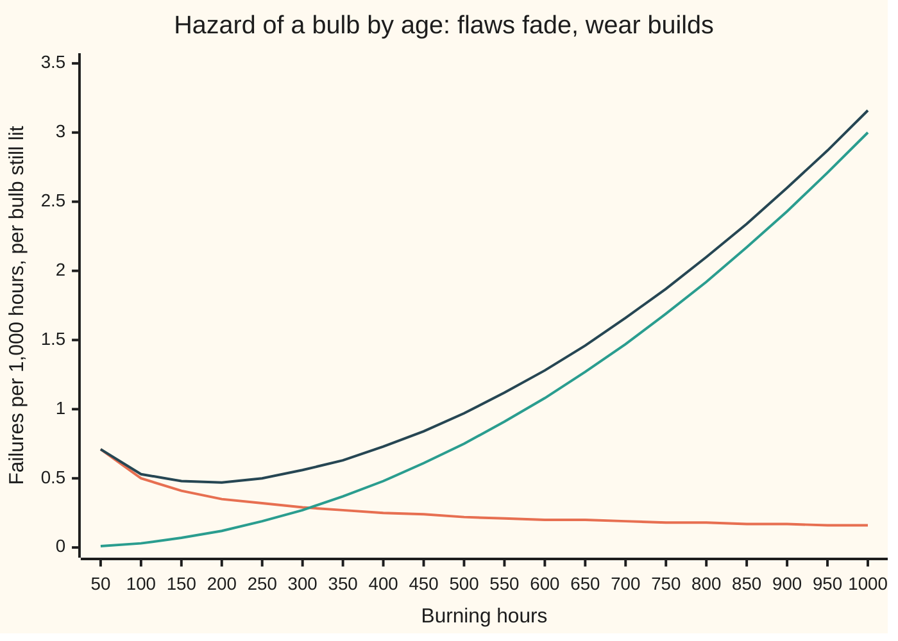

# Weibull and hazards: failure rates that rise or fall with age

[Syllabus](../../../SYLLABUS.md) → [Probability and statistics](../../../SYLLABUS.md#w09) → [Continuous Distributions](../../../SYLLABUS.md#w09-s04) → Weibull and hazards

---

## General Overview

A box of filament bulbs is rated for about 1,000 hours of burning. Two things kill them. A few leave the factory with a flaw, a thin spot in the filament or a leaky seal, and die in the first days. The rest burn fine for months, while the hot tungsten slowly boils off the filament until it snaps. Engineers call the first kind **infant mortality** and the second **wear-out**.

The question that matters to anyone replacing bulbs: does a bulb that has already burned 800 hours become more or less likely to die in the next hour? For wear-out, more. For a flaw, less: a flawed bulb that has survived a long time probably never had the flaw. Neither answer is what the [Exponential](03-exponential-distribution.md) says. Its constant chance per hour makes an 800-hour bulb exactly as good as a new one.

The tool for this is the **hazard rate**: the chance per hour of dying right now, counted only among bulbs still lit. Let the hazard be a power of age and one law follows, the **Weibull distribution**. Its **shape** number says at a glance whether the hazard falls, holds or rises. For worn-out bulbs with shape 3, a fresh bulb lasts 200 hours with chance 0.9920; an 800-hour bulb lasts 200 more with chance only 0.6139.

**A hazard proportional to a power of age forces the survival chance e to the minus (age over scale) to the shape; the shape then reads off the ageing: below 1 the survivors grow stronger, at 1 nothing changes, above 1 they wear out.**

**What kind of fact this is:** a theorem, proved on this card in Why it works: a power-law hazard forces the Weibull law. The hazard itself is a definition. Using a Weibull for real bulbs is a model, checked against data.

### The picture: a batch of bulbs, flaws and wear together



Orange: the flaw hazard, a Weibull with shape 0.5, falling. Green: the wear hazard, a Weibull with shape 3, rising. Dark blue: the bulb's total hazard, the sum of the two, which dips to its lowest at 177.0 hours and then climbs. Reliability engineers call this the **bathtub curve**.

---

## The formula

Notation first, in words. A capital $T$ is a bulb's lifetime in burning hours, a random variable (a quantity settled by chance). A lower-case $t$ is one fixed age. $S(t)$ is the **survival function**, the chance the bulb is still lit at age $t$: $S(t) = P(T > t)$. The Greek letter $\eta$, read "eta", is the **scale**, in hours. The letter $k$ is the **shape**, a plain number. $h(t)$ is the hazard at age $t$, and $H(t)$ is its running total from age 0, the **cumulative hazard**.

$$h(t) = \frac{k}{\eta}\left(\frac{t}{\eta}\right)^{k-1}, \qquad H(t) = \left(\frac{t}{\eta}\right)^{k}, \qquad S(t) = e^{-(t/\eta)^k}$$

**Read it aloud:** the hazard at age t is shape over scale times age-over-scale to the shape minus one; its running total up to t is age-over-scale to the shape; and the chance of still burning is e to the minus that running total.

The density, how thickly the chance of dying is packed near each age, is hazard times survival, and the average life uses the gamma function:

$$f(t) = h(t)\,S(t), \qquad E[T] = \eta\,\Gamma\!\left(1 + \tfrac{1}{k}\right), \qquad \text{median} = \eta\,(\ln 2)^{1/k}$$

The gamma function $\Gamma$ is the integral $\Gamma(x) = \int_0^\infty y^{x-1} e^{-y}\,dy$; at a whole number $n$ it is the factorial one step down, $\Gamma(n) = (n-1)!$, so $\Gamma(3) = 2$, and between whole numbers it fills in smoothly ([Gamma and beta](07-gamma-and-beta-distributions.md)). Writing $T \sim \mathrm{Weibull}(k, \eta)$ reads "$T$ follows the Weibull law with shape $k$ and scale $\eta$".

| Symbol | Plain meaning | In our example | Push it up and the answer… |
| --- | --- | --- | --- |
| $T$ | a bulb's lifetime in burning hours, a random variable | unknown in advance | — |
| $t$, $s$ | fixed ages in hours | $s$ = 800 already burned, $t$ = 200 more | older bulbs: survival falls |
| $k$ | shape: how the hazard changes with age | 3 for wear, 0.5 for flaws | above 1, hazard climbs faster with age |
| $\eta$ | scale: the age by which 63.21% have died, whatever the shape | 1,000 hours for wear, 10,000 for flaws | every age stretches in proportion |
| $h(t)$ | hazard: chance per hour of dying now, among bulbs still lit | 3.00 per 1,000 hours at $t$ = 1,000 | — |
| $H(t)$ | cumulative hazard: the hazard added up from 0 to $t$ | $H(1000) = 1$ | survival falls as $e^{-H}$ |
| $S(t)$ | survival: chance still lit at age $t$ | $S(1000) = 0.3679$ | — |
| $f(t)$, $F(t)$ | density, and cumulative chance of being dead by $t$, which is $1 - S(t)$ | $F(1000) = 0.6321$ | — |
| $\Delta$ | a short slice of time, in hours | 1 hour | smaller slices: the slice product closes on $S(t)$ |
| $\Gamma$ | the gamma function, a smooth factorial | $\Gamma(4/3) = 0.892980$ | — |
| $E[T]$ | average life in the long run | 892.98 hours | — |
| $n$ | bulbs wired in series, all dark when one fails | 10 | the string's scale shrinks as $n^{-1/k}$ |

### When it holds

- **One cause of death, acting alone.** A batch with flaws and wear has a hazard that falls then rises, which no single power of age can do. One Weibull forced through it reads shape 1.115 and misses both effects; What breaks prices this.
- **Bulbs that fail independently.** A voltage spike that kills a whole ceiling at once couples the lifetimes; the chance for one bulb may still be right, but counts across the batch are not.
- **Age measured in burning hours, from zero.** A bulb that sat in a shop for a year has not aged; a bulb burned in at the factory for 100 hours has, and its clock should start at 100.
- **Steady conditions.** A higher supply voltage speeds the tungsten loss and shrinks the scale. Mix bulbs from two voltages and the fitted shape blurs.

---

## Why it works

### Step 0: surviving is a run of survived slices

Cut a bulb's life into short slices of time. In each slice the bulb either dies or goes on. The chance of dying in the slice starting at age $t$, given it is still lit, is about $h(t)\,\Delta$. Surviving to age $t$ means surviving every slice in turn, so its chance is a product of $1 - h\,\Delta$ factors. Everything below is that product, taken to the limit, then evaluated for a hazard that is a power of age.

### Step 1: the hazard, defined, gives survival for any lifetime law

The hazard is a rate among survivors. Take the chance of dying in the next $\Delta$ hours, given lit at $t$, divide by $\Delta$, and shrink $\Delta$:

$$h(t) = \lim_{\Delta \to 0} \frac{P(t < T \le t + \Delta \mid T > t)}{\Delta} = \frac{f(t)}{S(t)}.$$

The bar reads "given". The top is the density near $t$; dividing by $S(t)$ keeps only the bulbs still lit. Since $f$ is the slope of $F = 1 - S$, $f = -S'$, and the hazard is $-S'/S$, which is minus the slope of $\ln S$. Add it up from age 0, where every bulb is lit and $S(0) = 1$:

$$H(t) = \int_0^t h(u)\,du = -\ln S(t), \qquad S(t) = e^{-H(t)}.$$

This holds for any lifetime with a density. It is the slice product of Step 0 in the limit: the logarithm of a product of $1 - h\Delta$ factors is a sum of about $-h\Delta$ terms, which is $-H$. The code checks it without calling the exponential at all. With one-hour slices the product gives 0.3675 against the exact 0.3679 at 1,000 hours; with 100-hour slices it gives 0.3322.

<details>
<summary>Detailed proof: the hazard fixes the survival curve, and a power-law hazard fixes the Weibull</summary>

Suppose $T > 0$ has a density $f$ that is continuous on the positive ages, and $S(t) > 0$. For $\Delta > 0$, the chance of dying in $(t, t + \Delta]$ given lit at $t$ is $(S(t) - S(t + \Delta))/S(t)$. Divide by $\Delta$: as $\Delta$ shrinks, the top tends to $-S'(t) = f(t)$, so the limit is $f(t)/S(t)$.

By the chain rule, $\frac{d}{dt}\ln S(t) = S'(t)/S(t) = -h(t)$. Integrate from a small $\varepsilon > 0$ to $t$ and let $\varepsilon \to 0$; since $S$ is continuous with $S(0) = 1$, $\ln S(\varepsilon) \to 0$, and $\ln S(t) = -\int_0^t h(u)\,du$. The integral near 0 is an improper one when the hazard blows up there, as it does for shape below 1 ([Improper integrals](../../06-Calculus%20and%20analysis/04-Integrals/07-improper-integrals.md)).

So the hazard determines $S$ completely: two laws with the same hazard at every age have the same survival curve. Now take $h(t) = c\,t^{k-1}$ with $c > 0$ and $k > 0$. Then $\int_0^t c\,u^{k-1}\,du = c\,t^k/k$, finite because $k > 0$. Name the scale by $c = k/\eta^k$; then $H(t) = (t/\eta)^k$ and $S(t) = e^{-(t/\eta)^k}$. As $t$ grows, $H$ grows without bound, so $S \to 0$: every bulb dies eventually, and the law is a genuine lifetime law. The only law with a power-law hazard is the Weibull.

</details>

### Step 2: a power of age gives the Weibull, and the scale has a meaning

Take the hazard to be a constant times age to some power, $c\,t^{k-1}$. Its running total is $c\,t^k/k$. Writing the constant as $k/\eta^k$ tidies that to $(t/\eta)^k$, which is why the formula carries the scale inside a bracket. Step 1 then gives $S(t) = e^{-(t/\eta)^k}$.

At $t = \eta$ the bracket is 1 whatever the shape, so $S(\eta) = e^{-1} = 0.3679$. The scale is the age by which 0.6321 of the bulbs, about 63 in 100, have died. For the worn bulbs that is 1,000 hours. It is not the average life, which is 892.98 hours, nor the median, 885.00 hours.

For the wear bulbs, with shape 3 and scale 1,000:

- the hazard is $3t^2/1000^3$: 0.75 per 1,000 hours at 500 hours, 3.00 at 1,000 hours;
- survival is 0.8825 at 500 hours and 0.3679 at 1,000 hours.

### Step 3: reading the shape

The hazard's slope has the sign of $k - 1$, because age is raised to the power $k - 1$. Three cases, all with scale 1,000 hours:

| Shape | Hazard at 200 h, per 1,000 h | Hazard at 800 h | Lasts 200 h, fresh | Lasts 200 more, after 800 h |
| --- | --- | --- | --- | --- |
| 0.5, infant mortality | 1.118 | 0.559 | 0.6394 | 0.8998 |
| 1, exponential | 1.000 | 1.000 | 0.8187 | 0.8187 |
| 3, wear-out | 0.120 | 1.920 | 0.9920 | 0.6139 |

The last two columns come from one ratio. Surviving 200 more hours after 800 means surviving to 1,000, out of those who reached 800:

$$P(T > s + t \mid T > s) = \frac{S(s + t)}{S(s)} = e^{-[H(s+t) - H(s)]}.$$

Only the hazard packed into the next 200 hours matters. With shape 0.5 the old bulb faces less of it than a new one, so it is safer. With shape 1 the two are equal, the memoryless case of the exponential. With shape 3 it faces far more.

Shape below 1 does not mean a single bulb heals. It means the batch changes: weak bulbs die first, and the survivors are mostly sound ones. Shape above 1 is a single bulb getting worse, its filament thinner each hour. At shape 2 the hazard rises in a straight line with age.

<details>
<summary>Why engineers met the Weibull first: the weakest link</summary>

Wire 10 shape-3 bulbs in series, like an old string of festive lights: the string goes dark when the first bulb fails. The string survives to $t$ only if all ten do, so its survival is $S(t)^{10} = e^{-10(t/\eta)^k}$. That is again a Weibull, same shape, with scale $\eta \times 10^{-1/k}$: 464.16 hours instead of 1,000. A chain is as strong as its weakest link, and the minimum of many Weibull lives stays Weibull. Waloddi Weibull proposed the law in 1939 for the breaking strength of materials, where a rod breaks at its weakest flaw, and argued its wide use in 1951.

</details>

### Step 4: reading the shape from data

Take logarithms twice. Since $-\ln S(t) = (t/\eta)^k$,

$$\ln\big(-\ln S(t)\big) = k \ln t - k \ln \eta.$$

Plotted against $\ln t$, the left side is a straight line with slope $k$: the **Weibull plot**. Count the fraction of a batch still lit at two ages and the slope between them estimates the shape. At 500 and 1,000 hours the exact survivals are 0.8825 and 0.3679, whose $-\ln$ values are $1/8$ and 1; the ratio is 8, and $\ln 8/\ln 2 = 3$. The scale then follows from either age: $\eta = t/(-\ln S(t))^{1/k} = 500/(1/8)^{1/3} = 1{,}000$ hours. Two ages $t_1 < t_2$ give exactly one Weibull when $1 > S(t_1) > S(t_2) > 0$; if survival does not fall strictly between them, or either value is 0 or 1, no Weibull fits. The simulation below does this on 20 batches of 2,000 bulbs and reads a shape of 3.018 (standard error 0.021).

### Step 5: two causes, hazards add

A bulb in the mixed batch carries two clocks: a flaw clock (shape 0.5, scale 10,000 hours) and a wear clock (shape 3, scale 1,000 hours). It dies when the first one runs out. If the two are independent, surviving both is the product of surviving each:

$$S(t) = e^{-H_{\text{flaw}}(t)}\,e^{-H_{\text{wear}}(t)} = e^{-[H_{\text{flaw}}(t) + H_{\text{wear}}(t)]}.$$

So cumulative hazards add, and so do hazards. That sum is the dark blue bathtub in the opening chart. The flaw part is $0.005/\sqrt{t}$ per hour and the wear part $3t^2/1000^3$. Setting the slope of the sum to zero puts the low point at 177.0 hours, with a hazard of 0.470 per 1,000 hours. Survival is 0.9039 at 100 hours, so about 1 bulb in 10 dies early, and 0.2681 at 1,000 hours.

### The average life

The average of a lifetime is the area under its survival curve, $E[T] = \int_0^\infty S(t)\,dt$, because each hour contributes the chance of still being lit through it. For the Weibull, substitute $y = (t/\eta)^k$ and the area becomes $\eta\,\Gamma(1 + 1/k)$. At shape 3 that is $1000 \times 0.892980 = 892.98$ hours. The code reaches it twice: by a Stirling series for $\Gamma(1 + 1/k)$, and by adding up the area under $S(t)$ with Simpson's rule.

<details>
<summary>Detailed proof: the mean and the median</summary>

With $t = \eta\,y^{1/k}$, $dt = (\eta/k)\,y^{1/k - 1}\,dy$, so $\int_0^\infty e^{-(t/\eta)^k}\,dt = \frac{\eta}{k}\int_0^\infty y^{1/k - 1} e^{-y}\,dy = \frac{\eta}{k}\,\Gamma(1/k) = \eta\,\Gamma(1 + 1/k)$, using $x\,\Gamma(x) = \Gamma(x + 1)$. The median solves $(t/\eta)^k = \ln 2$, so it is $\eta\,(\ln 2)^{1/k}$.

</details>

The general study of hazards, including lifetimes cut short by the end of a test, is [Survival](../13-Survival%2C%20Design%20and%20Causality/01-survival-functions-and-hazards.md).

---

## Worked numbers, by hand

Wear-out bulbs: shape 3, scale 1,000 hours. A bulb has burned 800 hours.

| Step | Arithmetic | Value |
| --- | --- | --- |
| cumulative hazard at 800 h | $(800/1000)^3$ | 0.512 |
| cumulative hazard at 1,000 h | $(1000/1000)^3$ | 1 |
| survival to 1,000 h | $e^{-1}$ | 0.3679 |
| hazard at 1,000 h | $3 \times 1000^2 / 1000^3$ | 3.00 per 1,000 h |
| a fresh bulb lasts 200 h | $e^{-(0.2)^3} = e^{-0.008}$ | 0.9920 |
| the 800-hour bulb lasts 200 more | $e^{-(1 - 0.512)} = e^{-0.488}$ | **0.6139** |

An 800-hour bulb has about a 61% chance of reaching 1,000 hours, against 99% for a new bulb over the same 200 hours: at this age, replacing it before it fails is worth considering.

### What breaks if you drop a piece

| Mistake | Comes out at | What went wrong |
| --- | --- | --- |
| Exponential with the same 892.98 h mean | 0.7993, not 0.6139 | Constant hazard forgets age; these bulbs wear |
| Fresh survival used for the 800-hour bulb | 0.9920, not 0.6139 | The condition "already lit at 800" was dropped |
| Hazard times 200 h read as a chance of dying | 0.6000, not 0.5171 | A hazard is a rate; over a long stretch use $1 - S(1200)/S(1000)$ |
| One Weibull forced through the bathtub batch | shape 1.115 | Two causes, one falling and one rising hazard, averaged into nearly flat |

The last row drops the single-cause hypothesis: a shape near 1 says "age irrelevant" about a batch with strong infant mortality and strong wear. The code prints all four.

---

## Code, from first principles, and it actually runs

The scripts reach the answers by independent roads. The closed form $e^{-(t/\eta)^k}$. A product of survived slices, $1 - h\Delta$ in each, which never calls the exponential. The mean twice: a Stirling series for $\Gamma(1 + 1/k)$, and Simpson's rule for the area under $S(t)$. The bathtub's low point twice: a ternary search (shrinking a bracket around the minimum) and the algebra of Step 5. And a simulation of 40,000 bulbs from a SplitMix64 generator with seed 2026, each drawing a wear life and a flaw life. The draws invert $S$, so they do follow the formula; what the simulation tests independently is the hazard found by counting deaths among the living, the Weibull-plot slope, and the product rule for two causes. Simulated numbers carry a standard error (se), and the asserts allow four of them.

### Python

```python
# Weibull and hazard rates -- the check behind the card.  Only math primitives.
# Light bulbs.  Wear-out: shape K = 3, scale ETA = 1000 burning hours, set beside
# shapes 0.5 and 1 at the same scale.  A bathtub batch: a flaw (shape 0.5, scale
# 10000 h) races wear, and the bulb dies at whichever strikes first.
# Roads: the closed form exp(-(t/eta)^k); a product of survived slices that never
# calls exp; Simpson and a Stirling series for the mean; a seeded simulation.
from math import exp, log, sqrt, pi
K, ETA, FK, FETA, M64 = 3.0, 1000.0, 0.5, 10000.0, (1 << 64) - 1

def surv(t, k=K, eta=ETA):            # road one: S(t) = exp(-(t/eta)^k)
    return exp(-(t / eta) ** k)

def hazard(t, k=K, eta=ETA):          # h(t) = (k/eta) (t/eta)^(k-1)
    return k / eta * (t / eta) ** (k - 1)

def slices(t, d, k=K, eta=ETA):       # road two: survive each slice of d hours in turn
    s = 1.0
    for j in range(round(t / d)):
        s *= 1.0 - hazard((j + 0.5) * d, k, eta) * d
    return s

def simpson(g, a, b, n):              # area under g from a to b
    w = (b - a) / n
    tot = g(a) + g(b)
    for j in range(1, n):
        tot += (4.0 if j % 2 else 2.0) * g(a + j * w)
    return tot * w / 3.0

def gamma(x):                         # Stirling's series at x + 10, stepped back down
    z, shift = x + 10.0, 1.0
    for j in range(10):
        shift *= x + j
    lg = (z - 0.5) * log(z) - z + 0.5 * log(2 * pi) + 1 / (12 * z) - 1 / (360 * z ** 3) + 1 / (1260 * z ** 5)
    return exp(lg) / shift

class SplitMix64:                     # the same random numbers in both languages
    def __init__(self, seed):
        self.s = seed
    def uniform(self):                # strictly between 0 and 1
        self.s = (self.s + 0x9E3779B97F4A7C15) & M64
        z = self.s
        z = ((z ^ (z >> 30)) * 0xBF58476D1CE4E5B9) & M64
        z = ((z ^ (z >> 27)) * 0x94D049BB133111EB) & M64
        return (((z ^ (z >> 31)) >> 11) + 0.5) / 9007199254740992.0

def counted_hazard(lives, t, w):      # failures in (t - w/2, t + w/2] per hour, per bulb alive
    alive = sum(x > t - w / 2 for x in lives)
    p = sum(t - w / 2 < x <= t + w / 2 for x in lives) / alive
    return p / w, sqrt(p * (1 - p) / alive) / w

def pct(xs):
    return ", ".join(f"{100 * x:.2f}" for x in xs)

print(f"wear-out bulbs: shape {K}, scale {ETA} hours")
print(f"S(500) = {surv(500):.4f}; S(1000) = {surv(1000):.4f}; failed by 1000 h = {1 - surv(1000):.4f}")
print(f"h(500) = {1000 * hazard(500):.2f} per 1000 h; h(1000) = {1000 * hazard(1000):.2f} per 1000 h")
print(f"median = {ETA * log(2) ** (1 / K):.2f} h")
for k in (0.5, 1.0, 3.0):
    print(f"shape {k}: h(200) = {1000 * hazard(200, k):.3f}, h(800) = {1000 * hazard(800, k):.3f} per 1000 h; "
          f"200 h fresh {surv(200, k):.4f}, 200 more after 800 h {surv(1000, k) / surv(800, k):.4f}")
print("slices, shape 3, S(1000) with 100, 10, 1 h slices: "
      + ", ".join(f"{slices(1000, d):.4f}" for d in (100.0, 10.0, 1.0)) + f"; exact {surv(1000):.4f}")
print(f"slices, shape 0.5, S(1000) with 1 h and 0.01 h slices: {slices(1000, 1.0, 0.5):.4f}, "
      f"{slices(1000, 0.01, 0.5):.4f}; exact {surv(1000, 0.5):.4f}")
gk = gamma(1 + 1 / K)
area = simpson(surv, 0.0, 4000.0, 4000)
print(f"mean by Stirling: 1000 x Gamma(1 + 1/{K:g}) = 1000 x {gk:.6f} = {ETA * gk:.2f} h")
print(f"mean by Simpson, area under S(t) to 4000 h = {area:.2f} h")
print(f"Gamma(3) = {gamma(3.0):.6f} and Gamma(2) = {gamma(2.0):.6f} (should be 2 and 1)")
print(f"10 bulbs in series, shape 3: scale 1000 x 10^(-1/3) = {ETA * 10 ** (-1 / K):.2f} h")

a, b = FK / FETA ** FK, K / ETA ** K  # bathtub: flaw a t^(-1/2) plus wear b t^2
def bath(t):
    return hazard(t, FK, FETA) + hazard(t)
lo, hi = 1.0, 1000.0                  # ternary search for the lowest hazard
for _ in range(200):
    m1, m2 = lo + (hi - lo) / 3, hi - (hi - lo) / 3
    lo, hi = (lo, m2) if bath(m1) < bath(m2) else (m1, hi)
tstar = (a / (4 * b)) ** 0.4          # where the slope -a/2 t^(-3/2) + 2 b t is zero
print(f"bathtub: flaw hazard {1000 * a:.0f}/sqrt(t) per 1000 h, wear 3 (t/1000)^2 per 1000 h")
print(f"bathtub low point: search {lo:.1f} h, algebra {tstar:.1f} h, hazard {1000 * bath(tstar):.3f} per 1000 h")
print(f"bathtub survival S(100) = {surv(100, FK, FETA) * surv(100):.4f}; S(1000) = {surv(1000, FK, FETA) * surv(1000):.4f}")

rng, N = SplitMix64(2026), 40000
wear, both = [], []
for _ in range(N):                    # each bulb draws a wear life and a flaw life
    w = ETA * (-log(rng.uniform())) ** (1 / K)
    f = FETA * (-log(rng.uniform())) ** (1 / FK)
    wear.append(w)
    both.append(min(w, f))
mw = sum(wear) / N
sew = sqrt(sum((x - mw) ** 2 for x in wear) / (N - 1) / N)
print(f"simulated, seed 2026, {N} bulbs: mean wear life {mw:.2f} h (se {sew:.2f})")
hz = [counted_hazard(wear, t, 20.0) for t in (500.0, 1000.0)]
print("simulated wear hazard at 500 h, 1000 h: "
      + "; ".join(f"{1000 * h:.2f} (se {1000 * s:.2f})" for h, s in hz) + " per 1000 h")
ks = []
for j in range(20):                   # Weibull plot slope in 20 batches of 2000 bulbs
    batch = wear[2000 * j: 2000 * (j + 1)]
    s5, s10 = (sum(x > t for x in batch) / 2000 for t in (500.0, 1000.0))
    ks.append(log(log(s10) / log(s5)) / log(2))
mk = sum(ks) / 20
sek = sqrt(sum((x - mk) ** 2 for x in ks) / 19 / 20)
print(f"shape read off the Weibull plot, 20 batches: {mk:.3f} (se {sek:.3f})")
sb = [sum(x > t for x in both) / N for t in (100.0, 1000.0)]
seb = [sqrt(p * (1 - p) / N) for p in sb]
print(f"simulated bathtub S(100) = {sb[0]:.4f} (se {seb[0]:.4f}); S(1000) = {sb[1]:.4f} (se {seb[1]:.4f})")
hb = [counted_hazard(both, t, 20.0) for t in (100.0, 1000.0)]
print("simulated bathtub hazard at 100 h, 1000 h: "
      + "; ".join(f"{1000 * h:.2f} (se {1000 * s:.2f})" for h, s in hb) + " per 1000 h; "
      + f"sum of hazards {1000 * bath(100):.2f}, {1000 * bath(1000):.2f}")

grid = [50 * i for i in range(1, 21)]
print("figure, hours: " + ", ".join(str(t) for t in grid))
print("figure, flaw per 1000 h: " + ", ".join(f"{1000 * hazard(t, FK, FETA):.2f}" for t in grid))
print("figure, wear per 1000 h: " + ", ".join(f"{1000 * hazard(t):.2f}" for t in grid))
print("figure, total per 1000 h: " + ", ".join(f"{1000 * bath(t):.2f}" for t in grid))
sg = [200 * i for i in range(11)]
print("figure, hours: " + ", ".join(str(t) for t in sg))
for k in (0.5, 1.0, 3.0):
    print(f"figure, S shape {k} %: " + pct([surv(t, k) for t in sg]))
print(f"mistake, exponential with the same mean: 200 more after 800 h = {exp(-200 / (ETA * gk)):.4f}")
print(f"mistake, fresh survival used at 800 h: {surv(200):.4f}, not {surv(1000) / surv(800):.4f}")
print(f"mistake, h(1000) x 200 h as a chance: {hazard(1000) * 200:.4f}; true 1 - S(1200)/S(1000) = "
      f"{1 - surv(1200) / surv(1000):.4f}")
sx = [surv(t, FK, FETA) * surv(t) for t in (100.0, 1000.0)]
print(f"mistake, one Weibull through the bathtub at 100 h and 1000 h: shape {log(log(sx[1]) / log(sx[0])) / log(10):.3f}")
assert abs(slices(1000, 1.0) - surv(1000)) < 1e-3 < abs(slices(1000, 100.0) - surv(1000))
assert abs(slices(1000, 0.01, 0.5) - surv(1000, 0.5)) < 1e-3
assert abs(ETA * gk - area) < 1e-6 and abs(gamma(3.0) - 2.0) < 1e-10  # Stirling vs Simpson
assert abs(lo - tstar) < 1e-3                                        # search vs algebra
assert abs(mw - ETA * gk) < 4 * sew and abs(mk - K) < 4 * sek       # simulation vs formula
assert all(abs(h - hazard(t)) < 4 * s for (h, s), t in zip(hz, (500.0, 1000.0)))
assert all(abs(p - x) < 4 * s for p, s, x in zip(sb, seb, sx))    # product rule vs count
assert all(abs(h - bath(t)) < 4 * s for (h, s), t in zip(hb, (100.0, 1000.0)))
print("ALL CHECKS PASS")
```

**Ran 2026-09-28 on macOS, Python 3.14.6, standard library only. All checks passed. Output, pasted from the run:**

```
wear-out bulbs: shape 3.0, scale 1000.0 hours
S(500) = 0.8825; S(1000) = 0.3679; failed by 1000 h = 0.6321
h(500) = 0.75 per 1000 h; h(1000) = 3.00 per 1000 h
median = 885.00 h
shape 0.5: h(200) = 1.118, h(800) = 0.559 per 1000 h; 200 h fresh 0.6394, 200 more after 800 h 0.8998
shape 1.0: h(200) = 1.000, h(800) = 1.000 per 1000 h; 200 h fresh 0.8187, 200 more after 800 h 0.8187
shape 3.0: h(200) = 0.120, h(800) = 1.920 per 1000 h; 200 h fresh 0.9920, 200 more after 800 h 0.6139
slices, shape 3, S(1000) with 100, 10, 1 h slices: 0.3322, 0.3645, 0.3675; exact 0.3679
slices, shape 0.5, S(1000) with 1 h and 0.01 h slices: 0.3710, 0.3682; exact 0.3679
mean by Stirling: 1000 x Gamma(1 + 1/3) = 1000 x 0.892980 = 892.98 h
mean by Simpson, area under S(t) to 4000 h = 892.98 h
Gamma(3) = 2.000000 and Gamma(2) = 1.000000 (should be 2 and 1)
10 bulbs in series, shape 3: scale 1000 x 10^(-1/3) = 464.16 h
bathtub: flaw hazard 5/sqrt(t) per 1000 h, wear 3 (t/1000)^2 per 1000 h
bathtub low point: search 177.0 h, algebra 177.0 h, hazard 0.470 per 1000 h
bathtub survival S(100) = 0.9039; S(1000) = 0.2681
simulated, seed 2026, 40000 bulbs: mean wear life 893.40 h (se 1.62)
simulated wear hazard at 500 h, 1000 h: 0.74 (se 0.03); 2.94 (se 0.10) per 1000 h
shape read off the Weibull plot, 20 batches: 3.018 (se 0.021)
simulated bathtub S(100) = 0.9023 (se 0.0015); S(1000) = 0.2669 (se 0.0022)
simulated bathtub hazard at 100 h, 1000 h: 0.53 (se 0.03); 3.08 (se 0.11) per 1000 h; sum of hazards 0.53, 3.16
figure, hours: 50, 100, 150, 200, 250, 300, 350, 400, 450, 500, 550, 600, 650, 700, 750, 800, 850, 900, 950, 1000
figure, flaw per 1000 h: 0.71, 0.50, 0.41, 0.35, 0.32, 0.29, 0.27, 0.25, 0.24, 0.22, 0.21, 0.20, 0.20, 0.19, 0.18, 0.18, 0.17, 0.17, 0.16, 0.16
figure, wear per 1000 h: 0.01, 0.03, 0.07, 0.12, 0.19, 0.27, 0.37, 0.48, 0.61, 0.75, 0.91, 1.08, 1.27, 1.47, 1.69, 1.92, 2.17, 2.43, 2.71, 3.00
figure, total per 1000 h: 0.71, 0.53, 0.48, 0.47, 0.50, 0.56, 0.63, 0.73, 0.84, 0.97, 1.12, 1.28, 1.46, 1.66, 1.87, 2.10, 2.34, 2.60, 2.87, 3.16
figure, hours: 0, 200, 400, 600, 800, 1000, 1200, 1400, 1600, 1800, 2000
figure, S shape 0.5 %: 100.00, 63.94, 53.13, 46.09, 40.88, 36.79, 33.44, 30.63, 28.23, 26.14, 24.31
figure, S shape 1.0 %: 100.00, 81.87, 67.03, 54.88, 44.93, 36.79, 30.12, 24.66, 20.19, 16.53, 13.53
figure, S shape 3.0 %: 100.00, 99.20, 93.80, 80.57, 59.93, 36.79, 17.76, 6.43, 1.66, 0.29, 0.03
mistake, exponential with the same mean: 200 more after 800 h = 0.7993
mistake, fresh survival used at 800 h: 0.9920, not 0.6139
mistake, h(1000) x 200 h as a chance: 0.6000; true 1 - S(1200)/S(1000) = 0.5171
mistake, one Weibull through the bathtub at 100 h and 1000 h: shape 1.115
ALL CHECKS PASS
```

### Rust

Same numbers, same labels, built with `rustc --edition 2021 -O`.

```rust
// Weibull and hazard rates -- the same check as the Python, std only.
// Light bulbs.  Wear-out: shape K = 3, scale ETA = 1000 burning hours, set beside
// shapes 0.5 and 1 at the same scale.  A bathtub batch: a flaw (shape 0.5, scale
// 10000 h) races wear, and the bulb dies at whichever strikes first.
// Roads: the closed form exp(-(t/eta)^k); a product of survived slices that never
// calls exp; Simpson and a Stirling series for the mean; a seeded simulation.
use std::f64::consts::PI;
const K: f64 = 3.0;
const ETA: f64 = 1000.0;
const FK: f64 = 0.5;
const FETA: f64 = 10000.0;

fn surv(t: f64, k: f64, eta: f64) -> f64 { (-(t / eta).powf(k)).exp() }       // road one
fn hazard(t: f64, k: f64, eta: f64) -> f64 { k / eta * (t / eta).powf(k - 1.0) }
fn s3(t: f64) -> f64 { surv(t, K, ETA) }
fn h3(t: f64) -> f64 { hazard(t, K, ETA) }
fn slices(t: f64, d: f64, k: f64) -> f64 {           // road two: survive each slice in turn
    let mut s = 1.0;
    for j in 0..(t / d).round() as usize {
        s *= 1.0 - hazard((j as f64 + 0.5) * d, k, ETA) * d;
    }
    s
}
fn simpson<G: Fn(f64) -> f64>(g: G, a: f64, b: f64, n: usize) -> f64 {
    let w = (b - a) / n as f64;
    let mut tot = g(a) + g(b);
    for j in 1..n {
        tot += (if j % 2 == 1 { 4.0 } else { 2.0 }) * g(a + j as f64 * w);
    }
    tot * w / 3.0
}
fn gamma(x: f64) -> f64 {                            // Stirling's series at x + 10, stepped back down
    let (z, mut shift) = (x + 10.0, 1.0);
    for j in 0..10 { shift *= x + j as f64 }
    let lg = (z - 0.5) * z.ln() - z + 0.5 * (2.0 * PI).ln() + 1.0 / (12.0 * z)
        - 1.0 / (360.0 * z.powi(3)) + 1.0 / (1260.0 * z.powi(5));
    lg.exp() / shift
}
struct SplitMix64 { s: u64 }                          // the same random numbers as Python
impl SplitMix64 {
    fn uniform(&mut self) -> f64 {                   // strictly between 0 and 1
        self.s = self.s.wrapping_add(0x9E3779B97F4A7C15);
        let mut z = self.s;
        z = (z ^ (z >> 30)).wrapping_mul(0xBF58476D1CE4E5B9);
        z = (z ^ (z >> 27)).wrapping_mul(0x94D049BB133111EB);
        (((z ^ (z >> 31)) >> 11) as f64 + 0.5) / 9007199254740992.0
    }
}
fn counted_hazard(lives: &[f64], t: f64, w: f64) -> (f64, f64) {
    let alive = lives.iter().filter(|&&x| x > t - w / 2.0).count() as f64;
    let p = lives.iter().filter(|&&x| t - w / 2.0 < x && x <= t + w / 2.0).count() as f64 / alive;
    (p / w, (p * (1.0 - p) / alive).sqrt() / w)
}
fn join(v: &[f64], scale: f64) -> String {
    v.iter().map(|x| format!("{:.2}", scale * x)).collect::<Vec<_>>().join(", ")
}
fn bath(t: f64) -> f64 { hazard(t, FK, FETA) + h3(t) }

fn main() {
    println!("wear-out bulbs: shape {:.1}, scale {:.1} hours", K, ETA);
    println!("S(500) = {:.4}; S(1000) = {:.4}; failed by 1000 h = {:.4}", s3(500.0), s3(1000.0), 1.0 - s3(1000.0));
    println!("h(500) = {:.2} per 1000 h; h(1000) = {:.2} per 1000 h", 1000.0 * h3(500.0), 1000.0 * h3(1000.0));
    println!("median = {:.2} h", ETA * 2f64.ln().powf(1.0 / K));
    for k in [0.5, 1.0, 3.0] {
        println!("shape {:.1}: h(200) = {:.3}, h(800) = {:.3} per 1000 h; 200 h fresh {:.4}, 200 more after 800 h {:.4}",
                 k, 1000.0 * hazard(200.0, k, ETA), 1000.0 * hazard(800.0, k, ETA), surv(200.0, k, ETA),
                 surv(1000.0, k, ETA) / surv(800.0, k, ETA));
    }
    let sl: Vec<String> = [100.0, 10.0, 1.0].iter().map(|&d| format!("{:.4}", slices(1000.0, d, K))).collect();
    println!("slices, shape 3, S(1000) with 100, 10, 1 h slices: {}; exact {:.4}", sl.join(", "), s3(1000.0));
    println!("slices, shape 0.5, S(1000) with 1 h and 0.01 h slices: {:.4}, {:.4}; exact {:.4}",
             slices(1000.0, 1.0, 0.5), slices(1000.0, 0.01, 0.5), surv(1000.0, 0.5, ETA));
    let gk = gamma(1.0 + 1.0 / K);
    let area = simpson(s3, 0.0, 4000.0, 4000);
    println!("mean by Stirling: 1000 x Gamma(1 + 1/{}) = 1000 x {:.6} = {:.2} h", K, gk, ETA * gk);
    println!("mean by Simpson, area under S(t) to 4000 h = {:.2} h", area);
    println!("Gamma(3) = {:.6} and Gamma(2) = {:.6} (should be 2 and 1)", gamma(3.0), gamma(2.0));
    println!("10 bulbs in series, shape 3: scale 1000 x 10^(-1/3) = {:.2} h", ETA * 10f64.powf(-1.0 / K));

    let (a, b) = (FK / FETA.powf(FK), K / ETA.powf(K));   // bathtub: flaw a t^(-1/2) plus wear b t^2
    let (mut lo, mut hi) = (1.0f64, 1000.0f64);           // ternary search for the lowest hazard
    for _ in 0..200 {
        let (m1, m2) = (lo + (hi - lo) / 3.0, hi - (hi - lo) / 3.0);
        if bath(m1) < bath(m2) { hi = m2 } else { lo = m1 }
    }
    let tstar = (a / (4.0 * b)).powf(0.4);                // where the slope -a/2 t^(-3/2) + 2 b t is zero
    println!("bathtub: flaw hazard {:.0}/sqrt(t) per 1000 h, wear 3 (t/1000)^2 per 1000 h", 1000.0 * a);
    println!("bathtub low point: search {:.1} h, algebra {:.1} h, hazard {:.3} per 1000 h", lo, tstar, 1000.0 * bath(tstar));
    println!("bathtub survival S(100) = {:.4}; S(1000) = {:.4}",
             surv(100.0, FK, FETA) * s3(100.0), surv(1000.0, FK, FETA) * s3(1000.0));

    let (mut rng, n) = (SplitMix64 { s: 2026 }, 40000usize);
    let (mut wear, mut both) = (Vec::new(), Vec::new());
    for _ in 0..n {                                        // each bulb draws a wear life and a flaw life
        let w = ETA * (-rng.uniform().ln()).powf(1.0 / K);
        let f = FETA * (-rng.uniform().ln()).powf(1.0 / FK);
        wear.push(w);
        both.push(w.min(f));
    }
    let nf = n as f64;
    let mw = wear.iter().sum::<f64>() / nf;
    let sew = (wear.iter().map(|x| (x - mw) * (x - mw)).sum::<f64>() / (nf - 1.0) / nf).sqrt();
    println!("simulated, seed 2026, {} bulbs: mean wear life {:.2} h (se {:.2})", n, mw, sew);
    let hz: Vec<(f64, f64)> = [500.0, 1000.0].iter().map(|&t| counted_hazard(&wear, t, 20.0)).collect();
    let fmt = |v: &Vec<(f64, f64)>| v.iter().map(|(h, s)| format!("{:.2} (se {:.2})", 1000.0 * h, 1000.0 * s))
        .collect::<Vec<_>>().join("; ");
    println!("simulated wear hazard at 500 h, 1000 h: {} per 1000 h", fmt(&hz));
    let mut ks = Vec::new();
    for j in 0..20 {                                       // Weibull plot slope in 20 batches of 2000 bulbs
        let batch = &wear[2000 * j..2000 * (j + 1)];
        let s5 = batch.iter().filter(|&&x| x > 500.0).count() as f64 / 2000.0;
        let s10 = batch.iter().filter(|&&x| x > 1000.0).count() as f64 / 2000.0;
        ks.push((s10.ln() / s5.ln()).ln() / 2f64.ln());
    }
    let mk = ks.iter().sum::<f64>() / 20.0;
    let sek = (ks.iter().map(|x| (x - mk) * (x - mk)).sum::<f64>() / 19.0 / 20.0).sqrt();
    println!("shape read off the Weibull plot, 20 batches: {:.3} (se {:.3})", mk, sek);
    let sb: Vec<f64> = [100.0, 1000.0].iter().map(|&t| both.iter().filter(|&&x| x > t).count() as f64 / nf).collect();
    let seb: Vec<f64> = sb.iter().map(|p| (p * (1.0 - p) / nf).sqrt()).collect();
    println!("simulated bathtub S(100) = {:.4} (se {:.4}); S(1000) = {:.4} (se {:.4})", sb[0], seb[0], sb[1], seb[1]);
    let hb: Vec<(f64, f64)> = [100.0, 1000.0].iter().map(|&t| counted_hazard(&both, t, 20.0)).collect();
    println!("simulated bathtub hazard at 100 h, 1000 h: {} per 1000 h; sum of hazards {:.2}, {:.2}",
             fmt(&hb), 1000.0 * bath(100.0), 1000.0 * bath(1000.0));

    let grid: Vec<f64> = (1..21).map(|i| 50.0 * i as f64).collect();
    println!("figure, hours: {}", grid.iter().map(|t| format!("{}", t)).collect::<Vec<_>>().join(", "));
    println!("figure, flaw per 1000 h: {}", join(&grid.iter().map(|&t| hazard(t, FK, FETA)).collect::<Vec<_>>(), 1000.0));
    println!("figure, wear per 1000 h: {}", join(&grid.iter().map(|&t| h3(t)).collect::<Vec<_>>(), 1000.0));
    println!("figure, total per 1000 h: {}", join(&grid.iter().map(|&t| bath(t)).collect::<Vec<_>>(), 1000.0));
    let sg: Vec<f64> = (0..11).map(|i| 200.0 * i as f64).collect();
    println!("figure, hours: {}", sg.iter().map(|t| format!("{}", t)).collect::<Vec<_>>().join(", "));
    for k in [0.5, 1.0, 3.0] {
        println!("figure, S shape {:.1} %: {}", k, join(&sg.iter().map(|&t| surv(t, k, ETA)).collect::<Vec<_>>(), 100.0));
    }
    println!("mistake, exponential with the same mean: 200 more after 800 h = {:.4}", (-200.0 / (ETA * gk)).exp());
    println!("mistake, fresh survival used at 800 h: {:.4}, not {:.4}", s3(200.0), s3(1000.0) / s3(800.0));
    println!("mistake, h(1000) x 200 h as a chance: {:.4}; true 1 - S(1200)/S(1000) = {:.4}",
             h3(1000.0) * 200.0, 1.0 - s3(1200.0) / s3(1000.0));
    let sx: Vec<f64> = [100.0, 1000.0].iter().map(|&t| surv(t, FK, FETA) * s3(t)).collect();
    println!("mistake, one Weibull through the bathtub at 100 h and 1000 h: shape {:.3}",
             (sx[1].ln() / sx[0].ln()).ln() / 10f64.ln());
    assert!((slices(1000.0, 1.0, K) - s3(1000.0)).abs() < 1e-3 && 1e-3 < (slices(1000.0, 100.0, K) - s3(1000.0)).abs());
    assert!((slices(1000.0, 0.01, 0.5) - surv(1000.0, 0.5, ETA)).abs() < 1e-3);
    assert!((ETA * gk - area).abs() < 1e-6 && (gamma(3.0) - 2.0).abs() < 1e-10);   // Stirling vs Simpson
    assert!((lo - tstar).abs() < 1e-3);                                             // search vs algebra
    assert!((mw - ETA * gk).abs() < 4.0 * sew && (mk - K).abs() < 4.0 * sek);      // simulation vs formula
    assert!(hz.iter().zip([500.0, 1000.0]).all(|(&(h, s), t)| (h - h3(t)).abs() < 4.0 * s));
    assert!(sb.iter().zip(&seb).zip(&sx).all(|((p, s), x)| (p - x).abs() < 4.0 * s));  // product rule vs count
    assert!(hb.iter().zip([100.0, 1000.0]).all(|(&(h, s), t)| (h - bath(t)).abs() < 4.0 * s));
    println!("ALL CHECKS PASS");
}
```

**Ran 2026-09-28 on macOS, rustc 1.98.1, no crates. All checks passed. Output, pasted from the run:**

```
wear-out bulbs: shape 3.0, scale 1000.0 hours
S(500) = 0.8825; S(1000) = 0.3679; failed by 1000 h = 0.6321
h(500) = 0.75 per 1000 h; h(1000) = 3.00 per 1000 h
median = 885.00 h
shape 0.5: h(200) = 1.118, h(800) = 0.559 per 1000 h; 200 h fresh 0.6394, 200 more after 800 h 0.8998
shape 1.0: h(200) = 1.000, h(800) = 1.000 per 1000 h; 200 h fresh 0.8187, 200 more after 800 h 0.8187
shape 3.0: h(200) = 0.120, h(800) = 1.920 per 1000 h; 200 h fresh 0.9920, 200 more after 800 h 0.6139
slices, shape 3, S(1000) with 100, 10, 1 h slices: 0.3322, 0.3645, 0.3675; exact 0.3679
slices, shape 0.5, S(1000) with 1 h and 0.01 h slices: 0.3710, 0.3682; exact 0.3679
mean by Stirling: 1000 x Gamma(1 + 1/3) = 1000 x 0.892980 = 892.98 h
mean by Simpson, area under S(t) to 4000 h = 892.98 h
Gamma(3) = 2.000000 and Gamma(2) = 1.000000 (should be 2 and 1)
10 bulbs in series, shape 3: scale 1000 x 10^(-1/3) = 464.16 h
bathtub: flaw hazard 5/sqrt(t) per 1000 h, wear 3 (t/1000)^2 per 1000 h
bathtub low point: search 177.0 h, algebra 177.0 h, hazard 0.470 per 1000 h
bathtub survival S(100) = 0.9039; S(1000) = 0.2681
simulated, seed 2026, 40000 bulbs: mean wear life 893.40 h (se 1.62)
simulated wear hazard at 500 h, 1000 h: 0.74 (se 0.03); 2.94 (se 0.10) per 1000 h
shape read off the Weibull plot, 20 batches: 3.018 (se 0.021)
simulated bathtub S(100) = 0.9023 (se 0.0015); S(1000) = 0.2669 (se 0.0022)
simulated bathtub hazard at 100 h, 1000 h: 0.53 (se 0.03); 3.08 (se 0.11) per 1000 h; sum of hazards 0.53, 3.16
figure, hours: 50, 100, 150, 200, 250, 300, 350, 400, 450, 500, 550, 600, 650, 700, 750, 800, 850, 900, 950, 1000
figure, flaw per 1000 h: 0.71, 0.50, 0.41, 0.35, 0.32, 0.29, 0.27, 0.25, 0.24, 0.22, 0.21, 0.20, 0.20, 0.19, 0.18, 0.18, 0.17, 0.17, 0.16, 0.16
figure, wear per 1000 h: 0.01, 0.03, 0.07, 0.12, 0.19, 0.27, 0.37, 0.48, 0.61, 0.75, 0.91, 1.08, 1.27, 1.47, 1.69, 1.92, 2.17, 2.43, 2.71, 3.00
figure, total per 1000 h: 0.71, 0.53, 0.48, 0.47, 0.50, 0.56, 0.63, 0.73, 0.84, 0.97, 1.12, 1.28, 1.46, 1.66, 1.87, 2.10, 2.34, 2.60, 2.87, 3.16
figure, hours: 0, 200, 400, 600, 800, 1000, 1200, 1400, 1600, 1800, 2000
figure, S shape 0.5 %: 100.00, 63.94, 53.13, 46.09, 40.88, 36.79, 33.44, 30.63, 28.23, 26.14, 24.31
figure, S shape 1.0 %: 100.00, 81.87, 67.03, 54.88, 44.93, 36.79, 30.12, 24.66, 20.19, 16.53, 13.53
figure, S shape 3.0 %: 100.00, 99.20, 93.80, 80.57, 59.93, 36.79, 17.76, 6.43, 1.66, 0.29, 0.03
mistake, exponential with the same mean: 200 more after 800 h = 0.7993
mistake, fresh survival used at 800 h: 0.9920, not 0.6139
mistake, h(1000) x 200 h as a chance: 0.6000; true 1 - S(1200)/S(1000) = 0.5171
mistake, one Weibull through the bathtub at 100 h and 1000 h: shape 1.115
ALL CHECKS PASS
```

The two outputs match line for line.

> [!TIP]
> **Try changing**
> Guess first, then run it.
> - **Make the bulbs memoryless.** Set `K` to `1.0`. Guess: the hazard goes flat at 1.000 per 1,000 hours, and an 800-hour bulb lasts 200 more with chance 0.8187, like a new one. The Stirling mean becomes 1,000.00, but the Simpson mean reads 981.68: the exponential's long tail runs past the 4,000-hour cutoff, and an assert stops it.
> - **Worse flaws.** Set `FETA` to `2500.0`. Guess: the flaw hazard doubles to 10/sqrt(t), the tub's low point moves out to 233.5 hours, and only 0.8179 of bulbs pass 100 hours. The single forced Weibull now reads shape 0.910, below 1: the same batch looks like pure infant mortality.
> - **A new seed.** Set the seed to `7`. Guess: the simulated shape moves to 2.970 (se 0.022) and every simulated number shifts inside its error; all checks still pass.
> - **Coarse slices.** In the first assert, compare with 100-hour slices instead of 1-hour ones: the product gives 0.3322, off by far more than 0.001, and that assert fails.

---

## The usual mistake

> [!warning]
> **Reading the hazard as a probability.** At 1,000 hours the wear hazard is 3.00 per 1,000 hours, a rate among bulbs still lit. Multiplied over 200 hours it gives 0.6000, but the true chance of dying in those hours is 0.5171. The rate climbs and the survivors thin, so the product overshoots. For any stretch longer than a few hours, use the survival ratio.
>
> - **Scale read as the median.** Half the bulbs are not dead at 1,000 hours; 0.6321 are. The median is 885.00 hours and the mean 892.98.
> - **Shape below 1 read as healing.** No single bulb improves. The batch improves because the weak ones are already gone.
> - **One Weibull for a mixed batch.** Two causes add their hazards. A single fit through the bathtub reads shape 1.115 and calls a strongly ageing batch random.

---

## Where you meet it in real life

- **Reliability engineering.** Bulbs, bearings, hard drives and pumps are fitted with Weibull laws, and the shape decides the maintenance policy: replace on a schedule when it is above 1, never when it is below.
- **Burn-in.** Electronics are run before shipping to get past the falling part of the bathtub; for the batch of Step 5, that means the first 177.0 hours.
- **Material strength.** Ceramic parts and fibres break at their weakest flaw; the weakest-link argument makes their strength Weibull.
- **Wind energy.** The spread of wind speeds at a site is commonly summarised by a Weibull law, and its shape and scale feed turbine siting.
- **Credit risk.** A bond's default time is modelled by a hazard rate, the same idea read as a chance per year of default: [The hazard rate](../../12-Financial%20mathematics/41-Default%2C%20Survival%20and%20the%20Hazard%20Rate/02-hazard-rate-and-survival-probability.md).

> **Say it back**
> The hazard is the chance per hour of dying now, among those still alive, and its running total fixes the survival curve as e to the minus that total. A hazard proportional to a power of age gives the Weibull law. Its shape reads the ageing: below 1 the weak die first, at 1 age is irrelevant, above 1 things wear out. Its scale is the age by which 63% have died. Two independent causes add their hazards, which is how flaws and wear make a bathtub.

---

## What this builds on

- [Exponential](03-exponential-distribution.md): the constant-hazard case, survival as a run of survived slices, and memorylessness, which the Weibull keeps only at shape 1.

## Where this goes next

- [Survival](../13-Survival%2C%20Design%20and%20Causality/01-survival-functions-and-hazards.md): hazards for any lifetime, estimated from real records where some bulbs are still burning when the test stops.

Here the hazard was given; what remains open is how to estimate it from a batch whose test ended while some bulbs were still lit, which is what [Survival](../13-Survival%2C%20Design%20and%20Causality/01-survival-functions-and-hazards.md) answers.

---

## Sources

Verified 2026-09-28: every link below resolves to the publisher's page.

- Weibull, Waloddi. "A Statistical Distribution Function of Wide Applicability." *Journal of Applied Mechanics* 18 (1951): 293–297. [DOI 10.1115/1.4010337](https://doi.org/10.1115/1.4010337). The law, and its case for strength and lifetimes.
- NIST/SEMATECH. *e-Handbook of Statistical Methods*, section 8.1.6.2, "Weibull". [NIST page](https://www.itl.nist.gov/div898/handbook/apr/section1/apr162.htm). Formulas, the shape's reading, and the Weibull plot.
- NIST/SEMATECH. *e-Handbook of Statistical Methods*, section 8.1.2.4, "Bathtub curve". [NIST page](https://www.itl.nist.gov/div898/handbook/apr/section1/apr124.htm). Infant mortality, random failures and wear-out in one hazard.
- Siegrist, Kyle. "The Weibull Distribution." *Probability, Mathematical Statistics, Stochastic Processes*, Random Services. [Page](https://www.randomservices.org/random/special/Weibull.html). Moments through the gamma function, and the minimum of Weibull lives.
