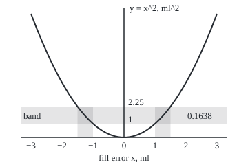
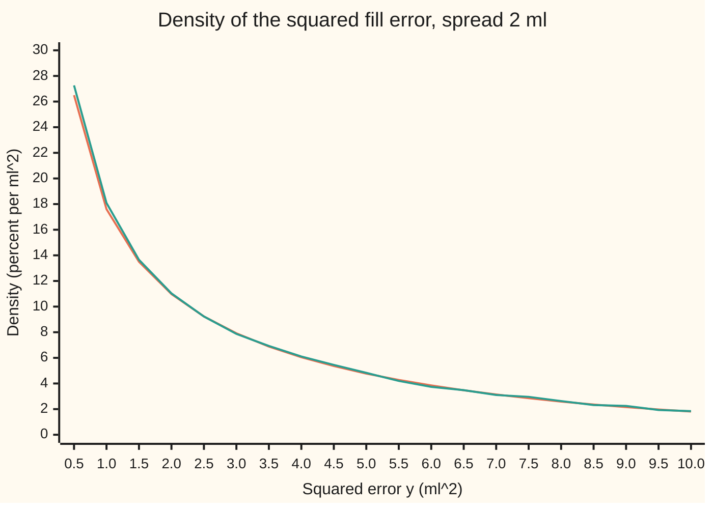

# Transforming a variable: the density of a function of X

[Syllabus](../../../SYLLABUS.md) → [Probability and statistics](../README.md) → [Transformations and Joint Laws](../README.md#s05) → Transforming a variable

---

## General Overview

A juice plant fills 500 ml bottles. The machine misses by a small random amount: the fill error, in millilitres. Over a season of production the errors pile up in a bell centred on 0 with a spread (standard deviation) of 2 ml.

The quality team does not log the error itself. It logs the **squared error**, in ml squared, because overfilling and underfilling both cost money and the cost grows faster than the miss. The squared error also averages to the machine's variance, the number the team reports each week. So the team needs the law of the squared error (how its chance spreads over values), not of the error: how likely is a squared error above 4, which means a miss of more than 2 ml either way?

Squaring does two things to the bell. It **folds** it: a miss of −2 ml and a miss of +2 ml both land on 4. And it **stretches** it unevenly: misses between 0 and 0.5 ml squeeze into squared errors between 0 and 0.25, while misses between 2 and 3 ml spread out over squared errors from 4 to 9. The chance in each slice of misses is carried over unchanged. Only the widths change, so the heights must change to keep the areas right.

Two tools do the bookkeeping. The **CDF route** (CDF: the chance of landing at or below a value) asks the question as an event about the original error and reads off its chance. The **change-of-variables formula** turns that into a density in one line: the old density at each input that lands on the output, times a stretch factor, added over every such input. For the bottles the answer is that a squared error above 4 turns up in 0.3173 of bottles, about 1 in 3.

**To find the density of a function of X, find every input that lands on the output, take the old density there, multiply by how much the map squeezes widths at that point, and add.**

**What kind of fact this is:** a theorem, proved on this card in Why it works; the CDF route is the method that proves it and also works when the formula's conditions fail.

### The picture: one band of squared errors, two strips of misses

<p align="center"></p>

To scale, from the `figure,` line both checks print. The horizontal band holds squared errors from 1 to 2.25. Two strips of misses feed it, one on each side of zero, from −1.5 to −1 ml and from 1 to 1.5 ml. The band's chance, 0.1638, is the two strips' chances added. The map folds, so every band above zero has two sources, and the density of the squared error must add both.

---

## The formula

Notation first, in words. $X$ is the fill error in ml and $x$ one value of it; $Y$ is the squared error in ml squared and $y$ one value. As on [Densities](../04-Continuous%20Distributions/01-densities-and-cdfs.md), a density is written f and a cumulative distribution (CDF) F; here a small letter after it says whose it is, so $f_X$ is the density of X and $F_Y$ the CDF of Y. X ~ N(0, σ^2) says X follows the normal law with centre 0 and spread σ; $\varphi$ is the standard bell's height and $\Phi$ its area to the left, as on [Normal](../04-Continuous%20Distributions/04-normal-distribution.md). The map applied to X is $g$, here squaring. A **branch** is a stretch of inputs on which g only rises or only falls; on branch number $j$, g can be run backwards, and $h_j$ is that backwards map, from an output y to the one input on that branch that lands on it.

$$f_Y(y) = \sum_{j} f_X\big(h_j(y)\big)\,\big\lvert h_j'(y)\big\rvert$$

**Read it aloud:** the density of Y at y is, for every input that lands on y, the density of X there times the rate at which that input moves as y moves, all added up.

For squaring there are two branches: negative errors, run backwards by $h_1(y) = -\sqrt{y}$, and positive errors, by $h_2(y) = \sqrt{y}$. Both move at speed 1/(2√y); the first runs downward. For the normal X the sum simplifies:

$$f_Y(y) = \frac{f_X(\sqrt{y}) + f_X(-\sqrt{y})}{2\sqrt{y}} = \frac{1}{\sigma\sqrt{2\pi y}}\; e^{-y/(2\sigma^2)}, \qquad y > 0$$

**Read it aloud:** the squared error's density is the bell's height at both square roots, added, divided by twice the square root.

The CDF route gives the same law as areas, with no derivative in sight:

$$F_Y(y) = P(-\sqrt{y} \le X \le \sqrt{y}) = F_X(\sqrt{y}) - F_X(-\sqrt{y}) = 2\,\Phi\!\left(\frac{\sqrt{y}}{\sigma}\right) - 1$$

**Read it aloud:** the chance the squared error is at most y is the chance the error lies within √y of zero.

| Symbol | Plain meaning | In our example | Push it up and the answer… |
| --- | --- | --- | --- |
| $X$, $x$ | the fill error, and one value of it | normal, centre 0 ml, spread 2 ml | — |
| $Y$, $y$ | the squared error X^2, and one value of it | P(Y > 4) = 0.3173 | larger y: less density, more area to the left |
| $\sigma$ | the spread of the fill error | 2 ml; σ^2 = 4 | squared errors grow as σ^2 |
| $g$ | the map applied to X | squaring | — |
| $j$, $I_j$ | which branch, and its stretch of inputs | 1: errors below 0; 2: errors above 0 | — |
| $h_j$ | the map run backwards on branch j | −√y and √y | — |
| $h_j'$ | the rate $h_j$ moves as y moves; its size $\lvert h_j'\rvert$ is the stretch factor | −1/(2√y) and 1/(2√y), size 1/(2√y) on both branches | bigger stretch factor: a taller density |
| $f_X$, $F_X$ | density and CDF of the fill error | f_X(2) = 0.120985 per ml | — |
| $f_Y$, $F_Y$ | density and CDF of the squared error | f_Y(4) = 0.060493 per ml^2 | — |
| $\varphi$, $\Phi$ | standard bell height and area to the left | Φ(1) = 0.84134 | — |
| E, Var | long-run average and variance | E[Y] = 4, Var(Y) = 32 | — |

### When it holds

- **X has a density.** If X has a lump of chance at one value, so does Y, and no density formula can show a lump. The CDF route still works.
- **The inputs split into branches, each smooth and strictly rising or falling, with a slope that is never zero inside it.** The cut points are single values and carry chance zero, so dropping them is free. Squaring cuts at 0.
- **No flat stretch.** If g is constant on a stretch of inputs with positive chance, Y has a lump there. A gauge that logs max(X, 0), the overfill only, sends every underfilled bottle to 0: the formula finds area 0.5000 and misses the lump at zero, which a simulation measures at 0.4999 (standard error 0.0011).
- **Count only branches that reach y.** When X lives on a limited range, a branch can stop short, and above that point only the other branch contributes. The normal error covers every value, so both branches always reach.

---

## Why it works

### Step 0: chance moves with the inputs; widths change

Every bottle keeps its chance when its error is squared. The event "squared error between 1 and 2.25" is the same event as "error between −1.5 and −1, or between 1 and 1.5". Same bottles, same chance. What changes is width. The strip from 1 to 1.5 ml is 0.5 wide; its image, 1 to 2.25, is 1.25 wide. The same chance spread over a wider stretch means a lower density. Everything below is bookkeeping for that one fact.

### Step 1: the CDF route turns a question about Y into one about X

For y above 0, the squared error is at most y exactly when the error lies between −√y and √y. So

F_Y(y) = F_X(√y) − F_X(−√y).

At y = 4 the interval is −2 to 2 ml, one spread either side, and F_Y(4) = 2Φ(1) − 1. With Φ(1) = 0.84134, a squared error above 4 has chance 2 × (1 − 0.84134) = 0.3173. At y = 1 the interval is half a spread either side: 2Φ(0.5) − 1 = 0.3829.

This route needs no smoothness at all. It only needs the event rewritten correctly.

The same rewriting proves the **probability integral transform**: feed X through its own CDF and the result is uniform between 0 and 1. Take a chance u between 0 and 1. Since F_X climbs from 0 to 1 with no jumps and no flat stretch, F_X(X) is at most u exactly when X is at most the one error whose CDF value is u, and that event has chance u. So P(F_X(X) ≤ u) = u for every u, which is the uniform law. For the bottles F_X(x) = Φ(x/2), and in the simulation the share of bottles with Φ(X/2) at most 0.3 is 0.3003 (standard error 0.0010).

### Step 2: differentiate, and the stretch factor appears

A density is the slope of its CDF ([Densities](../04-Continuous%20Distributions/01-densities-and-cdfs.md)). Differentiate F_X(√y) with the chain rule: the outer slope is f_X(√y), the inner slope of √y is 1/(2√y). Differentiate −F_X(−√y): the outer slope is f_X(−√y), the inner slope of −√y is −1/(2√y), and the two minus signs cancel. Add:

f_Y(y) = f_X(√y)/(2√y) + f_X(−√y)/(2√y).

One term per branch, each carrying the rate 1/(2√y) at which its input moves. That is the formula in The formula, with two branches. The check differentiates the CDF numerically at four points and matches the branch sum to within 1.9e-11.

### Step 3: one branch, the general rule

Take any map that only rises, with backwards map h. Then Y ≤ y exactly when X ≤ h(y), so F_Y(y) = F_X(h(y)) and, by the chain rule, f_Y(y) = f_X(h(y)) h'(y). If the map only falls, the inequality flips: F_Y(y) = 1 − F_X(h(y)), and the slope is −f_X(h(y)) h'(y). Since h' is negative there, that is f_X(h(y)) times the size of h'(y). The bars in the formula cover both cases at once: a density can never be negative.

The factor has a plain meaning. Near an input x, a small stretch of width w in x maps to a stretch of width about |g'(x)| × w in y. The chance, about f_X(x) × w, is the same in both. Dividing by the new width gives f_X(x) / |g'(x)|, and 1/|g'(x)| is exactly |h'(y)|. A map that squeezes widths raises the density; one that widens them lowers it.

### Step 4: a folding map adds its branches

Cut the inputs where the map turns, so that on each piece it only rises or only falls. The pieces do not overlap, so the chance of Y landing in any stretch is the sum of the chances from each piece. Each piece contributes one term of Step 3. Adding them is the whole formula.

<details>
<summary>Detailed proof: the branch sum is a density of Y</summary>

Let the inputs be cut into non-overlapping open intervals $I_j$ whose union holds all of X's chance; the cut points are single values, chance zero each, since X has a density. On $I_j$ the map g is smooth with slope never zero, so it rises or falls throughout and has a smooth backwards map $h_j$, defined on the image $g(I_j)$.

Fix any interval B of outputs. The event that Y lands in B splits over the pieces:
$$P(Y \in B) = \sum_j P\big(X \in I_j,\ g(X) \in B\big) = \sum_j \int_{\{x \in I_j:\ g(x) \in B\}} f_X(x)\,dx.$$
In the j-th integral substitute $x = h_j(y)$, so $dx = h_j'(y)\,dy$ ([Substitution](../../06-Calculus%20and%20analysis/04-Integrals/03-substitution.md)). On a falling branch the limits swap as well as the sign of $h_j'$, and the two cancel into the size $\lvert h_j'(y)\rvert$. The x-range becomes the y-range $B \cap g(I_j)$:
$$P(Y \in B) = \sum_j \int_{B \cap g(I_j)} f_X\big(h_j(y)\big)\,\lvert h_j'(y)\rvert\,dy = \int_B \sum_j f_X\big(h_j(y)\big)\,\lvert h_j'(y)\rvert\,dy,$$
where a branch contributes zero at any y outside its image. The chance of every interval of outputs is the area under the branch sum over that interval, which is what it means to be a density of Y. Taking B to be all outputs gives total area 1. No continuity of $f_X$ was needed, only that the pieces hold all the chance.

</details>

### Step 5: the spike at zero holds little chance

The formula divides by √y, so the density of the squared error grows without bound as y shrinks to 0. That is not a lump at 0. Squared errors near 0 come from errors near 0, which occupy a narrow stretch; squaring squeezes that stretch even narrower, so the height rises, but the area stays small. The check integrates the density from y = 0 to 400 (misses up to 20 ml, ten spreads) and gets area 1.000000000. The chance that the squared error is exactly 0 is the chance the error is exactly 0, which is zero.

### Step 6: what the law looks like, and its centres

The average squared error is the variance of the error, E[Y] = σ^2 = 4, because E[X] = 0. Integrating y against the new density gives 4.0000, with no known answer fed in. The variance of Y is 2σ^4 = 32, a spread of 5.6569 ml^2.

The median sits far below the mean. Half the squared errors are below the m that solves 2Φ(√m / σ) − 1 = 0.5, and bisection finds m = 1.8197 ml^2: a miss of 1.34898 ml either way. The mean, 4, is dragged up by the long right tail of large squared misses.

This law has a name. With σ = 1 it is the **chi-square law with one degree of freedom**; it is also the gamma law with shape 1/2 and rate 1/2 from [Gamma and beta](../04-Continuous%20Distributions/07-gamma-and-beta-distributions.md). Adding several independent squared normals gives chi-square laws with more degrees of freedom: [The reference distributions](../07-Sampling%20and%20Estimation/03-chi-square-t-and-f-distributions.md).

A second route to the same answers skips the density entirely: the average of any g(X) is the area under g(x) f_X(x), taken over x, proved for every law on [Expectation as an integral](../../10-Measure%20and%20integration/04-The%20Lebesgue%20Integral/06-expectation-as-an-integral.md). The check uses it for the average of |X|. The density of Y is needed when the question is about chances of Y, not only its average.

---

## Worked numbers, by hand

Fill error normal, centre 0 ml, spread 2 ml. Squared error Y = X^2.

| Step | Arithmetic | Value |
| --- | --- | --- |
| square roots of y = 4 | ±√4 | −2 and 2 ml |
| in spreads | 2 / 2 | 1 |
| bell height at each root | φ(1) / 2 | f_X(2) = 0.120985 per ml |
| stretch factor on each branch | 1 / (2 × 2) | one quarter |
| density of Y at 4 | (0.120985 + 0.120985) / 4 | **f_Y(4) = 0.060493 per ml^2** |
| chance of a squared error above 4 | 2 × (1 − Φ(1)) = 2 × (1 − 0.84134) | **0.3173** |
| chance of a squared error at most 1 | 2Φ(0.5) − 1 = 2 × 0.69146 − 1 | 0.3829 |
| chance of a squared error above 9 | 2 × (1 − Φ(1.5)) = 2 × (1 − 0.93319) | 0.1336 |
| median | 1.34898^2, the square root found by bisection | 1.8197 ml^2 |
| mean and variance | σ^2 and 2σ^4 | 4 and 32 |

About 1 bottle in 3 has a squared error above 4 ml^2, that is, misses by more than 2 ml. Half the bottles have a squared error below 1.8197, yet the average is 4: a few large misses carry the weekly variance.

At y = 1 a coincidence: the density of Y equals the density of X, 0.176033, because the stretch factor 1/(2√1) is one half and there are two branches.

### What breaks if you drop a piece

| Mistake | Comes out at | What went wrong |
| --- | --- | --- |
| One branch only, the monotone formula applied to a fold | total area 0.5000; P(Y > 4) = 0.1587, not 0.3173 | underfilled bottles were never counted |
| No stretch factor: f_X(√y) + f_X(−√y) taken as the density | total area 3.1915, not 1 | widths changed and the heights were not rescaled |
| Squaring the average error | E[X]^2 = 0.0000, not E[X^2] = 4.0000 | the average of a square is not the square of an average |
| A flat branch: the gauge logs max(X, 0) | formula area 0.5000; simulated lump at 0 of 0.4999 | a stretch of inputs with positive chance maps to one point |

The last row drops a hypothesis of the theorem, and the formula fails exactly as When it holds says. The code prints all four.

---

## Code, from first principles, and it actually runs

Nothing imported holds the answer: no statistics or random module, no error function. Four roads reach the law of the squared error. (1) The branch sum, with φ written out. (2) The CDF route, with Φ from its Taylor series; its slope, taken numerically, is compared with road 1. (3) Simpson's rule on the density itself, after the substitution y = t^2 that removes the spike at zero; it gives the total area, two chances, the mean and the variance, all checked against the CDF route or the closed forms. (4) A simulation of 200,000 bottles from SplitMix64 (a small written-out source of random bits, seed 20260928) and Marsaglia's polar method (which turns pairs of uniform draws into normal ones), each estimate printed with its standard error, a 20-bin histogram tested against the CDF route, and the share of Φ(X/2) at most 0.3 tested against a uniform.

### Python

```python
# Transforming a random variable -- the check behind the card.  Standard
# library only; nothing imported holds the answer.  A filling machine misses
# its 500 ml target by X ml, X normal with centre 0 and spread SIGMA = 2.
# The squared error is Y = X^2, in ml^2.  Roads: the branch-sum density; the
# CDF route, differentiated numerically; Simpson's rule on the density; a
# seeded simulation of 200,000 bottles.
from math import exp, sqrt, pi, log

SIGMA = 2.0

def phi(z):                                  # standard normal height
    return exp(-z * z / 2) / sqrt(2 * pi)
def Phi(z):                                  # standard normal area, Taylor series
    term, total = z, z
    for n in range(1, 200):
        term *= -z * z / (2 * n)
        total += term / (2 * n + 1)
    return 0.5 + total / sqrt(2 * pi)
def f_X(x, mu=0.0):                          # density of the fill error
    return phi((x - mu) / SIGMA) / SIGMA
def f_Y(y):                                  # road 1: add the two branches
    r = sqrt(y)
    return (f_X(r) + f_X(-r)) / (2 * r)
def F_Y(y, mu=0.0):                          # road 2: P(-sqrt y <= X <= sqrt y)
    r = sqrt(y)
    return Phi((r - mu) / SIGMA) - Phi((-r - mu) / SIGMA)
def simpson(g, a, b, n=20000):
    h = (b - a) / n
    return h / 3 * (g(a) + g(b) + sum((4 if i % 2 else 2) * g(a + i * h) for i in range(1, n)))
def area(dens, a, b):                        # integral over y in [a, b]; y = t^2 tames the spike at 0
    return simpson(lambda t: dens(t * t) * 2 * t, max(sqrt(a), 1e-12), sqrt(b))

print(f"model: fill error X normal, centre 0 ml, spread {SIGMA:.1f} ml; Y = X^2 in ml^2")
print(f"formula: f_Y(1) = {f_Y(1):.6f}, f_Y(4) = {f_Y(4):.6f}, f_Y(9) = {f_Y(9):.6f} per ml^2")
print(f"by hand: f_X(1) = {f_X(1):.6f}, f_X(2) = {f_X(2):.6f}, f_X(3) = {f_X(3):.6f} per ml")
print(f"CDF route: P(Y <= 1) = {F_Y(1):.4f}, P(Y > 4) = {1 - F_Y(4):.4f}, P(Y > 9) = {1 - F_Y(9):.4f},"
      f" P(Y > 16) = {1 - F_Y(16):.4f}")
print(f"by hand: Phi(0.5) = {Phi(0.5):.5f}, Phi(1) = {Phi(1):.5f}, Phi(1.5) = {Phi(1.5):.5f}, Phi(2) = {Phi(2):.5f}")
gap = max(abs((F_Y(y + 1e-5) - F_Y(y - 1e-5)) / 2e-5 - f_Y(y)) for y in (0.5, 1, 4, 9))
print(f"slope of the CDF against the branch sum, y = 0.5, 1, 4, 9: largest gap {gap:.1e}")
lo, hi = 0.25, 16                            # median of Y by bisection on the CDF
for _ in range(60):
    mid = (lo + hi) / 2
    lo, hi = (mid, hi) if F_Y(mid) < 0.5 else (lo, mid)
median = (lo + hi) / 2
print(f"median of Y by bisection: {median:.4f}; its square root {sqrt(median):.5f} ml")

# road 3: Simpson's rule on the density itself
TOP = 400.0                                  # sqrt(400) = 20 ml = 10 spreads
tot, p1, p4 = area(f_Y, 0, TOP), area(f_Y, 0, 1), area(f_Y, 4, TOP)
mean_i = area(lambda y: y * f_Y(y), 0, TOP)
var_i = area(lambda y: (y - mean_i) ** 2 * f_Y(y), 0, TOP)
band = area(f_Y, 1, 2.25)
print(f"Simpson: area {tot:.9f}, P(Y <= 1) = {p1:.4f}, P(Y > 4) = {p4:.4f}")
print(f"Simpson: mean {mean_i:.4f}, variance {var_i:.4f}, spread {sqrt(var_i):.4f}")
print(f"band 1 <= Y <= 2.25: Simpson {band:.4f}; two strips 2 x P(1 <= X <= 1.5) = {2 * (Phi(0.75) - Phi(0.5)):.4f};"
      f" strip width {1.5 - 1:.2f}, band width {2.25 - 1:.2f}")

# road 4: simulate 200,000 bottles (SplitMix64, seed 20260928; Marsaglia polar)
MASK, state = (1 << 64) - 1, 20260928
def splitmix():
    global state
    state = (state + 0x9E3779B97F4A7C15) & MASK
    z = state
    z = ((z ^ (z >> 30)) * 0xBF58476D1CE4E5B9) & MASK
    z = ((z ^ (z >> 27)) * 0x94D049BB133111EB) & MASK
    return z ^ (z >> 31)
def uniform():
    return ((splitmix() >> 11) + 0.5) / 2.0 ** 53
def normal_pair():
    while True:
        u, v = 2 * uniform() - 1, 2 * uniform() - 1
        q = u * u + v * v
        if 0 < q < 1:
            k = sqrt(-2 * log(q) / q)
            return u * k, v * k
N = 200_000
xs = [SIGMA * z for _ in range(N // 2) for z in normal_pair()]
ys = sorted(x * x for x in xs)
m_sim = sum(ys) / N
se_m = sqrt(sum((y - m_sim) ** 2 for y in ys) / (N - 1) / N)
q1, q4 = sum(y <= 1 for y in ys) / N, sum(y > 4 for y in ys) / N
se1, se4 = sqrt(q1 * (1 - q1) / N), sqrt(q4 * (1 - q4) / N)
med_sim = (ys[N // 2 - 1] + ys[N // 2]) / 2
se_med = 1 / (2 * f_Y(median) * sqrt(N))
clip0 = sum(x <= 0 for x in xs) / N          # a gauge that logs max(X, 0): the flat branch
pit = sum(Phi(x / SIGMA) <= 0.3 for x in xs) / N   # F_X(X) = Phi(X/2) should be uniform
print(f"simulated {N} bottles, seed 20260928; estimate (standard error)")
print(f"  P(Y <= 1) {q1:.4f} ({se1:.4f}), P(Y > 4) {q4:.4f} ({se4:.4f})")
print(f"  mean {m_sim:.4f} ({se_m:.4f}), median {med_sim:.4f} ({se_med:.4f})")
bins, worst = [0.5 * k for k in range(1, 21)], 0.0
sim_h = []
for c in bins:                               # histogram, bins 0.5 wide centred on c
    p_hat = sum(c - 0.25 <= y < c + 0.25 for y in ys) / N
    p_ex = F_Y(c + 0.25) - F_Y(c - 0.25)
    worst = max(worst, abs(p_hat - p_ex) / sqrt(p_ex * (1 - p_ex) / N))
    sim_h.append(100 * p_hat / 0.5)
print(f"  20 histogram bins against the CDF route: largest gap {worst:.1f} standard errors")
print(f"  F_X(X) = Phi(X/2) at most 0.3: {pit:.4f} ({sqrt(0.3 * 0.7 / N):.4f}); a uniform gives 0.3")

# what breaks
one = area(lambda y: f_X(sqrt(y)) / (2 * sqrt(y)), 0, TOP)
one4 = area(lambda y: f_X(sqrt(y)) / (2 * sqrt(y)), 4, TOP)
bare = area(lambda y: f_X(sqrt(y)) + f_X(-sqrt(y)), 0, TOP)
mean_x = simpson(lambda x: x * f_X(x), -20, 20)
print(f"mistake, one branch only: area {one:.4f}, P(Y > 4) = {one4:.4f} instead of {1 - F_Y(4):.4f}")
print(f"mistake, no stretch factor: area {bare:.4f}; 4 sigma / sqrt(2 pi) = {4 * SIGMA / sqrt(2 * pi):.4f}")
print(f"mistake, square of the average: E[X]^2 = {mean_x ** 2:.4f} instead of E[X^2] = {mean_i:.4f}")
print(f"hypothesis dropped, gauge logs max(X, 0): branch-formula area {area(lambda w: f_X(w), 0, TOP):.4f};"
      f" simulated P(reading = 0) {clip0:.4f} ({sqrt(clip0 * (1 - clip0) / N):.4f})")
print(f"try: spread 1 ml: P(Y > 4) = {1 - (Phi(2) - Phi(-2)):.4f}, mean {simpson(lambda x: x * x * phi(x), -20, 20):.4f}")
print(f"try: centre 1 ml: f_Y(4) = {(f_X(2, 1) + f_X(-2, 1)) / 4:.6f}, P(Y > 4) = {1 - F_Y(4, 1):.4f},"
      f" mean {area(lambda y: y * (f_X(sqrt(y), 1) + f_X(-sqrt(y), 1)) / (2 * sqrt(y)), 0, TOP):.4f}")
print(f"try: Y = X^3, one branch: f_Y(8) = {f_X(2) / 12:.6f}, P(Y > 8) = {1 - Phi(1):.4f}")
print(f"try: Y = |X|, no stretch: f(1) = {2 * f_X(1):.6f}, mean {simpson(lambda x: 2 * x * f_X(x), 0, 20):.4f}")

# figures: the density in percent per ml^2, and the fold drawn to scale
print("figure, y (ml^2): " + ", ".join(f"{c:.1f}" for c in bins))
print("figure, formula: " + ", ".join(f"{100 * f_Y(c):.2f}" for c in bins))
print("figure, simulated: " + ", ".join(f"{h:.2f}" for h in sim_h))
px = lambda x: 180 + 45 * x
py = lambda y: 200 - 20 * y
print(f"figure, parabola: ends ({px(-3):.0f},{py(9):.0f}) ({px(3):.0f},{py(9):.0f}), control ({px(0):.0f},{py(-9):.0f});"
      f" band y {py(2.25):.0f} to {py(1):.0f}; strips x {px(-1.5):.1f} to {px(-1):.0f} and {px(1):.0f} to {px(1.5):.1f}")

assert abs(tot - 1) < 1e-6 and abs(one - 0.5) < 1e-6
assert abs(p1 - F_Y(1)) < 1e-7 and abs(p4 - (1 - F_Y(4))) < 1e-7 and gap < 1e-5
assert abs(mean_i - SIGMA ** 2) < 1e-6 and abs(var_i - 2 * SIGMA ** 4) < 1e-4
assert abs(bare - 4 * SIGMA / sqrt(2 * pi)) < 1e-6 and abs(band - 2 * (Phi(0.75) - Phi(0.5))) < 1e-7
assert abs(f_Y(4) - exp(-4 / (2 * SIGMA ** 2)) / (SIGMA * sqrt(2 * pi * 4))) < 1e-12
assert abs(q4 - (1 - F_Y(4))) < 4 * se4 and abs(m_sim - SIGMA ** 2) < 4 * se_m
assert abs(med_sim - median) < 4 * se_med and worst < 4
assert abs(clip0 - 0.5) < 4 * sqrt(0.25 / N)
assert abs(pit - 0.3) < 4 * sqrt(0.3 * 0.7 / N)
```

**Ran 2026-10-06 on macOS, Python 3.14.6, standard library only. All checks passed. Output, pasted from the run:**

```
model: fill error X normal, centre 0 ml, spread 2.0 ml; Y = X^2 in ml^2
formula: f_Y(1) = 0.176033, f_Y(4) = 0.060493, f_Y(9) = 0.021586 per ml^2
by hand: f_X(1) = 0.176033, f_X(2) = 0.120985, f_X(3) = 0.064759 per ml
CDF route: P(Y <= 1) = 0.3829, P(Y > 4) = 0.3173, P(Y > 9) = 0.1336, P(Y > 16) = 0.0455
by hand: Phi(0.5) = 0.69146, Phi(1) = 0.84134, Phi(1.5) = 0.93319, Phi(2) = 0.97725
slope of the CDF against the branch sum, y = 0.5, 1, 4, 9: largest gap 1.9e-11
median of Y by bisection: 1.8197; its square root 1.34898 ml
Simpson: area 1.000000000, P(Y <= 1) = 0.3829, P(Y > 4) = 0.3173
Simpson: mean 4.0000, variance 32.0000, spread 5.6569
band 1 <= Y <= 2.25: Simpson 0.1638; two strips 2 x P(1 <= X <= 1.5) = 0.1638; strip width 0.50, band width 1.25
simulated 200000 bottles, seed 20260928; estimate (standard error)
  P(Y <= 1) 0.3807 (0.0011), P(Y > 4) 0.3181 (0.0010)
  mean 4.0105 (0.0126), median 1.8261 (0.0095)
  20 histogram bins against the CDF route: largest gap 2.5 standard errors
  F_X(X) = Phi(X/2) at most 0.3: 0.3003 (0.0010); a uniform gives 0.3
mistake, one branch only: area 0.5000, P(Y > 4) = 0.1587 instead of 0.3173
mistake, no stretch factor: area 3.1915; 4 sigma / sqrt(2 pi) = 3.1915
mistake, square of the average: E[X]^2 = 0.0000 instead of E[X^2] = 4.0000
hypothesis dropped, gauge logs max(X, 0): branch-formula area 0.5000; simulated P(reading = 0) 0.4999 (0.0011)
try: spread 1 ml: P(Y > 4) = 0.0455, mean 1.0000
try: centre 1 ml: f_Y(4) = 0.060198, P(Y > 4) = 0.3753, mean 5.0000
try: Y = X^3, one branch: f_Y(8) = 0.010082, P(Y > 8) = 0.1587
try: Y = |X|, no stretch: f(1) = 0.352065, mean 1.5958
figure, y (ml^2): 0.5, 1.0, 1.5, 2.0, 2.5, 3.0, 3.5, 4.0, 4.5, 5.0, 5.5, 6.0, 6.5, 7.0, 7.5, 8.0, 8.5, 9.0, 9.5, 10.0
figure, formula: 26.50, 17.60, 13.50, 10.98, 9.23, 7.92, 6.88, 6.05, 5.36, 4.77, 4.28, 3.85, 3.47, 3.14, 2.85, 2.59, 2.36, 2.16, 1.97, 1.81
figure, simulated: 27.26, 18.09, 13.65, 11.03, 9.23, 7.87, 6.93, 6.11, 5.45, 4.83, 4.20, 3.74, 3.48, 3.10, 2.96, 2.63, 2.32, 2.25, 1.93, 1.84
figure, parabola: ends (45,20) (315,20), control (180,380); band y 155 to 180; strips x 112.5 to 135 and 225 to 247.5
```

### Rust

```rust
// Transforming a random variable -- the check behind the card.  Rust std
// only; nothing imported holds the answer.  A filling machine misses its
// 500 ml target by X ml, X normal with centre 0 and spread SIGMA = 2.  The
// squared error is Y = X^2, in ml^2.  Roads: the branch-sum density; the CDF
// route, differentiated numerically; Simpson's rule on the density; a seeded
// simulation of 200,000 bottles.
use std::f64::consts::PI;

const SIGMA: f64 = 2.0;

fn phi(z: f64) -> f64 { (-z * z / 2.0).exp() / (2.0 * PI).sqrt() }
fn big_phi(z: f64) -> f64 {                  // standard normal area, Taylor series
    let (mut term, mut total) = (z, z);
    for n in 1..200 {
        let n = n as f64;
        term *= -z * z / (2.0 * n);
        total += term / (2.0 * n + 1.0);
    }
    0.5 + total / (2.0 * PI).sqrt()
}
fn f_x(x: f64, mu: f64) -> f64 { phi((x - mu) / SIGMA) / SIGMA }
fn f_y(y: f64) -> f64 {                      // road 1: add the two branches
    let r = y.sqrt();
    (f_x(r, 0.0) + f_x(-r, 0.0)) / (2.0 * r)
}
fn cdf_y(y: f64, mu: f64) -> f64 {           // road 2: P(-sqrt y <= X <= sqrt y)
    let r = y.sqrt();
    big_phi((r - mu) / SIGMA) - big_phi((-r - mu) / SIGMA)
}
fn simpson(g: &dyn Fn(f64) -> f64, a: f64, b: f64) -> f64 {
    let n = 20000;
    let h = (b - a) / n as f64;
    let mut acc = g(a) + g(b);
    for i in 1..n { acc += (if i % 2 == 1 { 4.0 } else { 2.0 }) * g(a + i as f64 * h); }
    acc * h / 3.0
}
fn area(dens: &dyn Fn(f64) -> f64, a: f64, b: f64) -> f64 {  // y = t^2 tames the spike at 0
    simpson(&|t: f64| dens(t * t) * 2.0 * t, a.sqrt().max(1e-12), b.sqrt())
}
struct Rng(u64);
impl Rng {
    fn next(&mut self) -> u64 {                // SplitMix64
        self.0 = self.0.wrapping_add(0x9E3779B97F4A7C15);
        let mut z = self.0;
        z = (z ^ (z >> 30)).wrapping_mul(0xBF58476D1CE4E5B9);
        z = (z ^ (z >> 27)).wrapping_mul(0x94D049BB133111EB);
        z ^ (z >> 31)
    }
    fn uniform(&mut self) -> f64 { ((self.next() >> 11) as f64 + 0.5) / 2f64.powi(53) }
    fn normal_pair(&mut self) -> (f64, f64) {  // Marsaglia polar method
        loop {
            let (u, v) = (2.0 * self.uniform() - 1.0, 2.0 * self.uniform() - 1.0);
            let q = u * u + v * v;
            if q > 0.0 && q < 1.0 {
                let k = (-2.0 * q.ln() / q).sqrt();
                return (u * k, v * k);
            }
        }
    }
}
fn join(v: &[f64], d: usize) -> String { v.iter().map(|x| format!("{:.*}", d, x)).collect::<Vec<_>>().join(", ") }

fn main() {
    let fx = |x: f64| f_x(x, 0.0);
    let fy = |y: f64| cdf_y(y, 0.0);
    println!("model: fill error X normal, centre 0 ml, spread {:.1} ml; Y = X^2 in ml^2", SIGMA);
    println!("formula: f_Y(1) = {:.6}, f_Y(4) = {:.6}, f_Y(9) = {:.6} per ml^2", f_y(1.0), f_y(4.0), f_y(9.0));
    println!("by hand: f_X(1) = {:.6}, f_X(2) = {:.6}, f_X(3) = {:.6} per ml", fx(1.0), fx(2.0), fx(3.0));
    println!("CDF route: P(Y <= 1) = {:.4}, P(Y > 4) = {:.4}, P(Y > 9) = {:.4}, P(Y > 16) = {:.4}",
             fy(1.0), 1.0 - fy(4.0), 1.0 - fy(9.0), 1.0 - fy(16.0));
    println!("by hand: Phi(0.5) = {:.5}, Phi(1) = {:.5}, Phi(1.5) = {:.5}, Phi(2) = {:.5}",
             big_phi(0.5), big_phi(1.0), big_phi(1.5), big_phi(2.0));
    let gap = [0.5, 1.0, 4.0, 9.0].iter().map(|&y| ((fy(y + 1e-5) - fy(y - 1e-5)) / 2e-5 - f_y(y)).abs()).fold(0.0, f64::max);
    println!("slope of the CDF against the branch sum, y = 0.5, 1, 4, 9: largest gap {:.1e}", gap);
    let (mut lo, mut hi) = (0.25, 16.0);       // median of Y by bisection on the CDF
    for _ in 0..60 {
        let mid = (lo + hi) / 2.0;
        if fy(mid) < 0.5 { lo = mid } else { hi = mid }
    }
    let median = (lo + hi) / 2.0;
    println!("median of Y by bisection: {:.4}; its square root {:.5} ml", median, median.sqrt());

    // road 3: Simpson's rule on the density itself
    let top = 400.0;                           // sqrt(400) = 20 ml = 10 spreads
    let (tot, p1, p4) = (area(&f_y, 0.0, top), area(&f_y, 0.0, 1.0), area(&f_y, 4.0, top));
    let mean_i = area(&|y: f64| y * f_y(y), 0.0, top);
    let var_i = area(&|y: f64| (y - mean_i) * (y - mean_i) * f_y(y), 0.0, top);
    let band = area(&f_y, 1.0, 2.25);
    println!("Simpson: area {:.9}, P(Y <= 1) = {:.4}, P(Y > 4) = {:.4}", tot, p1, p4);
    println!("Simpson: mean {:.4}, variance {:.4}, spread {:.4}", mean_i, var_i, var_i.sqrt());
    println!("band 1 <= Y <= 2.25: Simpson {:.4}; two strips 2 x P(1 <= X <= 1.5) = {:.4}; strip width {:.2}, band width {:.2}",
             band, 2.0 * (big_phi(0.75) - big_phi(0.5)), 1.5 - 1.0, 2.25 - 1.0);

    // road 4: simulate 200,000 bottles (SplitMix64, seed 20260928; Marsaglia polar)
    let n = 200_000usize;
    let nf = n as f64;
    let mut rng = Rng(20260928);
    let mut xs = Vec::with_capacity(n);
    for _ in 0..n / 2 {
        let (a, b) = rng.normal_pair();
        xs.push(SIGMA * a);
        xs.push(SIGMA * b);
    }
    let mut ys: Vec<f64> = xs.iter().map(|x| x * x).collect();
    ys.sort_by(|a, b| a.partial_cmp(b).unwrap());
    let m_sim = ys.iter().sum::<f64>() / nf;
    let se_m = (ys.iter().map(|y| (y - m_sim) * (y - m_sim)).sum::<f64>() / (nf - 1.0) / nf).sqrt();
    let frac = |pred: &dyn Fn(f64) -> bool, v: &[f64]| v.iter().filter(|&&y| pred(y)).count() as f64 / nf;
    let (q1, q4) = (frac(&|y| y <= 1.0, &ys), frac(&|y| y > 4.0, &ys));
    let (se1, se4) = ((q1 * (1.0 - q1) / nf).sqrt(), (q4 * (1.0 - q4) / nf).sqrt());
    let med_sim = (ys[n / 2 - 1] + ys[n / 2]) / 2.0;
    let se_med = 1.0 / (2.0 * f_y(median) * nf.sqrt());
    let clip0 = frac(&|x| x <= 0.0, &xs);      // a gauge that logs max(X, 0): the flat branch
    let pit = frac(&|x| big_phi(x / SIGMA) <= 0.3, &xs);   // F_X(X) = Phi(X/2) should be uniform
    println!("simulated {} bottles, seed 20260928; estimate (standard error)", n);
    println!("  P(Y <= 1) {:.4} ({:.4}), P(Y > 4) {:.4} ({:.4})", q1, se1, q4, se4);
    println!("  mean {:.4} ({:.4}), median {:.4} ({:.4})", m_sim, se_m, med_sim, se_med);
    let bins: Vec<f64> = (1..=20).map(|k| 0.5 * k as f64).collect();
    let (mut worst, mut sim_h) = (0.0f64, Vec::new());
    for &c in &bins {                          // histogram, bins 0.5 wide centred on c
        let p_hat = frac(&|y| c - 0.25 <= y && y < c + 0.25, &ys);
        let p_ex = fy(c + 0.25) - fy(c - 0.25);
        worst = worst.max((p_hat - p_ex).abs() / (p_ex * (1.0 - p_ex) / nf).sqrt());
        sim_h.push(100.0 * p_hat / 0.5);
    }
    println!("  20 histogram bins against the CDF route: largest gap {:.1} standard errors", worst);
    println!("  F_X(X) = Phi(X/2) at most 0.3: {:.4} ({:.4}); a uniform gives 0.3", pit, (0.3 * 0.7 / nf).sqrt());

    // what breaks
    let one_b = |y: f64| fx(y.sqrt()) / (2.0 * y.sqrt());
    let (one, one4) = (area(&one_b, 0.0, top), area(&one_b, 4.0, top));
    let bare = area(&|y: f64| fx(y.sqrt()) + fx(-y.sqrt()), 0.0, top);
    let mean_x = simpson(&|x: f64| x * fx(x), -20.0, 20.0);
    println!("mistake, one branch only: area {:.4}, P(Y > 4) = {:.4} instead of {:.4}", one, one4, 1.0 - fy(4.0));
    println!("mistake, no stretch factor: area {:.4}; 4 sigma / sqrt(2 pi) = {:.4}", bare, 4.0 * SIGMA / (2.0 * PI).sqrt());
    println!("mistake, square of the average: E[X]^2 = {:.4} instead of E[X^2] = {:.4}", mean_x * mean_x, mean_i);
    println!("hypothesis dropped, gauge logs max(X, 0): branch-formula area {:.4}; simulated P(reading = 0) {:.4} ({:.4})",
             area(&fx, 0.0, top), clip0, (clip0 * (1.0 - clip0) / nf).sqrt());
    println!("try: spread 1 ml: P(Y > 4) = {:.4}, mean {:.4}", 1.0 - (big_phi(2.0) - big_phi(-2.0)), simpson(&|x: f64| x * x * phi(x), -20.0, 20.0));
    let shifted = |y: f64| y * (f_x(y.sqrt(), 1.0) + f_x(-y.sqrt(), 1.0)) / (2.0 * y.sqrt());
    println!("try: centre 1 ml: f_Y(4) = {:.6}, P(Y > 4) = {:.4}, mean {:.4}",
             (f_x(2.0, 1.0) + f_x(-2.0, 1.0)) / 4.0, 1.0 - cdf_y(4.0, 1.0), area(&shifted, 0.0, top));
    println!("try: Y = X^3, one branch: f_Y(8) = {:.6}, P(Y > 8) = {:.4}", fx(2.0) / 12.0, 1.0 - big_phi(1.0));
    println!("try: Y = |X|, no stretch: f(1) = {:.6}, mean {:.4}", 2.0 * fx(1.0), simpson(&|x: f64| 2.0 * x * fx(x), 0.0, 20.0));

    // figures: the density in percent per ml^2, and the fold drawn to scale
    println!("figure, y (ml^2): {}", join(&bins, 1));
    println!("figure, formula: {}", join(&bins.iter().map(|&c| 100.0 * f_y(c)).collect::<Vec<_>>(), 2));
    println!("figure, simulated: {}", join(&sim_h, 2));
    let px = |x: f64| 180.0 + 45.0 * x;
    let py = |y: f64| 200.0 - 20.0 * y;
    println!("figure, parabola: ends ({:.0},{:.0}) ({:.0},{:.0}), control ({:.0},{:.0}); band y {:.0} to {:.0}; strips x {:.1} to {:.0} and {:.0} to {:.1}",
             px(-3.0), py(9.0), px(3.0), py(9.0), px(0.0), py(-9.0), py(2.25), py(1.0), px(-1.5), px(-1.0), px(1.0), px(1.5));

    assert!((tot - 1.0).abs() < 1e-6 && (one - 0.5).abs() < 1e-6);
    assert!((p1 - fy(1.0)).abs() < 1e-7 && (p4 - (1.0 - fy(4.0))).abs() < 1e-7 && gap < 1e-5);
    assert!((mean_i - SIGMA * SIGMA).abs() < 1e-6 && (var_i - 2.0 * SIGMA.powi(4)).abs() < 1e-4);
    assert!((bare - 4.0 * SIGMA / (2.0 * PI).sqrt()).abs() < 1e-6 && (band - 2.0 * (big_phi(0.75) - big_phi(0.5))).abs() < 1e-7);
    assert!((f_y(4.0) - (-4.0 / (2.0 * SIGMA * SIGMA)).exp() / (SIGMA * (2.0 * PI * 4.0).sqrt())).abs() < 1e-12);
    assert!((q4 - (1.0 - fy(4.0))).abs() < 4.0 * se4 && (m_sim - SIGMA * SIGMA).abs() < 4.0 * se_m);
    assert!((med_sim - median).abs() < 4.0 * se_med && worst < 4.0);
    assert!((clip0 - 0.5).abs() < 4.0 * (0.25 / nf).sqrt());
    assert!((pit - 0.3).abs() < 4.0 * (0.3 * 0.7 / nf).sqrt());
}
```

**Ran 2026-10-06 on macOS, rustc 1.98.1, no crates. All checks passed. Output, pasted from the run:**

```
model: fill error X normal, centre 0 ml, spread 2.0 ml; Y = X^2 in ml^2
formula: f_Y(1) = 0.176033, f_Y(4) = 0.060493, f_Y(9) = 0.021586 per ml^2
by hand: f_X(1) = 0.176033, f_X(2) = 0.120985, f_X(3) = 0.064759 per ml
CDF route: P(Y <= 1) = 0.3829, P(Y > 4) = 0.3173, P(Y > 9) = 0.1336, P(Y > 16) = 0.0455
by hand: Phi(0.5) = 0.69146, Phi(1) = 0.84134, Phi(1.5) = 0.93319, Phi(2) = 0.97725
slope of the CDF against the branch sum, y = 0.5, 1, 4, 9: largest gap 1.9e-11
median of Y by bisection: 1.8197; its square root 1.34898 ml
Simpson: area 1.000000000, P(Y <= 1) = 0.3829, P(Y > 4) = 0.3173
Simpson: mean 4.0000, variance 32.0000, spread 5.6569
band 1 <= Y <= 2.25: Simpson 0.1638; two strips 2 x P(1 <= X <= 1.5) = 0.1638; strip width 0.50, band width 1.25
simulated 200000 bottles, seed 20260928; estimate (standard error)
  P(Y <= 1) 0.3807 (0.0011), P(Y > 4) 0.3181 (0.0010)
  mean 4.0105 (0.0126), median 1.8261 (0.0095)
  20 histogram bins against the CDF route: largest gap 2.5 standard errors
  F_X(X) = Phi(X/2) at most 0.3: 0.3003 (0.0010); a uniform gives 0.3
mistake, one branch only: area 0.5000, P(Y > 4) = 0.1587 instead of 0.3173
mistake, no stretch factor: area 3.1915; 4 sigma / sqrt(2 pi) = 3.1915
mistake, square of the average: E[X]^2 = 0.0000 instead of E[X^2] = 4.0000
hypothesis dropped, gauge logs max(X, 0): branch-formula area 0.5000; simulated P(reading = 0) 0.4999 (0.0011)
try: spread 1 ml: P(Y > 4) = 0.0455, mean 1.0000
try: centre 1 ml: f_Y(4) = 0.060198, P(Y > 4) = 0.3753, mean 5.0000
try: Y = X^3, one branch: f_Y(8) = 0.010082, P(Y > 8) = 0.1587
try: Y = |X|, no stretch: f(1) = 0.352065, mean 1.5958
figure, y (ml^2): 0.5, 1.0, 1.5, 2.0, 2.5, 3.0, 3.5, 4.0, 4.5, 5.0, 5.5, 6.0, 6.5, 7.0, 7.5, 8.0, 8.5, 9.0, 9.5, 10.0
figure, formula: 26.50, 17.60, 13.50, 10.98, 9.23, 7.92, 6.88, 6.05, 5.36, 4.77, 4.28, 3.85, 3.47, 3.14, 2.85, 2.59, 2.36, 2.16, 1.97, 1.81
figure, simulated: 27.26, 18.09, 13.65, 11.03, 9.23, 7.87, 6.93, 6.11, 5.45, 4.83, 4.20, 3.74, 3.48, 3.10, 2.96, 2.63, 2.32, 2.25, 1.93, 1.84
figure, parabola: ends (45,20) (315,20), control (180,380); band y 155 to 180; strips x 112.5 to 135 and 225 to 247.5
```

The two outputs agree line for line. The simulated chance of a squared error above 4, 0.3181 with standard error 0.0010, sits within one standard error of 0.3173. The simulated mean, 4.0105 (0.0126), and median, 1.8261 (0.0095), sit within one standard error of 4 and 1.8197; the worst of 20 histogram bins is 2.5 standard errors off, and the asserts allow 4. Changing the density to one branch, removing the stretch factor, or disturbing Φ each makes an assert fail.

### The density, from the formula and from the simulation



Orange: the branch-sum formula, in percent per ml^2, falling steeply from the spike at 0 and then trailing off slowly. Green: the simulated histogram of 200,000 bottles, bins 0.5 wide centred on each point. The first green point, 27.26, sits above the orange 26.50 because a bin averages the curve over its width and the curve bends upward there.

> [!TIP]
> **Try changing**
> - **Halve the spread to 1 ml.** Guess first: how often is the squared error above 4 now? Answer: 0.0455, about 1 bottle in 22, since 4 is now two spreads squared; the mean squared error falls to 1.0000.
> - **Move the machine's centre to +1 ml.** Guess first: are the two branches still equal? Answer: no; the positive root sits nearer the centre and gives the larger term. f_Y(4) becomes 0.060198, P(Y > 4) becomes 0.3753, and the mean squared error becomes 5.0000: the variance 4 plus the bias squared.
> - **Cube instead of square.** Guess first: how many branches? Answer: one, since cubing only rises. f_Y(8) = f_X(2) / 12 = 0.010082, and P(Y > 8) = P(X > 2) = 0.1587.
> - **Take the size of the miss, |X|.** Guess first: what is the stretch factor? Answer: 1, since |x| moves as fast as x; two branches still add, so the density at 1 ml is 2 f_X(1) = 0.352065 and the average miss is 1.5958 ml.

---

## The usual mistake

> [!warning]
> **Using the one-branch formula on a map that folds.** Writing f_Y(y) = f_X(√y) / (2√y) looks like the textbook rule, but it counts only the positive errors. Its total area is 0.5000, and it puts the chance of a squared error above 4 at 0.1587 instead of 0.3173. Before using the formula, ask how many inputs land on each output.
>
> Smaller traps:
> - **Forgetting the stretch factor.** Plugging √y into the old density and adding both branches gives a curve with area 3.1915, not a density at all.
> - **Reading the spike as a lump.** The density of Y is unbounded near 0, yet the chance that Y is exactly 0 is zero. Height is chance per width, not chance.
> - **Squaring the average.** The average error is 0, so its square is 0; the average squared error is 4. Transforming a variable and transforming its average are different operations.
> - **Applying the formula across a flat stretch.** A gauge that clips at zero creates a lump there, 0.4999 in the simulation, that no density shows.

---

## Where you meet it in real life

- **Quality control.** A quadratic loss charges each unit in proportion to its squared miss; its law, not the law of the miss, sets how often the loss exceeds a budget.
- **Testing a variance.** The squared normal is the building block of the chi-square law, which drives tests and intervals for a spread: [The reference distributions](../07-Sampling%20and%20Estimation/03-chi-square-t-and-f-distributions.md).
- **Gas molecules.** One velocity component of a molecule is normal; its kinetic energy is a constant times its square, so the energy in one direction follows this card's law.
- **Simulation.** Running the CDF route backwards turns uniform random numbers into draws from any law: [Inverse transform](../11-Simulation/02-inverse-transform-sampling.md).
- **Extremes.** The CDF route finds the law of the largest of several readings in one line, since the largest is below y only when every reading is: [Order statistics](08-order-statistics-and-extremes.md).

> **Say it back**
> Squaring a random error keeps each bottle's chance but folds the line and changes widths. The CDF route rewrites "Y at most y" as an event about X and reads off its chance. Differentiating it gives the change-of-variables formula: the old density at each input that lands on y, times the rate that input moves as y moves, added over every such input. For a normal fill error with spread 2 ml, the squared error exceeds 4 in 0.3173 of bottles, has median 1.8197 and mean 4. Drop a branch and half the chance vanishes; drop the stretch factor and the area is wrong; a flat stretch makes a lump the formula cannot see.

---

## What this builds on

- [Densities](../04-Continuous%20Distributions/01-densities-and-cdfs.md): area as chance, and the density as the slope of the CDF, which Step 2 differentiates.
- [Substitution](../../06-Calculus%20and%20analysis/04-Integrals/03-substitution.md): changing the variable inside an integral, which is the Detailed proof in one move.

## Where this goes next

- [Joint densities](02-joint-densities-and-marginals.md): two readings at once, with one density over a plane.
- [Adding continuous variables](04-sums-and-convolution.md): the law of X + Y, a map of two variables built by the same bookkeeping.
- [Order statistics](08-order-statistics-and-extremes.md): the CDF route applied to the largest and smallest of a sample.
- [The reference distributions](../07-Sampling%20and%20Estimation/03-chi-square-t-and-f-distributions.md): sums of squared normals, starting from this card's law.
- [The law of a random variable](../../10-Measure%20and%20integration/03-Measurable%20Functions/05-pushforward-and-the-law.md): the CDF route stated for any map, lumps and all.

This card moves one variable through one map; when two readings are transformed together, the stretch factor becomes an area factor, the Jacobian of [Change of variables](../../06-Calculus%20and%20analysis/08-Multiple%20Integrals/03-change-of-variables-and-jacobians.md), and [Bivariate normal](05-bivariate-normal-and-conditioning.md) uses it to build the tilted bell from two independent bells.

---

## Sources

Verified 2026-09-28: every link below resolves to the publisher's page.

- Casella, George, and Roger L. Berger. *Statistical Inference*, 2nd ed. CRC Press. [Publisher page](https://www.routledge.com/Statistical-Inference/Casella-Berger/p/book/9781032593036). Section 2.1 proves the monotone rule and the sum over monotone pieces, with the squared normal as its example.
- Blitzstein, Joseph K., and Jessica Hwang. *Introduction to Probability*, 2nd ed. CRC Press. [Publisher page](https://www.routledge.com/Introduction-to-Probability-Second-Edition/Blitzstein-Hwang/p/book/9781138369917). Chapter 8 teaches the CDF route and the change-of-variables formula side by side.
- NIST/SEMATECH. *e-Handbook of Statistical Methods*, section 1.3.6.6.6, "Chi-Square Distribution". [Publisher page](https://www.itl.nist.gov/div898/handbook/eda/section3/eda3666.htm). The density and summaries of the law a squared standard normal follows.
