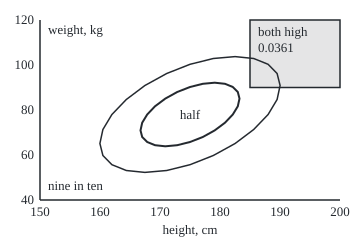
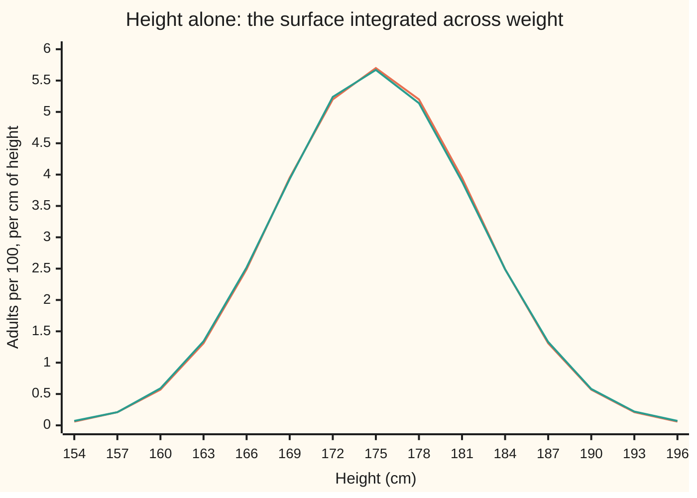

# Joint densities: two continuous variables and the surface over the plane

[Syllabus](../../../SYLLABUS.md) → [Probability and statistics](../README.md) → [Transformations and Joint Laws](../README.md#s05) → Joint densities

---

## General Overview

Pick an adult at random and measure two things: height in centimetres and weight in kilograms. Across many adults the pairs pile up around 175 cm and 78 kg. Tall people tend to be heavier, so the pile leans: it runs from short-and-light to tall-and-heavy. A clothing maker asks one question of it: what share of adults is both taller than 185 cm and heavier than 90 kg?

A table of chances cannot answer that. Height and weight each vary continuously, so any exact pair, such as 175.0 cm and 78.0 kg, has chance zero. What has a real chance is a region: a patch of the height-weight plane.

The answer is a surface standing over the plane, drawn so that **volume under it is chance**. The chance of landing in a region is the volume between the surface and the floor, above that region. The whole volume is 1. Such a surface is a **joint density**. In the model on this card the surface is a tilted bell, and the volume above "taller than 185 cm and heavier than 90 kg" is 0.0361: about 1 adult in 28.

The same surface also holds each measurement alone. Add up the volume across every weight, one height at a time, and what is left is the density of height by itself, called its **marginal**. Weight is forgotten; nothing about it had to be known separately.

**A joint density is a surface over the plane whose volume above any region is the chance of the pair landing there; integrating out one variable leaves the other's own density, the marginal.**

**What kind of fact this is:** a definition, of the joint density; the marginal rule that follows from it is a theorem, proved on this card in Why it works.

### The picture: the tilted bell seen from above

<p align="center"></p>

The view is from directly above the surface, to scale from the `figure,` lines the code prints. The inner ring encloses half of all adults, the outer ring nine in ten; the surface is highest at the centre, 175 cm and 78 kg. The shaded corner starts at 185 cm and 90 kg, and the volume above it is 0.0361. The rings lean because height and weight move together.

---

## The formula

Notation first, in words. As on earlier cards, capital letters are random quantities and lower-case letters their values: $H$ is the height of a randomly chosen adult and $h$ one height it might take; $W$ and $w$ do the same for weight. A region of the plane is called $R$. The joint density is written f(h, w), read "the density at height h and weight w". The double integral sign, from the calculus wing, adds up volume above a region, and the symbol ∈ reads "lands in".

$$P\big((H, W) \in R\big) = \iint_R f(h, w)\,dh\,dw$$

**Read it aloud:** the chance that the pair lands in the region R is the volume under the surface above R.

Any surface that never dips below the floor and holds total volume 1 is a joint density. The marginals come from it by adding across one direction:

$$f_H(h) = \int_{-\infty}^{\infty} f(h, w)\,dw \qquad\qquad f_W(w) = \int_{-\infty}^{\infty} f(h, w)\,dh$$

**Read it aloud:** the density of height alone, at height h, is the area of the surface's cross-section at h, taken across every weight; the same with the roles swapped gives weight alone.

The surface on this card is a tilted bell, fixed by five settings: the centre μ_H = 175 cm and μ_W = 78 kg (the averages), the spreads σ_H = 7 cm and σ_W = 12 kg (the standard deviations), and the tilt ρ (rho) = 0.5, the correlation of height and weight. Three helpers follow from them. The standardised height $z_h$ is (h − 175)/7: how many spreads above average. The standardised weight $z_w$ is (w − 78)/12. The squeeze factor $c$ is the square root of 1 − ρ^2, here 0.8660. The bell's derivation belongs to [Bivariate normal](05-bivariate-normal-and-conditioning.md); here it is taken as given:

$$f(h, w) = \frac{1}{2\pi\,\sigma_H\,\sigma_W\,c}\;e^{-Q/2}, \qquad Q = \frac{z_h^2 - 2\rho\,z_h z_w + z_w^2}{c^2}$$

**Read it aloud:** the surface is highest at the centre and falls off as a bell whose contours are tilted ellipses; Q measures how far a pair sits from the centre, allowing for the tilt.

| Symbol | Plain meaning | In our example | Push it up and the answer… |
| --- | --- | --- | --- |
| $H$, $W$ | height and weight of one randomly chosen adult | cm and kg | — |
| $h$, $w$ | one particular height and weight | 185 cm, 90 kg | the tail region shrinks |
| $f$ | the joint density: chance per cm per kg | 0.002188 at the centre | more chance near that point |
| $R$ | a region of the height-weight plane | taller than 185, heavier than 90 | bigger region, more volume |
| $f_H$, $f_W$ | the marginals: each variable's own density | 0.056992 per cm at 175 cm | — |
| $\mu_H$, $\mu_W$ | the centre: average height and weight | 175 cm, 78 kg | the bell slides |
| $\sigma_H$, $\sigma_W$ | the spreads: standard deviations | 7 cm, 12 kg | the bell widens and flattens |
| $\rho$ | the tilt: the correlation of H and W | 0.5 | the tail corner fills |
| $z_h$, $z_w$ | distances from the centre in spreads | 1.4286 and 1.0000 at the corner | — |
| $Q$ | the tilted squared distance from the centre | 0 at the centre | the surface falls |
| $c$ | the squeeze factor, the square root of 1 − ρ^2 | 0.8660 | wider rings, lower peak |
| $\Phi$ | the standard normal's area left of a point | 1 − Φ(1) = 0.1587 | — |

The tilt ρ is the correlation of [Two variables at once](../02-Random%20Variables/04-joint-distributions-and-covariance.md): the covariance Cov(H, W) divided by both spreads. The code integrates the covariance off the surface and gets 42.000000 cm kg, which is 0.5 × 7 × 12.

### When it holds

- **Chance spread over area.** A joint density needs it. If weight were a fixed function of height, all the chance would sit on a curve with zero area, and no surface could hold it.
- **A surface that never dips below zero and holds volume 1.** Drop either and "volume above a region" stops being a chance: some regions would get negative chance, or the total would not be 1.
- **Integrating over every value of the other variable.** Stop the weight integral at 90 kg and the height marginal loses every adult heavier than that; its total falls to 0.8413, not 1.
- **The tilted bell itself is a model.** Real height-weight data have a longer tail on the heavy side than any bell. The rules for joint densities hold for any surface; numbers such as 0.0361 hold only for this one.

---

## Why it works

### Step 0: chance is volume, box by box

Cut the plane into small boxes, 1 cm wide in height and 1 kg deep in weight. Over one box the surface is nearly flat, so the chance of landing in it is about the surface's height times the box's area. At the centre that is 0.002188 × 1 × 1. The grid in the code gives 0.002184 for that box: about 1 adult in 458 stands between 174.5 and 175.5 cm and between 77.5 and 78.5 kg.

The chance of any region is the sum over its boxes. As the boxes shrink the sum becomes the volume under the surface: the double integral of [Double integrals](../../06-Calculus%20and%20analysis/08-Multiple%20Integrals/01-double-integrals.md). A joint density is defined as a surface for which this is exact for every region. That is the same move the one-variable card [Densities](../04-Continuous%20Distributions/01-densities-and-cdfs.md) made with area, one dimension up.

### Step 1: the surface holds total volume 1

Shift the centre to zero and measure in spreads: the substitutions $z_h$ and $z_w$ turn dh dw into σ_H σ_W dz_h dz_w. Then complete the square in Q:

$$Q = z_h^2 + \frac{(z_w - \rho\,z_h)^2}{c^2}$$

The volume splits into a bell in $z_h$ times a bell in $z_w$ centred at ρ z_h with spread $c$. The Gaussian integral gives the first area as the square root of 2π, and the second as c times the square root of 2π. Their product, times the σ_H σ_W from the substitution, is 2π c σ_H σ_W: exactly the number the formula divides by. The code's grid gives 1.0000000000.

<details>
<summary>Detailed proof: the volume is 1</summary>

Expand the completed square: z_h^2 + (z_w^2 − 2ρ z_h z_w + ρ^2 z_h^2)/c^2. Since c^2 = 1 − ρ^2, the z_h^2 terms add to (1 − ρ^2 + ρ^2) z_h^2 / c^2 = z_h^2/c^2, and the whole is (z_h^2 − 2ρ z_h z_w + z_w^2)/c^2 = Q.

With h = μ_H + σ_H z_h and w = μ_W + σ_W z_w, the volume is
(1/(2π c)) ∫∫ e^{−z_h^2/2} e^{−(z_w − ρ z_h)^2/(2c^2)} dz_w dz_h.
For fixed z_h the inner integral is a Gaussian integral with centre ρ z_h and spread c: its value is c √(2π), whatever z_h is. What remains is (1/(2π c)) × c √(2π) × ∫ e^{−z_h^2/2} dz_h = (1/√(2π)) × √(2π) = 1. The surface is positive everywhere, so it is a joint density.

</details>

### Step 2: integrating out one variable leaves a density

The chance that height is at most some value a is the chance that the pair lands in the strip of the plane left of a, whatever the weight:

$$P(H \le a) = \int_{-\infty}^{a} \left[\int_{-\infty}^{\infty} f(h, w)\,dw\right] dh$$

The double integral over the strip was taken slice by slice: first across every weight at a fixed height, then along the heights. For a surface that never goes negative the order of slicing never changes the answer ([Double integrals](../../06-Calculus%20and%20analysis/08-Multiple%20Integrals/01-double-integrals.md)).

The left side is the cumulative distribution F(a) of height alone. The right side is the running area, up to a, of the bracket. A density is exactly a curve whose running area is the cumulative distribution, and it is the slope of that cumulative distribution ([Densities](../04-Continuous%20Distributions/01-densities-and-cdfs.md)). So the bracket is the density of height: that is $f_H$. Nothing assumed that height and weight were unrelated.

This is the joint table's row total from [Two variables at once](../02-Random%20Variables/04-joint-distributions-and-covariance.md), with boxes shrunk to nothing: adding across a row forgets the column variable.

### Step 3: for the tilted bell, the marginal is a plain bell

Step 1's inner integral is the whole calculation. At any fixed height, integrating across weight turns the weight factor into c √(2π) σ_W, which cancels against the same numbers in the divisor. What is left depends on height only:

$$f_H(h) = \frac{1}{\sigma_H\sqrt{2\pi}}\,e^{-z_h^2/2}$$

That is the normal law N(175, 7^2) of [Normal](../04-Continuous%20Distributions/04-normal-distribution.md). The tilt ρ has vanished. By the same algebra with the roles swapped, weight alone is N(78, 12^2). At the centre the two marginals are 0.056992 per cm and 0.033245 per kg.



Orange: the weight integral of the surface, computed numerically at each height. Green: 200,000 simulated adults, sorted into 3 cm bins by height with their weights ignored. They agree to within the simulation's noise: ignoring a column of data is integrating out.

### Step 4: the marginals do not fix the surface

Every tilt from just above −1 to just below 1 gives the same two marginals, since ρ vanished in Step 3. So two plain bells for height and weight are consistent with a surface leaning either way, or with none.

The pair is **independent**, meaning knowing one tells nothing about the other, exactly when the surface is the product of its marginals, $f(h, w) = f_H(h)\,f_W(w)$, at every point outside a set of zero area. For the tilted bell that happens only at ρ = 0, where Q becomes the sum of the two squared distances. At ρ = 0.5 the peak is 0.002188, the product of the marginals there is 0.001895, and the ratio is 1.1547, which is 1/c. The surface is taller in the middle than independence allows, because the tilt piles adults along the leaning axis.

### Step 5: a region, slice by slice

The same slicing answers the clothing maker's question. For each height above 185 cm, take the cross-section of the surface and keep only the weights above 90 kg. Step 1's completed square makes each piece the tail of a bell in weight, centred at ρ z_h and of spread c in standardised units. Its area is a Φ value:

$$P(H > 185,\ W > 90) = \int_{185}^{\infty} f_H(h)\left[1 - \Phi\!\left(\frac{1 - \rho\,z_h}{c}\right)\right] dh = 0.036110$$

The 1 in the numerator is the standardised weight at 90 kg, (90 − 78)/12. The bracket is the share of adults at height h who weigh more than 90 kg. Reading that bracket as a chance in its own right, given the height, is the work of [Conditional densities](03-conditional-densities.md). No shortcut removes the last integral; it is done numerically.

A second route to the marginal exists for any pair: simulate many pairs, throw away one coordinate, and histogram the other. That is the green line of the chart, and road 3 of the code; its law of averages is proved on [Law of large numbers](../06-Limit%20Theorems%20in%20Practice/01-law-of-large-numbers.md).

---

## Worked numbers, by hand

The spreads are 7 cm and 12 kg, the tilt 0.5. A normal table or the code supplies each Φ value.

| Step | Arithmetic | Value |
| --- | --- | --- |
| squeeze factor c | square root of (1 − 0.25) | 0.8660 |
| the divisor | 2π × 7 × 12 × 0.8660 | 457.08 |
| peak of the surface | 1 / 457.08 | 0.002188 per cm per kg |
| height marginal at 175 cm | 1 / (7 × 2.5066) | 0.056992 per cm |
| weight marginal at 78 kg | 1 / (12 × 2.5066) | 0.033245 per kg |
| product of marginals | 0.056992 × 0.033245 | 0.001895 |
| P(170 < H < 180) | Φ(0.7143) − Φ(−0.7143) | 0.5249 |
| P(H > 185) | 1 − Φ(1.4286) | 0.0766 |
| P(W > 90) | 1 − Φ(1.0000) | 0.1587 |
| P(H > 185, W > 90) | Step 5, integrated numerically | **0.036110** |

About 1 adult in 28 is both taller than 185 cm and heavier than 90 kg. Taken separately the two events are 0.0766 and 0.1587; the tilt makes them overlap far more than their product suggests. The tilt describes how the two measurements vary together across adults, not that height causes weight.

### What breaks if you drop a piece

| Mistake | Comes out at | What went wrong |
| --- | --- | --- |
| Density read as a chance | 0.002188 as "the chance of exactly 175 cm and 78 kg" | That chance is 0; the density is chance per cm per kg, and a 1 mm by 100 g box holds only 0.00002188 |
| Marginals multiplied | 0.0766 × 0.1587 = 0.012147 | Assumes independence; the true 0.036110 is 2.97 times as large |
| The slice at 78 kg read as the height marginal | area 0.033245, spread 6.0622 cm | A slice is not a sum: its area is the weight marginal at 78 kg, and its spread is 7c, not 7 |

The code prints all three.

---

## Code, from first principles, and it actually runs

Only π, square roots, logarithms, exponentials, sine and cosine are imported. The standard normal area Φ is summed from its own Taylor series, and every random draw comes from a SplitMix64 generator with seed 20260928, written out in both languages. The tail chance is reached by three roads that share no step: Simpson's rule over the whole surface, box by box; slices whose inner area is Step 5's Φ formula; and 200,000 simulated adults, whose estimate is printed with its standard error. The marginals are checked twice as well: integrated numerically against the plain bell, and read off simulated adults with the other measurement thrown away.

### Python

```python
# Joint densities and marginals -- the check behind the card.  Only math is
# imported.  The surface is a tilted bell for adult height H (cm) and weight
# W (kg): centre 175 cm and 78 kg, spreads 7 cm and 12 kg, tilt rho = 0.5.
# The tail chance P(H > 185, W > 90) is reached three ways: a grid over the
# whole surface, slices with a closed inner area, and 200,000 simulated adults.
from math import exp, sqrt, pi, log, cos, sin

MH, SH, MW, SW, RHO = 175.0, 7.0, 78.0, 12.0, 0.5
C = sqrt(1 - RHO * RHO)                          # the tilt's squeeze factor

def f(h, w):                                     # the joint density, per cm per kg
    zh, zw = (h - MH) / SH, (w - MW) / SW
    q = (zh * zh - 2 * RHO * zh * zw + zw * zw) / (C * C)
    return exp(-q / 2) / (2 * pi * SH * SW * C)

def bell(x, m, s):                               # a one-variable normal density
    z = (x - m) / s
    return exp(-z * z / 2) / (s * sqrt(2 * pi))

def Phi(x):                                      # standard normal area left of x, by Taylor series
    term, total, n = x, x, 0
    while abs(term) > 1e-17 * max(1.0, abs(total)):
        n += 1
        term *= -x * x / (2 * n)
        total += term / (2 * n + 1)
    return 0.5 + total / sqrt(2 * pi)

def simpson(g, a, b, n=400):                     # Simpson's rule, n even
    step = (b - a) / n
    s = g(a) + g(b)
    for i in range(1, n):
        s += (4 if i % 2 else 2) * g(a + i * step)
    return s * step / 3

def grid(g, h0, h1, w0, w1):                     # road 1: the double integral, box by box
    return simpson(lambda h: simpson(lambda w: g(h, w), w0, w1), h0, h1)

HL, HR, WL, WR = MH - 10 * SH, MH + 10 * SH, MW - 10 * SW, MW + 10 * SW
total = grid(f, HL, HR, WL, WR)
cov = grid(lambda h, w: (h - MH) * (w - MW) * f(h, w), HL, HR, WL, WR)
tail_grid = grid(f, 185.0, HR, 90.0, WR)
z90 = (90.0 - MW) / SW                           # road 2: slices, inner area in closed form
tail_slices = simpson(lambda h: bell(h, MH, SH) * (1 - Phi((z90 - RHO * (h - MH) / SH) / C)), 185.0, HR)
marg_err = max(abs(simpson(lambda w: f(h, w), WL, WR) - bell(h, MH, SH)) for h in range(154, 197, 3))

MASK = (1 << 64) - 1
state = 20260928
def uniform():                                   # SplitMix64, a number strictly between 0 and 1
    global state
    state = (state + 0x9E3779B97F4A7C15) & MASK
    z = state
    z = ((z ^ (z >> 30)) * 0xBF58476D1CE4E5B9) & MASK
    z = ((z ^ (z >> 27)) * 0x94D049BB133111EB) & MASK
    z ^= z >> 31
    return ((z >> 11) + 0.5) / 9007199254740992.0

N = 200000
R50 = sqrt(-2 * log(0.5))
n_tail = n_mid = n_heavy = n_ring = 0
bins = [0] * 15                                  # 3-cm bins centred on 154, 157, ..., 196
for _ in range(N):                               # road 3: simulated adults, by Box-Muller
    r, a = sqrt(-2 * log(uniform())), 2 * pi * uniform()
    z1, z2 = r * cos(a), r * sin(a)
    h, w = MH + SH * z1, MW + SW * (RHO * z1 + C * z2)
    n_tail += h > 185 and w > 90
    n_mid += 170 < h < 180
    n_heavy += w > 90
    n_ring += z1 * z1 + z2 * z2 < R50 * R50
    k = int((h - 152.5) // 3)
    if 0 <= k < 15:
        bins[k] += 1
p_sim = n_tail / N
se = sqrt(p_sim * (1 - p_sim) / N)
mid_exact = Phi(5 / 7) - Phi(-5 / 7)
mid_sim = n_mid / N
mid_se = sqrt(mid_sim * (1 - mid_sim) / N)
heavy_sim = n_heavy / N
heavy_se = sqrt(heavy_sim * (1 - heavy_sim) / N)

peak = f(MH, MW)
fh, fw = bell(MH, MH, SH), bell(MW, MW, SW)
box1 = grid(f, 174.5, 175.5, 77.5, 78.5)
box2 = grid(f, 174.95, 175.05, 77.95, 78.05)
pH, pW = 1 - Phi(10 / 7), 1 - Phi(1.0)
slice_area = simpson(lambda h: f(h, 78.0), HL, HR)
slice_sd = sqrt(simpson(lambda h: (h - MH) ** 2 * f(h, 78.0), HL, HR) / slice_area)
cut_total = grid(f, HL, HR, WL, 90.0)             # weight integral stopped at 90 kg

print(f"surface: centre {MH:.0f} cm, {MW:.0f} kg; spreads {SH:.0f} cm, {SW:.0f} kg; tilt {RHO}")
print(f"total volume under the surface, grid:        {total:.10f}")
print(f"covariance from the surface, grid:            {cov:.6f} cm kg (rho x 7 x 12 = {RHO * SH * SW:.1f})")
print(f"peak height f(175, 78):                       {peak:.6f} per cm per kg")
print(f"chance in the 1 cm x 1 kg box at the peak:   {box1:.6f}  (about 1 in {1 / box1:.0f})")
print(f"chance in the 1 mm x 100 g box at the peak:  {box2:.8f}")
print(f"marginal of height at 175, 1/(7 sqrt(2 pi)):  {fh:.6f} per cm")
print(f"marginal of weight at 78, 1/(12 sqrt(2 pi)):  {fw:.6f} per kg")
print(f"product of the two marginals at the peak:    {fh * fw:.6f}  (peak / product = {peak / (fh * fw):.4f})")
print(f"integrated-out marginal = normal bell, 154..196 cm, to 1e-12: {'yes' if marg_err < 1e-12 else 'no'}")
print(f"P(170 < H < 180), from the marginal:          {mid_exact:.4f}")
print(f"P(170 < H < 180), simulated:                  {mid_sim:.4f}  (se {mid_se:.4f})")
print(f"P(H > 185) = 1 - Phi(10/7):                   {pH:.4f}")
print(f"P(W > 90)  = 1 - Phi(1):                      {pW:.4f}")
print(f"P(W > 90), simulated:                         {heavy_sim:.4f}  (se {heavy_se:.4f})")
print(f"road 1, P(H > 185, W > 90), grid:             {tail_grid:.6f}")
print(f"road 2, P(H > 185, W > 90), slices:           {tail_slices:.6f}  (about 1 in {1 / tail_slices:.0f})")
print(f"hand steps: c = {C:.4f}, sqrt(2 pi) = {sqrt(2 * pi):.4f}, 2 pi x 7 x 12 x c = {2 * pi * SH * SW * C:.2f}, "
      f"z at 185 cm = {10 / 7:.4f}, z at 90 kg = {z90:.4f}, z at 170 and 180 cm = {-5 / 7:.4f}, {5 / 7:.4f}")
print(f"road 3, P(H > 185, W > 90), simulated:        {p_sim:.6f}  (se {se:.6f}, {n_tail} of {N})")
print(f"mistake 1, density read as a chance:          {peak:.6f}, but P(H = 175 and W = 78) = 0")
print(f"mistake 2, marginals multiplied:              {pH * pW:.6f}  vs {tail_slices:.6f}, true / product = {tail_slices / (pH * pW):.2f}")
print(f"mistake 3, slice at 78 kg read as a marginal: area {slice_area:.6f}, spread {slice_sd:.4f} cm")
print(f"weight integral stopped at 90 kg:            height marginal's total {cut_total:.4f}, Phi(1) = {Phi(1.0):.4f}")
print(f"simulated share inside the 50% ring:          {n_ring / N:.4f}")
print("chart, height (cm):     " + " ".join(f"{h:5d}" for h in range(154, 197, 3)))
print("chart, integrated, %/cm:" + " ".join(f"{100 * simpson(lambda w: f(h, w), WL, WR):5.2f}" for h in range(154, 197, 3)))
print("chart, simulated, %/cm: " + " ".join(f"{100 * b / (3 * N):5.2f}" for b in bins))
for p in (0.5, 0.9):                             # rings holding half and nine-tenths of adults
    r = sqrt(-2 * log(1 - p))
    pts = []
    for k in range(24):
        t = 2 * pi * k / 24
        h, w = MH + SH * r * cos(t), MW + SW * r * (RHO * cos(t) + C * sin(t))
        pts.append(f"{40 + 6 * (h - 150):.1f},{200 - 2.25 * (w - 40):.1f}")
    print(f"figure, ring {p:.0%}: " + " ".join(pts))
print(f"figure, tail corner (185 cm, 90 kg): {40 + 6 * 35:.1f},{200 - 2.25 * 50:.1f}")
assert abs(total - 1) < 1e-9 and abs(cov - RHO * SH * SW) < 1e-6   # grid vs the settings
assert marg_err < 1e-12                                             # integrating out gives the bell
assert abs(tail_grid - tail_slices) < 1e-7                          # road 1 vs road 2
assert abs(p_sim - tail_slices) < 4 * se                            # road 3 vs road 2
assert abs(mid_sim - mid_exact) < 4 * mid_se                        # ignoring W in data = marginal
assert abs(heavy_sim - pW) < 4 * heavy_se                           # ignoring H in data = marginal
assert abs(slice_area - fw) < 1e-9 and abs(slice_sd - SH * C) < 1e-6
assert abs(cut_total - Phi(1.0)) < 1e-7                           # the cut loses exactly P(W > 90)
print("ALL CHECKS PASS")
```

**Ran 2026-10-06 on macOS, Python 3.14.6, standard library only. All checks passed. Output, pasted from the run:**

```
surface: centre 175 cm, 78 kg; spreads 7 cm, 12 kg; tilt 0.5
total volume under the surface, grid:        1.0000000000
covariance from the surface, grid:            42.000000 cm kg (rho x 7 x 12 = 42.0)
peak height f(175, 78):                       0.002188 per cm per kg
chance in the 1 cm x 1 kg box at the peak:   0.002184  (about 1 in 458)
chance in the 1 mm x 100 g box at the peak:  0.00002188
marginal of height at 175, 1/(7 sqrt(2 pi)):  0.056992 per cm
marginal of weight at 78, 1/(12 sqrt(2 pi)):  0.033245 per kg
product of the two marginals at the peak:    0.001895  (peak / product = 1.1547)
integrated-out marginal = normal bell, 154..196 cm, to 1e-12: yes
P(170 < H < 180), from the marginal:          0.5249
P(170 < H < 180), simulated:                  0.5272  (se 0.0011)
P(H > 185) = 1 - Phi(10/7):                   0.0766
P(W > 90)  = 1 - Phi(1):                      0.1587
P(W > 90), simulated:                         0.1582  (se 0.0008)
road 1, P(H > 185, W > 90), grid:             0.036110
road 2, P(H > 185, W > 90), slices:           0.036110  (about 1 in 28)
hand steps: c = 0.8660, sqrt(2 pi) = 2.5066, 2 pi x 7 x 12 x c = 457.08, z at 185 cm = 1.4286, z at 90 kg = 1.0000, z at 170 and 180 cm = -0.7143, 0.7143
road 3, P(H > 185, W > 90), simulated:        0.035920  (se 0.000416, 7184 of 200000)
mistake 1, density read as a chance:          0.002188, but P(H = 175 and W = 78) = 0
mistake 2, marginals multiplied:              0.012147  vs 0.036110, true / product = 2.97
mistake 3, slice at 78 kg read as a marginal: area 0.033245, spread 6.0622 cm
weight integral stopped at 90 kg:            height marginal's total 0.8413, Phi(1) = 0.8413
simulated share inside the 50% ring:          0.5007
chart, height (cm):       154   157   160   163   166   169   172   175   178   181   184   187   190   193   196
chart, integrated, %/cm: 0.06  0.21  0.57  1.31  2.49  3.95  5.20  5.70  5.20  3.95  2.49  1.31  0.57  0.21  0.06
chart, simulated, %/cm:  0.07  0.21  0.59  1.34  2.52  3.93  5.24  5.67  5.14  3.89  2.49  1.33  0.58  0.22  0.07
figure, ring 50%: 239.5,98.6 237.8,92.0 232.8,87.0 225.0,83.8 214.7,82.7 202.8,83.8 190.0,87.0 177.2,92.0 165.3,98.6 155.0,106.3 147.2,114.5 142.2,122.7 140.5,130.4 142.2,137.0 147.2,142.0 155.0,145.2 165.3,146.3 177.2,145.2 190.0,142.0 202.8,137.0 214.7,130.4 225.0,122.7 232.8,114.5 237.8,106.3
figure, ring 90%: 280.1,85.5 277.1,73.5 268.1,64.3 253.7,58.5 235.1,56.6 213.3,58.5 190.0,64.3 166.7,73.5 144.9,85.5 126.3,99.5 111.9,114.5 102.9,129.5 99.9,143.5 102.9,155.5 111.9,164.7 126.3,170.5 144.9,172.4 166.7,170.5 190.0,164.7 213.3,155.5 235.1,143.5 253.7,129.5 268.1,114.5 277.1,99.5
figure, tail corner (185 cm, 90 kg): 250.0,87.5
ALL CHECKS PASS
```

### Rust

Same numbers, same labels, built with `rustc --edition 2021 -O`.

```rust
// Joint densities and marginals -- the same check as the Python, in Rust.  No
// crates.  The surface is a tilted bell for adult height H (cm) and weight
// W (kg): centre 175 cm and 78 kg, spreads 7 cm and 12 kg, tilt rho = 0.5.
// The tail chance P(H > 185, W > 90) is reached three ways: a grid over the
// whole surface, slices with a closed inner area, and 200,000 simulated adults.
use std::f64::consts::PI;

const MH: f64 = 175.0;
const SH: f64 = 7.0;
const MW: f64 = 78.0;
const SW: f64 = 12.0;
const RHO: f64 = 0.5;

fn c() -> f64 { (1.0 - RHO * RHO).sqrt() }        // the tilt's squeeze factor

fn f(h: f64, w: f64) -> f64 {                      // the joint density, per cm per kg
    let (zh, zw) = ((h - MH) / SH, (w - MW) / SW);
    let q = (zh * zh - 2.0 * RHO * zh * zw + zw * zw) / (c() * c());
    (-q / 2.0).exp() / (2.0 * PI * SH * SW * c())
}

fn bell(x: f64, m: f64, s: f64) -> f64 {           // a one-variable normal density
    let z = (x - m) / s;
    (-z * z / 2.0).exp() / (s * (2.0 * PI).sqrt())
}

fn phi(x: f64) -> f64 {                            // standard normal area left of x, by Taylor series
    let (mut term, mut total, mut n) = (x, x, 0.0);
    while term.abs() > 1e-17 * total.abs().max(1.0) {
        n += 1.0;
        term *= -x * x / (2.0 * n);
        total += term / (2.0 * n + 1.0);
    }
    0.5 + total / (2.0 * PI).sqrt()
}

fn simpson(g: &dyn Fn(f64) -> f64, a: f64, b: f64) -> f64 {   // Simpson's rule, 400 panels
    let n = 400;
    let step = (b - a) / n as f64;
    let mut s = g(a) + g(b);
    for i in 1..n { s += if i % 2 == 1 { 4.0 } else { 2.0 } * g(a + i as f64 * step) }
    s * step / 3.0
}

fn grid(g: &dyn Fn(f64, f64) -> f64, h0: f64, h1: f64, w0: f64, w1: f64) -> f64 {
    simpson(&|h| simpson(&|w| g(h, w), w0, w1), h0, h1)     // road 1: the double integral
}

struct SplitMix(u64);
impl SplitMix {
    fn uniform(&mut self) -> f64 {                 // a number strictly between 0 and 1
        self.0 = self.0.wrapping_add(0x9E3779B97F4A7C15);
        let mut z = self.0;
        z = (z ^ (z >> 30)).wrapping_mul(0xBF58476D1CE4E5B9);
        z = (z ^ (z >> 27)).wrapping_mul(0x94D049BB133111EB);
        z ^= z >> 31;
        ((z >> 11) as f64 + 0.5) / 9007199254740992.0
    }
}

fn main() {
    let cc = c();
    let (hl, hr, wl, wr) = (MH - 10.0 * SH, MH + 10.0 * SH, MW - 10.0 * SW, MW + 10.0 * SW);
    let total = grid(&f, hl, hr, wl, wr);
    let cov = grid(&|h, w| (h - MH) * (w - MW) * f(h, w), hl, hr, wl, wr);
    let tail_grid = grid(&f, 185.0, hr, 90.0, wr);
    let z90 = (90.0 - MW) / SW;                    // road 2: slices, inner area in closed form
    let tail_slices = simpson(&|h| bell(h, MH, SH) * (1.0 - phi((z90 - RHO * (h - MH) / SH) / cc)), 185.0, hr);
    let heights: Vec<f64> = (0..15).map(|i| 154.0 + 3.0 * i as f64).collect();
    let marg: Vec<f64> = heights.iter().map(|&h| simpson(&|w| f(h, w), wl, wr)).collect();
    let marg_err = heights.iter().zip(&marg).map(|(&h, &m)| (m - bell(h, MH, SH)).abs()).fold(0.0, f64::max);

    let n = 200000usize;
    let mut rng = SplitMix(20260928);
    let r50 = (-2.0 * 0.5f64.ln()).sqrt();
    let (mut n_tail, mut n_mid, mut n_heavy, mut n_ring) = (0usize, 0usize, 0usize, 0usize);
    let mut bins = [0usize; 15];                   // 3-cm bins centred on 154, 157, ..., 196
    for _ in 0..n {                                // road 3: simulated adults, by Box-Muller
        let r = (-2.0 * rng.uniform().ln()).sqrt();
        let a = 2.0 * PI * rng.uniform();
        let (z1, z2) = (r * a.cos(), r * a.sin());
        let (h, w) = (MH + SH * z1, MW + SW * (RHO * z1 + cc * z2));
        if h > 185.0 && w > 90.0 { n_tail += 1 }
        if 170.0 < h && h < 180.0 { n_mid += 1 }
        if w > 90.0 { n_heavy += 1 }
        if z1 * z1 + z2 * z2 < r50 * r50 { n_ring += 1 }
        let k = ((h - 152.5) / 3.0).floor();
        if k >= 0.0 && k < 15.0 { bins[k as usize] += 1 }
    }
    let nf = n as f64;
    let p_sim = n_tail as f64 / nf;
    let se = (p_sim * (1.0 - p_sim) / nf).sqrt();
    let mid_exact = phi(5.0 / 7.0) - phi(-5.0 / 7.0);
    let mid_sim = n_mid as f64 / nf;
    let mid_se = (mid_sim * (1.0 - mid_sim) / nf).sqrt();
    let heavy_sim = n_heavy as f64 / nf;
    let heavy_se = (heavy_sim * (1.0 - heavy_sim) / nf).sqrt();

    let peak = f(MH, MW);
    let (fh, fw) = (bell(MH, MH, SH), bell(MW, MW, SW));
    let box1 = grid(&f, 174.5, 175.5, 77.5, 78.5);
    let box2 = grid(&f, 174.95, 175.05, 77.95, 78.05);
    let (ph, pw) = (1.0 - phi(10.0 / 7.0), 1.0 - phi(1.0));
    let slice_area = simpson(&|h| f(h, 78.0), hl, hr);
    let slice_sd = (simpson(&|h| (h - MH).powi(2) * f(h, 78.0), hl, hr) / slice_area).sqrt();
    let cut_total = grid(&f, hl, hr, wl, 90.0);   // weight integral stopped at 90 kg

    println!("surface: centre {:.0} cm, {:.0} kg; spreads {:.0} cm, {:.0} kg; tilt {}", MH, MW, SH, SW, RHO);
    println!("total volume under the surface, grid:        {:.10}", total);
    println!("covariance from the surface, grid:            {:.6} cm kg (rho x 7 x 12 = {:.1})", cov, RHO * SH * SW);
    println!("peak height f(175, 78):                       {:.6} per cm per kg", peak);
    println!("chance in the 1 cm x 1 kg box at the peak:   {:.6}  (about 1 in {:.0})", box1, 1.0 / box1);
    println!("chance in the 1 mm x 100 g box at the peak:  {:.8}", box2);
    println!("marginal of height at 175, 1/(7 sqrt(2 pi)):  {:.6} per cm", fh);
    println!("marginal of weight at 78, 1/(12 sqrt(2 pi)):  {:.6} per kg", fw);
    println!("product of the two marginals at the peak:    {:.6}  (peak / product = {:.4})", fh * fw, peak / (fh * fw));
    println!("integrated-out marginal = normal bell, 154..196 cm, to 1e-12: {}", if marg_err < 1e-12 { "yes" } else { "no" });
    println!("P(170 < H < 180), from the marginal:          {:.4}", mid_exact);
    println!("P(170 < H < 180), simulated:                  {:.4}  (se {:.4})", mid_sim, mid_se);
    println!("P(H > 185) = 1 - Phi(10/7):                   {:.4}", ph);
    println!("P(W > 90)  = 1 - Phi(1):                      {:.4}", pw);
    println!("P(W > 90), simulated:                         {:.4}  (se {:.4})", heavy_sim, heavy_se);
    println!("road 1, P(H > 185, W > 90), grid:             {:.6}", tail_grid);
    println!("road 2, P(H > 185, W > 90), slices:           {:.6}  (about 1 in {:.0})", tail_slices, 1.0 / tail_slices);
    println!("hand steps: c = {:.4}, sqrt(2 pi) = {:.4}, 2 pi x 7 x 12 x c = {:.2}, z at 185 cm = {:.4}, z at 90 kg = {:.4}, z at 170 and 180 cm = {:.4}, {:.4}",
             cc, (2.0 * PI).sqrt(), 2.0 * PI * SH * SW * cc, 10.0 / 7.0, z90, -5.0 / 7.0, 5.0 / 7.0);
    println!("road 3, P(H > 185, W > 90), simulated:        {:.6}  (se {:.6}, {} of {})", p_sim, se, n_tail, n);
    println!("mistake 1, density read as a chance:          {:.6}, but P(H = 175 and W = 78) = 0", peak);
    println!("mistake 2, marginals multiplied:              {:.6}  vs {:.6}, true / product = {:.2}", ph * pw, tail_slices, tail_slices / (ph * pw));
    println!("mistake 3, slice at 78 kg read as a marginal: area {:.6}, spread {:.4} cm", slice_area, slice_sd);
    println!("weight integral stopped at 90 kg:            height marginal's total {:.4}, Phi(1) = {:.4}", cut_total, phi(1.0));
    println!("simulated share inside the 50% ring:          {:.4}", n_ring as f64 / nf);
    println!("chart, height (cm):     {}", heights.iter().map(|h| format!("{:5}", *h as i64)).collect::<Vec<_>>().join(" "));
    println!("chart, integrated, %/cm:{}", marg.iter().map(|m| format!("{:5.2}", 100.0 * m)).collect::<Vec<_>>().join(" "));
    println!("chart, simulated, %/cm: {}", bins.iter().map(|&b| format!("{:5.2}", 100.0 * b as f64 / (3.0 * nf))).collect::<Vec<_>>().join(" "));
    for p in [0.5f64, 0.9] {                       // rings holding half and nine-tenths of adults
        let r = (-2.0 * (1.0 - p).ln()).sqrt();
        let pts: Vec<String> = (0..24).map(|k| {
            let t = 2.0 * PI * k as f64 / 24.0;
            let (h, w) = (MH + SH * r * t.cos(), MW + SW * r * (RHO * t.cos() + cc * t.sin()));
            format!("{:.1},{:.1}", 40.0 + 6.0 * (h - 150.0), 200.0 - 2.25 * (w - 40.0))
        }).collect();
        println!("figure, ring {:.0}%: {}", 100.0 * p, pts.join(" "));
    }
    println!("figure, tail corner (185 cm, 90 kg): {:.1},{:.1}", 40.0 + 6.0 * 35.0, 200.0 - 2.25 * 50.0);
    assert!((total - 1.0).abs() < 1e-9 && (cov - RHO * SH * SW).abs() < 1e-6);   // grid vs the settings
    assert!(marg_err < 1e-12);                                                   // integrating out gives the bell
    assert!((tail_grid - tail_slices).abs() < 1e-7);                             // road 1 vs road 2
    assert!((p_sim - tail_slices).abs() < 4.0 * se);                             // road 3 vs road 2
    assert!((mid_sim - mid_exact).abs() < 4.0 * mid_se);                         // ignoring W in data = marginal
    assert!((heavy_sim - pw).abs() < 4.0 * heavy_se);                            // ignoring H in data = marginal
    assert!((slice_area - fw).abs() < 1e-9 && (slice_sd - SH * cc).abs() < 1e-6);
    assert!((cut_total - phi(1.0)).abs() < 1e-7);                               // the cut loses exactly P(W > 90)
    println!("ALL CHECKS PASS");
}
```

**Ran 2026-10-06 on macOS, rustc 1.98.1, no crates. All checks passed. Output, pasted from the run:**

```
surface: centre 175 cm, 78 kg; spreads 7 cm, 12 kg; tilt 0.5
total volume under the surface, grid:        1.0000000000
covariance from the surface, grid:            42.000000 cm kg (rho x 7 x 12 = 42.0)
peak height f(175, 78):                       0.002188 per cm per kg
chance in the 1 cm x 1 kg box at the peak:   0.002184  (about 1 in 458)
chance in the 1 mm x 100 g box at the peak:  0.00002188
marginal of height at 175, 1/(7 sqrt(2 pi)):  0.056992 per cm
marginal of weight at 78, 1/(12 sqrt(2 pi)):  0.033245 per kg
product of the two marginals at the peak:    0.001895  (peak / product = 1.1547)
integrated-out marginal = normal bell, 154..196 cm, to 1e-12: yes
P(170 < H < 180), from the marginal:          0.5249
P(170 < H < 180), simulated:                  0.5272  (se 0.0011)
P(H > 185) = 1 - Phi(10/7):                   0.0766
P(W > 90)  = 1 - Phi(1):                      0.1587
P(W > 90), simulated:                         0.1582  (se 0.0008)
road 1, P(H > 185, W > 90), grid:             0.036110
road 2, P(H > 185, W > 90), slices:           0.036110  (about 1 in 28)
hand steps: c = 0.8660, sqrt(2 pi) = 2.5066, 2 pi x 7 x 12 x c = 457.08, z at 185 cm = 1.4286, z at 90 kg = 1.0000, z at 170 and 180 cm = -0.7143, 0.7143
road 3, P(H > 185, W > 90), simulated:        0.035920  (se 0.000416, 7184 of 200000)
mistake 1, density read as a chance:          0.002188, but P(H = 175 and W = 78) = 0
mistake 2, marginals multiplied:              0.012147  vs 0.036110, true / product = 2.97
mistake 3, slice at 78 kg read as a marginal: area 0.033245, spread 6.0622 cm
weight integral stopped at 90 kg:            height marginal's total 0.8413, Phi(1) = 0.8413
simulated share inside the 50% ring:          0.5007
chart, height (cm):       154   157   160   163   166   169   172   175   178   181   184   187   190   193   196
chart, integrated, %/cm: 0.06  0.21  0.57  1.31  2.49  3.95  5.20  5.70  5.20  3.95  2.49  1.31  0.57  0.21  0.06
chart, simulated, %/cm:  0.07  0.21  0.59  1.34  2.52  3.93  5.24  5.67  5.14  3.89  2.49  1.33  0.58  0.22  0.07
figure, ring 50%: 239.5,98.6 237.8,92.0 232.8,87.0 225.0,83.8 214.7,82.7 202.8,83.8 190.0,87.0 177.2,92.0 165.3,98.6 155.0,106.3 147.2,114.5 142.2,122.7 140.5,130.4 142.2,137.0 147.2,142.0 155.0,145.2 165.3,146.3 177.2,145.2 190.0,142.0 202.8,137.0 214.7,130.4 225.0,122.7 232.8,114.5 237.8,106.3
figure, ring 90%: 280.1,85.5 277.1,73.5 268.1,64.3 253.7,58.5 235.1,56.6 213.3,58.5 190.0,64.3 166.7,73.5 144.9,85.5 126.3,99.5 111.9,114.5 102.9,129.5 99.9,143.5 102.9,155.5 111.9,164.7 126.3,170.5 144.9,172.4 166.7,170.5 190.0,164.7 213.3,155.5 235.1,143.5 253.7,129.5 268.1,114.5 277.1,99.5
figure, tail corner (185 cm, 90 kg): 250.0,87.5
ALL CHECKS PASS
```

The two outputs match line for line, including the simulated counts, since both languages draw the same numbers. The simulated share of heights between 170 and 180 cm, 0.5272, sits about two standard errors from the exact 0.5249: the size of miss a fair simulation shows now and then.

> [!TIP]
> **Try changing**
> Guess first, then run the Python.
> - **Take the tilt away.** Set the last of the five settings, `RHO`, to `0.0`. Guess the tail chance. It falls to 0.012147, exactly the product of the marginals, since an untilted bell is independent; every assert still passes, and the slice's spread becomes 7.0000 cm.
> - **Tilt the other way.** Set `RHO` to `-0.5`. Tall adults now tend to be lighter, and the tail corner nearly empties: 0.001086, about 1 in 921. The marginals do not change.
> - **Fewer adults.** Set `N` to `2000`. The simulated tail reads 0.030000 with standard error 0.003814: the estimate wanders about ten times as far, and the assert still passes because its tolerance grows with the error.
> - **Break a road.** In the slice road, replace `RHO * (h - MH)` with `0 * RHO * (h - MH)`, which ignores the tilt inside each slice. Road 2 drops to 0.009502 and the road-1-against-road-2 assert stops the run.

---

## The usual mistake

> [!warning]
> **Multiplying the marginals.** The chance of "taller than 185 cm" is 0.0766 and of "heavier than 90 kg" is 0.1587; multiplied, they give 0.012147. The true joint chance is 0.036110, 2.97 times as large. Multiplying is correct only when the surface is the product of its marginals, which is independence. Two marginals alone never say whether that holds: every tilt gives the same pair of bells.
>
> - **A density value read as a chance.** The peak 0.002188 is chance per cm per kg. Shrink the box to 1 mm by 100 g and it holds 0.00002188; any exact pair holds 0.
> - **A slice read as a marginal.** The cross-section at 78 kg has area 0.033245, not 1, and spread 6.0622 cm, not 7. A marginal adds every slice; one slice is only one row of the table.
> - **Forgetting the units.** The joint density is per cm per kg. Measure height in metres and every density value rises a hundredfold, while every chance stays the same.

---

## Where you meet it in real life

- **Sizing clothes and equipment.** Garment sizes and cockpit seats are set from joint height-weight data: a size must fit a region of the plane, not a range of one measurement.
- **Growth and health charts.** Doctors read weight-for-height, which is the slice view developed in [Conditional densities](03-conditional-densities.md), built on the joint surface here.
- **Heredity.** Francis Galton's 1886 table of parents' and children's heights showed contours of equal frequency that were tilted ellipses, an early picture of a joint density read off data.
- **Credit risk.** Two firms' default times as a joint law, with the marginals kept and the dependence chosen separately, is the finance use in [Copulas](07-copulas-and-sklars-theorem.md).

> **Say it back**
> A joint density is a surface over the plane of pairs, and the volume above a region is the chance of landing there. The total volume is 1, and any single point has chance 0. Integrating across one variable leaves the other's own density, the marginal, with no independence assumed. The marginals do not fix the surface: tilted or not, the height-weight bell has the same two marginals. So a joint chance, such as 0.0361 for tall and heavy, needs the surface itself, not the product 0.0121.

---

## What this builds on

- [Densities](../04-Continuous%20Distributions/01-densities-and-cdfs.md): chance as area under a curve, and the density as the slope of the cumulative distribution.
- [Two variables at once](../02-Random%20Variables/04-joint-distributions-and-covariance.md): the joint table, marginals as row totals, and covariance.
- [Double integrals](../../06-Calculus%20and%20analysis/08-Multiple%20Integrals/01-double-integrals.md): volume under a surface, computed slice by slice in either order.

## Where this goes next

- [Conditional densities](03-conditional-densities.md): the slice at one height, rescaled to area 1, as the law of weight given that height.
- [Adding continuous variables](04-sums-and-convolution.md): the volume above a slanted strip gives the density of a sum of two variables.
- [Order statistics](08-order-statistics-and-extremes.md): the volume above a corner of the plane gives the law of the larger of two readings.

The bracket in Step 5 was a share of adults at one exact height, a height that has chance 0; how to condition on an event of chance 0 is the question [Conditional densities](03-conditional-densities.md) answers.

---

## Sources

Verified 2026-09-28: every link below resolves to the publisher's page.

- Blitzstein, Joseph K., and Jessica Hwang. *Introduction to Probability*, 2nd ed. CRC Press, 2019. [Publisher page](https://www.routledge.com/Introduction-to-Probability-Second-Edition/Blitzstein-Hwang/p/book/9781138369917). Chapter 7 defines joint densities, marginals by integrating out, and independence as factoring.
- Siegrist, Kyle. "Joint Distributions." *Probability, Mathematical Statistics, and Stochastic Processes*, Random Services. [Chapter page](https://www.randomservices.org/random/dist/Joint.html). Free; proves the marginal rule and the product test for independence.
- Galton, Francis. "Regression towards mediocrity in hereditary stature." *Journal of the Anthropological Institute of Great Britain and Ireland* 15 (1886): 246–263. [DOI](https://doi.org/10.2307/2841583). The tilted elliptical contours of paired heights.
