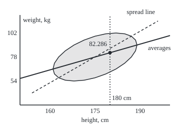
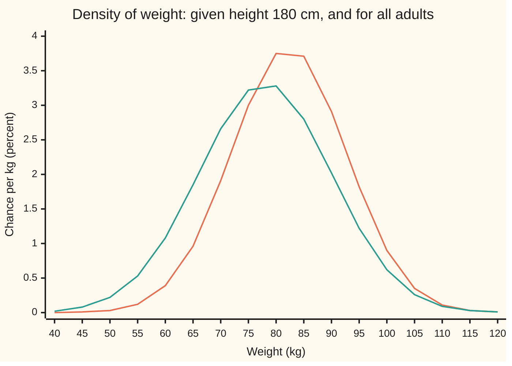

# Conditional densities: the slice of the surface at a known value

[Syllabus](../../../SYLLABUS.md) → [Probability and statistics](../../../SYLLABUS.md#w09) → [Transformations and Joint Laws](../../../SYLLABUS.md#w09-s05) → Conditional densities

---

## General Overview

A clinic weighs and measures adults. Height averages 175 cm with a typical spread of 7 cm. Weight averages 78 kg with a spread of 12 kg. Taller people tend to be heavier, and the correlation (the strength of that straight-line tendency, from −1 to 1) is 0.5. The pair follows the tilted bell of [Joint densities](02-joint-densities-and-marginals.md): a surface over the height–weight plane whose volume above any region is the chance of landing there.

A new patient walks in, 180 cm tall. What weight should the clinic expect, and how likely is over 90 kg? Among all adults, over 90 kg is about 1 in 6. At 180 cm it is about 23 percent, nearly 1 in 4. The expected weight is 82.3 kg.

The method: cut the surface with a vertical knife along the line "height = 180". The cut face is a curve over weight. Its shape says which weights are common at that height, but its area is 0.0442, not 1. Divide the curve by its own area and it becomes a proper density for weight: the **conditional density** of weight given height 180 cm. Its average, 82.3 kg, is the **conditional mean**. The patient is 5/7 of a height spread above average, yet the expected weight is only half as many weight spreads above average. That shortfall is **regression toward the mean**, and this card shows where it comes from.

**To learn about one quantity when the other is known exactly, take the slice of the joint density at the known value and rescale it to area 1; that rescaled slice is the law of the unknown quantity, and its average is the best single guess.**

**What kind of fact this is:** a definition, of the conditional density and the conditional mean; that the definition is the limit of ordinary conditioning on a thin band of heights, and that the slices average back to the whole law, are theorems proved on this card in Why it works.

### The picture: the tilted bell from above, and the line of averages

<p align="center"></p>

Drawn to scale from the `figure,` lines both checks print: 6 screen units per cm across, 2 per kg up. The shaded ring is the contour two spreads out, around most adults. The dotted vertical is the slice at 180 cm; the dot on it is the slice's mean, 82.286 kg. The solid line joins the slice means at every height, rising 6/7 kg per cm. The dashed line rises one weight spread (12 kg) per height spread (7 cm), twice as steeply. The solid line passes through the ring's leftmost and rightmost points, at 161 and 189 cm; the dashed one does not. The gap between the two lines is regression toward the mean.

---

## The formula

Notation first, in words. As on [Joint densities](02-joint-densities-and-marginals.md), $f(h, w)$ is the joint density, chance per cm per kg near height $h$ and weight $w$, and $f_H(h)$ is the density of height alone, the area of the surface's cross-section at $h$. A vertical bar inside a density reads "given", as in $P(A \mid B)$: $f_{W\mid H}(w \mid h)$ is read "the density of weight at $w$, given height $h$".

$$f_{W\mid H}(w \mid h) \;=\; \frac{f(h,w)}{f_H(h)}, \qquad f_H(h) \;=\; \int_{-\infty}^{\infty} f(h,w)\,dw$$

**Read it aloud:** the density of weight given height h is the slice of the joint density at h, divided by the slice's area.

The conditional mean is the ordinary average taken with that density:

$$E[W \mid H = h] \;=\; \int_{-\infty}^{\infty} w\, f_{W\mid H}(w \mid h)\,dw$$

**Read it aloud:** the average weight among adults of height h is each weight times its slice density, added up.

Chances come from areas under the rescaled slice. Over 90 kg at 180 cm:

$$P(W > 90 \mid H = 180) \;=\; \int_{90}^{\infty} f_{W\mid H}(w \mid 180)\,dw \;=\; 0.2290$$

The example's surface is the tilted bell of the previous card, with spreads $\sigma_H = 7$ cm and $\sigma_W = 12$ kg and correlation $\rho = 0.5$. With $z_h = (h - 175)/7$ and $z_w = (w - 78)/12$, each value measured in spreads from its centre,

$$f(h,w) \;=\; \frac{1}{2\pi\,\sigma_H\,\sigma_W\sqrt{1-\rho^2}}\;\exp\!\left(-\,\frac{z_h^2 - 2\rho\,z_h z_w + z_w^2}{2\,(1-\rho^2)}\right)$$

In words: the surface is highest at the centre and falls away in tilted rings; the $-2\rho\, z_h z_w$ term is the tilt, and it vanishes when $\rho = 0$.

| Symbol | Plain meaning | In our example | Push it up and the answer… |
| --- | --- | --- | --- |
| $H$, $W$ | an adult's height and weight, not yet measured | cm and kg | — |
| $h$, $w$, $t$ | particular heights and weights; $t$ is a height inside a band | 180 cm; 90 kg | a taller h moves the whole slice up in weight |
| $f$ | the joint density: chance per cm per kg | the tilted bell | — |
| $f_H$ | density of height alone: the slice's area | 0.044159 per cm at 180 cm | a larger area only rescales; the slice's shape decides the answer |
| $f_{W\mid H}$ | the rescaled slice: density of weight given height | a bell centred at 82.286 kg | — |
| $E[W \mid H = h]$ | average weight among adults of height h | 82.286 kg at 180 cm | rises 6/7 kg per cm of height |
| $\mu_H$, $\sigma_H$, $\mu_W$, $\sigma_W$ | centres and spreads of height and weight | 175 cm, 7 cm; 78 kg, 12 kg | a larger $\sigma_W$ widens every slice |
| $\rho$ | correlation of height and weight, from −1 to 1 | 0.5 | slice centre moves further from 78, slice narrows |
| $z_h$, $z_w$ | height and weight in spreads from their centres | $z_h$ = 5/7 at 180 cm | — |
| $\delta$ | width of the thin band of heights $B_\delta$, from 180 to 180 + δ cm | 2 cm in the simulation, which centres its band: 179 to 181 cm | a wider band blurs the slice |
| $t_\delta$, $s_\delta$ | heights inside the band given by the mean value theorem (Detailed proof) | between 180 and 180 + δ cm | — |
| $R$, $g_R$ | a range of weights; the slice's area over that range | over 90 kg | — |
| $\Phi$ | the standard bell's area to the left of a point | Φ(0.7423) | rises from 0 to 1 |

### When it holds

- **A joint density exists.** If all the chance sat on a line, with weight fixed exactly by height, there would be no surface to slice; the conditional law would be a single point, not a density.
- **The slice has positive area.** Where $f_H(h) = 0$ the division fails: no adult has that height, and no answer is defined there.
- **The density is continuous near the slice.** Then a thin band of heights around 180 behaves like the slice itself, which is what gives the definition its meaning (Step 2). Change the density along one line and every chance stays the same, yet that line's slice changes: slices are pinned down only where the density is continuous.
- **The condition is "height = 180", held through height.** Reach the same line through another quantity, such as (height − 180)/weight = 0, and the thin bands change shape; the answer moves from 82.286 kg to 83.598 kg (What breaks).
- **The mean exists.** The conditional mean needs the integral of $w$ times the slice to be finite; for the tilted bell it always is.

---

## Why it works

### Step 0: the idea — condition on a thin band, then shrink it

Height is continuous, so the chance that a patient is exactly 180.000… cm is zero. The rule $P(A \mid B) = P(A \text{ and } B)/P(B)$ from [Conditional probability](../01-Chance%20and%20Events/05-conditional-probability.md) divides by $P(B)$, and zero will not do. So take instead the band $B_\delta$: height between 180 and $180 + \delta$ cm. It has positive chance, so ordinary conditioning works. Then let the band shrink. Whatever the answer settles to is the conditional law at 180, and the formula is what it settles to.

### Step 1: the band's chance is the slice area times the width

The chance of the band is the volume under the surface over a strip $\delta$ cm wide. For a thin strip, that volume is the strip's width times the area of its cross-section:

$$P(B_\delta) \;=\; \int_{180}^{180+\delta} f_H(t)\,dt \;\approx\; \delta\, f_H(180)$$

For the clinic, $f_H(180) = 0.044159$ per cm, so a band 1 cm wide holds about 4.4 percent of adults.

### Step 2: the width cancels, the slice's shape survives

Now ask for the band's adults with weight in some range $R$, say over 90 kg. The same thin-strip reasoning gives

$$P(W \in R \text{ and } B_\delta) \;\approx\; \delta \int_R f(180, w)\,dw$$

Divide one by the other. The width $\delta$ appears on top and bottom and cancels:

$$P(W \in R \mid B_\delta) \;\approx\; \frac{\int_R f(180,w)\,dw}{f_H(180)} \;=\; \int_R f_{W\mid H}(w \mid 180)\,dw$$

The approximation becomes exact as $\delta$ shrinks to 0. So the slice divided by its area gives, as area, the chance of every weight range given height 180. That is exactly what a density for weight must do.

<details>
<summary>Detailed proof</summary>

Assume $f$ is continuous near the line $h = 180$, that $f_H(180) > 0$, and that near that line $f(t, w)$ stays below one integrable function of $w$ (true for the tilted bell). For a weight range $R$ put $g_R(t) = \int_R f(t, w)\,dw$, the area of the part of the slice at height $t$ that lies over $R$. The bound lets continuity pass through the integral, so $g_R$ is continuous at 180. For the tilted bell no bound is needed: by Step 3, $g_R(t)$ is the height bell at t times a difference of Φ values whose arguments move in step with t, so it is continuous on sight. For a general surface this step is the dominated convergence theorem, proved with measure in wing 10 on [Dominated convergence](../../10-Measure%20and%20integration/05-Swapping%20Limits%20and%20Integrals/02-dominated-convergence-theorem.md).

The chance of weight in $R$ and height in $[180, 180+\delta]$ is a double integral, done height last:
$$P(W \in R,\ 180 \le H \le 180+\delta) = \int_{180}^{180+\delta} g_R(t)\,dt.$$
By the mean value theorem for integrals there is a height $t_\delta$ in the band with $\int_{180}^{180+\delta} g_R(t)\,dt = \delta\, g_R(t_\delta)$. Take $R$ to be every weight and the same step gives $P(B_\delta) = \delta\, f_H(s_\delta)$ for some $s_\delta$ in the band. Divide:
$$P(W \in R \mid B_\delta) = \frac{g_R(t_\delta)}{f_H(s_\delta)}.$$
As $\delta \to 0$, both $t_\delta$ and $s_\delta$ are squeezed to 180. Continuity gives the limit $g_R(180)/f_H(180) = \int_R f_{W\mid H}(w \mid 180)\,dw$. A band below 180, or one centred on it, gives the same limit by the same steps.

The rescaled slice is a density: it is never negative, and its total is $f_H(180)/f_H(180) = 1$.

</details>

### Step 3: the slice at 180 cm is a bell centred at 82.3 kg

At 180 cm, $z_h = 5/7$. Complete the square in $z_w$ inside the exponent:

$$\frac{z_h^2 - 2\rho\, z_h z_w + z_w^2}{1 - \rho^2} \;=\; \frac{(z_w - \rho\, z_h)^2}{1 - \rho^2} \;+\; z_h^2$$

The $z_h^2$ gives a factor $e^{-z_h^2/2}$ that does not depend on weight. It belongs to the slice's area, and dividing by the area removes it: $f_H(180) = e^{-z_h^2/2}/(7\sqrt{2\pi}) = 0.044159$ per cm, the height bell at 180 cm. What is left is a bell in $z_w$ centred at $\rho\, z_h = 0.5 \times 5/7$ with spread $\sqrt{1 - \rho^2} = \sqrt{0.75}$. Back in kilograms:

- centre $78 + 12 \times 0.5 \times 5/7 = 82.2857$ kg;
- spread $12 \times \sqrt{0.75} = 10.3923$ kg.

So weight given height 180 cm is a bell centred at 82.3 kg with spread 10.39 kg: higher than the overall 78, narrower than the overall 12. Knowing the height moved the guess and removed some of the uncertainty.

### Step 4: the line of averages, and why it is shallower

The same completed square works at any height: the slice at $z_h$ spreads is a bell centred at $\rho\, z_h$ spreads. In kilograms the conditional mean is $78 + (6/7)(h - 175)$. The checks confirm it by slicing at 161, 168, 175, 180, 182 and 189 cm. The general version, for any tilted bell and any number of variables, is on [Bivariate normal](05-bivariate-normal-and-conditioning.md).

Why only half as many spreads? Think of each adult's weight, in spreads, as two parts: a part that goes with height, half the height's spread count, and a part that goes with everything else (build, diet, muscle) and averages zero at every height. Fixing the height fixes the first part. The second part still averages zero. So the slice's mean sits half as far out as the height does. That is **regression toward the mean**: the best guess for one quantity sits closer to its average, counted in spreads, than the known quantity sits to its own.

It runs both ways. Slice at weight 90 kg, one spread up, and the average height is 178.5 cm, half a spread up, not 182. There is no force pulling people toward the middle. A correlation below 1 means the known value explains only part of the other, and the unexplained part averages out.

### Step 5: the slices put back together give the whole

Rearrange the definition: $f(h,w) = f_H(h)\, f_{W\mid H}(w \mid h)$. The joint density is the height density times the weight-given-height density, the continuous copy of "chance of A and B = chance of B times chance of A given B". Integrate over heights and the overall weight density returns:

$$f_W(w) \;=\; \int f_{W\mid H}(w \mid h)\, f_H(h)\,dh$$

Multiply by $w$ and integrate over weights as well. Swapping the order of the double integral gives the tower rule of [Conditional expectation](../02-Random%20Variables/05-conditional-expectation-in-tables.md), with integrals in place of sums:

$$\int E[W \mid H = h]\, f_H(h)\,dh \;=\; \int\!\!\int w\, f(h,w)\,dw\,dh \;=\; E[W]$$

The slice means, weighted by how common each height is, give back 78 kg. The checks do both integrals: 78.0000 kg, and $f_W(90) = 0.020164$ per kg, matching the weight bell.

### The other road: a band of simulated adults

Step 0 can be run literally. Draw adults from the joint density by rejection sampling (propose a point uniformly in a box, keep it with chance proportional to the surface's height there). Keep the 17,918 whose height lies within 1 cm of 180, and average their weights. The band gives 82.206 kg with a standard error of 0.078 kg, about one standard error from 82.286. No slice formula is used, only the surface's height at each proposed point.

---

## Worked numbers, by hand

Height 180 cm; the tilted bell with centres 175 cm and 78 kg, spreads 7 cm and 12 kg, correlation 0.5.

| Step | Arithmetic | Value |
| --- | --- | --- |
| height in spreads, $z_h$ | (180 − 175) / 7 | 5/7 |
| slice area, $f_H(180)$ | $e^{-z_h^2/2} / (7\sqrt{2\pi})$ | 0.044159 per cm |
| slice centre in spreads | $\rho\, z_h = 0.5 \times 5/7$ | half of $z_h$ |
| slice centre in kg | 78 + 12 × 0.5 × 5/7 | 82.2857 kg |
| slice spread | $12\sqrt{1 - 0.25}$ | 10.3923 kg |
| 90 kg in slice spreads | (90 − 82.2857) / 10.3923 | 0.7423 |
| over 90 kg at 180 cm | $1 - \Phi(0.7423)$ | **0.2290** |
| over 90 kg, all adults | $1 - \Phi(1)$ | 0.1587 |

About 23 percent of adults at 180 cm weigh over 90 kg, against about 16 percent of all adults. The expected weight at 180 cm is 82.3 kg.

### What breaks if you drop a piece

| Mistake | Comes out at | What went wrong |
| --- | --- | --- |
| Slice used without dividing by its area | P(W > 90) = 0.0101, not 0.2290 | the slice's area is 0.044159, not 1; it is not yet a density |
| Height ignored | 0.1587, not 0.2290 | the overall weight law, as if height told nothing |
| Weight assumed as many spreads up as height | 86.571 kg, not 82.286 | the spread line: true only when the correlation is 1 |
| Line of averages run backwards from 90 kg | 189.0 cm, not 178.500 | height given weight has its own, different line |
| The line H = 180 reached through bands in (H − 180)/W | 83.598 kg, not 82.286 | those bands are wider for heavier people, so they over-count them |

The last row is the Borel paradox, after Émile Borel, who met it on a sphere. The event "(H − 180)/W = 0" is the same line as "H = 180", yet its thin bands, $\lvert H - 180\rvert < 0.01\,W$, are wider where weight is larger. Each weight then counts in proportion to $w$ times the slice, and the mean climbs to 83.598 kg; the simulated band gives 83.534 kg, standard error 0.084. A conditional density depends on the quantity held fixed, not only on the line where it is fixed.

---

## Code, from first principles, and it actually runs

Each script builds the tilted bell, then reaches the weight law at 180 cm by three independent roads: Simpson's rule on the slice and its area; the completed square, with the bell's area from a power series for $\Phi$; and 3,000,000 proposals of rejection sampling from a SplitMix64 generator (seed 20260928), keeping a band 2 cm wide. It then slices at six heights to show the line of averages, slices the other way at 90 kg, averages the slices back to the whole, and prints every number in the what-breaks table, the chart and the figure. Twelve asserts compare independent roads; a simulated number is allowed four standard errors.

### Python

```python
# Conditional densities -- the check behind the card.  Standard library only.
# Height H (cm) and weight W (kg): the tilted bell, centres 175 cm and 78 kg,
# spreads 7 cm and 12 kg, correlation 0.5.  Weight at 180 cm three ways: slice
# and divide by the slice's area (Simpson), complete the square, and simulated
# adults within 1 cm of 180.  Phi is a series; draws come from SplitMix64.
from math import exp, sqrt, pi, cos, sin

MH, SH, MW, SW, RHO = 175.0, 7.0, 78.0, 12.0, 0.5

def joint(h, w, rho=RHO):                        # the tilted bell, per cm per kg
    a, b = (h - MH) / SH, (w - MW) / SW
    q = (a * a - 2 * rho * a * b + b * b) / (1 - rho * rho)
    return exp(-q / 2) / (2 * pi * SH * SW * sqrt(1 - rho * rho))

def simpson(g, lo, hi, n=800):                   # Simpson's rule, n even
    step = (hi - lo) / n
    s = g(lo) + g(hi) + sum((4 if i % 2 else 2) * g(lo + i * step) for i in range(1, n))
    return s * step / 3

WLO, WHI, HLO, HHI = MW - 8 * SW, MW + 8 * SW, MH - 8 * SH, MH + 8 * SH
def slice_area(h, rho=RHO): return simpson(lambda w: joint(h, w, rho), WLO, WHI)
def cond(w, h): return joint(h, w) / slice_area(h)
def cond_mean(h, rho=RHO):
    return simpson(lambda w: w * joint(h, w, rho), WLO, WHI) / slice_area(h, rho)
def cond_sd(h, rho=RHO):
    m = cond_mean(h, rho)
    return sqrt(simpson(lambda w: (w - m) ** 2 * joint(h, w, rho), WLO, WHI) / slice_area(h, rho))
def cond_tail(t, h): return simpson(lambda w: joint(h, w), t, WHI) / slice_area(h)

def Phi(z):                                      # standard normal area left of z, by series
    term, total = z, z
    for n in range(1, 200):
        term *= -z * z / (2 * n)
        total += term / (2 * n + 1)
    return 0.5 + total / sqrt(2 * pi)

MASK = (1 << 64) - 1
state = 20260928                                 # SplitMix64, seed 20260928
def uniform():
    global state
    state = (state + 0x9E3779B97F4A7C15) & MASK
    z = state
    z = ((z ^ (z >> 30)) * 0xBF58476D1CE4E5B9) & MASK
    z = ((z ^ (z >> 27)) * 0x94D049BB133111EB) & MASK
    return (((z ^ (z >> 31)) >> 11) + 0.5) / 2.0 ** 53

H0, T90 = 180.0, 90.0
print("road 1: slice the joint density at 180 cm, divide by the slice's area")
area = slice_area(H0)
m1, s1, p1 = cond_mean(H0), cond_sd(H0), cond_tail(T90, H0)
print(f"slice area f_H(180)            {area:.6f} per cm")
print(f"conditional mean, sd            {m1:.4f} kg  {s1:.4f} kg")
print(f"P(W > 90 | H = 180)             {p1:.4f}")
print("road 2: complete the square at a = 5/7 (180 cm is 5/7 of a spread up)")
a0 = (H0 - MH) / SH
m2, s2 = MW + SW * RHO * a0, SW * sqrt(1 - RHO * RHO)
area2 = exp(-a0 * a0 / 2) / (sqrt(2 * pi) * SH)
p2 = 1 - Phi((T90 - m2) / s2)
print(f"slice area exp(-a^2/2)/(7 sqrt(2 pi)) {area2:.6f} per cm")
print(f"centre 78 + 12(0.5)(5/7), spread 12 sqrt(0.75) {m2:.4f} kg  {s2:.4f} kg")
print(f"P(W > 90 | H = 180) = 1 - Phi(z)  {p2:.4f}  (z = {(T90 - m2) / s2:.4f})")
print(f"all adults: P(W > 90) = 1 - Phi(1)  {1 - Phi((T90 - MW) / SW):.4f}")

print("road 3: rejection sampling from the joint density, then keep a band")
N = 3_000_000
acc = sw = sw2 = 0.0
band = [0, 0.0, 0.0, 0]                          # |H - 180| < 1: count, sum w, sum w^2, w > 90
rev = [0, 0.0, 0.0]                              # |W - 90| < 1.2: count, sum h, sum h^2
odd = [0, 0.0, 0.0]                              # |(H - 180)/W| < 0.01: count, sum w, sum w^2
for _ in range(N):
    a, b = -4.5 + 9 * uniform(), -4.5 + 9 * uniform()
    q = (a * a - 2 * RHO * a * b + b * b) / (1 - RHO * RHO)
    if uniform() >= exp(-q / 2):
        continue
    h, w = MH + SH * a, MW + SW * b
    acc += 1; sw += w; sw2 += w * w
    if abs(h - H0) < 1:
        band[0] += 1; band[1] += w; band[2] += w * w; band[3] += w > T90
    if abs(w - T90) < 1.2:
        rev[0] += 1; rev[1] += h; rev[2] += h * h
    if abs((h - H0) / w) < 0.01:
        odd[0] += 1; odd[1] += w; odd[2] += w * w
def mean_se(n, s, s2):
    m = s / n
    return m, sqrt((s2 / n - m * m) / n)
m3, se3 = mean_se(band[0], band[1], band[2])
p3 = band[3] / band[0]
mall, seall = mean_se(acc, sw, sw2)
m5, se5 = mean_se(rev[0], rev[1], rev[2])
print(f"accepted {int(acc)} of {N}; mean weight {mall:.3f} kg, se {seall:.3f}")
print(f"band 179-181 cm: {band[0]} adults, mean {m3:.3f} kg, se {se3:.3f}")
print(f"band 179-181 cm: share over 90 kg {p3:.4f}, se {sqrt(p3 * (1 - p3) / band[0]):.4f}")

print("regression toward the mean: E[W | H = h] by slicing, and the sd line")
for h in (161.0, 168.0, 175.0, 180.0, 182.0, 189.0):
    print(f"h = {h:.0f}: slice mean {cond_mean(h):.3f} kg; line 78+(6/7)(h-175) {MW + 6 / 7 * (h - MH):.3f}; sd line {MW + 12 / 7 * (h - MH):.3f}")
rev_int = simpson(lambda h: h * joint(h, T90), HLO, HHI) / simpson(lambda h: joint(h, T90), HLO, HHI)
print(f"reverse: E[H | W = 90] by slicing {rev_int:.3f} cm; band 88.8-91.2 kg {m5:.3f} cm, se {se5:.3f}, n {rev[0]}")
tower = simpson(lambda h: cond_mean(h) * slice_area(h), HLO, HHI, 200)
back90 = simpson(lambda h: cond(T90, h) * slice_area(h), HLO, HHI, 200)
print(f"average of slice means, weighted by f_H: {tower:.4f} kg (overall 78)")
print(f"f_W(90) rebuilt from slices {back90:.6f}; bell exp(-1/2)/(12 sqrt(2 pi)) {exp(-0.5) / (12 * sqrt(2 * pi)):.6f}")

print("what breaks")
print(f"slice not divided: P(W > 90) read as {simpson(lambda w: joint(H0, w), T90, WHI):.4f}")
print(f"sd line at 180 cm: {MW + 12 / 7 * (H0 - MH):.3f} kg; line inverted at 90 kg: {MH + (T90 - MW) * 7 / 6:.1f} cm")
odd_int = simpson(lambda w: w * w * joint(H0, w), WLO, WHI) / simpson(lambda w: w * joint(H0, w), WLO, WHI)
m4, se4 = mean_se(odd[0], odd[1], odd[2])
print(f"band in (H-180)/W: mean {odd_int:.3f} kg by integral; simulated {m4:.3f}, se {se4:.3f}, n {odd[0]}")
print("try changing")
print(f"rho = 0: mean {cond_mean(H0, 0.0):.3f}, sd {cond_sd(H0, 0.0):.3f}; rho = 0.9: mean {cond_mean(H0, 0.9):.3f}, sd {cond_sd(H0, 0.9):.3f}")

print("chart, weight kg          " + " ".join(f"{w:5.0f}" for w in range(40, 121, 5)))
print("chart, at 180 cm, %/kg    " + " ".join(f"{100 * cond(w, H0):5.2f}" for w in range(40, 121, 5)))
print("chart, all adults, %/kg   " + " ".join(f"{100 * simpson(lambda h: joint(h, w), HLO, HHI):5.2f}" for w in range(40, 121, 5)))
X = lambda h: 40 + 6 * (h - 150)                 # screen x: 150-200 cm -> 40-340
Y = lambda w: 210 - 2 * (w - 30)                 # screen y: 30-120 kg -> 210-30
ell = []
for k in range(24):
    t = 2 * pi * k / 24
    c, s = 2 * cos(t), 2 * sin(t)
    ell.append(f"{X(MH + SH * c):.1f},{Y(MW + SW * (RHO * c + sqrt(1 - RHO * RHO) * s)):.1f}")
print("figure, scale 6 per cm across, 2 per kg up")
print("figure, 2-sd contour " + " ".join(ell))
L1, L2 = lambda h: MW + 6 / 7 * (h - MH), lambda h: MW + 12 / 7 * (h - MH)
print(f"figure, mean line {X(150):.0f},{Y(L1(150)):.1f} {X(200):.0f},{Y(L1(200)):.1f}; sd line {X(154):.0f},{Y(L2(154)):.1f} {X(196):.0f},{Y(L2(196)):.1f}; slice x {X(H0):.0f}; dot y {Y(m1):.1f}")

assert abs(m1 - m2) < 1e-6, "slice mean vs completing the square"
assert abs(s1 - s2) < 1e-6, "slice spread vs completing the square"
assert abs(area - area2) < 1e-9, "slice area vs the height bell"
assert abs(p1 - p2) < 1e-6, "tail by integration vs by the Phi series"
assert abs(m3 - m1) < 4 * se3, "simulated band mean within 4 se"
assert abs(tower - MW) < 1e-6, "averaging slice means gives back 78"
assert abs(back90 - exp(-0.5) / (12 * sqrt(2 * pi))) < 1e-9, "slices rebuild f_W(90)"
assert all(abs(cond_mean(h) - MW - 6 / 7 * (h - MH)) < 1e-6 for h in (161.0, 189.0)), "line of averages"
assert abs(m5 - rev_int) < 4 * se5, "reverse band within 4 se"
assert abs(p3 - p1) < 4 * sqrt(p1 * (1 - p1) / band[0]), "band share over 90 kg within 4 se"
assert abs(m4 - odd_int) < 4 * se4, "the other band: simulation vs integral"
assert odd_int - m1 > 1, "the other band really moves the answer"
print("ALL CHECKS PASS")
```

**Ran 2026-09-28 on macOS, Python 3.14.6, standard library only. All checks passed. Output, pasted from the run:**

```
road 1: slice the joint density at 180 cm, divide by the slice's area
slice area f_H(180)            0.044159 per cm
conditional mean, sd            82.2857 kg  10.3923 kg
P(W > 90 | H = 180)             0.2290
road 2: complete the square at a = 5/7 (180 cm is 5/7 of a spread up)
slice area exp(-a^2/2)/(7 sqrt(2 pi)) 0.044159 per cm
centre 78 + 12(0.5)(5/7), spread 12 sqrt(0.75) 82.2857 kg  10.3923 kg
P(W > 90 | H = 180) = 1 - Phi(z)  0.2290  (z = 0.7423)
all adults: P(W > 90) = 1 - Phi(1)  0.1587
road 3: rejection sampling from the joint density, then keep a band
accepted 201346 of 3000000; mean weight 77.986 kg, se 0.027
band 179-181 cm: 17918 adults, mean 82.206 kg, se 0.078
band 179-181 cm: share over 90 kg 0.2273, se 0.0031
regression toward the mean: E[W | H = h] by slicing, and the sd line
h = 161: slice mean 66.000 kg; line 78+(6/7)(h-175) 66.000; sd line 54.000
h = 168: slice mean 72.000 kg; line 78+(6/7)(h-175) 72.000; sd line 66.000
h = 175: slice mean 78.000 kg; line 78+(6/7)(h-175) 78.000; sd line 78.000
h = 180: slice mean 82.286 kg; line 78+(6/7)(h-175) 82.286; sd line 86.571
h = 182: slice mean 84.000 kg; line 78+(6/7)(h-175) 84.000; sd line 90.000
h = 189: slice mean 90.000 kg; line 78+(6/7)(h-175) 90.000; sd line 102.000
reverse: E[H | W = 90] by slicing 178.500 cm; band 88.8-91.2 kg 178.461 cm, se 0.061, n 9719
average of slice means, weighted by f_H: 78.0000 kg (overall 78)
f_W(90) rebuilt from slices 0.020164; bell exp(-1/2)/(12 sqrt(2 pi)) 0.020164
what breaks
slice not divided: P(W > 90) read as 0.0101
sd line at 180 cm: 86.571 kg; line inverted at 90 kg: 189.0 cm
band in (H-180)/W: mean 83.598 kg by integral; simulated 83.534, se 0.084, n 14843
try changing
rho = 0: mean 78.000, sd 12.000; rho = 0.9: mean 85.714, sd 5.231
chart, weight kg             40    45    50    55    60    65    70    75    80    85    90    95   100   105   110   115   120
chart, at 180 cm, %/kg     0.00  0.01  0.03  0.12  0.39  0.96  1.91  3.00  3.75  3.71  2.91  1.82  0.90  0.35  0.11  0.03  0.01
chart, all adults, %/kg    0.02  0.08  0.22  0.53  1.08  1.85  2.66  3.22  3.28  2.80  2.02  1.22  0.62  0.26  0.09  0.03  0.01
figure, scale 6 per cm across, 2 per kg up
figure, 2-sd contour 274.0,90.0 271.1,80.1 262.7,72.4 249.4,67.6 232.0,66.0 211.7,67.6 190.0,72.4 168.3,80.1 148.0,90.0 130.6,101.6 117.3,114.0 108.9,126.4 106.0,138.0 108.9,147.9 117.3,155.6 130.6,160.4 148.0,162.0 168.3,160.4 190.0,155.6 211.7,147.9 232.0,138.0 249.4,126.4 262.7,114.0 271.1,101.6
figure, mean line 40,156.9 340,71.1; sd line 64,186.0 316,42.0; slice x 220; dot y 105.4
ALL CHECKS PASS
```

Roads 1 and 2 agree to every printed digit. The band gives 82.206 kg against 82.2857, and a share over 90 kg of 0.2273 against 0.2290, each about one standard error off. The sampler kept 201346 of 3000000 proposals; their mean weight, 77.986 kg with standard error 0.027, sits on the overall 78. The reverse band, adults near 90 kg, averages 178.461 cm (standard error 0.061) against 178.500 by slicing.

### Rust

The same program in Rust, std only. The generator is the same SplitMix64 with the same seed, so the simulated adults are the same adults, and the output is identical line for line.

```rust
// Conditional densities -- the same check as conditional_densities_check.py, in Rust.
// Standard library only, no crates.  Height H (cm) and weight W (kg) follow the
// tilted bell: centres 175 cm and 78 kg, spreads 7 cm and 12 kg, correlation 0.5.
// Three roads to the weight law at 180 cm: slice and divide (Simpson), complete
// the square, and a band of simulated adults (SplitMix64, rejection sampling).
use std::f64::consts::PI;

const MH: f64 = 175.0;
const SH: f64 = 7.0;
const MW: f64 = 78.0;
const SW: f64 = 12.0;
const RHO: f64 = 0.5;
const WLO: f64 = MW - 8.0 * SW;
const WHI: f64 = MW + 8.0 * SW;
const HLO: f64 = MH - 8.0 * SH;
const HHI: f64 = MH + 8.0 * SH;

fn joint(h: f64, w: f64, rho: f64) -> f64 {           // the tilted bell, per cm per kg
    let (a, b) = ((h - MH) / SH, (w - MW) / SW);
    let q = (a * a - 2.0 * rho * a * b + b * b) / (1.0 - rho * rho);
    (-q / 2.0).exp() / (2.0 * PI * SH * SW * (1.0 - rho * rho).sqrt())
}

fn simpson<F: Fn(f64) -> f64>(g: F, lo: f64, hi: f64, n: usize) -> f64 {
    let step = (hi - lo) / n as f64;
    let mut acc = 0.0;
    for i in 1..n {
        acc += (if i % 2 == 1 { 4.0 } else { 2.0 }) * g(lo + i as f64 * step);
    }
    (g(lo) + g(hi) + acc) * step / 3.0
}

fn slice_area(h: f64, rho: f64) -> f64 { simpson(|w| joint(h, w, rho), WLO, WHI, 800) }
fn cond(w: f64, h: f64) -> f64 { joint(h, w, RHO) / slice_area(h, RHO) }
fn cond_mean(h: f64, rho: f64) -> f64 {
    simpson(|w| w * joint(h, w, rho), WLO, WHI, 800) / slice_area(h, rho)
}
fn cond_sd(h: f64, rho: f64) -> f64 {
    let m = cond_mean(h, rho);
    (simpson(|w| (w - m).powi(2) * joint(h, w, rho), WLO, WHI, 800) / slice_area(h, rho)).sqrt()
}
fn cond_tail(t: f64, h: f64) -> f64 { simpson(|w| joint(h, w, RHO), t, WHI, 800) / slice_area(h, RHO) }

fn phi_cdf(z: f64) -> f64 {                            // standard normal area left of z, by series
    let (mut term, mut total) = (z, z);
    for n in 1..200 {
        term *= -z * z / (2.0 * n as f64);
        total += term / (2.0 * n as f64 + 1.0);
    }
    0.5 + total / (2.0 * PI).sqrt()
}

struct SplitMix(u64);
impl SplitMix {
    fn uniform(&mut self) -> f64 {
        self.0 = self.0.wrapping_add(0x9E3779B97F4A7C15);
        let mut z = self.0;
        z = (z ^ (z >> 30)).wrapping_mul(0xBF58476D1CE4E5B9);
        z = (z ^ (z >> 27)).wrapping_mul(0x94D049BB133111EB);
        (((z ^ (z >> 31)) >> 11) as f64 + 0.5) / 9007199254740992.0
    }
}

fn mean_se(n: f64, s: f64, s2: f64) -> (f64, f64) {
    let m = s / n;
    (m, ((s2 / n - m * m) / n).sqrt())
}

fn main() {
    let (h0, t90) = (180.0, 90.0);
    println!("road 1: slice the joint density at 180 cm, divide by the slice's area");
    let area = slice_area(h0, RHO);
    let (m1, s1, p1) = (cond_mean(h0, RHO), cond_sd(h0, RHO), cond_tail(t90, h0));
    println!("slice area f_H(180)            {:.6} per cm", area);
    println!("conditional mean, sd            {:.4} kg  {:.4} kg", m1, s1);
    println!("P(W > 90 | H = 180)             {:.4}", p1);
    println!("road 2: complete the square at a = 5/7 (180 cm is 5/7 of a spread up)");
    let a0 = (h0 - MH) / SH;
    let (m2, s2) = (MW + SW * RHO * a0, SW * (1.0 - RHO * RHO).sqrt());
    let area2 = (-a0 * a0 / 2.0).exp() / ((2.0 * PI).sqrt() * SH);
    let p2 = 1.0 - phi_cdf((t90 - m2) / s2);
    println!("slice area exp(-a^2/2)/(7 sqrt(2 pi)) {:.6} per cm", area2);
    println!("centre 78 + 12(0.5)(5/7), spread 12 sqrt(0.75) {:.4} kg  {:.4} kg", m2, s2);
    println!("P(W > 90 | H = 180) = 1 - Phi(z)  {:.4}  (z = {:.4})", p2, (t90 - m2) / s2);
    println!("all adults: P(W > 90) = 1 - Phi(1)  {:.4}", 1.0 - phi_cdf((t90 - MW) / SW));

    println!("road 3: rejection sampling from the joint density, then keep a band");
    let n = 3_000_000;
    let mut rng = SplitMix(20260928);
    let (mut acc, mut sw, mut sw2) = (0.0, 0.0, 0.0);
    let mut band = [0.0f64; 4];                       // |H - 180| < 1: count, sum w, sum w^2, w > 90
    let mut rev = [0.0f64; 3];                        // |W - 90| < 1.2: count, sum h, sum h^2
    let mut odd = [0.0f64; 3];                        // |(H - 180)/W| < 0.01: count, sum w, sum w^2
    for _ in 0..n {
        let a = -4.5 + 9.0 * rng.uniform();
        let b = -4.5 + 9.0 * rng.uniform();
        let q = (a * a - 2.0 * RHO * a * b + b * b) / (1.0 - RHO * RHO);
        if rng.uniform() >= (-q / 2.0).exp() { continue; }
        let (h, w) = (MH + SH * a, MW + SW * b);
        acc += 1.0; sw += w; sw2 += w * w;
        if (h - h0).abs() < 1.0 {
            band[0] += 1.0; band[1] += w; band[2] += w * w;
            if w > t90 { band[3] += 1.0; }
        }
        if (w - t90).abs() < 1.2 { rev[0] += 1.0; rev[1] += h; rev[2] += h * h; }
        if ((h - h0) / w).abs() < 0.01 { odd[0] += 1.0; odd[1] += w; odd[2] += w * w; }
    }
    let (m3, se3) = mean_se(band[0], band[1], band[2]);
    let p3 = band[3] / band[0];
    let ((mall, seall), (m5, se5)) = (mean_se(acc, sw, sw2), mean_se(rev[0], rev[1], rev[2]));
    println!("accepted {} of {}; mean weight {:.3} kg, se {:.3}", acc as u64, n, mall, seall);
    println!("band 179-181 cm: {} adults, mean {:.3} kg, se {:.3}", band[0] as u64, m3, se3);
    println!("band 179-181 cm: share over 90 kg {:.4}, se {:.4}", p3, (p3 * (1.0 - p3) / band[0]).sqrt());

    println!("regression toward the mean: E[W | H = h] by slicing, and the sd line");
    for h in [161.0, 168.0, 175.0, 180.0, 182.0, 189.0] {
        println!("h = {:.0}: slice mean {:.3} kg; line 78+(6/7)(h-175) {:.3}; sd line {:.3}",
                 h, cond_mean(h, RHO), MW + 6.0 / 7.0 * (h - MH), MW + 12.0 / 7.0 * (h - MH));
    }
    let rev_int = simpson(|h| h * joint(h, t90, RHO), HLO, HHI, 800) / simpson(|h| joint(h, t90, RHO), HLO, HHI, 800);
    println!("reverse: E[H | W = 90] by slicing {:.3} cm; band 88.8-91.2 kg {:.3} cm, se {:.3}, n {}", rev_int, m5, se5, rev[0] as u64);
    let tower = simpson(|h| cond_mean(h, RHO) * slice_area(h, RHO), HLO, HHI, 200);
    let back90 = simpson(|h| cond(t90, h) * slice_area(h, RHO), HLO, HHI, 200);
    println!("average of slice means, weighted by f_H: {:.4} kg (overall 78)", tower);
    println!("f_W(90) rebuilt from slices {:.6}; bell exp(-1/2)/(12 sqrt(2 pi)) {:.6}", back90, (-0.5f64).exp() / (12.0 * (2.0 * PI).sqrt()));

    println!("what breaks");
    println!("slice not divided: P(W > 90) read as {:.4}", simpson(|w| joint(h0, w, RHO), t90, WHI, 800));
    println!("sd line at 180 cm: {:.3} kg; line inverted at 90 kg: {:.1} cm", MW + 12.0 / 7.0 * (h0 - MH), MH + (t90 - MW) * 7.0 / 6.0);
    let odd_int = simpson(|w| w * w * joint(h0, w, RHO), WLO, WHI, 800) / simpson(|w| w * joint(h0, w, RHO), WLO, WHI, 800);
    let (m4, se4) = mean_se(odd[0], odd[1], odd[2]);
    println!("band in (H-180)/W: mean {:.3} kg by integral; simulated {:.3}, se {:.3}, n {}", odd_int, m4, se4, odd[0] as u64);
    println!("try changing");
    println!("rho = 0: mean {:.3}, sd {:.3}; rho = 0.9: mean {:.3}, sd {:.3}",
             cond_mean(h0, 0.0), cond_sd(h0, 0.0), cond_mean(h0, 0.9), cond_sd(h0, 0.9));

    let ws: Vec<f64> = (0..17).map(|k| 40.0 + 5.0 * k as f64).collect();
    let row = |v: Vec<String>| v.join(" ");
    println!("chart, weight kg          {}", row(ws.iter().map(|w| format!("{:5.0}", w)).collect()));
    println!("chart, at 180 cm, %/kg    {}", row(ws.iter().map(|&w| format!("{:5.2}", 100.0 * cond(w, h0))).collect()));
    println!("chart, all adults, %/kg   {}", row(ws.iter().map(|&w| format!("{:5.2}", 100.0 * simpson(|h| joint(h, w, RHO), HLO, HHI, 800))).collect()));
    let x = |h: f64| 40.0 + 6.0 * (h - 150.0);           // screen x: 150-200 cm -> 40-340
    let y = |w: f64| 210.0 - 2.0 * (w - 30.0);           // screen y: 30-120 kg -> 210-30
    let ell: Vec<String> = (0..24).map(|k| {
        let t = 2.0 * PI * k as f64 / 24.0;
        let (c, s) = (2.0 * t.cos(), 2.0 * t.sin());
        format!("{:.1},{:.1}", x(MH + SH * c), y(MW + SW * (RHO * c + (1.0 - RHO * RHO).sqrt() * s)))
    }).collect();
    println!("figure, scale 6 per cm across, 2 per kg up");
    println!("figure, 2-sd contour {}", row(ell));
    let l1 = |h: f64| MW + 6.0 / 7.0 * (h - MH);
    let l2 = |h: f64| MW + 12.0 / 7.0 * (h - MH);
    println!("figure, mean line {:.0},{:.1} {:.0},{:.1}; sd line {:.0},{:.1} {:.0},{:.1}; slice x {:.0}; dot y {:.1}",
             x(150.0), y(l1(150.0)), x(200.0), y(l1(200.0)), x(154.0), y(l2(154.0)), x(196.0), y(l2(196.0)), x(h0), y(m1));

    assert!((m1 - m2).abs() < 1e-6, "slice mean vs completing the square");
    assert!((s1 - s2).abs() < 1e-6, "slice spread vs completing the square");
    assert!((area - area2).abs() < 1e-9, "slice area vs the height bell");
    assert!((p1 - p2).abs() < 1e-6, "tail by integration vs by the Phi series");
    assert!((m3 - m1).abs() < 4.0 * se3, "simulated band mean within 4 se");
    assert!((tower - MW).abs() < 1e-6, "averaging slice means gives back 78");
    assert!((back90 - (-0.5f64).exp() / (12.0 * (2.0 * PI).sqrt())).abs() < 1e-9, "slices rebuild f_W(90)");
    assert!([161.0, 189.0].iter().all(|&h| (cond_mean(h, RHO) - MW - 6.0 / 7.0 * (h - MH)).abs() < 1e-6), "line of averages");
    assert!((m5 - rev_int).abs() < 4.0 * se5, "reverse band within 4 se");
    assert!((p3 - p1).abs() < 4.0 * (p1 * (1.0 - p1) / band[0]).sqrt(), "band share over 90 kg within 4 se");
    assert!((m4 - odd_int).abs() < 4.0 * se4, "the other band: simulation vs integral");
    assert!(odd_int - m1 > 1.0, "the other band really moves the answer");
    println!("ALL CHECKS PASS");
}
```

**Ran 2026-09-28 on macOS, rustc 1.98.1, no crates. All checks passed. Output, pasted from the run:**

```
road 1: slice the joint density at 180 cm, divide by the slice's area
slice area f_H(180)            0.044159 per cm
conditional mean, sd            82.2857 kg  10.3923 kg
P(W > 90 | H = 180)             0.2290
road 2: complete the square at a = 5/7 (180 cm is 5/7 of a spread up)
slice area exp(-a^2/2)/(7 sqrt(2 pi)) 0.044159 per cm
centre 78 + 12(0.5)(5/7), spread 12 sqrt(0.75) 82.2857 kg  10.3923 kg
P(W > 90 | H = 180) = 1 - Phi(z)  0.2290  (z = 0.7423)
all adults: P(W > 90) = 1 - Phi(1)  0.1587
road 3: rejection sampling from the joint density, then keep a band
accepted 201346 of 3000000; mean weight 77.986 kg, se 0.027
band 179-181 cm: 17918 adults, mean 82.206 kg, se 0.078
band 179-181 cm: share over 90 kg 0.2273, se 0.0031
regression toward the mean: E[W | H = h] by slicing, and the sd line
h = 161: slice mean 66.000 kg; line 78+(6/7)(h-175) 66.000; sd line 54.000
h = 168: slice mean 72.000 kg; line 78+(6/7)(h-175) 72.000; sd line 66.000
h = 175: slice mean 78.000 kg; line 78+(6/7)(h-175) 78.000; sd line 78.000
h = 180: slice mean 82.286 kg; line 78+(6/7)(h-175) 82.286; sd line 86.571
h = 182: slice mean 84.000 kg; line 78+(6/7)(h-175) 84.000; sd line 90.000
h = 189: slice mean 90.000 kg; line 78+(6/7)(h-175) 90.000; sd line 102.000
reverse: E[H | W = 90] by slicing 178.500 cm; band 88.8-91.2 kg 178.461 cm, se 0.061, n 9719
average of slice means, weighted by f_H: 78.0000 kg (overall 78)
f_W(90) rebuilt from slices 0.020164; bell exp(-1/2)/(12 sqrt(2 pi)) 0.020164
what breaks
slice not divided: P(W > 90) read as 0.0101
sd line at 180 cm: 86.571 kg; line inverted at 90 kg: 189.0 cm
band in (H-180)/W: mean 83.598 kg by integral; simulated 83.534, se 0.084, n 14843
try changing
rho = 0: mean 78.000, sd 12.000; rho = 0.9: mean 85.714, sd 5.231
chart, weight kg             40    45    50    55    60    65    70    75    80    85    90    95   100   105   110   115   120
chart, at 180 cm, %/kg     0.00  0.01  0.03  0.12  0.39  0.96  1.91  3.00  3.75  3.71  2.91  1.82  0.90  0.35  0.11  0.03  0.01
chart, all adults, %/kg    0.02  0.08  0.22  0.53  1.08  1.85  2.66  3.22  3.28  2.80  2.02  1.22  0.62  0.26  0.09  0.03  0.01
figure, scale 6 per cm across, 2 per kg up
figure, 2-sd contour 274.0,90.0 271.1,80.1 262.7,72.4 249.4,67.6 232.0,66.0 211.7,67.6 190.0,72.4 168.3,80.1 148.0,90.0 130.6,101.6 117.3,114.0 108.9,126.4 106.0,138.0 108.9,147.9 117.3,155.6 130.6,160.4 148.0,162.0 168.3,160.4 190.0,155.6 211.7,147.9 232.0,138.0 249.4,126.4 262.7,114.0 271.1,101.6
figure, mean line 40,156.9 340,71.1; sd line 64,186.0 316,42.0; slice x 220; dot y 105.4
ALL CHECKS PASS
```

### The picture: weight at 180 cm against weight overall



Orange: the rescaled slice at 180 cm, centred at 82.3 kg, taller and narrower. Green: the weight density of all adults, got by adding up the joint density over every height, centred at 78 kg. Both enclose area 1. The orange curve holds more of its area right of 90 kg: 0.2290 against 0.1587.

> [!TIP]
> **Try changing**
> - **Correlation 0.** Guess first: what does a height of 180 cm say about weight? Pass `rho = 0.0` to `cond_mean` and `cond_sd`. The slice is the overall bell: mean 78.000, spread 12.000. Height tells nothing.
> - **Correlation 0.9.** Guess first: nearer 78 or 86.571? The checks give mean 85.714 and spread 5.231: most of the way to the spread line, with far less uncertainty.
> - **A short patient, 161 cm.** Set `H0` to `161.0`, two height spreads below. Guess first: the expected weight, and the share over 90 kg. Road 1 gives 66.0000 kg, one weight spread below 78, where the spread line says 54.000; the spread stays 10.3923 kg, and over 90 kg falls to 0.0105, about 1 percent. The band of 3,239 simulated adults near 161 cm averages 66.210 kg (standard error 0.186). The printed labels still say 180 cm.
> - **Tilt the other way.** Set `RHO` to `-0.5`. Guess first: where does the slice at 180 cm sit now? Below average, at 73.7143 kg with the same spread 10.3923 kg, and over 90 kg falls to 0.0585; the band gives 73.738 kg (standard error 0.078). The line-of-averages assert then stops the run: it was written for a line rising 6/7 kg per cm, and the line now falls at that rate.

---

## The usual mistake

> [!warning]
> **Reading regression toward the mean as a force.** Tall adults are not pulled toward average weight. The slice at 180 cm averages 82.3 kg because height explains only part of weight; the rest averages out. Slice the other way, at 90 kg, and the average height is 178.5 cm: heavy adults "regress" toward average height too. A force cannot pull both ways at once. Correlation is not cause, and regression is not a mechanism.
>
> - **Using the raw slice as a density.** The slice at 180 cm has area 0.044159. Its area above 90 kg is 0.0101, not the true 0.2290, until it is divided by the slice's area.
> - **Inverting the line of averages.** Weight given height rises 6/7 kg per cm. Running that line backwards from 90 kg gives 189.0 cm; the real average height at 90 kg is 178.500 cm. Each direction has its own line, and both are shallower than the spread line.
> - **Reading the density as a chance.** The rescaled slice at 82 kg is a chance per kg. The chance of weighing exactly 82 kg is zero.
> - **Forgetting which quantity is held fixed.** "Given H = 180" is the limit of height bands. The same line reached through bands in (H − 180)/W gives 83.598 kg.

---

## Where you meet it in real life

- **Growth charts.** A paediatric chart of weight for length is a family of conditional densities, one slice per length, with percentile curves cut from each slice.
- **Galton's heights.** Francis Galton found in 1886 that the children of tall parents were tall, but less so, and called it regression toward mediocrity. It is Step 4 on a table of families.
- **Prediction from a measurement.** Any "expected value given what was measured" — a part's lifetime given a test reading, tomorrow's rainfall given today's pressure — is a conditional mean, and regression toward the mean follows whenever the correlation is below 1.
- **Sports and exams.** The season's top scorer usually scores less the next season. Picking the extreme value picks some luck, and the luck averages out on the next slice.
- **Noisy measurements.** A quantity read through noise is best estimated by the conditional mean given the reading; for the tilted bell that estimate is the reading shrunk toward the average along a straight line, set out in general on [Bivariate normal](05-bivariate-normal-and-conditioning.md).

> **Say it back**
> A joint density is a surface over pairs of values. Knowing one value exactly means standing on one slice of it. The slice's shape says which values of the other quantity are common there, and dividing by its area makes it a density; that is the limit of ordinary conditioning on a thin band. For height and weight with correlation 0.5, the slice at 180 cm is a bell centred at 82.3 kg. Height 5/7 of a spread up gives weight only half as many spreads up: regression toward the mean.

---

## What this builds on

- [Joint densities](02-joint-densities-and-marginals.md): the joint density as a surface, the tilted bell for height and weight, and the marginal as a cross-section's area.

## Where this goes next

- [Bivariate normal](05-bivariate-normal-and-conditioning.md): every slice of every tilted bell is a bell, with its centre on a straight line and one spread for all slices, proved in general.

This card derived the line of averages for one tilted bell, correlation 0.5 with spreads 7 cm and 12 kg; why every tilted bell, whatever its centres, spreads and correlation, slices into bells whose centres lie on a straight line and share one spread is the question [Bivariate normal](05-bivariate-normal-and-conditioning.md) answers.

---

## Sources

Verified 2026-09-28: every link below resolves to the publisher's page.

- Blitzstein, Joseph K., and Jessica Hwang. *Introduction to Probability*, 2nd ed. CRC Press, 2019. [Publisher page](https://www.routledge.com/Introduction-to-Probability-Second-Edition/Blitzstein-Hwang/p/book/9781138369917). Chapter 7, on joint distributions, defines the conditional density as the joint density divided by the marginal.
- Siegrist, Kyle. "Conditional Distributions." *Probability, Mathematical Statistics, and Stochastic Processes* (Random Services). [Chapter page](https://www.randomservices.org/random/dist/Conditional.html). The slice-over-marginal definition, and the rule that averages the slices back to the whole law.
- Galton, Francis. "Regression Towards Mediocrity in Hereditary Stature." *Journal of the Anthropological Institute of Great Britain and Ireland* 15 (1886). [DOI 10.2307/2841583](https://doi.org/10.2307/2841583). The origin of regression toward the mean, from parents' and children's heights.
