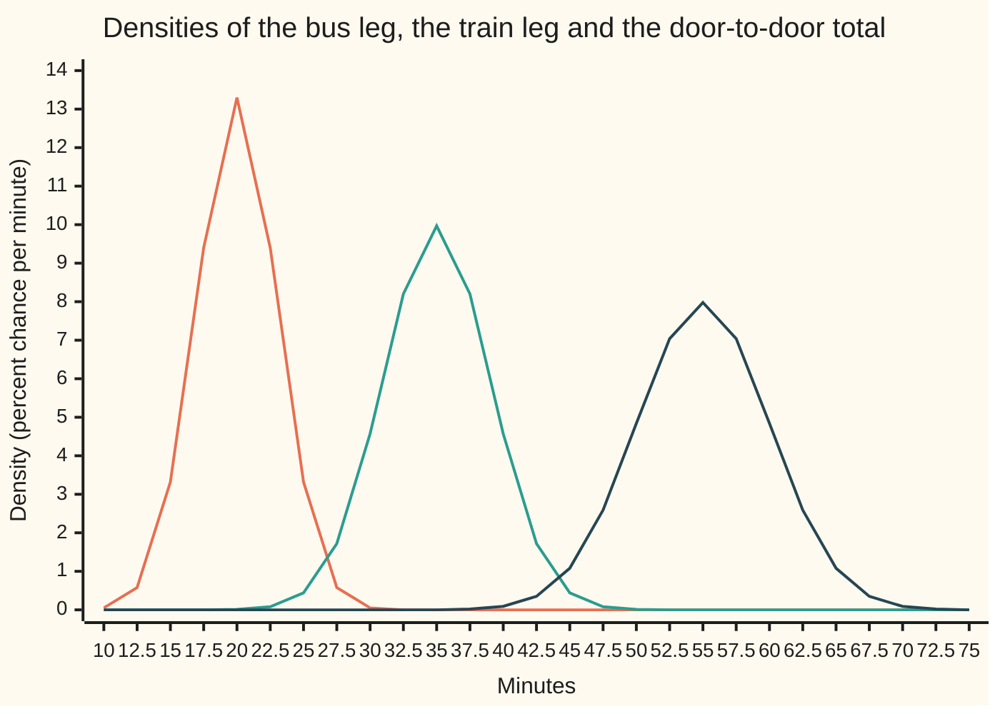
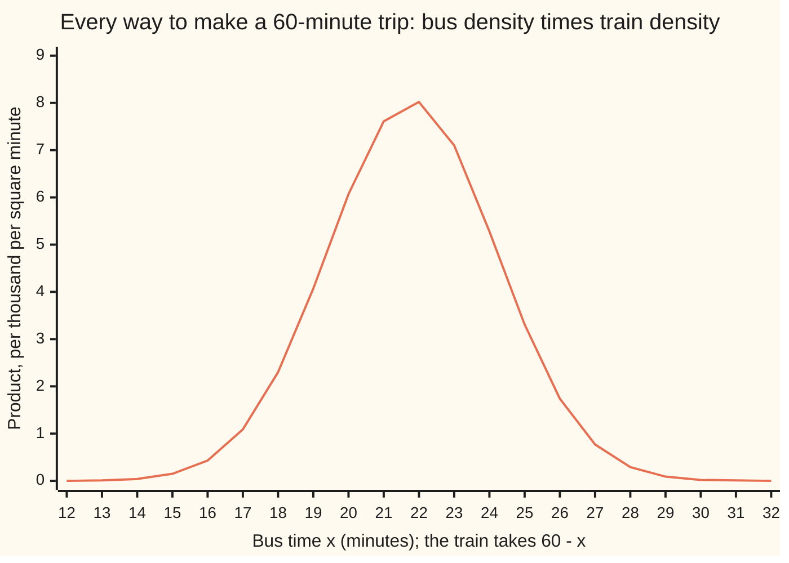

# Adding continuous variables: the convolution integral, and why normal plus normal is normal

Probability and statistics → Transformations and Joint Laws → The law of a total → Adding continuous variables

---

## General Overview

A commute has two legs. The bus to the station takes 20 minutes on a typical day, give or take 3. The train into the city takes 35, give or take 4. The two legs belong to different operators on different routes, so a slow bus says nothing about the train. Each leg's time, taken over many days, follows the normal law: the bell curve, fixed by its centre and its spread, the standard deviation ([normal-distribution](../04-Continuous%20Distributions/04-normal-distribution.md)).

The office expects arrival within 60 minutes of leaving home. How often does that happen? The total averages 20 + 35 = 55 minutes, so most days have slack. How many do depends on the total's width and shape, and neither is obvious. Adding the spreads, 3 + 4 = 7 minutes, is the natural guess. It is wrong.

A total of 60 can be built many ways: a 20-minute bus and a 40-minute train, a 25-minute bus and a 35-minute train, and every split in between. Each split has a chance, and with independent legs that chance is a product. Adding over every split, a sum turned into an integral because time runs continuously, gives the total's density. Picture the train's bell flipped round and slid along the bus's bell; at each position, the overlap measures one value of the total. That sliding-and-overlapping operation is called **convolution**, the word used from here on.

For two bells, the convolution is again a bell. Its centre is 55 minutes and its spread is 5, not 7: the squared spreads add, 9 + 16 = 25. The chance of arriving within the hour is 0.841345, about 5 days in 6.

**The density of a sum of two independent continuous quantities is the integral, over every way of splitting the total, of the product of their densities; for two normal quantities the result is normal, with the centres added and the squared spreads added.**

**What kind of fact this is:** a theorem, in two parts, both proved on this card in Why it works: the convolution formula for any two independent quantities with densities, and the closure of the normal family under it.

### The picture: two legs and their total



First line (orange): the bus leg, centred on 20 minutes with spread 3. Second line (teal): the train leg, centred on 35 with spread 4. Third line (dark): the total, centred on 55 with spread 5, the lowest and widest of the three. Heights are in percent per minute, so the area under each line is 100 percent. The area under the third line to the left of 60 is 0.841345 of it, and its height at 60 is 4.84, the density 0.048394 written as a percentage.

---

## The formula

A reminder of the notation. $X$ and $Y$ are random variables, values written in lower case; a density $f(x)$ gives chance per unit, so area under it is chance ([densities-and-cdfs](../04-Continuous%20Distributions/01-densities-and-cdfs.md)). N(μ, σ^2) is the normal law with centre μ and variance σ^2, and $\Phi$ is the standard bell's area to the left of a point. New on this card: the name $h$ for the density of a sum.

$$h(s) \;=\; \int_{-\infty}^{\infty} f(x)\,g(s - x)\,dx \qquad \text{for independent } X, Y \text{ with densities } f, g,\ S = X + Y$$

**Read it aloud:** the density of the total at $s$ is found by letting the first quantity take each value $x$, asking the second to supply the rest, $s - x$, multiplying the two densities, and adding over every $x$.

The closure result follows from it:

$$X \sim N(\mu_1, \sigma_1^2),\; Y \sim N(\mu_2, \sigma_2^2) \text{ independent} \;\Longrightarrow\; X + Y \sim N(\mu_1 + \mu_2,\; \sigma_1^2 + \sigma_2^2)$$

**Read it aloud:** two independent normal quantities add to a normal quantity whose centre is the sum of the centres and whose variance is the sum of the variances.

| Symbol | Plain meaning | In our example | Push it up and the answer… |
| --- | --- | --- | --- |
| $X$, $Y$ | the two independent quantities | bus leg and train leg, in minutes | — |
| $S$ | the total, $X + Y$ | door to door | — |
| $s$, $v$ | one value the total might take; $v$ is the same, running over all values up to $s$ | 60 minutes | the slide moves right |
| $x$, $y$ | values of $X$ and $Y$; $x$ runs over every split of $s$ | 21.8 minutes of bus at the busiest split | — |
| $f$, $g$ | the densities of $X$ and $Y$ | the bus bell and the train bell | — |
| $h$ | the density of $S$, the convolution of $f$ and $g$ | 0.048394 per minute at 60 | — |
| $\mu_1$, $\mu_2$ | the centres of the two normal laws. Say "mu". | 20 and 35 minutes | the total's centre rises by the same amount |
| $\sigma_1$, $\sigma_2$ | the spreads (standard deviations). Say "sigma". | 3 and 4 minutes | the total widens, but by less than the push |
| $\mu$, $\sigma$ | the total's centre and spread | 55 and 5 minutes | the on-time chance falls |
| $m_s$ | the busiest split: the first quantity's most likely value, given the total is $s$ | 21.8 minutes when $s$ = 60 | — |
| $\Phi$ | the standard bell's area to the left of a point | Φ(1) = 0.841345 | rises from 0 to 1 |
| $t$, $M_X$, $M_Y$, $M_S$ | the input of a moment generating function, and the moment generating functions of $X$, $Y$ and $S$ | at 0.1, $M_S$ = 277.2723 | grows with $t$ |

Two helper formulas carry the numbers. The total's spread is $\sigma = \sqrt{\sigma_1^2 + \sigma_2^2}$: here √(9 + 16) = 5. The chance of arriving by a deadline $s$ is $P(S \le s) = \Phi((s - \mu)/\sigma)$: here Φ((60 − 55)/5) = Φ(1).

### When it holds

- **Independence.** The formula multiplies the two densities at each split. If both legs slow down on rainy days, the product is the wrong weight. With legs jointly normal and correlated 0.5 (built as on [bivariate-normal-and-conditioning](05-bivariate-normal-and-conditioning.md)), the true on-time chance is 0.794460; the independent formula still says 0.841345.
- **Densities for both.** Each quantity must spread its chance continuously. If one leg is a fixed 5-minute walk, it has no density: the total is the other leg's law shifted by 5. If one quantity is a count, the integral becomes a sum ([sums-of-discrete-variables](../03-Discrete%20Distributions/06-sums-of-discrete-variables.md)).
- **Normal in, for normal out.** Convolution works for any pair; closure is special. A bus leg plus a platform wait spread evenly from 0 to 10 minutes has a total that is not a bell, and treating it as one misjudges the late days.
- **The normal law is a model of journey times.** It puts a sliver of chance on a negative time. For a 20-minute leg with spread 3, zero is more than six spreads below the centre, too rare to matter here; for a 4-minute leg with spread 3, it would matter.

---

## Why it works

### Step 0: split the total by its first part

A total of 60 minutes is the bus taking some time $x$ and the train taking the rest, $60 - x$. Different splits are different days: they never happen together. So their chances add. With independent legs, each split's chance is a product of two chances already known. That is the whole idea, and it is the same one behind adding counts ([sums-of-discrete-variables](../03-Discrete%20Distributions/06-sums-of-discrete-variables.md)). The one change: time is continuous, so a single split has chance zero, densities replace chances, and an integral replaces the sum.

### Step 1: the density of a sum

Independence gives the pair of legs a joint density, the product $f(x)\,g(y)$: the chance per square minute that the bus takes about $x$ and the train about $y$ ([joint-densities-and-marginals](02-joint-densities-and-marginals.md)). The chance of arriving by $s$ is the volume under that product over the region where the two times add to $s$ or less:

$$P(S \le s) = \int_{-\infty}^{\infty} f(x) \left( \int_{-\infty}^{s - x} g(y)\,dy \right) dx.$$

Inside the bracket, rename the train's time through the total it makes: write $y = v - x$, so $v$ is the total, running up to $s$. The inner integral becomes an integral of $g(v - x)$ over $v$ up to $s$. Every quantity in sight is zero or positive, so the two integrals can be taken in either order (the double-integral rule for positive integrands). Swapping them:

$$P(S \le s) = \int_{-\infty}^{s} \left( \int_{-\infty}^{\infty} f(x)\,g(v - x)\,dx \right) dv.$$

The chance of arriving by $s$ is the area, up to $s$, under the bracket. A function whose area up to every point gives the chance is the density. So the bracket, read at $v = s$, is $h(s)$. That is the convolution formula, and nothing about normal laws was used.

### Step 2: see it on the commute

Fix the total at 60 minutes and plot the product $f(x)\,g(60 - x)$ against the bus time $x$. The bus bell sits where it always does. The train bell is flipped, since $60 - x$ runs backwards, and shifted so that a 25-minute bus pairs with a 35-minute train. The product is large only where both are large.



The one line is 1000 times $f(x)\,g(60 - x)$ at each whole minute of bus time. The area under it, divided by 1000, is $h(60)$ = 0.048394. Its peak sits at a bus time of 21.8 minutes, not 20: a 60-minute day runs 5 minutes over the average, and the likeliest way to run over spreads the delay over both legs. The bus takes 1.8 of the extra minutes and the train 3.2, in proportion to their variances, 9 and 16. Slide the total to another value and the flipped train bell slides with it; each position gives one value of $h$.

### Step 3: normal plus normal is normal

Write the two bells out. Each is a constant times e raised to minus half a squared distance, measured in spreads. Multiplying two of them adds the exponents:

$$f(x)\,g(s - x) = \frac{1}{2\pi\sigma_1\sigma_2} \exp\!\left( -\frac12 \left[ \frac{(x - \mu_1)^2}{\sigma_1^2} + \frac{(s - x - \mu_2)^2}{\sigma_2^2} \right] \right).$$

The bracket is a quadratic in $x$. Completing the square splits it into two pieces: one square that holds $x$, centred on the busiest split $m_s$, and one that holds only the total:

$$\frac{(x - \mu_1)^2}{\sigma_1^2} + \frac{(s - x - \mu_2)^2}{\sigma_2^2} = \frac{\sigma^2}{\sigma_1^2\sigma_2^2}\,(x - m_s)^2 + \frac{(s - \mu)^2}{\sigma^2}, \qquad m_s = \mu_1 + \frac{\sigma_1^2}{\sigma^2}(s - \mu).$$

Integrating over $x$ sweeps up the first piece: it is a bell in $x$, and its area is a known constant from the Gaussian integral. The second piece does not depend on $x$, so it passes through untouched. What is left is a constant times $\exp(-(s - \mu)^2 / (2\sigma^2))$: a normal density in $s$, centre $\mu$, spread $\sigma$. The constants come out exactly right, as the folded proof shows. For the commute at $s$ = 60, $m_s$ = 20 + (9/25) × 5 = 21.8, the peak in the chart above.

<details>
<summary>Detailed proof: completing the square, and the constant</summary>

Write $u = x - \mu_1$ for the bus's distance from its centre and $d = s - \mu$ for the total's distance from its centre. Then $s - x - \mu_2 = d - u$, and the bracket is
$$\frac{u^2}{\sigma_1^2} + \frac{(d - u)^2}{\sigma_2^2} = u^2\left(\frac{1}{\sigma_1^2} + \frac{1}{\sigma_2^2}\right) - \frac{2ud}{\sigma_2^2} + \frac{d^2}{\sigma_2^2}.$$
The coefficient of $u^2$ is $\sigma^2/(\sigma_1^2\sigma_2^2)$, since $\sigma^2 = \sigma_1^2 + \sigma_2^2$. Factor it out of the first two terms and complete the square:
$$\frac{\sigma^2}{\sigma_1^2\sigma_2^2}\left(u - \frac{\sigma_1^2}{\sigma^2}d\right)^2 - \frac{\sigma_1^2 d^2}{\sigma^2\sigma_2^2} + \frac{d^2}{\sigma_2^2}.$$
The last two terms combine: $\frac{d^2}{\sigma_2^2}\left(1 - \frac{\sigma_1^2}{\sigma^2}\right) = \frac{d^2}{\sigma_2^2}\cdot\frac{\sigma_2^2}{\sigma^2} = \frac{d^2}{\sigma^2}$. And $u - (\sigma_1^2/\sigma^2)d = x - m_s$. That is the identity in Step 3.

Now integrate over $x$. The Gaussian integral gives $\int \exp(-c(x - m)^2/2)\,dx = \sqrt{2\pi/c}$ for any $c > 0$, wherever the bell is centred ([gaussian-integral](../../06-Calculus%20and%20analysis/08-Multiple%20Integrals/04-gaussian-integral.md)). Here $c = \sigma^2/(\sigma_1^2\sigma_2^2)$, so the integral is $\sqrt{2\pi}\,\sigma_1\sigma_2/\sigma$. Then
$$h(s) = \frac{1}{2\pi\sigma_1\sigma_2}\cdot\frac{\sqrt{2\pi}\,\sigma_1\sigma_2}{\sigma}\cdot e^{-(s - \mu)^2/(2\sigma^2)} = \frac{1}{\sigma\sqrt{2\pi}}\,e^{-(s - \mu)^2/(2\sigma^2)},$$
the N(μ, σ^2) density, exactly. The proof identifies the whole density, not just its centre and spread; no limit theorem and no generating function was used. It needs both spreads above zero: a leg with spread 0 is a constant, which shifts the other law instead.

</details>

### Step 4: the second road, through moment generating functions

The moment generating function of $X$ is $M_X(t) = E[e^{tX}]$, the long-run average of e raised to $t$ times the quantity ([moment-generating-functions](../02-Random%20Variables/07-moment-generating-functions.md)). For independent quantities, $M_S(t) = M_X(t)\,M_Y(t)$: convolution of densities becomes multiplication of generating functions. A normal law with centre μ and variance σ^2 has generating function $e^{\mu t + \sigma^2 t^2/2}$. Multiply two and the exponents add:

$$M_S(t) = e^{\mu_1 t + \sigma_1^2 t^2/2}\, e^{\mu_2 t + \sigma_2^2 t^2/2} = e^{(\mu_1 + \mu_2) t + (\sigma_1^2 + \sigma_2^2) t^2/2}.$$

That is the generating function of N(μ1 + μ2, σ1^2 + σ2^2). A generating function that exists near $t$ = 0 fixes its law (stated on the moment-generating-functions card, proved in [characteristic-functions](../../10-Measure%20and%20integration/10-The%20Limit%20Theorems%2C%20Proved/06-characteristic-functions.md)), so the sum is normal a second time. At $t$ = 0.1 the code finds 277.2723 three ways: the product of the two legs' integrals, the integral against the convolved density, and the formula.

### Step 5: what closure adds, and where it stops

Variances of independent quantities always add, bell or not ([variance-and-standard-deviation](../02-Random%20Variables/03-variance-and-standard-deviation.md)). So the 25 was never in doubt. What the normal theorem adds is the shape: without it, a centre of 55 and a spread of 5 do not give a chance for 60 minutes.

Replace the train with a platform wait, spread evenly from 0 to 10 minutes. The convolution still works. The wait's density is 1/10 on that stretch, so $h(s)$ is one tenth of the bus's chance of landing between $s - 10$ and $s$:

$$h(s) = \frac{1}{10}\left[ \Phi\!\left(\frac{s - 20}{3}\right) - \Phi\!\left(\frac{s - 30}{3}\right) \right].$$

At 25 minutes this is 0.090442, where a bell with the same centre, 25, and spread, 4.1633, would stand at 0.095823. The total is flatter on top and falls off faster: most families do not reproduce under convolution, and the normal family does.

<details>
<summary>Why the bell is the one shape with finite variance that survives adding</summary>

Scale the total back to the width of one leg and the bell is unchanged: adding two independent bells and shrinking by the right factor returns the same bell. Adding many small independent pieces of any reasonable shape pushes the total toward that one fixed shape. That is the central limit theorem ([central-limit-theorem](../06-Limit%20Theorems%20in%20Practice/02-central-limit-theorem.md)). This card's closure makes the bell a fixed point of adding-and-rescaling; that it is the only such law with finite variance is the central-limit-theorem card's work.

</details>

A third road reaches the density: change variables from the pair of legs to the pair (bus time, total), whose stretching factor is 1, then integrate out the bus time ([change-of-variables-and-jacobians](../../06-Calculus%20and%20analysis/08-Multiple%20Integrals/03-change-of-variables-and-jacobians.md)). The same integral appears. The harmonic-analysis view, in which convolution becomes multiplication of Fourier transforms, is convolution-of-densities.

---

## Worked numbers, by hand

Bus N(20, 3^2), train N(35, 4^2), independent. The deadline is 60 minutes.

| Step | Arithmetic | Value |
| --- | --- | --- |
| centre of the total, $\mu$ | 20 + 35 | 55 minutes |
| variance of the total | 3^2 + 4^2 = 9 + 16 | 25 |
| spread of the total, $\sigma$ | √25 | 5 minutes |
| deadline in spreads | (60 − 55) / 5 | 1 |
| on-time chance | Φ(1) | **0.841345** |
| density of the total at 60 | e^(−1/2) / (5 √(2π)) | 0.048394 per minute |
| busiest split for a 60-minute trip | 20 + (9/25) × (60 − 55) | bus 21.8, train 38.2 |

About 5 days in 6, the commute fits inside the hour. The density says the total lands within the minute around 60, from 59.5 to 60.5, on about 0.048 of days: roughly 1 day in 20. On a day that did take exactly an hour, the likeliest story is a bus 1.8 minutes late and a train 3.2 minutes late.

### What breaks if you drop a piece

| Mistake | Comes out at | What went wrong |
| --- | --- | --- |
| Add the spreads, 3 + 4 = 7 | on-time chance 0.762475, not 0.841345 | Variances add, not spreads. A spread of 7 is the case where the legs move in lockstep. |
| Legs share the weather, jointly normal with correlation 0.5, convolved as independent | formula 0.841345; true 0.794460, simulated 0.794044 ± 0.000809 | Each leg's own law is unchanged (the train's simulated spread is 4.0119 ± 0.0057), but the product of densities is no longer the joint density. |
| Treat bus plus a 0-to-10-minute platform wait as a bell with matching centre and spread | chance of more than 38 minutes 0.000897; true 0.000354 | Only normal plus normal is normal. The fitted bell more than doubles the chance of a very late day. |

The code prints all three rows.

---

## Code, from first principles, and it actually runs

Both programs reach the total's law by four independent roads. Road 1 is the closed form N(55, 5^2), with Φ built from its Taylor series. Road 2 is the convolution integral itself, done by Simpson's rule (area by fitted parabolas) on the product of the two densities, and integrated again for the on-time chance: it never touches Φ or the closure theorem. Road 3 integrates the moment generating functions. Road 4 simulates 250,000 days, drawing each day's two bells by the Box–Muller method (two uniform numbers turned into two independent standard bells) from a SplitMix64 generator written out in both languages with seed 20260928, so Python and Rust draw the same numbers. The same simulated days, rebuilt with shared weather, give the dependent row of What breaks. Simulated figures carry their standard errors, and their asserts allow four.

### Python

```python
# Adding continuous variables -- the check behind the card.  Standard library only.
# A commute: bus leg X ~ N(20, 3^2) minutes, train leg Y ~ N(35, 4^2), independent.
# Roads to the total S = X + Y: the closed form N(55, 5^2), the convolution
# integral done numerically, moment generating functions, and a seeded simulation.
from math import exp, log, sqrt, cos, sin, pi

def npdf(x, m, sd):                     # the normal density, written out
    z = (x - m) / sd
    return exp(-z * z / 2) / (sd * sqrt(2 * pi))

def Phi(z):                             # standard normal area left of z, by its Taylor series
    term, total, n = z, z, 0
    while abs(term) > 1e-17:
        n += 1
        term *= -z * z / (2 * n)
        total += term / (2 * n + 1)
    return 0.5 + total / sqrt(2 * pi)

def simpson(fn, a, b, n):               # Simpson's rule on n strips, n even
    h, s = (b - a) / n, fn(a) + fn(b)
    for i in range(1, n):
        s += (4 if i % 2 else 2) * fn(a + i * h)
    return s * h / 3

def bus(x): return npdf(x, 20.0, 3.0)
def train(y): return npdf(y, 35.0, 4.0)
def h(s):                               # the convolution integral: slide the train across the bus
    return simpson(lambda x: bus(x) * train(s - x), -10.0, 50.0, 600)

h60_form, h60_conv = npdf(60.0, 55.0, 5.0), h(60.0)
p_form = Phi((60.0 - 55.0) / 5.0)
p_conv = simpson(h, 0.0, 60.0, 600)     # area under the convolved density, no normal CDF used
print("bus N(20, 3^2), train N(35, 4^2), independent; total S = bus + train")
print(f"road 1, closed form N(55, 5^2):  h(60) {h60_form:.6f}   P(S <= 60) {p_form:.6f}")
print(f"road 2, convolution integral:    h(60) {h60_conv:.6f}   P(S <= 60) {p_conv:.6f}")
grid = [h(s) - npdf(s, 55.0, 5.0) for s in range(30, 81)]
print(f"road 2 against road 1 at every whole minute 30..80, largest gap {max(abs(g) for g in grid):.1e}")
assert abs(h60_conv - h60_form) < 1e-9
assert abs(p_conv - p_form) < 1e-8
assert max(abs(g) for g in grid) < 1e-9

t = 0.1                                 # road 3: moment generating functions, integrated numerically
mx = simpson(lambda x: exp(t * x) * bus(x), -10.0, 50.0, 600)
my = simpson(lambda y: exp(t * y) * train(y), -10.0, 80.0, 900)
ms = simpson(lambda s: exp(t * s) * h(s), 10.0, 110.0, 400)
mf = exp(55.0 * t + 25.0 * t * t / 2)
print(f"road 3, MGF at t = 0.1: M_X M_Y {mx * my:.4f}   M_S from h {ms:.4f}   formula {mf:.4f}")
assert abs(mx * my / mf - 1) < 1e-9
assert abs(ms / mf - 1) < 1e-9

xs = [i / 100 for i in range(1000, 3401)]    # where along the slide the product peaks
peak = max(xs, key=lambda x: bus(x) * train(60.0 - x))
m_s = (16.0 * 20.0 + 9.0 * (60.0 - 35.0)) / 25.0
print(f"slide at s = 60: product peaks at bus {peak:.2f}, train {60 - peak:.2f}; formula {m_s:.2f}")
print(f"  peak height {bus(peak) * train(60.0 - peak):.6f}")
assert abs(peak - m_s) < 0.006

M64, state = (1 << 64) - 1, 20260928
def u01():                              # SplitMix64, top 53 bits as a number in [0, 1)
    global state
    state = (state + 0x9E3779B97F4A7C15) & M64
    z = state
    z = ((z ^ (z >> 30)) * 0xBF58476D1CE4E5B9) & M64
    z = ((z ^ (z >> 27)) * 0x94D049BB133111EB) & M64
    return ((z ^ (z >> 31)) >> 11) / 9007199254740992.0

N = 250000                              # road 4: simulate N days, two normals per day by Box-Muller
ok = okd = 0
tot = sq = yd_sq = 0.0
for _ in range(N):
    r, th = sqrt(-2 * log(1 - u01())), 2 * pi * u01()
    z1, z2 = r * cos(th), r * sin(th)
    s = (20 + 3 * z1) + (35 + 4 * z2)
    yd = 4 * (0.5 * z1 + sqrt(0.75) * z2)        # same weather: train leg correlated 0.5 with bus
    ok += s <= 60; okd += 55 + 3 * z1 + yd <= 60
    tot += s; sq += s * s; yd_sq += yd * yd
pe, pd = ok / N, okd / N
se, sed = sqrt(pe * (1 - pe) / N), sqrt(pd * (1 - pd) / N)
mean = tot / N
var = sq / N - mean * mean
print(f"road 4, simulation, seed 20260928, {N} days")
print(f"  P(S <= 60) {pe:.6f} +- {se:.6f}   mean {mean:.4f} +- {sqrt(var / N):.4f}   variance {var:.4f} +- {var * sqrt(2.0 / N):.4f}")
assert abs(pe - p_form) < 4 * se
assert abs(mean - 55.0) < 4 * sqrt(var / N)
assert abs(var - 25.0) < 4 * 25.0 * sqrt(2.0 / N)

print("what breaks")
p_sd = Phi(5.0 / 7.0)
print(f"  add the spreads, 3 + 4 = 7:       P(S <= 60) {p_sd:.6f}   true {p_form:.6f}")
p_dep = Phi(5.0 / sqrt(37.0))
print(f"  same weather, correlation 0.5:    formula for independent {p_form:.6f}")
print(f"    true Phi(5 / sqrt 37) {p_dep:.6f}   simulated {pd:.6f} +- {sed:.6f}")
sd_y = sqrt(yd_sq / N)
print(f"    train leg alone still spread 4: simulated {sd_y:.4f} +- {sd_y / sqrt(2.0 * N):.4f}")
assert abs(pd - p_dep) < 4 * sed
assert abs(pd - p_form) > 20 * sed
assert abs(sd_y - 4.0) < 4 * sd_y / sqrt(2.0 * N)
wait_conv = simpson(lambda w: bus(25.0 - w) / 10.0, 0.0, 10.0, 200)
wait_form = (Phi(5.0 / 3.0) - Phi(-5.0 / 3.0)) / 10.0
sdw = sqrt(9.0 + 100.0 / 12.0)
tail_conv = simpson(lambda w: (1 - Phi((18.0 - w) / 3.0)) / 10.0, 0.0, 10.0, 200)
tail_norm = 1 - Phi(13.0 / sdw)
print(f"  bus + platform wait uniform 0..10 (mean 25, spread {sdw:.4f}):")
print(f"    density at 25: convolution {wait_conv:.6f}   closed form {wait_form:.6f}   matched normal {npdf(25.0, 25.0, sdw):.6f}")
print(f"    P(bus + wait > 38): convolution {tail_conv:.6f}   matched normal {tail_norm:.6f}")
assert abs(wait_conv - wait_form) < 1e-9
assert tail_norm > 2 * tail_conv

print("try changing")
print(f"  bus spread 6 instead of 3: P(S <= 60) {Phi(5.0 / sqrt(52.0)):.6f}")
print(f"  allowance 65 minutes:      P(S <= 65) {Phi(2.0):.6f}")
ts = [10 + 2.5 * i for i in range(27)]           # chart 1: minutes 10, 12.5, ..., 75
print("chart 1, percent per minute, bus:   " + " ".join(f"{100 * bus(v):.2f}" for v in ts))
print("chart 1, percent per minute, train: " + " ".join(f"{100 * train(v):.2f}" for v in ts))
print("chart 1, percent per minute, total: " + " ".join(f"{100 * h(v):.2f}" for v in ts))
print("chart 2, x = 12..32, 1000 bus(x) train(60 - x): "
      + " ".join(f"{1000 * bus(v) * train(60.0 - v):.2f}" for v in range(12, 33)))
print("ALL CHECKS PASS")
```

**Ran 2026-09-28 on macOS, Python 3.14.6, standard library only. All checks passed. Output, pasted from the run:**

```
bus N(20, 3^2), train N(35, 4^2), independent; total S = bus + train
road 1, closed form N(55, 5^2):  h(60) 0.048394   P(S <= 60) 0.841345
road 2, convolution integral:    h(60) 0.048394   P(S <= 60) 0.841345
road 2 against road 1 at every whole minute 30..80, largest gap 5.6e-17
road 3, MGF at t = 0.1: M_X M_Y 277.2723   M_S from h 277.2723   formula 277.2723
slide at s = 60: product peaks at bus 21.80, train 38.20; formula 21.80
  peak height 0.008044
road 4, simulation, seed 20260928, 250000 days
  P(S <= 60) 0.840364 +- 0.000733   mean 55.0001 +- 0.0100   variance 25.1618 +- 0.0712
what breaks
  add the spreads, 3 + 4 = 7:       P(S <= 60) 0.762475   true 0.841345
  same weather, correlation 0.5:    formula for independent 0.841345
    true Phi(5 / sqrt 37) 0.794460   simulated 0.794044 +- 0.000809
    train leg alone still spread 4: simulated 4.0119 +- 0.0057
  bus + platform wait uniform 0..10 (mean 25, spread 4.1633):
    density at 25: convolution 0.090442   closed form 0.090442   matched normal 0.095823
    P(bus + wait > 38): convolution 0.000354   matched normal 0.000897
try changing
  bus spread 6 instead of 3: P(S <= 60) 0.755963
  allowance 65 minutes:      P(S <= 65) 0.977250
chart 1, percent per minute, bus:   0.05 0.58 3.32 9.40 13.30 9.40 3.32 0.58 0.05 0.00 0.00 0.00 0.00 0.00 0.00 0.00 0.00 0.00 0.00 0.00 0.00 0.00 0.00 0.00 0.00 0.00 0.00
chart 1, percent per minute, train: 0.00 0.00 0.00 0.00 0.01 0.08 0.44 1.72 4.57 8.20 9.97 8.20 4.57 1.72 0.44 0.08 0.01 0.00 0.00 0.00 0.00 0.00 0.00 0.00 0.00 0.00 0.00
chart 1, percent per minute, total: 0.00 0.00 0.00 0.00 0.00 0.00 0.00 0.00 0.00 0.00 0.00 0.02 0.09 0.35 1.08 2.59 4.84 7.04 7.98 7.04 4.84 2.59 1.08 0.35 0.09 0.02 0.00
chart 2, x = 12..32, 1000 bus(x) train(60 - x): 0.00 0.01 0.04 0.15 0.43 1.09 2.30 4.07 6.07 7.61 8.02 7.10 5.28 3.31 1.74 0.77 0.29 0.09 0.02 0.01 0.00
ALL CHECKS PASS
```

### Rust

Same numbers, same labels, built with `rustc --edition 2021 -O`.

```rust
// Adding continuous variables -- the check behind the card.  Rust std only, no crates.
// A commute: bus leg X ~ N(20, 3^2) minutes, train leg Y ~ N(35, 4^2), independent.
// Roads to the total S = X + Y: the closed form N(55, 5^2), the convolution
// integral done numerically, moment generating functions, and a seeded simulation.
use std::f64::consts::PI;

fn npdf(x: f64, m: f64, sd: f64) -> f64 { // the normal density, written out
    let z = (x - m) / sd;
    (-z * z / 2.0).exp() / (sd * (2.0 * PI).sqrt())
}

fn phi(z: f64) -> f64 { // standard normal area left of z, by its Taylor series
    let (mut term, mut total, mut n) = (z, z, 0.0);
    while term.abs() > 1e-17 {
        n += 1.0;
        term *= -z * z / (2.0 * n);
        total += term / (2.0 * n + 1.0);
    }
    0.5 + total / (2.0 * PI).sqrt()
}

fn simpson(f: &dyn Fn(f64) -> f64, a: f64, b: f64, n: usize) -> f64 { // n strips, n even
    let h = (b - a) / n as f64;
    let mut s = f(a) + f(b);
    for i in 1..n {
        s += if i % 2 == 1 { 4.0 } else { 2.0 } * f(a + i as f64 * h);
    }
    s * h / 3.0
}

fn bus(x: f64) -> f64 { npdf(x, 20.0, 3.0) }
fn train(y: f64) -> f64 { npdf(y, 35.0, 4.0) }
fn h(s: f64) -> f64 { // the convolution integral: slide the train across the bus
    simpson(&|x| bus(x) * train(s - x), -10.0, 50.0, 600)
}

struct SplitMix(u64);
impl SplitMix {
    fn u01(&mut self) -> f64 { // SplitMix64, top 53 bits as a number in [0, 1)
        self.0 = self.0.wrapping_add(0x9E3779B97F4A7C15);
        let mut z = self.0;
        z = (z ^ (z >> 30)).wrapping_mul(0xBF58476D1CE4E5B9);
        z = (z ^ (z >> 27)).wrapping_mul(0x94D049BB133111EB);
        ((z ^ (z >> 31)) >> 11) as f64 / 9007199254740992.0
    }
}

fn row(v: &[f64], d: usize) -> String {
    v.iter().map(|x| format!("{:.*}", d, x)).collect::<Vec<_>>().join(" ")
}

fn main() {
    let (h60_form, h60_conv) = (npdf(60.0, 55.0, 5.0), h(60.0));
    let p_form = phi((60.0 - 55.0) / 5.0);
    let p_conv = simpson(&h, 0.0, 60.0, 600); // area under the convolved density, no normal CDF used
    println!("bus N(20, 3^2), train N(35, 4^2), independent; total S = bus + train");
    println!("road 1, closed form N(55, 5^2):  h(60) {:.6}   P(S <= 60) {:.6}", h60_form, p_form);
    println!("road 2, convolution integral:    h(60) {:.6}   P(S <= 60) {:.6}", h60_conv, p_conv);
    let gap = (30..81).map(|s| (h(s as f64) - npdf(s as f64, 55.0, 5.0)).abs()).fold(0.0, f64::max);
    println!("road 2 against road 1 at every whole minute 30..80, largest gap {:.1e}", gap);
    assert!((h60_conv - h60_form).abs() < 1e-9);
    assert!((p_conv - p_form).abs() < 1e-8);
    assert!(gap < 1e-9);

    let t = 0.1; // road 3: moment generating functions, integrated numerically
    let mx = simpson(&|x| (t * x).exp() * bus(x), -10.0, 50.0, 600);
    let my = simpson(&|y| (t * y).exp() * train(y), -10.0, 80.0, 900);
    let ms = simpson(&|s| (t * s).exp() * h(s), 10.0, 110.0, 400);
    let mf = (55.0 * t + 25.0 * t * t / 2.0).exp();
    println!("road 3, MGF at t = 0.1: M_X M_Y {:.4}   M_S from h {:.4}   formula {:.4}", mx * my, ms, mf);
    assert!((mx * my / mf - 1.0).abs() < 1e-9);
    assert!((ms / mf - 1.0).abs() < 1e-9);

    let (mut peak, mut best) = (0.0, -1.0); // where along the slide the product peaks
    for i in 1000..3401 {
        let x = i as f64 / 100.0;
        let v = bus(x) * train(60.0 - x);
        if v > best { best = v; peak = x; }
    }
    let m_s = (16.0 * 20.0 + 9.0 * (60.0 - 35.0)) / 25.0;
    println!("slide at s = 60: product peaks at bus {:.2}, train {:.2}; formula {:.2}", peak, 60.0 - peak, m_s);
    println!("  peak height {:.6}", bus(peak) * train(60.0 - peak));
    assert!((peak - m_s).abs() < 0.006);

    let mut g = SplitMix(20260928);
    let n = 250000; // road 4: simulate n days, two normals per day by Box-Muller
    let (mut ok, mut okd) = (0u32, 0u32);
    let (mut tot, mut sq, mut yd_sq) = (0.0, 0.0, 0.0);
    for _ in 0..n {
        let r = (-2.0 * (1.0 - g.u01()).ln()).sqrt();
        let th = 2.0 * PI * g.u01();
        let (z1, z2) = (r * th.cos(), r * th.sin());
        let s = (20.0 + 3.0 * z1) + (35.0 + 4.0 * z2);
        let yd = 4.0 * (0.5 * z1 + 0.75f64.sqrt() * z2); // same weather: train leg correlated 0.5 with bus
        if s <= 60.0 { ok += 1 }
        if 55.0 + 3.0 * z1 + yd <= 60.0 { okd += 1 }
        tot += s; sq += s * s; yd_sq += yd * yd;
    }
    let nf = n as f64;
    let (pe, pd) = (ok as f64 / nf, okd as f64 / nf);
    let (se, sed) = ((pe * (1.0 - pe) / nf).sqrt(), (pd * (1.0 - pd) / nf).sqrt());
    let mean = tot / nf;
    let var = sq / nf - mean * mean;
    println!("road 4, simulation, seed 20260928, {} days", n);
    println!("  P(S <= 60) {:.6} +- {:.6}   mean {:.4} +- {:.4}   variance {:.4} +- {:.4}",
             pe, se, mean, (var / nf).sqrt(), var, var * (2.0 / nf).sqrt());
    assert!((pe - p_form).abs() < 4.0 * se);
    assert!((mean - 55.0).abs() < 4.0 * (var / nf).sqrt());
    assert!((var - 25.0).abs() < 4.0 * 25.0 * (2.0 / nf).sqrt());

    println!("what breaks");
    let p_sd = phi(5.0 / 7.0);
    println!("  add the spreads, 3 + 4 = 7:       P(S <= 60) {:.6}   true {:.6}", p_sd, p_form);
    let p_dep = phi(5.0 / 37f64.sqrt());
    println!("  same weather, correlation 0.5:    formula for independent {:.6}", p_form);
    println!("    true Phi(5 / sqrt 37) {:.6}   simulated {:.6} +- {:.6}", p_dep, pd, sed);
    let sd_y = (yd_sq / nf).sqrt();
    println!("    train leg alone still spread 4: simulated {:.4} +- {:.4}", sd_y, sd_y / (2.0 * nf).sqrt());
    assert!((pd - p_dep).abs() < 4.0 * sed);
    assert!((pd - p_form).abs() > 20.0 * sed);
    assert!((sd_y - 4.0).abs() < 4.0 * sd_y / (2.0 * nf).sqrt());
    let wait_conv = simpson(&|w| bus(25.0 - w) / 10.0, 0.0, 10.0, 200);
    let wait_form = (phi(5.0 / 3.0) - phi(-5.0 / 3.0)) / 10.0;
    let sdw = (9.0 + 100.0 / 12.0f64).sqrt();
    let tail_conv = simpson(&|w| (1.0 - phi((18.0 - w) / 3.0)) / 10.0, 0.0, 10.0, 200);
    let tail_norm = 1.0 - phi(13.0 / sdw);
    println!("  bus + platform wait uniform 0..10 (mean 25, spread {:.4}):", sdw);
    println!("    density at 25: convolution {:.6}   closed form {:.6}   matched normal {:.6}",
             wait_conv, wait_form, npdf(25.0, 25.0, sdw));
    println!("    P(bus + wait > 38): convolution {:.6}   matched normal {:.6}", tail_conv, tail_norm);
    assert!((wait_conv - wait_form).abs() < 1e-9);
    assert!(tail_norm > 2.0 * tail_conv);

    println!("try changing");
    println!("  bus spread 6 instead of 3: P(S <= 60) {:.6}", phi(5.0 / 52f64.sqrt()));
    println!("  allowance 65 minutes:      P(S <= 65) {:.6}", phi(2.0));
    let ts: Vec<f64> = (0..27).map(|i| 10.0 + 2.5 * i as f64).collect(); // chart 1: minutes 10, 12.5, ..., 75
    println!("chart 1, percent per minute, bus:   {}", row(&ts.iter().map(|&v| 100.0 * bus(v)).collect::<Vec<_>>(), 2));
    println!("chart 1, percent per minute, train: {}", row(&ts.iter().map(|&v| 100.0 * train(v)).collect::<Vec<_>>(), 2));
    println!("chart 1, percent per minute, total: {}", row(&ts.iter().map(|&v| 100.0 * h(v)).collect::<Vec<_>>(), 2));
    let prod: Vec<f64> = (12..33).map(|v| 1000.0 * bus(v as f64) * train(60.0 - v as f64)).collect();
    println!("chart 2, x = 12..32, 1000 bus(x) train(60 - x): {}", row(&prod, 2));
    println!("ALL CHECKS PASS");
}
```

**Ran 2026-09-28 on macOS, rustc 1.98.1, no crates. All checks passed. Output, pasted from the run:**

```
bus N(20, 3^2), train N(35, 4^2), independent; total S = bus + train
road 1, closed form N(55, 5^2):  h(60) 0.048394   P(S <= 60) 0.841345
road 2, convolution integral:    h(60) 0.048394   P(S <= 60) 0.841345
road 2 against road 1 at every whole minute 30..80, largest gap 5.6e-17
road 3, MGF at t = 0.1: M_X M_Y 277.2723   M_S from h 277.2723   formula 277.2723
slide at s = 60: product peaks at bus 21.80, train 38.20; formula 21.80
  peak height 0.008044
road 4, simulation, seed 20260928, 250000 days
  P(S <= 60) 0.840364 +- 0.000733   mean 55.0001 +- 0.0100   variance 25.1618 +- 0.0712
what breaks
  add the spreads, 3 + 4 = 7:       P(S <= 60) 0.762475   true 0.841345
  same weather, correlation 0.5:    formula for independent 0.841345
    true Phi(5 / sqrt 37) 0.794460   simulated 0.794044 +- 0.000809
    train leg alone still spread 4: simulated 4.0119 +- 0.0057
  bus + platform wait uniform 0..10 (mean 25, spread 4.1633):
    density at 25: convolution 0.090442   closed form 0.090442   matched normal 0.095823
    P(bus + wait > 38): convolution 0.000354   matched normal 0.000897
try changing
  bus spread 6 instead of 3: P(S <= 60) 0.755963
  allowance 65 minutes:      P(S <= 65) 0.977250
chart 1, percent per minute, bus:   0.05 0.58 3.32 9.40 13.30 9.40 3.32 0.58 0.05 0.00 0.00 0.00 0.00 0.00 0.00 0.00 0.00 0.00 0.00 0.00 0.00 0.00 0.00 0.00 0.00 0.00 0.00
chart 1, percent per minute, train: 0.00 0.00 0.00 0.00 0.01 0.08 0.44 1.72 4.57 8.20 9.97 8.20 4.57 1.72 0.44 0.08 0.01 0.00 0.00 0.00 0.00 0.00 0.00 0.00 0.00 0.00 0.00
chart 1, percent per minute, total: 0.00 0.00 0.00 0.00 0.00 0.00 0.00 0.00 0.00 0.00 0.00 0.02 0.09 0.35 1.08 2.59 4.84 7.04 7.98 7.04 4.84 2.59 1.08 0.35 0.09 0.02 0.00
chart 2, x = 12..32, 1000 bus(x) train(60 - x): 0.00 0.01 0.04 0.15 0.43 1.09 2.30 4.07 6.07 7.61 8.02 7.10 5.28 3.31 1.74 0.77 0.29 0.09 0.02 0.01 0.00
ALL CHECKS PASS
```

The two outputs match line for line.

> [!TIP]
> **Try changing**
> Guess first, then run it. The asserts are pinned to the 3-4-5 commute, so some changes stop the program; the answers below are printed by the try-changing lines.
> - **A jumpier bus.** Guess the on-time chance if the bus's spread doubles to 6. The variance becomes 36 + 16 = 52 and the chance falls to 0.755963: doubling one leg's spread costs about as much as adding the spreads did.
> - **A longer allowance.** Allow 65 minutes instead of 60. The deadline is now two spreads out, and the chance is Φ(2) = 0.977250, about 43 days in 44.
> - **Remove the weather.** In the `yd` line, change `0.5` to `0.0` and `sqrt(0.75)` to `1.0`. The legs are independent again, the dependent line prints a figure near 0.841345, and the assert that checks it against 0.794460 stops the run.
> - **Slide the wrong way.** In `h`, change `train(s - x)` to `train(s + x)`. That integral is the density of train minus bus, centred on 15 minutes, and the first assert stops the run.

---

## The usual mistake

> [!warning]
> **Adding the spreads.** Spreads of 3 and 4 minutes do not make a spread of 7. Variances add, 9 + 16 = 25, and the spread is its square root, 5. Adding spreads assumes a bad bus day is always a bad train day too; with independent legs, delays partly cancel. For the hour's deadline the error moves the on-time chance from 0.841345 down to 0.762475, and a timetable planned on it builds in slack that is not needed.
>
> - **Adding the densities.** The curve $f + g$ has two humps, at 20 and 35, and area 2. It describes neither leg nor the total. The total's density comes from multiplying at each split and integrating, not from adding curves.
> - **Convolving dependent legs.** Two margins, the laws of each leg on its own, do not fix the law of their sum; even margins plus a correlation do not, unless the pair is jointly normal. For jointly normal legs with correlation 0.5 the true on-time chance is 0.794460, not 0.841345.
> - **Assuming every total is a bell.** A bus plus an evenly spread platform wait is not normal. A bell with matched centre and spread puts 0.000897 on a trip over 38 minutes; the truth is 0.000354.
> - **Reading the density as a chance.** $h(60)$ = 0.048394 is chance per minute. The chance of a trip of exactly 60 minutes, to the last instant, is zero.

---

## Where you meet it in real life

- **Project schedules.** Tasks done one after another add their durations. Planning methods add their variances, not their spreads, to put a chance on a delivery date.
- **Measurement error.** A reading that passes through two independent instruments carries both errors. If each is a bell, so is the total error, with variances added.
- **Waiting in a queue.** Time in a shop is a wait plus a service time. For exponential or gamma times at one common rate, the convolution stays in the gamma family ([gamma-and-beta-distributions](../04-Continuous%20Distributions/07-gamma-and-beta-distributions.md)).
- **Blur and smoothing.** A camera's blur is the true image convolved with the spread of light from one point; two bell-shaped blurs in a row make one wider bell.

> **Say it back**
> A total can be split between its two parts in endlessly many ways. For independent parts, each split's weight is the product of the two densities, and adding over every split, as an integral, gives the total's density: the convolution. For two normal parts, completing the square shows the result is exactly normal, with centres added and variances added. A 20-minute bus with spread 3 and a 35-minute train with spread 4 make a 55-minute trip with spread 5, on time for a 60-minute deadline about 5 days in 6. A part that is not a bell breaks the shortcut but not the integral; dependent parts break the product, and their joint density must replace it.

---

## What this builds on

- [joint-densities-and-marginals](02-joint-densities-and-marginals.md): the joint density of two independent quantities is the product of their densities, the starting point of Step 1.
- [moment-generating-functions](../02-Random%20Variables/07-moment-generating-functions.md): generating functions multiply for independent sums and fix a law, the second road in Step 4.

## Where this goes next

- convolution-of-densities: convolution as an operation on functions, where Fourier transforms turn it into multiplication and smoothing into approximation.
- [bivariate-normal-and-conditioning](05-bivariate-normal-and-conditioning.md): the legs taken together, correlated or not, and what one tells about the other.
- [multivariate-normal](06-multivariate-normal.md): any number of bells, and every weighted total of them normal.

Given a one-hour trip, the bus most likely took 21.8 minutes. Why that is also the average bus time on such days is the subject of [bivariate-normal-and-conditioning](05-bivariate-normal-and-conditioning.md).

---

## Sources

Verified 2026-09-28: every link below resolves to the publisher's page.

- Grinstead, Charles M., and J. Laurie Snell. *Introduction to Probability*, 2nd revised ed. American Mathematical Society, 1997. [Book page and free edition](https://chance.dartmouth.edu/teaching_aids/books_articles/probability_book/book.html). Chapter 7, sums of independent random variables, derives the convolution of densities and adds two normals.
- Blitzstein, Joseph K., and Jessica Hwang. *Introduction to Probability*, 2nd ed. CRC Press, 2019. [Publisher page](https://www.routledge.com/Introduction-to-Probability-Second-Edition/Blitzstein-Hwang/p/book/9781138369917). The chapter on transformations treats convolutions, with sums of normals by generating functions.
- Casella, George, and Roger L. Berger. *Statistical Inference*, 2nd ed. Chapman and Hall/CRC, 2024 reprint of the 2002 edition. [Publisher page](https://www.routledge.com/Statistical-Inference/Casella-Berger/p/book/9781032593036). The convolution formula for sums of independent random variables, and moment generating functions for sums.
- Feller, William. *An Introduction to Probability Theory and Its Applications*, Volume 2, 2nd ed. Wiley, 1971. [Publisher page](https://www.wiley.com/en-us/An+Introduction+to+Probability+Theory+and+Its+Applications%2C+Volume+2%2C+2nd+Edition-p-9780471257097). Convolutions of densities in general, and the stability of the normal family under them.
