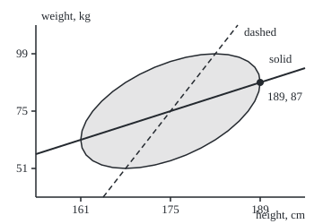
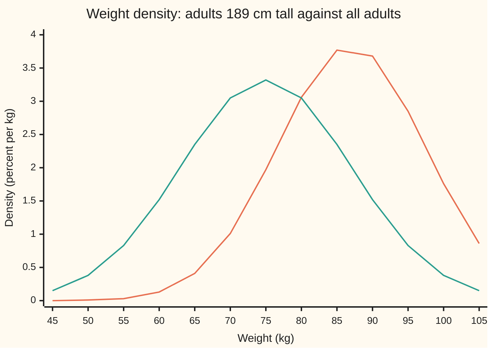

# Bivariate normal: two correlated bells, and the straight-line conditional mean

[Syllabus](../../../SYLLABUS.md) → [Probability and statistics](../../../SYLLABUS.md#w09) → [Transformations and Joint Laws](../../../SYLLABUS.md#w09-s05) → Bivariate normal

---

## General Overview

Measure a large group of adults. Height averages 175 cm, with a typical stray of 7 cm either side. Weight averages 75 kg, with a typical stray of 12 kg. Each measurement on its own piles into a bell. The two are linked: taller people tend to be heavier, but only loosely. The strength of that link, the correlation, is 0.5 on a scale where 0 means no straight-line link and 1 means a perfect one.

Now pick out everyone exactly 189 cm tall, two typical strays above average. What do they weigh? Not 75 kg on average: height carries news about weight. Not 99 kg either, two strays above average weight: the link is only half strength. Their average is 87 kg, one stray above. Their weights still vary, but less than everyone's: the typical stray drops from 12 kg to 10.4 kg. About 39 in 100 of them weigh over 90 kg, against about 11 in 100 of all adults.

The law behind those numbers is the **bivariate normal**: a bell over two measurements at once, tilted by the correlation. Seen from above it is a set of nested ellipses. Slice it at any one height and the slice is again a bell. The centre of that bell moves along a straight line as the height changes, and its width stays the same at every height.

**For two jointly normal measurements, fixing one leaves the other normal, with an average that moves in a straight line (slope: correlation times the ratio of spreads) and a spread shrunk by the factor √(1 − correlation^2), the same at every value.**

**What kind of fact this is:** the bivariate normal is a definition; that its slices are normal with a straight-line mean and a fixed spread is a theorem, proved on this card in Why it works; using it for real heights and weights is a model, and a good one only near the middle.

### The picture: the tilted bell seen from above

The ellipse holds the central 86.5% of adults. The solid line is the average weight at each height. The dashed line is the average height at each weight. The dot is 189 cm and 87 kg, where the solid line meets the ellipse's rightmost point.

<p align="center"></p>

Drawn to scale: 1 cm across is 7.14 pixels, 1 kg up is 2.67 pixels, as printed on the `figure,` lines of both checks. That the two lines differ is the usual mistake, below.

---

## The formula

Notation first, in words. Height is the random variable $H$, one value of it $h$; weight is $W$, one value $w$. Their averages are $\mu_H$ and $\mu_W$ (mu, the Greek m), their spreads (standard deviations, the precise form of the typical stray) $\sigma_H$ and $\sigma_W$ (sigma). The correlation is $\rho$ (rho, the Greek r): the covariance of the two, divided by both spreads. It runs from −1 to 1. A standard score says how many spreads a value sits from its average: $x$ for height, $y$ for weight.

$$x = \frac{h - \mu_H}{\sigma_H}, \qquad y = \frac{w - \mu_W}{\sigma_W}, \qquad Q = \frac{x^2 - 2\rho\,x\,y + y^2}{1 - \rho^2}$$

The **bivariate normal density**, the height of the tilted bell over the point (h, w):

$$f(h, w) = \frac{1}{2\pi\,\sigma_H\,\sigma_W\sqrt{1-\rho^2}}\; e^{-Q/2}$$

**Read it aloud:** the bell is highest at the average person, and falls off as the tilted distance Q grows; the number in front makes the total volume one.

The theorem, the card's point. Among adults of height h, weight is normal. The bar is read "given": W | H = h is weight among adults of height h. N(centre, spread^2) is the normal law ([Normal](../04-Continuous%20Distributions/04-normal-distribution.md)).

$$W \mid H = h \;\sim\; N\!\left(\mu_W + \rho\,\frac{\sigma_W}{\sigma_H}\,(h - \mu_H),\;\; \sigma_W^2\,(1-\rho^2)\right)$$

**Read it aloud:** go as many spreads above average in weight as ρ times the spreads above average in height; the leftover spread is the old one times √(1 − ρ^2), whatever the height.

| Symbol | Plain meaning | In our example | Push it up and the answer… |
| --- | --- | --- | --- |
| $H$, $h$ | height as a random variable; one value of it | the 189 cm group | the average weight rises 0.857 kg per cm |
| $W$, $w$ | weight as a random variable; one value of it | 90 kg threshold | fewer adults clear a higher bar |
| $\mu_H$, $\mu_W$ | the two averages | 175 cm, 75 kg | the whole ellipse slides |
| $\sigma_H$, $\sigma_W$ | the two spreads (standard deviations) | 7 cm, 12 kg | a wider $\sigma_W$ steepens the line; a wider $\sigma_H$ flattens it |
| $\rho$ | the correlation: covariance over both spreads | 0.5 | the line steepens and the slice narrows |
| $x$, $y$ | standard scores: spreads away from average | x = 2 at 189 cm | — |
| $Q$ | the tilted squared distance from the average person | 4 on the drawn ellipse | the density falls as e^(−Q/2) |
| $f$, $f_H$ | the joint density, per cm per kg; height's own density | f_H(189) = 0.0077 per cm | — |
| $\varphi$, $\Phi$ | the standard bell's height; its area to the left | Φ(0.2887) = 1 − 0.3864 | — |
| $Z_1$, $Z_2$ | two independent standard bells, the raw material | — | — |
| $\Sigma$ | the covariance matrix of the pair | entries 49, 42, 42, 144 | — |

Two helper readings. The **slope** in kg per cm is ρσ_W/σ_H = 0.5 × 12 / 7 = 0.857143. The **covariance**, ρσ_Hσ_W = 42 cm·kg, is the off-diagonal entry of Σ.

### When it holds

- **The pair is jointly normal, not just each part.** Two normal bells joined the wrong way can share correlation 0.5 and still have a slice that is a single spike. The flip pair in What breaks does exactly that.
- **The link is a straight line.** If weight rose faster among the very tall, the true average would curve away from the line, and the line would miss at the edges.
- **The spread is the same at every height.** Real data often fans out. Then the fixed 10.4 kg is too wide in one place and too narrow in another.
- **ρ is strictly between −1 and 1.** At ρ = ±1 the ellipse collapses to a line, 1 − ρ^2 is zero, and the density formula divides by zero. The slice is then a single point.

---

## Why it works

### Step 0: build the pair from two independent bells

Take two independent standard bells, $Z_1$ and $Z_2$. Let height's standard score be the first. Let weight's standard score be a blend: ρ parts the height signal, plus a fresh independent part.

$$x = Z_1, \qquad y = \rho\,Z_1 + \sqrt{1-\rho^2}\;Z_2$$

That blend is the whole idea. Weight's standard score takes ρ = 0.5 of height's, plus a fresh part of its own. Fix the height, and the only thing left to vary is the fresh part. That is why the slice is a bell, and why its width cannot depend on the height.

### Step 1: the blend has the right spreads and the right correlation

Variances of independent parts add. Var(y) = ρ^2 + (1 − ρ^2) = 1, so y is a standard score. The covariance of x and y is E[Z₁ · (ρZ₁ + √(1−ρ^2) Z₂)] = ρ. With both spreads 1, that covariance is the correlation. Scaling back, h = 175 + 7x and w = 75 + 12y, gives the covariance 0.5 × 7 × 12 = 42 cm·kg.

### Step 2: the density of the blend is the formula

The map from (Z₁, Z₂) to (x, y) is linear. A change of variables in a double integral multiplies by how the map stretches area ([Change of variables](../../06-Calculus%20and%20analysis/08-Multiple%20Integrals/03-change-of-variables-and-jacobians.md); [Transforming a variable](01-transforming-a-random-variable.md) does it for one variable). Here the stretch factor is √(1 − ρ^2). Undo the blend and square: Z₁^2 + Z₂^2 equals Q exactly. Rescaling to cm and kg divides by σ_H σ_W. Out comes f(h, w). The algebra is in the folded proof below.

The tilted distance is a quadratic form, $Q = v^{\mathsf T}\,\Sigma^{-1}\,v$ with v the column of gaps (h − 175, w − 75), $v^{\mathsf T}$ the same gaps written as a row, and $\Sigma^{-1}$ the inverse of the matrix ([Quadratic forms](../../03-Algebra/07-Eigenvalues%20and%20Symmetric%20Matrices/05-quadratic-forms-and-positive-definite.md)), where

$$\Sigma = \begin{pmatrix} \sigma_H^2 & \rho\,\sigma_H\sigma_W \\ \rho\,\sigma_H\sigma_W & \sigma_W^2 \end{pmatrix}.$$

That matrix is positive definite (Q is above zero except at the centre) when |ρ| < 1, so the level sets of Q are ellipses. Those are the contours in the picture.

### Step 3: complete the square, and the density splits in two

Rearrange the tilted distance:

$$Q = x^2 + \frac{(y - \rho x)^2}{1 - \rho^2}$$

The exponential of a sum is a product. So the density splits into a height factor times a weight-given-height factor:

$$f(h, w) = \underbrace{\frac{\varphi(x)}{\sigma_H}}_{f_H(h)} \;\times\; \frac{1}{\sigma_W\sqrt{1-\rho^2}}\;\varphi\!\left(\frac{y - \rho x}{\sqrt{1-\rho^2}}\right)$$

The second factor is a normal density in w, so it integrates to 1 over all weights. Integrating out weight leaves the first factor: height alone is normal, N(175, 7^2), as it should be ([Joint densities](02-joint-densities-and-marginals.md)).

### Step 4: divide by height's density; what remains is the slice

A conditional density is the joint density divided by the density of what was fixed ([Conditional densities](03-conditional-densities.md)). Divide f by f_H and only the second factor is left. It is a bell in y centred at ρx with spread √(1 − ρ^2). Back in kg: centre μ_W + ρσ_W x, spread σ_W√(1 − ρ^2). At 189 cm, x = 2, so the centre is 75 + 0.5 × 12 × 2 = 87 kg and the spread 12 × 0.866025 = 10.392 kg. The theorem is proved.

<details>
<summary>Detailed proof</summary>

**The density.** Invert the blend: Z₁ = x and Z₂ = (y − ρx)/√(1 − ρ^2). The matrix of this inverse map has rows `(1, 0)` and `(−ρ/√(1−ρ^2), 1/√(1−ρ^2))`, with determinant 1/√(1 − ρ^2). The pair (Z₁, Z₂) has density e^(−(z₁^2 + z₂^2)/2)/(2π). By the change-of-variables rule the pair (x, y) has density e^(−(z₁^2 + z₂^2)/2)/(2π√(1 − ρ^2)).

**The exponent.** z₁^2 + z₂^2 = x^2 + (y − ρx)^2/(1 − ρ^2) = [x^2(1 − ρ^2) + y^2 − 2ρxy + ρ^2x^2]/(1 − ρ^2) = (x^2 − 2ρxy + y^2)/(1 − ρ^2) = Q. With h = μ_H + σ_H x and w = μ_W + σ_W y, a cm-by-kg rectangle is σ_H σ_W times a standard-score rectangle, so divide once more by σ_H σ_W. That is f(h, w).

**The slice.** Write u = (y − ρx)/√(1 − ρ^2). Then f(h, w) = [φ(x)/σ_H] · [φ(u)/(σ_W√(1 − ρ^2))]. For fixed h, the second bracket is the density of w = μ_W + σ_W(ρx + √(1 − ρ^2)·u) with u standard normal: a normal law with centre μ_W + ρσ_W x and spread σ_W√(1 − ρ^2). It integrates to 1 over w, so f_H(h) = φ(x)/σ_H, and f(h, w)/f_H(h) is that normal density. Nothing in the spread depends on x.

**Both above average.** The pair (Z₁, Z₂) looks the same after any rotation, so its angle θ is uniform on a full turn. Write ρ = sin α. Then y = sin α cos θ + cos α sin θ times the radius, which is positive exactly when sin(θ + α) > 0. Height above average needs cos θ > 0. Both hold on an arc of length π/2 + α. The chance is (π/2 + α)/(2π) = 1/4 + arcsin(ρ)/(2π). At ρ = 0.5, α = π/6 and the chance is 1/3.

**The ellipse's share.** Q = Z₁^2 + Z₂^2, the squared radius R^2. In polar coordinates the chance that R^2 ≤ c is the integral from 0 to √c of r e^(−r^2/2) dr, which is 1 − e^(−c/2) (the same computation as the Gaussian integral). At c = 4 it is 1 − e^(−2).

</details>

### Step 5: reading ρ

The formula turns ρ into four readable facts about the adults.

- **The slope in standard units.** Two spreads up in height means ρ × 2 = 1 spread up in weight, on average. Not two. This is **regression toward the mean**: the tall are heavy, but less extreme in weight than in height. Galton named it in 1886 from parents' and children's heights.
- **The share of variance explained.** Weight's variance, 144 kg^2, splits into the variance of the line's predictions, ρ^2 × 144 = 36, plus the leftover, (1 − ρ^2) × 144 = 108. ρ^2 = 0.25: height accounts for a quarter of the variation in weight, not half.
- **How much the slice narrows.** The spread keeps a factor √(1 − ρ^2) = 0.866 of its size. Correlation 0.5 sounds strong; it narrows the bell by less than a seventh.
- **Both above average.** The chance of being both taller and heavier than average is 1/4 + arcsin(ρ)/(2π). At ρ = 0.5 that is 1/3, against 1/4 for unlinked measurements. About 1 adult in 3.

A correlation is a statement about the straight-line link in the population. It says nothing about cause: height does not make weight, and the line from weight to height is not a recipe for growing taller.

### The ellipse and the two lines

The contours of the density are the ellipses Q = constant. The drawn one is Q = 4, and it holds 1 − e^(−2) = 86.5% of adults. The solid line, average weight at each height, passes through the ellipse's leftmost and rightmost points: (161, 63) and (189, 87). The dashed line, average height at each weight, passes through its lowest and highest points: (168, 51) and (182, 99). In each vertical slice the ellipse is centred on the solid line, which is Step 4 seen as geometry.

Another road to the same line is least squares ([Least squares](../09-Regression/01-least-squares-regression.md)): the straight line with the smallest average squared miss in predicting weight from height has exactly this slope.

---

## Worked numbers, by hand

Adults: heights centred at 175 cm with spread 7, weights centred at 75 kg with spread 12, correlation 0.5. The question: among adults 189 cm tall, what share weigh over 90 kg?

| Step | Arithmetic | Value |
| --- | --- | --- |
| height's standard score | (189 − 175) / 7 | 2.000 |
| weight's expected standard score | ρ × 2 = 0.5 × 2 | 1.0 |
| average weight at 189 cm | 75 + 12 × 1.0 | 87.0 kg |
| same, as a slope | 75 + 0.857143 × 14 | 87.0 kg |
| spread shrink | √(1 − 0.25) | 0.866025 |
| spread of the slice | 12 × 0.866025 | 10.392 kg |
| 90 kg as a standard score in the slice | (90 − 87) / 10.392 | 0.2887 |
| share over 90 kg | 1 − Φ(0.2887) | **0.3864** |
| for comparison, all adults | 1 − Φ((90 − 75)/12) = 1 − Φ(1.25) | 0.1057 |

About 39 in 100 adults of 189 cm weigh over 90 kg. Among all adults it is about 11 in 100. Knowing the height nearly quadruples the chance, yet most tall adults still come in under 90 kg.

The same slice, drawn: the weight bell among 189 cm adults sits 12 kg to the right of everyone's bell, and is narrower and taller.



The first line, peaking near 87 kg, is the slice at 189 cm: centre 87, spread 10.4. The second, peaking at 75 kg, is all adults: centre 75, spread 12.

### What breaks if you drop a piece

Same question, correct answer 0.3864:

| Mistake | Comes out at | What went wrong |
| --- | --- | --- |
| Slope upside down, ρσ_H/σ_W | mean 79.08 kg, share 0.1468 | The ratio of spreads converts cm into kg; flipped, it converts kg into cm |
| Spread not shrunk, 12 kg kept | share 0.4013 | Knowing the height removes a quarter of the variance; the slice is narrower |
| Full step, ρ ignored | mean 99.0 kg, share 0.8068 | Two spreads tall does not mean two spreads heavy; only ρ × 2 = 1 |
| Normal parts, not jointly normal (the flip pair) | exactly 99.0 kg at 189 cm; 45.0 kg at 192.5 cm, where the line says 90.0 | The theorem needs the pair jointly normal; normal parts with correlation 0.5 are not enough |

The flip pair drops the one hypothesis that matters. Let weight's standard score equal height's while |x| < c, and minus height's beyond. By the bell's symmetry weight is still exactly N(75, 12^2). Choose the cutoff so the correlation is 0.5: c = 2.026905, found by bisection on an integral. At 189 cm, x = 2 is inside the cutoff, so every such adult weighs exactly 99 kg: the slice is a spike, and the share over 90 kg is 1, not 0.3864. At 192.5 cm the sign flips and every such adult weighs 45 kg. Same parts, same correlation, a different joint law. How parts and joining separate is [Copulas](07-copulas-and-sklars-theorem.md).

---

## Code, from first principles, and it actually runs

Nothing imported contains the answer: no statistics module, no random module, no error function. The slice at 189 cm is reached three independent ways. Road 1 is the formula, with Φ from its Taylor series. Road 2 never uses the formula: it slices the joint density f(189, w) and integrates across weight by Simpson's rule. Road 3 simulates 400,000 adults from a SplitMix64 generator (a small, written-out source of random bits), seed 20260928, with Marsaglia's polar method for the normal pairs (it turns two uniform draws, kept when they land inside a circle, into two independent normals), and keeps those 188 to 190 cm tall; each simulated number carries its standard error. The both-above-average chance and the ellipse's share are each met two or three ways, and the flip pair's cutoff is found by bisection. Both programs print every number on the card, chart points and SVG coordinates included.

### Python

```python
# Bivariate normal and conditioning -- the check behind the card.  Standard library only.
# Adult height H (cm) and weight W (kg): centres 175 and 75, spreads 7 and 12,
# correlation 0.5.  The law of weight among adults 189 cm tall is reached three
# ways: the formula, a slice of the joint density integrated by Simpson's rule,
# and a seeded simulation.  Nothing imported holds the answer.
from math import exp, log, sqrt, pi, asin, cos, sin

MH, SH, MW, SW, RHO = 175.0, 7.0, 75.0, 12.0, 0.5
H0, W0 = 189.0, 90.0                         # the question: over 90 kg, at 189 cm tall

def phi(z): return exp(-z * z / 2) / sqrt(2 * pi)   # standard normal density
def Phi(z):                                  # standard normal area, Taylor series term by term
    term, total = z, z
    for n in range(1, 200):
        term *= -z * z / (2 * n)
        total += term / (2 * n + 1)
    return 0.5 + total / sqrt(2 * pi)

def simpson(g, a, b, n=4000):                # Simpson's rule, n even
    h = (b - a) / n
    s = g(a) + g(b) + sum((4 if i % 2 else 2) * g(a + i * h) for i in range(1, n))
    return s * h / 3

def joint(h, w):                             # the bivariate normal density, per cm per kg
    x, y = (h - MH) / SH, (w - MW) / SW
    q = (x * x - 2 * RHO * x * y + y * y) / (1 - RHO * RHO)
    return exp(-q / 2) / (2 * pi * SH * SW * sqrt(1 - RHO * RHO))

def cond(h, rho=RHO):                        # road 1: the formula -> (mean, spread, P(W > W0))
    m, s = MW + rho * SW * (h - MH) / SH, SW * sqrt(1 - rho * rho)
    return m, s, 1 - Phi((W0 - m) / s)

MASK = (1 << 64) - 1
state = 20260928                             # road 3: SplitMix64, seed 20260928
def splitmix():
    global state
    state = (state + 0x9E3779B97F4A7C15) & MASK
    z = state
    z = ((z ^ (z >> 30)) * 0xBF58476D1CE4E5B9) & MASK
    z = ((z ^ (z >> 27)) * 0x94D049BB133111EB) & MASK
    return z ^ (z >> 31)
def uniform(): return ((splitmix() >> 11) + 0.5) / 2.0 ** 53   # strictly between 0 and 1
def normal_pair():                           # Marsaglia's polar method
    while True:
        u, v = 2 * uniform() - 1, 2 * uniform() - 1
        s = u * u + v * v
        if 0 < s < 1:
            k = sqrt(-2 * log(s) / s)
            return u * k, v * k

m1, s1, p1 = cond(H0)
print(f"model: height {MH:.1f} cm sd {SH:.1f}; weight {MW:.1f} kg sd {SW:.1f}; rho {RHO:.2f}")
print(f"covariance rho*sH*sW = {RHO * SH * SW:.3f} cm kg; height z at {H0:.0f} cm = {(H0 - MH) / SH:.3f}")
print(f"slope rho*sW/sH = {RHO * SW / SH:.6f} kg per cm; reverse slope rho*sH/sW = {RHO * SH / SW:.6f} cm per kg")
print(f"  inverting the first slope instead: {SH / (RHO * SW):.6f} cm per kg; mean height at 99 kg {MH + RHO * SH * (99 - MW) / SW:.1f} cm")
print(f"rho^2 = {RHO ** 2:.4f}; spread shrink sqrt(1 - rho^2) = {sqrt(1 - RHO ** 2):.6f}; variances sH^2 {SH ** 2:.0f}, "
      f"sW^2 {SW ** 2:.0f} = line {RHO ** 2 * SW ** 2:.0f} + leftover {(1 - RHO ** 2) * SW ** 2:.0f}")
lo, hi, g = MW - 12 * SW, MW + 12 * SW, lambda w: joint(H0, w)   # road 2: slice the joint density at 189 cm
fx = simpson(g, lo, hi)
m2 = simpson(lambda w: w * g(w), lo, hi) / fx
s2 = sqrt(simpson(lambda w: (w - m2) ** 2 * g(w), lo, hi) / fx)
p2 = simpson(g, W0, hi) / fx
print(f"at {H0:.0f} cm   formula: mean {m1:.6f} kg, sd {s1:.6f} kg, P(W > 90) {p1:.6f}, z of 90 kg {(W0 - m1) / s1:.4f}")
print(f"at {H0:.0f} cm   slice:   mean {m2:.6f} kg, sd {s2:.6f} kg, P(W > 90) {p2:.6f}")
print(f"height density at {H0:.0f} cm: slice area {fx:.8f}, phi(2)/7 {phi((H0 - MH) / SH) / SH:.8f}")
print(f"P(W > 90) ignoring height: z {(W0 - MW) / SW:.4f}, P {1 - Phi((W0 - MW) / SW):.6f}")
a, b = 0.0, 5.0         # flip pair: normal weight, correlation 0.5, not jointly normal; bisect for the cutoff
flip_corr = lambda c: 4 * simpson(lambda z: z * z * phi(z), 0.0, c, 400) - 1
for _ in range(60):
    c = (a + b) / 2
    a, b = (c, b) if flip_corr(c) < RHO else (a, c)
C = (a + b) / 2
flip_w = lambda z: MW + SW * (z if abs(z) < C else -z)
print(f"flip pair: cutoff c = {C:.6f}, correlation by integral {flip_corr(C):.6f}")
print(f"  weight at 189 cm: {flip_w(2.0):.1f} kg, P(W > 90) = 1; at 192.5 cm: {flip_w(2.5):.1f} kg vs line {cond(192.5)[0]:.1f}")
N = 400000                                   # road 3: simulation
sh = sw = shh = sww = shw = sf = sff = shf = 0.0
nwin = swin = swin2 = nover = both = inside = 0
for _ in range(N):
    z1, z2 = normal_pair()
    h, w = MH + SH * z1, MW + SW * (RHO * z1 + sqrt(1 - RHO * RHO) * z2)
    f = flip_w(z1)
    sh += h; sw += w; shh += h * h; sww += w * w; shw += h * w
    sf += f; sff += f * f; shf += h * f
    x, y = (h - MH) / SH, (w - MW) / SW
    both += x > 0 and y > 0
    inside += (x * x - 2 * RHO * x * y + y * y) / (1 - RHO * RHO) <= 4
    if 188.0 <= h <= 190.0:
        nwin += 1; swin += w; swin2 += w * w; nover += w > W0
vh, vw, vf = shh / N - (sh / N) ** 2, sww / N - (sw / N) ** 2, sff / N - (sf / N) ** 2
corr = (shw / N - sh * sw / N / N) / sqrt(vh * vw)
corr_f = (shf / N - sh * sf / N / N) / sqrt(vh * vf)
mw_win = swin / nwin; sd_win = sqrt(swin2 / nwin - mw_win ** 2)
se_m, p_win = sd_win / sqrt(nwin), nover / nwin
se_p = sqrt(p_win * (1 - p_win) / nwin)
p_both, p_in = both / N, inside / N
se_both, se_in = sqrt(p_both * (1 - p_both) / N), sqrt(p_in * (1 - p_in) / N)
print(f"simulation, {N} adults, seed 20260928:")
print(f"  correlation {corr:.4f} (se about {(1 - RHO ** 2) / sqrt(N):.4f}); slope {corr * sqrt(vw / vh):.4f} kg per cm")
print(f"  heights 188-190 cm: {nwin} adults, mean weight {mw_win:.3f} (se {se_m:.3f}), sd {sd_win:.3f}")
print(f"  share over 90 kg there: {p_win:.4f} (se {se_p:.4f})")
print(f"  flip pair: correlation {corr_f:.4f}, weight sd {sqrt(vf):.3f}")
p_or = 0.25 + asin(RHO) / (2 * pi)
p_or2 = simpson(lambda z: phi(z) * Phi(RHO * z / sqrt(1 - RHO * RHO)), 0.0, 12.0)
print(f"both above average: arcsin rule {p_or:.6f}, integral {p_or2:.6f}, simulation {p_both:.4f} (se {se_both:.4f})")
print(f"inside the Q = 4 ellipse: 1 - e^-2 = {1 - exp(-2):.6f}, simulation {p_in:.4f} (se {se_in:.4f})")
wm, full = MW + RHO * SH * (H0 - MH) / SW, MW + SW * (H0 - MH) / SH   # upside-down slope; slope sW/sH
print(f"wrong: slope upside down: mean {wm:.4f}, P(W > 90) {1 - Phi((W0 - wm) / s1):.6f}")
print(f"wrong: spread not shrunk: P(W > 90) {1 - Phi((W0 - m1) / SW):.6f}")
print(f"wrong: full step, no regression: mean {full:.1f}, P(W > 90) {1 - Phi((W0 - full) / s1):.6f}")
for r in (0.9, 0.0, -0.5):
    print(f"try: rho {r:+.1f} at 189 cm: mean %.3f, sd %.3f, P(W > 90) %.6f" % cond(H0, r))
print(f"try: rho +0.5 at 161 cm: mean %.3f, sd %.3f, P(W > 90) %.6f" % cond(161.0))
ws = [45 + 5 * i for i in range(13)]
print("chart, weight kg        " + " ".join(f"{w:5d}" for w in ws))
print("chart, at 189 cm %/kg   " + " ".join(f"{100 * phi((w - m1) / s1) / s1:5.2f}" for w in ws))
print("chart, all adults %/kg  " + " ".join(f"{100 * phi((w - MW) / SW) / SW:5.2f}" for w in ws))
px, py = lambda h: 40 + (h - 154) * 300 / 42, lambda w: 220 - (w - 39) * 192 / 72   # cm, kg -> pixels
pts = []
for k in range(36):
    t = 2 * pi * k / 36
    zx, zy = 2 * cos(t), 2 * (RHO * cos(t) + sqrt(1 - RHO * RHO) * sin(t))
    pts.append(f"{px(MH + SH * zx):.1f},{py(MW + SW * zy):.1f}")
print("figure, ellipse Q = 4: " + " ".join(pts))
print(f"figure, W on H line: {px(154):.1f},{py(cond(154)[0]):.1f} {px(196):.1f},{py(cond(196)[0]):.1f}"
      f"; H on W line: {px(MH + RHO * SH * (39 - MW) / SW):.1f},{py(39):.1f} {px(MH + RHO * SH * (111 - MW) / SW):.1f},{py(111):.1f}")
print(f"figure, point (189, 87): {px(H0):.1f},{py(m1):.1f}; ticks x {px(161):.1f} {px(175):.1f} {px(189):.1f}; y {py(51):.1f} {py(75):.1f} {py(99):.1f}")
print(f"figure, scale {px(155) - px(154):.2f} px per cm, {py(39) - py(40):.2f} px per kg; ellipse ends (cm, kg): "
      + " ".join(f"({MH + SH * a:.0f}, {MW + SW * b:.0f})" for a, b in ((2, 1), (-2, -1), (1, 2), (-1, -2))))
assert abs(m2 - m1) < 1e-9, "slice mean vs the formula's straight line"
assert abs(s2 - s1) < 1e-9, "slice spread vs sW sqrt(1 - rho^2)"
assert abs(p2 - p1) < 1e-9, "slice tail area vs the Phi series"
assert abs(fx - phi((H0 - MH) / SH) / SH) < 1e-12, "slice area vs height's own density"
assert abs(mw_win - m1) < 4 * se_m, "simulated mean weight at 188-190 cm vs formula"
assert abs(p_win - p1) < 4 * se_p, "simulated share over 90 kg vs formula"
assert abs(p_or - p_or2) < 1e-9, "arcsin rule vs integral"
assert abs(p_both - p_or) < 4 * se_both, "arcsin rule vs simulation"
assert abs(p_in - (1 - exp(-2))) < 4 * se_in, "ellipse share vs 1 - e^-2"
assert abs(corr_f - RHO) < 4 * (1 - RHO ** 2) / sqrt(N), "flip pair: simulated correlation vs the integral's 0.5"
print("ALL CHECKS PASS")
```

**Ran 2026-09-28 on macOS, Python 3.14.6, standard library only. All checks passed. Output, pasted from the run:**

```
model: height 175.0 cm sd 7.0; weight 75.0 kg sd 12.0; rho 0.50
covariance rho*sH*sW = 42.000 cm kg; height z at 189 cm = 2.000
slope rho*sW/sH = 0.857143 kg per cm; reverse slope rho*sH/sW = 0.291667 cm per kg
  inverting the first slope instead: 1.166667 cm per kg; mean height at 99 kg 182.0 cm
rho^2 = 0.2500; spread shrink sqrt(1 - rho^2) = 0.866025; variances sH^2 49, sW^2 144 = line 36 + leftover 108
at 189 cm   formula: mean 87.000000 kg, sd 10.392305 kg, P(W > 90) 0.386415, z of 90 kg 0.2887
at 189 cm   slice:   mean 87.000000 kg, sd 10.392305 kg, P(W > 90) 0.386415
height density at 189 cm: slice area 0.00771300, phi(2)/7 0.00771300
P(W > 90) ignoring height: z 1.2500, P 0.105650
flip pair: cutoff c = 2.026905, correlation by integral 0.500000
  weight at 189 cm: 99.0 kg, P(W > 90) = 1; at 192.5 cm: 45.0 kg vs line 90.0
simulation, 400000 adults, seed 20260928:
  correlation 0.4998 (se about 0.0012); slope 0.8572 kg per cm
  heights 188-190 cm: 6186 adults, mean weight 87.079 (se 0.133), sd 10.426
  share over 90 kg there: 0.3941 (se 0.0062)
  flip pair: correlation 0.4994, weight sd 11.995
both above average: arcsin rule 0.333333, integral 0.333333, simulation 0.3334 (se 0.0007)
inside the Q = 4 ellipse: 1 - e^-2 = 0.864665, simulation 0.8648 (se 0.0005)
wrong: slope upside down: mean 79.0833, P(W > 90) 0.146754
wrong: spread not shrunk: P(W > 90) 0.401294
wrong: full step, no regression: mean 99.0, P(W > 90) 0.806762
try: rho +0.9 at 189 cm: mean 96.600, sd 5.231, P(W > 90) 0.896487
try: rho +0.0 at 189 cm: mean 75.000, sd 12.000, P(W > 90) 0.105650
try: rho -0.5 at 189 cm: mean 63.000, sd 10.392, P(W > 90) 0.004687
try: rho +0.5 at 161 cm: mean 63.000, sd 10.392, P(W > 90) 0.004687
chart, weight kg           45    50    55    60    65    70    75    80    85    90    95   100   105
chart, at 189 cm %/kg    0.00  0.01  0.03  0.13  0.41  1.01  1.97  3.06  3.77  3.68  2.85  1.76  0.86
chart, all adults %/kg   0.15  0.38  0.83  1.52  2.35  3.05  3.32  3.05  2.35  1.52  0.83  0.38  0.15
figure, ellipse Q = 4: 290.0,92.0 288.5,82.9 284.0,75.0 276.6,68.6 266.6,63.9 254.3,61.0 240.0,60.0 224.2,61.0 207.4,63.9 190.0,68.6 172.6,75.0 155.8,82.9 140.0,92.0 125.7,102.1 113.4,112.9 103.4,124.0 96.0,135.1 91.5,145.9 90.0,156.0 91.5,165.1 96.0,173.0 103.4,179.4 113.4,184.1 125.7,187.0 140.0,188.0 155.8,187.0 172.6,184.1 190.0,179.4 207.4,173.0 224.2,165.1 240.0,156.0 254.3,145.9 266.6,135.1 276.6,124.0 284.0,112.9 288.5,102.1
figure, W on H line: 40.0,172.0 340.0,76.0; H on W line: 115.0,220.0 265.0,28.0
figure, point (189, 87): 290.0,92.0; ticks x 90.0 190.0 290.0; y 188.0 124.0 60.0
figure, scale 7.14 px per cm, 2.67 px per kg; ellipse ends (cm, kg): (189, 87) (161, 63) (182, 99) (168, 51)
ALL CHECKS PASS
```

The formula and the slice agree to six decimals. The simulated band of 6,186 adults averages 87.079 kg, within one standard error of 87; 0.3941 of them clear 90 kg, within two standard errors of 0.3864.

### Rust

```rust
// Bivariate normal and conditioning -- the same check as the Python, in Rust.  No crates.
// Adult height H (cm) and weight W (kg): centres 175 and 75, spreads 7 and 12,
// correlation 0.5.  The law of weight among adults 189 cm tall is reached three
// ways: the formula, a slice of the joint density integrated by Simpson's rule,
// and a seeded simulation.  Nothing used holds the answer.
use std::f64::consts::PI;

const MH: f64 = 175.0; const SH: f64 = 7.0; const MW: f64 = 75.0; const SW: f64 = 12.0;
const RHO: f64 = 0.5;
const H0: f64 = 189.0; const W0: f64 = 90.0; // the question: over 90 kg, at 189 cm tall

fn phi(z: f64) -> f64 { (-z * z / 2.0).exp() / (2.0 * PI).sqrt() } // standard normal density

fn cdf(z: f64) -> f64 { // standard normal area, Taylor series term by term
    let (mut term, mut total) = (z, z);
    for n in 1..200 {
        let n = n as f64;
        term *= -z * z / (2.0 * n);
        total += term / (2.0 * n + 1.0);
    }
    0.5 + total / (2.0 * PI).sqrt()
}

fn simpson(g: &dyn Fn(f64) -> f64, a: f64, b: f64, n: usize) -> f64 { // Simpson's rule, n even
    let h = (b - a) / n as f64;
    let mut s = 0.0;
    for i in 1..n { s += if i % 2 == 1 { 4.0 } else { 2.0 } * g(a + i as f64 * h); }
    (g(a) + g(b) + s) * h / 3.0
}

fn joint(h: f64, w: f64) -> f64 { // the bivariate normal density, per cm per kg
    let (x, y) = ((h - MH) / SH, (w - MW) / SW);
    let q = (x * x - 2.0 * RHO * x * y + y * y) / (1.0 - RHO * RHO);
    (-q / 2.0).exp() / (2.0 * PI * SH * SW * (1.0 - RHO * RHO).sqrt())
}

fn cond(h: f64, rho: f64) -> (f64, f64, f64) { // road 1: the formula -> (mean, spread, P(W > W0))
    let (m, s) = (MW + rho * SW * (h - MH) / SH, SW * (1.0 - rho * rho).sqrt());
    (m, s, 1.0 - cdf((W0 - m) / s))
}

struct SplitMix(u64); // road 3: SplitMix64, seed 20260928
impl SplitMix {
    fn next(&mut self) -> u64 {
        self.0 = self.0.wrapping_add(0x9E3779B97F4A7C15);
        let mut z = self.0;
        z = (z ^ (z >> 30)).wrapping_mul(0xBF58476D1CE4E5B9);
        z = (z ^ (z >> 27)).wrapping_mul(0x94D049BB133111EB);
        z ^ (z >> 31)
    }
    fn uniform(&mut self) -> f64 { ((self.next() >> 11) as f64 + 0.5) / 2f64.powi(53) } // in (0, 1)
    fn normal_pair(&mut self) -> (f64, f64) { // Marsaglia's polar method
        loop {
            let (u, v) = (2.0 * self.uniform() - 1.0, 2.0 * self.uniform() - 1.0);
            let s = u * u + v * v;
            if s > 0.0 && s < 1.0 { let k = (-2.0 * s.ln() / s).sqrt(); return (u * k, v * k); }
        }
    }
}

fn main() {
    let (m1, s1, p1) = cond(H0, RHO);
    println!("model: height {:.1} cm sd {:.1}; weight {:.1} kg sd {:.1}; rho {:.2}", MH, SH, MW, SW, RHO);
    println!("covariance rho*sH*sW = {:.3} cm kg; height z at {:.0} cm = {:.3}", RHO * SH * SW, H0, (H0 - MH) / SH);
    println!("slope rho*sW/sH = {:.6} kg per cm; reverse slope rho*sH/sW = {:.6} cm per kg", RHO * SW / SH, RHO * SH / SW);
    println!("  inverting the first slope instead: {:.6} cm per kg; mean height at 99 kg {:.1} cm", SH / (RHO * SW), MH + RHO * SH * (99.0 - MW) / SW);
    println!("rho^2 = {:.4}; spread shrink sqrt(1 - rho^2) = {:.6}; variances sH^2 {:.0}, sW^2 {:.0} = line {:.0} + leftover {:.0}",
        RHO * RHO, (1.0 - RHO * RHO).sqrt(), SH * SH, SW * SW, RHO * RHO * SW * SW, (1.0 - RHO * RHO) * SW * SW);
    let (lo, hi) = (MW - 12.0 * SW, MW + 12.0 * SW); // road 2: slice the joint density at 189 cm
    let g = |w: f64| joint(H0, w);
    let fx = simpson(&g, lo, hi, 4000);
    let m2 = simpson(&|w| w * g(w), lo, hi, 4000) / fx;
    let s2 = (simpson(&|w| (w - m2).powi(2) * g(w), lo, hi, 4000) / fx).sqrt();
    let p2 = simpson(&g, W0, hi, 4000) / fx;
    println!("at {:.0} cm   formula: mean {:.6} kg, sd {:.6} kg, P(W > 90) {:.6}, z of 90 kg {:.4}", H0, m1, s1, p1, (W0 - m1) / s1);
    println!("at {:.0} cm   slice:   mean {:.6} kg, sd {:.6} kg, P(W > 90) {:.6}", H0, m2, s2, p2);
    println!("height density at {:.0} cm: slice area {:.8}, phi(2)/7 {:.8}", H0, fx, phi((H0 - MH) / SH) / SH);
    println!("P(W > 90) ignoring height: z {:.4}, P {:.6}", (W0 - MW) / SW, 1.0 - cdf((W0 - MW) / SW));
    // flip pair: normal weight, correlation 0.5, not jointly normal
    let flip_corr = |c: f64| 4.0 * simpson(&|z| z * z * phi(z), 0.0, c, 400) - 1.0;
    let (mut a, mut b) = (0.0_f64, 5.0_f64); // bisection for the cutoff
    for _ in 0..60 {
        let c = (a + b) / 2.0;
        if flip_corr(c) < RHO { a = c; } else { b = c; }
    }
    let cut = (a + b) / 2.0;
    let flip_w = |z: f64| MW + SW * if z.abs() < cut { z } else { -z };
    println!("flip pair: cutoff c = {:.6}, correlation by integral {:.6}", cut, flip_corr(cut));
    println!("  weight at 189 cm: {:.1} kg, P(W > 90) = 1; at 192.5 cm: {:.1} kg vs line {:.1}", flip_w(2.0), flip_w(2.5), cond(192.5, RHO).0);
    let n = 400000usize; // road 3: simulation
    let nf = n as f64;
    let mut rng = SplitMix(20260928);
    let (mut sh, mut sw, mut shh, mut sww, mut shw, mut sf, mut sff, mut shf) = (0.0, 0.0, 0.0, 0.0, 0.0, 0.0, 0.0, 0.0);
    let (mut nwin, mut swin, mut swin2, mut nover, mut both, mut inside) = (0usize, 0.0, 0.0, 0usize, 0usize, 0usize);
    for _ in 0..n {
        let (z1, z2) = rng.normal_pair();
        let (h, w) = (MH + SH * z1, MW + SW * (RHO * z1 + (1.0 - RHO * RHO).sqrt() * z2));
        let f = flip_w(z1);
        sh += h; sw += w; shh += h * h; sww += w * w; shw += h * w;
        sf += f; sff += f * f; shf += h * f;
        let (x, y) = ((h - MH) / SH, (w - MW) / SW);
        if x > 0.0 && y > 0.0 { both += 1; }
        if (x * x - 2.0 * RHO * x * y + y * y) / (1.0 - RHO * RHO) <= 4.0 { inside += 1; }
        if (188.0..=190.0).contains(&h) {
            nwin += 1; swin += w; swin2 += w * w;
            if w > W0 { nover += 1; }
        }
    }
    let (vh, vw, vf) = (shh / nf - (sh / nf).powi(2), sww / nf - (sw / nf).powi(2), sff / nf - (sf / nf).powi(2));
    let corr = (shw / nf - sh * sw / nf / nf) / (vh * vw).sqrt();
    let corr_f = (shf / nf - sh * sf / nf / nf) / (vh * vf).sqrt();
    let nw = nwin as f64;
    let mw_win = swin / nw;
    let sd_win = (swin2 / nw - mw_win * mw_win).sqrt();
    let (se_m, p_win) = (sd_win / nw.sqrt(), nover as f64 / nw);
    let se_p = (p_win * (1.0 - p_win) / nw).sqrt();
    let (p_both, p_in) = (both as f64 / nf, inside as f64 / nf);
    let (se_both, se_in) = ((p_both * (1.0 - p_both) / nf).sqrt(), (p_in * (1.0 - p_in) / nf).sqrt());
    println!("simulation, {} adults, seed 20260928:", n);
    println!("  correlation {:.4} (se about {:.4}); slope {:.4} kg per cm", corr, (1.0 - RHO * RHO) / nf.sqrt(), corr * (vw / vh).sqrt());
    println!("  heights 188-190 cm: {} adults, mean weight {:.3} (se {:.3}), sd {:.3}", nwin, mw_win, se_m, sd_win);
    println!("  share over 90 kg there: {:.4} (se {:.4})", p_win, se_p);
    println!("  flip pair: correlation {:.4}, weight sd {:.3}", corr_f, vf.sqrt());
    let p_or = 0.25 + RHO.asin() / (2.0 * PI);
    let p_or2 = simpson(&|z| phi(z) * cdf(RHO * z / (1.0 - RHO * RHO).sqrt()), 0.0, 12.0, 4000);
    println!("both above average: arcsin rule {:.6}, integral {:.6}, simulation {:.4} (se {:.4})", p_or, p_or2, p_both, se_both);
    println!("inside the Q = 4 ellipse: 1 - e^-2 = {:.6}, simulation {:.4} (se {:.4})", 1.0 - (-2.0f64).exp(), p_in, se_in);
    let (wm, full) = (MW + RHO * SH * (H0 - MH) / SW, MW + SW * (H0 - MH) / SH); // upside-down slope; slope sW/sH
    println!("wrong: slope upside down: mean {:.4}, P(W > 90) {:.6}", wm, 1.0 - cdf((W0 - wm) / s1));
    println!("wrong: spread not shrunk: P(W > 90) {:.6}", 1.0 - cdf((W0 - m1) / SW));
    println!("wrong: full step, no regression: mean {:.1}, P(W > 90) {:.6}", full, 1.0 - cdf((W0 - full) / s1));
    for r in [0.9, 0.0, -0.5] {
        let (m, s, p) = cond(H0, r);
        println!("try: rho {:+.1} at 189 cm: mean {:.3}, sd {:.3}, P(W > 90) {:.6}", r, m, s, p);
    }
    let (m, s, p) = cond(161.0, RHO);
    println!("try: rho +0.5 at 161 cm: mean {:.3}, sd {:.3}, P(W > 90) {:.6}", m, s, p);
    let ws: Vec<f64> = (0..13).map(|i| 45.0 + 5.0 * i as f64).collect();
    let row = |f: &dyn Fn(f64) -> f64, d: usize| ws.iter().map(|&w| format!("{:5.*}", d, f(w))).collect::<Vec<_>>().join(" ");
    println!("chart, weight kg        {}", row(&|w| w, 0));
    println!("chart, at 189 cm %/kg   {}", row(&|w| 100.0 * phi((w - m1) / s1) / s1, 2));
    println!("chart, all adults %/kg  {}", row(&|w| 100.0 * phi((w - MW) / SW) / SW, 2));
    let px = |h: f64| 40.0 + (h - 154.0) * 300.0 / 42.0; // cm, kg -> pixels
    let py = |w: f64| 220.0 - (w - 39.0) * 192.0 / 72.0;
    let pts: Vec<String> = (0..36).map(|k| {
        let t = 2.0 * PI * k as f64 / 36.0;
        let (zx, zy) = (2.0 * t.cos(), 2.0 * (RHO * t.cos() + (1.0 - RHO * RHO).sqrt() * t.sin()));
        format!("{:.1},{:.1}", px(MH + SH * zx), py(MW + SW * zy))
    }).collect();
    println!("figure, ellipse Q = 4: {}", pts.join(" "));
    let hw = |w: f64| MH + RHO * SH * (w - MW) / SW;
    println!("figure, W on H line: {:.1},{:.1} {:.1},{:.1}; H on W line: {:.1},{:.1} {:.1},{:.1}",
        px(154.0), py(cond(154.0, RHO).0), px(196.0), py(cond(196.0, RHO).0), px(hw(39.0)), py(39.0), px(hw(111.0)), py(111.0));
    println!("figure, point (189, 87): {:.1},{:.1}; ticks x {:.1} {:.1} {:.1}; y {:.1} {:.1} {:.1}",
        px(H0), py(m1), px(161.0), px(175.0), px(189.0), py(51.0), py(75.0), py(99.0));
    let ends: Vec<String> = [(2.0, 1.0), (-2.0, -1.0), (1.0, 2.0), (-1.0, -2.0)].iter()
        .map(|&(a, b): &(f64, f64)| format!("({:.0}, {:.0})", MH + SH * a, MW + SW * b)).collect();
    println!("figure, scale {:.2} px per cm, {:.2} px per kg; ellipse ends (cm, kg): {}", px(155.0) - px(154.0), py(39.0) - py(40.0), ends.join(" "));
    assert!((m2 - m1).abs() < 1e-9, "slice mean vs the formula's straight line");
    assert!((s2 - s1).abs() < 1e-9, "slice spread vs sW sqrt(1 - rho^2)");
    assert!((p2 - p1).abs() < 1e-9, "slice tail area vs the Phi series");
    assert!((fx - phi((H0 - MH) / SH) / SH).abs() < 1e-12, "slice area vs height's own density");
    assert!((mw_win - m1).abs() < 4.0 * se_m, "simulated mean weight at 188-190 cm vs formula");
    assert!((p_win - p1).abs() < 4.0 * se_p, "simulated share over 90 kg vs formula");
    assert!((p_or - p_or2).abs() < 1e-9, "arcsin rule vs integral");
    assert!((p_both - p_or).abs() < 4.0 * se_both, "arcsin rule vs simulation");
    assert!((p_in - (1.0 - (-2.0f64).exp())).abs() < 4.0 * se_in, "ellipse share vs 1 - e^-2");
    assert!((corr_f - RHO).abs() < 4.0 * (1.0 - RHO * RHO) / nf.sqrt(), "flip pair: simulated correlation vs the integral's 0.5");
    println!("ALL CHECKS PASS");
}
```

**Ran 2026-09-28 on macOS, rustc 1.98.1, no crates. All checks passed. Output, pasted from the run:**

```
model: height 175.0 cm sd 7.0; weight 75.0 kg sd 12.0; rho 0.50
covariance rho*sH*sW = 42.000 cm kg; height z at 189 cm = 2.000
slope rho*sW/sH = 0.857143 kg per cm; reverse slope rho*sH/sW = 0.291667 cm per kg
  inverting the first slope instead: 1.166667 cm per kg; mean height at 99 kg 182.0 cm
rho^2 = 0.2500; spread shrink sqrt(1 - rho^2) = 0.866025; variances sH^2 49, sW^2 144 = line 36 + leftover 108
at 189 cm   formula: mean 87.000000 kg, sd 10.392305 kg, P(W > 90) 0.386415, z of 90 kg 0.2887
at 189 cm   slice:   mean 87.000000 kg, sd 10.392305 kg, P(W > 90) 0.386415
height density at 189 cm: slice area 0.00771300, phi(2)/7 0.00771300
P(W > 90) ignoring height: z 1.2500, P 0.105650
flip pair: cutoff c = 2.026905, correlation by integral 0.500000
  weight at 189 cm: 99.0 kg, P(W > 90) = 1; at 192.5 cm: 45.0 kg vs line 90.0
simulation, 400000 adults, seed 20260928:
  correlation 0.4998 (se about 0.0012); slope 0.8572 kg per cm
  heights 188-190 cm: 6186 adults, mean weight 87.079 (se 0.133), sd 10.426
  share over 90 kg there: 0.3941 (se 0.0062)
  flip pair: correlation 0.4994, weight sd 11.995
both above average: arcsin rule 0.333333, integral 0.333333, simulation 0.3334 (se 0.0007)
inside the Q = 4 ellipse: 1 - e^-2 = 0.864665, simulation 0.8648 (se 0.0005)
wrong: slope upside down: mean 79.0833, P(W > 90) 0.146754
wrong: spread not shrunk: P(W > 90) 0.401294
wrong: full step, no regression: mean 99.0, P(W > 90) 0.806762
try: rho +0.9 at 189 cm: mean 96.600, sd 5.231, P(W > 90) 0.896487
try: rho +0.0 at 189 cm: mean 75.000, sd 12.000, P(W > 90) 0.105650
try: rho -0.5 at 189 cm: mean 63.000, sd 10.392, P(W > 90) 0.004687
try: rho +0.5 at 161 cm: mean 63.000, sd 10.392, P(W > 90) 0.004687
chart, weight kg           45    50    55    60    65    70    75    80    85    90    95   100   105
chart, at 189 cm %/kg    0.00  0.01  0.03  0.13  0.41  1.01  1.97  3.06  3.77  3.68  2.85  1.76  0.86
chart, all adults %/kg   0.15  0.38  0.83  1.52  2.35  3.05  3.32  3.05  2.35  1.52  0.83  0.38  0.15
figure, ellipse Q = 4: 290.0,92.0 288.5,82.9 284.0,75.0 276.6,68.6 266.6,63.9 254.3,61.0 240.0,60.0 224.2,61.0 207.4,63.9 190.0,68.6 172.6,75.0 155.8,82.9 140.0,92.0 125.7,102.1 113.4,112.9 103.4,124.0 96.0,135.1 91.5,145.9 90.0,156.0 91.5,165.1 96.0,173.0 103.4,179.4 113.4,184.1 125.7,187.0 140.0,188.0 155.8,187.0 172.6,184.1 190.0,179.4 207.4,173.0 224.2,165.1 240.0,156.0 254.3,145.9 266.6,135.1 276.6,124.0 284.0,112.9 288.5,102.1
figure, W on H line: 40.0,172.0 340.0,76.0; H on W line: 115.0,220.0 265.0,28.0
figure, point (189, 87): 290.0,92.0; ticks x 90.0 190.0 290.0; y 188.0 124.0 60.0
figure, scale 7.14 px per cm, 2.67 px per kg; ellipse ends (cm, kg): (189, 87) (161, 63) (182, 99) (168, 51)
ALL CHECKS PASS
```

The two outputs are identical line for line: the same integer generator draws the same adults in both languages.

> [!TIP]
> **Try changing**
> Guess the direction first. Then run it.
> - **Raise the link.** Set the correlation to 0.9. At 189 cm the average weight becomes **96.600 kg**, the spread **5.231 kg**, and the share over 90 kg **0.8965**. A strong link narrows the slice sharply; only near ±1 does it collapse.
> - **Cut the link.** Set it to 0. Height says nothing: average **75.000 kg**, spread **12.000 kg**, share **0.1057**, the all-adults figure.
> - **Reverse it.** Set it to −0.5. Now tall means light: average **63.000 kg**, share **0.0047**, under half a percent.
> - **Look at short adults instead.** Keep 0.5 and ask at 161 cm. The answer is the same as the reversed link at 189 cm: **63.000 kg** and **0.0047**. Two spreads short with a positive link is the mirror of two spreads tall with a negative one.

---

## The usual mistake

> [!warning]
> **Running the line backwards.** The line that predicts weight from height is not the line that predicts height from weight. Adults 189 cm tall average 87 kg. Adults who weigh 99 kg do not average 189 cm; they average 182.0 cm. Both lines regress toward the middle, each in its own direction. Inverting the first slope gives 1.166667 cm per kg; the true reverse slope is 0.291667. The two lines coincide only when ρ = ±1.
>
> Smaller traps:
> - **Keeping the full spread.** The slice's spread is σ_W√(1 − ρ^2), not σ_W. Keep 12 kg and the share over 90 kg comes out 0.4013 instead of 0.3864.
> - **Reading ρ = 0.5 as "half the weight is explained".** The share of variance explained is ρ^2 = 0.25. The slice is only 0.866 as wide as the whole bell.
> - **Assuming two normal measurements are a bivariate normal.** The flip pair has normal parts and correlation 0.5, and at 189 cm every adult weighs exactly 99 kg.
> - **Reading correlation as cause.** ρ measures a straight-line link in a population. Height does not cause weight, and nothing on this card says how one person's weight would respond to anything.

---

## Where you meet it in real life

- **Regression toward the mean.** Galton's 1886 study of parents' and children's heights found the children of very tall parents tall, but less extreme. The slope ρ below 1 is the whole explanation, and the same effect makes a rookie's record season look like a slump the next year.
- **Growth charts and reference ranges.** A child's expected weight for a given height, with a band around it, is a conditional mean and a conditional spread.
- **Two assets at once.** Options on the better or worse of two stocks price with this law: [Rainbow options](../../12-Financial%20mathematics/18-Many%20underlyings%20-%20exchange%2C%20spread%2C%20basket%20and%20rainbow/04-rainbow-best-of-and-worst-of.md). The both-above-average rule is the seed of the bivariate normal area those formulas use.
- **Default correlation.** Credit portfolios link each firm's health to one common factor with a correlation, then condition on the factor: [The one-factor Gaussian copula](../../12-Financial%20mathematics/45-Portfolio%20Credit%20-%20Correlation%2C%20Copulas%2C%20Indices%20and%20Tranches/02-one-factor-gaussian-copula.md).
- **Filtering a noisy reading.** A sensor reading and the true value form a bivariate normal pair; the best guess of the truth given the reading is this card's straight line, and its uncertainty is this card's shrunk spread.

> **Say it back**
> The bivariate normal is a bell over two measurements, tilted by the correlation ρ. Built from two independent bells, weight's standard score is ρ times height's plus a fresh independent part. Fix the height and only the fresh part varies, so the slice is a bell. Its centre moves along a straight line with slope ρσ_W/σ_H, and its spread is σ_W√(1 − ρ^2) at every height. For adults 189 cm tall that is 87 kg give or take 10.4, and about 39 in 100 weigh over 90 kg.

---

## What this builds on

- [Conditional densities](03-conditional-densities.md): a slice is the joint density divided by the density of what was fixed, the division made in Step 4.
- [Normal](../04-Continuous%20Distributions/04-normal-distribution.md): the one-dimensional bell, standard scores, and the areas Φ used for every share on the card.
- [Quadratic forms](../../03-Algebra/07-Eigenvalues%20and%20Symmetric%20Matrices/05-quadratic-forms-and-positive-definite.md): why the tilted distance Q has elliptical level sets, and why |ρ| < 1 is needed.

## Where this goes next

- [Multivariate normal](06-multivariate-normal.md): any number of measurements, one covariance matrix in place of ρ, built from independent draws; Cholesky's pivots are the conditional variances given the earlier readings.
- [Brownian bridge](../../11-Stochastic%20processes%20and%20calculus/05-Brownian%20Motion/05-brownian-bridge.md): a random path pinned at its end; its average given the endpoint is this card's straight line.
- [Compound options](../../12-Financial%20mathematics/17-Averages%2C%20choosers%2C%20compounds%20and%20forward-starts/05-compound-options.md): an option on an option, priced with the bivariate normal area.
- [Rainbow options](../../12-Financial%20mathematics/18-Many%20underlyings%20-%20exchange%2C%20spread%2C%20basket%20and%20rainbow/04-rainbow-best-of-and-worst-of.md): the better of two stocks, a two-bell question.
- [The quanto adjustment](../../12-Financial%20mathematics/24-Quantos%20and%20composites/01-quanto-forward-and-adjustment.md): a stock and an exchange rate, correlated; the covariance term shifts the forward.
- [Spread options](../../12-Financial%20mathematics/26-Options%20on%20commodity%20futures%20and%20spreads/04-margrabe-and-kirk-spread-options.md): the gap between two correlated prices.
- [The one-factor Gaussian copula](../../12-Financial%20mathematics/45-Portfolio%20Credit%20-%20Correlation%2C%20Copulas%2C%20Indices%20and%20Tranches/02-one-factor-gaussian-copula.md): many firms, one shared factor, conditioning on it.
- [Kyle's model](../../12-Financial%20mathematics/49-Microstructure%20and%20Execution/03-kyle-model-and-price-impact.md): a market maker's best guess of value given order flow, a straight-line conditional mean.

Two measurements need one ρ; three or more need a whole table of covariances, and which tables are possible and how to draw from one is the question [Multivariate normal](06-multivariate-normal.md) answers.

---

## Sources

Verified 28 Sep 2026: every link below resolves to the publisher's page.

- Galton, Francis. "Regression Towards Mediocrity in Hereditary Stature." *Journal of the Anthropological Institute of Great Britain and Ireland* 15 (1886): 246–263. [doi:10.2307/2841583](https://doi.org/10.2307/2841583). Heights of parents and children; the first straight-line conditional mean and the name regression.
- Pearson, Karl. "Mathematical Contributions to the Theory of Evolution. III. Regression, Heredity, and Panmixia." *Philosophical Transactions of the Royal Society A* (1896): 253–318. [doi:10.1098/rsta.1896.0007](https://doi.org/10.1098/rsta.1896.0007). The correlation coefficient and the bivariate normal surface written out.
- Sheppard, W. F. "On the Application of the Theory of Error to Cases of Normal Distribution and Normal Correlation." *Philosophical Transactions of the Royal Society A* (1899): 101–167. [doi:10.1098/rsta.1899.0003](https://doi.org/10.1098/rsta.1899.0003). The both-above-average rule, 1/4 + arcsin(ρ)/(2π).
- Blitzstein, Joseph K., and Jessica Hwang. *Introduction to Probability*, 2nd ed. CRC Press, 2019. [Publisher page](https://www.routledge.com/Introduction-to-Probability-Second-Edition/Blitzstein-Hwang/p/book/9781138369917). The bivariate and multivariate normal, built from independent bells as in Step 0.
