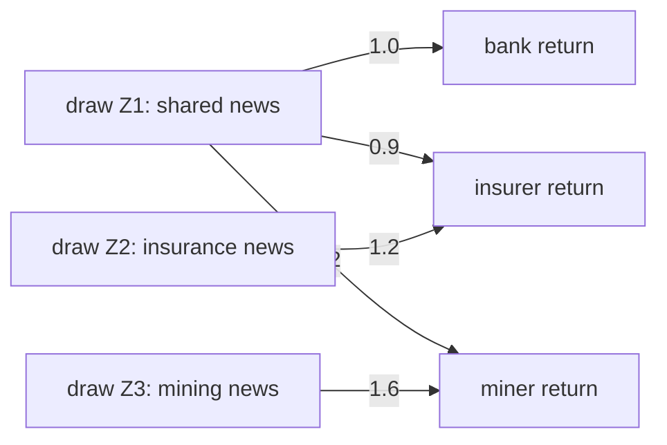
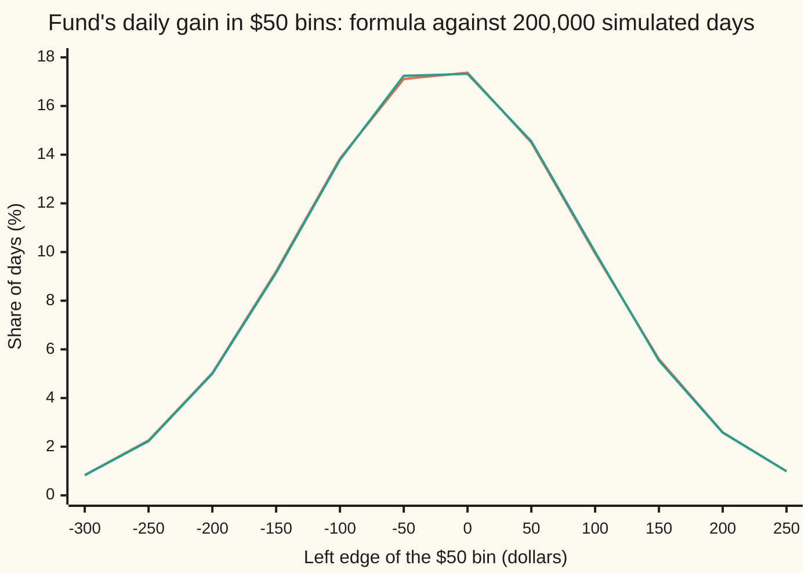

# Multivariate normal: a vector of correlated normals and its covariance matrix

[Syllabus](../../../SYLLABUS.md) → [Probability and statistics](../README.md) → [Transformations and Joint Laws](../README.md#s05) → Multivariate normal

---

## General Overview

A fund holds three shares: $5,000 in a bank, $3,000 in an insurer and $2,000 in a mining company. On a typical day the bank's price moves about 1 percent, the insurer's about 1.5 percent and the miner's about 2 percent. They do not move separately. A day that is bad for the bank tends to be bad for the insurer too, and the miner follows the bank about as closely, but swings further on news of its own.

A risk desk wants to simulate such days, and to know the chance that the fund loses more than $200 in one of them. It needs three returns that are each bell-shaped and that lean on each other by the right amounts. A random number generator gives only independent draws.

The recipe is to mix. Take three independent bell-curve draws, one per "source of news". Let the bank's return be the first draw. Let the insurer's be 0.9 of the first draw plus 1.2 of the second. Let the miner's be 1.2 of the first plus 1.6 of the third. Shared draws make shared moves. A table of mixing weights turns independent draws into correlated returns, and every question about the three returns becomes arithmetic with that table.

**Three independent bell-curve draws, mixed by a fixed table of weights and shifted by the averages, give three correlated returns whose whole joint law is fixed by the averages and one table of covariances; any further mixing, such as a portfolio, stays bell-shaped, and the lower-triangular Cholesky factor recovers a mixing table from the covariances alone.**

**What kind of fact this is:** a definition (the multivariate normal is the law of such a mixture) and three theorems proved on this card in Why it works: mixing again keeps it normal, the averages and covariances fix the whole law (proved when Σ has an inverse, sketched when it has none), and every positive definite covariance table has a Cholesky factor. Using it for share returns is a model, and its thin tails are where the model fails.

### The picture: three draws, three returns



Each arrow's number is how many percentage points of return one unit of that draw adds. The bank hears only the shared news. The insurer and the miner hear it too, plus news of their own. No draw feeds back into an earlier share: the table is triangular, the shape of the Cholesky factor in Step 5.

---

## The formula

Notation first, in words. A capital letter now stands for a whole list of numbers, stacked in a column and called a vector: $Z$ is the three draws, $X$ the three returns. A table of numbers with rows and columns is a matrix; $L$ is the table of mixing weights, one row per share and one column per draw, and $L\,Z$ runs each row along the draws and adds, as on [Matrix times vector](../../03-Algebra/04-Matrices/02-matrix-times-vector.md). A raised T means the transpose, the table flipped so rows become columns: $L^T$. Writing X ~ N(μ, Σ) means "X follows the multivariate normal law with average vector μ and covariance matrix Σ". X_i is the i-th reading, and Cov(X_i, X_j) the covariance of two readings, as on [Two variables at once](../02-Random%20Variables/04-joint-distributions-and-covariance.md).

$$X = \mu + L\,Z, \qquad \Sigma = L\,L^T$$

**Read it aloud:** each return is its average plus a weighted mix of independent standard normal draws, and the covariance matrix is the mixing table times its own transpose.

In numbers, with returns in percent:

`L = [[1.0, 0, 0], [0.9, 1.2, 0], [1.2, 0, 1.6]]` and `Σ = L L^T = [[1, 0.9, 1.2], [0.9, 2.25, 1.08], [1.2, 1.08, 4]]`.

The diagonal of Σ holds the variances, 1, 2.25 and 4, so the standard deviations are 1, 1.5 and 2 percent. Off the diagonal sit the covariances. Divided by both standard deviations they give the correlations: 0.6 for bank and insurer, 0.6 for bank and miner, 0.36 for insurer and miner.

Mix again with a fixed matrix $B$ and a fixed vector $a$, and the result is still multivariate normal:

$$a + B\,X \;\sim\; N\big(a + B\mu,\; B\,\Sigma\,B^T\big)$$

**Read it aloud:** a fixed linear mix of a normal vector is a normal vector, its average is the same mix of the averages, and its covariance is the matrix on both sides of Σ.

When B is a single row, the fund's dollar weights $w$, this is the portfolio: its gain is w^T X, normal with average w^T μ and variance w^T Σ w.

When Σ has an inverse, $X$ has a density:

$$f(x) = \frac{1}{(2\pi)^{d/2}\sqrt{\det\Sigma}}\;\exp\!\Big(-\tfrac12\,(x-\mu)^T\,\Sigma^{-1}\,(x-\mu)\Big)$$

**Read it aloud:** the height of the joint bell at a day x falls off with the squared distance of x from the average, measured in the covariance's own units, and the constant in front makes the total volume 1.

| Symbol | Plain meaning | In our example | Push it up and the answer… |
| --- | --- | --- | --- |
| $Z$ | independent standard normal draws, each average 0, variance 1 | three draws; one day's are 1.00, −0.50, 0.25 | a bigger draw moves every share that hears it |
| $X$ | the vector of returns, in percent | bank, insurer, miner; that day 1.04, 0.33, 1.65 | — |
| $\mu$ | the average vector | 0.04, 0.03, 0.05 percent a day | shifts the whole bell, changes no spread |
| $L$, $L_{ij}$, $L_{jj}$ | mixing table; entry in row i, column j; a diagonal entry | lower triangular, diagonal 1.0, 1.2, 1.6 | more spread for the share in that row |
| $L^T$ | the transpose: rows turned into columns | first row 1.0, 0.9, 1.2 | — |
| $\Sigma$, $\Sigma_{ij}$ | covariance matrix; entry i, j is Cov(X_i, X_j); a block such as Σ_12,12 is the part for readings 1 and 2 | variances 1, 2.25, 4 on the diagonal | wider, more tilted bell |
| $d$ | how many readings the vector holds | 3 | one more dimension to spread over |
| $w$, $c$ | dollars gained per 1 percent move of each share; c = L^T w, the portfolio's weight on each draw | w = 50, 30, 20; c = 101, 36, 32 | more money at risk |
| $B$, $a$ | a fixed matrix and vector that mix $X$ again | the row w^T and 0, for the portfolio | — |
| $\det\Sigma$ | the determinant: how much Σ stretches volume | 3.6864 | a flatter, wider bell, lower peak |
| $\Sigma^{-1}$ | the inverse matrix, undoing Σ | used through elimination, never written out | — |
| $f(x)$, $x$ | joint density at a possible day x, per percent cubed | 0.033070 at the average day | — |
| $\Phi$ | the standard normal area to the left of a point | Φ(−1.8222) = 0.0342, the bad-day chance | rises from 0 to 1 |
| $p_j$ | the pivot: the number under the j-th square root in Cholesky's recipe, the variance reading j keeps once the earlier readings are known | 1, 1.44, 2.56 | — |
| $P$, $u$, $s$ | in Step 2's proof: a weighted sum of draws, and the numbers at which a generating function is read | P = 101 Z1 + 36 Z2 + 32 Z3, the fund's gain less its average | — |
| $Q$, $\Lambda$, $\lambda$ | in the spectral tip: the table of perpendicular unit directions; the diagonal table of eigenvalues; one eigenvalue, the variance along its direction | the eigenvalues of Σ, none negative | a bigger λ, more spread along its direction |

Cholesky's recipe gets the triangular table back from Σ alone, one entry at a time, down each column:

$$L_{jj} = \sqrt{\Sigma_{jj} - \textstyle\sum_{k<j} L_{jk}^2}, \qquad L_{ij} = \frac{\Sigma_{ij} - \sum_{k<j} L_{ik}\,L_{jk}}{L_{jj}} \quad (i > j)$$

In words: a diagonal weight is the square root of the variance still unexplained by earlier draws; an entry below it is the covariance still unexplained, divided by that weight. The number under each square root is called the pivot.

### When it holds

- **The draws are independent and each is normal.** Normal returns one by one are not enough. A copy of the bank's draw with a coin-flipped sign is normal and uncorrelated with it, yet their sum is exactly 0 on 0.4989 of simulated days; no normal sum does that.
- **The mix is linear: a fixed matrix times X, plus a constant.** Squaring a return, or taking an option's payoff max(X − K, 0), leaves the normal family.
- **Σ is positive definite for a density and for Cholesky.** Positive definite means every non-zero portfolio has positive variance ([Quadratic forms](../../03-Algebra/07-Eigenvalues%20and%20Symmetric%20Matrices/05-quadratic-forms-and-positive-definite.md)). Correlations typed in by hand as 0.9 (bank, insurer), 0.9 (bank, miner) and 0 (insurer, miner) fail it: the third pivot is −3.2632, and one mix gets variance −0.6. A redundant reading, such as the portfolio added as a fourth number, gives a pivot of 0: still a valid normal law, but squeezed flat, with no four-dimensional density.
- **As a model of share returns,** the normal's tails are thin. Real crash days come more often, and together; that is where [Copulas](07-copulas-and-sklars-theorem.md) picks up.

---

## Why it works

### Step 0: all the randomness sits in independent draws

A normal vector is independent standard normals seen through a matrix. Anything done to it with another matrix is the same draws seen through a product of matrices. So facts about mixing reduce to facts about independent bells, which are known from one dimension.

### Step 1: the covariance is L times its transpose

Take the insurer and the miner. Their returns, less their averages, are 0.9 Z1 + 1.2 Z2 and 1.2 Z1 + 1.6 Z3. Multiply out and average. A draw times itself averages 1, since its variance is 1. A draw times a different draw averages 0, since they are independent with average 0. Only matching draws survive: 0.9 × 1.2 from Z1, and nothing from Z2 or Z3, which neither share hears together. The covariance is 1.08.

In general, Cov(X_i, X_j) adds L_ik L_jk over the draws k. That is row i of L run along row j, which is entry i, j of L times its transpose. The averages pass straight through: E[X] = μ + L E[Z] = μ.

### Step 2: any portfolio of the three is normal

The fund gains 50 dollars per percent on the bank, 30 on the insurer and 20 on the miner. Its gain is w^T X = w^T μ + c^T Z, where c = L^T w collects the weight on each draw: 50 × 1.0 + 30 × 0.9 + 20 × 1.2 = 101 on the shared draw, 30 × 1.2 = 36 on the insurance draw, 20 × 1.6 = 32 on the mining draw.

So the portfolio is a constant plus three independent normals scaled by 101, 36 and 32. A sum of independent normals is normal, with the variances added ([Adding continuous variables](04-sums-and-convolution.md)). The variance is 101^2 + 36^2 + 32^2 = 12,521, and w^T Σ w gives the same number from the other side.

<details>
<summary>Detailed proof: a weighted sum of independent standard normals is normal</summary>

Write P = c_1 Z_1 + … + c_d Z_d. The moment generating function of P at a number u is E[e^{uP}] ([Moment generating functions](../02-Random%20Variables/07-moment-generating-functions.md)). Independence splits the average of a product into a product of averages:
$$E\big[e^{uP}\big] = \prod_k E\big[e^{u c_k Z_k}\big] = \prod_k e^{u^2 c_k^2/2} = e^{u^2 (c_1^2 + \dots + c_d^2)/2}.$$
The middle step is the standard normal's own generating function, E[e^{sZ}] = e^{s^2/2}, found by completing the square in the Gaussian integral. The right side is the generating function of N(0, c_1^2 + … + c_d^2). Two laws with the same generating function, finite near 0, are the same law. So P is normal, with variance the sum of the squared weights. If every c_k is 0, P is the constant 0, a normal with variance 0.

</details>

### Step 3: a linear map keeps the vector normal

Now mix with a whole matrix: Y = a + B X. Substitute X = μ + L Z:

$$Y = (a + B\mu) + (B L)\,Z.$$

That is the recipe again: independent standard normals through a fixed matrix, BL, plus a constant. By the definition Y is multivariate normal. Step 1 applied to BL gives its covariance, (BL)(BL)^T = B L L^T B^T = B Σ B^T, since a transposed product is the transposes in reverse order.

### Step 4: the averages and Σ fix the whole law

Many tables have the same L L^T. Turn the draws first, with any rotation matrix (a turn that keeps lengths), and the covariance is unchanged. So a law named only by μ and Σ needs a proof that the choice of table does not matter.

First make the table square. A table may have more draws than readings, as BL in Step 3 can. Turned draws are still independent standard normals: their joint density, a constant times e^{−|z|^2/2}, depends only on length, and a turn keeps lengths and volumes. When Σ has an inverse, the rows of L point in d independent directions; turn the draws so that the first d axes span those directions (by [Gram-Schmidt](../../03-Algebra/06-Dot%20Products%20and%20Best%20Fits/03-gram-schmidt-and-orthonormal-bases.md)), and every other column of the turned table is zero. So X is μ plus a square table times d independent standard normals, with the same Σ. From here on L is that square table; it has an inverse because Σ does.

Then the density proves it. Change variables from the draws to the returns, x = μ + L z. The draws' joint density is (2π)^{−d/2} e^{−|z|^2/2}, where |z|^2 is the sum of their squares. Two things change. The squared length |z|^2 becomes (x − μ)^T Σ^{−1} (x − μ), because z = L^{−1}(x − μ) and (L^{−1})^T L^{−1} = (L L^T)^{−1} = Σ^{−1}. Volume is stretched by |det L|, which is √det Σ, since det Σ = det L × det L^T. Divide by it ([Change of variables](../../06-Calculus%20and%20analysis/08-Multiple%20Integrals/03-change-of-variables-and-jacobians.md)) and the density of the formula appears. It mentions only μ and Σ. Any table with the same Σ gives the same density, so the same law.

On the example day, draws 1.00, −0.50 and 0.25 give |z|^2 = 1 + 0.25 + 0.0625 = 1.3125. Solving Σ y = x − μ by elimination and taking the dot product with x − μ gives 1.3125 too, without ever using L.

<details>
<summary>When Σ has no inverse: the spectral view</summary>

The spectral theorem ([The spectral theorem](../../03-Algebra/07-Eigenvalues%20and%20Symmetric%20Matrices/04-spectral-theorem.md)) writes Σ = Q Λ Q^T, with Q's columns perpendicular unit directions and Λ the diagonal table of eigenvalues (each the variance along its direction), none negative. Each positive eigenvalue λ supplies one independent normal along its direction, scaled by √λ; each zero eigenvalue is a direction in which X never moves. So X has the law of μ plus a sum of perpendicular directions times √λ times independent standard normals, whatever table built it. With a zero eigenvalue the vector lives on a flat slice of space, which has no volume, and no density exists; the law is still normal. The factor Q Λ^{1/2} Q^T, the matrix square root, is a second table for the same Σ: different weights, same law.

</details>

### Step 5: Cholesky rebuilds a triangular table from Σ alone

Suppose only Σ is known, as happens when the covariances come from data. Look for a table with zeros above the diagonal and solve for its entries in order.

The bank row first: its weight squared must be Σ_11 = 1, so it is 1.0. The insurer: its weight on the shared draw times 1.0 must be 0.9, so 0.9; then 0.9^2 plus its own weight squared must be 2.25, so its own weight is √1.44 = 1.2. The miner: shared weight 1.2 / 1.0 = 1.2; its insurance weight is (1.08 − 1.2 × 0.9) / 1.2 = 0; its own weight is √(4 − 1.44 − 0) = 1.6. The table from the picture comes back.

Each pivot has a meaning. The earlier returns fix the earlier draws exactly, because the table is triangular: the bank's return gives Z1, then the insurer's gives Z2. So the part of the miner's return the other two cannot predict is its own-draw term, 1.6 Z3, of variance 2.56. The pivot is the variance left after conditioning on the earlier readings. The one-reading regression formula from [Bivariate normal](05-bivariate-normal-and-conditioning.md), the variance times one minus the squared correlation, gives 2.25 × (1 − 0.6^2) = 1.44 for the insurer given the bank. Given two readings it becomes Var(X_3 | X_1, X_2) = Σ_33 − Σ_3,12 Σ_12,12^{−1} Σ_12,3, where Σ_12,12 is the bank-and-insurer corner of Σ, `[[1, 0.9], [0.9, 2.25]]`, and Σ_3,12 = (1.2, 1.08) holds the miner's covariances with them (Σ_12,3 is the same, as a column). Elimination solves the corner against (1.2, 1.08), giving weights (1.2, 0), so the two readings explain 1.2 × 1.2 + 1.08 × 0 = 1.44 of the miner's variance, and 4 − 1.44 = 2.56 is left, without Cholesky.

<details>
<summary>Detailed proof: Cholesky succeeds exactly when Σ is positive definite</summary>

Work down the columns. At column j, every entry left of the diagonal in rows up to j is already known. The pivot p_j = Σ_jj − (L_j1^2 + … + L_j,j−1^2) is what remains. Write the first j − 1 returns as the known triangular table times the first j − 1 draws; that table has a non-zero diagonal, so it can be undone, and the draws are fixed by the returns. Then X_j − μ_j − (L_j1 Z_1 + … + L_j,j−1 Z_{j−1}) is a portfolio: return j minus a fixed mix of returns 1 to j − 1. Its weights are not all zero, since return j carries weight 1. Its variance is Σ_jj minus the explained part, which is p_j. Positive definite means every such portfolio has positive variance, so p_j > 0, the square root exists and the division below it is safe. Induction on j finishes the table, and the entries below the diagonal are then forced by the covariance equations, so the triangular factor with positive diagonal is unique.

Conversely, if Σ = L L^T with L invertible, then w^T Σ w = |L^T w|^2 > 0 for every non-zero w. A negative pivot therefore proves that some mix has negative variance: the matrix is not a covariance matrix at all.

</details>

A second road to a table is the spectral square root of the tip above. Both give the same law; Cholesky is cheaper, and its triangle keeps the meaning of each row: one new source of news per share.

---

## Worked numbers, by hand

The fund: $50, $30 and $20 of gain per 1 percent move in the bank, the insurer and the miner.

| Step | Arithmetic | Value |
| --- | --- | --- |
| weights on the draws, c = L^T w | 50 + 27 + 24; 30 × 1.2; 20 × 1.6 | 101, 36, 32 |
| portfolio variance | 101^2 + 36^2 + 32^2 | 12,521 dollars squared |
| same, from Σ | w^T Σ w, every entry of Σ used | 12,521 |
| standard deviation | √12,521 | $111.90 |
| average daily gain | 50 × 0.04 + 30 × 0.03 + 20 × 0.05 | $3.90 |
| distance to −$200, in deviations | (−200 − 3.90) / 111.90 | −1.8222 |
| chance of a loss worse than $200 | Φ(−1.8222), the standard normal area to the left | **0.0342** |
| one day: draws 1.00, −0.50, 0.25 | returns 1.04, 0.33, 1.65 percent | fund gains **$94.90** |

The fund loses more than $200 on about 1 trading day in 29. Two hundred thousand simulated days put it at 0.0340, with a standard error of 0.0004.

### The picture: the fund's day is a bell



The first line is the formula: the normal law with average $3.90 and standard deviation $111.90, its area in each bin. The second is the share of simulated days in each bin, each day built from three fresh draws through L. The two lines lie on top of each other; Step 2 said they must.

### What breaks if you drop a piece

| Mistake | Comes out at | What went wrong |
| --- | --- | --- |
| Drop the correlations, keep only the variances | sd $78.26; chance 0.0046, 1 day in 218, not 1 in 29 | Shared news adds up: the covariances are most of the risk |
| Multiply L^T L instead of L L^T | bank variance 3.25, not 1 | Rows mix draws into shares; columns do not |
| Type in correlations 0.9, 0.9, 0 | third pivot −3.2632; mix (1, −1, −1) variance −0.6 | Not every table of numbers is a covariance matrix |
| Pair the bank's draw with a coin-flipped copy | sum exactly 0 on 0.4989 of days | Normal margins and zero correlation do not make a normal vector |

The coin-flipped copy passes every one-at-a-time test: it falls below −1 on 0.1576 of days against Φ(−1) = 0.1587, and its correlation with the original is −0.0016. It fails only as a pair, which is why the definition asks for a mix of independent draws.

---

## Code, from first principles, and it actually runs

Nothing imported knows the answer: the normal area Φ is a Taylor series, the random draws come from a SplitMix64 generator (a short, fully written-out source of random bits, seed 20260928) turned into normals by Marsaglia's polar method (two uniform draws, kept when they land inside a circle, become two independent normals), and the matrix work is written out. The roads are independent. Σ comes from L L^T; Cholesky, given Σ alone, returns L; the pivots match conditional variances from the regression formula, solved by elimination; the determinant by cofactors matches the squared diagonal of L; the density's squared distance by elimination matches |z|^2; |L^T w|^2 matches w^T Σ w; the covariances, the portfolio variance, each chart bin and the bad-day chance from 200,000 simulated days match the formulas within four standard errors. Then every "what breaks" number is reproduced.

### Python

```python
# Multivariate normal -- the check behind the card.  Standard library only.
# Three daily share returns in percent (bank, insurer, miner) are built as
# X = MU + L Z from three independent standard normal draws Z.  Roads: the
# covariance by L times L-transpose, by simulation, and L recovered from the
# covariance alone by Cholesky; the portfolio's bad-day chance by the normal
# formula and by counting simulated days; the density by two routes.
from math import sqrt, log, exp, pi

NAMES = ["bank", "insurer", "miner"]
MU = [0.04, 0.03, 0.05]                          # average daily return, percent
L = [[1.0, 0.0, 0.0], [0.9, 1.2, 0.0], [1.2, 0.0, 1.6]]
W = [50.0, 30.0, 20.0]                           # dollars per 1% move: $5,000, $3,000, $2,000
Z_DAY = [1.0, -0.5, 0.25]                        # one day's three draws
LOSS, N, BINS = -200.0, 200000, [-300 + 50 * k for k in range(13)]

def tr(A): return [list(r) for r in zip(*A)]
def mul(A, B): return [[sum(a * b for a, b in zip(r, c)) for c in zip(*B)] for r in A]
def mv(A, v): return [sum(a * b for a, b in zip(r, v)) for r in A]
def dot(u, v): return sum(a * b for a, b in zip(u, v))
def row(v, f="{:8.4f}"): return " ".join(f.format(x) for x in v)

def cholesky(S):                                 # the factor, and each pivot before its root
    n, piv = len(S), []
    C = [[0.0] * n for _ in range(n)]
    for j in range(n):
        p = S[j][j] - sum(C[j][k] * C[j][k] for k in range(j))
        piv.append(p)
        if p <= 1e-9 * S[j][j]: return None, piv
        C[j][j] = sqrt(p)
        for i in range(j + 1, n):
            C[i][j] = (S[i][j] - sum(C[i][k] * C[j][k] for k in range(j))) / C[j][j]
    return C, piv

def solve(S, b):                                 # Gaussian elimination, no inverse formed
    n = len(b)
    A = [S[i][:] + [b[i]] for i in range(n)]
    for j in range(n):
        for i in range(j + 1, n):
            m = A[i][j] / A[j][j]
            A[i] = [a - m * c for a, c in zip(A[i], A[j])]
    x = [0.0] * n
    for i in reversed(range(n)):
        x[i] = (A[i][n] - sum(A[i][k] * x[k] for k in range(i + 1, n))) / A[i][i]
    return x

def det3(S):                                     # cofactor expansion along the top row
    return (S[0][0] * (S[1][1] * S[2][2] - S[1][2] * S[2][1])
            - S[0][1] * (S[1][0] * S[2][2] - S[1][2] * S[2][0])
            + S[0][2] * (S[1][0] * S[2][1] - S[1][1] * S[2][0]))

def Phi(x):                                      # standard normal area left of x, Taylor series
    term, total = x, x
    for n in range(1, 80):
        term *= -x * x / (2 * n)
        total += term / (2 * n + 1)
    return 0.5 + total / sqrt(2 * pi)

MASK, state = (1 << 64) - 1, 20260928            # SplitMix64, seed 20260928
def splitmix():
    global state
    state = (state + 0x9E3779B97F4A7C15) & MASK
    z = state
    z = ((z ^ (z >> 30)) * 0xBF58476D1CE4E5B9) & MASK
    z = ((z ^ (z >> 27)) * 0x94D049BB133111EB) & MASK
    return z ^ (z >> 31)

def normal_pair():                               # Marsaglia's polar method
    while True:
        u = 2 * (((splitmix() >> 11) + 0.5) / 2.0 ** 53) - 1
        v = 2 * (((splitmix() >> 11) + 0.5) / 2.0 ** 53) - 1
        s = u * u + v * v
        if 0 < s < 1:
            k = sqrt(-2 * log(s) / s)
            return u * k, v * k

S = mul(L, tr(L))                                # road 1: Sigma = L L^T
sd = [sqrt(S[i][i]) for i in range(3)]
C, piv = cholesky(S)                             # road 2: L back from Sigma alone
cond = [S[0][0]] + [S[j][j] - dot(S[j][:j], solve([r[:j] for r in S[:j]], S[j][:j])) for j in (1, 2)]
x_day = [m + d for m, d in zip(MU, mv(L, Z_DAY))]
q_elim = dot([a - m for a, m in zip(x_day, MU)], solve(S, [a - m for a, m in zip(x_day, MU)]))
d_cof, d_diag = det3(S), (L[0][0] * L[1][1] * L[2][2]) ** 2
norm = (2 * pi) ** 1.5 * sqrt(d_cof)
p_mean, p_var, c = dot(W, MU), dot(W, mv(S, W)), mv(tr(L), W); p_sd = sqrt(p_var)
tail = Phi((LOSS - p_mean) / p_sd)
print("model: daily returns in percent; means " + row(MU))
for nm, r in zip(NAMES, L): print(f"L       {nm:8s}" + row(r))
for nm, r in zip(NAMES, S): print(f"Sigma   {nm:8s}" + row(r))
print("sd " + row(sd) + f"; correlations {S[0][1] / sd[0] / sd[1]:.4f}, {S[0][2] / sd[0] / sd[2]:.4f}, {S[1][2] / sd[1] / sd[2]:.4f}")
for nm, r in zip(NAMES, C): print(f"Cholesky of Sigma {nm:8s}" + row(r))
print("pivots under each root " + row(piv) + "; conditional variances by regression " + row(cond))
print("one day: draws " + row(Z_DAY, "{:.2f}") + " -> returns " + row(x_day) + f"; portfolio ${dot(W, x_day):.2f}")
print(f"det Sigma by cofactors {d_cof:.6f}; (product of L's diagonal)^2 {d_diag:.6f}")
print(f"(x-mu)^T Sigma^-1 (x-mu) by elimination {q_elim:.6f}; |z|^2 {dot(Z_DAY, Z_DAY):.6f}")
print(f"density at the mean {1 / norm:.6f}; on that day {exp(-q_elim / 2) / norm:.6f}")
print(f"portfolio: mean ${p_mean:.2f}; w^T Sigma w {p_var:.2f}; L^T w = " + row(c, "{:.2f}")
      + f", |L^T w|^2 {dot(c, c):.2f}; sd ${p_sd:.2f}")
print(f"P(loss worse than $200) = Phi({(LOSS - p_mean) / p_sd:.4f}) = {tail:.4f}, 1 day in {1 / tail:.0f}")

sp, sp2, hist = [[0.0] * 3 for _ in range(3)], [[0.0] * 3 for _ in range(3)], [0] * 12
hits = pv = pv2 = zeros = cy = y_low = 0.0
for _ in range(N):
    z1, z2 = normal_pair(); z3, z4 = normal_pair()
    d = mv(L, [z1, z2, z3])                       # X - MU
    for i in range(3):
        for j in range(3):
            sp[i][j] += d[i] * d[j]; sp2[i][j] += (d[i] * d[j]) ** 2
    p = dot(W, [m + e for m, e in zip(MU, d)])
    hits += p < LOSS; pv += (p - p_mean) ** 2; pv2 += (p - p_mean) ** 4
    if BINS[0] <= p < BINS[-1]: hist[int((p - BINS[0]) // 50)] += 1
    y = z1 if z4 > 0 else -z1                     # mistake 4: coin-flipped copy of the bank draw
    zeros += z1 + y == 0; cy += z1 * y; y_low += y < -1
cov = [[sp[i][j] / N for j in range(3)] for i in range(3)]
se = [[sqrt((sp2[i][j] / N - cov[i][j] ** 2) / N) for j in range(3)] for i in range(3)]
print(f"simulation, {N} days, SplitMix64 seed 20260928, polar method")
for i in range(3): print(f"sample cov {NAMES[i]:8s}" + row(cov[i]) + "  SE" + row(se[i]))
ph, vh = hits / N, pv / N; vh_se = sqrt((pv2 / N - vh * vh) / N)
print(f"portfolio variance simulated {vh:.2f} (SE {vh_se:.2f}); "
      f"loss worse than $200 on {ph:.4f} of days (SE {sqrt(tail * (1 - tail) / N):.4f})")
print("chart, $50 bins from -300 to 300, percent of days: formula | simulated")
fb = [100 * (Phi((BINS[k + 1] - p_mean) / p_sd) - Phi((BINS[k] - p_mean) / p_sd)) for k in range(12)]
print("formula   " + row(fb, "{:.2f}") + "\nsimulated " + row([100 * h / N for h in hist], "{:.2f}"))
sd_ind = sqrt(sum((w * s) ** 2 for w, s in zip(W, sd)))
print(f"mistake 1, correlations dropped: sd ${sd_ind:.2f}, chance {Phi((LOSS - p_mean) / sd_ind):.4f}, "
      f"1 day in {1 / Phi((LOSS - p_mean) / sd_ind):.0f}")
print(f"mistake 2, L^T L for L L^T: bank variance {mul(tr(L), L)[0][0]:.4f}, not {S[0][0]:.4f}")
BAD = [[1.0, 0.9, 0.9], [0.9, 1.0, 0.0], [0.9, 0.0, 1.0]]; bad_C, bad_piv = cholesky(BAD)
print("mistake 3, correlations 0.9, 0.9, 0: pivots " + row(bad_piv) + f"; mix (1, -1, -1) variance {dot([1, -1, -1], mv(BAD, [1, -1, -1])):.4f}")
print(f"mistake 4, coin-flipped copy: P(copy < -1) {y_low / N:.4f} vs Phi(-1) {Phi(-1):.4f}; "
      f"correlation {cy / N:.4f}; sum exactly 0 on {zeros / N:.4f} of days")
S4 = [S[i] + [mv(S, W)[i]] for i in range(3)] + [mv(S, W) + [p_var]]
print(f"singular: portfolio added as a fourth reading, pivot left {abs(cholesky(S4)[1][3]):.6f}")
assert all(abs(C[i][j] - L[i][j]) < 1e-12 for i in range(3) for j in range(3)) and all(abs(p - v) < 1e-12 for p, v in zip(piv, cond))
assert abs(d_cof - d_diag) < 1e-12 and abs(q_elim - dot(Z_DAY, Z_DAY)) < 1e-12 and abs(dot(c, c) - p_var) < 1e-9
assert all(abs(cov[i][j] - S[i][j]) < 4 * se[i][j] for i in range(3) for j in range(3))
assert abs(ph - tail) < 4 * sqrt(tail * (1 - tail) / N) and abs(vh - p_var) < 4 * vh_se and all(
    abs(f / 100 - h / N) < 4 * sqrt(f / 100 * (1 - f / 100) / N) for f, h in zip(fb, hist))
assert bad_C is None and abs(bad_piv[0] * bad_piv[1] * bad_piv[2] - det3(BAD)) < 1e-12 and abs(cholesky(S4)[1][3]) < 1e-9 * p_var
assert abs(zeros / N - 0.5) < 4 * sqrt(0.25 / N) and abs(y_low / N - Phi(-1)) < 4 * sqrt(0.16 / N)
print("ALL CHECKS PASS")
```

**Ran 2026-09-28 on macOS, Python 3.14.6, standard library only. All checks passed. Output, pasted from the run:**

```
model: daily returns in percent; means   0.0400   0.0300   0.0500
L       bank      1.0000   0.0000   0.0000
L       insurer   0.9000   1.2000   0.0000
L       miner     1.2000   0.0000   1.6000
Sigma   bank      1.0000   0.9000   1.2000
Sigma   insurer   0.9000   2.2500   1.0800
Sigma   miner     1.2000   1.0800   4.0000
sd   1.0000   1.5000   2.0000; correlations 0.6000, 0.6000, 0.3600
Cholesky of Sigma bank      1.0000   0.0000   0.0000
Cholesky of Sigma insurer   0.9000   1.2000   0.0000
Cholesky of Sigma miner     1.2000   0.0000   1.6000
pivots under each root   1.0000   1.4400   2.5600; conditional variances by regression   1.0000   1.4400   2.5600
one day: draws 1.00 -0.50 0.25 -> returns   1.0400   0.3300   1.6500; portfolio $94.90
det Sigma by cofactors 3.686400; (product of L's diagonal)^2 3.686400
(x-mu)^T Sigma^-1 (x-mu) by elimination 1.312500; |z|^2 1.312500
density at the mean 0.033070; on that day 0.017156
portfolio: mean $3.90; w^T Sigma w 12521.00; L^T w = 101.00 36.00 32.00, |L^T w|^2 12521.00; sd $111.90
P(loss worse than $200) = Phi(-1.8222) = 0.0342, 1 day in 29
simulation, 200000 days, SplitMix64 seed 20260928, polar method
sample cov bank      0.9993   0.8971   1.2020  SE  0.0032   0.0039   0.0052
sample cov insurer   0.8971   2.2433   1.0772  SE  0.0039   0.0071   0.0071
sample cov miner     1.2020   1.0772   4.0031  SE  0.0052   0.0071   0.0127
portfolio variance simulated 12506.19 (SE 39.73); loss worse than $200 on 0.0340 of days (SE 0.0004)
chart, $50 bins from -300 to 300, percent of days: formula | simulated
formula   0.83 2.26 5.03 9.21 13.84 17.11 17.37 14.50 9.94 5.60 2.59 0.99
simulated 0.83 2.23 5.00 9.15 13.79 17.24 17.32 14.55 10.00 5.54 2.58 0.99
mistake 1, correlations dropped: sd $78.26, chance 0.0046, 1 day in 218
mistake 2, L^T L for L L^T: bank variance 3.2500, not 1.0000
mistake 3, correlations 0.9, 0.9, 0: pivots   1.0000   0.1900  -3.2632; mix (1, -1, -1) variance -0.6000
mistake 4, coin-flipped copy: P(copy < -1) 0.1576 vs Phi(-1) 0.1587; correlation -0.0016; sum exactly 0 on 0.4989 of days
singular: portfolio added as a fourth reading, pivot left 0.000000
ALL CHECKS PASS
```

### Rust

Same numbers, same labels, built with `rustc --edition 2021 -O`.

```rust
// Multivariate normal -- the same check as the Python, in Rust.  No crates.
// Three daily share returns in percent (bank, insurer, miner) are built as
// X = MU + L Z from three independent standard normal draws Z.  Roads: the
// covariance by L times L-transpose, by simulation, and L recovered from the
// covariance alone by Cholesky; the portfolio's bad-day chance by the normal
// formula and by counting simulated days; the density by two routes.
use std::f64::consts::PI;

type M = Vec<Vec<f64>>;
const NAMES: [&str; 3] = ["bank", "insurer", "miner"];
const N: usize = 200000;
const LOSS: f64 = -200.0;

fn tr(a: &M) -> M { (0..a[0].len()).map(|j| a.iter().map(|r| r[j]).collect()).collect() }
fn dot(u: &[f64], v: &[f64]) -> f64 { u.iter().zip(v).fold(0.0, |s, (a, b)| s + a * b) }
fn mv(a: &M, v: &[f64]) -> Vec<f64> { a.iter().map(|r| dot(r, v)).collect() }
fn mul(a: &M, b: &M) -> M { let bt = tr(b); a.iter().map(|r| bt.iter().map(|c| dot(r, c)).collect()).collect() }
fn row(v: &[f64]) -> String { v.iter().map(|x| format!("{:8.4}", x)).collect::<Vec<_>>().join(" ") }
fn row2(v: &[f64]) -> String { v.iter().map(|x| format!("{:.2}", x)).collect::<Vec<_>>().join(" ") }

fn cholesky(s: &M) -> (Option<M>, Vec<f64>) { // the factor, and each pivot before its root
    let n = s.len();
    let (mut c, mut piv) = (vec![vec![0.0; n]; n], Vec::new());
    for j in 0..n {
        let p = s[j][j] - (0..j).fold(0.0, |t, k| t + c[j][k] * c[j][k]);
        piv.push(p);
        if p <= 1e-9 * s[j][j] { return (None, piv); }
        c[j][j] = p.sqrt();
        for i in j + 1..n {
            c[i][j] = (s[i][j] - (0..j).fold(0.0, |t, k| t + c[i][k] * c[j][k])) / c[j][j];
        }
    }
    (Some(c), piv)
}

fn solve(s: &M, b: &[f64]) -> Vec<f64> { // Gaussian elimination, no inverse formed
    let n = b.len();
    let mut a: M = (0..n).map(|i| { let mut r = s[i].clone(); r.push(b[i]); r }).collect();
    for j in 0..n {
        for i in j + 1..n {
            let m = a[i][j] / a[j][j];
            a[i] = a[i].iter().zip(&a[j]).map(|(x, c)| x - m * c).collect();
        }
    }
    let mut x = vec![0.0; n];
    for i in (0..n).rev() {
        x[i] = (a[i][n] - (i + 1..n).fold(0.0, |t, k| t + a[i][k] * x[k])) / a[i][i];
    }
    x
}

fn det3(s: &M) -> f64 { // cofactor expansion along the top row
    s[0][0] * (s[1][1] * s[2][2] - s[1][2] * s[2][1]) - s[0][1] * (s[1][0] * s[2][2] - s[1][2] * s[2][0])
        + s[0][2] * (s[1][0] * s[2][1] - s[1][1] * s[2][0])
}

fn phi_cdf(x: f64) -> f64 { // standard normal area left of x, Taylor series
    let (mut term, mut total) = (x, x);
    for n in 1..80 {
        term *= -x * x / (2 * n) as f64;
        total += term / (2 * n + 1) as f64;
    }
    0.5 + total / (2.0 * PI).sqrt()
}

struct SplitMix(u64); // SplitMix64, seed 20260928
impl SplitMix {
    fn next(&mut self) -> u64 {
        self.0 = self.0.wrapping_add(0x9E3779B97F4A7C15);
        let mut z = self.0;
        z = (z ^ (z >> 30)).wrapping_mul(0xBF58476D1CE4E5B9);
        z = (z ^ (z >> 27)).wrapping_mul(0x94D049BB133111EB);
        z ^ (z >> 31)
    }
    fn normal_pair(&mut self) -> (f64, f64) { // Marsaglia's polar method
        loop {
            let u = 2.0 * (((self.next() >> 11) as f64 + 0.5) / 2f64.powi(53)) - 1.0;
            let v = 2.0 * (((self.next() >> 11) as f64 + 0.5) / 2f64.powi(53)) - 1.0;
            let s = u * u + v * v;
            if s > 0.0 && s < 1.0 { let k = (-2.0 * s.ln() / s).sqrt(); return (u * k, v * k); }
        }
    }
}

fn main() {
    let mu = [0.04, 0.03, 0.05]; // average daily return, percent
    let l: M = vec![vec![1.0, 0.0, 0.0], vec![0.9, 1.2, 0.0], vec![1.2, 0.0, 1.6]];
    let w = [50.0, 30.0, 20.0]; // dollars per 1% move: $5,000, $3,000, $2,000
    let z_day = [1.0, -0.5, 0.25]; // one day's three draws
    let bins: Vec<f64> = (0..13).map(|k| -300.0 + 50.0 * k as f64).collect();
    let s = mul(&l, &tr(&l)); // road 1: Sigma = L L^T
    let sd: Vec<f64> = (0..3).map(|i| s[i][i].sqrt()).collect();
    let (c, piv) = cholesky(&s); // road 2: L back from Sigma alone
    let c = c.expect("Sigma is positive definite");
    let mut cond = vec![s[0][0]];
    for j in 1..3 {
        let block: M = s[..j].iter().map(|r| r[..j].to_vec()).collect();
        cond.push(s[j][j] - dot(&s[j][..j], &solve(&block, &s[j][..j])));
    }
    let x_day: Vec<f64> = mu.iter().zip(mv(&l, &z_day)).map(|(m, d)| m + d).collect();
    let dev: Vec<f64> = x_day.iter().zip(&mu).map(|(a, m)| a - m).collect();
    let q_elim = dot(&dev, &solve(&s, &dev));
    let (d_cof, d_diag) = (det3(&s), (l[0][0] * l[1][1] * l[2][2]).powf(2.0));
    let norm = (2.0 * PI).powf(1.5) * d_cof.sqrt();
    let (p_mean, p_var, cw) = (dot(&w, &mu), dot(&w, &mv(&s, &w)), mv(&tr(&l), &w));
    let (p_sd, sw) = (p_var.sqrt(), mv(&s, &w));
    let tail = phi_cdf((LOSS - p_mean) / p_sd);
    println!("model: daily returns in percent; means {}", row(&mu));
    for (nm, r) in NAMES.iter().zip(&l) { println!("L       {:8}{}", nm, row(r)); }
    for (nm, r) in NAMES.iter().zip(&s) { println!("Sigma   {:8}{}", nm, row(r)); }
    println!("sd {}; correlations {:.4}, {:.4}, {:.4}", row(&sd), s[0][1] / sd[0] / sd[1], s[0][2] / sd[0] / sd[2], s[1][2] / sd[1] / sd[2]);
    for (nm, r) in NAMES.iter().zip(&c) { println!("Cholesky of Sigma {:8}{}", nm, row(r)); }
    println!("pivots under each root {}; conditional variances by regression {}", row(&piv), row(&cond));
    let zd: Vec<String> = z_day.iter().map(|x| format!("{:.2}", x)).collect();
    println!("one day: draws {} -> returns {}; portfolio ${:.2}", zd.join(" "), row(&x_day), dot(&w, &x_day));
    println!("det Sigma by cofactors {:.6}; (product of L's diagonal)^2 {:.6}", d_cof, d_diag);
    println!("(x-mu)^T Sigma^-1 (x-mu) by elimination {:.6}; |z|^2 {:.6}", q_elim, dot(&z_day, &z_day));
    println!("density at the mean {:.6}; on that day {:.6}", 1.0 / norm, (-q_elim / 2.0).exp() / norm);
    println!("portfolio: mean ${:.2}; w^T Sigma w {:.2}; L^T w = {}, |L^T w|^2 {:.2}; sd ${:.2}", p_mean, p_var, row2(&cw), dot(&cw, &cw), p_sd);
    println!("P(loss worse than $200) = Phi({:.4}) = {:.4}, 1 day in {:.0}", (LOSS - p_mean) / p_sd, tail, 1.0 / tail);

    let (mut sp, mut sp2, mut hist) = ([[0.0f64; 3]; 3], [[0.0f64; 3]; 3], [0usize; 12]);
    let (mut hits, mut pv, mut pv2, mut zeros, mut cy, mut y_low) = (0.0, 0.0, 0.0, 0.0, 0.0, 0.0);
    let mut rng = SplitMix(20260928);
    for _ in 0..N {
        let ((z1, z2), (z3, z4)) = (rng.normal_pair(), rng.normal_pair());
        let d = mv(&l, &[z1, z2, z3]); // X - MU
        for i in 0..3 { for j in 0..3 { sp[i][j] += d[i] * d[j]; sp2[i][j] += (d[i] * d[j]).powf(2.0); } }
        let p = dot(&w, &mu.iter().zip(&d).map(|(m, e)| m + e).collect::<Vec<f64>>());
        if p < LOSS { hits += 1.0; }
        (pv, pv2) = (pv + (p - p_mean).powf(2.0), pv2 + (p - p_mean).powf(4.0));
        if p >= bins[0] && p < bins[12] { hist[((p - bins[0]) / 50.0).floor() as usize] += 1; }
        let y = if z4 > 0.0 { z1 } else { -z1 }; // mistake 4: coin-flipped copy of the bank draw
        if z1 + y == 0.0 { zeros += 1.0; }
        if y < -1.0 { y_low += 1.0; }
        cy += z1 * y;
    }
    let nf = N as f64;
    let cov: Vec<Vec<f64>> = (0..3).map(|i| (0..3).map(|j| sp[i][j] / nf).collect()).collect();
    let se: Vec<Vec<f64>> = (0..3).map(|i| (0..3).map(|j| ((sp2[i][j] / nf - cov[i][j].powf(2.0)) / nf).sqrt()).collect()).collect();
    println!("simulation, {} days, SplitMix64 seed 20260928, polar method", N);
    for i in 0..3 { println!("sample cov {:8}{}  SE{}", NAMES[i], row(&cov[i]), row(&se[i])); }
    let (ph, vh, tail_se) = (hits / nf, pv / nf, (tail * (1.0 - tail) / nf).sqrt()); let vh_se = ((pv2 / nf - vh * vh) / nf).sqrt();
    println!("portfolio variance simulated {:.2} (SE {:.2}); loss worse than $200 on {:.4} of days (SE {:.4})", vh, vh_se, ph, tail_se);
    println!("chart, $50 bins from -300 to 300, percent of days: formula | simulated");
    let fb: Vec<f64> = (0..12).map(|k| 100.0 * (phi_cdf((bins[k + 1] - p_mean) / p_sd) - phi_cdf((bins[k] - p_mean) / p_sd))).collect();
    let sb: Vec<f64> = hist.iter().map(|&h| 100.0 * h as f64 / nf).collect();
    println!("formula   {}\nsimulated {}", row2(&fb), row2(&sb));
    let sd_ind = w.iter().zip(&sd).fold(0.0, |t, (a, b)| t + (a * b).powf(2.0)).sqrt();
    let ind = phi_cdf((LOSS - p_mean) / sd_ind);
    println!("mistake 1, correlations dropped: sd ${:.2}, chance {:.4}, 1 day in {:.0}", sd_ind, ind, 1.0 / ind);
    println!("mistake 2, L^T L for L L^T: bank variance {:.4}, not {:.4}", mul(&tr(&l), &l)[0][0], s[0][0]);
    let bad: M = vec![vec![1.0, 0.9, 0.9], vec![0.9, 1.0, 0.0], vec![0.9, 0.0, 1.0]];
    let (bad_c, bad_piv) = cholesky(&bad);
    let bad_var = dot(&[1.0, -1.0, -1.0], &mv(&bad, &[1.0, -1.0, -1.0]));
    println!("mistake 3, correlations 0.9, 0.9, 0: pivots {}; mix (1, -1, -1) variance {:.4}", row(&bad_piv), bad_var);
    println!("mistake 4, coin-flipped copy: P(copy < -1) {:.4} vs Phi(-1) {:.4}; correlation {:.4}; sum exactly 0 on {:.4} of days", y_low / nf, phi_cdf(-1.0), cy / nf, zeros / nf);
    let mut s4: M = (0..3).map(|i| { let mut r = s[i].clone(); r.push(sw[i]); r }).collect();
    s4.push({ let mut r = sw.clone(); r.push(p_var); r });
    let s4_piv = cholesky(&s4).1[3].abs(); println!("singular: portfolio added as a fourth reading, pivot left {:.6}", s4_piv);
    assert!((0..3).all(|i| (0..3).all(|j| (c[i][j] - l[i][j]).abs() < 1e-12)));
    assert!(piv.iter().zip(&cond).all(|(p, v)| (p - v).abs() < 1e-12));
    assert!((d_cof - d_diag).abs() < 1e-12 && (q_elim - dot(&z_day, &z_day)).abs() < 1e-12 && (dot(&cw, &cw) - p_var).abs() < 1e-9);
    assert!((0..3).all(|i| (0..3).all(|j| (cov[i][j] - s[i][j]).abs() < 4.0 * se[i][j])));
    assert!((ph - tail).abs() < 4.0 * tail_se && (vh - p_var).abs() < 4.0 * vh_se);
    assert!(fb.iter().zip(&sb).all(|(f, h)| (f / 100.0 - h / 100.0).abs() < 4.0 * (f / 100.0 * (1.0 - f / 100.0) / nf).sqrt()));
    assert!(bad_c.is_none() && (bad_piv[0] * bad_piv[1] * bad_piv[2] - det3(&bad)).abs() < 1e-12 && s4_piv < 1e-9 * p_var);
    assert!((zeros / nf - 0.5).abs() < 4.0 * (0.25 / nf).sqrt() && (y_low / nf - phi_cdf(-1.0)).abs() < 4.0 * (0.16 / nf).sqrt());
    println!("ALL CHECKS PASS");
}
```

**Ran 2026-09-28 on macOS, rustc 1.98.1, no crates. All checks passed. Output, pasted from the run:**

```
model: daily returns in percent; means   0.0400   0.0300   0.0500
L       bank      1.0000   0.0000   0.0000
L       insurer   0.9000   1.2000   0.0000
L       miner     1.2000   0.0000   1.6000
Sigma   bank      1.0000   0.9000   1.2000
Sigma   insurer   0.9000   2.2500   1.0800
Sigma   miner     1.2000   1.0800   4.0000
sd   1.0000   1.5000   2.0000; correlations 0.6000, 0.6000, 0.3600
Cholesky of Sigma bank      1.0000   0.0000   0.0000
Cholesky of Sigma insurer   0.9000   1.2000   0.0000
Cholesky of Sigma miner     1.2000   0.0000   1.6000
pivots under each root   1.0000   1.4400   2.5600; conditional variances by regression   1.0000   1.4400   2.5600
one day: draws 1.00 -0.50 0.25 -> returns   1.0400   0.3300   1.6500; portfolio $94.90
det Sigma by cofactors 3.686400; (product of L's diagonal)^2 3.686400
(x-mu)^T Sigma^-1 (x-mu) by elimination 1.312500; |z|^2 1.312500
density at the mean 0.033070; on that day 0.017156
portfolio: mean $3.90; w^T Sigma w 12521.00; L^T w = 101.00 36.00 32.00, |L^T w|^2 12521.00; sd $111.90
P(loss worse than $200) = Phi(-1.8222) = 0.0342, 1 day in 29
simulation, 200000 days, SplitMix64 seed 20260928, polar method
sample cov bank      0.9993   0.8971   1.2020  SE  0.0032   0.0039   0.0052
sample cov insurer   0.8971   2.2433   1.0772  SE  0.0039   0.0071   0.0071
sample cov miner     1.2020   1.0772   4.0031  SE  0.0052   0.0071   0.0127
portfolio variance simulated 12506.19 (SE 39.73); loss worse than $200 on 0.0340 of days (SE 0.0004)
chart, $50 bins from -300 to 300, percent of days: formula | simulated
formula   0.83 2.26 5.03 9.21 13.84 17.11 17.37 14.50 9.94 5.60 2.59 0.99
simulated 0.83 2.23 5.00 9.15 13.79 17.24 17.32 14.55 10.00 5.54 2.58 0.99
mistake 1, correlations dropped: sd $78.26, chance 0.0046, 1 day in 218
mistake 2, L^T L for L L^T: bank variance 3.2500, not 1.0000
mistake 3, correlations 0.9, 0.9, 0: pivots   1.0000   0.1900  -3.2632; mix (1, -1, -1) variance -0.6000
mistake 4, coin-flipped copy: P(copy < -1) 0.1576 vs Phi(-1) 0.1587; correlation -0.0016; sum exactly 0 on 0.4989 of days
singular: portfolio added as a fourth reading, pivot left 0.000000
ALL CHECKS PASS
```

The two outputs match line for line, simulated numbers included: both languages draw the same SplitMix64 bits and do the same arithmetic in the same order.

> [!TIP]
> **Try changing**
> Guess first, then run it.
> - **Short the miner.** Set `W` to `[50.0, 30.0, -20.0]`. The weight on the shared draw falls to 53, the standard deviation to $71.62, and the bad-day chance to 0.0024, about 1 day in 415. Hedging the shared news is what cut the risk.
> - **Another seed.** Replace 20260928 by 7. Every simulated number moves by about its standard error (the bad-day share reads 0.0349), and every assert still passes.
> - **A redundant miner.** Set the miner's row of `L` to `[1.2, 0.0, 0.0]`, so it hears only the shared news. Σ loses its inverse and no density exists. The run stops before printing: the Python at a division by zero inside elimination, the Rust where Cholesky meets a zero pivot.

---

## The usual mistake

> [!warning]
> **Believing that three normal returns, correlated by the right amounts, make a multivariate normal.** The joint law is more than its pieces. The coin-flipped copy of the bank's draw is exactly normal and has zero correlation with the original, yet the pair sums to exactly 0 on 0.4989 of days. The sum of a true normal pair is normal: exactly 0 on every day or on none, never on half. The linear-map theorem, the density and the portfolio's bell all need the vector to be built as one mix of independent draws.
>
> - **Dropping the covariances.** The fund's standard deviation falls from $111.90 to $78.26 and the bad-day chance from 0.0342 to 0.0046.
> - **Transposing in the wrong place.** L^T L puts 3.25 where the bank's variance of 1 belongs: a row of L belongs to a share, a column to a draw.
> - **Hand-typed correlations.** Each can be valid alone while the set is impossible; Cholesky's negative pivot, −3.2632, is the cheapest test.
> - **Reading zero covariance as independence outside the model.** Inside a multivariate normal, zero covariance between two blocks does mean independence: Σ is then block-diagonal, and the density splits into a product. Outside it, the coin-flipped copy shows it does not.

---

## Where you meet it in real life

- **Risk desks.** The quick daily risk number for a book of shares treats returns as multivariate normal and reads the portfolio's spread as √(w^T Σ w): [Parametric VaR](../../12-Financial%20mathematics/39-Value%20at%20Risk%20and%20Expected%20Shortfall/02-parametric-var-and-delta-normal.md).
- **Simulation of correlated prices.** Monte Carlo pricing multiplies independent draws by a Cholesky factor, as this card's code does, then steps prices forward: [Correlated paths](../../12-Financial%20mathematics/06-Numerical%20Methods%20for%20Pricing/04-correlated-paths-and-cholesky.md).
- **Tracking and navigation.** A Kalman filter carries a position's uncertainty as a covariance matrix and updates it with B Σ B^T at each step: The Kalman filter.
- **Measurement error.** Several instruments reading one quantity share part of their error; their joint error is modelled as a multivariate normal, and a reading that is a sum of others gives the singular case.

> **Say it back**
> A multivariate normal vector is independent standard normal draws, mixed by a fixed table of weights, plus a vector of averages. Its covariance matrix is the table times its own transpose. Any further fixed mix, such as a portfolio, is normal again, because mixing a mix is still a mix of the same draws. When the covariance matrix has an inverse, the density depends only on the averages and the covariances, so they fix the whole law. Cholesky recovers a triangular table from the covariances alone, and each number under its square roots is the variance a reading keeps after the earlier ones are known.

---

## What this builds on

- [Bivariate normal](05-bivariate-normal-and-conditioning.md): the two-reading case, and the conditional variance that the Cholesky pivots turn out to be.
- [The spectral theorem](../../03-Algebra/07-Eigenvalues%20and%20Symmetric%20Matrices/04-spectral-theorem.md): perpendicular eigen-directions of Σ, which give a second factor and handle a covariance with no inverse.

## Where this goes next

- [Copulas](07-copulas-and-sklars-theorem.md): keeps each share's own law and swaps the normal's way of tying them together for one with fatter joint tails.
- [Principal components](../09-Regression/07-principal-components.md): the eigen-directions of an estimated Σ as the main independent sources of variation.
- [Several Brownian motions](../../11-Stochastic%20processes%20and%20calculus/06-Ito%20Calculus/06-multidimensional-ito-and-correlation.md): correlated noise in continuous time, built by the same Cholesky mix.
- [Correlated paths](../../12-Financial%20mathematics/06-Numerical%20Methods%20for%20Pricing/04-correlated-paths-and-cholesky.md): the factor at work over many time steps.
- [Parametric VaR](../../12-Financial%20mathematics/39-Value%20at%20Risk%20and%20Expected%20Shortfall/02-parametric-var-and-delta-normal.md): the portfolio's bell turned into a regulatory loss figure.
- The Kalman filter: linear maps and conditioning of normal vectors, repeated every time step.
- Covariance matrices: the positive definite matrices as a curved space of their own.
- Random projection: a matrix of independent normal draws used to shrink data while keeping distances.

The normal vector ties its readings together only through Σ, and its joint tails are thin; what a joint law looks like when each share keeps its own shape and crashes arrive together is the question [Copulas](07-copulas-and-sklars-theorem.md) answers.

---

## Sources

Verified 2026-09-28: every link below resolves to the publisher's page.

- Anderson, T. W. *An Introduction to Multivariate Statistical Analysis*, 3rd ed. Wiley, 2003. [Publisher page](https://www.wiley.com/en-us/An+Introduction+to+Multivariate+Statistical+Analysis%2C+3rd+Edition-p-9780471360919). Chapter 2 defines the multivariate normal, proves linear maps keep it normal and treats the singular case.
- Glasserman, Paul. *Monte Carlo Methods in Financial Engineering*. Springer, 2003. [DOI](https://doi.org/10.1007/978-0-387-21617-1). Section 2.3 generates correlated normals with the Cholesky factor, as the code here does.
- Blitzstein, Joseph K., and Jessica Hwang. *Introduction to Probability*, 2nd ed. CRC Press, 2019. [Publisher page](https://www.routledge.com/Introduction-to-Probability/Blitzstein-Hwang/p/book/9781138369917). Chapter 7 defines the multivariate normal through its linear combinations, a definition equivalent to this card's, and shows that normal margins are not enough.
