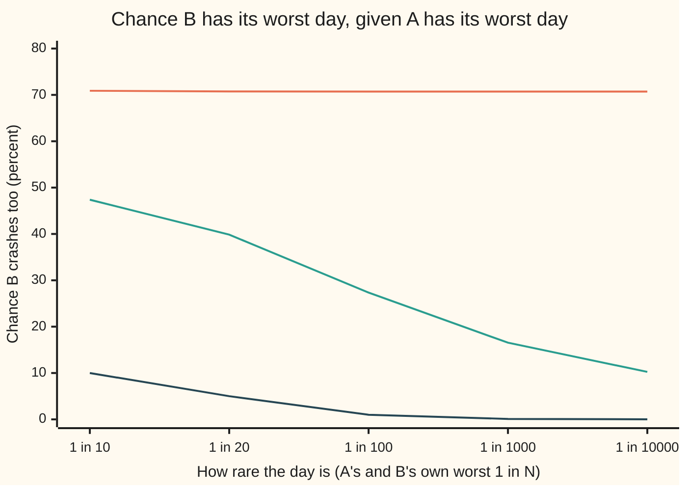

# Copulas: separating what each variable does from how they move together

[Syllabus](../../../SYLLABUS.md) → [Probability and statistics](../../../SYLLABUS.md#w09) → [Transformations and Joint Laws](../../../SYLLABUS.md#w09-s05) → Copulas

---

## General Overview

Two stock markets, A and B, trade every weekday. Each day's move is a return, in percent. Taken alone, each follows a bell curve centred on zero: A with a daily spread (standard deviation) of 1.0%, B with 1.5%. A's worst day in a hundred is a fall below −2.326%. B's is a fall below −3.490%.

A fund holds both. The question it cares about is joint: on a day when A has its worst day in a hundred, how often does B have one too? If the markets ignored each other, the answer would be 1 day in 100. They do not ignore each other. Their daily moves line up in the same direction far more often than chance. A measure of that agreement built only from the order of the days, defined below, reads 0.5.

Here is the surprise. Keep both bell curves exactly as they are. Keep the agreement at 0.5. One way of joining the two markets says B crashes too on 27.35% of A's worst days. Another says 70.71%. Push further out, to the worst day in ten thousand, and the first answer sinks to 10.25% while the second stays at 70.71%. Each market alone looks identical in both worlds. Only the way they are glued together differs.

Picture two dancers. Each wears a costume: that dancer's own habits. Separately there is the choreography: who moves when the other moves. A costume change leaves the dance untouched. In probability the costume is a variable's own distribution, called its **margin** (its law taken alone), and the choreography is the **copula** (Latin for "a bond"): the rule that joins margins into one joint law. From here on those are the words.

**Any joint law of continuous variables splits uniquely into its margins and a copula, and any copula can be dressed in any margins; the copula alone decides how often extremes arrive together.**

**What kind of fact this is:** a theorem (Sklar's theorem, 1959), proved on this card in Why it works for continuous variables; the Gaussian and Clayton copulas are two models built on it.

### The picture: how often B crashes when A does



Top line, orange: the Clayton copula, flat near 70.71% however rare the day. Middle line, teal: the Gaussian copula, sliding toward zero. Bottom line, dark: independent markets, where the chance is just the rarity itself. All three worlds give each market the same bell curve, and the top two give the same rank agreement of 0.5.

---

## The formula

Notation first, in words. For market A, $F(x)$ is the chance that A's return is at or below $x$: its cumulative distribution. It is also $x$'s **percentile rank** in A, the share of days at or below it. For B the same thing is written $G(y)$. The joint version, the chance that both happen, is written $H(x, y)$. Reminder: $\Phi$ is the standard normal's cumulative area and $\Phi^{-1}$ its quantile, the cutoff with a given area to its left.

Sklar's theorem:

$$H(x, y) = C\big(F(x),\, G(y)\big)$$

**Read it aloud:** the chance that A ends at or below x and B at or below y equals a fixed function, the copula, applied to the two markets' own percentile ranks of x and y.

The copula works on percentile ranks $u$ and $v$, numbers between 0 and 1. Read the other way, it is the joint law with the margins peeled off, where $F^{-1}(u)$ is A's return with rank $u$:

$$C(u, v) = H\big(F^{-1}(u),\, G^{-1}(v)\big)$$

The two copulas on this card:

$$C^{\text{Gauss}}_{\rho}(u, v) = P\big(Z_1 \le \Phi^{-1}(u),\ Z_2 \le \Phi^{-1}(v)\big), \qquad C^{\text{Clayton}}_{\theta}(u, v) = \left(u^{-\theta} + v^{-\theta} - 1\right)^{-1/\theta}$$

Here $Z_1$ and $Z_2$ are standard normal scores with correlation $\rho$. In words: the Gaussian copula is whatever joining a pair of bell curves with correlation $\rho$ produces, stripped of the bell shape; the Clayton copula is one closed formula with one dial, $\theta$.

The measure of extreme clustering, the **lower tail dependence**:

$$\lambda_L = \lim_{p \to 0} \frac{C(p, p)}{p} = \lim_{p \to 0} P\big(V \le p \mid U \le p\big)$$

Here $U$ and $V$ are A's and B's percentile ranks on a random day. In words: given A has its worst day in 1/p, the chance B does too, in the limit of ever rarer days.

The rank agreement both models share is **Kendall's tau**: pick two days at random; score +1 if the same day was the higher one in both markets, −1 if not; average over all pairs. Each copula ties tau to its dial:

$$\tau = \tfrac{2}{\pi}\arcsin\rho \ \ \text{(Gaussian)}, \qquad \tau = \frac{\theta}{\theta + 2} \ \ \text{(Clayton)}$$

With $\tau = 0.5$: $\rho = \sin(\pi/4) = 0.7071$ and $\theta = 2$.

| Symbol | Plain meaning | In our example | Push it up and the answer… |
| --- | --- | --- | --- |
| $X$, $Y$ | the two markets' daily returns, in percent | spreads 1.0% and 1.5% | spreads rescale the cutoffs, never the copula |
| $F$, $G$ | each market's own cumulative distribution (its margin); $F^{-1}$ turns a rank back into a return | $F$(−2%) = 0.022750 | — |
| $H$ | the joint cumulative distribution | $H$(−2%, −2.4%) = 0.021016 under Clayton | — |
| $C$ | the copula: the joint law of the two percentile ranks | $C$(0.01, 0.01) = 0.007071 under Clayton | more joint crashes |
| $u$, $v$, $U$, $V$, $r$, $n$ | percentile ranks between 0 and 1; $U = F(X)$ and $V = G(Y)$ are the random ones; rank $r$ among $n$ days sits at $r/(n+1)$ | 0.01, the worst day in 100 | — |
| $p$ | how rare the day being asked about is | 0.01 | the conditional chance rises toward 1 |
| $\Phi$, $\Phi^{-1}$, $\varphi$ | the standard normal's area to the left, its reverse, and the bell's height | $\Phi^{-1}$(0.01) = −2.326 | — |
| $\rho$, $Z_1$, $Z_2$ | correlation of two standard normal scores; the Gaussian copula's dial | 0.7071 | more joint crashes, still zero in the limit |
| $\theta$ | the Clayton copula's dial | 2 | stronger crash clustering, $\lambda_L = 2^{-1/\theta}$ rises |
| $\tau$, $D_1$, $D_2$, $D_3$ | Kendall's tau: agreeing pairs of days minus disagreeing, as a share; the three differences in its proof | 0.5 | both dials rise |
| $\lambda_L$ | lower tail dependence: joint-crash chance in the rare-day limit | Gaussian 0, Clayton 0.7071 | — |
| $W$, $E_1$, $E_2$ | a shared calm level (gamma law) and two private shocks (exponential law) that build Clayton | $W = Z^2/2$ when $\theta = 2$ | — |
| $a$, $t$, $c$, $S$, $s$ | letters local to two proofs: the cutoff $a = \Phi^{-1}(p)$ in standard units and its size $t = -a$; the spread ratio $c$ and the rescaled average $S$ of the two scores (Gaussian limit); the input $s$ of the gamma law's average (Step 4) | $a$ = −2.326 at the worst day in 100 | — |

### When it holds

- **Continuous margins.** Then the copula is unique. For a coin toss, $F(X)$ takes only the values 0.5 and 1, is not uniform, and many copulas fit the same law (What breaks, last row).
- **Any joint law has a copula.** Existence needs no assumption; only uniqueness needs continuity.
- **Increasing transformations only.** A copula survives any increasing change to one variable, such as quoting returns in basis points or cubing them. A decreasing change, such as switching both markets from returns to losses, flips the copula: lower tail becomes upper tail.
- **Tail dependence is a limit.** It describes ever rarer days. At any fixed rarity even the Gaussian gives a positive joint chance, 0.002735 at the worst day in 100.
- **Two variables here.** Sklar's theorem holds in any number of dimensions; the Gaussian copula then carries a whole correlation matrix ([Multivariate normal](06-multivariate-normal.md)).

---

## Why it works

### Step 0: a percentile rank flattens any continuous law

Replace each day's return by its percentile rank in its own market: the share of days that came out lower. A's worst day in 100 gets rank 0.01. By the definition of a percentile, ranks at or below 0.01 happen on 1% of days, ranks at or below 0.5 on half of them. Every rank is equally common. The rank has the **uniform law** on 0 to 1, whatever shape the returns had.

In symbols, for a continuous and increasing $F$, with $U = F(X)$:

$$P(U \le u) = P\big(X \le F^{-1}(u)\big) = F\big(F^{-1}(u)\big) = u$$

That is the probability integral transform: the cumulative-distribution route of [Transforming a variable](01-transforming-a-random-variable.md), applied with $F$ itself as the function. Run backwards, it is how simulations draw from any law ([Inverse transform](../11-Simulation/02-inverse-transform-sampling.md)). Both markets become uniform. Whatever joint behaviour remains is pure dependence.

### Step 1: the joint law of the ranks is the copula

Define $C$ as the joint cumulative distribution of the two ranks: $C(u, v) = P(U \le u, V \le v)$. Its margins are uniform, by Step 0. Now compute the original joint law. Because $F$ is increasing, "A's return at or below $x$" is the same event as "A's rank at or below $F(x)$". Same for B. So

$$H(x, y) = P\big(X \le x,\ Y \le y\big) = P\big(U \le F(x),\ V \le G(y)\big) = C\big(F(x),\, G(y)\big)$$

That is Sklar's formula. Uniqueness: as $x$ runs over all returns, $F(x)$ runs over every number between 0 and 1, so $H$ fixes $C$ at every point.

Check it on the example. Under Clayton with $\theta = 2$, $F$(−2%) = $\Phi$(−2) = 0.022750 and $G$(−2.4%) = $\Phi$(−1.6) = 0.054799. The formula gives $H$ = 0.021016. In 4,000 simulated days, both fell that far on 89 days: 0.022250, with standard error 0.002268. The formula sits within one standard error.

<details>
<summary>Detailed proof: Sklar's theorem, both directions</summary>

**Existence and uniqueness, continuous margins.** Let $F$ and $G$ be continuous. Set $U = F(X)$, $V = G(Y)$. For every $u$ in (0, 1) there is an $x$ with $F(x) = u$, because a continuous cumulative distribution climbs from 0 to 1 without jumps. Where $F$ is flat, $X$ falls with chance 0, so $X \le x$ and $F(X) \le F(x)$ differ only on an event of chance 0. Hence $P(U \le u) = u$, and $H(x, y) = P(U \le F(x), V \le G(y))$. Call that joint law $C$. Any other $C'$ with $H(x, y) = C'(F(x), G(y))$ agrees with $C$ at every $(F(x), G(y))$, which is every point of the square. So $C' = C$.

**Converse.** Take any copula $C$ (a joint law with uniform margins) and any margins $F$, $G$. Draw $(U, V)$ from $C$ and set $X = F^{-1}(U)$, $Y = G^{-1}(V)$, with $F^{-1}(u)$ the smallest $x$ where $F(x) \ge u$. Then $X \le x$ exactly when $U \le F(x)$, so $P(X \le x, Y \le y) = C(F(x), G(y))$, and letting y grow without bound shows $X$ has law $F$. The result is a joint law with margins $F$ and $G$ and copula $C$.

**Discrete margins.** Existence still holds (Nelsen, section 2.3, fills the gaps between the values $F$ takes). Uniqueness fails: $C$ is pinned only on the grid of values $F$ and $G$ actually take.

</details>

### Step 2: mix and match

The converse in the callout is how the code builds its markets. Draw two ranks from any copula. Push A's through $\Phi^{-1}$ times 1.0% and B's through $\Phi^{-1}$ times 1.5%. Out come the bell curves of the opening, joined by the chosen copula.

With the Gaussian copula and bell-curve margins, the result is the bivariate normal ([Bivariate normal](05-bivariate-normal-and-conditioning.md)). With the Clayton copula and the same margins, the result is a joint law that is not normal at all, though each market alone is. A joint law is not fixed by its margins and a correlation number.

### Step 3: ranks see only the copula

An increasing change to a variable leaves its ranks alone. Quote A in basis points instead of percent, or cube every return: the order of the days is unchanged. So any statistic built from ranks, Kendall's tau included, depends on the copula and on nothing else.

That gives a way to build the Gaussian copula from data without trusting the margins. Rank each market's days. Then fit $\rho$ by one of two roads:

- **Through tau.** Compute Kendall's tau from the ranks and invert $\tau = \tfrac{2}{\pi}\arcsin\rho$ to get $\rho = \sin(\pi\tau/2)$.
- **Through normal scores.** Turn rank $r$ of $n$ days into the score $\Phi^{-1}(r/(n+1))$, and take the correlation of the two markets' scores.

In 4,000 simulated days from the Clayton world, tau from the ranks is 0.4909, giving $\rho$ = 0.6969. The normal-score road gives 0.6757. They differ because the data were not made by a Gaussian copula; each road fits the closest Gaussian a different way.

<details>
<summary>Detailed proof: tau for the Gaussian copula</summary>

Take two independent days. The differences $D_1$ of A's scores and $D_2$ of B's scores are again a pair of bell curves with correlation $\rho$. The days agree when $D_1$ and $D_2$ have the same sign. Rescale both to spread 1 and write $D_2 = \rho D_1 + \sqrt{1-\rho^2}\,D_3$ with $D_3$ an independent standard normal. The pair $(D_1, D_3)$ has a circular density, so its angle is uniform on the full turn. $D_1 > 0$ is a half-turn of angles; $D_2 > 0$ is another half-turn, rotated by the angle whose cosine is $\rho$. The two overlap in a wedge of $\pi - \arccos\rho = \pi/2 + \arcsin\rho$. So
$$P(D_1 > 0, D_2 > 0) = \frac{\pi/2 + \arcsin\rho}{2\pi} = \frac14 + \frac{\arcsin\rho}{2\pi}.$$
Both negative has the same chance, so agreement has chance $\tfrac12 + \arcsin\rho/\pi$, disagreement $\tfrac12 - \arcsin\rho/\pi$, and tau, their difference, is $\tfrac{2}{\pi}\arcsin\rho$. For Clayton, a direct integral gives $\theta/(\theta+2)$ (Nelsen, section 5.1); the code meets it on data at 0.4909 against 0.5.

</details>

### Step 4: the Clayton copula from a shared calm level

Where does a formula like $(u^{-\theta} + v^{-\theta} - 1)^{-1/\theta}$ come from? From one shared cause. Let $W$ be a calm level common to both markets, drawn from the gamma law with shape $1/\theta$ ([Gamma and beta](../04-Continuous%20Distributions/07-gamma-and-beta-distributions.md)). Give each market a private shock, $E_1$ and $E_2$, independent exponential waits with average 1. Set each rank to

$$U = \left(1 + E_1/W\right)^{-1/\theta}, \qquad V = \left(1 + E_2/W\right)^{-1/\theta}.$$

When calm runs low, $E/W$ is large for both markets at once, and both ranks are dragged toward 0 together. That is a joint crash. When calm is high, each market does its own thing.

Given $W$, the two ranks are independent, and $U \le u$ exactly when $E_1 \ge W(u^{-\theta} - 1)$, which has chance $e^{-W(u^{-\theta} - 1)}$. Multiply the two chances and average over $W$:

$$C(u, v) = E\Big[e^{-W(u^{-\theta} + v^{-\theta} - 2)}\Big] = \left(1 + u^{-\theta} + v^{-\theta} - 2\right)^{-1/\theta},$$

using the gamma law's average $E[e^{-sW}] = (1 + s)^{-1/\theta}$, one integral against the gamma density. Setting $v = 1$ returns $u$, so each rank is uniform: a genuine copula. This is Marshall and Olkin's construction (1988). With $\theta = 2$ the shape is 1/2, and $W$ can be drawn as $Z^2/2$ for a standard normal $Z$; the code does exactly that.

### Step 5: tail dependence, one limit each

**Clayton.** Put $u = v = p$:

$$\frac{C(p, p)}{p} = \frac{(2p^{-\theta} - 1)^{-1/\theta}}{p} = \left(2 - p^{\theta}\right)^{-1/\theta} \longrightarrow 2^{-1/\theta}.$$

With $\theta = 2$ that is $1/\sqrt2$ = 0.7071. Already at the worst day in 10, the ratio is 0.7089; the limit arrives almost at once.

**Gaussian.** The limit is 0 for every $\rho$ below 1. The shape of the proof: for both scores to fall below a far cutoff, their average must fall below it too. The average of two correlated bell curves is a bell curve with a smaller spread, $\sqrt{(1+\rho)/2}$, and a narrower bell's tail thins faster than a wider one's. So the joint chance shrinks faster than $p$, and the ratio goes to 0. It goes slowly: 0.2735 at 1 in 100, 0.1025 at 1 in 10,000, 0.040965 at 1 in a million.

<details>
<summary>Detailed proof: the Gaussian limit is zero</summary>

Let $a = \Phi^{-1}(p)$, so $a \to -\infty$ as $p \to 0$, and write $t = -a$. If $Z_1 \le a$ and $Z_2 \le a$, then $S = (Z_1 + Z_2)/\sqrt{2(1+\rho)}$, which is standard normal, satisfies $S \le c\,a$ with $c = \sqrt{2/(1+\rho)} > 1$. So
$$0 \le \frac{C(p, p)}{p} \le \frac{\Phi(-c t)}{\Phi(-t)}.$$
Integration by parts gives the bounds $\varphi(t)\,t/(1+t^2) \le \Phi(-t) \le \varphi(t)/t$ for $t > 0$, with $\varphi$ the bell's height. Top bound on the numerator, bottom bound on the denominator:
$$\frac{\Phi(-c t)}{\Phi(-t)} \le \frac{1 + t^2}{c\,t^2}\, e^{-(c^2 - 1)t^2/2} \longrightarrow 0.$$
The squeeze gives $\lambda_L = 0$.

</details>

A second road to tail dependence is the shared scale of the Student t copula, symmetric in both tails; the finance wing works it in [Tail dependence](../../12-Financial%20mathematics/45-Portfolio%20Credit%20-%20Correlation%2C%20Copulas%2C%20Indices%20and%20Tranches/07-tail-dependence-and-the-t-copula.md).

---

## Worked numbers, by hand

The joint crash at the worst day in 100, both models, with $\tau$ = 0.5.

| Step | Arithmetic | Value |
| --- | --- | --- |
| A's cutoff | $\Phi^{-1}$(0.01) × 1.0% | −2.326% |
| B's cutoff | $\Phi^{-1}$(0.01) × 1.5% | −3.490% |
| Gaussian dial | $\rho = \sin(\pi \times 0.5/2) = \sin(\pi/4)$ | 0.7071 |
| Clayton dial | $\theta = 2 \times 0.5/(1 - 0.5)$ | 2 |
| Clayton, each rank | $0.01^{-2}$ | 10000 |
| Clayton, combine | $10000 + 10000 - 1$ | 19999 |
| Clayton joint chance | $19999^{-1/2} = 1/141.418$ | **0.007071** |
| Clayton, given A crashed | $0.007071 / 0.01$ | **70.71%** |
| Gaussian joint chance | one-dimensional integral (code) | 0.002735 |
| Gaussian, given A crashed | $0.002735 / 0.01$ | **27.35%** |
| Independent | $0.01 \times 0.01$ | 0.000100 |

Read back: in a Clayton world, B has its worst day in 100 on about 7 of every 10 of A's worst days; in a Gaussian world with the same bell curves and tau, on fewer than 3 in 10.

Sklar's formula at one point, Clayton world: $F$(−2%) = 0.022750 and $G$(−2.4%) = 0.054799. Their inverse squares are 1932.1 and 333.0, the sum minus 1 is 2264.1, and $2264.1^{-1/2}$ = 0.021016. The Gaussian copula at the same point gives 0.012255.

### What breaks if you drop a piece

| Mistake | Comes out at | What went wrong |
| --- | --- | --- |
| Treat the two crashes as independent | 0.000100 joint chance, against 0.007071 | the shared calm level is ignored |
| Fit a Gaussian copula from ranks, then count joint crashes in the worst 40 of 4,000 days | expects 10.6 days (26.4%) | the sample shows 26 days, 65.0% ± 7.5: the copula family was wrong, not the fit |
| Trust the Gaussian at the worst day in 10,000 | 10.25% | Clayton says 70.71%; the Gaussian thins toward 0 however high $\rho$ is |
| Drop continuity: two fair coin tosses | $P(F(X) \le 0.25)$ = 0.00, not 0.25 | two copulas, the product $u v$ and a patchwork, both give 0.2500 at (0.5, 0.5) but 0.0625 and 0.1250 at (0.25, 0.25): no unique copula |

The patchwork copula puts a quarter of its weight on the diagonal of each quarter of the square; both it and $u v$ reproduce the coins' joint law exactly.

---

## Code, from first principles, and it actually runs

The scripts write their own normal area (a series near 0, a continued fraction in the tails), its inverse by Newton's method, Simpson's rule, and a SplitMix64 generator seeded identically in both languages. The Gaussian joint crash is reached two ways that share only the integrator: by conditioning on market A's score, and by an angle-and-radius integral. The Clayton joint crash is reached three ways: its closed formula, a simulation through the shared calm level, and a simulation by inverting the conditional law; both simulations are also checked in the middle of the square, at (0.5, 0.5). Then 4,000 days from the Clayton world are ranked, a Gaussian copula is fitted from the ranks by two roads, and its forecast is set against the count. Last, the coin tosses: the patchwork is checked to be a copula (uniform margins, no grid square with negative chance), and it and the product uv are both checked against the coins' joint law, counted outcome by outcome. Every number on this card is printed by both.

### Python

```python
# Copulas and Sklar's theorem: the check behind the card. Standard library only.
# Two markets' daily returns: A is normal with spread 1.0 percent, B normal with 1.5.
# Ranks agree with Kendall's tau = 0.5, joined by a Gaussian copula (rho = sin(pi/4)) or a
# Clayton copula (theta = 2). Roads: exact formulas, two unrelated integrals, seeded simulations.
import math

M64 = (1 << 64) - 1
class Rng:
    def __init__(self, seed): self.s = seed
    def u(self):                                  # SplitMix64 -> uniform in (0, 1)
        self.s = (self.s + 0x9E3779B97F4A7C15) & M64
        z = self.s
        z = ((z ^ (z >> 30)) * 0xBF58476D1CE4E5B9) & M64
        z = ((z ^ (z >> 27)) * 0x94D049BB133111EB) & M64
        return ((z ^ (z >> 31)) >> 11) * 2.0 ** -53 + 2.0 ** -54
    def normal(self):                             # Box-Muller, one of the pair
        r = math.sqrt(-2.0 * math.log(self.u()))
        return r * math.cos(2.0 * math.pi * self.u())

def phi(z): return math.exp(-z * z / 2.0) / math.sqrt(2.0 * math.pi)
def Phi(z):                                       # series near 0, continued fraction in the tails
    if z < -3.0:
        x, f = -z, -z
        for k in range(200, 0, -1): f = x + k / f
        return phi(x) / f
    if z > 3.0: return 1.0 - Phi(-z)
    a, total = z, z
    for n in range(1, 100):
        a *= -z * z / (2 * n); total += a / (2 * n + 1)
    return 0.5 + total / math.sqrt(2.0 * math.pi)
def Phi_inv(p):                                   # Newton's method on Phi
    z = 0.0
    for _ in range(100):
        step = (Phi(z) - p) / phi(z); z -= step
        if abs(step) < 1e-14: break
    return z
def simpson(f, a, b, n):
    h = (b - a) / n
    return h / 3.0 * (f(a) + f(b) + sum((4 if k % 2 else 2) * f(a + k * h) for k in range(1, n)))

TAU = 0.5
SA, SB = 1.0, 1.5                                 # daily spreads of markets A and B, percent
RHO = math.sin(math.pi * TAU / 2.0)               # Gaussian parameter with this tau
TH = 2.0 * TAU / (1.0 - TAU)                      # Clayton parameter with this tau
def clayton(u, v): return (u ** -TH + v ** -TH - 1.0) ** (-1.0 / TH)
assert abs(clayton(0.3, 1.0) - 0.3) < 1e-12       # a copula's margin is uniform: C(u, 1) = u
def gauss(a, b, rho):                             # road 1: condition on market A's score
    s = math.sqrt(1.0 - rho * rho)
    return simpson(lambda x: phi(x) * Phi((b - rho * x) / s), -12.0, a, 4000)
def gauss_angle(a, rho):                          # road 2: polar angle, Rayleigh radius
    al = math.acos(rho)
    def g(t):
        m = min(-math.cos(t), -math.cos(t - al))
        return math.exp(-a * a / (2.0 * m * m)) if m > 0 else 0.0
    return simpson(g, math.pi / 2 + al, 1.5 * math.pi, 20000) / (2.0 * math.pi)

print(f"tau {TAU:.3f}  gaussian rho {RHO:.6f}  clayton theta {TH:.3f}")
a01 = Phi_inv(0.01)
assert abs(a01 - -2.3263478740408408) < 1e-12   # published 1st percentile of the bell
print(f"worst 1-in-100 day: A below {SA * a01:.3f}%, B below {SB * a01:.3f}%")
g1, g2, c01 = gauss(a01, a01, RHO), gauss_angle(a01, RHO), clayton(0.01, 0.01)
assert abs(g1 - g2) < 1e-9 * g1                  # two unrelated integrals agree
d = 2 * 0.01 ** -2 - 1                            # the Clayton value by hand
print(f"by hand: 0.01^-2 = {0.01 ** -2:.0f}, doubled minus 1 = {d:.0f}, root {math.sqrt(d):.3f}, C = {1 / math.sqrt(d):.6f}")
print(f"both crash, p=0.01: independent {0.01 * 0.01:.6f}  gaussian {g1:.6f} (angle road {g2:.6f})  clayton {c01:.6f}")

N = 400000                                        # three seeded simulations
rng = Rng(20260928)
S = math.sqrt(1.0 - RHO * RHO)
kg = kc = kd = kc2 = kd2 = 0                      # kc2, kd2: both ranks below 0.5
for _ in range(N):
    z1, z2 = rng.normal(), rng.normal()           # Gaussian copula: correlated scores
    if z1 <= a01 and RHO * z1 + S * z2 <= a01: kg += 1
    z = rng.normal(); w = z * z / 2.0             # Clayton by a shared calm level W ~ Gamma(1/2)
    e1, e2 = -math.log(rng.u()), -math.log(rng.u())
    uc, vc = (1 + e1 / w) ** (-1 / TH), (1 + e2 / w) ** (-1 / TH)
    kc += uc <= 0.01 and vc <= 0.01; kc2 += uc <= 0.5 and vc <= 0.5
    u, t = rng.u(), rng.u()                       # Clayton by conditional inversion
    v = (u ** -TH * (t ** (-TH / (1 + TH)) - 1.0) + 1.0) ** (-1 / TH)
    kd += u <= 0.01 and v <= 0.01; kd2 += u <= 0.5 and v <= 0.5
for lab, k, exact in (("gaussian", kg, g1), ("clayton, shared calm", kc, c01), ("clayton, inversion", kd, c01),
                      ("clayton 0.5, shared calm", kc2, clayton(0.5, 0.5)), ("clayton 0.5, inversion", kd2, clayton(0.5, 0.5))):
    est, se = k / N, math.sqrt(k / N * (1 - k / N) / N)
    assert abs(est - exact) < 4 * se
    print(f"simulated {lab:24s} {est:.6f} +/- {se:.6f}  exact {exact:.6f}")

print("given A has its worst 1-in-N day, chance B does too (percent):")
print("  worst day     independent   gaussian    clayton")
for p in (0.1, 0.05, 0.01, 0.001, 0.0001):
    q = Phi_inv(p)
    cg, cc = gauss(q, q, RHO) / p, clayton(p, p) / p
    print(f"  1 in {round(1 / p):<6d} {100 * p:9.2f} {100 * cg:10.2f} {100 * cc:10.2f}")
lam = clayton(1e-6, 1e-6) / 1e-6
assert abs(lam - 2 ** (-1 / TH)) < 1e-6          # formula's limit vs 2^(-1/theta)
q6 = Phi_inv(1e-6)
assert abs(q6 - -4.753424308822899) < 1e-10      # published 1-in-a-million quantile: tests the tail fraction
print(f"at p=1e-6: clayton {lam:.6f} (limit 2^(-1/theta) {2 ** (-1 / TH):.6f}), gaussian {gauss(q6, q6, RHO) / 1e-6:.6f} (limit 0)")
up = (1 - 2 * 0.99 + clayton(0.99, 0.99)) / 0.01
print(f"clayton upper tail, B in its best 1% given A is: {100 * up:.2f} percent")

n = 4000                                          # sixteen years of days from the Clayton world
rng = Rng(7)
xa, xb = [], []
for _ in range(n):
    z = rng.normal(); w = z * z / 2.0
    e1, e2 = -math.log(rng.u()), -math.log(rng.u())
    xa.append(SA * Phi_inv((1 + e1 / w) ** (-1 / TH)))
    xb.append(SB * Phi_inv((1 + e2 / w) ** (-1 / TH)))
ra, rb = [0] * n, [0] * n                         # ranks 1..n, lowest return = 1
for r, i in enumerate(sorted(range(n), key=lambda i: xa[i])): ra[i] = r + 1
for r, i in enumerate(sorted(range(n), key=lambda i: xb[i])): rb[i] = r + 1
conc = sum(1 if (ra[i] - ra[j]) * (rb[i] - rb[j]) > 0 else -1 for i in range(n) for j in range(i))
tau_hat = conc / (n * (n - 1) / 2)
assert abs(tau_hat - TAU) < 0.03                  # Clayton's tau = theta/(theta+2), met by data
sc = [Phi_inv(r / (n + 1)) for r in range(1, n + 1)]   # normal scores of the ranks
sa, sb = [sc[r - 1] for r in ra], [sc[r - 1] for r in rb]
rho_ns = sum(p * q for p, q in zip(sa, sb)) / sum(p * p for p in sa)
rho_tau = math.sin(math.pi * tau_hat / 2)
print(f"from ranks: tau-hat {tau_hat:.4f}, rho by tau {rho_tau:.4f}, rho by normal scores {rho_ns:.4f}")
m = n // 100; k = sum(1 for i in range(n) if ra[i] <= m and rb[i] <= m)
pred = gauss(a01, a01, rho_tau) / 0.01
print(f"worst {m} days of each: both on the same day {k} times ({100 * k / m:.1f}% +/- {100 * math.sqrt(k / m * (1 - k / m) / m):.1f});"
      f" fitted gaussian copula expects {m * pred:.1f} ({100 * pred:.1f}%)")
fa, fb = Phi(-2.0 / SA), Phi(-2.4 / SB)        # Sklar: H(x, y) = C(F(x), G(y))
h = clayton(fa, fb)
print(f"sklar by hand: F^-2 = {fa ** -TH:.1f}, G^-2 = {fb ** -TH:.1f}, sum minus 1 = {fa ** -TH + fb ** -TH - 1:.1f}")
k2 = sum(1 for i in range(n) if xa[i] <= -2.0 and xb[i] <= -2.4); se2 = math.sqrt(h * (1 - h) / n)
assert abs(k2 / n - h) < 4 * se2
print(f"sklar: F(-2%) {fa:.6f}, G(-2.4%) {fb:.6f}, C(F, G) {h:.6f}; days with both {k2}/{n} = {k2 / n:.6f}"
      f" +/- {se2:.6f}; gaussian copula {gauss(-2.0 / SA, -2.4 / SB, RHO):.6f}")
def patch(u, v): return sum(max(0.0, min(1.0, 2 * u - i, 2 * v - j)) for i in (0, 1) for j in (0, 1)) / 4
assert max(max(abs(patch(i / 20, 1.0) - i / 20), abs(patch(1.0, i / 20) - i / 20)) for i in range(21)) < 1e-12
assert min(patch((i + 1) / 20, (j + 1) / 20) - patch((i + 1) / 20, j / 20) - patch(i / 20, (j + 1) / 20) + patch(i / 20, j / 20)
           for i in range(20) for j in range(20)) > -1e-12   # patchwork: uniform margins, no negative rectangle, a copula
def H(x, y): return sum(0.25 for a in (0, 1) for b in (0, 1) if a <= x and b <= y)   # two fair coins, F(0) = 0.5, F(1) = 1
assert all(abs(cop((x + 1) / 2, (y + 1) / 2) - H(x, y)) < 1e-12 for cop in (lambda u, v: u * v, patch) for x in (0, 1) for y in (0, 1))
coin = sum(0.5 for x in (0, 1) if (x + 1) / 2 <= 0.25)
print(f"coin tosses: P(F(X) <= 0.25) = {coin:.2f}, not 0.25; copulas uv and patchwork (min(u,v)/2 near 0) give"
      f" C(0.5,0.5) = {0.5 * 0.5:.4f} = {patch(0.5, 0.5):.4f}, but at (0.25,0.25) {0.25 * 0.25:.4f} vs {patch(0.25, 0.25):.4f}")
print("ALL CHECKS PASS")
```

**Ran 2026-10-06 on macOS, Python 3.14.6, standard library only. All checks passed. Output, pasted from the run:**

```
tau 0.500  gaussian rho 0.707107  clayton theta 2.000
worst 1-in-100 day: A below -2.326%, B below -3.490%
by hand: 0.01^-2 = 10000, doubled minus 1 = 19999, root 141.418, C = 0.007071
both crash, p=0.01: independent 0.000100  gaussian 0.002735 (angle road 0.002735)  clayton 0.007071
simulated gaussian                 0.002848 +/- 0.000084  exact 0.002735
simulated clayton, shared calm     0.006927 +/- 0.000131  exact 0.007071
simulated clayton, inversion       0.007220 +/- 0.000134  exact 0.007071
simulated clayton 0.5, shared calm 0.378520 +/- 0.000767  exact 0.377964
simulated clayton 0.5, inversion   0.378845 +/- 0.000767  exact 0.377964
given A has its worst 1-in-N day, chance B does too (percent):
  worst day     independent   gaussian    clayton
  1 in 10         10.00      47.39      70.89
  1 in 20          5.00      39.85      70.75
  1 in 100         1.00      27.35      70.71
  1 in 1000        0.10      16.54      70.71
  1 in 10000       0.01      10.25      70.71
at p=1e-6: clayton 0.707107 (limit 2^(-1/theta) 0.707107), gaussian 0.040965 (limit 0)
clayton upper tail, B in its best 1% given A is: 2.94 percent
from ranks: tau-hat 0.4909, rho by tau 0.6969, rho by normal scores 0.6757
worst 40 days of each: both on the same day 26 times (65.0% +/- 7.5); fitted gaussian copula expects 10.6 (26.4%)
sklar by hand: F^-2 = 1932.1, G^-2 = 333.0, sum minus 1 = 2264.1
sklar: F(-2%) 0.022750, G(-2.4%) 0.054799, C(F, G) 0.021016; days with both 89/4000 = 0.022250 +/- 0.002268; gaussian copula 0.012255
coin tosses: P(F(X) <= 0.25) = 0.00, not 0.25; copulas uv and patchwork (min(u,v)/2 near 0) give C(0.5,0.5) = 0.2500 = 0.2500, but at (0.25,0.25) 0.0625 vs 0.1250
ALL CHECKS PASS
```

### Rust

```rust
// Copulas and Sklar's theorem: the check behind the card. Rust std only.
// Two markets' daily returns: A is normal with spread 1.0 percent, B normal with 1.5.
// Ranks agree with Kendall's tau = 0.5, joined by a Gaussian copula (rho = sin(pi/4)) or a
// Clayton copula (theta = 2). Roads: exact formulas, two unrelated integrals, seeded simulations.
use std::f64::consts::PI;

struct Rng(u64);
impl Rng {
    fn u(&mut self) -> f64 { // SplitMix64 -> uniform in (0, 1)
        self.0 = self.0.wrapping_add(0x9E3779B97F4A7C15);
        let mut z = self.0;
        z = (z ^ (z >> 30)).wrapping_mul(0xBF58476D1CE4E5B9);
        z = (z ^ (z >> 27)).wrapping_mul(0x94D049BB133111EB);
        ((z ^ (z >> 31)) >> 11) as f64 * 2f64.powi(-53) + 2f64.powi(-54)
    }
    fn normal(&mut self) -> f64 { // Box-Muller, one of the pair
        let r = (-2.0 * self.u().ln()).sqrt();
        r * (2.0 * PI * self.u()).cos()
    }
}

fn phi(z: f64) -> f64 { (-z * z / 2.0).exp() / (2.0 * PI).sqrt() }
fn big_phi(z: f64) -> f64 { // series near 0, continued fraction in the tails
    if z < -3.0 {
        let (x, mut f) = (-z, -z);
        for k in (1..=200).rev() { f = x + k as f64 / f; }
        return phi(x) / f;
    }
    if z > 3.0 { return 1.0 - big_phi(-z); }
    let (mut a, mut total) = (z, z);
    for n in 1..100 {
        a *= -z * z / (2 * n) as f64;
        total += a / (2 * n + 1) as f64;
    }
    0.5 + total / (2.0 * PI).sqrt()
}
fn phi_inv(p: f64) -> f64 { // Newton's method on Phi
    let mut z = 0.0;
    for _ in 0..100 {
        let step = (big_phi(z) - p) / phi(z);
        z -= step;
        if step.abs() < 1e-14 { break; }
    }
    z
}
fn simpson<F: Fn(f64) -> f64>(f: F, a: f64, b: f64, n: usize) -> f64 {
    let h = (b - a) / n as f64;
    let mut s = 0.0;
    for k in 1..n { s += (if k % 2 == 1 { 4.0 } else { 2.0 }) * f(a + k as f64 * h); }
    h / 3.0 * (f(a) + f(b) + s)
}

const TAU: f64 = 0.5;
const SA: f64 = 1.0; const SB: f64 = 1.5; // daily spreads of markets A and B, percent
fn clayton(u: f64, v: f64, th: f64) -> f64 { (u.powf(-th) + v.powf(-th) - 1.0).powf(-1.0 / th) }
fn gauss(a: f64, b: f64, rho: f64) -> f64 { // road 1: condition on market A's score
    let s = (1.0 - rho * rho).sqrt();
    simpson(|x| phi(x) * big_phi((b - rho * x) / s), -12.0, a, 4000)
}
fn gauss_angle(a: f64, rho: f64) -> f64 { // road 2: polar angle, Rayleigh radius
    let al = rho.acos();
    let g = |t: f64| {
        let m = (-t.cos()).min(-(t - al).cos());
        if m > 0.0 { (-a * a / (2.0 * m * m)).exp() } else { 0.0 }
    };
    simpson(g, PI / 2.0 + al, 1.5 * PI, 20000) / (2.0 * PI)
}

fn main() {
    let rho = (PI * TAU / 2.0).sin(); // Gaussian parameter with this tau
    let th = 2.0 * TAU / (1.0 - TAU); // Clayton parameter with this tau
    let c = |u: f64, v: f64| clayton(u, v, th);
    assert!((c(0.3, 1.0) - 0.3).abs() < 1e-12); // a copula's margin is uniform: C(u, 1) = u
    println!("tau {:.3}  gaussian rho {:.6}  clayton theta {:.3}", TAU, rho, th);
    let a01 = phi_inv(0.01);
    assert!((a01 - -2.3263478740408408).abs() < 1e-12); // published 1st percentile of the bell
    println!("worst 1-in-100 day: A below {:.3}%, B below {:.3}%", SA * a01, SB * a01);
    let (g1, g2, c01) = (gauss(a01, a01, rho), gauss_angle(a01, rho), c(0.01, 0.01));
    assert!((g1 - g2).abs() < 1e-9 * g1); // two unrelated integrals agree
    let d = 2.0 * 0.01f64.powf(-2.0) - 1.0; // the Clayton value by hand
    println!("by hand: 0.01^-2 = {:.0}, doubled minus 1 = {:.0}, root {:.3}, C = {:.6}", 0.01f64.powf(-2.0), d, d.sqrt(), 1.0 / d.sqrt());
    println!("both crash, p=0.01: independent {:.6}  gaussian {:.6} (angle road {:.6})  clayton {:.6}", 0.01 * 0.01, g1, g2, c01);

    let nsim = 400000; // three seeded simulations
    let mut rng = Rng(20260928);
    let s = (1.0 - rho * rho).sqrt();
    let (mut kg, mut kc, mut kd, mut kc2, mut kd2) = (0u64, 0u64, 0u64, 0u64, 0u64); // kc2, kd2: both ranks below 0.5
    for _ in 0..nsim {
        let (z1, z2) = (rng.normal(), rng.normal()); // Gaussian copula: correlated scores
        if z1 <= a01 && rho * z1 + s * z2 <= a01 { kg += 1; }
        let z = rng.normal(); let w = z * z / 2.0; // Clayton by a shared calm level W ~ Gamma(1/2)
        let (e1, e2) = (-rng.u().ln(), -rng.u().ln());
        let (uc, vc) = ((1.0 + e1 / w).powf(-1.0 / th), (1.0 + e2 / w).powf(-1.0 / th));
        kc += (uc <= 0.01 && vc <= 0.01) as u64; kc2 += (uc <= 0.5 && vc <= 0.5) as u64;
        let (u, t) = (rng.u(), rng.u()); // Clayton by conditional inversion
        let v = (u.powf(-th) * (t.powf(-th / (1.0 + th)) - 1.0) + 1.0).powf(-1.0 / th);
        kd += (u <= 0.01 && v <= 0.01) as u64; kd2 += (u <= 0.5 && v <= 0.5) as u64;
    }
    for (lab, k, exact) in [("gaussian", kg, g1), ("clayton, shared calm", kc, c01), ("clayton, inversion", kd, c01),
                            ("clayton 0.5, shared calm", kc2, c(0.5, 0.5)), ("clayton 0.5, inversion", kd2, c(0.5, 0.5))] {
        let est = k as f64 / nsim as f64;
        let se = (est * (1.0 - est) / nsim as f64).sqrt();
        assert!((est - exact).abs() < 4.0 * se);
        println!("simulated {:24} {:.6} +/- {:.6}  exact {:.6}", lab, est, se, exact);
    }

    println!("given A has its worst 1-in-N day, chance B does too (percent):");
    println!("  worst day     independent   gaussian    clayton");
    for p in [0.1, 0.05, 0.01, 0.001, 0.0001] {
        let q = phi_inv(p);
        let (cg, cc) = (gauss(q, q, rho) / p, c(p, p) / p);
        println!("  1 in {:<6} {:9.2} {:10.2} {:10.2}", (1.0 / p).round() as i64, 100.0 * p, 100.0 * cg, 100.0 * cc);
    }
    let lam = c(1e-6, 1e-6) / 1e-6;
    assert!((lam - 2f64.powf(-1.0 / th)).abs() < 1e-6); // formula's limit vs 2^(-1/theta)
    let q6 = phi_inv(1e-6);
    assert!((q6 - -4.753424308822899).abs() < 1e-10); // published 1-in-a-million quantile: tests the tail fraction
    println!("at p=1e-6: clayton {:.6} (limit 2^(-1/theta) {:.6}), gaussian {:.6} (limit 0)", lam, 2f64.powf(-1.0 / th), gauss(q6, q6, rho) / 1e-6);
    let up = (1.0 - 2.0 * 0.99 + c(0.99, 0.99)) / 0.01;
    println!("clayton upper tail, B in its best 1% given A is: {:.2} percent", 100.0 * up);

    let n = 4000usize; // sixteen years of days from the Clayton world
    let mut rng = Rng(7);
    let (mut xa, mut xb) = (Vec::new(), Vec::new());
    for _ in 0..n {
        let z = rng.normal(); let w = z * z / 2.0;
        let (e1, e2) = (-rng.u().ln(), -rng.u().ln());
        xa.push(SA * phi_inv((1.0 + e1 / w).powf(-1.0 / th)));
        xb.push(SB * phi_inv((1.0 + e2 / w).powf(-1.0 / th)));
    }
    let rank = |x: &Vec<f64>| { // ranks 1..n, lowest return = 1
        let mut idx: Vec<usize> = (0..n).collect();
        idx.sort_by(|&i, &j| x[i].partial_cmp(&x[j]).unwrap());
        let mut r = vec![0i64; n];
        for (k, &i) in idx.iter().enumerate() { r[i] = k as i64 + 1; }
        r
    };
    let (ra, rb) = (rank(&xa), rank(&xb));
    let conc: i64 = (0..n).map(|i| (0..i).map(|j| if (ra[i] - ra[j]) * (rb[i] - rb[j]) > 0 { 1 } else { -1 }).sum::<i64>()).sum();
    let tau_hat = conc as f64 / ((n * (n - 1)) as f64 / 2.0);
    assert!((tau_hat - TAU).abs() < 0.03); // Clayton's tau = theta/(theta+2), met by data
    let sc: Vec<f64> = (1..=n).map(|r| phi_inv(r as f64 / (n + 1) as f64)).collect(); // normal scores of the ranks
    let (sa, sb): (Vec<f64>, Vec<f64>) = ((0..n).map(|i| sc[ra[i] as usize - 1]).collect(), (0..n).map(|i| sc[rb[i] as usize - 1]).collect());
    let (sab, saa): (f64, f64) = (sa.iter().zip(&sb).map(|(p, q)| p * q).sum(), sa.iter().map(|p| p * p).sum());
    let (rho_ns, rho_tau) = (sab / saa, (PI * tau_hat / 2.0).sin());
    println!("from ranks: tau-hat {:.4}, rho by tau {:.4}, rho by normal scores {:.4}", tau_hat, rho_tau, rho_ns);
    let m = n / 100; let k = (0..n).filter(|&i| ra[i] <= m as i64 && rb[i] <= m as i64).count();
    let pred = gauss(a01, a01, rho_tau) / 0.01;
    let (fk, fm) = (k as f64, m as f64);
    println!("worst {} days of each: both on the same day {} times ({:.1}% +/- {:.1}); fitted gaussian copula expects {:.1} ({:.1}%)",
        m, k, 100.0 * fk / fm, 100.0 * (fk / fm * (1.0 - fk / fm) / fm).sqrt(), fm * pred, 100.0 * pred);
    let (fa, fb) = (big_phi(-2.0 / SA), big_phi(-2.4 / SB)); let h = c(fa, fb); // Sklar: H(x, y) = C(F(x), G(y))
    println!("sklar by hand: F^-2 = {:.1}, G^-2 = {:.1}, sum minus 1 = {:.1}", fa.powf(-th), fb.powf(-th), fa.powf(-th) + fb.powf(-th) - 1.0);
    let k2 = (0..n).filter(|&i| xa[i] <= -2.0 && xb[i] <= -2.4).count(); let (se2, f2) = ((h * (1.0 - h) / n as f64).sqrt(), k2 as f64 / n as f64);
    assert!((f2 - h).abs() < 4.0 * se2);
    println!("sklar: F(-2%) {:.6}, G(-2.4%) {:.6}, C(F, G) {:.6}; days with both {}/{} = {:.6} +/- {:.6}; gaussian copula {:.6}",
        fa, fb, h, k2, n, f2, se2, gauss(-2.0 / SA, -2.4 / SB, rho));
    let patch = |u: f64, v: f64| [(0.0, 0.0), (0.0, 1.0), (1.0, 0.0), (1.0, 1.0)].iter().map(|&(i, j): &(f64, f64)| (2.0 * u - i).min(2.0 * v - j).clamp(0.0, 1.0)).sum::<f64>() / 4.0;
    let q = |i: usize| i as f64 / 20.0;
    assert!((0..=20).all(|i| (patch(q(i), 1.0) - q(i)).abs() < 1e-12 && (patch(1.0, q(i)) - q(i)).abs() < 1e-12));
    assert!((0..20).all(|i| (0..20).all(|j| patch(q(i + 1), q(j + 1)) - patch(q(i + 1), q(j)) - patch(q(i), q(j + 1)) + patch(q(i), q(j)) > -1e-12))); // patchwork: uniform margins, no negative rectangle, a copula
    let h_coin = |x: usize, y: usize| (0..4).filter(|&w| w / 2 <= x && w % 2 <= y).count() as f64 * 0.25; // two fair coins, F(0) = 0.5, F(1) = 1
    let fc = |x: usize| (x + 1) as f64 / 2.0;
    assert!((0..4).all(|w| (fc(w / 2) * fc(w % 2) - h_coin(w / 2, w % 2)).abs() < 1e-12)); // the product uv
    assert!((0..4).all(|w| (patch(fc(w / 2), fc(w % 2)) - h_coin(w / 2, w % 2)).abs() < 1e-12)); // the patchwork
    let coin = (0..2).filter(|&x| fc(x) <= 0.25).count() as f64 * 0.5;
    println!("coin tosses: P(F(X) <= 0.25) = {:.2}, not 0.25; copulas uv and patchwork (min(u,v)/2 near 0) give C(0.5,0.5) = {:.4} = {:.4}, but at (0.25,0.25) {:.4} vs {:.4}",
        coin, 0.5 * 0.5, patch(0.5, 0.5), 0.25 * 0.25, patch(0.25, 0.25));
    println!("ALL CHECKS PASS");
}
```

**Ran 2026-10-06 on macOS, rustc 1.98.1, no crates. All checks passed. Output, pasted from the run:**

```
tau 0.500  gaussian rho 0.707107  clayton theta 2.000
worst 1-in-100 day: A below -2.326%, B below -3.490%
by hand: 0.01^-2 = 10000, doubled minus 1 = 19999, root 141.418, C = 0.007071
both crash, p=0.01: independent 0.000100  gaussian 0.002735 (angle road 0.002735)  clayton 0.007071
simulated gaussian                 0.002848 +/- 0.000084  exact 0.002735
simulated clayton, shared calm     0.006927 +/- 0.000131  exact 0.007071
simulated clayton, inversion       0.007220 +/- 0.000134  exact 0.007071
simulated clayton 0.5, shared calm 0.378520 +/- 0.000767  exact 0.377964
simulated clayton 0.5, inversion   0.378845 +/- 0.000767  exact 0.377964
given A has its worst 1-in-N day, chance B does too (percent):
  worst day     independent   gaussian    clayton
  1 in 10         10.00      47.39      70.89
  1 in 20          5.00      39.85      70.75
  1 in 100         1.00      27.35      70.71
  1 in 1000        0.10      16.54      70.71
  1 in 10000       0.01      10.25      70.71
at p=1e-6: clayton 0.707107 (limit 2^(-1/theta) 0.707107), gaussian 0.040965 (limit 0)
clayton upper tail, B in its best 1% given A is: 2.94 percent
from ranks: tau-hat 0.4909, rho by tau 0.6969, rho by normal scores 0.6757
worst 40 days of each: both on the same day 26 times (65.0% +/- 7.5); fitted gaussian copula expects 10.6 (26.4%)
sklar by hand: F^-2 = 1932.1, G^-2 = 333.0, sum minus 1 = 2264.1
sklar: F(-2%) 0.022750, G(-2.4%) 0.054799, C(F, G) 0.021016; days with both 89/4000 = 0.022250 +/- 0.002268; gaussian copula 0.012255
coin tosses: P(F(X) <= 0.25) = 0.00, not 0.25; copulas uv and patchwork (min(u,v)/2 near 0) give C(0.5,0.5) = 0.2500 = 0.2500, but at (0.25,0.25) 0.0625 vs 0.1250
ALL CHECKS PASS
```

The two outputs agree line for line.

> [!TIP]
> **Try changing**
> Guess first, then run.
> - **Double B's spread.** Set `SA, SB = 1.0, 3.0`. B's cutoff moves to −6.979%, but tau from the ranks stays 0.4909 and the joint count stays 26 of 40. Margins never touch ranks.
> - **Draw a different 4,000-day sample.** Change `Rng(7)` to `Rng(8)`. The count becomes 28 of 40 (70.0% ± 7.2) against a Gaussian forecast of 11.0. One sample moves; the gap does not.
> - **Change the rank agreement.** Set `TAU = 0.75`, so $\theta$ = 6. The shared-calm simulation's assert fails: $Z^2/2$ has the gamma law of shape 1/2 only, which belongs to $\theta = 2$. The check catches a construction used outside its range.
> - **Break the Clayton formula.** Change `-1.0 / TH` to `-1.2 / TH` in `clayton`. The margin test $C(u, 1) = u$ fails at once: the formula is no longer a copula.

---

## The usual mistake

> [!warning]
> **Treating correlation as the whole of dependence.** Two worlds on this card share both bell curves and the same Kendall's tau of 0.5. One has B crashing on 27.35% of A's worst days in 100, the other on 70.71%. Their ordinary correlations are not quite equal: on 4,000 Clayton days the normal-score road of Step 3, which with bell-curve margins tracks the ordinary correlation, reads 0.6757 against the Gaussian's 0.7071. Matching that number instead would only lower the Gaussian's 27.35%. A correlation number summarises the middle of the joint law; the copula's corners are a separate fact, and the corners are where losses live.
>
> - **Zero tail dependence is not zero joint crashes.** The Gaussian's limit is 0, yet at the worst day in 100 it still gives joint chance 0.002735, far above independence's 0.000100.
> - **Reading the limit as the answer at a finite rarity.** Tail dependence describes ever rarer days. At 1 in 100 the Gaussian is still at 27.35%; its limit of 0 matters only for stress far beyond the data.
> - **Clayton for both tails.** Clayton clusters crashes, not booms: given A is in its best 1%, B is too only 2.94% of the time, against the Gaussian's symmetric 27.35%. Losses written as positive numbers flip which tail is which.
> - **Estimating the tail from 40 days.** The count of 26 carries a standard error of 7.5 percentage points. A tail coefficient read straight off the rarest few days is noise.

---

## Where you meet it in real life

- **Markets in a sell-off.** Longin and Solnik (2001) rejected the normal model for the joint left tail of major equity markets, but not the right tail: correlation rises in bear markets, not in bull markets. That is the lopsided shape the Clayton copula writes down.
- **Credit portfolios.** Banks join single-name default chances into a joint story with a Gaussian copula driven by one economy factor ([The one-factor Gaussian copula](../../12-Financial%20mathematics/45-Portfolio%20Credit%20-%20Correlation%2C%20Copulas%2C%20Indices%20and%20Tranches/02-one-factor-gaussian-copula.md)); its zero tail dependence is the weakness this card measures.
- **Joint lives.** Clayton built his copula in 1978 to study familial tendency in chronic disease: one relative's illness raising another's risk. The same device models the joint lifetimes of couples in annuity pricing.
- **Extremes of one sample.** How the largest and smallest of many draws behave is the next card on this shelf, [Order statistics](08-order-statistics-and-extremes.md).

> **Say it back**
> Any joint law of continuous variables splits into each variable's own law and a copula, the joint law of their percentile ranks. The split is unique, and any copula can be dressed in any margins. Ranks do not change under increasing transformations, so rank statistics such as Kendall's tau see only the copula, and a Gaussian copula can be fitted from ranks alone. Two copulas with the same tau can still disagree wildly in the corner: the Gaussian's chance of a joint crash thins to zero for ever rarer days, while Clayton's stays at $2^{-1/\theta}$. That corner is tail dependence.

---

## What this builds on

- [Multivariate normal](06-multivariate-normal.md): the joint bell curve whose dependence, stripped of its margins, is the Gaussian copula.
- [Transforming a variable](01-transforming-a-random-variable.md): the cumulative-distribution route to the law of a function of a variable, which Step 0 applies to the percentile rank.
- [Joint densities](02-joint-densities-and-marginals.md): joint laws and their margins, the two things Sklar's theorem separates.

## Where this goes next

- [Order statistics](08-order-statistics-and-extremes.md): the law of the largest and smallest of a sample, the tail of one variable where this card studied the tail of two.
- [The one-factor Gaussian copula](../../12-Financial%20mathematics/45-Portfolio%20Credit%20-%20Correlation%2C%20Copulas%2C%20Indices%20and%20Tranches/02-one-factor-gaussian-copula.md): the Gaussian copula put to work on a hundred loans at once.
- [Tail dependence](../../12-Financial%20mathematics/45-Portfolio%20Credit%20-%20Correlation%2C%20Copulas%2C%20Indices%20and%20Tranches/07-tail-dependence-and-the-t-copula.md): a copula with tail dependence in both corners, and what it does to senior credit risk.

A copula says how often two markets crash together; how bad the worst day of a long run gets, for one market alone, is the question order statistics answer.

---

## Sources

Verified 2026-09-28: every DOI below resolves to the cited work (title and first author checked on Crossref).

- Nelsen, Roger B. *An Introduction to Copulas*, 2nd ed. Springer, 2006. [doi:10.1007/0-387-28678-0](https://doi.org/10.1007/0-387-28678-0). Sklar's theorem with proof (chapter 2), Kendall's tau for each family, and the Clayton formulas (chapters 4 and 5).
- Clayton, David G. "A model for association in bivariate life tables and its application in epidemiological studies of familial tendency in chronic disease incidence." *Biometrika* 65, no. 1 (1978): 141–151. [doi:10.1093/biomet/65.1.141](https://doi.org/10.1093/biomet/65.1.141). The copula used on this card, in its original setting.
- Marshall, Albert W., and Ingram Olkin. "Families of Multivariate Distributions." *Journal of the American Statistical Association* 83, no. 403 (1988): 834–841. [doi:10.1080/01621459.1988.10478671](https://doi.org/10.1080/01621459.1988.10478671). The shared-factor construction of Step 4.
- Embrechts, Paul, Alexander McNeil, and Daniel Straumann. "Correlation and Dependence in Risk Management: Properties and Pitfalls." In *Risk Management: Value at Risk and Beyond*, Cambridge University Press, 2002, 176–223. [doi:10.1017/CBO9780511615337.008](https://doi.org/10.1017/CBO9780511615337.008). Why correlation is not dependence, and tail dependence of the Gaussian copula.
- Sklar, Abe. "Fonctions de répartition à n dimensions et leurs marges." *Publications de l'Institut de Statistique de l'Université de Paris* 8 (1959): 229–231. No online edition; the theorem as first stated.
- Longin, François, and Bruno Solnik. "Extreme Correlation of International Equity Markets." *Journal of Finance* 56, no. 2 (2001): 649–676. [doi:10.1111/0022-1082.00340](https://doi.org/10.1111/0022-1082.00340). The evidence that markets crash together more than a normal model allows.
