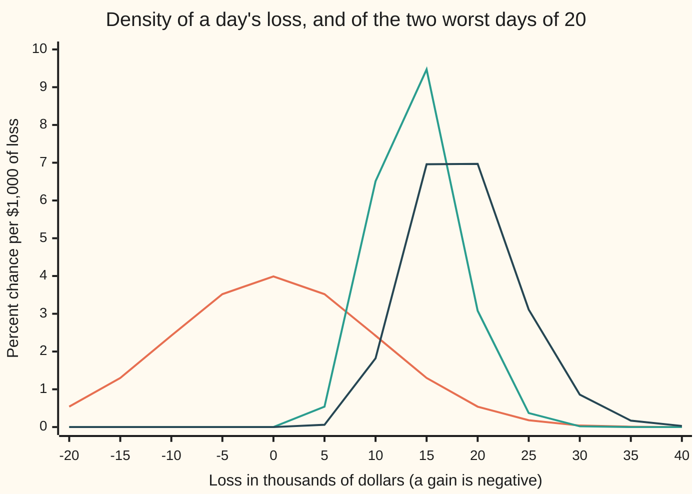
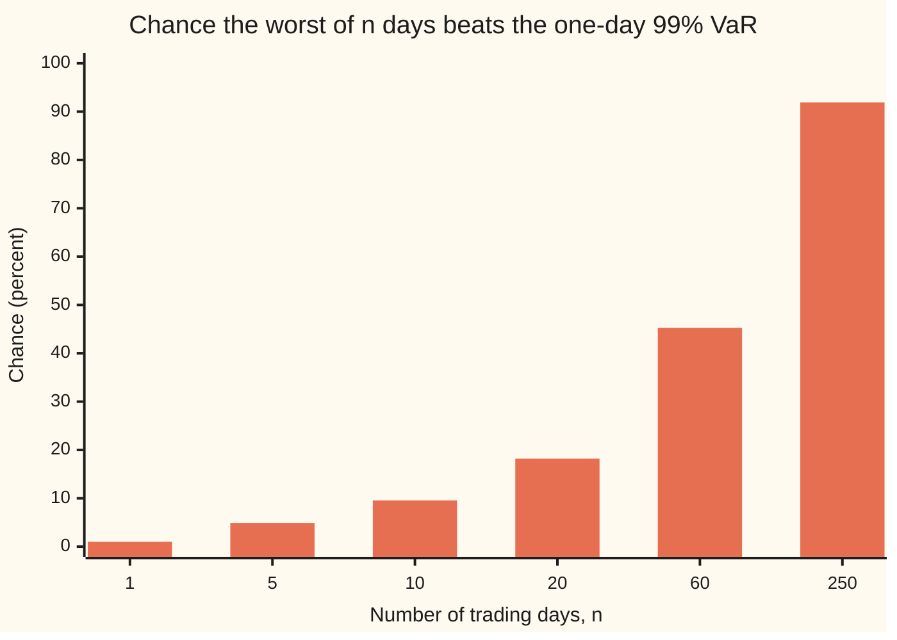

# Order statistics: the largest, the smallest and the median of a sample

[Syllabus](../../../SYLLABUS.md) → [Probability and statistics](../../../SYLLABUS.md#w09) → [Transformations and Joint Laws](../../../SYLLABUS.md#w09-s05) → Order statistics

---

## General Overview

A fund holds $1,000,000 of shares. On a typical day it gains or loses a little, and the swing has a standard deviation of $10,000. Over a trading month of 20 days, the risk desk cares less about the typical day than about the worst one.

The desk's one-day **value at risk** (VaR) at 99 percent is $23,263: the loss a single day exceeds only 1 time in 100. So how often does the worst of 20 days exceed it? Not 1 time in 100. The answer is 0.1821, a little under 1 month in 5. The worst of 20 days has its own law, and it sits well to the right of a single day's law: its median is $18,242 and its average $18,675.

Sorting a sample and asking about one place in the sorted list is what this card studies. The largest, the smallest, the second largest and the middle value are each a random quantity with a law of its own. Each law is found by the same move: turn a question about a rank into a count of how many days fall below a line. Every such count is binomial.

**The k-th smallest of n independent draws is at most x exactly when at least k of the draws are at most x; that count is binomial, which gives the maximum's law F(x)^n, the minimum's 1 − (1 − F(x))^n, and every rank's law in between.**

**What kind of fact this is:** a theorem, proved on this card in Why it works. The dollar figures also use a model: daily losses independent and bell-shaped, an assumption about markets, not a law.

### The picture: one day against the worst of twenty



Orange: a single day, the bell curve centred on zero. Green: the second-worst day of 20, tall and narrow, peaking near $13,500. Dark blue: the worst day of 20, peaking between $15,000 and $20,000, with a long right tail. Almost none of the worst day's chance lies below zero: a month with no losing day at all happens about 1 time in 1,048,576.

---

## The formula

Notation first, in words. Write the 20 daily losses as $L_1, L_2, \ldots, L_n$, with $n = 20$ days; a gain is a negative loss. Sort them from smallest to largest. The k-th value in that sorted list is written $L_{(k)}$, read "the k-th order statistic"; the round brackets in the subscript mark a rank, not a day. So $L_{(1)}$ is the smallest loss, the best day, and $L_{(n)}$ is the largest, the worst day. $F(x)$ is one day's cumulative chance of a loss at most x dollars, and $f(x)$ its density ([Densities](../04-Continuous%20Distributions/01-densities-and-cdfs.md)).

$$P\bigl(L_{(n)} \le x\bigr) = F(x)^n, \qquad P\bigl(L_{(1)} \le x\bigr) = 1 - \bigl(1 - F(x)\bigr)^n$$

**Read it aloud:** the worst day is at most x exactly when every day is, and the best day is above x exactly when every day is.

For any rank k between 1 and n, the count of days at or below x decides the question; $j$ runs over the possible counts:

$$P\bigl(L_{(k)} \le x\bigr) = \sum_{j=k}^{n} \binom{n}{j}\, F(x)^j \bigl(1 - F(x)\bigr)^{n-j}$$

**Read it aloud:** the k-th smallest is at most x when k or more of the n days are at most x, and the chance of exactly j such days is the binomial chance.

When one day's loss has a density, so does each rank. $g_k(x)$ is the density of the k-th smallest:

$$g_k(x) = \frac{n!}{(k-1)!\,(n-k)!}\; f(x)\, F(x)^{k-1} \bigl(1 - F(x)\bigr)^{n-k}$$

**Read it aloud:** one day lands at x, k − 1 of the others land below it, n − k land above it, and the fraction in front counts the ways of choosing which day is which.

| Symbol | Plain meaning | In our example | Push it up and the answer… |
| --- | --- | --- | --- |
| $n$ | the number of days in the sample | 20 trading days | the worst day moves right |
| $k$ | the rank asked about, counted from the smallest | 20 for the worst, 19 for the second worst | a larger value, further right |
| $L_i$ | the loss on day i, in dollars; a gain is negative | one day of the month | — |
| $L_{(k)}$ | the k-th smallest of the n losses | $L_{(20)}$, the worst day | — |
| $x$ | a threshold in dollars | \$23,263, the 99% VaR | larger x: a larger chance of staying under |
| $F(x)$ | one day's chance of a loss at most x | 0.99 at \$23,263 | — |
| $f(x)$ | one day's density: chance per dollar of loss near x | peaks at 0, about 4% per \$1,000 | — |
| $g_k(x)$ | the density of the k-th smallest | the dark blue curve for k = 20 | — |
| $j$ | a possible count of days at or below x | 19 or 20 for the second worst | — |
| $\binom{n}{j}$ | the number of ways to choose which j of n days | C(20, 19) = 20 ways to pick which 19 days stay under the line | — |
| $\sigma$ | the standard deviation of one day's loss | \$10,000 | every dollar figure scales with it |
| $\Phi$ | the standard normal's cumulative area | Φ(x / σ) is F(x) here | — |

In this example one day's loss follows the normal law N(0, σ^2), so $F(x) = \Phi(x/\sigma)$; the normal card writes the area as Φ ([Normal](../04-Continuous%20Distributions/04-normal-distribution.md)). The counting formulas do not need the bell: they hold for any one-day law.

### When it holds

- **Independent days.** The product F(x)^n multiplies chances, which is only allowed for independent events. Give all 20 days a shared market shock (correlation 0.5) and the worst day beats the 99% VaR in 0.1045 of months, not 0.1821.
- **One law for every day.** If day i has its own cumulative chance, the maximum's law is the product of the twenty different chances, and one binomial count no longer describes the sample.
- **A fixed number of days.** A sample that stops when a large loss appears, or keeps only the days someone chose to record, is a different law.
- **A density, for the density formula.** The cumulative formulas hold even when values can tie; the density formula needs a continuous law, where ties have chance zero.
- **The bell, for the dollar figures only.** The median $18,242 and average $18,675 come from the normal model. Another daily law with the same standard deviation moves them; the counting results about ranks, such as 0.7358 below, do not change.

---

## Why it works

### Step 0: a rank question is a counting question

Draw a line at x dollars. The k-th smallest loss is at most x exactly when at least k of the 20 days fall at or below the line. That swaps a question about sorting, which is awkward, for a question about counting, which is binomial. Each day is a trial that lands below the line with chance F(x), and independent days make independent trials ([Binomial](../03-Discrete%20Distributions/01-bernoulli-and-binomial.md)).

### Step 1: the worst day, by "every day"

The worst of 20 losses is at most x when all 20 are. With independent days the chances multiply:

$$P\bigl(L_{(20)} \le x\bigr) = F(x)^{20}$$

At the 99% VaR each day stays under with chance 0.99, so the whole month does with chance 0.99^20 = 0.8179. The worst day beats the VaR with the remaining 0.1821. The picture below repeats the calculation for months of other lengths: over a year of 250 trading days the one-day VaR is beaten on at least one day 91.89 percent of the time.



Each bar is 100 × (1 − 0.99^n). The longer the sample, the surer a rare day turns up in it.

### Step 2: the best day, by "every day" the other way

The smallest loss is above x when all 20 days are above x, which has chance (1 − F(x))^20. Its complement gives the minimum's law, $1 - (1 - F(x))^{20}$.

Two readings. The best day gains more than $20,000, a loss below −$20,000, with chance 1 − (1 − F(−20,000))^20. By the bell's symmetry that is 1 − Φ(2)^20 = 0.3689, a little over 1 month in 3. And every day of the month is a loss only when the best day is a loss, chance 0.5^20, or 1 in 1,048,576.

### Step 3: any rank, by counting

Let the count of days at or below the line be the number of successes in 20 trials with chance F(x). The k-th smallest is at most x when that count is k or more; adding the binomial chances from k to 20 gives the formula.

The second-worst day is rank 19. A risk desk that estimates the 95% VaR from 20 days of history reads off exactly this day, since 5 percent of 20 is one day beyond it. The true 95% VaR is $16,449, where F = 0.95. The second-worst day comes in at or below it when 19 or 20 of the days do:

$$0.95^{20} + 20 \times 0.05 \times 0.95^{19} = 0.7358$$

So a 20-day historical estimate falls short of the true 95% VaR in about 3 months out of 4, and its median is $13,884, not $16,449. That result used only F = 0.95 at the true VaR, never the bell's shape. It holds for any continuous daily law.

The middle of the sample works the same way. The true median daily loss is zero. The 6th and 15th sorted losses sit on either side of zero when between 6 and 14 of the 20 days are at or below zero, and with a fair half chance each that is 0.9586. That is a statement about the method: across many months, the pair of 6th and 15th values brackets the true median 0.9586 of the time, for any continuous law.

### Step 4: the density, by choosing who goes where

For the density, ask for the chance that the k-th smallest lands in a narrow band just above x. Under a density, two days in the same narrow band have a chance that shrinks faster than the width, so count one day in the band, k − 1 below it and n − k above.

- The day in the band can be any of the n days: n ways.
- The k − 1 days below are chosen from the other n − 1: $\binom{n-1}{k-1}$ ways.
- The rest go above. Each arrangement has chance f(x) × width × F(x)^(k−1) × (1 − F(x))^(n−k).

Multiplying the count n × C(n − 1, k − 1) = n! / ((k − 1)! (n − k)!) by that chance and dividing by the width gives $g_k$. For the second worst of 20 the count is 20 × 19 = 380, and for the worst it is 20, which makes $g_{20}(x) = 20\, f(x)\, F(x)^{19}$: the derivative of F(x)^20, as it must be.

<details>
<summary>Detailed proof: the density is the slope of the binomial tail</summary>

Write F for F(x) and f for f(x). The slope of $\binom{n}{j} F^j (1-F)^{n-j}$ in x is
$$f \left[\, j\binom{n}{j} F^{j-1}(1-F)^{n-j} - (n-j)\binom{n}{j} F^{j}(1-F)^{n-j-1} \right].$$
Two counting identities hold: $j\binom{n}{j} = n\binom{n-1}{j-1}$ (choose the j days, then one leader among them, or the leader first) and $(n-j)\binom{n}{j} = n\binom{n-1}{j}$ (the same with a leader outside). So each slope is n f times a difference $a_{j} - a_{j+1}$, where $a_j = \binom{n-1}{j-1} F^{j-1}(1-F)^{n-j}$ and $a_{n+1} = 0$.

Adding the slopes from j = k to n, the differences cancel in pairs and leave n f times the first term, the one with j = k:
$$g_k(x) = n\binom{n-1}{k-1} f(x)\, F(x)^{k-1}\bigl(1-F(x)\bigr)^{n-k}, \qquad n\binom{n-1}{k-1} = \frac{n!}{(k-1)!\,(n-k)!}.$$
Integrating the density from far left to x recovers the binomial tail, which the code checks by Simpson's rule for k = 19 and k = 20. Each density has total area 1, since the tail reaches 1 far to the right.

</details>

### Step 5: the median and the average of the worst day

The worst day's median is the x where F(x)^20 = 0.5, so F(x) = 0.5^(1/20) = 0.96594. The loss one day stays under with chance 0.96594 is $18,242, from the normal quantile ([Normal quantiles](../04-Continuous%20Distributions/05-normal-quantile.md)). Half of all months have a worst day below that.

The average is the area under x times $g_{20}(x)$, which has no closed form for the bell. Simpson's rule gives \$18,675, a little above the median because the right tail is long. Over a year of 250 days the worst day averages \$28,192: the maximum of bell-shaped draws keeps growing with n, but slowly.

<details>
<summary>Where the maximum settles as n grows: the Fisher–Tippett theorem</summary>

Left alone, the worst of n days drifts ever further out as n grows, or piles up against a ceiling. Shift it and rescale it by amounts that depend on n, and its law can settle to a proper shape. For independent days from one law, the Fisher–Tippett theorem says that when the rescaled maximum settles to a law not stuck at one point, that law has one of only three shapes, whatever the daily law was:
- **Gumbel**, for tails that thin like the bell's or the exponential's. The bell-shaped days on this card head there, though slowly.
- **Fréchet**, for power tails, where the chance of a loss beyond x falls like a power of x, as for the Pareto law.
- **Weibull**, for a law with a hard ceiling that no day can pass.

The three are one family with a single shape dial, the **generalised extreme value law**. This card states the theorem without proof; it is set out in Embrechts, Klüppelberg and Mikosch, chapter 3. Fitting the family to real maxima, and the matching law for losses past a high line, the generalised Pareto, is [Extreme value theory](../../12-Financial%20mathematics/39-Value%20at%20Risk%20and%20Expected%20Shortfall/07-extreme-value-theory-and-tails.md).

</details>

A second road to every rank: feed each loss through its own cumulative chance. F(L) is uniform between 0 and 1 ([Transforming a variable](01-transforming-a-random-variable.md)), and F keeps the order, so the k-th smallest loss maps to the k-th smallest of 20 uniforms. Put F = u in the density formula and it becomes the beta law with parameters k and n − k + 1 ([Gamma and beta](../04-Continuous%20Distributions/07-gamma-and-beta-distributions.md)). That is why the ranks' chances, such as 0.7358, never depend on the shape of the daily law. The beta law's average formula gives the k-th smallest of n uniforms an average of k/(n + 1): on average, n uniform draws cut the range into n + 1 equal pieces. The code checks it by Simpson's rule for k = 1, 10, 19 and 20. So for n draws spread evenly between 0 and an unknown top, the largest averages n/(n + 1) of the top, and (n + 1)/n times the largest draw is **unbiased** for the top: right on average.

---

## Worked numbers, by hand

| Step | Arithmetic | Value |
| --- | --- | --- |
| one day at most the 99% VaR, $23,263 | the definition of the VaR | 0.99 |
| all 20 days at most that | 0.99^20 | 0.8179 |
| the worst day beyond it | 1 − 0.8179 | **0.1821** |
| median of the worst day | F = 0.5^(1/20) = 0.96594, then the normal quantile | **$18,242** |
| average of the worst day | area under x times the worst day's density | $18,675 |
| second worst at most the true 95% VaR, $16,449 | 0.95^20 + 20 × 0.05 × 0.95^19 | **0.7358** |
| best day gains over $20,000 | 1 − Φ(2)^20 | 0.3689 |
| every day a loss | 0.5^20 | 1 in 1,048,576 |
| 6th and 15th values bracket the median | binomial chances of 6 to 14 days below zero | 0.9586 |

In a little under 1 month in 5 the worst day beats the one-day 99% VaR, and in half of all months the worst day loses more than $18,242.

### What breaks if you drop a piece

| Mistake | Comes out at | What went wrong |
| --- | --- | --- |
| Adding the daily chances, 20 × 0.01 | 0.2000, not 0.1821 | Months with two bad days are counted twice |
| Dropping the factor 380 from the second worst's density | total area 0.00263, not 1 | The count of who goes where is part of the density |
| Using F^20 when days share a market shock (correlation 0.5) | 0.1821, when the truth is 0.1045 | Dependent days move together, so a month with a breach is rarer than independence predicts |
| Reading the second worst of 20 days as the 95% VaR | under $16,449 in 73.58% of months | A sample extreme is a random quantity with its own law, biased low here |

The code prints all four.

---

## Code, from first principles, and it actually runs

Nothing imported contains the answer: no statistics module, no random module, no normal distribution. The normal area Φ is built from its power series, quantiles by bisection, and the random numbers by SplitMix64 (a short written-out recipe that scrambles a counter into random-looking bits), seed 20260928, shaped into bell draws by the Box-Muller recipe. Four roads meet. Road 1 is the closed forms, F^n and the binomial tail. Road 2 integrates the rank densities by Simpson's rule, a strip sum that fits a parabola across each pair of strips; it never touches the binomial tail, and it also checks the uniform road's averages k/(n + 1). Road 3 simulates 100,000 months of 20 days, sorts each month and counts, quoting standard errors. Road 4 counts exactly over every six-day sequence of a three-valued day (down, flat, up), where ties are common, and checks all 18 rank formulas exactly, with fractions in Python and whole-number counts in Rust. The asserts compare roads, never a number with itself; a simulated number may miss by up to four standard errors.

### Python

```python
# Order statistics -- the check behind the card.  Nothing imported holds the answer.
# A $1,000,000 portfolio loses L dollars a day, L ~ N(0, SIG^2) with SIG = $10,000, independent
# across N = 20 trading days.  Work in units of SIG (z = dollars / SIG).  Roads: the closed forms
# F^n and the binomial tail; Simpson's rule on the k-th density; a seeded simulation of 100,000
# months; and an exact count over every sequence of a small three-valued day, ties included.
from math import exp, log, sqrt, cos, pi
from fractions import Fraction

N, SIG, MONTHS, RHO = 20, 10000.0, 100000, 0.5

def choose(n, k):
    out = 1
    for j in range(k):
        out = out * (n - j) // (j + 1)
    return out

def phi(z):                                   # standard normal density
    return exp(-z * z / 2) / sqrt(2 * pi)

def Phi(z):                                   # its area to the left, by the odd power series
    term, s = z, z
    for k in range(250):
        term *= z * z / (2 * k + 3)
        s += term
    return 0.5 + phi(z) * s

def solve(g, target, lo=-9.0, hi=9.0):         # g increasing: bisection for g(z) = target
    for _ in range(100):
        mid = (lo + hi) / 2
        lo, hi = (mid, hi) if g(mid) < target else (lo, mid)
    return (lo + hi) / 2

def tail(k, p, n=N):                          # P(X_(k) <= x) = P(at least k of n at or below x)
    return sum(choose(n, j) * p ** j * (1 - p) ** (n - j) for j in range(k, n + 1))

def g(k, z, n=N, coef=True):                  # density of the k-th smallest of n
    c = n * choose(n - 1, k - 1) if coef else 1
    F = Phi(z)
    return c * phi(z) * F ** (k - 1) * (1 - F) ** (n - k)

def simpson(h, a, b, m=2000):                 # Simpson's rule, m even
    w = (b - a) / m
    return w / 3 * sum((1 if i in (0, m) else 4 if i % 2 else 2) * h(a + i * w) for i in range(m + 1))

MASK, state = (1 << 64) - 1, 20260928         # SplitMix64, seed 20260928, same in Rust
def uniform():
    global state
    state = (state + 0x9E3779B97F4A7C15) & MASK
    z = state
    z = ((z ^ (z >> 30)) * 0xBF58476D1CE4E5B9) & MASK
    z = ((z ^ (z >> 27)) * 0x94D049BB133111EB) & MASK
    return (((z ^ (z >> 31)) >> 11) + 0.5) / 2.0 ** 53

def normal():                                 # Box-Muller, cosine half only
    return sqrt(-2 * log(uniform())) * cos(2 * pi * uniform())

z99, z95 = solve(Phi, 0.99), solve(Phi, 0.95)
p_worst = 1 - Phi(z99) ** N                                # road 1: F^n
p_worst_int = 1 - simpson(lambda z: g(N, z), -8, z99)      # road 2: area under the density
p2 = tail(N - 1, Phi(z95))                                   # road 1: binomial tail
p2_int = simpson(lambda z: g(N - 1, z), -8, z95)             # road 2
med_worst = solve(lambda z: Phi(z) ** N, 0.5)
med2 = solve(lambda z: tail(N - 1, Phi(z)), 0.5)
mean_worst = simpson(lambda z: z * g(N, z), -8, 8)
mean_250 = simpson(lambda z: z * g(250, z, 250), -8, 8)
areas = [simpson(lambda z: g(k, z), -8, 8) for k in (1, 10, N - 1, N)]
u_mean = [simpson(lambda z: Phi(z) * g(k, z), -8, 8) for k in (1, 10, N - 1, N)]   # average of F(L_(k)), the uniform road
modes = [solve(lambda z: z - (k - 1) * phi(z) / Phi(z) + (N - k) * phi(z) / (1 - Phi(z)), 0.0) for k in (N - 1, N)]   # slope of log g_k is 0
p_best = 1 - (1 - Phi(-2.0)) ** N
p_median = sum(choose(N, j) for j in range(6, 15)) / 2 ** N
bare = simpson(lambda z: g(N - 1, z, coef=False), -8, 8)
p_dep = 1 - simpson(lambda c: phi(c) * Phi((z99 - sqrt(RHO) * c) / sqrt(1 - RHO)) ** N, -8, 8)

hits = {"worst": 0, "second": 0, "best": 0, "median": 0, "dep": 0}
s1 = s2 = 0.0
for _ in range(MONTHS):                       # road 3: simulate 100,000 months of 20 days
    days = sorted(normal() for _ in range(N))
    common = normal()
    worst = days[-1]
    s1, s2 = s1 + worst, s2 + worst * worst
    hits["worst"] += worst > z99
    hits["second"] += days[-2] <= z95
    hits["best"] += days[0] <= -2.0
    hits["median"] += days[5] <= 0.0 <= days[14]
    hits["dep"] += max(sqrt(RHO) * common + sqrt(1 - RHO) * d for d in days) > z99
sim = {key: v / MONTHS for key, v in hits.items()}
se = {key: sqrt(p * (1 - p) / MONTHS) for key, p in sim.items()}
sim_mean = s1 / MONTHS
se_mean = sqrt((s2 / MONTHS - sim_mean ** 2) / MONTHS)

checks = 0                                    # road 4: every 6-day sequence of down/flat/up
for t in (-1, 0, 1):
    p = Fraction(t + 2, 3)
    for k in range(1, 7):
        count = 0
        for w in range(3 ** 6):
            seq = sorted((w // 3 ** i) % 3 - 1 for i in range(6))
            count += seq[k - 1] <= t
        checks += Fraction(count, 3 ** 6) == sum(choose(6, j) * p ** j * (1 - p) ** (6 - j) for j in range(k, 7))

print(f"one-day 99% VaR: ${z99 * SIG:,.0f}; one-day 95% VaR: ${z95 * SIG:,.0f}")
print(f"P(worst of 20 <= 99% VaR) = 0.99^20 = {Phi(z99) ** N:.4f}")
print(f"P(worst of 20 > 99% VaR): formula {p_worst:.4f}, area under density {p_worst_int:.4f}, "
      f"simulated {sim['worst']:.4f} (se {se['worst']:.4f})")
print(f"median of the worst: ${med_worst * SIG:,.0f}; its 0.5^(1/20) = {0.5 ** (1 / N):.5f}")
print(f"mean of the worst: Simpson ${mean_worst * SIG:,.0f}, simulated ${sim_mean * SIG:,.0f} (se ${se_mean * SIG:,.0f})")
print(f"mean of the worst of 250 days: ${mean_250 * SIG:,.0f}")
print(f"P(2nd worst <= true 95% VaR): binomial {p2:.4f}, area under density {p2_int:.4f}, "
      f"simulated {sim['second']:.4f} (se {se['second']:.4f})")
print(f"median of the 2nd worst: ${med2 * SIG:,.0f}; peaks of the densities: 2nd worst ${modes[0] * SIG:,.0f}, worst ${modes[1] * SIG:,.0f}")
print(f"P(best day gains over $20,000): formula {p_best:.4f}, simulated {sim['best']:.4f} (se {se['best']:.4f})")
print(f"P(all 20 days are losses) = 0.5^20 = 1 in {2 ** N:,}")
print(f"P(6th <= true median 0 <= 15th): binomial {p_median:.4f}, simulated {sim['median']:.4f} (se {se['median']:.4f})")
print("areas under the densities of k = 1, 10, 19, 20: " + ", ".join(f"{a:.6f}" for a in areas))
print("average of F(L_(k)) for k = 1, 10, 19, 20: Simpson " + ", ".join(f"{m:.6f}" for m in u_mean) +
      "; k/(n + 1) " + ", ".join(f"{k / (N + 1):.6f}" for k in (1, 10, N - 1, N)))
print(f"exact count over 729 six-day sequences, ties included: {checks} of 18 rank CDFs match")
print("chart, loss $000, percent per $1,000: single day, 2nd worst, worst")
for x in range(-20, 45, 5):
    z = x / 10
    print(f"chart, {x}, {10 * phi(z):.2f}, {10 * g(N - 1, z):.2f}, {10 * g(N, z):.2f}")
print("bar, days n, percent chance the worst of n exceeds the 99% VaR: " +
      ", ".join(f"{n} {100 * (1 - Phi(z99) ** n):.2f}" for n in (1, 5, 10, 20, 60, 250)))
print(f"mistake 1, add the daily chances: 20 x 0.01 = {N * (1 - Phi(z99)):.4f}, not {p_worst:.4f}")
print(f"mistake 2, drop the coefficient 380: total area {bare:.5f}, not 1")
print(f"mistake 3, days share a common shock (rho {RHO}): P(worst > 99% VaR) = {p_dep:.4f} exact, "
      f"{sim['dep']:.4f} simulated (se {se['dep']:.4f}), not {p_worst:.4f}")
print(f"mistake 4, 2nd worst of 20 read as the 95% VaR: under ${z95 * SIG:,.0f} in {100 * p2:.2f}% of months")
assert abs(p_worst - p_worst_int) < 1e-6 and abs(p2 - p2_int) < 1e-6   # formula vs integral
assert abs(sim["worst"] - p_worst) < 4 * se["worst"] and abs(sim["second"] - p2) < 4 * se["second"]
assert abs(sim_mean - mean_worst) < 4 * se_mean and abs(sim["dep"] - p_dep) < 4 * se["dep"]
assert checks == 18 and all(abs(a - 1) < 1e-6 for a in areas) and abs(sim["best"] - p_best) < 4 * se["best"]
assert abs(sim["median"] - p_median) < 4 * se["median"]
assert max(abs(m - k / (N + 1)) for m, k in zip(u_mean, (1, 10, N - 1, N))) < 1e-6   # Simpson vs the beta law's k/(n + 1)
print("ALL CHECKS PASS")
```

**Ran 2026-10-06 on macOS, Python 3.14.6, standard library only. All checks passed. Output, pasted from the run:**

```
one-day 99% VaR: $23,263; one-day 95% VaR: $16,449
P(worst of 20 <= 99% VaR) = 0.99^20 = 0.8179
P(worst of 20 > 99% VaR): formula 0.1821, area under density 0.1821, simulated 0.1802 (se 0.0012)
median of the worst: $18,242; its 0.5^(1/20) = 0.96594
mean of the worst: Simpson $18,675, simulated $18,668 (se $17)
mean of the worst of 250 days: $28,192
P(2nd worst <= true 95% VaR): binomial 0.7358, area under density 0.7358, simulated 0.7362 (se 0.0014)
median of the 2nd worst: $13,884; peaks of the densities: 2nd worst $13,508, worst $17,398
P(best day gains over $20,000): formula 0.3689, simulated 0.3683 (se 0.0015)
P(all 20 days are losses) = 0.5^20 = 1 in 1,048,576
P(6th <= true median 0 <= 15th): binomial 0.9586, simulated 0.9588 (se 0.0006)
areas under the densities of k = 1, 10, 19, 20: 1.000000, 1.000000, 1.000000, 1.000000
average of F(L_(k)) for k = 1, 10, 19, 20: Simpson 0.047619, 0.476190, 0.904762, 0.952381; k/(n + 1) 0.047619, 0.476190, 0.904762, 0.952381
exact count over 729 six-day sequences, ties included: 18 of 18 rank CDFs match
chart, loss $000, percent per $1,000: single day, 2nd worst, worst
chart, -20, 0.54, 0.00, 0.00
chart, -15, 1.30, 0.00, 0.00
chart, -10, 2.42, 0.00, 0.00
chart, -5, 3.52, 0.00, 0.00
chart, 0, 3.99, 0.00, 0.00
chart, 5, 3.52, 0.54, 0.06
chart, 10, 2.42, 6.51, 1.82
chart, 15, 1.30, 9.47, 6.96
chart, 20, 0.54, 3.08, 6.97
chart, 25, 0.18, 0.37, 3.11
chart, 30, 0.04, 0.02, 0.86
chart, 35, 0.01, 0.00, 0.17
chart, 40, 0.00, 0.00, 0.03
bar, days n, percent chance the worst of n exceeds the 99% VaR: 1 1.00, 5 4.90, 10 9.56, 20 18.21, 60 45.28, 250 91.89
mistake 1, add the daily chances: 20 x 0.01 = 0.2000, not 0.1821
mistake 2, drop the coefficient 380: total area 0.00263, not 1
mistake 3, days share a common shock (rho 0.5): P(worst > 99% VaR) = 0.1045 exact, 0.1036 simulated (se 0.0010), not 0.1821
mistake 4, 2nd worst of 20 read as the 95% VaR: under $16,449 in 73.58% of months
ALL CHECKS PASS
```

### Rust

Same numbers, same labels, built with `rustc --edition 2021 -O`. The Rust `choose` works from the short side, n − k, so that 250 days stay inside 64-bit whole numbers.

```rust
// Order statistics -- the same check as the Python, in Rust.  No crates.
// A $1,000,000 portfolio loses L dollars a day, L ~ N(0, SIG^2) with SIG = $10,000, independent
// across N = 20 trading days.  Work in units of SIG (z = dollars / SIG).  Roads: the closed forms
// F^n and the binomial tail; Simpson's rule on the k-th density; a seeded simulation of 100,000
// months; and an exact count over every sequence of a small three-valued day, ties included.
use std::f64::consts::PI;

const N: usize = 20;
const SIG: f64 = 10000.0;
const MONTHS: usize = 100000;
const RHO: f64 = 0.5;

fn choose(n: usize, k: usize) -> u64 {
    let (mut out, k) = (1u64, k.min(n - k));     // the short side, so 250 days stay in range
    for j in 0..k { out = out * (n - j) as u64 / (j + 1) as u64 }
    out
}

fn phi(z: f64) -> f64 { (-z * z / 2.0).exp() / (2.0 * PI).sqrt() }   // standard normal density

fn cdf(z: f64) -> f64 {                          // its area to the left, by the odd power series
    let (mut term, mut s) = (z, z);
    for k in 0..250 { term *= z * z / (2 * k + 3) as f64; s += term }
    0.5 + phi(z) * s
}

fn solve(g: &dyn Fn(f64) -> f64, target: f64) -> f64 {   // g increasing: bisection
    let (mut lo, mut hi) = (-9.0, 9.0);
    for _ in 0..100 {
        let mid = (lo + hi) / 2.0;
        if g(mid) < target { lo = mid } else { hi = mid }
    }
    (lo + hi) / 2.0
}

fn tail(k: usize, p: f64, n: usize) -> f64 {      // P(at least k of n at or below x)
    (k..=n).map(|j| choose(n, j) as f64 * p.powi(j as i32) * (1.0 - p).powi((n - j) as i32)).sum()
}

fn g(k: usize, z: f64, n: usize, coef: bool) -> f64 {   // density of the k-th smallest of n
    let c = if coef { (n as u64 * choose(n - 1, k - 1)) as f64 } else { 1.0 };
    let f = cdf(z);
    c * phi(z) * f.powi(k as i32 - 1) * (1.0 - f).powi((n - k) as i32)
}

fn simpson(h: &dyn Fn(f64) -> f64, a: f64, b: f64) -> f64 {   // Simpson's rule, 2000 strips
    let m = 2000;
    let w = (b - a) / m as f64;
    let s: f64 = (0..=m).map(|i| {
        let wt = if i == 0 || i == m { 1.0 } else if i % 2 == 1 { 4.0 } else { 2.0 };
        wt * h(a + i as f64 * w)
    }).sum();
    w / 3.0 * s
}

struct SplitMix(u64);                             // SplitMix64, seed 20260928, same in Python
impl SplitMix {
    fn uniform(&mut self) -> f64 {
        self.0 = self.0.wrapping_add(0x9E3779B97F4A7C15);
        let mut z = self.0;
        z = (z ^ (z >> 30)).wrapping_mul(0xBF58476D1CE4E5B9);
        z = (z ^ (z >> 27)).wrapping_mul(0x94D049BB133111EB);
        (((z ^ (z >> 31)) >> 11) as f64 + 0.5) / 2f64.powi(53)
    }
    fn normal(&mut self) -> f64 {                 // Box-Muller, cosine half only
        let (u1, u2) = (self.uniform(), self.uniform());
        (-2.0 * u1.ln()).sqrt() * (2.0 * PI * u2).cos()
    }
}

fn dollars(x: f64) -> String {                    // $12,345 style
    let s = format!("{:.0}", x.abs());
    let mut out = String::new();
    for (i, ch) in s.chars().enumerate() {
        if i > 0 && (s.len() - i) % 3 == 0 { out.push(',') }
        out.push(ch);
    }
    format!("{}${}", if x < 0.0 { "-" } else { "" }, out)
}

fn main() {
    let (z99, z95) = (solve(&cdf, 0.99), solve(&cdf, 0.95));
    let p_worst = 1.0 - cdf(z99).powi(N as i32);
    let p_worst_int = 1.0 - simpson(&|z| g(N, z, N, true), -8.0, z99);
    let p2 = tail(N - 1, cdf(z95), N);
    let p2_int = simpson(&|z| g(N - 1, z, N, true), -8.0, z95);
    let med_worst = solve(&|z| cdf(z).powi(N as i32), 0.5);
    let med2 = solve(&|z| tail(N - 1, cdf(z), N), 0.5);
    let mean_worst = simpson(&|z| z * g(N, z, N, true), -8.0, 8.0);
    let mean_250 = simpson(&|z| z * g(250, z, 250, true), -8.0, 8.0);
    let areas: Vec<f64> = [1, 10, N - 1, N].iter().map(|&k| simpson(&|z| g(k, z, N, true), -8.0, 8.0)).collect();
    let u_mean: Vec<f64> = [1, 10, N - 1, N].iter().map(|&k| simpson(&|z| cdf(z) * g(k, z, N, true), -8.0, 8.0)).collect(); // the uniform road
    let modes: Vec<f64> = [N - 1, N].iter().map(|&k| solve(&|z| z - (k - 1) as f64 * phi(z) / cdf(z) + (N - k) as f64 * phi(z) / (1.0 - cdf(z)), 0.0)).collect();
    let p_best = 1.0 - (1.0 - cdf(-2.0)).powi(N as i32);
    let p_median = (6..15).map(|j| choose(N, j) as f64).sum::<f64>() / 2f64.powi(N as i32);
    let bare = simpson(&|z| g(N - 1, z, N, false), -8.0, 8.0);
    let p_dep = 1.0 - simpson(&|c| phi(c) * cdf((z99 - RHO.sqrt() * c) / (1.0 - RHO).sqrt()).powi(N as i32), -8.0, 8.0);

    let mut rng = SplitMix(20260928);
    let (mut worst_n, mut second_n, mut best_n, mut median_n, mut dep_n) = (0usize, 0usize, 0usize, 0usize, 0usize);
    let (mut s1, mut s2) = (0.0f64, 0.0f64);
    for _ in 0..MONTHS {                          // road 3: simulate 100,000 months of 20 days
        let mut days: Vec<f64> = (0..N).map(|_| rng.normal()).collect();
        days.sort_by(|a, b| a.partial_cmp(b).unwrap());
        let common = rng.normal();
        let worst = days[N - 1];
        s1 += worst; s2 += worst * worst;
        if worst > z99 { worst_n += 1 }
        if days[N - 2] <= z95 { second_n += 1 }
        if days[0] <= -2.0 { best_n += 1 }
        if days[5] <= 0.0 && 0.0 <= days[14] { median_n += 1 }
        let dep = days.iter().map(|d| RHO.sqrt() * common + (1.0 - RHO).sqrt() * d).fold(f64::MIN, f64::max);
        if dep > z99 { dep_n += 1 }
    }
    let sim = |c: usize| c as f64 / MONTHS as f64;
    let se = |c: usize| (sim(c) * (1.0 - sim(c)) / MONTHS as f64).sqrt();
    let sim_mean = s1 / MONTHS as f64;
    let se_mean = ((s2 / MONTHS as f64 - sim_mean * sim_mean) / MONTHS as f64).sqrt();

    let mut checks = 0;                           // road 4: every 6-day sequence of down/flat/up
    for t in -1i64..=1 {
        for k in 1..=6usize {
            let mut count: u64 = 0;
            for w in 0..729i64 {
                let mut seq: Vec<i64> = (0..6).map(|i| (w / 3i64.pow(i)) % 3 - 1).collect();
                seq.sort();
                if seq[k - 1] <= t { count += 1 }
            }
            let exact: u64 = (k..=6).map(|j| choose(6, j) * ((t + 2) as u64).pow(j as u32) * ((1 - t) as u64).pow((6 - j) as u32)).sum();
            if count == exact { checks += 1 }     // both sides are counts out of 3^6
        }
    }

    println!("one-day 99% VaR: {}; one-day 95% VaR: {}", dollars(z99 * SIG), dollars(z95 * SIG));
    println!("P(worst of 20 <= 99% VaR) = 0.99^20 = {:.4}", cdf(z99).powi(N as i32));
    println!("P(worst of 20 > 99% VaR): formula {:.4}, area under density {:.4}, simulated {:.4} (se {:.4})",
             p_worst, p_worst_int, sim(worst_n), se(worst_n));
    println!("median of the worst: {}; its 0.5^(1/20) = {:.5}", dollars(med_worst * SIG), 0.5f64.powf(1.0 / N as f64));
    println!("mean of the worst: Simpson {}, simulated {} (se {})", dollars(mean_worst * SIG), dollars(sim_mean * SIG), dollars(se_mean * SIG));
    println!("mean of the worst of 250 days: {}", dollars(mean_250 * SIG));
    println!("P(2nd worst <= true 95% VaR): binomial {:.4}, area under density {:.4}, simulated {:.4} (se {:.4})",
             p2, p2_int, sim(second_n), se(second_n));
    println!("median of the 2nd worst: {}; peaks of the densities: 2nd worst {}, worst {}", dollars(med2 * SIG), dollars(modes[0] * SIG), dollars(modes[1] * SIG));
    println!("P(best day gains over $20,000): formula {:.4}, simulated {:.4} (se {:.4})", p_best, sim(best_n), se(best_n));
    println!("P(all 20 days are losses) = 0.5^20 = 1 in {}", dollars(2f64.powi(N as i32)).trim_start_matches('$'));
    println!("P(6th <= true median 0 <= 15th): binomial {:.4}, simulated {:.4} (se {:.4})", p_median, sim(median_n), se(median_n));
    println!("areas under the densities of k = 1, 10, 19, 20: {}", areas.iter().map(|a| format!("{:.6}", a)).collect::<Vec<_>>().join(", "));
    println!("average of F(L_(k)) for k = 1, 10, 19, 20: Simpson {}; k/(n + 1) {}", u_mean.iter().map(|m| format!("{:.6}", m)).collect::<Vec<_>>().join(", "),
             [1, 10, N - 1, N].iter().map(|&k| format!("{:.6}", k as f64 / (N + 1) as f64)).collect::<Vec<_>>().join(", "));
    println!("exact count over 729 six-day sequences, ties included: {} of 18 rank CDFs match", checks);
    println!("chart, loss $000, percent per $1,000: single day, 2nd worst, worst");
    for x in (-20..45).step_by(5) {
        let z = x as f64 / 10.0;
        println!("chart, {}, {:.2}, {:.2}, {:.2}", x, 10.0 * phi(z), 10.0 * g(N - 1, z, N, true), 10.0 * g(N, z, N, true));
    }
    println!("bar, days n, percent chance the worst of n exceeds the 99% VaR: {}",
             [1, 5, 10, 20, 60, 250].iter().map(|&n| format!("{} {:.2}", n, 100.0 * (1.0 - cdf(z99).powi(n)))).collect::<Vec<_>>().join(", "));
    println!("mistake 1, add the daily chances: 20 x 0.01 = {:.4}, not {:.4}", N as f64 * (1.0 - cdf(z99)), p_worst);
    println!("mistake 2, drop the coefficient 380: total area {:.5}, not 1", bare);
    println!("mistake 3, days share a common shock (rho {}): P(worst > 99% VaR) = {:.4} exact, {:.4} simulated (se {:.4}), not {:.4}",
             RHO, p_dep, sim(dep_n), se(dep_n), p_worst);
    println!("mistake 4, 2nd worst of 20 read as the 95% VaR: under {} in {:.2}% of months", dollars(z95 * SIG), 100.0 * p2);
    assert!((p_worst - p_worst_int).abs() < 1e-6 && (p2 - p2_int).abs() < 1e-6);   // formula vs integral
    assert!((sim(worst_n) - p_worst).abs() < 4.0 * se(worst_n) && (sim(second_n) - p2).abs() < 4.0 * se(second_n));
    assert!((sim_mean - mean_worst).abs() < 4.0 * se_mean && (sim(dep_n) - p_dep).abs() < 4.0 * se(dep_n));
    assert!(checks == 18 && areas.iter().all(|a| (a - 1.0).abs() < 1e-6) && (sim(best_n) - p_best).abs() < 4.0 * se(best_n));
    assert!((sim(median_n) - p_median).abs() < 4.0 * se(median_n));
    assert!(u_mean.iter().zip([1, 10, N - 1, N]).all(|(m, k)| (m - k as f64 / (N + 1) as f64).abs() < 1e-6)); // Simpson vs the beta law's k/(n + 1)
    println!("ALL CHECKS PASS");
}
```

**Ran 2026-10-06 on macOS, rustc 1.98.1, no crates. All checks passed. Output, pasted from the run:**

```
one-day 99% VaR: $23,263; one-day 95% VaR: $16,449
P(worst of 20 <= 99% VaR) = 0.99^20 = 0.8179
P(worst of 20 > 99% VaR): formula 0.1821, area under density 0.1821, simulated 0.1802 (se 0.0012)
median of the worst: $18,242; its 0.5^(1/20) = 0.96594
mean of the worst: Simpson $18,675, simulated $18,668 (se $17)
mean of the worst of 250 days: $28,192
P(2nd worst <= true 95% VaR): binomial 0.7358, area under density 0.7358, simulated 0.7362 (se 0.0014)
median of the 2nd worst: $13,884; peaks of the densities: 2nd worst $13,508, worst $17,398
P(best day gains over $20,000): formula 0.3689, simulated 0.3683 (se 0.0015)
P(all 20 days are losses) = 0.5^20 = 1 in 1,048,576
P(6th <= true median 0 <= 15th): binomial 0.9586, simulated 0.9588 (se 0.0006)
areas under the densities of k = 1, 10, 19, 20: 1.000000, 1.000000, 1.000000, 1.000000
average of F(L_(k)) for k = 1, 10, 19, 20: Simpson 0.047619, 0.476190, 0.904762, 0.952381; k/(n + 1) 0.047619, 0.476190, 0.904762, 0.952381
exact count over 729 six-day sequences, ties included: 18 of 18 rank CDFs match
chart, loss $000, percent per $1,000: single day, 2nd worst, worst
chart, -20, 0.54, 0.00, 0.00
chart, -15, 1.30, 0.00, 0.00
chart, -10, 2.42, 0.00, 0.00
chart, -5, 3.52, 0.00, 0.00
chart, 0, 3.99, 0.00, 0.00
chart, 5, 3.52, 0.54, 0.06
chart, 10, 2.42, 6.51, 1.82
chart, 15, 1.30, 9.47, 6.96
chart, 20, 0.54, 3.08, 6.97
chart, 25, 0.18, 0.37, 3.11
chart, 30, 0.04, 0.02, 0.86
chart, 35, 0.01, 0.00, 0.17
chart, 40, 0.00, 0.00, 0.03
bar, days n, percent chance the worst of n exceeds the 99% VaR: 1 1.00, 5 4.90, 10 9.56, 20 18.21, 60 45.28, 250 91.89
mistake 1, add the daily chances: 20 x 0.01 = 0.2000, not 0.1821
mistake 2, drop the coefficient 380: total area 0.00263, not 1
mistake 3, days share a common shock (rho 0.5): P(worst > 99% VaR) = 0.1045 exact, 0.1036 simulated (se 0.0010), not 0.1821
mistake 4, 2nd worst of 20 read as the 95% VaR: under $16,449 in 73.58% of months
ALL CHECKS PASS
```

The two outputs match line for line, simulated figures included, because both programs draw the same numbers.

> [!TIP]
> **Try changing**
> Guess first, then run it. Change both files the same way.
> - **A quarter instead of a month.** Set `N` to 60. The chance the worst day beats the 99% VaR prints as 0.4528, the bar for 60 days. The second worst now falls under the true 95% VaR in only 19.16% of quarters: with 60 days, 5 percent is three days beyond the VaR, so the second worst sits above it.
> - **A tighter market.** Set `RHO` to 0.9. The dependent chance falls to 0.0358, heading toward the single-day 0.01, because the 20 days now nearly move as one.
> - **Break the density.** In the density function change `choose(n - 1, k - 1)` to `choose(n - 1, k)`. Three of the four printed areas leave 1 (k = 10 survives, since C(19, 9) = C(19, 10)), and the first assert stops the run, since Simpson's area no longer matches the binomial tail.
> - **Another seed.** Replace 20260928 with 7. Every simulated figure moves by about one standard error (0.1802 becomes 0.1824) and every assert still holds.

---

## The usual mistake

> [!warning]
> **Treating the worst day as a typical day.** A one-day VaR says how often one day is bad. The worst of 20 days is a different random quantity with a different law, F(x)^20, and it beats the one-day 99% VaR in 0.1821 of months, not 0.01. Reports that compare a month's worst day with a one-day limit, then call the breach a surprise, are making this error.
>
> - **Adding chances instead of multiplying.** 20 × 0.01 = 0.2000 is close to 0.1821 for rare events and badly wrong for common ones: 250 × 0.01 would claim a chance above 1, where the truth is 0.9189.
> - **Forgetting the count in front of the density.** Without the factor n! / ((k − 1)! (n − k)!), the second worst's density has area 0.00263.
> - **Assuming independence where days share a shock.** With correlation 0.5 the chance is 0.1045, not 0.1821. When days share a shock, breaches bunch into the same months: fewer months see a breach, and those that do see more of them.
> - **Reading a sample extreme as the truth.** The second worst of 20 days has median $13,884; used as the 95% VaR, it falls short of the true $16,449 in 73.58% of months.

---

## Where you meet it in real life

- **Historical value at risk.** A desk sorts the last few hundred days of profit and loss and reads off one rank; that number is an order statistic, with all the scatter this card computes ([Historical and Monte Carlo VaR](../../12-Financial%20mathematics/39-Value%20at%20Risk%20and%20Expected%20Shortfall/03-historical-and-monte-carlo-var.md)).
- **Floods and wind loads.** Engineers design a dam for the largest flood in a century of years; the law of that maximum is F^n for n years, before any long-run limit is taken.
- **Auctions.** In a sealed-bid auction where the highest bidder pays the second-highest bid, the price is the second-largest order statistic of the bids (Auctions).
- **The median and its interval.** The sample median is the middle order statistic. The pair of 6th and 15th values brackets the true median of any continuous law 0.9586 of the time for 20 draws, with no bell assumed.
- **Weakest links.** A chain, a series circuit or a team deadline fails at its weakest member: the minimum, whose law is 1 − (1 − F)^n.

> **Say it back**
> Sort a sample and each place in the sorted list is a random quantity of its own. The k-th smallest is at most x exactly when at least k of the draws are, so its law is a binomial tail; the maximum's is F^n and the minimum's 1 − (1 − F)^n. The density counts which draw sits at x and which sit below and above. For 20 independent days the worst beats the one-day 99% VaR in 0.1821 of months. Chances about ranks hold for any continuous law; dollar figures need the law, and every formula here needs independence.

---

## What this builds on

- [Joint densities](02-joint-densities-and-marginals.md): the joint law of n independent days as a product of one-day laws, which is what lets the chances in Steps 1 to 4 multiply.
- [Binomial](../03-Discrete%20Distributions/01-bernoulli-and-binomial.md): the count of days below the line, and its tail sum.
- [Normal](../04-Continuous%20Distributions/04-normal-distribution.md): Φ, the one-day law behind every dollar figure.

## Where this goes next

- [Given n arrivals, when did they happen](../../11-Stochastic%20processes%20and%20calculus/04-Poisson%20and%20Jump%20Processes/02-arrival-times-and-order-statistics.md): given how many events a Poisson stream delivered, their arrival times are sorted uniform draws.
- [Extreme value theory](../../12-Financial%20mathematics/39-Value%20at%20Risk%20and%20Expected%20Shortfall/07-extreme-value-theory-and-tails.md): the losses past a high line, whose law settles to the generalised Pareto, fitted to real data to estimate losses beyond the sample.
- Auctions: the expected second-highest bid, and why different auction rules raise the same revenue.

The worst of 20 days averages $18,675 and of 250 days $28,192, growing ever more slowly; how to put a number on losses the sample has never seen, by fitting the many days that cross a high line, is [Extreme value theory](../../12-Financial%20mathematics/39-Value%20at%20Risk%20and%20Expected%20Shortfall/07-extreme-value-theory-and-tails.md).

---

## Sources

Verified 28 Sep 2026: every link below resolves to the publisher's page.

- David, H. A., and H. N. Nagaraja. *Order Statistics*, 3rd ed. Wiley, 2003. [Publisher page](https://www.wiley.com/en-us/Order+Statistics%2C+3rd+Edition-p-9780471389262). The standard reference: the binomial tail, the rank densities, and distribution-free intervals for the median.
- Arnold, Barry C., N. Balakrishnan, and H. N. Nagaraja. *A First Course in Order Statistics*. SIAM Classics in Applied Mathematics, 2008. [doi:10.1137/1.9780898719062](https://doi.org/10.1137/1.9780898719062). A gentler route through the same formulas, including the uniform-to-beta road.
- Fisher, R. A., and L. H. C. Tippett. "Limiting forms of the frequency distribution of the largest or smallest member of a sample." *Mathematical Proceedings of the Cambridge Philosophical Society* 24, no. 2 (1928): 180–190. [doi:10.1017/S0305004100015681](https://doi.org/10.1017/S0305004100015681). Where the law of the maximum as the sample grows was first worked out.
- Embrechts, Paul, Claudia Klüppelberg, and Thomas Mikosch. *Modelling Extremal Events for Insurance and Finance*. Springer, 1997. [doi:10.1007/978-3-642-33483-2](https://doi.org/10.1007/978-3-642-33483-2). Maxima and order statistics applied to losses.
- Siegrist, Kyle. "Order Statistics." *Probability, Mathematical Statistics, and Stochastic Processes*, Random Services. [Online chapter](https://www.randomservices.org/random/sample/OrderStatistics.html). Free; the rank laws with worked uniform examples.
