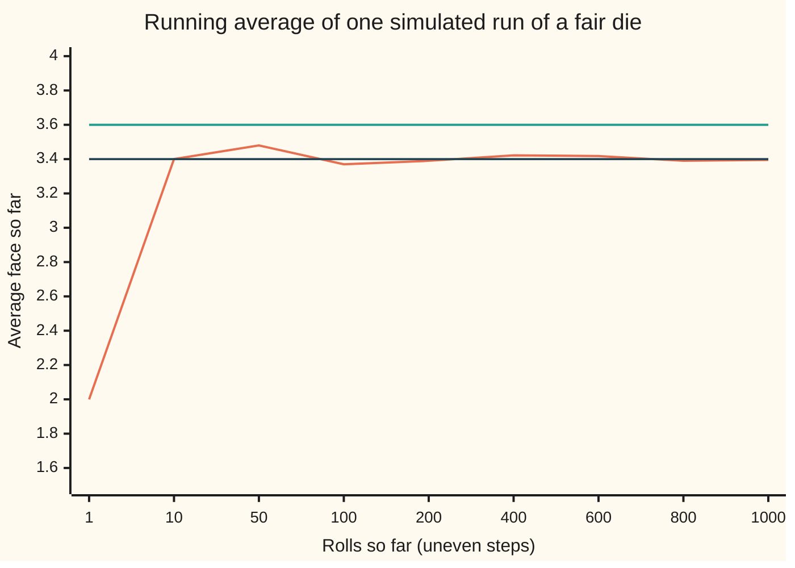
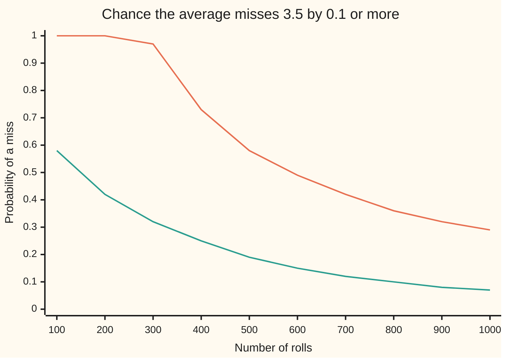

# Law of large numbers: averages settle down

[Syllabus](../../../SYLLABUS.md) → [Probability and statistics](../../../SYLLABUS.md#w09) → [Limit Theorems in Practice](../../../SYLLABUS.md#w09-s06) → Law of large numbers

---

## General Overview

A games shop tests each new batch of dice the same way. One die from the batch is rolled 1,000 times, and the 1,000 faces are averaged. A fair die shows 1 to 6 equally often, so its long-run average is 3.5. The shop accepts the batch if the average lands between 3.4 and 3.6.

A single roll is no guide: it is 1 or 6 as often as 3 or 4. Yet the average of 1,000 rolls is pinned tightly. Without listing a single outcome, one inequality guarantees that a fair die passes the test with probability at least 0.708: at least 7 runs in 10. The exact figure, from the full law of the sum of 1,000 dice, is 0.9346: about 15 runs in 16.

That guarantee tightens toward certainty as the rolls pile up. The chance that the average misses 3.5 by 0.1 or more falls to zero as the number of rolls grows, and the same holds for any tolerance, however small. This is the **law of large numbers**, in the form called the weak law. It is the reason a sample average can stand in for a long-run average at all.

**The average of many independent draws from one law lands close to that law's mean with a probability that tends to 1; with a finite variance, Chebyshev's inequality proves it and says how fast: the chance of a miss falls at least as fast as one over the number of draws.**

**What kind of fact this is:** a theorem, the weak law, proved on this card in Why it works under a finite variance; the strong law and the finite-mean-only version are stated and left to wing 10.

### The picture: one run of 1,000 rolls



Orange: the running average of one seeded run. Green and dark: the shop's band, 3.6 and 3.4. The first roll showed a 2; by 400 rolls the average has settled near 3.4. This run ends at 3.395, just outside the band: it is one of the roughly 1 run in 15 that miss. The law promises a probability, not the outcome of any single run.

---

## The formula

A reminder of the wing's notation. $P(A)$ is the chance of an event $A$. A random variable is written with a capital letter; here $X_i$ is the face on roll number $i$. $E[X]$ is the expectation, the long-run average, and $\mathrm{Var}(X)$ is the variance, the average squared distance from the mean.

Two new names. The total of the first $n$ rolls is $S_n = X_1 + X_2 + \dots + X_n$. The average of the first $n$ rolls is written $\bar{X}_n$, read "X-bar n":

$$\bar{X}_n = \frac{S_n}{n} = \frac{X_1 + X_2 + \dots + X_n}{n}$$

Write $\mu$ (Greek mu) for the mean of one roll, $E[X_i]$, here 3.5, and $\sigma^2$ (sigma squared) for its variance, here 35/12; $\sigma$ is the standard deviation. The average has the same mean as one roll and one $n$-th of its variance:

$$E[\bar{X}_n] = \mu, \qquad \mathrm{Var}(\bar{X}_n) = \frac{\sigma^2}{n}$$

Pick a tolerance $\varepsilon$ (Greek epsilon), here 0.1. Chebyshev's inequality, applied to the average, turns its variance into a guarantee:

$$P\big(\lvert \bar{X}_n - \mu \rvert \ge \varepsilon\big) \le \frac{\sigma^2}{n\,\varepsilon^2}$$

**Read it aloud:** the chance that the average of $n$ rolls misses the mean by at least $\varepsilon$ is at most the variance of one roll divided by $n$ times $\varepsilon$ squared.

The right side shrinks to zero as $n$ grows, for every fixed $\varepsilon$. So the left side does too. That limit is the weak law of large numbers:

$$P\big(\lvert \bar{X}_n - \mu \rvert \ge \varepsilon\big) \to 0 \quad \text{as } n \to \infty, \text{ for every } \varepsilon > 0$$

**Read it aloud:** however small the tolerance, the chance of missing by that much goes to zero as the rolls pile up. The name for this kind of limit is **convergence in probability**: $\bar{X}_n$ converges in probability to $\mu$.

| Symbol | Plain meaning | In our example | Push it up and the answer… |
| --- | --- | --- | --- |
| $X_i$, $i$ | the face on roll number $i$: one draw | 1 to 6, each with chance 1/6 | — |
| $Z_i$ | the error of one draw, $X_i - \mu$ | −2.5 to 2.5 | — |
| $n$ | the number of draws averaged | 1,000 rolls | the miss bound falls like $1/n$ |
| $S_n$ | the total of the first $n$ draws | about 3,500 | its spread grows like $\sqrt{n}$ |
| $\bar{X}_n$ | the average of the first $n$ draws, $S_n / n$ | 3.395 in the pictured run | its spread shrinks like $1/\sqrt{n}$ |
| $\mu$ | the mean of one draw, $E[X_i]$ | 3.5 | the target moves; the law is unchanged |
| $\sigma^2$, $\sigma$ | the variance of one draw, and its standard deviation | 35/12 = 2.9167, and 1.708 | the miss bound rises in proportion to $\sigma^2$ |
| $\sigma / \sqrt{n}$ | the standard deviation of the average: its spread | 0.054 | — |
| $\varepsilon$ | the tolerance, Greek epsilon | 0.1 | the miss bound falls like $1/\varepsilon^2$ |
| $\delta$ | the miss chance allowed, Greek delta | 0.05 | the rolls needed fall like $1/\delta$ |
| $A$, $P(A)$ | an event, and its chance | "the average misses by 0.1 or more": 0.0654 exactly | — |

### When it holds

- **Independent draws.** Each roll must carry no information about the others. Record one roll and copy it 1,000 times: each copy still has the fair-die law, but the average is that one face, never within 0.1 of 3.5. The chance of a miss is 1 at every $n$.
- **A finite mean.** There must be a long-run average to settle on. The Cauchy law ([Heavy tails](../04-Continuous%20Distributions/08-heavy-tails-pareto-and-cauchy.md)) has none: the average of 1,000 Cauchy draws lands outside −1 to 1 about half the time, exactly as often as one draw does.
- **A finite variance, for this proof.** Chebyshev needs $\sigma^2$. The law itself survives with a finite mean alone (Khinchin's weak law), but its proof needs cutting large values off, done with measure in wing 10.
- **A fixed $n$ and a fixed $\varepsilon$.** The bound speaks about one sample size at a time. It says nothing about every later average staying inside the band together, and nothing about stopping the rolls once the average looks good.
- **The same mean for every draw.** A die that wears as it rolls has a moving mean; the average then settles on the average of the means, not on 3.5.

---

## Why it works

### Step 0: highs and lows cancel, and independence makes them cancel fast

A 6 followed by a 1 averages 3.5. Over many rolls, faces above 3.5 are offset by faces below it. The question is how fast. Independence gives the answer. Square the total's error, and the cross terms between different rolls average to zero; only the $n$ squared errors of single rolls remain. So the total's spread grows only like the square root of $n$. Dividing by $n$ then crushes it. Chebyshev's inequality converts that small spread into a small chance of a miss.

### Step 1: the average aims at the right place

The expectation of a sum is the sum of the expectations, independent or not. So $E[S_n] = n\mu$ and $E[\bar{X}_n] = n\mu / n = \mu$. For 1,000 rolls the average aims at 3.5. The exact law of the sum of 1,000 dice, computed in the code, gives the same 3.5.

### Step 2: one roll's variance

The mean square of a face is $(1 + 4 + 9 + 16 + 25 + 36)/6 = 15.1667$. Subtract the squared mean, 12.25, to get $\sigma^2 = 2.9167$, which is 35/12. The same number comes from the closed form for a fair die numbered 1 to 6: (6 × 6 − 1)/12.

### Step 3: the variance of the total grows like n

The variance of a sum is the sum of the variances plus twice the covariance of every pair ([Two variables at once](../02-Random%20Variables/04-joint-distributions-and-covariance.md)). Independent rolls have covariance zero, so every pair term vanishes and $\mathrm{Var}(S_n) = n\sigma^2$. The total's spread is $\sigma\sqrt{n}$: 54.01 for 1,000 rolls.

### Step 4: the variance of the average shrinks like 1/n

Dividing a random quantity by $n$ divides its variance by $n^2$. So $\mathrm{Var}(\bar{X}_n) = n\sigma^2 / n^2 = \sigma^2 / n$. For 1,000 rolls that is 0.002917, a spread of 0.054: the house figure for this shelf.

### Step 5: Chebyshev turns the spread into a guarantee

Chebyshev's inequality ([Markov and Chebyshev](../02-Random%20Variables/08-markov-and-chebyshev-inequalities.md)) says any random quantity with a finite variance lands at least $\varepsilon$ from its mean with chance at most its variance divided by $\varepsilon^2$. Apply it to the average, whose variance is $\sigma^2 / n$:

$$P\big(\lvert \bar{X}_{1000} - 3.5 \rvert \ge 0.1\big) \le \frac{2.9167}{1000 \times 0.01} = 0.2917$$

A miss has chance at most 0.2917. A hit, landing strictly inside 3.4 to 3.6, has chance at least 0.7083. That is the shop's guarantee.

### Step 6: let n grow

The bound $\sigma^2 / (n\varepsilon^2)$ goes to zero as $n$ grows, for any fixed $\varepsilon$. So does the chance of a miss, since it sits below the bound and above zero. That is the weak law.

<details>
<summary>Detailed proof</summary>

**Setting.** Let $X_1, X_2, \dots$ be independent, each with mean $\mu$ and variance $\sigma^2$, both finite. Fix $n \ge 1$ and $\varepsilon > 0$.

**Mean.** By linearity of expectation, $E[S_n] = \sum_{i=1}^{n} E[X_i] = n\mu$, so $E[\bar{X}_n] = \mu$.

**Variance.** Write $Z_i = X_i - \mu$, so each $Z_i$ has mean 0 and $E[Z_i^2] = \sigma^2$. Then $S_n - n\mu = \sum_i Z_i$, and squaring the sum gives $n$ square terms and $n(n-1)$ cross terms:
$$E\Big[\big(\textstyle\sum_i Z_i\big)^2\Big] = \sum_{i} E[Z_i^2] + \sum_{i \ne j} E[Z_i Z_j].$$
For $i \ne j$, independence gives $E[Z_i Z_j] = E[Z_i]\,E[Z_j] = 0$. So $\mathrm{Var}(S_n) = n\sigma^2$, and dividing by $n^2$ gives $\mathrm{Var}(\bar{X}_n) = \sigma^2 / n$. Only the vanishing of the cross terms was used: uncorrelated draws with a common mean and variance are enough.

**Chebyshev.** Applied to $\bar{X}_n$, whose mean is $\mu$ and variance $\sigma^2/n$:
$$P\big(\lvert \bar{X}_n - \mu \rvert \ge \varepsilon\big) \le \frac{\sigma^2}{n\varepsilon^2}.$$

**Limit.** The left side lies between 0 and $\sigma^2 / (n\varepsilon^2)$, and the right side tends to 0 as $n$ grows. So the left side tends to 0. As $\varepsilon$ was arbitrary, $\bar{X}_n$ converges in probability to $\mu$.

**Sample size.** To make the miss chance at most a chosen $\delta$ (Greek delta) between 0 and 1, it is enough that $\sigma^2 / (n\varepsilon^2) \le \delta$, that is $n \ge \sigma^2 / (\delta\varepsilon^2)$. Rounding up gives the smallest $n$ this bound certifies. It need not be the smallest $n$ that actually works.

</details>

### The rate: how fast the average settles

Two rates run side by side. The spread of the average falls like $1/\sqrt{n}$: 0.108 at 250 rolls, 0.054 at 1,000, 0.027 at 4,000. Quadrupling the rolls halves the spread. The Chebyshev bound on a miss falls faster, like $1/n$, because it is built from the variance, the spread squared.

The true chance of a miss falls faster still. The chart puts Chebyshev's ceiling beside the exact miss chance, computed from the full law of the sum.



Orange, top: Chebyshev's ceiling $\sigma^2/(n\varepsilon^2)$, capped at 1; up to 291 rolls it says nothing. Green, bottom: the exact chance of a miss. The exact curve always sits under the ceiling and falls away from it.

The gap costs rolls. To push the miss chance to 5% or less, Chebyshev asks for $n \ge 2.9167 / (0.05 \times 0.01)$, which rounds up to 5,834 rolls: the bound there is 0.049994, and at 5,833 it is 0.050003. The exact law gets under 5% at 1,117 rolls, with a miss chance of 0.0497. It wobbles back above 5% for a few sizes, because the sum can only take whole-number values and the band's edges fall between them differently at each $n$; from 1,131 rolls on it stays below, checked to 1,200. Chebyshev's figure is safe for every law with this variance, and far more cautious than this one needs. Sharper tools recover the gap: the shape of the error ([Central limit theorem](02-central-limit-theorem.md)) and tails that fall exponentially ([Concentration](06-concentration-inequalities-hoeffding-and-chernoff.md)).

<details>
<summary>The strong law, stated</summary>

The weak law speaks about one $n$ at a time. The **strong law** speaks about a whole infinite run: with probability 1, the running average of independent draws from one law with a finite mean eventually settles on $\mu$ and stays within any tolerance from some roll on. It rules out a run that keeps wandering out of the band forever. Its proof needs probability built on measure, which is wing 10's subject; this card states it and does not use it. The simulated runs below are evidence for it, not proof.

</details>

---

## Worked numbers, by hand

| Step | Arithmetic | Value |
| --- | --- | --- |
| mean of one roll | (1 + 2 + 3 + 4 + 5 + 6) / 6 | 3.5 |
| mean square of one roll | (1 + 4 + 9 + 16 + 25 + 36) / 6 | 15.1667 |
| variance of one roll | 15.1667 − 3.5 × 3.5 | 2.9167 |
| variance of the average | 2.9167 / 1,000 | 0.002917 |
| spread of the average | square root of 0.002917 | 0.054 |
| Chebyshev's miss bound | 2.9167 / (1,000 × 0.1 × 0.1) | 0.2917 |
| **guaranteed hit** | 1 − 0.2917 | **at least 0.7083** |
| exact hit, from the law of the sum | the code adds the chances of every total from 3,401 to 3,599 | 0.9346 |

A fair die passes the shop's 1,000-roll test at least 7 times in 10, whatever else is true of it; this one passes about 15 times in 16.

The simulation agrees: in 4,000 seeded runs of 1,000 rolls, a share of 0.9348 hit the band, with a standard error (the typical size of a simulation's miss) of 0.0039. The variance of the 4,000 averages is 0.002931, with a standard error of about 0.000065, against 0.002917 from the formula.

### What breaks if you drop a piece

| Mistake | Comes out at | What went wrong |
| --- | --- | --- |
| One roll copied 1,000 times, not independent | miss chance 1.000 at every $n$; the average's variance stays 2.9167 | no new information arrives, so nothing cancels |
| Cauchy draws, no mean | share of averages outside −1 to 1: 0.4875 at one draw, 0.4995 at 1,000, standard error 0.0112 | there is no mean to settle on |
| Variance of the average taken as $\sigma^2/n^2$ | a "bound" of 0.000292, under the true miss chance 0.0654 | dividing by $n$ divides variance by $n^2$, but the sum's variance grew by $n$ first |
| Chebyshev at 100 or 200 rolls | a ceiling of 1.00; the exact miss chance is 0.58 and 0.42 | true, and empty: the bound helps only once $n\varepsilon^2$ passes $\sigma^2$ |

The code prints all four.

---

## Code, from first principles, and it actually runs

The scripts reach the chance of a hit by three independent roads. Road 1 is Chebyshev's bound from the variance alone. Road 2 is the exact law of the sum of 1,000 dice, built one die at a time: the chance of each total after one more roll is the average of six earlier chances. Road 3 rolls 4,000 runs of 1,000 dice from SplitMix64, a short, well-tested recipe for pseudo-random whole numbers written out in both languages, so both draw the same rolls. Whether an average misses is tested in whole numbers, $5 \lvert 2S_n - 7n \rvert \ge n$, so no rounding decides a boundary case. The rate chart, the sample sizes, the Cauchy draws and the broken cases come from the same runs.

### Python

```python
# Law of large numbers -- the check behind the card; only math is imported.
# A fair die rolled 1,000 times.  Chebyshev promises the average lands within
# 0.1 of 3.5 with chance at least 0.7.  Three roads to that chance: the bound
# from the variance alone, the exact law of the sum of 1,000 dice, and a seeded
# simulation of 4,000 runs of 1,000 rolls.  Then the rate, and what breaks.
import math

FACES, N, EPS, RUNS, CRUNS, SEED = range(1, 7), 1000, 0.1, 4000, 2000, 20260928
M64 = 0xFFFFFFFFFFFFFFFF

def splitmix64(s):                     # the generator both languages share
    s = (s + 0x9E3779B97F4A7C15) & M64
    z = ((s ^ (s >> 30)) * 0xBF58476D1CE4E5B9) & M64
    z = ((z ^ (z >> 27)) * 0x94D049BB133111EB) & M64
    return s, z ^ (z >> 31)

def add_one_die(p):                    # p[t] = chance the sum is n + t; roll once more
    pre = [0.0]
    for q in p:
        pre.append(pre[-1] + q)
    L = len(p)
    return [(pre[min(t + 1, L)] - pre[max(t - 5, 0)]) / 6 for t in range(L + 5)]

def misses(n, s):                      # |s/n - 3.5| >= 0.1, tested in whole numbers
    return 5 * abs(2 * s - 7 * n) >= n

def miss_chance(n, p):                 # exact chance the average misses by 0.1 or more
    lo, hi = max(int(2.4 * n) - 3, 0), min(int(2.6 * n) + 3, len(p) - 1)
    return 1 - sum(p[t] for t in range(lo, hi + 1) if not misses(n, n + t))

def row(label, v):
    print(f"{label:<54} {v:>11.6f}")

mu = sum(FACES) / 6                                  # one roll, by counting its faces
var = sum(x * x for x in FACES) / 6 - mu * mu
bound = var / (N * EPS * EPS)                        # road 1: Chebyshev, variance alone

p, exact, first_ok, last_bad = [1.0], {}, None, 0    # road 2: the exact law of the sum
for n in range(1, 1201):
    p = add_one_die(p)
    exact[n] = miss_chance(n, p)
    if exact[n] <= 0.05:
        first_ok = first_ok or n
    else:
        last_bad = n
    if n == N:
        pN = p
mean_avg = sum((N + t) * q for t, q in enumerate(pN)) / N
var_avg = sum(((N + t) / N - mean_avg) * ((N + t) / N - mean_avg) * q for t, q in enumerate(pN))

state, hits, s1, s2, path = SEED, 0, 0.0, 0.0, []    # road 3: 4,000 runs of 1,000 rolls
for r in range(RUNS):
    total = 0
    for i in range(1, N + 1):
        state, z = splitmix64(state)
        total += z % 6 + 1
        if r == 0 and i in (1, 10, 50, 100, 200, 400, 600, 800, 1000):
            path.append(total / i)
    hits += not misses(N, total)
    s1 += total / N
    s2 += (total / N) * (total / N)
sim_hit = hits / RUNS
sim_se = math.sqrt(sim_hit * (1 - sim_hit) / RUNS)
sim_var = s2 / RUNS - (s1 / RUNS) * (s1 / RUNS)

c_one = c_avg = 0                                    # Cauchy draws: no mean to settle on
for r in range(CRUNS):
    total = 0.0
    for i in range(N):
        state, z = splitmix64(state)
        x = math.tan(math.pi * ((z >> 11) * 2.0 ** -53 - 0.5))
        c_one += i == 0 and abs(x) >= 1
        total += x
    c_avg += abs(total / N) >= 1
c_se = math.sqrt(0.25 / CRUNS)

n95 = (35 * 20 * 100 + 11) // 12                    # 5% miss: n >= 35/12 / (0.05 * 0.01)

row("one roll: mean, by counting the faces", mu)
row("one roll: mean square, by counting the faces", sum(x * x for x in FACES) / 6)
row("one roll: variance, by counting the faces", var)
row("one roll: variance, formula (6^2 - 1)/12", (6 ** 2 - 1) / 12)
row("1 Chebyshev: variance of the average, var/n", var / N)
row("1 Chebyshev: spread of the average", math.sqrt(var / N))
row("1 Chebyshev: miss bound var/(n eps^2)", bound)
row("1 Chebyshev: guaranteed hit, 1 - bound", 1 - bound)
row("2 exact law of the sum: mean of the average", mean_avg)
row("2 exact: variance of the average", var_avg)
row("2 exact: miss chance, |avg - 3.5| >= 0.1", exact[N])
row("2 exact: hit chance", 1 - exact[N])
row("3 simulated, 4,000 runs: hit share", sim_hit)
row("3   its standard error", sim_se)
row("3 simulated: variance of the average", sim_var)
row("3   its standard error", (var / N) * math.sqrt(2 / RUNS))
print("chart, one run's running average at n = 1 10 50 100 200 400 600 800 1000:")
print("chart,", " ".join(f"{a:.3f}" for a in path), "| band 3.40 to 3.60")
print("chart,    n   Chebyshev bound   exact miss")
for n in range(100, 1001, 100):
    print(f"chart, {n:>4}   {min(1.0, var / (n * EPS * EPS)):>15.2f}   {exact[n]:>10.2f}")
for n in (250, 1000, 4000):
    row(f"rate: spread of the average at n = {n}", math.sqrt(var / n))
print(f"95% by Chebyshev: n = {n95}; exact law first reaches miss <= 0.05 at n = {first_ok},"
      f" last above 0.05 at n = {last_bad} (checked to 1,200)")
row(f"Chebyshev bound at n = {n95}", var / (n95 * EPS * EPS))
row(f"Chebyshev bound at n = {n95 - 1}", var / ((n95 - 1) * EPS * EPS))
row(f"exact miss chance at n = {first_ok}", exact[first_ok])
cmiss = [sum(misses(n, n * f) for f in FACES) / 6 for n in range(1, 1201)]  # copies: total is n x roll 1
cvar = sum((N * f / N - mu) * (N * f / N - mu) for f in FACES) / 6          # the copied average's variance
row("broken 1, one roll copied 1,000 times: miss chance", cmiss[N - 1])
row("broken 1: variance of the average", cvar)
row("broken 2, Cauchy: share with |draw| >= 1, n = 1", c_one / CRUNS)
row("broken 2, Cauchy: share with |average| >= 1, n = 1000", c_avg / CRUNS)
row("broken 2:   standard error of each share", c_se)
row("broken 3, variance of the average as var/n^2: 'bound'", var / (N * N * EPS * EPS))
row("broken 3: the exact miss chance it undercuts", exact[N])
for n in (100, 1000, 10000):
    row(f"the sum drifts: spread of S - 3.5n at n = {n}", math.sqrt(n * var))

assert abs(var - (6 ** 2 - 1) / 12) < 1e-12, "counting vs the closed form"
assert abs(mean_avg - mu) < 1e-9, "exact law: mean of the average"
assert abs(var_avg - var / N) < 1e-9, "exact law vs var/n"
assert all(exact[n] <= var / (n * EPS * EPS) for n in range(1, 1201)), "exact under Chebyshev"
assert abs(sim_hit - (1 - exact[N])) < 4 * sim_se, "simulation vs exact law"
assert abs(sim_var - var / N) < 4 * (var / N) * math.sqrt(2 / RUNS), "simulated spread"
assert abs(c_avg / CRUNS - 0.5) < 4 * c_se, "Cauchy averages stay as wild as one draw"
assert var / (n95 * EPS * EPS) <= 0.05 < var / ((n95 - 1) * EPS * EPS), "whole-number n95"
assert min(cmiss) == 1, "copied rolls miss at every n up to 1,200"
assert abs(cvar - var) < 1e-12, "a copied average keeps one roll's variance"
assert var / (N * N * EPS * EPS) < exact[N], "var/n^2 promises less than the truth"
print("ALL CHECKS PASS")
```

**Ran 2026-10-06 on macOS, Python 3.14.6, standard library only. All checks passed. Output, pasted from the run:**

```
one roll: mean, by counting the faces                     3.500000
one roll: mean square, by counting the faces             15.166667
one roll: variance, by counting the faces                 2.916667
one roll: variance, formula (6^2 - 1)/12                  2.916667
1 Chebyshev: variance of the average, var/n               0.002917
1 Chebyshev: spread of the average                        0.054006
1 Chebyshev: miss bound var/(n eps^2)                     0.291667
1 Chebyshev: guaranteed hit, 1 - bound                    0.708333
2 exact law of the sum: mean of the average               3.500000
2 exact: variance of the average                          0.002917
2 exact: miss chance, |avg - 3.5| >= 0.1                  0.065410
2 exact: hit chance                                       0.934590
3 simulated, 4,000 runs: hit share                        0.934750
3   its standard error                                    0.003905
3 simulated: variance of the average                      0.002931
3   its standard error                                    0.000065
chart, one run's running average at n = 1 10 50 100 200 400 600 800 1000:
chart, 2.000 3.400 3.480 3.370 3.390 3.422 3.418 3.390 3.395 | band 3.40 to 3.60
chart,    n   Chebyshev bound   exact miss
chart,  100              1.00         0.58
chart,  200              1.00         0.42
chart,  300              0.97         0.32
chart,  400              0.73         0.25
chart,  500              0.58         0.19
chart,  600              0.49         0.15
chart,  700              0.42         0.12
chart,  800              0.36         0.10
chart,  900              0.32         0.08
chart, 1000              0.29         0.07
rate: spread of the average at n = 250                    0.108012
rate: spread of the average at n = 1000                   0.054006
rate: spread of the average at n = 4000                   0.027003
95% by Chebyshev: n = 5834; exact law first reaches miss <= 0.05 at n = 1117, last above 0.05 at n = 1130 (checked to 1,200)
Chebyshev bound at n = 5834                               0.049994
Chebyshev bound at n = 5833                               0.050003
exact miss chance at n = 1117                             0.049725
broken 1, one roll copied 1,000 times: miss chance        1.000000
broken 1: variance of the average                         2.916667
broken 2, Cauchy: share with |draw| >= 1, n = 1           0.487500
broken 2, Cauchy: share with |average| >= 1, n = 1000     0.499500
broken 2:   standard error of each share                  0.011180
broken 3, variance of the average as var/n^2: 'bound'     0.000292
broken 3: the exact miss chance it undercuts              0.065410
the sum drifts: spread of S - 3.5n at n = 100            17.078251
the sum drifts: spread of S - 3.5n at n = 1000           54.006172
the sum drifts: spread of S - 3.5n at n = 10000         170.782513
ALL CHECKS PASS
```

### Rust

Same numbers, same labels, same generator and seed.

```rust
// Law of large numbers -- the check behind the card, in Rust, std only.
// A fair die rolled 1,000 times.  Chebyshev promises the average lands within
// 0.1 of 3.5 with chance at least 0.7.  Three roads to that chance: the bound
// from the variance alone, the exact law of the sum of 1,000 dice, and a seeded
// simulation of 4,000 runs of 1,000 rolls.  Then the rate, and what breaks.
use std::f64::consts::PI;

const N: i64 = 1000;
const EPS: f64 = 0.1;
const RUNS: usize = 4000;
const CRUNS: usize = 2000;
const SEED: u64 = 20260928;

fn splitmix64(s: u64) -> (u64, u64) {
    // the generator both languages share
    let s = s.wrapping_add(0x9E3779B97F4A7C15);
    let mut z = (s ^ (s >> 30)).wrapping_mul(0xBF58476D1CE4E5B9);
    z = (z ^ (z >> 27)).wrapping_mul(0x94D049BB133111EB);
    (s, z ^ (z >> 31))
}

fn add_one_die(p: &[f64]) -> Vec<f64> {
    // p[t] = chance the sum is n + t; roll once more
    let mut pre = vec![0.0];
    for &q in p {
        let last = *pre.last().unwrap();
        pre.push(last + q);
    }
    let l = p.len();
    (0..l + 5).map(|t| (pre[(t + 1).min(l)] - pre[t.saturating_sub(5)]) / 6.0).collect()
}

fn misses(n: i64, s: i64) -> bool {
    // |s/n - 3.5| >= 0.1, tested in whole numbers
    5 * (2 * s - 7 * n).abs() >= n
}

fn miss_chance(n: i64, p: &[f64]) -> f64 {
    // exact chance the average misses by 0.1 or more
    let lo = ((2.4 * n as f64) as i64 - 3).max(0);
    let hi = ((2.6 * n as f64) as i64 + 3).min(p.len() as i64 - 1);
    let mut hit = 0.0;
    for t in lo..=hi {
        if !misses(n, n + t) { hit += p[t as usize]; }
    }
    1.0 - hit
}

fn row(label: &str, v: f64) {
    println!("{:<54} {:>11.6}", label, v);
}

fn main() {
    let faces: Vec<f64> = (1..=6).map(|x| x as f64).collect();
    let mu = faces.iter().sum::<f64>() / 6.0; // one roll, by counting its faces
    let var = faces.iter().map(|x| x * x).sum::<f64>() / 6.0 - mu * mu;
    let nf = N as f64;
    let bound = var / (nf * EPS * EPS); // road 1: Chebyshev, variance alone

    let (mut p, mut exact) = (vec![1.0f64], vec![0.0f64; 1201]); // road 2: the exact law
    let (mut first_ok, mut last_bad, mut p_n) = (0i64, 0i64, Vec::new());
    for n in 1..=1200i64 {
        p = add_one_die(&p);
        exact[n as usize] = miss_chance(n, &p);
        if exact[n as usize] <= 0.05 {
            if first_ok == 0 { first_ok = n; }
        } else {
            last_bad = n;
        }
        if n == N { p_n = p.clone(); }
    }
    let mean_avg = p_n.iter().enumerate().map(|(t, q)| (N + t as i64) as f64 * q).sum::<f64>() / nf;
    let var_avg: f64 = p_n.iter().enumerate()
        .map(|(t, q)| { let d = (N + t as i64) as f64 / nf - mean_avg; d * d * q }).sum();

    let (mut state, mut hits, mut s1, mut s2) = (SEED, 0usize, 0.0f64, 0.0f64); // road 3
    let mut path: Vec<f64> = Vec::new();
    for r in 0..RUNS {
        let mut total: i64 = 0;
        for i in 1..=N {
            let (s, z) = splitmix64(state);
            state = s;
            total += (z % 6) as i64 + 1;
            if r == 0 && [1, 10, 50, 100, 200, 400, 600, 800, 1000].contains(&i) {
                path.push(total as f64 / i as f64);
            }
        }
        hits += !misses(N, total) as usize;
        let a = total as f64 / nf;
        s1 += a;
        s2 += a * a;
    }
    let sim_hit = hits as f64 / RUNS as f64;
    let sim_se = (sim_hit * (1.0 - sim_hit) / RUNS as f64).sqrt();
    let sim_var = s2 / RUNS as f64 - (s1 / RUNS as f64) * (s1 / RUNS as f64);

    let (mut c_one, mut c_avg) = (0usize, 0usize); // Cauchy draws: no mean to settle on
    for _ in 0..CRUNS {
        let mut total = 0.0f64;
        for i in 0..N {
            let (s, z) = splitmix64(state);
            state = s;
            let x = (PI * ((z >> 11) as f64 * 2f64.powi(-53) - 0.5)).tan();
            c_one += (i == 0 && x.abs() >= 1.0) as usize;
            total += x;
        }
        c_avg += ((total / nf).abs() >= 1.0) as usize;
    }
    let c_se = (0.25 / CRUNS as f64).sqrt();

    let n95: i64 = (35 * 20 * 100 + 11) / 12; // 5% miss: n >= 35/12 / (0.05 * 0.01)
    let bnd = |n: i64| var / (n as f64 * EPS * EPS);

    row("one roll: mean, by counting the faces", mu);
    row("one roll: mean square, by counting the faces", faces.iter().map(|x| x * x).sum::<f64>() / 6.0);
    row("one roll: variance, by counting the faces", var);
    row("one roll: variance, formula (6^2 - 1)/12", (6.0f64 * 6.0 - 1.0) / 12.0);
    row("1 Chebyshev: variance of the average, var/n", var / nf);
    row("1 Chebyshev: spread of the average", (var / nf).sqrt());
    row("1 Chebyshev: miss bound var/(n eps^2)", bound);
    row("1 Chebyshev: guaranteed hit, 1 - bound", 1.0 - bound);
    row("2 exact law of the sum: mean of the average", mean_avg);
    row("2 exact: variance of the average", var_avg);
    row("2 exact: miss chance, |avg - 3.5| >= 0.1", exact[N as usize]);
    row("2 exact: hit chance", 1.0 - exact[N as usize]);
    row("3 simulated, 4,000 runs: hit share", sim_hit);
    row("3   its standard error", sim_se);
    row("3 simulated: variance of the average", sim_var);
    row("3   its standard error", (var / nf) * (2.0 / RUNS as f64).sqrt());
    println!("chart, one run's running average at n = 1 10 50 100 200 400 600 800 1000:");
    let pts: Vec<String> = path.iter().map(|a| format!("{:.3}", a)).collect();
    println!("chart, {} | band 3.40 to 3.60", pts.join(" "));
    println!("chart,    n   Chebyshev bound   exact miss");
    for n in (100..=1000).step_by(100) {
        println!("chart, {:>4}   {:>15.2}   {:>10.2}", n, bnd(n).min(1.0), exact[n as usize]);
    }
    for n in [250i64, 1000, 4000] {
        row(&format!("rate: spread of the average at n = {}", n), (var / n as f64).sqrt());
    }
    println!("95% by Chebyshev: n = {}; exact law first reaches miss <= 0.05 at n = {}, last above 0.05 at n = {} (checked to 1,200)",
             n95, first_ok, last_bad);
    row(&format!("Chebyshev bound at n = {}", n95), bnd(n95));
    row(&format!("Chebyshev bound at n = {}", n95 - 1), bnd(n95 - 1));
    row(&format!("exact miss chance at n = {}", first_ok), exact[first_ok as usize]);
    let cmiss: Vec<f64> = (1..=1200i64).map(|n| (1..=6i64).filter(|&f| misses(n, n * f)).count() as f64 / 6.0).collect(); // copies
    let cvar = faces.iter().map(|f| (nf * f / nf - mu) * (nf * f / nf - mu)).sum::<f64>() / 6.0; // copied average's variance
    row("broken 1, one roll copied 1,000 times: miss chance", cmiss[N as usize - 1]);
    row("broken 1: variance of the average", cvar);
    row("broken 2, Cauchy: share with |draw| >= 1, n = 1", c_one as f64 / CRUNS as f64);
    row("broken 2, Cauchy: share with |average| >= 1, n = 1000", c_avg as f64 / CRUNS as f64);
    row("broken 2:   standard error of each share", c_se);
    row("broken 3, variance of the average as var/n^2: 'bound'", var / (nf * nf * EPS * EPS));
    row("broken 3: the exact miss chance it undercuts", exact[N as usize]);
    for n in [100i64, 1000, 10000] {
        row(&format!("the sum drifts: spread of S - 3.5n at n = {}", n), (n as f64 * var).sqrt());
    }

    assert!((var - 35.0 / 12.0).abs() < 1e-12, "counting vs the closed form");
    assert!((mean_avg - mu).abs() < 1e-9, "exact law: mean of the average");
    assert!((var_avg - var / nf).abs() < 1e-9, "exact law vs var/n");
    assert!((1..=1200).all(|n| exact[n as usize] <= bnd(n)), "exact under Chebyshev");
    assert!((sim_hit - (1.0 - exact[N as usize])).abs() < 4.0 * sim_se, "simulation vs exact law");
    assert!((sim_var - var / nf).abs() < 4.0 * (var / nf) * (2.0 / RUNS as f64).sqrt(), "simulated spread");
    assert!((c_avg as f64 / CRUNS as f64 - 0.5).abs() < 4.0 * c_se, "Cauchy averages stay wild");
    assert!(bnd(n95) <= 0.05 && 0.05 < bnd(n95 - 1), "whole-number n95");
    assert!(cmiss.iter().all(|&c| c == 1.0), "copied rolls miss at every n up to 1,200");
    assert!((cvar - var).abs() < 1e-12, "a copied average keeps one roll's variance");
    assert!(var / (nf * nf * EPS * EPS) < exact[N as usize], "var/n^2 promises less than the truth");
    println!("ALL CHECKS PASS");
}
```

**Ran 2026-10-06 on macOS, rustc 1.98.1, no crates. All checks passed. Output, pasted from the run:**

```
one roll: mean, by counting the faces                     3.500000
one roll: mean square, by counting the faces             15.166667
one roll: variance, by counting the faces                 2.916667
one roll: variance, formula (6^2 - 1)/12                  2.916667
1 Chebyshev: variance of the average, var/n               0.002917
1 Chebyshev: spread of the average                        0.054006
1 Chebyshev: miss bound var/(n eps^2)                     0.291667
1 Chebyshev: guaranteed hit, 1 - bound                    0.708333
2 exact law of the sum: mean of the average               3.500000
2 exact: variance of the average                          0.002917
2 exact: miss chance, |avg - 3.5| >= 0.1                  0.065410
2 exact: hit chance                                       0.934590
3 simulated, 4,000 runs: hit share                        0.934750
3   its standard error                                    0.003905
3 simulated: variance of the average                      0.002931
3   its standard error                                    0.000065
chart, one run's running average at n = 1 10 50 100 200 400 600 800 1000:
chart, 2.000 3.400 3.480 3.370 3.390 3.422 3.418 3.390 3.395 | band 3.40 to 3.60
chart,    n   Chebyshev bound   exact miss
chart,  100              1.00         0.58
chart,  200              1.00         0.42
chart,  300              0.97         0.32
chart,  400              0.73         0.25
chart,  500              0.58         0.19
chart,  600              0.49         0.15
chart,  700              0.42         0.12
chart,  800              0.36         0.10
chart,  900              0.32         0.08
chart, 1000              0.29         0.07
rate: spread of the average at n = 250                    0.108012
rate: spread of the average at n = 1000                   0.054006
rate: spread of the average at n = 4000                   0.027003
95% by Chebyshev: n = 5834; exact law first reaches miss <= 0.05 at n = 1117, last above 0.05 at n = 1130 (checked to 1,200)
Chebyshev bound at n = 5834                               0.049994
Chebyshev bound at n = 5833                               0.050003
exact miss chance at n = 1117                             0.049725
broken 1, one roll copied 1,000 times: miss chance        1.000000
broken 1: variance of the average                         2.916667
broken 2, Cauchy: share with |draw| >= 1, n = 1           0.487500
broken 2, Cauchy: share with |average| >= 1, n = 1000     0.499500
broken 2:   standard error of each share                  0.011180
broken 3, variance of the average as var/n^2: 'bound'     0.000292
broken 3: the exact miss chance it undercuts              0.065410
the sum drifts: spread of S - 3.5n at n = 100            17.078251
the sum drifts: spread of S - 3.5n at n = 1000           54.006172
the sum drifts: spread of S - 3.5n at n = 10000         170.782513
ALL CHECKS PASS
```

The two outputs match line for line.

> [!TIP]
> **Try changing**
> Guess first, then run it.
> - **A die numbered 0 to 5.** Change `z % 6 + 1` to `z % 6` in both. The averages now settle on 2.5, the new die's mean, so almost no run lands in the band; the assert comparing the simulation with the exact law stops the program. The law finds the true mean, not the hoped-for one.
> - **Give the heavy draws a mean.** Replace the Cauchy draw with `(z >> 11) * 2.0 ** -53 - 0.5` in Python, and its twin in Rust: a uniform draw between −0.5 and 0.5. Every average of 1,000 now sits near 0, the share outside −1 to 1 drops to 0, and the Cauchy assert fails because the averages have settled.
> - **Too few rolls.** Set `N` to 250. The bound rises above 1 and the guaranteed hit turns negative, yet every assert still passes: a ceiling above 1 is true and says nothing, as at 100 and 200 rolls in the rate chart.
> - **Another seed.** Change `SEED`. The pictured run changes; about 15 seeds in 16 end inside the band.

---

## The usual mistake

> [!warning]
> **Reading the law as "things even out".** The law says the average settles. It does not say the total does, and it does not say a run of low rolls is owed high ones (the gambler's fallacy). The dice have no memory. The gap between the total and 3.5 times the number of rolls typically grows: its spread is 17.08 at 100 rolls, 54.01 at 1,000 and 170.78 at 10,000. The average settles only because that growing gap is divided by an $n$ that grows faster.
>
> - **Taking Chebyshev's 0.7083 as the chance of a hit.** It is a floor valid for every law with variance 35/12. The fair die's exact chance is 0.9346.
> - **Taking 5,834 as the rolls needed.** It is what the bound certifies. The exact law is under a 5% miss from 1,131 rolls on.
> - **Expecting every run to land in the band.** The pictured run ends at 3.395, a miss. At 1,000 rolls about 1 fair run in 15 fails the shop's test, and a failed test alone does not prove the die unfair.
> - **Averaging draws that share a cause.** Copies, or draws driven by one common factor, cancel nothing; the miss chance stays at 1 for a copied roll.

---

## Where you meet it in real life

- **Insurance and casinos.** One policy or one bet is a gamble; the average payout over thousands is close to its expected value. The house edge becomes income because of this law.
- **Polls and samples.** A sample share of voters stands in for the population's share, and its error shrinks as the sample grows ([Samples and estimators](../07-Sampling%20and%20Estimation/01-populations-samples-and-estimators.md)).
- **Simulation.** Every Monte Carlo estimate, including prices in finance, is a sample average trusted because of this law, and quoted with its standard error because of its rate.
- **Growth of wealth.** Repeated bets compound, so the average of the logarithms of the growth factors settles; that is the idea behind [Kelly](../../12-Financial%20mathematics/36-Returns%20and%20Utility/05-kelly-criterion-and-growth.md).
- **Machine learning.** Training on random batches works because a batch average of errors settles near the full average (Stochastic gradient).

> **Say it back**
> The average of many independent draws has the same mean as one draw and one $n$-th of its variance. Chebyshev's inequality turns that small variance into a small chance of missing the mean by any fixed tolerance, and that chance goes to zero as the draws pile up. For 1,000 rolls of a fair die, the average lands within 0.1 of 3.5 with chance at least 0.7083 by the bound, and 0.9346 exactly. The law fails when the draws are copies of each other or have no mean, as with the Cauchy law. It is about the average, never about the total evening out.

---

## What this builds on

- [Markov and Chebyshev](../02-Random%20Variables/08-markov-and-chebyshev-inequalities.md): the inequality that turns the average's variance into the guarantee.

## Where this goes next

- [Central limit theorem](02-central-limit-theorem.md): the shape of the leftover error, which approximates the 0.9346 without building the full law of the sum.
- [Samples and estimators](../07-Sampling%20and%20Estimation/01-populations-samples-and-estimators.md): a sample average used as an estimate, with its standard error.
- [The weak law of large numbers](../../10-Measure%20and%20integration/10-The%20Limit%20Theorems%2C%20Proved/03-weak-law-of-large-numbers.md): the same law proved with measure, with only a finite mean.
- [Kelly](../../12-Financial%20mathematics/36-Returns%20and%20Utility/05-kelly-criterion-and-growth.md): the law applied to the logarithm of wealth.
- [The one-factor Gaussian copula](../../12-Financial%20mathematics/45-Portfolio%20Credit%20-%20Correlation%2C%20Copulas%2C%20Indices%20and%20Tranches/02-one-factor-gaussian-copula.md): a large loan pool whose defaults share one factor, so the average settles on a random level, not a fixed one.
- Typical sequences: the law applied to the log-probability of a message, which is why data compresses.
- Stochastic gradient: optimising a sample average in place of an expectation.
- Q-learning: running averages of rewards that settle on expected values.
- Large gaps: primes modelled as random draws, whose counts obey the law.

The law says the average lands close; it does not say how the misses are shaped, or why the exact 0.9346 sits so far above the guaranteed 0.7083. The bell curve that answers both is [Central limit theorem](02-central-limit-theorem.md).

---

## Sources

Verified 28 Sep 2026: every link below resolves to the publisher's page.

- Grinstead, Charles M., and J. Laurie Snell. *Introduction to Probability*, 2nd revised ed. American Mathematical Society, 1997. [Free edition from Dartmouth](https://math.dartmouth.edu/~prob/prob/prob.pdf). Chapter 8 proves the weak law from Chebyshev's inequality, with worked examples.
- Feller, William. *An Introduction to Probability Theory and Its Applications*, Volume 1, 3rd ed. Wiley, 1968. [Publisher page](https://www.wiley.com/en-us/An+Introduction+to+Probability+Theory+and+Its+Applications%2C+Volume+1%2C+3rd+Edition-p-9780471257080). The weak law, and the coin-tossing fluctuations of chapter III that defeat "evening out".
- Blitzstein, Joseph K., and Jessica Hwang. *Introduction to Probability*, 2nd ed. Chapman and Hall/CRC, 2019. [Publisher page](https://www.routledge.com/Introduction-to-Probability/Blitzstein-Hwang/p/book/9781138369917). Weak and strong laws side by side, with simulations.
- O'Connor, J. J., and E. F. Robertson. "Jacob Bernoulli." MacTutor Archive, University of St Andrews. [Biography](https://mathshistory.st-andrews.ac.uk/Biographies/Bernoulli_Jacob/). The first law of large numbers, in *Ars Conjectandi*, published 1713.
- O'Connor, J. J., and E. F. Robertson. "Pafnuty Lvovich Chebyshev." MacTutor Archive, University of St Andrews. [Biography](https://mathshistory.st-andrews.ac.uk/Biographies/Chebyshev/). His 1867 inequality and the weak law it gives.
