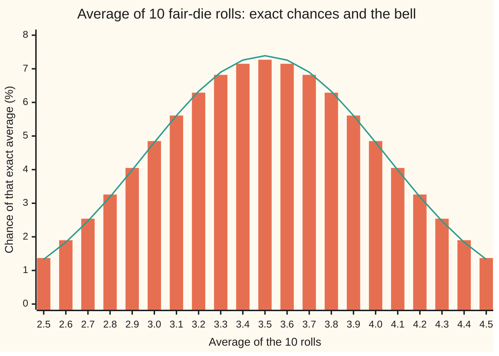
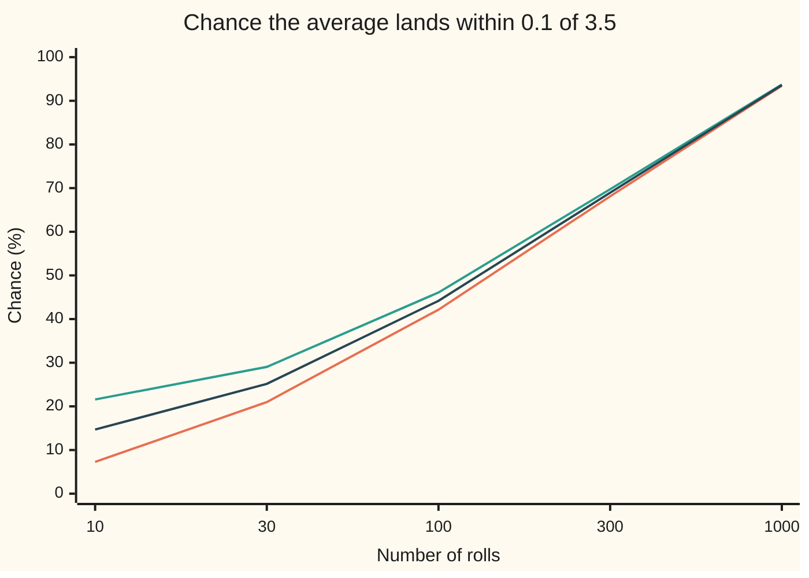

# Central limit theorem: the error of an average is bell-shaped, whatever the ingredients

Probability and statistics → Limit Theorems in Practice → The shape of an average's error → Central limit theorem

---

## General Overview

Roll a fair die 1,000 times and average the faces. The long-run average of one roll is 3.5, and the law of large numbers says the 1,000-roll average will sit close to it. How close, and how often? Will the average land within 0.1 of 3.5, strictly between 3.4 and 3.6?

One roll is as flat as a law can be: each face has chance 1 in 6, and no face is favoured. Yet the average of 1,000 rolls is not flat at all. Its values pile up round 3.5 in a bell, the same bell that describes measurement errors, heights and polls. The width of that bell is set by two numbers only: the spread of one roll and the number of rolls. Every other feature of the die is forgotten.

That bell answers the question. The average lands within 0.1 of 3.5 in about 93.6 percent of 1,000-roll sessions; the rest, about 6 in 100, land farther out. Counting every possible outcome exactly gives 93.5 percent, the 0.9346 found in [law-of-large-numbers](01-law-of-large-numbers.md), so the bell is off by about one part in a thousand, with no counting at all.

**Average many independent readings of the same kind, and the average's miss from the true mean, measured in its own spreads, follows the standard bell curve: whatever the single reading looked like, provided its spread is finite.**

**What kind of fact this is:** a theorem. This card states it, proves the heart of it for bounded readings such as a die in a folded Detailed proof using moment generating functions, and borrows one last step, a continuity theorem for generating functions (Curtiss, 1942), stated without proof; wing 10 proves the whole theorem by another road ([central-limit-theorem](../../10-Measure%20and%20integration/10-The%20Limit%20Theorems%2C%20Proved/07-central-limit-theorem.md)). Using it at a fixed number of rolls is an approximation, and the card measures its error exactly.

### The picture: ten rolls are already a bell



Bars: the exact chance of each possible 10-roll average, counted over all 6^10 outcomes. Line: the bell's height times the 0.1 step between possible averages. One roll gives six equal bars; ten rolls already give a bell, with the largest gap at the centre: 7.39 percent for the bell against 7.27 exact.

---

## The formula

Notation first, in words. Write $n$ for the number of rolls and $X_i$ for the i-th roll. A reminder from shelf 02: E[X], the expectation, is the long-run average value of X, and Var(X) is its variance. Here $\mu$ (mu) is E[X] for one roll and $\sigma$ (sigma) is one roll's spread, its standard deviation. A bar over a letter means an average: $\bar X_n$ is the average of the first n rolls. Φ, from [normal-distribution](../04-Continuous%20Distributions/04-normal-distribution.md), is the standard bell's area to the left of a point.

The average's miss, measured in its own spreads, is the **standardised error**:

$$Z_n = \frac{\bar X_n - \mu}{\sigma/\sqrt{n}}$$

The theorem says its chances approach the standard bell's:

$$P(Z_n \le z) \;\longrightarrow\; \Phi(z) \quad \text{as } n \to \infty, \text{ for every number } z$$

**Read it aloud:** the chance that the average's miss is at most z of its own spreads tends, as the rolls pile up, to the standard bell's area left of z.

This kind of limit, where the chances converge but $Z_n$ itself never settles on one value, is called **convergence in distribution**. The working rule for a window of half-width $\varepsilon$ round the mean follows at once:

$$P\big(|\bar X_n - \mu| \le \varepsilon\big) \;\approx\; 2\,\Phi\!\left(\frac{\varepsilon\sqrt{n}}{\sigma}\right) - 1$$

**Read it aloud:** count how many of the average's spreads fit into the window, then read the area of the standard bell within that many spreads of its centre.

| Symbol | Plain meaning | In our example | Push it up and the answer… |
| --- | --- | --- | --- |
| $n$ | the number of independent rolls | 1,000 | rises: the average's spread shrinks like 1/√n |
| $X_i$ | the i-th roll, a random variable | a face from 1 to 6 | — |
| $\mu$ | one roll's mean, E[X] | 3.5 | moves the centre, not the answer |
| $\sigma$ | one roll's spread, its standard deviation | 1.707825 | falls: a wider bell |
| $\bar X_n$ | the average of the n rolls | e.g. 3.47 | — |
| $\sigma/\sqrt{n}$ | the average's own spread, its standard error | 0.054006 | falls |
| $Z_n$ | the standardised error: the miss in units of $\sigma/\sqrt{n}$ | the window edge is 1.851640 | — |
| $\varepsilon$ | half-width of the window round $\mu$ | 0.1 | rises |
| $z$ | a count of spreads | 1.851640 | rises |
| $\Phi$ | the standard bell's area left of z | Φ(1.851640) = 0.967961 | rises from 0 to 1 |
| $M$ | a moment generating function, $M(t) = E[e^{tX}]$ | $M$ of $Z_n$ at t = 1 is 1.648634 | — |
| $t$ | the input of a moment generating function | 1 | — |
| $Y$ | one roll's own standardised miss, $(X - \mu)/\sigma$ | from −2.5/σ to 2.5/σ | — |
| $s$ | the input of $M_Y(s)$, the generating function of $Y$; Step 3 puts $s = t/\sqrt{n}$ | t/√1,000 | — |
| $c$, $C$ | in the Detailed proof: the largest size of $Y$, and the constant in the bound on the remainder | c = 2.5/σ | — |
| $r(s)$, $a_n$ | in the Detailed proof: what is left of $M_Y(s)$ after $1 + s^2/2$, and the exponent with that remainder folded in | — | — |

### When it holds

- **Independent rolls.** Each roll must carry fresh information. If all 1,000 "rolls" are copies of one roll, the average is that one face, and a single face is never within 0.1 of 3.5: the chance is 0, not 0.9359.
- **A finite spread.** The spread $\sigma$ must exist. Readings from the standard Cauchy law (a heavy-tailed law with no finite mean or spread, [heavy-tails-pareto-and-cauchy](../04-Continuous%20Distributions/08-heavy-tails-pareto-and-cauchy.md)) never settle: the average of 1,000 lands within 0.1 of the centre with chance 0.0635, exactly as often as one reading does.
- **The same law each time.** The card's version needs every roll drawn from one law. Lindeberg's version relaxes this to many small, different pieces, none of which dominates; it is proved in wing 10.
- **A positive spread.** A die that always shows 4 has σ = 0; there is no error to standardise.
- **Enough rolls, and no universal "enough".** The theorem is a limit. At 10 rolls the plain bell says 14.69 percent for the window and the truth is 7.27 percent; at 1,000 the two agree to 0.0013. A lopsided ingredient, such as a reading that is almost always 0, needs far more rolls than a die. The Berry–Esseen theorem bounds the error at a given n, by a constant times E|Y|^3/√n, where Y = (X − μ)/σ is one roll's own standardised miss.

---

## Why it works

### Step 0: the centre and width are fixed; only the shape is news

The law of large numbers already fixes where the average sits and how tightly: at μ, with spread σ/√n. The central limit theorem adds the shape. Measure the miss in units of its own spread and the scale is gone, so only the shape is left to converge. Among laws with a finite spread, the bell is the one shape that survives adding independent copies of itself and rescaling: two independent normal readings add to a normal reading. Averaging pushes every finite-spread law towards that fixed point.

### Step 1: the average's centre and spread

From [law-of-large-numbers](01-law-of-large-numbers.md): E of the average is μ, and Var of the average is σ^2/n, because variances of independent readings add and dividing by n divides the variance by n^2. For one die, μ = 3.5 and E[X^2] = 91/6, so σ^2 = 91/6 − 3.5^2 = 35/12 and σ = 1.707825. The exact law of the sum of 1,000 rolls, built by the code, has mean 3,500 and variance 2,916.666667 = 1,000 × 35/12: the rule, confirmed by counting.

### Step 2: standardise

Subtract μ and divide by σ/√n. The result $Z_n$ has mean 0 and spread 1 for every n. Without this step there is no limit to take: the raw average collapses onto 3.5, and the raw sum spreads out without bound. The √n is the one scale that keeps the miss in view.

### Step 3: the generating function of the miss tends to the bell's

A reminder from shelf 02 ([moment-generating-functions](../02-Random%20Variables/07-moment-generating-functions.md)): a moment generating function $M(t) = E[e^{tX}]$ packs all of a law's moments into one function, and independent readings multiply their generating functions. Write each roll's own standardised miss as Y = (X − μ)/σ. Then $Z_n$ is the sum of n independent copies of Y, divided by √n, so

$$M_{Z_n}(t) = \Big[M_Y\big(t/\sqrt{n}\big)\Big]^n$$

Near 0, Taylor's series gives M_Y(s) = 1 + s·0 + s^2/2 + (terms of order s^3), since Y has mean 0 and variance 1. Put s = t/√n:

$$M_{Z_n}(t) = \left[1 + \frac{t^2}{2n} + (\text{order } n^{-3/2})\right]^n \;\longrightarrow\; e^{t^2/2}$$

And e^(t^2/2) is exactly the standard normal's generating function. Everything about the die except its mean and variance sat in the order n^(−3/2) terms, and those die out. That is the "whatever the ingredients" of the title, as algebra. For dice at t = 1 the code gets 1.577093 at n = 1, 1.640196 at n = 10, 1.647852 at 100 and 1.648634 at 1,000, against the limit e^(1/2) = 1.648721.

<details>
<summary>Detailed proof</summary>

**Setting.** Take $Y_i = (X_i - \mu)/\sigma$, independent, each with mean 0 and variance 1, and bounded, as a die is: |Y| is at most c, here c = 2.5/1.707825.

**The expansion.** Taylor's theorem with remainder for e^(sy) gives e^(sy) = 1 + sy + s^2y^2/2 + R, with |R| at most |s|^3 c^3 e^(|s| c)/6 when |y| is at most c. Take expectations: M_Y(s) = 1 + 0 + s^2/2 + r(s), where |r(s)| is at most C|s|^3 for |s| at most 1, with C = c^3 e^c / 6.

**Independence.** $E[e^{t(Y_1+\dots+Y_n)/\sqrt n}]$ is a product of n equal factors, because the expectation of a product of independent readings is the product of their expectations. So $M_{Z_n}(t) = [1 + a_n/n]^n$ with $a_n = t^2/2 + n\,r(t/\sqrt n)$, and |n r(t/√n)| is at most C|t|^3/√n, which tends to 0. So $a_n \to t^2/2$.

**The limit.** For numbers $a_n \to a$, $(1 + a_n/n)^n \to e^{a}$: take logarithms and use log(1 + y) = y + (order y^2). So $M_{Z_n}(t) \to e^{t^2/2}$.

**The bell's generating function.** $\int e^{tz} e^{-z^2/2}\,dz / \sqrt{2\pi}$: complete the square, tz − z^2/2 = t^2/2 − (z − t)^2/2, and the Gaussian integral of the shifted bell is √(2π). So it equals e^(t^2/2).

**The borrowed step.** Curtiss's continuity theorem (1942): if generating functions converge to a generating function on an interval round 0, the chances P(Z_n ≤ z) converge to those of the limit law at every z where its CDF is continuous, here every z. Its proof needs measure theory, and this card states it without proof. Wing 10 proves the whole theorem by Lindeberg's swap ([central-limit-theorem](../../10-Measure%20and%20integration/10-The%20Limit%20Theorems%2C%20Proved/07-central-limit-theorem.md)) and proves Lévy's continuity theorem, the same step for characteristic functions ([characteristic-functions](../../10-Measure%20and%20integration/10-The%20Limit%20Theorems%2C%20Proved/06-characteristic-functions.md)). Readings without a generating function, but with a finite spread, need characteristic functions instead: that proof is the second road on the wing-10 central-limit-theorem card.

</details>

### Step 4: from the bell to a window

By Step 3, $Z_n$ behaves like a standard normal Z. The event "average within ε of μ" is the event "|Z_n| at most ε√n/σ". The bell is symmetric, so the chance within z spreads of its centre is Φ(z) − Φ(−z) = 2Φ(z) − 1. That is the working rule of The formula.

### Step 5: the ingredient does not matter, and the check shows it

Swap the fair die for a lopsided one that shows 1 half the time and each other face one time in ten. Its mean is 2.5 and its spread 1.802776, and its single-roll law looks nothing like a bell. For 1,000 rolls the rule gives 0.9206 for the window of 0.1 round 2.5; the exact count gives 0.9191. Only the spread changed the answer.

Laws with no generating function need the characteristic function, its complex cousin, which exists for every law and gives the theorem for every finite spread: central-limit-theorem-by-characteristic-functions.

---

## Worked numbers, by hand

One fair die, 1,000 rolls, window 0.1 round 3.5.

| Step | Arithmetic | Value |
| --- | --- | --- |
| one roll's mean, μ | (1 + 2 + 3 + 4 + 5 + 6)/6 | 3.5 |
| mean of the squares | (1 + 4 + 9 + 16 + 25 + 36)/6 | 15.166667 |
| variance, σ^2 | 15.166667 − 3.5^2 | 2.916667 |
| spread, σ | √2.916667 | 1.707825 |
| √n | √1,000 | 31.622777 |
| the average's spread, σ/√n | 1.707825 / 31.622777 | 0.054006 |
| window in spreads, z | 0.1 / 0.054006 | 1.851640 |
| Φ(z) | the series for Φ | 0.967961 |
| **chance within the window** | 2 × 0.967961 − 1 | **0.935922** |
| the exact count, for comparison | every outcome, by adding one die at a time | 0.934590 |

In 1,000-roll sessions, the average lands strictly between 3.4 and 3.6 about 93.5 times in 100 by exact count and 93.6 by the bell, and misses about 6 times in 100. The bell's answer is 0.001332 above the exact count.

### The picture: how fast the bell takes over



Lowest line (orange): the exact chance of a miss under 0.1, counted over every outcome. Top line (green): the same count with the edge averages 3.4 and 3.6 let in. Middle line (dark): the bell's answer. At 10 rolls the average moves in steps of 0.1, so the only average strictly inside the window is 3.5 itself, and each edge holds a lump of chance almost as big as the centre's. The smooth bell splits the difference. By 1,000 rolls the possible averages are 0.001 apart, the lumps are tiny, and all three lines meet. Handling the lumps is the continuity correction of [normal-approximation-to-binomial](03-normal-approximation-to-binomial.md).

### What breaks if you drop a piece

The rule applied correctly gives 0.9359 (exact: 0.9346).

| Mistake | Comes out at | What went wrong |
| --- | --- | --- |
| One roll's spread, no √n | 0.0467 | That is the chance a single roll lands within 0.1 of 3.5 on a bell; averaging is the whole point |
| Divided by n, not √n | 1.0000 | Spreads shrink like √n, not n: variance shrinks like n |
| Variance used as the spread | 0.7217 | 2.916667 is σ^2, not σ |
| One tail only | 0.4680 | "Within 0.1" counts both sides of 3.5 |
| 1,000 copies of one roll | 0.0000 | Independence dropped: the average is one face |
| Cauchy readings, any n | 0.0635; simulated 0.0685 (standard error 0.0056) | Finite spread dropped: the average never tightens |

The code prints every row. The last two are hypotheses dropped, not slips.

---

## Code, from first principles, and it actually runs

The checks take three independent roads to the 1,000-roll answer. Road 1 is the theorem, with Φ built from its own Taylor series. Road 2 is the exact law of the sum, built by adding one die at a time, so every one of the 6^1000 outcomes is counted without listing them. Road 3 simulates 5,000 sessions of 1,000 rolls from a SplitMix64 generator (a small, written-out source of random bits, seed 20260928) and reports its estimate with a standard error. The checks also compute the generating-function limit, the lopsided die, and every "what breaks" row, including a simulation of Cauchy averages. Python and Rust draw the same random numbers and print the same bytes.

### Python

```python
# Central limit theorem -- the check behind the card.  Standard library only.
# The average of 1,000 fair-die rolls: how often does it land within 0.1 of 3.5?
# Road 1: the CLT, with Phi built from its own Taylor series.
# Road 2: the exact law of the sum, built one die at a time (every outcome counted).
# Road 3: a seeded simulation from a SplitMix64 generator written out below.
from math import sqrt, pi, exp, atan, tan

N, EPS, SEED = 1000, 0.1, 20260928
FAIR = [1 / 6] * 6                              # chance of faces 1..6
LOADED = [0.5, 0.1, 0.1, 0.1, 0.1, 0.1]         # a lopsided die: a one half the time

def Phi(z):                                     # standard normal area left of z, by series
    if abs(z) > 8:                              # beyond 8 spreads the area is 0 or 1 to 15 places
        return 0.0 if z < 0 else 1.0
    term, total = z, z
    for k in range(1, 300):
        term *= -z * z / (2 * k)
        total += term / (2 * k + 1)
    return 0.5 + total / sqrt(2 * pi)

def mean_sd(law):
    mu = sum((f + 1) * p for f, p in enumerate(law))
    return mu, sqrt(sum((f + 1 - mu) ** 2 * p for f, p in enumerate(law)))

def add_die(dist, law):                         # law of the sum after one more roll
    new = [0.0] * (len(dist) + 6)
    for s, c in enumerate(dist):
        if c:
            for f, p in enumerate(law):
                new[s + f + 1] += c * p
    return new

def within(dist, n, mu, eps, edges=False):      # chance the average misses mu by less than eps
    if edges:                                   # ... or by exactly eps too
        return sum(c for s, c in enumerate(dist) if abs(s - n * mu) <= n * eps + 1e-9)
    return sum(c for s, c in enumerate(dist) if abs(s - n * mu) < n * eps - 1e-9)

def clt(n, sd, eps):                            # the theorem's answer
    return 2 * Phi(eps * sqrt(n) / sd) - 1

MASK = (1 << 64) - 1
state = SEED
def splitmix():
    global state
    state = (state + 0x9E3779B97F4A7C15) & MASK
    z = state
    z = ((z ^ (z >> 30)) * 0xBF58476D1CE4E5B9) & MASK
    z = ((z ^ (z >> 27)) * 0x94D049BB133111EB) & MASK
    return z ^ (z >> 31)

mu, sd = mean_sd(FAIR)
se_avg = sd / sqrt(N)
sq = sum((f + 1) ** 2 * p for f, p in enumerate(FAIR))
print(f"one die: mean {mu:.6f}, mean of squares {sq:.6f}, variance {sd * sd:.6f}, spread {sd:.6f}")
print(f"{N} rolls: root n {sqrt(N):.6f}, spread of the average {se_avg:.6f}")
print(f"  window {EPS} = {EPS / se_avg:.6f} spreads; Phi there {Phi(EPS / se_avg):.6f}")

dist, dists, grid = [1.0], {}, (1, 2, 10, 30, 100, 300, 1000)
for n in range(1, N + 1):
    dist = add_die(dist, FAIR)
    if n in grid:
        dists[n] = dist
road1 = clt(N, sd, EPS)
road2 = within(dist, N, mu, EPS)
edged = within(dist, N, mu, EPS, True)
tot = sum(dist)
m_sum = sum(s * c for s, c in enumerate(dist))
v_sum = sum((s - m_sum) ** 2 * c for s, c in enumerate(dist))
print(f"road 1, CLT: 2 Phi({EPS / se_avg:.6f}) - 1 = {road1:.6f}")
print(f"  outside the window: {1 - road1:.6f}")
print(f"road 2, exact law of the sum, miss under 0.1: {road2:.6f}; CLT minus exact {road1 - road2:.6f}")
print(f"  with the edges 3.4 and 3.6 included: {edged:.6f}")
print(f"  exact law: total {tot:.9f}, mean {m_sum:.6f}, variance {v_sum:.6f}")

R, hits, s1, s2 = 5000, 0, 0.0, 0.0
for _ in range(R):
    a = sum(1 + splitmix() % 6 for _ in range(N)) / N
    hits += abs(a - mu) < EPS - 1e-9
    s1 += a
    s2 += a * a
road3 = hits / R
se3 = sqrt(road3 * (1 - road3) / R)
sim_sd = sqrt((s2 - s1 * s1 / R) / (R - 1))
print(f"road 3, {R} simulated averages, seed {SEED}: {road3:.4f} (standard error {se3:.4f})")
print(f"  spread of the simulated averages {sim_sd:.6f}")

print("n, spread of average, exact without edges, exact with edges, CLT")
for n in grid:
    print(f"  {n:>4}  {sd / sqrt(n):.6f}  {within(dists[n], n, mu, EPS):.4f}  "
          f"{within(dists[n], n, mu, EPS, True):.4f}  {clt(n, sd, EPS):.4f}")
sd10 = sd * sqrt(10)
print("chart 1, average: " + " ".join(f"{s / 10:.1f}" for s in range(25, 46)))
print("chart 1, exact %: " + " ".join(f"{100 * dists[10][s]:.2f}" for s in range(25, 46)))
print("chart 1, bell %:  " + " ".join(f"{100 * exp(-((s - 35) / sd10) ** 2 / 2) / sqrt(2 * pi) / sd10:.2f}"
                                    for s in range(25, 46)))
print("chart 2, exact %: " + " ".join(f"{100 * within(dists[n], n, mu, EPS):.2f}" for n in grid[2:]))
print("chart 2, edges %: " + " ".join(f"{100 * within(dists[n], n, mu, EPS, True):.2f}" for n in grid[2:]))
print("chart 2, CLT %:   " + " ".join(f"{100 * clt(n, sd, EPS):.2f}" for n in grid[2:]))

def mgf_z(n, t=1.0):                            # moment generating function of Z_n at t
    m1 = sum(p * exp(t / sqrt(n) * (f + 1 - mu) / sd) for f, p in enumerate(FAIR))
    return m1 ** n
print("M of Z_n at t = 1: " + "  ".join(f"n={n} {mgf_z(n):.6f}" for n in (1, 10, 100, 1000))
      + f"  limit e^(1/2) {exp(0.5):.6f}")

lmu, lsd = mean_sd(LOADED)
ld = [1.0]
for _ in range(N):
    ld = add_die(ld, LOADED)
l_exact, l_clt = within(ld, N, lmu, EPS), clt(N, lsd, EPS)
print(f"loaded die: mean {lmu:.6f}, spread {lsd:.6f}; {N} rolls within 0.1: exact {l_exact:.4f}, CLT {l_clt:.4f}")

print("what breaks, the rule applied correctly gives %.4f" % road1)
print(f"  spread of one roll, no root n: {2 * Phi(EPS / sd) - 1:.4f}")
print(f"  divided by n, not root n: {2 * Phi(EPS * N / sd) - 1:.4f}")
print(f"  variance used as the spread: {2 * Phi(EPS * sqrt(N) / (sd * sd)) - 1:.4f}")
print(f"  one tail only: {Phi(EPS / se_avg) - 0.5:.4f}")
copies = sum(p for f, p in enumerate(FAIR) if abs(f + 1 - mu) < EPS)
print(f"  1000 copies of one roll, exact: {copies:.4f}")
c_exact = 2 / pi * atan(EPS)
RC, ch = 2000, 0
for _ in range(RC):
    a = sum(mu + tan(pi * (((splitmix() >> 11) + 0.5) / 2.0 ** 53 - 0.5)) for _ in range(N)) / N
    ch += abs(a - mu) < EPS
c_sim = ch / RC
c_se = sqrt(c_sim * (1 - c_sim) / RC)
print(f"  Cauchy readings, 1 or 1000 of them: {c_exact:.4f}; simulated 1000-averages {c_sim:.4f} ({c_se:.4f})")
print(f"try: window 0.05: {clt(N, sd, 0.05):.4f}; 4000 rolls: {clt(4000, sd, EPS):.4f}; "
      f"window 0.05 with 4000 rolls: {clt(4000, sd, 0.05):.4f}")

assert abs(road2 - road1) < 0.005, "exact law vs the CLT"
assert abs(road3 - road2) < 4 * se3, "simulation vs exact law"
assert abs(sim_sd - se_avg) < 4 * se_avg / sqrt(2 * R), "simulated spread vs sigma / root n"
assert abs(v_sum - N * 35 / 12) < 1e-6, "exact law's variance vs n times 35/12"
assert abs(mgf_z(1000) - exp(0.5)) < 1e-3, "MGF of Z_n approaches e^(t^2/2)"
assert abs(l_exact - l_clt) < 0.005, "lopsided die obeys the CLT too"
assert abs(c_sim - c_exact) < 4 * c_se, "Cauchy 1000-averages spread like one reading"
print("ALL CHECKS PASS")
```

**Ran 2026-10-06 on macOS, Python 3.14.6, standard library only. All checks passed. Output, pasted from the run:**

```
one die: mean 3.500000, mean of squares 15.166667, variance 2.916667, spread 1.707825
1000 rolls: root n 31.622777, spread of the average 0.054006
  window 0.1 = 1.851640 spreads; Phi there 0.967961
road 1, CLT: 2 Phi(1.851640) - 1 = 0.935922
  outside the window: 0.064078
road 2, exact law of the sum, miss under 0.1: 0.934590; CLT minus exact 0.001332
  with the edges 3.4 and 3.6 included: 0.937252
  exact law: total 1.000000000, mean 3500.000000, variance 2916.666667
road 3, 5000 simulated averages, seed 20260928: 0.9336 (standard error 0.0035)
  spread of the simulated averages 0.054224
n, spread of average, exact without edges, exact with edges, CLT
     1  1.707825  0.0000  0.0000  0.0467
     2  1.207615  0.1667  0.1667  0.0660
    10  0.540062  0.0727  0.2158  0.1469
    30  0.311805  0.2098  0.2904  0.2516
   100  0.170783  0.4215  0.4608  0.4418
   300  0.098601  0.6812  0.6974  0.6895
  1000  0.054006  0.9346  0.9373  0.9359
chart 1, average: 2.5 2.6 2.7 2.8 2.9 3.0 3.1 3.2 3.3 3.4 3.5 3.6 3.7 3.8 3.9 4.0 4.1 4.2 4.3 4.4 4.5
chart 1, exact %: 1.37 1.90 2.54 3.26 4.05 4.85 5.61 6.29 6.82 7.15 7.27 7.15 6.82 6.29 5.61 4.85 4.05 3.26 2.54 1.90 1.37
chart 1, bell %:  1.33 1.84 2.47 3.19 3.99 4.81 5.61 6.33 6.90 7.26 7.39 7.26 6.90 6.33 5.61 4.81 3.99 3.19 2.47 1.84 1.33
chart 2, exact %: 7.27 20.98 42.15 68.12 93.46
chart 2, edges %: 21.58 29.04 46.08 69.74 93.73
chart 2, CLT %:   14.69 25.16 44.18 68.95 93.59
M of Z_n at t = 1: n=1 1.577093  n=10 1.640196  n=100 1.647852  n=1000 1.648634  limit e^(1/2) 1.648721
loaded die: mean 2.500000, spread 1.802776; 1000 rolls within 0.1: exact 0.9191, CLT 0.9206
what breaks, the rule applied correctly gives 0.9359
  spread of one roll, no root n: 0.0467
  divided by n, not root n: 1.0000
  variance used as the spread: 0.7217
  one tail only: 0.4680
  1000 copies of one roll, exact: 0.0000
  Cauchy readings, 1 or 1000 of them: 0.0635; simulated 1000-averages 0.0685 (0.0056)
try: window 0.05: 0.6455; 4000 rolls: 0.9998; window 0.05 with 4000 rolls: 0.9359
ALL CHECKS PASS
```

### Rust

Same roads, same labels, built with `rustc --edition 2021 -O`. In Rust an empty sum of decimals is −0.0, so two sums add 0.0 to print 0.0000 as the Python does.

```rust
// Central limit theorem -- the same check as the Python, in Rust.  No crates.
// The average of 1,000 fair-die rolls: how often does it land within 0.1 of 3.5?
// Road 1: the CLT, with Phi built from its own Taylor series.
// Road 2: the exact law of the sum, built one die at a time (every outcome counted).
// Road 3: a seeded simulation from a SplitMix64 generator written out below.
use std::f64::consts::PI;

const N: usize = 1000;
const EPS: f64 = 0.1;
const SEED: u64 = 20260928;
const FAIR: [f64; 6] = [1.0 / 6.0; 6]; // chance of faces 1..6
const LOADED: [f64; 6] = [0.5, 0.1, 0.1, 0.1, 0.1, 0.1]; // a lopsided die: a one half the time

fn phi_cdf(z: f64) -> f64 { // standard normal area left of z, by series
    if z.abs() > 8.0 { return if z < 0.0 { 0.0 } else { 1.0 }; } // 0 or 1 to 15 places
    let (mut term, mut total) = (z, z);
    for k in 1..300 {
        let k = k as f64;
        term *= -z * z / (2.0 * k);
        total += term / (2.0 * k + 1.0);
    }
    0.5 + total / (2.0 * PI).sqrt()
}

fn mean_sd(law: &[f64; 6]) -> (f64, f64) {
    let mu: f64 = law.iter().enumerate().map(|(f, p)| (f as f64 + 1.0) * p).sum();
    let var: f64 = law.iter().enumerate().map(|(f, p)| (f as f64 + 1.0 - mu).powi(2) * p).sum();
    (mu, var.sqrt())
}

fn add_die(dist: &[f64], law: &[f64; 6]) -> Vec<f64> { // law of the sum after one more roll
    let mut new = vec![0.0; dist.len() + 6];
    for (s, &c) in dist.iter().enumerate() {
        if c != 0.0 {
            for (f, p) in law.iter().enumerate() { new[s + f + 1] += c * p; }
        }
    }
    new
}

fn within(dist: &[f64], n: usize, mu: f64, eps: f64, edges: bool) -> f64 { // chance the average misses mu by less than eps
    let n = n as f64; // ... or by exactly eps too, with edges
    let keep = |s: usize| {
        let d = (s as f64 - n * mu).abs();
        if edges { d <= n * eps + 1e-9 } else { d < n * eps - 1e-9 }
    };
    dist.iter().enumerate().filter(|(s, _)| keep(*s)).map(|(_, c)| c).sum::<f64>() + 0.0 // + 0.0: an empty sum is -0.0 in Rust
}

fn clt(n: usize, sd: f64, eps: f64) -> f64 { 2.0 * phi_cdf(eps * (n as f64).sqrt() / sd) - 1.0 }

fn splitmix(state: &mut u64) -> u64 {
    *state = state.wrapping_add(0x9E3779B97F4A7C15);
    let mut z = *state;
    z = (z ^ (z >> 30)).wrapping_mul(0xBF58476D1CE4E5B9);
    z = (z ^ (z >> 27)).wrapping_mul(0x94D049BB133111EB);
    z ^ (z >> 31)
}

fn joined(v: &[f64], d: usize) -> String { v.iter().map(|x| format!("{:.*}", d, x)).collect::<Vec<_>>().join(" ") }

fn main() {
    let (mu, sd) = mean_sd(&FAIR);
    let se_avg = sd / (N as f64).sqrt();
    let sq: f64 = FAIR.iter().enumerate().map(|(f, p)| (f as f64 + 1.0).powi(2) * p).sum();
    println!("one die: mean {:.6}, mean of squares {:.6}, variance {:.6}, spread {:.6}", mu, sq, sd * sd, sd);
    println!("{} rolls: root n {:.6}, spread of the average {:.6}", N, (N as f64).sqrt(), se_avg);
    println!("  window {} = {:.6} spreads; Phi there {:.6}", EPS, EPS / se_avg, phi_cdf(EPS / se_avg));

    let grid = [1usize, 2, 10, 30, 100, 300, 1000];
    let mut dist = vec![1.0];
    let mut dists: Vec<Vec<f64>> = Vec::new();
    for n in 1..=N {
        dist = add_die(&dist, &FAIR);
        if grid.contains(&n) { dists.push(dist.clone()); }
    }
    let road1 = clt(N, sd, EPS);
    let road2 = within(&dist, N, mu, EPS, false);
    let edged = within(&dist, N, mu, EPS, true);
    let tot: f64 = dist.iter().sum();
    let m_sum: f64 = dist.iter().enumerate().map(|(s, c)| s as f64 * c).sum();
    let v_sum: f64 = dist.iter().enumerate().map(|(s, c)| (s as f64 - m_sum).powi(2) * c).sum();
    println!("road 1, CLT: 2 Phi({:.6}) - 1 = {:.6}", EPS / se_avg, road1);
    println!("  outside the window: {:.6}", 1.0 - road1);
    println!("road 2, exact law of the sum, miss under 0.1: {:.6}; CLT minus exact {:.6}", road2, road1 - road2);
    println!("  with the edges 3.4 and 3.6 included: {:.6}", edged);
    println!("  exact law: total {:.9}, mean {:.6}, variance {:.6}", tot, m_sum, v_sum);
    let mut st = SEED;
    let (r, mut hits, mut s1, mut s2) = (5000usize, 0usize, 0.0f64, 0.0f64);
    for _ in 0..r {
        let tot_roll: u64 = (0..N).map(|_| 1 + splitmix(&mut st) % 6).sum();
        let a = tot_roll as f64 / N as f64;
        if (a - mu).abs() < EPS - 1e-9 { hits += 1; }
        s1 += a;
        s2 += a * a;
    }
    let rf = r as f64;
    let road3 = hits as f64 / rf;
    let se3 = (road3 * (1.0 - road3) / rf).sqrt();
    let sim_sd = ((s2 - s1 * s1 / rf) / (rf - 1.0)).sqrt();
    println!("road 3, {} simulated averages, seed {}: {:.4} (standard error {:.4})", r, SEED, road3, se3);
    println!("  spread of the simulated averages {:.6}", sim_sd);

    println!("n, spread of average, exact without edges, exact with edges, CLT");
    for (i, &n) in grid.iter().enumerate() {
        println!("  {:>4}  {:.6}  {:.4}  {:.4}  {:.4}", n, sd / (n as f64).sqrt(), within(&dists[i], n, mu, EPS, false),
                 within(&dists[i], n, mu, EPS, true), clt(n, sd, EPS));
    }
    let sd10 = sd * 10f64.sqrt();
    let avgs: Vec<f64> = (25..46).map(|s| s as f64 / 10.0).collect();
    let ex: Vec<f64> = (25..46).map(|s| 100.0 * dists[2][s]).collect();
    let bell: Vec<f64> = (25..46).map(|s| {
        let z = (s as f64 - 35.0) / sd10;
        100.0 * (-z * z / 2.0).exp() / (2.0 * PI).sqrt() / sd10
    }).collect();
    println!("chart 1, average: {}", joined(&avgs, 1));
    println!("chart 1, exact %: {}", joined(&ex, 2));
    println!("chart 1, bell %:  {}", joined(&bell, 2));
    let c2e: Vec<f64> = (2..7).map(|i| 100.0 * within(&dists[i], grid[i], mu, EPS, false)).collect();
    let c2g: Vec<f64> = (2..7).map(|i| 100.0 * within(&dists[i], grid[i], mu, EPS, true)).collect();
    let c2c: Vec<f64> = (2..7).map(|i| 100.0 * clt(grid[i], sd, EPS)).collect();
    println!("chart 2, exact %: {}", joined(&c2e, 2));
    println!("chart 2, edges %: {}", joined(&c2g, 2));
    println!("chart 2, CLT %:   {}", joined(&c2c, 2));

    let mgf_z = |n: usize| -> f64 { // moment generating function of Z_n at t = 1
        let m1: f64 = FAIR.iter().enumerate().map(|(f, p)| p * (1.0 / (n as f64).sqrt() * (f as f64 + 1.0 - mu) / sd).exp()).sum();
        m1.powi(n as i32)
    };
    println!("M of Z_n at t = 1: n=1 {:.6}  n=10 {:.6}  n=100 {:.6}  n=1000 {:.6}  limit e^(1/2) {:.6}",
             mgf_z(1), mgf_z(10), mgf_z(100), mgf_z(1000), 0.5f64.exp());

    let (lmu, lsd) = mean_sd(&LOADED);
    let mut ld = vec![1.0];
    for _ in 0..N { ld = add_die(&ld, &LOADED); }
    let (l_exact, l_clt) = (within(&ld, N, lmu, EPS, false), clt(N, lsd, EPS));
    println!("loaded die: mean {:.6}, spread {:.6}; {} rolls within 0.1: exact {:.4}, CLT {:.4}", lmu, lsd, N, l_exact, l_clt);

    println!("what breaks, the rule applied correctly gives {:.4}", road1);
    println!("  spread of one roll, no root n: {:.4}", 2.0 * phi_cdf(EPS / sd) - 1.0);
    println!("  divided by n, not root n: {:.4}", 2.0 * phi_cdf(EPS * N as f64 / sd) - 1.0);
    println!("  variance used as the spread: {:.4}", 2.0 * phi_cdf(EPS * (N as f64).sqrt() / (sd * sd)) - 1.0);
    println!("  one tail only: {:.4}", phi_cdf(EPS / se_avg) - 0.5);
    let copies: f64 = FAIR.iter().enumerate().filter(|(f, _)| (*f as f64 + 1.0 - mu).abs() < EPS).map(|(_, p)| p).sum::<f64>() + 0.0;
    println!("  1000 copies of one roll, exact: {:.4}", copies);
    let c_exact = 2.0 / PI * EPS.atan();
    let (rc, mut ch) = (2000usize, 0usize);
    for _ in 0..rc {
        let mut total = 0.0;
        for _ in 0..N {
            let u = ((splitmix(&mut st) >> 11) as f64 + 0.5) / 2f64.powi(53);
            total += mu + (PI * (u - 0.5)).tan();
        }
        if (total / N as f64 - mu).abs() < EPS { ch += 1; }
    }
    let c_sim = ch as f64 / rc as f64;
    let c_se = (c_sim * (1.0 - c_sim) / rc as f64).sqrt();
    println!("  Cauchy readings, 1 or 1000 of them: {:.4}; simulated 1000-averages {:.4} ({:.4})", c_exact, c_sim, c_se);
    println!("try: window 0.05: {:.4}; 4000 rolls: {:.4}; window 0.05 with 4000 rolls: {:.4}",
             clt(N, sd, 0.05), clt(4000, sd, EPS), clt(4000, sd, 0.05));

    assert!((road2 - road1).abs() < 0.005, "exact law vs the CLT");
    assert!((road3 - road2).abs() < 4.0 * se3, "simulation vs exact law");
    assert!((sim_sd - se_avg).abs() < 4.0 * se_avg / (2.0 * rf).sqrt(), "simulated spread vs sigma / root n");
    assert!((v_sum - N as f64 * 35.0 / 12.0).abs() < 1e-6, "exact law's variance vs n times 35/12");
    assert!((mgf_z(1000) - 0.5f64.exp()).abs() < 1e-3, "MGF of Z_n approaches e^(t^2/2)");
    assert!((l_exact - l_clt).abs() < 0.005, "lopsided die obeys the CLT too");
    assert!((c_sim - c_exact).abs() < 4.0 * c_se, "Cauchy 1000-averages spread like one reading");
    println!("ALL CHECKS PASS");
}
```

**Ran 2026-10-06 on macOS, rustc 1.98.1, no crates. All checks passed. Output, pasted from the run:**

```
one die: mean 3.500000, mean of squares 15.166667, variance 2.916667, spread 1.707825
1000 rolls: root n 31.622777, spread of the average 0.054006
  window 0.1 = 1.851640 spreads; Phi there 0.967961
road 1, CLT: 2 Phi(1.851640) - 1 = 0.935922
  outside the window: 0.064078
road 2, exact law of the sum, miss under 0.1: 0.934590; CLT minus exact 0.001332
  with the edges 3.4 and 3.6 included: 0.937252
  exact law: total 1.000000000, mean 3500.000000, variance 2916.666667
road 3, 5000 simulated averages, seed 20260928: 0.9336 (standard error 0.0035)
  spread of the simulated averages 0.054224
n, spread of average, exact without edges, exact with edges, CLT
     1  1.707825  0.0000  0.0000  0.0467
     2  1.207615  0.1667  0.1667  0.0660
    10  0.540062  0.0727  0.2158  0.1469
    30  0.311805  0.2098  0.2904  0.2516
   100  0.170783  0.4215  0.4608  0.4418
   300  0.098601  0.6812  0.6974  0.6895
  1000  0.054006  0.9346  0.9373  0.9359
chart 1, average: 2.5 2.6 2.7 2.8 2.9 3.0 3.1 3.2 3.3 3.4 3.5 3.6 3.7 3.8 3.9 4.0 4.1 4.2 4.3 4.4 4.5
chart 1, exact %: 1.37 1.90 2.54 3.26 4.05 4.85 5.61 6.29 6.82 7.15 7.27 7.15 6.82 6.29 5.61 4.85 4.05 3.26 2.54 1.90 1.37
chart 1, bell %:  1.33 1.84 2.47 3.19 3.99 4.81 5.61 6.33 6.90 7.26 7.39 7.26 6.90 6.33 5.61 4.81 3.99 3.19 2.47 1.84 1.33
chart 2, exact %: 7.27 20.98 42.15 68.12 93.46
chart 2, edges %: 21.58 29.04 46.08 69.74 93.73
chart 2, CLT %:   14.69 25.16 44.18 68.95 93.59
M of Z_n at t = 1: n=1 1.577093  n=10 1.640196  n=100 1.647852  n=1000 1.648634  limit e^(1/2) 1.648721
loaded die: mean 2.500000, spread 1.802776; 1000 rolls within 0.1: exact 0.9191, CLT 0.9206
what breaks, the rule applied correctly gives 0.9359
  spread of one roll, no root n: 0.0467
  divided by n, not root n: 1.0000
  variance used as the spread: 0.7217
  one tail only: 0.4680
  1000 copies of one roll, exact: 0.0000
  Cauchy readings, 1 or 1000 of them: 0.0635; simulated 1000-averages 0.0685 (0.0056)
try: window 0.05: 0.6455; 4000 rolls: 0.9998; window 0.05 with 4000 rolls: 0.9359
ALL CHECKS PASS
```

The two outputs are identical. The simulated 0.9336 sits within one standard error of the exact 0.934590, and the simulated spread of the averages, 0.054224, sits close to σ/√n = 0.054006.

> [!TIP]
> **Try changing**
> Guess first, then run.
> - **Halve the window.** Set `EPS = 0.05` (the `try` line prints it). Guess: about half as likely? The answer is 0.6455, more than half: the bell is tallest near its centre.
> - **Quadruple the rolls.** Set `N = 4000`. The window of 0.1 now holds 0.9998 of the averages. Four times the rolls halves the spread.
> - **Both at once.** Window 0.05 with 4,000 rolls gives 0.9359, the same answer as 0.1 with 1,000. Precision costs the square: to halve the error, roll four times as often.
> - **A lopsided die.** `LOADED` shows a one half the time. Guess the window's chance round its mean, 2.5, before reading the `loaded die` line: 0.9191 exactly and 0.9206 by the rule. A lopsided ingredient, the same bell.

---

## The usual mistake

> [!warning]
> **"The data become normal."** They do not. After 1,000 rolls the individual faces are still flat, one in six each. What becomes bell-shaped is the law of the average's miss, standardised. A histogram of 1,000 rolls shows six equal bars; the theorem is about the histogram of many 1,000-roll averages.
>
> - **A magic 30.** "Thirty readings are enough" has no basis in the theorem. At 30 rolls of a fair die the bell says 25.16 percent for the window and the truth is 20.98 percent; a reading that is almost always 0 needs far more.
> - **Confusing the two limit laws.** The law of large numbers says the average settles at μ. The central limit theorem says how the remaining miss is shaped and how wide it is: σ/√n. The first needs only a finite mean; the second needs a finite spread.
> - **Edges.** A miss under 0.1 leaves out the averages 3.4 and 3.6: 0.934590. Letting them in gives 0.937252. The bell's 0.935922 sits between the two, and the edge choice moves the answer twice as far as the bell's own error at 1,000 rolls.
> - **Dependent readings.** Daily sales, temperatures and share prices remember yesterday. Treating them as independent makes σ/√n too small, as the copies row of the table shows at its extreme.

---

## Where you meet it in real life

- **Polls.** A poll of 1,000 people estimates a proportion by an average of yes-or-no answers. Its margin of error is about two of the average's spreads, a bell statement straight from this card.
- **Measurement.** A laboratory reports the average of repeated readings with an error bar of σ/√n. The bell is what turns that error bar into a chance.
- **Simulation.** Every Monte Carlo estimate is an average of random draws, and its error bar is this theorem: [monte-carlo-estimates-and-error](../11-Simulation/04-monte-carlo-estimates-and-error.md). Road 3 above is one.
- **Casinos and insurers.** Each bet or policy is lopsided; the total over thousands is a narrow bell, which is why the house's take is predictable and a single gambler's is not.
- **Share prices.** A year's log-return is the sum of many daily ones, which is why finance models it with a bell: [black-scholes-call](../../12-Financial%20mathematics/08-The%20Black-Scholes%20call%20and%20put/01-black-scholes-call.md).

> **Say it back**
> One die roll is flat, but the average of many independent rolls misses its mean by an amount shaped like the standard bell. The width of that bell is one roll's spread divided by the square root of the number of rolls. For 1,000 rolls that spread is 0.054, so the average lands within 0.1 of 3.5 about 93.6 percent of the time, against 93.5 by exact counting. Everything about the ingredient except its mean and spread fades as the rolls pile up. The theorem needs independent readings and a finite spread; copies or Cauchy readings break it.

---

## What this builds on

- [law-of-large-numbers](01-law-of-large-numbers.md): the average settles at μ, with variance σ^2/n; this card shapes the miss that is left.
- [normal-distribution](../04-Continuous%20Distributions/04-normal-distribution.md): the standard bell, its area Φ, and the series that computes it.

## Where this goes next

- [normal-approximation-to-binomial](03-normal-approximation-to-binomial.md): the theorem applied to counts of successes, with the continuity correction that removes the lumps in the second picture.
- [delta-method-and-slutsky](05-delta-method-and-slutsky.md): the bell passed through a smooth function of the average, and σ replaced by its estimate.
- [monte-carlo-estimates-and-error](../11-Simulation/04-monte-carlo-estimates-and-error.md): error bars for every simulated number.
- [central-limit-theorem](../../10-Measure%20and%20integration/10-The%20Limit%20Theorems%2C%20Proved/07-central-limit-theorem.md): the full proof, by Lindeberg's swap and by characteristic functions, and Lindeberg's condition.
- [brownian-motion](../../11-Stochastic%20processes%20and%20calculus/05-Brownian%20Motion/01-brownian-motion.md): the running sum, rescaled, becomes a random path that is normal at every time.
- central-limit-theorem-by-characteristic-functions: the proof for every finite spread, through Fourier transforms.
- erdos-kac-theorem: the bell in the count of prime factors of whole numbers.

The theorem says the miss tends to a bell but guarantees nothing at 30 or 1,000 rolls; bounds that hold at every number of rolls, bell or no bell, are [concentration-inequalities-hoeffding-and-chernoff](06-concentration-inequalities-hoeffding-and-chernoff.md).

---

## Sources

Verified 2026-10-06: every link below resolves to the publisher's or authors' page.

- Grinstead, Charles M., and J. Laurie Snell. *Introduction to Probability*, 2nd rev. ed. American Mathematical Society, 1997. [Free full text, the authors' GNU FDL edition](https://math.dartmouth.edu/~prob/prob/prob.pdf). Chapter 9 states the theorem and checks it on sums of dice.
- Feller, William. *An Introduction to Probability Theory and Its Applications*, Volume 1, 3rd ed. Wiley, 1968. [Publisher page](https://www.wiley.com/en-us/An+Introduction+to+Probability+Theory+and+Its+Applications%2C+Volume+1%2C+3rd+Edition-p-9780471257080). The theorem for independent readings and its limits, without measure theory.
- Billingsley, Patrick. *Probability and Measure*, Anniversary ed. Wiley, 2012. [Publisher page](https://www.wiley.com/en-us/Probability+and+Measure%2C+Anniversary+Edition-p-9781118122372). The full proof, Lindeberg's condition, and convergence in distribution.
- Curtiss, J. H. "A Note on the Theory of Moment Generating Functions." *The Annals of Mathematical Statistics* 13, no. 4 (1942): 430–433. [doi:10.1214/aoms/1177731541](https://doi.org/10.1214/aoms/1177731541). The continuity theorem for moment generating functions: the step this card borrows.
- Fischer, Hans. *A History of the Central Limit Theorem: From Classical to Modern Probability Theory*. Springer, 2011. [Publisher page](https://link.springer.com/book/10.1007/978-0-387-87857-7). From Laplace's sums of errors to Lyapunov and Lindeberg.
