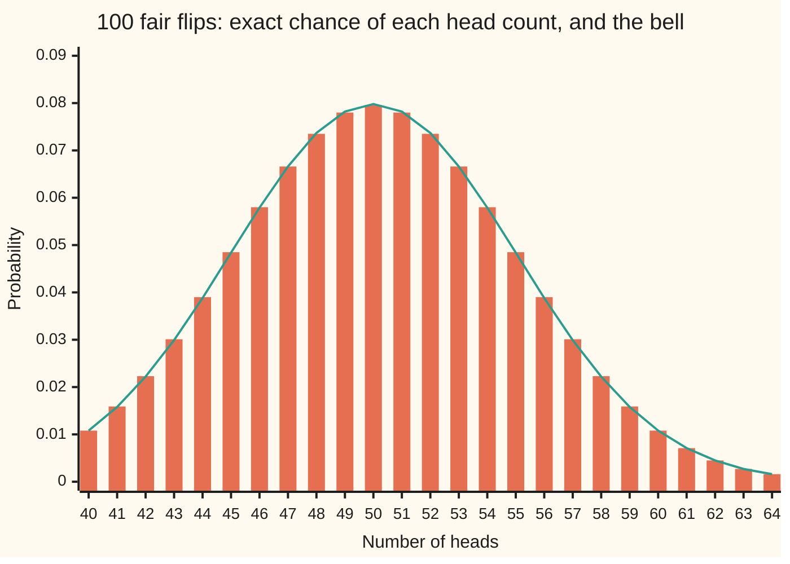
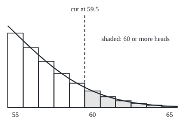

# Normal approximation: a binomial as a bell, with the half-step correction

Probability and statistics → Limit Theorems in Practice → Counts read off a bell curve → Normal approximation

---

## General Overview

Flip a fair coin 100 times and count the heads. What is the chance of 60 or more?

Counting answers it exactly. There are 2^100 head-tail strings, all equally likely, and 36,057,011,612,866,492,098,338,762,600 of them hold 60 heads or more. The ratio is 0.028444: about 28 runs of 100 flips in 1,000 reach 60 heads. The count is exact, but it needs 41 enormous whole numbers, and a poll of 2,000 voters or a factory batch of 50,000 parts needs far more.

A picture of all 101 chances looks like a bell curve: tall at 50 heads, falling off evenly on both sides. So read the answer off the bell instead. Its centre is the average count, 50; its width is the standard deviation, 5 heads. Sixty heads sits two widths above the centre, and a bell table gives the area beyond. That shortcut is the **normal approximation**, the name used from here on.

One detail makes it accurate. A count is a whole number, and the bell is smooth. Each count owns the stretch of the line from half a step below it to half a step above it, so "60 or more" starts at 59.5, not at 60. Moving the cut by that half step is the **continuity correction**. Here it takes the bell's answer from 0.022750 to 0.028717, against the exact 0.028444.

**A binomial count of n tries is read off the bell curve with the same average and spread, with every whole-number cut moved half a step outward; the answer is good when np(1-p) is at least about 10 and the cut is not deep in the tail.**

**What kind of fact this is:** an approximation, with its error stated and printed by the checks; the theorem behind it (de Moivre and Laplace) is proved on this card in Why it works, one bar at a time (its local form).

### The picture: 101 bars and one bell



Bars: the exact binomial chance of each head count from 40 to 64. Line: the bell curve with centre 50 and width 5, read at each whole number. At 50 heads the bar is 0.0796 and the bell 0.0798; at 60 both read 0.0108. Across the chart the two never differ by more than 0.0002.

---

## The formula

Notation first, in words. X ~ Binomial(n, p) is read "X follows the binomial law with n trials and chance p", as on [bernoulli-and-binomial](../03-Discrete%20Distributions/01-bernoulli-and-binomial.md). The standard bell's area to the left of z is written Φ(z), capital phi, as on [normal-distribution](../04-Continuous%20Distributions/04-normal-distribution.md). For a count X of n tries with success chance p, and a whole number j:

$$P(X \ge j) \;\approx\; 1 - \Phi\!\left(\frac{j - \tfrac12 - np}{\sqrt{np(1-p)}}\right)$$

**Read it aloud:** the chance of j or more successes is about the bell's area above the point half a step below j, measured in spreads from the average.

The same rule, cut by cut: $P(X \le j)$ uses $j + \tfrac12$; $P(X = j)$ uses the area between $j - \tfrac12$ and $j + \tfrac12$. Every cut moves half a step outward, so that the bars being counted are counted whole.

| Symbol | Plain meaning | In our example | Push it up and the answer… |
| --- | --- | --- | --- |
| $X$ | the count of successes, a random variable | heads in 100 flips | — |
| $n$ | the number of tries | 100 | the bell widens like the square root of n, and the approximation improves |
| $p$ | the chance of success on each try | 0.5 | the centre moves right and the tail chance rises |
| $j$ | the whole-number threshold | 60 | the tail chance falls |
| $k$ | a count of successes: the bar being looked at | 60 heads | — |
| $q$ | the chance of failure on each try, $1 - p$ | 0.5 | — |
| $s$, $t$ | distances from the centre, in successes: $s$ for one step of the proof's sum, $t$ for where the sum stops | 60 heads is t = 10 | — |
| $h$ | the bell's height at its centre, the peak | 0.0798 | — |
| $c$ | a number of spreads, in Chebyshev's bound $1/c^2$ | — | — |
| $\mu$ | the average count, np (mu) | 50 | the tail chance rises |
| $\sigma$ | the spread, $\sqrt{np(1-p)}$ (sigma), the standard deviation of X | 5 | a threshold above the centre gets likelier |
| $\sigma^2$ | the variance, $np(1-p)$; also the safety number | 25 | the approximation gets safer |
| $\Phi$ | the standard bell's area to the left of z | Φ(1.9) = 0.971283 | rises from 0 to 1 |
| $\varphi$ | the standard bell's height, $e^{-z^2/2}/\sqrt{2\pi}$ (small phi) | φ(2) / 5 = 0.010798 | — |
| $E_t$ | the leftover error in the proof's sum of logarithms | shrinks like 1/σ | — |
| $\tfrac12$ | the half step, the continuity correction | cut at 59.5 | — |

The quantity inside Φ is a **z-score**: how many spreads the cut sits from the centre. Here z = (59.5 − 50) / 5 = 1.9.

### When it holds

- **Independent tries with one fixed chance.** That is what makes the count binomial. If flips influence each other (a coin that tends to repeat), the spread is wrong and so is every tail read from it.
- **np(1-p) at least about 10.** Below that, unless p is near ½, the bars are lopsided and the bell is not: the bars' skewness, a measure of lopsidedness, is (1 − 2p)/√(np(1-p)), which is zero only at p = ½. A fair coin's bars are symmetric, so even 10 flips give 0.375915 against the exact 0.376953; the rule is a floor that is safe for every p. For a coin with p = 0.02 and 100 tries, np(1-p) = 1.96, and the bell puts 0.037073 of its area on negative head counts, which cannot happen. Published rules of thumb include np > 5 with n(1-p) > 5, and np(1-p) > 9; 10 is a safe house rule.
- **Not deep in the tail.** The bell's absolute error is small everywhere, but a tiny tail chance can be off by a sizeable fraction of itself. At 0.6 n heads the ratio bell/exact is 0.997 for 10 flips, 1.010 for 100, and 1.052 for 400 flips, where the chance itself is only 0.000037. Four spreads out, use the exact sum.
- **Whole-number counts need the half step.** Without it, the error at 100 flips is about 20 times larger (−0.005694 against 0.000273).

---

## Why it works

### Step 0: the bars already have the shape of a bell

A binomial chance is a bar of width one for each count. The claim is that the tops of the bars trace a bell curve, and the proof reads that off the ratio of one bar to the next. Once bar heights match bell heights, adding bars is adding thin slices of the bell, and a slice of width one centred on k runs from k − ½ to k + ½. The half step is not a fudge: it is where the bars' edges are.

### Step 1: neighbouring bars shrink by a fixed factor

From the binomial formula $P(X=k) = C(n,k)\,p^k(1-p)^{n-k}$, one bar over the next is

$$\frac{P(X=k+1)}{P(X=k)} = \frac{(n-k)\,p}{(k+1)(1-p)}.$$

At 100 fair flips, going from 50 to 51 heads multiplies the chance by 50/51. From 59 to 60 it multiplies by 41/60. The farther from the centre, the steeper the fall.

### Step 2: the logarithm of that ratio is a straight line

Measure the count from the centre: k = μ + s, where s is the distance in heads. Substitute into Step 1 and take logarithms. For s small beside np and n(1-p), each of the two factors is close to 1, and ln(1 + x) ≈ x. The result, in the folded algebra below:

$$\ln P(X = \mu + s + 1) - \ln P(X = \mu + s) \;\approx\; -\frac{s}{\sigma^2}.$$

The logarithm of the bar heights drops by an amount that grows in a straight line with the distance from the centre.

### Step 3: add up the drops, and a bell appears

Adding the drops from the centre out to distance t adds 0 + 1 + … + (t − 1), which is about t^2/2, each divided by σ^2. So

$$P(X = \mu + t) \;\approx\; P(X = \mu)\; e^{-t^2/(2\sigma^2)}.$$

That is a bell curve's shape, with spread σ. The height at the centre is fixed by the total: the bars add to 1, and a bell of spread σ with peak height h has area $h\,\sigma\sqrt{2\pi}$ (the Gaussian integral). So the peak is $1/(\sigma\sqrt{2\pi})$, and

$$P(X = k) \;\approx\; \frac{1}{\sigma}\,\varphi\!\left(\frac{k - \mu}{\sigma}\right).$$

This is the **local de Moivre–Laplace theorem**: each bar's height is the bell's height at that count, divided by the spread. At 60 heads: exact 0.010844, bell height 0.010798.

### Step 4: a tail of bars is an area under the bell, from the half step

The chance of 60 or more is the sum of the bars 60, 61, 62, and so on. Each bar has width 1, so its height is also its area, and by Step 3 it matches the slice of the bell from k − ½ to k + ½: a slice one unit wide has area close to its height at the middle, k. Stack those slices from 60 upward and they cover the bell from 59.5 upward:

$$P(X \ge 60) \approx 1 - \Phi\!\left(\frac{59.5 - 50}{5}\right) = 1 - \Phi(1.9) = 0.028717.$$

Cutting at 60 instead drops half of bar 60 and gives 0.022750. At the single bar, the bell's slice from 59.5 to 60.5 is 0.010852, against the exact 0.010844: the slice matches the bar better than the height does.

<details>
<summary>Detailed proof: the straight-line drop in Step 2</summary>

Write q = 1 − p, σ^2 = npq, and k = np + s, taking np a whole number (as 50 is here). Then n − k = nq − s and k + 1 = np + s + 1, so
$$\frac{P(X=k+1)}{P(X=k)} = \frac{(nq - s)\,p}{(np + s + 1)\,q} = \frac{1 - s/(nq)}{1 + (s+1)/(np)}.$$
Take logarithms and use ln(1 + x) = x + (error at most x^2 when |x| ≤ ½):
$$\ln\frac{P(X=k+1)}{P(X=k)} = -\frac{s}{nq} - \frac{s+1}{np} + \text{error} = -\frac{s(p+q) + q}{npq} + \text{error} = -\frac{s + q}{\sigma^2} + \text{error}.$$
The error term is at most (s/(nq))^2 + ((s+1)/(np))^2, of size s^2/σ^4 times a constant.
Sum from s = 0 to t − 1:
$$\ln P(X = np + t) - \ln P(X = np) = -\frac{t(t-1)/2 + qt}{\sigma^2} + E_t = -\frac{t^2}{2\sigma^2} + \frac{(\tfrac12 - q)\,t}{\sigma^2} + E_t,$$
where $|E_t|$ is at most a constant times $t^3/\sigma^4$. For t up to a few spreads (t of order σ), the middle term is of order 1/σ and $E_t$ is of order 1/σ: both vanish as n grows, which gives Step 3's shape. For a fair coin, ½ − q = 0 and the middle term is zero, which is why the fair coin's bell fits so well. The left side of the centre is the same argument with p and q swapped: count tails instead of heads.
The peak height: the bars within a few spreads of the centre carry nearly all the chance (Chebyshev's inequality bounds the rest by 1/c^2 beyond c spreads), and their sum is a Riemann sum of $P(X=\mu)\,e^{-t^2/(2\sigma^2)}$ with step 1, which tends to $P(X=\mu)\,\sigma\sqrt{2\pi}$. Setting that equal to 1 gives $P(X=\mu) \approx 1/(\sigma\sqrt{2\pi})$. Stirling's formula ([stirlings-approximation](../../06-Calculus%20and%20analysis/06-Series/09-stirlings-approximation.md)) gives the same peak directly from C(n, n/2), which is de Moivre's 1733 route.
Step 4 then follows: the sum of the bars from j upward is a Riemann sum of the bell's density over unit cells centred on the counts, and those cells start at j − ½.

</details>

### The other door

A binomial count is a sum of n independent zero-or-one tries, so the general [central-limit-theorem](02-central-limit-theorem.md) also gives the bell, for any shape of single try, and says the standardized count's chances approach Φ. The route here is narrower but closer to the ground: it works on one bar at a time, which is what explains the half step. How far the bell can be off at a given n is the subject of berry-esseen-and-the-rate.

---

## Worked numbers, by hand

100 fair flips, chance of 60 heads or more.

| Step | Arithmetic | Value |
| --- | --- | --- |
| average, μ = np | 100 × 0.5 | 50 |
| variance, np(1-p) | 100 × 0.5 × 0.5 | 25 |
| safety check | 25 ≥ 10 | safe |
| spread, σ | √25 | 5 |
| cut, half a step below 60 | 60 − 0.5 | 59.5 |
| z-score | (59.5 − 50) / 5 | 1.9 |
| Φ(1.9) | bell table | 0.971283 |
| **bell's answer** | 1 − 0.971283 | **0.028717** |
| exact, by counting | 36,057,011,612,866,492,098,338,762,600 / 2^100 | 0.028444 |
| error | 0.028717 − 0.028444 | 0.000273 |

About 28 or 29 runs of 100 flips in 1,000 reach 60 heads; the bell and the count agree on that to within three runs in ten thousand.

### The picture: the half step, to scale

Bars for 55 to 65 heads, each one unit wide, with the bell drawn over them. The dashed line is the cut at 59.5. The shaded bars (60 and up) and the bell's area right of the dashed line are the two sides of the approximation.

<p align="center"></p>

Heights are drawn at 3,000 units per unit of chance; the printed "figure," lines give every bar top, every curve point and the cut. The bar for 60 starts at 59.5, exactly where the dashed line stands: cutting at 60 would slice that bar in half.

### What breaks if you drop a piece

Same question, exact answer 0.028444.

| Mistake | Comes out at | What went wrong |
| --- | --- | --- |
| No half step: cut at 60 | 0.022750 | Half of bar 60 is thrown away; 20% too small |
| Half step the wrong way: cut at 60.5 | 0.017864 | All of bar 60 is thrown away |
| Variance np instead of np(1-p) | 0.089555 | Spread √50 instead of 5; the bell is too wide, the tail three times too fat |
| Bent coin, p = 0.02, P(X ≥ 5), np(1-p) = 1.96 | 0.037073 (exact 0.050830) | The bars are lopsided; the bell is not. 27% too small |

For the bent coin, the right tool is the Poisson law of [poisson](../03-Discrete%20Distributions/04-poisson.md), or the exact sum.

---

## Code, from first principles, and it actually runs

The scripts reach the answer by three independent roads. Road one counts: Pascal's triangle, built by additions only, gives every C(100, k) as an exact whole number, and a second exact route multiplies bar to bar by the ratio of Step 1. Road two is the bell, with the bell's area Φ built twice, from its Taylor series and by Simpson's rule (an integrator written out). Road three simulates 200,000 runs of 100 flips from a SplitMix64 generator with seed 20260928: each run takes 100 random bits, and a 1 bit is a head. The simulated chance comes with its standard error, and the asserts allow four of them. Then the scripts print every "what breaks" number, the growing-n table, the bent coin, and the chart and figure points.

### Python

```python
# Normal approximation to the binomial -- the check behind the card.
# Only math.sqrt, math.exp and math.pi are imported.  100 fair flips: the
# chance of 60 or more heads.  Three roads: exact counting (Pascal's triangle
# in whole numbers), the bell curve with and without the half-step, and a
# seeded simulation (SplitMix64).  The bell's area Phi is built twice.
from math import sqrt, exp, pi
M64 = 2**64 - 1

def phi(z):                              # bell-curve height
    return exp(-0.5 * z * z) / sqrt(2.0 * pi)

def Phi_series(z):                       # area left of z, Taylor series term by term
    term, total, n = z, z, 0
    while abs(term) > 1e-17 * max(1.0, abs(total)):
        n += 1
        term *= -z * z * (2 * n - 1) / (2 * n * (2 * n + 1))
        total += term
    return 0.5 + total / sqrt(2.0 * pi)

def Phi_simpson(z, m=2000):              # area left of z, Simpson's rule from 0 to z
    h = z / m
    s = phi(0.0) + phi(z) + sum((4 if i % 2 else 2) * phi(i * h) for i in range(1, m))
    return 0.5 + s * h / 3.0

def pascal_row(n):                       # C(n, 0..n) by additions only
    row = [1]
    for _ in range(n):
        row = [a + b for a, b in zip([0] + row, row + [0])]
    return row

def pmf(n, p):                           # binomial chances by the ratio P(k+1)/P(k)
    law = [(1.0 - p) ** n]
    for k in range(n):
        law.append(law[-1] * (n - k) / (k + 1) * p / (1.0 - p))
    return law

def normal_tail(n, p, j, shift):         # P(X >= j) read off the bell, cut at j - shift
    mu, sd = n * p, sqrt(n * p * (1.0 - p))
    return 1.0 - Phi_series((j - shift - mu) / sd)

state = 20260928                         # SplitMix64 with a stated seed
def next64():
    global state
    state = (state + 0x9E3779B97F4A7C15) & M64
    z = state
    z = ((z ^ (z >> 30)) * 0xBF58476D1CE4E5B9) & M64
    z = ((z ^ (z >> 27)) * 0x94D049BB133111EB) & M64
    return z ^ (z >> 31)

def row(label, v, d=6):
    print(f"{label:<40}{v:>12.{d}f}")

N, J = 100, 60
row("mean n p", N * 0.5, 1)
row("spread sqrt(n p (1-p))", sqrt(N * 0.25), 1)
row("np(1-p), the safety number", N * 0.25, 1)
ways = pascal_row(N)
exact = sum(ways[J:]) / 2**N
print(f"strings with 60+ heads: {sum(ways[J:])} of 2^100")
row("1 exact, counted", exact)
exact_f = sum(pmf(N, 0.5)[J:])
row("  exact, ratio rule", exact_f)
row("z at 59.5", (59.5 - 50) / 5)
row("  Phi(1.9) by series", Phi_series(1.9))
row("  Phi(1.9) by Simpson", Phi_simpson(1.9))
cc, raw, wrong = (normal_tail(N, 0.5, J, s) for s in (0.5, 0.0, -0.5))
row("2 bell, half-step (cut 59.5)", cc)
row("  bell, no half-step (cut 60)", raw)
row("  bell, wrong way (cut 60.5)", wrong)
row("  bell, variance n p (no 1-p)", 1.0 - Phi_series((59.5 - 50) / sqrt(50)))
row("error with half-step", cc - exact)
row("error without half-step", raw - exact)
runs, hits = 200000, 0
for _ in range(runs):                    # one run = 100 flips = 64 + 36 random bits
    heads = bin(next64()).count("1") + bin(next64() >> 28).count("1")
    hits += heads >= J
sim = hits / runs
se = sqrt(sim * (1.0 - sim) / runs)
row(f"3 simulated, {runs} runs", sim)
row("  standard error", se)
row("  (simulated - exact) / se", (sim - exact) / se, 2)
p60 = ways[60] / 2**N
row("P(X = 60) exact", p60)
row("  bell height at 60 / spread", phi(2.0) / 5)
row("  bell area 59.5 to 60.5", Phi_series(2.1) - Phi_series(1.9))
print("growing n, P(X >= 0.6 n):  n  exact  half-step  none  half-step/exact")
for n in (10, 30, 100, 400):
    j = 6 * n // 10
    e = sum(pmf(n, 0.5)[j:])
    h = normal_tail(n, 0.5, j, 0.5)
    print(f"  {n:4d}  {e:.6f}  {h:.6f}  {normal_tail(n, 0.5, j, 0.0):.6f}  {h / e:.3f}")
sk = pmf(100, 0.02)
sk_exact, sk_cc = sum(sk[5:]), normal_tail(100, 0.02, 5, 0.5)
row("bent p=0.02: np(1-p)", 100 * 0.02 * 0.98, 2)
row("  P(X >= 5) exact", sk_exact)
row("  P(X >= 5) bell, half-step", sk_cc)
row("  P(X = 0) exact", sk[0])
row("  bell below -0.5 (impossible counts)", Phi_series((-0.5 - 2) / sqrt(1.96)))
law = pmf(N, 0.5)
print("chart, k      " + " ".join(f"{k:6d}" for k in range(40, 65)))
print("chart, exact  " + " ".join(f"{law[k]:.4f}" for k in range(40, 65)))
print("chart, bell   " + " ".join(f"{phi((k - 50) / 5) / 5:.4f}" for k in range(40, 65)))
print("figure, bar tops y (k=55..65) " + " ".join(f"{210 - 3000 * law[k]:.1f}" for k in range(55, 66)))
print("figure, curve y (x=54.5..65.5) " + " ".join(f"{210 - 3000 * phi((54.5 + i / 2 - 50) / 5) / 5:.1f}" for i in range(23)))
print("figure, cut line x at 59.5", 15 + (59.5 - 54.5) * 30)

assert sum(ways) == 2**N, "Pascal row must hold every string once"
assert abs(exact - exact_f) < 1e-12, "whole-number count vs ratio-rule floats"
assert abs(Phi_series(1.9) - Phi_simpson(1.9)) < 1e-10, "two independent bell areas"
assert abs(cc - exact) < 0.0005, "half-step bell within 0.0005 of the count"
assert abs(raw - exact) > 5 * abs(cc - exact), "half-step must beat the plain cut"
assert abs(sim - exact) < 4 * se, "simulation within four standard errors"
assert abs(sim - raw) > 4 * se, "simulation rules out the uncorrected bell"
assert abs(sk_cc - sk_exact) / sk_exact > 0.2, "bent coin: bell off by over 20%"
print("ALL CHECKS PASS")
```

**Ran 2026-09-28 on macOS, Python 3.14.6, standard library only. All checks passed. Output, pasted from the run:**

```
mean n p                                        50.0
spread sqrt(n p (1-p))                           5.0
np(1-p), the safety number                      25.0
strings with 60+ heads: 36057011612866492098338762600 of 2^100
1 exact, counted                            0.028444
  exact, ratio rule                         0.028444
z at 59.5                                   1.900000
  Phi(1.9) by series                        0.971283
  Phi(1.9) by Simpson                       0.971283
2 bell, half-step (cut 59.5)                0.028717
  bell, no half-step (cut 60)               0.022750
  bell, wrong way (cut 60.5)                0.017864
  bell, variance n p (no 1-p)               0.089555
error with half-step                        0.000273
error without half-step                    -0.005694
3 simulated, 200000 runs                    0.028640
  standard error                            0.000373
  (simulated - exact) / se                      0.53
P(X = 60) exact                             0.010844
  bell height at 60 / spread                0.010798
  bell area 59.5 to 60.5                    0.010852
growing n, P(X >= 0.6 n):  n  exact  half-step  none  half-step/exact
    10  0.376953  0.375915  0.263545  0.997
    30  0.180797  0.180655  0.136661  0.999
   100  0.028444  0.028717  0.022750  1.010
   400  0.000037  0.000039  0.000032  1.052
bent p=0.02: np(1-p)                            1.96
  P(X >= 5) exact                           0.050830
  P(X >= 5) bell, half-step                 0.037073
  P(X = 0) exact                            0.132620
  bell below -0.5 (impossible counts)       0.037073
chart, k          40     41     42     43     44     45     46     47     48     49     50     51     52     53     54     55     56     57     58     59     60     61     62     63     64
chart, exact  0.0108 0.0159 0.0223 0.0301 0.0390 0.0485 0.0580 0.0666 0.0735 0.0780 0.0796 0.0780 0.0735 0.0666 0.0580 0.0485 0.0390 0.0301 0.0223 0.0159 0.0108 0.0071 0.0045 0.0027 0.0016
chart, bell   0.0108 0.0158 0.0222 0.0299 0.0388 0.0484 0.0579 0.0666 0.0737 0.0782 0.0798 0.0782 0.0737 0.0666 0.0579 0.0484 0.0388 0.0299 0.0222 0.0158 0.0108 0.0071 0.0045 0.0027 0.0016
figure, bar tops y (k=55..65) 64.6 93.1 119.8 143.1 162.4 177.5 188.7 196.6 201.9 205.3 207.4
figure, curve y (x=54.5..65.5) 50.3 64.8 79.3 93.5 107.2 120.2 132.3 143.4 153.6 162.6 170.6 177.6 183.6 188.7 193.0 196.6 199.5 201.9 203.7 205.3 206.4 207.3 208.0
figure, cut line x at 59.5 165.0
ALL CHECKS PASS
```

The simulation lands 0.53 standard errors from the exact count. It cannot tell the half-step bell from the exact answer (they differ by less than one standard error), but it rules out the bell without the half step, which sits more than 15 standard errors away.

### Rust

```rust
// Normal approximation to the binomial -- the same check in Rust, std only.
// 100 fair flips: the chance of 60 or more heads.  Three roads: exact counting
// (Pascal's triangle in u128 whole numbers), the bell curve with and without
// the half-step, and a seeded simulation (SplitMix64, same seed as Python).
use std::f64::consts::PI;

fn phi(z: f64) -> f64 { (-0.5 * z * z).exp() / (2.0 * PI).sqrt() }   // bell-curve height

fn phi_series(z: f64) -> f64 {                   // area left of z, Taylor series
    let (mut term, mut total, mut n) = (z, z, 0.0_f64);
    while term.abs() > 1e-17 * total.abs().max(1.0) {
        n += 1.0;
        term *= -z * z * (2.0 * n - 1.0) / (2.0 * n * (2.0 * n + 1.0));
        total += term;
    }
    0.5 + total / (2.0 * PI).sqrt()
}

fn phi_simpson(z: f64, m: usize) -> f64 {        // area left of z, Simpson from 0 to z
    let h = z / m as f64;
    let mut s = phi(0.0) + phi(z);
    for i in 1..m { s += if i % 2 == 1 { 4.0 } else { 2.0 } * phi(i as f64 * h); }
    0.5 + s * h / 3.0
}

fn pascal_row(n: usize) -> Vec<u128> {           // C(n, 0..n) by additions only
    let mut row = vec![1u128];
    for _ in 0..n {
        let mut next = vec![0u128; row.len() + 1];
        for (k, &c) in row.iter().enumerate() { next[k] += c; next[k + 1] += c; }
        row = next;
    }
    row
}

fn pmf(n: usize, p: f64) -> Vec<f64> {           // chances by the ratio P(k+1)/P(k)
    let mut law = vec![(1.0 - p).powi(n as i32)];
    for k in 0..n {
        let last = law[k];
        law.push(last * (n - k) as f64 / (k + 1) as f64 * p / (1.0 - p));
    }
    law
}

fn normal_tail(n: usize, p: f64, j: usize, shift: f64) -> f64 {   // cut at j - shift
    let (mu, sd) = (n as f64 * p, (n as f64 * p * (1.0 - p)).sqrt());
    1.0 - phi_series((j as f64 - shift - mu) / sd)
}

struct SplitMix64 { s: u64 }
impl SplitMix64 {
    fn next(&mut self) -> u64 {
        self.s = self.s.wrapping_add(0x9E3779B97F4A7C15);
        let mut z = self.s;
        z = (z ^ (z >> 30)).wrapping_mul(0xBF58476D1CE4E5B9);
        z = (z ^ (z >> 27)).wrapping_mul(0x94D049BB133111EB);
        z ^ (z >> 31)
    }
}

fn row(label: &str, v: f64, d: usize) { println!("{:<40}{:>12.*}", label, d, v); }

fn main() {
    let (n, j) = (100usize, 60usize);
    row("mean n p", n as f64 * 0.5, 1);
    row("spread sqrt(n p (1-p))", (n as f64 * 0.25).sqrt(), 1);
    row("np(1-p), the safety number", n as f64 * 0.25, 1);
    let ways = pascal_row(n);
    let tail: u128 = ways[j..].iter().sum();
    let exact = tail as f64 / 2f64.powi(100);
    println!("strings with 60+ heads: {} of 2^100", tail);
    row("1 exact, counted", exact, 6);
    let exact_f: f64 = pmf(n, 0.5)[j..].iter().sum();
    row("  exact, ratio rule", exact_f, 6);
    row("z at 59.5", (59.5 - 50.0) / 5.0, 6);
    row("  Phi(1.9) by series", phi_series(1.9), 6);
    row("  Phi(1.9) by Simpson", phi_simpson(1.9, 2000), 6);
    let (cc, raw, wrong) = (normal_tail(n, 0.5, j, 0.5), normal_tail(n, 0.5, j, 0.0), normal_tail(n, 0.5, j, -0.5));
    row("2 bell, half-step (cut 59.5)", cc, 6);
    row("  bell, no half-step (cut 60)", raw, 6);
    row("  bell, wrong way (cut 60.5)", wrong, 6);
    row("  bell, variance n p (no 1-p)", 1.0 - phi_series((59.5 - 50.0) / 50f64.sqrt()), 6);
    row("error with half-step", cc - exact, 6);
    row("error without half-step", raw - exact, 6);
    let (runs, mut hits) = (200000u32, 0u32);
    let mut rng = SplitMix64 { s: 20260928 };
    for _ in 0..runs {                           // one run = 100 flips = 64 + 36 random bits
        let heads = rng.next().count_ones() + (rng.next() >> 28).count_ones();
        if heads as usize >= j { hits += 1; }
    }
    let sim = hits as f64 / runs as f64;
    let se = (sim * (1.0 - sim) / runs as f64).sqrt();
    row(&format!("3 simulated, {} runs", runs), sim, 6);
    row("  standard error", se, 6);
    row("  (simulated - exact) / se", (sim - exact) / se, 2);
    let p60 = ways[60] as f64 / 2f64.powi(100);
    row("P(X = 60) exact", p60, 6);
    row("  bell height at 60 / spread", phi(2.0) / 5.0, 6);
    row("  bell area 59.5 to 60.5", phi_series(2.1) - phi_series(1.9), 6);
    println!("growing n, P(X >= 0.6 n):  n  exact  half-step  none  half-step/exact");
    for m in [10usize, 30, 100, 400] {
        let jj = 6 * m / 10;
        let e: f64 = pmf(m, 0.5)[jj..].iter().sum();
        let h = normal_tail(m, 0.5, jj, 0.5);
        println!("  {:4}  {:.6}  {:.6}  {:.6}  {:.3}", m, e, h, normal_tail(m, 0.5, jj, 0.0), h / e);
    }
    let sk = pmf(100, 0.02);
    let (sk_exact, sk_cc): (f64, f64) = (sk[5..].iter().sum(), normal_tail(100, 0.02, 5, 0.5));
    row("bent p=0.02: np(1-p)", 100.0 * 0.02 * 0.98, 2);
    row("  P(X >= 5) exact", sk_exact, 6);
    row("  P(X >= 5) bell, half-step", sk_cc, 6);
    row("  P(X = 0) exact", sk[0], 6);
    row("  bell below -0.5 (impossible counts)", phi_series((-0.5 - 2.0) / 1.96f64.sqrt()), 6);
    let law = pmf(n, 0.5);
    let join = |v: Vec<String>| v.join(" ");
    println!("chart, k      {}", join((40..65).map(|k| format!("{:6}", k)).collect()));
    println!("chart, exact  {}", join((40..65).map(|k| format!("{:.4}", law[k])).collect()));
    println!("chart, bell   {}", join((40..65).map(|k| format!("{:.4}", phi((k as f64 - 50.0) / 5.0) / 5.0)).collect()));
    println!("figure, bar tops y (k=55..65) {}", join((55..66).map(|k| format!("{:.1}", 210.0 - 3000.0 * law[k])).collect()));
    println!("figure, curve y (x=54.5..65.5) {}", join((0..23).map(|i| format!("{:.1}",
        210.0 - 3000.0 * phi((54.5 + i as f64 / 2.0 - 50.0) / 5.0) / 5.0)).collect()));
    println!("figure, cut line x at 59.5 {:.1}", 15.0 + (59.5 - 54.5) * 30.0);

    assert!(ways.iter().sum::<u128>() == 1u128 << 100, "Pascal row must hold every string once");
    assert!((exact - exact_f).abs() < 1e-12, "whole-number count vs ratio-rule floats");
    assert!((phi_series(1.9) - phi_simpson(1.9, 2000)).abs() < 1e-10, "two independent bell areas");
    assert!((cc - exact).abs() < 0.0005, "half-step bell within 0.0005 of the count");
    assert!((raw - exact).abs() > 5.0 * (cc - exact).abs(), "half-step must beat the plain cut");
    assert!((sim - exact).abs() < 4.0 * se, "simulation within four standard errors");
    assert!((sim - raw).abs() > 4.0 * se, "simulation rules out the uncorrected bell");
    assert!((sk_cc - sk_exact).abs() / sk_exact > 0.2, "bent coin: bell off by over 20%");
    println!("ALL CHECKS PASS");
}
```

**Ran 2026-09-28 on macOS, rustc 1.98.1, no crates. All checks passed. Output, pasted from the run:**

```
mean n p                                        50.0
spread sqrt(n p (1-p))                           5.0
np(1-p), the safety number                      25.0
strings with 60+ heads: 36057011612866492098338762600 of 2^100
1 exact, counted                            0.028444
  exact, ratio rule                         0.028444
z at 59.5                                   1.900000
  Phi(1.9) by series                        0.971283
  Phi(1.9) by Simpson                       0.971283
2 bell, half-step (cut 59.5)                0.028717
  bell, no half-step (cut 60)               0.022750
  bell, wrong way (cut 60.5)                0.017864
  bell, variance n p (no 1-p)               0.089555
error with half-step                        0.000273
error without half-step                    -0.005694
3 simulated, 200000 runs                    0.028640
  standard error                            0.000373
  (simulated - exact) / se                      0.53
P(X = 60) exact                             0.010844
  bell height at 60 / spread                0.010798
  bell area 59.5 to 60.5                    0.010852
growing n, P(X >= 0.6 n):  n  exact  half-step  none  half-step/exact
    10  0.376953  0.375915  0.263545  0.997
    30  0.180797  0.180655  0.136661  0.999
   100  0.028444  0.028717  0.022750  1.010
   400  0.000037  0.000039  0.000032  1.052
bent p=0.02: np(1-p)                            1.96
  P(X >= 5) exact                           0.050830
  P(X >= 5) bell, half-step                 0.037073
  P(X = 0) exact                            0.132620
  bell below -0.5 (impossible counts)       0.037073
chart, k          40     41     42     43     44     45     46     47     48     49     50     51     52     53     54     55     56     57     58     59     60     61     62     63     64
chart, exact  0.0108 0.0159 0.0223 0.0301 0.0390 0.0485 0.0580 0.0666 0.0735 0.0780 0.0796 0.0780 0.0735 0.0666 0.0580 0.0485 0.0390 0.0301 0.0223 0.0159 0.0108 0.0071 0.0045 0.0027 0.0016
chart, bell   0.0108 0.0158 0.0222 0.0299 0.0388 0.0484 0.0579 0.0666 0.0737 0.0782 0.0798 0.0782 0.0737 0.0666 0.0579 0.0484 0.0388 0.0299 0.0222 0.0158 0.0108 0.0071 0.0045 0.0027 0.0016
figure, bar tops y (k=55..65) 64.6 93.1 119.8 143.1 162.4 177.5 188.7 196.6 201.9 205.3 207.4
figure, curve y (x=54.5..65.5) 50.3 64.8 79.3 93.5 107.2 120.2 132.3 143.4 153.6 162.6 170.6 177.6 183.6 188.7 193.0 196.6 199.5 201.9 203.7 205.3 206.4 207.3 208.0
figure, cut line x at 59.5 165.0
ALL CHECKS PASS
```

The two outputs are identical line for line. Rust counts in u128 whole numbers, which hold 2^100 with room to spare; Python's integers have no limit.

> [!TIP]
> **Try changing**
> Guess first, then run.
> - **Fewer flips.** Set the question to 10 flips and 6 or more heads (the growing-n table does it). Guess: does the half step matter more or less? More: the bell with it gives 0.375915 against the exact 0.376953; without it, 0.263545. Here np(1-p) is only 2.5, under the house rule, yet the fair coin's symmetric bars keep the bell close.
> - **More flips, same fraction.** 400 flips, 240 or more heads. The absolute error shrinks, yet the bell overstates the chance by a ratio of 1.052, because 240 is four spreads out.
> - **A bent coin.** Set p to 0.02 and ask for 5 or more successes. np(1-p) is 1.96, and the bell gives 0.037073 against the exact 0.050830.
> - **Fewer simulated runs.** Cut `runs` to 20,000. The standard error grows by the square root of 10, to about 0.0012. The bell without the half step is then about 5 standard errors from the simulation, not 16: barely past the four-error line the asserts use.

---

## The usual mistake

> [!warning]
> **Cutting at the whole number.** A count of 60 is a bar from 59.5 to 60.5. "60 or more" starts at 59.5; "more than 60" starts at 60.5; "at most 60" ends at 60.5. Cutting at 60 gives 0.022750 against the exact 0.028444, an error 20 times the corrected one.
>
> - **Using the half step for a smooth quantity.** It belongs to whole-number counts only. A continuous measurement (a height, a price) has no bars and no edges.
> - **Using the rule where np(1-p) is small.** With p = 0.02 and 100 tries the bell misses by 27% and puts 0.037073 of its area below zero heads.
> - **Forgetting the 1 − p in the variance.** Spread √(np) gives 0.089555 instead of 0.028444.
> - **Trusting the bell four spreads out.** The chance there is tiny, and the bell can be off by 5% or more of it: at 400 flips and 240 heads the ratio is 1.052.

---

## Where you meet it in real life

- **Polls.** A poll of 1,000 voters counts how many favour a candidate; the reported margin of error comes from this bell. Turned into an interval for the unknown chance, it is [intervals-for-proportions](../08-Confidence%20Intervals%20and%20Tests/02-intervals-for-proportions.md).
- **Quality control.** A sample of parts from a batch with a known defect rate: is the number of defects found surprising? A z-score against the bell answers in one line.
- **Clinical trials.** Counts of patients who respond are binomial; tests of response rates read their tails off the bell, with the half step when samples are modest.
- **Option pricing.** A binomial tree for a stock price is a binomial count of up-moves, and its bell limit is the Black–Scholes bell: [crr-tree-and-convergence](../../12-Financial%20mathematics/04-Binomial%20Trees/04-crr-tree-and-convergence.md).

> **Say it back**
> A binomial count of n tries has average np and spread √(np(1-p)), and its bars trace a bell curve with that centre and width. Each bar is one unit wide, from half a step below its count to half a step above, so a tail of counts is the bell's area from the half step. For 100 fair flips, 60 or more heads is the area above 59.5: 0.028717, against the exact 0.028444. The bell is safe when np(1-p) is at least about 10 and the cut is not deep in the tail.

---

## What this builds on

- [central-limit-theorem](02-central-limit-theorem.md): why a sum of many independent tries takes the bell's shape; this card is its oldest special case.
- [bernoulli-and-binomial](../03-Discrete%20Distributions/01-bernoulli-and-binomial.md): the binomial law, its average np and its variance np(1-p).

## Where this goes next

- [intervals-for-proportions](../08-Confidence%20Intervals%20and%20Tests/02-intervals-for-proportions.md): the same bell turned round, to put an interval on an unknown chance p from an observed count.
- [crr-tree-and-convergence](../../12-Financial%20mathematics/04-Binomial%20Trees/04-crr-tree-and-convergence.md): a binomial tree of stock prices converging to the lognormal bell.
- berry-esseen-and-the-rate: a guaranteed bound on the bell's error at a given n.

This card measured the bell's error case by case; how large that error can be for any n and p, with a bound that holds in advance, is what berry-esseen-and-the-rate answers.

---

## Sources

Verified 2026-09-28: every link below resolves to the publisher's or the authors' page for the cited work.

- Feller, William. *An Introduction to Probability Theory and Its Applications*, Volume 1, 3rd ed. Wiley, 1968. [Publisher page](https://www.wiley.com/en-us/An+Introduction+to+Probability+Theory+and+Its+Applications%2C+Volume+1%2C+3rd+Edition-p-9780471257080). Chapter VII: the normal approximation to the binomial and the de Moivre–Laplace theorem, proved from the terms themselves.
- Grinstead, Charles M., and J. Laurie Snell. *Introduction to Probability*. American Mathematical Society; free under the GNU FDL. [Book page and PDF](https://chance.dartmouth.edu/teaching_aids/books_articles/probability_book/book.html). Chapter 9 opens with the central limit theorem for Bernoulli trials, the binomial case of this card.
- Blitzstein, Joseph K., and Jessica Hwang. *Introduction to Probability*, 2nd ed. CRC Press, 2019. [Publisher page](https://www.routledge.com/Introduction-to-Probability-Second-Edition/Blitzstein-Hwang/p/book/9781138369917). The binomial as a sum of Bernoulli tries, the normal approximation and the continuity correction.
- Schader, Martin, and Friedrich Schmid. "Two Rules of Thumb for the Approximation of the Binomial Distribution by the Normal Distribution." *The American Statistician* 43, no. 1 (1989): 23–24. [doi:10.1080/00031305.1989.10475601](https://doi.org/10.1080/00031305.1989.10475601). Compares the np(1-p) rules of thumb against the worst-case error.
