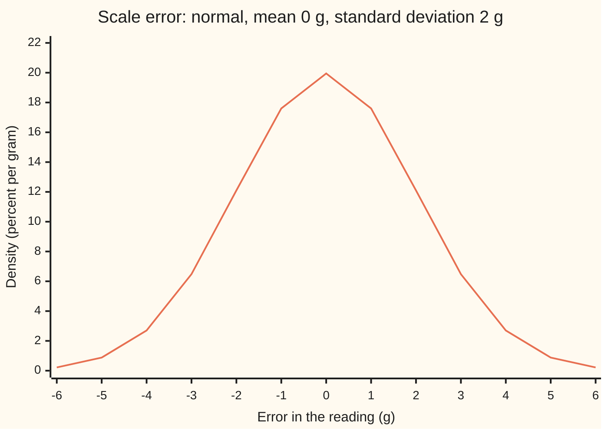
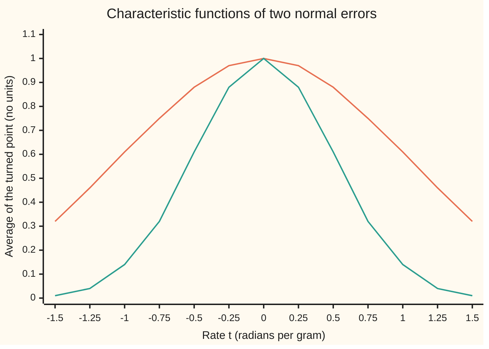

# Characteristic functions: the Fourier transform of a distribution, and how to get the distribution back

[Syllabus](../../../SYLLABUS.md) → [Probability and statistics](../README.md) → [Limit Theorems in Practice](../README.md#s06) → Characteristic functions

---

## General Overview

A kitchen scale weighs the same 500 g bag of flour again and again. The readings scatter. The error, reading minus 500 g, follows a normal law: mean 0 g, standard deviation 2 g. About 68 weighings in 100 land within 2 g of the truth (0.682689 of them, in the checks below).

That bell in grams is one way to describe the error. There is a second way, and it turns hard questions about sums of errors into multiplication. Pick a rate, say half a radian per gram. Turn each error into a point on a circle, rotated by that rate times the error, and average the points over many weighings. At a rate of 0.5 per gram the average is 0.606531. Do it at every rate and the result is a function of the rate: the error's **characteristic function**. It is the Fourier transform of the error's distribution, read with the probe turning the other way.

The scale's characteristic function is a bell too. Its values fall from 1 at rate 0 to 0.135335 at rate 1, along a curve of the same shape as the error's density. A wide bell in grams becomes a narrow bell in rates. And nothing is lost: an inverse integral turns the characteristic function back into the density, point by point, and back into chances of intervals. So two laws with the same characteristic function are the same law.

**The characteristic function of a random quantity is the average of a point on the unit circle turned by t times the quantity; for a normal error it is again a bell, independent errors multiply it, and an inversion integral recovers the distribution from it, so it identifies the law completely.**

**What kind of fact this is:** a definition with three theorems about it. The normal's characteristic function and the density inversion formula are proved on this card in Why it works. Lévy's general inversion formula is stated here and proved in Levy's inversion formula. The uniqueness theorem follows from it in Step 5, and is proved for every law, by another route, in [Characteristic functions](../../10-Measure%20and%20integration/10-The%20Limit%20Theorems%2C%20Proved/06-characteristic-functions.md).

### The picture: the scale's error, as a bell in grams



The density peaks at 19.95 percent per gram at zero error: about 1 weighing in 5 lands within half a gram either side of the truth.

### The picture: the same error, as a bell in rates



Orange: an error with standard deviation 1 g. Green: the kitchen scale, standard deviation 2 g. Both are bells and both start at 1. The scale spreads twice as wide in grams, and its characteristic function is twice as narrow in rates.

---

## The formula

Notation first, in words. The wing writes E[X] for the long-run average of X ([Expectation](../02-Random%20Variables/02-expectation.md)). The letter $i$ is the imaginary unit, the number whose square is −1. By Euler's formula, $e^{itX}$ is the point at angle t times X on the circle of radius 1: its across-coordinate is cos(tX) and its up-coordinate is sin(tX) ([Euler's formula](../../07-Complex%20analysis/01-Complex%20Numbers%20and%20the%20Plane/04-eulers-formula.md)). The characteristic function is written $\varphi_X(t)$, read "phi of X at t". The subscript keeps it apart from the bell's height, which the normal card also calls phi.

$$\varphi_X(t) = E\!\left[e^{itX}\right] = E[\cos(tX)] + i\,E[\sin(tX)]$$

**Read it aloud:** turn a point round the unit circle by t times the error, and average where it lands.

For a normal error with mean $\mu$ and standard deviation $\sigma$:

$$\varphi_X(t) = e^{\,i\mu t \,-\, \sigma^2 t^2/2}$$

**Read it aloud:** the mean turns the average; the spread shrinks it along a bell in t.

For the scale, $\mu$ is 0 g and $\sigma$ is 2 g, so the characteristic function is e^(−2t^2): at t = 0.5 it is 0.606531.

Inversion, for a law with a density $f(x)$ whose characteristic function has finite total size (the integral of its absolute value is finite), at every x where f is continuous:

$$f(x) = \frac{1}{2\pi}\int_{-\infty}^{\infty} e^{-itx}\,\varphi_X(t)\,dt$$

**Read it aloud:** spin every rate's average back by t times x, add them all, divide by 2π, and the density at x comes out.

Lévy's inversion formula, for any law, recovers the chance of an interval from $a$ to $b$ whose ends carry no probability of their own:

$$P(a < X < b) = \lim_{T\to\infty}\frac{1}{2\pi}\int_{-T}^{T} \frac{e^{-ita} - e^{-itb}}{it}\,\varphi_X(t)\,dt$$

**Read it aloud:** weight each rate's average by the spin-back of the whole interval, add over rates up to a cut-off $T$, and let the cut-off grow.

**Uniqueness theorem:** two random quantities whose characteristic functions agree at every real t have the same distribution.

| Symbol | Plain meaning | In our example | Push it up and the answer… |
| --- | --- | --- | --- |
| $X$ | the random quantity: the scale's error | a reading minus 500 g | — |
| $x$ | one possible value of the error | 0 g, 2 g, 4 g | density falls away from 0 |
| $t$ | the rate: radians of turn per gram of error | 0.5 per gram | the average shrinks toward 0 |
| $i$ | the imaginary unit, square −1 | — | — |
| $e^{itX}$ | the turned point on the unit circle | angle 0.5 times the error | — |
| $\varphi_X(t)$ | the characteristic function: the turned point's average | 0.606531 at t = 0.5 | — |
| $\mu$ | the error's mean | 0 g | turns the average without shrinking it |
| $\sigma$ | the error's standard deviation | 2 g | the bell in t narrows |
| $f(x)$ | the density: chance per gram near x | 0.199471 per gram at 0 | — |
| $a$, $b$ | ends of an interval of errors | −2 g and 2 g | wider interval, larger chance |
| $T$ | the cut-off on the rates in Lévy's integral | 10 in the code | the integral settles on the chance |
| $\pi$ | half a turn in radians | 3.14159… | — |
| $Z$ | the standard normal: mean 0, standard deviation 1 | the scale's error is 2 times Z | — |
| $\varepsilon$ | the spread of the tiny normal blur in Step 3's proof | shrinks to 0 | the blurred density smears wider |
| $k$, $j$ | whole numbers: faces of the die in Step 6; in Step 2, k numbers the terms of the series | face 3 | — |

The characteristic function is the Fourier transform of the density with the probe reversed: the Fourier card writes the transform with e^(−iωt), ω being its frequency, and this card averages e^(+itX), so the characteristic function at t is the transform at −t ([The Fourier transform](../../07-Complex%20analysis/08-Transforms%20in%20Outline/03-fourier-transform.md)). The inversion formula above is that card's inversion with the same sign flip.

### When it holds

- **Existence: always.** Every point sits on a circle of radius 1, so the average exists for every law, even one with no mean. The moment generating function can fail: a Cauchy error ([Heavy tails](../04-Continuous%20Distributions/08-heavy-tails-pareto-and-cauchy.md)) has none, yet its characteristic function is e^(−|t|).
- **Density inversion: needs a characteristic function of finite total size.** A die has no density, its characteristic function never dies out, and the density formula at face 3 climbs with the cut-off: 0.5038, 1.1920, 2.1587 at cut-offs 10, 20, 40.
- **Lévy's formula: ends that carry no probability.** At an end that carries probability, the integral counts half of it. For the scale, every single point has chance zero, so any ends work.
- **Uniqueness: every t.** Agreement at a few rates proves nothing: a die and a die shifted up by 4 agree at t = 0, π/2, π, 3π/2 and 2π, and differ by 0.089218 at t = 1.
- **The product rule for sums: independence.** Weighing twice gives e^(−2t^2) squared; one weighing counted twice gives something else entirely (What breaks, below).

---

## Why it works

### Step 0: a point on a circle always has an average

A random error can be huge. Its turned point cannot: it stays on a circle of radius 1. So the average of the turned points always exists and has size at most 1. At t = 0 every point sits at 1, so the characteristic function starts at 1.

The second idea is Fourier's. For an error with a density, the average is an integral of the density against a spinning probe. That is a Fourier transform, and the Fourier card proves that a transform can be run backwards. Everything on this card is those two facts, applied to probability.

### Step 1: shifts turn it, scales stretch it, independent sums multiply it

If the scale reads a fixed amount c too heavy, every turned point gains a fixed extra turn tc, so the average gains the factor e^(itc). If the error is multiplied by a fixed number s, the rate t acts as rate st: the characteristic function of sX + c is e^(itc) times the characteristic function of X at st.

For two independent errors X and Y, e^(it(X+Y)) is e^(itX) times e^(itY), and the average of a product of independent quantities is the product of their averages. So the characteristic function of X + Y is the product of the two. The density of a sum is a convolution integral ([Adding continuous variables](../05-Transformations%20and%20Joint%20Laws/04-sums-and-convolution.md)); its characteristic function is one multiplication. This is why the tool exists.

### Step 2: the normal's characteristic function is a bell

Start with the standard normal, written Z: mean 0, standard deviation 1. The sine part vanishes: the bell is symmetric, so sin(tX) is as often −s as +s. The cosine part is expanded in its Taylor series, cos u = 1 − u^2/2! + u^4/4! − …, and averaged term by term.

The averages needed are the even moments of the standard normal: 1, 1, 3, 15, 105 for powers 0, 2, 4, 6, 8. At t = 1 the terms are 1, −0.5, 0.125, −0.020833, 0.002604 and onward. Each term is the moment divided by the factorial, and that ratio is exactly (−t^2/2)^k divided by k!: the Taylor series of e^(−t^2/2). So

$$\varphi_Z(t) = e^{-t^2/2}.$$

Step 1 then moves this to the scale. The error is 2 times a standard normal, so its characteristic function is e^(−(2t)^2/2) = e^(−2t^2). With a mean μ the factor e^(iμt) joins it.

A shortcut replaces t by it in the moment generating function: e^(t^2/2) becomes e^(−t^2/2), the right answer. But that replacement is a claim about complex numbers that needs its own proof; the series above avoids it.

<details>
<summary>The algebra behind this, if you want it</summary>

The 2k-th moment of the standard normal is 1 × 3 × 5 × … × (2k − 1), because integration by parts gives each moment as (2k − 1) times the one before. Write z^(2k) times the bell's height as z^(2k − 1) times z e^(−z^2/2)/√(2π); the second factor is minus the slope of the bell's height, so parts give E[Z^(2k)] = (2k − 1) E[Z^(2k − 2)]. The normal card takes the same step for the variance ([Normal](../04-Continuous%20Distributions/04-normal-distribution.md)). Divide by (2k)! = 1 × 2 × 3 × … × 2k. The odd factors cancel, leaving 1 over 2 × 4 × … × 2k, which is 2^k times k!. So the k-th term is (−1)^k t^(2k) / (2^k k!) = (−t^2/2)^k / k!.

Averaging term by term is allowed because the absolute values add to a finite total: the sum of |tX|^j / j! is e^(|tX|), and the normal's average of e^(|tX|) is finite.

</details>

### Step 3: the density comes back, and the bell is what brings it

Blur the scale's error by adding an independent normal error of tiny spread ε. The blurred error's density at x is an average of f near x, weighted by a narrow bell. By Step 1 its characteristic function is the original times e^(−ε^2 t^2/2), a bell that dies out fast. For that product the inversion integral converges without trouble, and swapping the two integrals turns it into the blurred density exactly: this is the only place the proof needs a transform pair, and the pair it needs is the normal's own, from Step 2. Now let ε shrink. The blurred density tends to f(x). The integral tends to the inversion integral of the original characteristic function, because its total size is finite.

<details>
<summary>Detailed proof</summary>

Fix ε > 0 and x. Write the characteristic function as the integral of e^(ity) f(y) over y. Then
$$\frac{1}{2\pi}\int e^{-itx}\varphi_X(t)\,e^{-\varepsilon^2t^2/2}\,dt = \int f(y)\left[\frac{1}{2\pi}\int e^{it(y-x)}e^{-\varepsilon^2t^2/2}\,dt\right]dy.$$
The order of the two integrals may be swapped because the absolute value of the integrand is f(y) e^(−ε^2 t^2/2), whose double integral is finite (the rule for changing the order of a double integral).

The bracket is the normal's characteristic function read backwards. Step 2 says a normal error of spread ε has characteristic function e^(−ε^2 t^2/2), and for that bell, whose total size is finite, the Fourier card's inversion gives back its density. So the bracket equals the density of a normal error with spread ε at y − x: a bell of height at most 1/(ε√(2π)), with nearly all its mass within a few ε of zero. The right side is therefore the density at x of the error plus an independent normal blur.

Let ε shrink. Right side: where f is continuous at x, split the y-integral at a small distance δ: the part |y − x| < δ, where f(y) is within any chosen margin of f(x), and the rest, where the bell is at most e^(−δ^2/(2ε^2))/(ε√(2π)) and f integrates to at most 1. Both errors vanish, so the right side tends to f(x). Left side: the difference from the unblurred integral is at most the integral of |φ_X(t)| (1 − e^(−ε^2 t^2/2)). Split at a large rate R: beyond R it is at most the tail of the integral of |φ_X|, small because the total is finite; inside R the factor is at most ε^2 R^2 / 2. So the left side tends to the inversion integral. The two limits are equal, which is the formula.

</details>

### Step 4: Lévy's formula, for chances of intervals

Integrate the density formula over x from a to b. The x-integral of e^(−itx) is (e^(−ita) − e^(−itb))/(it), which is the weight in Lévy's formula. For the scale and the interval −2 g to 2 g the weight is 2 sin(2t)/t, and the integral gives 0.682689: the chance of a reading within one standard deviation.

Lévy's formula also holds with no density at all. That proof needs the measure-theoretic integral and is in Levy's inversion formula. Uniqueness for every law has a second proof, which blurs both laws with a narrow normal and then removes the blur, in [Characteristic functions](../../10-Measure%20and%20integration/10-The%20Limit%20Theorems%2C%20Proved/06-characteristic-functions.md).

### Step 5: uniqueness follows

If two laws share a characteristic function, Lévy's formula gives them the same chance for every interval whose ends carry no probability. Such ends are all but countably many points, so, letting a run down to −∞, the two cumulative distributions agree everywhere ([Densities](../04-Continuous%20Distributions/01-densities-and-cdfs.md)), and a cumulative distribution fixes the law.

### Step 6: whole-number laws invert over one turn

A die has no density, but it lives on whole numbers. Its characteristic function is (e^(it) + e^(2it) + … + e^(6it))/6, and it repeats every 2π. Over one turn, from −π to π, the integral of e^(it(j−k)) is 2π when j equals k and 0 otherwise, since a whole number of full turns averages to zero. So

$$P(X = k) = \frac{1}{2\pi}\int_{-\pi}^{\pi} e^{-itk}\,\varphi_X(t)\,dt,$$

which returns 1/6 for each face, 0.166667, and 0 for a face 7.

---

## Worked numbers, by hand

The scale: normal error, mean 0 g, standard deviation 2 g.

| Step | Arithmetic | Value |
| --- | --- | --- |
| exponent at t = 0.5 | 2^2 × 0.5^2 / 2 | 0.5 |
| characteristic function at 0.5 | e^(−0.5) | **0.606531** |
| same, from the standard normal's series at t = 1 | 1 − 0.5 + 0.125 − 0.020833 + 0.002604 − 0.000260 + … | 0.606531 |
| characteristic function at 1 | e^(−2) | 0.135335 |
| two independent weighings, summed, at 0.5 | 0.606531^2 | 0.367879 |
| inversion at x = 0 | (1/2π) × integral of e^(−2t^2) = (1/2π) × 1.253314 | **0.199471** per gram |
| density formula at 0 | 1 / (2 √(2π)) | 0.199471 per gram |
| Lévy, from −2 g to 2 g | (1/2π) × integral of 2 sin(2t)/t × e^(−2t^2) | **0.682689** |
| die face 3, over one turn | (1/2π) × 2π × 1/6 | 0.166667 |

The integral of e^(−2t^2) over all t is the Gaussian integral, √(π/2) = 1.253314. Divided by 2π it gives the height of the scale's bell at zero error, 0.199471 per gram. In the kitchen: a reading lands within half a gram of the truth about 1 time in 5, and within 2 g about 68 times in 100.

### What breaks if you drop a piece

| Mistake | Comes out at | What went wrong |
| --- | --- | --- |
| One weighing counted twice, 2X, treated as two independent weighings | predicts 0.367879 at t = 0.5; the truth is 0.135335, simulated 0.136902 (standard error 0.001550) | The product rule needs independence; a copy doubles the rate instead |
| Inversion without the 1/(2π) | density at 0 g of 1.253314 | Every value is 2π times too big: the curve encloses 6.28, not 1 |
| Sign of the spin-back flipped, scale reading 1 g heavy | density at +1 g of 0.120985, not 0.199471 | Recovers the mirror image: the bias moves to −1 g |
| The density formula used on a die | at face 3: 0.5038, 1.1920, 2.1587 as the cut-off grows | The die's characteristic function never dies out: no density to recover |

The code prints every one.

---

## Code, from first principles, and it actually runs

Nothing imported knows the answer: the integrals are Simpson's rule written out, and the random weighings come from SplitMix64 (seed 2026) and the Box–Muller recipe, written out in both languages so both draw the same numbers. The characteristic function at t = 0.5 is reached by three independent roads: the bell formula, an integral against the density, and an average over 200,000 simulated weighings with its standard error. The density and the interval chance are then recovered by inversion and checked against the density formula, a direct integral and a simulated count. The die is inverted over one turn, the four mistakes are reproduced, and the 1,000-roll bridge to the central limit theorem is printed.

### Python

```python
# Characteristic functions and inversion -- the check behind the card.
# Standard library only: math supplies cos, sin, exp, log, sqrt and pi, nothing
# more.  Integrals are Simpson's rule written out; random draws come from
# SplitMix64 (seed 2026) and Box-Muller, written out, so Rust draws the same.
from math import cos, sin, exp, log, sqrt, pi

SD, NDRAW = 2.0, 200000            # the scale's error: normal, mean 0 g, sd 2 g
M64 = (1 << 64) - 1

def simpson(f, a, b, n):
    h = (b - a) / n
    s = f(a) + f(b)
    for i in range(1, n):
        s += (4 if i % 2 else 2) * f(a + i * h)
    return s * h / 3

def dens(x, mu=0.0, sd=SD):        # the bell in grams
    z = (x - mu) / sd
    return exp(-0.5 * z * z) / (sd * sqrt(2 * pi))

def phi(t, sd=SD):                 # road 1, the card's formula: a bell in t
    return exp(-0.5 * sd * sd * t * t)

def invert(x, phi_re, phi_im, sign=1.0, T=10.0):   # f(x) = (1/2pi) integral of e^{-itx} phi(t)
    g = lambda t: phi_re(t) * cos(t * x) + sign * phi_im(t) * sin(t * x)
    return simpson(g, -T, T, 4000) / (2 * pi)

def die_phi(t, shift=0):           # a fair die: (1/6) sum of e^{itj}, j = 1..6
    return (sum(cos(t * (j + shift)) for j in range(1, 7)) / 6,
            sum(sin(t * (j + shift)) for j in range(1, 7)) / 6)

state = 2026                       # SplitMix64 seed
def uniform():                     # a number in (0, 1]
    global state
    state = (state + 0x9E3779B97F4A7C15) & M64
    z = state
    z = ((z ^ (z >> 30)) * 0xBF58476D1CE4E5B9) & M64
    z = ((z ^ (z >> 27)) * 0x94D049BB133111EB) & M64
    z ^= z >> 31
    return ((z >> 11) + 1) / 9007199254740992.0

def normal():                      # Box-Muller, cosine half
    u1 = uniform()
    u2 = uniform()
    return sqrt(-2.0 * log(u1)) * cos(2.0 * pi * u2)

acc = [[0.0, 0.0] for _ in range(4)]
for _ in range(NDRAW):
    x1 = SD * normal()
    x2 = SD * normal()
    for k, v in enumerate((cos(0.5 * x1), 1.0 if -2.0 < x1 < 2.0 else 0.0,
                           cos(0.5 * (x1 + x2)), cos(0.5 * (x1 + x1)))):
        acc[k][0] += v
        acc[k][1] += v * v
def mean_se(k):
    m = acc[k][0] / NDRAW
    return m, sqrt((acc[k][1] - NDRAW * m * m) / (NDRAW - 1) / NDRAW)
sim, se = mean_se(0); sim_in, se_in = mean_se(1); sim_2, se_2 = mean_se(2); sim_d, se_d = mean_se(3)

re05 = simpson(lambda x: cos(0.5 * x) * dens(x), -40.0, 40.0, 4000)
im05 = simpson(lambda x: sin(0.5 * x) * dens(x), -40.0, 40.0, 4000)
re1 = simpson(lambda x: cos(1.0 * x) * dens(x), -40.0, 40.0, 4000)
moments = [simpson(lambda z: z ** (2 * k) * dens(z, 0.0, 1.0), -12.0, 12.0, 4000) for k in range(8)]
terms, fact = [], 1.0
for k in range(8):
    terms.append((-1) ** k * moments[k] / fact)
    fact *= (2 * k + 1) * (2 * k + 2)
zero = lambda t: 0.0
f_inv = [invert(x, phi, zero) for x in (0.0, 2.0, 4.0)]
levy_g = lambda t: 4.0 * phi(t) if t == 0 else (sin(2.0 * t) - sin(-2.0 * t)) / t * phi(t)
levy = simpson(levy_g, -10.0, 10.0, 4000) / (2 * pi)
area = simpson(dens, -2.0, 2.0, 4000)
b_re, b_im = (lambda t: cos(t) * phi(t)), (lambda t: sin(t) * phi(t))   # scale reading 1 g heavy
right, wrong = invert(1.0, b_re, b_im), invert(1.0, b_re, b_im, -1.0)
die_p = [invert(k, lambda t: die_phi(t)[0], lambda t: die_phi(t)[1], 1.0, pi) for k in range(1, 8)]
die_bad = [invert(3.0, lambda t: die_phi(t)[0], lambda t: die_phi(t)[1], 1.0, T) for T in (10.0, 20.0, 40.0)]
die_bad_exact = [T / (6 * pi) + sum(sin(T * m) / (6 * pi * m) for m in (-2, -1, 1, 2, 3)) for T in (10.0, 20.0, 40.0)]
gap = lambda t: sqrt((die_phi(t)[0] - die_phi(t, 4)[0]) ** 2 + (die_phi(t)[1] - die_phi(t, 4)[1]) ** 2)
probe_gap = max(gap(k * pi / 2) for k in range(5))
sd_die = sqrt(35 / 12)
s = 1.0 / (sd_die * sqrt(1000))
clt = (sum(cos(s * (j - 3.5)) for j in range(1, 7)) / 6) ** 1000

rows = [("phi(0.5) formula exp(-2 t^2)", phi(0.5)), ("phi(0.5) Simpson, real part", re05),
        ("phi(0.5) Simpson, |imaginary part|", abs(im05)), ("phi(0.5) simulated, 200000 draws", sim),
        ("  standard error", se), ("phi(1) formula", phi(1.0)), ("phi(1) Simpson", re1),
        ("f(0) by inversion", f_inv[0]), ("f(0) density formula", dens(0.0)),
        ("f(2) by inversion", f_inv[1]), ("f(2) density formula", dens(2.0)),
        ("f(4) by inversion", f_inv[2]), ("f(4) density formula", dens(4.0)),
        ("P(-2<X<2) Levy inversion", levy), ("P(-2<X<2) Simpson on density", area),
        ("P(-2<X<2) simulated", sim_in), ("  standard error", se_in),
        ("series for exp(-1/2), 8 terms", sum(terms)), ("exp(-1/2)", exp(-0.5)),
        ("two weighings X1+X2: phi(0.5)^2", phi(0.5) ** 2), ("  simulated", sim_2), ("  standard error", se_2),
        ("one weighing doubled 2X: phi(1)", phi(1.0)), ("  simulated", sim_d), ("  standard error", se_d),
        ("biased scale, f(1), right sign", right), ("wrong: sign flipped, f(1)", wrong),
        ("wrong: no 1/(2 pi), f(0)", 2 * pi * f_inv[0]),
        ("die vs die+4, max gap at t = k pi/2", probe_gap), ("die vs die+4, gap at t = 1", gap(1.0)),
        ("1000 rolls standardized, phi(1)", clt), ("spread of the average, sd/sqrt(1000)", sd_die / sqrt(1000))]
for name, v in rows:
    print(f"{name:<38}{v:>12.6f}")
print("series terms k=0..7    " + " ".join(f"{v:.6f}" for v in terms))
print("die P(X=k) by inversion, k=1..7  " + " ".join(f"{abs(v):.6f}" for v in die_p))
print("wrong: die as a density, T=10,20,40  " + " ".join(f"{v:.4f}" for v in die_bad))
print("  closed form                        " + " ".join(f"{v:.4f}" for v in die_bad_exact))
print("chart, density %/g, x=-6..6   " + " ".join(f"{100 * dens(x):.2f}" for x in range(-6, 7)))
for sd in (1.0, 2.0):
    print(f"chart, phi sd={sd:.0f}, t=-1.5..1.5  " + " ".join(f"{phi(-1.5 + 0.25 * i, sd):.2f}" for i in range(13)))
print("chart, die |phi|, t=k pi/8  " + " ".join(f"{sqrt(sum(c * c for c in die_phi(k * pi / 8))):.2f}" for k in range(17)))

assert abs(re05 - phi(0.5)) < 1e-9, "integral road lands on the bell formula"
assert abs(sim - phi(0.5)) < 4 * se, "simulated average of cos(tX) within 4 standard errors"
assert abs(f_inv[0] - dens(0.0)) < 1e-9, "inversion returns the density at the peak"
assert abs(f_inv[2] - dens(4.0)) < 1e-9, "inversion returns the density in the tail"
assert abs(levy - area) < 1e-8, "Levy's interval formula against the integrated density"
assert abs(sim_in - levy) < 4 * se_in, "Levy's interval formula against the simulated count"
assert abs(sum(terms) - exp(-0.5)) < 1e-5, "series from integrated moments"
assert abs(die_p[2] - 1 / 6) < 1e-9, "die face 3 recovered from its characteristic function"
assert abs(die_p[6]) < 1e-9, "no face 7 recovered"
assert max(abs(a - b) for a, b in zip(die_bad, die_bad_exact)) < 1e-6, "die failure matches its closed form"
assert abs(sim_2 - phi(0.5) ** 2) < 4 * se_2, "independent weighings: transforms multiply"
assert abs(sim_d - phi(0.5) ** 2) > 10 * se_d, "a copied weighing breaks the product rule"
assert abs(clt - exp(-0.5)) < 1e-3, "1000 rolls: the bell in t appears"
assert abs(sim_d - phi(1.0)) < 4 * se_d, "a copied weighing follows phi at the doubled rate"
assert abs(right - dens(1.0, 1.0)) < 1e-9 and abs(wrong - dens(1.0, -1.0)) < 1e-9, "right sign finds the bias, wrong sign mirrors it"
assert probe_gap < 1e-12 and gap(1.0) > 0.05, "die and die+4 agree at k pi/2 but not at t = 1"
print("ALL CHECKS PASS")
```

**Ran 2026-09-28 on macOS, Python 3.14.6, standard library only. All checks passed. Output, pasted from the run:**

```
phi(0.5) formula exp(-2 t^2)              0.606531
phi(0.5) Simpson, real part               0.606531
phi(0.5) Simpson, |imaginary part|        0.000000
phi(0.5) simulated, 200000 draws          0.607899
  standard error                          0.000997
phi(1) formula                            0.135335
phi(1) Simpson                            0.135335
f(0) by inversion                         0.199471
f(0) density formula                      0.199471
f(2) by inversion                         0.120985
f(2) density formula                      0.120985
f(4) by inversion                         0.026995
f(4) density formula                      0.026995
P(-2<X<2) Levy inversion                  0.682689
P(-2<X<2) Simpson on density              0.682689
P(-2<X<2) simulated                       0.684875
  standard error                          0.001039
series for exp(-1/2), 8 terms             0.606531
exp(-1/2)                                 0.606531
two weighings X1+X2: phi(0.5)^2           0.367879
  simulated                               0.368418
  standard error                          0.001368
one weighing doubled 2X: phi(1)           0.135335
  simulated                               0.136902
  standard error                          0.001550
biased scale, f(1), right sign            0.199471
wrong: sign flipped, f(1)                 0.120985
wrong: no 1/(2 pi), f(0)                  1.253314
die vs die+4, max gap at t = k pi/2       0.000000
die vs die+4, gap at t = 1                0.089218
1000 rolls standardized, phi(1)           0.606499
spread of the average, sd/sqrt(1000)      0.054006
series terms k=0..7    1.000000 -0.500000 0.125000 -0.020833 0.002604 -0.000260 0.000022 -0.000002
die P(X=k) by inversion, k=1..7  0.166667 0.166667 0.166667 0.166667 0.166667 0.166667 0.000000
wrong: die as a density, T=10,20,40  0.5038 1.1920 2.1587
  closed form                        0.5038 1.1920 2.1587
chart, density %/g, x=-6..6   0.22 0.88 2.70 6.48 12.10 17.60 19.95 17.60 12.10 6.48 2.70 0.88 0.22
chart, phi sd=1, t=-1.5..1.5  0.32 0.46 0.61 0.75 0.88 0.97 1.00 0.97 0.88 0.75 0.61 0.46 0.32
chart, phi sd=2, t=-1.5..1.5  0.01 0.04 0.14 0.32 0.61 0.88 1.00 0.88 0.61 0.32 0.14 0.04 0.01
chart, die |phi|, t=k pi/8  1.00 0.79 0.31 0.11 0.24 0.08 0.13 0.16 0.00 0.16 0.13 0.08 0.24 0.11 0.31 0.79 1.00
ALL CHECKS PASS
```

Three roads meet at 0.606531: formula and integral to six decimals, the simulation within two standard errors. Inversion returns the density to six decimals at 0, 2 and 4 g, and Lévy's formula matches the integrated density and the simulated count.

### Rust

Same generator, same integrals, same rows, std only.

```rust
// Characteristic functions and inversion -- the same check in Rust, std only.
// Integrals are Simpson's rule written out; random draws come from SplitMix64
// (seed 2026) and Box-Muller, the same generator as the Python check.
// Compile: rustc --edition 2021 -O characteristic_functions_and_inversion_check.rs
use std::f64::consts::PI;

const SD: f64 = 2.0; // the scale's error: normal, mean 0 g, sd 2 g
const NDRAW: usize = 200000;

fn simpson<F: Fn(f64) -> f64>(f: F, a: f64, b: f64, n: usize) -> f64 {
    let h = (b - a) / n as f64;
    let mut s = f(a) + f(b);
    for i in 1..n {
        s += if i % 2 == 1 { 4.0 } else { 2.0 } * f(a + i as f64 * h);
    }
    s * h / 3.0
}

fn dens(x: f64, mu: f64, sd: f64) -> f64 { // the bell in grams
    let z = (x - mu) / sd;
    (-0.5 * z * z).exp() / (sd * (2.0 * PI).sqrt())
}

fn phi(t: f64, sd: f64) -> f64 { (-0.5 * sd * sd * t * t).exp() } // road 1: a bell in t

// f(x) = (1/2pi) integral of e^{-itx} phi(t) dt, real part, over [-T, T]
fn invert<A: Fn(f64) -> f64, B: Fn(f64) -> f64>(x: f64, re: A, im: B, sign: f64, big_t: f64) -> f64 {
    simpson(|t| re(t) * (t * x).cos() + sign * im(t) * (t * x).sin(), -big_t, big_t, 4000) / (2.0 * PI)
}

fn die_phi(t: f64, shift: i32) -> (f64, f64) { // a fair die: (1/6) sum of e^{itj}
    let (mut c, mut s) = (0.0, 0.0);
    for j in 1..7 { c += (t * (j + shift) as f64).cos(); s += (t * (j + shift) as f64).sin(); }
    (c / 6.0, s / 6.0)
}

struct Rng(u64);
impl Rng {
    fn uniform(&mut self) -> f64 { // SplitMix64, a number in (0, 1]
        self.0 = self.0.wrapping_add(0x9E3779B97F4A7C15);
        let mut z = self.0;
        z = (z ^ (z >> 30)).wrapping_mul(0xBF58476D1CE4E5B9);
        z = (z ^ (z >> 27)).wrapping_mul(0x94D049BB133111EB);
        z ^= z >> 31;
        ((z >> 11) + 1) as f64 / 9007199254740992.0
    }
    fn normal(&mut self) -> f64 { // Box-Muller, cosine half
        let u1 = self.uniform();
        let u2 = self.uniform();
        (-2.0 * u1.ln()).sqrt() * (2.0 * PI * u2).cos()
    }
}

fn join(v: &[f64], d: usize) -> String {
    v.iter().map(|x| format!("{:.*}", d, x)).collect::<Vec<_>>().join(" ")
}

fn main() {
    let mut rng = Rng(2026);
    let mut acc = [[0.0f64; 2]; 4];
    for _ in 0..NDRAW {
        let x1 = SD * rng.normal();
        let x2 = SD * rng.normal();
        let vals = [(0.5 * x1).cos(), if -2.0 < x1 && x1 < 2.0 { 1.0 } else { 0.0 },
                    (0.5 * (x1 + x2)).cos(), (0.5 * (x1 + x1)).cos()];
        for k in 0..4 { acc[k][0] += vals[k]; acc[k][1] += vals[k] * vals[k]; }
    }
    let n = NDRAW as f64;
    let mean_se = |k: usize| {
        let m = acc[k][0] / n;
        (m, ((acc[k][1] - n * m * m) / (n - 1.0) / n).sqrt())
    };
    let ((sim, se), (sim_in, se_in), (sim_2, se_2), (sim_d, se_d)) = (mean_se(0), mean_se(1), mean_se(2), mean_se(3));

    let p = |t: f64| phi(t, SD);
    let re05 = simpson(|x| (0.5 * x).cos() * dens(x, 0.0, SD), -40.0, 40.0, 4000);
    let im05 = simpson(|x| (0.5 * x).sin() * dens(x, 0.0, SD), -40.0, 40.0, 4000);
    let re1 = simpson(|x| (1.0 * x).cos() * dens(x, 0.0, SD), -40.0, 40.0, 4000);
    let mut terms = Vec::new();
    let mut fact = 1.0;
    for k in 0..8 {
        let m = simpson(|z| z.powf((2 * k) as f64) * dens(z, 0.0, 1.0), -12.0, 12.0, 4000);
        let sign = if k % 2 == 0 { 1.0 } else { -1.0 };
        terms.push(sign * m / fact);
        fact *= ((2 * k + 1) * (2 * k + 2)) as f64;
    }
    let series: f64 = terms.iter().sum();
    let zero = |_t: f64| 0.0;
    let f_inv: Vec<f64> = [0.0, 2.0, 4.0].iter().map(|&x| invert(x, p, zero, 1.0, 10.0)).collect();
    let levy_g = |t: f64| if t == 0.0 { 4.0 * p(t) } else { ((2.0 * t).sin() - (-2.0 * t).sin()) / t * p(t) };
    let levy = simpson(levy_g, -10.0, 10.0, 4000) / (2.0 * PI);
    let area = simpson(|x| dens(x, 0.0, SD), -2.0, 2.0, 4000);
    let (b_re, b_im) = (|t: f64| t.cos() * p(t), |t: f64| t.sin() * p(t)); // scale reading 1 g heavy
    let (right, wrong) = (invert(1.0, b_re, b_im, 1.0, 10.0), invert(1.0, b_re, b_im, -1.0, 10.0));
    let (dre, dim) = (|t: f64| die_phi(t, 0).0, |t: f64| die_phi(t, 0).1);
    let die_p: Vec<f64> = (1..8).map(|k| invert(k as f64, dre, dim, 1.0, PI)).collect();
    let ts = [10.0, 20.0, 40.0];
    let die_bad: Vec<f64> = ts.iter().map(|&bt| invert(3.0, dre, dim, 1.0, bt)).collect();
    let die_bad_exact: Vec<f64> = ts.iter().map(|&bt| {
        bt / (6.0 * PI) + [-2.0, -1.0, 1.0, 2.0, 3.0].iter().map(|&m: &f64| (bt * m).sin() / (6.0 * PI * m)).sum::<f64>()
    }).collect();
    let gap = |t: f64| {
        let (a, b) = (die_phi(t, 0), die_phi(t, 4));
        ((a.0 - b.0).powf(2.0) + (a.1 - b.1).powf(2.0)).sqrt()
    };
    let probe_gap = (0..5).map(|k| gap(k as f64 * PI / 2.0)).fold(f64::MIN, f64::max);
    let sd_die = (35.0f64 / 12.0).sqrt();
    let s = 1.0 / (sd_die * 1000.0f64.sqrt());
    let clt = ((1..7).map(|j| (s * (j as f64 - 3.5)).cos()).sum::<f64>() / 6.0).powf(1000.0);

    let rows: Vec<(&str, f64)> = vec![
        ("phi(0.5) formula exp(-2 t^2)", p(0.5)), ("phi(0.5) Simpson, real part", re05),
        ("phi(0.5) Simpson, |imaginary part|", im05.abs()), ("phi(0.5) simulated, 200000 draws", sim),
        ("  standard error", se), ("phi(1) formula", p(1.0)), ("phi(1) Simpson", re1),
        ("f(0) by inversion", f_inv[0]), ("f(0) density formula", dens(0.0, 0.0, SD)),
        ("f(2) by inversion", f_inv[1]), ("f(2) density formula", dens(2.0, 0.0, SD)),
        ("f(4) by inversion", f_inv[2]), ("f(4) density formula", dens(4.0, 0.0, SD)),
        ("P(-2<X<2) Levy inversion", levy), ("P(-2<X<2) Simpson on density", area),
        ("P(-2<X<2) simulated", sim_in), ("  standard error", se_in),
        ("series for exp(-1/2), 8 terms", series), ("exp(-1/2)", (-0.5f64).exp()),
        ("two weighings X1+X2: phi(0.5)^2", p(0.5).powf(2.0)), ("  simulated", sim_2), ("  standard error", se_2),
        ("one weighing doubled 2X: phi(1)", p(1.0)), ("  simulated", sim_d), ("  standard error", se_d),
        ("biased scale, f(1), right sign", right), ("wrong: sign flipped, f(1)", wrong),
        ("wrong: no 1/(2 pi), f(0)", 2.0 * PI * f_inv[0]),
        ("die vs die+4, max gap at t = k pi/2", probe_gap), ("die vs die+4, gap at t = 1", gap(1.0)),
        ("1000 rolls standardized, phi(1)", clt), ("spread of the average, sd/sqrt(1000)", sd_die / 1000.0f64.sqrt()),
    ];
    for (name, v) in &rows { println!("{:<38}{:>12.6}", name, v); }
    println!("series terms k=0..7    {}", join(&terms, 6));
    println!("die P(X=k) by inversion, k=1..7  {}", join(&die_p.iter().map(|v| v.abs()).collect::<Vec<_>>(), 6));
    println!("wrong: die as a density, T=10,20,40  {}", join(&die_bad, 4));
    println!("  closed form                        {}", join(&die_bad_exact, 4));
    let chart: Vec<f64> = (-6..7).map(|x| 100.0 * dens(x as f64, 0.0, SD)).collect();
    println!("chart, density %/g, x=-6..6   {}", join(&chart, 2));
    for sd in [1.0f64, 2.0] {
        let v: Vec<f64> = (0..13).map(|i| phi(-1.5 + 0.25 * i as f64, sd)).collect();
        println!("chart, phi sd={:.0}, t=-1.5..1.5  {}", sd, join(&v, 2));
    }
    let dv: Vec<f64> = (0..17).map(|k| { let c = die_phi(k as f64 * PI / 8.0, 0); (c.0 * c.0 + c.1 * c.1).sqrt() }).collect();
    println!("chart, die |phi|, t=k pi/8  {}", join(&dv, 2));

    assert!((re05 - p(0.5)).abs() < 1e-9, "integral road lands on the bell formula");
    assert!((sim - p(0.5)).abs() < 4.0 * se, "simulated average of cos(tX) within 4 standard errors");
    assert!((f_inv[0] - dens(0.0, 0.0, SD)).abs() < 1e-9, "inversion returns the density at the peak");
    assert!((f_inv[2] - dens(4.0, 0.0, SD)).abs() < 1e-9, "inversion returns the density in the tail");
    assert!((levy - area).abs() < 1e-8, "Levy's interval formula against the integrated density");
    assert!((sim_in - levy).abs() < 4.0 * se_in, "Levy's interval formula against the simulated count");
    assert!((series - (-0.5f64).exp()).abs() < 1e-5, "series from integrated moments");
    assert!((die_p[2] - 1.0 / 6.0).abs() < 1e-9, "die face 3 recovered from its characteristic function");
    assert!(die_p[6].abs() < 1e-9, "no face 7 recovered");
    assert!(die_bad.iter().zip(&die_bad_exact).all(|(a, b)| (a - b).abs() < 1e-6), "die failure matches its closed form");
    assert!((sim_2 - p(0.5).powf(2.0)).abs() < 4.0 * se_2, "independent weighings: transforms multiply");
    assert!((sim_d - p(0.5).powf(2.0)).abs() > 10.0 * se_d, "a copied weighing breaks the product rule");
    assert!((clt - (-0.5f64).exp()).abs() < 1e-3, "1000 rolls: the bell in t appears");
    assert!((sim_d - p(1.0)).abs() < 4.0 * se_d, "a copied weighing follows phi at the doubled rate");
    assert!((right - dens(1.0, 1.0, SD)).abs() < 1e-9 && (wrong - dens(1.0, -1.0, SD)).abs() < 1e-9, "right sign finds the bias, wrong sign mirrors it");
    assert!(probe_gap < 1e-12 && gap(1.0) > 0.05, "die and die+4 agree at k pi/2 but not at t = 1");
    println!("ALL CHECKS PASS");
}
```

**Ran 2026-09-28 on macOS, rustc 1.98.1, no crates. All checks passed. Output, pasted from the run:**

```
phi(0.5) formula exp(-2 t^2)              0.606531
phi(0.5) Simpson, real part               0.606531
phi(0.5) Simpson, |imaginary part|        0.000000
phi(0.5) simulated, 200000 draws          0.607899
  standard error                          0.000997
phi(1) formula                            0.135335
phi(1) Simpson                            0.135335
f(0) by inversion                         0.199471
f(0) density formula                      0.199471
f(2) by inversion                         0.120985
f(2) density formula                      0.120985
f(4) by inversion                         0.026995
f(4) density formula                      0.026995
P(-2<X<2) Levy inversion                  0.682689
P(-2<X<2) Simpson on density              0.682689
P(-2<X<2) simulated                       0.684875
  standard error                          0.001039
series for exp(-1/2), 8 terms             0.606531
exp(-1/2)                                 0.606531
two weighings X1+X2: phi(0.5)^2           0.367879
  simulated                               0.368418
  standard error                          0.001368
one weighing doubled 2X: phi(1)           0.135335
  simulated                               0.136902
  standard error                          0.001550
biased scale, f(1), right sign            0.199471
wrong: sign flipped, f(1)                 0.120985
wrong: no 1/(2 pi), f(0)                  1.253314
die vs die+4, max gap at t = k pi/2       0.000000
die vs die+4, gap at t = 1                0.089218
1000 rolls standardized, phi(1)           0.606499
spread of the average, sd/sqrt(1000)      0.054006
series terms k=0..7    1.000000 -0.500000 0.125000 -0.020833 0.002604 -0.000260 0.000022 -0.000002
die P(X=k) by inversion, k=1..7  0.166667 0.166667 0.166667 0.166667 0.166667 0.166667 0.000000
wrong: die as a density, T=10,20,40  0.5038 1.1920 2.1587
  closed form                        0.5038 1.1920 2.1587
chart, density %/g, x=-6..6   0.22 0.88 2.70 6.48 12.10 17.60 19.95 17.60 12.10 6.48 2.70 0.88 0.22
chart, phi sd=1, t=-1.5..1.5  0.32 0.46 0.61 0.75 0.88 0.97 1.00 0.97 0.88 0.75 0.61 0.46 0.32
chart, phi sd=2, t=-1.5..1.5  0.01 0.04 0.14 0.32 0.61 0.88 1.00 0.88 0.61 0.32 0.14 0.04 0.01
chart, die |phi|, t=k pi/8  1.00 0.79 0.31 0.11 0.24 0.08 0.13 0.16 0.00 0.16 0.13 0.08 0.24 0.11 0.31 0.79 1.00
ALL CHECKS PASS
```

The two outputs agree line for line, including the simulated averages, because both languages run the same generator in the same order.

> [!TIP]
> **Try changing**
> Guess first, then run.
> - **A sharper scale.** Set `SD = 1.0`. Guess: the bell in t widens. The characteristic function at t = 0.5 rises to 0.88, the orange line in the second chart.
> - **Copy the weighing.** In the simulated sum, replace `x2` by `x1`. The average at t = 0.5 falls from 0.368418 to 0.136902: the fourth row of the simulation, already printed. The assert on independent weighings then stops the program, as it should.
> - **Invert the die with a long cut-off.** Change the die inversion's `pi` to `10.0`. Face 3 reads 0.5038 instead of 0.166667, and it keeps climbing with the cut-off. The assert on die face 3 then stops the program, as it should.
> - **Probe the die at a few rates.** Compare the die with the die shifted by 4 at t = 0, π/2, π, 3π/2, 2π: the largest gap is 0.000000. At t = 1 it is 0.089218.

---

## The usual mistake

> [!warning]
> **Reading a few values as the whole fingerprint.** Uniqueness needs the characteristic function at every rate t. A fair die and a die with faces 5 to 10 have different means, yet their characteristic functions agree exactly at t = 0, π/2, π, 3π/2 and 2π, because a shift of 4 adds a whole number of full turns at each of those rates. At t = 1 they differ by 0.089218. Finitely many values, or finitely many moments, do not pin down a law.
>
> - **Treating a value as a probability.** It is an average position on a circle, not a chance: it can be negative or complex, and the die's is 0.00 at t = π though every face has chance 1/6.
> - **Multiplying without independence.** One weighing counted twice has characteristic function 0.135335 at t = 0.5, not 0.367879.
> - **Mixing sign conventions.** Probability averages e^(+itX); the Fourier card's transform uses e^(−iωt). Flip one and not the other and a scale reading 1 g heavy comes back reading 1 g light: 0.120985 at +1 g, where the truth is 0.199471.
> - **Forgetting the 1/(2π).** The density at zero comes out 1.253314 per gram, 2π times the truth; the curve would enclose 6.28, not 1.

---

## Where you meet it in real life

- **Why averages become bells.** For 1,000 rolls of a fair die, standardised, the characteristic function at t = 1 is 0.606499, against the bell's 0.606531; the average's spread is 0.054006. The central limit theorem for every law with a finite spread is proved by multiplying characteristic functions in this way and then applying Lévy's continuity theorem (Levy's continuity theorem, The central limit theorem in four lines, once you have fingerprints); the theorem itself is stated on [Central limit theorem](02-central-limit-theorem.md).
- **Measurement chains.** Independent errors from a scale, a thermometer and a timer add; their characteristic functions multiply, and inversion gives the combined error's density without computing a convolution.
- **Heavy tails.** A Cauchy error has no mean and no moment generating function, but its characteristic function e^(−|t|) shows at once that averages of Cauchy errors never settle. By Step 1, the average of n independent ones has characteristic function (e^(−|t|/n))^n = e^(−|t|): the same law as a single error ([Heavy tails](../04-Continuous%20Distributions/08-heavy-tails-pareto-and-cauchy.md)).
- **Option pricing.** Models such as Heston give a stock's characteristic function in closed form but no usable density; prices come from an inversion integral: [Pricing Heston exactly](../../12-Financial%20mathematics/14-Stochastic%20volatility%20-%20Heston%2C%20SABR%20and%20their%20mix/02-heston-pricing-by-characteristic-function.md).
- **Processes with jumps.** A process built from independent pieces is described by one characteristic function per unit of time: [Levy processes](../../11-Stochastic%20processes%20and%20calculus/09-Beyond%20Brownian/01-levy-processes.md).

> **Say it back**
> The characteristic function averages a point on the unit circle turned by t times the random quantity, so it exists for every law. For a normal error it is again a bell, e^(iμt − σ^2 t^2/2): wide in the quantity means narrow in t. Independent quantities add, and their characteristic functions multiply. An inversion integral with 1/(2π) in front returns the density, or, by Lévy's formula, the chance of any interval. So the characteristic function at every t fixes the law, and a few values do not.

---

## What this builds on

- [Moment generating functions](../02-Random%20Variables/07-moment-generating-functions.md): the same idea with e^(tX) in place of the turned point, and the product rule for independent sums.
- [The Fourier transform](../../07-Complex%20analysis/08-Transforms%20in%20Outline/03-fourier-transform.md): the transform, the Gaussian as its own transform, and the inversion integral this card applies to densities.

## Where this goes next

- Levy's inversion formula: Lévy's formula and uniqueness proved for every law, with or without a density.
- Levy's continuity theorem: characteristic functions that converge give laws that converge, the engine of the central limit theorem.
- Characteristic functions: smoothness, moments from derivatives at zero, and which functions can be characteristic functions.
- [Levy processes](../../11-Stochastic%20processes%20and%20calculus/09-Beyond%20Brownian/01-levy-processes.md): random motions whose increments are described by one characteristic function.
- [Pricing Heston exactly](../../12-Financial%20mathematics/14-Stochastic%20volatility%20-%20Heston%2C%20SABR%20and%20their%20mix/02-heston-pricing-by-characteristic-function.md): an option price computed by inverting a characteristic function.
- [Transform pricing](../../12-Financial%20mathematics/06-Numerical%20Methods%20for%20Pricing/09-carr-madan-fft-and-cos-methods.md): the inversion integral done fast, for thousands of strikes at once.

The card leaves open why characteristic functions that converge belong to laws that converge, the step that turns a product of characteristic functions into the central limit theorem; Levy's continuity theorem answers it.

---

## Sources

Verified 2026-09-28: every link below resolves to the publisher's or author's page.

- Durrett, Rick. *Probability: Theory and Examples*, 5th ed. Cambridge University Press, 2019. [Author's page for the book](https://services.math.duke.edu/~rtd/PTE/pte.html). Section 3.3: the definition, the normal's characteristic function, the inversion formula and uniqueness.
- Billingsley, Patrick. *Probability and Measure*, Anniversary ed. Wiley, 2012. [Publisher page](https://www.wiley.com/en-us/Probability+and+Measure%2C+Anniversary+Edition-p-9781118122372). Section 26: Lévy's inversion formula with full proof, including ends that carry probability.
- Gil-Pelaez, J. "Note on the Inversion Theorem." *Biometrika* 38, no. 3–4 (1951): 481–482. [doi:10.1093/biomet/38.3-4.481](https://doi.org/10.1093/biomet/38.3-4.481). The one-sided form of inversion used in numerical work.
- Sheffield, Scott. "Characteristic Functions and Central Limit Theorem." MIT 18.175 Lecture 10, 2016. [Lecture slides](https://math.mit.edu/~sheffield/2016175/Lecture10.pdf). A short tour from the definition through inversion to the central limit theorem.
