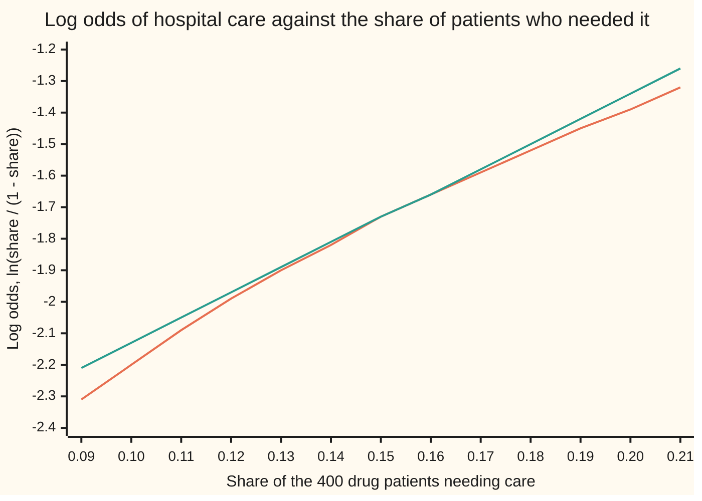
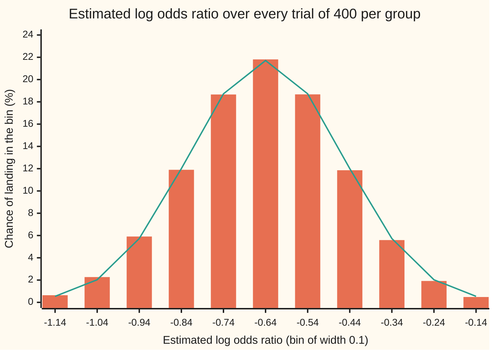
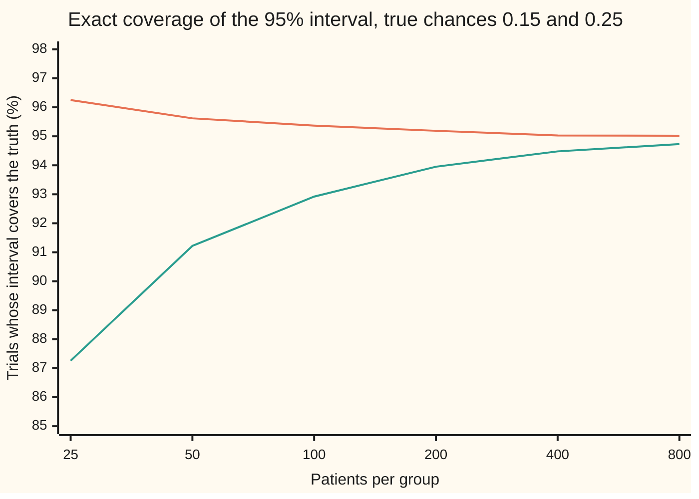

# Delta method: the error of a function of an average

[Syllabus](../../../SYLLABUS.md) → [Probability and statistics](../../../SYLLABUS.md#w09) → [Limit Theorems in Practice](../../../SYLLABUS.md#w09-s06) → Delta method

---

## General Overview

A drug trial gives 400 patients a new drug and 400 a placebo. Within a year, 60 on the drug and 100 on placebo need hospital care. The odds of hospital care on the drug are 60 to 340, or 0.176471; on placebo they are 100 to 300, or 0.333333. Their ratio, the **odds ratio**, is 0.529412: the drug roughly halves the odds.

Another 800 patients would give another number. How far from the truth is 0.529412 likely to be?

The share of drug patients needing care, 60 out of 400, is an average of zero-or-one readings, and the central limit theorem gives its error: a bell with a known width. The odds ratio is not an average. It is a formula applied to two averages, a ratio of ratios. The **delta method** carries the bell through the formula. Near the true value a smooth formula is almost a straight line, and a straight line applied to a bell gives a bell whose width is multiplied by the line's slope. A second result, **Slutsky's theorem**, then allows the unknown width to be replaced by one estimated from the same data.

For the trial, the log of the odds ratio is −0.635989 with a standard error of 0.181497, and the odds ratio's 95% interval runs from 0.3709 to 0.7556.

**A smooth function of an average inherits the average's bell, with its spread multiplied by the size of the function's slope at the true value; and replacing the true spread with an estimate that settles on it leaves the bell unchanged in the limit.**

**What kind of fact this is:** two theorems, both proved on this card in Why it works, with the full arguments in folded Detailed proof callouts. Used at a fixed number of patients they are an approximation, and the card measures its error by counting every possible trial.

### The picture: the log odds and its tangent line



Orange: the log odds itself, a curve. Green: its tangent line at 0.15, with slope 7.843137. The drug group's share wobbles round 0.15 with a spread of 0.017854, so most trials land between 0.12 and 0.18. Across that stretch the two lines differ by at most 0.023; the delta method uses the green line.

---

## The formula

Notation first, in words. A hat over a letter marks an estimate made from data: $\hat p$ is the estimated chance, events divided by patients, and $p$ is the true chance it estimates. The later estimation cards use the hat freely. A reminder from shelf 02: $\mu$ is the mean of one reading and $\sigma$ its spread (standard deviation); $\bar X_n$ is the average of $n$ readings. From the normal card, $N(0, v)$ is the normal law with mean 0 and variance v, and Φ is the standard bell's area to the left of a point. The function applied to the average is $g$, and $g'(\mu)$ is its slope, its derivative, at the true mean. SE is the delta method's standard error of $g(\bar X_n)$ at the true values, $|g'(\mu)|\,\sigma/\sqrt{n}$, and $\widehat{\mathrm{SE}}$ is one computed from the data. Two reminders from this shelf: a sequence converges **in distribution** when its chances P(· ≤ z) approach a fixed law's, and **in probability** when the chance of missing a target by more than any fixed tolerance goes to 0.

The **delta method** says:

$$\sqrt{n}\,\big(g(\bar X_n) - g(\mu)\big) \;\longrightarrow\; N\big(0,\; g'(\mu)^2\,\sigma^2\big) \quad\text{in distribution}$$

**Read it aloud:** the function's miss, magnified by root n, settles into a bell centred on zero whose variance is the slope squared times one reading's variance.

The working form: the standard error of $g(\bar X_n)$ is about $|g'(\mu)|\,\sigma/\sqrt{n}$, the average's own standard error times the size of the slope.

**Slutsky's theorem**, in the form used here, lets an estimated standard error stand in for SE:

$$\frac{g(\bar X_n) - g(\mu)}{\widehat{\mathrm{SE}}} \;\longrightarrow\; N(0, 1) \quad\text{whenever}\quad \frac{\widehat{\mathrm{SE}}}{\mathrm{SE}} \longrightarrow 1 \text{ in probability}$$

**Read it aloud:** divide the miss by a standard error computed from the data, and the result is still a standard bell, provided the computed standard error is sure to be close to SE in large samples.

For the odds ratio, $\mathrm{OR}$, from counts $a$, $b$ (drug: yes, no) and $c$, $d$ (placebo: yes, no), the two results together give **Woolf's formula** (1955):

$$\widehat{\mathrm{SE}}\big(\ln \widehat{\mathrm{OR}}\big) = \sqrt{\frac1a + \frac1b + \frac1c + \frac1d}$$

**Read it aloud:** the standard error of the log odds ratio is the square root of the sum of the reciprocals of the four counts.

| Symbol | Plain meaning | In our example | Push it up and the answer… |
| --- | --- | --- | --- |
| $n$ | patients in one group | 400 | the standard error shrinks like 1/√n |
| $p$, $\hat p$ | a group's true chance of hospital care; its estimate, events over patients | 0.15 drug, 0.25 placebo; 60/400 = 0.15 | — |
| $\mu$, $\sigma$ | mean and spread of one reading, a patient's 1 (care) or 0 | drug: 0.15 and 0.357071 | a larger σ widens every bell |
| $\bar X_n$ | the average of the n readings: here the share $\hat p$ | 0.15 | — |
| $g$ | the smooth function applied to the average | the log odds, ln(p/(1 − p)) | — |
| $g'(\mu)$ | its slope at the true value | 1/(p(1 − p)) = 7.843137 at 0.15 | the output error grows in proportion |
| $a$, $b$, $c$, $d$ | the four counts of the trial | 60, 340, 100, 300 | a larger count shrinks the error |
| $\mathrm{OR}$, $\theta$, $\hat\theta$ | the odds ratio, its log θ, and the log's estimate | 0.529412; θ̂ = −0.635989 | — |
| $\mathrm{SE}$ | the delta method's standard error at the true chances | 0.181497; the exact spread over every trial is 0.182953 | wider interval |
| $\widehat{\mathrm{SE}}$ | the standard error computed from the data | 0.181497 | wider interval |
| $z$ | the number of standard errors for 95%: Φ(z) = 0.975 | 1.959964 | wider interval, higher coverage |
| $\Phi$ | the standard bell's area to the left of a point | Φ(1.959964) = 0.975 | — |
| $N(0, v)$ | the normal law with mean 0 and variance v | v = g'(μ)^2 σ^2 = 7.843137 for the drug group's log odds; θ̂ itself is close to normal with variance 0.032941 | — |

### When it holds

- **The average must obey the central limit theorem.** Independent patients with a finite spread, and enough of them. The delta method adds nothing if the input has no bell.
- **The function must have a slope, and the slope must not be zero.** With no drug effect (both chances 0.25) the squared log odds ratio has slope 0 at the truth, so the delta method predicts a spread of 0. The exact spread at 400 per group is 0.038320. The proof below also assumes a bounded bend near the truth; in general a slope there is enough (van der Vaart, chapter 3).
- **The misses must be small next to the bend.** The tangent line is good only near the true value. At 25 patients per group, 1.79% of trials have a zero count and no log odds at all, and the exact spread is 0.7847 against the delta method's 0.7260.
- **The estimated standard error must settle on SE.** Slutsky needs it to converge in probability. The plug-in estimate does, by the law of large numbers ([Law of large numbers](01-law-of-large-numbers.md)).
- **The two groups must be independent** for their variances to add. Paired designs, such as one patient measured twice, need a covariance term.

---

## Why it works

### Step 0: near the truth, every smooth formula is a straight line

The error of an average shrinks like 1/√n. At 400 patients the drug share rarely strays outside 0.12 to 0.18, and over that stretch the log odds curve and its tangent line stay within 0.023 of each other. A straight line applied to a bell gives a bell, stretched by the slope. That is the whole method. The rest checks that the curve's bend costs nothing in the limit, and that an estimated width can replace the true one.

### Step 1: the share has a bell

Each drug patient is a reading of 1 (care) or 0 (none), with mean 0.15 and variance 0.15 × 0.85, so spread 0.357071. The share $\hat p$ is the average of 400 such readings. By [Central limit theorem](02-central-limit-theorem.md), its miss is a bell centred at 0 with spread 0.357071/√400 = 0.017854.

### Step 2: the tangent line stretches the bell by the slope

The log odds is g(p) = ln(p/(1 − p)) = ln p − ln(1 − p). Its slope is 1/p + 1/(1 − p) = 1/(p(1 − p)), which is 7.843137 at 0.15; a central difference computed from g alone gives the same 7.843137. By [Linear approximation](../../06-Calculus%20and%20analysis/03-What%20Derivatives%20Tell%20You/01-linear-approximation-and-related-rates.md),

$$g(\hat p) \approx g(p) + g'(p)\,(\hat p - p)$$

The right side is a fixed number plus a fixed multiple of the share's miss. Multiplying a bell by a constant multiplies its spread by the constant's size. So the log odds has spread 7.843137 × 0.017854 = 0.140028.

The same algebra in symbols shows where the counts come from. The slope times the share's spread is

$$\frac{1}{p(1-p)}\sqrt{\frac{p(1-p)}{n}} = \sqrt{\frac{1}{n\,p(1-p)}} = \sqrt{\frac{1}{np} + \frac{1}{n(1-p)}}$$

and np and n(1 − p) are the expected counts of patients with and without care: 60 and 340. So the drug group's log odds has standard error √(1/60 + 1/340) = 0.140028, the same number by a second road.

### Step 3: the bend costs nothing in the limit

The tangent line leaves a remainder. Taylor's theorem bounds it by half the curve's bend times the miss squared. The miss is of order 1/√n, so its square is of order 1/n. After magnifying by √n, the main term stays of order 1 while the remainder shrinks like 1/√n. Chebyshev's inequality turns that into a chance, and the chance goes to zero.

<details>
<summary>Detailed proof: the delta method</summary>

**Setting.** Readings are independent with mean μ and finite spread σ. The function g has slope g'(μ) at μ, and near μ its bend is bounded: |g''| is at most M on an interval μ − δ to μ + δ.

**Taylor.** For x in that interval, g(x) = g(μ) + g'(μ)(x − μ) + r, with |r| at most (M/2)(x − μ)^2. So
$$\sqrt{n}\,\big(g(\bar X_n) - g(\mu)\big) = g'(\mu)\,\sqrt{n}\,(\bar X_n - \mu) + \sqrt{n}\,r_n$$
whenever the average lies in the interval.

**The main term.** By the central limit theorem, √n times the average's miss tends to N(0, σ^2) in distribution. Multiplying by the constant g'(μ) multiplies the spread by |g'(μ)|: the limit is N(0, g'(μ)^2 σ^2). (If g'(μ) = 0 the limit is the point 0, which is the failure listed in When it holds.)

**The remainder.** Fix ε > 0. The remainder can exceed ε only if the average leaves the interval, or if (M/2)√n times the squared miss exceeds ε. Chebyshev's inequality, P(|average − μ| > t) at most σ^2/(n t^2), bounds both:
- leaving the interval: at most σ^2/(n δ^2);
- the squared miss above 2ε/(M√n): take t^2 = 2ε/(M√n), giving at most σ^2 M/(2ε√n).

Both tend to 0, so √n times the remainder tends to 0 in probability.

**Joining them.** A term tending to a bell in distribution plus a term tending to 0 in probability tends to the same bell: that is the sum rule proved in the next callout. The delta method follows.

</details>

### Step 4: two independent groups add their variances

The log odds ratio is the drug group's log odds minus the placebo group's. The placebo share has spread 0.021651 and slope 1/(0.25 × 0.75) = 5.333333, so its log odds has standard error 0.115470. The groups are independent, so variances add (shelf 02), and a difference of independent bells is a bell. The total variance is 0.140028^2 + 0.115470^2, which equals 1/60 + 1/340 + 1/100 + 1/300 = 0.032941, and the standard error is 0.181497. That is Woolf's formula.

### Step 5: Slutsky lets the data supply the standard error

The formula of Step 4 uses the true chances, which nobody knows. The formula on the card uses the observed counts instead: that is the **plug-in** standard error. In a new trial the counts change, so the plug-in standard error changes too. Over every possible trial of 400 per group, it averages 0.182292 and varies by only 0.005901. By the law of large numbers the observed shares settle on the true chances, and the square root of a sum of reciprocals is continuous, so the plug-in standard error settles on SE.

Slutsky's theorem says that settling is enough. Dividing the miss by the plug-in standard error, instead of SE, gives a quantity whose limit is still the standard bell. The exact count agrees: that studentised miss has spread 0.9982, against 1 for the standard bell.

<details>
<summary>Detailed proof: Slutsky's theorem, the two rules used here</summary>

**Sum rule.** Suppose the chances P(Z_n ≤ z) tend to F(z), the CDF of a law with no jumps, such as the bell, and W_n tends to 0 in probability. Fix ε > 0. If Z_n + W_n is at most z, then either Z_n is at most z + ε or |W_n| exceeds ε. If Z_n is at most z − ε and |W_n| is at most ε, then Z_n + W_n is at most z. So
$$P(Z_n \le z - \varepsilon) - P(|W_n| > \varepsilon) \;\le\; P(Z_n + W_n \le z) \;\le\; P(Z_n \le z + \varepsilon) + P(|W_n| > \varepsilon)$$
As n grows the outer sides tend to F(z − ε) and F(z + ε). Let ε shrink: F has no jumps, so both tend to F(z). The middle is squeezed to F(z).

**Ratio rule.** Let Z_n be the miss divided by SE, tending to the standard bell, and let the ratio of SE to the estimated standard error, Q_n, tend to 1 in probability. The studentised miss is Z_n Q_n = Z_n + Z_n (Q_n − 1). For the second term, fix ε and a small η, and pick K with Φ(−K) below η/4. For large n, P(|Z_n| > K) is below η, since it tends to 2Φ(−K). Then
$$P\big(|Z_n (Q_n - 1)| > \varepsilon\big) \;\le\; P(|Z_n| > K) + P\big(|Q_n - 1| > \varepsilon / K\big)$$
and the right side is below 2η for large n. So the second term tends to 0 in probability, and the sum rule finishes the proof.

**Why Q_n tends to 1.** The plug-in standard error is a continuous function h of the two observed shares, and h is positive at the true chances. For any tolerance there is a δ such that shares within δ of the truth keep h within that tolerance. So the chance of missing the tolerance is at most the chance a share misses by δ, which tends to 0 by the law of large numbers.

</details>

A second road to the same standard error avoids derivatives altogether: resample the trial's own patients many times and watch the log odds ratio wobble. That is the bootstrap, [Bootstrap](../07-Sampling%20and%20Estimation/08-bootstrap.md).

---

## Worked numbers, by hand

Drug: 60 of 400 needed care. Placebo: 100 of 400.

| Step | Arithmetic | Value |
| --- | --- | --- |
| odds, drug | 60/340 | 0.176471 |
| odds, placebo | 100/300 | 0.333333 |
| odds ratio | 0.176471/0.333333 | 0.529412 |
| log odds ratio, θ̂ | ln 0.529412 | −0.635989 |
| drug: share's spread | √(0.15 × 0.85/400) | 0.017854 |
| drug: slope of the log odds | 1/(0.15 × 0.85) | 7.843137 |
| drug: log odds' standard error | 7.843137 × 0.017854 | 0.140028 |
| placebo: the same | 5.333333 × 0.021651 | 0.115470 |
| variances add | 1/60 + 1/340 + 1/100 + 1/300 | 0.032941 |
| standard error of θ̂ | √0.032941 | **0.181497** |
| half-width | 1.959964 × 0.181497 | 0.355728 |
| interval for θ | −0.635989 ± 0.355728 | −0.991716 to −0.280261 |
| **interval for the odds ratio** | e to each end | **0.3709 to 0.7556** |

The drug's odds of hospital care are estimated at 0.53 times placebo's, with a 95% interval from 0.37 to 0.76. The interval is a statement about the method: of all trials run this way, about 95 in 100 produce an interval that covers the true odds ratio. It is not a 95% chance for this one interval. The whole interval sits below 1, so the data point to a real reduction.

### The picture: the exact law of the estimate against the delta method's bell



Bars: the exact chance of each bin, summed over all 401 × 401 outcomes of a trial whose true chances are 0.15 and 0.25. Line: the delta method's bell, centred on the true −0.635989 with spread 0.181497. The bars lean slightly left: the exact mean is −0.639587, and the leftmost bin holds 0.64% against the bell's 0.54%. The exact spread is 0.182953, against the delta method's 0.181497.

### What breaks if you drop a piece

The right standard error is 0.1815, and its 95% interval covers the truth in 95.03% of trials.

| Mistake | Comes out at | What went wrong |
| --- | --- | --- |
| Slope left out: the shares' standard error used | 0.0281; covers 23.80% of trials | The shares' error is not the log odds ratio's error; the slopes 7.843137 and 5.333333 were dropped |
| Standard errors added, not variances | 0.2555; covers 99.35% | Independent spreads add as squares |
| Placebo odds treated as known | 0.1400; covers 86.73% | Both groups are estimates; both errors count |
| Interval built on the odds-ratio scale, 25 per group | covers 87.26% | The odds ratio's own law is lopsided; the log's is nearly a bell |
| Slope zero: squared log odds ratio, no drug effect | delta says spread 0; exact 0.038320 | The tangent is flat, so the first-order bell vanishes |

The code prints every row. The last two drop hypotheses; the first three are slips.

---

## Code, from first principles, and it actually runs

Three independent roads lead to the standard error and the interval's coverage. Road 1 is Woolf's formula, with the slope checked by a central difference and z found by bisection on a Φ built from its own series. Road 2 counts every outcome pair of a trial, 401 × 401 of them, weighted by binomial chances, with the true chances taken to be the observed 0.15 and 0.25. Road 3 simulates 4,000 trials patient by patient from a SplitMix64 generator (a short, written-out source of random bits, seed 20260928), each estimate with its standard error. The code also sweeps the group size and computes every "what breaks" row. Python and Rust draw the same random numbers and print the same bytes.

### Python

```python
# Delta method and Slutsky -- the check behind the card.  Standard library only.
# A trial: 60 of 400 patients on a drug and 100 of 400 on placebo needed hospital care.
# Road 1: the delta method's standard error of the log odds ratio (Woolf's formula).
# Road 2: the exact law of the estimate, every pair of outcomes (x, y) enumerated.
# Road 3: 4,000 simulated trials, patient by patient, from a SplitMix64 generator.
from math import sqrt, log, exp, pi
A, B, C, D = 60, 340, 100, 300                  # drug: 60 yes, 340 no; placebo: 100 yes, 300 no
N = A + B                                       # patients per group, 400 in each
P1, P2 = A / N, C / N                           # the checks take the true chances to be 0.15, 0.25
SEED, R = 20260928, 4000
def Phi(z):                                     # standard normal area left of z, by series
    if abs(z) > 8:
        return 0.0 if z < 0 else 1.0
    term, total = z, z
    for k in range(1, 300):
        term *= -z * z / (2 * k)
        total += term / (2 * k + 1)
    return 0.5 + total / sqrt(2 * pi)

def quantile(q):                                # Phi^(-1)(q) by bisection
    lo, hi = -10.0, 10.0
    for _ in range(200):
        mid = (lo + hi) / 2
        lo, hi = (mid, hi) if Phi(mid) < q else (lo, mid)
    return (lo + hi) / 2
def logit(p):                                   # the log odds, g(p) = ln(p / (1 - p))
    return log(p / (1 - p))
def pmf(n, p):                                  # binomial chances of 0..n events
    out = [(1 - p) ** n]
    for k in range(n):
        out.append(out[-1] * (n - k) / (k + 1) * p / (1 - p))
    return out
Z = quantile(0.975)
THETA = logit(P1) - logit(P2)                   # the true log odds ratio
def exact(n, p1, p2, fixed=(), bins=False):     # road 2: every outcome pair of a trial
    f1, f2 = pmf(n, p1), pmf(n, p2)
    tse = sqrt(1 / (n * p1 * (1 - p1)) + 1 / (n * p2 * (1 - p2)))
    s, cf, hist = [0.0] * 9, [0.0] * len(fixed), [0.0] * 11
    for x in range(n + 1):
        for y in range(n + 1):
            w = f1[x] * f2[y]
            if x in (0, n) or y in (0, n):
                s[0] += w                       # a zero cell: no estimate, no interval
                continue
            est = log(x / (n - x)) - log(y / (n - y))
            se = sqrt(1 / x + 1 / (n - x) + 1 / y + 1 / (n - y))
            s[1] += w * est; s[2] += w * est * est
            s[3] += w * (abs(est - THETA) <= Z * se)                        # plug-in, log scale
            s[4] += w * (abs(est - THETA) <= Z * tse)                       # true spread, log scale
            s[5] += w * (abs(exp(est) - exp(THETA)) <= Z * exp(est) * se)   # plug-in, odds-ratio scale
            s[6] += w * ((est - THETA) / se) ** 2; s[7] += w * se; s[8] += w * se * se
            for i, fs in enumerate(fixed):
                cf[i] += w * (abs(est - THETA) <= Z * fs)
            if bins and abs(est - THETA) < 0.55:
                hist[int((est - THETA) * 10 + 5.5)] += w
    k = 1 - s[0]
    m, sm = s[1] / k, s[7] / k
    return dict(zero=s[0], mean=m, sd=sqrt(s[2] / k - m * m), cov=s[3], cov_true=s[4], cov_or=s[5],
                tse=tse, t_sd=sqrt(s[6] / k), se_mean=sm, se_sd=sqrt(s[8] / k - sm * sm), fixed=cf, hist=hist)

MASK, state = (1 << 64) - 1, SEED
def uniform():                                  # SplitMix64, top 53 bits as a number in [0, 1)
    global state
    state = (state + 0x9E3779B97F4A7C15) & MASK
    z = state
    z = ((z ^ (z >> 30)) * 0xBF58476D1CE4E5B9) & MASK
    z = ((z ^ (z >> 27)) * 0x94D049BB133111EB) & MASK
    return ((z ^ (z >> 31)) >> 11) / 2.0 ** 53
odds1, odds2 = A / B, C / D
est0 = log(odds1 / odds2)
se0 = sqrt(1 / A + 1 / B + 1 / C + 1 / D)
se_p, se_one = sqrt(P1 * (1 - P1) / N + P2 * (1 - P2) / N), sqrt(1 / A + 1 / B)   # two wrong spreads
se_add = se_one + sqrt(1 / C + 1 / D)                                            # and a third
slope_num = (logit(P1 + 1e-5) - logit(P1 - 1e-5)) / 2e-5
print(f"odds: drug {odds1:.6f}, placebo {odds2:.6f}; odds ratio {exp(est0):.6f}; log odds ratio {est0:.6f}")
print(f"slope of the log odds at 0.15: 1/(p(1-p)) {1 / (P1 * (1 - P1)):.6f}; central difference {slope_num:.6f}")
print(f"drug group: one patient's spread {sqrt(P1 * (1 - P1)):.6f}; spread of p-hat {sqrt(P1 * (1 - P1) / N):.6f}; "
      f"slope x spread {slope_num * sqrt(P1 * (1 - P1) / N):.6f}; sqrt(1/60 + 1/340) {se_one:.6f}")
print(f"placebo group: spread of p-hat {sqrt(P2 * (1 - P2) / N):.6f}; slope {1 / (P2 * (1 - P2)):.6f}; "
      f"slope x spread {sqrt(P2 * (1 - P2) / N) / (P2 * (1 - P2)):.6f}")
print(f"road 1, delta method: 1/60 + 1/340 + 1/100 + 1/300 = {se0 ** 2:.6f}, standard error {se0:.6f}")
print(f"  z = Phi^(-1)(0.975) = {Z:.6f}; half-width {Z * se0:.6f}")
print(f"  95% interval, log scale {est0 - Z * se0:.6f} to {est0 + Z * se0:.6f}; "
      f"odds ratio {exp(est0 - Z * se0):.4f} to {exp(est0 + Z * se0):.4f}")
print(f"  odds-ratio scale: standard error {exp(est0) * se0:.6f}, interval "
      f"{exp(est0) - Z * exp(est0) * se0:.4f} to {exp(est0) + Z * exp(est0) * se0:.4f}")
ex = exact(N, P1, P2, fixed=(se_p, se_add, se_one), bins=True)
print(f"road 2, exact law over 401 x 401 outcomes: zero-cell chance {ex['zero']:.1e}")
print(f"  mean of the estimate {ex['mean']:.6f} (true {THETA:.6f}); spread {ex['sd']:.6f} "
      f"against the delta method's {ex['tse']:.6f}")
print(f"  coverage of the 95% interval: plug-in spread {ex['cov']:.4f}, true spread {ex['cov_true']:.4f}, "
      f"odds-ratio scale {ex['cov_or']:.4f}")
print(f"  Slutsky: plug-in standard error averages {ex['se_mean']:.6f}, varies by {ex['se_sd']:.6f}; "
      f"studentised spread {ex['t_sd']:.4f}")
print("chart 2, bin centre: " + " ".join(f"{THETA + k / 10:.2f}" for k in range(-5, 6)))
print("chart 2, exact %:    " + " ".join(f"{100 * h:.2f}" for h in ex["hist"]))
bell = [Phi((k + 0.5) / 10 / ex["tse"]) - Phi((k - 0.5) / 10 / ex["tse"]) for k in range(-5, 6)]
print("chart 2, bell %:     " + " ".join(f"{100 * b:.2f}" for b in bell))

sums, hits = [0.0, 0.0], 0
for _ in range(R):                              # a zero cell has chance 6e-29 here, so none is met
    x = sum(uniform() < P1 for _ in range(N))
    y = sum(uniform() < P2 for _ in range(N))
    est = log(x / (N - x)) - log(y / (N - y))
    se = sqrt(1 / x + 1 / (N - x) + 1 / y + 1 / (N - y))
    sums[0] += est; sums[1] += est * est
    hits += abs(est - THETA) <= Z * se
sim_m = sums[0] / R
sim_sd = sqrt((sums[1] - R * sim_m ** 2) / (R - 1))
sim_cov, sd_se = hits / R, sim_sd / sqrt(2 * (R - 1))
cov_se = sqrt(sim_cov * (1 - sim_cov) / R)
print(f"road 3, {R} simulated trials, seed {SEED}: mean {sim_m:.4f}; spread {sim_sd:.4f} (standard error {sd_se:.4f})")
print(f"  coverage {sim_cov:.4f} (standard error {cov_se:.4f})")
print("n per group, zero-cell chance, exact spread, delta spread, coverage log %, coverage odds-ratio %")
grid = (25, 50, 100, 200, 400, 800)
rows = [exact(n, P1, P2) for n in grid]
for n, r in zip(grid, rows):
    print(f"  {n:>3}  {r['zero']:.4f}  {r['sd']:.4f}  {r['tse']:.4f}  {100 * r['cov']:.2f}  {100 * r['cov_or']:.2f}")
print("chart 1, p-hat:   " + " ".join(f"{p / 100:.2f}" for p in range(9, 22)))
print("chart 1, curve:   " + " ".join(f"{logit(p / 100):.2f}" for p in range(9, 22)))
print("chart 1, tangent: " + " ".join(f"{logit(P1) + (p / 100 - P1) / (P1 * (1 - P1)):.2f}" for p in range(9, 22)))
print(f"what breaks: the right standard error is {se0:.4f} and coverage {ex['cov']:.4f}")
print(f"  no slope, spread of the risks used: {se_p:.4f}, coverage {ex['fixed'][0]:.4f}")
print(f"  standard errors added, not variances: {se_add:.4f}, coverage {ex['fixed'][1]:.4f}")
print(f"  placebo odds taken as known: {se_one:.4f}, coverage {ex['fixed'][2]:.4f}")
f = pmf(N, P2)                                  # no drug effect: both chances 0.25
m1 = m2 = 0.0
for x in range(1, N):
    for y in range(1, N):
        v = (log(x / (N - x)) - log(y / (N - y))) ** 2
        m1 += f[x] * f[y] * v; m2 += f[x] * f[y] * v * v
print(f"  no effect, squared log odds ratio: delta spread 0; exact mean {m1:.6f}, exact spread {sqrt(m2 - m1 * m1):.6f}")
assert abs(ex["sd"] - se0) < 0.005, "exact spread of the estimate vs the delta method"
assert abs(sim_sd - ex["sd"]) < 4 * sd_se, "simulated spread vs the exact law"
assert abs(sim_cov - ex["cov"]) < 4 * cov_se, "simulated coverage vs the exact law"
assert abs(ex["cov"] - 0.95) < 0.01 and abs(rows[-1]["cov"] - 0.95) < 0.01, "Slutsky: plug-in coverage near 95%"
assert abs(ex["t_sd"] - 1) < 0.03, "Slutsky: the studentised estimate has spread near 1"
assert abs(1 / (P1 * (1 - P1)) - slope_num) < 1e-6, "slope of the log odds, two ways"
assert abs(Z - 1.959964) < 1e-6, "bisection quantile vs the tabled 1.959964"
print("ALL CHECKS PASS")
```

**Ran 2026-09-28 on macOS, Python 3.14.6, standard library only. All checks passed. Output, pasted from the run:**

```
odds: drug 0.176471, placebo 0.333333; odds ratio 0.529412; log odds ratio -0.635989
slope of the log odds at 0.15: 1/(p(1-p)) 7.843137; central difference 7.843137
drug group: one patient's spread 0.357071; spread of p-hat 0.017854; slope x spread 0.140028; sqrt(1/60 + 1/340) 0.140028
placebo group: spread of p-hat 0.021651; slope 5.333333; slope x spread 0.115470
road 1, delta method: 1/60 + 1/340 + 1/100 + 1/300 = 0.032941, standard error 0.181497
  z = Phi^(-1)(0.975) = 1.959964; half-width 0.355728
  95% interval, log scale -0.991716 to -0.280261; odds ratio 0.3709 to 0.7556
  odds-ratio scale: standard error 0.096087, interval 0.3411 to 0.7177
road 2, exact law over 401 x 401 outcomes: zero-cell chance 5.9e-29
  mean of the estimate -0.639587 (true -0.635989); spread 0.182953 against the delta method's 0.181497
  coverage of the 95% interval: plug-in spread 0.9503, true spread 0.9479, odds-ratio scale 0.9448
  Slutsky: plug-in standard error averages 0.182292, varies by 0.005901; studentised spread 0.9982
chart 2, bin centre: -1.14 -1.04 -0.94 -0.84 -0.74 -0.64 -0.54 -0.44 -0.34 -0.24 -0.14
chart 2, exact %:    0.64 2.27 5.91 11.90 18.66 21.81 18.67 11.86 5.59 1.92 0.48
chart 2, bell %:     0.54 2.03 5.73 12.01 18.72 21.71 18.72 12.01 5.73 2.03 0.54
road 3, 4000 simulated trials, seed 20260928: mean -0.6374; spread 0.1817 (standard error 0.0020)
  coverage 0.9477 (standard error 0.0035)
n per group, zero-cell chance, exact spread, delta spread, coverage log %, coverage odds-ratio %
   25  0.0179  0.7847  0.7260  96.25  87.26
   50  0.0003  0.5541  0.5134  95.62  91.22
  100  0.0000  0.3759  0.3630  95.37  92.92
  200  0.0000  0.2609  0.2567  95.19  93.95
  400  0.0000  0.1830  0.1815  95.03  94.48
  800  0.0000  0.1288  0.1283  95.02  94.73
chart 1, p-hat:   0.09 0.10 0.11 0.12 0.13 0.14 0.15 0.16 0.17 0.18 0.19 0.20 0.21
chart 1, curve:   -2.31 -2.20 -2.09 -1.99 -1.90 -1.82 -1.73 -1.66 -1.59 -1.52 -1.45 -1.39 -1.32
chart 1, tangent: -2.21 -2.13 -2.05 -1.97 -1.89 -1.81 -1.73 -1.66 -1.58 -1.50 -1.42 -1.34 -1.26
what breaks: the right standard error is 0.1815 and coverage 0.9503
  no slope, spread of the risks used: 0.0281, coverage 0.2380
  standard errors added, not variances: 0.2555, coverage 0.9935
  placebo odds taken as known: 0.1400, coverage 0.8673
  no effect, squared log odds ratio: delta spread 0; exact mean 0.026939, exact spread 0.038320
ALL CHECKS PASS
```

### Rust

Same roads, same labels, built with `rustc --edition 2021 -O`.

```rust
// Delta method and Slutsky -- the same check as the Python, in Rust.  No crates.
// A trial: 60 of 400 patients on a drug and 100 of 400 on placebo needed hospital care.
// Road 1: the delta method's standard error of the log odds ratio (Woolf's formula).
// Road 2: the exact law of the estimate, every pair of outcomes (x, y) enumerated.
// Road 3: 4,000 simulated trials, patient by patient, from a SplitMix64 generator.
use std::f64::consts::PI;

const A: f64 = 60.0; const B: f64 = 340.0; const C: f64 = 100.0; const D: f64 = 300.0;
const N: usize = 400; // patients per group
const SEED: u64 = 20260928; const R: usize = 4000;

fn phi_cdf(z: f64) -> f64 { // standard normal area left of z, by series
    if z.abs() > 8.0 { return if z < 0.0 { 0.0 } else { 1.0 }; }
    let (mut term, mut total) = (z, z);
    for k in 1..300 {
        let k = k as f64;
        term *= -z * z / (2.0 * k);
        total += term / (2.0 * k + 1.0);
    }
    0.5 + total / (2.0 * PI).sqrt()
}

fn quantile(q: f64) -> f64 { // Phi^(-1)(q) by bisection
    let (mut lo, mut hi) = (-10.0f64, 10.0f64);
    for _ in 0..200 {
        let mid = (lo + hi) / 2.0;
        if phi_cdf(mid) < q { lo = mid } else { hi = mid }
    }
    (lo + hi) / 2.0
}
fn logit(p: f64) -> f64 { (p / (1.0 - p)).ln() } // the log odds, g(p) = ln(p / (1 - p))

fn pmf(n: usize, p: f64) -> Vec<f64> { // binomial chances of 0..n events
    let mut out = vec![(1.0 - p).powf(n as f64)];
    for k in 0..n {
        let last = out[k];
        out.push(last * (n - k) as f64 / (k + 1) as f64 * p / (1.0 - p));
    }
    out
}
struct Exact { zero: f64, mean: f64, sd: f64, cov: f64, cov_true: f64, cov_or: f64, tse: f64,
               t_sd: f64, se_mean: f64, se_sd: f64, fixed: Vec<f64>, hist: Vec<f64> }

fn exact(n: usize, p1: f64, p2: f64, theta: f64, z: f64, fixed: &[f64], bins: bool) -> Exact { // road 2
    let (f1, f2) = (pmf(n, p1), pmf(n, p2));
    let nf = n as f64;
    let tse = (1.0 / (nf * p1 * (1.0 - p1)) + 1.0 / (nf * p2 * (1.0 - p2))).sqrt();
    let (mut s, mut cf, mut hist) = ([0.0f64; 9], vec![0.0f64; fixed.len()], vec![0.0f64; 11]);
    for x in 0..=n {
        for y in 0..=n {
            let w = f1[x] * f2[y];
            if x == 0 || x == n || y == 0 || y == n { s[0] += w; continue; } // a zero cell
            let (xf, yf) = (x as f64, y as f64);
            let est = (xf / (nf - xf)).ln() - (yf / (nf - yf)).ln();
            let se = (1.0 / xf + 1.0 / (nf - xf) + 1.0 / yf + 1.0 / (nf - yf)).sqrt();
            s[1] += w * est; s[2] += w * est * est;
            if (est - theta).abs() <= z * se { s[3] += w; } // plug-in, log scale
            if (est - theta).abs() <= z * tse { s[4] += w; } // true spread, log scale
            if (est.exp() - theta.exp()).abs() <= z * est.exp() * se { s[5] += w; } // odds-ratio scale
            s[6] += w * ((est - theta) / se).powi(2); s[7] += w * se; s[8] += w * se * se;
            for (i, fs) in fixed.iter().enumerate() {
                if (est - theta).abs() <= z * fs { cf[i] += w; }
            }
            if bins && (est - theta).abs() < 0.55 { hist[((est - theta) * 10.0 + 5.5) as usize] += w; }
        }
    }
    let k = 1.0 - s[0];
    let (m, sm) = (s[1] / k, s[7] / k);
    Exact { zero: s[0], mean: m, sd: (s[2] / k - m * m).sqrt(), cov: s[3], cov_true: s[4], cov_or: s[5], tse,
            t_sd: (s[6] / k).sqrt(), se_mean: sm, se_sd: (s[8] / k - sm * sm).sqrt(), fixed: cf, hist }
}

fn uniform(state: &mut u64) -> f64 { // SplitMix64, top 53 bits as a number in [0, 1)
    *state = state.wrapping_add(0x9E3779B97F4A7C15);
    let mut z = *state;
    z = (z ^ (z >> 30)).wrapping_mul(0xBF58476D1CE4E5B9);
    z = (z ^ (z >> 27)).wrapping_mul(0x94D049BB133111EB);
    ((z ^ (z >> 31)) >> 11) as f64 / 2f64.powi(53)
}
fn joined(v: &[f64]) -> String { v.iter().map(|x| format!("{:.2}", x)).collect::<Vec<_>>().join(" ") }

fn main() {
    let nf = N as f64;
    let (p1, p2) = (A / nf, C / nf); // the checks take the true chances to be 0.15, 0.25
    let z = quantile(0.975);
    let theta = logit(p1) - logit(p2); // the true log odds ratio
    let (odds1, odds2) = (A / B, C / D);
    let est0 = (odds1 / odds2).ln();
    let se0 = (1.0 / A + 1.0 / B + 1.0 / C + 1.0 / D).sqrt();
    let (se_p, se_one) = ((p1 * (1.0 - p1) / nf + p2 * (1.0 - p2) / nf).sqrt(), (1.0 / A + 1.0 / B).sqrt());
    let se_add = se_one + (1.0 / C + 1.0 / D).sqrt();
    let slope_num = (logit(p1 + 1e-5) - logit(p1 - 1e-5)) / 2e-5;
    println!("odds: drug {:.6}, placebo {:.6}; odds ratio {:.6}; log odds ratio {:.6}", odds1, odds2, est0.exp(), est0);
    println!("slope of the log odds at 0.15: 1/(p(1-p)) {:.6}; central difference {:.6}", 1.0 / (p1 * (1.0 - p1)), slope_num);
    let sp = (p1 * (1.0 - p1) / nf).sqrt();
    println!("drug group: one patient's spread {:.6}; spread of p-hat {:.6}; slope x spread {:.6}; sqrt(1/60 + 1/340) {:.6}",
             (p1 * (1.0 - p1)).sqrt(), sp, slope_num * sp, se_one);
    let sq = (p2 * (1.0 - p2) / nf).sqrt();
    println!("placebo group: spread of p-hat {:.6}; slope {:.6}; slope x spread {:.6}", sq, 1.0 / (p2 * (1.0 - p2)), sq / (p2 * (1.0 - p2)));
    println!("road 1, delta method: 1/60 + 1/340 + 1/100 + 1/300 = {:.6}, standard error {:.6}", se0 * se0, se0);
    println!("  z = Phi^(-1)(0.975) = {:.6}; half-width {:.6}", z, z * se0);
    println!("  95% interval, log scale {:.6} to {:.6}; odds ratio {:.4} to {:.4}",
             est0 - z * se0, est0 + z * se0, (est0 - z * se0).exp(), (est0 + z * se0).exp());
    let or0 = est0.exp();
    println!("  odds-ratio scale: standard error {:.6}, interval {:.4} to {:.4}", or0 * se0, or0 - z * or0 * se0, or0 + z * or0 * se0);
    let ex = exact(N, p1, p2, theta, z, &[se_p, se_add, se_one], true);
    println!("road 2, exact law over 401 x 401 outcomes: zero-cell chance {:.1e}", ex.zero);
    println!("  mean of the estimate {:.6} (true {:.6}); spread {:.6} against the delta method's {:.6}", ex.mean, theta, ex.sd, ex.tse);
    println!("  coverage of the 95% interval: plug-in spread {:.4}, true spread {:.4}, odds-ratio scale {:.4}", ex.cov, ex.cov_true, ex.cov_or);
    println!("  Slutsky: plug-in standard error averages {:.6}, varies by {:.6}; studentised spread {:.4}", ex.se_mean, ex.se_sd, ex.t_sd);
    let centres: Vec<f64> = (-5..6).map(|k| theta + k as f64 / 10.0).collect();
    let pct: Vec<f64> = ex.hist.iter().map(|h| 100.0 * h).collect();
    let bell: Vec<f64> = (-5..6).map(|k| {
        let k = k as f64;
        100.0 * (phi_cdf((k + 0.5) / 10.0 / ex.tse) - phi_cdf((k - 0.5) / 10.0 / ex.tse))
    }).collect();
    println!("chart 2, bin centre: {}", joined(&centres));
    println!("chart 2, exact %:    {}", joined(&pct));
    println!("chart 2, bell %:     {}", joined(&bell));
    let (mut st, mut s1, mut s2, mut hits) = (SEED, 0.0f64, 0.0f64, 0usize);
    for _ in 0..R { // a zero cell has chance 6e-29 here, so none is met
        let x = (0..N).filter(|_| uniform(&mut st) < p1).count() as f64;
        let y = (0..N).filter(|_| uniform(&mut st) < p2).count() as f64;
        let est = (x / (nf - x)).ln() - (y / (nf - y)).ln();
        let se = (1.0 / x + 1.0 / (nf - x) + 1.0 / y + 1.0 / (nf - y)).sqrt();
        s1 += est; s2 += est * est;
        if (est - theta).abs() <= z * se { hits += 1; }
    }
    let (rf, sim_m) = (R as f64, s1 / R as f64);
    let sim_sd = ((s2 - rf * sim_m * sim_m) / (rf - 1.0)).sqrt();
    let (sim_cov, sd_se) = (hits as f64 / rf, sim_sd / (2.0 * (rf - 1.0)).sqrt());
    let cov_se = (sim_cov * (1.0 - sim_cov) / rf).sqrt();
    println!("road 3, {} simulated trials, seed {}: mean {:.4}; spread {:.4} (standard error {:.4})", R, SEED, sim_m, sim_sd, sd_se);
    println!("  coverage {:.4} (standard error {:.4})", sim_cov, cov_se);
    println!("n per group, zero-cell chance, exact spread, delta spread, coverage log %, coverage odds-ratio %");
    let grid = [25usize, 50, 100, 200, 400, 800];
    let rows: Vec<Exact> = grid.iter().map(|&n| exact(n, p1, p2, theta, z, &[], false)).collect();
    for (n, r) in grid.iter().zip(rows.iter()) {
        println!("  {:>3}  {:.4}  {:.4}  {:.4}  {:.2}  {:.2}", n, r.zero, r.sd, r.tse, 100.0 * r.cov, 100.0 * r.cov_or);
    }
    let ps: Vec<f64> = (9..22).map(|p| p as f64 / 100.0).collect();
    let curve: Vec<f64> = ps.iter().map(|&p| logit(p)).collect();
    let tangent: Vec<f64> = ps.iter().map(|&p| logit(p1) + (p - p1) / (p1 * (1.0 - p1))).collect();
    println!("chart 1, p-hat:   {}", joined(&ps));
    println!("chart 1, curve:   {}", joined(&curve));
    println!("chart 1, tangent: {}", joined(&tangent));
    println!("what breaks: the right standard error is {:.4} and coverage {:.4}", se0, ex.cov);
    println!("  no slope, spread of the risks used: {:.4}, coverage {:.4}", se_p, ex.fixed[0]);
    println!("  standard errors added, not variances: {:.4}, coverage {:.4}", se_add, ex.fixed[1]);
    println!("  placebo odds taken as known: {:.4}, coverage {:.4}", se_one, ex.fixed[2]);
    let f = pmf(N, p2); // no drug effect: both chances 0.25
    let (mut m1, mut m2) = (0.0f64, 0.0f64);
    for x in 1..N {
        for y in 1..N {
            let (xf, yf) = (x as f64, y as f64);
            let v = ((xf / (nf - xf)).ln() - (yf / (nf - yf)).ln()).powi(2);
            m1 += f[x] * f[y] * v; m2 += f[x] * f[y] * v * v;
        }
    }
    println!("  no effect, squared log odds ratio: delta spread 0; exact mean {:.6}, exact spread {:.6}", m1, (m2 - m1 * m1).sqrt());

    assert!((ex.sd - se0).abs() < 0.005, "exact spread of the estimate vs the delta method");
    assert!((sim_sd - ex.sd).abs() < 4.0 * sd_se, "simulated spread vs the exact law");
    assert!((sim_cov - ex.cov).abs() < 4.0 * cov_se, "simulated coverage vs the exact law");
    assert!((ex.cov - 0.95).abs() < 0.01 && (rows[5].cov - 0.95).abs() < 0.01, "Slutsky: plug-in coverage near 95%");
    assert!((ex.t_sd - 1.0).abs() < 0.03, "Slutsky: the studentised estimate has spread near 1");
    assert!((1.0 / (p1 * (1.0 - p1)) - slope_num).abs() < 1e-6, "slope of the log odds, two ways");
    assert!((z - 1.959964).abs() < 1e-6, "bisection quantile vs the tabled 1.959964");
    println!("ALL CHECKS PASS");
}
```

**Ran 2026-09-28 on macOS, rustc 1.98.1, no crates. All checks passed. Output, pasted from the run:**

```
odds: drug 0.176471, placebo 0.333333; odds ratio 0.529412; log odds ratio -0.635989
slope of the log odds at 0.15: 1/(p(1-p)) 7.843137; central difference 7.843137
drug group: one patient's spread 0.357071; spread of p-hat 0.017854; slope x spread 0.140028; sqrt(1/60 + 1/340) 0.140028
placebo group: spread of p-hat 0.021651; slope 5.333333; slope x spread 0.115470
road 1, delta method: 1/60 + 1/340 + 1/100 + 1/300 = 0.032941, standard error 0.181497
  z = Phi^(-1)(0.975) = 1.959964; half-width 0.355728
  95% interval, log scale -0.991716 to -0.280261; odds ratio 0.3709 to 0.7556
  odds-ratio scale: standard error 0.096087, interval 0.3411 to 0.7177
road 2, exact law over 401 x 401 outcomes: zero-cell chance 5.9e-29
  mean of the estimate -0.639587 (true -0.635989); spread 0.182953 against the delta method's 0.181497
  coverage of the 95% interval: plug-in spread 0.9503, true spread 0.9479, odds-ratio scale 0.9448
  Slutsky: plug-in standard error averages 0.182292, varies by 0.005901; studentised spread 0.9982
chart 2, bin centre: -1.14 -1.04 -0.94 -0.84 -0.74 -0.64 -0.54 -0.44 -0.34 -0.24 -0.14
chart 2, exact %:    0.64 2.27 5.91 11.90 18.66 21.81 18.67 11.86 5.59 1.92 0.48
chart 2, bell %:     0.54 2.03 5.73 12.01 18.72 21.71 18.72 12.01 5.73 2.03 0.54
road 3, 4000 simulated trials, seed 20260928: mean -0.6374; spread 0.1817 (standard error 0.0020)
  coverage 0.9477 (standard error 0.0035)
n per group, zero-cell chance, exact spread, delta spread, coverage log %, coverage odds-ratio %
   25  0.0179  0.7847  0.7260  96.25  87.26
   50  0.0003  0.5541  0.5134  95.62  91.22
  100  0.0000  0.3759  0.3630  95.37  92.92
  200  0.0000  0.2609  0.2567  95.19  93.95
  400  0.0000  0.1830  0.1815  95.03  94.48
  800  0.0000  0.1288  0.1283  95.02  94.73
chart 1, p-hat:   0.09 0.10 0.11 0.12 0.13 0.14 0.15 0.16 0.17 0.18 0.19 0.20 0.21
chart 1, curve:   -2.31 -2.20 -2.09 -1.99 -1.90 -1.82 -1.73 -1.66 -1.59 -1.52 -1.45 -1.39 -1.32
chart 1, tangent: -2.21 -2.13 -2.05 -1.97 -1.89 -1.81 -1.73 -1.66 -1.58 -1.50 -1.42 -1.34 -1.26
what breaks: the right standard error is 0.1815 and coverage 0.9503
  no slope, spread of the risks used: 0.0281, coverage 0.2380
  standard errors added, not variances: 0.2555, coverage 0.9935
  placebo odds taken as known: 0.1400, coverage 0.8673
  no effect, squared log odds ratio: delta spread 0; exact mean 0.026939, exact spread 0.038320
ALL CHECKS PASS
```

The two outputs are identical. The simulated spread 0.1817 sits within one standard error of the exact 0.182953, and the simulated coverage 0.9477 within one standard error of the exact 0.9503.

### The picture: how coverage depends on the scale and the size



Orange: the interval built on the log scale and carried back, as on this card; trials with a zero count, which have no interval, count as misses. Green: the interval built directly on the odds-ratio scale, with standard error 0.529412 × 0.181497 = 0.096087 at 400 per group. Both approach 95%, which is Slutsky's theorem at work. The log scale gets there far sooner.

> [!TIP]
> **Try changing**
> Guess first, then run.
> - **Quarter the trial.** Set the counts to 15, 85, 25, 75, so 100 per group. Guess the standard error before looking: the sweep's row for 100 gives 0.3630, twice 0.1815. A quarter of the patients doubles the error. The first assert then stops the run: at 100 per group the exact spread, 0.3759, sits further from the delta method's 0.3630 than the assert's tolerance of 0.005 allows.
> - **SE at the true chances instead of the plug-in.** Guess whether knowing the true chances, and so SE itself, 0.181497, improves the coverage. The exact count prints both: 0.9479 with SE, 0.9503 with the plug-in. It buys nothing at this size, which is Slutsky's point.
> - **Build the interval on the odds-ratio scale.** The sweep prints it: 87.26% coverage at 25 per group, against 96.25% on the log scale.
> - **A new seed.** Change `SEED`. The simulated spread and coverage move, but stay within a few standard errors of the exact 0.182953 and 0.9503; the asserts check exactly that.

---

## The usual mistake

> [!warning]
> **Building the interval on the odds-ratio scale.** The odds ratio cannot go below 0 and has no upper limit, so its own law is lopsided. At 400 per group its delta-method standard error is 0.096087 and the interval 0.3411 to 0.7177 is symmetric about 0.529412; that interval covers the truth 94.48% of the time. At 25 per group it covers only 87.26%. Carry the bell on the log scale, where it is nearly symmetric, then take e to each end: 0.3709 to 0.7556.
>
> - **Leaving out the slope.** The shares' standard error, 0.0281, is not the log odds ratio's. Used as one, it gives an interval that covers the truth in 23.80% of trials.
> - **Adding standard errors.** 0.140028 + 0.115470 = 0.2555 overstates the error; independent variances add, not spreads.
> - **Forgetting the placebo group is an estimate too.** Ignoring its error gives 0.1400 and 86.73% coverage.
> - **Reading the interval as a 95% chance for this trial.** The 95% belongs to the method, over repeated trials. This one interval either covers the true odds ratio or does not.
> - **Trusting it with small counts.** With a zero count the log odds does not exist; at 25 per group that happens in 1.79% of trials. Rare events need exact or corrected methods.

---

## Where you meet it in real life

- **Case-control studies.** Barnet Woolf derived the log odds ratio's standard error in 1955 to compare blood groups among patients and controls. Epidemiology still reports odds ratios with his interval.
- **Meta-analysis.** Pooling trials weights each one's log odds ratio by one over its variance, the quantity of Step 4.
- **Regression output.** A logistic regression coefficient is a log odds ratio; software reports e to the coefficient plus or minus 1.959964 standard errors, the same move to and from the log scale: [Logistic regression](../09-Regression/05-logistic-regression.md).
- **Laboratory error propagation.** The rule that relative errors of a product add in quadrature is the delta method for the logarithm of a product.

> **Say it back**
> An average's error is a bell of width σ/√n. A smooth function of the average is nearly its tangent line over that small a range, so the function's error is a bell too, of width the slope's size times σ/√n. The curve's bend costs only order 1/n, which vanishes once magnified by √n. Slutsky's theorem lets the width be estimated from the same data without changing the limiting bell. For the trial this gives Woolf's standard error 0.181497 and an odds-ratio interval of 0.3709 to 0.7556.

---

## What this builds on

- [Central limit theorem](02-central-limit-theorem.md): the bell for the average, which this card carries through a function.
- [Linear approximation](../../06-Calculus%20and%20analysis/03-What%20Derivatives%20Tell%20You/01-linear-approximation-and-related-rates.md): the tangent line as a stand-in for the curve, with its remainder bounded.

## Where this goes next

- [Concentration](06-concentration-inequalities-hoeffding-and-chernoff.md): bounds that hold at every sample size, where this card's are limits.
- [Maximum likelihood](../07-Sampling%20and%20Estimation/04-maximum-likelihood.md): the delta method gives the standard error of any smooth function of a likelihood estimate.
- [Bootstrap](../07-Sampling%20and%20Estimation/08-bootstrap.md): the same standard error by resampling, no derivative needed.
- [Intervals for a proportion](../08-Confidence%20Intervals%20and%20Tests/02-intervals-for-proportions.md): the Wald interval is this card's recipe applied to one share, and where it fails.
- [Logistic regression](../09-Regression/05-logistic-regression.md): log odds ratios as regression coefficients.

The card builds a 95% interval and checks its coverage but leaves open what an interval promises in general and how to choose among recipes; that is [Confidence intervals](../08-Confidence%20Intervals%20and%20Tests/01-confidence-intervals.md).

---

## Sources

Verified 2026-09-28: every link below resolves to the publisher's page. Wiley Online Library and Taylor & Francis refuse scripted requests, so those two DOIs were also confirmed through Crossref's record of the title.

- Woolf, Barnet. "On estimating the relation between blood group and disease." *Annals of Human Genetics* 19 (1955): 251–253. [DOI](https://doi.org/10.1111/j.1469-1809.1955.tb01348.x). The standard error of the log odds ratio from the four counts.
- Oehlert, Gary W. "A note on the delta method." *The American Statistician* 46 (1992): 27–29. [DOI](https://doi.org/10.1080/00031305.1992.10475842). A short statement of the delta method, its conditions, and its use for approximate means and variances.
- van der Vaart, A. W. *Asymptotic Statistics*. Cambridge University Press, 1998. [Publisher page](https://doi.org/10.1017/CBO9780511802256). Chapters 2 and 3: Slutsky's lemma and the delta method, stated and proved in full.
- Agresti, Alan. *Categorical Data Analysis*, 3rd ed. Wiley, 2013. [Publisher page](https://www.wiley.com/en-us/Categorical+Data+Analysis%2C+3rd+Edition-p-9780470463635). The odds ratio, its log-scale interval, and the delta method for categorical data.
