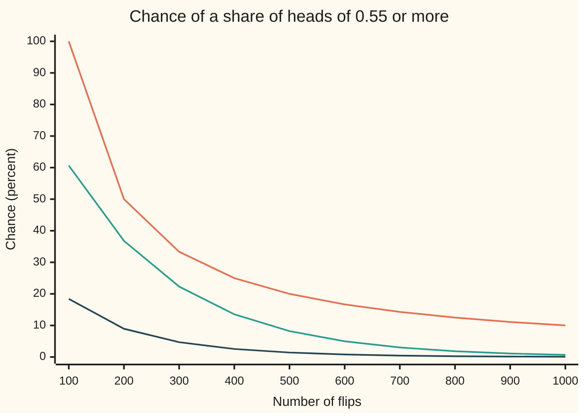
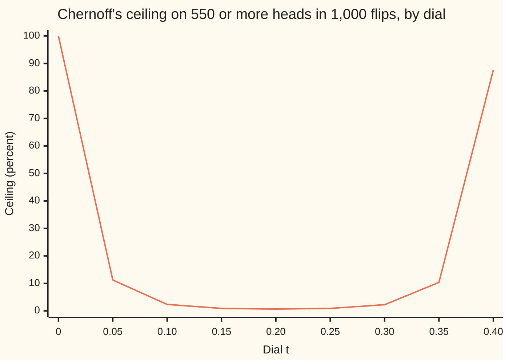

# Concentration: exponential tail bounds for sums of bounded variables

Probability and statistics → Limit Theorems in Practice → Exponential tail bounds → Concentration

---

## General Overview

A fair coin is flipped 1,000 times. On average it shows 500 heads, a share of 0.5. How likely is a share of 0.55 or more: 550 heads or more?

Chebyshev's inequality, from the mean and the variance alone, caps the chance at 0.1: 1 run in 10. Two further facts give a far smaller guaranteed ceiling, 0.0067, under 1 percent. Each flip is **bounded**: its score is 0 or 1, never anything else. And the flips are **independent**: none affects another. The exact chance, counted over every sequence of 1,000 flips, is 0.00087; the ceiling is about eight times the truth.

The better ceiling falls exponentially in the number of flips: 61 percent at 100 flips, 0.67 percent at 1,000, the square of that at 2,000. Chebyshev's only halves each time the flips double. A sum of many independent bounded pieces is **concentrated**: it stays near its mean with a chance that approaches 1 exponentially fast. Such a guarantee is a **concentration inequality**, the term used from here on.

Two are proved on this card. **Hoeffding's inequality** needs only independence and a known range for each piece. The **Chernoff bound** uses the full law of each piece: slightly sharper for a fair coin, over a thousand times sharper for a coin that rarely lands heads.

**An average of many independent bounded readings misses its mean by a set amount with a chance that shrinks exponentially in the number of readings; Hoeffding's inequality gives the rate from the ranges alone, the Chernoff bound gives a sharper rate from the full law, and both beat Chebyshev's one-over-n.**

**What kind of fact this is:** two theorems, Hoeffding's inequality and the Chernoff bound for binomial counts, both proved on this card in Why it works; the one lemma the proof leans on is proved in full in a folded Detailed proof.

### The picture: three answers to one question, as the flips pile up



Orange, top: Chebyshev's ceiling, 100 divided by the number of flips, in percent. Green, middle: Hoeffding's ceiling. Dark, bottom: the exact chance, summed over every possible heads count. Chebyshev creeps down; Hoeffding dives after the exact curve. At 1,000 flips the three read 10, 0.67 and 0.09 percent.

---

## The formula

Notation from earlier cards: $P(\cdot)$ is the chance of the event in the brackets, $E[X]$ the long-run average of a random quantity, $\operatorname{Var}(X)$ its variance. Its moment generating function is $M(t) = E[e^{tX}]$, for a free number $t$ called here the **dial**. A sum written $\sum_{i=1}^n$ adds one term for each of $i = 1, 2, \dots, n$.

Score flip number i as $X_i$: 1 for heads, 0 for tails. Add the scores to get the heads count $S = X_1 + \dots + X_n$, and divide by the number of flips $n$ to get the share of heads $\bar X = S/n$, read "X bar". Its mean is $\mu$; the question asks about a gap $\varepsilon$ above it.

**Hoeffding's inequality.** Let $X_1, \dots, X_n$ be independent, each trapped in its own known range: $a_i \le X_i \le b_i$. Let $\mu$ be the average of their means. For every gap $\varepsilon > 0$,

$$P(\bar X - \mu \ge \varepsilon) \le \exp\!\left(-\frac{2n^2\varepsilon^2}{\sum_{i=1}^n (b_i - a_i)^2}\right)$$

**Read it aloud:** the chance the average overshoots its mean by at least the gap is at most e to the minus a ratio: two times n squared times the gap squared, over the sum of the squared range widths.

When every range is 0 to 1, as for a coin, the sum of squared widths is $n$ and the bound becomes

$$P(\bar X - \mu \ge \varepsilon) \le e^{-2n\varepsilon^2}, \qquad P(\lvert \bar X - \mu \rvert \ge \varepsilon) \le 2e^{-2n\varepsilon^2}.$$

**Read it aloud:** one side costs e to the minus two n epsilon squared; both sides cost twice that. For the coin, $2n\varepsilon^2 = 2 \times 1000 \times 0.05^2 = 5$, and $e^{-5} = 0.0067$.

**The Chernoff bound for a binomial count.** Let $S$ count heads in $n$ independent flips, each heads with chance $p$, so $S \sim \text{Binomial}(n, p)$. For a cut $c$ above $p$,

$$P(\bar X \ge c) \le e^{-n\,D(c\,\|\,p)}, \qquad D(c\,\|\,p) = c\ln\frac{c}{p} + (1 - c)\ln\frac{1 - c}{1 - p}.$$

**Read it aloud:** the chance the share of heads reaches the cut is at most e to the minus n times a fixed per-flip rate, and the rate measures how far a coin with chance $c$ is from the real coin with chance $p$. That rate is the **Kullback–Leibler divergence**, or relative entropy, between the two coins. For the fair coin at 0.55 it is 0.005008, and the bound is 0.00668.

Both come from one line, the **Chernoff method**: for every positive dial $t$,

$$P(S \ge nc) \le e^{-tnc}\,M(t)^n.$$

**Read it aloud:** the chance the count reaches $n c$ is at most the moment generating function of one flip, raised to the power $n$, discounted by e to the minus $t$ times $n c$; then turn the dial to make that smallest.

Chebyshev, for comparison, gives $P(\lvert \bar X - \mu \rvert \ge \varepsilon) \le \operatorname{Var}(X_i)/(n\varepsilon^2)$, which for the coin is $0.25/(1000 \times 0.05^2) = 0.1$.

| Symbol | Plain meaning | In our example | Push it up and the answer… |
| --- | --- | --- | --- |
| $n$ | number of flips, or readings | 1,000 | every bound falls; the exponential ones fast |
| $X_i$ | score of flip i: 1 for heads, 0 for tails | 0 or 1 | — |
| $S$ | total score, the heads count | 550 or more is the event | — |
| $\bar X$ | the average score $S/n$: the share of heads | 0.55 or more is the event | — |
| $\mu$ | mean of the share, the average of the flips' means | 0.5 | — |
| $c$ | the cut on the share | 0.55 | the event gets rarer; every bound falls |
| $\varepsilon$ | the gap above the mean, $c - \mu$ | 0.05 | Hoeffding falls like $e^{-2n\varepsilon^2}$ |
| $a_i$, $b_i$ | lowest and highest score flip i can take | 0 and 1 | a wider range weakens Hoeffding |
| $t$ | the dial: a free positive number in the exponential | best at 0.2007 | too high or too low loosens the bound |
| $M(t)$ | moment generating function of one flip, $E[e^{tX_i}]$ | $0.5 + 0.5e^t$ | — |
| $p$ | chance of heads on one flip | 0.5 | with $c$ fixed, the event gets likelier |
| $D(c\,\|\,p)$ | Chernoff's rate per flip, the relative entropy | 0.005008 | the bound falls like $e^{-nD}$ |

### When it holds

- **Independent pieces.** The proof turns the average of a product into a product of averages, and only independence allows that. Copy one flip 1,000 times and the share is 1 or 0: a share of 0.55 or more has chance 0.5, against a "ceiling" of 0.0067.
- **Ranges known before the data, and true.** Hoeffding charges each piece its squared range width. Score heads as +1 and tails as −1, keep the width at 1 by mistake, and the "ceiling" on the same event reads 2.1 in a billion; the truth is 0.00087. A range seen in past data is not a range the next reading must respect.
- **One number of flips, fixed in advance.** Checking the share after every flip from 100 to 1,000 and stopping the first time it reaches 0.55 succeeds with chance 0.308: about 3 runs in 10.
- **For the binomial Chernoff form, one chance of heads for every flip, and a cut above it.** For a cut at or below $p$ the best dial is 0 and the bound is 1: true and empty.
- **Useful once $2n\varepsilon^2$ is a few units.** At 100 flips Hoeffding allows 61 percent; the exponential needs room to act.

---

## Why it works

### Step 0: raise the sum to a power before applying Markov

Markov's inequality caps the chance that something never negative reaches a level by its mean divided by that level ([markov-and-chebyshev-inequalities](../02-Random%20Variables/08-markov-and-chebyshev-inequalities.md)). Chebyshev applies it to the squared distance from the mean. The exponential is every power at once, and applied to $e^{tS}$ Markov gains two allies. The exponential magnifies a large count enormously against a typical one. And for independent pieces, the average of the exponential of a sum splits into one simple average per flip. The card is those two facts plus a choice of dial.

### Step 1: Markov on the exponential

Fix a dial $t > 0$. The count reaches $n c$ exactly when $e^{tS}$ reaches $e^{tnc}$, since the exponential only climbs. $e^{tS}$ is never negative, so Markov gives

$$P(S \ge nc) = P(e^{tS} \ge e^{tnc}) \le e^{-tnc}\,E[e^{tS}].$$

This holds for every positive dial. It is a family of ceilings, one per setting.

### Step 2: independence turns the sum into a product

$e^{tS} = e^{tX_1} \times e^{tX_2} \times \dots \times e^{tX_n}$. For independent pieces the average of a product is the product of the averages ([moment-generating-functions](../02-Random%20Variables/07-moment-generating-functions.md)), so $E[e^{tS}] = M(t)^n$. One flip has $M(t) = (1 - p) + pe^t$: tails contributes $e^0 = 1$, heads contributes $e^t$. That gives the Chernoff method,

$$P(S \ge nc) \le e^{-tnc}\,\big(1 - p + pe^t\big)^n.$$

For the fair coin at dial 0.2 this reads $e^{-110}(0.5 + 0.5e^{0.2})^{1000} = 0.0067$, the lowest point of the chart below.

### Step 3: turn the dial

Every positive dial gives a true ceiling; the best is the smallest. Take logarithms and set the slope to zero. The best dial solves $e^t = c(1 - p)/(p(1 - c))$; for the coin, $e^t = 0.55 \times 0.5/(0.5 \times 0.45) = 11/9$, so $t = \ln(11/9) = 0.2007$. At that dial the exponent collapses to $-n\,D(c\,\|\,p)$, which is the Chernoff bound. For the coin, $D = 0.005008$ and the ceiling is $e^{-5.008} = 0.00668$.

<details>
<summary>The algebra behind the best dial</summary>

The logarithm of the ceiling, per flip, is $g(t) = -tc + \ln(1 - p + pe^t)$. Its slope is $-c + pe^t/(1 - p + pe^t)$. Setting it to zero gives $pe^t(1 - c) = c(1 - p)$, so $e^{t} = \frac{c(1 - p)}{p(1 - c)}$, which is greater than 1, so the dial is positive, exactly when $c > p$.

At that dial, $1 - p + pe^t = 1 - p + \frac{c(1 - p)}{1 - c} = \frac{1 - p}{1 - c}$. So
$$g = -c\ln\frac{c(1 - p)}{p(1 - c)} + \ln\frac{1 - p}{1 - c} = -c\ln\frac{c}{p} - (1 - c)\ln\frac{1 - c}{1 - p} = -D(c\,\|\,p).$$
Multiplying by $n$ and exponentiating gives $e^{-nD(c\,\|\,p)}$. The slope of $g(t)$ rises steadily, since its second derivative is the variance of a coin with chance $pe^t/(1 - p + pe^t)$, never negative. So the zero of the slope is the minimum.

</details>

### The picture: one ceiling for every setting of the dial



The one line is $e^{-550t}(0.5 + 0.5e^t)^{1000}$ in percent. At dial 0 it says 100 percent: true and empty. It bottoms out at 0.67 percent near dial 0.2, and a careless dial of 0.4 gives 87.64 percent. The theorem holds at every dial; only the best one is worth quoting.

### Step 4: Hoeffding's lemma, a price list for any bounded piece

For a coin, $M(t)$ is known exactly. For a reading known only to lie between two limits, it is not. Hoeffding's lemma prices it anyway. The price at dial $t$ is the moment generating function of the reading measured from its mean: if $a \le X \le b$ with mean $\mu$, then for every dial $t$,

$$E\big[e^{t(X - \mu)}\big] \le e^{t^2(b - a)^2/8}.$$

The reason is a chord. The exponential curve bends upward (it is convex), so between the two ends of the range it lies under the straight line joining them. Averaging, a reading anywhere in the range is priced no higher than a two-point reading sitting only at the ends with the same mean. A two-point reading's price, in logarithms, starts flat at dial 0 and curves up no faster than a parabola with coefficient one-eighth. For the fair coin at dial 0.2 the true price is $\cosh(0.1) = 1.0050042$, and the lemma's ceiling is $e^{0.2^2/8} = 1.0050125$: almost equal, because a fair coin sits only at its two ends already.

<details>
<summary>Detailed proof</summary>

**Hoeffding's lemma.** Let $a \le X \le b$ with $a < b$ and mean $\mu$. For a value $x$ in the range, write it as a blend of the ends: $x = \frac{b - x}{b - a}\,a + \frac{x - a}{b - a}\,b$, with weights between 0 and 1 that sum to 1. The exponential is convex (its second derivative $t^2 e^{tx}$ is never negative), so its value at a blend is at most the blend of its values:
$$e^{tx} \le \frac{b - x}{b - a}\,e^{ta} + \frac{x - a}{b - a}\,e^{tb}.$$
Average both sides over the law of the reading; the right side is linear in $x$, so its average puts $\mu$ in place of $x$. Write $\theta = (\mu - a)/(b - a)$ for the weight on the top end and $u = t(b - a)$ for the dial measured in range widths. Multiplying by $e^{-t\mu}$:
$$E\big[e^{t(X - \mu)}\big] \le (1 - \theta)e^{-\theta u} + \theta e^{(1 - \theta)u} = e^{L(u)}, \qquad L(u) = -\theta u + \ln\big(1 - \theta + \theta e^{u}\big).$$
Here $L(u)$ is the logarithm of the two-point reading's price, and $L(0) = 0$. Its slope is $L'(u) = -\theta + w(u)$ with $w(u) = \theta e^u/(1 - \theta + \theta e^u)$, a number between 0 and 1, and $w(0) = \theta$, so $L'(0) = 0$. Its second derivative is $L''(u) = w(u)\big(1 - w(u)\big)$, the variance of a coin with chance $w(u)$, at most $1/4$. Taylor's theorem with Lagrange's remainder writes $L(u)$ as $L(0) + L'(0)u$, both zero, plus half of $u^2$ times the second derivative at some point between 0 and $u$; that is at most $u^2/8$. So $E[e^{t(X - \mu)}] \le e^{t^2(b - a)^2/8}$. If $a = b$ the reading is constant and both sides equal 1.

**Hoeffding's inequality.** Let the $X_i$ be independent with $a_i \le X_i \le b_i$ and means $\mu_1, \dots, \mu_n$; put $\mu = (\mu_1 + \dots + \mu_n)/n$ and $W = \sum_{i=1}^n (b_i - a_i)^2$, the sum of the squared range widths, and assume $W > 0$. For a dial $t > 0$, Step 1 applied to the centred sum, then independence, then the lemma on each factor:
$$P(\bar X - \mu \ge \varepsilon) = P\Big(e^{t\sum (X_i - \mu_i)} \ge e^{tn\varepsilon}\Big) \le e^{-tn\varepsilon}\prod_{i=1}^n E\big[e^{t(X_i - \mu_i)}\big] \le \exp\Big(-tn\varepsilon + \frac{t^2 W}{8}\Big).$$
The exponent is a parabola in $t$, lowest at $t = 4n\varepsilon/W$, where it equals $-2n^2\varepsilon^2/W$. That is the inequality. The lower tail is the same argument applied to the readings $-X_i$, whose ranges have the same widths, and the two-sided form adds the two tails. For a coin, $W = n$, the best dial is $4\varepsilon = 0.2$, and the bound is $e^{-2n\varepsilon^2}$.

**Chernoff for a binomial count** is Steps 1 to 3 with the exact $M(t)$ in place of the lemma's ceiling; the algebra callout above finds the best dial.

</details>

### Step 5: Hoeffding, and why it nearly matches Chernoff on a fair coin

Put the lemma into Steps 1 and 2 in place of the exact $M(t)$. The per-piece ceilings multiply, and the best dial turns the whole bound into Hoeffding's inequality. For the coin the best dial is 0.2000, against Chernoff's 0.2007, and the two ceilings read 0.00674 and 0.00668. They nearly agree because a fair coin spends all its time at the ends of its range, which is the case the lemma prices exactly.

A coin that shows heads 1 time in 10 is different. It sits at 0 nine times in ten, and the lemma still charges it the price of a range 0 to 1 with no allowance for that. For a share of heads of 0.15 or more in 1,000 such flips, Hoeffding allows 0.0067, Chernoff allows 0.0000049, and the exact chance is 0.00000045. Chernoff is nearly fourteen hundred times sharper here.

<details>
<summary>Why Chernoff is never worse than Hoeffding for a coin</summary>

For flips scored 0 or 1, compare the two exponents: $D(c\,\|\,p)$ against $2(c - p)^2$. As a function of the cut, $D$ is 0 at $c = p$, its slope $\ln\frac{c}{p} - \ln\frac{1 - c}{1 - p}$ is 0 there too, and its second derivative is $\frac{1}{c} + \frac{1}{1 - c} = \frac{1}{c(1 - c)}$, at least 4 since $c(1 - c)$ is at most $1/4$. Taylor's theorem then gives $D(c\,\|\,p) \ge 2(c - p)^2$, so $e^{-nD} \le e^{-2n(c - p)^2}$. The gap is small at a fair coin, where $c(1 - c)$ is near its peak, and large for a rare one.

</details>

### Step 6: where Chebyshev loses, and where it does not

Chebyshev is Markov on the square, the second power. The square grows slowly, so a large count is not magnified much, and the ceiling falls only like one over $n$. The exponential grows fast, so the ceiling falls like $e^{-2n\varepsilon^2}$. To be 99 percent sure the share stays below 0.55, Chebyshev (whose ceiling covers both sides at once) asks for 10,000 flips and Hoeffding for 922. The exact answer is that every run length from 561 flips on works (checked to 1,200).

Chebyshev keeps one advantage: it uses the true variance, and Hoeffding uses the worst variance a range allows, a quarter of the squared width. The shelf's die, rolled 1,000 times, has a variance of 35/12 per roll, far below the 6.25 its range of 1 to 6 would allow. For an average off by 0.1 or more on either side, Chebyshev allows 0.2917, the figure behind the guarantee in [law-of-large-numbers](01-law-of-large-numbers.md); Hoeffding allows 0.8987. Bounds that use both a range and a variance (Bernstein's inequality) combine the two strengths.

The exact tail has the bell shape of [central-limit-theorem](02-central-limit-theorem.md), read off by [normal-approximation-to-binomial](03-normal-approximation-to-binomial.md): an approximation with an error. These ceilings are guarantees at every $n$.

---

## Worked numbers, by hand

1,000 fair flips; the event is a share of heads of 0.55 or more.

| Step | Arithmetic | Value |
| --- | --- | --- |
| the gap | 0.55 − 0.5 | 0.05 |
| Chebyshev | 0.25 / (1,000 × 0.05^2) = 0.25 / 2.5 | 0.1 |
| Hoeffding's exponent | 2 × 1,000 × 0.05^2 | 5 |
| Hoeffding's ceiling | e^−5 | 0.00674 |
| best dial | ln(0.55 × 0.5 / (0.5 × 0.45)) = ln(11/9) | 0.2007 |
| Chernoff's rate | 0.55 ln 1.1 + 0.45 ln 0.9 | 0.005008 |
| Chernoff's ceiling | e^(−1,000 × 0.005008) | 0.00668 |
| exact, every sequence counted | sum of C(1000, k) / 2^1000 for k from 550 to 1,000 | 0.000865 |
| **the guarantee** | Hoeffding or Chernoff | **under 0.7 percent** |

Without counting a single sequence, 1,000 fair flips reach a share of 0.55 or more in fewer than 7 runs in 1,000; the truth is fewer than 1 in 1,000. Both tails together, 450 heads or fewer or 550 or more, cost twice the ceiling: 0.0135, just over 1 percent, against an exact 0.0017.

### What breaks if you drop a piece

| Mistake | Comes out at | What went wrong |
| --- | --- | --- |
| One flip copied 1,000 times, bound applied anyway | true chance 0.5 (simulated 0.4988, standard error 0.0011), "ceiling" 0.0067 | the flips are not independent; the product in Step 2 fails |
| Score ±1, range width kept at 1 | "ceiling" 2.1 in a billion; truth 0.00087 | the width is 2, and Hoeffding charges its square |
| Share checked after every flip from 100 to 1,000 | chance 0.308 of ever reaching 0.55 | the bound is for one run length chosen in advance |
| One-sided ceiling quoted for both sides | 0.0067, where the proven two-sided ceiling is 0.0135; the exact two-sided chance, 0.0017, happens to sit under both | an unproven claim rather than a wrong one here: each tail needs its own ceiling, and they add |

The code prints all four.

---

## Code, from first principles, and it actually runs

Python imports only `math`; Rust uses only `std`. The chance of 550 or more heads is approached by four roads. The bounds come from their formulas, then Chernoff's and Hoeffding's are rebuilt by minimising over the dial with golden-section search (narrowing an interval by a fixed ratio each step), never using the closed-form best dial. The exact tail is summed twice: term by term along the binomial law, and by building the law of the heads count one flip at a time. And 200,000 runs of 1,000 flips are simulated with SplitMix64 (a short, well-tested recipe for pseudo-random whole numbers, written out in both languages so both draw the same flips), 64 flips per output, with the estimate's standard error. The lemma is checked on a grid of dials; the chart points, sample sizes, rare coin, die and four mistakes are printed alongside.

### Python

```python
# Concentration: Hoeffding and Chernoff -- the check behind the card; only math is imported.
# 1,000 fair coin flips.  How likely is a share of heads of 0.55 or more?
# Roads: the three bounds by formula; Chernoff and Hoeffding rebuilt by minimising
# over the dial t numerically; the exact binomial tail, summed term by term; and a
# seeded simulation of 200,000 runs.  Then sample sizes, a 1-in-10 coin, what breaks.
import math

N, P, C, EPS, RUNS, SEED = 1000, 0.5, 0.55, 0.05, 200000, 20260928
M64 = 0xFFFFFFFFFFFFFFFF

def splitmix64(s):                          # the generator both languages share
    s = (s + 0x9E3779B97F4A7C15) & M64
    z = ((s ^ (s >> 30)) * 0xBF58476D1CE4E5B9) & M64
    z = ((z ^ (z >> 27)) * 0x94D049BB133111EB) & M64
    return s, z ^ (z >> 31)

def tail(n, p, k0):                         # exact P(S >= k0) for S ~ Binomial(n, p)
    lp, r, total = n * math.log(1 - p), math.log(p / (1 - p)), 0.0
    for k in range(n + 1):                  # lp = ln P(S = k), stepped up one k at a time
        if k >= k0:
            total += math.exp(lp)
        if k < n:
            lp += math.log((n - k) / (k + 1)) + r
    return total

def first_k(n):                             # smallest whole k with k / n >= 0.55
    return (11 * n + 19) // 20

def kl(c, p):                               # the Chernoff exponent D(c || p)
    return c * math.log(c / p) + (1 - c) * math.log((1 - c) / (1 - p))

def golden(f, lo, hi):                      # minimise a one-hump-down function on [lo, hi]
    g = (math.sqrt(5) - 1) / 2
    for _ in range(200):
        a, b = hi - g * (hi - lo), lo + g * (hi - lo)
        if f(a) < f(b):
            hi = b
        else:
            lo = a
    return (lo + hi) / 2

def log_chernoff(n, p, c, t):               # ln of e^(-t c n) M(t)^n, M(t) = 1 - p + p e^t
    return -t * c * n + n * math.log(1 - p + p * math.exp(t))

def row(label, v):
    print(f"{label:<52} {v:>14.10f}")

cheb = min(1.0, P * (1 - P) / (N * EPS * EPS))                  # road 1: the three formulas
hoef = math.exp(-2 * N * EPS * EPS)
cher = math.exp(-N * kl(C, P))
t_c = golden(lambda t: log_chernoff(N, P, C, t), 0.0, 5.0)     # road 2: minimise over the dial
cher_num = math.exp(log_chernoff(N, P, C, t_c))
t_h = golden(lambda t: -t * N * EPS + N * t * t / 8, 0.0, 5.0)
hoef_num = math.exp(-t_h * N * EPS + N * t_h * t_h / 8)
exact = tail(N, P, first_k(N))                               # road 3: sum the binomial law

state, hits, copied = SEED, 0, 0                                # road 4: 200,000 seeded runs
for _ in range(RUNS):
    heads = 0
    for j in range(16):                                         # 15 x 64 bits + 40 bits = 1,000 flips
        state, z = splitmix64(state)
        heads += (z if j < 15 else z & ((1 << 40) - 1)).bit_count()
        copied += (z & 1) >= C if j == 0 else 0                # broken 1: the run's first flip, copied
    hits += heads >= 550
sim, copy_sim = hits / RUNS, copied / RUNS
sim_se, copy_se = math.sqrt(sim * (1 - sim) / RUNS), math.sqrt(copy_sim * (1 - copy_sim) / RUNS)

grid = [i / 100 for i in range(-1000, 1001)]                    # Hoeffding's lemma, on a grid
ex_fair = max(math.log(math.cosh(t / 2)) - t * t / 8 for t in grid)
ex_tenth = max(math.log(0.9 * math.exp(-0.1 * t) + 0.1 * math.exp(0.9 * t)) - t * t / 8 for t in grid)

row("1 Chebyshev: 0.25 / (n eps^2)", cheb)
row("1 Hoeffding exponent: 2 n eps^2", 2 * N * EPS * EPS)
row("1 Hoeffding: exp(-2 n eps^2)", hoef)
row("1 Chernoff: D(0.55 || 0.5)", kl(C, P))
row("1 Chernoff: exp(-n D)", cher)
row("2 Chernoff by minimising over t: best t", t_c)
row("2   bound at that t", cher_num)
row("2 Hoeffding by minimising over t: best t", t_h)
row("2   bound at that t", hoef_num)
row("3 exact binomial tail P(S >= 550)", exact)
row("4 simulated, 200,000 runs: share with S >= 550", sim)
row("4   its standard error", sim_se)
row("worked: cosh(0.1), centred coin's M at t = 0.2", math.cosh(0.1))
row("worked: exp(0.2^2 / 8), Hoeffding's ceiling for it", math.exp(0.005))
row("lemma: largest excess on the grid, fair coin", ex_fair)
row("lemma: largest excess on the grid, 1-in-10 coin", ex_tenth)
row("two-sided: Hoeffding 2 exp(-2 n eps^2)", 2 * hoef)
row("two-sided: exact P(|S - 500| >= 50)", 2 * exact)
print("chart, percent:  n   Chebyshev   Hoeffding   exact")
for n in range(100, 1001, 100):
    print(f"chart, {n:>11}   {100 * min(1.0, 100 / n):>9.2f}   {100 * math.exp(-n / 200):>9.2f}   {100 * tail(n, P, first_k(n)):>5.2f}")
print("chart, t:       " + " ".join(f"{i / 20:>6.2f}" for i in range(9)))
print("chart, bound %: " + " ".join(f"{100 * math.exp(log_chernoff(N, P, C, i / 20)):>6.2f}" for i in range(9)))
n_h = math.ceil(math.log(100) / (2 * EPS * EPS))
ex_n = [tail(n, P, first_k(n)) for n in range(1, 1201)]
ok = [n for n in range(1, 1201) if ex_n[n - 1] <= 0.01]
bad = [n for n in range(1, 1201) if ex_n[n - 1] > 0.01]
print(f"99% sure: Chebyshev n = {round(0.25 / (0.01 * EPS * EPS))}, Hoeffding n = {n_h},"
      f" exact first n = {ok[0]}, last n above 0.01 = {bad[-1]}")
row(f"Hoeffding bound at n = {n_h}", math.exp(-2 * n_h * EPS * EPS))
row(f"Hoeffding bound at n = {n_h - 1}", math.exp(-2 * (n_h - 1) * EPS * EPS))
row(f"exact tail at n = {bad[-1] + 1}", ex_n[bad[-1]])
ten_ex, ten_ch = tail(N, 0.1, 150), math.exp(-N * kl(0.15, 0.1))
row("1-in-10 coin, S >= 150: Hoeffding", hoef)
row("1-in-10 coin: Chernoff exp(-n D(0.15 || 0.1))", ten_ch)
row("1-in-10 coin: exact tail", ten_ex)
row("die, 1,000 rolls, eps 0.1: Chebyshev, both sides", 35 / 12 / (N * 0.1 * 0.1))
row("die: Hoeffding, range 1 to 6, both sides", 2 * math.exp(-2 * N * 0.1 * 0.1 / 25))
alive, stopped, law = [1.0], 0.0, [1.0]                        # broken 3: look after every flip
for k in range(1, N + 1):                                       # law: the heads count, flip by flip
    alive = [0.5 * ((alive[s] if s < k else 0.0) + (alive[s - 1] if s > 0 else 0.0)) for s in range(k + 1)]
    law = [0.5 * ((law[s] if s < k else 0.0) + (law[s - 1] if s > 0 else 0.0)) for s in range(k + 1)]
    if k >= 100:
        for s in range(first_k(k), k + 1):
            stopped, alive[s] = stopped + alive[s], 0.0
row("3 the same tail, adding one flip at a time", sum(law[550:]))
copies = sum(1 for face in (0, 1) if face >= C) / 2             # broken 1: one flip copied
row("broken 1, one flip copied 1,000 times", copies)
print(f"broken 1, simulated, each run's first flip copied: {copy_sim:.4f} (standard error {copy_se:.4f})")
row("broken 2, +1/-1 score, width taken as 1: 'bound'", math.exp(-2 * N * 0.1 * 0.1))
row("broken 3, looked at after every flip, 100 to 1,000", stopped)

assert abs(cher_num - cher) < 1e-9 * cher, "Chernoff: closed form vs numerical minimum"
assert abs(hoef_num - hoef) < 1e-9 * hoef, "Hoeffding: closed form vs numerical minimum"
assert ex_fair <= 1e-15, "Hoeffding's lemma holds on the whole grid, fair coin"
assert ex_tenth <= 1e-15, "Hoeffding's lemma holds on the whole grid, 1-in-10 coin"
assert abs(sum(law[550:]) - exact) < 1e-12, "two exact roads: term by term, flip by flip"
assert exact <= cher, "exact under Chernoff"
assert cher <= hoef, "Chernoff under Hoeffding for a fair coin"
assert all(ex_n[n - 1] <= min(1.0, 100 / n) for n in range(1, 1201)), "exact under Chebyshev"
assert all(ex_n[n - 1] <= math.exp(-n / 200) for n in range(1, 1201)), "exact under Hoeffding"
assert abs(sim - exact) < 4 * sim_se, "simulation vs the exact tail"
assert math.exp(-2 * n_h * EPS * EPS) <= 0.01 < math.exp(-2 * (n_h - 1) * EPS * EPS), "whole-number n"
assert ten_ex <= ten_ch, "Chernoff holds for the 1-in-10 coin"
assert 1000 * ten_ch < hoef, "Chernoff sees the 1-in-10 coin, Hoeffding does not"
assert copy_sim - 4 * copy_se > hoef, "copied flips break the bound, simulated"
assert stopped > hoef, "looking after every flip breaks the bound"
assert math.exp(-2 * N * 0.1 * 0.1) < exact, "a misdeclared range promises less than the truth"
print("ALL CHECKS PASS")
```

**Ran 2026-10-06 on macOS, Python 3.14.6, standard library only. All checks passed. Output, pasted from the run:**

```
1 Chebyshev: 0.25 / (n eps^2)                          0.1000000000
1 Hoeffding exponent: 2 n eps^2                        5.0000000000
1 Hoeffding: exp(-2 n eps^2)                           0.0067379470
1 Chernoff: D(0.55 || 0.5)                             0.0050083668
1 Chernoff: exp(-n D)                                  0.0066818068
2 Chernoff by minimising over t: best t                0.2006706827
2   bound at that t                                    0.0066818068
2 Hoeffding by minimising over t: best t               0.2000000002
2   bound at that t                                    0.0067379470
3 exact binomial tail P(S >= 550)                      0.0008652680
4 simulated, 200,000 runs: share with S >= 550         0.0008050000
4   its standard error                                 0.0000634173
worked: cosh(0.1), centred coin's M at t = 0.2         1.0050041681
worked: exp(0.2^2 / 8), Hoeffding's ceiling for it     1.0050125209
lemma: largest excess on the grid, fair coin           0.0000000000
lemma: largest excess on the grid, 1-in-10 coin        0.0000000000
two-sided: Hoeffding 2 exp(-2 n eps^2)                 0.0134758940
two-sided: exact P(|S - 500| >= 50)                    0.0017305361
chart, percent:  n   Chebyshev   Hoeffding   exact
chart,         100      100.00       60.65   18.41
chart,         200       50.00       36.79    8.95
chart,         300       33.33       22.31    4.70
chart,         400       25.00       13.53    2.55
chart,         500       20.00        8.21    1.42
chart,         600       16.67        4.98    0.80
chart,         700       14.29        3.02    0.45
chart,         800       12.50        1.83    0.26
chart,         900       11.11        1.11    0.15
chart,        1000       10.00        0.67    0.09
chart, t:         0.00   0.05   0.10   0.15   0.20   0.25   0.30   0.35   0.40
chart, bound %: 100.00  11.22   2.35   0.92   0.67   0.90   2.26  10.38  87.64
99% sure: Chebyshev n = 10000, Hoeffding n = 922, exact first n = 531, last n above 0.01 = 560
Hoeffding bound at n = 922                             0.0099518183
Hoeffding bound at n = 921                             0.0100017020
exact tail at n = 561                                  0.0089921983
1-in-10 coin, S >= 150: Hoeffding                      0.0067379470
1-in-10 coin: Chernoff exp(-n D(0.15 || 0.1))          0.0000048569
1-in-10 coin: exact tail                               0.0000004489
die, 1,000 rolls, eps 0.1: Chebyshev, both sides       0.2916666667
die: Hoeffding, range 1 to 6, both sides               0.8986579282
3 the same tail, adding one flip at a time             0.0008652680
broken 1, one flip copied 1,000 times                  0.5000000000
broken 1, simulated, each run's first flip copied: 0.4988 (standard error 0.0011)
broken 2, +1/-1 score, width taken as 1: 'bound'       0.0000000021
broken 3, looked at after every flip, 100 to 1,000     0.3082177185
ALL CHECKS PASS
```

### Rust

Same numbers, same labels, built with `rustc --edition 2021 -O`.

```rust
// Concentration: Hoeffding and Chernoff -- the check behind the card, in Rust, std only.
// 1,000 fair coin flips.  How likely is a share of heads of 0.55 or more?
// Roads: the three bounds by formula; Chernoff and Hoeffding rebuilt by minimising
// over the dial t numerically; the exact binomial tail, summed term by term; and a
// seeded simulation of 200,000 runs.  Then sample sizes, a 1-in-10 coin, what breaks.
const N: i64 = 1000;
const P: f64 = 0.5;
const C: f64 = 0.55;
const EPS: f64 = 0.05;
const RUNS: usize = 200000;
const SEED: u64 = 20260928;

fn splitmix64(s: u64) -> (u64, u64) {
    // the generator both languages share
    let s = s.wrapping_add(0x9E3779B97F4A7C15);
    let mut z = (s ^ (s >> 30)).wrapping_mul(0xBF58476D1CE4E5B9);
    z = (z ^ (z >> 27)).wrapping_mul(0x94D049BB133111EB);
    (s, z ^ (z >> 31))
}

fn tail(n: i64, p: f64, k0: i64) -> f64 {
    // exact P(S >= k0) for S ~ Binomial(n, p); lp = ln P(S = k), stepped up one k at a time
    let (mut lp, r, mut total) = (n as f64 * (1.0 - p).ln(), (p / (1.0 - p)).ln(), 0.0);
    for k in 0..=n {
        if k >= k0 { total += lp.exp(); }
        if k < n { lp += ((n - k) as f64 / (k + 1) as f64).ln() + r; }
    }
    total
}

fn first_k(n: i64) -> i64 { (11 * n + 19) / 20 } // smallest whole k with k / n >= 0.55

fn kl(c: f64, p: f64) -> f64 {
    // the Chernoff exponent D(c || p)
    c * (c / p).ln() + (1.0 - c) * ((1.0 - c) / (1.0 - p)).ln()
}

fn golden<F: Fn(f64) -> f64>(f: F, mut lo: f64, mut hi: f64) -> f64 {
    // minimise a one-hump-down function on [lo, hi]
    let g = (5f64.sqrt() - 1.0) / 2.0;
    for _ in 0..200 {
        let (a, b) = (hi - g * (hi - lo), lo + g * (hi - lo));
        if f(a) < f(b) { hi = b; } else { lo = a; }
    }
    (lo + hi) / 2.0
}

fn log_chernoff(n: i64, p: f64, c: f64, t: f64) -> f64 {
    // ln of e^(-t c n) M(t)^n, M(t) = 1 - p + p e^t
    -t * c * n as f64 + n as f64 * (1.0 - p + p * t.exp()).ln()
}

fn row(label: &str, v: f64) { println!("{:<52} {:>14.10}", label, v); }

fn main() {
    let nf = N as f64;
    let cheb = (P * (1.0 - P) / (nf * EPS * EPS)).min(1.0); // road 1: the three formulas
    let hoef = (-2.0 * nf * EPS * EPS).exp();
    let cher = (-nf * kl(C, P)).exp();
    let t_c = golden(|t| log_chernoff(N, P, C, t), 0.0, 5.0); // road 2: minimise over the dial
    let cher_num = log_chernoff(N, P, C, t_c).exp();
    let t_h = golden(|t| -t * nf * EPS + nf * t * t / 8.0, 0.0, 5.0);
    let hoef_num = (-t_h * nf * EPS + nf * t_h * t_h / 8.0).exp();
    let exact = tail(N, P, first_k(N)); // road 3: sum the binomial law

    let (mut state, mut hits, mut copied) = (SEED, 0usize, 0usize); // road 4: 200,000 seeded runs
    for _ in 0..RUNS {
        let mut heads = 0u32;
        for j in 0..16 {
            // 15 x 64 bits + 40 bits = 1,000 flips
            let (s, z) = splitmix64(state);
            state = s;
            heads += if j < 15 { z } else { z & ((1u64 << 40) - 1) }.count_ones();
            if j == 0 && (z & 1) as f64 >= C { copied += 1; } // broken 1: the run's first flip, copied
        }
        hits += (heads >= 550) as usize;
    }
    let (sim, copy_sim) = (hits as f64 / RUNS as f64, copied as f64 / RUNS as f64);
    let (sim_se, copy_se) = ((sim * (1.0 - sim) / RUNS as f64).sqrt(), (copy_sim * (1.0 - copy_sim) / RUNS as f64).sqrt());

    let grid: Vec<f64> = (-1000..=1000).map(|i| i as f64 / 100.0).collect(); // Hoeffding's lemma
    let ex_fair = grid.iter().map(|t| (t / 2.0).cosh().ln() - t * t / 8.0).fold(f64::MIN, f64::max);
    let ex_tenth = grid.iter()
        .map(|t| (0.9 * (-0.1 * t).exp() + 0.1 * (0.9 * t).exp()).ln() - t * t / 8.0)
        .fold(f64::MIN, f64::max);

    row("1 Chebyshev: 0.25 / (n eps^2)", cheb);
    row("1 Hoeffding exponent: 2 n eps^2", 2.0 * nf * EPS * EPS);
    row("1 Hoeffding: exp(-2 n eps^2)", hoef);
    row("1 Chernoff: D(0.55 || 0.5)", kl(C, P));
    row("1 Chernoff: exp(-n D)", cher);
    row("2 Chernoff by minimising over t: best t", t_c);
    row("2   bound at that t", cher_num);
    row("2 Hoeffding by minimising over t: best t", t_h);
    row("2   bound at that t", hoef_num);
    row("3 exact binomial tail P(S >= 550)", exact);
    row("4 simulated, 200,000 runs: share with S >= 550", sim);
    row("4   its standard error", sim_se);
    row("worked: cosh(0.1), centred coin's M at t = 0.2", 0.1f64.cosh());
    row("worked: exp(0.2^2 / 8), Hoeffding's ceiling for it", 0.005f64.exp());
    row("lemma: largest excess on the grid, fair coin", ex_fair);
    row("lemma: largest excess on the grid, 1-in-10 coin", ex_tenth);
    row("two-sided: Hoeffding 2 exp(-2 n eps^2)", 2.0 * hoef);
    row("two-sided: exact P(|S - 500| >= 50)", 2.0 * exact);
    println!("chart, percent:  n   Chebyshev   Hoeffding   exact");
    for n in (100..=1000).step_by(100) {
        let x = n as f64;
        println!("chart, {:>11}   {:>9.2}   {:>9.2}   {:>5.2}", n, 100.0 * (100.0 / x).min(1.0), 100.0 * (-x / 200.0).exp(), 100.0 * tail(n, P, first_k(n)));
    }
    let ts: Vec<String> = (0..9).map(|i| format!("{:>6.2}", i as f64 / 20.0)).collect();
    println!("chart, t:       {}", ts.join(" "));
    let bs: Vec<String> = (0..9).map(|i| format!("{:>6.2}", 100.0 * log_chernoff(N, P, C, i as f64 / 20.0).exp())).collect();
    println!("chart, bound %: {}", bs.join(" "));
    let n_h = ((100f64).ln() / (2.0 * EPS * EPS)).ceil() as i64;
    let ex_n: Vec<f64> = (1..=1200).map(|n| tail(n, P, first_k(n))).collect();
    let ok: Vec<i64> = (1..=1200).filter(|&n| ex_n[n as usize - 1] <= 0.01).collect();
    let bad: Vec<i64> = (1..=1200).filter(|&n| ex_n[n as usize - 1] > 0.01).collect();
    let last_bad = *bad.last().unwrap();
    println!("99% sure: Chebyshev n = {}, Hoeffding n = {}, exact first n = {}, last n above 0.01 = {}",
        (0.25 / (0.01 * EPS * EPS)).round() as i64, n_h, ok[0], last_bad);
    row(&format!("Hoeffding bound at n = {}", n_h), (-2.0 * n_h as f64 * EPS * EPS).exp());
    row(&format!("Hoeffding bound at n = {}", n_h - 1), (-2.0 * (n_h - 1) as f64 * EPS * EPS).exp());
    row(&format!("exact tail at n = {}", last_bad + 1), ex_n[last_bad as usize]);
    let (ten_ex, ten_ch) = (tail(N, 0.1, 150), (-nf * kl(0.15, 0.1)).exp());
    row("1-in-10 coin, S >= 150: Hoeffding", hoef);
    row("1-in-10 coin: Chernoff exp(-n D(0.15 || 0.1))", ten_ch);
    row("1-in-10 coin: exact tail", ten_ex);
    row("die, 1,000 rolls, eps 0.1: Chebyshev, both sides", 35.0 / 12.0 / (nf * 0.1 * 0.1));
    row("die: Hoeffding, range 1 to 6, both sides", 2.0 * (-2.0 * nf * 0.1 * 0.1 / 25.0).exp());
    let (mut alive, mut stopped, mut law) = (vec![1.0f64], 0.0f64, vec![1.0f64]); // broken 3: look after every flip
    for k in 1..=N as usize {
        // law: the heads count, flip by flip
        alive = (0..=k).map(|s| 0.5 * ((if s < k { alive[s] } else { 0.0 }) + (if s > 0 { alive[s - 1] } else { 0.0 }))).collect();
        law = (0..=k).map(|s| 0.5 * ((if s < k { law[s] } else { 0.0 }) + (if s > 0 { law[s - 1] } else { 0.0 }))).collect();
        if k >= 100 {
            for s in first_k(k as i64) as usize..=k { stopped += alive[s]; alive[s] = 0.0; }
        }
    }
    let law_tail: f64 = law[550..].iter().sum();
    row("3 the same tail, adding one flip at a time", law_tail);
    let copies = [0.0f64, 1.0].iter().filter(|&&face| face >= C).count() as f64 / 2.0; // broken 1
    row("broken 1, one flip copied 1,000 times", copies);
    println!("broken 1, simulated, each run's first flip copied: {:.4} (standard error {:.4})", copy_sim, copy_se);
    row("broken 2, +1/-1 score, width taken as 1: 'bound'", (-2.0 * nf * 0.1 * 0.1).exp());
    row("broken 3, looked at after every flip, 100 to 1,000", stopped);

    assert!((cher_num - cher).abs() < 1e-9 * cher, "Chernoff: closed form vs numerical minimum");
    assert!((hoef_num - hoef).abs() < 1e-9 * hoef, "Hoeffding: closed form vs numerical minimum");
    assert!(ex_fair <= 1e-15, "Hoeffding's lemma holds on the whole grid, fair coin");
    assert!(ex_tenth <= 1e-15, "Hoeffding's lemma holds on the whole grid, 1-in-10 coin");
    assert!((law_tail - exact).abs() < 1e-12, "two exact roads: term by term, flip by flip");
    assert!(exact <= cher, "exact under Chernoff");
    assert!(cher <= hoef, "Chernoff under Hoeffding for a fair coin");
    assert!((1..=1200).all(|n| ex_n[n as usize - 1] <= (100.0 / n as f64).min(1.0)), "exact under Chebyshev");
    assert!((1..=1200).all(|n| ex_n[n as usize - 1] <= (-(n as f64) / 200.0).exp()), "exact under Hoeffding");
    assert!((sim - exact).abs() < 4.0 * sim_se, "simulation vs the exact tail");
    assert!((-2.0 * n_h as f64 * EPS * EPS).exp() <= 0.01, "whole-number n: enough");
    assert!((-2.0 * (n_h - 1) as f64 * EPS * EPS).exp() > 0.01, "whole-number n: one fewer is not");
    assert!(ten_ex <= ten_ch, "Chernoff holds for the 1-in-10 coin");
    assert!(1000.0 * ten_ch < hoef, "Chernoff sees the 1-in-10 coin, Hoeffding does not");
    assert!(copy_sim - 4.0 * copy_se > hoef, "copied flips break the bound, simulated");
    assert!(stopped > hoef, "looking after every flip breaks the bound");
    assert!((-2.0 * nf * 0.1 * 0.1).exp() < exact, "a misdeclared range promises less than the truth");
    println!("ALL CHECKS PASS");
}
```

**Ran 2026-10-06 on macOS, rustc 1.98.1, no crates. All checks passed. Output, pasted from the run:**

```
1 Chebyshev: 0.25 / (n eps^2)                          0.1000000000
1 Hoeffding exponent: 2 n eps^2                        5.0000000000
1 Hoeffding: exp(-2 n eps^2)                           0.0067379470
1 Chernoff: D(0.55 || 0.5)                             0.0050083668
1 Chernoff: exp(-n D)                                  0.0066818068
2 Chernoff by minimising over t: best t                0.2006706827
2   bound at that t                                    0.0066818068
2 Hoeffding by minimising over t: best t               0.2000000002
2   bound at that t                                    0.0067379470
3 exact binomial tail P(S >= 550)                      0.0008652680
4 simulated, 200,000 runs: share with S >= 550         0.0008050000
4   its standard error                                 0.0000634173
worked: cosh(0.1), centred coin's M at t = 0.2         1.0050041681
worked: exp(0.2^2 / 8), Hoeffding's ceiling for it     1.0050125209
lemma: largest excess on the grid, fair coin           0.0000000000
lemma: largest excess on the grid, 1-in-10 coin        0.0000000000
two-sided: Hoeffding 2 exp(-2 n eps^2)                 0.0134758940
two-sided: exact P(|S - 500| >= 50)                    0.0017305361
chart, percent:  n   Chebyshev   Hoeffding   exact
chart,         100      100.00       60.65   18.41
chart,         200       50.00       36.79    8.95
chart,         300       33.33       22.31    4.70
chart,         400       25.00       13.53    2.55
chart,         500       20.00        8.21    1.42
chart,         600       16.67        4.98    0.80
chart,         700       14.29        3.02    0.45
chart,         800       12.50        1.83    0.26
chart,         900       11.11        1.11    0.15
chart,        1000       10.00        0.67    0.09
chart, t:         0.00   0.05   0.10   0.15   0.20   0.25   0.30   0.35   0.40
chart, bound %: 100.00  11.22   2.35   0.92   0.67   0.90   2.26  10.38  87.64
99% sure: Chebyshev n = 10000, Hoeffding n = 922, exact first n = 531, last n above 0.01 = 560
Hoeffding bound at n = 922                             0.0099518183
Hoeffding bound at n = 921                             0.0100017020
exact tail at n = 561                                  0.0089921983
1-in-10 coin, S >= 150: Hoeffding                      0.0067379470
1-in-10 coin: Chernoff exp(-n D(0.15 || 0.1))          0.0000048569
1-in-10 coin: exact tail                               0.0000004489
die, 1,000 rolls, eps 0.1: Chebyshev, both sides       0.2916666667
die: Hoeffding, range 1 to 6, both sides               0.8986579282
3 the same tail, adding one flip at a time             0.0008652680
broken 1, one flip copied 1,000 times                  0.5000000000
broken 1, simulated, each run's first flip copied: 0.4988 (standard error 0.0011)
broken 2, +1/-1 score, width taken as 1: 'bound'       0.0000000021
broken 3, looked at after every flip, 100 to 1,000     0.3082177185
ALL CHECKS PASS
```

The two outputs match line for line. The simulated share, 0.000805 with a standard error of 0.000063, sits one standard error below the exact 0.000865.

> [!TIP]
> **Try changing**
> Guess first, then run it.
> - **Fewer runs.** Set `RUNS` to 20000. Guess the standard error: about three times larger, since it shrinks like one over the square root of the runs. The run gives 0.00065 with a standard error of 0.00018, still within four standard errors of the exact tail, and every check passes.
> - **A tighter lemma.** In the fair-coin lemma line, change `t * t / 8` to `t * t / 9`. Guess whether one-ninth is still a ceiling. It is not: the largest excess on the grid becomes 0.0102, and the lemma's assert stops the program. One-eighth is the smallest constant that works for a fair coin.
> - **Off by one head.** In `tail`, change `k >= k0` to `k > k0`, so 550 itself is left out. The flip-by-flip road still includes it, and the assert comparing the two exact roads stops the program.

---

## The usual mistake

> [!warning]
> **Reading the ceiling as the chance.** Hoeffding says 0.0067; the exact chance is 0.00087, about eight times smaller. A concentration inequality is a guarantee that holds for every law with the stated range, including laws far more spread than a fair coin, so it is rarely tight for any one of them. It answers "at most how likely", never "how likely".
>
> - **One tail quoted for two.** The chance of a share of 0.55 or more is at most 0.0067; of a share that far off in either direction, at most 0.0135. The factor 2 is the price of the second tail.
> - **Hoeffding for a rare event.** For a coin that lands heads 1 time in 10, Hoeffding gives the same 0.0067 as for a fair coin, because it sees only the range. Chernoff gives 0.0000049. Use the full law when it is known.
> - **Hoeffding where Chebyshev is better.** When the variance is small next to the range, the range-only price is too high: for the shelf's die Hoeffding allows 0.8987 and Chebyshev 0.2917.
> - **A dial left untuned.** Every positive dial gives a true ceiling, but at dial 0.4 the ceiling on 550 heads is 87.64 percent. Only the minimum is the Chernoff bound.

---

## Where you meet it in real life

- **Sample sizes with no distribution assumed.** How many trials guarantee a measured success rate within 0.05 of the truth, 99 times in 100, one side? Hoeffding says 922, for any process scored 0 or 1, with no bell curve assumed.
- **Randomised algorithms.** An algorithm that is right 2 times in 3 is run many times and the majority answer taken. Chernoff shows the majority is wrong with a chance that falls exponentially in the number of runs: tail-bounds-and-repeated-trials.
- **Machine learning and Monte Carlo.** A model's error rate on 1,000 held-out examples is an average of 0-or-1 scores; a simulation's draws may lie in a known range. Hoeffding gives each a guaranteed error bar, not only the bell curve's approximate one.
- **Data streams.** Sketches that count or estimate from a stream too large to store keep several independent copies, and Chernoff says how many: streaming-and-sketching.

> **Say it back**
> Markov's inequality on the exponential of a sum gives a ceiling for every setting of a dial. Independence splits the exponential's average into one factor per piece. For a coin the factors are known exactly, and the best dial gives Chernoff's bound. For any piece with a known range, Hoeffding's lemma caps each factor, giving e to the minus two n epsilon squared. For 1,000 fair flips reaching a share of 0.55, both ceilings are under 0.7 percent; Chebyshev allows 10 percent, and the truth is 0.087 percent.

---

## What this builds on

- [markov-and-chebyshev-inequalities](../02-Random%20Variables/08-markov-and-chebyshev-inequalities.md): Markov's inequality, applied here to an exponential, and Chebyshev's bound, the one this card beats.
- [moment-generating-functions](../02-Random%20Variables/07-moment-generating-functions.md): the average of $e^{tX}$, and the product rule for independent sums that Step 2 uses.

## Where this goes next

- tail-bounds-and-repeated-trials: Chernoff sets how many repeats drive an algorithm's error below any target.
- moments-and-cumulants-from-the-fingerprint: the logarithm of $M(t)$, minimised over here, as a generator of cumulants.
- randomised-complexity-and-bpp: why "right 2 times in 3" is as good as "right almost always".
- streaming-and-sketching: independent copies of a rough estimate, combined, and Chernoff counting the copies.

The card leaves open how many runs a randomised algorithm needs before its majority answer is almost never wrong; tail-bounds-and-repeated-trials answers it with this card's Chernoff bound.

---

## Sources

Verified 2026-09-28: every link below resolves to the publisher's page, the author's own copy or the original report.

- Hoeffding, Wassily. "Probability Inequalities for Sums of Bounded Random Variables." *Journal of the American Statistical Association* 58, no. 301 (1963): 13–30. [DOI](https://doi.org/10.1080/01621459.1963.10500830); open 1962 report with the same theorems: [UNC mimeo series](https://www4.stat.ncsu.edu/~boos/library/mimeo.archive/ISMS_1962_326.pdf). The inequality and the lemma, for general ranges.
- Chernoff, Herman. "A Measure of Asymptotic Efficiency for Tests of a Hypothesis Based on the Sum of Observations." *Annals of Mathematical Statistics* 23, no. 4 (1952): 493–507. [DOI, Project Euclid](https://doi.org/10.1214/aoms/1177729330). Markov on the exponential, minimised over the dial.
- Boucheron, Stéphane, Gábor Lugosi and Pascal Massart. *Concentration Inequalities: A Nonasymptotic Theory of Independence*. Oxford University Press, 2013. [Publisher page](https://doi.org/10.1093/acprof:oso/9780199535255.001.0001). Chapter 2: the Cramér–Chernoff method and Hoeffding's lemma.
- Vershynin, Roman. *High-Dimensional Probability*, first edition. Cambridge University Press, 2018. [Author's copy](https://www.math.uci.edu/~rvershyn/papers/HDP-book/HDP-1.pdf). Chapter 2: Hoeffding and Chernoff side by side, with the rare-event case.
