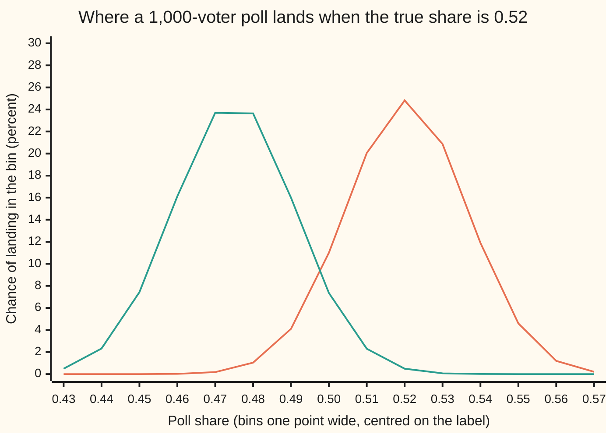
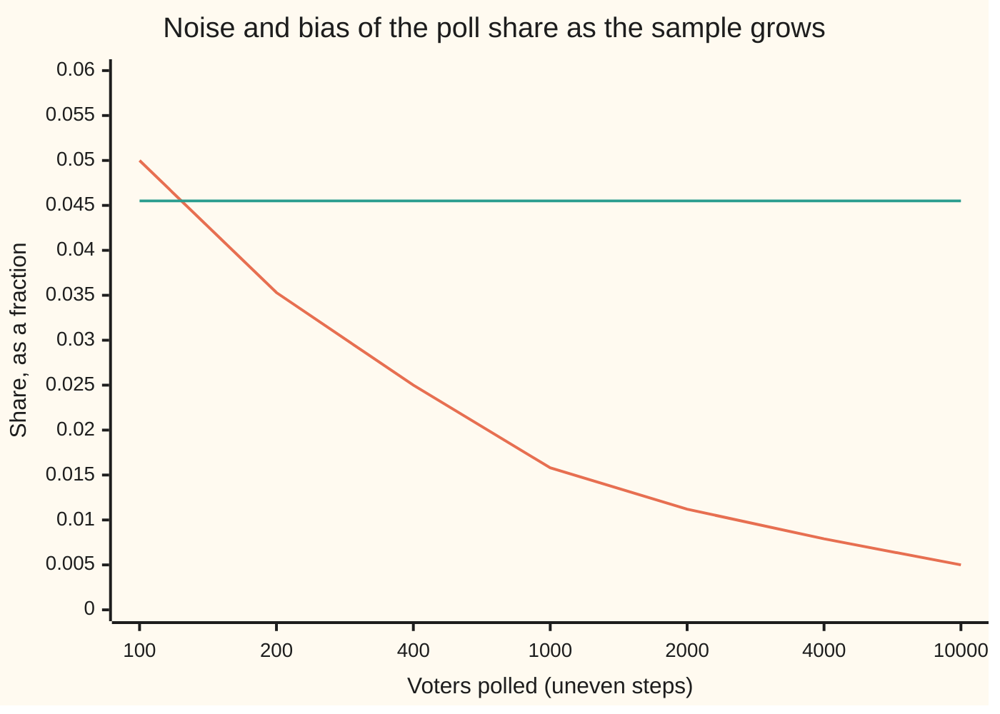

# Samples and estimators: a rule that turns data into a guess, and what makes a guess good

Probability and statistics → Sampling and Estimation → From data to a guess → Samples and estimators

---

## General Overview

A polling firm phones 1,000 voters chosen at random and asks one question: yes or no on a ballot measure. 520 say yes. The firm reports 52 percent.

Nobody cares about those 1,000 people as such. The question is the whole electorate, millions of voters who were never called. Their share of yes votes is one fixed number, and nobody knows it. The whole electorate is the **population**, the 1,000 called are the **sample**, and the 52 percent is a guess at the population's number made from the sample alone.

The guess came from a rule: count the yeses, divide by the number asked. Such a rule is an **estimator**. Its output on this particular sample, 0.52, is an **estimate**. The distinction matters because the rule can be judged and the single number cannot. Had the firm called a different 1,000, the same rule would have printed a different number. So the rule has a spread of possible outputs, and that spread can be studied before a single call is made.

Two things can go wrong with a guess. It can be **noisy**: different samples give different answers, scattered around a centre. Or it can be **biased**: the centre itself sits in the wrong place, so every poll leans the same way. Noise shrinks as the sample grows. Bias does not.

**An estimator is a rule that turns a sample into a guess at a population number; since the sample is random, the guess is a random variable, and a good rule is one whose guesses centre on the truth (no bias) and scatter little around it (little noise).**

**What kind of fact this is:** a definition (estimator, estimate, bias, noise), together with a theorem proved on this card in Why it works: under random sampling the poll's share has no bias and noise $\sqrt{p(1-p)/n}$, where $p$ is the electorate's true share and $n$ the number of voters polled.

### The picture: two ways to run the same poll

To study the rule, the checks do what no pollster can: they fix the electorate's true share at 0.52 and run the poll over and over. The orange curve is an honest poll. The green curve is a poll in which yes voters answer the phone half the time and no voters 60 percent of the time.



Orange: the honest poll, centred on the truth, 0.52. Green: the poll whose respondents choose themselves, centred on 0.4745. Both curves are equally wide: the two polls are equally noisy. Only the green one is biased, and no single poll result reveals which curve it came from.

---

## The formula

A reminder of the wing's notation. A random variable is a capital letter; $E[X]$ is its long-run average; $\mathrm{Var}(X)$ is its variance, the average squared distance from that mean, and the square root of the variance is the standard deviation, written $\mathrm{SD}(X)$ here.

One new piece of notation. **A hat over a letter marks a guess at the thing the letter names**: if $p$ is the electorate's true share, $\hat p$, read "p-hat", is the poll's guess at it.

Before the calls are made, voter number $i$'s answer is a random variable $X_i$: 1 for yes, 0 for no. The sample is the list $X_1, X_2, \dots, X_n$. A **statistic** is any rule $T$ that turns that list into a number. An **estimator** of a population number $\theta$ (Greek theta) is a statistic chosen to guess it:

$$\hat\theta = T(X_1, X_2, \dots, X_n)$$

**Read it aloud:** the guess is whatever the rule makes of the sample.

The rule must use the sample alone; it may not use $\theta$, which is unknown. The poll's rule is the sample share, with $K$ the number of yeses:

$$\hat p = \frac{K}{n} = \frac{X_1 + X_2 + \dots + X_n}{n}$$

Because the $X_i$ are random, so is $\hat\theta$. Its law over all possible samples is called its **sampling distribution**, and the two curves above are sampling distributions. Two numbers summarise how good the rule is:

$$\mathrm{bias}(\hat\theta) = E[\hat\theta] - \theta, \qquad \mathrm{noise} = \mathrm{SD}(\hat\theta)$$

**Read it aloud:** the bias is how far the rule's average guess sits from the truth; the noise is how far a single guess typically strays from the rule's own average.

A rule with zero bias for every possible value of $\theta$ is called **unbiased**. The noise of an estimator has a name of its own, its **standard error**; estimating it from the data alone is the job of [sample-mean-and-standard-error](02-sample-mean-and-standard-error.md). For the poll's share under random sampling, both numbers come out in closed form:

$$E[\hat p] = p, \qquad \mathrm{SD}(\hat p) = \sqrt{\frac{p(1-p)}{n}}$$

**Read it aloud:** the sample share aims exactly at the true share, and it typically misses by the square root of p times one minus p, all over the sample size.

With $p = 0.52$ and $n = 1{,}000$ the noise is 0.0158: the poll reads 0.52 with a standard error of about 1.6 points.

| Symbol | Plain meaning | In our example | Push it up and the answer… |
| --- | --- | --- | --- |
| $p$ | the population share: the fraction of the whole electorate voting yes; fixed and unknown | 0.52, fixed by the checks | the sampling distribution slides right; the noise is largest at 0.5 |
| $n$ | the sample size: how many voters are asked | 1,000 | noise falls like $1/\sqrt{n}$; bias does not move |
| $X_i$, $i$ | voter number $i$'s answer, 1 for yes and 0 for no | 520 ones, 480 zeros | — |
| $K$ | the number of yeses in the sample | 520 | — |
| $\hat p$ | the sample share $K/n$: the estimator, and its value on one sample, the estimate | 0.52 | — |
| $\theta$, $\hat\theta$ | any population number, and an estimator of it | $\theta$ is $p$, $\hat\theta$ is $\hat p$ | — |
| $T$ | the rule: a recipe from the list of answers to one number | count the yeses, divide by $n$ | — |
| $E[\hat\theta]$ | where the estimator lands on average over every possible sample | 0.52 honest; 0.4745 with self-selected answers | — |
| $\mathrm{bias}(\hat\theta)$ | $E[\hat\theta] - \theta$: the systematic miss | 0 honest; −0.0455 self-selected | every poll leans further the same way |
| $\mathrm{SD}(\hat\theta)$ | the noise, or standard error: the typical stray of one guess from the rule's average | 0.0158 | single polls scatter more widely |
| $\mathrm{Var}$, $\mathrm{Cov}$ | the variance, the SD squared; the covariance of two random variables, the average product of their distances from their own means, zero for independent ones | 0.2496 for one answer; in the proof, two voters' draw indicators have a negative covariance | — |
| $N$ | the number of voters in the population | 25 in the small town below; millions in the electorate | the correction for sampling without replacement fades to nothing |
| $C(N, n)$ | the number of ways to choose $n$ voters from $N$, order ignored | C(25, 5) = 53,130 samples in the town | — |
| $M$, $y_j$, $I_j$, $j$, $l$ | in the proof: the number of yes voters in the population, voter $j$'s fixed vote (1 or 0), and 1 if voter $j$ is drawn; $l$ is a second voter | 13 of the town's 25 | — |

### When it holds

The definitions hold for any rule and any data. The theorem, $E[\hat p] = p$ with noise $\sqrt{p(1-p)/n}$, needs the **iid sampling model**: the answers are **independent** (one tells nothing about another) and **identically distributed** (each is yes with the same chance $p$). Random sampling is what makes that model true. Each part can fail:

- **Everyone equally likely to be counted.** If yes voters answer the phone half the time and no voters 60 percent of the time, the answerers are not the population. The poll then aims at 0.4745, a bias of −0.0455, at every sample size.
- **Independent answers.** Poll 100 households of 10 people who always vote alike, and the poll holds only 100 independent answers. The share still averages 0.52, but its noise is 0.0500, not 0.0158.
- **A population much larger than the sample, or drawing with replacement.** Drawing without replacement leaves the share unbiased and shrinks its variance by the factor $(N - n)/(N - 1)$. For a million voters and a poll of 1,000 that factor is 0.999001, so the iid model is an excellent approximation.
- **One fixed target.** The population number must not move between the calls and the moment it matters. A poll estimates the share on the days it was taken, not on election day.
- **Honest answers.** If some voters say yes and vote no, the rule estimates the share of stated yeses, which is a different population number.

---

## Why it works

### Step 0: before the calls, the guess is a random variable

The idea that makes estimation a subject is a change of viewpoint. After the poll, 0.52 is just a number. Before the poll, the firm cannot know which 1,000 voters the random dialling will reach, so the sample share is a random variable with its own law. A rule is judged by that law: by where it centres and by how widely it spreads. One estimate can be lucky or unlucky; a rule can only be good or bad.

### Step 1: random sampling produces the iid model

Choose one voter from the electorate at random, every voter equally likely. The chance that the chosen voter says yes is the fraction of yes voters: $p$. That is the whole link between the sample and the population. It says each $X_i$ is 1 with chance $p$ and 0 with chance $1 - p$: the Bernoulli law ([bernoulli-and-binomial](../03-Discrete%20Distributions/01-bernoulli-and-binomial.md)). If each call is a fresh random choice from the whole electorate, the calls are independent too. The count $K$ then follows the binomial law, written $K \sim \mathrm{Binomial}(n, p)$ and read "K follows the binomial law with n trials and chance p".

### Step 2: the sample share aims at the truth

Expectation adds up ([expectation](../02-Random%20Variables/02-expectation.md)). One answer has expectation $0 \times (1 - p) + 1 \times p = p$. So $E[K] = np$, and dividing by $n$ gives $E[\hat p] = p$. The share has no bias, whatever the true $p$. This step needs identical laws but not independence.

### Step 3: its noise shrinks like one over the square root of n

One answer has variance $p(1-p)$: here 0.52 × 0.48 = 0.2496. Independent answers have no covariance, so the variances of the $X_i$ add ([variance-and-standard-deviation](../02-Random%20Variables/03-variance-and-standard-deviation.md)): $\mathrm{Var}(K) = np(1-p)$. Dividing $K$ by $n$ divides its variance by $n^2$:

$$\mathrm{Var}(\hat p) = \frac{p(1-p)}{n}$$

For the poll, 0.2496 / 1,000 has square root 0.015799. This step is where independence is used.

### Step 4: bias comes from how the sample is drawn, not from its size

Now let the answerers choose themselves. On average, of every 1,000 voters phoned, 520 are yes voters and half of them answer: 260. 480 are no voters and 60 percent answer: 288. So 548 answer, of whom 260 say yes. Among answerers the yes share is 260 / 548 = 0.4745.

The poll is still an honest count of the people it reaches. Steps 2 and 3 now apply with 0.4745 in place of 0.52: the share aims at 0.4745, with noise 0.0158. The bias is −0.0455, and nothing in $n$ touches it. A poll of 10,000 answerers has about a third of the noise and exactly the same bias.

### Step 5: without replacement, still unbiased and a little less noisy

A real poll never calls the same voter twice, so the draws are not quite independent: once a yes voter is used up, the next call is slightly more likely to reach a no. Take a town of $N = 25$ voters, 13 of them yes (a share of 0.52), and poll 5 without replacement. The checks list all 53,130 possible samples. Every voter appears in exactly 1 sample in 5, so the share still averages 0.52. Its variance is 0.0416 against 0.0499 for independent draws: smaller by the factor $(N - n)/(N - 1)$, which is 20/24 here and 0.999001 for a million voters. The law of the count is the hypergeometric law ([hypergeometric](../03-Discrete%20Distributions/03-hypergeometric.md)).

<details>
<summary>Detailed proof: sampling without replacement</summary>

**Setting.** A population of $N$ voters, of whom $M$ vote yes, so $p = M/N$. Write $y_j = 1$ if voter $j$ votes yes and 0 otherwise; these are fixed numbers. Draw $n$ voters without replacement, every set of $n$ equally likely. Let $I_j = 1$ if voter $j$ is drawn. Then $\hat p = \frac{1}{n}\sum_j y_j I_j$: only the $I_j$ are random.

**Inclusion.** Voter $j$ is in $C(N-1, n-1)$ of the $C(N, n)$ samples, so $E[I_j] = n/N$. For two different voters, $P(I_j = I_l = 1) = C(N-2, n-2)/C(N, n) = \frac{n(n-1)}{N(N-1)}$.

**Mean.** $E[\hat p] = \frac{1}{n}\sum_j y_j \frac{n}{N} = \frac{M}{N} = p$. The estimator is unbiased.

**Variance.** $\mathrm{Var}(I_j) = \frac{n}{N}\big(1 - \frac{n}{N}\big)$, and for $j \ne l$, $\mathrm{Cov}(I_j, I_l) = \frac{n(n-1)}{N(N-1)} - \frac{n^2}{N^2} = -\frac{n(N-n)}{N^2(N-1)}$. The sum $\sum_j y_j^2$ is $M$ and the sum of $y_j y_l$ over ordered pairs $j \ne l$ is $M(M-1)$, so
$$\mathrm{Var}\Big(\sum_j y_j I_j\Big) = M\,\frac{n(N-n)}{N^2} - M(M-1)\,\frac{n(N-n)}{N^2(N-1)} = \frac{n(N-n)}{N^2}\cdot\frac{M(N-M)}{N-1}.$$
Dividing by $n^2$ and writing $M/N = p$:
$$\mathrm{Var}(\hat p) = \frac{p(1-p)}{n}\cdot\frac{N-n}{N-1}.$$
With $N = 25$, $n = 5$, $p = 0.52$: 0.2496 / 5 × 20/24 = 0.0416, the number the enumeration prints.

</details>

### Step 6: the honest share settles on the truth

As $n$ grows, the noise $\sqrt{p(1-p)/n}$ goes to zero and the bias is already zero. By the law of large numbers ([law-of-large-numbers](../06-Limit%20Theorems%20in%20Practice/01-law-of-large-numbers.md)), the chance that $\hat p$ misses $p$ by any fixed amount goes to zero. An estimator with this property is called **consistent**. The self-selected poll also settles down, but on 0.4745: it is not consistent for $p$.

### The rate: noise falls, bias stays



Orange: the noise, $\sqrt{p(1-p)/n}$, the same for the honest and the self-selected poll. Green: the size of the self-selected poll's bias, 0.0455 at every $n$. At 100 voters the noise is still the larger error; by 200 the bias has overtaken it, and from there on more calls buy almost nothing.

The share is not the only road to $\hat p$. Asking which value of $p$ makes 520 yeses in 1,000 most probable gives the same 0.52; that road, which works for any model, is [maximum-likelihood](04-maximum-likelihood.md).

---

## Worked numbers, by hand

| Step | Arithmetic | Value |
| --- | --- | --- |
| the estimate | 520 / 1,000 | 0.52 |
| one answer's variance | 0.52 × 0.48 | 0.2496 |
| the share's noise | square root of 0.2496 / 1,000 | 0.0158 |
| honest poll's bias | $E[\hat p] - p$ = 0.52 − 0.52 | 0 |
| self-selected: yes voters answering | 0.52 × 0.5 | 0.260 |
| self-selected: no voters answering | 0.48 × 0.6 | 0.288 |
| self-selected: yes share among answerers | 0.260 / (0.260 + 0.288) | 0.4745 |
| **self-selected poll's bias** | 0.4745 − 0.52 | **−0.0455** |

The honest poll reads 0.52 with a standard error of about 1.6 points; the chance that it lands within 3 points of the truth is 0.9465. The self-selected poll has the same 1.6 points of noise, but it lands within 3 points of the truth with chance only 0.1703: about 1 poll in 6.

The simulation agrees. Over 2,000 seeded honest polls the average share is 0.5197, with a standard error of 0.0004; the shares scatter with a standard deviation of 0.0159; and 0.944 of them land within 3 points. Over 2,000 self-selected polls the average is 0.4750, standard error 0.0004: more than a hundred standard errors below the truth.

### Four rules for one poll

Any rule is an estimator, good or bad. The checks run four rules, and the self-selected poll, over the exact law of the count:

| Rule | Average guess | Bias | Noise | Settles on the truth as $n$ grows? |
| --- | --- | --- | --- | --- |
| the share $K/n$ | 0.520000 | 0 | 0.0158 | yes |
| the first voter's answer alone | 0.520000 | 0 | 0.4996 | no: it ignores the other 999 |
| always say 0.5 | 0.500000 | −0.0200 | 0 | no: it ignores the data |
| $(K + 1)/(n + 2)$ | 0.519960 | −0.00004 | 0.01577 | yes |
| the self-selected poll's share | 0.474453 | −0.0455 | 0.0158 | no: it settles on 0.4745 |

The first voter's answer is unbiased, and useless: a single 0 or 1. The constant has no noise, and learns nothing. The rule $(K+1)/(n+2)$, which adds one imaginary yes and one imaginary no, is slightly biased and slightly less noisy than the share. Whether that trade is worth it is the subject of [bias-variance-and-mean-squared-error](06-bias-variance-and-mean-squared-error.md).

### What breaks if you drop a piece

| Mistake | Comes out at | What went wrong |
| --- | --- | --- |
| Answerers choose themselves | average 0.4745, bias −0.0455; within 3 points of the truth with chance 0.1703, not 0.9465 | the sample is not a random draw from the population |
| 100 households of 10 who vote alike | noise 0.0500, not 0.0158; within 3 points with chance 0.5162 | the answers are not independent: 1,000 calls hold 100 answers |
| One voter's answer as the estimate | unbiased, noise 0.4996 | no bias is not the same as good |
| The iid formula on a town of 25, sampling 5 | variance 0.0499 claimed, 0.0416 true | without replacement the draws are slightly dependent |

The code prints all four.

---

## Code, from first principles, and it actually runs

The scripts reach the poll's behaviour by four independent roads. Road 1 is the formula. Road 2 is the exact law of the count, built one voter at a time: the chance of a given count of yeses after one more call is the chance of that count before times $1 - p$, plus the chance of one fewer before times $p$. Road 3 runs 2,000 seeded polls of each kind, drawing from SplitMix64, a short recipe for pseudo-random whole numbers written out in both languages so both draw the same answers; the self-selected poll keeps calling until 1,000 voters have answered. Road 4 lists every sample of 5 from the town of 25. Both charts and every table on this card come from these runs. One clash of letters: in the code `N` is the poll size, the card's $n$; the card's $N$ for the town is `TOWN`.

### Python

```python
# Samples and estimators -- the check behind the card; only math is imported.
# A poll of 1,000 voters reads 52 percent.  The checks fix the electorate's
# true share at 0.52 and ask what the rule "count the yeses, divide by n" does
# over every possible poll.  Roads: the formula, the exact law of the count,
# a seeded simulation of 2,000 polls, and every sample from a town of 25.
import math

P, N, RY, RN, POLLS, SEED = 0.52, 1000, 0.5, 0.6, 2000, 20260928   # N: poll size (n on the card)
M64 = 0xFFFFFFFFFFFFFFFF

def splitmix64(s):                          # the generator both languages share
    s = (s + 0x9E3779B97F4A7C15) & M64
    z = ((s ^ (s >> 30)) * 0xBF58476D1CE4E5B9) & M64
    z = ((z ^ (z >> 27)) * 0x94D049BB133111EB) & M64
    return s, z ^ (z >> 31)

def uniform(s):                             # a draw in [0, 1) from 53 random bits
    s, z = splitmix64(s)
    return s, (z >> 11) * 2.0 ** -53

def laws(c, sizes):                         # exact law of the yes count, one voter at a time
    law, out = [1.0], {}
    for n in range(1, max(sizes) + 1):
        law = [(law[k] * (1 - c) if k < n else 0.0) + (law[k - 1] * c if k > 0 else 0.0)
               for k in range(n + 1)]
        if n in sizes:
            out[n] = law
    return out

def moments(law, f):                        # mean and SD of f(count) under a law
    m = 0.0
    for k, q in enumerate(law): m += q * f(k)
    v = 0.0
    for k, q in enumerate(law): v += q * (f(k) - m) * (f(k) - m)
    return m, math.sqrt(v)

def within(law, lo, hi):                    # chance the count lies in lo..hi
    t = 0.0
    for k in range(max(lo, 0), min(hi, len(law) - 1) + 1): t += law[k]
    return t

def row(label, v):
    print(f"{label:<50} {v:>10.6f}")

Q = P * RY / (P * RY + (1 - P) * RN)        # the share among voters who answer
SIZES = (100, 200, 400, 1000)
honest, biased = laws(P, SIZES), laws(Q, (N,))
share = lambda n: (lambda k: k / n)
h_mean, h_sd = moments(honest[N], share(N))
b_mean, b_sd = moments(biased[N], share(N))
l_mean, l_sd = moments(honest[N], lambda k: (k + 1) / (N + 2))
f_mean, f_sd = moments([1 - P, P], share(1))

state, hs, hs2, hin, bs, bs2 = SEED, 0.0, 0.0, 0, 0.0, 0.0   # 2,000 polls of each kind
for poll in range(POLLS):
    yes = 0
    for i in range(N):
        state, u = uniform(state)
        yes += u < P
    hs, hs2, hin = hs + yes / N, hs2 + (yes / N) * (yes / N), hin + (abs(yes - 520) <= 30)
    yes = answered = 0
    while answered < N:                     # ask until 1,000 voters have answered
        state, u = uniform(state)
        state, v = uniform(state)
        if v < (RY if u < P else RN):
            answered += 1
            yes += u < P
    bs, bs2 = bs + yes / N, bs2 + (yes / N) * (yes / N)
sim_h, sim_b = hs / POLLS, bs / POLLS
sim_hsd = math.sqrt(hs2 / POLLS - sim_h * sim_h)
sim_bsd = math.sqrt(bs2 / POLLS - sim_b * sim_b)
se_h, se_b = sim_hsd / math.sqrt(POLLS), sim_bsd / math.sqrt(POLLS)

TOWN, YES, n5 = 25, 13, 5                   # every sample of 5 from a town of 25
count = s1 = s2 = 0.0
holds0 = 0
for a in range(TOWN):
    for b in range(a + 1, TOWN):
        for c in range(b + 1, TOWN):
            for d in range(c + 1, TOWN):
                for e in range(d + 1, TOWN):
                    k = (a < YES) + (b < YES) + (c < YES) + (d < YES) + (e < YES)
                    count, s1, s2 = count + 1, s1 + k / n5, s2 + (k / n5) * (k / n5)
                    holds0 += a == 0
t_mean, t_var = s1 / count, s2 / count - (s1 / count) * (s1 / count)
fpc = (TOWN - n5) / (TOWN - 1)

row("formula: p(1 - p)", P * (1 - P))
row("formula: SD of the share, sqrt(p(1-p)/n)", math.sqrt(P * (1 - P) / N))
row("exact law: chance within 3 points of 0.52", within(honest[N], 490, 550))
row("simulated 2,000 polls: mean share", sim_h)
row("  its standard error", se_h)
row("simulated: SD of the share", sim_hsd)
row("simulated: share of polls within 3 points", hin / POLLS)
print(f"biased: answering, yes {P * RY:.3f} + no {(1 - P) * RN:.3f} = {P * RY + (1 - P) * RN:.6f}")
row("biased: yes share among answerers, formula", Q)
row("biased: bias, that minus 0.52", Q - P)
row("biased exact law: chance within 3 points of 0.52", within(biased[N], 490, 550))
row("biased simulated 2,000 polls: mean share", sim_b)
row("  its standard error", se_b)
print("chart, noise: n, SD by formula, SD by exact law (bias stays -0.0455)")
for n in (100, 200, 400, 1000, 2000, 4000, 10000):
    ex = f"{moments(honest[n], share(n))[1]:.4f}" if n in honest else "-"
    print(f"chart, {n:>5} {math.sqrt(P * (1 - P) / n):.4f} {ex:>6}")
print("rules on the same poll, exact law:              mean       bias         SD")
for name, m, sd in (("share K/n", h_mean, h_sd), ("first voter only", f_mean, f_sd),
                    ("always 0.5", 0.5, 0.0), ("(K+1)/(n+2)", l_mean, l_sd),
                    ("biased poll's share", b_mean, b_sd)):
    print(f"  {name:<40} {m:>10.6f} {m - P:>10.6f} {sd:>10.6f}")
row("clustered, 100 homes of 10: SD by formula", math.sqrt(P * (1 - P) / 100))
row("clustered: SD by exact law", moments(honest[100], share(100))[1])
row("clustered: chance within 3 points of 0.52", within(honest[100], 49, 55))
print(f"{'town of 25, 13 yes: samples of 5, counted':<50} {count:>10.0f}")
row("town: chance a given voter is in the sample", holds0 / count)
row("town: mean of the share over every sample", t_mean)
row("town: variance of the share, enumerated", t_var)
row("town: formula p(1-p)/n x (N-n)/(N-1)", P * (1 - P) / n5 * fpc)
row("town: iid formula p(1-p)/n, drawn with replacement", P * (1 - P) / n5)
row("electorate of 1,000,000: factor (N-n)/(N-1)", (10 ** 6 - N) / (10 ** 6 - 1))
print("chart, bins of one point: centre, honest poll, biased poll, in percent")
for j in range(15):
    kc = 430 + 10 * j
    print(f"chart, {kc / 1000:.2f} {100 * within(honest[N], kc - 5, kc + 4):5.2f} "
          f"{100 * within(biased[N], kc - 5, kc + 4):5.2f}")

assert all(abs(moments(honest[n], share(n))[1] - math.sqrt(P * (1 - P) / n)) < 1e-9
           for n in SIZES), "exact law vs the formula's noise"
assert abs(h_mean - P) < 1e-9, "exact law vs the formula's mean"
assert abs(b_mean - Q) < 1e-9, "biased exact law vs the answerers' share"
assert abs(sim_h - P) < 4 * se_h, "simulated honest polls centre on the truth"
assert abs(sim_b - Q) < 4 * se_b, "simulated biased polls centre on the answerers' share"
assert P - sim_b > 10 * se_b, "and far below the truth"
assert abs(sim_hsd - h_sd) < 4 * h_sd / math.sqrt(2 * POLLS), "simulated vs exact noise"
hw = within(honest[N], 490, 550)
assert abs(hin / POLLS - hw) < 4 * math.sqrt(hw * (1 - hw) / POLLS), "simulated vs exact within 3 points"
assert abs(t_mean - YES / TOWN) < 1e-12, "town: unbiased without replacement"
assert abs(t_var - P * (1 - P) / n5 * fpc) < 1e-12, "town: enumerated vs corrected formula"
assert abs(holds0 / count - n5 / TOWN) < 1e-12, "every voter equally likely to be drawn"
assert abs(l_mean - (N * P + 1) / (N + 2)) < 1e-9, "shrunk rule's mean by law vs formula"
print("ALL CHECKS PASS")
```

**Ran 2026-09-28 on macOS, Python 3.14.6, standard library only. All checks passed. Output, pasted from the run:**

```
formula: p(1 - p)                                    0.249600
formula: SD of the share, sqrt(p(1-p)/n)             0.015799
exact law: chance within 3 points of 0.52            0.946514
simulated 2,000 polls: mean share                    0.519679
  its standard error                                 0.000355
simulated: SD of the share                           0.015880
simulated: share of polls within 3 points            0.944000
biased: answering, yes 0.260 + no 0.288 = 0.548000
biased: yes share among answerers, formula           0.474453
biased: bias, that minus 0.52                       -0.045547
biased exact law: chance within 3 points of 0.52     0.170302
biased simulated 2,000 polls: mean share             0.475019
  its standard error                                 0.000356
chart, noise: n, SD by formula, SD by exact law (bias stays -0.0455)
chart,   100 0.0500 0.0500
chart,   200 0.0353 0.0353
chart,   400 0.0250 0.0250
chart,  1000 0.0158 0.0158
chart,  2000 0.0112      -
chart,  4000 0.0079      -
chart, 10000 0.0050      -
rules on the same poll, exact law:              mean       bias         SD
  share K/n                                  0.520000   0.000000   0.015799
  first voter only                           0.520000   0.000000   0.499600
  always 0.5                                 0.500000  -0.020000   0.000000
  (K+1)/(n+2)                                0.519960  -0.000040   0.015767
  biased poll's share                        0.474453  -0.045547   0.015791
clustered, 100 homes of 10: SD by formula            0.049960
clustered: SD by exact law                           0.049960
clustered: chance within 3 points of 0.52            0.516232
town of 25, 13 yes: samples of 5, counted               53130
town: chance a given voter is in the sample          0.200000
town: mean of the share over every sample            0.520000
town: variance of the share, enumerated              0.041600
town: formula p(1-p)/n x (N-n)/(N-1)                 0.041600
town: iid formula p(1-p)/n, drawn with replacement   0.049920
electorate of 1,000,000: factor (N-n)/(N-1)          0.999001
chart, bins of one point: centre, honest poll, biased poll, in percent
chart, 0.43  0.00  0.49
chart, 0.44  0.00  2.32
chart, 0.45  0.00  7.43
chart, 0.46  0.02 16.12
chart, 0.47  0.18 23.70
chart, 0.48  1.04 23.64
chart, 0.49  4.10 16.00
chart, 0.50 11.00  7.36
chart, 0.51 20.05  2.30
chart, 0.52 24.82  0.49
chart, 0.53 20.87  0.07
chart, 0.54 11.90  0.01
chart, 0.55  4.60  0.00
chart, 0.56  1.20  0.00
chart, 0.57  0.21  0.00
ALL CHECKS PASS
```

### Rust

Same numbers, same labels, same generator and seed.

```rust
// Samples and estimators -- the check behind the card, in Rust, std only.
// A poll of 1,000 voters reads 52 percent.  The checks fix the electorate's
// true share at 0.52 and ask what the rule "count the yeses, divide by n" does
// over every possible poll.  Roads: the formula, the exact law of the count,
// a seeded simulation of 2,000 polls, and every sample from a town of 25.
const P: f64 = 0.52; const RY: f64 = 0.5; const RN: f64 = 0.6;
const N: usize = 1000; const POLLS: usize = 2000; const SEED: u64 = 20260928; // N: poll size (n on the card)

fn splitmix64(s: u64) -> (u64, u64) { // the generator both languages share
    let s = s.wrapping_add(0x9E3779B97F4A7C15);
    let mut z = (s ^ (s >> 30)).wrapping_mul(0xBF58476D1CE4E5B9);
    z = (z ^ (z >> 27)).wrapping_mul(0x94D049BB133111EB);
    (s, z ^ (z >> 31))
}

fn uniform(s: u64) -> (u64, f64) { // a draw in [0, 1) from 53 random bits
    let (s, z) = splitmix64(s);
    (s, (z >> 11) as f64 * 2f64.powi(-53))
}

fn laws(c: f64, sizes: &[usize]) -> Vec<(usize, Vec<f64>)> { // exact law of the yes count, one voter at a time
    let (mut law, mut out) = (vec![1.0f64], Vec::new());
    for n in 1..=*sizes.iter().max().unwrap() {
        law = (0..=n)
            .map(|k| (if k < n { law[k] * (1.0 - c) } else { 0.0 }) + (if k > 0 { law[k - 1] * c } else { 0.0 }))
            .collect();
        if sizes.contains(&n) { out.push((n, law.clone())); }
    }
    out
}

fn get(ls: &[(usize, Vec<f64>)], n: usize) -> &Vec<f64> {
    &ls.iter().find(|(m, _)| *m == n).unwrap().1
}

fn moments(law: &[f64], f: &dyn Fn(usize) -> f64) -> (f64, f64) { // mean and SD of f(count) under a law
    let mut m = 0.0;
    for (k, q) in law.iter().enumerate() { m += q * f(k); }
    let mut v = 0.0;
    for (k, q) in law.iter().enumerate() { v += q * (f(k) - m) * (f(k) - m); }
    (m, v.sqrt())
}

fn within(law: &[f64], lo: i64, hi: i64) -> f64 { // chance the count lies in lo..hi
    let mut t = 0.0;
    for k in lo.max(0)..=hi.min(law.len() as i64 - 1) { t += law[k as usize]; }
    t
}

fn row(label: &str, v: f64) { println!("{:<50} {:>10.6}", label, v); }

fn main() {
    let q = P * RY / (P * RY + (1.0 - P) * RN); // the share among voters who answer
    let sizes = [100usize, 200, 400, 1000];
    let (honest, biased) = (laws(P, &sizes), laws(q, &[N]));
    let share = |n: usize| move |k: usize| k as f64 / n as f64;
    let (h_mean, h_sd) = moments(get(&honest, N), &share(N));
    let (b_mean, b_sd) = moments(get(&biased, N), &share(N));
    let (l_mean, l_sd) = moments(get(&honest, N), &|k| (k as f64 + 1.0) / (N as f64 + 2.0));
    let (f_mean, f_sd) = moments(&[1.0 - P, P], &share(1));

    let (mut state, mut hs, mut hs2, mut hin, mut bs, mut bs2) = (SEED, 0.0f64, 0.0f64, 0usize, 0.0f64, 0.0f64);
    let nf = N as f64;
    for _ in 0..POLLS {
        let mut yes = 0i64;
        for _ in 0..N {
            let (s, u) = uniform(state); state = s;
            yes += (u < P) as i64;
        }
        let a = yes as f64 / nf;
        hs += a;
        hs2 += a * a;
        hin += ((yes - 520).abs() <= 30) as usize;
        let (mut yes, mut answered) = (0i64, 0usize);
        while answered < N { // ask until 1,000 voters have answered
            let (s, u) = uniform(state);
            let (s, v) = uniform(s); state = s;
            if v < (if u < P { RY } else { RN }) {
                answered += 1;
                yes += (u < P) as i64;
            }
        }
        let a = yes as f64 / nf;
        bs += a;
        bs2 += a * a;
    }
    let pf = POLLS as f64;
    let (sim_h, sim_b) = (hs / pf, bs / pf);
    let sim_hsd = (hs2 / pf - sim_h * sim_h).sqrt();
    let sim_bsd = (bs2 / pf - sim_b * sim_b).sqrt();
    let (se_h, se_b) = (sim_hsd / pf.sqrt(), sim_bsd / pf.sqrt());

    let (town, yes_n, n5) = (25usize, 13usize, 5.0f64); // every sample of 5 from a town of 25
    let (mut count, mut s1, mut s2, mut holds0) = (0.0f64, 0.0f64, 0.0f64, 0usize);
    for a in 0..town {
        for b in a + 1..town {
            for c in b + 1..town {
                for d in c + 1..town {
                    for e in d + 1..town {
                        let k = [a, b, c, d, e].iter().filter(|&&x| x < yes_n).count() as f64;
                        count += 1.0;
                        s1 += k / n5;
                        s2 += (k / n5) * (k / n5);
                        holds0 += (a == 0) as usize;
                    }
                }
            }
        }
    }
    let (t_mean, t_var) = (s1 / count, s2 / count - (s1 / count) * (s1 / count));
    let fpc = (town as f64 - n5) / (town as f64 - 1.0);

    row("formula: p(1 - p)", P * (1.0 - P));
    row("formula: SD of the share, sqrt(p(1-p)/n)", (P * (1.0 - P) / nf).sqrt());
    row("exact law: chance within 3 points of 0.52", within(get(&honest, N), 490, 550));
    row("simulated 2,000 polls: mean share", sim_h);
    row("  its standard error", se_h);
    row("simulated: SD of the share", sim_hsd);
    row("simulated: share of polls within 3 points", hin as f64 / pf);
    println!("biased: answering, yes {:.3} + no {:.3} = {:.6}", P * RY, (1.0 - P) * RN, P * RY + (1.0 - P) * RN);
    row("biased: yes share among answerers, formula", q);
    row("biased: bias, that minus 0.52", q - P);
    row("biased exact law: chance within 3 points of 0.52", within(get(&biased, N), 490, 550));
    row("biased simulated 2,000 polls: mean share", sim_b);
    row("  its standard error", se_b);
    println!("chart, noise: n, SD by formula, SD by exact law (bias stays -0.0455)");
    for n in [100usize, 200, 400, 1000, 2000, 4000, 10000] {
        let ex = if sizes.contains(&n) { format!("{:.4}", moments(get(&honest, n), &share(n)).1) } else { "-".to_string() };
        println!("chart, {:>5} {:.4} {:>6}", n, (P * (1.0 - P) / n as f64).sqrt(), ex);
    }
    println!("rules on the same poll, exact law:              mean       bias         SD");
    for (name, m, sd) in [("share K/n", h_mean, h_sd), ("first voter only", f_mean, f_sd),
                          ("always 0.5", 0.5, 0.0), ("(K+1)/(n+2)", l_mean, l_sd),
                          ("biased poll's share", b_mean, b_sd)] {
        println!("  {:<40} {:>10.6} {:>10.6} {:>10.6}", name, m, m - P, sd);
    }
    row("clustered, 100 homes of 10: SD by formula", (P * (1.0 - P) / 100.0).sqrt());
    row("clustered: SD by exact law", moments(get(&honest, 100), &share(100)).1);
    row("clustered: chance within 3 points of 0.52", within(get(&honest, 100), 49, 55));
    println!("{:<50} {:>10.0}", "town of 25, 13 yes: samples of 5, counted", count);
    row("town: chance a given voter is in the sample", holds0 as f64 / count);
    row("town: mean of the share over every sample", t_mean);
    row("town: variance of the share, enumerated", t_var);
    row("town: formula p(1-p)/n x (N-n)/(N-1)", P * (1.0 - P) / n5 * fpc);
    row("town: iid formula p(1-p)/n, drawn with replacement", P * (1.0 - P) / n5);
    row("electorate of 1,000,000: factor (N-n)/(N-1)", (1_000_000.0 - nf) / (1_000_000.0 - 1.0));
    println!("chart, bins of one point: centre, honest poll, biased poll, in percent");
    for j in 0..15i64 {
        let kc = 430 + 10 * j;
        println!("chart, {:.2} {:5.2} {:5.2}", kc as f64 / 1000.0,
                 100.0 * within(get(&honest, N), kc - 5, kc + 4), 100.0 * within(get(&biased, N), kc - 5, kc + 4));
    }

    assert!(sizes.iter().all(|&n| (moments(get(&honest, n), &share(n)).1 - (P * (1.0 - P) / n as f64).sqrt()).abs() < 1e-9),
            "exact law vs the formula's noise");
    assert!((h_mean - P).abs() < 1e-9, "exact law vs the formula's mean");
    assert!((b_mean - q).abs() < 1e-9, "biased exact law vs the answerers' share");
    assert!((sim_h - P).abs() < 4.0 * se_h, "simulated honest polls centre on the truth");
    assert!((sim_b - q).abs() < 4.0 * se_b, "simulated biased polls centre on the answerers' share");
    assert!(P - sim_b > 10.0 * se_b, "and far below the truth");
    assert!((sim_hsd - h_sd).abs() < 4.0 * h_sd / (2.0 * pf).sqrt(), "simulated vs exact noise");
    let hw = within(get(&honest, N), 490, 550);
    assert!((hin as f64 / pf - hw).abs() < 4.0 * (hw * (1.0 - hw) / pf).sqrt(), "simulated vs exact within 3 points");
    assert!((t_mean - yes_n as f64 / town as f64).abs() < 1e-12, "town: unbiased without replacement");
    assert!((t_var - P * (1.0 - P) / n5 * fpc).abs() < 1e-12, "town: enumerated vs corrected formula");
    assert!((holds0 as f64 / count - n5 / town as f64).abs() < 1e-12, "every voter equally likely to be drawn");
    assert!((l_mean - (nf * P + 1.0) / (nf + 2.0)).abs() < 1e-9, "shrunk rule's mean by law vs formula");
    println!("ALL CHECKS PASS");
}
```

**Ran 2026-09-28 on macOS, rustc 1.98.1, no crates. All checks passed. Output, pasted from the run:**

```
formula: p(1 - p)                                    0.249600
formula: SD of the share, sqrt(p(1-p)/n)             0.015799
exact law: chance within 3 points of 0.52            0.946514
simulated 2,000 polls: mean share                    0.519679
  its standard error                                 0.000355
simulated: SD of the share                           0.015880
simulated: share of polls within 3 points            0.944000
biased: answering, yes 0.260 + no 0.288 = 0.548000
biased: yes share among answerers, formula           0.474453
biased: bias, that minus 0.52                       -0.045547
biased exact law: chance within 3 points of 0.52     0.170302
biased simulated 2,000 polls: mean share             0.475019
  its standard error                                 0.000356
chart, noise: n, SD by formula, SD by exact law (bias stays -0.0455)
chart,   100 0.0500 0.0500
chart,   200 0.0353 0.0353
chart,   400 0.0250 0.0250
chart,  1000 0.0158 0.0158
chart,  2000 0.0112      -
chart,  4000 0.0079      -
chart, 10000 0.0050      -
rules on the same poll, exact law:              mean       bias         SD
  share K/n                                  0.520000   0.000000   0.015799
  first voter only                           0.520000   0.000000   0.499600
  always 0.5                                 0.500000  -0.020000   0.000000
  (K+1)/(n+2)                                0.519960  -0.000040   0.015767
  biased poll's share                        0.474453  -0.045547   0.015791
clustered, 100 homes of 10: SD by formula            0.049960
clustered: SD by exact law                           0.049960
clustered: chance within 3 points of 0.52            0.516232
town of 25, 13 yes: samples of 5, counted               53130
town: chance a given voter is in the sample          0.200000
town: mean of the share over every sample            0.520000
town: variance of the share, enumerated              0.041600
town: formula p(1-p)/n x (N-n)/(N-1)                 0.041600
town: iid formula p(1-p)/n, drawn with replacement   0.049920
electorate of 1,000,000: factor (N-n)/(N-1)          0.999001
chart, bins of one point: centre, honest poll, biased poll, in percent
chart, 0.43  0.00  0.49
chart, 0.44  0.00  2.32
chart, 0.45  0.00  7.43
chart, 0.46  0.02 16.12
chart, 0.47  0.18 23.70
chart, 0.48  1.04 23.64
chart, 0.49  4.10 16.00
chart, 0.50 11.00  7.36
chart, 0.51 20.05  2.30
chart, 0.52 24.82  0.49
chart, 0.53 20.87  0.07
chart, 0.54 11.90  0.01
chart, 0.55  4.60  0.00
chart, 0.56  1.20  0.00
chart, 0.57  0.21  0.00
ALL CHECKS PASS
```

The two outputs match line for line.

> [!TIP]
> **Try changing**
> Guess first, then run it.
> - **Equal answer rates.** Set `RN` to 0.5 in both. The answerers are now a random half of those phoned, so the self-selected poll aims at 0.52 again; the assert that it lands far below the truth stops the program. Bias comes from who answers, not from how many.
> - **Bias the other way.** Set `RY` to 0.6 and `RN` to 0.5 in both. Now yes voters answer more readily, the answerers' share rises above 0.52 by nearly as much as it fell, and the assert that the biased polls sit far below the truth stops the program.
> - **A tied electorate.** Set `P` to 0.5. The noise edges up to its largest possible value, since $p(1-p)$ peaks at 0.5. The town still holds 13 yes voters in 25, so the formula is now fed the wrong share, and the assert comparing the town's enumerated variance with the formula fails.
> - **Another seed.** Change `SEED`. The simulated averages move by about a thousandth or less, well inside a few standard errors; the exact law does not move at all.

---

## The usual mistake

> [!warning]
> **Believing a big sample cures a biased one.** Size shrinks noise and leaves bias untouched. The self-selected poll misses by 0.0455 on average at 100 voters, at 1,000 and at 10,000; its standard error, 1.6 points at 1,000, measures only the noise and says nothing about the lean. A huge unrepresentative sample produces a precise wrong answer.
>
> - **Confusing the estimate with the estimator.** 0.52 is one output. The rule's quality is a property of all the outputs it could have given; one poll landing near the truth proves nothing about the rule.
> - **Confusing the estimate with the parameter.** The poll's 0.52 is not the electorate's share. Even an honest poll misses by more than 3 points about 1 time in 19 (1 − 0.9465).
> - **Treating unbiased as good.** The first voter's answer is unbiased with noise 0.4996. A small bias with much less noise can beat it by far.
> - **Counting calls instead of independent answers.** 1,000 calls to 100 like-minded households carry the information of 100 answers: noise 0.0500, not 0.0158.

---

## Where you meet it in real life

- **Election polls.** The *Literary Digest* poll of 1936 mailed millions of ballots drawn largely from car and telephone lists, got enormous numbers back, and called the election for the loser; the lesson is Step 4, a precise count of the wrong population.
- **Quality control.** A factory tests a sample of a day's output for defects and uses the defect share as an estimate for the whole day; the sample must be drawn across the whole shift, not from the last hour.
- **Clinical trials.** Patients are assigned to treatment at random so that the difference in recovery rates estimates the effect without bias; volunteers who pick their own arm would bias it, as the self-selected poll does.
- **Simulation.** A Monte Carlo price in finance is a sample share or sample average used as an estimator, quoted with its standard error ([bootstrap](08-bootstrap.md) resamples the data itself to find that error).

> **Say it back**
> A population number, like the electorate's yes share, is fixed and unknown; a sample is a random selection from the population; an estimator is a rule that turns the sample into a guess. Because the sample is random, the guess is a random variable, judged by where it centres and how much it scatters. The bias is the gap between its average guess and the truth; the noise, or standard error, is its typical stray from that average. Under random sampling the poll's share has no bias and noise $\sqrt{p(1-p)/n}$: 0.0158 for 1,000 voters. A larger sample shrinks the noise but never the bias, which comes from how the sample was drawn.

---

## What this builds on

- [law-of-large-numbers](../06-Limit%20Theorems%20in%20Practice/01-law-of-large-numbers.md): why a sample average settles on its target, which makes an unbiased share consistent.

## Where this goes next

- [sample-mean-and-standard-error](02-sample-mean-and-standard-error.md): the noise of any sample average, and how to estimate it from the sample when $p$ is unknown.
- [maximum-likelihood](04-maximum-likelihood.md): a general recipe for building estimators, which returns the share for the poll.

This card judged the share with the true $p$ in hand; a real pollster has only the 520 yeses. How to put an honest error bar on 0.52 using the sample alone is [sample-mean-and-standard-error](02-sample-mean-and-standard-error.md).

---

## Sources

Verified 28 Sep 2026: every link below resolves to the publisher's page.

- Freedman, David, Robert Pisani, and Roger Purves. *Statistics*, 4th ed. W. W. Norton, 2007. [Publisher page](https://wwnorton.com/books/9780393929720). Chapters 19 to 21: sample surveys, chance error against bias, and the *Literary Digest* poll.
- Casella, George, and Roger L. Berger. *Statistical Inference*, 2nd ed. Chapman and Hall/CRC. [Publisher page](https://www.routledge.com/Statistical-Inference/Casella-Berger/p/book/9781032593036). Random samples, statistics and estimators defined formally; bias and consistency.
- Lohr, Sharon L. *Sampling: Design and Analysis*, 3rd ed. Chapman and Hall/CRC. [Publisher page](https://www.routledge.com/Sampling-Design-and-Analysis/Lohr/p/book/9780367279509). Sampling without replacement, the finite-population correction, and nonresponse bias.
- Squire, Peverill. "Why the 1936 *Literary Digest* Poll Failed." *Public Opinion Quarterly* 52, no. 1 (1988): 125–133. [DOI](https://doi.org/10.1086/269085). Separates the poll's two faults: whom it reached, and who answered.
