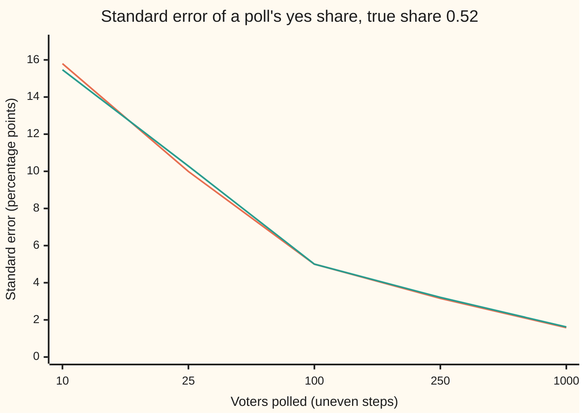
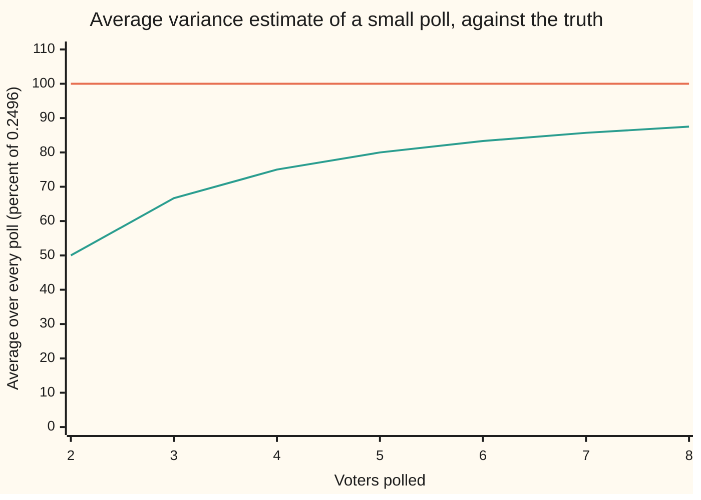

# Standard error: the spread of an average, and the square root of n

[Syllabus](../../../SYLLABUS.md) → [Probability and statistics](../README.md) → [Sampling and Estimation](../README.md#s07) → Standard error

---

## General Overview

A polling firm phones 1,000 voters chosen at random. 520 say yes to a ballot measure, 480 say no. The firm reports 52 percent, plus or minus something. That something is the subject of this card.

One voter's answer is very uncertain: a yes or a no, a swing of 100 points. An average of 1,000 answers is not. Most of the yeses and noes cancel, and the average of a second poll of 1,000 would land close to the first. How close is measured by the **standard error**: the standard deviation of the average over all the polls that could have been run. For this poll it is 0.0158, about 1.6 percentage points.

Two facts make that number. The spread of an average falls like one over the square root of the number of answers: four times the voters buys half the error, not a quarter. And the firm never knows the electorate's true spread, so it measures the spread of its own 1,000 answers instead, dividing by 999 rather than 1,000. The card proves both.

**The average of n independent answers aims at the population mean with a standard deviation of σ/√n, where σ is the spread of one answer; since σ is unknown, it is estimated from the sample by dividing the squared deviations by n − 1, which is exactly right on average.**

**What kind of fact this is:** a theorem, proved on this card in Why it works; the standard error itself is a definition, and s/√n is an estimator of it.

### The picture: four times the voters, half the error

The checks run 1,000 simulated polls from an electorate whose true yes share is 0.52, and read each poll's running average after 10, 25, 100, 250 and 1,000 voters. The spread of those averages is set against the formula.



Orange: the formula σ/√n. Green: the standard deviation of 1,000 simulated averages at each size. From 25 to 100 voters the sample grows fourfold and the error halves, 9.99 to 5.00 points. From 100 to 1,000 it grows tenfold and the error falls by the square root of 10, to 1.58.

---

## The formula

A reminder of the wing's notation. $E[X]$ is the long-run average of a random variable X; $\mathrm{Var}(X)$ is its variance, the average squared distance from $E[X]$; $\mathrm{Cov}(X, Y)$ is the covariance of two of them; a hat marks an estimate, as in $\hat p$ for the poll's share.

New notation, in words first. A bar over a letter marks an average over the sample: $\bar X$, read "X-bar", is the average of the answers. $S^2$ is the **sample variance**, the spread of the sample's own answers around $\bar X$, with the divisor n − 1. SE stands for standard error, SD for standard deviation.

Before the calls, voter number $i$'s answer is a random variable $X_i$: 1 for yes, 0 for no. The answers are **iid**: independent (one tells nothing about another) and identically distributed (each has the same law). One answer has mean $\mu$ and variance $\sigma^2$. The sample mean is

$$\bar X = \frac{X_1 + X_2 + \dots + X_n}{n}$$

and the theorem says

$$E[\bar X] = \mu, \qquad \mathrm{Var}(\bar X) = \frac{\sigma^2}{n}, \qquad \mathrm{SE} = \frac{\sigma}{\sqrt n}.$$

**Read it aloud:** the average aims at the population mean, and it typically misses by the spread of one answer divided by the square root of the sample size.

The spread $\sigma$ is unknown, so it is estimated from the data:

$$S^2 = \frac{1}{n-1}\sum_{i=1}^{n} (X_i - \bar X)^2, \qquad E[S^2] = \sigma^2, \qquad \widehat{\mathrm{SE}} = \frac{s}{\sqrt n}.$$

**Read it aloud:** add the squared distances of the answers from their own average, divide by one less than the number of answers, and the result is right on average; its square root over root n is the estimated standard error.

The sign $\sum$ adds the term after it for every $i$ from 1 to $n$. A capital $S$ is the rule before the data arrive; a small $s$ is its value on the actual poll. For answers of 1 and 0 the mean is the yes share, $\mu = p$, and $\sigma^2 = p(1-p)$, which [Samples and estimators](01-populations-samples-and-estimators.md) derived for the share alone.

| Symbol | Plain meaning | In our example | Push it up and the answer… |
| --- | --- | --- | --- |
| $X_i$, $i$, $j$ | answer number $i$ (1 yes, 0 no), random before the call; $j$ names a second voter | 520 ones, 480 zeros | — |
| $n$ | the sample size: answers averaged | 1,000 | the SE falls like $1/\sqrt n$ |
| $\bar X$ | the sample mean: the answers' average; for 0/1 answers it is the share $\hat p$ | 0.52 | — |
| $\mu$ | the population mean: the long-run average of one answer | the true yes share $p$, unknown | the average's target moves with it |
| $p$, $\hat p$ | the electorate's true yes share, and the poll's share | unknown; 0.52 | $p(1-p)$ peaks at 0.5 |
| $\sigma$, $\sigma^2$ | the SD and variance of one answer | 0.4996 and 0.2496 at $p$ = 0.52 | the SE grows in proportion |
| $\mathrm{SE}$ | the standard error: the SD of $\bar X$ over every possible poll, $\sigma/\sqrt n$ | 0.0158 | — |
| $Q$, $\sum$ | the sum of squared deviations from the sample mean; $\sum$ adds a term for every $i$ | 249.6 | — |
| $N$ | the number of voters in the population | millions | the without-replacement factor fades to 1 |
| $S^2$, $s$ | the sample variance $Q/(n-1)$, and its square root on this poll | 0.249850 and 0.499850 | — |
| $V$ | the divide-by-$n$ version, $Q/n$: the spread of the recorded answers themselves | 0.2496 | — |
| $\widehat{\mathrm{SE}}$ | the estimated standard error $s/\sqrt n$ | 0.015807 | — |

### When it holds

- **Independent answers.** Step 2 uses independence; Step 1 does not. Poll 100 households of 10 who always vote alike and the averages scatter by 0.0500, but $s/\sqrt{1000}$ still reports 0.0157: the estimate cannot see the dependence.
- **One common mean.** Every answer must aim at the same $\mu$. Equal variances are a convenience: with different ones, $\mathrm{Var}(\bar X)$ is their average divided by $n$.
- **A finite variance.** Yes/no answers always have one. A heavy-tailed law such as the Cauchy has none, and its average never settles ([Heavy tails](../04-Continuous%20Distributions/08-heavy-tails-pareto-and-cauchy.md)).
- **Draws with replacement, or a population far larger than the sample.** Drawing without replacement multiplies the variance by $(N - n)/(N - 1)$, with $N$ the population size; for millions of voters that factor is indistinguishable from 1 ([Samples and estimators](01-populations-samples-and-estimators.md)).
- **At least two answers for $S^2$.** With $n = 1$ there is no spread to measure, and $n - 1$ is zero.

---

## Why it works

### Step 0: adding spreads the sum, dividing shrinks it more

A sum of $n$ independent answers is more spread out than one answer, but not $n$ times as much: yeses and noes partly cancel. Its variance grows $n$-fold, so its standard deviation grows only $\sqrt n$-fold. Dividing by $n$ to get the average shrinks the standard deviation $n$-fold. Net: $\sqrt n / n = 1/\sqrt n$. That mismatch between how sums spread and how division shrinks is the whole idea.

### Step 1: the average aims at the mean

Expectation adds up and passes through constants ([Expectation](../02-Random%20Variables/02-expectation.md)):

$$E[\bar X] = \frac{E[X_1] + \dots + E[X_n]}{n} = \frac{n\mu}{n} = \mu.$$

No independence was used. Any sample of answers with a common mean gives an average with no bias.

### Step 2: the variance of the average is σ^2/n

The variance of a sum is the sum of all variances plus every covariance between two different terms ([Two variables at once](../02-Random%20Variables/04-joint-distributions-and-covariance.md)). Independent answers have zero covariance, so only the $n$ variances remain: $\mathrm{Var}(X_1 + \dots + X_n) = n\sigma^2$. Dividing a random variable by $n$ divides its variance by $n^2$ ([Variance](../02-Random%20Variables/03-variance-and-standard-deviation.md)):

$$\mathrm{Var}(\bar X) = \frac{n\sigma^2}{n^2} = \frac{\sigma^2}{n}.$$

For the poll, 0.2496 / 1,000 has square root 0.015799. The checks list every one of the $2^n$ possible answer lists for polls of 2 to 8 voters and weigh each by its chance. The variance of the average they find matches $\sigma^2/n$ at every size: 0.124800 at 2 voters, 0.031200 at 8.

### Step 3: the square-root law

Taking the square root gives $\mathrm{SE} = \sigma/\sqrt n$. The cost of precision follows at once. Halving the error takes four times the sample; a tenth of the error takes a hundred times. A national poll of 1,000 has an SE of 1.58 points; 250 voters give 3.16, and 1,000 simulated polls of each size scatter by 1.62 and 3.21 points (standard errors 0.036 and 0.072). About 2 polls in 3 (0.679 of the simulated ones, standard error 0.0148) land within one standard error of the truth.

### Step 4: the sample's own spread runs small

The formula needs $\sigma$, and $\sigma$ depends on the unknown $p$. The natural stand-in is the spread of the 1,000 recorded answers. Measure it around the sample's own average, $\bar X$, since $\mu$ is unknown too.

That is where the catch lies. $\bar X$ is the single number that sits closest to the sample in total squared distance, because it was computed from those very answers. So the squared deviations from $\bar X$ never add to more than the squared deviations from the true $\mu$ would. The shortfall is exact:

$$\sum_{i=1}^{n} (X_i - \bar X)^2 = \sum_{i=1}^{n} (X_i - \mu)^2 - n(\bar X - \mu)^2.$$

Take expectations. Each $(X_i - \mu)^2$ averages $\sigma^2$, so the first sum averages $n\sigma^2$. By Step 2, $(\bar X - \mu)^2$ averages $\sigma^2/n$, so the second term averages $\sigma^2$. The total averages $(n - 1)\sigma^2$. Divide by $n - 1$ and the estimate is right on average; divide by $n$ and it runs low by the factor $(n - 1)/n$.

<details>
<summary>Detailed proof: both theorems, line by line</summary>

**Setting.** $X_1, \dots, X_n$ are independent, each with mean $\mu$ and finite variance $\sigma^2$, and $n \ge 2$.

**The mean.** Expectation is linear, so $E[\bar X] = \frac{1}{n}\sum_i E[X_i] = \mu$.

**The variance.** $\mathrm{Var}\big(\sum_i X_i\big) = \sum_i \mathrm{Var}(X_i) + \sum_{i \ne j} \mathrm{Cov}(X_i, X_j)$. Independence makes every covariance zero, so the sum's variance is $n\sigma^2$. Dividing a random variable by $n$ divides its variance by $n^2$, so $\mathrm{Var}(\bar X) = \sigma^2/n$.

**The identity.** Write $X_i - \bar X = (X_i - \mu) - (\bar X - \mu)$ and square:
$$\sum_i (X_i - \bar X)^2 = \sum_i (X_i - \mu)^2 - 2(\bar X - \mu)\sum_i (X_i - \mu) + n(\bar X - \mu)^2.$$
The middle sum is $\sum_i (X_i - \mu) = n\bar X - n\mu = n(\bar X - \mu)$, so the middle term is $-2n(\bar X - \mu)^2$ and the identity follows: $\sum_i (X_i - \bar X)^2 = \sum_i (X_i - \mu)^2 - n(\bar X - \mu)^2$. This step is pure algebra and holds for every list of numbers.

**The expectation.** $E[(X_i - \mu)^2] = \sigma^2$ by definition, and $E[(\bar X - \mu)^2] = \mathrm{Var}(\bar X) = \sigma^2/n$ because $E[\bar X] = \mu$. So $E\big[\sum_i (X_i - \bar X)^2\big] = n\sigma^2 - n \cdot \sigma^2/n = (n - 1)\sigma^2$, and $E[S^2] = \sigma^2$. The divide-by-$n$ version has $E[V] = (n-1)\sigma^2/n$.

Independence entered only through $\mathrm{Var}(\bar X)$. Nothing needed a normal law or a fourth moment.

</details>



Orange: $S^2$, dividing by $n - 1$, averaged exactly over every answer list. It sits on the true 0.2496 at every size. Green: $V$, dividing by $n$. It averages half the truth at 2 voters, 0.1248, and is still 87.50 percent of it at 8. On this poll's data the two give 0.249850 and 0.249600, which is why the poll barely notices.

<details>
<summary>Why exactly one is lost: the two-voter poll</summary>

Two voters, one yes and one no, happens with chance 2 × 0.52 × 0.48 = 0.4992. Their average is 0.5 and each sits 0.5 from it, so the squared deviations total 0.5. Two voters who agree have no spread at all. So $S^2$ (dividing by 1) averages 0.4992 × 0.5 = 0.2496, the truth, and $V$ (dividing by 2) averages 0.1248. The deviations $X_i - \bar X$ always add to zero, so once $n - 1$ of them are known the last is fixed. Only $n - 1$ of them carry independent information, and that count is called the **degrees of freedom**.

</details>

### Step 5: the estimated standard error

Put the pieces together: $\widehat{\mathrm{SE}} = s/\sqrt n$. For answers of 1 and 0 the sum of squares works out to $n\hat p(1 - \hat p)$, so $s^2 = \frac{n}{n-1}\hat p(1-\hat p)$ and $\widehat{\mathrm{SE}}$ is within a factor $\sqrt{1000/999}$ of the plug-in $\sqrt{\hat p(1-\hat p)/n}$. For the poll both round to 0.0158.

One caution. $S^2$ is right on average, but its square root is not: a square root pulls large values in more than small ones, so $s$ runs slightly low. In a two-voter poll, $S$ averages 0.3530 against $\sigma = 0.4996$. The shortfall fades fast: at 8 voters $S$ averages 0.4954, and across 1,000 simulated polls of 1,000 the estimated SE averages 0.015798 against the true 0.015799.

The formula is not the only road. Resampling the 1,000 answers themselves and watching how their average moves estimates the same standard error with no formula for $\sigma$; that road, which works for statistics with no closed form, is [Bootstrap](08-bootstrap.md).

---

## Worked numbers, by hand

| Step | Arithmetic | Value |
| --- | --- | --- |
| the average | 520 / 1,000 | 0.52 |
| a yes answer's squared deviation | (1 − 0.52) × (1 − 0.52) | 0.2304 |
| a no answer's squared deviation | 0.52 × 0.52 | 0.2704 |
| sum of squares $Q$ | 520 × 0.2304 + 480 × 0.2704 = 119.808 + 129.792 | 249.6 |
| sample variance $s^2$ | 249.6 / 999 | 0.249850 |
| sample SD $s$ | square root | 0.499850 |
| **estimated SE** | 0.499850 / 31.6228 | **0.015807** |
| plug-in check | square root of 0.52 × 0.48 / 1,000 | 0.015799 |

The poll reads 52 percent with a standard error of 1.6 points. A second random poll of 1,000 would typically land within about 1.6 points of the true share. Quoted as a 95 percent interval, 1.96 standard errors either side, that is a margin of 0.030981, the "plus or minus 3 points" printed under poll headlines. That interval is a statement about the method, not about this poll; [Confidence intervals](../08-Confidence%20Intervals%20and%20Tests/01-confidence-intervals.md) builds it properly.

A second check on a question with three answers: a follow-up asks how firm the vote is, 1, 2 or 3, with chances 0.25, 0.5 and 0.25, so $\sigma^2 = 0.5$. Over every possible list of 4 answers, $S^2$ averages 0.5000 and $V$ averages 0.3750. The $n - 1$ rule is not a property of yes/no data.

### What breaks if you drop a piece

| Mistake | Comes out at | What went wrong |
| --- | --- | --- |
| Dividing by $n$ in a poll of 2 | average 0.1248; the truth is 0.2496 | deviations measured from the sample's own mean run small |
| Quoting one answer's SD as the poll's error | 0.4996, nearly 50 points, not 0.0158 | the $\sqrt n$ was left out |
| 100 households of 10 who vote alike | $s/\sqrt{1000}$ says 0.0157; the averages actually scatter by 0.0500 | the answers are not independent: 1,000 calls hold 100 answers |
| Taking the square root of an unbiased $S^2$ as unbiased | $S$ averages 0.3530 at 2 voters, not 0.4996 | a square root does not pass through an average |

The code prints all four.

---

## Code, from first principles, and it actually runs

The scripts take three roads. Road 1 is the formula, fed the poll's own 1,000 answers. Road 2 lists every possible answer list for polls of 2 to 8 voters, $2^n$ of them, weighs each by its exact chance, and averages the mean, the two variances and $S$; it does the same for the three-answer question. Road 3 runs 1,000 seeded polls of 1,000 voters and 1,000 clustered polls, drawing from SplitMix64, a short recipe for pseudo-random whole numbers written out in both languages so both draw the same answers. Asserts compare the enumeration with the proved formulas, and the simulation with them to within four standard errors.

### Python

```python
# Standard error -- the check behind the card; only math is imported.
# A poll of 1,000 voters: 520 answer yes (1) and 480 no (0).  Roads: the
# formulas; every possible answer list of a small poll, enumerated exactly;
# and 1,000 seeded polls from an electorate whose true yes share is 0.52.
import math

P, N, YES, POLLS, SEED = 0.52, 1000, 520, 1000, 20260928
PREFIX = (10, 25, 100, 250, 1000)          # poll sizes read off each simulated poll
HOMES, SIZE = 100, 10                       # the clustered poll: 100 homes of 10 alike
M64 = 0xFFFFFFFFFFFFFFFF
SIG2 = P * (1 - P)                          # one answer's variance, p(1 - p)

def splitmix64(s):                          # the generator both languages share
    s = (s + 0x9E3779B97F4A7C15) & M64
    z = ((s ^ (s >> 30)) * 0xBF58476D1CE4E5B9) & M64
    z = ((z ^ (z >> 27)) * 0x94D049BB133111EB) & M64
    return s, z ^ (z >> 31)

def uniform(s):                             # a draw in [0, 1) from 53 random bits
    s, z = splitmix64(s)
    return s, (z >> 11) * 2.0 ** -53

def summaries(xs):                          # the mean, and squared deviations from it
    t = 0.0
    for x in xs:
        t += x
    m, q = t / len(xs), 0.0
    for x in xs:
        q += (x - m) * (x - m)
    return m, q

def exact(values, probs, n):                # expectations over every answer list
    em = em2 = es2 = ev = es = 0.0
    for code in range(len(values) ** n):
        xs, w, c = [], 1.0, code
        for _ in range(n):
            xs.append(values[c % len(values)])
            w *= probs[c % len(values)]
            c //= len(values)
        m, q = summaries(xs)
        em, em2 = em + w * m, em2 + w * m * m
        es2, ev, es = es2 + w * q / (n - 1), ev + w * q / n, es + w * math.sqrt(q / (n - 1))
    return em, em2 - em * em, es2, ev, es

def row(label, v):
    print(f"{label:<50} {v:>11.6f}")

m, q = summaries([1.0] * YES + [0.0] * (N - YES))   # road 1: the poll's own data
s2 = q / (N - 1)
se_hat = math.sqrt(s2) / math.sqrt(N)
row("one answer: variance p(1 - p)", SIG2)
row("one answer: SD, sqrt(p(1 - p))", math.sqrt(SIG2))
row("formula: SE of the average, sqrt(p(1-p)/n)", math.sqrt(SIG2 / N))
row("poll data: average of the 1,000 answers", m)
print(f"poll data: 520 x {(1 - m) * (1 - m):.4f} = {YES * (1 - m) * (1 - m):.3f}; "
      f"480 x {m * m:.4f} = {(N - YES) * m * m:.3f}; sqrt(1000) = {math.sqrt(N):.4f}")
row("poll data: sum of squared deviations", q)
row("poll data: S^2, that sum over n - 1 = 999", s2)
row("poll data: s, its square root", math.sqrt(s2))
row("poll data: estimated SE, s / sqrt(1000)", se_hat)
row("poll data: plug-in SE, sqrt(0.52 x 0.48 / 1000)", math.sqrt(m * (1 - m) / N))
row("poll data: 95% margin, 1.96 x estimated SE", 1.96 * se_hat)

print("exact, n  E[mean]  Var(mean)  p(1-p)/n  E[S^2]  E[V]    E[S]    as % of p(1-p): S^2, V")
EX = {}
for n in range(2, 9):                       # road 2: every answer list, 2^n of them
    EX[n] = exact([0.0, 1.0], [1 - P, P], n)
    em, vm, es2, ev, es = EX[n]
    print(f"exact, {n}  {em:.4f}  {vm:.6f}  {SIG2 / n:.6f}  {es2:.4f}  {ev:.4f}  {es:.4f}  {100 * es2 / SIG2:6.2f} {100 * ev / SIG2:6.2f}")
mix = 2 * P * (1 - P)                       # a poll of 2: one yes and one no
print(f"exact, n = 2: chance of a mixed pair {mix:.4f}; its S^2 0.5000, V 0.2500, S {math.sqrt(0.5):.4f}")
T = exact([1.0, 2.0, 3.0], [0.25, 0.5, 0.25], 4)   # a three-answer question, n = 4
print(f"exact, answers 1/2/3 at 0.25/0.5/0.25, n = 4: E[S^2] {T[2]:.4f}, E[V] {T[3]:.4f}")

state, acc = SEED, {n: [0.0, 0.0] for n in PREFIX}  # road 3: 1,000 seeded polls
s2_2 = s2_2sq = v_2 = se_sum = 0.0
inside = 0
for _ in range(POLLS):
    t, xs = 0.0, []
    for i in range(1, N + 1):
        state, u = uniform(state)
        x = 1.0 if u < P else 0.0
        xs.append(x)
        t += x
        if i in acc:
            acc[i][0] += t / i
            acc[i][1] += (t / i) * (t / i)
    a, q2 = summaries(xs[:2])               # the first two voters as a poll of 2
    s2_2, s2_2sq, v_2 = s2_2 + q2, s2_2sq + q2 * q2, v_2 + q2 / 2
    a, qq = summaries(xs)
    se_sum += math.sqrt(qq / (N - 1)) / math.sqrt(N)
    inside += abs(a - P) <= math.sqrt(SIG2 / N)
sd_sim = {}
print("chart, n, SE by formula, SD of 1,000 simulated averages and its SE, in points")
for n in PREFIX:
    mu = acc[n][0] / POLLS
    sd_sim[n] = math.sqrt(acc[n][1] / POLLS - mu * mu)
    print(f"chart, {n:>4} {100 * math.sqrt(SIG2 / n):6.2f} {100 * sd_sim[n]:6.2f} {100 * sd_sim[n] / math.sqrt(2 * POLLS):6.3f}")
mean_s2 = s2_2 / POLLS
se_s2 = math.sqrt(s2_2sq / POLLS - mean_s2 * mean_s2) / math.sqrt(POLLS)
row("sim, polls of 2: average S^2", mean_s2)
row("sim, polls of 2: its standard error", se_s2)
row("sim, polls of 2: average V, over n", v_2 / POLLS)
row("sim, polls of 1,000: average estimated SE", se_sum / POLLS)
row("sim, polls of 1,000: share within one SE of 0.52", inside / POLLS)
row("sim, polls of 1,000: that share's standard error", math.sqrt(inside / POLLS * (1 - inside / POLLS) / POLLS))

cs = cs2 = cse = 0.0                        # clustered: whole homes answer alike
for _ in range(POLLS):
    xs = []
    for h in range(HOMES):
        state, u = uniform(state)
        xs += [1.0 if u < P else 0.0] * SIZE
    a, qq = summaries(xs)
    cs, cs2, cse = cs + a, cs2 + a * a, cse + math.sqrt(qq / (N - 1)) / math.sqrt(N)
sd_cl = math.sqrt(cs2 / POLLS - (cs / POLLS) * (cs / POLLS))
row("clustered: SD of the averages, simulated", sd_cl)
row("clustered: formula for 100 answers", math.sqrt(SIG2 / HOMES))
row("clustered: average estimated SE, s / sqrt(1000)", cse / POLLS)

for n in EX:                                # enumerated against the proved formulas
    assert abs(EX[n][1] - SIG2 / n) < 1e-12 and abs(EX[n][0] - P) < 1e-12, n
    assert abs(EX[n][2] - SIG2) < 1e-12 and abs(EX[n][3] - SIG2 * (n - 1) / n) < 1e-12, n
assert abs(T[2] - 0.5) < 1e-12 and abs(T[3] - 0.375) < 1e-12, "three-answer law"
assert abs(EX[2][4] - mix * math.sqrt(0.5)) < 1e-12 and abs(EX[2][2] - mix * 0.5) < 1e-12, "n = 2 by hand"
assert abs(s2 - m * (1 - m) * N / (N - 1)) < 1e-12, "data loop vs closed form"
for n in PREFIX:                            # simulated spread within 4 standard errors
    assert abs(sd_sim[n] - math.sqrt(SIG2 / n)) < 4 * math.sqrt(SIG2 / n / (2 * POLLS)), n
assert abs(acc[N][0] / POLLS - P) < 4 * math.sqrt(SIG2 / N / POLLS), "averages centre on p"
assert abs(mean_s2 - SIG2) < 4 * se_s2 and SIG2 - v_2 / POLLS > 5 * se_s2, "n - 1"
assert abs(sd_cl - math.sqrt(SIG2 / 100)) < 4 * math.sqrt(SIG2 / 100 / (2 * POLLS)), "cluster"
assert sd_cl > 2.5 * cse / POLLS, "the estimated SE misses the clustering"
print("ALL CHECKS PASS")
```

**Ran 2026-10-06 on macOS, Python 3.14.6, standard library only. All checks passed. Output, pasted from the run:**

```
one answer: variance p(1 - p)                         0.249600
one answer: SD, sqrt(p(1 - p))                        0.499600
formula: SE of the average, sqrt(p(1-p)/n)            0.015799
poll data: average of the 1,000 answers               0.520000
poll data: 520 x 0.2304 = 119.808; 480 x 0.2704 = 129.792; sqrt(1000) = 31.6228
poll data: sum of squared deviations                249.600000
poll data: S^2, that sum over n - 1 = 999             0.249850
poll data: s, its square root                         0.499850
poll data: estimated SE, s / sqrt(1000)               0.015807
poll data: plug-in SE, sqrt(0.52 x 0.48 / 1000)       0.015799
poll data: 95% margin, 1.96 x estimated SE            0.030981
exact, n  E[mean]  Var(mean)  p(1-p)/n  E[S^2]  E[V]    E[S]    as % of p(1-p): S^2, V
exact, 2  0.5200  0.124800  0.124800  0.2496  0.1248  0.3530  100.00  50.00
exact, 3  0.5200  0.083200  0.083200  0.2496  0.1664  0.4323  100.00  66.67
exact, 4  0.5200  0.062400  0.062400  0.2496  0.1872  0.4658  100.00  75.00
exact, 5  0.5200  0.049920  0.049920  0.2496  0.1997  0.4814  100.00  80.00
exact, 6  0.5200  0.041600  0.041600  0.2496  0.2080  0.4892  100.00  83.33
exact, 7  0.5200  0.035657  0.035657  0.2496  0.2139  0.4932  100.00  85.71
exact, 8  0.5200  0.031200  0.031200  0.2496  0.2184  0.4954  100.00  87.50
exact, n = 2: chance of a mixed pair 0.4992; its S^2 0.5000, V 0.2500, S 0.7071
exact, answers 1/2/3 at 0.25/0.5/0.25, n = 4: E[S^2] 0.5000, E[V] 0.3750
chart, n, SE by formula, SD of 1,000 simulated averages and its SE, in points
chart,   10  15.80  15.47  0.346
chart,   25   9.99  10.28  0.230
chart,  100   5.00   5.00  0.112
chart,  250   3.16   3.21  0.072
chart, 1000   1.58   1.62  0.036
sim, polls of 2: average S^2                          0.243500
sim, polls of 2: its standard error                   0.007903
sim, polls of 2: average V, over n                    0.121750
sim, polls of 1,000: average estimated SE             0.015798
sim, polls of 1,000: share within one SE of 0.52      0.679000
sim, polls of 1,000: that share's standard error      0.014763
clustered: SD of the averages, simulated              0.049842
clustered: formula for 100 answers                    0.049960
clustered: average estimated SE, s / sqrt(1000)       0.015730
ALL CHECKS PASS
```

### Rust

Same numbers, same labels, same generator and seed.

```rust
// Standard error -- the check behind the card, in Rust, std only.
// A poll of 1,000 voters: 520 answer yes (1) and 480 no (0).  Roads: the
// formulas; every possible answer list of a small poll, enumerated exactly;
// and 1,000 seeded polls from an electorate whose true yes share is 0.52.
const P: f64 = 0.52;
const N: usize = 1000;
const YES: usize = 520;
const POLLS: usize = 1000;
const SEED: u64 = 20260928;
const PREFIX: [usize; 5] = [10, 25, 100, 250, 1000]; // poll sizes read off each simulated poll
const HOMES: usize = 100; // the clustered poll: 100 homes of 10 alike
const SIZE: usize = 10;
const SIG2: f64 = P * (1.0 - P); // one answer's variance, p(1 - p)

fn splitmix64(s: u64) -> (u64, u64) { // the generator both languages share
    let s = s.wrapping_add(0x9E3779B97F4A7C15);
    let mut z = (s ^ (s >> 30)).wrapping_mul(0xBF58476D1CE4E5B9);
    z = (z ^ (z >> 27)).wrapping_mul(0x94D049BB133111EB);
    (s, z ^ (z >> 31))
}

fn uniform(s: u64) -> (u64, f64) { // a draw in [0, 1) from 53 random bits
    let (s, z) = splitmix64(s);
    (s, (z >> 11) as f64 * 2f64.powi(-53))
}

fn summaries(xs: &[f64]) -> (f64, f64) { // the mean, and squared deviations from it
    let mut t = 0.0;
    for x in xs { t += x; }
    let m = t / xs.len() as f64;
    let mut q = 0.0;
    for x in xs { q += (x - m) * (x - m); }
    (m, q)
}

fn exact(values: &[f64], probs: &[f64], n: usize) -> [f64; 5] { // expectations over every answer list
    let (mut em, mut em2, mut es2, mut ev, mut es) = (0.0, 0.0, 0.0, 0.0, 0.0);
    let (k, nf) = (values.len(), n as f64);
    for code in 0..k.pow(n as u32) {
        let (mut xs, mut w, mut c) = (Vec::new(), 1.0, code);
        for _ in 0..n {
            xs.push(values[c % k]);
            w *= probs[c % k];
            c /= k;
        }
        let (m, q) = summaries(&xs);
        em += w * m;
        em2 += w * m * m;
        es2 += w * q / (nf - 1.0);
        ev += w * q / nf;
        es += w * (q / (nf - 1.0)).sqrt();
    }
    [em, em2 - em * em, es2, ev, es]
}

fn row(label: &str, v: f64) { println!("{:<50} {:>11.6}", label, v); }

fn main() {
    let nf = N as f64;
    let mut data = vec![1.0; YES];
    data.extend(vec![0.0; N - YES]);
    let (m, q) = summaries(&data); // road 1: the poll's own data
    let s2 = q / (nf - 1.0);
    let se_hat = s2.sqrt() / nf.sqrt();
    row("one answer: variance p(1 - p)", SIG2);
    row("one answer: SD, sqrt(p(1 - p))", SIG2.sqrt());
    row("formula: SE of the average, sqrt(p(1-p)/n)", (SIG2 / nf).sqrt());
    row("poll data: average of the 1,000 answers", m);
    println!("poll data: 520 x {:.4} = {:.3}; 480 x {:.4} = {:.3}; sqrt(1000) = {:.4}",
             (1.0 - m) * (1.0 - m), YES as f64 * (1.0 - m) * (1.0 - m), m * m, (N - YES) as f64 * m * m, nf.sqrt());
    row("poll data: sum of squared deviations", q);
    row("poll data: S^2, that sum over n - 1 = 999", s2);
    row("poll data: s, its square root", s2.sqrt());
    row("poll data: estimated SE, s / sqrt(1000)", se_hat);
    row("poll data: plug-in SE, sqrt(0.52 x 0.48 / 1000)", (m * (1.0 - m) / nf).sqrt());
    row("poll data: 95% margin, 1.96 x estimated SE", 1.96 * se_hat);

    println!("exact, n  E[mean]  Var(mean)  p(1-p)/n  E[S^2]  E[V]    E[S]    as % of p(1-p): S^2, V");
    let mut ex = Vec::new();
    for n in 2..9usize { // road 2: every answer list, 2^n of them
        let e = exact(&[0.0, 1.0], &[1.0 - P, P], n);
        println!("exact, {}  {:.4}  {:.6}  {:.6}  {:.4}  {:.4}  {:.4}  {:6.2} {:6.2}",
                 n, e[0], e[1], SIG2 / n as f64, e[2], e[3], e[4], 100.0 * e[2] / SIG2, 100.0 * e[3] / SIG2);
        ex.push((n, e));
    }
    let mix = 2.0 * P * (1.0 - P); // a poll of 2: one yes and one no
    println!("exact, n = 2: chance of a mixed pair {:.4}; its S^2 0.5000, V 0.2500, S {:.4}", mix, 0.5f64.sqrt());
    let t = exact(&[1.0, 2.0, 3.0], &[0.25, 0.5, 0.25], 4); // a three-answer question, n = 4
    println!("exact, answers 1/2/3 at 0.25/0.5/0.25, n = 4: E[S^2] {:.4}, E[V] {:.4}", t[2], t[3]);

    let mut state = SEED; // road 3: 1,000 seeded polls
    let mut acc = [[0.0f64; 2]; 5];
    let (mut s2_2, mut s2_2sq, mut v_2, mut se_sum, mut inside) = (0.0f64, 0.0f64, 0.0f64, 0.0f64, 0usize);
    for _ in 0..POLLS {
        let (mut tt, mut xs) = (0.0f64, Vec::with_capacity(N));
        for i in 1..=N {
            let (s, u) = uniform(state);
            state = s;
            let x = if u < P { 1.0 } else { 0.0 };
            xs.push(x);
            tt += x;
            if let Some(j) = PREFIX.iter().position(|&p| p == i) {
                let a = tt / i as f64;
                acc[j][0] += a;
                acc[j][1] += a * a;
            }
        }
        let (_, q2) = summaries(&xs[..2]); // the first two voters as a poll of 2
        s2_2 += q2;
        s2_2sq += q2 * q2;
        v_2 += q2 / 2.0;
        let (a, qq) = summaries(&xs);
        se_sum += (qq / (nf - 1.0)).sqrt() / nf.sqrt();
        inside += ((a - P).abs() <= (SIG2 / nf).sqrt()) as usize;
    }
    let pf = POLLS as f64;
    let mut sd_sim = [0.0f64; 5];
    println!("chart, n, SE by formula, SD of 1,000 simulated averages and its SE, in points");
    for (j, &n) in PREFIX.iter().enumerate() {
        let mu = acc[j][0] / pf;
        sd_sim[j] = (acc[j][1] / pf - mu * mu).sqrt();
        println!("chart, {:>4} {:6.2} {:6.2} {:6.3}", n, 100.0 * (SIG2 / n as f64).sqrt(), 100.0 * sd_sim[j], 100.0 * sd_sim[j] / (2.0 * pf).sqrt());
    }
    let mean_s2 = s2_2 / pf;
    let se_s2 = (s2_2sq / pf - mean_s2 * mean_s2).sqrt() / pf.sqrt();
    row("sim, polls of 2: average S^2", mean_s2);
    row("sim, polls of 2: its standard error", se_s2);
    row("sim, polls of 2: average V, over n", v_2 / pf);
    row("sim, polls of 1,000: average estimated SE", se_sum / pf);
    row("sim, polls of 1,000: share within one SE of 0.52", inside as f64 / pf);
    row("sim, polls of 1,000: that share's standard error", (inside as f64 / pf * (1.0 - inside as f64 / pf) / pf).sqrt());

    let (mut cs, mut cs2, mut cse) = (0.0f64, 0.0f64, 0.0f64); // clustered: whole homes answer alike
    for _ in 0..POLLS {
        let mut xs = Vec::with_capacity(N);
        for _ in 0..HOMES {
            let (s, u) = uniform(state);
            state = s;
            xs.extend(vec![if u < P { 1.0 } else { 0.0 }; SIZE]);
        }
        let (a, qq) = summaries(&xs);
        cs += a;
        cs2 += a * a;
        cse += (qq / (nf - 1.0)).sqrt() / nf.sqrt();
    }
    let sd_cl = (cs2 / pf - (cs / pf) * (cs / pf)).sqrt();
    row("clustered: SD of the averages, simulated", sd_cl);
    row("clustered: formula for 100 answers", (SIG2 / HOMES as f64).sqrt());
    row("clustered: average estimated SE, s / sqrt(1000)", cse / pf);

    for (n, e) in &ex { // enumerated against the proved formulas
        let n = *n as f64;
        assert!((e[1] - SIG2 / n).abs() < 1e-12 && (e[0] - P).abs() < 1e-12);
        assert!((e[2] - SIG2).abs() < 1e-12 && (e[3] - SIG2 * (n - 1.0) / n).abs() < 1e-12);
    }
    assert!((t[2] - 0.5).abs() < 1e-12 && (t[3] - 0.375).abs() < 1e-12, "three-answer law");
    assert!((ex[0].1[4] - mix * 0.5f64.sqrt()).abs() < 1e-12 && (ex[0].1[2] - mix * 0.5).abs() < 1e-12, "n = 2 by hand");
    assert!((s2 - m * (1.0 - m) * nf / (nf - 1.0)).abs() < 1e-12, "data loop vs closed form");
    for (j, &n) in PREFIX.iter().enumerate() { // simulated spread within 4 standard errors
        let f = (SIG2 / n as f64).sqrt();
        assert!((sd_sim[j] - f).abs() < 4.0 * (SIG2 / n as f64 / (2.0 * pf)).sqrt(), "n = {}", n);
    }
    assert!((acc[4][0] / pf - P).abs() < 4.0 * (SIG2 / nf / pf).sqrt(), "averages centre on p");
    assert!((mean_s2 - SIG2).abs() < 4.0 * se_s2 && SIG2 - v_2 / pf > 5.0 * se_s2, "n - 1");
    assert!((sd_cl - (SIG2 / 100.0).sqrt()).abs() < 4.0 * (SIG2 / 100.0 / (2.0 * pf)).sqrt(), "cluster");
    assert!(sd_cl > 2.5 * cse / pf, "the estimated SE misses the clustering");
    println!("ALL CHECKS PASS");
}
```

**Ran 2026-10-06 on macOS, rustc 1.98.1, no crates. All checks passed. Output, pasted from the run:**

```
one answer: variance p(1 - p)                         0.249600
one answer: SD, sqrt(p(1 - p))                        0.499600
formula: SE of the average, sqrt(p(1-p)/n)            0.015799
poll data: average of the 1,000 answers               0.520000
poll data: 520 x 0.2304 = 119.808; 480 x 0.2704 = 129.792; sqrt(1000) = 31.6228
poll data: sum of squared deviations                249.600000
poll data: S^2, that sum over n - 1 = 999             0.249850
poll data: s, its square root                         0.499850
poll data: estimated SE, s / sqrt(1000)               0.015807
poll data: plug-in SE, sqrt(0.52 x 0.48 / 1000)       0.015799
poll data: 95% margin, 1.96 x estimated SE            0.030981
exact, n  E[mean]  Var(mean)  p(1-p)/n  E[S^2]  E[V]    E[S]    as % of p(1-p): S^2, V
exact, 2  0.5200  0.124800  0.124800  0.2496  0.1248  0.3530  100.00  50.00
exact, 3  0.5200  0.083200  0.083200  0.2496  0.1664  0.4323  100.00  66.67
exact, 4  0.5200  0.062400  0.062400  0.2496  0.1872  0.4658  100.00  75.00
exact, 5  0.5200  0.049920  0.049920  0.2496  0.1997  0.4814  100.00  80.00
exact, 6  0.5200  0.041600  0.041600  0.2496  0.2080  0.4892  100.00  83.33
exact, 7  0.5200  0.035657  0.035657  0.2496  0.2139  0.4932  100.00  85.71
exact, 8  0.5200  0.031200  0.031200  0.2496  0.2184  0.4954  100.00  87.50
exact, n = 2: chance of a mixed pair 0.4992; its S^2 0.5000, V 0.2500, S 0.7071
exact, answers 1/2/3 at 0.25/0.5/0.25, n = 4: E[S^2] 0.5000, E[V] 0.3750
chart, n, SE by formula, SD of 1,000 simulated averages and its SE, in points
chart,   10  15.80  15.47  0.346
chart,   25   9.99  10.28  0.230
chart,  100   5.00   5.00  0.112
chart,  250   3.16   3.21  0.072
chart, 1000   1.58   1.62  0.036
sim, polls of 2: average S^2                          0.243500
sim, polls of 2: its standard error                   0.007903
sim, polls of 2: average V, over n                    0.121750
sim, polls of 1,000: average estimated SE             0.015798
sim, polls of 1,000: share within one SE of 0.52      0.679000
sim, polls of 1,000: that share's standard error      0.014763
clustered: SD of the averages, simulated              0.049842
clustered: formula for 100 answers                    0.049960
clustered: average estimated SE, s / sqrt(1000)       0.015730
ALL CHECKS PASS
```

The two outputs match line for line.

> [!TIP]
> **Try changing**
> Guess first, then run it.
> - **Divide by n.** In `exact`, change `q / (n - 1)` to `q / n` in the term added to `es2`. Guess which size fails first. The enumerated average now matches $(n - 1)\sigma^2/n$, not $\sigma^2$, and an assert stops the program at $n = 2$.
> - **Break up the households.** Set `HOMES, SIZE = 1000, 1`. Every answer is now its own draw, the clustered averages scatter like an honest poll, about 0.0158, and the assert expecting 0.0500 stops the program. Dependence, not the number of calls, set the error.
> - **A tied electorate.** Set `P` to 0.5. Guess the change in the standard error. It barely moves: $p(1-p)$ is flat near its peak at 0.5, so polls near a tie all carry about the same error for the same size. Every assert still passes.
> - **Another seed.** Change `SEED`. The simulated spreads move by a few hundredths of a point, inside four standard errors; the enumerated rows do not move at all.

---

## The usual mistake

> [!warning]
> **Confusing the standard deviation with the standard error.** The SD, 0.4996 here, describes how one answer varies: a single voter is a coin with 52 percent on yes. The SE, 0.0158, describes how the average varies from poll to poll. They differ by $\sqrt n$, a factor of 31.6 for this poll. A report that quotes the SD as the error bar overstates the uncertainty thirtyfold; one that quotes the SE as the spread of voters understates their disagreement just as badly.
>
> - **Expecting error to fall in proportion to effort.** Ten times the voters divides the error by the square root of 10, not by 10: 5.00 points at 100 voters, 1.58 at 1,000.
> - **Dividing by n to estimate σ^2.** Harmless at 1,000 voters, a factor of 2 at two: 0.1248 against 0.2496.
> - **Counting calls rather than independent answers.** 1,000 calls to 100 like-minded households give an estimated SE of 0.0157 and a true one of 0.0500. The formula quietly assumes independence and cannot check it.
> - **Reading the SE as covering bias.** It measures scatter from poll to poll. A poll that reaches the wrong people misses by its bias on top, at any size ([Samples and estimators](01-populations-samples-and-estimators.md)).

---

## Where you meet it in real life

- **Opinion polls.** The margin of error printed under a poll is about 1.96 standard errors: plus or minus 3.1 points for 1,000 voters. It covers sampling scatter only.
- **Clinical trials and lab measurements.** A mean effect is reported as mean ± SE; error bars on a chart are often SEs, which shrink with more subjects while the spread of individual patients does not.
- **Monte Carlo prices.** A simulated option price is an average of payoffs and carries a standard error of payoff SD over root n; the square-root law is why halving it costs four times the runs.
- **Finance risk numbers.** Realised variance from daily prices is a sample variance ([Realised variance](../../12-Financial%20mathematics/19-Variance%20swaps%2C%20the%20log%20contract%20and%20VIX/01-realised-variance-from-daily-prices.md)), and a Sharpe ratio built from a few years of monthly returns carries a large standard error ([Performance measures](../../12-Financial%20mathematics/38-Performance%20and%20Multi-Period/01-sharpe-information-and-drawdown.md)).

> **Say it back**
> An average of n independent answers aims at the population mean, and its variance is one answer's variance divided by n. So its typical miss, the standard error, is σ/√n: four times the sample buys half the error. σ is unknown, so it is estimated from the sample's own spread, and because that spread is measured around the sample's average it runs small by exactly one variance on average, which dividing by n − 1 repairs. For the poll of 1,000 with 520 yeses, the estimated standard error is 0.0158, 1.6 points. None of this survives answers that move together.

---

## What this builds on

- [Samples and estimators](01-populations-samples-and-estimators.md): estimators, bias and noise, and the poll share's noise with the true $p$ in hand.

## Where this goes next

- [The reference distributions](03-chi-square-t-and-f-distributions.md): the exact laws of $S^2$ and of the average divided by its estimated SE when the data are normal.
- [Bias and variance](06-bias-variance-and-mean-squared-error.md): when a biased divisor, such as $n$ or $n + 1$, gives a smaller total error than $n - 1$.
- [Bootstrap](08-bootstrap.md): the standard error of any statistic, found by resampling the data.
- [Realised variance](../../12-Financial%20mathematics/19-Variance%20swaps%2C%20the%20log%20contract%20and%20VIX/01-realised-variance-from-daily-prices.md): a sample variance of daily returns, traded as a contract.
- [Performance measures](../../12-Financial%20mathematics/38-Performance%20and%20Multi-Period/01-sharpe-information-and-drawdown.md): a ratio of a sample mean to a sample SD, and how noisy it is.

The standard error says how wide the scatter is, not its shape; dividing the average's miss by an estimated SE rather than the true one changes the odds in small samples, and the law that accounts for it is the t distribution in [The reference distributions](03-chi-square-t-and-f-distributions.md).

---

## Sources

Verified 28 Sep 2026: every link below resolves to the publisher's page.

- Freedman, David, Robert Pisani, and Roger Purves. *Statistics*, 4th ed. W. W. Norton, 2007. [Publisher page](https://wwnorton.com/books/9780393929720). The standard error of an average and of a percentage, and the square-root law, taught without calculus.
- Casella, George, and Roger L. Berger. *Statistical Inference*, 2nd ed. Chapman and Hall/CRC. [Publisher page](https://www.routledge.com/Statistical-Inference/Casella-Berger/p/book/9781032593036). The mean and variance of the sample mean and the unbiasedness of $S^2$, proved for random samples.
- Wasserman, Larry. *All of Statistics*. Springer, 2004. [doi:10.1007/978-0-387-21736-9](https://doi.org/10.1007/978-0-387-21736-9). A compact modern treatment of estimators and standard errors, with the bootstrap alongside.
- Student (W. S. Gosset). "The Probable Error of a Mean." *Biometrika* 6, no. 1 (1908): 1–25. [doi:10.2307/2331554](https://doi.org/10.2307/2331554). The paper that asked what happens when the standard error is itself estimated from a small sample.
