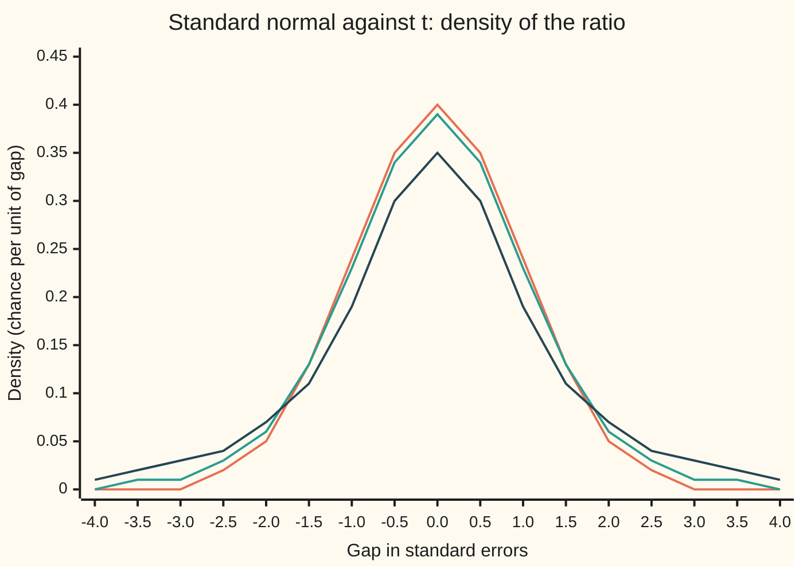
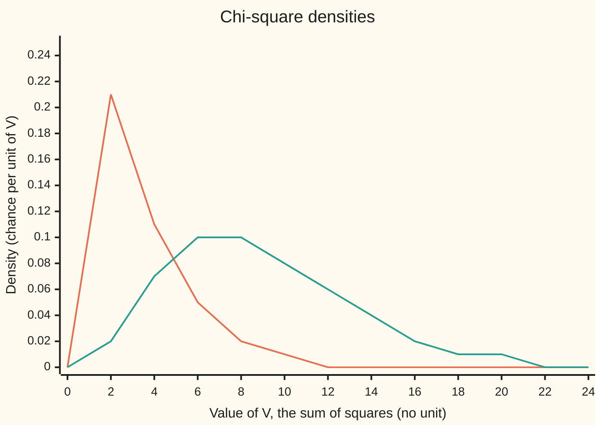

# The reference distributions: chi-square, t and F, and where each comes from

[Syllabus](../../../SYLLABUS.md) → [Probability and statistics](../../../SYLLABUS.md#w09) → [Sampling and Estimation](../../../SYLLABUS.md#w09-s07) → The reference distributions

---

## General Overview

A machine fills bags of flour labelled 500 grams. An inspector pulls ten bags off the line and weighs them: 507, 498, 505, 500, 503, 502, 501, 497, 505 and 502 grams. The average is 502. Is the machine overfilling, or are two extra grams the luck of ten bags?

If the machine's spread were known, the answer would come from the standard error ([Standard error](02-sample-mean-and-standard-error.md)). Nobody knows it. The same ten bags must supply the spread as well as the average. Their sample standard deviation is 3.162 grams, so the standard error is 3.162/√10 = 1.000 gram, and the average sits 2.000 standard errors above the label.

Read 2.000 against the normal curve and a gap that large, either way, turns up 4.55 percent of the time when the label is right. That treats 3.162 as the true spread. It is a guess from ten bags, and a guess that comes out low makes every gap look big. The honest reference is **Student's t distribution with 9 degrees of freedom** (ten bags, less one used up by the average): 7.66 percent, about 1 time in 13.

Three laws do this work. The **chi-square** law describes a sum of squared standard normals, and so how a sample's spread scatters. The **t** law describes a standard normal divided by an estimated spread. The **F** law describes a ratio of two estimated spreads, as when a second machine's bags are weighed too. They are called **reference distributions**: the laws a statistic is read against.

**Square independent standard normals and add them: that is chi-square; divide a standard normal by the square root of an independent chi-square per degree of freedom: that is t; divide two independent chi-squares, each per degree of freedom: that is F. For a normal sample, the sample's own statistics follow these laws exactly, with the unknown spread cancelled.**

**What kind of fact this is:** three definitions, one law per construction; that each law has the density shown, and that a normal sample's statistics follow these laws, are theorems proved on this card in Why it works.

### The picture: an estimated spread fattens the tails



Orange: the standard normal, right when the spread is known. Green: t with 9 degrees of freedom, right for ten bags whose spread is estimated. Dark blue: t with 2 degrees of freedom, three bags. Beyond 2 standard errors either way the green curve holds 0.0766 of the chance and the orange 0.0455: the fewer the bags, the heavier the tails.

---

## The formula

Notation first, in words. $Z$ is a standard normal, N(0, 1). Several of them, Z_1 to Z_k, are independent. The Greek letter chi is written χ and read "kai". $\chi^2_k$ is read "chi-square with k degrees of freedom", and $\nu$ (nu) is the usual letter for a count of degrees of freedom. Γ is the gamma integral of [Gamma and beta](../04-Continuous%20Distributions/07-gamma-and-beta-distributions.md), with Γ(1/2) = √π.

**Chi-square: a sum of squares.**

$$V = Z_1^2 + Z_2^2 + \dots + Z_k^2 \sim \chi^2_k, \qquad f_V(v) = \frac{v^{k/2-1}\,e^{-v/2}}{2^{k/2}\,\Gamma(k/2)} \ (v > 0), \qquad E[V] = k, \quad \mathrm{Var}(V) = 2k$$

**Read it aloud:** add k independent squared standard normals; the total follows the gamma law with shape k/2 and rate 1/2, averaging k.

**t: a normal over an estimated spread.** With $V \sim \chi^2_\nu$ independent of $Z$:

$$T = \frac{Z}{\sqrt{V/\nu}} \sim t_\nu, \qquad f_T(t) = \frac{\Gamma\big(\tfrac{\nu+1}{2}\big)}{\sqrt{\nu\pi}\;\Gamma\big(\tfrac{\nu}{2}\big)} \left(1 + \frac{t^2}{\nu}\right)^{-(\nu+1)/2}, \qquad \mathrm{Var}(T) = \frac{\nu}{\nu - 2} \ (\nu > 2)$$

**Read it aloud:** divide a standard normal by the square root of a chi-square's average per degree of freedom; the result is bell-shaped, but its tails fall off as a power of t, not as e to the minus t squared over 2.

**F: a ratio of two spreads.** With $U \sim \chi^2_{\nu_1}$ and $V \sim \chi^2_{\nu_2}$ independent, and $c = \nu_1/\nu_2$:

$$F = \frac{U/\nu_1}{V/\nu_2} \sim F(\nu_1, \nu_2), \qquad f_F(x) = \frac{\Gamma\big(\tfrac{\nu_1+\nu_2}{2}\big)\, c^{\nu_1/2}\, x^{\nu_1/2-1}}{\Gamma\big(\tfrac{\nu_1}{2}\big)\Gamma\big(\tfrac{\nu_2}{2}\big)\,(1 + c x)^{(\nu_1+\nu_2)/2}} \ (x > 0), \qquad E[F] = \frac{\nu_2}{\nu_2 - 2} \ (\nu_2 > 2)$$

**Read it aloud:** divide one chi-square per degree of freedom by another; the order matters, numerator first.

**What a normal sample gives.** Take $n$ independent measurements, X_1 to X_n, from N(μ, σ^2). Their average is $\bar X$. A residual is one measurement's gap from the average. Their sample variance, $S^2$, is the squared residuals added and divided by n − 1; $S$ is its square root. For two machines, a subscript 1 or 2 marks the sample: sizes $n_1$ and $n_2$, sample variances $S_1^2$ and $S_2^2$, and true standard deviations $\sigma_1$ and $\sigma_2$.

$$\frac{(n-1)\,S^2}{\sigma^2} \sim \chi^2_{n-1}, \qquad \frac{\bar X - \mu}{S/\sqrt{n}} \sim t_{n-1}, \qquad \frac{S_1^2/\sigma_1^2}{S_2^2/\sigma_2^2} \sim F(n_1 - 1,\, n_2 - 1)$$

**Read it aloud:** the scaled sample variance is chi-square with one degree of freedom fewer than the sample size; the gap between average and true mean, in estimated standard errors, is t with the same count; and two independent samples' variances, each divided by its true variance, give an F ratio.

| Symbol | Plain meaning | In our example | Push it up and the answer… |
| --- | --- | --- | --- |
| $n$, $n_1$, $n_2$ | number of measurements; $n_1$ and $n_2$ for the two machines | 10 bags (7 from the second machine) | S wobbles less; t moves towards the normal |
| $X_i$, $\bar X$ | one bag's weight; the average of the sample | 507 g; 502 g | a larger gap to explain |
| $\mu$ | the machine's true average | 500 g if the label is right | — |
| $\sigma$, $\sigma_1$, $\sigma_2$ | the machine's true standard deviation; one per machine in the F ratio | unknown; 3 g put to the test | wider scatter of every statistic |
| $S$, $S_1$, $S_2$ | the sample standard deviation, with n − 1; one per machine | 3.162 g, so S^2 = 10; the second machine's S_2^2 = 4 | the t ratio shrinks |
| $Z$, $Z_i$ | independent standard normals | the bags' errors divided by σ | — |
| $k$, $\nu$ | degrees of freedom: independent squares in a chi-square | 9 = 10 − 1 | tails thin towards the normal |
| $V$, $U$ | chi-square variables | V = 9 S^2/3^2 = 10.000 | — |
| $T$ | the t ratio | 2.000 | stronger evidence against the label |
| $F$, $c$ | the F ratio, and the degrees-of-freedom ratio in its density | 10/4 = 2.500 on (9, 6); c = 1.5 | the first spread looks larger |
| $f_V$, $f_T$, $f_F$ | densities: chance per unit of the statistic | f_T peaks at 0.39 | — |
| $\Gamma$ | the gamma integral, each law's constant | Γ(1/2) = 1.772454 | — |
| $\Phi$, $\varphi$ | the standard normal's cumulative area, and its density | 2(1 − Φ(2)) = 0.0455; φ(0) = 0.40 | — |
| $W_i$, $B$, $a$, $b$, $\beta$, $u$, $\theta$, $s$ | proof-only letters: the rotated standard normals (Step 3); two gamma shapes $a$, $b$ and their total $u$ (Step 2); the beta share U/(U + V), with parameters $a = \nu_1/2$ and $\beta = \nu_2/2$ and value b (Step 5); the angle in the t-tail tip; the generating function's argument (Step 2) | a = 9/2 and β = 6/2 for F(9, 6) | — |

### The picture: the chi-square law of a sample's spread



Orange: 3 degrees of freedom, four bags. Green: 9 degrees of freedom, the ten bags, averaging 9 with a long right tail. The bags' own value, 10.000, sits just right of the green hump.

### When it holds

- **Independent measurements.** Bags filled one after another by a drifting machine are not independent; the residuals then share a trend and S understates the spread.
- **A normal population.** The chi-square law of S^2 is fragile. With skewed bags of the same mean and spread, a one-sided 5 percent chi-square test of σ = 3 rejects 12.03 percent of the time in simulation (standard error 0.10). The t ratio recovers as the bags grow in number, because their average tends to normal, but at ten skewed bags a 5 percent two-sided t test on the label still rejects 9.98 percent of the time (standard error 0.09); the chi-square test does not recover as the bags grow in number.
- **The right count of degrees of freedom.** Estimating the mean from the same bags uses one up: n − 1, not n. Reading 9 degrees as 10 turns a chance of 0.3505 into 0.4405.
- **For F, two independent normal samples.** A ratio of two spreads from the same bags, or from paired bags, has no F law.
- **A positive spread and at least two bags.** With one bag, n − 1 = 0 and S is undefined; with σ = 0 there is nothing to divide by.

---

## Why it works

### Step 0: divide out what is unknown

Every bag's error is σ times a standard normal. A ratio with σ once on top and once underneath loses it, so its law can be worked out once, for all machines. The unknown numbers cancel; only counts remain.

### Step 1: one squared normal is gamma with shape 1/2

$Z^2$ is at most v exactly when Z lies between −√v and √v. Both signs land on the same square, so both halves count:

$$P(Z^2 \le v) = \Phi(\sqrt v) - \Phi(-\sqrt v) = 2\,\Phi(\sqrt v) - 1.$$

Here Φ is the standard normal's cumulative area ([Normal](../04-Continuous%20Distributions/04-normal-distribution.md)). Differentiating, by the chain rule of [Transforming a variable](../05-Transformations%20and%20Joint%20Laws/01-transforming-a-random-variable.md):

$$f_{Z^2}(v) = 2\,\varphi(\sqrt v)\cdot\frac{1}{2\sqrt v} = \frac{v^{-1/2}\,e^{-v/2}}{\sqrt{2\pi}}.$$

Here φ is the normal density. This is the gamma density with shape 1/2 and rate 1/2, since 2^(1/2)Γ(1/2) = √2 · √π = √(2π). One squared normal has mean 1 and variance 2: shape over rate, and shape over rate squared.

### Step 2: independent squares add their shapes

Two independent gamma variables at the same rate add to a gamma variable whose shape is the sum of the two shapes. The proof is in the gamma card's Step 4, at rate 1: the joint density of shapes a and b splits into a part in the total u and a part in the share, and the total's part, u^(a+b−1)e^(−u)/Γ(a + b), is the gamma density with shape a + b. Nothing there needs whole-number shapes, and a change of units moves the rate without touching the shapes, so it covers squares of shape 1/2 at rate 1/2. Adding k squared normals, each of shape 1/2, gives shape k/2 at rate 1/2. That is the chi-square density in The formula. Averages and variances add: mean k, variance 2k. For 9 degrees of freedom: mean 9, variance 18.

A second road: the moment generating function of one square is (1 − 2s)^(−1/2) for s below 1/2, where s is the function's argument. Independent terms multiply their generating functions, giving (1 − 2s)^(−k/2), the gamma law's own ([Moment generating functions](../02-Random%20Variables/07-moment-generating-functions.md)).

### Step 3: a normal sample's spread is chi-square with n − 1

Write each bag as μ + σZ_i. Then the residual X_i − X̄ is σ(Z_i − Z̄): μ is gone, and dividing the squared residuals by σ^2 removes σ. What is left, the sum of (Z_i − Z̄)^2, is a sum of n squares. Only n − 1 of them are free, because residuals always add to zero: the last is fixed by the others. The proof below turns that count into a law.

<details>
<summary>Detailed proof: the rotation that splits off the mean</summary>

The joint density of $Z_1, \dots, Z_n$ is $(2\pi)^{-n/2} e^{-(z_1^2 + \dots + z_n^2)/2}$. It depends only on the point's distance from the origin. A rotation keeps distances and volumes, so rotated coordinates $W_1, \dots, W_n$ have the same density: independent standard normals again ([Multivariate normal](../05-Transformations%20and%20Joint%20Laws/06-multivariate-normal.md)).

Choose the rotation whose first new axis points along `(1, 1, ..., 1)/√n`. Then $W_1 = (Z_1 + \dots + Z_n)/\sqrt n = \sqrt n\,\bar Z$. Distances are kept, so
$$Z_1^2 + \dots + Z_n^2 = W_1^2 + W_2^2 + \dots + W_n^2.$$
Expanding the squares also gives $\sum Z_i^2 = \sum (Z_i - \bar Z)^2 + n\bar Z^2$, and $n\bar Z^2 = W_1^2$. Subtracting,
$$\frac{(n-1)S^2}{\sigma^2} = \sum_{i=1}^n (Z_i - \bar Z)^2 = W_2^2 + \dots + W_n^2.$$
That is n − 1 independent squared standard normals: $\chi^2_{n-1}$ by Step 2. It uses only $W_2, \dots, W_n$, while the average uses only W_1. So for a normal sample the average and the sample variance are **independent**, the fact Step 4 needs. Non-normal samples lose it: the rotation argument used the density's dependence on distance alone.

</details>

For the ten bags, test the claim σ = 3. The statistic is V = 9 × 10 / 9 = 10.000, on 9 degrees of freedom. A value above 10 occurs with chance 0.3505, about 1 time in 3: the bags' spread is ordinary for σ = 3. The middle 95 percent of the chi-square law with 9 degrees runs from 2.700 to 19.023. Since σ^2/9 = 1 here, S^2 itself lands between 2.700 and 19.023 in 95 of 100 samples of ten bags. A sample variance of ten bags is a rough instrument.

### Step 4: t is a normal over an independent estimated spread

The standardised gap with σ known is Z = (X̄ − μ)/(σ/√n), a standard normal. Replace σ by S and divide top and bottom by σ:

$$\frac{\bar X - \mu}{S/\sqrt n} = \frac{(\bar X - \mu)/(\sigma/\sqrt n)}{\sqrt{S^2/\sigma^2}} = \frac{Z}{\sqrt{V/(n-1)}}, \qquad V = \frac{(n-1)S^2}{\sigma^2}.$$

σ cancels. The top is a standard normal. The bottom is the square root of a chi-square per degree of freedom, and Step 3 made it independent of the top. That is the t construction with ν = n − 1.

Why the tails are heavier: V/ν averages 1, but in some samples it is small, and a small denominator throws the ratio far out. V/ν has variance 2/ν, so as ν grows it settles at 1 ([Law of large numbers](../06-Limit%20Theorems%20in%20Practice/01-law-of-large-numbers.md)) and t becomes the normal. At ν = 1 the denominator is |Z'| for a second normal Z', and t is the Cauchy law of [Heavy tails](../04-Continuous%20Distributions/08-heavy-tails-pareto-and-cauchy.md): a gap beyond 2 has chance 0.2952 there.

The variance: E[T^2] = ν · E[Z^2] · E[1/V], and the gamma integral gives E[1/V] = 1/(ν − 2). For ten bags, 9/7 = 1.2857. Below three degrees of freedom the variance is infinite.

<details>
<summary>Detailed proof: the t density</summary>

Hold V at a value v. Then T = Z / √(v/ν) is normal with standard deviation √(ν/v), density $\sqrt{v/\nu}\,\varphi(t\sqrt{v/\nu})$. Average over v with the chi-square density:
$$f_T(t) = \int_0^\infty \sqrt{\tfrac{v}{\nu}}\,\frac{e^{-t^2 v/(2\nu)}}{\sqrt{2\pi}} \cdot \frac{v^{\nu/2-1} e^{-v/2}}{2^{\nu/2}\Gamma(\nu/2)}\,dv = \frac{1}{\sqrt{2\pi\nu}\;2^{\nu/2}\,\Gamma(\nu/2)} \int_0^\infty v^{\frac{\nu+1}{2}-1} e^{-v\,(1 + t^2/\nu)/2}\,dv.$$
The gamma integral $\int_0^\infty v^{a-1}e^{-bv}\,dv = \Gamma(a)/b^a$ with $a = (\nu+1)/2$ and $b = (1 + t^2/\nu)/2$ gives $\Gamma(\frac{\nu+1}{2})\,2^{(\nu+1)/2}(1 + t^2/\nu)^{-(\nu+1)/2}$. The powers of 2 reduce to $\sqrt2$, and $\sqrt2/\sqrt{2\pi\nu} = 1/\sqrt{\nu\pi}$, which is the density in The formula. Averaging a density over v uses independence: the law of Z is the same whatever V turned out to be.

</details>

<details>
<summary>Why the code can write the t tail as a finite sum</summary>

Put $t = \sqrt\nu\,\tan\theta$. Then $1 + t^2/\nu = 1/\cos^2\theta$ and the density times dt becomes a constant times $\cos^{\nu-1}\theta\,d\theta$. At ν = 1 that is flat in θ, so $P(|T| < t) = 2\theta/\pi$, the Cauchy law. For odd ν the power of cosine is even, and repeated integration by parts gives θ plus sin θ times a finite sum of odd powers of cos θ, with weights 1, 2/3, 8/15 and so on. The check uses that sum for ν = 9.

</details>

### Step 5: F is a ratio, and a beta variable in disguise

Weigh seven bags from a second machine, 503, 498, 501, 498, 502, 499 and 499 grams: average 500, sample variance 4 grams squared. If both machines share one σ, the ratio of the two sample variances is

$$\frac{S_1^2}{S_2^2} = \frac{\big(9 S_1^2/\sigma^2\big)/9}{\big(6 S_2^2/\sigma^2\big)/6} = \frac{U/9}{V/6},$$

with U and V independent chi-squares on 9 and 6 degrees: the F construction, F(9, 6). The σ cancels again. Here the ratio is 10/4 = 2.500, and a ratio at least that large turns up with chance 0.1385 when the spreads are equal: about 1 time in 7.

The share U/(U + V) of two independent gamma variables at one rate follows the beta law with parameters ν1/2 and ν2/2: the gamma card's Step 4. Since cF = U/V, that share equals cF/(1 + cF). So every F tail is a beta tail, which is how the check computes 0.1385.

<details>
<summary>Detailed proof: the F density from the beta share</summary>

Let B = U/(U + V), with density $b^{a-1}(1-b)^{\beta-1}\Gamma(a+\beta)/(\Gamma(a)\Gamma(\beta))$, where a = ν1/2 and β = ν2/2. Then cF = B/(1 − B), so B = cx/(1 + cx) when F = x, and 1 − B = 1/(1 + cx). The stretch factor is dB/dx = c/(1 + cx)^2. Multiplying,
$$f_F(x) = \frac{\Gamma(a+\beta)}{\Gamma(a)\Gamma(\beta)} \cdot \frac{(cx)^{a-1}}{(1+cx)^{a-1}} \cdot \frac{1}{(1+cx)^{\beta-1}} \cdot \frac{c}{(1+cx)^2} = \frac{\Gamma(a+\beta)\,c^{a}\,x^{a-1}}{\Gamma(a)\Gamma(\beta)\,(1+cx)^{a+\beta}}.$$
The mean: E[F] = (ν2/ν1) E[U] E[1/V] = (ν2/ν1) · ν1 · 1/(ν2 − 2) = ν2/(ν2 − 2), which is 6/4 = 1.5000 for (9, 6). Swapping the two samples gives 1/F, which is F(ν2, ν1).

</details>

Two links close the family. A squared standard normal is chi-square with 1 degree, so T^2 = Z^2/(V/ν) is F(1, ν): a two-sided t question is a one-sided F question. And ν1 F(ν1, ν2) becomes chi-square on ν1 as ν2 grows, since the denominator settles at 1.

The same laws can be reached with no density at all: draw normal samples, compute the statistics, and count, as the check does. [Bootstrap](08-bootstrap.md) runs that idea on the data themselves when no normal model is trusted.

---

## Worked numbers, by hand

**Is the label right?** Ten bags, spread unknown.

| Step | Arithmetic | Value |
| --- | --- | --- |
| average | the ten weights added, over 10 | 502 g |
| residuals from 502 | 5, −4, 3, −2, 1, 0, −1, −5, 3, 0 | they add to 0 |
| squared residuals | 25 + 16 + 9 + 4 + 1 + 0 + 1 + 25 + 9 + 0 | 90 |
| sample variance | 90 / (10 − 1) | S^2 = 10.000 |
| sample standard deviation | √10 | 3.162 g |
| estimated standard error | 3.162 / √10 | 1.000 g |
| t ratio | (502 − 500) / 1.000 | **2.000** on 9 degrees |
| 5 percent two-sided cutoff | t with 9 degrees | 2.262 (normal: 1.960) |
| chance of a gap this large | t tail, both sides | **0.0766** |

If the label were right, ten bags would sit 2 or more standard errors from 500 about 1 time in 13. That is not rare enough to condemn the machine at the 5 percent level, since 2.000 falls short of 2.262. The 0.0766 is a p-value: the chance of a gap this large if the label is right. It is not the chance that the label is right.

**Is the spread σ = 3?** V = 9 × 10 / 9 = **10.000** on 9 degrees; chance of a value above 10: **0.3505**. **Do two machines differ in spread?** The seven bags sit 3, −2, 1, −2, 2, −1 and −1 grams from their average of 500; the squares add to 9 + 4 + 1 + 4 + 4 + 1 + 1 = 24, so S^2 = 24 / 6 = 4.000. F = 10 / 4 = **2.500** on (9, 6); chance of 2.5 or more with equal spreads: **0.1385**, and the 5 percent cutoff is 4.099.

### What breaks if you drop a piece

| Mistake | Comes out at | What went wrong |
| --- | --- | --- |
| Normal cutoff 1.96 with an estimated spread | a correct label rejected 8.16 percent of the time, not 5 | S was treated as σ; its wobble fattens the tails |
| 10 degrees of freedom for the chi-square | P(V > 10) = 0.4405, not 0.3505 | fitting the average uses one degree up |
| F read on (6, 9) for (9, 6) | P(F > 2.5) = 0.1047, not 0.1385 | numerator degrees come first |
| Skewed bags, same mean and spread | a 5 percent chi-square test on σ = 3 rejects 12.03 percent | the chi-square law of S^2 needs normal data |

The first and last rows are hypotheses dropped; the code prints all four, the first and last also by simulation.

---

## Code, from first principles, and it actually runs

Nothing imported contains the answer: no statistics module, no random module, no gamma function. Three roads reach each tail chance. The closed forms use a series for the normal curve, finite sums for chi-square and odd-degree t, and the beta sum for F. Simpson's rule integrates the densities. A simulation weighs 100,000 rounds of ten bags plus seven from normal machines, drawing from a SplitMix64 generator (a small, written-out source of random bits, seed 20260928) through the Box-Muller recipe, which turns two uniform draws into two independent normals. It computes S^2, the t ratio and the variance ratio from the weights, never from a formula for their laws. Estimates carry standard errors; the asserts compare different roads.

### Python

```python
# The reference distributions -- the check behind the card.  Nothing imported holds the answer.
# Ten bags from a filling machine labelled 500 g, spread unknown; seven bags from a second machine.
# Roads: closed forms (a normal series, finite sums for chi-square, t and F); Simpson's rule on the
# densities; a seeded simulation that weighs whole samples and never uses a chi-square, t or F formula.
from math import exp, log, sqrt, pi, atan, sin, cos

A = [507, 498, 505, 500, 503, 502, 501, 497, 505, 502]   # machine one, grams
B = [503, 498, 501, 498, 502, 499, 499]                  # machine two, grams
LABEL, SIGMA = 500.0, 3.0                                # the label; a spread to test against

def summary(xs):                             # size, mean, sample variance with n - 1
    m = sum(xs) / len(xs)
    return len(xs), m, sum((x - m) ** 2 for x in xs) / (len(xs) - 1)
def phi(x):                                  # the standard normal density
    return exp(-x * x / 2) / sqrt(2 * pi)
def Phi(x):                                  # 1/2 + phi(x) (x + x^3/3 + x^5/15 + ...)
    term = s = x
    for j in range(1, 200):
        term *= x * x / (2 * j + 1)
        s += term
    return 0.5 + phi(x) * s
def gam(h2):                                 # Gamma(h2 / 2), for a whole number h2 >= 1
    g, h = (sqrt(pi), 0.5) if h2 % 2 else (1.0, 1.0)
    while h < h2 / 2:
        g, h = g * h, h + 1
    return g
def chi_d(x, k):                             # chi-square density: Gamma(k/2, rate 1/2)
    return x ** (k / 2 - 1) * exp(-x / 2) / (2 ** (k / 2) * gam(k))
def t_d(t, v):
    return gam(v + 1) / (sqrt(v * pi) * gam(v)) * (1 + t * t / v) ** (-(v + 1) / 2)
def f_d(x, v1, v2):                          # F density, with c = v1 / v2
    return gam(v1 + v2) / (gam(v1) * gam(v2)) * (v1 / v2) ** (v1 / 2) * x ** (v1 / 2 - 1) * (1 + v1 * x / v2) ** (-(v1 + v2) / 2)
def chi_tail(x, k):                          # P(V > x): Poisson sum (even k), normal road (odd k)
    if k % 2 == 0:
        term = s = 1.0
        for j in range(1, k // 2):
            term *= x / 2 / j
            s += term
        return exp(-x / 2) * s
    term, s = sqrt(x), 0.0
    for r in range(1, (k - 1) // 2 + 1):
        s += term
        term *= x / (2 * r + 1)
    return 2 * (1 - Phi(sqrt(x))) + 2 * phi(sqrt(x)) * s
def t_tail2(t, v):                           # P(|T| > t), odd v, through the angle atan(t / sqrt v)
    th = atan(t / sqrt(v))
    c, w, s = cos(th), 1.0, 0.0
    for j in range((v - 1) // 2):
        s += w * c ** (2 * j + 1)
        w *= (2 * j + 2) / (2 * j + 3)
    return 1 - 2 / pi * (th + sin(th) * s)
def beta_cdf(y, a, b):                       # needs a whole number a or b
    if b != int(b):
        return 1 - beta_cdf(1 - y, b, a)
    term = s = 1.0
    for j in range(1, int(b)):
        term *= (a + j - 1) / j * (1 - y)
        s += term
    return y ** a * s
def f_tail(x, v1, v2):                       # P(F > x), through the beta variable cF / (1 + cF)
    return 1 - beta_cdf(v1 * x / (v2 + v1 * x), v1 / 2, v2 / 2)
def simpson(g, lo, hi, n=4000):
    h = (hi - lo) / n
    return h / 3 * sum((1 if i in (0, n) else 4 if i % 2 else 2) * g(lo + i * h) for i in range(n + 1))
def bisect(g, target, lo, hi):               # g decreasing
    for _ in range(100):
        mid = (lo + hi) / 2
        lo, hi = (mid, hi) if g(mid) > target else (lo, mid)
    return (lo + hi) / 2
MASK, state = (1 << 64) - 1, 20260928        # SplitMix64, seed 20260928
def uniform():
    global state
    state = (state + 0x9E3779B97F4A7C15) & MASK
    z = ((state ^ (state >> 30)) * 0xBF58476D1CE4E5B9) & MASK
    z = ((z ^ (z >> 27)) * 0x94D049BB133111EB) & MASK
    return (((z ^ (z >> 31)) >> 11) + 0.5) / 2.0 ** 53
def normals(k):                              # Box-Muller, two at a time
    out = []
    while len(out) < k:
        r, a = sqrt(-2 * log(uniform())), 2 * pi * uniform()
        out += [r * cos(a), r * sin(a)]
    return out[:k]

n, m, s2 = summary(A)
nb, mb, s2b = summary(B)
se = sqrt(s2 / n)
t_obs, q_obs, f_obs = (m - LABEL) / se, (n - 1) * s2 / SIGMA ** 2, s2 / s2b
print(f"machine one: n {n}, mean {m:.3f}, squared residuals {s2 * (n - 1):.1f}, S^2 {s2:.3f}, S {sqrt(s2):.3f}, S/sqrt(n) {se:.3f}")
print(f"machine two: n {nb}, mean {mb:.3f}, squared residuals {s2b * (nb - 1):.1f}, S^2 {s2b:.3f}")
print(f"observed: t {t_obs:.3f} on 9; V = 9 S^2/3^2 {q_obs:.3f} on 9; F = S1^2/S2^2 {f_obs:.3f} on (9, 6)")
p_t, p_q, p_f = t_tail2(t_obs, 9), chi_tail(q_obs, 9), f_tail(f_obs, 9, 6)
s_t = 1 - 2 * simpson(lambda x: t_d(x, 9), 0.0, t_obs)
s_q = 1 - simpson(lambda x: chi_d(x, 9), 0.0, q_obs)
s_f = 1 - simpson(lambda x: f_d(x, 9, 6), 0.0, f_obs)
print(f"P(|T| > 2) on 9: closed form {p_t:.4f}; Simpson {s_t:.4f}; normal instead {2 * (1 - Phi(2.0)):.4f}")
print(f"P(V > 10) on 9: closed form {p_q:.4f}; Simpson {s_q:.4f}. P(F > 2.5) on (9, 6): beta sum {p_f:.4f}; Simpson {s_f:.4f}")
print(f"Gamma(1/2) {gam(1):.6f}; Gamma(9/2) {gam(9):.6f}; area under t on 9 {2 * simpson(lambda x: t_d(x, 9), 0.0, 60.0):.6f}")
q_t = bisect(lambda x: t_tail2(x, 9), 0.05, 0.0, 20.0)
q_lo, q_hi = bisect(lambda x: chi_tail(x, 9), 0.975, 0.0, 60.0), bisect(lambda x: chi_tail(x, 9), 0.025, 0.0, 60.0)
q_95, f_95 = bisect(lambda x: chi_tail(x, 9), 0.05, 0.0, 60.0), bisect(lambda x: f_tail(x, 9, 6), 0.05, 0.0, 60.0)
print(f"cutoffs: t on 9, 2.5% each side {q_t:.3f}; normal {bisect(lambda x: 2 * (1 - Phi(x)), 0.05, 0.0, 10.0):.3f}")
print(f"cutoffs: chi-square 9, middle 95% {q_lo:.3f} to {q_hi:.3f}, top 5% {q_95:.3f}; F (9, 6) top 5% {f_95:.3f}")
print(f"P(|T| > 1.96): t on 9 {t_tail2(1.96, 9):.4f}; t on 1 (Cauchy) P(|T| > 2) {t_tail2(2.0, 1):.4f}")
N = 100_000
c_t = c_z = c_q = c_f = c_sk = c_st = 0
sq = sq2 = st2 = st4 = sf = sf2 = 0.0
for _ in range(N):
    _, ma, va = summary([LABEL + SIGMA * z for z in normals(10)])
    _, _, vb = summary([LABEL + SIGMA * z for z in normals(7)])
    _, me, ve = summary([LABEL - SIGMA - SIGMA * log(uniform()) for _ in range(10)])
    t, q, f = (ma - LABEL) / sqrt(va / 10), 9 * va / SIGMA ** 2, va / vb
    c_t, c_z, c_q, c_f = c_t + (abs(t) > 2), c_z + (abs(t) > 1.96), c_q + (q > 10), c_f + (f > 2.5)
    c_sk, c_st = c_sk + (9 * ve / SIGMA ** 2 > q_95), c_st + (abs((me - LABEL) / sqrt(ve / 10)) > q_t)
    sq, sq2, st2, st4, sf, sf2 = sq + q, sq2 + q * q, st2 + t * t, st4 + t ** 4, sf + f, sf2 + f * f
est = lambda c: (c / N, sqrt(c / N * (1 - c / N) / N))   # a share and its standard error
(r_t, e_t), (r_z, e_z), (r_q, e_q), (r_f, e_f), (r_sk, e_sk), (r_st, e_st) = map(est, (c_t, c_z, c_q, c_f, c_sk, c_st))
mq, vq = sq / N, sq2 / N - (sq / N) ** 2
mt2, et2, mf, ef = st2 / N, sqrt((st4 / N - (st2 / N) ** 2) / N), sf / N, sqrt((sf2 / N - (sf / N) ** 2) / N)
print(f"simulated {N} rounds of 10 + 7 bags, true mean 500, sigma 3, seed 20260928; estimate (standard error)")
print(f"  P(|T| > 2) {r_t:.4f} ({e_t:.4f}); P(V > 10) {r_q:.4f} ({e_q:.4f}); P(F > 2.5) {r_f:.4f} ({e_f:.4f})")
print(f"  V: mean {mq:.3f} ({sqrt(vq / N):.3f}), variance {vq:.3f}; T: mean square {mt2:.4f} ({et2:.4f}), formula 9/7 = {9 / 7:.4f}; F: mean {mf:.4f} ({ef:.4f}), formula 6/4 = {6 / 4:.4f}")
print(f"mistake, cutoff 1.96 with an estimated spread: true label rejected {r_z:.4f} ({e_z:.4f}), closed form {t_tail2(1.96, 9):.4f}")
print(f"mistake, 10 degrees of freedom for 9: P(V > 10) {chi_tail(10.0, 10):.4f}, not {p_q:.4f}")
print(f"mistake, F read on (6, 9) for (9, 6): P(F > 2.5) {f_tail(2.5, 6, 9):.4f}, not {p_f:.4f}")
print(f"mistake, skewed bags (exponential, same mean and sd): 5% chi-square test rejects {r_sk:.4f} ({e_sk:.4f}); 5% t test {r_st:.4f} ({e_st:.4f})")
xs = [0.5 * i for i in range(-8, 9)]
print("figure, t: " + ", ".join(f"{x:.1f}" for x in xs))
print("figure, normal: " + ", ".join(f"{phi(x):.2f}" for x in xs))
print("figure, t on 9: " + ", ".join(f"{t_d(x, 9):.2f}" for x in xs))
print("figure, t on 2: " + ", ".join(f"{t_d(x, 2):.2f}" for x in xs))
vs = [2.0 * i for i in range(13)]
print("figure, v: " + ", ".join(f"{v:.0f}" for v in vs))
for k in (3, 9):
    print(f"figure, chi-square {k}: " + ", ".join(f"{chi_d(v, k):.2f}" for v in vs))
assert abs(p_t - s_t) < 1e-9 and abs(p_q - s_q) < 1e-9 and abs(p_f - s_f) < 1e-9   # closed forms against Simpson
assert abs(chi_tail(10.0, 10) - (1 - simpson(lambda x: chi_d(x, 10), 0.0, 10.0))) < 1e-9 and abs(f_tail(2.5, 6, 9) - (1 - simpson(lambda x: f_d(x, 6, 9), 0.0, 2.5))) < 1e-9
assert abs(r_t - p_t) < 4 * e_t and abs(r_q - p_q) < 4 * e_q and abs(r_f - p_f) < 4 * e_f
assert abs(mq - 9) < 4 * sqrt(vq / N) and abs(vq - 18) < 0.42   # nine squares: mean 9, variance 18 (SE 0.104)
assert abs(r_z - t_tail2(1.96, 9)) < 4 * e_z and abs(mt2 - 9 / 7) < 4 * et2 and abs(mf - 1.5) < 4 * ef and r_sk - 0.05 > 4 * e_sk and r_st - 0.05 > 4 * e_st
print("ALL CHECKS PASS")
```

**Ran 2026-10-06 on macOS, Python 3.14.6, standard library only. All checks passed. Output, pasted from the run:**

```
machine one: n 10, mean 502.000, squared residuals 90.0, S^2 10.000, S 3.162, S/sqrt(n) 1.000
machine two: n 7, mean 500.000, squared residuals 24.0, S^2 4.000
observed: t 2.000 on 9; V = 9 S^2/3^2 10.000 on 9; F = S1^2/S2^2 2.500 on (9, 6)
P(|T| > 2) on 9: closed form 0.0766; Simpson 0.0766; normal instead 0.0455
P(V > 10) on 9: closed form 0.3505; Simpson 0.3505. P(F > 2.5) on (9, 6): beta sum 0.1385; Simpson 0.1385
Gamma(1/2) 1.772454; Gamma(9/2) 11.631728; area under t on 9 1.000000
cutoffs: t on 9, 2.5% each side 2.262; normal 1.960
cutoffs: chi-square 9, middle 95% 2.700 to 19.023, top 5% 16.919; F (9, 6) top 5% 4.099
P(|T| > 1.96): t on 9 0.0816; t on 1 (Cauchy) P(|T| > 2) 0.2952
simulated 100000 rounds of 10 + 7 bags, true mean 500, sigma 3, seed 20260928; estimate (standard error)
  P(|T| > 2) 0.0770 (0.0008); P(V > 10) 0.3513 (0.0015); P(F > 2.5) 0.1385 (0.0011)
  V: mean 9.013 (0.013), variance 18.098; T: mean square 1.2956 (0.0075), formula 9/7 = 1.2857; F: mean 1.5024 (0.0057), formula 6/4 = 1.5000
mistake, cutoff 1.96 with an estimated spread: true label rejected 0.0823 (0.0009), closed form 0.0816
mistake, 10 degrees of freedom for 9: P(V > 10) 0.4405, not 0.3505
mistake, F read on (6, 9) for (9, 6): P(F > 2.5) 0.1047, not 0.1385
mistake, skewed bags (exponential, same mean and sd): 5% chi-square test rejects 0.1203 (0.0010); 5% t test 0.0998 (0.0009)
figure, t: -4.0, -3.5, -3.0, -2.5, -2.0, -1.5, -1.0, -0.5, 0.0, 0.5, 1.0, 1.5, 2.0, 2.5, 3.0, 3.5, 4.0
figure, normal: 0.00, 0.00, 0.00, 0.02, 0.05, 0.13, 0.24, 0.35, 0.40, 0.35, 0.24, 0.13, 0.05, 0.02, 0.00, 0.00, 0.00
figure, t on 9: 0.00, 0.01, 0.01, 0.03, 0.06, 0.13, 0.23, 0.34, 0.39, 0.34, 0.23, 0.13, 0.06, 0.03, 0.01, 0.01, 0.00
figure, t on 2: 0.01, 0.02, 0.03, 0.04, 0.07, 0.11, 0.19, 0.30, 0.35, 0.30, 0.19, 0.11, 0.07, 0.04, 0.03, 0.02, 0.01
figure, v: 0, 2, 4, 6, 8, 10, 12, 14, 16, 18, 20, 22, 24
figure, chi-square 3: 0.00, 0.21, 0.11, 0.05, 0.02, 0.01, 0.00, 0.00, 0.00, 0.00, 0.00, 0.00, 0.00
figure, chi-square 9: 0.00, 0.02, 0.07, 0.10, 0.10, 0.08, 0.06, 0.04, 0.02, 0.01, 0.01, 0.00, 0.00
ALL CHECKS PASS
```

### Rust

Same numbers, same labels, built with `rustc --edition 2021 -O`.

```rust
// The reference distributions -- the same check as the Python, in Rust.  No crates.
// Ten bags from a filling machine labelled 500 g, spread unknown; seven bags from a second machine.
// Roads: closed forms (a normal series, finite sums for chi-square, t and F); Simpson's rule on the
// densities; a seeded simulation that weighs whole samples and never uses a chi-square, t or F formula.
use std::f64::consts::PI;

const LABEL: f64 = 500.0;
const SIGMA: f64 = 3.0;

fn summary(xs: &[f64]) -> (usize, f64, f64) {      // size, mean, sample variance with n - 1
    let n = xs.len();
    let m = xs.iter().sum::<f64>() / n as f64;
    (n, m, xs.iter().map(|x| (x - m).powi(2)).sum::<f64>() / (n - 1) as f64)
}
fn phi(x: f64) -> f64 { (-x * x / 2.0).exp() / (2.0 * PI).sqrt() }
fn big_phi(x: f64) -> f64 {                        // 1/2 + phi(x) (x + x^3/3 + x^5/15 + ...)
    let (mut term, mut s) = (x, x);
    for j in 1..200 { term *= x * x / (2 * j + 1) as f64; s += term; }
    0.5 + phi(x) * s
}
fn gam(h2: u32) -> f64 {                           // Gamma(h2 / 2), for a whole number h2 >= 1
    let (mut g, mut h) = if h2 % 2 == 1 { (PI.sqrt(), 0.5) } else { (1.0, 1.0) };
    while h < h2 as f64 / 2.0 { g *= h; h += 1.0; }
    g
}
fn chi_d(x: f64, k: u32) -> f64 {                  // chi-square density: Gamma(k/2, rate 1/2)
    let kf = k as f64;
    x.powf(kf / 2.0 - 1.0) * (-x / 2.0).exp() / (2f64.powf(kf / 2.0) * gam(k))
}
fn t_d(t: f64, v: u32) -> f64 {
    let vf = v as f64;
    gam(v + 1) / ((vf * PI).sqrt() * gam(v)) * (1.0 + t * t / vf).powf(-(vf + 1.0) / 2.0)
}
fn f_d(x: f64, v1: u32, v2: u32) -> f64 {          // F density, with c = v1 / v2
    let (a, b) = (v1 as f64, v2 as f64);
    gam(v1 + v2) / (gam(v1) * gam(v2)) * (a / b).powf(a / 2.0) * x.powf(a / 2.0 - 1.0)
        * (1.0 + a * x / b).powf(-(a + b) / 2.0)
}
fn chi_tail(x: f64, k: u32) -> f64 {               // P(V > x): Poisson sum (even k), normal road (odd k)
    if k % 2 == 0 {
        let (mut term, mut s) = (1.0, 1.0);
        for j in 1..k / 2 { term *= x / 2.0 / j as f64; s += term; }
        return (-x / 2.0).exp() * s;
    }
    let (mut term, mut s) = (x.sqrt(), 0.0);
    for r in 1..=(k - 1) / 2 { s += term; term *= x / (2 * r + 1) as f64; }
    2.0 * (1.0 - big_phi(x.sqrt())) + 2.0 * phi(x.sqrt()) * s
}
fn t_tail2(t: f64, v: u32) -> f64 {                // P(|T| > t), odd v, through the angle atan(t / sqrt v)
    let th = (t / (v as f64).sqrt()).atan();
    let (c, mut w, mut s) = (th.cos(), 1.0, 0.0);
    for j in 0..(v - 1) / 2 { s += w * c.powi(2 * j as i32 + 1); w *= (2 * j + 2) as f64 / (2 * j + 3) as f64; }
    1.0 - 2.0 / PI * (th + th.sin() * s)
}
fn beta_cdf(y: f64, a: f64, b: f64) -> f64 {       // needs a whole number a or b
    if b != b.trunc() { return 1.0 - beta_cdf(1.0 - y, b, a); }
    let (mut term, mut s) = (1.0, 1.0);
    for j in 1..b as u32 { term *= (a + j as f64 - 1.0) / j as f64 * (1.0 - y); s += term; }
    y.powf(a) * s
}
fn f_tail(x: f64, v1: u32, v2: u32) -> f64 {       // P(F > x), through the beta variable cF / (1 + cF)
    let (a, b) = (v1 as f64, v2 as f64);
    1.0 - beta_cdf(a * x / (b + a * x), a / 2.0, b / 2.0)
}
fn simpson(g: &dyn Fn(f64) -> f64, lo: f64, hi: f64) -> f64 {
    let (n, h) = (4000, (hi - lo) / 4000.0);
    h / 3.0 * (0..=n).map(|i| (if i == 0 || i == n { 1.0 } else if i % 2 == 1 { 4.0 } else { 2.0 }) * g(lo + i as f64 * h)).sum::<f64>()
}
fn bisect(g: &dyn Fn(f64) -> f64, target: f64, mut lo: f64, mut hi: f64) -> f64 {   // g decreasing
    for _ in 0..100 {
        let mid = (lo + hi) / 2.0;
        if g(mid) > target { lo = mid } else { hi = mid }
    }
    (lo + hi) / 2.0
}
struct Rng(u64);                                   // SplitMix64, seed 20260928
impl Rng {
    fn uniform(&mut self) -> f64 {
        self.0 = self.0.wrapping_add(0x9E3779B97F4A7C15);
        let mut z = (self.0 ^ (self.0 >> 30)).wrapping_mul(0xBF58476D1CE4E5B9);
        z = (z ^ (z >> 27)).wrapping_mul(0x94D049BB133111EB);
        (((z ^ (z >> 31)) >> 11) as f64 + 0.5) / 2f64.powi(53)
    }
    fn normals(&mut self, k: usize) -> Vec<f64> {  // Box-Muller, two at a time
        let mut out = Vec::new();
        while out.len() < k {
            let r = (-2.0 * self.uniform().ln()).sqrt();
            let a = 2.0 * PI * self.uniform();
            out.push(r * a.cos());
            out.push(r * a.sin());
        }
        out.truncate(k);
        out
    }
}
fn join(xs: &[f64], d: usize) -> String { xs.iter().map(|x| format!("{:.*}", d, x)).collect::<Vec<_>>().join(", ") }

fn main() {
    let a: Vec<f64> = [507, 498, 505, 500, 503, 502, 501, 497, 505, 502].iter().map(|&x| x as f64).collect();
    let b: Vec<f64> = [503, 498, 501, 498, 502, 499, 499].iter().map(|&x| x as f64).collect();
    let ((n, m, s2), (nb, mb, s2b)) = (summary(&a), summary(&b));
    let se = (s2 / n as f64).sqrt();
    let (t_obs, q_obs, f_obs) = ((m - LABEL) / se, (n - 1) as f64 * s2 / SIGMA.powi(2), s2 / s2b);
    println!("machine one: n {}, mean {:.3}, squared residuals {:.1}, S^2 {:.3}, S {:.3}, S/sqrt(n) {:.3}", n, m, s2 * (n - 1) as f64, s2, s2.sqrt(), se);
    println!("machine two: n {}, mean {:.3}, squared residuals {:.1}, S^2 {:.3}", nb, mb, s2b * (nb - 1) as f64, s2b);
    println!("observed: t {:.3} on 9; V = 9 S^2/3^2 {:.3} on 9; F = S1^2/S2^2 {:.3} on (9, 6)", t_obs, q_obs, f_obs);
    let (p_t, p_q, p_f) = (t_tail2(t_obs, 9), chi_tail(q_obs, 9), f_tail(f_obs, 9, 6));
    let s_t = 1.0 - 2.0 * simpson(&|x| t_d(x, 9), 0.0, t_obs);
    let s_q = 1.0 - simpson(&|x| chi_d(x, 9), 0.0, q_obs);
    let s_f = 1.0 - simpson(&|x| f_d(x, 9, 6), 0.0, f_obs);
    println!("P(|T| > 2) on 9: closed form {:.4}; Simpson {:.4}; normal instead {:.4}", p_t, s_t, 2.0 * (1.0 - big_phi(2.0)));
    println!("P(V > 10) on 9: closed form {:.4}; Simpson {:.4}. P(F > 2.5) on (9, 6): beta sum {:.4}; Simpson {:.4}", p_q, s_q, p_f, s_f);
    println!("Gamma(1/2) {:.6}; Gamma(9/2) {:.6}; area under t on 9 {:.6}", gam(1), gam(9), 2.0 * simpson(&|x| t_d(x, 9), 0.0, 60.0));
    let q_t = bisect(&|x| t_tail2(x, 9), 0.05, 0.0, 20.0);
    let (q_lo, q_hi) = (bisect(&|x| chi_tail(x, 9), 0.975, 0.0, 60.0), bisect(&|x| chi_tail(x, 9), 0.025, 0.0, 60.0));
    let (q_95, f_95) = (bisect(&|x| chi_tail(x, 9), 0.05, 0.0, 60.0), bisect(&|x| f_tail(x, 9, 6), 0.05, 0.0, 60.0));
    println!("cutoffs: t on 9, 2.5% each side {:.3}; normal {:.3}", q_t, bisect(&|x| 2.0 * (1.0 - big_phi(x)), 0.05, 0.0, 10.0));
    println!("cutoffs: chi-square 9, middle 95% {:.3} to {:.3}, top 5% {:.3}; F (9, 6) top 5% {:.3}", q_lo, q_hi, q_95, f_95);
    println!("P(|T| > 1.96): t on 9 {:.4}; t on 1 (Cauchy) P(|T| > 2) {:.4}", t_tail2(1.96, 9), t_tail2(2.0, 1));
    let big_n = 100_000;
    let mut rng = Rng(20260928);
    let (mut c_t, mut c_z, mut c_q, mut c_f, mut c_sk, mut c_st) = (0, 0, 0, 0, 0, 0);
    let (mut sq, mut sq2, mut st2, mut st4, mut sf, mut sf2) = (0.0, 0.0, 0.0, 0.0, 0.0, 0.0);
    for _ in 0..big_n {
        let (_, ma, va) = summary(&rng.normals(10).iter().map(|z| LABEL + SIGMA * z).collect::<Vec<_>>());
        let (_, _, vb) = summary(&rng.normals(7).iter().map(|z| LABEL + SIGMA * z).collect::<Vec<_>>());
        let (_, me, ve) = summary(&(0..10).map(|_| LABEL - SIGMA - SIGMA * rng.uniform().ln()).collect::<Vec<_>>());
        let (t, q, f) = ((ma - LABEL) / (va / 10.0).sqrt(), 9.0 * va / SIGMA.powi(2), va / vb);
        c_t += (t.abs() > 2.0) as u32; c_z += (t.abs() > 1.96) as u32; c_q += (q > 10.0) as u32; c_f += (f > 2.5) as u32;
        c_sk += (9.0 * ve / SIGMA.powi(2) > q_95) as u32; c_st += (((me - LABEL) / (ve / 10.0).sqrt()).abs() > q_t) as u32;
        sq += q; sq2 += q * q; st2 += t * t; st4 += t.powi(4); sf += f; sf2 += f * f;
    }
    let nf = big_n as f64;
    let est = |c: u32| (c as f64 / nf, (c as f64 / nf * (1.0 - c as f64 / nf) / nf).sqrt());   // a share and its standard error
    let ((r_t, e_t), (r_z, e_z), (r_q, e_q), (r_f, e_f), (r_sk, e_sk), (r_st, e_st)) = (est(c_t), est(c_z), est(c_q), est(c_f), est(c_sk), est(c_st));
    let (mq, vq) = (sq / nf, sq2 / nf - (sq / nf).powi(2));
    let (mt2, et2, mf, ef) = (st2 / nf, ((st4 / nf - (st2 / nf).powi(2)) / nf).sqrt(), sf / nf, ((sf2 / nf - (sf / nf).powi(2)) / nf).sqrt());
    println!("simulated {} rounds of 10 + 7 bags, true mean 500, sigma 3, seed 20260928; estimate (standard error)", big_n);
    println!("  P(|T| > 2) {:.4} ({:.4}); P(V > 10) {:.4} ({:.4}); P(F > 2.5) {:.4} ({:.4})", r_t, e_t, r_q, e_q, r_f, e_f);
    println!("  V: mean {:.3} ({:.3}), variance {:.3}; T: mean square {:.4} ({:.4}), formula 9/7 = {:.4}; F: mean {:.4} ({:.4}), formula 6/4 = {:.4}",
             mq, (vq / nf).sqrt(), vq, mt2, et2, 9.0 / 7.0, mf, ef, 6.0 / 4.0);
    println!("mistake, cutoff 1.96 with an estimated spread: true label rejected {:.4} ({:.4}), closed form {:.4}", r_z, e_z, t_tail2(1.96, 9));
    println!("mistake, 10 degrees of freedom for 9: P(V > 10) {:.4}, not {:.4}", chi_tail(10.0, 10), p_q);
    println!("mistake, F read on (6, 9) for (9, 6): P(F > 2.5) {:.4}, not {:.4}", f_tail(2.5, 6, 9), p_f);
    println!("mistake, skewed bags (exponential, same mean and sd): 5% chi-square test rejects {:.4} ({:.4}); 5% t test {:.4} ({:.4})", r_sk, e_sk, r_st, e_st);
    let xs: Vec<f64> = (-8..=8).map(|i| 0.5 * i as f64).collect();
    println!("figure, t: {}", join(&xs, 1));
    println!("figure, normal: {}", join(&xs.iter().map(|&x| phi(x)).collect::<Vec<_>>(), 2));
    println!("figure, t on 9: {}", join(&xs.iter().map(|&x| t_d(x, 9)).collect::<Vec<_>>(), 2));
    println!("figure, t on 2: {}", join(&xs.iter().map(|&x| t_d(x, 2)).collect::<Vec<_>>(), 2));
    let vs: Vec<f64> = (0..13).map(|i| 2.0 * i as f64).collect();
    println!("figure, v: {}", join(&vs, 0));
    for k in [3, 9] {
        println!("figure, chi-square {}: {}", k, join(&vs.iter().map(|&v| chi_d(v, k)).collect::<Vec<_>>(), 2));
    }
    assert!((p_t - s_t).abs() < 1e-9 && (p_q - s_q).abs() < 1e-9 && (p_f - s_f).abs() < 1e-9);   // closed forms against Simpson
    assert!((chi_tail(10.0, 10) - (1.0 - simpson(&|x| chi_d(x, 10), 0.0, 10.0))).abs() < 1e-9);
    assert!((f_tail(2.5, 6, 9) - (1.0 - simpson(&|x| f_d(x, 6, 9), 0.0, 2.5))).abs() < 1e-9);   // the swapped-beta branch
    assert!((r_t - p_t).abs() < 4.0 * e_t && (r_q - p_q).abs() < 4.0 * e_q && (r_f - p_f).abs() < 4.0 * e_f);
    assert!((mq - 9.0).abs() < 4.0 * (vq / nf).sqrt() && (vq - 18.0).abs() < 0.42);   // nine squares: mean 9, variance 18 (SE 0.104)
    assert!((r_z - t_tail2(1.96, 9)).abs() < 4.0 * e_z && (mt2 - 9.0 / 7.0).abs() < 4.0 * et2 && (mf - 1.5).abs() < 4.0 * ef);
    assert!(r_sk - 0.05 > 4.0 * e_sk);                  // skewed bags break the 5 percent promise
    assert!(r_st - 0.05 > 4.0 * e_st);                  // the t test's too, at ten bags
    println!("ALL CHECKS PASS");
}
```

**Ran 2026-10-06 on macOS, rustc 1.98.1, no crates. All checks passed. Output, pasted from the run:**

```
machine one: n 10, mean 502.000, squared residuals 90.0, S^2 10.000, S 3.162, S/sqrt(n) 1.000
machine two: n 7, mean 500.000, squared residuals 24.0, S^2 4.000
observed: t 2.000 on 9; V = 9 S^2/3^2 10.000 on 9; F = S1^2/S2^2 2.500 on (9, 6)
P(|T| > 2) on 9: closed form 0.0766; Simpson 0.0766; normal instead 0.0455
P(V > 10) on 9: closed form 0.3505; Simpson 0.3505. P(F > 2.5) on (9, 6): beta sum 0.1385; Simpson 0.1385
Gamma(1/2) 1.772454; Gamma(9/2) 11.631728; area under t on 9 1.000000
cutoffs: t on 9, 2.5% each side 2.262; normal 1.960
cutoffs: chi-square 9, middle 95% 2.700 to 19.023, top 5% 16.919; F (9, 6) top 5% 4.099
P(|T| > 1.96): t on 9 0.0816; t on 1 (Cauchy) P(|T| > 2) 0.2952
simulated 100000 rounds of 10 + 7 bags, true mean 500, sigma 3, seed 20260928; estimate (standard error)
  P(|T| > 2) 0.0770 (0.0008); P(V > 10) 0.3513 (0.0015); P(F > 2.5) 0.1385 (0.0011)
  V: mean 9.013 (0.013), variance 18.098; T: mean square 1.2956 (0.0075), formula 9/7 = 1.2857; F: mean 1.5024 (0.0057), formula 6/4 = 1.5000
mistake, cutoff 1.96 with an estimated spread: true label rejected 0.0823 (0.0009), closed form 0.0816
mistake, 10 degrees of freedom for 9: P(V > 10) 0.4405, not 0.3505
mistake, F read on (6, 9) for (9, 6): P(F > 2.5) 0.1047, not 0.1385
mistake, skewed bags (exponential, same mean and sd): 5% chi-square test rejects 0.1203 (0.0010); 5% t test 0.0998 (0.0009)
figure, t: -4.0, -3.5, -3.0, -2.5, -2.0, -1.5, -1.0, -0.5, 0.0, 0.5, 1.0, 1.5, 2.0, 2.5, 3.0, 3.5, 4.0
figure, normal: 0.00, 0.00, 0.00, 0.02, 0.05, 0.13, 0.24, 0.35, 0.40, 0.35, 0.24, 0.13, 0.05, 0.02, 0.00, 0.00, 0.00
figure, t on 9: 0.00, 0.01, 0.01, 0.03, 0.06, 0.13, 0.23, 0.34, 0.39, 0.34, 0.23, 0.13, 0.06, 0.03, 0.01, 0.01, 0.00
figure, t on 2: 0.01, 0.02, 0.03, 0.04, 0.07, 0.11, 0.19, 0.30, 0.35, 0.30, 0.19, 0.11, 0.07, 0.04, 0.03, 0.02, 0.01
figure, v: 0, 2, 4, 6, 8, 10, 12, 14, 16, 18, 20, 22, 24
figure, chi-square 3: 0.00, 0.21, 0.11, 0.05, 0.02, 0.01, 0.00, 0.00, 0.00, 0.00, 0.00, 0.00, 0.00
figure, chi-square 9: 0.00, 0.02, 0.07, 0.10, 0.10, 0.08, 0.06, 0.04, 0.02, 0.01, 0.01, 0.00, 0.00
ALL CHECKS PASS
```

The two outputs match line for line, the simulation included, since both languages draw the same numbers from the same seed.

> [!TIP]
> **Try changing**
> Guess first, then run it.
> - **Two bags instead of ten.** Call `t_tail2(2.0, 1)`: the t law with 1 degree is Cauchy, and the chance of a gap past 2 jumps from 0.0766 to 0.2952.
> - **Normal bags in the skewed round.** Replace the exponential weights with `LABEL + SIGMA * z` for ten fresh normals: the chi-square rejection rate falls from 0.1203, and the t test's from 0.0998, to about the 5 percent each test promises, and the assert that skewed bags break the 5 percent promise stops the program.
> - **Divide by n.** Change `(len(xs) - 1)` to `len(xs)` in `summary`: the ten-bag variances shrink by a tenth and the seven-bag ones by a seventh, the simulated chi-square mean falls below 9, and an assert stops the run.
> - **Move the F threshold.** Call `f_tail(4.099, 9, 6)`: it returns about 0.0500, since 4.099 is the printed 5 percent cutoff.

---

## The usual mistake

> [!warning]
> **Plugging the sample's spread into a normal table.** S is a guess, and a small guess inflates the ratio. With ten bags, the normal cutoff 1.96 rejects a correct label 8.16 percent of the time instead of 5, and the gap of 2.000 standard errors looks like a 0.0455 event when it is a 0.0766 event. Use t with n − 1 degrees whenever the spread comes from the same data.
>
> - **Counting n degrees of freedom, not n − 1.** P(V > 10) comes out 0.4405 instead of 0.3505.
> - **Swapping the F degrees.** Reading 2.5 on F(6, 9) gives 0.1047; the ratio was variance of ten bags over variance of seven, so F(9, 6) and 0.1385.
> - **Trusting the chi-square law for skewed data.** A 5 percent test of the spread rejects 12.03 percent of the time with exponential-shaped bags.
> - **Reading 0.0766 as the chance the label is right.** It is the chance of a gap this large if the label is right.

---

## Where you meet it in real life

- **Quality control.** A sample from a production line, a t ratio against the label, and a decision: [t-tests](../08-Confidence%20Intervals%20and%20Tests/05-t-tests-and-comparing-means.md).
- **Laboratory measurement.** Five or ten repeat readings of one quantity give an interval of average ± t cutoff × S/√n: [Confidence intervals](../08-Confidence%20Intervals%20and%20Tests/01-confidence-intervals.md).
- **Comparing spreads and groups.** Two instruments' precision, or several fertilisers' yields, are compared by F ratios; analysis of variance is built on them.
- **Finance.** Returns with heavy tails are often modelled with the t law, and dependence between defaults with the t copula: [Tail dependence](../../12-Financial%20mathematics/45-Portfolio%20Credit%20-%20Correlation%2C%20Copulas%2C%20Indices%20and%20Tranches/07-tail-dependence-and-the-t-copula.md).

> **Say it back**
> Chi-square is a sum of independent squared standard normals, the gamma law with shape half the count. For a normal sample the squared residuals over σ^2 are chi-square with n − 1 degrees, and independent of the average. Dividing the standardised gap by the estimated spread cancels σ and gives Student's t, whose tails are heavier because the estimate wobbles. Dividing two independent sample variances gives F, a beta variable in disguise. Ten bags 2 standard errors from the label: 0.0766 by t, not 0.0455 by the normal.

---

## What this builds on

- [Standard error](02-sample-mean-and-standard-error.md): the standard error σ/√n, and the sample standard deviation that replaces σ.
- [Gamma and beta](../04-Continuous%20Distributions/07-gamma-and-beta-distributions.md): the gamma law and integral, Γ(1/2) = √π, gamma totals adding shapes, and the beta share behind F.

## Where this goes next

- [Confidence intervals](../08-Confidence%20Intervals%20and%20Tests/01-confidence-intervals.md): turning the t law into an interval for the machine's mean, and saying what 95 percent is a statement about.
- [t-tests](../08-Confidence%20Intervals%20and%20Tests/05-t-tests-and-comparing-means.md): the t ratio as a test, for one sample, two samples and paired data.
- [Tail dependence](../../12-Financial%20mathematics/45-Portfolio%20Credit%20-%20Correlation%2C%20Copulas%2C%20Indices%20and%20Tranches/07-tail-dependence-and-the-t-copula.md): the t law's heavy tails used to make joint crashes more likely than a normal model allows.

These laws say how far a statistic strays when the model is true; how to turn that into a statement about the unknown mean, with a stated rate of being wrong, is [Confidence intervals](../08-Confidence%20Intervals%20and%20Tests/01-confidence-intervals.md).

---

## Sources

Verified 2026-09-28: every link below resolves to the publisher's page.

- Student (W. S. Gosset). "The Probable Error of a Mean." *Biometrika* 6(1), 1908, 1–25. [DOI](https://doi.org/10.2307/2331554). The t law found for small samples of unknown spread.
- Casella, George, and Roger L. Berger. *Statistical Inference*, 2nd ed. Routledge. [Publisher page](https://www.routledge.com/Statistical-Inference/Casella-Berger/p/book/9781032593036). Chapter 5: the sample-variance theorem, and the t and F laws derived from it.
- Wasserman, Larry. *All of Statistics*. Springer, 2004. [Publisher page](https://link.springer.com/book/10.1007/978-0-387-21736-9). Concise definitions of chi-square, t and F and their use in tests.
- NIST Digital Library of Mathematical Functions, §8.4. [Special values of the incomplete gamma functions](https://dlmf.nist.gov/8.4). The Poisson sum and the normal-plus-finite-sum forms used for chi-square tails.
- NIST Digital Library of Mathematical Functions, §8.17. [Incomplete beta functions](https://dlmf.nist.gov/8.17). The beta tail behind every F probability.
