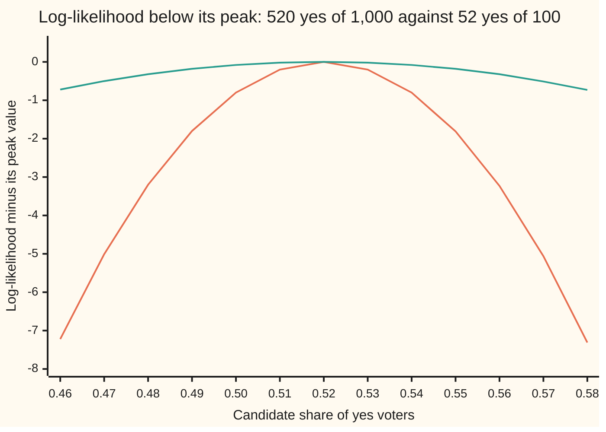
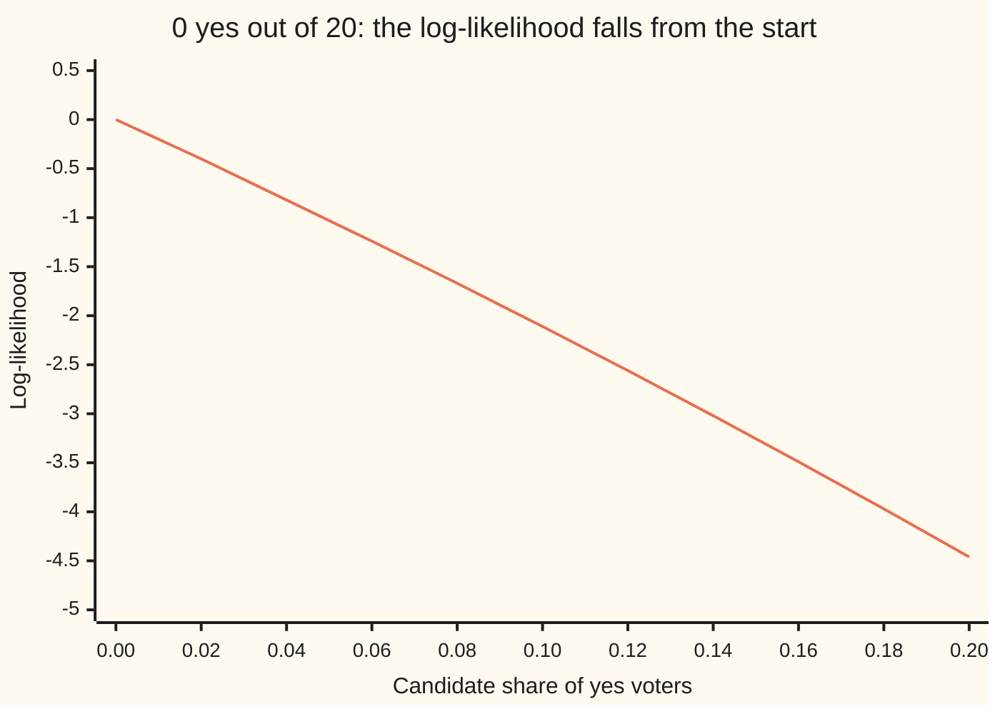

# Maximum likelihood: pick the parameter that makes the data least surprising

[Syllabus](../../../SYLLABUS.md) → [Probability and statistics](../README.md) → [Sampling and Estimation](../README.md#s07) → Maximum likelihood

---

## General Overview

A polling firm phones 1,000 voters chosen at random and asks one yes-or-no question about a ballot measure. 520 say yes. The firm reports 52 percent. That is the natural guess, but nothing yet says why, or how to guess when the answer is not a plain share.

Here is a rule that works far beyond polls. Try every candidate share in turn. For each one, ask: if this were the electorate's true share, what would the chance have been of getting exactly the answers the firm recorded? A share of 0.30 makes 520 yeses in 1,000 calls a freak event. So does 0.90. Somewhere in between, one candidate makes the record least surprising. Take that one.

The chance of the observed data, read as a function of the candidate, is called the **likelihood**. The candidate that makes it largest is the **maximum likelihood estimate**. For the poll it is 0.52, the plain share. The rule rediscovers the obvious answer here, which is a reason to trust it where no obvious answer exists. Ronald Fisher set it out in 1922; most model fitting since, machine learning included, is this rule applied to bigger models.

Two warnings. The likelihood is a chance of the data, never of the candidate: the method does not say 0.52 is probably true. And the peak need not sit where the curve is flat: with zero yeses the best candidate is the edge, zero, and the usual calculus finds nothing.

**Hold the data fixed, let the unknown move, and pick the value under which the observed data had the highest chance; for 520 yeses in 1,000 calls that value is 0.52, with a standard error of 0.0158.**

**What kind of fact this is:** a method, a rule for choosing an estimate; the answers it gives for a yes-or-no poll (the share) and for a normal model (the average and the average squared gap) are theorems proved on this card in Why it works.

### The picture: the poll's log-likelihood, and a poll ten times smaller



First line (orange): the real poll, 520 yeses in 1,000 calls. Second line (green): a poll of 100 with 52 yeses, the same share. Both peak at 0.52. The height is the logarithm of the chance, measured from the peak: −0.80 at 0.50 means a fair split made the record 0.449 times as likely as 0.52 did. The big poll's curve drops ten times as far.

---

## The formula

Notation first, in words. The unknown number the model needs is written $\theta$ (theta); for the poll it is the share $p$. The data are $x_1, x_2, \ldots, x_n$: for the poll, $x_i$ is 1 if voter number i said yes and 0 if not. The model supplies $f(x;\theta)$, the chance of one observation $x$ when the unknown is $\theta$; for a measurement on a continuous scale it is the density height ([Densities](../04-Continuous%20Distributions/01-densities-and-cdfs.md)). A capital pi, ∏, means multiply the terms together, as a capital sigma, Σ, means add them. A hat marks a guess, as on [Samples and estimators](01-populations-samples-and-estimators.md): $\hat\theta$ is read "theta-hat".

$$L(\theta) = \prod_{i=1}^{n} f(x_i;\theta), \qquad \ell(\theta) = \ln L(\theta) = \sum_{i=1}^{n} \ln f(x_i;\theta), \qquad \hat\theta = \text{the allowed } \theta \text{ with the largest } L(\theta)$$

**Read it aloud:** the likelihood multiplies the chances of every observation under a candidate value; its logarithm adds their logarithms; the estimate is the allowed candidate that makes the likelihood largest.

For the poll, with $k$ yeses out of $n$ calls:

$$L(p) = p^{k}(1-p)^{n-k}, \qquad \hat p = \frac{k}{n} = \frac{520}{1000} = 0.52$$

**Read it aloud:** each yes contributes a factor p and each no a factor 1 − p; the peak is the share of yeses.

For $n$ measurements from a normal law with centre $\mu$ and variance $v$ (so $v = \sigma^2$, the square of the standard deviation $\sigma$), with average $\bar x$ and total squared gap $Q = \sum (x_i - \bar x)^2$:

$$\hat\mu = \bar x, \qquad \hat v = \frac{Q}{n}$$

**Read it aloud:** the best centre is the average of the data; the best variance is the average squared distance from that average, dividing by n, not n − 1.

| Symbol | Plain meaning | In our example | Push it up and the answer… |
| --- | --- | --- | --- |
| $\theta$ | the unknown number the model needs, in general (theta) | the share p, or the pair μ, v | — |
| $x_i$ | observation number i | 1 for a yes, 0 for a no; or one earlier poll's share | — |
| $n$ | the number of observations | 1,000 calls; 5 earlier polls | the peak's curvature grows in proportion; the standard error shrinks like 1/√n |
| $f(x;\theta)$ | the chance (or density height) of one observation under θ | p for a yes, 1 − p for a no | — |
| $L$ | the likelihood: the chance of all the data, as a function of θ | about 10^(−300.7) at the peak | — |
| $\ell$ | the log-likelihood, ln L; same peak, sums instead of products | −692.35 at the peak | — |
| $\hat\theta$, $\hat p$, $\hat\mu$, $\hat v$ | the maximum likelihood estimates | 0.52; 0.52; 0.52; 0.00036 | — |
| $p$ | the electorate's true share of yes voters | unknown; estimate 0.52 | more yeses expected |
| $k$ | the number of yeses in the sample | 520 | the estimate rises one-for-one with k/n |
| $\mu$ | the centre of a normal law (mu) | the race's true average poll share | — |
| $v$, $\sigma$ | the variance of a normal law, and its square root, the standard deviation (sigma) | estimates 0.00036 and 0.018974 | the bell curve widens |
| $\bar x$, $Q$ | the data's average, and its total squared gap from that average | 0.52 and 0.0018 | Q up: a larger variance estimate |
| $\prod$, $\sum$ | capital pi: multiply the terms that follow; capital sigma: add them | ∏ multiplies 1,000 chances, one per call; Σ adds the 5 squared gaps in Q | — |
| $\ln$ | the natural logarithm; it turns products into sums and keeps bigger numbers bigger | ln L = −692.35 at the peak | — |
| $\pi$ | the circle constant, the ratio of a circle's circumference to its diameter | inside the normal density's $(2\pi v)^{-1/2}$ | — |
| $C(n, k)$ | the number of orders in which k yeses can fall among n calls | C(1000, 520) | — |
| $g(v)$ | the normal log-likelihood with the centre fixed at $\bar x$, as a function of the variance alone | highest at v = Q/n = 0.00036 | — |

### When it holds

- **The model family must be right.** The method finds the best member of the family it is handed. The poll's family assumes independent calls. If the firm reached households of two who always vote alike, the true standard error is 0.0223, not the 0.0158 the model reports.
- **The allowed range must contain the peak.** With 0 yeses out of 20 the peak is at p = 0. If the model allows only shares strictly between 0 and 1, the likelihood keeps rising as p moves toward 0, and no allowed share is the top: no estimate exists.
- **The likelihood must stay bounded.** Five polls that all read exactly 0.52 give a normal likelihood that grows without limit as the variance shrinks to 0. Zero variance is outside the model, so there is no maximum.
- **The estimate need not be unbiased.** With five polls, Q/n averages 4/5 of the true variance. Whether a choice is centred on the truth is checked separately ([Bias and variance](06-bias-variance-and-mean-squared-error.md)).

---

## Why it works

### Step 0: one formula, read two ways

The chance formula for the poll has two inputs: the data and the unknown share. Before the calls, the share is held fixed and the formula says how probable each possible record is; that is probability. After the calls, the record is held fixed and the formula is read across candidate shares; that is likelihood. Nothing new is computed; the same numbers are read along the other axis. Maximum likelihood prefers the candidate under which what happened was least of a fluke.

### Step 1: write the likelihood of the poll

Each call is a yes with chance p and a no with chance 1 − p, and the calls are independent, so chances multiply ([Binomial](../03-Discrete%20Distributions/01-bernoulli-and-binomial.md)). The recorded list of 520 yeses and 480 nos, in the order they came, has chance

$$L(p) = p^{520}(1-p)^{480}.$$

At p = 0.52 this is about 10^(−300.7): a decimal point, 300 zeros, then digits. That does not matter. Any one exact list of 1,000 answers is improbable; only comparisons between candidates carry information. At p = 0.50 the same list is 0.449 times as likely as at 0.52; at p = 0.55 it is 0.163 times as likely.

Recording only the count, not the order, multiplies L(p) by the number of orders, C(1000, 520). That factor does not involve p, so it scales every candidate alike and leaves the peak where it was. With that factor included, the chance of exactly 520 yeses if p = 0.52 is 0.025245, about 2.5 percent. That number is a chance of data. It is not the chance that p equals 0.52.

### Step 2: take logarithms

A product of a thousand small factors is tiny. At the peak it is about 10^(−300.7), close to the smallest positive number that ordinary computer arithmetic can hold; a poll ten times larger falls below that floor, and its product rounds to zero. The logarithm turns the product into a sum, which stays a modest number:

$$\ell(p) = 520\ln p + 480\ln(1-p).$$

The logarithm is an increasing function: a bigger likelihood always has a bigger logarithm. So the two curves peak at the same place, and from here the card works with ℓ. At the peak, ℓ = −692.35. The chart plots ℓ minus that peak value.

### Step 3: find the peak, and prove it is the top

The slope of ℓ in p is

$$\frac{d\ell}{dp} = \frac{k}{p} - \frac{n-k}{1-p} = \frac{k - np}{p(1-p)}.$$

The bottom, p(1 − p), is positive for every p strictly between 0 and 1. So the sign of the slope is the sign of k − np. Below p = k/n the slope is positive and ℓ climbs; above it the slope is negative and ℓ falls. A function that rises up to a point and falls after it has its highest value there ([Optimisation](../../06-Calculus%20and%20analysis/03-What%20Derivatives%20Tell%20You/03-monotonicity-and-optimisation.md)). This sign argument proves a global maximum, which "slope equals zero" alone does not: a flat point can be a valley or a ledge. For the poll, $\hat p$ = 520/1000 = 0.52.

### Step 4: when the peak sits at an edge

A second poll asks 20 voters about a fringe measure. None says yes. Now k = 0 and

$$\ell(p) = 20\ln(1-p), \qquad \frac{d\ell}{dp} = -\frac{20}{1-p}.$$

The slope is negative everywhere; at p = 0 it is −20. It is never zero, so the recipe "set the slope to zero and solve" returns nothing. Yet ℓ is falling from the start, so its highest value is at the left edge: $\hat p = 0$. (The likelihood there is (1 − 0)^20 = 1: under a share of zero, twenty nos were certain.) The second chart shows the fall.



The single line is ℓ(p) = 20 ln(1 − p). Its top is the first point, p = 0, where the curve is not flat.

The allowed range matters: if p = 0 is excluded, every candidate is beaten by a smaller one and no maximum exists. A numerical search told to stay between 0.001 and 0.999 stops at its wall, 0.001: a fact about the search, not the voters. All-yes records mirror this at p = 1.

### Step 5: the normal model, two unknowns at once

Before this poll, five earlier polls of the same race reported shares 0.49, 0.51, 0.52, 0.54 and 0.54. Treat them as five draws from a normal law with unknown centre μ and unknown variance v, the bell curve of [Normal](../04-Continuous%20Distributions/04-normal-distribution.md). Its density height at x is $(2\pi v)^{-1/2}\exp(-(x-\mu)^2/(2v))$. Multiply five of them and take logarithms:

$$\ell(\mu, v) = -\frac{n}{2}\ln(2\pi v) - \frac{1}{2v}\sum_{i}(x_i - \mu)^2.$$

The centre first. The squared gaps split into two parts, $\sum (x_i-\mu)^2 = Q + n(\mu - \bar x)^2$. Only the second part involves μ, and it is smallest, zero, at μ = $\bar x$. That holds whatever v is. So $\hat\mu = \bar x$, the average of the five, 0.52.

Then the spread. With the centre fixed at $\bar x$, the log-likelihood in v alone is $-\tfrac{n}{2}\ln(2\pi v) - Q/(2v)$. Its two terms pull opposite ways. The first prefers a narrow bell, which is tall. The second punishes a narrow bell for leaving the data in its thin tails. The slope in v is $(Q - nv)/(2v^2)$: positive below v = Q/n, negative above. So $\hat v = Q/n$.

For the five polls the squared gaps from 0.52 add to Q = 0.0018, and $\hat v$ = 0.0018 / 5 = 0.00036, a standard deviation of 0.018974. That is close to the 0.0158 that one 1,000-voter poll should scatter by, with polls of other sizes and dates mixed in. The standard error of the centre is 0.018974 / √5 = 0.008485; that of the variance is about 0.000228, rough with only five numbers.

Density heights are not chances, so ℓ here can be positive. If all five polls read 0.52 exactly, then Q = 0 and ℓ at the centre is $-\tfrac{5}{2}\ln(2\pi v)$: 12.67 at v = 0.001, 24.19 at v = 0.00001, 35.70 at v = 0.0000001, and on without limit. No allowed variance is best.

<details>
<summary>Detailed proof: the normal estimates, and the case with no maximum</summary>

**Splitting the squared gaps.** Write $x_i - \mu = (x_i - \bar x) + (\bar x - \mu)$ and square: $\sum (x_i-\mu)^2 = \sum (x_i - \bar x)^2 + 2(\bar x - \mu)\sum (x_i - \bar x) + n(\bar x - \mu)^2$. The middle sum is zero, because the gaps from the average add to zero by the definition of the average. So $\sum (x_i-\mu)^2 = Q + n(\mu - \bar x)^2$.

**The centre.** For any fixed v > 0, ℓ(μ, v) = $-\tfrac{n}{2}\ln(2\pi v) - \tfrac{Q}{2v} - \tfrac{n(\mu - \bar x)^2}{2v}$. The last term is at most zero and equals zero only at μ = $\bar x$. So for every v the best centre is $\bar x$, and the pair's maximum, if it exists, has μ = $\bar x$.

**The spread, when Q > 0.** Put μ = $\bar x$. Then $g(v) = -\tfrac{n}{2}\ln(2\pi v) - \tfrac{Q}{2v}$, with slope $g'(v) = -\tfrac{n}{2v} + \tfrac{Q}{2v^2} = \tfrac{Q - nv}{2v^2}$. The bottom is positive. The top is positive for v < Q/n and negative for v > Q/n. So g rises then falls, and v = Q/n is its unique highest point. The pair ($\bar x$, Q/n) beats every other pair: any (μ, v) is at most ($\bar x$, v), which is at most ($\bar x$, Q/n).

**The spread, when Q = 0.** Every observation equals $\bar x$. Then $g(v) = -\tfrac{n}{2}\ln(2\pi v)$, which increases without bound as v falls towards 0. For every allowed v there is a smaller one with a larger likelihood, so no maximum exists.

**Why the factor matters.** The term $-\tfrac{n}{2}\ln(2\pi v)$ comes from the $(2\pi v)^{-1/2}$ in front of each density. It depends on v, so it cannot be dropped when v is being fitted. Drop it and $g(v) = -Q/(2v)$ rises for ever as v grows.

</details>

### Step 6: the curvature of the peak gives the standard error

A narrow peak means the data rule out nearby values firmly. The narrowness is the curvature: minus the second derivative of ℓ at the peak, the rate at which its slope falls. For the poll it is $k/\hat p^2 + (n-k)/(1-\hat p)^2$, about 4,006. One over its square root is 0.015799, the same standard error that $\sqrt{p(1-p)/n}$ gives on [Standard error](02-sample-mean-and-standard-error.md). That this match is no accident, and that no unbiased rule can do better, is proved on [Fisher information](07-fisher-information-and-cramer-rao.md). The same recipe gave the variance's standard error above, $\hat v\sqrt{2/n}$.

### The other door

A different rule sets the model's long-run averages equal to the data's and solves. For the poll and for both normal estimates it agrees; for other models it is quicker but usually noisier. That rule is [Method of moments](05-method-of-moments.md).

---

## Worked numbers, by hand

The poll: n = 1,000 calls, k = 520 yeses.

| Step | Arithmetic | Value |
| --- | --- | --- |
| log-likelihood | $520\ln p + 480\ln(1-p)$ | a curve in p |
| set the slope to zero | $520/p = 480/(1-p)$, so $520(1-p) = 480p$ | $1000p = 520$ |
| check the signs | slope positive below 0.52, negative above | a true maximum |
| estimate | $520/1000$ | $\hat p$ = 0.52 |
| height at the peak | $520\ln 0.52 + 480\ln 0.48$ | −692.35 |
| height at a fair split, from the peak | $1000\ln 0.5 - (-692.35)$ | −0.80, a ratio of 0.449 |
| curvature | $520/0.52^2 + 480/0.48^2$ | about 4,006 |
| standard error | $1/\sqrt{4006}$, or $\sqrt{0.52 \times 0.48 / 1000}$ | 0.0158 |
| **answer** | | **0.52, standard error 0.0158** |

The electorate's yes share is estimated at 52 percent, give or take about 1.6 points. A fair split, 0.50, lies within two standard errors of the estimate: the poll leans yes, not decisively.

### What breaks if you drop a piece

| Mistake | Comes out at | What went wrong |
| --- | --- | --- |
| Reading the 2.5 percent chance of exactly 520 yeses as the chance that p = 0.52 | 0.025245, a chance about the data | likelihood ranks candidates; it puts no probability on them |
| Setting the slope to zero for 0 yeses out of 20 | no solution; a search walled at 0.001 stops at 0.001 | the peak is at the edge p = 0, where the slope is −20 |
| Quoting $\sqrt{\hat p(1-\hat p)/n}$ for 0 out of 20 | 0: "exactly zero, no doubt at all" | that formula comes from the curvature at a flat peak, and this peak is not flat |
| Dropping the $(2\pi v)^{-n/2}$ factor when fitting the variance | the best v runs to the top of the search range, 1.0 | that factor is what penalises a wide bell |
| Treating calls from two-person households who always agree as independent | standard error 0.0158 reported; truth 0.0223, simulated 0.0227 | the model's independence was false, and the likelihood trusted it |

The first four are slips in the calculation. The fifth is a wrong model, which no maximising repairs.

---

## Code, from first principles, and it actually runs

Four roads to the poll's estimate: the closed form k/n; a grid of 10,001 candidate shares; a golden-section search, which shrinks a bracket round the peak using heights only, no slopes; and a simulation that reruns the poll 2,000 times with the true share set at 0.52. The standard error comes from the formula and from the measured curvature. The normal's closed forms are checked against a grid over both unknowns at once. Then the edge, the collapsed normal, the dropped factor, the bias of Q/n and the households of two. Random numbers come from SplitMix64, a small generator written out in both languages with seed 20260928, so both draw the same numbers.

### Python

```python
# Maximum likelihood -- the check behind the card.  Standard library only.
# Every number on the card is printed here.  Roads to each peak: the closed
# form, a brute grid, a golden-section search that uses no slopes, and a
# seeded simulation (SplitMix64, written out, same draws as the Rust check).
from math import log, sqrt, exp, cos, pi, inf

def loglik(k, n, p):                      # ln of p^k (1-p)^(n-k), with 0^0 = 1
    if (p <= 0 and k > 0) or (p >= 1 and k < n): return -inf
    return (k * log(p) if k else 0.0) + ((n - k) * log(1 - p) if n - k else 0.0)

def grid_argmax(f, lo, hi, steps):        # try every grid point, keep the best
    best, arg = -inf, lo
    for i in range(steps + 1):
        x = lo + (hi - lo) * i / steps
        v = f(x)
        if v > best: best, arg = v, x
    return arg

def golden(f, lo, hi):                    # shrink a bracket round the peak; no slopes
    g = (sqrt(5.0) - 1.0) / 2.0
    a, b = lo, hi
    for _ in range(100):
        c, d = b - g * (b - a), a + g * (b - a)
        if f(c) > f(d): b = d
        else: a = c
    return (a + b) / 2.0

M64 = (1 << 64) - 1
state = [20260928]
def unif():                               # SplitMix64: a uniform number in [0, 1)
    state[0] = (state[0] + 0x9E3779B97F4A7C15) & M64
    z = state[0]
    z = ((z ^ (z >> 30)) * 0xBF58476D1CE4E5B9) & M64
    z = ((z ^ (z >> 27)) * 0x94D049BB133111EB) & M64
    return ((z ^ (z >> 31)) >> 11) / 9007199254740992.0

def mean_sd(xs):                          # plain running sums, the same order as the Rust check
    s = 0.0
    for x in xs: s += x
    m, ss = s / len(xs), 0.0
    for x in xs: ss += (x - m) * (x - m)
    return m, sqrt(ss / (len(xs) - 1))

def show(label, v): print(f"{label:<46}{v:>12.6f}")

# ---- the poll: 520 yes out of 1,000 ----
n, k = 1000, 520
p_hat = k / n
f = lambda p: loglik(k, n, p)
p_grid, p_gold = grid_argmax(f, 0.0, 1.0, 10000), golden(f, 0.001, 0.999)
top = f(p_hat)
h = 1e-3
curv = (f(p_hat + h) - 2.0 * top + f(p_hat - h)) / (h * h)
se_formula, se_curv = sqrt(p_hat * (1 - p_hat) / n), 1.0 / sqrt(-curv)
log_choose = sum(log(i) for i in range(n - k + 1, n + 1)) - sum(log(i) for i in range(1, k + 1))
show("poll: p-hat, closed form k/n", p_hat)
show("poll: p-hat, grid of 10,001 points", p_grid)
show("poll: p-hat, golden-section search", p_gold)
show("poll: log-likelihood at the peak", top)
show("poll: the same, as a power of 10", top / log(10.0))
show("poll: relative likelihood at p = 0.50", exp(f(0.50) - top))
show("poll: relative likelihood at p = 0.55", exp(f(0.55) - top))
show("poll: chance of exactly 520 yes if p = 0.52", exp(log_choose + top))
show("poll: curvature, minus second difference", -curv)
show("poll: SE, formula sqrt(p(1-p)/n)", se_formula)
show("poll: SE, from the curvature of the peak", se_curv)
show("try: SE for 52 yes out of 100", sqrt(0.52 * 0.48 / 100))
print("chart, p          " + " ".join(f"{0.46 + 0.01 * i:5.2f}" for i in range(13)))
print("chart, n = 1000   " + " ".join(f"{f(0.46 + 0.01 * i) - top:5.2f}" for i in range(13)))
print("chart, n = 100    " + " ".join(f"{loglik(52, 100, 0.46 + 0.01 * i) - loglik(52, 100, 0.52):5.2f}" for i in range(13)))

# ---- road 4: rerun the poll 2,000 times with the true share set to 0.52 ----
sims = [sum(1 for _ in range(n) if unif() < 0.52) / n for _ in range(2000)]
sim_mean, sim_sd = mean_sd(sims)
show("sim: average p-hat over 2,000 polls", sim_mean)
show("sim: its standard error", sim_sd / sqrt(2000))
show("sim: spread (SD) of p-hat", sim_sd)

# ---- the edge: 0 yes out of 20 on a fringe measure ----
g = lambda p: loglik(0, 20, p)
show("edge: p-hat, closed form 0/20", 0 / 20)
e_grid, e_gold = grid_argmax(g, 0.0, 1.0, 10000), golden(g, 0.001, 0.999)
show("edge: p-hat, grid on [0, 1]", e_grid)
show("edge: golden search, walls at 0.001, 0.999", e_gold)
show("edge: slope of log-likelihood at p = 0", -20 / (1 - 0.0))
show("edge: SE formula at p-hat = 0", sqrt(0.0 * 1.0 / 20))
print("chart, edge p     " + " ".join(f"{0.02 * i:5.2f}" for i in range(11)))
print("chart, edge ll    " + " ".join(f"{g(0.02 * i):5.2f}" for i in range(11)))

# ---- the normal: five earlier polls of the same race ----
polls = [0.49, 0.51, 0.52, 0.54, 0.54]
m = len(polls)
def nll(mu, v, xs): return -len(xs) / 2.0 * log(2.0 * pi * v) - sum((x - mu) ** 2 for x in xs) / (2.0 * v)
mu_hat = sum(polls) / m
Q = sum((x - mu_hat) ** 2 for x in polls)
best = (-inf, 0.0, 0.0)
for i in range(401):                      # road 2: brute grid over mean and variance together
    for j in range(1, 1001):
        val = nll(0.50 + 0.0001 * i, 0.000001 * j, polls)
        if val > best[0]: best = (val, 0.50 + 0.0001 * i, 0.000001 * j)
show("normal: mean-hat, closed form x-bar", mu_hat)
show("normal: mean-hat, grid", best[1])
show("normal: Q, sum of squared gaps", Q)
show("normal: v-hat = Q/n, closed form", Q / m)
show("normal: v-hat, grid", best[2])
show("normal: sigma-hat = sqrt(Q/n)", sqrt(Q / m))
show("normal: SE of mean-hat, sigma-hat/sqrt(n)", sqrt(Q / m) / sqrt(m))
show("normal: SE of v-hat, v-hat * sqrt(2/n)", Q / m * sqrt(2.0 / m))
show("normal: Q/(n-1), the unbiased variance", Q / (m - 1))
same, col = [0.52] * 5, []
for lab, v in (("0.001", 1e-3), ("0.00001", 1e-5), ("0.0000001", 1e-7)):
    col.append(nll(0.52, v, same))
    show("all five at 0.52: log-lik at v = " + lab, col[-1])
drop = lambda v: -Q / (2.0 * v)           # the likelihood with the v^(-n/2) factor dropped
show("dropped factor: best v on the grid (0, 1]", v_drop := grid_argmax(drop, 0.0001, 1.0, 9999))

# ---- what breaks: the bias of v-hat, and clustered households ----
v_true = 0.52 * 0.48 / 1000
ratios = []
for _ in range(20000):
    xs = [0.52 + sqrt(v_true) * sqrt(-2.0 * log(1.0 - unif())) * cos(2.0 * pi * unif()) for _ in range(5)]
    xb = sum(xs) / 5
    ratios.append(sum((x - xb) ** 2 for x in xs) / 5 / v_true)
r_mean, r_sd = mean_sd(ratios)
show("bias sim: average v-hat / true v, 20,000 sets", r_mean)
show("bias sim: its standard error", r_sd / sqrt(20000))
pairs = [2 * sum(1 for _ in range(500) if unif() < 0.52) / 1000 for _ in range(2000)]
show("pairs: true SE sqrt(p(1-p)/500)", sqrt(0.52 * 0.48 / 500))
show("pairs: simulated SD of p-hat, 2,000 polls", pair_sd := mean_sd(pairs)[1])

assert abs(p_grid - p_hat) < 1e-4 and abs(p_gold - p_hat) < 1e-6, "searches must find k/n"
assert abs(se_curv - se_formula) < 1e-6, "curvature SE must match p(1-p)/n"
assert abs(sim_mean - 0.52) < 4 * sim_sd / sqrt(2000) and abs(sim_sd - se_formula) < 0.001, "simulation"
assert abs(best[1] - mu_hat) < 1e-4 and abs(best[2] - Q / m) < 1.5e-6, "normal grid must find x-bar and Q/n"
assert abs(r_mean - 0.8) < 4 * r_sd / sqrt(20000), "v-hat averages (n-1)/n of the truth"
assert e_grid == 0.0 and abs(e_gold - 0.001) < 1e-6, "edge: peak at p = 0; a walled search stops at its wall"
assert col[0] < col[1] < col[2] and v_drop > 0.999, "collapsed normal climbs; dropped factor runs to the top"
assert abs(pair_sd - sqrt(0.52 * 0.48 / 500)) < 4 * pair_sd / sqrt(2 * 1999) and pair_sd > 1.3 * se_formula, "households"
print("ALL CHECKS PASS")
```

**Ran 2026-09-28 on macOS, Python 3.14.6, standard library only. All checks passed. Output, pasted from the run:**

```
poll: p-hat, closed form k/n                      0.520000
poll: p-hat, grid of 10,001 points                0.520000
poll: p-hat, golden-section search                0.520000
poll: log-likelihood at the peak               -692.346967
poll: the same, as a power of 10               -300.682467
poll: relative likelihood at p = 0.50             0.449233
poll: relative likelihood at p = 0.55             0.163332
poll: chance of exactly 520 yes if p = 0.52       0.025245
poll: curvature, minus second difference       4006.418334
poll: SE, formula sqrt(p(1-p)/n)                  0.015799
poll: SE, from the curvature of the peak          0.015799
try: SE for 52 yes out of 100                     0.049960
chart, p           0.46  0.47  0.48  0.49  0.50  0.51  0.52  0.53  0.54  0.55  0.56  0.57  0.58
chart, n = 1000   -7.22 -5.01 -3.20 -1.80 -0.80 -0.20  0.00 -0.20 -0.80 -1.81 -3.23 -5.06 -7.31
chart, n = 100    -0.72 -0.50 -0.32 -0.18 -0.08 -0.02  0.00 -0.02 -0.08 -0.18 -0.32 -0.51 -0.73
sim: average p-hat over 2,000 polls               0.520532
sim: its standard error                           0.000359
sim: spread (SD) of p-hat                         0.016060
edge: p-hat, closed form 0/20                     0.000000
edge: p-hat, grid on [0, 1]                       0.000000
edge: golden search, walls at 0.001, 0.999        0.001000
edge: slope of log-likelihood at p = 0          -20.000000
edge: SE formula at p-hat = 0                     0.000000
chart, edge p      0.00  0.02  0.04  0.06  0.08  0.10  0.12  0.14  0.16  0.18  0.20
chart, edge ll     0.00 -0.40 -0.82 -1.24 -1.67 -2.11 -2.56 -3.02 -3.49 -3.97 -4.46
normal: mean-hat, closed form x-bar               0.520000
normal: mean-hat, grid                            0.520000
normal: Q, sum of squared gaps                    0.001800
normal: v-hat = Q/n, closed form                  0.000360
normal: v-hat, grid                               0.000360
normal: sigma-hat = sqrt(Q/n)                     0.018974
normal: SE of mean-hat, sigma-hat/sqrt(n)         0.008485
normal: SE of v-hat, v-hat * sqrt(2/n)            0.000228
normal: Q/(n-1), the unbiased variance            0.000450
all five at 0.52: log-lik at v = 0.001           12.674696
all five at 0.52: log-lik at v = 0.00001         24.187621
all five at 0.52: log-lik at v = 0.0000001       35.700546
dropped factor: best v on the grid (0, 1]         1.000000
bias sim: average v-hat / true v, 20,000 sets     0.794286
bias sim: its standard error                      0.004005
pairs: true SE sqrt(p(1-p)/500)                   0.022343
pairs: simulated SD of p-hat, 2,000 polls         0.022722
ALL CHECKS PASS
```

### Rust

```rust
// Maximum likelihood -- the same check as maximum_likelihood_check.py, in Rust.
// Standard library only, no crates.  Same roads, same seed, same draws.
// Compile: rustc --edition 2021 -O maximum_likelihood_check.rs -o /tmp/<dir>/ml
use std::f64::consts::PI;

fn loglik(k: u32, n: u32, p: f64) -> f64 {           // ln of p^k (1-p)^(n-k), with 0^0 = 1
    if (p <= 0.0 && k > 0) || (p >= 1.0 && k < n) { return f64::NEG_INFINITY; }
    let a = if k > 0 { k as f64 * p.ln() } else { 0.0 };
    let b = if n > k { (n - k) as f64 * (1.0 - p).ln() } else { 0.0 };
    a + b
}

fn grid_argmax<F: Fn(f64) -> f64>(f: F, lo: f64, hi: f64, steps: u32) -> f64 {
    let (mut best, mut arg) = (f64::NEG_INFINITY, lo);    // try every grid point, keep the best
    for i in 0..=steps {
        let x = lo + (hi - lo) * i as f64 / steps as f64;
        let v = f(x);
        if v > best { best = v; arg = x; }
    }
    arg
}

fn golden<F: Fn(f64) -> f64>(f: F, lo: f64, hi: f64) -> f64 {
    let g = (5.0_f64.sqrt() - 1.0) / 2.0;                 // shrink a bracket round the peak; no slopes
    let (mut a, mut b) = (lo, hi);
    for _ in 0..100 {
        let (c, d) = (b - g * (b - a), a + g * (b - a));
        if f(c) > f(d) { b = d; } else { a = c; }
    }
    (a + b) / 2.0
}

struct SplitMix(u64);
impl SplitMix {
    fn unif(&mut self) -> f64 {                           // a uniform number in [0, 1)
        self.0 = self.0.wrapping_add(0x9E3779B97F4A7C15);
        let mut z = self.0;
        z = (z ^ (z >> 30)).wrapping_mul(0xBF58476D1CE4E5B9);
        z = (z ^ (z >> 27)).wrapping_mul(0x94D049BB133111EB);
        ((z ^ (z >> 31)) >> 11) as f64 / 9007199254740992.0
    }
}

fn mean_sd(xs: &[f64]) -> (f64, f64) {
    let m = xs.iter().sum::<f64>() / xs.len() as f64;
    (m, (xs.iter().map(|x| (x - m) * (x - m)).sum::<f64>() / (xs.len() - 1) as f64).sqrt())
}

fn show(label: &str, v: f64) { println!("{:<46}{:>12.6}", label, v); }

fn nll(mu: f64, v: f64, xs: &[f64]) -> f64 {
    -(xs.len() as f64) / 2.0 * (2.0 * PI * v).ln() - xs.iter().map(|x| (x - mu) * (x - mu)).sum::<f64>() / (2.0 * v)
}

fn row(label: &str, vals: Vec<f64>) {
    let s: Vec<String> = vals.iter().map(|v| format!("{:5.2}", v)).collect();
    println!("{:<18}{}", label, s.join(" "));
}

fn main() {
    let mut rng = SplitMix(20260928);
    // ---- the poll: 520 yes out of 1,000 ----
    let (n, k) = (1000_u32, 520_u32);
    let p_hat = k as f64 / n as f64;
    let f = |p: f64| loglik(k, n, p);
    let (p_grid, p_gold) = (grid_argmax(f, 0.0, 1.0, 10000), golden(f, 0.001, 0.999));
    let top = f(p_hat);
    let h = 1e-3;
    let curv = (f(p_hat + h) - 2.0 * top + f(p_hat - h)) / (h * h);
    let (se_formula, se_curv) = ((p_hat * (1.0 - p_hat) / n as f64).sqrt(), 1.0 / (-curv).sqrt());
    let log_choose = ((n - k + 1)..=n).map(|i| (i as f64).ln()).sum::<f64>() - (1..=k).map(|i| (i as f64).ln()).sum::<f64>();
    show("poll: p-hat, closed form k/n", p_hat);
    show("poll: p-hat, grid of 10,001 points", p_grid);
    show("poll: p-hat, golden-section search", p_gold);
    show("poll: log-likelihood at the peak", top);
    show("poll: the same, as a power of 10", top / 10.0_f64.ln());
    show("poll: relative likelihood at p = 0.50", (f(0.50) - top).exp());
    show("poll: relative likelihood at p = 0.55", (f(0.55) - top).exp());
    show("poll: chance of exactly 520 yes if p = 0.52", (log_choose + top).exp());
    show("poll: curvature, minus second difference", -curv);
    show("poll: SE, formula sqrt(p(1-p)/n)", se_formula);
    show("poll: SE, from the curvature of the peak", se_curv);
    show("try: SE for 52 yes out of 100", (0.52_f64 * 0.48 / 100.0).sqrt());
    let ps: Vec<f64> = (0..13).map(|i| 0.46 + 0.01 * i as f64).collect();
    row("chart, p", ps.clone());
    row("chart, n = 1000", ps.iter().map(|&p| f(p) - top).collect());
    row("chart, n = 100", ps.iter().map(|&p| loglik(52, 100, p) - loglik(52, 100, 0.52)).collect());

    // ---- road 4: rerun the poll 2,000 times with the true share set to 0.52 ----
    let sims: Vec<f64> = (0..2000).map(|_| (0..n).filter(|_| rng.unif() < 0.52).count() as f64 / n as f64).collect();
    let (sim_mean, sim_sd) = mean_sd(&sims);
    show("sim: average p-hat over 2,000 polls", sim_mean);
    show("sim: its standard error", sim_sd / 2000.0_f64.sqrt());
    show("sim: spread (SD) of p-hat", sim_sd);

    // ---- the edge: 0 yes out of 20 on a fringe measure ----
    let g = |p: f64| loglik(0, 20, p);
    show("edge: p-hat, closed form 0/20", 0.0 / 20.0);
    let (e_grid, e_gold) = (grid_argmax(g, 0.0, 1.0, 10000), golden(g, 0.001, 0.999));
    show("edge: p-hat, grid on [0, 1]", e_grid);
    show("edge: golden search, walls at 0.001, 0.999", e_gold);
    show("edge: slope of log-likelihood at p = 0", -20.0 / (1.0 - 0.0));
    show("edge: SE formula at p-hat = 0", (0.0_f64 * 1.0 / 20.0).sqrt());
    row("chart, edge p", (0..11).map(|i| 0.02 * i as f64).collect());
    row("chart, edge ll", (0..11).map(|i| g(0.02 * i as f64)).collect());

    // ---- the normal: five earlier polls of the same race ----
    let polls = [0.49, 0.51, 0.52, 0.54, 0.54];
    let m = polls.len() as f64;
    let mu_hat = polls.iter().sum::<f64>() / m;
    let q = polls.iter().map(|x| (x - mu_hat) * (x - mu_hat)).sum::<f64>();
    let mut best = (f64::NEG_INFINITY, 0.0, 0.0);
    for i in 0..401 {                                     // road 2: brute grid over mean and variance together
        for j in 1..1001 {
            let val = nll(0.50 + 0.0001 * i as f64, 0.000001 * j as f64, &polls);
            if val > best.0 { best = (val, 0.50 + 0.0001 * i as f64, 0.000001 * j as f64); }
        }
    }
    show("normal: mean-hat, closed form x-bar", mu_hat);
    show("normal: mean-hat, grid", best.1);
    show("normal: Q, sum of squared gaps", q);
    show("normal: v-hat = Q/n, closed form", q / m);
    show("normal: v-hat, grid", best.2);
    show("normal: sigma-hat = sqrt(Q/n)", (q / m).sqrt());
    show("normal: SE of mean-hat, sigma-hat/sqrt(n)", (q / m).sqrt() / m.sqrt());
    show("normal: SE of v-hat, v-hat * sqrt(2/n)", q / m * (2.0 / m).sqrt());
    show("normal: Q/(n-1), the unbiased variance", q / (m - 1.0));
    let (same, mut col) = ([0.52; 5], Vec::new());
    for (lab, v) in [("0.001", 1e-3), ("0.00001", 1e-5), ("0.0000001", 1e-7)] {
        col.push(nll(0.52, v, &same));
        show(&format!("all five at 0.52: log-lik at v = {}", lab), col[col.len() - 1]);
    }
    let drop = |v: f64| -q / (2.0 * v);                   // the likelihood with the v^(-n/2) factor dropped
    let v_drop = grid_argmax(drop, 0.0001, 1.0, 9999);
    show("dropped factor: best v on the grid (0, 1]", v_drop);

    // ---- what breaks: the bias of v-hat, and clustered households ----
    let v_true: f64 = 0.52 * 0.48 / 1000.0;
    let mut ratios = Vec::with_capacity(20000);
    for _ in 0..20000 {
        let xs: Vec<f64> = (0..5).map(|_| {
            let a = (-2.0 * (1.0 - rng.unif()).ln()).sqrt();
            let b = (2.0 * PI * rng.unif()).cos();
            0.52 + v_true.sqrt() * a * b
        }).collect();
        let xb = xs.iter().sum::<f64>() / 5.0;
        ratios.push(xs.iter().map(|x| (x - xb) * (x - xb)).sum::<f64>() / 5.0 / v_true);
    }
    let (r_mean, r_sd) = mean_sd(&ratios);
    show("bias sim: average v-hat / true v, 20,000 sets", r_mean);
    show("bias sim: its standard error", r_sd / 20000.0_f64.sqrt());
    let pairs: Vec<f64> = (0..2000).map(|_| 2.0 * (0..500).filter(|_| rng.unif() < 0.52).count() as f64 / 1000.0).collect();
    show("pairs: true SE sqrt(p(1-p)/500)", (0.52_f64 * 0.48 / 500.0).sqrt());
    let pair_sd = mean_sd(&pairs).1;
    show("pairs: simulated SD of p-hat, 2,000 polls", pair_sd);

    assert!((p_grid - p_hat).abs() < 1e-4 && (p_gold - p_hat).abs() < 1e-6, "searches must find k/n");
    assert!((se_curv - se_formula).abs() < 1e-6, "curvature SE must match p(1-p)/n");
    assert!((sim_mean - 0.52).abs() < 4.0 * sim_sd / 2000.0_f64.sqrt() && (sim_sd - se_formula).abs() < 0.001, "simulation");
    assert!((best.1 - mu_hat).abs() < 1e-4 && (best.2 - q / m).abs() < 1.5e-6, "normal grid must find x-bar and Q/n");
    assert!((r_mean - 0.8).abs() < 4.0 * r_sd / 20000.0_f64.sqrt(), "v-hat averages (n-1)/n of the truth");
    assert!(e_grid == 0.0 && (e_gold - 0.001).abs() < 1e-6, "edge: peak at p = 0; a walled search stops at its wall");
    assert!(col[0] < col[1] && col[1] < col[2] && v_drop > 0.999, "collapsed normal climbs; dropped factor runs to the top");
    assert!((pair_sd - (0.52_f64 * 0.48 / 500.0).sqrt()).abs() < 4.0 * pair_sd / 3998.0_f64.sqrt() && pair_sd > 1.3 * se_formula, "households");
    println!("ALL CHECKS PASS");
}
```

**Ran 2026-09-28 on macOS, rustc 1.98.1, no crates. All checks passed. Output, pasted from the run:**

```
poll: p-hat, closed form k/n                      0.520000
poll: p-hat, grid of 10,001 points                0.520000
poll: p-hat, golden-section search                0.520000
poll: log-likelihood at the peak               -692.346967
poll: the same, as a power of 10               -300.682467
poll: relative likelihood at p = 0.50             0.449233
poll: relative likelihood at p = 0.55             0.163332
poll: chance of exactly 520 yes if p = 0.52       0.025245
poll: curvature, minus second difference       4006.418334
poll: SE, formula sqrt(p(1-p)/n)                  0.015799
poll: SE, from the curvature of the peak          0.015799
try: SE for 52 yes out of 100                     0.049960
chart, p           0.46  0.47  0.48  0.49  0.50  0.51  0.52  0.53  0.54  0.55  0.56  0.57  0.58
chart, n = 1000   -7.22 -5.01 -3.20 -1.80 -0.80 -0.20  0.00 -0.20 -0.80 -1.81 -3.23 -5.06 -7.31
chart, n = 100    -0.72 -0.50 -0.32 -0.18 -0.08 -0.02  0.00 -0.02 -0.08 -0.18 -0.32 -0.51 -0.73
sim: average p-hat over 2,000 polls               0.520532
sim: its standard error                           0.000359
sim: spread (SD) of p-hat                         0.016060
edge: p-hat, closed form 0/20                     0.000000
edge: p-hat, grid on [0, 1]                       0.000000
edge: golden search, walls at 0.001, 0.999        0.001000
edge: slope of log-likelihood at p = 0          -20.000000
edge: SE formula at p-hat = 0                     0.000000
chart, edge p      0.00  0.02  0.04  0.06  0.08  0.10  0.12  0.14  0.16  0.18  0.20
chart, edge ll     0.00 -0.40 -0.82 -1.24 -1.67 -2.11 -2.56 -3.02 -3.49 -3.97 -4.46
normal: mean-hat, closed form x-bar               0.520000
normal: mean-hat, grid                            0.520000
normal: Q, sum of squared gaps                    0.001800
normal: v-hat = Q/n, closed form                  0.000360
normal: v-hat, grid                               0.000360
normal: sigma-hat = sqrt(Q/n)                     0.018974
normal: SE of mean-hat, sigma-hat/sqrt(n)         0.008485
normal: SE of v-hat, v-hat * sqrt(2/n)            0.000228
normal: Q/(n-1), the unbiased variance            0.000450
all five at 0.52: log-lik at v = 0.001           12.674696
all five at 0.52: log-lik at v = 0.00001         24.187621
all five at 0.52: log-lik at v = 0.0000001       35.700546
dropped factor: best v on the grid (0, 1]         1.000000
bias sim: average v-hat / true v, 20,000 sets     0.794286
bias sim: its standard error                      0.004005
pairs: true SE sqrt(p(1-p)/500)                   0.022343
pairs: simulated SD of p-hat, 2,000 polls         0.022722
ALL CHECKS PASS
```

The two outputs agree line for line. The simulated average, 0.520532, sits within two of its standard errors (0.000359) of 0.52, and the simulated scatter, 0.016060, is close to the 0.015799 the curvature predicts. The bias simulation's 0.794286 is within two of its standard errors (0.004005) of the theoretical 4/5.

> [!TIP]
> **Try changing**
> Guess first, then run.
> - **Shrink the poll.** Replace 520 of 1,000 by 52 of 100. The estimate stays 0.52, but the standard error grows to 0.049960, about √10 times as wide; the green line in the first chart is that poll.
> - **Move the walls.** In the edge case, call `golden(g, 0.0001, 0.999)`. The search now stops at 0.0001 (the printed label still names the old walls): it always stops at whatever wall it is given, because the peak is outside its bracket. The edge assert, which expects the wall at 0.001, then stops the run.
> - **Divide by n − 1.** In the bias simulation change `/ 5 / v_true` to `/ 4 / v_true`. The average ratio moves to within a few standard errors of 1, and the assert that expects 4/5 fails: that is the unbiased variance, 0.000450 for the five polls, which is not the maximum likelihood estimate.
> - **Break independence harder.** Make the households three people who agree, 333 of them. The simulated scatter rises towards √3 times 0.0158, while the independent model would still report 0.0158. The households assert, which compares against the two-person value √(p(1 − p)/500), then stops the run.

---

## The usual mistake

> [!warning]
> **Reading the likelihood as the chance that the parameter is true.** L(p) is the chance of the data if the share were p. It is not the chance that the share is p. Candidate shares have no chances in this method at all: across candidates the likelihood need not even add up to 1. Turning it into a chance for p needs a prior and Bayes' rule, which is where prior and posterior take over ([Bayes' rule](../01-Chance%20and%20Events/06-bayes-rule.md)).
>
> - **Trusting "slope equals zero".** A zero slope can be a valley or a ledge, and at an edge the peak has no zero slope at all: 0 yeses out of 20 gives slope −20 at the true maximum.
> - **Calling a density height a chance.** The normal log-likelihood of the five polls is positive, and the collapsed one reaches 35.70. Density heights can exceed 1; only areas under a density are chances.
> - **Assuming the estimate is unbiased.** Q/n averages 0.794286 of the true variance over 20,000 simulated sets of five; the theory says 4/5.
> - **Fitting the wrong model perfectly.** The estimate is only as honest as the model: clustered households shrink the reported standard error from the true 0.0223 to 0.0158.

---

## Where you meet it in real life

- **Polls and surveys.** The raw share is a maximum likelihood estimate under simple random sampling, and its textbook margin of error comes from the curvature of that likelihood, or from the model behind [Standard error](02-sample-mean-and-standard-error.md). Published polls then weight the sample to match the population, which adjusts the share and widens the margin.
- **Medical and credit risk scores.** The chance of a yes that depends on a patient's or borrower's characteristics is fitted by maximum likelihood; there is no closed form, so the peak is found by Newton's method: [Logistic regression](../09-Regression/05-logistic-regression.md).
- **Machine learning.** The standard training loss for a classifier, cross-entropy, is minus the average log-likelihood; minimising one maximises the other (KL divergence).
- **Market volatility.** Banks fit the day-to-day swings of prices with models whose dials are chosen by maximum likelihood ([GARCH](../12-Time%20Series/06-garch-and-volatility-clustering.md)).
- **Least squares.** For normal errors, maximising the likelihood is minimising the sum of squared gaps, as Step 5 showed for the centre.
- **Checking an estimate's precision without a formula.** When no curvature formula is at hand, resampling the data gives a standard error by brute force ([Bootstrap](08-bootstrap.md)).

> **Say it back**
> The chance of the observed data, read as a function of the unknown, is the likelihood. The estimate is the allowed value that makes it largest, found through its logarithm, which peaks in the same place. For 520 yeses out of 1,000 calls the peak is at 0.52, and the curvature of the peak gives the standard error, 0.0158. For normal data the estimates are the average and the average squared gap, dividing by n. The peak can sit at an edge, can fail to exist, and says nothing about the chance that the value is true.

---

## What this builds on

- [Samples and estimators](01-populations-samples-and-estimators.md): the poll, the hat notation, and the idea that an estimate is the output of a rule that can be judged.
- [Optimisation](../../06-Calculus%20and%20analysis/03-What%20Derivatives%20Tell%20You/03-monotonicity-and-optimisation.md): the sign of the slope decides where a function is highest, including at an edge.

## Where this goes next

- [Method of moments](05-method-of-moments.md): the other standard way to choose an estimate, by matching averages.
- [Fisher information](07-fisher-information-and-cramer-rao.md): the curvature of the peak as information, and the floor on any unbiased estimator's variance.
- [Likelihood ratio tests](../08-Confidence%20Intervals%20and%20Tests/07-likelihood-ratio-tests.md): how far below its peak the likelihood of a claimed value sits, turned into a test.
- [Logistic regression](../09-Regression/05-logistic-regression.md): a likelihood with many dials and no closed-form peak.
- [GARCH](../12-Time%20Series/06-garch-and-volatility-clustering.md): fitting a volatility model day by day.
- [Densities and likelihood ratios](../../10-Measure%20and%20integration/08-Densities%20and%20Changing%20Measure/06-densities-and-likelihood-ratios.md): what a density height is, made exact, and why its version matters at an edge.
- KL divergence: maximising likelihood as minimising a distance between the data and the model.
- EM: climbing the likelihood when part of the data is hidden.
- Algebraic statistics: when two different parameter values give the same likelihood everywhere.
- Fisher metric: the curvature of the log-likelihood as a way to measure distance between models.

The poll's estimate came with a standard error read off the curvature of one peak; whether any other rule could squeeze a smaller error out of the same 1,000 calls is the question [Fisher information](07-fisher-information-and-cramer-rao.md) answers.

---

## Sources

Verified 28 Sep 2026: every link below resolves to the publisher's page.

- Fisher, R. A. "On the Mathematical Foundations of Theoretical Statistics." *Philosophical Transactions of the Royal Society A* 222 (1922): 309–368. [doi:10.1098/rsta.1922.0009](https://doi.org/10.1098/rsta.1922.0009). The paper that names the likelihood and proposes maximising it.
- Stigler, Stephen M. "The Epic Story of Maximum Likelihood." *Statistical Science* 22, no. 4 (2007). [doi:10.1214/07-STS249](https://doi.org/10.1214/07-STS249). The history, including where the method fails.
- Casella, George, and Roger L. Berger. *Statistical Inference*, 2nd ed. Chapman and Hall/CRC. [Publisher page](https://www.routledge.com/Statistical-Inference/Casella-Berger/p/book/9781032593036). The likelihood chapter: the coin, the normal pair, and boundary maxima.
- Wasserman, Larry. *All of Statistics*. Springer, 2004. [doi:10.1007/978-0-387-21736-9](https://doi.org/10.1007/978-0-387-21736-9). A compact treatment of maximum likelihood and its standard errors from the curvature.
