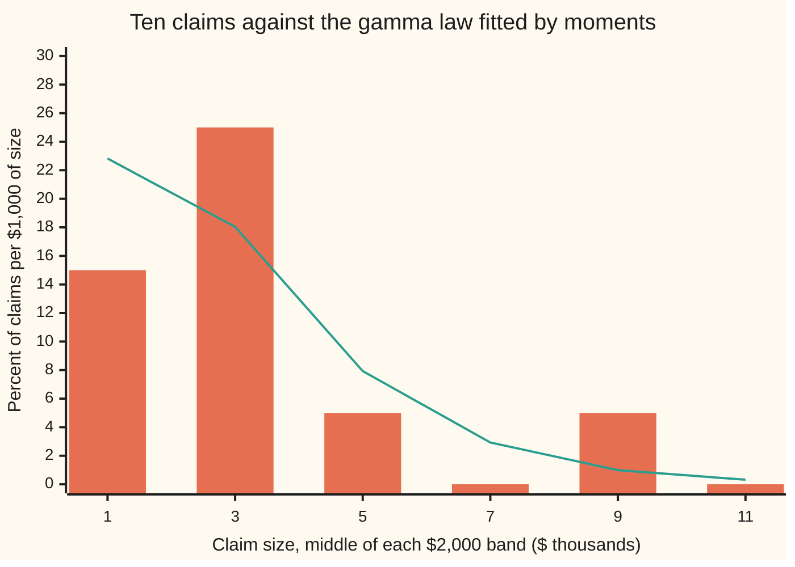
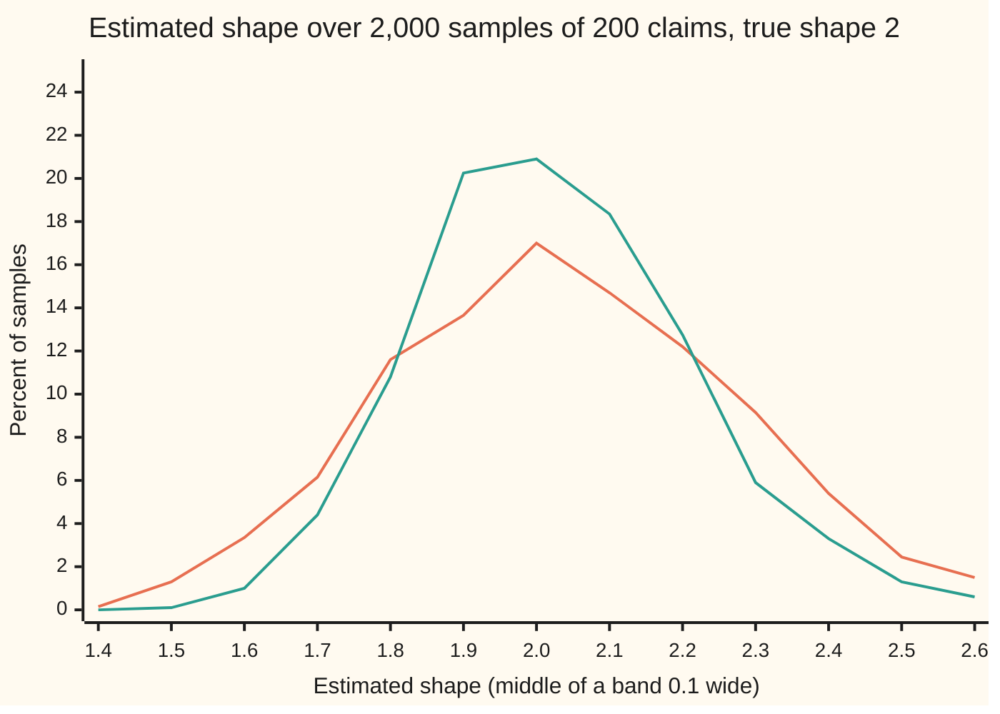
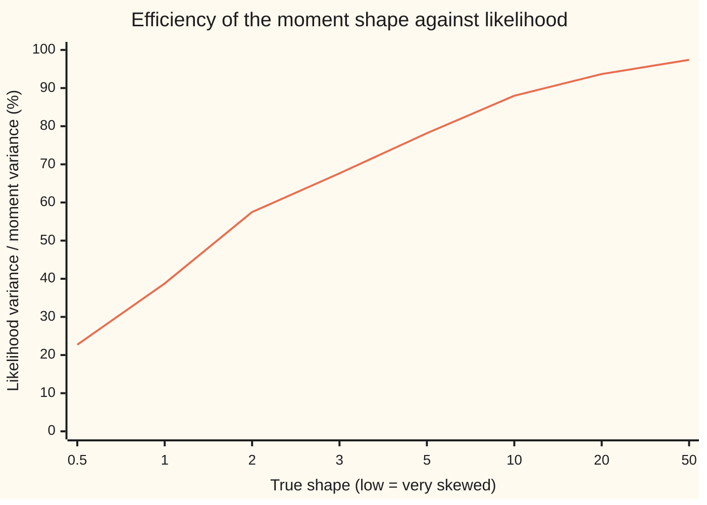

# Method of moments: match the sample's averages to the model's

Probability and statistics → Sampling and Estimation → Fitting a law by its averages → Method of moments

---

## General Overview

A small insurer pays ten claims on a line of phone-and-laptop cover in one month. In dollars they are $500, $1,000, $1,000, $2,000, $2,500, $3,000, $3,500, $3,500, $5,000 and $8,000. Most are modest; one is large. The pricing team wants a smooth law for claim size, so it can answer questions the ten numbers cannot: how often will a claim pass $10,000?

The gamma law is the usual first choice for sizes like these ([gamma-and-beta-distributions](../04-Continuous%20Distributions/07-gamma-and-beta-distributions.md)). It is positive, it has a hump and a long right tail, and it has two dials. The **shape** sets how skewed it is. The **rate** sets the scale in dollars. The data have to choose both dials.

The method of moments chooses them in the plainest way. A **moment** is an average of a power: the average claim is the first moment, the average squared claim the second. The ten claims have a first and a second moment. So does every gamma law. Turn the two dials until the law's two moments equal the sample's. Here the claims average $3,000 with a variance of 4.5 (thousand dollars) squared, and exactly one gamma law matches: shape 2, rate 0.667 per $1,000. It puts about 1 claim in 100 above $10,000.

Karl Pearson fitted curves this way in 1894. Maximum likelihood, the method of the card before this one, arrived later and usually does better. This card solves the moment equations for one and two dials, compares the answers with maximum likelihood on the same claims, and measures what the simpler method costs.

**Write the model's averages as formulas in its dials, set them equal to the sample's averages, and solve: the solution is the estimate.**

**What kind of fact this is:** a method, a recipe for turning data into an estimate; that its answer settles on the truth as the sample grows, and how widely it scatters, are shown on this card in Why it works, from the law of large numbers and a first-order Taylor step.

### The picture: ten claims and the gamma law that matches their moments



Bars: the ten claims, counted in $2,000 bands and spread per $1,000 (three claims below $2,000 is 30 percent of claims over $2,000 of size, so 15 per $1,000). Line: the gamma law with shape 2 and rate 0.667, its density in percent per $1,000. Ten claims make a ragged histogram; the fitted law is the smooth guess behind it.

---

## The formula

Notation first, in words. $X$ is the size of one claim, a random variable, in thousands of dollars; $x_i$ is the $i$-th observed claim and $n$ is how many there are. $\alpha$ (alpha) is the gamma law's shape and $\lambda$ (lambda) its rate, per thousand dollars. A bar means an average over the sample: $\bar{x}$ is the average claim. A hat marks an estimate: $\hat\alpha$ is the shape the data choose.

The gamma law's first two moments, from its own card:

$$E[X] = \frac{\alpha}{\lambda}, \qquad E[X^2] = \frac{\alpha(\alpha+1)}{\lambda^2}, \qquad \mathrm{Var}(X) = \frac{\alpha}{\lambda^2}$$

The sample's two moments are $\bar{x} = \frac{1}{n}\sum x_i$ and $m_2 = \frac{1}{n}\sum x_i^2$; their difference $v = m_2 - \bar{x}^2$ is the sample variance, dividing by $n$. Set model equal to sample and solve:

$$\frac{\hat\alpha}{\hat\lambda} = \bar{x}, \quad \frac{\hat\alpha}{\hat\lambda^2} = v \qquad\Longrightarrow\qquad \hat\alpha = \frac{\bar{x}^2}{v}, \qquad \hat\lambda = \frac{\bar{x}}{v}$$

**Read it aloud:** the shape is the squared average divided by the variance, and the rate is the average divided by the variance.

With one dial, one equation is enough. The exponential law is the gamma with shape fixed at 1; its mean is $1/\lambda$, so matching the mean gives $\hat\lambda = 1/\bar{x}$.

The method's standard error for the shape, from Step 4:

$$\mathrm{SE}(\hat\alpha) \approx \sqrt{\frac{2\alpha(\alpha+1)}{n}}$$

| Symbol | Plain meaning | In our example | Push it up and the answer… |
| --- | --- | --- | --- |
| $X$, $x_i$, $i$ | one claim's size (random), and the $i$-th claim seen | $x_{10} = 8$ | a larger claim raises $v$ faster than $\bar{x}^2$, so the shape falls |
| $n$ | number of claims | 10 | standard errors shrink like $1/\sqrt{n}$ |
| $\alpha$ | the shape: how many exponential gaps the claim is built from; low means skewed | 2 | the law becomes less skewed, more like a bell |
| $\lambda$ | the rate, per $1,000; its reciprocal $1/\lambda$ is the **scale** in thousands | 0.667, scale $1,500 | every claim shrinks in proportion |
| $\bar{x}$ | the sample's first moment: the average claim | 3.0 ($3,000) | both estimates rise |
| $m_2$ | the sample's second moment: the average squared claim | 13.5 | the variance rises, shape and rate fall |
| $v$ | the sample variance, $m_2 - \bar{x}^2$, dividing by $n$ | 4.5 | shape and rate both fall |
| $\hat\alpha$, $\hat\lambda$ | the estimates: the dial settings the data choose | 2.00, 0.667 | — |
| $\overline{\ln x}$ | the average of the claims' natural logs; maximum likelihood matches this | 0.8209 | the likelihood shape rises |
| $\Gamma$ | the gamma integral, the gamma law's constant | Γ(2) = 1 | — |
| $\psi$, $\psi'$ | digamma, the slope of ln Γ; trigamma, the slope of $\psi$ | ψ'(2) = 0.6449 | — |
| $\mathrm{SE}$ | standard error: the typical distance of an estimate from the truth over repeated samples | 1.10 for the shape | — |

### When it holds

- **Independent claims from one law.** Ten claims from one storm are one event counted ten times; the averages then settle slowly or not at all, and the standard error above is too small.
- **The moments used exist.** The fit needs a finite variance; its standard error needs a finite fourth moment. A Pareto tail with index 2 or below has no variance, and the sample variance jumps each time a large claim arrives ([heavy-tails-pareto-and-cauchy](../04-Continuous%20Distributions/08-heavy-tails-pareto-and-cauchy.md)).
- **The equations have a solution inside the law's range.** If all ten claims were $3,000, then $v = 0$ and no gamma matches; for other families the solution can land outside the allowed values, such as a negative shape.
- **The family is right.** The moment equations fit a gamma to any positive data with $v > 0$. They never test whether a gamma is sensible.
- **Enough data for the error formula.** The standard error is a large-sample result; at $n = 10$ it is a rough guide, not a guarantee.

---

## Why it works

### Step 0: sample averages settle on the model's averages

The law of large numbers says an average of many independent draws settles on the long-run average ([law-of-large-numbers](../06-Limit%20Theorems%20in%20Practice/01-law-of-large-numbers.md)). That holds for the claims, for their squares and for any other function of them. So the sample's moments are estimates of the model's moments. The model's moments are formulas in the unknown dials. Setting the two equal gives equations whose unknowns are the dials. That is the whole method; the steps below make it exact and measure its error.

### Step 1: the gamma law's moments as formulas in its dials

The gamma density is $\lambda^\alpha x^{\alpha-1} e^{-\lambda x}/\Gamma(\alpha)$ for $x > 0$. Multiplying by $x^k$ adds *k* to the power, and the substitution $u = \lambda x$ turns the area into a gamma integral:

$$E[X^k] = \frac{\Gamma(\alpha + k)}{\Gamma(\alpha)\,\lambda^k} = \frac{\alpha(\alpha+1)\cdots(\alpha+k-1)}{\lambda^k}.$$

The second equality is the step rule $\Gamma(a+1) = a\,\Gamma(a)$ used *k* times. So $E[X] = \alpha/\lambda$, $E[X^2] = \alpha(\alpha+1)/\lambda^2$, and the variance is their difference after squaring the first: $\alpha/\lambda^2$.

### Step 2: two equations, two unknowns, one solution

Match $\bar{x}$ to $\alpha/\lambda$ and $v$ to $\alpha/\lambda^2$. Divide the first by the second: $\lambda$ is left alone, so $\hat\lambda = \bar{x}/v$. Put that back into the first: $\hat\alpha = \bar{x}\hat\lambda = \bar{x}^2/v$. Both are positive whenever $v > 0$, and the pair is the only solution, since each step was forced.

Matching the variance instead of $m_2$ changes nothing: $m_2 = v + \bar{x}^2$, so the two pairs of equations carry the same information. The variance is easier to solve.

One check is worth doing. The fitted law must return the sample's moments exactly. The code integrates $x$ and $x^2$ against the fitted gamma density and gets 3.0000 and 13.5000: the averages were matched, not approximated.

### Step 3: the estimate settles on the truth

As $n$ grows, $\bar{x}$ settles on $\alpha/\lambda$ and $m_2$ on $\alpha(\alpha+1)/\lambda^2$ (Step 0). The estimates are smooth functions of those two averages, and smooth functions do not jump: a small change in the inputs makes a small change in the output, as long as the variance in the denominator stays away from 0. So $\hat\alpha$ settles on $\bar{x}^2/v$ evaluated at the true moments, which Step 2 showed is $\alpha$. An estimator that settles on the truth is consistent, the word from [populations-samples-and-estimators](01-populations-samples-and-estimators.md).

### Step 4: how far off, by the slopes of the solution

Consistency says the error shrinks. The size of the error at a given $n$ comes from slopes. Near the truth, $\hat\alpha$ moves by (its slope in $\bar{x}$) times the error in $\bar{x}$, plus (its slope in $m_2$) times the error in $m_2$; this first-order Taylor step is the delta method of [delta-method-and-slutsky](../06-Limit%20Theorems%20in%20Practice/05-delta-method-and-slutsky.md). The two averages err together, since a big claim raises both, so the variance of $\hat\alpha$ collects both errors and their covariance. For the gamma law the terms collapse to

$$n\,\mathrm{Var}(\hat\alpha) \approx 2\alpha(\alpha+1) = 12 \text{ at shape } 2.$$

So with ten claims the shape's standard error is about $\sqrt{12/10} = 1.10$. The estimate 2.00 is honest to roughly one unit either way.

<details>
<summary>Detailed proof: the variance of the moment shape</summary>

Write the true moments $\mu_k = E[X^k]$ and $d = \mu_2 - \mu_1^2 = \alpha/\lambda^2$. The shape is $g(\mu_1, \mu_2) = \mu_1^2/d$. Its slopes are
$$\frac{\partial g}{\partial \mu_1} = \frac{2\mu_1\mu_2}{d^2} = 2(\alpha+1)\lambda, \qquad \frac{\partial g}{\partial \mu_2} = -\frac{\mu_1^2}{d^2} = -\lambda^2.$$
One claim contributes $X$ to the first average and $X^2$ to the second. Their variances and covariance, from Step 1 with *k* up to 4, are
$$\mathrm{Var}(X) = \frac{\alpha}{\lambda^2}, \quad \mathrm{Cov}(X, X^2) = \mu_3 - \mu_1\mu_2 = \frac{2\alpha(\alpha+1)}{\lambda^3}, \quad \mathrm{Var}(X^2) = \mu_4 - \mu_2^2 = \frac{\alpha(\alpha+1)(4\alpha+6)}{\lambda^4}.$$
The averages of $n$ claims have these divided by $n$. The first-order change in the shape is a weighted sum of the two errors, so its variance is (slope 1)^2 Var + 2 (slope 1)(slope 2) Cov + (slope 2)^2 Var:
$$n\,\mathrm{Var}(\hat\alpha) \approx 4\alpha(\alpha+1)^2 - 8\alpha(\alpha+1)^2 + \alpha(\alpha+1)(4\alpha+6) = \alpha(\alpha+1)\,[\,4\alpha + 4 - 8\alpha - 8 + 4\alpha + 6\,] = 2\alpha(\alpha+1).$$
The neglected second-order terms shrink like $1/n$ against these, so the approximation improves with $n$. The code computes the same quadratic form numerically from the moments and gets 12.0000; a simulation of 2,000 samples of 200 claims gets 11.9801.

</details>

### Step 5: maximum likelihood is also moment matching, with a better moment

Write the gamma log-likelihood of the claims ([maximum-likelihood](04-maximum-likelihood.md)), divided by $n$; $\overline{\ln x}$ is the average of the claims' natural logs:

$$\frac{1}{n}\ell(\alpha, \lambda) = \alpha \ln\lambda - \ln\Gamma(\alpha) + (\alpha - 1)\,\overline{\ln x} - \lambda\,\bar{x}.$$

Set its slope in $\lambda$ to zero: $\alpha/\lambda = \bar{x}$. That is the first moment equation again. Set its slope in $\alpha$ to zero: $\ln\lambda - \psi(\alpha) + \overline{\ln x} = 0$, where $\psi$, the digamma function, is the slope of ln Γ. Since $E[\ln X] = \psi(\alpha) - \ln\lambda$ for a gamma law, this says: match the average log. Substituting $\lambda = \alpha/\bar{x}$ leaves one equation in the shape alone,

$$\ln\hat\alpha - \psi(\hat\alpha) = \ln\bar{x} - \overline{\ln x}.$$

So both methods match the mean. They differ in the second average. Moments match the average square; likelihood matches the average log. Squares give the largest claim enormous weight: the $8,000 claim is 64 of the 135 in $\sum x_i^2$, almost half. Logs tame it. That is why likelihood wastes less of the data. Its variance comes from the Fisher information ([fisher-information-and-cramer-rao](07-fisher-information-and-cramer-rao.md)), which for two dials is a two-by-two table; the folded note below works it out. With $\psi'$, the trigamma function (the slope of $\psi$), it is

$$n\,\mathrm{Var}(\hat\alpha_{\mathrm{ML}}) \approx \frac{\alpha}{\alpha\,\psi'(\alpha) - 1} = 6.8997 \text{ at shape } 2,$$

against 12 for moments. The ratio, 57.50 percent, is the moment method's **efficiency**: its answer is as precise as likelihood would be with 57.50 percent of the claims.

<details>
<summary>The algebra behind 6.8997: the information table for two dials</summary>

One claim's log-likelihood is $\alpha\ln\lambda - \ln\Gamma(\alpha) + (\alpha - 1)\ln x - \lambda x$. Its second slopes are
$$\frac{\partial^2}{\partial\alpha^2} = -\psi'(\alpha), \qquad \frac{\partial^2}{\partial\alpha\,\partial\lambda} = \frac{1}{\lambda}, \qquad \frac{\partial^2}{\partial\lambda^2} = -\frac{\alpha}{\lambda^2}.$$
None of them involves x, so their averages over claims are these same numbers. With two dials, the Fisher information of one claim is a table with a row and a column for each dial, holding minus these second slopes:
$$\begin{pmatrix} \psi'(\alpha) & -1/\lambda \\ -1/\lambda & \alpha/\lambda^2 \end{pmatrix}, \qquad \text{determinant} = \frac{\alpha\,\psi'(\alpha) - 1}{\lambda^2}.$$
The two-dial form of the Fisher result, stated here without proof, says two things: in large samples, n times the variance of each likelihood estimate is the matching diagonal entry of the inverse table; and no unbiased estimator of that dial does better. A two-by-two table is inverted by swapping its diagonal entries, changing the sign of the other two and dividing by the determinant. The shape's entry is therefore
$$\frac{\alpha/\lambda^2}{(\alpha\,\psi'(\alpha) - 1)/\lambda^2} = \frac{\alpha}{\alpha\,\psi'(\alpha) - 1},$$
which at shape 2, where ψ'(2) = π^2/6 − 1, is 6.8997. The rate's entry is $\lambda^2\psi'(\alpha)/(\alpha\,\psi'(\alpha) - 1)$. At the likelihood fit to the ten claims, these give the standard errors 0.81 and 0.307. Had the rate been known, the table would shrink to its top-left entry and the shape's figure would be the smaller 1/ψ'(α): the off-diagonal entries record that a change of shape can be partly mimicked by a change of rate, and not knowing the rate costs precision. The code's `mle_avar` evaluates these two formulas.

</details>

### The picture: two estimators on the same samples



Orange: the moment estimate. Green: the likelihood estimate. Both centre near 2; the green curve is taller and narrower. Samples come from a gamma law with shape 2 and rate 0.667, the law fitted above, drawn by the check's own generator. Of the moment estimates, 1.40 percent fall outside the plotted range, against 0.35 percent of the likelihood estimates.

How much the moment method loses depends on how skewed the law is:



At shape 0.5 the moment method is as good as likelihood on 22.72 percent of the data. At shape 50 the gamma law is close to a bell curve, squares and logs carry the same information, and the two methods nearly agree: 97.39 percent.

### The other road: more moments than dials

With more moment equations than dials, no setting matches them all. The **generalized method of moments** then minimises a weighted distance between the model's and the sample's averages; with the best weights it can reach the likelihood's precision. Resampling the ten claims gives a standard error without Step 4's algebra: [bootstrap](08-bootstrap.md).

---

## Worked numbers, by hand

The ten claims, in thousands of dollars: 0.5, 1, 1, 2, 2.5, 3, 3.5, 3.5, 5, 8.

| Step | Arithmetic | Value |
| --- | --- | --- |
| sum of claims | 0.5 + 1 + 1 + 2 + 2.5 + 3 + 3.5 + 3.5 + 5 + 8 | 30 |
| $\bar{x}$, first moment | 30 / 10 | 3.0 |
| sum of squares | 0.25 + 1 + 1 + 4 + 6.25 + 9 + 12.25 + 12.25 + 25 + 64 | 135 |
| $m_2$, second moment | 135 / 10 | 13.5 |
| $v$, variance | 13.5 − 3.0^2 | 4.5 |
| $\hat\alpha$, shape | 3.0^2 / 4.5 | 2.00 |
| $\hat\lambda$, rate | 3.0 / 4.5 | 0.667 per $1,000 |
| scale $1/\hat\lambda$ | 4.5 / 3.0 | $1,500 |
| SE of the shape | √(2 × 2 × 3 / 10) | 1.10 |
| **fit** | **shape 2.00 (SE 1.10), rate 0.667 (SE 0.394)** | **gamma(2, 0.667)** |

A shape of 2 means a claim behaves like the sum of two independent exponential pieces, each averaging $1,500. The fitted law says about 1 claim in 100 (0.0098) exceeds $10,000. That figure is rough. Moving the shape one standard error either way, with the mean held at $3,000, moves it from 0.0404 down to 0.0025: anywhere from about 1 claim in 25 to 1 in 400. That range is a sensitivity check on the shape alone, not a confidence interval. At shape 1 the chance is 0.0357 (the first row of What breaks). The standard errors are large: ten claims pin the shape down only to "somewhere between 1 and 3".

**One dial.** Fix the shape at 1, an exponential law, and match the mean alone: $\hat\lambda = 1/3.0 = 0.3333$ per $1,000 (SE 0.1054). Climbing the exponential log-likelihood gives the same 0.3333. For the shelf's poll, 520 of 1,000 voters on one side, matching the mean of the yes-or-no answers gives 0.52 (SE 0.0158), and the likelihood again gives 0.52. For one-dial laws like these, whose likelihood depends on the data only through the total, the two methods are the same method.

**Two dials, by likelihood.** The average log of the claims is 0.8209, so the right side of Step 5's equation is ln 3 − 0.8209 = 0.2777. Solving $\ln\alpha - \psi(\alpha) = 0.2777$ by bisection gives shape 1.9508 (SE 0.81) and rate 0.6503 (SE 0.307). On these ten claims the two methods land close together; the gap between them lies well inside either standard error. The difference is in how they behave over many samples (Step 5), and in how they react to one extreme claim (below).

### What breaks if you drop a piece

| Mistake | Comes out at | What went wrong |
| --- | --- | --- |
| Match the mean only, shape fixed at 1 | chance of a claim over $10,000: 0.0357, not 0.0098 | one moment cannot fix two dials; the exponential tail is 3.6563 times the gamma's here |
| Read the fitted rate as a scale | average claim $1,333, not $3,000 | books write the gamma law with a rate or a scale; 0.667 per $1,000 is a scale of $1,500 |
| One $40,000 claim joins the ten | moment shape 0.3454; likelihood shape 0.7751 | the square of 40 is 1,600, which swamps the other 135; logs dilute it |
| Divide the variance by n − 1 and call it the same fit | shape 1.80, not 2.00 | a different, also defensible, estimator; say which one was used |

---

## Code, from first principles, and it actually runs

The check fits the ten claims by moments, then confirms the fit by a second road: it integrates $x$ and $x^2$ against the fitted density with Simpson's rule and recovers the sample's 3.0 and 13.5. It fits by likelihood two independent ways: bisection on the digamma equation, and golden-section climbing of the log-likelihood itself, which uses a log-gamma function and no digamma. It computes the moment method's error by the delta method as a quadratic form, checks it against the closed form 2α(α + 1), and checks both against a simulation of 2,000 samples of 200 claims drawn from the fitted law with SplitMix64, seed 20260928. It confirms the generator: the 400,000 simulated claims average 3.0032 (SE 0.0034), the law's 3. It confirms that likelihood gives the moment answer for the exponential and the poll. It integrates the fitted law's tail beyond $10,000 by Simpson's rule, which matches the closed form at shape 2 and also works at the shapes one standard error either side, where no closed form applies. Log-gamma, digamma and trigamma are written out as Stirling-type series; digamma and trigamma are checked against Euler's constant and π^2/6 − 1.

### Python

```python
# Method of moments -- the check behind the card.  Standard library only.
# A gamma law fitted to ten insurance claims ($ thousands): by matching moments, then by
# maximum likelihood.  Log-gamma, digamma, trigamma, the integrator, both root finders
# and the random generator (SplitMix64, seed 20260928) are written out here.
from math import log, exp, sqrt, pi

M64 = (1 << 64) - 1
def splitmix64(s):                                   # the generator both languages share
    s = (s + 0x9E3779B97F4A7C15) & M64
    z = ((s ^ (s >> 30)) * 0xBF58476D1CE4E5B9) & M64
    z = ((z ^ (z >> 27)) * 0x94D049BB133111EB) & M64
    return s, z ^ (z >> 31)

def lgam(a):                                         # ln Gamma(a): push a past 7, then Stirling
    r = 0.0
    while a < 7: r -= log(a); a += 1
    return r + (a - 0.5) * log(a) - a + 0.5 * log(2 * pi) + 1 / (12 * a) - 1 / (360 * a**3) + 1 / (1260 * a**5)
def digamma(a):                                      # psi(a), the slope of ln Gamma
    r = 0.0
    while a < 7: r -= 1 / a; a += 1
    return r + log(a) - 1 / (2 * a) - 1 / (12 * a * a) + 1 / (120 * a**4) - 1 / (252 * a**6)
def trigamma(a):                                     # psi'(a), the slope of psi
    r = 0.0
    while a < 7: r += 1 / (a * a); a += 1
    return r + 1 / a + 1 / (2 * a * a) + 1 / (6 * a**3) - 1 / (30 * a**5) + 1 / (42 * a**7)

def mom(xs):                                         # match the mean and the variance
    n = len(xs); m1 = sum(xs) / n; m2 = sum(x * x for x in xs) / n
    v = m2 - m1 * m1
    return m1 * m1 / v, m1 / v
def mle(xs):                                         # road 1: ln a - psi(a) = ln(mean) - mean(ln x), bisection
    n = len(xs); m = sum(xs) / n; c = log(m) - sum(log(x) for x in xs) / n
    lo, hi = log(1e-3), log(1e3)
    for _ in range(80):
        mid = 0.5 * (lo + hi)
        if log(exp(mid)) - digamma(exp(mid)) > c: lo = mid
        else: hi = mid
    a = exp(0.5 * (lo + hi)); return a, a / m
def golden(f, lo, hi):                               # maximise f on [lo, hi] by golden section
    g = (sqrt(5) - 1) / 2
    for _ in range(200):
        a, b = hi - g * (hi - lo), lo + g * (hi - lo)
        if f(a) > f(b): hi = b
        else: lo = a
    return 0.5 * (lo + hi)
def mle_golden(xs):                                  # road 2: climb the log-likelihood itself, no digamma
    n = len(xs); m = sum(xs) / n; L = sum(log(x) for x in xs) / n
    ll = lambda t: exp(t) * log(exp(t) / m) - lgam(exp(t)) + (exp(t) - 1) * L - exp(t)
    a = exp(golden(ll, log(1e-2), log(1e2))); return a, a / m
def fitted_moment(a, lam, k):                        # integral of x^k times the fitted density, Simpson
    f = lambda x: x**k * exp(a * log(lam) + (a - 1) * log(x) - lam * x - lgam(a)) if x > 0 else 0.0
    N, top = 20000, 80.0; h = top / N
    return h / 3 * sum((1 if i in (0, N) else 4 if i % 2 else 2) * f(i * h) for i in range(N + 1))
def dens(a, lam, x): return exp(a * log(lam) + (a - 1) * log(x) - lam * x - lgam(a))
def tail(a, lam, N=20000, h=150.0 / 20000):          # P(X > 10) for any shape: Simpson on [10, 160]
    return h / 3 * sum((1 if i in (0, N) else 4 if i % 2 else 2) * dens(a, lam, 10 + i * h) for i in range(N + 1))
def mom_avar(a, lam):                                # n x variance of the moment estimates, delta method
    mu = [1.0]
    for k in range(1, 5): mu.append(mu[-1] * (a + k - 1) / lam)      # E[X^k] of the gamma law
    v11, v12, v22 = mu[2] - mu[1]**2, mu[3] - mu[1] * mu[2], mu[4] - mu[2]**2
    m1, m2 = mu[1], mu[2]; d = m2 - m1 * m1
    q = lambda g1, g2: g1 * g1 * v11 + 2 * g1 * g2 * v12 + g2 * g2 * v22
    return q(2 * m1 * m2 / d**2, -m1 * m1 / d**2), q((m2 + m1 * m1) / d**2, -m1 / d**2)
def mle_avar(a, lam):                                # n x variance of the ML estimates, inverse information
    t = trigamma(a); det = a * t - 1
    return a / det, lam * lam * t / det

claims = [0.5, 1.0, 1.0, 2.0, 2.5, 3.0, 3.5, 3.5, 5.0, 8.0]
n = len(claims)
a_m, l_m = mom(claims); a_l, l_l = mle(claims); a_g, l_g = mle_golden(claims)
xbar, sq, lnbar = sum(claims) / n, sum(x * x for x in claims) / n, sum(log(x) for x in claims) / n
print(f"claims, n = {n}, sum {n*xbar:.4f}, mean {xbar:.4f}, sum of squares {n*sq:.4f}, mean of squares {sq:.4f}")
s2 = sum((x - xbar)**2 for x in claims) / (n - 1)
print(f"variance (divide by n) {sq - xbar**2:.4f}, divide by n-1 {s2:.4f}, shape then {xbar**2 / s2:.4f}")
print(f"mean of ln x {lnbar:.4f}, ln(mean) - mean ln x {log(xbar) - lnbar:.4f}, mean of 1/x {sum(1 / x for x in claims) / n:.4f}")
sa, sl = mom_avar(a_m, l_m); ta, tl = mle_avar(a_l, l_l)
print(f"MoM  shape {a_m:.4f} (SE {sqrt(sa/n):.4f})  rate {l_m:.4f} (SE {sqrt(sl/n):.4f})  scale {1/l_m:.4f}")
print(f"MLE  shape {a_l:.4f} (SE {sqrt(ta/n):.4f})  rate {l_l:.4f} (SE {sqrt(tl/n):.4f})  scale {1/l_l:.4f}")
print(f"MLE by golden section on the likelihood: shape {a_g:.4f} rate {l_g:.4f}")
e1, e2 = fitted_moment(a_m, l_m, 1), fitted_moment(a_m, l_m, 2)
print(f"fitted MoM gamma, integrated: E[X] {e1:.4f}  E[X^2] {e2:.4f}")
exp_rate = exp(golden(lambda t: n * t - exp(t) * n * xbar, log(1e-3), log(1e3)))    # exponential log-likelihood
print(f"one parameter: exponential rate by MoM {1/xbar:.4f}, by likelihood {exp_rate:.4f}, SE {1/xbar/sqrt(n):.4f}")
p_hat = golden(lambda t: 520 * log(t) + 480 * log(1 - t), 1e-6, 1 - 1e-6)
print(f"house poll: MoM share {520/1000:.4f}, likelihood {p_hat:.4f}, SE {sqrt(0.52*0.48/1000):.4f}")
print(f"delta method, n x Var(MoM shape) {sa:.4f} vs 2a(a+1) = {2*a_m*(a_m+1):.4f}; psi(1) {digamma(1.0):.4f}, psi'(2) {trigamma(2.0):.4f}")

# ---- what breaks ----
tail_g = exp(-10 * l_m) * (1 + 10 * l_m)                             # P(X > 10) for whole shape 2
print(f"break: P(claim > 10) gamma fit {tail_g:.4f}, exponential fit {exp(-10/3):.4f}, ratio {exp(-10/3) / tail_g:.4f}")
lo_a, hi_a = a_m - sqrt(sa / n), a_m + sqrt(sa / n); print(f"tail by Simpson {tail(a_m, l_m):.4f}; shape -/+ 1 SE, mean held at 3: {tail(lo_a, lo_a / xbar):.4f} to {tail(hi_a, hi_a / xbar):.4f}")
print(f"break: rate read as scale, mean {a_m * l_m:.4f} instead of {a_m / l_m:.4f}")
big = claims + [40.0]
print(f"break: add a 40 claim, MoM shape {mom(big)[0]:.4f}  MLE shape {mle(big)[0]:.4f}")

# ---- simulation: truth shape 2, rate 2/3, R samples of n claims each ----
A, LAM, R, NS, state, tot = 2.0, 2.0 / 3.0, 2000, 200, 20260928, 0.0
est = {"MoM": [], "MLE": []}
for r in range(R):
    xs = []
    for i in range(NS):
        x = 0.0
        for j in range(2):                                           # shape 2 = sum of two exponential gaps
            state, z = splitmix64(state)
            x -= log(((z >> 11) + 0.5) * 2.0**-53) / LAM
        xs.append(x); tot += x
    est["MoM"].append(mom(xs)[0]); est["MLE"].append(mle(xs)[0])
se_draw = sqrt(A) / LAM / sqrt(R * NS)                              # sd of one gamma claim over sqrt(draws)
print(f"sim, all {R * NS} draws: mean {tot / (R * NS):.4f} (SE {se_draw:.4f}), the law's mean {A / LAM:.4f}")
bins = [1.4 + 0.1 * k for k in range(13)]
print(f"sim, {R} samples of {NS}: shape estimate  mean   (SE)     n x variance  theory   % off chart")
for key, th in (("MoM", mom_avar(A, LAM)[0]), ("MLE", mle_avar(A, LAM)[0])):
    e = est[key]; mu = sum(e) / R; var = sum((v - mu)**2 for v in e) / (R - 1)
    off = 100 * sum(not 1.35 <= v < 2.65 for v in e) / R
    print(f"sim, {key}                          {mu:.4f} ({sqrt(var/R):.4f})  {NS*var:8.4f}   {th:.4f}   {off:.2f}")
    est[key + "v"] = NS * var
    print(f"chart, {key} percent per bin " + " ".join(f"{100 * sum(b - 0.05 <= v < b + 0.05 for v in e) / R:.2f}" for b in bins))
print("chart, bin centres         " + " ".join(f"{b:.1f}" for b in bins))
print("chart, claim size           " + " ".join(f"{x:5.1f}" for x in range(1, 12, 2)))
print("chart, claims, % per 1000  " + " ".join(f"{100 * sum(k - 1 <= c < k + 1 for c in claims) / (2 * n):5.2f}" for k in range(1, 12, 2)))
print("chart, MoM gamma, % per 1000 " + " ".join(f"{100 * dens(a_m, l_m, x):5.2f}" for x in range(1, 12, 2)))
print("chart, MLE gamma, % per 1000 " + " ".join(f"{100 * dens(a_l, l_l, x):5.2f}" for x in range(1, 12, 2)))
shapes = [0.5, 1, 2, 3, 5, 10, 20, 50]
print("efficiency, shape           " + " ".join(f"{s:6.1f}" for s in shapes))
print("efficiency, MLE/MoM var, %  " + " ".join(f"{100 * mle_avar(s, 1)[0] / mom_avar(s, 1)[0]:6.2f}" for s in shapes))

assert abs(a_m - 9 / 4.5) < 1e-12, "MoM shape on the claims: hand arithmetic says 9/4.5"
assert abs(e1 - xbar) < 1e-6, "the fitted law's integrated mean must be the sample's mean"
assert abs(e2 - sq) < 1e-6, "the fitted law's integrated E[X^2] must be the sample's mean square"
assert abs(a_l - a_g) < 1e-6, "digamma road and likelihood-climbing road must find the same MLE"
assert abs(sa - 2 * a_m * (a_m + 1)) < 1e-9, "delta method must give the closed form 2a(a+1)"
assert abs(digamma(1.0) + 0.5772156649015329) < 1e-9, "psi(1) is minus Euler's constant"
assert abs(trigamma(2.0) - (pi * pi / 6 - 1)) < 1e-9, "psi'(2) is pi^2/6 - 1"
assert abs(est["MoMv"] / mom_avar(A, LAM)[0] - 1) < 0.15, "simulated MoM spread within a few SE of theory"
assert abs(est["MLEv"] / mle_avar(A, LAM)[0] - 1) < 0.15, "simulated MLE spread within a few SE of theory"
assert est["MLEv"] < est["MoMv"], "MLE must be the tighter estimator at shape 2"
assert abs(tot / (R * NS) - A / LAM) < 4 * se_draw, "the generator must draw from the gamma law with mean 3"
assert abs(exp_rate - 1 / xbar) < 1e-6 and abs(p_hat - 0.52) < 1e-6, "one-dial laws: likelihood equals moments"
assert abs(tail(a_m, l_m) - tail_g) < 1e-9, "Simpson's tail at the fit must match the closed form for whole shape 2"
print("all checks passed")
```

**Ran 2026-10-06 on macOS, Python 3.14.6, standard library only. All checks passed. Output, pasted from the run:**

```
claims, n = 10, sum 30.0000, mean 3.0000, sum of squares 135.0000, mean of squares 13.5000
variance (divide by n) 4.5000, divide by n-1 5.0000, shape then 1.8000
mean of ln x 0.8209, ln(mean) - mean ln x 0.2777, mean of 1/x 0.6130
MoM  shape 2.0000 (SE 1.0954)  rate 0.6667 (SE 0.3944)  scale 1.5000
MLE  shape 1.9508 (SE 0.8089)  rate 0.6503 (SE 0.3072)  scale 1.5378
MLE by golden section on the likelihood: shape 1.9508 rate 0.6503
fitted MoM gamma, integrated: E[X] 3.0000  E[X^2] 13.5000
one parameter: exponential rate by MoM 0.3333, by likelihood 0.3333, SE 0.1054
house poll: MoM share 0.5200, likelihood 0.5200, SE 0.0158
delta method, n x Var(MoM shape) 12.0000 vs 2a(a+1) = 12.0000; psi(1) -0.5772, psi'(2) 0.6449
break: P(claim > 10) gamma fit 0.0098, exponential fit 0.0357, ratio 3.6563
tail by Simpson 0.0098; shape -/+ 1 SE, mean held at 3: 0.0404 to 0.0025
break: rate read as scale, mean 1.3333 instead of 3.0000
break: add a 40 claim, MoM shape 0.3454  MLE shape 0.7751
sim, all 400000 draws: mean 3.0032 (SE 0.0034), the law's mean 3.0000
sim, 2000 samples of 200: shape estimate  mean   (SE)     n x variance  theory   % off chart
sim, MoM                          2.0426 (0.0055)   11.9801   12.0000   1.40
chart, MoM percent per bin 0.15 1.30 3.35 6.15 11.60 13.65 17.00 14.70 12.20 9.15 5.40 2.45 1.50
sim, MLE                          2.0278 (0.0042)    7.0584   6.8997   0.35
chart, MLE percent per bin 0.00 0.10 1.00 4.40 10.80 20.25 20.90 18.35 12.75 5.90 3.30 1.30 0.60
chart, bin centres         1.4 1.5 1.6 1.7 1.8 1.9 2.0 2.1 2.2 2.3 2.4 2.5 2.6
chart, claim size             1.0   3.0   5.0   7.0   9.0  11.0
chart, claims, % per 1000  15.00 25.00  5.00  0.00  5.00  0.00
chart, MoM gamma, % per 1000 22.82 18.04  7.93  2.93  0.99  0.32
chart, MLE gamma, % per 1000 23.00 17.80  7.88  2.96  1.02  0.34
efficiency, shape              0.5    1.0    2.0    3.0    5.0   10.0   20.0   50.0
efficiency, MLE/MoM var, %   22.72  38.76  57.50  67.64  78.16  87.98  93.68  97.39
all checks passed
```

The moment fit reproduces the hand arithmetic exactly. The two likelihood roads agree to four decimals. The simulated spreads, 11.9801 and 7.0584, sit close to theory's 12.0000 and 6.8997. The simulated means, 2.0426 (SE 0.0055) and 2.0278 (SE 0.0042), sit above 2: both estimators run slightly high at 200 claims, a bias of the kind defined on [bias-variance-and-mean-squared-error](06-bias-variance-and-mean-squared-error.md).

### Rust

Same checks, same generator, same labels. The output is byte-identical to Python's.

```rust
// Method of moments -- the same check as method_of_moments_check.py, in Rust.  Std only, no crates.
// A gamma law fitted to ten insurance claims ($ thousands) by matching moments and by maximum
// likelihood.  Log-gamma, digamma, trigamma, Simpson, bisection, golden section, SplitMix64 written out.
use std::f64::consts::PI;

fn splitmix64(s: u64) -> (u64, u64) {
    let s = s.wrapping_add(0x9E3779B97F4A7C15);
    let mut z = (s ^ (s >> 30)).wrapping_mul(0xBF58476D1CE4E5B9);
    z = (z ^ (z >> 27)).wrapping_mul(0x94D049BB133111EB);
    (s, z ^ (z >> 31))
}
fn lgam(mut a: f64) -> f64 {
    let mut r = 0.0;
    while a < 7.0 { r -= a.ln(); a += 1.0; }
    r + (a - 0.5) * a.ln() - a + 0.5 * (2.0 * PI).ln() + 1.0 / (12.0 * a) - 1.0 / (360.0 * a.powi(3)) + 1.0 / (1260.0 * a.powi(5))
}
fn digamma(mut a: f64) -> f64 {
    let mut r = 0.0;
    while a < 7.0 { r -= 1.0 / a; a += 1.0; }
    r + a.ln() - 1.0 / (2.0 * a) - 1.0 / (12.0 * a * a) + 1.0 / (120.0 * a.powi(4)) - 1.0 / (252.0 * a.powi(6))
}
fn trigamma(mut a: f64) -> f64 {
    let mut r = 0.0;
    while a < 7.0 { r += 1.0 / (a * a); a += 1.0; }
    r + 1.0 / a + 1.0 / (2.0 * a * a) + 1.0 / (6.0 * a.powi(3)) - 1.0 / (30.0 * a.powi(5)) + 1.0 / (42.0 * a.powi(7))
}
fn mean(xs: &[f64]) -> f64 { xs.iter().sum::<f64>() / xs.len() as f64 }
fn mom(xs: &[f64]) -> (f64, f64) {
    let m1 = mean(xs);
    let m2 = xs.iter().map(|x| x * x).sum::<f64>() / xs.len() as f64;
    let v = m2 - m1 * m1;
    (m1 * m1 / v, m1 / v)
}
fn mle(xs: &[f64]) -> (f64, f64) {
    let m = mean(xs);
    let c = m.ln() - xs.iter().map(|x| x.ln()).sum::<f64>() / xs.len() as f64;
    let (mut lo, mut hi) = (1e-3f64.ln(), 1e3f64.ln());
    for _ in 0..80 {
        let mid = 0.5 * (lo + hi);
        if mid.exp().ln() - digamma(mid.exp()) > c { lo = mid; } else { hi = mid; }
    }
    let a = (0.5 * (lo + hi)).exp(); (a, a / m)
}
fn golden<F: Fn(f64) -> f64>(f: F, mut lo: f64, mut hi: f64) -> f64 {
    let g = (5f64.sqrt() - 1.0) / 2.0;
    for _ in 0..200 {
        let (a, b) = (hi - g * (hi - lo), lo + g * (hi - lo));
        if f(a) > f(b) { hi = b; } else { lo = a; }
    }
    0.5 * (lo + hi)
}
fn mle_golden(xs: &[f64]) -> (f64, f64) {
    let m = mean(xs);
    let l = xs.iter().map(|x| x.ln()).sum::<f64>() / xs.len() as f64;
    let ll = |t: f64| t.exp() * (t.exp() / m).ln() - lgam(t.exp()) + (t.exp() - 1.0) * l - t.exp();
    let a = golden(ll, 1e-2f64.ln(), 1e2f64.ln()).exp(); (a, a / m)
}
fn dens(a: f64, lam: f64, x: f64) -> f64 { (a * lam.ln() + (a - 1.0) * x.ln() - lam * x - lgam(a)).exp() }
fn tail(a: f64, lam: f64) -> f64 { let (n, h) = (20000usize, 150.0 / 20000.0); h / 3.0 * (0..=n).map(|i| (if i == 0 || i == n { 1.0 } else if i % 2 == 1 { 4.0 } else { 2.0 }) * dens(a, lam, 10.0 + i as f64 * h)).sum::<f64>() }
fn fitted_moment(a: f64, lam: f64, k: i32) -> f64 {
    let (n, h) = (20000usize, 80.0 / 20000.0);
    let mut s = 0.0;
    for i in 0..=n {
        let x = i as f64 * h;
        let f = if x > 0.0 { x.powi(k) * dens(a, lam, x) } else { 0.0 };
        s += (if i == 0 || i == n { 1.0 } else if i % 2 == 1 { 4.0 } else { 2.0 }) * f;
    }
    h / 3.0 * s
}
fn mom_avar(a: f64, lam: f64) -> (f64, f64) {
    let mut mu = vec![1.0];
    for k in 1..5 { let prev = mu[k - 1]; mu.push(prev * (a + k as f64 - 1.0) / lam); }
    let (v11, v12, v22) = (mu[2] - mu[1] * mu[1], mu[3] - mu[1] * mu[2], mu[4] - mu[2] * mu[2]);
    let (m1, m2, d) = (mu[1], mu[2], mu[2] - mu[1] * mu[1]);
    let q = |g1: f64, g2: f64| g1 * g1 * v11 + 2.0 * g1 * g2 * v12 + g2 * g2 * v22;
    (q(2.0 * m1 * m2 / (d * d), -m1 * m1 / (d * d)), q((m2 + m1 * m1) / (d * d), -m1 / (d * d)))
}
fn mle_avar(a: f64, lam: f64) -> (f64, f64) {
    let (t, det) = (trigamma(a), a * trigamma(a) - 1.0);
    (a / det, lam * lam * t / det)
}
fn row(v: &[f64], w: usize, p: usize) -> String { v.iter().map(|x| format!("{:w$.p$}", x)).collect::<Vec<_>>().join(" ") }

fn main() {
    let claims = [0.5, 1.0, 1.0, 2.0, 2.5, 3.0, 3.5, 3.5, 5.0, 8.0];
    let (n, nf) = (claims.len(), claims.len() as f64);
    let ((a_m, l_m), (a_l, l_l), (a_g, l_g)) = (mom(&claims), mle(&claims), mle_golden(&claims));
    let (xbar, sq) = (mean(&claims), claims.iter().map(|x| x * x).sum::<f64>() / nf);
    let lnbar = claims.iter().map(|x| x.ln()).sum::<f64>() / nf;
    println!("claims, n = {}, sum {:.4}, mean {:.4}, sum of squares {:.4}, mean of squares {:.4}", n, nf * xbar, xbar, nf * sq, sq);
    let s2 = claims.iter().map(|x| (x - xbar) * (x - xbar)).sum::<f64>() / (nf - 1.0);
    println!("variance (divide by n) {:.4}, divide by n-1 {:.4}, shape then {:.4}", sq - xbar * xbar, s2, xbar * xbar / s2);
    println!("mean of ln x {:.4}, ln(mean) - mean ln x {:.4}, mean of 1/x {:.4}", lnbar, xbar.ln() - lnbar, claims.iter().map(|x| 1.0 / x).sum::<f64>() / nf);
    let ((sa, sl), (ta, tl)) = (mom_avar(a_m, l_m), mle_avar(a_l, l_l));
    println!("MoM  shape {:.4} (SE {:.4})  rate {:.4} (SE {:.4})  scale {:.4}", a_m, (sa / nf).sqrt(), l_m, (sl / nf).sqrt(), 1.0 / l_m);
    println!("MLE  shape {:.4} (SE {:.4})  rate {:.4} (SE {:.4})  scale {:.4}", a_l, (ta / nf).sqrt(), l_l, (tl / nf).sqrt(), 1.0 / l_l);
    println!("MLE by golden section on the likelihood: shape {:.4} rate {:.4}", a_g, l_g);
    let (e1, e2) = (fitted_moment(a_m, l_m, 1), fitted_moment(a_m, l_m, 2));
    println!("fitted MoM gamma, integrated: E[X] {:.4}  E[X^2] {:.4}", e1, e2);
    let exp_rate = golden(|t: f64| nf * t - t.exp() * nf * xbar, 1e-3f64.ln(), 1e3f64.ln()).exp();
    println!("one parameter: exponential rate by MoM {:.4}, by likelihood {:.4}, SE {:.4}", 1.0 / xbar, exp_rate, 1.0 / xbar / nf.sqrt());
    let p_hat = golden(|t: f64| 520.0 * t.ln() + 480.0 * (1.0 - t).ln(), 1e-6, 1.0 - 1e-6);
    println!("house poll: MoM share {:.4}, likelihood {:.4}, SE {:.4}", 520.0 / 1000.0, p_hat, (0.52f64 * 0.48 / 1000.0).sqrt());
    println!("delta method, n x Var(MoM shape) {:.4} vs 2a(a+1) = {:.4}; psi(1) {:.4}, psi'(2) {:.4}", sa, 2.0 * a_m * (a_m + 1.0), digamma(1.0), trigamma(2.0));

    // ---- what breaks ----
    let tail_g = (-10.0 * l_m).exp() * (1.0 + 10.0 * l_m);
    println!("break: P(claim > 10) gamma fit {:.4}, exponential fit {:.4}, ratio {:.4}", tail_g, (-10.0f64 / 3.0).exp(), (-10.0f64 / 3.0).exp() / tail_g);
    let (lo_a, hi_a) = (a_m - (sa / nf).sqrt(), a_m + (sa / nf).sqrt()); println!("tail by Simpson {:.4}; shape -/+ 1 SE, mean held at 3: {:.4} to {:.4}", tail(a_m, l_m), tail(lo_a, lo_a / xbar), tail(hi_a, hi_a / xbar));
    println!("break: rate read as scale, mean {:.4} instead of {:.4}", a_m * l_m, a_m / l_m);
    let big = [&claims[..], &[40.0]].concat();
    println!("break: add a 40 claim, MoM shape {:.4}  MLE shape {:.4}", mom(&big).0, mle(&big).0);

    // ---- simulation: truth shape 2, rate 2/3, R samples of n claims each ----
    let (aa, lam, r, ns) = (2.0f64, 2.0 / 3.0, 2000usize, 200usize);
    let (mut state, mut tot): (u64, f64) = (20260928, 0.0);
    let (mut e_mom, mut e_mle) = (Vec::new(), Vec::new());
    for _ in 0..r {
        let mut xs = Vec::with_capacity(ns);
        for _ in 0..ns {
            let mut x = 0.0;
            for _ in 0..2 {
                let (s, z) = splitmix64(state); state = s;
                x -= (((z >> 11) as f64 + 0.5) * 2f64.powi(-53)).ln() / lam;
            }
            xs.push(x); tot += x;
        }
        e_mom.push(mom(&xs).0); e_mle.push(mle(&xs).0);
    }
    let se_draw = aa.sqrt() / lam / ((r * ns) as f64).sqrt();
    println!("sim, all {} draws: mean {:.4} (SE {:.4}), the law's mean {:.4}", r * ns, tot / (r * ns) as f64, se_draw, aa / lam);
    let bins: Vec<f64> = (0..13).map(|k| 1.4 + 0.1 * k as f64).collect();
    println!("sim, {} samples of {}: shape estimate  mean   (SE)     n x variance  theory   % off chart", r, ns);
    let mut nvar = Vec::new();
    for (key, e, th) in [("MoM", &e_mom, mom_avar(aa, lam).0), ("MLE", &e_mle, mle_avar(aa, lam).0)] {
        let mu = mean(e);
        let var = e.iter().map(|v| (v - mu) * (v - mu)).sum::<f64>() / (r as f64 - 1.0);
        let off = e.iter().filter(|v| !(1.35 <= **v && **v < 2.65)).count() as f64 * 100.0 / r as f64;
        println!("sim, {}                          {:.4} ({:.4})  {:8.4}   {:.4}   {:.2}", key, mu, (var / r as f64).sqrt(), ns as f64 * var, th, off);
        nvar.push(ns as f64 * var);
        let shares: Vec<f64> = bins.iter().map(|b| e.iter().filter(|v| b - 0.05 <= **v && **v < b + 0.05).count() as f64 * 100.0 / r as f64).collect();
        println!("chart, {} percent per bin {}", key, row(&shares, 0, 2));
    }
    println!("chart, bin centres         {}", row(&bins, 0, 1));
    let sizes: Vec<f64> = (0..6).map(|k| 1.0 + 2.0 * k as f64).collect();
    println!("chart, claim size           {}", row(&sizes, 5, 1));
    let hist: Vec<f64> = sizes.iter().map(|k| claims.iter().filter(|c| k - 1.0 <= **c && **c < k + 1.0).count() as f64 * 100.0 / (2.0 * nf)).collect();
    println!("chart, claims, % per 1000  {}", row(&hist, 5, 2));
    println!("chart, MoM gamma, % per 1000 {}", row(&sizes.iter().map(|x| 100.0 * dens(a_m, l_m, *x)).collect::<Vec<_>>(), 5, 2));
    println!("chart, MLE gamma, % per 1000 {}", row(&sizes.iter().map(|x| 100.0 * dens(a_l, l_l, *x)).collect::<Vec<_>>(), 5, 2));
    let shapes = [0.5, 1.0, 2.0, 3.0, 5.0, 10.0, 20.0, 50.0];
    println!("efficiency, shape           {}", row(&shapes, 6, 1));
    let eff: Vec<f64> = shapes.iter().map(|s| 100.0 * mle_avar(*s, 1.0).0 / mom_avar(*s, 1.0).0).collect();
    println!("efficiency, MLE/MoM var, %  {}", row(&eff, 6, 2));

    assert!((a_m - 9.0 / 4.5).abs() < 1e-12, "MoM shape on the claims: hand arithmetic says 9/4.5");
    assert!((e1 - xbar).abs() < 1e-6, "the fitted law's integrated mean must be the sample's mean");
    assert!((e2 - sq).abs() < 1e-6, "the fitted law's integrated E[X^2] must be the sample's mean square");
    assert!((a_l - a_g).abs() < 1e-6, "digamma road and likelihood-climbing road must find the same MLE");
    assert!((sa - 2.0 * a_m * (a_m + 1.0)).abs() < 1e-9, "delta method must give the closed form 2a(a+1)");
    assert!((digamma(1.0) + 0.5772156649015329).abs() < 1e-9, "psi(1) is minus Euler's constant");
    assert!((trigamma(2.0) - (PI * PI / 6.0 - 1.0)).abs() < 1e-9, "psi'(2) is pi^2/6 - 1");
    assert!((nvar[0] / mom_avar(aa, lam).0 - 1.0).abs() < 0.15, "simulated MoM spread within a few SE of theory");
    assert!((nvar[1] / mle_avar(aa, lam).0 - 1.0).abs() < 0.15, "simulated MLE spread within a few SE of theory");
    assert!(nvar[1] < nvar[0], "MLE must be the tighter estimator at shape 2");
    assert!((tot / (r * ns) as f64 - aa / lam).abs() < 4.0 * se_draw, "the generator must draw from the gamma law with mean 3");
    assert!((exp_rate - 1.0 / xbar).abs() < 1e-6 && (p_hat - 0.52).abs() < 1e-6, "one-dial laws: likelihood equals moments");
    assert!((tail(a_m, l_m) - tail_g).abs() < 1e-9, "Simpson's tail at the fit must match the closed form for whole shape 2");
    println!("all checks passed");
}
```

**Ran 2026-10-06 on macOS, rustc 1.98.1, no crates. All checks passed. Output, pasted from the run:**

```
claims, n = 10, sum 30.0000, mean 3.0000, sum of squares 135.0000, mean of squares 13.5000
variance (divide by n) 4.5000, divide by n-1 5.0000, shape then 1.8000
mean of ln x 0.8209, ln(mean) - mean ln x 0.2777, mean of 1/x 0.6130
MoM  shape 2.0000 (SE 1.0954)  rate 0.6667 (SE 0.3944)  scale 1.5000
MLE  shape 1.9508 (SE 0.8089)  rate 0.6503 (SE 0.3072)  scale 1.5378
MLE by golden section on the likelihood: shape 1.9508 rate 0.6503
fitted MoM gamma, integrated: E[X] 3.0000  E[X^2] 13.5000
one parameter: exponential rate by MoM 0.3333, by likelihood 0.3333, SE 0.1054
house poll: MoM share 0.5200, likelihood 0.5200, SE 0.0158
delta method, n x Var(MoM shape) 12.0000 vs 2a(a+1) = 12.0000; psi(1) -0.5772, psi'(2) 0.6449
break: P(claim > 10) gamma fit 0.0098, exponential fit 0.0357, ratio 3.6563
tail by Simpson 0.0098; shape -/+ 1 SE, mean held at 3: 0.0404 to 0.0025
break: rate read as scale, mean 1.3333 instead of 3.0000
break: add a 40 claim, MoM shape 0.3454  MLE shape 0.7751
sim, all 400000 draws: mean 3.0032 (SE 0.0034), the law's mean 3.0000
sim, 2000 samples of 200: shape estimate  mean   (SE)     n x variance  theory   % off chart
sim, MoM                          2.0426 (0.0055)   11.9801   12.0000   1.40
chart, MoM percent per bin 0.15 1.30 3.35 6.15 11.60 13.65 17.00 14.70 12.20 9.15 5.40 2.45 1.50
sim, MLE                          2.0278 (0.0042)    7.0584   6.8997   0.35
chart, MLE percent per bin 0.00 0.10 1.00 4.40 10.80 20.25 20.90 18.35 12.75 5.90 3.30 1.30 0.60
chart, bin centres         1.4 1.5 1.6 1.7 1.8 1.9 2.0 2.1 2.2 2.3 2.4 2.5 2.6
chart, claim size             1.0   3.0   5.0   7.0   9.0  11.0
chart, claims, % per 1000  15.00 25.00  5.00  0.00  5.00  0.00
chart, MoM gamma, % per 1000 22.82 18.04  7.93  2.93  0.99  0.32
chart, MLE gamma, % per 1000 23.00 17.80  7.88  2.96  1.02  0.34
efficiency, shape              0.5    1.0    2.0    3.0    5.0   10.0   20.0   50.0
efficiency, MLE/MoM var, %   22.72  38.76  57.50  67.64  78.16  87.98  93.68  97.39
all checks passed
```

> [!TIP]
> **Try changing**
> - **Divide the variance by n − 1.** Guess first: does the shape rise or fall? The second output line already does it: the variance becomes 5.0 and the shape 1.80. A larger variance means a more skewed law. To carry it through the whole check, multiply the variance in `mom()` by n/(n − 1); the first assert, which expects the hand arithmetic 9/4.5, then stops the run.
> - **Make the true law an exponential.** Guess first: does the moment method lose more or less than at shape 2? The efficiency row at shape 1 says 38.76 percent, down from 57.50. To see it in the simulation, set the true shape (`A`; `aa` in Rust) to 1.0 and the gap loop (`range(2)`; `0..2` in Rust) to one gap: the simulated n × variances land near theory's 4 and 1.5505. Changing the shape alone leaves the draws at shape 2, and the spread assert stops the run.
> - **Make claims nearly symmetric.** Guess first. The efficiency row at shape 50 says 97.39 percent: for a near-bell-shaped law the square and the log carry the same information. To simulate it, set the true shape and the gap loop both to 50; the run takes several seconds longer.
> - **Add one $40,000 claim.** Guess first which estimate moves more. The moment shape drops from 2.00 to 0.3454, the likelihood shape from 1.9508 to 0.7751.

---

## The usual mistake

> [!warning]
> **Reading a perfect moment match as evidence for the model.** The fitted gamma reproduces the sample's mean and variance exactly, to four decimals, because it was built to. Any positive data with some spread get the same perfect match. The fit says which gamma law, if a gamma law at all; whether a gamma law fits is a separate question, answered by comparing the whole shape, such as the tail beyond $8,000, with more data.
>
> - **Quoting the estimate without its error.** "Shape 2" from ten claims is shape 2.00 with a standard error of 1.10. Quoted bare, it sounds known to the decimal.
> - **Averaging reciprocals.** The one-dial exponential rate is 1 over the average claim, 0.3333. The average of 1 over each claim is 0.6130 here, which estimates something else.
> - **Rate for scale.** A rate of 0.667 per $1,000 read as a scale gives an average claim of $1,333 instead of $3,000. Check which convention a book or a software library uses before plugging in.
> - **Trusting moments on a heavy tail.** When the variance may not exist, the moment fit follows the largest claim: one $40,000 claim moves the shape from 2.00 to 0.3454.

---

## Where you meet it in real life

- **Insurance pricing.** Actuaries fit claim-size laws such as the gamma, lognormal and Pareto by moments for a first look, and by likelihood for the final price; *Loss Models* works both side by side.
- **Starting values for likelihood.** The likelihood equation for the gamma shape has no closed form. Solvers start from the moment estimate, which is one line of arithmetic and already close: 2.00 against 1.9508 here.
- **Pearson's crabs.** Karl Pearson's 1894 paper split a set of crab measurements into two bell curves by matching their moments; that paper introduced the method.
- **Economics and finance.** The generalized method of moments estimates models from averages the theory predicts, such as the average pricing error of a portfolio, when a full likelihood is unavailable.

> **Say it back**
> A sample's averages settle on the model's averages, so the model's dials can be chosen by making the two agree. For a gamma law, the shape is the squared mean over the variance and the rate is the mean over the variance: 2.00 and 0.667 for the ten claims. With one dial and a mean that says everything, the method gives the likelihood answer exactly. With two dials, likelihood matches the average log where moments match the average square, and at shape 2 the moment method is only 57.50 percent as efficient. It is quick, it is always explicit, and it is the standard starting point for a better fit.

---

## What this builds on

- [maximum-likelihood](04-maximum-likelihood.md): the method this card compares against, and the likelihood equations of Step 5.

The gamma law's moments come from [gamma-and-beta-distributions](../04-Continuous%20Distributions/07-gamma-and-beta-distributions.md); why averages settle, from [law-of-large-numbers](../06-Limit%20Theorems%20in%20Practice/01-law-of-large-numbers.md).

## Where this goes next

- [bias-variance-and-mean-squared-error](06-bias-variance-and-mean-squared-error.md): the card after this one, which scores an estimator by its bias and spread together; both shape estimates here run slightly high.
- [fisher-information-and-cramer-rao](07-fisher-information-and-cramer-rao.md): the floor on the variance of any unbiased (right on average) estimator, proved there for one dial; the folded note in Step 5 applies its two-dial form to the gamma shape, where the floor is 6.8997 over n.
- [bootstrap](08-bootstrap.md): a standard error for any estimator, moments included, by resampling the claims.

At shape 2 the moment method keeps only 57.50 percent of the data's worth, in exchange for its simplicity; why no unbiased estimator can beat likelihood is the question [fisher-information-and-cramer-rao](07-fisher-information-and-cramer-rao.md) answers for one dial, and Step 5's folded note carries that answer to the shape's 6.8997.

---

## Sources

Verified 2026-09-28: every link below resolves to the publisher's page.

- Pearson, Karl. "Contributions to the mathematical theory of evolution." *Philosophical Transactions of the Royal Society of London A* 185 (1894): 71–110. [doi:10.1098/rsta.1894.0003](https://doi.org/10.1098/rsta.1894.0003). The paper that introduced moment fitting, on crab measurements.
- Fisher, R. A. "On the mathematical foundations of theoretical statistics." *Philosophical Transactions of the Royal Society of London A* 222 (1922): 309–368. [doi:10.1098/rsta.1922.0009](https://doi.org/10.1098/rsta.1922.0009). Defines efficiency and shows moment fits can waste much of the data.
- Casella, George, and Roger L. Berger. *Statistical Inference*, 2nd ed. Chapman and Hall/CRC. [Publisher page](https://www.routledge.com/Statistical-Inference/Casella-Berger/p/book/9781032593036). Section 7.2 sets the method of moments beside maximum likelihood.
- Klugman, Stuart A., Harry H. Panjer, and Gordon E. Willmot. *Loss Models: From Data to Decisions*, 5th ed. Wiley, 2019. [Publisher page](https://www.wiley.com/en-us/Loss+Models%3A+From+Data+to+Decisions%2C+5th+Edition-p-9781119523789). Fitting gamma and other claim-size laws by moments and by likelihood.
