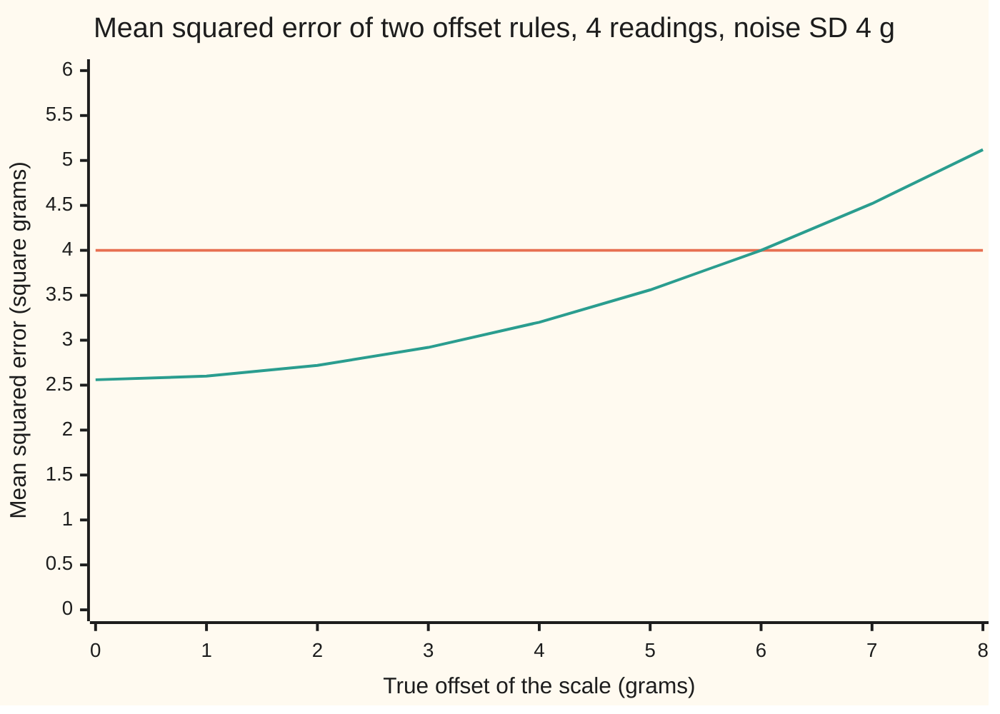
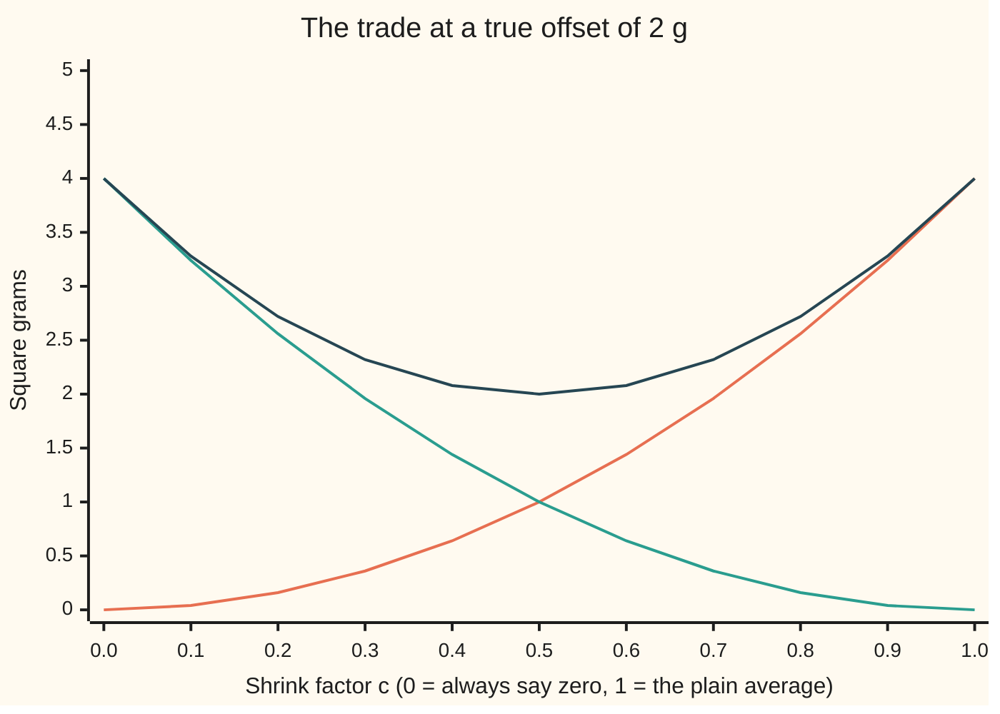

# Bias and variance: the two ways an estimator can be wrong

[Syllabus](../../../SYLLABUS.md) → [Probability and statistics](../../../SYLLABUS.md#w09) → [Sampling and Estimation](../../../SYLLABUS.md#w09-s07) → Bias and variance

---

## General Overview

A kitchen scale is checked with a 500 g reference weight. It is weighed four times: 503, 499, 505 and 501 grams. The scale's maker states that a single reading wobbles with a standard deviation of 4 g. The question is the scale's **offset**: how far its readings sit, on average, from the true weight.

The obvious guess is the average error. The four readings are off by 3, −1, 5 and 1 grams, and their average is 2 g. A second rule is less obvious: take that average and pull it part of the way toward zero, keeping 80 percent of it. That gives 1.6 g. Pulling a guess toward a fixed point is called **shrinking** it, and the fraction kept is the **shrink factor**.

Why pull a guess away from what the data say? Scales leave the factory calibrated, so offsets are usually small, and four noisy readings can easily suggest 4 grams when the truth is 1. Shrinking damps those swings. The price is a lean: when the truth is not zero, the shrunk rule aims a little short, every time.

That is the whole card in miniature. A rule for guessing (an **estimator**, the word from [Samples and estimators](01-populations-samples-and-estimators.md)) can be wrong in two ways. It can aim off-centre: that is **bias**. It can scatter: that is **variance**. The standard score for a rule, its **mean squared error**, is the average of the squared miss over every test that could have been run. It splits exactly into the two: squared bias plus variance. When the true offset is 2 g, the shrunk rule's mean squared error is 2.72 square grams against the plain average's 4: about a third smaller, though the plain average has no bias at all.

**Mean squared error equals variance plus squared bias, so a rule that accepts a small, known lean in exchange for much less scatter can miss by less on average than an unbiased one.**

**What kind of fact this is:** a theorem, proved on this card in Why it works; the verdict on shrinking is a calculation that holds for some true offsets and fails for others, and the card shows where the line falls.

### The picture: when shrinking pays

The checks fix the scale's true offset, from 0 to 8 g, and compute each rule's mean squared error exactly.



Orange: the plain average, 4 square grams whatever the true offset. Green: the average shrunk by 0.8. It wins while the true offset is under 6 g, ties at 6, and loses beyond. No fixed shrink factor wins everywhere.

---

## The formula

A reminder of the wing's notation. $E[X]$ is the long-run average of a random variable $X$; $\mathrm{Var}(X)$ is its variance, the long-run average of its squared distance from $E[X]$. A letter with a bar, $\bar X$, is the average of a sample.

Write $\theta$ (Greek theta) for the unknown number being guessed, here the offset, and $T$ for any rule that guesses it from the data. Before the readings are taken, $T$ is a random variable. Three numbers describe it:

$$\mathrm{bias}(T) = E[T] - \theta, \qquad \mathrm{Var}(T) = E\big[(T - E[T])^2\big], \qquad \mathrm{MSE}(T) = E\big[(T - \theta)^2\big]$$

The first is the bias of [Samples and estimators](01-populations-samples-and-estimators.md): where the rule aims, measured from the truth. The second is how widely it scatters around its own aim. The third, the **mean squared error**, is the average squared miss from the truth. The theorem joins them:

$$\mathrm{MSE}(T) = \mathrm{Var}(T) + \mathrm{bias}(T)^2$$

**Read it aloud:** the average squared miss is the scatter around the rule's own aim, plus the square of how far that aim sits from the truth.

A rule whose bias is zero for every possible $\theta$ is unbiased, as on that card; its mean squared error is its variance alone. For the scale, the readings' errors are $X_1, \dots, X_n$, each the offset $\mu$ plus noise of standard deviation $\sigma$. The plain average $\bar X$ and the shrunk rule $c\bar X$ give

$$\mathrm{MSE}(\bar X) = \frac{\sigma^2}{n}, \qquad \mathrm{MSE}(c\bar X) = c^2\,\frac{\sigma^2}{n} + (1 - c)^2 \mu^2$$

**Read it aloud:** the plain average misses only by scatter; the shrunk average scatters less, by the factor c squared, and pays for it with a lean of one minus c times the true offset, squared.

With $\sigma = 4$, $n = 4$, $\mu = 2$ and $c = 0.8$: the average scores 16/4 = 4, and the shrunk rule 0.64 × 4 + 0.04 × 4 = 2.56 + 0.16 = 2.72.

| Symbol | Plain meaning | In our example | Push it up and the answer… |
| --- | --- | --- | --- |
| $\mu$ | the true offset: how far the scale reads from the truth, on average; fixed and unknown | 2 g, fixed by the checks | the shrunk rule's lean grows; the plain average does not care |
| $X$, $X_i$, $i$ | a random variable in general; reading number $i$'s error, reading minus 500 g | 3, −1, 5, 1 | — |
| $n$ | the number of readings | 4 | both variances fall like $1/n$ |
| $\sigma$ | the standard deviation of one reading's noise | 4 g | more scatter, more room for shrinking to help |
| $\bar X$ | the average of the $X_i$: the plain rule | 2 g on this record | — |
| $\theta$, $T$ | any unknown number, and any rule that guesses it | $\theta$ is $\mu$; $T$ is $\bar X$ or $c\bar X$ | — |
| $E[T]$, $m$ | the rule's aim: where it lands on average over every possible test | 2 for the average, 1.6 for the shrunk rule | — |
| $\mathrm{Var}(T)$ | the rule's scatter around its own average, in square grams | 4 and 2.56 | — |
| $\mathrm{bias}(T)$ | $E[T] - \theta$: the systematic lean | 0 and −0.4 g | — |
| $\mathrm{MSE}(T)$ | mean squared error: the average squared miss from the truth | 4 and 2.72 | — |
| $c$, $c^*$ | the shrink factor, the fraction of $\bar X$ kept; and the factor that would be best if $\mu$ were known | 0.8; 0.5 | more scatter, less lean |
| $S$, $a$ | the sum of squared distances of the readings from their own average; a divisor applied to it | 20 on this record; 3, 4 or 5 | — |

### When it holds

- **The split holds for any rule with a finite variance.** No bell curve, no independence, no particular sample size. A rule whose variance is infinite (an average of Cauchy draws, [Heavy tails](../04-Continuous%20Distributions/08-heavy-tails-pareto-and-cauchy.md)) has no finite mean squared error to split.
- **Independent readings with the same noise.** That is what gives the average its variance $\sigma^2/n$. Readings taken while the scale warms up, each drifting with the last, carry less information than four independent ones, and the formula understates both rules' errors.
- **Squared error as the score.** A miss of 2 g costs four times a miss of 1 g. Scored by the plain size of the miss instead, the rules can rank differently and the split into two parts no longer holds.
- **A fixed shrink factor.** The formula for $c\bar X$ treats $c$ as a constant. A factor chosen from the same data is a different rule with a different mean squared error: 3.14, not 2.72, at an offset of 2 g.
- **The ranking of variance divisors in Step 6 needs bell-shaped noise.** With coin-flip noise the best divisor changes.

---

## Why it works

### Step 0: measure the scatter from the rule's own aim

A miss from the truth has two legs: from the truth to where the rule aims on average, and from that aim to where this one guess landed. The first leg is the same on every test. The second changes every time and averages to zero. Squaring the sum of a fixed leg and a leg that averages to zero leaves no cross term on average. That is the whole proof.

### Step 1: the split, in one line of algebra

Write $m = E[T]$ for the rule's aim. Then $T - \theta = (T - m) + (m - \theta)$. Squaring gives three terms: $(T - m)^2$, the cross term $2(T - m)(m - \theta)$, and $(m - \theta)^2$. Averaging over every possible test, the first becomes $\mathrm{Var}(T)$. The last is a fixed number, $\mathrm{bias}(T)^2$. The cross term averages to $2(m - \theta)\,E[T - m]$, and $E[T - m] = m - m = 0$.

<details>
<summary>Detailed proof: mean squared error equals variance plus squared bias</summary>

**Assumption.** $E[T^2]$ is finite. Then $E[T]$ exists, since $\lvert T\rvert \le 1 + T^2$, so $m = E[T]$ is a finite number.

**Expansion.** For every outcome, $(T - \theta)^2 = (T - m)^2 + 2(m - \theta)(T - m) + (m - \theta)^2$. All three terms have finite averages, because $(T - m)^2 \le 2T^2 + 2m^2$. Expectation adds up and pulls out constants ([Expectation](../02-Random%20Variables/02-expectation.md)), so
$$E[(T - \theta)^2] = E[(T - m)^2] + 2(m - \theta)\,E[T - m] + (m - \theta)^2.$$

**The cross term.** $E[T - m] = E[T] - m = 0$.

**Conclusion.** $\mathrm{MSE}(T) = \mathrm{Var}(T) + (E[T] - \theta)^2$. Nothing here used independence, the shape of the noise, or the sample size.

**Why centring on the aim matters.** Centred on any other point, the averaged cross term is twice that point's distance from the truth times the rule's average distance from that point, and the second factor is no longer zero. The split belongs to the rule's own average.

</details>

On the coin-flip version of the scale (each reading's noise is +4 g or −4 g with equal chance), the checks list all 16 patterns. The shrunk rule's squared misses average 2.72 directly; its variance, 2.56, plus its squared bias, 0.16, give 2.72 again.

### Step 2: the plain average has no lean

Each reading's error averages $\mu$, so the average of four averages $\mu$: the bias is zero whatever the offset. Four independent readings of variance 16 give an average of variance 16/4 = 4, standard error 2 g ([Standard error](02-sample-mean-and-standard-error.md)). Unbiased, its mean squared error is its variance: 4 square grams.

### Step 3: shrinking trades scatter for lean

Multiplying a random variable by $c$ multiplies its average by $c$ and its variance by $c^2$ ([Variance](../02-Random%20Variables/03-variance-and-standard-deviation.md)). So $c\bar X$ aims at $c\mu$, a lean of $(c - 1)\mu$, and scatters with variance $c^2\sigma^2/n$. For $c = 0.8$ and $\mu = 2$: the lean is −0.4 g, the variance 2.56. Step 1 adds them: 2.56 + 0.16 = 2.72.

Compare the two in the same units, square grams, as the score does. Pull the factor down from 1 by 0.2: the variance falls from 4 to 2.56, a saving of 1.44, while the squared lean is (0.2 × 2)^2 = 0.16. Halve the pull to 0.1: the variance falls only to 3.24, about half the saving, while the squared lean drops to 0.04, a quarter of the cost. The saving shrinks in step with the pull and the cost with its square, so at any given true offset a small enough pull gains more than it pays. That is why shrinking can win.

### Step 4: where the shrunk rule wins, and where it loses

The shrunk rule wins when its mean squared error is below the average's:

$$c^2\frac{\sigma^2}{n} + (1 - c)^2\mu^2 < \frac{\sigma^2}{n} \quad\Longleftrightarrow\quad \mu^2 < \frac{\sigma^2}{n}\cdot\frac{1 + c}{1 - c}$$

The step between is $1 - c^2 = (1 - c)(1 + c)$, then division by $(1 - c)^2$. With a standard error of 2 g and $c = 0.8$, the break-even offset is 2 × √9 = 6 g: three standard errors. A root finder run on the enumerated coin-flip scores lands on the same 6.

At an offset of 8 g the shrunk rule scores 5.12, worse than 4. Every fixed factor below 1 loses somewhere, because its lean grows without limit as the offset grows while the average's score stays flat.

### Step 5: the best factor needs the answer

The mean squared error of $c\bar X$ is a bowl in $c$. Setting its slope to zero gives

$$c^* = \frac{\mu^2}{\mu^2 + \sigma^2/n}$$

At $\mu = 2$ that is 4/(4 + 4) = 0.5, with mean squared error 2. A search over the enumerated coin-flip scores finds the same 0.5. The second chart shows the bowl.



Orange: variance, rising with the factor. Green: squared bias, falling. Dark blue: their sum, the mean squared error, lowest at 0.5. The plain average sits at the right end, the constant guess "zero" at the left, and both score 4.

The catch: $c^*$ contains $\mu$, the number being guessed. It is not a rule anyone can run. Putting the data's own $\bar X$ in place of $\mu$ gives a rule that can be run, but its factor now moves with the data, so Step 3's formula no longer applies. At an offset of 2 g its mean squared error, integrated over the bell curve of $\bar X$ by the midpoint rule, is 3.136980; simulated, 3.1428 (standard error 0.0086). Either way it is about 3.14: better than 4, worse than the fixed 0.8.

<details>
<summary>Shrinking many averages at once</summary>

For one offset, no fixed pull beats the plain average at every offset, as Step 4 showed. For three or more unrelated offsets with bell-shaped noise, scored by their total squared miss, Charles Stein (1956) and then Willard James with Stein (1961) showed that a data-chosen pull of all the averages toward a common point has smaller total mean squared error than the plain averages at every possible set of offsets. Efron and Morris's account in the Sources reads it through baseball batting averages. The proof needs tools beyond this card; [Regularisation](../09-Regression/06-ridge-and-lasso.md) uses the same pull.

</details>

### Step 6: the same trade hides in the spread

The scale's noise, 16 square grams, can be guessed from the readings too. Let $S$ be the sum of squared distances of the readings from their own average: on this record $1 + 9 + 9 + 1 = 20$. On average $S$ is $(n - 1)\sigma^2$, three times 16, because the readings sit slightly closer to their own average than to the true offset. So $S/3$ is unbiased and $S/4$ leans low ([Standard error](02-sample-mean-and-standard-error.md) explains the $n - 1$).

With bell-shaped noise, the unbiased divisor has the worst score of the three. Dividing by a larger $a$ pulls the guess toward zero, the same move as Step 3:

| Divisor $a$ | Guess on this record | Bias | Mean squared error, bell noise |
| --- | --- | --- | --- |
| 3 | 6.6667 | 0 | 170.67 |
| 4 | 5.0000 | −4 | 112.00 |
| 5 | 4.0000 | −6.4 | 102.40 |

<details>
<summary>Detailed proof: the divisor that minimises mean squared error</summary>

For bell-shaped (normal) noise, $S/\sigma^2$ follows the chi-square law with $n - 1$ degrees of freedom, whose average is $n - 1$ and variance $2(n - 1)$ ([The reference distributions](03-chi-square-t-and-f-distributions.md)). So $S/a$ has average $(n - 1)\sigma^2/a$, bias $\sigma^2(n - 1 - a)/a$, and variance $2(n - 1)\sigma^4/a^2$. By Step 1,
$$\mathrm{MSE}(S/a) = \frac{\sigma^4}{a^2}\Big(2(n - 1) + (n - 1 - a)^2\Big).$$
Set the slope in $a$ to zero. Multiplying through by $a^3/(2\sigma^4)$ gives $-(n - 1 - a)a - 2(n - 1) - (n - 1 - a)^2 = 0$, that is $-(n - 1 - a)(n - 1) = 2(n - 1)$, so $a = n + 1$. For $n = 4$ and $\sigma^4 = 256$: 256 × 6 / 9 = 170.67, 256 × 7 / 16 = 112, and 256 × 10 / 25 = 102.4.

</details>

This ranking needs bell-shaped noise; the split and Steps 2 to 4 do not. With coin-flip noise the three scores are 42.67, 40.00 and 56.32: the divisor $n$ wins and $n + 1$ is worst. That noise has no extreme readings, so $S$ scatters $n$ times less (variance $2(n - 1)\sigma^4/n$), and the bias term dominates.

The same split, with the average taken over training samples instead of scale tests, is the bias-variance trade-off of machine learning; Loss and empirical risk takes it there.

---

## Worked numbers, by hand

| Step | Arithmetic | Value |
| --- | --- | --- |
| readings' errors | 503, 499, 505, 501 minus 500 | 3, −1, 5, 1 g |
| plain average on this record | (3 − 1 + 5 + 1) / 4 | 2.00 g |
| shrunk on this record | 0.8 × 2 | 1.60 g |
| variance of the average | $\sigma^2/n$ = 16 / 4 | 4 |
| its bias | the average aims at $\mu$ | 0 |
| **MSE of the average** | 4 + 0 | **4** |
| variance of the shrunk rule | 0.8 × 0.8 × 4 | 2.56 |
| its bias at $\mu$ = 2 | (0.8 − 1) × 2 | −0.4 g |
| **MSE of the shrunk rule** | 2.56 + (−0.4) × (−0.4) | **2.72** |
| break-even offset | 2 × √(1.8 / 0.2) | 6 g |

At a true offset of 2 g, the rule that deliberately aims short misses by less on average: 2.72 against 4 square grams. Across 200,000 simulated tests with bell-shaped noise the two scores come out at 4.0124 (standard error 0.0126) and 2.7311 (standard error 0.0085).

If the true offset is 2 g, this record's plain average is exactly right and the shrunk rule is 0.4 g off. Mean squared error is a statement about the rule over repeated tests, not a promise about one record.

### What breaks if you drop a piece

| Mistake | Comes out at | What went wrong |
| --- | --- | --- |
| Shrinking a scale whose offset is 8 g | 5.12, worse than 4 | the offset is past the break-even point of 6 g |
| Adding bias, not squared bias | 2.56 + 0.4 = 2.96, not 2.72 | grams added to square grams; the split needs the square |
| Choosing the factor from the same data | 3.14 simulated, not 2.72 | the factor is now random, and Step 3's formula assumed it fixed |
| Using the bell-curve divisor ranking on coin-flip noise | $n + 1$ scores 56.32, the worst of three | the $n + 1$ rule rests on the chi-square variance of bell noise |

The code prints all four.

---

## Code, from first principles, and it actually runs

The scripts reach every score by three independent roads. Road 1 is the formula. Road 2 lists all 16 patterns of coin-flip noise, each reading's error +4 g or −4 g with equal chance, and averages the squared misses directly; a root finder and a minimum finder run on those enumerated scores rather than on the formula, and the coin-flip divisor scores match a closed form. Road 3 simulates 200,000 tests with bell-shaped noise, drawn by the Box–Muller recipe (two uniform draws turned into two normal ones with a logarithm, a square root, a sine and a cosine) from SplitMix64, a short generator written out in both languages so both draw the same numbers. Every simulated score is printed with its standard error. The plug-in rule has no simple formula, so its score is also integrated by the midpoint rule over the bell curve of the average, and the simulation is checked against that. Both charts and every table on this card come from these runs.

### Python

```python
# Bias and variance -- the check behind the card; only math is imported.
# A kitchen scale is tested with a 500 g weight, 4 readings, each off by
# noise of SD 4 g around a true offset MU.  The rules: the plain average of
# the offsets, and that average shrunk toward zero by C = 0.8.  Roads: the
# formula, every pattern of a coin-flip noise, and a seeded simulation.
import math

N, SD, MU, C, RUNS, SEED = 4, 4.0, 2.0, 0.8, 200000, 20260928
M64 = 0xFFFFFFFFFFFFFFFF
V = SD * SD / N                             # variance of the average, 16/4

def splitmix64(s):                          # the generator both languages share
    s = (s + 0x9E3779B97F4A7C15) & M64
    z = ((s ^ (s >> 30)) * 0xBF58476D1CE4E5B9) & M64
    z = ((z ^ (z >> 27)) * 0x94D049BB133111EB) & M64
    return s, z ^ (z >> 31)

def uniform(s):                             # a draw in (0, 1] from 53 random bits
    s, z = splitmix64(s)
    return s, ((z >> 11) + 1) * 2.0 ** -53

def mse_formula(c, mu):                     # variance plus squared bias
    return c * c * V + (1 - c) * (1 - c) * mu * mu

def enumerate_rule(c, mu, divisor=None):    # all 16 patterns of +-4 g noise, equally likely
    total, first = 0.0, 0.0
    for pattern in range(2 ** N):
        xs = [mu + (SD if pattern >> i & 1 else -SD) for i in range(N)]
        xb = sum(xs) / N
        if divisor is None:
            t, target = c * xb, mu
        else:
            t, target = sum((x - xb) * (x - xb) for x in xs) / divisor, SD * SD
        total += (t - target) * (t - target) / 2 ** N
        first += t / 2 ** N
    return total, first                     # mean squared error and mean of the rule

def spread(c, mu, mean):                    # enumerated variance about the rule's own mean
    total = 0.0
    for pattern in range(2 ** N):
        xb = sum(mu + (SD if pattern >> i & 1 else -SD) for i in range(N)) / N
        total += (c * xb - mean) * (c * xb - mean) / 2 ** N
    return total

def bisect(f, lo, hi):                      # root finder written out
    for _ in range(200):
        mid = (lo + hi) / 2
        lo, hi = (mid, hi) if f(lo) * f(mid) > 0 else (lo, mid)
    return (lo + hi) / 2

def ternary(f, lo, hi):                     # minimum finder for a bowl-shaped curve
    for _ in range(200):
        a, b = lo + (hi - lo) / 3, hi - (hi - lo) / 3
        lo, hi = (a, hi) if f(a) > f(b) else (lo, b)
    return (lo + hi) / 2

def row(label, v):
    print(f"{label:<52} {v:>10.6f}")

offs = [3.0, -1.0, 5.0, 1.0]                # readings 503, 499, 505, 501 minus 500
ob = sum(offs) / len(offs)
s_obs = sum((o - ob) * (o - ob) for o in offs)

names = ["average", "0.8 x average", "plug-in shrink", "S/3", "S/4", "S/5"]
sums, sq = [0.0] * 6, [0.0] * 6
state = SEED
for run in range(RUNS):                     # 4 bell-curve readings per run, Box-Muller
    xs = []
    for _ in range(N // 2):
        state, u1 = uniform(state)
        state, u2 = uniform(state)
        r = math.sqrt(-2.0 * math.log(u1))
        xs += [MU + SD * r * math.cos(2 * math.pi * u2), MU + SD * r * math.sin(2 * math.pi * u2)]
    xb = sum(xs) / N
    s = sum((x - xb) * (x - xb) for x in xs)
    errs = [xb - MU, C * xb - MU, xb * xb / (xb * xb + V) * xb - MU,
            s / 3 - SD * SD, s / 4 - SD * SD, s / 5 - SD * SD]
    for k in range(6):
        sums[k] += errs[k] * errs[k]
        sq[k] += errs[k] ** 4
sim = [t / RUNS for t in sums]
se = [math.sqrt((sq[k] / RUNS - sim[k] * sim[k]) / RUNS) for k in range(6)]

cross = bisect(lambda mu: enumerate_rule(C, mu)[0] - enumerate_rule(1.0, mu)[0], 0.0, 100.0)
c_best = ternary(lambda c: enumerate_rule(c, MU)[0], 0.0, 1.0)
e_avg = enumerate_rule(1.0, MU)[0]
e_shr, e_mean = enumerate_rule(C, MU)
e_var = spread(C, MU, e_mean)
div_formula = {a: SD ** 4 * (2 * (N - 1) + (N - 1 - a) ** 2) / (a * a) for a in (3, 4, 5)}
coin_formula = {a: SD ** 4 * (2 * (N - 1) / N + (N - 1 - a) ** 2) / (a * a) for a in (3, 4, 5)}
# plug-in shrink, a second road: midpoint rule over the bell curve of the average, z from -10 to 10
plug_exact = sum(math.exp(-z * z / 2) * ((x := MU + math.sqrt(V) * z) * x * x / (x * x + V) - MU) ** 2 for z in (-10 + (j + 0.5) / 2000 for j in range(40000))) / 2000 / math.sqrt(2 * math.pi)

print(f"setup: 500 g weight, n = {N} readings, noise SD {SD:.0f} g, true offset {MU:.0f} g, shrink factor {C}")
print(f"worked: readings 503 499 505 501 g, average offset {ob:.2f} g, shrunk {C * ob:.2f} g")
print(f"worked: S = {s_obs:.2f}, S/3 = {s_obs / 3:.4f}, S/4 = {s_obs / 4:.4f}, S/5 = {s_obs / 5:.4f}")
row("formula: variance of the average, 16/4 (SD 2 g)", V)
row("formula: bias of 0.8 x average, (0.8 - 1) x 2", (C - 1) * MU)
row("formula: variance of 0.8 x average, 0.64 x 4", C * C * V)
row("formula: MSE of 0.8 x average, 2.56 + 0.16", mse_formula(C, MU))
row("formula: break-even offset, 2 x sqrt(1.8/0.2)", math.sqrt(V) * math.sqrt((1 + C) / (1 - C)))
row("bisection on enumerated MSEs: where they meet", cross)
row("formula: best factor at offset 2, 4/(4 + 4)", MU * MU / (MU * MU + V))
row("ternary search on enumerated MSE: best factor", c_best)
row("formula: MSE at the best factor", mse_formula(0.5, MU))
row("coin-flip noise, 16 patterns: MSE of average", e_avg)
row("coin-flip: mean of 0.8 x average", e_mean)
row("coin-flip: variance of 0.8 x average", e_var)
row("coin-flip: variance + bias^2", e_var + (e_mean - MU) ** 2)
row("coin-flip: MSE of 0.8 x average, direct", e_shr)
for a in (3, 4, 5):
    row(f"formula, bell noise: MSE of S/{a}", div_formula[a])
print("formula: bias of S/3, S/4, S/5: " + " ".join(f"{SD * SD * (N - 1 - a) / a:.1f}" for a in (3, 4, 5)))
for a in (3, 4, 5):
    row(f"coin-flip noise, 16 patterns: MSE of S/{a}", enumerate_rule(0, MU, a)[0])
print(f"simulated {RUNS:,} runs, bell noise:                  MSE  standard error")
for k in range(6):
    print(f"  {names[k]:<44} {sim[k]:>10.4f} {se[k]:>10.4f}" + (f"  midpoint-rule integral {plug_exact:.6f}" if k == 2 else ""))
row("adding bias, not bias^2: 2.56 + 0.4", C * C * V + abs((C - 1) * MU))
print("chart A, offset, MSE of average, MSE of 0.8 x average")
for mu in range(9):
    print(f"chart A, {mu} {mse_formula(1.0, mu):.2f} {mse_formula(C, mu):.2f}")
print("chart B, factor c at offset 2: variance, bias^2, MSE")
for j in range(11):
    c = j / 10
    print(f"chart B, {c:.1f} {c * c * V:.2f} {(1 - c) ** 2 * MU * MU:.2f} {mse_formula(c, MU):.2f}")

assert abs(e_avg - V) < 1e-12, "enumerated MSE of the average vs sigma^2/n"
assert abs(e_shr - mse_formula(C, MU)) < 1e-12, "enumerated MSE vs variance + bias^2 formula"
assert abs(e_var + (e_mean - MU) ** 2 - e_shr) < 1e-12, "enumerated spread + bias^2 vs direct MSE"
assert abs(cross - math.sqrt(V * (1 + C) / (1 - C))) < 1e-9, "bisection root vs break-even formula"
assert abs(c_best - MU * MU / (MU * MU + V)) < 1e-6, "searched best factor vs formula"
for a in (3, 4, 5):
    assert abs(enumerate_rule(0, MU, a)[0] - coin_formula[a]) < 1e-9, "coin-flip MSE of S/a vs formula"
for k, target in ((0, V), (1, mse_formula(C, MU)), (2, plug_exact), (3, div_formula[3]), (4, div_formula[4]),
                  (5, div_formula[5])):
    assert abs(sim[k] - target) < 4 * se[k], "simulated MSE vs formula: " + names[k]
assert sim[1] + 10 * se[1] < sim[0], "the biased rule beats the unbiased one"
print("ALL CHECKS PASS")
```

**Ran 2026-10-06 on macOS, Python 3.14.6, standard library only. All checks passed. Output, pasted from the run:**

```
setup: 500 g weight, n = 4 readings, noise SD 4 g, true offset 2 g, shrink factor 0.8
worked: readings 503 499 505 501 g, average offset 2.00 g, shrunk 1.60 g
worked: S = 20.00, S/3 = 6.6667, S/4 = 5.0000, S/5 = 4.0000
formula: variance of the average, 16/4 (SD 2 g)        4.000000
formula: bias of 0.8 x average, (0.8 - 1) x 2         -0.400000
formula: variance of 0.8 x average, 0.64 x 4           2.560000
formula: MSE of 0.8 x average, 2.56 + 0.16             2.720000
formula: break-even offset, 2 x sqrt(1.8/0.2)          6.000000
bisection on enumerated MSEs: where they meet          6.000000
formula: best factor at offset 2, 4/(4 + 4)            0.500000
ternary search on enumerated MSE: best factor          0.500000
formula: MSE at the best factor                        2.000000
coin-flip noise, 16 patterns: MSE of average           4.000000
coin-flip: mean of 0.8 x average                       1.600000
coin-flip: variance of 0.8 x average                   2.560000
coin-flip: variance + bias^2                           2.720000
coin-flip: MSE of 0.8 x average, direct                2.720000
formula, bell noise: MSE of S/3                      170.666667
formula, bell noise: MSE of S/4                      112.000000
formula, bell noise: MSE of S/5                      102.400000
formula: bias of S/3, S/4, S/5: 0.0 -4.0 -6.4
coin-flip noise, 16 patterns: MSE of S/3              42.666667
coin-flip noise, 16 patterns: MSE of S/4              40.000000
coin-flip noise, 16 patterns: MSE of S/5              56.320000
simulated 200,000 runs, bell noise:                  MSE  standard error
  average                                          4.0124     0.0126
  0.8 x average                                    2.7311     0.0085
  plug-in shrink                                   3.1428     0.0086  midpoint-rule integral 3.136980
  S/3                                            170.8508     0.9437
  S/4                                            112.1442     0.4346
  S/5                                            102.5183     0.2540
adding bias, not bias^2: 2.56 + 0.4                    2.960000
chart A, offset, MSE of average, MSE of 0.8 x average
chart A, 0 4.00 2.56
chart A, 1 4.00 2.60
chart A, 2 4.00 2.72
chart A, 3 4.00 2.92
chart A, 4 4.00 3.20
chart A, 5 4.00 3.56
chart A, 6 4.00 4.00
chart A, 7 4.00 4.52
chart A, 8 4.00 5.12
chart B, factor c at offset 2: variance, bias^2, MSE
chart B, 0.0 0.00 4.00 4.00
chart B, 0.1 0.04 3.24 3.28
chart B, 0.2 0.16 2.56 2.72
chart B, 0.3 0.36 1.96 2.32
chart B, 0.4 0.64 1.44 2.08
chart B, 0.5 1.00 1.00 2.00
chart B, 0.6 1.44 0.64 2.08
chart B, 0.7 1.96 0.36 2.32
chart B, 0.8 2.56 0.16 2.72
chart B, 0.9 3.24 0.04 3.28
chart B, 1.0 4.00 0.00 4.00
ALL CHECKS PASS
```

### Rust

Same numbers, same labels, same generator and seed.

```rust
// Bias and variance -- the check behind the card, in Rust, std only.
// A kitchen scale is tested with a 500 g weight, 4 readings, each off by
// noise of SD 4 g around a true offset MU.  The rules: the plain average of
// the offsets, and that average shrunk toward zero by C = 0.8.  Roads: the
// formula, every pattern of a coin-flip noise, and a seeded simulation.
const N: usize = 4; const SD: f64 = 4.0; const MU: f64 = 2.0; const C: f64 = 0.8;
const RUNS: usize = 200000; const SEED: u64 = 20260928;
const V: f64 = SD * SD / N as f64; // variance of the average, 16/4

fn splitmix64(s: u64) -> (u64, u64) { // the generator both languages share
    let s = s.wrapping_add(0x9E3779B97F4A7C15);
    let mut z = (s ^ (s >> 30)).wrapping_mul(0xBF58476D1CE4E5B9);
    z = (z ^ (z >> 27)).wrapping_mul(0x94D049BB133111EB);
    (s, z ^ (z >> 31))
}

fn uniform(s: u64) -> (u64, f64) { // a draw in (0, 1] from 53 random bits
    let (s, z) = splitmix64(s);
    (s, ((z >> 11) + 1) as f64 * 2f64.powi(-53))
}

fn mse_formula(c: f64, mu: f64) -> f64 { // variance plus squared bias
    c * c * V + (1.0 - c) * (1.0 - c) * mu * mu
}

fn pattern(p: usize, mu: f64) -> Vec<f64> { // one of the 16 patterns of +-4 g noise
    (0..N).map(|i| mu + if p >> i & 1 == 1 { SD } else { -SD }).collect()
}

fn enumerate_rule(c: f64, mu: f64, divisor: Option<f64>) -> (f64, f64) { // all 16, equally likely
    let (mut total, mut first) = (0.0, 0.0);
    let w = 1.0 / (1u32 << N) as f64;
    for p in 0..(1usize << N) {
        let xs = pattern(p, mu);
        let xb = xs.iter().sum::<f64>() / N as f64;
        let (t, target) = match divisor {
            None => (c * xb, mu),
            Some(d) => (xs.iter().map(|x| (x - xb) * (x - xb)).sum::<f64>() / d, SD * SD),
        };
        total += (t - target) * (t - target) * w;
        first += t * w;
    }
    (total, first) // mean squared error and mean of the rule
}

fn spread(c: f64, mu: f64, mean: f64) -> f64 { // enumerated variance about the rule's own mean
    let mut total = 0.0;
    for p in 0..(1usize << N) {
        let xb = pattern(p, mu).iter().sum::<f64>() / N as f64;
        total += (c * xb - mean) * (c * xb - mean) / (1u32 << N) as f64;
    }
    total
}

fn bisect(f: &dyn Fn(f64) -> f64, mut lo: f64, mut hi: f64) -> f64 { // root finder written out
    for _ in 0..200 {
        let mid = (lo + hi) / 2.0;
        if f(lo) * f(mid) > 0.0 { lo = mid } else { hi = mid }
    }
    (lo + hi) / 2.0
}

fn ternary(f: &dyn Fn(f64) -> f64, mut lo: f64, mut hi: f64) -> f64 { // minimum of a bowl
    for _ in 0..200 {
        let (a, b) = (lo + (hi - lo) / 3.0, hi - (hi - lo) / 3.0);
        if f(a) > f(b) { lo = a } else { hi = b }
    }
    (lo + hi) / 2.0
}

fn row(label: &str, v: f64) { println!("{:<52} {:>10.6}", label, v); }

fn main() {
    let offs = [3.0f64, -1.0, 5.0, 1.0]; // readings 503, 499, 505, 501 minus 500
    let ob = offs.iter().sum::<f64>() / offs.len() as f64;
    let s_obs: f64 = offs.iter().map(|o| (o - ob) * (o - ob)).sum();

    let names = ["average", "0.8 x average", "plug-in shrink", "S/3", "S/4", "S/5"];
    let (mut sums, mut sq) = ([0.0f64; 6], [0.0f64; 6]);
    let mut state = SEED;
    for _ in 0..RUNS { // 4 bell-curve readings per run, Box-Muller
        let mut xs = Vec::with_capacity(N);
        for _ in 0..N / 2 {
            let (s, u1) = uniform(state);
            let (s, u2) = uniform(s);
            state = s;
            let r = (-2.0 * u1.ln()).sqrt();
            let th = 2.0 * std::f64::consts::PI * u2;
            xs.push(MU + SD * r * th.cos());
            xs.push(MU + SD * r * th.sin());
        }
        let xb = xs.iter().sum::<f64>() / N as f64;
        let s: f64 = xs.iter().map(|x| (x - xb) * (x - xb)).sum();
        let errs = [xb - MU, C * xb - MU, xb * xb / (xb * xb + V) * xb - MU,
                    s / 3.0 - SD * SD, s / 4.0 - SD * SD, s / 5.0 - SD * SD];
        for k in 0..6 {
            sums[k] += errs[k] * errs[k];
            sq[k] += errs[k].powi(4);
        }
    }
    let rf = RUNS as f64;
    let sim: Vec<f64> = sums.iter().map(|t| t / rf).collect();
    let se: Vec<f64> = (0..6).map(|k| ((sq[k] / rf - sim[k] * sim[k]) / rf).sqrt()).collect();

    let cross = bisect(&|mu| enumerate_rule(C, mu, None).0 - enumerate_rule(1.0, mu, None).0, 0.0, 100.0);
    let c_best = ternary(&|c| enumerate_rule(c, MU, None).0, 0.0, 1.0);
    let e_avg = enumerate_rule(1.0, MU, None).0;
    let (e_shr, e_mean) = enumerate_rule(C, MU, None);
    let e_var = spread(C, MU, e_mean);
    let div_formula = |a: f64| SD.powi(4) * (2.0 * (N as f64 - 1.0) + (N as f64 - 1.0 - a).powi(2)) / (a * a);
    let coin_formula = |a: f64| SD.powi(4) * (2.0 * (N as f64 - 1.0) / N as f64 + (N as f64 - 1.0 - a).powi(2)) / (a * a);
    // plug-in shrink, a second road: midpoint rule over the bell curve of the average, z from -10 to 10
    let plug_exact = (0..40000).map(|j| { let z = -10.0 + (j as f64 + 0.5) / 2000.0; let x = MU + V.sqrt() * z; (-z * z / 2.0).exp() * (x * x * x / (x * x + V) - MU).powi(2) }).sum::<f64>() / 2000.0 / (2.0 * std::f64::consts::PI).sqrt();

    println!("setup: 500 g weight, n = {} readings, noise SD {:.0} g, true offset {:.0} g, shrink factor {}", N, SD, MU, C);
    println!("worked: readings 503 499 505 501 g, average offset {:.2} g, shrunk {:.2} g", ob, C * ob);
    println!("worked: S = {:.2}, S/3 = {:.4}, S/4 = {:.4}, S/5 = {:.4}", s_obs, s_obs / 3.0, s_obs / 4.0, s_obs / 5.0);
    row("formula: variance of the average, 16/4 (SD 2 g)", V);
    row("formula: bias of 0.8 x average, (0.8 - 1) x 2", (C - 1.0) * MU);
    row("formula: variance of 0.8 x average, 0.64 x 4", C * C * V);
    row("formula: MSE of 0.8 x average, 2.56 + 0.16", mse_formula(C, MU));
    row("formula: break-even offset, 2 x sqrt(1.8/0.2)", V.sqrt() * ((1.0 + C) / (1.0 - C)).sqrt());
    row("bisection on enumerated MSEs: where they meet", cross);
    row("formula: best factor at offset 2, 4/(4 + 4)", MU * MU / (MU * MU + V));
    row("ternary search on enumerated MSE: best factor", c_best);
    row("formula: MSE at the best factor", mse_formula(0.5, MU));
    row("coin-flip noise, 16 patterns: MSE of average", e_avg);
    row("coin-flip: mean of 0.8 x average", e_mean);
    row("coin-flip: variance of 0.8 x average", e_var);
    row("coin-flip: variance + bias^2", e_var + (e_mean - MU).powi(2));
    row("coin-flip: MSE of 0.8 x average, direct", e_shr);
    for a in [3.0, 4.0, 5.0] { row(&format!("formula, bell noise: MSE of S/{}", a), div_formula(a)); }
    println!("formula: bias of S/3, S/4, S/5: {}", [3.0, 4.0, 5.0].map(|a: f64| format!("{:.1}", SD * SD * (N as f64 - 1.0 - a) / a)).join(" "));
    for a in [3.0, 4.0, 5.0] {
        row(&format!("coin-flip noise, 16 patterns: MSE of S/{}", a), enumerate_rule(0.0, MU, Some(a)).0);
    }
    println!("simulated 200,000 runs, bell noise:                  MSE  standard error");
    for k in 0..6 {
        let extra = if k == 2 { format!("  midpoint-rule integral {:.6}", plug_exact) } else { String::new() };
        println!("  {:<44} {:>10.4} {:>10.4}{}", names[k], sim[k], se[k], extra);
    }
    row("adding bias, not bias^2: 2.56 + 0.4", C * C * V + ((C - 1.0) * MU).abs());
    println!("chart A, offset, MSE of average, MSE of 0.8 x average");
    for mu in 0..9 {
        println!("chart A, {} {:.2} {:.2}", mu, mse_formula(1.0, mu as f64), mse_formula(C, mu as f64));
    }
    println!("chart B, factor c at offset 2: variance, bias^2, MSE");
    for j in 0..11 {
        let c = j as f64 / 10.0;
        println!("chart B, {:.1} {:.2} {:.2} {:.2}", c, c * c * V, (1.0 - c).powi(2) * MU * MU, mse_formula(c, MU));
    }

    assert!((e_avg - V).abs() < 1e-12, "enumerated MSE of the average vs sigma^2/n");
    assert!((e_shr - mse_formula(C, MU)).abs() < 1e-12, "enumerated MSE vs variance + bias^2 formula");
    assert!((e_var + (e_mean - MU).powi(2) - e_shr).abs() < 1e-12, "enumerated spread + bias^2 vs direct MSE");
    assert!((cross - (V * (1.0 + C) / (1.0 - C)).sqrt()).abs() < 1e-9, "bisection root vs break-even formula");
    assert!((c_best - MU * MU / (MU * MU + V)).abs() < 1e-6, "searched best factor vs formula");
    for a in [3.0, 4.0, 5.0] {
        assert!((enumerate_rule(0.0, MU, Some(a)).0 - coin_formula(a)).abs() < 1e-9, "coin-flip MSE of S/a vs formula");
    }
    for (k, target) in [(0usize, V), (1, mse_formula(C, MU)), (2, plug_exact), (3, div_formula(3.0)), (4, div_formula(4.0)),
                        (5, div_formula(5.0))] {
        assert!((sim[k] - target).abs() < 4.0 * se[k], "simulated MSE vs formula: {}", names[k]);
    }
    assert!(sim[1] + 10.0 * se[1] < sim[0], "the biased rule beats the unbiased one");
    println!("ALL CHECKS PASS");
}
```

**Ran 2026-10-06 on macOS, rustc 1.98.1, no crates. All checks passed. Output, pasted from the run:**

```
setup: 500 g weight, n = 4 readings, noise SD 4 g, true offset 2 g, shrink factor 0.8
worked: readings 503 499 505 501 g, average offset 2.00 g, shrunk 1.60 g
worked: S = 20.00, S/3 = 6.6667, S/4 = 5.0000, S/5 = 4.0000
formula: variance of the average, 16/4 (SD 2 g)        4.000000
formula: bias of 0.8 x average, (0.8 - 1) x 2         -0.400000
formula: variance of 0.8 x average, 0.64 x 4           2.560000
formula: MSE of 0.8 x average, 2.56 + 0.16             2.720000
formula: break-even offset, 2 x sqrt(1.8/0.2)          6.000000
bisection on enumerated MSEs: where they meet          6.000000
formula: best factor at offset 2, 4/(4 + 4)            0.500000
ternary search on enumerated MSE: best factor          0.500000
formula: MSE at the best factor                        2.000000
coin-flip noise, 16 patterns: MSE of average           4.000000
coin-flip: mean of 0.8 x average                       1.600000
coin-flip: variance of 0.8 x average                   2.560000
coin-flip: variance + bias^2                           2.720000
coin-flip: MSE of 0.8 x average, direct                2.720000
formula, bell noise: MSE of S/3                      170.666667
formula, bell noise: MSE of S/4                      112.000000
formula, bell noise: MSE of S/5                      102.400000
formula: bias of S/3, S/4, S/5: 0.0 -4.0 -6.4
coin-flip noise, 16 patterns: MSE of S/3              42.666667
coin-flip noise, 16 patterns: MSE of S/4              40.000000
coin-flip noise, 16 patterns: MSE of S/5              56.320000
simulated 200,000 runs, bell noise:                  MSE  standard error
  average                                          4.0124     0.0126
  0.8 x average                                    2.7311     0.0085
  plug-in shrink                                   3.1428     0.0086  midpoint-rule integral 3.136980
  S/3                                            170.8508     0.9437
  S/4                                            112.1442     0.4346
  S/5                                            102.5183     0.2540
adding bias, not bias^2: 2.56 + 0.4                    2.960000
chart A, offset, MSE of average, MSE of 0.8 x average
chart A, 0 4.00 2.56
chart A, 1 4.00 2.60
chart A, 2 4.00 2.72
chart A, 3 4.00 2.92
chart A, 4 4.00 3.20
chart A, 5 4.00 3.56
chart A, 6 4.00 4.00
chart A, 7 4.00 4.52
chart A, 8 4.00 5.12
chart B, factor c at offset 2: variance, bias^2, MSE
chart B, 0.0 0.00 4.00 4.00
chart B, 0.1 0.04 3.24 3.28
chart B, 0.2 0.16 2.56 2.72
chart B, 0.3 0.36 1.96 2.32
chart B, 0.4 0.64 1.44 2.08
chart B, 0.5 1.00 1.00 2.00
chart B, 0.6 1.44 0.64 2.08
chart B, 0.7 1.96 0.36 2.32
chart B, 0.8 2.56 0.16 2.72
chart B, 0.9 3.24 0.04 3.28
chart B, 1.0 4.00 0.00 4.00
ALL CHECKS PASS
```

The two outputs match line for line.

> [!TIP]
> **Try changing**
> Guess first, then run it.
> - **A far-off scale.** Set `MU` to 8.0 in both. The shrunk rule's score rises to 5.12, the simulation agrees, and the last assert, that the biased rule beats the unbiased one, stops the program. The break-even offset stays at 6 g: it does not depend on the truth.
> - **A harder pull.** Set `C` to 0.5 in both. At an offset of 2 g this is the best factor, and the shrunk score falls to 2.00; but the break-even offset shrinks to 3.46 g. A harder pull wins by more near zero and loses sooner.
> - **Fewer readings.** Set `N` to 2 in both. The average's variance doubles to 8, the shrunk rule scores 5.28, and the break-even offset moves out to 8.49 g: the noisier the data, the more a pull toward zero is worth.
> - **Another seed.** Change `SEED`. The simulated scores move by about one standard error, within the four the asserts allow; the formula and enumerated lines do not move at all.

---

## The usual mistake

> [!warning]
> **Treating unbiased as best.** Zero bias removes one of the two terms, not the total. At a true offset of 2 g the unbiased average scores 4 and the shrunk rule 2.72; for the scale's noise, the unbiased divisor 3 scores 170.67 against 102.4 for the biased divisor 5. An unbiased rule with large scatter is often the worse rule.
>
> - **Believing a shrunk rule wins everywhere.** It wins only below the break-even offset, 6 g here; at 8 g it scores 5.12. The pull helps only when the truth really is near the point pulled toward.
> - **Judging a rule by one record.** On this record the plain average is exactly right and the shrunk rule is 0.4 g off; the scores describe the rules over repeated tests.
> - **Adding bias unsquared.** Grams and square grams do not add: 2.96 is not the shrunk rule's score, 2.72 is.
> - **Setting the factor from the data and keeping the old formula.** The data-chosen rule scores 3.14 at an offset of 2 g, not 2.72; a factor that depends on the sample makes a new rule with its own score.

---

## Where you meet it in real life

- **Instrument calibration.** A lab corrects a scale or thermometer by a measured offset; with few check readings, a correction pulled toward zero steadies the instrument without large overcorrections.
- **Regression with many inputs.** Ridge regression pulls every fitted coefficient toward zero for exactly the trade in Step 3 ([Regularisation](../09-Regression/06-ridge-and-lasso.md)).
- **Portfolio inputs.** Estimated average returns are noisy enough that pulling them toward a common value improves portfolios built on them ([Estimation error](../../12-Financial%20mathematics/37-Portfolio%20Theory/07-estimation-error-and-shrinkage.md)).
- **Cleaning signals.** Wavelet denoising shrinks small coefficients to zero, accepting a little bias to remove most of the noise (Wavelet denoising).
- **Sports averages.** Early-season batting averages pulled toward the league average predict the rest of the season better than the raw averages, the example Efron and Morris made famous.
- **Calculators and spreadsheets.** The two standard deviation buttons divide by $n - 1$ and by $n$: the choice in Step 6.

> **Say it back**
> A rule for guessing an unknown number is judged by its mean squared error, the average squared miss over every test that could be run. That score splits exactly into the rule's variance, its scatter around its own aim, plus its squared bias, how far that aim sits from the truth. Pulling the scale's average offset toward zero by a factor of 0.8 cuts its variance from 4 to 2.56 and adds a squared bias of 0.16 when the truth is 2 g, so it scores 2.72 against 4. The win holds only while the true offset is under 6 g, and the factor that would be best depends on the answer itself. Unbiased is one virtue, not the whole score.

---

## What this builds on

- [Standard error](02-sample-mean-and-standard-error.md): the average's variance $\sigma^2/n$ and the $n - 1$ divisor that Step 6 re-judges.

## Where this goes next

- [Fisher information](07-fisher-information-and-cramer-rao.md): the lowest variance any unbiased rule can reach.
- [Regularisation](../09-Regression/06-ridge-and-lasso.md): shrinking many regression coefficients at once.
- [Estimation error](../../12-Financial%20mathematics/37-Portfolio%20Theory/07-estimation-error-and-shrinkage.md): the same pull applied to noisy return and risk estimates.
- Loss and empirical risk: squared error as one loss among several, averaged over data.
- Wavelet denoising: shrinking coefficients to strip noise from a signal.

The shrunk rule beat the average by accepting bias; among rules that refuse any bias, how small can the variance be made? The next card, [Fisher information](07-fisher-information-and-cramer-rao.md), sets that floor.

---

## Sources

Verified 28 Sep 2026: every link below resolves to the publisher's page.

- Casella, George, and Roger L. Berger. *Statistical Inference*, 2nd ed. Chapman and Hall/CRC. [Publisher page](https://www.routledge.com/Statistical-Inference/Casella-Berger/p/book/9781032593036). Mean squared error, its split into variance and squared bias, and the divisor comparison for the normal variance.
- Lehmann, E. L., and George Casella. *Theory of Point Estimation*, 2nd ed. Springer, 1998. [DOI](https://doi.org/10.1007/b98854). Risk under squared error, admissibility of the one-dimensional average, and Stein's shrinkage.
- Hastie, Trevor, Robert Tibshirani, and Jerome Friedman. *The Elements of Statistical Learning*, 2nd ed. Springer, 2009. [DOI](https://doi.org/10.1007/978-0-387-84858-7). The bias-variance trade-off in prediction, and ridge regression as shrinkage.
- Efron, Bradley, and Carl Morris. "Stein's Paradox in Statistics." *Scientific American* 236, no. 5 (1977): 119–127. [DOI](https://doi.org/10.1038/scientificamerican0577-119). Shrinking many averages at once, told through batting averages.
