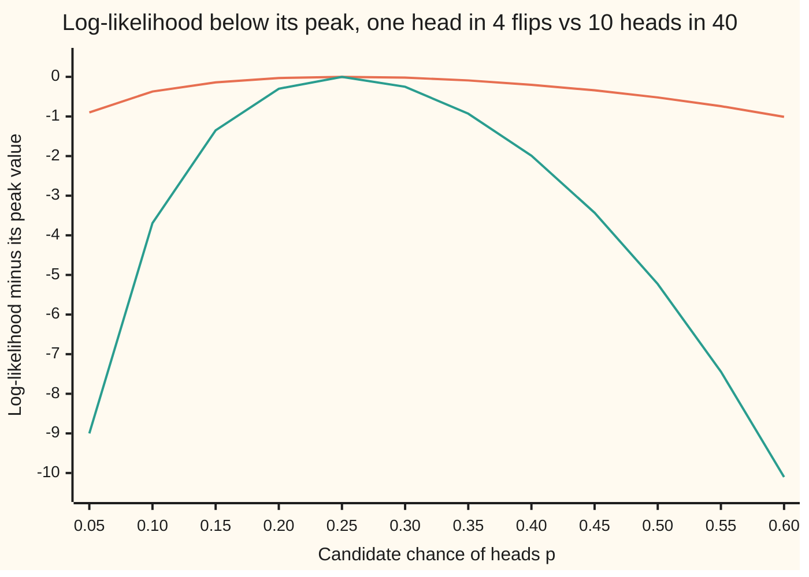
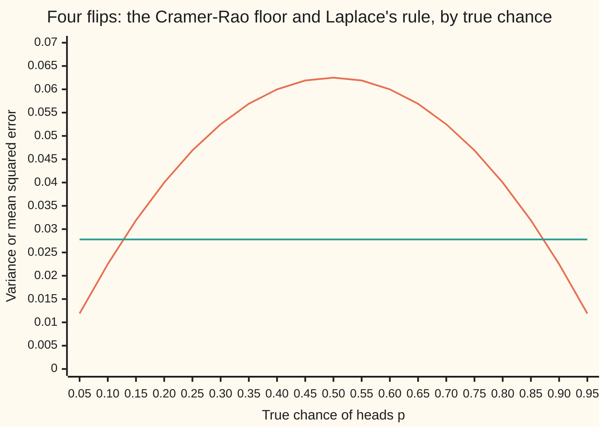

# Fisher information: how much a sample can tell you, and the floor on any estimator's error

[Syllabus](../../../SYLLABUS.md) → [Probability and statistics](../README.md) → [Sampling and Estimation](../README.md#s07) → Fisher information

---

## General Overview

A coin has been bent in a vise. It now lands heads with some unknown chance; in this example the true chance is 0.25, one flip in four. Four flips are allowed before anyone must name a number.

The obvious rule is to count the heads and divide by 4. That rule is right on average, and its answers scatter: the standard deviation of the guess, over many repeats of the four flips, is 0.216506. A guess of 0.25 that routinely misses by 0.2 is weak. Could a cleverer rule, one that weighs the flips differently or uses their order, scatter less and still be right on average?

No. Every rule that is right on average at every possible chance has a variance of at least 0.046875 here, which is the counting rule's own variance. The floor comes from one number, the **Fisher information**: how sharply the chance of the observed flips changes as the unknown chance changes. Sharp change means the data point firmly at one value; gentle change means many values explain the data about equally well. The floor is one over the information. Harald Cramér and C. R. Rao proved it independently in the mid-1940s; it is the **Cramér–Rao bound**, the name used from here on.

**No estimator that is right on average for every value of the unknown can have variance below one over the Fisher information; for n flips of a coin with chance p that floor is p(1-p)/n, and the plain fraction of heads sits on it.**

**What kind of fact this is:** a theorem, proved on this card in Why it works; the score and the Fisher information it uses are definitions.

### The picture: a sharp peak is more information



First line (orange): one head in 4 flips. Second line (green): 10 heads in 40 flips. Both peak at 0.25, the observed fraction. The 4-flip curve is nearly flat: at p = 0.5 it has dropped by only 0.52, so a fair coin explains the data almost as well. The 40-flip curve has dropped by 5.23 there, ten times as far. Ten times the flips, ten times the curvature at the peak, ten times the information.

---

## The formula

Notation first, in words. The **log-likelihood** ℓ(p), from [Maximum likelihood](04-maximum-likelihood.md), is the logarithm of the chance of the flips actually seen, read as a function of the candidate chance p. Its slope in p, with the flips held fixed, is the **score**, written S. The **Fisher information** I(p) is the average of the squared score over all the flip records the coin could produce. An **estimator** T is any rule that turns the flips into a guess; it is **unbiased** when its average guess equals p, for every p.

$$S = \frac{d}{dp}\,\ell(p), \qquad I(p) = E\!\left[S^2\right], \qquad \operatorname{Var}(T) \;\ge\; \frac{1}{I(p)}$$

**Read it aloud:** the score is how steeply the log-likelihood rises; the information is the average squared score; any unbiased estimator's variance is at least one over the information.

For a coin flipped n times, with K heads:

$$S = \frac{K - np}{p(1-p)}, \qquad I(p) = \frac{n}{p(1-p)}, \qquad \operatorname{Var}(T) \;\ge\; \frac{p(1-p)}{n}$$

**Read it aloud:** the coin's score is the surplus of heads over the expected count, divided by p(1-p); the information is n over p(1-p); no unbiased guess has variance below p(1-p) over n.

The plain fraction $\hat p = K/n$ has variance exactly $p(1-p)/n$, so it meets the floor.

| Symbol | Plain meaning | In our example | Push it up and the answer… |
| --- | --- | --- | --- |
| $p$ | the true chance of heads, the unknown | 0.25 | the floor rises until p = 0.5, then falls |
| $n$ | the number of flips | 4 | information grows in proportion; the floor shrinks |
| $x$ | one flip's result: 1 for heads, 0 for tails | 1, 0, 0, 0 | — |
| $K$ | the number of heads in the n flips | 1 in the record above | the score rises |
| $\hat p$ | the plain fraction K/n, read "p-hat" | 0.25 | — |
| $T$ | any estimator: a rule from flips to a guess | the first flip alone | — |
| $\ell$ | the log-likelihood ℓ(p) of the flips seen | ln(p) + 3 ln(1-p) | — |
| $S$ | the score: the slope of ℓ in p | 0 when K = 1 | positive: a larger p fits better |
| $I$, $I_1$ | the Fisher information of all n flips; of a single flip | 21.333333; 5.333333 | the floor 1/I falls |
| $\theta$ | the unknown in a general model (theta) | p here; the width of a uniform range later | — |
| $b$ | an estimator's bias, average guess minus p; $b'$ its slope in p | 0 for $\hat p$ | a slope $b'$ between −2 and 0 lowers the floor |
| $E$, $\operatorname{Var}$, $\operatorname{Cov}$ | average, variance, covariance, as on earlier cards | $E[S] = 0$ | — |

The floor is a variance; its square root, 0.216506 here, is the smallest possible standard deviation of an unbiased guess.

### When it holds

- **Unbiased at every value of p, not just one.** The proof differentiates "the average guess equals p" in p, which needs it on a whole stretch of values. The stopped clock, which always answers 0.25, is unbiased at p = 0.25 only and has variance 0 there; at p = 0.6 its mean squared error is 0.1225, about twice the floor of 0.06.
- **The rule is unbiased; biased rules have a different floor.** A rule with bias $b(p)$ obeys $\operatorname{Var}(T) \ge (1 + b'(p))^2 / I(p)$. Laplace's rule (K+1)/(n+2) pulls towards 0.5; its floor is 0.020833 and it sits on that, well under 0.046875.
- **The set of possible records does not move with the unknown.** Every head-tail string is possible for every p strictly between 0 and 1. For a quantity spread evenly between 0 and θ, the possible values stretch as θ grows; the score no longer averages zero and the floor fails (What breaks, below).
- **The chance of each record has a slope in p.** The coin's does; at p = 0 or 1 the score divides by zero, and the theorem is stated for p strictly inside.
- **Finite, positive information.** For the coin, I(p) is finite for every p strictly between 0 and 1. Where the information is 0, the data cannot tell nearby values of the unknown apart: the floor 1/I is infinite, and no unbiased rule with finite variance exists.

---

## Why it works

### Step 0: an unbiased rule must track p, and only the score carries p

If the true chance moves up a little, an unbiased rule's average guess must move up by the same amount. The only way the data can "know" p has moved is through the chances of the records, and the score is exactly how those chances respond. So the rule has to lean with the score. How far a quantity can lean with another is capped by their two spreads. That cap is the floor.

### Step 1: the score averages zero

Write P(r) for the chance of one flip record r under p, and P′(r) for its slope in p. The score of r is the slope of ln P(r), which is P′(r)/P(r). Averaging over records weights each by P(r), which cancels the division:

$$E[S] = \sum_r P(r)\,\frac{P'(r)}{P(r)} = \sum_r P'(r) = \frac{d}{dp}\sum_r P(r) = \frac{d}{dp}\,1 = 0.$$

The chances always add to 1, so their slopes add to 0. For four flips at p = 0.25 the scores by head count are −5.333333, 0, 5.333333, 10.666667 and 16; weighted by their chances they average 0.000000. The record with one head scores 0 because 1/4 is exactly its best-fitting p.

### Step 2: unbiasedness makes the rule move one-for-one with the score

An unbiased T satisfies $\sum_r T(r)\,P(r) = p$ for every p. Differentiate both sides in p:

$$\sum_r T(r)\,P'(r) = 1, \quad\text{that is}\quad E[T\,S] = 1.$$

Since E[S] = 0, this product average is the covariance: Cov(T, S) = 1. Every unbiased rule has covariance exactly 1 with the score, whatever else it does. For the plain fraction the code enumerates all 16 records and gets 1.000000.

### Step 3: covariance is capped by the spreads

The covariance of two quantities is at most the product of their standard deviations (the Cauchy–Schwarz inequality, proved in the folded note below). So

$$1 = \operatorname{Cov}(T, S)^2 \le \operatorname{Var}(T)\,\operatorname{Var}(S) = \operatorname{Var}(T)\,I(p).$$

The variance of S is its average square, because its average is 0: that is the information. Divide by I(p) and the bound is proved.

### Step 4: the coin's information is n over p(1-p)

One flip has chance $p^x (1-p)^{1-x}$, so its log-likelihood is $x \ln p + (1 - x)\ln(1-p)$ and its score is $x/p - (1-x)/(1-p) = (x - p)/(p(1-p))$. Across n independent flips the log-likelihoods add, so the scores add: $S = (K - np)/(p(1-p))$. The count K has variance np(1-p), so

$$I(p) = \frac{\operatorname{Var}(K)}{p^2(1-p)^2} = \frac{np(1-p)}{p^2(1-p)^2} = \frac{n}{p(1-p)}.$$

Information adds over independent flips: one flip gives 5.333333 at p = 0.25, four give 21.333333. The floor is 0.1875 / 4 = 0.046875.

### Step 5: the plain fraction meets the floor

Cauchy–Schwarz is an equality exactly when one quantity is a fixed multiple of the other plus a constant. The plain fraction is:

$$\hat p - p = \frac{K - np}{n} = \frac{p(1-p)}{n}\,S.$$

So its variance equals the floor, at every p: 0.046875 at p = 0.25, and variance times information is 1.000000. No unbiased rule does better, at any p. The theorem does not say every model has a rule that meets its floor; the coin happens to.

<details>
<summary>Detailed proof: Cauchy–Schwarz for covariance, and the curvature form</summary>

**Cauchy–Schwarz.** Let U = T − E[T] and V = S − E[S]. For any number c, the variance of U − cV is an average of squares, so it is at least 0:
$$0 \le E[(U - cV)^2] = \operatorname{Var}(T) - 2c\,\operatorname{Cov}(T, S) + c^2\,\operatorname{Var}(S).$$
Take $c = \operatorname{Cov}(T, S)/\operatorname{Var}(S)$ (the information is positive, so this is allowed). The right side becomes $\operatorname{Var}(T) - \operatorname{Cov}(T,S)^2/\operatorname{Var}(S)$, which is therefore at least 0. Rearranged: $\operatorname{Cov}(T,S)^2 \le \operatorname{Var}(T)\operatorname{Var}(S)$. Equality holds exactly when $E[(U - cV)^2] = 0$, that is, when U = cV on every record with positive chance: T is a constant plus a multiple of S.

**Why the differentiations are allowed.** For n flips there are 2^n records, a finite list, and each P(r) is a polynomial in p. The slope of a finite sum is the sum of the slopes, so Steps 1 and 2 need nothing more. For a continuous quantity the sums become integrals, and passing the slope inside the integral is guaranteed by a bound on the density's slope that does not depend on θ and whose integral is finite. The moving-edge example in What breaks is exactly a case where no such bound exists.

**The curvature form.** Differentiate $\sum_r P(r) S(r) = 0$ once more. The slope of $P(r) S(r)$ is $P'(r) S(r) + P(r) S'(r) = P(r)\,(S(r)^2 + S'(r))$, using $P' = P S$. Summing to 0 gives
$$I(p) = E[S^2] = -E[S'] = -E\!\left[\frac{d^2}{dp^2}\,\ell(p)\right].$$
The information is the average downward curvature of the log-likelihood: the sharpness of the peak in the overview's chart. The code computes it both ways: 21.333333 from squared slopes, 21.333335 from numerical second slopes.

</details>

### The other door

For the coin a direct count reaches the same conclusion without calculus. The average of any rule is $\sum_k p^k (1-p)^{n-k} \times$ (the rule's total over the records with k heads), a polynomial in p. For it to equal p at every p, each of those totals is forced: it must equal the plain fraction's total, since the plain fraction is unbiased too. Dividing both averages by $(1-p)^n$ turns each into a polynomial in the odds p/(1-p), with those totals as its coefficients; the odds take every positive value, and two polynomials that agree at every positive value have the same coefficients. So every unbiased rule is $\hat p$ plus a "noise" term that sums to zero inside each head-count group, and that noise is uncorrelated with $\hat p$. Its variance is Var($\hat p$) plus the noise's average square, never less. This is the coin's case of the Rao–Blackwell and Lehmann–Scheffé theorems. The code draws 2,000 such rules at random: the smallest variance found is 0.046875, the floor, and none is biased at p = 0.1, 0.25 or 0.7.

---

## Worked numbers, by hand

The bent coin, p = 0.25, four flips.

| Step | Arithmetic | Value |
| --- | --- | --- |
| p(1-p) | 0.25 × 0.75 | 0.1875 |
| information from one flip | 1 / 0.1875 | 5.333333 |
| information from four flips | 4 × 5.333333 | 21.333333 |
| check by squared scores | 0.31640625 × 28.444444 + 0.2109375 × 28.444444 + 0.046875 × 113.777778 + 0.00390625 × 256 | 21.333333 |
| **the floor** | 1 / 21.333333 = 0.1875 / 4 | **0.046875** |
| floor as a standard deviation | √0.046875 | 0.216506 |
| plain fraction's variance | p(1-p)/n | 0.046875 |
| first flip alone | p(1-p) | 0.1875 |
| weights 0.4, 0.3, 0.2, 0.1 | 0.1875 × (0.16 + 0.09 + 0.04 + 0.01) | 0.05625 |

The four chances in the check are those of 0, 2, 3 and 4 heads; one head scores 0 and drops out. No rule that is right on average can pin a bent coin's chance from four flips more tightly than a standard deviation of about 0.22. Sixty-four flips bring that to 0.054127, and a hundred to 0.043301: the floor falls like one over the number of flips, its square root like one over the square root.

The shelf's house poll gives the same floor at scale: 1,000 voters with 52 percent on one side. The floor is 0.52 × 0.48 / 1,000 = 0.0002496, a standard deviation of 0.015799, about 1.6 percentage points, and the exact binomial sum over all 1,001 possible counts gives the poll fraction the same variance, 0.0002496. No unbiased way of reading those 1,000 answers does better. The information is 1,000/(0.52 × 0.48) = 4,006.4, one over that floor, and it is the curvature of about 4,006 that [Maximum likelihood](04-maximum-likelihood.md) measured at the poll's peak. The match is exact: at the peak $K = n\hat p$, so the curvature $K/\hat p^2 + (n-K)/(1-\hat p)^2$ is $n/\hat p + n/(1-\hat p) = n/(\hat p(1-\hat p))$, the information at $\hat p$.

### What breaks if you drop a piece

| Mistake | Comes out at | What went wrong |
| --- | --- | --- |
| Allow bias: Laplace's rule (K+1)/(n+2) | mean squared error 0.027778, under the floor 0.046875 | The floor is for unbiased rules. The same rule scores 0.027778 at p = 0.05, where the floor is 0.011875 |
| Unbiased at one p only: always answer 0.25 | variance 0 at p = 0.25; mean squared error 0.1225 at p = 0.6 | Step 2 differentiates unbiasedness; a rule unbiased at a single point has nothing to differentiate |
| Moving edge: 4 draws spread evenly on (0, 2), estimate the top 2 by 5/4 of the largest draw | variance 0.166667 exact, 0.166950 ± 0.000615 simulated, under the "floor" 0.25 | Each draw's score is −0.5, never averaging 0: the range itself moves with the unknown |

The moving-edge "floor" of 0.25 comes from plugging the squared score into 1/I(θ): every draw scores −0.5 whatever it is, so four draws score −2, and one over (−2) squared is 0.25. The corrected largest draw is unbiased: the largest of n draws is at most x with chance (x/θ)^n, so its average, the integral of 1 − (x/θ)^n from 0 to θ, is nθ/(n+1), and (n+1)/n of it averages θ. With 2x in front, the same integral gives the average square, nθ^2/(n+2), and the corrected draw's variance works out to θ^2/(n(n+2)) = 4/24 = 0.166667, as the beta law of the top rank on [Order statistics](../05-Transformations%20and%20Joint%20Laws/08-order-statistics-and-extremes.md) also gives. It beats the "floor" by a third. Nothing is contradicted: Step 1 failed, because raising θ adds new possible values at the top that the slope of the density inside the range does not see.

### The picture: a biased rule under the floor, then over it



First line (orange): the floor p(1-p)/4, which the plain fraction meets exactly. Second line (green): Laplace's rule, whose mean squared error happens to be 1/36 = 0.027778 at every p when n = 4. It wins between p = 0.127322 and 0.872678 and loses outside. Bias buys lower error near the middle by paying near the edges; the floor governs only rules that refuse to pay.

---

## Code, from first principles, and it actually runs

The scripts reach the information and the floor by five roads. Road one is the formula n/(p(1-p)). Road two enumerates all 16 head-tail strings of four flips and takes each string's score as a numerical slope of its log-likelihood, never from the score's formula; the average squared score is the information, and the plain fraction's variance and covariance with the score come from the same list. Road three is the curvature: minus the average numerical second slope. Road four draws 2,000 random unbiased rules, each the plain fraction plus noise that sums to zero inside every head-count group, and keeps the smallest variance. Road five simulates 200,000 runs of four flips from a SplitMix64 generator with seed 20260928 and prints the simulated variance with its standard error. Then the scripts print the other rules, the moving edge, the house poll (an exact binomial sum over 1,001 counts, done in logarithms so that 0.48 to the 1,000th power does not vanish), and every chart point.

### Python

```python
# Fisher information and the Cramer-Rao bound -- the check behind the card.
# A bent coin, chance of heads p = 0.25, flipped n = 4 times.  Roads: the formula;
# all 16 strings, the score as a numerical slope of the log-likelihood; the
# curvature; a seeded simulation (SplitMix64); a search of unbiased estimators.
from math import log, exp, sqrt
M64 = 2**64 - 1
state = 20260928

def next64():                            # SplitMix64 with a stated seed
    global state
    state = (state + 0x9E3779B97F4A7C15) & M64
    z = state
    z = ((z ^ (z >> 30)) * 0xBF58476D1CE4E5B9) & M64
    z = ((z ^ (z >> 27)) * 0x94D049BB133111EB) & M64
    return z ^ (z >> 31)

def unif(): return (next64() >> 11) / 2.0**53     # uniform in [0, 1)
def row(label, v, d=6): print(f"{label:<44}{v:>12.{d}f}")
N, P, H = 4, 0.25, 1e-5
strings = [[(m >> i) & 1 for i in range(N)] for m in range(2**N)]
heads = [sum(s) for s in strings]

def prob(i, p):                          # chance of string i when heads has chance p
    return p ** heads[i] * (1.0 - p) ** (N - heads[i])
def loglik(i, p):                        # log-likelihood of string i, flip by flip
    return sum(log(p) if x else log(1.0 - p) for x in strings[i])
def score(i):                            # slope of the log-likelihood at P, numerically
    return (loglik(i, P + H) - loglik(i, P - H)) / (2 * H)
def curve(i):                            # its second slope, numerically
    h = 1e-4
    return (loglik(i, P + h) - 2 * loglik(i, P) + loglik(i, P - h)) / (h * h)
def moments(t, p=P):                     # mean, variance, mean squared error of estimator t
    m = sum(prob(i, p) * t[i] for i in range(2**N))
    v = sum(prob(i, p) * (t[i] - m) ** 2 for i in range(2**N))
    return m, v, v + (m - p) ** 2
def e(f): return sum(prob(i, P) * f(i) for i in range(2**N))   # average at P
I_form = N / (P * (1 - P))
row("1 formula: information n/(p(1-p))", I_form)
row("  floor p(1-p)/n", 1 / I_form)
row("  floor as a standard deviation", sqrt(1 / I_form))
print("head count k, chance of that count, score, score squared")
for k in range(N + 1):
    i = heads.index(k)
    ck = sum(prob(j, P) for j in range(2**N) if heads[j] == k)
    print(f"  {k}  {ck:.8f}  {score(i):10.6f}  {score(i) ** 2:11.6f}")
ES = e(score)
I_enum = e(lambda i: score(i) ** 2)
I_curv = -e(curve)
row("2 enumerated: average score", ES)
row("  average squared score (information)", I_enum)
row("3 curvature: minus average second slope", I_curv)
phat = [h / N for h in heads]
m, v, _ = moments(phat)
cov = e(lambda i: (phat[i] - P) * score(i))
row("sample proportion: mean", m)
row("  variance", v)
row("  covariance with the score", cov)
row("  variance x information", v * I_form)
others = [("first flip only", [s[0] for s in strings]),
          ("weights 0.4 0.3 0.2 0.1", [0.4*s[0] + 0.3*s[1] + 0.2*s[2] + 0.1*s[3] for s in strings]),
          ("Laplace (K+1)/(n+2), biased", [(h + 1) / (N + 2) for h in heads]),
          ("stopped clock 0.25, biased", [0.25] * 2**N)]
res = {}
for name, t in others:
    res[name] = moments(t)
    print(f"{name:<30} mean {res[name][0]:.6f}  var {res[name][1]:.6f}  mse {res[name][2]:.6f}")
lap = res["Laplace (K+1)/(n+2), biased"]
row("Laplace floor (1 + bias slope)^2 / I", (N / (N + 2)) ** 2 / I_form)
for p in (0.05, 0.6):
    print(f"at p = {p}: floor {p * (1 - p) / N:.6f}  Laplace mse {moments(others[2][1], p)[2]:.6f}"
          f"  clock mse {moments(others[3][1], p)[2]:.6f}")
best, worst_mean = 1.0, 0.0              # 4: random unbiased estimators, phat plus noise
for trial in range(2000):
    amp = 0.3 * unif()
    z = [amp * (2 * unif() - 1) for _ in range(2**N)]
    for k in range(N + 1):               # zero sum inside each head-count class
        cls = [i for i in range(2**N) if heads[i] == k]
        c = sum(z[i] for i in cls) / len(cls)
        for i in cls:
            z[i] -= c
    t = [phat[i] + z[i] for i in range(2**N)]
    for p in (0.1, 0.25, 0.7):
        worst_mean = max(worst_mean, abs(moments(t, p)[0] - p))
    best = min(best, moments(t)[1])
row("4 search: 2000 unbiased estimators, least var", best)
row("  largest bias found at p = 0.1, 0.25, 0.7", worst_mean)
runs, acc, acc2 = 200000, 0.0, 0.0       # 5: simulation of the sample proportion
for _ in range(runs):
    k = sum(1 for _ in range(N) if unif() < P)
    sq = (k / N - P) ** 2
    acc, acc2 = acc + sq, acc2 + sq * sq
sim = acc / runs
se = sqrt((acc2 / runs - sim * sim) / runs)
row("5 simulated variance, 200000 runs", sim)
row("  standard error", se)
theta, ua, ua2 = 2.0, 0.0, 0.0           # moving edge: uniform on (0, theta)
for _ in range(runs):
    t = (N + 1) / N * max(theta * unif() for _ in range(N))
    sq = (t - theta) ** 2
    ua, ua2 = ua + sq, ua2 + sq * sq
usim, use = ua / runs, sqrt((ua2 / runs - (ua / runs) ** 2) / runs)
row("uniform: slope of log(1/theta) per draw", (log(1 / (theta + H)) - log(1 / (theta - H))) / (2 * H))
row("  naive floor theta^2/n^2", theta ** 2 / N ** 2)
row("  corrected maximum, exact theta^2/(n(n+2))", theta ** 2 / (N * (N + 2)))
row("  corrected maximum, simulated", usim)
row("  standard error", use)
n, p = 1000, 0.52                        # house poll: exact binomial sum in logs
lp, pv = n * log(1 - p), 0.0
for k in range(n + 1):
    pv += exp(lp) * (k / n - p) ** 2
    lp += log((n - k) / (k + 1) * p / (1 - p)) if k < n else 0.0
row("poll n=1000 p=0.52: floor p(1-p)/n", p * (1 - p) / n, 7)
row("  exact variance of the proportion", pv, 7)
row("  floor as a standard deviation", sqrt(p * (1 - p) / n))
row("  information n/(p(1-p))", n / (p * (1 - p)), 1)
for nn in (4, 16, 64, 100): print(f"n = {nn:3d}: floor {P * (1 - P) / nn:.6f}  standard deviation {sqrt(P * (1 - P) / nn):.6f}")
grid = [j / 20 for j in range(1, 13)]
def drop(nn, kk, q): return kk * log(q / 0.25) + (nn - kk) * log((1 - q) / 0.75)
print("chart1, p       " + " ".join(f"{q:.2f}" for q in grid))
print("chart1, n=4     " + " ".join(f"{drop(4, 1, q):.2f}" for q in grid))
print("chart1, n=40    " + " ".join(f"{drop(40, 10, q):.2f}" for q in grid))
g2 = [j / 20 for j in range(1, 20)]
print("chart2, floor   " + " ".join(f"{q * (1 - q) / N:.4f}" for q in g2))
print("chart2, Laplace " + " ".join(f"{moments(others[2][1], q)[2]:.4f}" for q in g2))
print("crossings of floor and Laplace", f"{(1 - sqrt(5) / 3) / 2:.6f}", f"{(1 + sqrt(5) / 3) / 2:.6f}")

assert abs(I_enum - I_form) < 1e-6, "enumerated squared score equals n/(p(1-p))"
assert abs(I_curv - I_form) < 1e-3, "curvature road equals the squared-score road"
assert abs(ES) < 1e-6, "the score averages zero"
assert abs(cov - 1.0) < 1e-6, "unbiased estimator has covariance 1 with the score"
assert abs(v - 1 / I_form) < 1e-12, "enumerated variance of phat sits on the floor"
assert best >= v - 1e-12, "no unbiased estimator found below the floor"
assert worst_mean < 1e-12, "every searched estimator is unbiased at three values of p"
assert abs(sim - 1 / I_form) < 4 * se, "simulated variance within four standard errors"
assert lap[2] < v, "a biased estimator beats the floor at p = 0.25"
assert abs(lap[1] - (N / (N + 2)) ** 2 / I_form) < 1e-12, "Laplace sits on its biased floor"
assert abs(usim - theta ** 2 / 24) < 4 * use, "corrected maximum: simulation matches theta^2/(n(n+2))"
assert theta ** 2 / 16 - usim > 20 * use, "moving edge: variance far below the naive floor"
assert abs(pv - p * (1 - p) / n) < 1e-10, "poll: exact sum equals p(1-p)/n"
print("ALL CHECKS PASS")
```

**Ran 2026-10-06 on macOS, Python 3.14.6, standard library only. All checks passed. Output, pasted from the run:**

```
1 formula: information n/(p(1-p))              21.333333
  floor p(1-p)/n                                0.046875
  floor as a standard deviation                 0.216506
head count k, chance of that count, score, score squared
  0  0.31640625   -5.333333    28.444444
  1  0.42187500    0.000000     0.000000
  2  0.21093750    5.333333    28.444444
  3  0.04687500   10.666667   113.777778
  4  0.00390625   16.000000   256.000000
2 enumerated: average score                     0.000000
  average squared score (information)          21.333333
3 curvature: minus average second slope        21.333335
sample proportion: mean                         0.250000
  variance                                      0.046875
  covariance with the score                     1.000000
  variance x information                        1.000000
first flip only                mean 0.250000  var 0.187500  mse 0.187500
weights 0.4 0.3 0.2 0.1        mean 0.250000  var 0.056250  mse 0.056250
Laplace (K+1)/(n+2), biased    mean 0.333333  var 0.020833  mse 0.027778
stopped clock 0.25, biased     mean 0.250000  var 0.000000  mse 0.000000
Laplace floor (1 + bias slope)^2 / I            0.020833
at p = 0.05: floor 0.011875  Laplace mse 0.027778  clock mse 0.040000
at p = 0.6: floor 0.060000  Laplace mse 0.027778  clock mse 0.122500
4 search: 2000 unbiased estimators, least var    0.046875
  largest bias found at p = 0.1, 0.25, 0.7      0.000000
5 simulated variance, 200000 runs               0.046844
  standard error                                0.000142
uniform: slope of log(1/theta) per draw        -0.500000
  naive floor theta^2/n^2                       0.250000
  corrected maximum, exact theta^2/(n(n+2))     0.166667
  corrected maximum, simulated                  0.166950
  standard error                                0.000615
poll n=1000 p=0.52: floor p(1-p)/n             0.0002496
  exact variance of the proportion             0.0002496
  floor as a standard deviation                 0.015799
  information n/(p(1-p))                          4006.4
n =   4: floor 0.046875  standard deviation 0.216506
n =  16: floor 0.011719  standard deviation 0.108253
n =  64: floor 0.002930  standard deviation 0.054127
n = 100: floor 0.001875  standard deviation 0.043301
chart1, p       0.05 0.10 0.15 0.20 0.25 0.30 0.35 0.40 0.45 0.50 0.55 0.60
chart1, n=4     -0.90 -0.37 -0.14 -0.03 0.00 -0.02 -0.09 -0.20 -0.34 -0.52 -0.74 -1.01
chart1, n=40    -9.00 -3.69 -1.35 -0.30 0.00 -0.25 -0.93 -1.99 -3.43 -5.23 -7.44 -10.10
chart2, floor   0.0119 0.0225 0.0319 0.0400 0.0469 0.0525 0.0569 0.0600 0.0619 0.0625 0.0619 0.0600 0.0569 0.0525 0.0469 0.0400 0.0319 0.0225 0.0119
chart2, Laplace 0.0278 0.0278 0.0278 0.0278 0.0278 0.0278 0.0278 0.0278 0.0278 0.0278 0.0278 0.0278 0.0278 0.0278 0.0278 0.0278 0.0278 0.0278 0.0278
crossings of floor and Laplace 0.127322 0.872678
ALL CHECKS PASS
```

### Rust

```rust
// Fisher information and the Cramer-Rao bound -- the same check in Rust, std only.
// A bent coin, chance of heads p = 0.25, flipped n = 4 times.  Roads: the formula;
// all 16 strings, the score as a numerical slope of the log-likelihood; the
// curvature; a seeded simulation (SplitMix64, same seed); a search of unbiased estimators.
const N: usize = 4;
const P: f64 = 0.25;
const H: f64 = 1e-5;

struct SplitMix64 { s: u64 }
impl SplitMix64 {
    fn next(&mut self) -> u64 {
        self.s = self.s.wrapping_add(0x9E3779B97F4A7C15);
        let mut z = self.s;
        z = (z ^ (z >> 30)).wrapping_mul(0xBF58476D1CE4E5B9);
        z = (z ^ (z >> 27)).wrapping_mul(0x94D049BB133111EB);
        z ^ (z >> 31)
    }
    fn unif(&mut self) -> f64 { (self.next() >> 11) as f64 / 2f64.powi(53) }   // uniform in [0, 1)
}

fn row(label: &str, v: f64, d: usize) { println!("{:<44}{:>12.*}", label, d, v); }

struct Coin { strings: Vec<Vec<usize>>, heads: Vec<usize> }
impl Coin {
    fn prob(&self, i: usize, p: f64) -> f64 {          // chance of string i
        p.powi(self.heads[i] as i32) * (1.0 - p).powi((N - self.heads[i]) as i32)
    }
    fn loglik(&self, i: usize, p: f64) -> f64 {        // log-likelihood, flip by flip
        self.strings[i].iter().map(|&x| if x == 1 { p.ln() } else { (1.0 - p).ln() }).sum()
    }
    fn score(&self, i: usize) -> f64 {                 // slope of the log-likelihood at P
        (self.loglik(i, P + H) - self.loglik(i, P - H)) / (2.0 * H)
    }
    fn curve(&self, i: usize) -> f64 {                 // its second slope
        let h = 1e-4;
        (self.loglik(i, P + h) - 2.0 * self.loglik(i, P) + self.loglik(i, P - h)) / (h * h)
    }
    fn moments(&self, t: &[f64], p: f64) -> (f64, f64, f64) {   // mean, variance, mse
        let m: f64 = (0..1 << N).map(|i| self.prob(i, p) * t[i]).sum();
        let v: f64 = (0..1 << N).map(|i| self.prob(i, p) * (t[i] - m).powi(2)).sum();
        (m, v, v + (m - p).powi(2))
    }
    fn e<F: Fn(usize) -> f64>(&self, f: F) -> f64 { (0..1 << N).map(|i| self.prob(i, P) * f(i)).sum() }
}

fn main() {
    let strings: Vec<Vec<usize>> = (0..1usize << N).map(|m| (0..N).map(|i| (m >> i) & 1).collect()).collect();
    let heads: Vec<usize> = strings.iter().map(|s| s.iter().sum()).collect();
    let c = Coin { strings: strings.clone(), heads: heads.clone() };
    let mut rng = SplitMix64 { s: 20260928 };
    let i_form = N as f64 / (P * (1.0 - P));
    row("1 formula: information n/(p(1-p))", i_form, 6);
    row("  floor p(1-p)/n", 1.0 / i_form, 6);
    row("  floor as a standard deviation", (1.0 / i_form).sqrt(), 6);
    println!("head count k, chance of that count, score, score squared");
    for k in 0..=N {
        let i = heads.iter().position(|&h| h == k).unwrap();
        let ck: f64 = (0..1 << N).filter(|&j| heads[j] == k).map(|j| c.prob(j, P)).sum();
        println!("  {}  {:.8}  {:10.6}  {:11.6}", k, ck, c.score(i), c.score(i).powi(2));
    }
    let es = c.e(|i| c.score(i));
    let i_enum = c.e(|i| c.score(i).powi(2));
    let i_curv = -c.e(|i| c.curve(i));
    row("2 enumerated: average score", es, 6);
    row("  average squared score (information)", i_enum, 6);
    row("3 curvature: minus average second slope", i_curv, 6);
    let phat: Vec<f64> = heads.iter().map(|&h| h as f64 / N as f64).collect();
    let (m, v, _) = c.moments(&phat, P);
    let cov = c.e(|i| (phat[i] - P) * c.score(i));
    row("sample proportion: mean", m, 6);
    row("  variance", v, 6);
    row("  covariance with the score", cov, 6);
    row("  variance x information", v * i_form, 6);
    let others: Vec<(&str, Vec<f64>)> = vec![
        ("first flip only", strings.iter().map(|s| s[0] as f64).collect()),
        ("weights 0.4 0.3 0.2 0.1", strings.iter().map(|s| 0.4 * s[0] as f64 + 0.3 * s[1] as f64
            + 0.2 * s[2] as f64 + 0.1 * s[3] as f64).collect()),
        ("Laplace (K+1)/(n+2), biased", heads.iter().map(|&h| (h + 1) as f64 / (N + 2) as f64).collect()),
        ("stopped clock 0.25, biased", vec![0.25; 1 << N])];
    let mut lap = (0.0, 0.0, 0.0);
    for (name, t) in &others {
        let r = c.moments(t, P);
        if name.starts_with("Laplace") { lap = r; }
        println!("{:<30} mean {:.6}  var {:.6}  mse {:.6}", name, r.0, r.1, r.2);
    }
    row("Laplace floor (1 + bias slope)^2 / I", (N as f64 / (N + 2) as f64).powi(2) / i_form, 6);
    for (p, lab) in [(0.05, "0.05"), (0.6, "0.6")] {
        println!("at p = {}: floor {:.6}  Laplace mse {:.6}  clock mse {:.6}", lab, p * (1.0 - p) / N as f64,
            c.moments(&others[2].1, p).2, c.moments(&others[3].1, p).2);
    }
    let (mut best, mut worst_mean) = (1.0f64, 0.0f64);     // 4: random unbiased estimators
    for _ in 0..2000 {
        let amp = 0.3 * rng.unif();
        let mut z: Vec<f64> = (0..1 << N).map(|_| amp * (2.0 * rng.unif() - 1.0)).collect();
        for k in 0..=N {                                   // zero sum inside each head-count class
            let cls: Vec<usize> = (0..1 << N).filter(|&i| heads[i] == k).collect();
            let mean = cls.iter().map(|&i| z[i]).sum::<f64>() / cls.len() as f64;
            for &i in &cls { z[i] -= mean; }
        }
        let t: Vec<f64> = (0..1 << N).map(|i| phat[i] + z[i]).collect();
        for p in [0.1, 0.25, 0.7] { worst_mean = worst_mean.max((c.moments(&t, p).0 - p).abs()); }
        best = best.min(c.moments(&t, P).1);
    }
    row("4 search: 2000 unbiased estimators, least var", best, 6);
    row("  largest bias found at p = 0.1, 0.25, 0.7", worst_mean, 6);
    let runs = 200000;                                     // 5: simulation of the sample proportion
    let (mut acc, mut acc2) = (0.0f64, 0.0f64);
    for _ in 0..runs {
        let k = (0..N).filter(|_| rng.unif() < P).count();
        let sq = (k as f64 / N as f64 - P).powi(2);
        acc += sq; acc2 += sq * sq;
    }
    let sim = acc / runs as f64;
    let se = ((acc2 / runs as f64 - sim * sim) / runs as f64).sqrt();
    row("5 simulated variance, 200000 runs", sim, 6);
    row("  standard error", se, 6);
    let theta = 2.0f64;                                    // moving edge: uniform on (0, theta)
    let (mut ua, mut ua2) = (0.0f64, 0.0f64);
    for _ in 0..runs {
        let mx = (0..N).map(|_| theta * rng.unif()).fold(f64::MIN, f64::max);
        let sq = ((N + 1) as f64 / N as f64 * mx - theta).powi(2);
        ua += sq; ua2 += sq * sq;
    }
    let usim = ua / runs as f64;
    let use_ = ((ua2 / runs as f64 - usim * usim) / runs as f64).sqrt();
    row("uniform: slope of log(1/theta) per draw", ((1.0 / (theta + H)).ln() - (1.0 / (theta - H)).ln()) / (2.0 * H), 6);
    row("  naive floor theta^2/n^2", theta * theta / (N * N) as f64, 6);
    row("  corrected maximum, exact theta^2/(n(n+2))", theta * theta / (N * (N + 2)) as f64, 6);
    row("  corrected maximum, simulated", usim, 6);
    row("  standard error", use_, 6);
    let (n, p) = (1000usize, 0.52f64);                     // house poll: exact binomial sum in logs
    let (mut lp, mut pv) = (n as f64 * (1.0 - p).ln(), 0.0f64);
    for k in 0..=n {
        pv += lp.exp() * (k as f64 / n as f64 - p).powi(2);
        if k < n { lp += ((n - k) as f64 / (k + 1) as f64 * p / (1.0 - p)).ln(); }
    }
    row("poll n=1000 p=0.52: floor p(1-p)/n", p * (1.0 - p) / n as f64, 7);
    row("  exact variance of the proportion", pv, 7);
    row("  floor as a standard deviation", (p * (1.0 - p) / n as f64).sqrt(), 6);
    row("  information n/(p(1-p))", n as f64 / (p * (1.0 - p)), 1);
    for nn in [4usize, 16, 64, 100] {
        let f = P * (1.0 - P) / nn as f64;
        println!("n = {:3}: floor {:.6}  standard deviation {:.6}", nn, f, f.sqrt());
    }
    let join = |v: Vec<String>| v.join(" ");
    let drop = |nn: f64, kk: f64, q: f64| kk * (q / 0.25).ln() + (nn - kk) * ((1.0 - q) / 0.75).ln();
    let grid: Vec<f64> = (1..13).map(|j| j as f64 / 20.0).collect();
    println!("chart1, p       {}", join(grid.iter().map(|q| format!("{:.2}", q)).collect()));
    println!("chart1, n=4     {}", join(grid.iter().map(|&q| format!("{:.2}", drop(4.0, 1.0, q))).collect()));
    println!("chart1, n=40    {}", join(grid.iter().map(|&q| format!("{:.2}", drop(40.0, 10.0, q))).collect()));
    let g2: Vec<f64> = (1..20).map(|j| j as f64 / 20.0).collect();
    println!("chart2, floor   {}", join(g2.iter().map(|q| format!("{:.4}", q * (1.0 - q) / N as f64)).collect()));
    println!("chart2, Laplace {}", join(g2.iter().map(|&q| format!("{:.4}", c.moments(&others[2].1, q).2)).collect()));
    println!("crossings of floor and Laplace {:.6} {:.6}", (1.0 - 5f64.sqrt() / 3.0) / 2.0, (1.0 + 5f64.sqrt() / 3.0) / 2.0);

    assert!((i_enum - i_form).abs() < 1e-6, "enumerated squared score equals n/(p(1-p))");
    assert!((i_curv - i_form).abs() < 1e-3, "curvature road equals the squared-score road");
    assert!(es.abs() < 1e-6, "the score averages zero");
    assert!((cov - 1.0).abs() < 1e-6, "unbiased estimator has covariance 1 with the score");
    assert!((v - 1.0 / i_form).abs() < 1e-12, "enumerated variance of phat sits on the floor");
    assert!(best >= v - 1e-12, "no unbiased estimator found below the floor");
    assert!(worst_mean < 1e-12, "every searched estimator is unbiased at three values of p");
    assert!((sim - 1.0 / i_form).abs() < 4.0 * se, "simulated variance within four standard errors");
    assert!(lap.2 < v, "a biased estimator beats the floor at p = 0.25");
    assert!((lap.1 - (N as f64 / (N + 2) as f64).powi(2) / i_form).abs() < 1e-12, "Laplace sits on its biased floor");
    assert!((usim - theta * theta / 24.0).abs() < 4.0 * use_, "corrected maximum: simulation matches theta^2/(n(n+2))");
    assert!(theta * theta / 16.0 - usim > 20.0 * use_, "moving edge: variance far below the naive floor");
    assert!((pv - p * (1.0 - p) / n as f64).abs() < 1e-10, "poll: exact sum equals p(1-p)/n");
    println!("ALL CHECKS PASS");
}
```

**Ran 2026-10-06 on macOS, rustc 1.98.1, no crates. All checks passed. Output, pasted from the run:**

```
1 formula: information n/(p(1-p))              21.333333
  floor p(1-p)/n                                0.046875
  floor as a standard deviation                 0.216506
head count k, chance of that count, score, score squared
  0  0.31640625   -5.333333    28.444444
  1  0.42187500    0.000000     0.000000
  2  0.21093750    5.333333    28.444444
  3  0.04687500   10.666667   113.777778
  4  0.00390625   16.000000   256.000000
2 enumerated: average score                     0.000000
  average squared score (information)          21.333333
3 curvature: minus average second slope        21.333335
sample proportion: mean                         0.250000
  variance                                      0.046875
  covariance with the score                     1.000000
  variance x information                        1.000000
first flip only                mean 0.250000  var 0.187500  mse 0.187500
weights 0.4 0.3 0.2 0.1        mean 0.250000  var 0.056250  mse 0.056250
Laplace (K+1)/(n+2), biased    mean 0.333333  var 0.020833  mse 0.027778
stopped clock 0.25, biased     mean 0.250000  var 0.000000  mse 0.000000
Laplace floor (1 + bias slope)^2 / I            0.020833
at p = 0.05: floor 0.011875  Laplace mse 0.027778  clock mse 0.040000
at p = 0.6: floor 0.060000  Laplace mse 0.027778  clock mse 0.122500
4 search: 2000 unbiased estimators, least var    0.046875
  largest bias found at p = 0.1, 0.25, 0.7      0.000000
5 simulated variance, 200000 runs               0.046844
  standard error                                0.000142
uniform: slope of log(1/theta) per draw        -0.500000
  naive floor theta^2/n^2                       0.250000
  corrected maximum, exact theta^2/(n(n+2))     0.166667
  corrected maximum, simulated                  0.166950
  standard error                                0.000615
poll n=1000 p=0.52: floor p(1-p)/n             0.0002496
  exact variance of the proportion             0.0002496
  floor as a standard deviation                 0.015799
  information n/(p(1-p))                          4006.4
n =   4: floor 0.046875  standard deviation 0.216506
n =  16: floor 0.011719  standard deviation 0.108253
n =  64: floor 0.002930  standard deviation 0.054127
n = 100: floor 0.001875  standard deviation 0.043301
chart1, p       0.05 0.10 0.15 0.20 0.25 0.30 0.35 0.40 0.45 0.50 0.55 0.60
chart1, n=4     -0.90 -0.37 -0.14 -0.03 0.00 -0.02 -0.09 -0.20 -0.34 -0.52 -0.74 -1.01
chart1, n=40    -9.00 -3.69 -1.35 -0.30 0.00 -0.25 -0.93 -1.99 -3.43 -5.23 -7.44 -10.10
chart2, floor   0.0119 0.0225 0.0319 0.0400 0.0469 0.0525 0.0569 0.0600 0.0619 0.0625 0.0619 0.0600 0.0569 0.0525 0.0469 0.0400 0.0319 0.0225 0.0119
chart2, Laplace 0.0278 0.0278 0.0278 0.0278 0.0278 0.0278 0.0278 0.0278 0.0278 0.0278 0.0278 0.0278 0.0278 0.0278 0.0278 0.0278 0.0278 0.0278 0.0278
crossings of floor and Laplace 0.127322 0.872678
ALL CHECKS PASS
```

The two outputs are identical line for line. The simulated variance, 0.046844 with standard error 0.000142, sits within one standard error of the floor. The simulated moving-edge variance, 0.166950 with standard error 0.000615, sits within one standard error of the exact 0.166667 and far below the false floor of 0.25. The curvature road reads 21.333335 rather than 21.333333 because a numerical second slope carries a small step error.

> [!TIP]
> **Try changing**
> Guess first, then run.
> - **More flips.** In the n-table line near the end, replace 100 with 400. Guess the standard deviation for 400 flips first: a hundred times the four flips of the first row cuts it tenfold, from 0.216506 to 0.021651, and the floor falls a hundredfold, to 0.000469.
> - **A fairer coin.** Move p towards 0.5. Guess: does the floor rise or fall? It rises, to its peak of 0.0625 at p = 0.5 (the second chart): a fair coin is the hardest to pin down, because each flip is least predictable.
> - **Break the noise.** In road four, drop the line that makes the noise sum to zero inside each head-count group. Guess what fails: rules with variance below the floor appear at once, and the floor assertion stops the run. Every one of them is biased; the noise now shifts the average guess.
> - **Remove the correction.** In the moving-edge block, use the largest draw itself instead of 5/4 of it. Guess: closer or further from the truth? It always falls short of 2, so it is biased low, and the assertion comparing it with the exact unbiased variance stops the run.

---

## The usual mistake

> [!warning]
> **Reading the floor as a floor on all error.** Cramér–Rao bounds the variance of unbiased rules only. A biased rule can beat it: Laplace's rule has mean squared error 0.027778 at p = 0.25, under the floor of 0.046875. What it cannot do is beat it everywhere; at p = 0.05 it scores 0.027778 against a floor of 0.011875.
>
> - **Using one flip's information for the whole sample.** Information adds over independent flips. One flip gives 5.333333 and a floor of 0.1875; four give 21.333333 and 0.046875.
> - **Treating a zero score as zero information.** The record with one head has score 0 at p = 0.25, yet the information, an average over all records, is 21.333333.
> - **Applying the bound where the range moves.** For values spread evenly between 0 and θ, the naive floor is 0.25 and an unbiased rule reaches 0.166667.
> - **Forgetting the square root.** The floor is a variance, 0.046875; the standard deviation it sets is 0.216506. Quoting the variance as if it were a margin of error understates the scatter badly.

---

## Where you meet it in real life

- **Polls and surveys.** For 1,000 voters and 52 percent support, no unbiased reading of the answers has a standard deviation below 0.015799. The reported margin of error is a multiple of this number: [Standard error](02-sample-mean-and-standard-error.md).
- **Planning an experiment.** Because the floor is one over the information and information adds, a target precision fixes a minimum sample size before a single measurement is taken. Clinical trials and quality-control plans are sized this way.
- **Maximum likelihood.** In a regular model (one meeting the conditions under When it holds), the maximum-likelihood estimate's variance times I approaches 1 as the sample grows, so the floor is the benchmark it is judged against: [Maximum likelihood](04-maximum-likelihood.md). Its standard error is routinely read off the curvature of the log-likelihood at its peak.
- **Trading bias for variance.** Shrinking a guess towards a sensible value, as Laplace's rule does, steps outside the bound on purpose: [Bias and variance](06-bias-variance-and-mean-squared-error.md).
- **Measurement physics.** Atomic clocks and interferometers quote their sensitivity limits as Cramér–Rao bounds, with a quantum version of the information.

> **Say it back**
> The score is the slope of the log-likelihood in the unknown, and it averages zero. The Fisher information is its average square: how sharply the data respond to the unknown. Any rule that is right on average at every value has covariance 1 with the score, and covariance is capped by the two spreads, so its variance is at least one over the information. For n flips of a coin with chance p the floor is p(1-p)/n, and the plain fraction of heads meets it. Biased rules, rules unbiased at one point, and models whose range moves with the unknown fall outside the bound.

---

## What this builds on

- [Maximum likelihood](04-maximum-likelihood.md): the log-likelihood, and the slope that is zero at the best-fitting value; this card averages that slope's square.
- [Bias and variance](06-bias-variance-and-mean-squared-error.md): bias, variance and mean squared error, the terms in which the floor and its exceptions are stated.

## Where this goes next

- [Likelihood ratio tests](../08-Confidence%20Intervals%20and%20Tests/07-likelihood-ratio-tests.md): the score's zero average and its variance, the information, are the two facts behind Wilks' rule that twice the log of a likelihood ratio follows a chi-square law in large samples.
- Fisher metric: the information, followed from one value of p to the next, read as a ruler on the space of models, so that two coins are far apart when data tell them apart easily.

This card fixed how precisely one sample can pin down one unknown; whether a model with an extra parameter fits better than chance allows, and how far apart two models are, are the questions those cards answer with the same information.

---

## Sources

Verified 2026-09-28: every link below resolves to the publisher's page.

- Fisher, R. A. "Theory of Statistical Estimation." *Mathematical Proceedings of the Cambridge Philosophical Society* 22, no. 5 (1925): 700–725. [doi:10.1017/S0305004100009580](https://doi.org/10.1017/S0305004100009580). Introduces the quantity now called the Fisher information and its link to the precision of estimates.
- Rao, C. R. "Information and the Accuracy Attainable in the Estimation of Statistical Parameters." *Bulletin of the Calcutta Mathematical Society* 37 (1945): 81–91; reprinted in *Breakthroughs in Statistics*, Springer, 1992. [doi:10.1007/978-1-4612-0919-5_16](https://doi.org/10.1007/978-1-4612-0919-5_16). The bound, proved by the covariance argument of Why it works.
- Cramér, Harald. *Mathematical Methods of Statistics*. Princeton University Press, 1946. [Publisher page](https://press.princeton.edu/books/paperback/9780691005478/mathematical-methods-of-statistics). The same bound, found independently, with its regularity conditions.
- Casella, George, and Roger L. Berger. *Statistical Inference*, 2nd ed. Chapman and Hall/CRC. [Publisher page](https://www.routledge.com/Statistical-Inference/Casella-Berger/p/book/9781032593036). Chapter 7: the score, the Cramér–Rao inequality, and where its conditions fail.
- Lehmann, E. L., and George Casella. *Theory of Point Estimation*, 2nd ed. Springer, 1998. [doi:10.1007/b98854](https://doi.org/10.1007/b98854). Unbiased estimation, the Rao–Blackwell and Lehmann–Scheffé theorems behind The other door, and the information inequality in general form.
