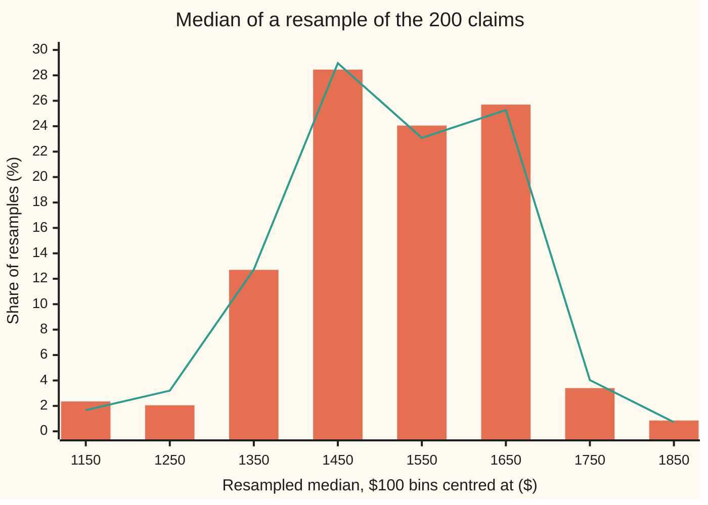
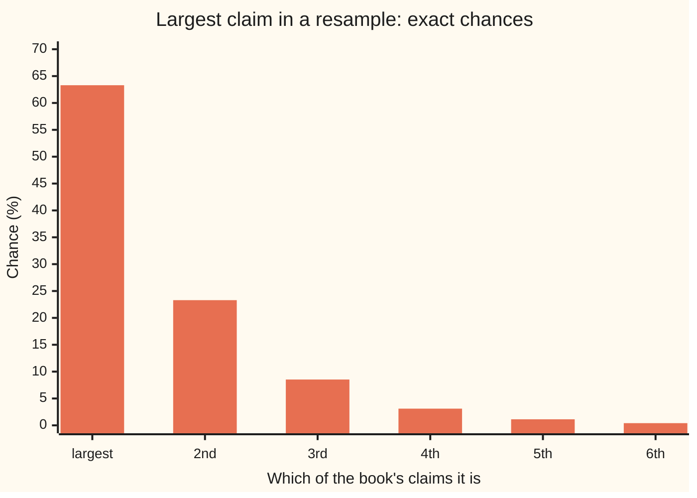

# Bootstrap: resampling your own data to see how your estimate wobbles

[Syllabus](../../../SYLLABUS.md) → [Probability and statistics](../README.md) → [Sampling and Estimation](../README.md#s07) → Bootstrap

---

## General Overview

An insurer closes the year with a book of 200 home-contents claims. The smallest is $87.91 and the largest $17,253.10. The middle claim, the **median**, is $1,513.40: half the claims were smaller, half larger. The average is $2,484.93, pulled up by a few large losses. The pricing team quotes the median as the typical claim.

How firm is $1,513.40? Next year's 200 claims will give a different median. For an average there is a formula for that wobble, the standard error $s/\sqrt{n}$ of [Standard error](02-sample-mean-and-standard-error.md). For a median the usual formula needs the height of the unknown claim law at its middle, a number 200 claims cannot pin down well.

The **bootstrap** gets the wobble without a formula. Treat the 200 claims as if they were the whole population. Draw 200 claims from them at random, putting each one back after it is drawn, so some claims come up twice and some not at all. That new list is a **resample**. Take its median. Do it 2,000 times. The 2,000 medians scatter, and their scatter stands in for the scatter of next year's median. Here it is $133.65: the typical claim is $1,513.40 give or take about that much. The same recipe gives the average a standard error of $202.30. The name comes from "pulling oneself up by one's bootstraps": the data are used to judge themselves.

**Resampling the data with replacement copies how the sample was drawn, with the sample standing in for the population, so the spread of an estimate across resamples estimates its standard error, and the middle 95 percent of the resampled estimates gives an interval.**

**What kind of fact this is:** a method. Its exact answer for the mean is proved on this card in Why it works; that it tracks the true wobble for large samples is a theorem (Bickel and Freedman, 1981), stated here and checked by simulation.

### The picture: 2,000 resampled medians



Bars: the 2,000 simulated resamples. Line: the same law computed exactly by counting ranks, with no simulation (Step 3 below). Where a bar and the line disagree, the bar is the one that is off: it is a share of only 2,000 resamples and carries simulation noise, which shrinks like 1/√B; the line has none. The book's own median, $1,513.40, sits in the $1,500 to $1,600 bin. The law is lumpy, not a smooth bell: a resampled median can only be one of the 200 claims or the midpoint of two of them, and a few of those carry most of the chance.

---

## The formula

Notation first, in words. A reminder from [Samples and estimators](01-populations-samples-and-estimators.md): a hat marks a guess, so $\hat\theta$ (theta-hat) is the book's estimate of a population number θ, here the median. A star marks anything computed from a resample: $x^*_1, \dots, x^*_n$ is one resample, and $\hat\theta^*_b$ is the estimate on resample number b. Brackets round a subscript mean rank: $x_{(k)}$ is the k-th smallest claim.

The bootstrap standard error is the ordinary spread of the resampled estimates:

$$\widehat{\mathrm{se}}_B = \sqrt{\frac{1}{B-1}\sum_{b=1}^{B}\bigl(\hat\theta^*_b - \bar\theta^*\bigr)^2}, \qquad \bar\theta^* = \frac{1}{B}\sum_{b=1}^{B}\hat\theta^*_b$$

**Read it aloud:** the bootstrap standard error is the standard deviation of the estimate across the B resamples.

The **percentile interval** reads the middle 95 percent of those estimates:

$$\Bigl[\,q^*_{0.025},\; q^*_{0.975}\,\Bigr]$$

**Read it aloud:** from the resampled estimates, the value with 2.5 percent below it to the value with 97.5 percent below it.

For the mean, no simulation is needed. Letting B grow without end gives the exact bootstrap standard error:

$$\mathrm{se}^*(\bar x) = \frac{\hat\sigma}{\sqrt n}, \qquad \hat\sigma^2 = \frac{1}{n}\sum_{i=1}^{n}\bigl(x_i - \bar x\bigr)^2$$

**Read it aloud:** the bootstrap standard error of the mean is the claims' spread, measured with divisor n, over the square root of the number of claims.

| Symbol | Plain meaning | In our example | Push it up and the answer… |
| --- | --- | --- | --- |
| $n$ | number of claims in the book | 200 | every standard error falls, like 1/√n |
| $x_i$, $x_{(k)}$ | claim number i; the k-th smallest claim | 100th smallest $1,509.52; 101st $1,517.29 | — |
| $\hat\theta$ | the book's estimate, here the median | $1,513.40 | — |
| $x^*_i$ | a claim in a resample, drawn with replacement | any of the 200, chance 1/200 each | — |
| $B$ | number of resamples | 2,000 | simulation noise falls; the answer itself does not move |
| $\hat\theta^*_b$, $\bar\theta^*$ | estimate on resample b; average of the B of them | $\bar\theta^*$ close to $1,513.40 | — |
| $\widehat{\mathrm{se}}_B$ | bootstrap standard error from B resamples | median $133.65, mean $202.30 | — |
| $\mathrm{se}^*$ | exact bootstrap standard error, B without end | median $133.90, mean $202.97 | — |
| $\bar x$, $\hat\sigma$ | the book's mean; its spread with divisor n | $2,484.93; $2,870.49 | $\hat\sigma$ up: the mean's standard error up |
| $s$ | the book's spread with divisor n − 1, used by the textbook standard error $s/\sqrt n$ | $2,877.69 | the textbook standard error up |
| $q^*_{0.025}$, $q^*_{0.975}$ | 2.5% and 97.5% points of the resampled estimates | median $1,215.34 to $1,755.73 | — |
| $f(m)$ | height of the true claim density at the true median m | 1/(1500 √(2π)) per dollar | the median's true standard error falls |

The last row belongs to the large-sample formula the bootstrap sidesteps: the median's standard error is about $1/\bigl(2 f(m)\sqrt n\bigr)$. It needs $f(m)$, and a book of claims does not supply it.

### When it holds

- **Independent claims from one law.** If each of 100 claims was logged twice, the resamples treat 200 claims as independent and report a standard error for the mean of $209.45, where the 100 real claims give $296.21: 29 percent too small.
- **A smooth statistic.** A resample changes only how often each claim appears, so dropping or repeating a few claims should move the estimate only a little: the estimate should change gently with the share of the book at each claim amount. The mean and the median qualify; drop or repeat any one claim and the median moves only to a neighbouring claim, $1,509.52 or $1,517.29. The largest claim does not, because one claim decides it: 63.30 percent of resamples repeat the book's own largest claim exactly, and the bootstrap standard error of the maximum is $1,125.65 against a true $12,976.31.
- **A book large enough to look like the population.** A resample can only recombine the claims already seen; a claim larger than any in the book never appears. With a handful of claims the percentile interval's 95 percent is a label, not a rate.
- **A finite spread, for the mean.** Bickel and Freedman showed the bootstrap of the mean works when the population's variance is finite. For a heavy-tailed law with infinite variance ([Heavy tails](../04-Continuous%20Distributions/08-heavy-tails-pareto-and-cauchy.md)) it fails.
- **Little skew, for an interval on the mean.** With these skewed claims, "mean ± 1.96 standard errors" caught the true mean in 93.25 percent of books, not 95.

---

## Why it works

### Step 0: the unknown population is replaced by the sample

The wobble of an estimate depends on the population the claims come from. Draw 200 claims from it, compute the median, repeat: the spread of those medians is the true standard error. That population is unknown. What is known is the book, and a list of 200 claims, each given weight 1/200, is a population in its own right, called the **empirical distribution**. Swap it in, and the question "how would the median move on a fresh book?" becomes a question about a known, finite population. Apart from simulation noise, the only approximation in the whole method is that swap. This substitution is called the **plug-in principle**.

### Step 1: drawing with replacement is sampling from the empirical distribution

Drawing one claim from the book at random gives each claim chance 1/200. Putting it back before the next draw keeps the chances at 1/200 and makes the draws independent. So a resample of 200 is exactly what a fresh book of 200 would be, had the population been the book itself.

Without replacement, 200 draws from 200 claims are just the same 200 claims in a new order. Their median never changes: 20 reshuffles give a spread of $0.00. Replacement is what lets some claims repeat and others drop out, and that variation is the wobble being measured.

### Step 2: for the mean, the exact answer is a formula

One resampled claim has average $\bar x$ (each claim, weight 1/200) and variance $\hat\sigma^2$, the average squared distance from $\bar x$ with divisor n. The 200 draws are independent, so the variance of their average is $\hat\sigma^2/n$ ([Standard error](02-sample-mean-and-standard-error.md) makes the same step for a real sample). For the book: $2,870.49/√200 = $202.97. The 2,000 simulated resamples give $202.30, within simulation noise.

The textbook standard error uses s, the spread with divisor n − 1, and gives $203.48. The two differ by the factor √(199/200), just under 1: the bootstrap is the plug-in version of the familiar formula, and for large books they agree. On the shelf's poll, 520 of 1,000 voters for one side, the same step gives the share's standard error 0.0158: a share is the mean of answers coded 1 and 0, and $\hat\sigma^2$ becomes 0.52 × 0.48.

### Step 3: for the median, the exact answer is a count of ranks

A median has no short formula, but its bootstrap law can still be computed exactly, because it depends only on ranks. With 200 draws, the resampled median is the average of the 100th and 101st smallest draws. Which claims those are is decided by counting how many draws land below each rank, and every such count is binomial, as in [Order statistics](../05-Transformations%20and%20Joint%20Laws/08-order-statistics-and-extremes.md). The chance that the middle pair is the i-th and j-th smallest claims is the same for every book of 200. Only the dollar amounts attached to those ranks change.

The count gives 1,699 rank pairs with a chance above 10^−13; together they hold probability 0.999999999992. Weighting each pair's midpoint by its chance gives the exact bootstrap standard error of the median, $133.90, and the exact percentile interval, $1,228.47 to $1,755.64. The simulation, road 1, gave $133.65 and $1,215.34 to $1,755.73. Simulation adds noise of about 1 part in √(2 × 1,999) = 63.2 to a standard error; the exact law has none.

<details>
<summary>Detailed proof: the exact bootstrap law of the median</summary>

Hold the book fixed and write P\* for chances over resamples. Each of the 200 draws lands on rank k with chance 1/200, independently.

**Two different ranks.** Suppose the 100th smallest draw is claim $x_{(i)}$ and the 101st is $x_{(j)}$, with i < j. Then exactly 100 draws land on ranks 1 to i, at least one of them on rank i, and the other 100 land on ranks j to 200, at least one on rank j. Choose which 100 draws are the low ones: $\binom{200}{100}$ ways. Each low draw lands in ranks 1 to i with chance i/200; subtracting the case where none hits rank i leaves $(i/200)^{100} - ((i-1)/200)^{100}$. The high draws give the matching factor. So
$$P^*\bigl(\text{middle pair} = x_{(i)}, x_{(j)}\bigr) = \binom{200}{100}\Bigl[\bigl(\tfrac{i}{200}\bigr)^{100} - \bigl(\tfrac{i-1}{200}\bigr)^{100}\Bigr]\Bigl[\bigl(\tfrac{201-j}{200}\bigr)^{100} - \bigl(\tfrac{200-j}{200}\bigr)^{100}\Bigr].$$

**The same rank twice.** The 100th smallest draw is at most $x_{(k)}$ exactly when at least 100 draws land on ranks 1 to k. That count is Binomial(200, k/200), so P\*(100th smallest ≤ $x_{(k)}$) is a binomial tail. Differencing at k = i and k = i − 1 gives the chance that the 100th smallest draw is $x_{(i)}$. Subtract the pairs with j > i from the line above, and what remains is the chance that both middle draws are $x_{(i)}$.

**The law.** The resampled median equals $(x_{(i)} + x_{(j)})/2$ with the chance just found. Its mean and variance are finite sums; the square root of the variance is the exact bootstrap standard error. The code tests the pair formula a second way. Summing the chances over the lower rank must give the law of the 101st smallest draw, a binomial tail with 101 in place of 100; the two agree to within 10^−9.

**The mean.** Each draw has mean $\bar x$ and variance $\hat\sigma^2$ under P\*. Independent draws have covariance 0, so the variance of their average is $n\hat\sigma^2/n^2 = \hat\sigma^2/n$.

</details>

### Step 4: why the swap is good enough

As the book grows, the empirical distribution closes in on the true law of claims at every dollar amount at once; that is the Glivenko–Cantelli theorem, stated here and not proved, since its proof rests on the strong law of large numbers ([The strong law of large numbers](../../10-Measure%20and%20integration/10-The%20Limit%20Theorems%2C%20Proved/04-strong-law-of-large-numbers.md)). Closeness here means the share of the book below each dollar amount is near the true chance of a claim below it. For the median that is nearly enough. The true claim density at the middle, $f(m)$, is above zero, so the chance of a claim below a dollar amount climbs steadily through one half there. Move the law a little and the place where it crosses one half moves in proportion, by about that amount divided by $f(m)$. A resample's shares stray from the book's by about as much as a fresh book's stray from the truth, both of size about 1/√n, so the two medians stray by matching amounts. For the standard error itself the median also needs a very mild tail condition, that some small power of a claim has a finite average; lognormal claims meet it. It is not enough for the mean. Move a chance of 1 in 1,000 out to $10,000,000: the share below any dollar amount changes by at most 0.001, yet the mean rises by about 0.001 × $10,000,000 = $10,000. The mean also needs its tails kept in check, and a finite variance does that. Under those conditions the resampled wobble of the mean and of the median closes in on their true wobble. Bickel and Freedman (1981) proved this for the mean whenever the population variance is finite, and for many smooth statistics besides.

The check tests it directly. The 200 claims were drawn from a known law, the lognormal of [Lognormal](../04-Continuous%20Distributions/06-lognormal-distribution.md): the logarithm of a claim is normal, centred on the logarithm of $1,500 with spread 1. So the truth can be found by brute force: 2,000 fresh books drawn from that law. Their medians spread by $132.33, and the large-sample formula gives $132.93. One book's bootstrap said $133.90.

That close match was partly luck. Across the 2,000 fresh books, the bootstrap standard error of the median averaged $135.83, near the truth, but itself spread by $28.47. One book's bootstrap standard error is an estimate too, with a spread about a fifth of its size.

### Step 5: the interval is a statement about the method

Across the 2,000 fresh books, each with its own exact percentile interval, the interval caught the true median of $1,500 in 0.9525 of them, with standard error 0.0048. That is what "95 percent" means: a property of the recipe over many books. Any one interval, such as $1,228.47 to $1,755.64, either contains $1,500 or does not. The full account of intervals is shelf 08's, from [Confidence intervals](../08-Confidence%20Intervals%20and%20Tests/01-confidence-intervals.md).

The same percentile recipe for the mean gives $2,100.83 to $2,906.37. It is lopsided: it reaches further above $2,484.93 than below, because large claims pull resampled means up more than small ones pull them down. The percentile interval copies that skew; "mean ± 1.96 standard errors" does not, and it caught the true mean, $2,473.08, only 93.25 percent of the time. Copying the skew is not a cure: for the mean of skewed data the percentile interval also falls short of 95. Corrected intervals are in Efron and Tibshirani and in Davison and Hinkley: the bootstrap-t, which resamples the estimate's distance from the book's value measured in units of its own standard error, and BCa (bias-corrected and accelerated), which shifts the percentile points to allow for bias and skew.

Two other routes reach a standard error without a formula. The jackknife recomputes the estimate leaving out one claim at a time; Efron's 1979 paper introduced the bootstrap as its generalisation. The parametric bootstrap resamples from a fitted law instead of from the claims, using the fit of [Maximum likelihood](04-maximum-likelihood.md). And the bootstrap can estimate an estimator's bias as well as its spread, the other half of [Bias and variance](06-bias-variance-and-mean-squared-error.md).

---

## Worked numbers, by hand

The book of 200 claims, its median and its mean.

| Step | Arithmetic | Value |
| --- | --- | --- |
| median of the book | ($1,509.52 + $1,517.29)/2 | $1,513.40 |
| mean of the book | total of the claims / 200 | $2,484.93 |
| spread with divisor n, $\hat\sigma$ | √(average squared distance from $2,484.93) | $2,870.49 |
| **exact bootstrap SE of the mean** | 2,870.49 / √200 | **$202.97** |
| textbook SE, divisor n − 1 | 2,877.69 / √200 | $203.48 |
| simulated SE of the mean, B = 2,000 | spread of 2,000 resampled means | $202.30 |
| simulation noise in that SE, 1 part in | √(2 × 1,999) | 63.2 |
| **exact bootstrap SE of the median** | rank counting, 1,699 pairs | **$133.90** |
| simulated SE of the median | spread of 2,000 resampled medians | $133.65 |
| percentile interval, median | 51st and 1,950th of 2,000 sorted | $1,215.34 to $1,755.73 |
| same, from the exact law | 2.5% and 97.5% points | $1,228.47 to $1,755.64 |
| the truth, 2,000 fresh books | spread of their medians | $132.33 |

The typical claim is $1,513.40, with a standard error of about $134; the method that produced the interval $1,228.47 to $1,755.64 catches the true median in about 95 books out of 100.

### What breaks if you drop a piece

The right answer for the median is $133.90.

| Mistake | Comes out at | What went wrong |
| --- | --- | --- |
| Resampling without replacement | $0.00 | Every resample is the same 200 claims reshuffled; the median never moves |
| Dividing the spread by √B again | $2.99 | B counts simulations, not claims; more resamples sharpen the $133.90, they do not shrink it |
| Bootstrapping the largest claim | $1,125.65 against a true $12,976.31 | 63.30 percent of resamples repeat the book's largest claim; one claim decides the maximum, so it is not smooth |
| Each of 100 claims logged twice | mean's SE $209.45, honest $296.21 | Independence dropped: the resamples count duplicates as fresh information, ratio 0.7071 |

The code prints every row. The last two are hypotheses dropped, not slips.

### The picture: the largest claim does not resample



A resample misses the book's largest claim only if all 200 draws miss it, so it contains that claim with chance 1 − (199/200)^200 = 0.6330. So 63.30 percent of resamples contain it, and their largest claim is exactly $17,253.10. The 2,000 simulated resamples gave 62.65 percent. A fresh book's largest claim, by contrast, is never exactly $17,253.10 and is often far larger: across fresh books it spread by $12,976.31. The bootstrap cannot see a claim larger than any it was given.

---

## Code, from first principles, and it actually runs

The checks take three independent roads. Road 1 is the bootstrap as practitioners run it: 2,000 resamples, drawn with replacement by a SplitMix64 generator (a small, written-out source of random bits, seed 2026092809). Road 2 is the same bootstrap law with no simulation: the formula for the mean and the rank count for the median. Road 3 is the truth: 2,000 fresh books from the claim law, which also measures how often the percentile interval catches the true median. The checks also print every "what breaks" row and both charts. Python and Rust draw the same random numbers and print the same bytes; the claims come from a normal draw by the Box–Muller recipe. The only library functions used are math primitives (logarithm, cosine, square root, exponential and powers) and, in the Python, the binomial coefficient `comb`.

### Python

```python
# Bootstrap -- the check behind the card.  Standard library only.  200 insurance claims:
# how much would their median, and their mean, wobble on a fresh book of claims?
# Road 1: bootstrap by simulation.  Road 2: the same bootstrap law, exactly.  Road 3: the truth,
# from fresh books drawn from the known claim law.  Random numbers: SplitMix64, written out below.
from math import sqrt, log, exp, cos, pi, comb

N, H, B, FRESH, SEED = 200, 100, 2000, 2000, 2026092809     # H: the middle pair are draws H and H + 1
MED, SIG = 1500.0, 1.0              # claim law: log of a claim is normal, centre log 1500, spread 1
MASK, state = (1 << 64) - 1, SEED

def splitmix():
    global state
    state = (state + 0x9E3779B97F4A7C15) & MASK
    z = state
    z = ((z ^ (z >> 30)) * 0xBF58476D1CE4E5B9) & MASK
    z = ((z ^ (z >> 27)) * 0x94D049BB133111EB) & MASK
    return z ^ (z >> 31)

def claim():                         # Box-Muller normal draw, then exp: one claim in dollars
    u1 = ((splitmix() >> 11) + 0.5) / 2.0 ** 53
    u2 = ((splitmix() >> 11) + 0.5) / 2.0 ** 53
    return MED * exp(SIG * sqrt(-2.0 * log(u1)) * cos(2.0 * pi * u2))

def mean(xs): return sum(xs) / len(xs)

def spread(xs, d=1):                 # standard deviation with divisor len - d
    m = mean(xs)
    return sqrt(sum((x - m) ** 2 for x in xs) / (len(xs) - d))

def median(xs):
    s = sorted(xs)
    return (s[H - 1] + s[H]) / 2

def pct(vals):                       # percentile interval: the 2.5% and 97.5% points
    s = sorted(vals)
    return s[int(0.025 * len(s))], s[int(0.975 * len(s)) - 1]

# Road 2 for the median: P(resample median = (i-th + j-th smallest claim) / 2) depends on ranks only.
def tail(k, h=H):                    # P(at least h of N draws land on the k smallest claims)
    p, c, t = k / N, 1.0, 0.0
    for m in range(N + 1):
        if m >= h:
            t += c * p ** m * (1.0 - p) ** (N - m)
        c = c * (N - m) / (m + 1)
    return t
CH = comb(N, H)                      # C(200, 100): which 100 draws fall low
W = []
for i in range(1, N + 1):
    row = 0.0
    for j in range(i + 1, N + 1):    # 100th smallest draw is claim i, 101st is claim j
        w = CH * ((i / N) ** H - ((i - 1) / N) ** H) * (((N - j + 1) / N) ** H - ((N - j) / N) ** H)
        row += w
        if w > 1e-13:
            W.append((i, j, w))
    w = tail(i) - tail(i - 1) - row  # both middle draws are claim i
    if w > 1e-13:
        W.append((i, i, w))
KEPT = sum(w for _, _, w in W)
M101 = [sum(w for _, j, w in W if j == k) for k in range(N + 1)]   # law of the 101st smallest draw

def exact_median_law(s):             # exact bootstrap SE and percentile interval, sorted sample s
    pts = sorted(((s[i - 1] + s[j - 1]) / 2, w / KEPT) for i, j, w in W)
    m1 = sum(v * w for v, w in pts)
    se = sqrt(sum((v - m1) ** 2 * w for v, w in pts))
    cum, lo, hi = 0.0, None, None
    for v, w in pts:
        cum += w
        lo = v if lo is None and cum >= 0.025 else lo
        hi = v if hi is None and cum >= 0.975 else hi
    return se, lo, hi, pts

claims = [claim() for _ in range(N)]
s = sorted(claims)
xbar, med, sig_hat = mean(claims), median(claims), spread(claims, 0)
print(f"book of {N} claims, seed {SEED}: median ${med:.2f}, mean ${xbar:.2f}")
print(f"  smallest ${s[0]:.2f}, middle pair ${s[H - 1]:.2f} and ${s[H]:.2f}, largest ${s[-1]:.2f}")
print(f"  spread, divisor n: ${sig_hat:.2f}; divisor n - 1: ${spread(claims):.2f}")
bmean, bmed, bmax = [], [], []
for _ in range(B):                   # Road 1: resample 200 claims with replacement, B times
    r = [claims[splitmix() % N] for _ in range(N)]
    bmean.append(mean(r))
    bmed.append(median(r))
    bmax.append(max(r))
se_mean1, se_med1, se_mean2 = spread(bmean), spread(bmed), sig_hat / sqrt(N)
se_med2, lo2, hi2, pts = exact_median_law(s)
print(f"road 1, {B} resamples: SE of the mean ${se_mean1:.2f}, SE of the median ${se_med1:.2f}")
print(f"  simulation noise in each SE, about 1 part in {sqrt(2 * (B - 1)):.1f}; "
      f"percentile interval, mean ${pct(bmean)[0]:.2f} to ${pct(bmean)[1]:.2f}")
print(f"  percentile interval, median ${pct(bmed)[0]:.2f} to ${pct(bmed)[1]:.2f}")
print(f"road 2, exact: SE of the mean, spread / root n = ${se_mean2:.2f}; with n - 1: ${spread(claims) / sqrt(N):.2f}")
print(f"  poll, 520 of 1000 for one side: SE of the share {spread([1.0] * 520 + [0.0] * 480, 0) / sqrt(1000):.4f}; "
      f"median by rank counting: {len(W)} pairs of ranks, mass {KEPT:.12f}")
print(f"  SE of the median ${se_med2:.2f}; percentile interval ${lo2:.2f} to ${hi2:.2f}")
def bins(vw): return " ".join(f"{100 * sum(w for v, w in vw if 1100 + 100 * k <= v < 1200 + 100 * k):.2f}" for k in range(8))
print("chart, bin centre: " + " ".join(f"{1150 + 100 * k}" for k in range(8)))
print("chart, road 1 %:   " + bins([(v, 1 / B) for v in bmed]))
print("chart, road 2 %:   " + bins(pts))

fmean, fmed, fmax, fse, cov_med, cov_mean = [], [], [], [], 0, 0
TRUE_MEAN = MED * exp(SIG * SIG / 2)
for _ in range(FRESH):               # Road 3: fresh books from the claim law itself
    f = sorted(claim() for _ in range(N))
    fmean.append(mean(f))
    fmed.append((f[H - 1] + f[H]) / 2)
    fmax.append(f[-1])
    e_se, e_lo, e_hi, _ = exact_median_law(f)
    fse.append(e_se)
    cov_med += e_lo <= MED <= e_hi
    cov_mean += abs(fmean[-1] - TRUE_MEAN) <= 1.96 * spread(f, 0) / sqrt(N)
true_se_mean = TRUE_MEAN * sqrt(exp(SIG * SIG) - 1) / sqrt(N)
true_se_med = MED * SIG * sqrt(2 * pi) / (2 * sqrt(N))
c1, c2 = cov_med / FRESH, cov_mean / FRESH
print(f"road 3, {FRESH} fresh books: spread of their medians ${spread(fmed):.2f}, of their means ${spread(fmean):.2f}")
print(f"  by formula: median ${true_se_med:.2f} (large n), mean ${true_se_mean:.2f}; true mean ${TRUE_MEAN:.2f}")
print(f"  bootstrap SE of the median across the fresh books: average ${mean(fse):.2f}, spread ${spread(fse):.2f}")
print(f"  percentile interval for the median caught ${MED:.0f} in {c1:.4f} of books (SE {sqrt(c1 * (1 - c1) / FRESH):.4f})")
print(f"  mean +- 1.96 bootstrap SEs caught ${TRUE_MEAN:.2f} in {c2:.4f} of books (SE {sqrt(c2 * (1 - c2) / FRESH):.4f})")

atom = 1 - (1 - 1 / N) ** N
atom1 = sum(v == s[-1] for v in bmax) / B
print("what breaks")
print(f"  largest claim: resamples repeating the sample's largest, exact {atom:.4f}, simulated {atom1:.4f}")
print(f"  largest claim: bootstrap SE ${spread(bmax):.2f}, true spread across fresh books ${spread(fmax):.2f}")
print("  largest claim, exact %: " + " ".join(f"{100 * ((k / N) ** N - ((k - 1) / N) ** N):.2f}" for k in range(N, N - 6, -1)))
shuf = [median(sorted(claims, key=lambda _: splitmix())) for _ in range(20)]   # without replacement
print(f"  without replacement, 20 reshuffles: spread of the medians ${spread(shuf):.2f}")
print(f"  SE of the median divided again by root B: ${se_med1 / sqrt(B):.2f}")
half = claims[:H]
print(f"  100 claims each logged twice: bootstrap SE of the mean ${spread(half + half, 0) / sqrt(N):.2f}, "
      f"honest ${spread(half, 0) / sqrt(H):.2f}, ratio {sqrt(H / N):.4f}")

assert max(abs(M101[k] - tail(k, H + 1) + tail(k - 1, H + 1)) for k in range(1, N + 1)) < 1e-9, "pair formula"
assert abs(se_mean1 - se_mean2) < 4 * se_mean2 / sqrt(2 * (B - 1)), "simulated vs exact SE of the mean"
assert abs(se_med1 - se_med2) < 4 * se_med2 / sqrt(2 * (B - 1)), "simulated vs exact SE of the median"
assert abs(mean(fse) - spread(fmed)) < 4 * sqrt(spread(fse) ** 2 / FRESH + spread(fmed) ** 2 / (2 * FRESH)), "bootstrap vs truth"
assert abs(spread(fmean) - true_se_mean) < 5 * true_se_mean / sqrt(2 * FRESH), "fresh means vs the formula"
assert abs(c1 - 0.95) < 4 * sqrt(0.95 * 0.05 / FRESH), "percentile interval covers about 95%"
assert abs(atom1 - atom) < 4 * sqrt(atom * (1 - atom) / B), "largest-claim atom, simulated vs exact"
print("ALL CHECKS PASS")
```

**Ran 2026-09-28 on macOS, Python 3.14.6, standard library only. All checks passed. Output, pasted from the run:**

```
book of 200 claims, seed 2026092809: median $1513.40, mean $2484.93
  smallest $87.91, middle pair $1509.52 and $1517.29, largest $17253.10
  spread, divisor n: $2870.49; divisor n - 1: $2877.69
road 1, 2000 resamples: SE of the mean $202.30, SE of the median $133.65
  simulation noise in each SE, about 1 part in 63.2; percentile interval, mean $2100.83 to $2906.37
  percentile interval, median $1215.34 to $1755.73
road 2, exact: SE of the mean, spread / root n = $202.97; with n - 1: $203.48
  poll, 520 of 1000 for one side: SE of the share 0.0158; median by rank counting: 1699 pairs of ranks, mass 0.999999999992
  SE of the median $133.90; percentile interval $1228.47 to $1755.64
chart, bin centre: 1150 1250 1350 1450 1550 1650 1750 1850
chart, road 1 %:   2.35 2.05 12.70 28.45 24.05 25.70 3.40 0.85
chart, road 2 %:   1.67 3.20 12.73 28.96 23.08 25.27 4.03 0.72
road 3, 2000 fresh books: spread of their medians $132.33, of their means $237.27
  by formula: median $132.93 (large n), mean $229.23; true mean $2473.08
  bootstrap SE of the median across the fresh books: average $135.83, spread $28.47
  percentile interval for the median caught $1500 in 0.9525 of books (SE 0.0048)
  mean +- 1.96 bootstrap SEs caught $2473.08 in 0.9325 of books (SE 0.0056)
what breaks
  largest claim: resamples repeating the sample's largest, exact 0.6330, simulated 0.6265
  largest claim: bootstrap SE $1125.65, true spread across fresh books $12976.31
  largest claim, exact %: 63.30 23.30 8.53 3.11 1.13 0.41
  without replacement, 20 reshuffles: spread of the medians $0.00
  SE of the median divided again by root B: $2.99
  100 claims each logged twice: bootstrap SE of the mean $209.45, honest $296.21, ratio 0.7071
ALL CHECKS PASS
```

### Rust

Same roads, same labels, built with `rustc --edition 2021 -O`.

```rust
// Bootstrap -- the same check as the Python, in Rust.  No crates.  200 insurance claims:
// how much would their median, and their mean, wobble on a fresh book of claims?
// Road 1: bootstrap by simulation.  Road 2: the same bootstrap law, exactly.  Road 3: the truth,
// from fresh books drawn from the known claim law.  Random numbers: SplitMix64, written out below.
use std::f64::consts::PI;

const N: usize = 200; const H: usize = N / 2; const B: usize = 2000; const FRESH: usize = 2000; const SEED: u64 = 2026092809;
const MED: f64 = 1500.0; const SIG: f64 = 1.0; // claim law: log of a claim is normal, centre log 1500, spread 1

struct Rng(u64);
impl Rng {
    fn next(&mut self) -> u64 {
        self.0 = self.0.wrapping_add(0x9E3779B97F4A7C15);
        let mut z = self.0;
        z = (z ^ (z >> 30)).wrapping_mul(0xBF58476D1CE4E5B9);
        z = (z ^ (z >> 27)).wrapping_mul(0x94D049BB133111EB);
        z ^ (z >> 31)
    }
    fn claim(&mut self) -> f64 { // Box-Muller normal draw, then exp: one claim in dollars
        let u1 = ((self.next() >> 11) as f64 + 0.5) / 2f64.powi(53);
        let u2 = ((self.next() >> 11) as f64 + 0.5) / 2f64.powi(53);
        MED * (SIG * (-2.0 * u1.ln()).sqrt() * (2.0 * PI * u2).cos()).exp()
    }
}

fn mean(xs: &[f64]) -> f64 { xs.iter().sum::<f64>() / xs.len() as f64 }

fn spread(xs: &[f64], d: usize) -> f64 { // standard deviation with divisor len - d
    let m = mean(xs);
    (xs.iter().map(|x| (x - m) * (x - m)).sum::<f64>() / (xs.len() - d) as f64).sqrt()
}

fn sorted(xs: &[f64]) -> Vec<f64> { let mut s = xs.to_vec(); s.sort_by(|a, b| a.partial_cmp(b).unwrap()); s }

fn median(xs: &[f64]) -> f64 { let s = sorted(xs); (s[H - 1] + s[H]) / 2.0 }

fn pct(vals: &[f64]) -> (f64, f64) { // percentile interval: the 2.5% and 97.5% points
    let (s, n) = (sorted(vals), vals.len() as f64);
    (s[(0.025 * n) as usize], s[(0.975 * n) as usize - 1])
}

// Road 2 for the median: P(resample median = (i-th + j-th smallest claim) / 2) depends on ranks only.
fn tail(k: usize, h: usize) -> f64 { // P(at least h of N draws land on the k smallest claims)
    let (p, mut c, mut t) = (k as f64 / N as f64, 1.0f64, 0.0f64);
    for m in 0..=N {
        if m >= h { t += c * p.powf(m as f64) * (1.0 - p).powf((N - m) as f64); }
        c = c * (N - m) as f64 / (m + 1) as f64;
    }
    t
}

fn pw(a: f64, e: usize) -> f64 { (a / N as f64).powf(e as f64) }

fn rank_weights() -> Vec<(usize, usize, f64)> {
    let mut ch = 1.0f64;
    for m in 0..H { ch = ch * (N - m) as f64 / (m + 1) as f64; } // C(200, 100)
    let mut w_all = Vec::new();
    for i in 1..=N {
        let mut row = 0.0;
        for j in i + 1..=N { // 100th smallest draw is claim i, 101st is claim j
            let w = ch * (pw(i as f64, H) - pw((i - 1) as f64, H))
                * (pw((N - j + 1) as f64, H) - pw((N - j) as f64, H));
            row += w;
            if w > 1e-13 { w_all.push((i, j, w)); }
        }
        let w = tail(i, H) - tail(i - 1, H) - row; if w > 1e-13 { w_all.push((i, i, w)); } // both middle draws: claim i
    }
    w_all
}

// exact bootstrap SE and percentile interval, sorted sample s
fn exact_median_law(s: &[f64], wts: &[(usize, usize, f64)], kept: f64) -> (f64, f64, f64, Vec<(f64, f64)>) {
    let mut pts: Vec<(f64, f64)> = wts.iter().map(|&(i, j, w)| ((s[i - 1] + s[j - 1]) / 2.0, w / kept)).collect();
    pts.sort_by(|a, b| a.partial_cmp(b).unwrap());
    let m1: f64 = pts.iter().map(|(v, w)| v * w).sum();
    let se = pts.iter().map(|(v, w)| (v - m1) * (v - m1) * w).sum::<f64>().sqrt();
    let (mut cum, mut lo, mut hi) = (0.0, None, None);
    for &(v, w) in &pts {
        cum += w;
        if lo.is_none() && cum >= 0.025 { lo = Some(v); }
        if hi.is_none() && cum >= 0.975 { hi = Some(v); }
    }
    (se, lo.unwrap(), hi.unwrap(), pts)
}

fn bins(vw: &[(f64, f64)]) -> String {
    (0..8).map(|k| {
        let (a, b) = (1100.0 + 100.0 * k as f64, 1200.0 + 100.0 * k as f64);
        format!("{:.2}", 100.0 * vw.iter().filter(|(v, _)| a <= *v && *v < b).map(|(_, w)| w).sum::<f64>())
    }).collect::<Vec<_>>().join(" ")
}

fn main() {
    let (mut rng, wts) = (Rng(SEED), rank_weights());
    let kept: f64 = wts.iter().map(|t| t.2).sum();
    let m101: Vec<f64> = (0..=N).map(|k| wts.iter().filter(|t| t.1 == k).map(|t| t.2).sum()).collect(); // 101st smallest
    let claims: Vec<f64> = (0..N).map(|_| rng.claim()).collect();
    let s = sorted(&claims);
    let (xbar, med, sig_hat) = (mean(&claims), median(&claims), spread(&claims, 0));
    println!("book of {} claims, seed {}: median ${:.2}, mean ${:.2}", N, SEED, med, xbar);
    println!("  smallest ${:.2}, middle pair ${:.2} and ${:.2}, largest ${:.2}", s[0], s[H - 1], s[H], s[N - 1]);
    println!("  spread, divisor n: ${:.2}; divisor n - 1: ${:.2}", sig_hat, spread(&claims, 1));
    let (mut bmean, mut bmed, mut bmax) = (Vec::new(), Vec::new(), Vec::new());
    for _ in 0..B { // Road 1: resample 200 claims with replacement, B times
        let r: Vec<f64> = (0..N).map(|_| claims[(rng.next() % N as u64) as usize]).collect();
        bmean.push(mean(&r)); bmed.push(median(&r)); bmax.push(r.iter().cloned().fold(f64::MIN, f64::max));
    }
    let (se_mean1, se_med1, se_mean2) = (spread(&bmean, 1), spread(&bmed, 1), sig_hat / (N as f64).sqrt());
    let (se_med2, lo2, hi2, pts) = exact_median_law(&s, &wts, kept); let fr = FRESH as f64;
    println!("road 1, {} resamples: SE of the mean ${:.2}, SE of the median ${:.2}", B, se_mean1, se_med1);
    println!("  simulation noise in each SE, about 1 part in {:.1}; percentile interval, mean ${:.2} to ${:.2}",
             (2.0 * (B - 1) as f64).sqrt(), pct(&bmean).0, pct(&bmean).1);
    println!("  percentile interval, median ${:.2} to ${:.2}", pct(&bmed).0, pct(&bmed).1);
    println!("road 2, exact: SE of the mean, spread / root n = ${:.2}; with n - 1: ${:.2}",
             se_mean2, spread(&claims, 1) / (N as f64).sqrt());
    let poll: Vec<f64> = (0..1000).map(|k| if k < 520 { 1.0 } else { 0.0 }).collect();
    println!("  poll, 520 of 1000 for one side: SE of the share {:.4}; median by rank counting: {} pairs of ranks, mass {:.12}",
             spread(&poll, 0) / 1000f64.sqrt(), wts.len(), kept);
    println!("  SE of the median ${:.2}; percentile interval ${:.2} to ${:.2}", se_med2, lo2, hi2);
    println!("chart, bin centre: {}", (0..8).map(|k| (1150 + 100 * k).to_string()).collect::<Vec<_>>().join(" "));
    println!("chart, road 1 %:   {}", bins(&bmed.iter().map(|&v| (v, 1.0 / B as f64)).collect::<Vec<_>>()));
    println!("chart, road 2 %:   {}", bins(&pts));
    let (mut fmean, mut fmed, mut fmax, mut fse, mut cov_med, mut cov_mean) = (vec![], vec![], vec![], vec![], 0, 0);
    let true_mean = MED * (SIG * SIG / 2.0).exp(); // Road 3 below: fresh books from the claim law itself
    for _ in 0..FRESH {
        let f = sorted(&(0..N).map(|_| rng.claim()).collect::<Vec<f64>>());
        fmean.push(mean(&f)); fmed.push((f[H - 1] + f[H]) / 2.0); fmax.push(f[N - 1]);
        let (e_se, e_lo, e_hi, _) = exact_median_law(&f, &wts, kept);
        fse.push(e_se);
        if e_lo <= MED && MED <= e_hi { cov_med += 1; }
        if (fmean[fmean.len() - 1] - true_mean).abs() <= 1.96 * spread(&f, 0) / (N as f64).sqrt() { cov_mean += 1; }
    }
    let true_se_mean = true_mean * ((SIG * SIG).exp() - 1.0).sqrt() / (N as f64).sqrt();
    let true_se_med = MED * SIG * (2.0 * PI).sqrt() / (2.0 * (N as f64).sqrt());
    let (c1, c2) = (cov_med as f64 / fr, cov_mean as f64 / fr);
    println!("road 3, {} fresh books: spread of their medians ${:.2}, of their means ${:.2}", FRESH, spread(&fmed, 1), spread(&fmean, 1));
    println!("  by formula: median ${:.2} (large n), mean ${:.2}; true mean ${:.2}", true_se_med, true_se_mean, true_mean);
    println!("  bootstrap SE of the median across the fresh books: average ${:.2}, spread ${:.2}", mean(&fse), spread(&fse, 1));
    println!("  percentile interval for the median caught ${:.0} in {:.4} of books (SE {:.4})", MED, c1, (c1 * (1.0 - c1) / fr).sqrt());
    println!("  mean +- 1.96 bootstrap SEs caught ${:.2} in {:.4} of books (SE {:.4})", true_mean, c2, (c2 * (1.0 - c2) / fr).sqrt());
    let atom = 1.0 - (1.0 - 1.0 / N as f64).powf(N as f64);
    let atom1 = bmax.iter().filter(|&&v| v == s[N - 1]).count() as f64 / B as f64;
    println!("what breaks");
    println!("  largest claim: resamples repeating the sample's largest, exact {:.4}, simulated {:.4}", atom, atom1);
    println!("  largest claim: bootstrap SE ${:.2}, true spread across fresh books ${:.2}", spread(&bmax, 1), spread(&fmax, 1));
    println!("  largest claim, exact %: {}", (0..6).map(|d| N - d)
             .map(|k| format!("{:.2}", 100.0 * (pw(k as f64, N) - pw((k - 1) as f64, N)))).collect::<Vec<_>>().join(" "));
    let mut shuf = Vec::new();
    for _ in 0..20 { // without replacement: sort the same 200 claims on random keys
        let (keys, mut idx): (Vec<u64>, Vec<usize>) = ((0..N).map(|_| rng.next()).collect(), (0..N).collect());
        idx.sort_by_key(|&k| keys[k]);
        shuf.push(median(&idx.iter().map(|&k| claims[k]).collect::<Vec<f64>>()));
    }
    println!("  without replacement, 20 reshuffles: spread of the medians ${:.2}", spread(&shuf, 1));
    println!("  SE of the median divided again by root B: ${:.2}", se_med1 / (B as f64).sqrt());
    let (half, twice) = (&claims[..H], [&claims[..H], &claims[..H]].concat());
    println!("  100 claims each logged twice: bootstrap SE of the mean ${:.2}, honest ${:.2}, ratio {:.4}",
             spread(&twice, 0) / (N as f64).sqrt(), spread(half, 0) / (H as f64).sqrt(), (H as f64 / N as f64).sqrt());

    assert!((1..=N).all(|k| (m101[k] - tail(k, H + 1) + tail(k - 1, H + 1)).abs() < 1e-9), "pair formula");
    assert!((se_mean1 - se_mean2).abs() < 4.0 * se_mean2 / (2.0 * (B - 1) as f64).sqrt(), "simulated vs exact SE of the mean");
    assert!((se_med1 - se_med2).abs() < 4.0 * se_med2 / (2.0 * (B - 1) as f64).sqrt(), "simulated vs exact SE of the median");
    let (sf, sm) = (spread(&fse, 1), spread(&fmed, 1));
    assert!((mean(&fse) - sm).abs() < 4.0 * (sf * sf / fr + sm * sm / (2.0 * fr)).sqrt(), "bootstrap vs truth");
    assert!((spread(&fmean, 1) - true_se_mean).abs() < 5.0 * true_se_mean / (2.0 * fr).sqrt(), "fresh means vs the formula");
    assert!((c1 - 0.95).abs() < 4.0 * (0.95 * 0.05 / fr).sqrt(), "percentile interval covers about 95%");
    assert!((atom1 - atom).abs() < 4.0 * (atom * (1.0 - atom) / B as f64).sqrt(), "largest-claim atom, simulated vs exact");
    println!("ALL CHECKS PASS");
}
```

**Ran 2026-09-28 on macOS, rustc 1.98.1, no crates. All checks passed. Output, pasted from the run:**

```
book of 200 claims, seed 2026092809: median $1513.40, mean $2484.93
  smallest $87.91, middle pair $1509.52 and $1517.29, largest $17253.10
  spread, divisor n: $2870.49; divisor n - 1: $2877.69
road 1, 2000 resamples: SE of the mean $202.30, SE of the median $133.65
  simulation noise in each SE, about 1 part in 63.2; percentile interval, mean $2100.83 to $2906.37
  percentile interval, median $1215.34 to $1755.73
road 2, exact: SE of the mean, spread / root n = $202.97; with n - 1: $203.48
  poll, 520 of 1000 for one side: SE of the share 0.0158; median by rank counting: 1699 pairs of ranks, mass 0.999999999992
  SE of the median $133.90; percentile interval $1228.47 to $1755.64
chart, bin centre: 1150 1250 1350 1450 1550 1650 1750 1850
chart, road 1 %:   2.35 2.05 12.70 28.45 24.05 25.70 3.40 0.85
chart, road 2 %:   1.67 3.20 12.73 28.96 23.08 25.27 4.03 0.72
road 3, 2000 fresh books: spread of their medians $132.33, of their means $237.27
  by formula: median $132.93 (large n), mean $229.23; true mean $2473.08
  bootstrap SE of the median across the fresh books: average $135.83, spread $28.47
  percentile interval for the median caught $1500 in 0.9525 of books (SE 0.0048)
  mean +- 1.96 bootstrap SEs caught $2473.08 in 0.9325 of books (SE 0.0056)
what breaks
  largest claim: resamples repeating the sample's largest, exact 0.6330, simulated 0.6265
  largest claim: bootstrap SE $1125.65, true spread across fresh books $12976.31
  largest claim, exact %: 63.30 23.30 8.53 3.11 1.13 0.41
  without replacement, 20 reshuffles: spread of the medians $0.00
  SE of the median divided again by root B: $2.99
  100 claims each logged twice: bootstrap SE of the mean $209.45, honest $296.21, ratio 0.7071
ALL CHECKS PASS
```

The two outputs match line for line.

> [!TIP]
> **Try changing**
> Guess first, then run it.
> - **Fewer resamples.** Set `B` to 400. Guess: does the median's standard error change? Road 2 does not move at all, since it uses no resamples; road 1 wanders further from it, with noise about √5 times larger. The asserts still pass, because their tolerance widens with fewer resamples.
> - **Heavier claims.** Set `SIG` to 1.5. Guess: which standard error grows more, the mean's or the median's? The mean's roughly triples and the median's grows by about half. The median's interval still catches the true median about 95 times in 100; "mean ± 1.96 standard errors" falls well short.
> - **A bigger book.** Set `N` to 400, and in the Python `H` to 200. Guess: how much do the standard errors shrink? By about √2, as 1/√n predicts. The largest claim's bootstrap is still far too narrow.
> - **Resample the wrong population.** In the Python, replace `claims[splitmix() % N]` with `claims[splitmix() % (N - 60)]`, so resamples draw only from the first 140 claims generated. The median's simulated standard error no longer matches the exact law, and the assert comparing the two stops the program.

---

## The usual mistake

> [!warning]
> **Believing the resamples are new data.** They are the same 200 claims, reweighted. The bootstrap measures how much an estimate would wobble if the population looked like the book. It cannot correct a book that is biased, too small, or missing the rare large loss; 2,000 or 2 million resamples of the same book give the same $133.90, only with less simulation noise.
>
> - **Treating B as the sample size.** Dividing the resampled spread by √2,000 gives $2.99, a standard error √2,000 times too small. The sample size is 200 claims.
> - **Resampling without replacement.** It only reshuffles the book: the spread comes out at $0.00.
> - **Bootstrapping an extreme.** The largest claim's resampled spread is $1,125.65; the truth is $12,976.31. One claim decides the maximum. Use the bootstrap for smooth statistics, which dropping or repeating a few claims moves only a little.
> - **Reading one interval as 95 percent certain.** The 95 percent belongs to the recipe across many books, where it caught the true median 95.25 percent of the time; $1,228.47 to $1,755.64 either contains the true median or does not.

---

## Where you meet it in real life

- **Insurance reserving.** Actuaries resample their past claims to put a range on the reserve they hold, not just a single figure.
- **Historical value at risk.** A bank resamples its past daily returns to estimate a bad day's loss and the uncertainty in that estimate; how that works, and where resampling independent days misleads, is [Historical and Monte Carlo VaR](../../12-Financial%20mathematics/39-Value%20at%20Risk%20and%20Expected%20Shortfall/03-historical-and-monte-carlo-var.md).
- **Medical and economic studies.** Error bars on a median survival time, a ratio of two means, or a correlation, where no short formula exists.
- **Machine learning.** Bagging trains many models on resamples of the data and averages them; bootstrap error bars go on a model's measured accuracy.
- **Shape of data.** Topological data analysis resamples a point cloud to decide which features of its shape are real: Comparing diagrams.

> **Say it back**
> The wobble of an estimate depends on a population that is unknown, so the bootstrap puts the sample in its place. Drawing n values from the sample with replacement is drawing a fresh sample from that stand-in, and the spread of the estimate across many such resamples is its standard error. For the mean it is the claims' spread over √n; for the median of 200 claims it is $133.90, against a true $132.33. The middle 95 percent of the resampled estimates is an interval whose 95 percent describes the method across many books. It fails when the draws are not independent, when the statistic sits at an extreme, and when the sample is too small to look like the population.

---

## What this builds on

- [Standard error](02-sample-mean-and-standard-error.md): the standard error of a mean, $s/\sqrt{n}$, which the bootstrap reproduces for the mean and replaces for everything else.

## Where this goes next

- [Historical and Monte Carlo VaR](../../12-Financial%20mathematics/39-Value%20at%20Risk%20and%20Expected%20Shortfall/03-historical-and-monte-carlo-var.md): resampling past market days to estimate a loss quantile.
- Comparing diagrams: bootstrap bands that separate real features of a data set's shape from noise.

This card resampled claims as independent draws; whether resampling past days is safe when bad days cluster together is the question [Historical and Monte Carlo VaR](../../12-Financial%20mathematics/39-Value%20at%20Risk%20and%20Expected%20Shortfall/03-historical-and-monte-carlo-var.md) takes up.

---

## Sources

Verified 2026-09-28: every link below resolves to the publisher's page.

- Efron, Bradley. "Bootstrap Methods: Another Look at the Jackknife." *The Annals of Statistics* 7, no. 1 (1979). [doi:10.1214/aos/1176344552](https://doi.org/10.1214/aos/1176344552). The paper that introduced the bootstrap, including the median as a worked case.
- Bickel, Peter J., and David A. Freedman. "Some Asymptotic Theory for the Bootstrap." *The Annals of Statistics* 9, no. 6 (1981). [doi:10.1214/aos/1176345637](https://doi.org/10.1214/aos/1176345637). When the bootstrap tracks the true wobble, and counterexamples where it does not.
- Efron, Bradley, and Robert J. Tibshirani. *An Introduction to the Bootstrap*. Chapman & Hall/CRC, 1993. [Publisher page](https://www.routledge.com/An-Introduction-to-the-Bootstrap/Efron-Tibshirani/p/book/9780412042317). The plug-in principle, the bootstrap standard error and the percentile interval, at length.
- Davison, A. C., and D. V. Hinkley. *Bootstrap Methods and their Application*. Cambridge University Press, 1997. [doi:10.1017/CBO9780511802843](https://doi.org/10.1017/CBO9780511802843). Intervals, dependent data and the cases where resampling fails.
