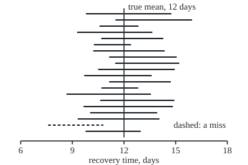
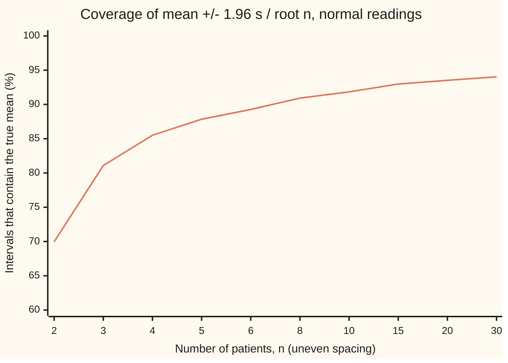

# Confidence intervals: a range that traps the truth 95 times in 100

Probability and statistics → Confidence Intervals and Tests → Ranges for an unknown mean → Confidence intervals

---

## General Overview

A hospital tracks how long patients take to recover after a knee operation. Ten patients from one month recovered in 12, 9, 15, 7, 14, 13, 17, 11, 12 and 14 days. Their average is 12.4 days.

The hospital does not care about these ten. It wants the mean recovery time of every patient who will ever have this operation. That number is fixed but unknown; ten patients only glimpse it. Another ten would give a different average. So the honest report is a range: **12.4 days, plus or minus 2.1**, which runs from about 10.3 to 14.5 days.

The range comes from a recipe. Feed the recipe ten recovery times and it returns an interval. Run it on month after month of fresh patients and the intervals it returns contain the true mean 95 times in 100. That promise belongs to the recipe. Once this month's interval is on the page, it either contains the true mean or it does not; nobody can say which, and no chance is left inside it.

A recipe with such a promise is a **confidence interval**, the term used from here on, and the promised rate, 95 in 100, is its **confidence level**. This card builds two such recipes, the z interval for when the spread of recovery times is known and the t interval for when it must be estimated from the ten patients, and shows where the 95 comes from.

**Measure how far an average misses the truth in units of the average's own wobble; that miss has a known law whatever the truth is, so "the average is within 2.26 wobbles of the truth" flips into "the truth is within 2.26 wobbles of the average", and the flip keeps its 95 percent.**

**What kind of fact this is:** a method. Its promise, that the recipe covers the true mean 95 times in 100 when the readings are independent and normal, is a theorem proved on this card in Why it works, using the t law from [chi-square-t-and-f-distributions](../07-Sampling%20and%20Estimation/03-chi-square-t-and-f-distributions.md).

### The picture: twenty wards, twenty intervals

The code simulates 20,000 fresh groups of ten patients, called wards here, whose true mean recovery time is 12 days, with spread 3 days, and builds the t interval for each ward. The first twenty are drawn below, to scale.

<p align="center"></p>

Each row is one simulated ward's interval. The vertical line is the true mean, 12 days, the same for every ward. The intervals move; the truth does not. Ward 19, the dashed row, returned 7.59 to 10.80 days and missed. Over all 20,000 simulated wards the recipe caught the truth 95.07 percent of the time, give or take 0.15.

---

## The formula

Notation first, in words. Write $n$ for the number of patients and $x_i$ for the i-th recovery time. A bar means an average: $\bar x$ is the average of the ten. The true mean of every possible patient is $\mu$ (mu). The spread of single recovery times, their standard deviation, is $\sigma$ (sigma) when it is known, and $s$ when it is estimated from the sample. A reminder from [normal-quantile](../04-Continuous%20Distributions/05-normal-quantile.md): Φ is the standard bell's area to the left of a point, and $\Phi^{-1}$ undoes it.

The estimated spread divides by $n - 1$, not $n$:

$$s = \sqrt{\frac{1}{n-1}\sum_{i=1}^{n}(x_i - \bar x)^2}$$

In words: square each patient's distance from the average, add, divide by one fewer than the count, take the root. The ten distances always add to zero, so only nine of them are free; that count, n − 1, is the **degrees of freedom**.

The two recipes:

$$\text{z interval: } \bar x \pm z^*\,\frac{\sigma}{\sqrt n}, \qquad z^* = \Phi^{-1}(0.975) = 1.959964$$

$$\text{t interval: } \bar x \pm t^*_{n-1}\,\frac{s}{\sqrt n}, \qquad t^*_{9} = 2.262157$$

**Read it aloud:** take the average, work out how much an average of this many patients typically wobbles, and go out a fixed number of those wobbles on each side, 1.96 of them if the spread is known and 2.26 if it had to be estimated from nine degrees of freedom.

The wobble of an average, $\sigma/\sqrt n$ or its estimate $s/\sqrt n$, is its **standard error**. Here $s$ = 2.9136 days, so it is 2.9136 divided by the square root of 10: 0.9214 days. The half-width, 2.262157 times 0.9214, is 2.0842 days: the "plus or minus 2.1".

The promise itself is about the data before they arrive. Capital letters mark the random versions: $\bar X$ and $S$ are the average and spread of ten patients not yet seen.

$$P\!\left(\bar X - t^*_{n-1}\frac{S}{\sqrt n} \;\le\; \mu \;\le\; \bar X + t^*_{n-1}\frac{S}{\sqrt n}\right) = 0.95 \quad \text{for every } \mu \text{ and every } \sigma$$

**Read it aloud:** before the patients are measured, the chance that the recipe's interval will contain the true mean is 0.95, whatever the true mean and spread turn out to be.

| Symbol | Plain meaning | In our example | Push it up and the answer… |
| --- | --- | --- | --- |
| $x_i$ | the i-th patient's recovery time | 12, 9, 15, … days | moves the centre |
| $n$ | number of patients | 10 | narrows, roughly like 1/√n |
| $\bar x$ | their average, the interval's centre | 12.4 days | shifts the whole interval |
| $\mu$ | true mean recovery time of all patients: fixed, unknown | 12 days in the simulation | nothing: the width ignores it |
| $\sigma$ | known spread of single recovery times | 3 days (a registry figure) | widens the z interval |
| $s$ | spread estimated from the sample | 2.9136 days | widens the t interval |
| $\bar X$, $S$ | average and spread of a sample not yet drawn: random | — | — |
| $z^*$ | the bell's cutoff leaving 0.975 to its left | 1.959964 | a higher level widens it |
| $t^*_{n-1}$ | the t law's cutoff with n − 1 degrees of freedom | 2.262157 | falls toward 1.96 as n grows |
| $E$ | the half-width a study wants, when planning it | 1 day | cuts the patients needed, like 1/E^2 |
| $\Phi$ | standard bell's area left of a point | Φ(1.959964) = 0.975 | rises from 0 to 1 |
| $Z$ | the average's miss in units of $\sigma/\sqrt n$ | — | — |
| $T$ | the average's miss in units of $S/\sqrt n$ | — | — |

### When it holds

- **Independent patients.** Each recovery must carry its own information. Ten patients of one surgeon on one bad week are closer to one reading than to ten: the true wobble of the average is larger than $s/\sqrt n$ says, and the interval is too narrow.
- **Normal recovery times, or many patients.** The exact 95 needs readings from a normal law. Recovery times skew long; if they follow an exponential law with mean 12 days, the t interval on ten patients covers about 90 percent of the time (simulated 0.9042 ± 0.0021), not 95. With many patients the central limit theorem pulls the coverage back toward 95.
- **The right cutoff for the spread in hand.** 1.96 belongs with a known $\sigma$; with an estimated $s$ at ten patients it covers 91.84 percent.
- **Everything fixed in advance.** The number of patients and the level are chosen before looking. Adding patients until the interval looks good, or picking the level afterwards, voids the promise.
- **The target is the mean.** The interval locates the average patient, not the next one. Only 6 of the 10 patients' own recovery times lie inside it.

---

## Why it works

### Step 0: the miss has a law that does not depend on the truth

The truth is unknown, so no statement "the truth is probably here" can be computed directly. What can be computed is how far an average of ten usually lands from whatever the truth is. Measure that miss in units of the average's standard error, and its chances are the same for every possible true mean and spread. A quantity whose law does not involve the unknown is a **pivot**. Every confidence interval on this shelf is a pivot turned inside out.

### Step 1: the average's wobble shrinks like one over root n

Ten independent recovery times with spread σ have a sum whose variance is ten times one reading's variance, since variances of independent readings add ([variance-and-standard-deviation](../02-Random%20Variables/03-variance-and-standard-deviation.md)). Dividing the sum by 10 divides the variance by 100. So the average has variance $\sigma^2/n$ and spread $\sigma/\sqrt n$. With σ = 3 days and ten patients, the z interval's half-width is 1.959964 times 3 over the root of 10: 1.8594 days.

A sum of independent normal readings is itself normal ([sums-and-convolution](../05-Transformations%20and%20Joint%20Laws/04-sums-and-convolution.md)). So the standardised miss

$$Z = \frac{\bar X - \mu}{\sigma/\sqrt n}$$

follows the standard bell exactly, whatever μ is.

### Step 2: flip the event

The standard bell leaves 0.975 of its area left of $z^*$ = 1.959964, and by symmetry the same area right of $-z^*$. So the middle holds 0.95:

$$P(-z^* \le Z \le z^*) = 0.95$$

Now read the inside of the bracket as a statement about μ. "The average is within $z^*$ standard errors of μ" and "μ is within $z^*$ standard errors of the average" are the same event, written twice. Multiply through by $\sigma/\sqrt n$, subtract $\bar X$, and flip the signs:

$$\bar X - z^*\frac{\sigma}{\sqrt n} \;\le\; \mu \;\le\; \bar X + z^*\frac{\sigma}{\sqrt n}$$

Same event, same chance: 0.95. The simulation's z intervals, with σ = 3 known, covered 0.9494 of 20,000 wards, give or take 0.0016.

### Step 3: an estimated spread costs a wider cutoff

A registry figure for σ is a luxury. Usually the only spread available is $s$, computed from the same ten patients. Swapping it in changes the pivot:

$$T = \frac{\bar X - \mu}{S/\sqrt n}$$

$S$ wobbles too. When it happens to come out small, the ratio is inflated, so $T$ lands far out more often than the bell allows. Its law is Student's t with n − 1 degrees of freedom, proved in [chi-square-t-and-f-distributions](../07-Sampling%20and%20Estimation/03-chi-square-t-and-f-distributions.md). That law still does not involve μ or σ, so $T$ is a pivot. Its tails are heavier, so the cutoff leaving 0.975 to its left is 2.262157 at nine degrees of freedom, not 1.959964.

The same flip as Step 2 gives the t interval: 12.4 ± 2.262157 × 0.9214, which is 10.3158 to 14.4842 days.

Keeping 1.96 with the estimated $s$ gives 12.4 ± 1.8058: narrower, and wrong. Its coverage is the t law's area between −1.96 and 1.96, which at nine degrees of freedom is 91.84 percent. The simulation counted 0.9180, give or take 0.0019.

<details>
<summary>Detailed proof: the t interval covers with chance exactly 0.95</summary>

Take independent readings $X_1, \dots, X_n$ from one normal law with mean μ and spread σ > 0, with n at least 2. The chi-square-t-and-f card proves three facts: $\bar X$ is normal with mean μ and spread $\sigma/\sqrt n$; $(n-1)S^2/\sigma^2$ follows the chi-square law with n − 1 degrees of freedom; and the two are independent. From these it proves that $T = (\bar X - \mu)/(S/\sqrt n)$ follows the t law with n − 1 degrees of freedom, a law whose formula contains neither μ nor σ.

$S$ is positive with chance 1, since n ≥ 2 readings from a continuous law are all equal with chance 0. On that event, and because $S/\sqrt n > 0$,

$$-t^* \le T \le t^* \iff -t^*\frac{S}{\sqrt n} \le \bar X - \mu \le t^*\frac{S}{\sqrt n} \iff \bar X - t^*\frac{S}{\sqrt n} \le \mu \le \bar X + t^*\frac{S}{\sqrt n}.$$

The t law is continuous and symmetric about 0, so with $t^*$ its 0.975 point, $P(-t^* \le T \le t^*) = 0.975 - (1 - 0.975) = 0.95$. The two events are equal, so the chance that the interval contains μ is 0.95. Nothing in the argument used the value of μ or σ, so the equality holds at every μ and every σ > 0. The z interval is the same argument with σ known and the bell in place of the t law.

</details>

### Step 4: what the 95 is a chance of

The chance in Step 3 is taken before the patients are measured, over every sample the ward could produce. $\bar X$ and $S$ are random; μ is not. After the ten recovery times are in, the interval 10.3158 to 14.4842 is two fixed numbers, and μ is a fixed number. Either it lies between them or it does not. In the picture, ward 19's interval, 7.59 to 10.80, contains the true 12 with chance 0, not 0.95. Nothing in its numbers flags it.

So a confidence level describes the method's long-run record, and a single interval inherits the method's reputation, not a probability of its own. The simulation is that long run: 20,000 wards, 0.9507 of intervals containing the truth, give or take 0.0015.

### Step 5: what moves the width

The half-width is cutoff times standard error. Three dials move it.

- **The level.** 90 percent uses the cutoff 1.8331 and gives ±1.6889 days; 99 percent uses 3.2498 and gives ±2.9942. More certainty costs width.
- **The number of patients.** With 40 patients and the same $s$, the cutoff drops to 2.0227 and the standard error halves: ±0.9318 days. Four times the patients cuts the width by a bit more than half, the extra coming from the smaller cutoff. Turned round, the z half-width plans a study: for a half-width of $E$ days with σ known, $n = (z^*\sigma/E)^2$, rounded up. For ±1 day with σ = 3 that is (1.959964 × 3 / 1)^2 = 34.57, so 35 patients.
- **The spread.** Double $s$ and the width doubles.

Nothing else enters: not the true mean, and not the size of the patient population the ten came from.

A second road to the same interval runs through tests: the t interval is the set of candidate means that a t test at the 5 percent level would not reject. [hypothesis-tests-and-p-values](03-hypothesis-tests-and-p-values.md) sets up tests and shows the same match for the drug trial's gap; [t-tests-and-comparing-means](05-t-tests-and-comparing-means.md) shows it for the t test. A third road treats μ itself as uncertain, with a prior, and returns a credible interval, which does carry "95 percent chance the mean is in here", at the price of the prior: [credible-intervals-and-decisions](../10-Bayesian%20Inference/05-credible-intervals-and-decisions.md).

---

## Worked numbers, by hand

| Step | Arithmetic | Value |
| --- | --- | --- |
| total of the ten | 12 + 9 + 15 + 7 + 14 + 13 + 17 + 11 + 12 + 14 | 124 days |
| average $\bar x$ | 124 / 10 | 12.4 days |
| squared distances | add up (each time − 12.4)^2 over the ten | 76.4 |
| estimated spread $s$ | root of 76.4 / 9 | 2.9136 days |
| standard error | 2.9136 / root of 10 | 0.9214 days |
| cutoff $t^*_9$ | t law, 0.975 point, 9 degrees of freedom | 2.262157 |
| half-width | 2.262157 × 0.9214 | 2.0842 days |
| **95 percent t interval** | 12.4 ± 2.0842 | **10.3158 to 14.4842 days** |

The ward's patients recover in about 12.4 days on average; a recipe that is right 95 times in 100 puts the true mean between about 10.3 and 14.5 days.

### What breaks if you drop a piece

| Mistake | Comes out at | What went wrong |
| --- | --- | --- |
| 1.96 with the estimated $s$ | ±1.8058 days; covers 91.84 percent, simulated 0.9180 | the estimated spread wobbles; its cutoff is 2.262157 |
| t interval on skewed recovery times | exponential law, mean 12: covers 0.9042 ± 0.0021 (simulated), not 0.95 | ten readings are too few for the bell to take over |
| interval read as a range for patients | only 6 of the 10 patients lie inside | it locates the mean; one patient varies far more |
| 95 percent read as this interval's chance | ward 19's 7.59 to 10.80 holds the truth with chance 0 | the chance belongs to the recipe, before the data |

### The picture: the price of keeping 1.96



The line is the coverage of the recipe that keeps 1.96 but estimates the spread, computed exactly from the t law's area. The promise is 95. At two patients the recipe covers under 70 percent; at thirty it is still short, at 94.03. The t interval, with its own cutoff at each n, covers 95 percent at every n.

---

## Code, from first principles, and it actually runs

The code computes the ten patients' interval and checks it by three roads. Road 1 finds the t cutoff by integrating the t density with Simpson's rule, a weighted sum of heights at evenly spaced points. Road 2 finds it from the closed form of the t area in terms of an angle, with no integration. Both use the same bisection root finder, which halves a bracket until it pins the point where the area reaches 0.975. Road 3 simulates 20,000 wards with a SplitMix64 generator (a short, fixed recipe for random bits, seed 20260928) and Box-Muller normals (two uniform draws turned into two bell-shaped ones), and counts how often each recipe traps the true mean. The bell's area Φ comes from its own Taylor series and is checked by Simpson's rule. Asserts compare the two t roads, the series against the integral, and the simulated coverages against the exact ones within four standard errors.

### Python

```python
# Confidence intervals -- the check behind the card.  Standard library only.
# Ten patients' recovery times, in days.  How far can the true mean be from
# their average?  Road 1: the t cutoff by integrating the t density (Simpson).
# Road 2: the same cutoff from the closed-form t area.  Road 3: 20,000 seeded
# simulated wards, counting how often each recipe traps the true mean.
from math import sqrt, pi, exp, log, cos, sin, atan, ceil
from functools import reduce

DAYS = [12, 9, 15, 7, 14, 13, 17, 11, 12, 14]
SIGMA, MU, R, SEED = 3.0, 12.0, 20000, 20260928

def total(xs): return reduce(lambda a, b: a + b, xs, 0.0)   # plain left-to-right float sum

def Phi(z):                                  # bell area left of z, by its Taylor series
    term, total = z, z
    for k in range(1, 200):
        term *= -z * z / (2 * k)
        total += term / (2 * k + 1)
    return 0.5 + total / sqrt(2 * pi)

def simpson(f, a, b, m=4000):                # integral of f from a to b, m even
    h = (b - a) / m
    s = f(a) + f(b) + total((4 if i % 2 else 2) * f(a + i * h) for i in range(1, m))
    return s * h / 3

def gamma_half(k):                           # Gamma(k/2), from Gamma(1/2) = root pi, Gamma(1) = 1
    g = sqrt(pi) if k % 2 else 1.0
    for j in range(2 - k % 2, k, 2):
        g *= j / 2
    return g

def t_area_simpson(x, v):                    # road 1: integrate the t density
    c = gamma_half(v + 1) / (sqrt(v * pi) * gamma_half(v))
    return 0.5 + simpson(lambda u: c * (1 + u * u / v) ** (-(v + 1) / 2), 0.0, x)

def t_area_closed(x, v):                     # road 2: the closed form in th = atan(x / root v)
    th = atan(x / sqrt(v))
    c2, term, total = cos(th) ** 2, 1.0, 1.0
    if v % 2 == 0:
        for j in range(1, v // 2):
            term *= c2 * (2 * j - 1) / (2 * j)
            total += term
        return 0.5 + sin(th) * total / 2
    for j in range(1, (v - 1) // 2):
        term *= c2 * (2 * j) / (2 * j + 1)
        total += term
    return 0.5 + (th + (sin(th) * cos(th) * total if v > 1 else 0.0)) / pi

def cutoff(area, p):                         # bisection: the x with area(x) = p
    lo, hi = 0.0, 10.0
    for _ in range(100):
        mid = (lo + hi) / 2
        lo, hi = (mid, hi) if area(mid) < p else (lo, mid)
    return (lo + hi) / 2

n = len(DAYS)
xbar = sum(DAYS) / n
ss = total((x - xbar) ** 2 for x in DAYS)
s = sqrt(ss / (n - 1))
se = s / sqrt(n)
ss_int = n * sum(x * x for x in DAYS) - sum(DAYS) ** 2          # one-pass, exact integers
z = cutoff(Phi, 0.975)
phi_simp = 0.5 + simpson(lambda u: exp(-u * u / 2) / sqrt(2 * pi), 0.0, z)
t1 = cutoff(lambda x: t_area_simpson(x, n - 1), 0.975)
t2 = cutoff(lambda x: t_area_closed(x, n - 1), 0.975)
half_t, half_z, half_zs = t2 * se, z * SIGMA / sqrt(n), z * se
inside = sum(xbar - half_t <= x <= xbar + half_t for x in DAYS)
print(f"data: {DAYS}, n {n}, mean {xbar:.4f} days, squares about the mean {ss:.4f}, s {s:.4f}")
print(f"  one-pass check: sum x = {sum(DAYS)}, n*sum(x^2) - (sum x)^2 = {ss_int}; s^2 = {ss_int / (n * (n - 1)):.6f}")
print(f"  standard error s/root n {se:.4f} days")
print(f"z cutoff Phi^(-1)(0.975) {z:.6f}; Simpson area left of it {phi_simp:.10f}")
print(f"t cutoff, 9 degrees of freedom: road 1 (Simpson) {t1:.6f}, road 2 (closed form) {t2:.6f}")
print(f"t interval: {xbar:.2f} +/- {half_t:.4f} = [{xbar - half_t:.4f}, {xbar + half_t:.4f}] days")
print(f"z interval, sigma known {SIGMA:.0f}: {xbar:.2f} +/- {half_z:.4f} = [{xbar - half_z:.4f}, {xbar + half_z:.4f}]")
print(f"mistake, 1.96 with s: {xbar:.2f} +/- {half_zs:.4f}; patients inside the t interval: {inside} of {n}; a new patient's range is root(n + 1) = {sqrt(n + 1):.4f} times as wide")
for lvl in (0.90, 0.99):
    c = cutoff(lambda x: t_area_closed(x, n - 1), (1 + lvl) / 2)
    print(f"level {lvl:.2f}: t cutoff {c:.4f}, half-width {c * se:.4f} days")
c40 = cutoff(lambda x: t_area_closed(x, 39), 0.975)
print(f"40 patients, same s: t cutoff {c40:.4f}, half-width {c40 * s / sqrt(40):.4f} days; sigma {SIGMA:.0f} known, +/-1 day needs (z sigma / 1)^2 = {(z * SIGMA / 1.0) ** 2:.2f}, so {ceil((z * SIGMA / 1.0) ** 2)} patients")
print("coverage of 'mean +/- 1.96 s/root n', exact from the t area, in percent:")
chart = [(k, 100 * (2 * t_area_closed(z, k - 1) - 1)) for k in (2, 3, 4, 5, 6, 8, 10, 15, 20, 30)]
print("  " + ", ".join(f"n={k}: {c:.2f}" for k, c in chart))
exact_zs = 2 * t_area_closed(z, n - 1) - 1
exact_zs_simp = 2 * t_area_simpson(z, n - 1) - 1

MASK, state = (1 << 64) - 1, SEED
def splitmix():                              # SplitMix64, seed 20260928
    global state
    state = (state + 0x9E3779B97F4A7C15) & MASK
    x = state
    x = ((x ^ (x >> 30)) * 0xBF58476D1CE4E5B9) & MASK
    x = ((x ^ (x >> 27)) * 0x94D049BB133111EB) & MASK
    return x ^ (x >> 31)

def unif():                                  # strictly inside (0, 1)
    return ((splitmix() >> 11) + 0.5) / 9007199254740992.0

def normals(k):                              # Box-Muller, k even
    out = []
    for _ in range(k // 2):
        r, a = sqrt(-2 * log(unif())), 2 * pi * unif()
        out += [r * cos(a), r * sin(a)]
    return out

def summary(xs):
    m = total(xs) / len(xs)
    return m, sqrt(total((x - m) ** 2 for x in xs) / (len(xs) - 1)) / sqrt(len(xs))

hit_t = hit_zs = hit_z = 0
figure = []
for r in range(R):
    m, e = summary([MU + SIGMA * g for g in normals(n)])
    hit_t += abs(m - MU) <= t2 * e
    hit_zs += abs(m - MU) <= z * e
    hit_z += abs(m - MU) <= half_z
    if r < 20:
        figure.append((m - t2 * e, m + t2 * e))
hit_exp = 0
for r in range(R):                           # skewed recovery times: exponential, mean 12
    m, e = summary([-MU * log(unif()) for _ in range(n)])
    hit_exp += abs(m - MU) <= t2 * e
cov = [h / R for h in (hit_t, hit_zs, hit_z, hit_exp)]
sem = [sqrt(p * (1 - p) / R) for p in cov]
names = ["t interval", "1.96 with s", "z, sigma known", "t, skewed data"]
print(f"simulation: {R} wards of {n}, true mean {MU:.0f}, sigma {SIGMA:.0f}, seed {SEED}")
for nm, p, e in zip(names, cov, sem):
    print(f"  {nm:15s} covers {p:.4f} +/- {e:.4f}")
print(f"  exact for 1.96 with s: closed form {exact_zs:.4f}, Simpson {exact_zs_simp:.4f}")
misses = sum(not (lo <= MU <= hi) for lo, hi in figure)
for i in range(0, 20, 5):
    print(f"figure, wards {i + 1}-{i + 5}: " + "  ".join(f"{lo:.2f} {hi:.2f}" for lo, hi in figure[i:i + 5]))
print(f"figure, misses among the first 20 wards: {misses}")

assert ss_int == 764 and abs(s * s - 764 / 90) < 1e-12           # two-pass s against exact integers
assert abs(phi_simp - 0.975) < 1e-10                             # series cutoff, integrated area
assert abs(t1 - t2) < 1e-7 and abs(exact_zs - exact_zs_simp) < 1e-9   # two roads to the t area
assert abs(cov[0] - 0.95) < 4 * sem[0] and abs(cov[1] - exact_zs) < 4 * sem[1]
assert 0.95 - cov[3] > 4 * sem[3]                                # skew breaks the promise
print("ALL CHECKS PASS")
```

**Ran 2026-10-06 on macOS, Python 3.14.6, standard library only. All checks passed. Output, pasted from the run:**

```
data: [12, 9, 15, 7, 14, 13, 17, 11, 12, 14], n 10, mean 12.4000 days, squares about the mean 76.4000, s 2.9136
  one-pass check: sum x = 124, n*sum(x^2) - (sum x)^2 = 764; s^2 = 8.488889
  standard error s/root n 0.9214 days
z cutoff Phi^(-1)(0.975) 1.959964; Simpson area left of it 0.9750000000
t cutoff, 9 degrees of freedom: road 1 (Simpson) 2.262157, road 2 (closed form) 2.262157
t interval: 12.40 +/- 2.0842 = [10.3158, 14.4842] days
z interval, sigma known 3: 12.40 +/- 1.8594 = [10.5406, 14.2594]
mistake, 1.96 with s: 12.40 +/- 1.8058; patients inside the t interval: 6 of 10; a new patient's range is root(n + 1) = 3.3166 times as wide
level 0.90: t cutoff 1.8331, half-width 1.6889 days
level 0.99: t cutoff 3.2498, half-width 2.9942 days
40 patients, same s: t cutoff 2.0227, half-width 0.9318 days; sigma 3 known, +/-1 day needs (z sigma / 1)^2 = 34.57, so 35 patients
coverage of 'mean +/- 1.96 s/root n', exact from the t area, in percent:
  n=2: 69.97, n=3: 81.09, n=4: 85.51, n=5: 87.84, n=6: 89.27, n=8: 90.92, n=10: 91.84, n=15: 92.98, n=20: 93.52, n=30: 94.03
simulation: 20000 wards of 10, true mean 12, sigma 3, seed 20260928
  t interval      covers 0.9507 +/- 0.0015
  1.96 with s     covers 0.9180 +/- 0.0019
  z, sigma known  covers 0.9494 +/- 0.0016
  t, skewed data  covers 0.9042 +/- 0.0021
  exact for 1.96 with s: closed form 0.9184, Simpson 0.9184
figure, wards 1-5: 9.79 14.75  11.50 15.95  10.58 12.84  9.28 13.65  10.68 14.28
figure, wards 6-10: 10.25 12.41  10.21 14.36  11.14 15.06  11.49 15.21  10.50 14.95
figure, wards 11-15: 9.69 13.61  11.14 14.72  10.69 12.82  8.66 13.56  10.62 14.93
figure, wards 16-20: 9.65 14.84  10.03 13.93  9.31 14.06  7.59 10.80  9.77 12.97
figure, misses among the first 20 wards: 1
ALL CHECKS PASS
```

### Rust

Same numbers, same labels, built with `rustc --edition 2021 -O`.

```rust
// Confidence intervals -- the same check as the Python, in Rust.  No crates.
// Ten patients' recovery times, in days.  How far can the true mean be from
// their average?  Road 1: the t cutoff by integrating the t density (Simpson).
// Road 2: the same cutoff from the closed-form t area.  Road 3: 20,000 seeded
// simulated wards, counting how often each recipe traps the true mean.
use std::f64::consts::PI;

const DAYS: [i64; 10] = [12, 9, 15, 7, 14, 13, 17, 11, 12, 14];
const SIGMA: f64 = 3.0; const MU: f64 = 12.0;
const R: usize = 20000; const SEED: u64 = 20260928;

fn phi(z: f64) -> f64 {                          // bell area left of z, by its Taylor series
    let (mut term, mut total) = (z, z);
    for k in 1..200 {
        let k = k as f64;
        term *= -z * z / (2.0 * k);
        total += term / (2.0 * k + 1.0);
    }
    0.5 + total / (2.0 * PI).sqrt()
}

fn simpson<F: Fn(f64) -> f64>(f: F, a: f64, b: f64) -> f64 {   // integral of f, 4000 steps
    let m = 4000;
    let h = (b - a) / m as f64;
    let mut acc = 0.0;
    for i in 1..m { acc += (if i % 2 == 1 { 4.0 } else { 2.0 }) * f(a + i as f64 * h) }
    (f(a) + f(b) + acc) * h / 3.0
}

fn gamma_half(k: usize) -> f64 {                 // Gamma(k/2), from Gamma(1/2) = root pi, Gamma(1) = 1
    let mut g = if k % 2 == 1 { PI.sqrt() } else { 1.0 };
    for j in (2 - k % 2..k).step_by(2) { g *= j as f64 / 2.0 }
    g
}

fn t_area_simpson(x: f64, v: usize) -> f64 {     // road 1: integrate the t density
    let vf = v as f64;
    let c = gamma_half(v + 1) / ((vf * PI).sqrt() * gamma_half(v));
    0.5 + simpson(|u| c * (1.0 + u * u / vf).powf(-(vf + 1.0) / 2.0), 0.0, x)
}

fn t_area_closed(x: f64, v: usize) -> f64 {      // road 2: the closed form in th = atan(x / root v)
    let th = (x / (v as f64).sqrt()).atan();
    let (c2, mut term, mut total) = (th.cos().powi(2), 1.0, 1.0);
    if v % 2 == 0 {
        for j in 1..v / 2 {
            term *= c2 * (2 * j - 1) as f64 / (2 * j) as f64;
            total += term;
        }
        return 0.5 + th.sin() * total / 2.0;
    }
    for j in 1..(v - 1) / 2 {
        term *= c2 * (2 * j) as f64 / (2 * j + 1) as f64;
        total += term;
    }
    0.5 + (th + if v > 1 { th.sin() * th.cos() * total } else { 0.0 }) / PI
}

fn cutoff<F: Fn(f64) -> f64>(area: F, p: f64) -> f64 {   // bisection: the x with area(x) = p
    let (mut lo, mut hi) = (0.0, 10.0);
    for _ in 0..100 {
        let mid = (lo + hi) / 2.0;
        if area(mid) < p { lo = mid } else { hi = mid }
    }
    (lo + hi) / 2.0
}

struct Rng(u64);
impl Rng {
    fn splitmix(&mut self) -> u64 {              // SplitMix64, seed 20260928
        self.0 = self.0.wrapping_add(0x9E3779B97F4A7C15);
        let mut x = self.0;
        x = (x ^ (x >> 30)).wrapping_mul(0xBF58476D1CE4E5B9);
        x = (x ^ (x >> 27)).wrapping_mul(0x94D049BB133111EB);
        x ^ (x >> 31)
    }
    fn unif(&mut self) -> f64 {                  // strictly inside (0, 1)
        ((self.splitmix() >> 11) as f64 + 0.5) / 9007199254740992.0
    }
    fn normals(&mut self, k: usize) -> Vec<f64> {   // Box-Muller, k even
        let mut out = Vec::new();
        for _ in 0..k / 2 {
            let r = (-2.0 * self.unif().ln()).sqrt();
            let a = 2.0 * PI * self.unif();
            out.push(r * a.cos());
            out.push(r * a.sin());
        }
        out
    }
}

fn summary(xs: &[f64]) -> (f64, f64) {
    let n = xs.len() as f64;
    let m = xs.iter().fold(0.0, |a, x| a + x) / n;
    (m, (xs.iter().fold(0.0, |a, x| a + (x - m).powi(2)) / (n - 1.0)).sqrt() / n.sqrt())
}

fn main() {
    let n = DAYS.len();
    let nf = n as f64;
    let xbar = DAYS.iter().sum::<i64>() as f64 / nf;
    let ss = DAYS.iter().fold(0.0, |a, &x| a + (x as f64 - xbar).powi(2));
    let s = (ss / (nf - 1.0)).sqrt();
    let se = s / nf.sqrt();
    let ss_int = n as i64 * DAYS.iter().map(|x| x * x).sum::<i64>() - DAYS.iter().sum::<i64>().pow(2);
    let z = cutoff(phi, 0.975);
    let phi_simp = 0.5 + simpson(|u| (-u * u / 2.0).exp() / (2.0 * PI).sqrt(), 0.0, z);
    let t1 = cutoff(|x| t_area_simpson(x, n - 1), 0.975);
    let t2 = cutoff(|x| t_area_closed(x, n - 1), 0.975);
    let (half_t, half_z, half_zs) = (t2 * se, z * SIGMA / nf.sqrt(), z * se);
    let inside = DAYS.iter().filter(|&&x| xbar - half_t <= x as f64 && x as f64 <= xbar + half_t).count();
    println!("data: {:?}, n {}, mean {:.4} days, squares about the mean {:.4}, s {:.4}", DAYS, n, xbar, ss, s);
    println!("  one-pass check: sum x = {}, n*sum(x^2) - (sum x)^2 = {}; s^2 = {:.6}", DAYS.iter().sum::<i64>(), ss_int, ss_int as f64 / (n * (n - 1)) as f64);
    println!("  standard error s/root n {:.4} days", se);
    println!("z cutoff Phi^(-1)(0.975) {:.6}; Simpson area left of it {:.10}", z, phi_simp);
    println!("t cutoff, 9 degrees of freedom: road 1 (Simpson) {:.6}, road 2 (closed form) {:.6}", t1, t2);
    println!("t interval: {:.2} +/- {:.4} = [{:.4}, {:.4}] days", xbar, half_t, xbar - half_t, xbar + half_t);
    println!("z interval, sigma known {:.0}: {:.2} +/- {:.4} = [{:.4}, {:.4}]", SIGMA, xbar, half_z, xbar - half_z, xbar + half_z);
    println!("mistake, 1.96 with s: {:.2} +/- {:.4}; patients inside the t interval: {} of {}; a new patient's range is root(n + 1) = {:.4} times as wide", xbar, half_zs, inside, n, (nf + 1.0).sqrt());
    for lvl in [0.90, 0.99] {
        let c = cutoff(|x| t_area_closed(x, n - 1), (1.0 + lvl) / 2.0);
        println!("level {:.2}: t cutoff {:.4}, half-width {:.4} days", lvl, c, c * se);
    }
    let c40 = cutoff(|x| t_area_closed(x, 39), 0.975);
    println!("40 patients, same s: t cutoff {:.4}, half-width {:.4} days; sigma {:.0} known, +/-1 day needs (z sigma / 1)^2 = {:.2}, so {:.0} patients", c40, c40 * s / 40f64.sqrt(), SIGMA, (z * SIGMA / 1.0).powi(2), (z * SIGMA / 1.0).powi(2).ceil());
    println!("coverage of 'mean +/- 1.96 s/root n', exact from the t area, in percent:");
    let chart: Vec<String> = [2, 3, 4, 5, 6, 8, 10, 15, 20, 30].iter()
        .map(|&k| format!("n={}: {:.2}", k, 100.0 * (2.0 * t_area_closed(z, k - 1) - 1.0))).collect();
    println!("  {}", chart.join(", "));
    let exact_zs = 2.0 * t_area_closed(z, n - 1) - 1.0;
    let exact_zs_simp = 2.0 * t_area_simpson(z, n - 1) - 1.0;

    let mut rng = Rng(SEED);
    let (mut hit_t, mut hit_zs, mut hit_z, mut hit_exp) = (0usize, 0usize, 0usize, 0usize);
    let mut figure: Vec<(f64, f64)> = Vec::new();
    for r in 0..R {
        let xs: Vec<f64> = rng.normals(n).iter().map(|g| MU + SIGMA * g).collect();
        let (m, e) = summary(&xs);
        if (m - MU).abs() <= t2 * e { hit_t += 1 }
        if (m - MU).abs() <= z * e { hit_zs += 1 }
        if (m - MU).abs() <= half_z { hit_z += 1 }
        if r < 20 { figure.push((m - t2 * e, m + t2 * e)) }
    }
    for _ in 0..R {                              // skewed recovery times: exponential, mean 12
        let xs: Vec<f64> = (0..n).map(|_| -MU * rng.unif().ln()).collect();
        let (m, e) = summary(&xs);
        if (m - MU).abs() <= t2 * e { hit_exp += 1 }
    }
    let cov: Vec<f64> = [hit_t, hit_zs, hit_z, hit_exp].iter().map(|&h| h as f64 / R as f64).collect();
    let sem: Vec<f64> = cov.iter().map(|p| (p * (1.0 - p) / R as f64).sqrt()).collect();
    let names = ["t interval", "1.96 with s", "z, sigma known", "t, skewed data"];
    println!("simulation: {} wards of {}, true mean {:.0}, sigma {:.0}, seed {}", R, n, MU, SIGMA, SEED);
    for i in 0..4 {
        println!("  {:15} covers {:.4} +/- {:.4}", names[i], cov[i], sem[i]);
    }
    println!("  exact for 1.96 with s: closed form {:.4}, Simpson {:.4}", exact_zs, exact_zs_simp);
    let misses = figure.iter().filter(|&&(lo, hi)| !(lo <= MU && MU <= hi)).count();
    for i in (0..20).step_by(5) {
        let row: Vec<String> = figure[i..i + 5].iter().map(|(lo, hi)| format!("{:.2} {:.2}", lo, hi)).collect();
        println!("figure, wards {}-{}: {}", i + 1, i + 5, row.join("  "));
    }
    println!("figure, misses among the first 20 wards: {}", misses);

    assert!(ss_int == 764 && (s * s - 764.0 / 90.0).abs() < 1e-12);   // two-pass s against exact integers
    assert!((phi_simp - 0.975).abs() < 1e-10);                         // series cutoff, integrated area
    assert!((t1 - t2).abs() < 1e-7 && (exact_zs - exact_zs_simp).abs() < 1e-9);
    assert!((cov[0] - 0.95).abs() < 4.0 * sem[0] && (cov[1] - exact_zs).abs() < 4.0 * sem[1]);
    assert!(0.95 - cov[3] > 4.0 * sem[3]);                             // skew breaks the promise
    println!("ALL CHECKS PASS");
}
```

**Ran 2026-10-06 on macOS, rustc 1.98.1, no crates. All checks passed. Output, pasted from the run:**

```
data: [12, 9, 15, 7, 14, 13, 17, 11, 12, 14], n 10, mean 12.4000 days, squares about the mean 76.4000, s 2.9136
  one-pass check: sum x = 124, n*sum(x^2) - (sum x)^2 = 764; s^2 = 8.488889
  standard error s/root n 0.9214 days
z cutoff Phi^(-1)(0.975) 1.959964; Simpson area left of it 0.9750000000
t cutoff, 9 degrees of freedom: road 1 (Simpson) 2.262157, road 2 (closed form) 2.262157
t interval: 12.40 +/- 2.0842 = [10.3158, 14.4842] days
z interval, sigma known 3: 12.40 +/- 1.8594 = [10.5406, 14.2594]
mistake, 1.96 with s: 12.40 +/- 1.8058; patients inside the t interval: 6 of 10; a new patient's range is root(n + 1) = 3.3166 times as wide
level 0.90: t cutoff 1.8331, half-width 1.6889 days
level 0.99: t cutoff 3.2498, half-width 2.9942 days
40 patients, same s: t cutoff 2.0227, half-width 0.9318 days; sigma 3 known, +/-1 day needs (z sigma / 1)^2 = 34.57, so 35 patients
coverage of 'mean +/- 1.96 s/root n', exact from the t area, in percent:
  n=2: 69.97, n=3: 81.09, n=4: 85.51, n=5: 87.84, n=6: 89.27, n=8: 90.92, n=10: 91.84, n=15: 92.98, n=20: 93.52, n=30: 94.03
simulation: 20000 wards of 10, true mean 12, sigma 3, seed 20260928
  t interval      covers 0.9507 +/- 0.0015
  1.96 with s     covers 0.9180 +/- 0.0019
  z, sigma known  covers 0.9494 +/- 0.0016
  t, skewed data  covers 0.9042 +/- 0.0021
  exact for 1.96 with s: closed form 0.9184, Simpson 0.9184
figure, wards 1-5: 9.79 14.75  11.50 15.95  10.58 12.84  9.28 13.65  10.68 14.28
figure, wards 6-10: 10.25 12.41  10.21 14.36  11.14 15.06  11.49 15.21  10.50 14.95
figure, wards 11-15: 9.69 13.61  11.14 14.72  10.69 12.82  8.66 13.56  10.62 14.93
figure, wards 16-20: 9.65 14.84  10.03 13.93  9.31 14.06  7.59 10.80  9.77 12.97
figure, misses among the first 20 wards: 1
ALL CHECKS PASS
```

The two outputs match line for line, simulation included: both languages draw the same random bits from the same generator.

> [!TIP]
> **Try changing**
> Guess first, then run it.
> - **Move the truth.** Set `MU` to 50 and `SIGMA` to 10 on the constants line. Do the simulated coverages change? They do not move in any printed digit: the miss measured in standard errors has the same law for every mean and spread, which is what a pivot is.
> - **Ask for 99 percent.** In the line defining `t2`, change 0.975 to 0.995. The interval widens to ±2.9942 days, the t coverage in the simulation moves to about 99 in 100, and the assert comparing the two t roads stops the run, since road 1 still seeks 0.975.
> - **One long stay.** Change the 17 in `DAYS` to 27. The average moves up a little, but $s$ grows sharply and the interval widens far more than it shifts; the first assert, pinned to the original data, stops the run.

---

## The usual mistake

> [!warning]
> **"There is a 95 percent chance the true mean is between 10.3 and 14.5 days."** The true mean is a fixed number, and after the data are in, so is the interval. The 95 is the recipe's hit rate over repeated samples, counted before the data arrive; this interval either contains the truth or does not. In the picture, ward 19's interval looks as ordinary as the rest and holds the truth with chance 0. A statement with a genuine "95 percent chance" needs a prior on the mean: [credible-intervals-and-decisions](../10-Bayesian%20Inference/05-credible-intervals-and-decisions.md).
>
> - **1.96 with an estimated spread.** At ten patients the half-width shrinks from 2.0842 to 1.8058 days and the coverage falls to 91.84 percent. Use the t cutoff unless σ really is known.
> - **Reading the interval as where patients fall.** Only 6 of the 10 patients' own recovery times lie inside 10.3158 to 14.4842. A range for one new patient must add that patient's own spread; at ten patients it is √11, about 3.3, times wider.
> - **Trusting the 95 on skewed data at small n.** Exponential recovery times at ten patients give about 90 percent coverage. Skew needs more patients, or a method built for it.
> - **Comparing two intervals by overlap.** Two groups' intervals can overlap while the difference between the groups is still clear at the 95 percent level; the difference has its own interval: [t-tests-and-comparing-means](05-t-tests-and-comparing-means.md).

---

## Where you meet it in real life

- **Clinical reports.** A trial's result for a mean, such as a drop in blood pressure or days in hospital, is quoted with its 95 percent interval; the t interval is the default for a small sample of measurements.
- **Polls and proportions.** A poll's "margin of error" is the same idea for a yes-or-no answer, with its own recipes: [intervals-for-proportions](02-intervals-for-proportions.md).
- **Planning a study.** Choosing how many patients to enrol so the interval comes out narrow enough is the rule in Step 5 of Why it works: 35 patients for ±1 day when σ = 3. Sizing a trial so its test also catches a real effect is [power-and-sample-size](04-power-and-sample-size.md).
- **Manufacturing and measurement.** A laboratory reports a batch's mean strength or a gauge's mean reading with an interval; NIST's engineering handbook uses exactly the t recipe.
- **Simulation.** Every simulated estimate on this card carries a standard error; turning it into an interval is the same recipe with a bell cutoff.
- **Many intervals at once.** Twenty intervals at 95 percent miss about once between them, as the picture shows; reporting many at a time needs a correction: [multiple-testing](08-multiple-testing.md).

> **Say it back**
> A confidence interval is a recipe that turns a sample into a range, and its level is how often the recipe's ranges contain the truth over repeated samples. It works because the average's miss, measured in standard errors, has a law that does not depend on the truth, so a statement about the miss flips into a statement about the truth. With a known spread the cutoff is 1.96; with a spread estimated from ten patients it is 2.262157, the t law's cutoff, giving 12.4 ± 2.1 days. The 95 belongs to the recipe; any one interval simply contains the truth or does not. The promise needs independent readings, a near-normal law or many readings, and choices made in advance.

---

## What this builds on

- [chi-square-t-and-f-distributions](../07-Sampling%20and%20Estimation/03-chi-square-t-and-f-distributions.md): the t law of the average's miss when the spread is estimated, and its heavier tails.
- [normal-quantile](../04-Continuous%20Distributions/05-normal-quantile.md): the cutoff $\Phi^{-1}(0.975)$ = 1.959964.
- [central-limit-theorem](../06-Limit%20Theorems%20in%20Practice/02-central-limit-theorem.md): why the recipe survives non-normal readings once there are many.

## Where this goes next

- [intervals-for-proportions](02-intervals-for-proportions.md): intervals for a rate, where the spread depends on the answer.
- [hypothesis-tests-and-p-values](03-hypothesis-tests-and-p-values.md): the same pivot read as a test of one candidate mean.
- [regression-inference](../09-Regression/02-regression-inference.md): t intervals for the slope of a fitted line.
- [credible-intervals-and-decisions](../10-Bayesian%20Inference/05-credible-intervals-and-decisions.md): an interval that does carry a probability for the mean, bought with a prior.

---

## Sources

Verified 2026-09-28: every link below resolves to the publisher's page or the paper's DOI.

- Student. "The Probable Error of a Mean." *Biometrika* 6(1), 1908. [DOI](https://doi.org/10.2307/2331554). The t law for an average whose spread is estimated from small samples.
- Neyman, Jerzy. "Outline of a Theory of Statistical Estimation Based on the Classical Theory of Probability." *Philosophical Transactions of the Royal Society A* 236, 1937. [DOI](https://doi.org/10.1098/rsta.1937.0005). Defines confidence intervals and their coverage as a property of the method.
- NIST/SEMATECH. *e-Handbook of Statistical Methods*, section 1.3.5.2, "Confidence Limits for the Mean." [Handbook page](https://www.itl.nist.gov/div898/handbook/eda/section3/eda352.htm). The t interval as used in engineering, with its interpretation.
- Casella, George, and Roger L. Berger. *Statistical Inference*, 2nd ed. Routledge. [Publisher page](https://www.routledge.com/Statistical-Inference/Casella-Berger/p/book/9781032593036). Chapter 9: pivots, inverting tests, and coverage.
- Wasserman, Larry. *All of Statistics*. Springer, 2004. [Publisher page](https://link.springer.com/book/10.1007/978-0-387-21736-9). Short treatment of confidence intervals and the misreadings they invite.
