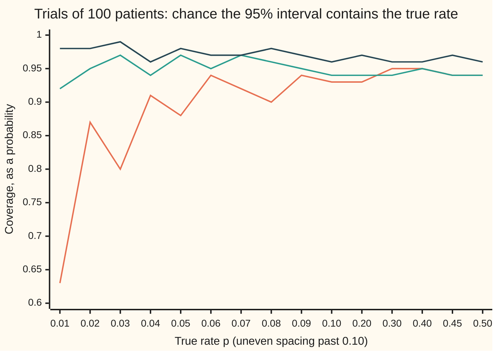
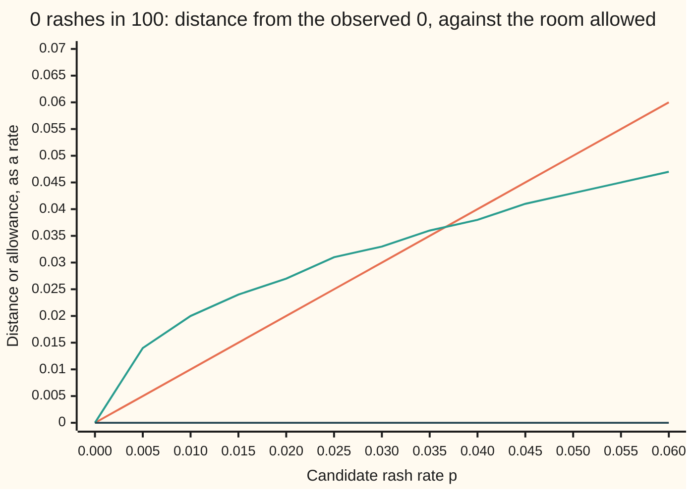

# Intervals for a proportion: the Wald interval and the better Wilson one

Probability and statistics → Confidence Intervals and Tests → Margins on a percentage → Intervals for a proportion

---

## General Overview

A drug trial gives a new treatment to 100 patients, and 45 recover. The headline writes itself: 45 percent recovered, plus or minus 10. The 45 is the count divided by the number treated. The plus or minus 10 is the part that needs a reason.

The reason is the one [confidence-intervals](01-confidence-intervals.md) gives. Run the same trial again on 100 new patients and the count would not be 45 again. A **confidence interval** is a recipe that turns any count into a range, built so that the recipe catches the true recovery rate in 95 of every 100 trials it is used on. The 95 describes the recipe, not this one range.

For a percentage there are three recipes in common use. The **Wald interval** is the textbook one: the observed rate plus or minus 1.96 of its estimated spreads. Here it gives 35.2% to 54.8%, which is where "plus or minus 10" comes from. The **Wilson interval** keeps the spread honest by using the spread each candidate rate would really have; here it gives 35.6% to 54.8%. The **exact interval**, also called Clopper–Pearson after its authors, uses no bell curve at all; here it gives 35.0% to 55.3%.

At 45 out of 100 all three agree to within a point. Now count something rare in the same trial: a rash, seen in 0 of the 100 patients. Wald says 0% plus or minus 0, a range that rules out every positive rate after one small trial. Wilson says 0% to 3.7%, exact says 0% to 3.6%. The Wald recipe breaks near 0 percent and near 100 percent, and the chart below shows how badly.

**Every interval for a proportion keeps the candidate rates that would make the observed count unsurprising; Wald judges surprise with the spread measured at the observed rate, Wilson with the spread at each candidate, and the exact interval with the binomial chances themselves.**

**What kind of fact this is:** a method, three recipes derived on this card in Why it works; the exact interval's promise of at least 95% is a theorem, proved there; Wald's and Wilson's 95% are approximations, and their true catch rates are computed exactly by the checks.

### The picture: how often each recipe catches the true rate



Each point is exact, not simulated, and plotted to two decimals: for a true rate p, the checks add up the binomial chance of every count from 0 to 100 whose interval contains p. Orange line: Wald. Teal: Wilson. Dark: exact. All three promise 0.95. At p = 0.01 the Wald interval contains the truth in only 0.6334 of trials; the exact interval never drops below 0.95; Wilson wobbles around 0.95 but dips well below it for very rare events. The picture for rates near 1 is the mirror image: at p = 0.98 the three read 0.8664, 0.9492 and 0.9845, the same as at 0.02.

---

## The formula

Notation first, with one-line reminders. $K$ is the count of recoveries, a random variable, and $K \sim \text{Binomial}(n, p)$ is read "K follows the binomial law with n trials and chance p". A hat marks an estimate: $\hat p = k/n$ is the observed rate. $\Phi$ is the standard bell curve's area to the left of a point. The number $z$ is the point with $\Phi(z) = 0.975$, so that 95% of the bell lies within $z$ of the centre: $z = 1.959964$. The letter $\alpha$ (alpha) is the error allowed, 1 minus the confidence level: $\alpha = 0.05$ for a 95% interval.

The Wald interval:

$$\hat p \;\pm\; z\sqrt{\frac{\hat p(1-\hat p)}{n}}$$

**Read it aloud:** the observed rate, plus or minus z times the spread that rate would have.

The Wilson interval:

$$W_{\pm} \;=\; \frac{\hat p + \dfrac{z^2}{2n} \;\pm\; z\sqrt{\dfrac{\hat p(1-\hat p)}{n} + \dfrac{z^2}{4n^2}}}{1 + \dfrac{z^2}{n}}$$

**Read it aloud:** a centre pulled a little towards one half, plus or minus a margin that stays positive even when nothing, or everything, was observed.

The exact interval runs from $L$ to $U$, where

$$A_k(L) = \frac{\alpha}{2}, \qquad B_k(U) = \frac{\alpha}{2}, \qquad A_k(p) = P_p(K \ge k), \quad B_k(p) = P_p(K \le k)$$

$P_p$ is a chance worked out as if the true rate were $p$.

**Read it aloud:** the lowest rate at which a count this high still has a 2.5% chance, up to the highest rate at which a count this low still has a 2.5% chance. At $k = 0$ the lower end is 0; at $k = n$ the upper end is 1.

| Symbol | Plain meaning | In our example | Push it up and the answer… |
| --- | --- | --- | --- |
| $n$ | patients treated, fixed before the trial | 100 | every interval narrows, roughly as one over the square root of n |
| $K$, $k$ | the count of recoveries: the random variable, and the value seen | 45 | the interval slides right |
| $p$ | the true recovery rate, fixed and unknown | unknown | — |
| $\hat p$ | the observed rate, $k/n$ ("p hat") | 0.45 | the interval slides right |
| $\alpha$ | the error allowed, 1 minus the confidence level | 0.05 | intervals narrow and miss more often |
| $z$ | the bell's point with $\Phi(z) = 1 - \alpha/2$ | 1.959964 | intervals widen |
| $\Phi$ | the standard bell curve's area to the left of a point | $\Phi(z) = 0.975$ | — |
| $W_{-}$, $W_{+}$ | the Wilson interval's lower and upper ends | 0.356145, 0.547554 | — |
| $L$, $U$ | the exact interval's lower and upper ends | 0.350320, 0.552720 | — |
| $P_p$ | a chance worked out at true rate p | $P_{0.45}(K = 45)$ | — |
| $A_k$ | the chance, at rate p, of k or more recoveries | 0.025 at $p = L$ | rises as p rises |
| $B_k$ | the chance, at rate p, of k or fewer recoveries | 0.025 at $p = U$ | falls as p rises |
| $C(n, j)$, $j$ | ways to choose which j of n patients recover | $C(100, 45)$ | — |
| $b_j$ | in the proofs: the chance, at rate p, of exactly j recoveries, $C(n,j)p^j(1-p)^{n-j}$ | $b_{45}(0.45) = P_{0.45}(K = 45)$ | — |
| $r$, $s$ | in the proofs: the smallest count whose exact interval lies wholly above p, and the largest whose interval lies wholly below it | — | — |
| $t$ | in the area form of $A_k$: a rate running from 0 up to p as the area is added up | — | — |

### When it holds

- **A number of patients fixed in advance.** Deciding to stop the trial once the rate looks good changes the chances of every count, and none of the three intervals allows for it.
- **Independent patients with one common chance.** If patients came in pairs who always share an outcome, the trial holds only 50 independent results. The Wilson interval, computed as if there were 100, then catches p = 0.45 in only 0.8455 of trials.
- **Wald: many of both outcomes.** It leans on the bell curve and on the observed spread. With 45 recoveries and 55 non-recoveries it works; with a handful or none of either outcome it fails, as the chart shows.
- **Wilson: a bell curve that fits.** It still uses the bell, so its 95% is approximate. On the grid p = 0.001, 0.002, …, 0.999 its lowest catch rate is 0.9048; between grid points it falls to 0.8385, at p = 0.00176.
- **Exact: nothing beyond the first two bullets.** Its catch rate is at least 95% for every p. The price is width: at p = 0.45 it catches 0.9657, more than asked, so its ranges are a little wider than they needed to be.

---

## Why it works

### Step 0: an interval is the set of rates the count does not rule out

Take a candidate rate, say 30%. If the true rate were 30%, would 45 recoveries out of 100 be surprising? Yes: far out in the tail. So 30% is ruled out. A candidate of 40% would not be surprised by 45. Keep every candidate the count does not rule out; what is left is the interval.

If each test rules out a true rate only 5% of the time, then the kept set misses the truth only 5% of the time, whatever the truth is. That is where the 95% comes from. The three recipes differ only in how they measure "surprising".

### Step 1: Wald measures surprise with the spread at the observed rate

The observed rate $\hat p$ has average $p$ and spread $\sqrt{p(1-p)/n}$, the standard deviation of a count divided by n ([normal-approximation-to-binomial](../06-Limit%20Theorems%20in%20Practice/03-normal-approximation-to-binomial.md)). With 100 patients it is close to a bell curve. So in about 95% of trials, $\hat p$ lands within $z$ spreads of $p$:

$$\lvert \hat p - p\rvert \le z\sqrt{\frac{p(1-p)}{n}}.$$

The spread involves the unknown $p$. Wald replaces it by $\hat p$: the spread becomes $\sqrt{0.45 \times 0.55/100} = 0.049749$, a fixed number, and the inequality solves at once to $\hat p \pm z \times 0.049749 = 0.45 \pm 0.097507$.

That replacement is the flaw. When the count is 0, the estimated spread is $\sqrt{0 \times 1/100} = 0$, and the interval shrinks to a single point.

### Step 2: Wilson keeps the true spread and solves for p

Wilson keeps $p$ inside the spread. For each candidate $p$, the allowance $z\sqrt{p(1-p)/n}$ is the room that candidate's own spread gives. Keep $p$ when the distance from $\hat p$ fits inside it.



Orange line: the distance from the observed rate 0 to the candidate, which is the candidate itself. Teal curve: Wilson's allowance, $z\sqrt{p(1-p)/100}$. Dark line along the floor: Wald's allowance, zero for every candidate. Wilson keeps every candidate where orange is under teal, from 0 up to where they cross, just past 0.035: the upper end is 0.036993. Wald keeps only the point 0.

Squaring the inequality and multiplying by $n$ gives a quadratic in $p$:

$$(n + z^2)\,p^2 - (2n\hat p + z^2)\,p + n\hat p^2 \le 0.$$

A quadratic with a positive first coefficient is at or below zero exactly between its two roots. The quadratic formula gives those roots, and they are $W_{-}$ and $W_{+}$ in The formula. For the trial: centre 0.451850, half-width 0.095704, interval 0.356145 to 0.547554.

<details>
<summary>Detailed proof: the Wilson roots, and why they stay inside 0 to 1</summary>

Both sides of $\lvert \hat p - p\rvert \le z\sqrt{p(1-p)/n}$ are at least zero, so squaring loses nothing: $n(\hat p - p)^2 \le z^2 p(1-p)$. Expanding, $n\hat p^2 - 2n\hat p\,p + np^2 \le z^2 p - z^2 p^2$, which rearranges to the quadratic above.

Its roots are
$$p = \frac{(2n\hat p + z^2) \pm \sqrt{(2n\hat p + z^2)^2 - 4(n + z^2)\,n\hat p^2}}{2(n + z^2)}.$$
Inside the root, $(2n\hat p + z^2)^2 - 4(n+z^2)n\hat p^2 = 4n\hat p z^2 + z^4 - 4nz^2\hat p^2 = z^2\big(4n\hat p(1-\hat p) + z^2\big)$. Divide top and bottom by $2n$: the centre is $(\hat p + z^2/(2n))/(1 + z^2/n)$ and the half-width is $z\sqrt{\hat p(1-\hat p)/n + z^2/(4n^2)}/(1 + z^2/n)$, as stated.

The quadratic at $p = 0$ equals $n\hat p^2 \ge 0$; at $p = 1$ it equals $n(1-\hat p)^2 \ge 0$; at $p = \hat p$ it equals $-z^2\hat p(1-\hat p) \le 0$. So both roots lie in 0 to 1, one on each side of $\hat p$. At $k = 0$ the roots are 0 and $z^2/(n + z^2)$, the 0.036993 of the chart.

</details>

### Step 3: the exact interval uses the binomial chances themselves

Drop the bell. For a candidate $p$, the exact chance of 45 or more recoveries is $A_{45}(p) = \sum_{j=45}^{100} C(100, j)\,p^j(1-p)^{100-j}$, a sum of binomial chances. Rule $p$ out on the low side if that chance is below 0.025: the count would be too high for such a small rate. Rule it out on the high side if $B_{45}(p)$, the chance of 45 or fewer, is below 0.025.

With k = 45, $A_k$ rises steadily from 0 to 1 as $p$ rises, and $B_k$ falls steadily from 1 to 0, so each crosses 0.025 exactly once. The crossings are $L = 0.350320$ and $U = 0.552720$. For 0 rashes, $B_0(p) = (1-p)^{100}$, and $(1-U)^{100} = 0.025$ solves by hand: $U = 1 - 0.025^{1/100} = 0.036217$.

### Step 4: why the exact interval keeps its promise

Fix the true rate $p$. The interval misses on the low side, with $L > p$, only when the count is so high that $A_K(p) < 0.025$. Those counts are the top few, and together they have chance below 0.025, since $A_k$ at the smallest of them, for this $p$, is exactly that total. Misses on the high side likewise have chance below 0.025. So all misses together have chance below 0.05, for every $p$: coverage at least 95%, with no approximation anywhere.

<details>
<summary>Detailed proof: the tails move one way, and the misses add to less than alpha</summary>

Write $b_j(p) = C(n,j)p^j(1-p)^{n-j}$. Differentiating, and using $j\,C(n,j) = n\,C(n-1,j-1)$ and $(n-j)\,C(n,j) = n\,C(n-1,j)$,
$$b_j'(p) = n\big(C(n-1,j-1)p^{j-1}(1-p)^{n-j} - C(n-1,j)p^{j}(1-p)^{n-j-1}\big).$$
Summed from $j = k$ to $n$, neighbouring terms cancel and one survives: $A_k'(p) = n\,C(n-1,k-1)\,p^{k-1}(1-p)^{n-k} > 0$ for $0 < p < 1$ and $k \ge 1$. So $A_k$ rises strictly from 0 to 1, and $B_k = 1 - A_{k+1}$ falls strictly from 1 to 0. Each crosses $\alpha/2$ once, which defines $L$ and $U$, and $p \ge L$ exactly when $A_k(p) \ge \alpha/2$, and $p \le U$ exactly when $B_k(p) \ge \alpha/2$.

Now fix $p$. For a fixed rate, $A_k(p)$ falls as $k$ rises, so the counts with $A_k(p) < \alpha/2$ are all counts from some smallest one, r, upward. The chance of landing there is $A_r(p)$, which is below $\alpha/2$. Likewise the counts with $B_k(p) < \alpha/2$ are all counts up to some largest one, s, with total chance $B_s(p) < \alpha/2$. The interval misses $p$ only on one of these two sets of counts, so it misses with chance below $\alpha$. If a set is empty its chance is 0. At $p = 0$ the count is always 0 and $L(0) = 0$; at $p = 1$ it is always $n$ and $U(n) = 1$: coverage 1 at both ends.

The same sum has a second form, used by the checks as an independent road: $A_k(p) = k\,C(n,k)\int_0^p t^{k-1}(1-t)^{n-k}\,dt$. Both sides are 0 at $p = 0$, and their derivatives agree by the display above.

</details>

### Step 5: why Wald fails near 0 and 1

Suppose the true rash rate is 2%. A trial of 100 then often sees no rash at all, and every such trial returns Wald's zero-width interval at 0, which misses 0.02. A trial with one rash gives −0.009501 to 0.029501, which does contain 0.02, so nearly all of Wald's misses at this rate are the trials with no rash. The estimated spread is smallest exactly when the count happens to be low, so the low counts are the ones given too little room. Add up the chances and Wald catches 0.02 in 0.8664 of trials. Near 100% the same happens in reverse: at a true rate of 0.98, Wald again catches 0.8664. Wilson's allowance depends on the candidate, not on the count, so it does not shrink when the count is small.

The coverage lines jump up and down because counts are whole numbers: as p moves, whole counts enter or leave the set that covers it. The Wilson interval is also what an inverted score test gives. A score test judges a candidate rate with the spread at that candidate: it rejects $p$ when $\lvert \hat p - p\rvert > z\sqrt{p(1-p)/n}$, which is Step 2's keep rule turned round. Step 0 is that link between tests and intervals in words; [hypothesis-tests-and-p-values](03-hypothesis-tests-and-p-values.md) builds tests and shows the same match for the trial's gap.

<details>
<summary>A fourth recipe: add two and two</summary>

Agresti and Coull noticed that adding two recoveries and two non-recoveries, then running Wald on the padded count, behaves almost like Wilson. At 95%, $z^2 = 3.8415$, close to 4, so Wilson's centre $(k + z^2/2)/(n + z^2)$ is close to $(k + 2)/(n + 4)$. The Try changing box below runs it.

</details>

---

## Worked numbers, by hand

45 recoveries in 100 patients, 95% intervals.

| Step | Arithmetic | Value |
| --- | --- | --- |
| observed rate $\hat p$ | 45 / 100 | 0.450000 |
| $\hat p(1 - \hat p)/n$ | 0.45 × 0.55 / 100 | 0.002475 |
| estimated spread | √0.002475 | 0.049749 |
| $z$ | bisection on $\Phi(z) = 0.975$ | 1.959964 |
| Wald margin | 1.959964 × 0.049749 | 0.097507 |
| **Wald interval** | 0.45 ± 0.097507 | **0.352493 to 0.547507** |
| $z^2/n$ | 3.8415 / 100 | 0.038415 |
| Wilson centre | (0.45 + 0.038415/2) / 1.038415 | 0.451850 |
| Wilson half-width | 1.959964 × √(0.002475 + 0.038415/400) / 1.038415 | 0.095704 |
| **Wilson interval** | 0.451850 ± 0.095704 | **0.356145 to 0.547554** |
| **exact interval** | $A_{45}(L) = 0.025$, $B_{45}(U) = 0.025$, by bisection | **0.350320 to 0.552720** |

Read back in the trial: the recovery rate on the drug is 45%, with a 95% interval of about 35% to 55% by any of the three recipes. That is the headline's "plus or minus 10".

The house example has a placebo arm too: 35 of 100 recovered. Wald gives 0.256516 to 0.443484, Wilson 0.263642 to 0.447456, exact 0.257294 to 0.451849. The drug's and placebo's intervals overlap, which on its own does not settle whether the drug works; comparing two rates is a test of its own, on [hypothesis-tests-and-p-values](03-hypothesis-tests-and-p-values.md), and again as a table of counts on [chi-square-tests](06-chi-square-tests.md).

### What breaks if you drop a piece

| Mistake | Comes out at | What went wrong |
| --- | --- | --- |
| Wald on the rash, 0 of 100 | 0 to 0 | The spread is estimated at the observed 0 and vanishes. Wilson gives 0 to 0.036993, exact 0 to 0.036217 |
| Wald when the true rate is 0.02 | catches it in 0.8664 of trials, not 0.95 | Low counts get too little room |
| Wald on 1 rash in 100 | −0.009501 to 0.029501 | A negative rash rate: the bell curve overhangs 0 |
| Patients in pairs sharing an outcome, Wilson at p = 0.45 | catches it in 0.8455 of trials | Only 50 independent results; the spread for 100 is too small |

The code prints all four.

---

## Code, from first principles, and it actually runs

The scripts build everything themselves: the bell's area by its Taylor series, $z$ by bisection (halving an interval that holds the answer until it is tiny), the binomial chances by the ratio rule from one count to the next. Each interval end is reached by two roads. Wilson: the quadratic formula, and bisection on the kept-or-not test itself. Exact: bisection on summed binomial tails, and bisection on the same tail written as an area and integrated by Simpson's rule, with the closed form $1 - 0.025^{1/100}$ as a third road at 0 rashes. Coverage is computed by enumeration over all 101 counts, and again by simulating 20,000 trials of 100 patients from a SplitMix64 generator with seed 20260928, printed with its standard error.

### Python

```python
# Intervals for a proportion: 45 of 100 recovered.  Wald, Wilson and exact intervals,
# each end by two roads; coverage enumerated and simulated (SplitMix64, seed 20260928).
from math import sqrt, log, exp, pi
M64, N, ALPHA = 2**64 - 1, 100, 0.05

def Phi(z):                               # bell area left of z, Taylor series
    term, total, j = z, z, 0
    while abs(term) > 1e-17 * max(1.0, abs(total)):
        j += 1
        term *= -z * z * (2 * j - 1) / (2 * j * (2 * j + 1))
        total += term
    return 0.5 + total / sqrt(2.0 * pi)

def bisect(f, a, b, steps=200):           # a root of f between a and b
    fa = f(a)
    for _ in range(steps):
        m = 0.5 * (a + b)
        if (f(m) > 0) == (fa > 0): a, fa = m, f(m)
        else: b = m
    return 0.5 * (a + b)

Z = bisect(lambda z: Phi(z) - (1 - ALPHA / 2), 0.0, 5.0)
def pmf(n, p):                            # binomial chances by the ratio rule
    law, q = [1.0], 1.0 - p
    for _ in range(n): law[0] *= q
    for k in range(n): law.append(law[k] * (n - k) / (k + 1) * p / q)
    return law

def wald(k, n):                           # the estimate plus or minus z spreads
    h = Z * sqrt(k / n * (1 - k / n) / n)
    return k / n - h, k / n + h

def wilson(k, n):                         # road one: the quadratic's two roots
    ph, s = k / n, Z * Z / n
    c = (ph + s / 2) / (1 + s)
    h = Z * sqrt(ph * (1 - ph) / n + s / (4 * n)) / (1 + s)
    return c - h, c + h

def wilson_bisect(k, n):                  # road two: where distance = z spreads
    ph = k / n
    g = lambda p: n * (ph - p) ** 2 - Z * Z * p * (1 - p)
    lo = 0.0 if k == 0 else bisect(g, 0.0, ph)
    return lo, bisect(g, ph, 1.0)

def exact_tails(k, n):                    # road one: sum the binomial tails
    up = lambda p: sum(pmf(n, p)[k:]) - ALPHA / 2
    dn = lambda p: sum(pmf(n, p)[:k + 1]) - ALPHA / 2
    return (0.0 if k == 0 else bisect(up, 1e-12, 1 - 1e-12),
            1.0 if k == n else bisect(dn, 1e-12, 1 - 1e-12))

def upper_area(k, n, p, m=2000):          # P(K >= k) as an area, Simpson's rule
    lc = sum(log((n - i) / (i + 1)) for i in range(k)) + log(k)
    f = lambda t: exp(lc + (k - 1) * log(t) + (n - k) * log(1 - t)) if t > 0 else 0.0
    h = p / m
    return h / 3 * (f(0) + f(p) + sum((4 if i % 2 else 2) * f(i * h) for i in range(1, m)))
def exact_area(k, n):                     # road two: the same ends by integration
    return (bisect(lambda p: upper_area(k, n, p) - ALPHA / 2, 1e-9, 1 - 1e-9, 60),
            bisect(lambda p: 1 - upper_area(k + 1, n, p) - ALPHA / 2, 1e-9, 1 - 1e-9, 60))

EXACT = [exact_tails(k, N) for k in range(N + 1)]
def exact(k, n): return EXACT[k]

def coverage(method, p, n=N):             # enumerate all 101 counts
    return sum(w for k, w in enumerate(pmf(n, p)) if method(k, n)[0] <= p <= method(k, n)[1])

def pair(label, iv): print(f"{label:<34}{iv[0]:>10.6f}{iv[1]:>10.6f}")
def row(label, v, d=6): print(f"{label:<34}{v:>10.{d}f}")

row("z, the 0.975 point of the bell", Z)
row("  Phi(z), series", Phi(Z))
row("p-hat, 45 of 100", 45 / N)
row("  p-hat (1 - p-hat) / n", 0.45 * 0.55 / N)
row("  estimated spread", sqrt(0.45 * 0.55 / N))
row("  Wald margin, z x spread", Z * sqrt(0.45 * 0.55 / N))
row(f"  z^2 / n, z^2 = {Z * Z:.4f}", Z * Z / N)
w45, wb45, e45, a45 = wilson(45, N), wilson_bisect(45, N), exact_tails(45, N), exact_area(45, N)
row("  Wilson centre", (w45[0] + w45[1]) / 2)
row("  Wilson half-width", (w45[1] - w45[0]) / 2)
pair("Wald 45/100", wald(45, N))
pair("Wilson 45/100, formula", w45)
pair("Wilson 45/100, bisection", wb45)
pair("exact 45/100, tail sums", e45)
pair("exact 45/100, Simpson area", a45)
pair("placebo 35/100, Wald", wald(35, N))
pair("placebo 35/100, Wilson", wilson(35, N))
pair("placebo 35/100, exact", EXACT[35])
pair("rash 0/100, Wald", wald(0, N))
pair("rash 0/100, Wilson, formula", wilson(0, N))
pair("rash 0/100, Wilson, bisection", wilson_bisect(0, N))
pair("rash 0/100, exact, tail sums", EXACT[0])
row("rash 0/100, 1 - 0.025^(1/100)", 1 - exp(log(ALPHA / 2) / N))
pair("rash 1/100, Wald", wald(1, N))
print("coverage, n = 100:   p     Wald  Wilson   exact")
GRID = [0.01, 0.02, 0.03, 0.04, 0.05, 0.06, 0.07, 0.08, 0.09, 0.10, 0.20, 0.30, 0.40, 0.45, 0.50]
METHODS = (wald, wilson, exact)
cov = [[coverage(m, p) for m in METHODS] for p in GRID]
for p, c in zip(GRID, cov): print(f"{'':<16}{p:>9.2f}{c[0]:>9.4f}{c[1]:>8.4f}{c[2]:>8.4f}")
for i, name in enumerate(("Wald", "Wilson", "exact")): print(f"chart, {name:<11}" + " ".join(f"{c[i]:.2f}" for c in cov))
mirror = [coverage(m, 0.98) for m in METHODS]
print(f"{'mirror, p = 0.98':<25}{mirror[0]:>9.4f}{mirror[1]:>8.4f}{mirror[2]:>8.4f}")
fine = [i / 1000 for i in range(1, 1000)]
lows = [min((coverage(m, p), p) for p in fine) for m in METHODS]
for name, (c, p) in zip(("Wald", "Wilson", "exact"), lows):
    print(f"lowest coverage, {name:<17}{c:>10.4f} at p = {p:.3f}")
low_w = min((coverage(wilson, i / 100000), i / 100000) for i in range(1, 1000))
print(f"{'lowest coverage, Wilson, p < 0.01':<34}{low_w[0]:>10.4f} at p = {low_w[1]:.5f}")
state = 20260928                          # SplitMix64, the same stream as the Rust
def next64():
    global state
    state = (state + 0x9E3779B97F4A7C15) & M64
    x = state
    x = ((x ^ (x >> 30)) * 0xBF58476D1CE4E5B9) & M64
    x = ((x ^ (x >> 27)) * 0x94D049BB133111EB) & M64
    return x ^ (x >> 31)
RUNS, P0, hits = 20000, 0.02, [0, 0, 0]
for _ in range(RUNS):                     # one run = one trial of 100 patients
    k = sum((next64() >> 11) / 2**53 < P0 for _ in range(N))
    for i, m in enumerate(METHODS):
        lo, hi = m(k, N)
        hits[i] += lo <= P0 <= hi
sims = [h / RUNS for h in hits]
for name, s, c in zip(("Wald", "Wilson", "exact"), sims, cov[1]):
    se = sqrt(s * (1 - s) / RUNS)
    print(f"simulated, p = 0.02, {name:<7}{s:>10.4f}  se {se:.4f}  (sim - enumerated)/se {(s - c) / se:>5.2f}")
paired = sum(w for j, w in enumerate(pmf(50, 0.45)) if wilson(2 * j, N)[0] <= 0.45 <= wilson(2 * j, N)[1])
row("patients in identical pairs, Wilson", paired, 4)
PS = [0.005 * i for i in range(13)]       # the score picture for 0 of 100
print("chart, p          " + " ".join(f"{p:.3f}" for p in PS))
print("chart, Wilson     " + " ".join(f"{Z * sqrt(p * (1 - p) / N):.3f}" for p in PS))

assert abs(Z - 1.95996398) < 1e-7                                            # printed tables
assert max(abs(x - y) for x, y in zip(w45 + wilson(0, N), wb45 + wilson_bisect(0, N))) < 1e-9
assert max(abs(x - y) for x, y in zip(e45, a45)) < 1e-6                      # sums vs area
assert abs(EXACT[0][1] - (1 - (ALPHA / 2) ** (1 / N))) < 1e-9                # closed form
assert lows[2][0] >= 1 - ALPHA and lows[0][0] < 0.7                          # guarantee, failure
assert max(abs(a - b) for a, b in zip(mirror, cov[1])) < 1e-9                 # p and 1 - p
assert all(abs(s - c) < 4 * sqrt(c * (1 - c) / RUNS) for s, c in zip(sims, cov[1]))
assert low_w[0] < 1 - ALPHA                                                   # Wilson is approximate
assert abs(wald(45, N)[1] - bisect(lambda p: N * (0.45 - p) ** 2 - Z * Z * 0.45 * 0.55, 0.45, 1.0)) < 1e-9
print("ALL CHECKS PASS")
```

**Ran 2026-09-28 on macOS, Python 3.14.6, standard library only. All checks passed. Output, pasted from the run:**

```
z, the 0.975 point of the bell      1.959964
  Phi(z), series                    0.975000
p-hat, 45 of 100                    0.450000
  p-hat (1 - p-hat) / n             0.002475
  estimated spread                  0.049749
  Wald margin, z x spread           0.097507
  z^2 / n, z^2 = 3.8415             0.038415
  Wilson centre                     0.451850
  Wilson half-width                 0.095704
Wald 45/100                         0.352493  0.547507
Wilson 45/100, formula              0.356145  0.547554
Wilson 45/100, bisection            0.356145  0.547554
exact 45/100, tail sums             0.350320  0.552720
exact 45/100, Simpson area          0.350320  0.552720
placebo 35/100, Wald                0.256516  0.443484
placebo 35/100, Wilson              0.263642  0.447456
placebo 35/100, exact               0.257294  0.451849
rash 0/100, Wald                    0.000000  0.000000
rash 0/100, Wilson, formula         0.000000  0.036993
rash 0/100, Wilson, bisection       0.000000  0.036993
rash 0/100, exact, tail sums        0.000000  0.036217
rash 0/100, 1 - 0.025^(1/100)       0.036217
rash 1/100, Wald                   -0.009501  0.029501
coverage, n = 100:   p     Wald  Wilson   exact
                     0.01   0.6334  0.9206  0.9816
                     0.02   0.8664  0.9492  0.9845
                     0.03   0.8022  0.9688  0.9894
                     0.04   0.9060  0.9356  0.9641
                     0.05   0.8775  0.9659  0.9826
                     0.06   0.9365  0.9472  0.9681
                     0.07   0.9157  0.9716  0.9716
                     0.08   0.8964  0.9605  0.9754
                     0.09   0.9448  0.9486  0.9658
                     0.10   0.9324  0.9364  0.9557
                     0.20   0.9331  0.9405  0.9674
                     0.30   0.9502  0.9372  0.9625
                     0.40   0.9481  0.9481  0.9585
                     0.45   0.9444  0.9444  0.9657
                     0.50   0.9431  0.9431  0.9648
chart, Wald       0.63 0.87 0.80 0.91 0.88 0.94 0.92 0.90 0.94 0.93 0.93 0.95 0.95 0.94 0.94
chart, Wilson     0.92 0.95 0.97 0.94 0.97 0.95 0.97 0.96 0.95 0.94 0.94 0.94 0.95 0.94 0.94
chart, exact      0.98 0.98 0.99 0.96 0.98 0.97 0.97 0.98 0.97 0.96 0.97 0.96 0.96 0.97 0.96
mirror, p = 0.98            0.8664  0.9492  0.9845
lowest coverage, Wald                 0.0952 at p = 0.001
lowest coverage, Wilson               0.9048 at p = 0.001
lowest coverage, exact                0.9504 at p = 0.379
lowest coverage, Wilson, p < 0.01     0.8385 at p = 0.00176
simulated, p = 0.02, Wald       0.8637  se 0.0024  (sim - enumerated)/se -1.15
simulated, p = 0.02, Wilson     0.9482  se 0.0016  (sim - enumerated)/se -0.65
simulated, p = 0.02, exact      0.9839  se 0.0009  (sim - enumerated)/se -0.69
patients in identical pairs, Wilson    0.8455
chart, p          0.000 0.005 0.010 0.015 0.020 0.025 0.030 0.035 0.040 0.045 0.050 0.055 0.060
chart, Wilson     0.000 0.014 0.020 0.024 0.027 0.031 0.033 0.036 0.038 0.041 0.043 0.045 0.047
ALL CHECKS PASS
```

The line 'lowest coverage, Wilson, p < 0.01' searches a finer grid, p = 0.00001 to 0.00999; there Wilson's catch rate falls to 0.8385. The simulation at a true rate of 0.02 lands within 1.15 standard errors of the enumerated coverage for all three recipes, and it puts Wald's 0.8637 far more than a few standard errors below the promised 0.95.

### Rust

Same numbers, same labels, built with `rustc --edition 2021 -O`.

```rust
// Intervals for a proportion: 45 of 100 recovered.  Wald, Wilson and exact intervals,
// each end by two roads; coverage enumerated and simulated (SplitMix64, seed 20260928).
use std::f64::consts::PI;
const N: usize = 100; const ALPHA: f64 = 0.05;
type Iv = (f64, f64);

fn phi_area(z: f64) -> f64 {                     // bell area left of z, Taylor series
    let (mut term, mut total, mut j) = (z, z, 0.0_f64);
    while term.abs() > 1e-17 * total.abs().max(1.0) {
        j += 1.0;
        term *= -z * z * (2.0 * j - 1.0) / (2.0 * j * (2.0 * j + 1.0));
        total += term;
    }
    0.5 + total / (2.0 * PI).sqrt()
}

fn bisect(f: &dyn Fn(f64) -> f64, mut a: f64, mut b: f64, steps: usize) -> f64 {
    let mut fa = f(a);                           // a root of f between a and b
    for _ in 0..steps {
        let m = 0.5 * (a + b);
        if (f(m) > 0.0) == (fa > 0.0) { a = m; fa = f(m); } else { b = m; }
    }
    0.5 * (a + b)
}

fn pmf(n: usize, p: f64) -> Vec<f64> {           // binomial chances by the ratio rule
    let q = 1.0 - p;
    let mut law = vec![1.0];
    for _ in 0..n { law[0] *= q; }
    for k in 0..n { let last = law[k]; law.push(last * (n - k) as f64 / (k + 1) as f64 * p / q); }
    law
}

fn wald(z: f64, k: usize, n: usize) -> Iv {      // the estimate plus or minus z spreads
    let ph = k as f64 / n as f64;
    let h = z * (ph * (1.0 - ph) / n as f64).sqrt();
    (ph - h, ph + h)
}

fn wilson(z: f64, k: usize, n: usize) -> Iv {    // road one: the quadratic's two roots
    let (ph, nf) = (k as f64 / n as f64, n as f64);
    let s = z * z / nf;
    let c = (ph + s / 2.0) / (1.0 + s);
    let h = z * (ph * (1.0 - ph) / nf + s / (4.0 * nf)).sqrt() / (1.0 + s);
    (c - h, c + h)
}

fn wilson_bisect(z: f64, k: usize, n: usize) -> Iv { // road two: where distance = z spreads
    let (ph, nf) = (k as f64 / n as f64, n as f64);
    let g = |p: f64| nf * (ph - p).powi(2) - z * z * p * (1.0 - p);
    let lo = if k == 0 { 0.0 } else { bisect(&g, 0.0, ph, 200) };
    (lo, bisect(&g, ph, 1.0, 200))
}

fn exact_tails(k: usize, n: usize) -> Iv {       // road one: sum the binomial tails
    let up = |p: f64| pmf(n, p)[k..].iter().sum::<f64>() - ALPHA / 2.0;
    let dn = |p: f64| pmf(n, p)[..k + 1].iter().sum::<f64>() - ALPHA / 2.0;
    (if k == 0 { 0.0 } else { bisect(&up, 1e-12, 1.0 - 1e-12, 200) },
     if k == n { 1.0 } else { bisect(&dn, 1e-12, 1.0 - 1e-12, 200) })
}

fn upper_area(k: usize, n: usize, p: f64) -> f64 { // P(K >= k) as an area, Simpson's rule
    let m = 2000;
    let lc = (0..k).map(|i| ((n - i) as f64 / (i + 1) as f64).ln()).sum::<f64>() + (k as f64).ln();
    let f = |t: f64| if t > 0.0 { (lc + (k as f64 - 1.0) * t.ln() + (n - k) as f64 * (1.0 - t).ln()).exp() } else { 0.0 };
    let h = p / m as f64;
    let inner: f64 = (1..m).map(|i| if i % 2 == 1 { 4.0 } else { 2.0 } * f(i as f64 * h)).sum();
    h / 3.0 * (f(0.0) + f(p) + inner)
}
fn exact_area(k: usize, n: usize) -> Iv {        // road two: the same ends by integration
    (bisect(&|p| upper_area(k, n, p) - ALPHA / 2.0, 1e-9, 1.0 - 1e-9, 60),
     bisect(&|p| 1.0 - upper_area(k + 1, n, p) - ALPHA / 2.0, 1e-9, 1.0 - 1e-9, 60))
}

fn coverage(m: &dyn Fn(usize) -> Iv, p: f64) -> f64 { // enumerate all 101 counts
    pmf(N, p).iter().enumerate().filter(|(k, _)| { let iv = m(*k); iv.0 <= p && p <= iv.1 }).map(|(_, w)| w).sum()
}
fn next64(state: &mut u64) -> u64 {              // SplitMix64, the same stream as the Python
    *state = state.wrapping_add(0x9E3779B97F4A7C15);
    let mut x = *state;
    x = (x ^ (x >> 30)).wrapping_mul(0xBF58476D1CE4E5B9);
    x = (x ^ (x >> 27)).wrapping_mul(0x94D049BB133111EB);
    x ^ (x >> 31)
}
fn pair(label: &str, iv: Iv) { println!("{:<34}{:>10.6}{:>10.6}", label, iv.0, iv.1); }
fn row(label: &str, v: f64, d: usize) { println!("{:<34}{:>10.*}", label, d, v); }
fn main() {
    let z = bisect(&|x| phi_area(x) - (1.0 - ALPHA / 2.0), 0.0, 5.0, 200);
    let exact: Vec<Iv> = (0..=N).map(|k| exact_tails(k, N)).collect();
    let nf = N as f64;
    row("z, the 0.975 point of the bell", z, 6);
    row("  Phi(z), series", phi_area(z), 6);
    row("p-hat, 45 of 100", 45.0 / nf, 6);
    row("  p-hat (1 - p-hat) / n", 0.45 * 0.55 / nf, 6);
    row("  estimated spread", (0.45 * 0.55 / nf).sqrt(), 6);
    row("  Wald margin, z x spread", z * (0.45 * 0.55 / nf).sqrt(), 6);
    row(&format!("  z^2 / n, z^2 = {:.4}", z * z), z * z / nf, 6);
    let (w45, wb45, e45, a45) = (wilson(z, 45, N), wilson_bisect(z, 45, N), exact_tails(45, N), exact_area(45, N));
    row("  Wilson centre", (w45.0 + w45.1) / 2.0, 6);
    row("  Wilson half-width", (w45.1 - w45.0) / 2.0, 6);
    pair("Wald 45/100", wald(z, 45, N));
    pair("Wilson 45/100, formula", w45);
    pair("Wilson 45/100, bisection", wb45);
    pair("exact 45/100, tail sums", e45);
    pair("exact 45/100, Simpson area", a45);
    pair("placebo 35/100, Wald", wald(z, 35, N));
    pair("placebo 35/100, Wilson", wilson(z, 35, N));
    pair("placebo 35/100, exact", exact[35]);
    pair("rash 0/100, Wald", wald(z, 0, N));
    pair("rash 0/100, Wilson, formula", wilson(z, 0, N));
    pair("rash 0/100, Wilson, bisection", wilson_bisect(z, 0, N));
    pair("rash 0/100, exact, tail sums", exact[0]);
    row("rash 0/100, 1 - 0.025^(1/100)", 1.0 - ((ALPHA / 2.0).ln() / nf).exp(), 6);
    pair("rash 1/100, Wald", wald(z, 1, N));
    println!("coverage, n = 100:   p     Wald  Wilson   exact");
    let grid = [0.01, 0.02, 0.03, 0.04, 0.05, 0.06, 0.07, 0.08, 0.09, 0.10, 0.20, 0.30, 0.40, 0.45, 0.50];
    let methods: [Box<dyn Fn(usize) -> Iv>; 3] =
        [Box::new(|k| wald(z, k, N)), Box::new(|k| wilson(z, k, N)), Box::new(|k| exact[k])];
    let names = ["Wald", "Wilson", "exact"];
    let cov: Vec<Vec<f64>> = grid.iter().map(|&p| methods.iter().map(|m| coverage(m.as_ref(), p)).collect()).collect();
    for (p, c) in grid.iter().zip(&cov) { println!("{:<16}{:>9.2}{:>9.4}{:>8.4}{:>8.4}", "", p, c[0], c[1], c[2]); }
    for i in 0..3 { println!("chart, {:<11}{}", names[i], cov.iter().map(|c| format!("{:.2}", c[i])).collect::<Vec<_>>().join(" ")); }
    let mirror: Vec<f64> = methods.iter().map(|m| coverage(m.as_ref(), 0.98)).collect();
    println!("{:<25}{:>9.4}{:>8.4}{:>8.4}", "mirror, p = 0.98", mirror[0], mirror[1], mirror[2]);
    let mut lows = Vec::new();
    for (m, name) in methods.iter().zip(names) {
        let mut best = (f64::INFINITY, 0.0);
        for i in 1..1000 {
            let p = i as f64 / 1000.0;
            let c = coverage(m.as_ref(), p);
            if c < best.0 { best = (c, p); }
        }
        println!("lowest coverage, {:<17}{:>10.4} at p = {:.3}", name, best.0, best.1);
        lows.push(best.0);
    }
    let low_w = (1..1000).map(|i| (coverage(methods[1].as_ref(), i as f64 / 1e5), i as f64 / 1e5))
        .fold((f64::INFINITY, 0.0), |b, c| if c.0 < b.0 { c } else { b });
    println!("{:<34}{:>10.4} at p = {:.5}", "lowest coverage, Wilson, p < 0.01", low_w.0, low_w.1);
    let (runs, p0, mut state) = (20000, 0.02, 20260928_u64);
    let mut hits = [0usize; 3];
    for _ in 0..runs {                           // one run = one trial of 100 patients
        let k = (0..N).filter(|_| ((next64(&mut state) >> 11) as f64 / 9007199254740992.0) < p0).count();
        for (i, m) in methods.iter().enumerate() {
            let iv = m(k);
            if iv.0 <= p0 && p0 <= iv.1 { hits[i] += 1; }
        }
    }
    let sims: Vec<f64> = hits.iter().map(|&h| h as f64 / runs as f64).collect();
    for i in 0..3 {
        let se = (sims[i] * (1.0 - sims[i]) / runs as f64).sqrt();
        println!("simulated, p = 0.02, {:<7}{:>10.4}  se {:.4}  (sim - enumerated)/se {:>5.2}", names[i], sims[i], se, (sims[i] - cov[1][i]) / se);
    }
    let paired: f64 = pmf(50, 0.45).iter().enumerate()
        .filter(|(j, _)| { let iv = wilson(z, 2 * j, N); iv.0 <= 0.45 && 0.45 <= iv.1 }).map(|(_, w)| w).sum();
    row("patients in identical pairs, Wilson", paired, 4);
    let ps: Vec<f64> = (0..13).map(|i| 0.005 * i as f64).collect();   // the score picture for 0 of 100
    println!("chart, p          {}", ps.iter().map(|p| format!("{:.3}", p)).collect::<Vec<_>>().join(" "));
    println!("chart, Wilson     {}", ps.iter().map(|p| format!("{:.3}", z * (p * (1.0 - p) / nf).sqrt())).collect::<Vec<_>>().join(" "));
    let (wz, wbz) = (wilson(z, 0, N), wilson_bisect(z, 0, N));
    assert!((z - 1.95996398).abs() < 1e-7);                                   // printed tables
    assert!([w45.0 - wb45.0, w45.1 - wb45.1, wz.0 - wbz.0, wz.1 - wbz.1].iter().all(|d| d.abs() < 1e-9));
    assert!((e45.0 - a45.0).abs().max((e45.1 - a45.1).abs()) < 1e-6);          // sums vs area
    assert!((exact[0].1 - (1.0 - (ALPHA / 2.0).powf(1.0 / nf))).abs() < 1e-9); // closed form
    assert!(lows[2] >= 1.0 - ALPHA && lows[0] < 0.7);                          // guarantee, failure
    assert!((0..3).all(|i| (mirror[i] - cov[1][i]).abs() < 1e-9));            // p and 1 - p
    assert!((0..3).all(|i| (sims[i] - cov[1][i]).abs() < 4.0 * (cov[1][i] * (1.0 - cov[1][i]) / runs as f64).sqrt()));
    assert!(low_w.0 < 1.0 - ALPHA);                                            // Wilson is approximate
    assert!((wald(z, 45, N).1 - bisect(&|p| nf * (0.45 - p).powi(2) - z * z * 0.45 * 0.55, 0.45, 1.0, 200)).abs() < 1e-9);
    println!("ALL CHECKS PASS");
}
```

**Ran 2026-09-28 on macOS, rustc 1.98.1, no crates. All checks passed. Output, pasted from the run:**

```
z, the 0.975 point of the bell      1.959964
  Phi(z), series                    0.975000
p-hat, 45 of 100                    0.450000
  p-hat (1 - p-hat) / n             0.002475
  estimated spread                  0.049749
  Wald margin, z x spread           0.097507
  z^2 / n, z^2 = 3.8415             0.038415
  Wilson centre                     0.451850
  Wilson half-width                 0.095704
Wald 45/100                         0.352493  0.547507
Wilson 45/100, formula              0.356145  0.547554
Wilson 45/100, bisection            0.356145  0.547554
exact 45/100, tail sums             0.350320  0.552720
exact 45/100, Simpson area          0.350320  0.552720
placebo 35/100, Wald                0.256516  0.443484
placebo 35/100, Wilson              0.263642  0.447456
placebo 35/100, exact               0.257294  0.451849
rash 0/100, Wald                    0.000000  0.000000
rash 0/100, Wilson, formula         0.000000  0.036993
rash 0/100, Wilson, bisection       0.000000  0.036993
rash 0/100, exact, tail sums        0.000000  0.036217
rash 0/100, 1 - 0.025^(1/100)       0.036217
rash 1/100, Wald                   -0.009501  0.029501
coverage, n = 100:   p     Wald  Wilson   exact
                     0.01   0.6334  0.9206  0.9816
                     0.02   0.8664  0.9492  0.9845
                     0.03   0.8022  0.9688  0.9894
                     0.04   0.9060  0.9356  0.9641
                     0.05   0.8775  0.9659  0.9826
                     0.06   0.9365  0.9472  0.9681
                     0.07   0.9157  0.9716  0.9716
                     0.08   0.8964  0.9605  0.9754
                     0.09   0.9448  0.9486  0.9658
                     0.10   0.9324  0.9364  0.9557
                     0.20   0.9331  0.9405  0.9674
                     0.30   0.9502  0.9372  0.9625
                     0.40   0.9481  0.9481  0.9585
                     0.45   0.9444  0.9444  0.9657
                     0.50   0.9431  0.9431  0.9648
chart, Wald       0.63 0.87 0.80 0.91 0.88 0.94 0.92 0.90 0.94 0.93 0.93 0.95 0.95 0.94 0.94
chart, Wilson     0.92 0.95 0.97 0.94 0.97 0.95 0.97 0.96 0.95 0.94 0.94 0.94 0.95 0.94 0.94
chart, exact      0.98 0.98 0.99 0.96 0.98 0.97 0.97 0.98 0.97 0.96 0.97 0.96 0.96 0.97 0.96
mirror, p = 0.98            0.8664  0.9492  0.9845
lowest coverage, Wald                 0.0952 at p = 0.001
lowest coverage, Wilson               0.9048 at p = 0.001
lowest coverage, exact                0.9504 at p = 0.379
lowest coverage, Wilson, p < 0.01     0.8385 at p = 0.00176
simulated, p = 0.02, Wald       0.8637  se 0.0024  (sim - enumerated)/se -1.15
simulated, p = 0.02, Wilson     0.9482  se 0.0016  (sim - enumerated)/se -0.65
simulated, p = 0.02, exact      0.9839  se 0.0009  (sim - enumerated)/se -0.69
patients in identical pairs, Wilson    0.8455
chart, p          0.000 0.005 0.010 0.015 0.020 0.025 0.030 0.035 0.040 0.045 0.050 0.055 0.060
chart, Wilson     0.000 0.014 0.020 0.024 0.027 0.031 0.033 0.036 0.038 0.041 0.043 0.045 0.047
ALL CHECKS PASS
```

The two outputs match line for line.

> [!TIP]
> **Try changing**
> Guess first, then run it. The asserts are pinned to the 95% trial, so some changes stop the program.
> - **Ask for 90%.** Set `ALPHA` to `0.10`. The run prints z = 1.644854 and a Wald interval of 0.368170 to 0.531830, then the first assert stops it, since z is pinned to the 95% table value.
> - **Add two and two.** In `wald`, use `(k + 2) / (n + 4)` for the rate and `n + 4` under the root. Wald's catch rate at p = 0.02 jumps to 0.9845, its lowest on the grid rises from 0.0952 to 0.9394, and the assert expecting Wald to fail below 0.7 stops it.
> - **Groups of four.** In the paired line, use `pmf(25, 0.45)` and `4 * j`: patients who share an outcome in fours. Wilson's catch rate falls from 0.8455 to 0.6833. No assert stops it.

---

## The usual mistake

> [!warning]
> **Reading a 95% interval as a 95% chance that the true rate is inside it.** The true recovery rate is a fixed number; 0.350320 to 0.552720 either contains it or does not. The 95% is the recipe's record over many trials: used on trial after trial, it catches the truth at least 95 times in 100. A statement about where this one rate probably lies needs a prior, the subject of [credible-intervals-and-decisions](../10-Bayesian%20Inference/05-credible-intervals-and-decisions.md).
>
> - **Zero events means zero risk.** 0 rashes in 100 is compatible with a rate up to 0.036217. Wald's 0 to 0 hides that.
> - **Clipping Wald at 0.** Cutting −0.009501 up to 0 removes the impossible part but does not fix the catch rate, which is still 0.8664 at p = 0.02.
> - **Calling the exact interval exactly 95%.** It is at least 95%: 0.9657 at p = 0.45. Counts come in whole steps, so it cannot hit 95% on the nose.
> - **Counting patients who are not independent.** Pairs sharing an outcome drop Wilson's catch rate to 0.8455.

---

## Where you meet it in real life

- **Clinical trials.** Recovery rates, response rates and, above all, side-effect rates. For rare events the exact or Wilson interval is standard; 0 to 0 would hide the risk.
- **Opinion polls.** The quoted margin of error on a poll is usually Wald's margin, often worked out at 50%. With a large sample and a rate near the middle, the approximation is sound.
- **A/B tests on websites.** Conversion rates are proportions, often small, and 2% is exactly where Wald fails; [randomised-experiments-and-ab-tests](../13-Survival%2C%20Design%20and%20Causality/04-randomised-experiments-and-ab-tests.md) compares two of them.
- **Quality control.** A batch inspection that finds no defects reports an upper bound, the exact interval's $U$.
- **Planning a trial.** How many patients buy a narrower margin is [power-and-sample-size](04-power-and-sample-size.md).

> **Say it back**
> An interval for a proportion keeps every candidate rate that the observed count does not rule out. Wald judges each candidate with the spread at the observed rate, which vanishes at 0 or 100 percent, so it fails there: 0 rashes in 100 gives 0 to 0. Wilson judges each candidate with its own spread and solves a quadratic, giving 0 to 3.7%. The exact interval uses the binomial tail chances, keeps its 95% promise at every rate, and gives 0 to 3.6%. At 45 recoveries out of 100 all three say about 35% to 55%.

---

## What this builds on

- [confidence-intervals](01-confidence-intervals.md): what coverage means, and why the 95% belongs to the method.
- [normal-approximation-to-binomial](../06-Limit%20Theorems%20in%20Practice/03-normal-approximation-to-binomial.md): the bell curve behind Wald and Wilson, and when it fits a count.

## Where this goes next

- [randomised-experiments-and-ab-tests](../13-Survival%2C%20Design%20and%20Causality/04-randomised-experiments-and-ab-tests.md): two proportions, a treated group against a control, and why random assignment lets their difference be read as an effect.
- [hypothesis-tests-and-p-values](03-hypothesis-tests-and-p-values.md): the same keep-or-rule-out test of Step 0, turned into a yes-or-no decision.

One trial arm now has an honest range; whether 45 of 100 on the drug beats 35 of 100 on placebo by more than chance is the question [hypothesis-tests-and-p-values](03-hypothesis-tests-and-p-values.md) answers by comparing the two proportions.

---

## Sources

Verified 2026-09-28: every link below resolves to the publisher's page.

- Wilson, Edwin B. "Probable Inference, the Law of Succession, and Statistical Inference." *Journal of the American Statistical Association* 22, no. 158 (1927): 209–212. [doi:10.1080/01621459.1927.10502953](https://doi.org/10.1080/01621459.1927.10502953). The interval of Step 2, solved as a quadratic.
- Clopper, C. J., and E. S. Pearson. "The Use of Confidence or Fiducial Limits Illustrated in the Case of the Binomial." *Biometrika* 26, no. 4 (1934): 404–413. [doi:10.1093/biomet/26.4.404](https://doi.org/10.1093/biomet/26.4.404). The exact interval of Step 3.
- Brown, Lawrence D., T. Tony Cai, and Anirban DasGupta. "Interval Estimation for a Binomial Proportion." *Statistical Science* 16, no. 2 (2001): 101–133. [doi:10.1214/ss/1009213286](https://doi.org/10.1214/ss/1009213286). The coverage curves of the chart, and the case against Wald.
- Agresti, Alan, and Brent A. Coull. "Approximate Is Better than 'Exact' for Interval Estimation of Binomial Proportions." *The American Statistician* 52, no. 2 (1998): 119–126. [doi:10.1080/00031305.1998.10480550](https://doi.org/10.1080/00031305.1998.10480550). Add two and two, and why the exact interval is often wider than needed.
