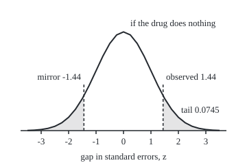
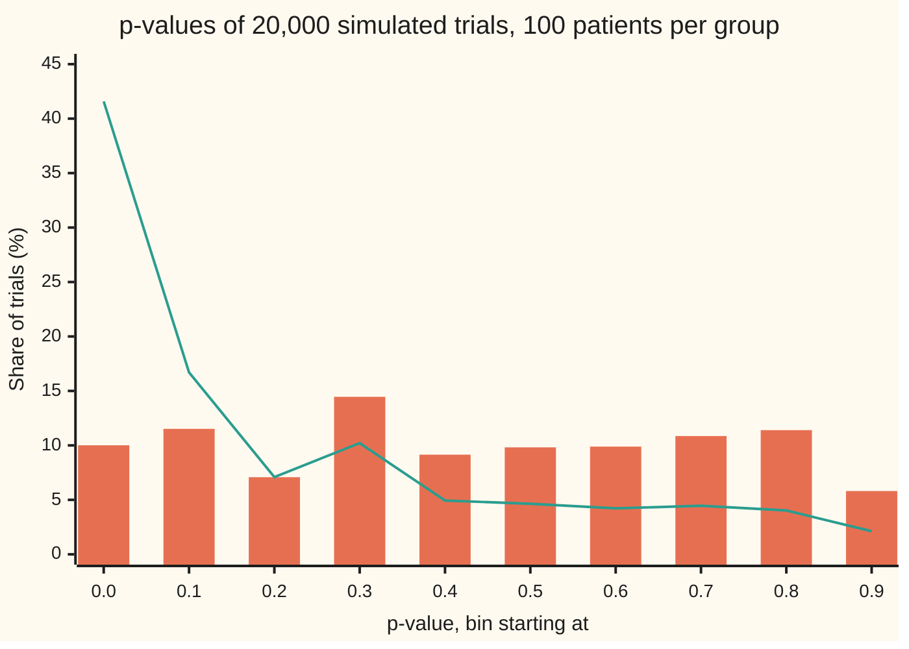

# Hypothesis tests: a null, a statistic, and the p-value that measures surprise

Probability and statistics → Confidence Intervals and Tests → Weighing evidence against a claim → Hypothesis tests

---

## General Overview

A trial gives a new drug to 100 patients and a dummy pill, a placebo, to 100 others. On the drug, 45 recover. On placebo, 35 recover. The drug is ahead by 10 patients in 100.

Is that gap the drug working, or the luck of which patients landed in which group? Even a useless pill rarely produces two equal counts: two groups of 100 drawn from the same population differ by a few patients just by chance. The question is whether 10 is a gap that luck produces often or rarely.

A test answers it by arguing from the other side. Suppose the drug does nothing. Then both groups recover at one shared rate, and any gap is luck. Measure the gap in units of the wobble luck predicts, and work out how often luck alone would produce a gap at least that many wobbles out. That share is the **p-value**, the term used from here on. For this trial it is **0.15**: a useless drug would produce a gap this far out, in either direction, about 15 trials in 100. That is common. The data do not rule out luck.

The p-value is a statement about data under an assumption. It is not the chance that the drug is useless. That second number needs more than the trial can supply, and this card shows how far apart the two can be.

**Assume the dull explanation, measure the observed gap in units of the wobble that explanation predicts, and report how often the dull explanation alone would produce a gap at least that far out: that share is the p-value.**

**What kind of fact this is:** a method. Its guarantee, that a true dull explanation yields a p-value at or below 0.05 only 5 times in 100, is a theorem for a statistic with a continuous law, proved in Why it works. For counts, as here, it holds only approximately: 0.0514, not 0.05.

### The picture: the gap, measured against luck

<p align="center"></p>

The curve is the chance law of the gap, measured in standard errors, in a world where the drug does nothing. The dashed line on the right is where this trial landed, 1.44 standard errors out. The shaded areas are the gaps at least as far out in either direction. Together they hold 0.149 of the area: the p-value. Drawn to scale, 40 units per standard error.

---

## The formula

Notation first, in words. The claim being tested, "the drug does nothing", is the **null hypothesis**, written $H_0$ and read "H nought". The rival claim, "the drug changes the recovery rate", is the **alternative**, $H_1$. The true recovery rates are $r_D$ on the drug and $r_P$ on placebo; a hat marks an estimate from the trial, so $\hat r_D$ = 45/100 = 0.45 and $\hat r_P$ = 0.35. Each group has $n$ = 100 patients. Under $H_0$ both groups share one rate, estimated by pooling them: $\bar r$ = 80/200 = 0.40. A reminder from [normal-distribution](../04-Continuous%20Distributions/04-normal-distribution.md): $\Phi(x)$ is the standard bell's area to the left of x.

The **test statistic** turns the trial into one number, the gap in units of its standard error:

$$z = \frac{\hat r_D - \hat r_P}{\sqrt{\bar r\,(1 - \bar r)\,\dfrac{2}{n}}}$$

**Read it aloud:** take the gap in recovery rates and divide it by how much that gap typically wobbles when the drug does nothing.

The p-value is the chance, computed as if $H_0$ were true, that a fresh trial's statistic $Z$ lands at least as far from zero as the observed $z$:

$$p = P_{H_0}\big(\,|Z| \ge |z|\,\big) \approx 2\,\big(1 - \Phi(|z|)\big)$$

**Read it aloud:** if the drug did nothing, the p-value is how often luck alone would push the gap at least this many standard errors out, on either side; for large groups that share is twice the bell's area beyond the observed point.

A **test at level** $\alpha$ is the rule "reject $H_0$ when $p \le \alpha$", with $\alpha$ chosen before the data arrive, usually 0.05.

| Symbol | Plain meaning | In our example | Push it up and the answer… |
| --- | --- | --- | --- |
| $H_0$ | the null hypothesis: the dull explanation being tested | the drug does nothing, $r_D = r_P$ | — |
| $H_1$ | the alternative: what the test is looking for | $r_D \ne r_P$, either direction | — |
| $r_D$, $r_P$ | true recovery rates on drug and placebo: fixed, unknown | unknown | a bigger true gap makes small p more likely |
| $\hat r_D$, $\hat r_P$ | the rates the trial observed | 0.45 and 0.35 | a wider gap raises z, lowers p |
| $\bar r$ | pooled rate, the shared rate $H_0$ assumes | 0.40 | nearer 0.5 widens the wobble slightly |
| $n$ | patients per group | 100 | same gap, more patients: z grows like root n |
| $z$ | the observed gap in standard errors | 1.443376 | lowers p |
| $Z$ | the same statistic for a trial not yet run: random | — | — |
| $\Phi$ | standard bell's area left of a point | 1 − Φ(1.443376) = 0.074457 | — |
| $p$ | the p-value: how often a true $H_0$ gives a statistic this far out | 0.148915 | — |
| $\alpha$ | the level: the p-value at or below which $H_0$ is rejected | 0.05 | more false alarms, fewer misses |
| $u$ | any threshold between 0 and 1 | 0.05, 0.15 | — |

### When it holds

- **Patients independent, groups assigned by chance.** The standard error assumes each patient is a separate draw. If the drug group was picked by the doctor, a gap can come from who was picked, and no p-value separates that from the drug.
- **Enough patients for the bell.** The formula swaps the exact count law for the normal bell. At 100 per group the exact tail is 0.151939 against the bell's 0.148915; with small groups, use the exact count of Step 3 instead.
- **Test, direction and level fixed in advance.** Choosing a one-sided test after seeing the drug ahead halves the p-value to 0.074457. Checking after every 20 patients and stopping at the first p below 0.05 raises the false-alarm rate from 0.0514 to about 0.1439 (simulated, ± 0.0025).
- **One test, not many.** The 5 percent false-alarm rate belongs to one test. Twenty tests of useless drugs will usually flag at least one: [multiple-testing](08-multiple-testing.md).

---

## Why it works

### Step 0: argue from the dull side

No calculation can say directly whether the drug works: the true rates are unknown. What can be calculated is how the data would behave if the dull explanation were true, because the dull explanation pins the chance law down. A test borrows the shape of a proof by contradiction. Assume $H_0$. Compute what it predicts. If the data land where $H_0$ rarely puts them, either something rare happened or $H_0$ is wrong. The p-value measures how rare.

### Step 1: build the world where the drug does nothing

If the drug does nothing, drug and placebo patients recover at one shared rate. Its best estimate pools all 200 patients: 80 recovered, so 0.40. In that world each group's recoveries are a count out of 100 at chance 0.40, the binomial law of [bernoulli-and-binomial](../03-Discrete%20Distributions/01-bernoulli-and-binomial.md).

That is a choice with a cost. The null says only that the two rates are equal, not what they equal. Plugging in 0.40 fixes the missing piece from the data. Step 5 meets a test that avoids the plug-in and gets a different answer.

### Step 2: put the gap in units of its own wobble

One group's observed rate has variance $\bar r(1-\bar r)/n$, here 0.40 × 0.60 / 100. The two groups are independent, so the variance of the gap is the sum, 0.004800. Its square root, 0.069282, is the **standard error of the gap**: how far the gap between two groups of 100 typically lands from zero when nothing is going on.

The observed gap, 0.10, is 0.10 / 0.069282 = 1.443376 standard errors. That is the statistic $z$. Dividing by the standard error puts every trial, of any size and any base rate, on one scale.

### Step 3: the tail beyond the observed point

By the normal approximation to the binomial ([normal-approximation-to-binomial](../06-Limit%20Theorems%20in%20Practice/03-normal-approximation-to-binomial.md)), a gap in standard errors from groups this large follows the standard bell closely when $H_0$ is true. So the chance of landing 1.443376 or more to the right is the bell's right tail, 0.074457. The null says nothing about which group should win, so a gap of 1.443376 the other way is equally surprising, and the two-sided p-value adds both tails: 0.148915.

The bell is an approximation, so two more roads check it. Enumerating all 10,201 pairs of counts (0 to 100 recoveries in each group) at the shared rate 0.40, and adding the exact chances of every pair whose statistic is at least 1.443376 from zero, gives 0.151939. Simulating 20,000 useless-drug trials gives 0.1541, give or take 0.0026. All three agree: luck alone produces a gap at least 1.44 standard errors out, either way, about 15 times in 100.

### Step 4: why a p-value can be trusted, and what it promises

The p-value has one property that makes it usable. If the dull explanation is true and the statistic has a continuous law, the p-value is spread evenly between 0 and 1. So a p-value below 0.05 turns up 5 times in 100, below 0.15 turns up 15 times in 100, and so on. That is the whole guarantee: a rule that rejects when $p \le 0.05$ raises a false alarm on a useless drug 5 times in 100. Counts are not continuous, so for this trial the promise is close, 0.0514, not exact.

<details>
<summary>Detailed proof: under the null, the chance that p is at most u is u</summary>

Write $T = |Z|$ and suppose that under $H_0$ it has a continuous law, with $G(t) = P(T \le t)$. The p-value of an observed value t is the chance of a value at least as large, $1 - G(t)$, so the p-value of a trial not yet run is the random number $1 - G(T)$.

Fix u strictly between 0 and 1. G rises continuously from 0 to 1, so by the intermediate value theorem some c has $1 - G(c) = u$. Now $1 - G(T) \le u$ exactly when $G(T) \ge G(c)$. Since G never decreases, that holds whenever $T \ge c$. It can also hold for some $T < c$, but only where G is flat between T and c, and a flat stretch of G carries chance 0. So

$$P(1 - G(T) \le u) = P(T \ge c) = 1 - G(c) = u.$$

At u = 0 and u = 1 the statement holds trivially. Hence the rule "reject when $p \le \alpha$" rejects a true $H_0$ with chance exactly $\alpha$.

A count is not continuous: G jumps. Computed exactly from the count law, under a null that pins that law down completely, the p-value then satisfies $P(p \le u) \le u$, a slightly careful test. Computed from the bell, as here, it can overshoot a little: the rule "reject when |z| ≥ 1.959964" rejects a true null with exact chance 0.0514, not 0.05.

</details>

The code checks the guarantee on 20,000 useless-drug trials. The bars below count the trials whose p-value fell in each tenth of the range. They hover near 10 percent each. They are lumpy because counts are whole numbers, so only certain p-values can occur. The line repeats the experiment for a drug that truly lifts recovery from 0.35 to 0.45, the rates this trial observed. Now the p-values pile up near 0.



Bars: the drug does nothing, both groups at 0.40. Line: the drug lifts recovery from 0.35 to 0.45. Evenly spread under the null is what makes the p-value a fair gauge; the pile-up near 0 is what a real effect looks like.

### Step 5: from p-value to decision, and the two ways to be wrong

A decision at level 0.05 can go wrong two ways. Rejecting a true $H_0$ is a **false alarm**, also called a Type I error; Step 4 holds its chance near the level: 0.0514 here. Keeping a false $H_0$ is a **miss**, a Type II error. The chance of avoiding a miss is the test's **power**, the subject of [power-and-sample-size](04-power-and-sample-size.md).

Here the miss is the bigger danger. Suppose the drug truly lifts recovery from 0.35 to 0.45, exactly what was observed. Enumerating every outcome, a trial of 100 per group reaches p ≤ 0.05 with chance 0.3078. Simulation agrees: 0.3080, give or take 0.0033. So at this size, a real 10-point benefit goes undetected in most trials. A p-value of 0.15 is weak evidence against $H_0$; it is not evidence for it.

The same point shows in the confidence interval for the gap. It is the z recipe of [confidence-intervals](01-confidence-intervals.md), the estimate plus or minus 1.959964 standard errors, with each group's own rate in the standard error: the square root of 0.45 × 0.55 / 100 + 0.35 × 0.65 / 100 is 0.068920. The 95 percent interval is 0.10 ± 1.959964 × 0.068920 = 0.10 ± 0.1351, from −0.0351 to 0.2351. It contains 0, which is why the test at 0.05 does not reject, and it also contains a benefit as large as 0.2351. The two tools are one idea read two ways: a level-0.05 test rejects a proposed gap exactly when the 95 percent interval leaves it out. Here the interval uses each group's own spread rather than the pooled 0.40, so the match between the two is close rather than exact.

A different road to a p-value keeps the 80 recoveries fixed and asks how often shuffling the 200 patients at random between the groups puts 45 or more, or 35 or fewer, in the drug group. That is the permutation test, also called Fisher's exact test, built on the law of [hypergeometric](../03-Discrete%20Distributions/03-hypergeometric.md). It gives 0.1938. It asks a slightly different question, so it gives a different number; which test to use is decided before the data arrive. The same gap squared is the statistic of [chi-square-tests](06-chi-square-tests.md), and [likelihood-ratio-tests](07-likelihood-ratio-tests.md) shows where good statistics come from.

---

## Worked numbers, by hand

| Step | Arithmetic | Value |
| --- | --- | --- |
| observed rates | 45 / 100 and 35 / 100 | 0.45 and 0.35 |
| gap | 0.45 − 0.35 | 0.10 |
| pooled rate under $H_0$ | 80 / 200 | 0.40 |
| variance of the gap | 0.40 × 0.60 × 2 / 100 | 0.004800 |
| standard error | square root of 0.004800 | 0.069282 |
| statistic $z$ | 0.10 / 0.069282 | 1.443376 |
| one tail | 1 − Φ(1.443376) | 0.074457 |
| **two-sided p-value** | 2 × 0.074457 | **0.148915** |
| decision at level 0.05 | 0.148915 > 0.05 | do not reject $H_0$ |

If the drug did nothing, trials like this one would show a gap at least 1.44 standard errors out, either way, about 15 times in 100; so this trial alone cannot separate the drug from luck.

### What breaks if you drop a piece

| Mistake | Comes out at | What went wrong |
| --- | --- | --- |
| p read as the chance the drug is useless | "0.15 chance of no effect" | p assumes no effect; if 1 in 10 tested drugs work, 0.6006 of results with p ≤ 0.05 come from useless drugs |
| checking after every 20 patients per group | false alarms 0.1439, not 0.0514 | five looks give luck five chances; the guarantee was for one look |
| one-sided test chosen after seeing the drug ahead | p = 0.074457 | the direction was picked by the data |
| not rejecting read as "no effect" | power only 0.3078 against the observed 10-point gain | too few patients to see a real effect of this size |
| significant read as important | 0.36 against 0.35 with 20,000 per group: p = 0.0366 | p shrinks with group size; a 1-point gain is still 1 point |

---

## Code, from first principles, and it actually runs

The code reaches the p-value by four roads. Road 1 computes the bell's tail from its own Taylor series. Road 2 integrates the bell's height by Simpson's rule, a weighted sum of heights at evenly spaced points, with no series. Road 3 enumerates all 10,201 possible pairs of counts under the null and adds their exact binomial chances, with no bell at all. Road 4 simulates 20,000 useless-drug trials with a SplitMix64 generator (a short, fixed recipe for random bits, seed 20260928) and counts how often the gap is at least as far out. The same simulated trials measure the false-alarm rate at level 0.05, the power, the cost of peeking, and the p-value histogram. The permutation p-value, the interval, the two size examples and the share of false alarms among rejections follow. Asserts compare the series with the integral, the bell with the exact enumeration, and each simulated share with its exact value within four standard errors; the last assert requires peeking to break the 5 percent promise.

### Python

```python
# Hypothesis tests and p-values -- the check behind the card.  Standard library only.
# A drug trial: 45 of 100 recovered on the drug, 35 of 100 on placebo.  Is the gap
# more than chance?  Road 1: the z statistic and its tail from the bell's Taylor
# series.  Road 2: the same tail by Simpson's rule.  Road 3: all 101 x 101 outcomes
# under the null, enumerated exactly.  Road 4: 20,000 seeded null trials.
from math import sqrt, pi, exp

N, A, B, R, SEED = 100, 45, 35, 20000, 20260928

def Phi(x):                                  # bell area left of x, by its Taylor series
    term, total = x, x
    for k in range(1, 200):
        term *= -x * x / (2 * k)
        total += term / (2 * k + 1)
    return 0.5 + total / sqrt(2 * pi)

def simpson(f, a, b, m=4000):                # integral of f from a to b, m even
    h = (b - a) / m
    s = f(a) + f(b)
    for i in range(1, m):
        s += (4 if i % 2 else 2) * f(a + i * h)
    return s * h / 3

def zstat(a, b, n=N):                        # gap in rates over its pooled standard error
    r = (a + b) / (2 * n)
    if r <= 0 or r >= 1:
        return 0.0
    return (a / n - b / n) / sqrt(r * (1 - r) * 2 / n)

def binom(r, n=N):                           # P(K = k) for k = 0..n, K ~ Binomial(n, r)
    pm = [(1 - r) ** n]
    for k in range(n):
        pm.append(pm[-1] * (n - k) / (k + 1) * r / (1 - r))
    return pm

def enum(ra, rb, cut):                       # exact chance that |z| >= cut, every outcome
    pa, pb = binom(ra), binom(rb)
    return sum(pa[a] * pb[b] for a in range(N + 1) for b in range(N + 1) if abs(zstat(a, b)) >= cut - 1e-12)

rbar = (A + B) / (2 * N)
se = sqrt(rbar * (1 - rbar) * 2 / N)
z0 = zstat(A, B)
p1 = 2 * (1 - Phi(z0))
bell = lambda u: exp(-u * u / 2) / sqrt(2 * pi)
p2 = 2 * simpson(bell, z0, 12.0)
p3 = enum(rbar, rbar, z0)
lo, hi = 0.0, 10.0
for _ in range(100):                         # bisection: the cutoff with two-sided area 0.05
    mid = (lo + hi) / 2
    lo, hi = (mid, hi) if 2 * (1 - Phi(mid)) > 0.05 else (lo, mid)
zc = (lo + hi) / 2
size, power = enum(rbar, rbar, zc), enum(0.45, 0.35, zc)
print(f"data: drug {A}/{N} = {A / N:.2f}, placebo {B}/{N} = {B / N:.2f}, gap {(A - B) / N:.2f}; {A + B} of {2 * N} recovered")
print(f"pooled rate {rbar:.2f}, variance of the gap {se * se:.6f}, standard error {se:.6f}, z = {z0:.6f}")
print(f"road 1, Taylor series: two-sided p = {p1:.6f}, one-sided p = {p1 / 2:.6f}")
print(f"road 2, Simpson's rule: two-sided p = {p2:.6f}")
print(f"road 3, all {(N + 1) ** 2} outcomes at rate {rbar:.2f}: exact p = {p3:.6f}")
print(f"cutoff for level 0.05: {zc:.6f}; exact size of 'reject if |z| >= cutoff' {size:.4f}")
print(f"exact power against 0.45 vs 0.35: {power:.4f}")

MASK, state = (1 << 64) - 1, SEED
def splitmix():                              # SplitMix64, seed 20260928
    global state
    state = (state + 0x9E3779B97F4A7C15) & MASK
    x = state
    x = ((x ^ (x >> 30)) * 0xBF58476D1CE4E5B9) & MASK
    x = ((x ^ (x >> 27)) * 0x94D049BB133111EB) & MASK
    return x ^ (x >> 31)

def trial(ra, rb):                           # recoveries after 20, 40, .., 100 patients per arm
    arms = []
    for r in (ra, rb):
        c, marks = 0, []
        for i in range(1, N + 1):
            c += (splitmix() >> 11) / 9007199254740992.0 < r
            if i % 20 == 0:
                marks.append(c)
        arms.append(marks)
    return [zstat(a, b, 20 * (j + 1)) for j, (a, b) in enumerate(zip(*arms))]

def rate(k): return k / R, sqrt(k / R * (1 - k / R) / R)
hist = {"null": [0] * 10, "drug works": [0] * 10}
far = rej0 = peek = rej1 = 0
for _ in range(R):
    zs = trial(rbar, rbar)
    far += abs(zs[-1]) >= z0 - 1e-12
    rej0 += abs(zs[-1]) >= zc
    peek += any(abs(z) >= zc for z in zs)
    hist["null"][min(9, int(10 * 2 * (1 - Phi(abs(zs[-1])))))] += 1
for _ in range(R):
    z = trial(0.45, 0.35)[-1]
    rej1 += abs(z) >= zc
    hist["drug works"][min(9, int(10 * 2 * (1 - Phi(abs(z)))))] += 1
(q4, e4), (q0, e0), (qp, ep), (q1, e1) = rate(far), rate(rej0), rate(peek), rate(rej1)
print(f"road 4, {R} null trials, seed {SEED}: share with |z| >= {z0:.4f} is {q4:.4f} +/- {e4:.4f}")
print(f"  rejected at 0.05 when the drug does nothing: {q0:.4f} +/- {e0:.4f}")
print(f"  rejected at 0.05 when it lifts 0.35 to 0.45: {q1:.4f} +/- {e1:.4f}")
print(f"  peeking after 20, 40, 60, 80, 100 per arm, stop at first |z| >= cutoff: {qp:.4f} +/- {ep:.4f}")
for k, v in hist.items():
    print(f"p-value histogram, {k}, percent per bin of width 0.1: " + ", ".join(f"{100 * c / R:.2f}" for c in v))

w = [1.0]                                    # permutation (Fisher) law of drug-arm recoveries, 80 in all
for x in range(80):
    w.append(w[-1] * (80 - x) * (100 - x) / ((x + 1) * (21 + x)))
fisher = sum(w[x] for x in range(81) if abs(x - 40) >= 5) / sum(w)
seu = sqrt(A / N * (1 - A / N) / N + B / N * (1 - B / N) / N)
print(f"permutation test (Fisher), same data: p = {fisher:.4f}")
print(f"95% interval for the gap, standard error from each arm's own rate {seu:.6f}: {(A - B) / N:.2f} +/- {zc * seu:.4f} = [{(A - B) / N - zc * seu:.4f}, {(A - B) / N + zc * seu:.4f}]")
print(f"ten times the patients, 450/1000 vs 350/1000: z = {zstat(450, 350, 1000):.4f}, p = {2 * (1 - Phi(zstat(450, 350, 1000))):.7f}")
print(f"tiny gap, 7200/20000 vs 7000/20000: z = {zstat(7200, 7000, 20000):.4f}, p = {2 * (1 - Phi(zstat(7200, 7000, 20000))):.4f}")
for share in (0.5, 0.1):                     # of drugs tested, the share that truly work
    ex = (1 - share) * size / ((1 - share) * size + share * power)
    sm = (1 - share) * q0 / ((1 - share) * q0 + share * q1)
    print(f"if {share:.1f} of drugs work: rejections that are false alarms, exact {ex:.4f}, simulated {sm:.4f}")

S, BASE = 40.0, 190.0                        # figure: x in bell units -> 180 + 40 x, y -> 190 - 360 f
pt = lambda u: f"{180 + S * u:.1f},{BASE - 360 * bell(u):.1f}"
print("figure, bell: " + " ".join(pt(-3.5 + 0.25 * i) for i in range(29)))
tail = [z0] + [1.5 + 0.25 * i for i in range(9)]
print("figure, right tail: " + " ".join(pt(u) for u in tail) + f" {180 + S * 3.5:.1f},{BASE:.1f} {180 + S * z0:.1f},{BASE:.1f}")
print("figure, left tail: " + " ".join(pt(-u) for u in tail) + f" {180 - S * 3.5:.1f},{BASE:.1f} {180 - S * z0:.1f},{BASE:.1f}")

assert abs(p1 - p2) < 1e-9                   # series and integral: two roads to the bell's tail
assert abs(p3 - p1) < 0.005                  # exact enumeration agrees with the bell to half a point
assert abs(q4 - p3) < 4 * e4                 # simulation agrees with enumeration
assert abs(q0 - size) < 4 * e0 and abs(q1 - power) < 4 * e1
assert qp - size > 4 * ep                    # peeking breaks the 5 percent promise
print("ALL CHECKS PASS")
```

**Ran 2026-10-06 on macOS, Python 3.14.6, standard library only. All checks passed. Output, pasted from the run:**

```
data: drug 45/100 = 0.45, placebo 35/100 = 0.35, gap 0.10; 80 of 200 recovered
pooled rate 0.40, variance of the gap 0.004800, standard error 0.069282, z = 1.443376
road 1, Taylor series: two-sided p = 0.148915, one-sided p = 0.074457
road 2, Simpson's rule: two-sided p = 0.148915
road 3, all 10201 outcomes at rate 0.40: exact p = 0.151939
cutoff for level 0.05: 1.959964; exact size of 'reject if |z| >= cutoff' 0.0514
exact power against 0.45 vs 0.35: 0.3078
road 4, 20000 null trials, seed 20260928: share with |z| >= 1.4434 is 0.1541 +/- 0.0026
  rejected at 0.05 when the drug does nothing: 0.0510 +/- 0.0016
  rejected at 0.05 when it lifts 0.35 to 0.45: 0.3080 +/- 0.0033
  peeking after 20, 40, 60, 80, 100 per arm, stop at first |z| >= cutoff: 0.1439 +/- 0.0025
p-value histogram, null, percent per bin of width 0.1: 10.01, 11.52, 7.08, 14.46, 9.15, 9.82, 9.89, 10.86, 11.40, 5.81
p-value histogram, drug works, percent per bin of width 0.1: 41.58, 16.70, 7.09, 10.21, 4.94, 4.64, 4.22, 4.46, 4.03, 2.12
permutation test (Fisher), same data: p = 0.1938
95% interval for the gap, standard error from each arm's own rate 0.068920: 0.10 +/- 0.1351 = [-0.0351, 0.2351]
ten times the patients, 450/1000 vs 350/1000: z = 4.5644, p = 0.0000050
tiny gap, 7200/20000 vs 7000/20000: z = 2.0898, p = 0.0366
if 0.5 of drugs work: rejections that are false alarms, exact 0.1432, simulated 0.1422
if 0.1 of drugs work: rejections that are false alarms, exact 0.6006, simulated 0.5987
figure, bell: 40.0,189.7 50.0,189.3 60.0,188.4 70.0,186.7 80.0,183.7 90.0,178.6 100.0,170.6 110.0,158.9 120.0,143.4 130.0,124.2 140.0,102.9 150.0,81.6 160.0,63.3 170.0,50.8 180.0,46.4 190.0,50.8 200.0,63.3 210.0,81.6 220.0,102.9 230.0,124.2 240.0,143.4 250.0,158.9 260.0,170.6 270.0,178.6 280.0,183.7 290.0,186.7 300.0,188.4 310.0,189.3 320.0,189.7
figure, right tail: 237.7,139.3 240.0,143.4 250.0,158.9 260.0,170.6 270.0,178.6 280.0,183.7 290.0,186.7 300.0,188.4 310.0,189.3 320.0,189.7 320.0,190.0 237.7,190.0
figure, left tail: 122.3,139.3 120.0,143.4 110.0,158.9 100.0,170.6 90.0,178.6 80.0,183.7 70.0,186.7 60.0,188.4 50.0,189.3 40.0,189.7 40.0,190.0 122.3,190.0
ALL CHECKS PASS
```

### Rust

Same numbers, same labels, built with `rustc --edition 2021 -O`.

```rust
// Hypothesis tests and p-values -- the same check as the Python, in Rust.  No crates.
// A drug trial: 45 of 100 recovered on the drug, 35 of 100 on placebo.  Is the gap
// more than chance?  Road 1: the z statistic and its tail from the bell's Taylor
// series.  Road 2: the same tail by Simpson's rule.  Road 3: all 101 x 101 outcomes
// under the null, enumerated exactly.  Road 4: 20,000 seeded null trials.
use std::f64::consts::PI;

const N: usize = 100; const A: usize = 45; const B: usize = 35;
const R: usize = 20000; const SEED: u64 = 20260928;

fn phi(x: f64) -> f64 {                          // bell area left of x, by its Taylor series
    let (mut term, mut total) = (x, x);
    for k in 1..200 {
        let k = k as f64;
        term *= -x * x / (2.0 * k);
        total += term / (2.0 * k + 1.0);
    }
    0.5 + total / (2.0 * PI).sqrt()
}

fn bell(u: f64) -> f64 { (-u * u / 2.0).exp() / (2.0 * PI).sqrt() }

fn simpson<F: Fn(f64) -> f64>(f: F, a: f64, b: f64) -> f64 {   // integral of f, 4000 steps
    let m = 4000;
    let h = (b - a) / m as f64;
    let mut s = f(a) + f(b);
    for i in 1..m { s += (if i % 2 == 1 { 4.0 } else { 2.0 }) * f(a + i as f64 * h) }
    s * h / 3.0
}

fn zstat(a: usize, b: usize, n: usize) -> f64 { // gap in rates over its pooled standard error
    let nf = n as f64;
    let r = (a + b) as f64 / (2.0 * nf);
    if r <= 0.0 || r >= 1.0 { return 0.0 }
    (a as f64 / nf - b as f64 / nf) / (r * (1.0 - r) * 2.0 / nf).sqrt()
}

fn binom(r: f64) -> Vec<f64> {                   // P(K = k) for k = 0..N, K ~ Binomial(N, r)
    let mut pm = vec![(1.0 - r).powi(N as i32)];
    for k in 0..N {
        pm.push(pm[k] * (N - k) as f64 / (k + 1) as f64 * r / (1.0 - r));
    }
    pm
}

fn enumerate(ra: f64, rb: f64, cut: f64) -> f64 {   // exact chance that |z| >= cut, every outcome
    let (pa, pb) = (binom(ra), binom(rb));
    let mut s = 0.0;
    for a in 0..=N { for b in 0..=N {
        if zstat(a, b, N).abs() >= cut - 1e-12 { s += pa[a] * pb[b] }
    } }
    s
}

struct Rng(u64);
impl Rng {
    fn splitmix(&mut self) -> u64 {              // SplitMix64, seed 20260928
        self.0 = self.0.wrapping_add(0x9E3779B97F4A7C15);
        let mut x = self.0;
        x = (x ^ (x >> 30)).wrapping_mul(0xBF58476D1CE4E5B9);
        x = (x ^ (x >> 27)).wrapping_mul(0x94D049BB133111EB);
        x ^ (x >> 31)
    }
    fn trial(&mut self, ra: f64, rb: f64) -> Vec<f64> {   // recoveries after 20, 40, .., 100 per arm
        let mut arms: Vec<Vec<usize>> = Vec::new();
        for r in [ra, rb] {
            let (mut c, mut marks) = (0, Vec::new());
            for i in 1..=N {
                if ((self.splitmix() >> 11) as f64 / 9007199254740992.0) < r { c += 1 }
                if i % 20 == 0 { marks.push(c) }
            }
            arms.push(marks);
        }
        (0..5).map(|j| zstat(arms[0][j], arms[1][j], 20 * (j + 1))).collect()
    }
}

fn rate(k: usize) -> (f64, f64) {
    let q = k as f64 / R as f64;
    (q, (q * (1.0 - q) / R as f64).sqrt())
}

fn bin(z: f64) -> usize { ((10.0 * 2.0 * (1.0 - phi(z.abs()))) as usize).min(9) }

fn main() {
    let rbar = (A + B) as f64 / (2.0 * N as f64);
    let se = (rbar * (1.0 - rbar) * 2.0 / N as f64).sqrt();
    let z0 = zstat(A, B, N);
    let p1 = 2.0 * (1.0 - phi(z0));
    let p2 = 2.0 * simpson(bell, z0, 12.0);
    let p3 = enumerate(rbar, rbar, z0);
    let (mut lo, mut hi) = (0.0, 10.0);
    for _ in 0..100 {                            // bisection: the cutoff with two-sided area 0.05
        let mid = (lo + hi) / 2.0;
        if 2.0 * (1.0 - phi(mid)) > 0.05 { lo = mid } else { hi = mid }
    }
    let zc = (lo + hi) / 2.0;
    let (size, power) = (enumerate(rbar, rbar, zc), enumerate(0.45, 0.35, zc));
    let nf = N as f64;
    println!("data: drug {}/{} = {:.2}, placebo {}/{} = {:.2}, gap {:.2}; {} of {} recovered", A, N, A as f64 / nf, B, N, B as f64 / nf, (A - B) as f64 / nf, A + B, 2 * N);
    println!("pooled rate {:.2}, variance of the gap {:.6}, standard error {:.6}, z = {:.6}", rbar, se * se, se, z0);
    println!("road 1, Taylor series: two-sided p = {:.6}, one-sided p = {:.6}", p1, p1 / 2.0);
    println!("road 2, Simpson's rule: two-sided p = {:.6}", p2);
    println!("road 3, all {} outcomes at rate {:.2}: exact p = {:.6}", (N + 1) * (N + 1), rbar, p3);
    println!("cutoff for level 0.05: {:.6}; exact size of 'reject if |z| >= cutoff' {:.4}", zc, size);
    println!("exact power against 0.45 vs 0.35: {:.4}", power);

    let mut rng = Rng(SEED);
    let (mut h0, mut h1) = ([0usize; 10], [0usize; 10]);
    let (mut far, mut rej0, mut peek, mut rej1) = (0, 0, 0, 0);
    for _ in 0..R {
        let zs = rng.trial(rbar, rbar);
        let last = zs[4];
        if last.abs() >= z0 - 1e-12 { far += 1 }
        if last.abs() >= zc { rej0 += 1 }
        if zs.iter().any(|z| z.abs() >= zc) { peek += 1 }
        h0[bin(last)] += 1;
    }
    for _ in 0..R {
        let z = rng.trial(0.45, 0.35)[4];
        if z.abs() >= zc { rej1 += 1 }
        h1[bin(z)] += 1;
    }
    let ((q4, e4), (q0, e0), (qp, ep), (q1, e1)) = (rate(far), rate(rej0), rate(peek), rate(rej1));
    println!("road 4, {} null trials, seed {}: share with |z| >= {:.4} is {:.4} +/- {:.4}", R, SEED, z0, q4, e4);
    println!("  rejected at 0.05 when the drug does nothing: {:.4} +/- {:.4}", q0, e0);
    println!("  rejected at 0.05 when it lifts 0.35 to 0.45: {:.4} +/- {:.4}", q1, e1);
    println!("  peeking after 20, 40, 60, 80, 100 per arm, stop at first |z| >= cutoff: {:.4} +/- {:.4}", qp, ep);
    for (k, v) in [("null", h0), ("drug works", h1)] {
        let row: Vec<String> = v.iter().map(|&c| format!("{:.2}", 100.0 * c as f64 / R as f64)).collect();
        println!("p-value histogram, {}, percent per bin of width 0.1: {}", k, row.join(", "));
    }

    let mut w = vec![1.0f64];                    // permutation (Fisher) law of drug-arm recoveries, 80 in all
    for x in 0..80 {
        let xf = x as f64;
        w.push(w[x] * (80.0 - xf) * (100.0 - xf) / ((xf + 1.0) * (21.0 + xf)));
    }
    let tails = (0..=80).filter(|&x| (x as i64 - 40).abs() >= 5).fold(0.0, |s, x| s + w[x]);
    let fisher = tails / w.iter().fold(0.0, |s, x| s + x);
    let (ra, rb, gap) = (A as f64 / nf, B as f64 / nf, (A - B) as f64 / nf);
    let seu = (ra * (1.0 - ra) / nf + rb * (1.0 - rb) / nf).sqrt();
    println!("permutation test (Fisher), same data: p = {:.4}", fisher);
    println!("95% interval for the gap, standard error from each arm's own rate {:.6}: {:.2} +/- {:.4} = [{:.4}, {:.4}]", seu, gap, zc * seu, gap - zc * seu, gap + zc * seu);
    let (zb, zt) = (zstat(450, 350, 1000), zstat(7200, 7000, 20000));
    println!("ten times the patients, 450/1000 vs 350/1000: z = {:.4}, p = {:.7}", zb, 2.0 * (1.0 - phi(zb)));
    println!("tiny gap, 7200/20000 vs 7000/20000: z = {:.4}, p = {:.4}", zt, 2.0 * (1.0 - phi(zt)));
    for share in [0.5, 0.1] {                    // of drugs tested, the share that truly work
        let ex = (1.0 - share) * size / ((1.0 - share) * size + share * power);
        let sm = (1.0 - share) * q0 / ((1.0 - share) * q0 + share * q1);
        println!("if {:.1} of drugs work: rejections that are false alarms, exact {:.4}, simulated {:.4}", share, ex, sm);
    }

    let (s, base) = (40.0, 190.0);               // figure: x in bell units -> 180 + 40 x, y -> 190 - 360 f
    let pt = |u: f64| format!("{:.1},{:.1}", 180.0 + s * u, base - 360.0 * bell(u));
    let row: Vec<String> = (0..29).map(|i| pt(-3.5 + 0.25 * i as f64)).collect();
    println!("figure, bell: {}", row.join(" "));
    let tail: Vec<f64> = std::iter::once(z0).chain((0..9).map(|i| 1.5 + 0.25 * i as f64)).collect();
    let right: Vec<String> = tail.iter().map(|&u| pt(u)).collect();
    let left: Vec<String> = tail.iter().map(|&u| pt(-u)).collect();
    println!("figure, right tail: {} {:.1},{:.1} {:.1},{:.1}", right.join(" "), 180.0 + s * 3.5, base, 180.0 + s * z0, base);
    println!("figure, left tail: {} {:.1},{:.1} {:.1},{:.1}", left.join(" "), 180.0 - s * 3.5, base, 180.0 - s * z0, base);

    assert!((p1 - p2).abs() < 1e-9);             // series and integral: two roads to the bell's tail
    assert!((p3 - p1).abs() < 0.005);            // exact enumeration agrees with the bell to half a point
    assert!((q4 - p3).abs() < 4.0 * e4);         // simulation agrees with enumeration
    assert!((q0 - size).abs() < 4.0 * e0 && (q1 - power).abs() < 4.0 * e1);
    assert!(qp - size > 4.0 * ep);               // peeking breaks the 5 percent promise
    println!("ALL CHECKS PASS");
}
```

**Ran 2026-10-06 on macOS, rustc 1.98.1, no crates. All checks passed. Output, pasted from the run:**

```
data: drug 45/100 = 0.45, placebo 35/100 = 0.35, gap 0.10; 80 of 200 recovered
pooled rate 0.40, variance of the gap 0.004800, standard error 0.069282, z = 1.443376
road 1, Taylor series: two-sided p = 0.148915, one-sided p = 0.074457
road 2, Simpson's rule: two-sided p = 0.148915
road 3, all 10201 outcomes at rate 0.40: exact p = 0.151939
cutoff for level 0.05: 1.959964; exact size of 'reject if |z| >= cutoff' 0.0514
exact power against 0.45 vs 0.35: 0.3078
road 4, 20000 null trials, seed 20260928: share with |z| >= 1.4434 is 0.1541 +/- 0.0026
  rejected at 0.05 when the drug does nothing: 0.0510 +/- 0.0016
  rejected at 0.05 when it lifts 0.35 to 0.45: 0.3080 +/- 0.0033
  peeking after 20, 40, 60, 80, 100 per arm, stop at first |z| >= cutoff: 0.1439 +/- 0.0025
p-value histogram, null, percent per bin of width 0.1: 10.01, 11.52, 7.08, 14.46, 9.15, 9.82, 9.89, 10.86, 11.40, 5.81
p-value histogram, drug works, percent per bin of width 0.1: 41.58, 16.70, 7.09, 10.21, 4.94, 4.64, 4.22, 4.46, 4.03, 2.12
permutation test (Fisher), same data: p = 0.1938
95% interval for the gap, standard error from each arm's own rate 0.068920: 0.10 +/- 0.1351 = [-0.0351, 0.2351]
ten times the patients, 450/1000 vs 350/1000: z = 4.5644, p = 0.0000050
tiny gap, 7200/20000 vs 7000/20000: z = 2.0898, p = 0.0366
if 0.5 of drugs work: rejections that are false alarms, exact 0.1432, simulated 0.1422
if 0.1 of drugs work: rejections that are false alarms, exact 0.6006, simulated 0.5987
figure, bell: 40.0,189.7 50.0,189.3 60.0,188.4 70.0,186.7 80.0,183.7 90.0,178.6 100.0,170.6 110.0,158.9 120.0,143.4 130.0,124.2 140.0,102.9 150.0,81.6 160.0,63.3 170.0,50.8 180.0,46.4 190.0,50.8 200.0,63.3 210.0,81.6 220.0,102.9 230.0,124.2 240.0,143.4 250.0,158.9 260.0,170.6 270.0,178.6 280.0,183.7 290.0,186.7 300.0,188.4 310.0,189.3 320.0,189.7
figure, right tail: 237.7,139.3 240.0,143.4 250.0,158.9 260.0,170.6 270.0,178.6 280.0,183.7 290.0,186.7 300.0,188.4 310.0,189.3 320.0,189.7 320.0,190.0 237.7,190.0
figure, left tail: 122.3,139.3 120.0,143.4 110.0,158.9 100.0,170.6 90.0,178.6 80.0,183.7 70.0,186.7 60.0,188.4 50.0,189.3 40.0,189.7 40.0,190.0 122.3,190.0
ALL CHECKS PASS
```

The two outputs match line for line, simulation included: both languages draw the same random bits from the same generator.

> [!TIP]
> **Try changing**
> Guess first, then run it.
> - **Make the drug useless in the second batch.** Change `trial(0.45, 0.35)` to `trial(0.40, 0.40)` in both languages. Guess the first bin of the second histogram row. It falls from 41.58 to about 10, like the null row, and the power assert stops the run: a useless drug does not pile p-values near 0.
> - **Move the level after the fact.** In the bisection, change the 0.05 to 0.15. The cutoff falls below the observed 1.443376, so this trial now "rejects". Nothing about the drug changed; only the rule did, which is why the level is fixed before the data.
> - **Another seed.** Set `SEED` to any other number. The simulated shares move by about their printed ± amounts; the three exact roads do not move at all.
> - **More patients, same gap.** The printed line for 450 of 1,000 against 350 of 1,000 keeps the 10-point gap with ten times the patients: z grows by the square root of 10, to 4.5644, and p falls to 0.0000050. In both languages, change 450, 350 and 1000 to 180, 140 and 400 wherever they appear: four times the patients. Guess z first. It doubles, to 2.8868, and p is 0.0038924; no assert stops the run.

---

## The usual mistake

> [!warning]
> **"p = 0.15, so there is a 15 percent chance the drug does nothing."** The p-value is computed by assuming the drug does nothing; it cannot also be the chance of that assumption. It is a chance about data given the null, and the reverse, the chance of the null given the data, needs Bayes' rule and a prior share of drugs that work ([bayes-rule](../01-Chance%20and%20Events/06-bayes-rule.md)). The two can be far apart. If half of all tested drugs work as well as this one appears to, 0.1432 of results with p ≤ 0.05 come from useless drugs. If 1 in 10 work, 0.6006 do: most "significant" results are false alarms, even though each test kept its 5 percent promise.
>
> - **"Not significant, so the drug has no effect."** With 100 per group this test catches a real 10-point gain only 0.3078 of the time. The interval, −0.0351 to 0.2351, still allows a large benefit.
> - **Peeking.** Looking after every 20 patients per group and stopping at the first p ≤ 0.05 turns a 0.0514 false-alarm rate into 0.1439.
> - **Shopping for a test.** The same data give 0.074457 one-sided, 0.148915 by the z test, 0.1938 by the permutation test. Choosing among them after seeing the numbers voids all three.
> - **"Significant" read as "large".** A 1-point gain, 0.36 against 0.35, reaches p = 0.0366 with 20,000 patients per group. Report the gap and its interval, not just the p-value.

---

## Where you meet it in real life

- **Drug and vaccine trials.** Regulators ask for a pre-registered test, a fixed level and a fixed plan for interim looks; the peeking problem is why trials that look early use stricter cutoffs.
- **A/B tests on websites.** Two versions of a page, two conversion rates, the same two-group test. Dashboards that update live invite exactly the peeking that inflated false alarms here to 0.1439.
- **Quality control.** A factory tests whether two machines turn out the same share of faulty parts; NIST's engineering handbook works this two-proportion test.
- **Many comparisons at once.** A study that tests twenty outcomes needs [multiple-testing](08-multiple-testing.md).
- **Risk models in finance.** A bank checks whether its loss forecasts are breached more often than promised with a test of this kind: [backtesting-var](../../12-Financial%20mathematics/39-Value%20at%20Risk%20and%20Expected%20Shortfall/08-backtesting-var.md).

> **Say it back**
> A test assumes the dull explanation, here that the drug does nothing, and asks how often that world alone would produce data at least as extreme as what was seen. The gap of 0.10 is 1.44 standard errors, and a useless drug produces a gap that far out, in either direction, about 15 trials in 100: p = 0.15. Under a true null the p-value is spread evenly, or nearly so for counts, so rejecting when p ≤ 0.05 raises false alarms 5 times in 100, provided the test, direction, level and stopping rule were fixed in advance. A p-value is not the chance the null is true, and a large one is not proof of no effect: this trial had only about 31 chances in 100 of detecting a real 10-point gain.

---

## What this builds on

- [confidence-intervals](01-confidence-intervals.md): the standard error, the pivot, and the idea that a guarantee belongs to the method; a test is the same pivot read at one proposed value.
- [bernoulli-and-binomial](../03-Discrete%20Distributions/01-bernoulli-and-binomial.md): the count law behind each group and the exact enumeration.
- [normal-approximation-to-binomial](../06-Limit%20Theorems%20in%20Practice/03-normal-approximation-to-binomial.md): why the bell's tail stands in for the exact count.

## Where this goes next

- [power-and-sample-size](04-power-and-sample-size.md): the miss rate, and how many patients a trial needs to catch a given gain.
- [t-tests-and-comparing-means](05-t-tests-and-comparing-means.md): the same logic for averages, with a spread estimated from the data.
- [chi-square-tests](06-chi-square-tests.md): tests on whole tables of counts, of which this trial is the two-by-two case.
- [multiple-testing](08-multiple-testing.md): keeping the false-alarm promise when many tests run at once.
- [backtesting-var](../../12-Financial%20mathematics/39-Value%20at%20Risk%20and%20Expected%20Shortfall/08-backtesting-var.md): a bank's risk forecast put on trial by the same method.

This trial could not tell a 10-point benefit from luck, and the test says nothing about how many patients would have been enough; that question is [power-and-sample-size](04-power-and-sample-size.md).

---

## Sources

Verified 2026-09-28: every link below resolves to the publisher's page or the paper's DOI.

- Neyman, Jerzy, and Egon S. Pearson. "On the Problem of the Most Efficient Tests of Statistical Hypotheses." *Philosophical Transactions of the Royal Society A* 231, 1933. [DOI](https://doi.org/10.1098/rsta.1933.0009). Tests as decision rules with two kinds of error.
- Wasserstein, Ronald L., and Nicole A. Lazar. "The ASA Statement on p-Values: Context, Process, and Purpose." *The American Statistician* 70(2), 2016. [DOI](https://doi.org/10.1080/00031305.2016.1154108). Six principles on what a p-value does and does not mean.
- Colquhoun, David. "An Investigation of the False Discovery Rate and the Misinterpretation of p-Values." *Royal Society Open Science* 1, 2014. [DOI](https://doi.org/10.1098/rsos.140216). Why a result with p below 0.05 can still be a false alarm more often than not.
- NIST/SEMATECH. *e-Handbook of Statistical Methods*, section 7.3.3, "How can we determine whether two processes produce the same proportion of defectives?" [Handbook page](https://www.itl.nist.gov/div898/handbook/prc/section3/prc33.htm). The two-proportion test with a pooled rate, as used in engineering.
- Casella, George, and Roger L. Berger. *Statistical Inference*, 2nd ed. Routledge. [Publisher page](https://www.routledge.com/Statistical-Inference/Casella-Berger/p/book/9781032593036). Chapter 8: tests, error probabilities, p-values and their uniform law under the null.
