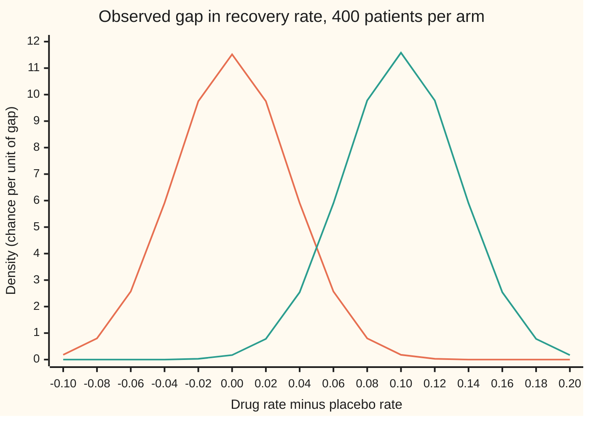
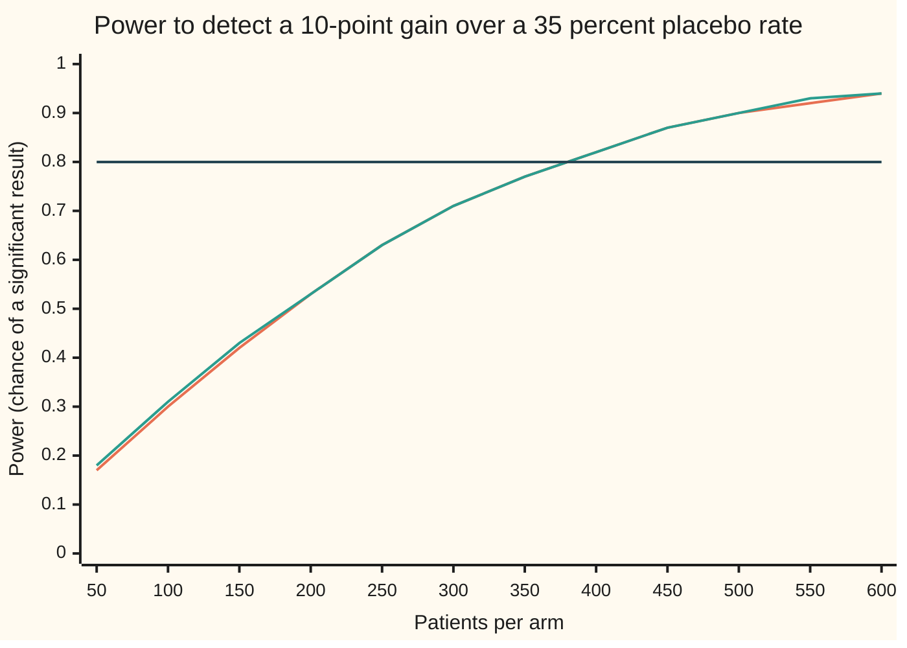

# Power: the chance of catching a real effect, and the sample size that buys it

Probability and statistics → Confidence Intervals and Tests → Planning a trial's size → Power

---

## General Overview

A small drug trial put 100 patients on a new drug and 100 on a placebo, a dummy pill. On the drug, 45 recovered. On the placebo, 35 did. That is a 10-point gain. The test from [hypothesis-tests-and-p-values](03-hypothesis-tests-and-p-values.md) gave a p-value of 0.1489: not significant at the usual 5 percent line.

Was the drug useless? The data cannot say. Before the trial, its planners had named a 10-point gain, from 35 to 45 percent, as the effect worth finding. If the drug really delivers it, a trial of 100 per arm comes out significant only about 31 times in 100. The trial was built too small to see what it was looking for.

That chance, worked out before any patient is enrolled, is the trial's **power**: the chance that the test comes out significant when a stated real effect is there. Run the calculation backwards and it gives the size a trial needs. For a 10-point gain over a 35 percent placebo rate, 80 percent power takes 376 patients per arm. Allow 1 patient in 20 to drop out and that becomes 396; the planners book **400 per arm**. If 1 in 20 do leave, 380 remain, still above 376; if all stay, the power is about 82 percent.

**Power is the chance that the observed gap lands beyond the test's cutoff when the real gap is the one hoped for; because the gap's wobble shrinks like one over the square root of the number of patients, the patients needed grow like one over the square of the gap.**

**What kind of fact this is:** a method. Its formula is an approximation built on the normal curve, derived on this card in Why it works; an exact count over every possible trial outcome checks it in the code.

### The picture: two bells and a cutoff

Before a trial of 400 per arm, the observed gap (drug recovery rate minus placebo rate) is uncertain. If the drug does nothing, the gap scatters round 0. If the drug adds 10 points, it scatters round 0.10. Each scatter has a bell shape: the normal curve. The test declares significance when the gap passes 0.0679.



Orange: the gap's bell if the drug does nothing. Green: its bell if the drug adds 10 points. The cutoff, 0.0679, falls between the ticks 0.06 and 0.08. Orange area beyond it is 2.5 percent; with the mirror tail below −0.0679 it makes the 5 percent false-alarm chance; green area beyond it is the power, 0.8242. More patients narrow both bells and push the green area towards 1.

---

## The formula

Notation first, in words. Write $p_0$ for the placebo's recovery chance and $p_1$ for the drug's. The gain is $\delta = p_1 - p_0$ (delta). Write $n$ for the number of patients in each arm. The test's false-alarm rate, the chance it calls a useless drug significant, is $\alpha$ (alpha). The chance it misses a real gain is $\beta$ (beta), so the power is $1 - \beta$. A reminder from [normal-quantile](../04-Continuous%20Distributions/05-normal-quantile.md): $\Phi$ is the standard bell's area to the left of a point, and $\Phi^{-1}$ undoes it. Here $z_{1-\alpha/2} = \Phi^{-1}(1 - \alpha/2)$ and $z_{1-\beta} = \Phi^{-1}(1 - \beta)$.

$$n = \frac{\bigl(z_{1-\alpha/2}\,\sigma_0 + z_{1-\beta}\,\sigma_1\bigr)^2}{\delta^2}$$

**Read it aloud:** the patients needed per arm are the square of the sum of two cutoffs, each scaled by one patient's worth of spread, divided by the square of the gain being chased.

The two spreads are the scatter one pair of patients adds to the gap, first if the drug does nothing, then if it works:

$$\sigma_0 = \sqrt{2\,\bar p\,(1 - \bar p)}, \qquad \sigma_1 = \sqrt{p_0(1 - p_0) + p_1(1 - p_1)}, \qquad \bar p = \frac{p_0 + p_1}{2}$$

The same pieces, run forwards, give the power of a trial of any size:

$$\text{power}(n) \approx \Phi\!\left(\frac{\delta\sqrt{n} - z_{1-\alpha/2}\,\sigma_0}{\sigma_1}\right)$$

**Read it aloud:** measure how far the true gain sits beyond the cutoff, in units of the gap's wobble under the drug; the power is the bell's area to the left of that distance.

| Symbol | Plain meaning | In our example | Push it up and the answer… |
| --- | --- | --- | --- |
| $p_0$, $p_1$ | recovery chance on placebo, on the drug | 0.35 and 0.45 | nearer 0.5 widens the spread: more patients |
| $\delta$ | the gain being chased, $p_1 - p_0$ | 0.10, ten points | patients fall like one over its square |
| $\bar p$, $\hat p$ | the average of the two chances, where the test's pooled rate settles when the drug delivers the gain; $\hat p$ is the trial's own pooled rate | 0.40; 0.40 in the 100-per-arm trial | — |
| $n$ | patients in each arm | 376 needed, 400 booked | power rises |
| $\alpha$ | false-alarm rate, split over both tails | 0.05 | larger alpha: fewer patients |
| $\beta$ | miss chance; power is $1 - \beta$ | 0.20, so power 0.80 | larger beta: fewer patients |
| $z_{1-\alpha/2}$, $z_{1-\beta}$; $z_{1-\alpha}$ | the bell's cutoffs for those two rates; the cutoff a one-sided test uses | 1.959964 and 0.841621; 1.644854 | more patients |
| $\Phi$, $\Phi^{-1}$ | bell area left of a point, and its reverse | $\Phi(0.9317) = 0.8242$ | — |
| $\sigma_0$, $\sigma_1$ | one pair of patients' spread in the gap, without and with the gain | 0.692820 and 0.689202 | more patients |
| $X_0$, $X_1$; $x_0$, $x_1$ | recovery counts in the placebo and drug arms, random before the trial; lower case for one particular pair of counts | 35 and 45 in the 100-per-arm trial | — |
| $\hat D$ | the observed gap, $X_1/n - X_0/n$ | 0.10 in the 100-per-arm trial | — |
| $c$ | the cutoff: the smallest gap the test calls significant, $z_{1-\alpha/2}\sigma_0/\sqrt n$ | 0.0679 at 400 per arm | shrinks as $n$ grows |
| $m$ | the margin: how far an interval may reach either side of its centre | 0.05, in Where you meet it | patients fall like one over its square |

### When it holds

- **Patients are independent.** If patients come in clinics whose recoveries move together, the gap wobbles more and the formula's $n$ is too small.
- **Equal arms, two-sided test.** A one-sided test uses $z_{1-\alpha}$ instead; unequal arms need their own spreads.
- **The bell fits the gap.** With hundreds of patients and chances well away from 0 and 1 the normal curve is close to the exact count law; for rare events, count exactly.
- **The gain is named in advance.** Power is always power *at* a stated gain; without one the number means nothing.

---

## Why it works

### Step 0: power is a chance about the test, fixed before the data

A test is a rule: compute the observed gap and call it significant if it lands beyond a cutoff. Before the trial the gap is random, so whether the rule fires is random too. If the drug does nothing, it fires with chance $\alpha$ by design. If the drug adds 10 points, it fires with some other chance: the power. The trial's actual result never enters it.

### Step 1: the observed gap scatters round the true gain

Write $\hat D$ for the observed gap. Each arm's recovery count follows the binomial law ([bernoulli-and-binomial](../03-Discrete%20Distributions/01-bernoulli-and-binomial.md)). A recovery rate built from $n$ patients, each recovering with chance $p_0$ (or $p_1$), has variance $p_0(1-p_0)/n$ (or $p_1(1-p_1)/n$). The two arms are independent, so their variances add:

$$\operatorname{Var}(\hat D) = \frac{p_0(1-p_0) + p_1(1-p_1)}{n} = \frac{\sigma_1^2}{n}$$

At 400 per arm, the gap's standard error, its typical wobble, is 0.689202 divided by 20: 0.034460. The observed gap will usually land within about 3.4 points of the true 10.

### Step 2: the cutoff is set by the no-effect world

The test pools both arms into one recovery rate and measures the gap against the scatter it would have if that one rate held in both. Under the hoped-for gain the pooled rate settles at the average $\bar p$, 0.40, so the power calculation computes $\sigma_0$ there. The no-effect gap then scatters round 0 with standard error $\sigma_0/\sqrt n$: 0.034641 at 400 per arm. The test fires when the gap passes $z_{1-\alpha/2}$ of these wobbles in either direction. That fixes the cutoff:

$$c = z_{1-\alpha/2}\,\frac{\sigma_0}{\sqrt n} = 1.959964 \times 0.034641 = 0.0679$$

### Step 3: the power is the area of the gain's bell beyond the cutoff

The central limit theorem ([central-limit-theorem](../06-Limit%20Theorems%20in%20Practice/02-central-limit-theorem.md)) makes the gap close to normal: centre $\delta$, standard error $\sigma_1/\sqrt n$. The chance it lands above the cutoff is the bell's area beyond $c$:

$$P(\hat D > c) \approx \Phi\!\left(\frac{\delta - c}{\sigma_1/\sqrt n}\right) = \Phi\!\left(\frac{0.10 - 0.0679}{0.034460}\right) = \Phi(0.9317) = 0.8242$$

The test also fires if the gap lands below $-c$, calling the drug harmful. Under a 10-point gain that chance is 0.000001 at 400 per arm, and 0.000312 even at 100. The formula drops it.

### Step 4: solve for the number of patients

Demand power $1 - \beta$. That means the distance inside $\Phi$ must equal $z_{1-\beta}$:

$$\frac{\delta\sqrt n - z_{1-\alpha/2}\,\sigma_0}{\sigma_1} = z_{1-\beta}$$

Move the cutoff term across and divide by $\delta$: $\sqrt n = (z_{1-\alpha/2}\,\sigma_0 + z_{1-\beta}\,\sigma_1)/\delta$. Square both sides and the formula appears. In words: the true gain must clear the no-effect cutoff by enough of its own wobble that 80 percent of its bell lies beyond.

<details>
<summary>Detailed proof: where the approximation enters, and how big it is</summary>

The count $X_0$ is a sum of $n$ independent yes-or-no outcomes with chance $p_0$, so $E[X_0] = n p_0$ and $\operatorname{Var}(X_0) = n p_0(1 - p_0)$; the same holds for $X_1$ with $p_1$. The observed gap is $\hat D = X_1/n - X_0/n$. Expectations subtract, and for independent counts variances add, each scaled by $1/n^2$: $E[\hat D] = \delta$ and $\operatorname{Var}(\hat D) = \sigma_1^2/n$. These two facts are exact.

The real test uses the trial's own pooled rate, $\hat p = (X_0 + X_1)/2n$, and fires when $|\hat D| > z_{1-\alpha/2}\sqrt{2\hat p(1-\hat p)/n}$. Three approximations lead to the formula: $\hat p$ is replaced by $\bar p$, which it approaches as $n$ grows; the law of $\hat D$ is replaced by a bell, by the central limit theorem; and the lower tail is dropped, at the cost printed in Step 3.

Every rejecting outcome can also be counted. For each pair of counts $(x_0, x_1)$ from $(0, 0)$ to $(n, n)$, the chance is the product of two binomial masses, and the test either fires or not. Adding the chances of the firing pairs gives the exact power of the real test. At 400 per arm that sum is 0.8224, against the formula's 0.8242. At 376 it is 0.7985, just short of 0.80; the exact count first reaches 0.80 at 378 per arm. The approximation costs two patients per arm.

</details>

### Step 5: the square law

The gain sits squared in the denominator. Halve it and the patients needed roughly quadruple: chasing 5 points instead of 10 needs 1471 per arm, not 752. Precision grows only with the square root of the patients, so every halving of the detectable gain costs four times the trial.



Orange: the formula. Green: the exact count; the two nearly overlap. Dark flat line: the 80 percent target, crossed between 350 and 400. At 100 per arm the power is only 0.30; the step from 500 to 600 adds 0.04.

The same argument for averages rather than rates, with a spread measured in days or dollars, gives the sample-size rule of [t-tests-and-comparing-means](05-t-tests-and-comparing-means.md). Only the spreads change.

---

## Worked numbers, by hand

Placebo 0.35, drug 0.45, false-alarm rate 0.05 split over two tails, power 0.80.

| Step | Arithmetic | Value |
| --- | --- | --- |
| the gain $\delta$ | 0.45 − 0.35 | 0.10 |
| the average $\bar p$ | (0.35 + 0.45) / 2 | 0.40 |
| spread without gain, $\sigma_0$ | √(2 × 0.40 × 0.60) = √0.48 | 0.692820 |
| spread with gain, $\sigma_1$ | √(0.35 × 0.65 + 0.45 × 0.55) = √0.475 | 0.689202 |
| cutoffs from the bell | $\Phi^{-1}(0.975)$ and $\Phi^{-1}(0.80)$ | 1.959964 and 0.841621 |
| the two pieces | 1.959964 × 0.692820 and 0.841621 × 0.689202 | 1.357903 and 0.580047 |
| their sum | 1.357903 + 0.580047 | 1.937950 |
| divide by the gain, square | (1.937950 / 0.10)^2 | 375.57 |
| **patients per arm** | round up | **376** |
| allow 1 in 20 to drop out | 376 / 0.95 | 395.8, booked as 400 |
| power at 400 | $\Phi$((0.10 × 20 − 1.357903) / 0.689202) | 0.8242 |

A trial of 400 per arm catches a real 10-point gain about 82 times in 100. The 100-per-arm trial would catch it about 31 times in 100: its cutoff was 0.1358, and a true gain of 0.10 sits below it.

### What breaks if you drop a piece

Same trial, same 10-point gain, right answer 376 per arm and power 0.80:

| Mistake | Comes out at | What went wrong |
| --- | --- | --- |
| One-sided cutoff 1.644854 in a two-sided test | 296 per arm, true power 0.7006 | the plan and the analysis use different cutoffs |
| 376 read as the total, not per arm | 188 per arm, power 0.5077 | half the patients: a coin flip |
| Chasing 5 points by doubling to 752 | power 0.5171; 1471 needed | the gain enters squared, so halving it quadruples $n$ |
| Planning for a 15-point gain when the truth is 10 | 170 per arm, power 0.4688 | an optimistic gain buys a small trial that misses the real one |

---

## Code, from first principles, and it actually runs

Three independent roads lead to the trial's power. Road 1 is the formula with the far tail kept, the bell's area from its Taylor series and the cutoffs by Newton's method; nothing imported knows the normal curve. Road 2 checks Step 1's variance by summing over every count, then visits every pair of recovery counts and adds the binomial chances of those where the real pooled test fires. Road 3 runs 10,000 simulated trials, patient by patient, from a SplitMix64 generator with seed 20260928, quoted with a standard error. The code also scans for the exact $n$ and prints every number on this card, including each plotted point.

### Python

```python
# Power and sample size -- the check behind the card.  Standard library only.
# A drug trial: placebo recovery 35 percent, hoped-for drug recovery 45 percent.
# How many patients per arm give an 80 percent chance of a significant result?
# Road 1: the normal-approximation formula, solved for n in closed form.
# Road 2: exact enumeration over every pair of recovery counts (binomial sums).
# Road 3: seeded simulated trials, patient by patient (SplitMix64).
from math import sqrt, pi, exp, ceil

P0, P1, ALPHA, TARGET, SEED, R = 0.35, 0.45, 0.05, 0.80, 20260928, 10000

def Phi(z):                                   # bell area left of z, by its Taylor series
    term, total = z, z
    for k in range(1, 300):
        term *= -z * z / (2 * k)
        total += term / (2 * k + 1)
    return 0.5 + total / sqrt(2 * pi)

def phi(z): return exp(-z * z / 2) / sqrt(2 * pi)

def Phi_inv(p):                               # normal quantile by Newton's method from 0
    z = 0.0
    for _ in range(50):
        z -= (Phi(z) - p) / phi(z)
    return z

def spreads(p0, p1):                          # per-patient spreads: under the null, under the gain
    pbar = (p0 + p1) / 2
    return sqrt(2 * pbar * (1 - pbar)), sqrt(p0 * (1 - p0) + p1 * (1 - p1))

def power_formula(n, p0=P0, p1=P1, za=None):  # road 1: both tails of the observed gap
    za = Phi_inv(1 - ALPHA / 2) if za is None else za
    s0, s1 = spreads(p0, p1)
    c, d = za * s0 / sqrt(n), p1 - p0          # cutoff for the gap, true gap
    return Phi((d - c) * sqrt(n) / s1), Phi((-d - c) * sqrt(n) / s1)

def n_formula(p0=P0, p1=P1, za=None, zb=None):
    za = Phi_inv(1 - ALPHA / 2) if za is None else za
    zb = Phi_inv(TARGET) if zb is None else zb
    s0, s1 = spreads(p0, p1)
    return ((za * s0 + zb * s1) / (p1 - p0)) ** 2

def pmf(n, p):                                # binomial chances of 0..n recoveries, by recurrence
    out, q = [(1 - p) ** n], p / (1 - p)
    for k in range(n):
        out.append(out[-1] * (n - k) / (k + 1) * q)
    return out

def rejects(x0, x1, n, za):                   # the pooled two-proportion z test, two-sided
    pool = (x0 + x1) / (2 * n)
    if pool == 0 or pool == 1: return False
    return abs(x1 - x0) / n > za * sqrt(pool * (1 - pool) * 2 / n)

def power_exact(n):                           # road 2: add up every rejecting outcome
    za = Phi_inv(1 - ALPHA / 2)
    f0, f1, tot = pmf(n, P0), pmf(n, P1), 0.0
    for x1 in range(n + 1):
        row = 0.0
        for x0 in range(n + 1):
            if rejects(x0, x1, n, za): row += f0[x0]
        tot += f1[x1] * row
    return tot

class Rng:                                    # SplitMix64, seed 20260928
    def __init__(self, s): self.s = s
    def next(self):
        self.s = (self.s + 0x9E3779B97F4A7C15) & 0xFFFFFFFFFFFFFFFF
        z = self.s
        z = ((z ^ (z >> 30)) * 0xBF58476D1CE4E5B9) & 0xFFFFFFFFFFFFFFFF
        z = ((z ^ (z >> 27)) * 0x94D049BB133111EB) & 0xFFFFFFFFFFFFFFFF
        return ((z ^ (z >> 31)) >> 11) / 9007199254740992.0

def power_sim(n, rng):                        # road 3: run R whole trials, patient by patient
    za, hits = Phi_inv(1 - ALPHA / 2), 0
    for _ in range(R):
        x0 = sum(1 for _ in range(n) if rng.next() < P0)
        x1 = sum(1 for _ in range(n) if rng.next() < P1)
        hits += rejects(x0, x1, n, za)
    est = hits / R
    return est, sqrt(est * (1 - est) / R)

za, zb = Phi_inv(1 - ALPHA / 2), Phi_inv(TARGET)
s0, s1 = spreads(P0, P1)
n_raw = n_formula(); n_need = ceil(n_raw)
print(f"quantiles, z(0.975) {za:.6f}  z(0.80) {zb:.6f}")
print(f"spreads, null sqrt(2 pbar qbar) {s0:.6f}  gain sqrt(p0q0+p1q1) {s1:.6f}")
print(f"n pieces: z*s0 {za * s0:.6f} + z*s1 {zb * s1:.6f} = {za * s0 + zb * s1:.6f}")
print(f"at n 400: SE null {s0 / 20:.6f}, SE gain {s1 / 20:.6f}, (0.10 - cutoff)/SE gain {(0.10 - za * s0 / 20) / (s1 / 20):.4f}")
f0, f1 = pmf(400, P0), pmf(400, P1)                  # Step 1 by enumeration: Var of the gap at n 400
var_ex = sum(f * (k / 400 - P0) ** 2 for k, f in enumerate(f0)) + sum(f * (k / 400 - P1) ** 2 for k, f in enumerate(f1))
print(f"at n 400: Var of gap by enumeration {var_ex:.8f}, sigma1^2/n {s1 * s1 / 400:.8f}")
print(f"formula n per arm {n_raw:.2f}, round up to {n_need}; with 1 in 20 dropping out {n_need / 0.95:.1f}")
rows = {}
for n in (100, n_need, 400):
    up, down = power_formula(n)
    rows[n] = (up + down, power_exact(n))
    print(f"n {n}: power formula {up + down:.4f} (far tail {down:.6f})  exact {rows[n][1]:.4f}")
n_ex = n_need - 20
while power_exact(n_ex) < TARGET: n_ex += 1
print(f"exact: smallest n per arm from {n_need - 20} with power >= 0.80 is {n_ex}, power {power_exact(n_ex):.4f}")
rng = Rng(SEED)
sims = {n: power_sim(n, rng) for n in (100, 400)}
for n, (est, se) in sims.items():
    print(f"simulated n {n}: {R} trials, power {est:.4f} +- {se:.4f}")
pool = 0.40; zh = 0.10 / sqrt(pool * (1 - pool) * 2 / 100)          # the house trial: 45 of 100 against 35 of 100
print(f"house trial z {zh:.4f}, two-sided p-value {2 * (1 - Phi(zh)):.4f}, cutoff at n 100 {za * s0 / 10:.4f}")
print(f"house 95% interval for the gain: {0.10 - za * s1 / 10:.4f} to {0.10 + za * s1 / 10:.4f}; n per arm for +-0.05 {ceil((za * s1 / 0.05) ** 2)}")
print(f"after the trial, observed 40 vs 35 of 100: plug-in 'observed power' {sum(power_formula(100, p1=0.40)):.4f}")
# what breaks
n_one = ceil(n_formula(za=Phi_inv(1 - ALPHA)))
print(f"breaks, one-sided z(0.95) {Phi_inv(1 - ALPHA):.6f} in a two-sided test: n {n_one}, true power {sum(power_formula(n_one)):.4f}")
print(f"breaks, 376 total read as per arm: n 188, power {sum(power_formula(188)):.4f}")
n_half = ceil(n_formula(p1=0.40))
print(f"breaks, 5-point gain with doubled n 752: power {sum(power_formula(752, p1=0.40)):.4f}; needs {n_half}")
print(f"breaks, gain guessed 15 points, truly 10: n {ceil(n_formula(p1=0.50))}, power {sum(power_formula(ceil(n_formula(p1=0.50)))):.4f}")
# try changing
print(f"try, 90% power: n {ceil(n_formula(zb=Phi_inv(0.90)))}")
print(f"try, alpha 0.01: n {ceil(n_formula(za=Phi_inv(0.995)))}")
print(f"try, placebo 0.50 drug 0.60: n {ceil(n_formula(p0=0.50, p1=0.60))}")
print(f"elsewhere, clicks 0.050 vs 0.055: n {ceil(n_formula(p0=0.050, p1=0.055))}; poll 0.50 vs 0.53: n {ceil(n_formula(p0=0.50, p1=0.53))}")
# figures
xs = [round(-0.10 + 0.02 * i, 2) for i in range(16)]
se0, se1 = s0 / sqrt(400), s1 / sqrt(400)
print("figure, gap", " ".join(f"{x:.2f}" for x in xs))
print("figure, null bell n 400", " ".join(f"{phi(x / se0) / se0:.2f}" for x in xs))
print("figure, gain bell n 400", " ".join(f"{phi((x - 0.10) / se1) / se1:.2f}" for x in xs))
print(f"figure, cutoff {za * se0:.4f}")
ns = list(range(50, 650, 50))
curve_f = [sum(power_formula(n)) for n in ns]
curve_e = [power_exact(n) for n in ns]
print("figure, n", " ".join(str(n) for n in ns))
print("figure, power formula", " ".join(f"{v:.2f}" for v in curve_f))
print("figure, power exact", " ".join(f"{v:.2f}" for v in curve_e))
assert abs(za - 1.959963984540054) < 1e-9                                # published 97.5% point
assert abs(var_ex - s1 * s1 / 400) < 1e-12                                # enumeration vs sigma1
assert all(abs(f - e) < 0.02 for f, e in zip(curve_f, curve_e))           # formula vs enumeration
assert sum(power_formula(n_need)) >= TARGET > sum(power_formula(n_need - 1))  # closed form vs power
assert abs(n_ex - n_need) <= 5                                            # enumeration vs closed form
for n, (est, se) in sims.items():
    assert abs(est - rows[n][1]) < 4 * se                                  # simulation vs enumeration
print("all checks passed")
```

**Ran 2026-10-06 on macOS, Python 3.14.6, standard library only. All checks passed. Output, pasted from the run:**

```
quantiles, z(0.975) 1.959964  z(0.80) 0.841621
spreads, null sqrt(2 pbar qbar) 0.692820  gain sqrt(p0q0+p1q1) 0.689202
n pieces: z*s0 1.357903 + z*s1 0.580047 = 1.937950
at n 400: SE null 0.034641, SE gain 0.034460, (0.10 - cutoff)/SE gain 0.9317
at n 400: Var of gap by enumeration 0.00118750, sigma1^2/n 0.00118750
formula n per arm 375.57, round up to 376; with 1 in 20 dropping out 395.8
n 100: power formula 0.3021 (far tail 0.000312)  exact 0.3078
n 376: power formula 0.8005 (far tail 0.000001)  exact 0.7985
n 400: power formula 0.8242 (far tail 0.000001)  exact 0.8224
exact: smallest n per arm from 356 with power >= 0.80 is 378, power 0.8014
simulated n 100: 10000 trials, power 0.3124 +- 0.0046
simulated n 400: 10000 trials, power 0.8173 +- 0.0039
house trial z 1.4434, two-sided p-value 0.1489, cutoff at n 100 0.1358
house 95% interval for the gain: -0.0351 to 0.2351; n per arm for +-0.05 730
after the trial, observed 40 vs 35 of 100: plug-in 'observed power' 0.1126
breaks, one-sided z(0.95) 1.644854 in a two-sided test: n 296, true power 0.7006
breaks, 376 total read as per arm: n 188, power 0.5077
breaks, 5-point gain with doubled n 752: power 0.5171; needs 1471
breaks, gain guessed 15 points, truly 10: n 170, power 0.4688
try, 90% power: n 503
try, alpha 0.01: n 560
try, placebo 0.50 drug 0.60: n 388
elsewhere, clicks 0.050 vs 0.055: n 31234; poll 0.50 vs 0.53: n 4356
figure, gap -0.10 -0.08 -0.06 -0.04 -0.02 0.00 0.02 0.04 0.06 0.08 0.10 0.12 0.14 0.16 0.18 0.20
figure, null bell n 400 0.18 0.80 2.57 5.91 9.75 11.52 9.75 5.91 2.57 0.80 0.18 0.03 0.00 0.00 0.00 0.00
figure, gain bell n 400 0.00 0.00 0.00 0.00 0.03 0.17 0.78 2.54 5.90 9.78 11.58 9.78 5.90 2.54 0.78 0.17
figure, cutoff 0.0679
figure, n 50 100 150 200 250 300 350 400 450 500 550 600
figure, power formula 0.17 0.30 0.42 0.53 0.63 0.71 0.77 0.82 0.87 0.90 0.92 0.94
figure, power exact 0.18 0.31 0.43 0.53 0.63 0.71 0.77 0.82 0.87 0.90 0.93 0.94
all checks passed
```

### Rust

```rust
// Power and sample size -- the check behind the card.  Rust std only.
// A drug trial: placebo recovery 35 percent, hoped-for drug recovery 45 percent.
// How many patients per arm give an 80 percent chance of a significant result?
// Road 1: the normal-approximation formula, solved for n in closed form.
// Road 2: exact enumeration over every pair of recovery counts (binomial sums).
// Road 3: seeded simulated trials, patient by patient (SplitMix64).
const P0: f64 = 0.35;
const P1: f64 = 0.45;
const ALPHA: f64 = 0.05;
const TARGET: f64 = 0.80;
const R: usize = 10000;

fn phi_area(z: f64) -> f64 {                     // bell area left of z, by its Taylor series
    let (mut term, mut total) = (z, z);
    for k in 1..300 {
        let k = k as f64;
        term *= -z * z / (2.0 * k);
        total += term / (2.0 * k + 1.0);
    }
    0.5 + total / (2.0 * std::f64::consts::PI).sqrt()
}
fn phi(z: f64) -> f64 { (-z * z / 2.0).exp() / (2.0 * std::f64::consts::PI).sqrt() }
fn phi_inv(p: f64) -> f64 {                      // normal quantile by Newton's method from 0
    let mut z = 0.0;
    for _ in 0..50 { z -= (phi_area(z) - p) / phi(z); }
    z
}
fn spreads(p0: f64, p1: f64) -> (f64, f64) {     // per-patient spreads: under the null, under the gain
    let pbar = (p0 + p1) / 2.0;
    ((2.0 * pbar * (1.0 - pbar)).sqrt(), (p0 * (1.0 - p0) + p1 * (1.0 - p1)).sqrt())
}
fn power_formula(n: f64, p0: f64, p1: f64, za: f64) -> (f64, f64) {   // road 1: both tails
    let (s0, s1) = spreads(p0, p1);
    let (c, d) = (za * s0 / n.sqrt(), p1 - p0);  // cutoff for the gap, true gap
    (phi_area((d - c) * n.sqrt() / s1), phi_area((-d - c) * n.sqrt() / s1))
}
fn pf(n: usize) -> f64 { let (a, b) = power_formula(n as f64, P0, P1, phi_inv(1.0 - ALPHA / 2.0)); a + b }
fn pf1(n: usize, p1: f64) -> f64 { let (a, b) = power_formula(n as f64, P0, p1, phi_inv(1.0 - ALPHA / 2.0)); a + b }
fn n_formula(p0: f64, p1: f64, za: f64, zb: f64) -> f64 {
    let (s0, s1) = spreads(p0, p1);
    ((za * s0 + zb * s1) / (p1 - p0)).powi(2)
}
fn pmf(n: usize, p: f64) -> Vec<f64> {           // binomial chances of 0..n recoveries, by recurrence
    let mut out = vec![(1.0 - p).powi(n as i32)];
    let q = p / (1.0 - p);
    for k in 0..n { let last = out[k]; out.push(last * (n - k) as f64 / (k + 1) as f64 * q); }
    out
}
fn rejects(x0: usize, x1: usize, n: usize, za: f64) -> bool {   // pooled two-proportion z test
    let pool = (x0 + x1) as f64 / (2 * n) as f64;
    if pool == 0.0 || pool == 1.0 { return false; }
    (x1 as f64 - x0 as f64).abs() / n as f64 > za * (pool * (1.0 - pool) * 2.0 / n as f64).sqrt()
}
fn power_exact(n: usize) -> f64 {                // road 2: add up every rejecting outcome
    let za = phi_inv(1.0 - ALPHA / 2.0);
    let (f0, f1) = (pmf(n, P0), pmf(n, P1));
    let mut tot = 0.0;
    for x1 in 0..=n {
        let mut row = 0.0;
        for x0 in 0..=n { if rejects(x0, x1, n, za) { row += f0[x0]; } }
        tot += f1[x1] * row;
    }
    tot
}
struct Rng(u64);
impl Rng {                                       // SplitMix64, seed 20260928
    fn next(&mut self) -> f64 {
        self.0 = self.0.wrapping_add(0x9E3779B97F4A7C15);
        let mut z = self.0;
        z = (z ^ (z >> 30)).wrapping_mul(0xBF58476D1CE4E5B9);
        z = (z ^ (z >> 27)).wrapping_mul(0x94D049BB133111EB);
        ((z ^ (z >> 31)) >> 11) as f64 / 9007199254740992.0
    }
}
fn power_sim(n: usize, rng: &mut Rng) -> (f64, f64) {   // road 3: R whole trials
    let (za, mut hits) = (phi_inv(1.0 - ALPHA / 2.0), 0usize);
    for _ in 0..R {
        let x0 = (0..n).filter(|_| rng.next() < P0).count();
        let x1 = (0..n).filter(|_| rng.next() < P1).count();
        if rejects(x0, x1, n, za) { hits += 1; }
    }
    let est = hits as f64 / R as f64;
    (est, (est * (1.0 - est) / R as f64).sqrt())
}
fn join(v: &[f64]) -> String { v.iter().map(|x| format!("{:.2}", x)).collect::<Vec<_>>().join(" ") }

fn main() {
    let (za, zb) = (phi_inv(1.0 - ALPHA / 2.0), phi_inv(TARGET));
    let (s0, s1) = spreads(P0, P1);
    let n_raw = n_formula(P0, P1, za, zb);
    let n_need = n_raw.ceil() as usize;
    println!("quantiles, z(0.975) {:.6}  z(0.80) {:.6}", za, zb);
    println!("spreads, null sqrt(2 pbar qbar) {:.6}  gain sqrt(p0q0+p1q1) {:.6}", s0, s1);
    println!("n pieces: z*s0 {:.6} + z*s1 {:.6} = {:.6}", za * s0, zb * s1, za * s0 + zb * s1);
    println!("at n 400: SE null {:.6}, SE gain {:.6}, (0.10 - cutoff)/SE gain {:.4}", s0 / 20.0, s1 / 20.0, (0.10 - za * s0 / 20.0) / (s1 / 20.0));
    let (f0, f1) = (pmf(400, P0), pmf(400, P1));      // Step 1 by enumeration: Var of the gap at n 400
    let v = |f: &Vec<f64>, p: f64| f.iter().enumerate().map(|(k, m)| m * (k as f64 / 400.0 - p).powi(2)).sum::<f64>();
    let var_ex = v(&f0, P0) + v(&f1, P1);
    println!("at n 400: Var of gap by enumeration {:.8}, sigma1^2/n {:.8}", var_ex, s1 * s1 / 400.0);
    println!("formula n per arm {:.2}, round up to {}; with 1 in 20 dropping out {:.1}", n_raw, n_need, n_need as f64 / 0.95);
    let mut rows = Vec::new();
    for n in [100, n_need, 400] {
        let (up, down) = power_formula(n as f64, P0, P1, za);
        let ex = power_exact(n);
        rows.push((n, ex));
        println!("n {}: power formula {:.4} (far tail {:.6})  exact {:.4}", n, up + down, down, ex);
    }
    let mut n_ex = n_need - 20;
    while power_exact(n_ex) < TARGET { n_ex += 1; }
    println!("exact: smallest n per arm from {} with power >= 0.80 is {}, power {:.4}", n_need - 20, n_ex, power_exact(n_ex));
    let mut rng = Rng(20260928);
    let mut sims = Vec::new();
    for n in [100, 400] {
        let (est, se) = power_sim(n, &mut rng);
        sims.push((est, se, rows.iter().find(|r| r.0 == n).unwrap().1));
        println!("simulated n {}: {} trials, power {:.4} +- {:.4}", n, R, est, se);
    }
    let zh = 0.10 / (0.40 * 0.60 * 2.0 / 100.0_f64).sqrt();
    println!("house trial z {:.4}, two-sided p-value {:.4}, cutoff at n 100 {:.4}", zh, 2.0 * (1.0 - phi_area(zh)), za * s0 / 10.0);
    println!("house 95% interval for the gain: {:.4} to {:.4}; n per arm for +-0.05 {}", 0.10 - za * s1 / 10.0, 0.10 + za * s1 / 10.0, (za * s1 / 0.05).powi(2).ceil());
    println!("after the trial, observed 40 vs 35 of 100: plug-in 'observed power' {:.4}", pf1(100, 0.40));
    let n_one = n_formula(P0, P1, phi_inv(1.0 - ALPHA), zb).ceil() as usize;
    println!("breaks, one-sided z(0.95) {:.6} in a two-sided test: n {}, true power {:.4}", phi_inv(1.0 - ALPHA), n_one, pf(n_one));
    println!("breaks, 376 total read as per arm: n 188, power {:.4}", pf(188));
    let n_half = n_formula(P0, 0.40, za, zb).ceil() as usize;
    println!("breaks, 5-point gain with doubled n 752: power {:.4}; needs {}", pf1(752, 0.40), n_half);
    let n15 = n_formula(P0, 0.50, za, zb).ceil() as usize;
    println!("breaks, gain guessed 15 points, truly 10: n {}, power {:.4}", n15, pf(n15));
    println!("try, 90% power: n {}", n_formula(P0, P1, za, phi_inv(0.90)).ceil());
    println!("try, alpha 0.01: n {}", n_formula(P0, P1, phi_inv(0.995), zb).ceil());
    println!("try, placebo 0.50 drug 0.60: n {}", n_formula(0.50, 0.60, za, zb).ceil());
    println!("elsewhere, clicks 0.050 vs 0.055: n {}; poll 0.50 vs 0.53: n {}", n_formula(0.050, 0.055, za, zb).ceil(), n_formula(0.50, 0.53, za, zb).ceil());
    let xs: Vec<f64> = (0..16).map(|i| -0.10 + 0.02 * i as f64).collect();
    let (se0, se1) = (s0 / 20.0, s1 / 20.0);
    println!("figure, gap {}", join(&xs));
    println!("figure, null bell n 400 {}", join(&xs.iter().map(|x| phi(x / se0) / se0).collect::<Vec<_>>()));
    println!("figure, gain bell n 400 {}", join(&xs.iter().map(|x| phi((x - 0.10) / se1) / se1).collect::<Vec<_>>()));
    println!("figure, cutoff {:.4}", za * se0);
    let ns: Vec<usize> = (1..=12).map(|i| 50 * i).collect();
    let curve_f: Vec<f64> = ns.iter().map(|&n| pf(n)).collect();
    let curve_e: Vec<f64> = ns.iter().map(|&n| power_exact(n)).collect();
    println!("figure, n {}", ns.iter().map(|n| n.to_string()).collect::<Vec<_>>().join(" "));
    println!("figure, power formula {}", join(&curve_f));
    println!("figure, power exact {}", join(&curve_e));
    assert!((za - 1.959963984540054).abs() < 1e-9);                          // published 97.5% point
    assert!((var_ex - s1 * s1 / 400.0).abs() < 1e-12);                       // enumeration vs sigma1
    assert!(curve_f.iter().zip(&curve_e).all(|(f, e)| (f - e).abs() < 0.02)); // formula vs enumeration
    assert!(pf(n_need) >= TARGET && TARGET > pf(n_need - 1));                 // closed form vs power
    assert!((n_ex as i64 - n_need as i64).abs() <= 5);                        // enumeration vs closed form
    for (est, se, ex) in sims { assert!((est - ex).abs() < 4.0 * se); }       // simulation vs enumeration
    println!("all checks passed");
}
```

**Ran 2026-10-06 on macOS, rustc 1.98.1, no crates. All checks passed. Output, pasted from the run:**

```
quantiles, z(0.975) 1.959964  z(0.80) 0.841621
spreads, null sqrt(2 pbar qbar) 0.692820  gain sqrt(p0q0+p1q1) 0.689202
n pieces: z*s0 1.357903 + z*s1 0.580047 = 1.937950
at n 400: SE null 0.034641, SE gain 0.034460, (0.10 - cutoff)/SE gain 0.9317
at n 400: Var of gap by enumeration 0.00118750, sigma1^2/n 0.00118750
formula n per arm 375.57, round up to 376; with 1 in 20 dropping out 395.8
n 100: power formula 0.3021 (far tail 0.000312)  exact 0.3078
n 376: power formula 0.8005 (far tail 0.000001)  exact 0.7985
n 400: power formula 0.8242 (far tail 0.000001)  exact 0.8224
exact: smallest n per arm from 356 with power >= 0.80 is 378, power 0.8014
simulated n 100: 10000 trials, power 0.3124 +- 0.0046
simulated n 400: 10000 trials, power 0.8173 +- 0.0039
house trial z 1.4434, two-sided p-value 0.1489, cutoff at n 100 0.1358
house 95% interval for the gain: -0.0351 to 0.2351; n per arm for +-0.05 730
after the trial, observed 40 vs 35 of 100: plug-in 'observed power' 0.1126
breaks, one-sided z(0.95) 1.644854 in a two-sided test: n 296, true power 0.7006
breaks, 376 total read as per arm: n 188, power 0.5077
breaks, 5-point gain with doubled n 752: power 0.5171; needs 1471
breaks, gain guessed 15 points, truly 10: n 170, power 0.4688
try, 90% power: n 503
try, alpha 0.01: n 560
try, placebo 0.50 drug 0.60: n 388
elsewhere, clicks 0.050 vs 0.055: n 31234; poll 0.50 vs 0.53: n 4356
figure, gap -0.10 -0.08 -0.06 -0.04 -0.02 0.00 0.02 0.04 0.06 0.08 0.10 0.12 0.14 0.16 0.18 0.20
figure, null bell n 400 0.18 0.80 2.57 5.91 9.75 11.52 9.75 5.91 2.57 0.80 0.18 0.03 0.00 0.00 0.00 0.00
figure, gain bell n 400 0.00 0.00 0.00 0.00 0.03 0.17 0.78 2.54 5.90 9.78 11.58 9.78 5.90 2.54 0.78 0.17
figure, cutoff 0.0679
figure, n 50 100 150 200 250 300 350 400 450 500 550 600
figure, power formula 0.17 0.30 0.42 0.53 0.63 0.71 0.77 0.82 0.87 0.90 0.92 0.94
figure, power exact 0.18 0.31 0.43 0.53 0.63 0.71 0.77 0.82 0.87 0.90 0.93 0.94
all checks passed
```

The two outputs agree line for line. The simulated powers, 0.3124 ± 0.0046 and 0.8173 ± 0.0039, sit within two standard errors of the exact 0.3078 and 0.8224.

> [!TIP]
> **Try changing**
> - **Ask for 90 percent power.** Guess first. `zb=Phi_inv(0.90)`: 503 per arm. The last 10 points of power cost a third more patients.
> - **Tighten the false-alarm rate to 1 percent.** Guess first. `za=Phi_inv(0.995)`: 560 per arm.
> - **Move both rates to 0.50 and 0.60.** Same 10-point gain. Guess first. 388 per arm: chances near one half wobble most, so the same gain is harder to see.
> - **Chase 5 points.** Guess first. `p1=0.40`: 1471 per arm, nearly four times 376.

---

## The usual mistake

> [!warning]
> **Computing power after the trial, from the gain it happened to see.** The 100-per-arm trial saw a gap of 0.10 and a p-value of 0.1489. That gap happens to equal the 10-point gain named before the trial, so plugging it into the power formula returns the planned power, 0.30, by coincidence; the 0.30 belongs to the planned gain, not to what the trial saw. The fallacy shows on any other result. Had the trial seen 40 against 35 of 100, plugging that 5-point gap into the power formula would give 0.1126, and the tempting reading is "the trial was underpowered, so the drug probably works". That number is a rewording of the p-value: any non-significant result gives low "observed power", by construction. Power is a planning quantity, fixed before the data at a gain chosen for its importance. After the trial, the honest summary is an interval for the gain ([hypothesis-tests-and-p-values](03-hypothesis-tests-and-p-values.md)), which here runs from −0.0351 to 0.2351: anything from a small harm to a 23-point gain.
>
> Smaller traps:
> - **Not significant read as no effect.** At 100 per arm a real 10-point gain is missed 69 times in 100. A p-value is never the chance the drug works.
> - **Per arm against total.** Reading 376 as the total leaves 188 per arm and power 0.5077.
> - **An optimistic gain.** Plan for the smallest gain worth finding. Plan for 15 points when the truth is 10 and 170 per arm gives power 0.4688.
> - **Dropouts and many outcomes.** Patients who leave shrink $n$. Testing several outcomes at 5 percent each raises the false-alarm rate, which [multiple-testing](08-multiple-testing.md) repairs, at the price of a smaller $\alpha$ and so a larger trial.

---

## Where you meet it in real life

- **Drug approval.** A trial protocol states, before enrolment, the gain it is powered to detect, the power, usually 80 or 90 percent, and the resulting number of patients. An underpowered trial exposes patients to risk with little chance of an answer, so ethics boards read that paragraph first.
- **A/B tests on websites.** Two page designs, a 5 percent click rate on one, a hoped-for 5.5 on the other. The gain is half a point, so the square law demands 31234 visitors per arm. The design side is on [randomised-experiments-and-ab-tests](../13-Survival%2C%20Design%20and%20Causality/04-randomised-experiments-and-ab-tests.md).
- **Opinion polls.** Detecting a swing from 50 to 53 percent between two months, with 80 percent power, takes 4356 people in each poll.
- **Sizing an interval instead of a test.** A study that wants its 95 percent interval for the gap to reach no more than $m$ either side solves the same equation with the power term removed and the interval's own spread, $\sigma_1$, in the cutoff term: $n = (z_{1-\alpha/2}\,\sigma_1 / m)^2$ per arm. For ±5 points at the house rates that is (1.959964 × 0.689202 / 0.05)^2, rounded up: 730 per arm.

> **Say it back**
> Power is the chance a test comes out significant when a stated real effect is present, worked out before the data. The observed gap scatters round the true gain with a wobble that shrinks like one over the square root of the patients. The test's cutoff is set where the no-effect world rarely reaches; the power is how much of the gain's bell lies beyond it. Solving for 80 percent power gives 376 per arm for a 10-point gain over 35 percent, booked as 400. Halve the gain and the trial must be about four times as large.

---

## What this builds on

- [hypothesis-tests-and-p-values](03-hypothesis-tests-and-p-values.md): the test whose firing chance this card measures, its false-alarm rate $\alpha$, and the two-proportion z statistic.

## Where this goes next

- [randomised-experiments-and-ab-tests](../13-Survival%2C%20Design%20and%20Causality/04-randomised-experiments-and-ab-tests.md): how to assign the 400 patients per arm so the gap measures the drug and nothing else, and how the same sizing runs an A/B test.

A power calculation says how many patients to enrol. It does not say how to split them so that the gap measures the drug; that design question belongs to randomised experiments.

---

## Sources

Verified 2026-09-28: every link below resolves to the publisher's page.

- Lachin, John M. "Introduction to Sample Size Determination and Power Analysis for Clinical Trials." *Controlled Clinical Trials* 2, no. 2 (1981): 93–113. [doi:10.1016/0197-2456(81)90001-5](https://doi.org/10.1016/0197-2456(81)90001-5). The formula on this card for two proportions, with the null and alternative spreads kept apart.
- Fleiss, Joseph L., Bruce Levin, and Myunghee Cho Paik. *Statistical Methods for Rates and Proportions*, 3rd ed. Wiley, 2003. [doi:10.1002/0471445428](https://doi.org/10.1002/0471445428). The standard reference for comparing two proportions, including sample size and its continuity-corrected refinement.
- Cohen, Jacob. *Statistical Power Analysis for the Behavioral Sciences*, 2nd ed. Erlbaum, 1988; Routledge reissue, 2013. [doi:10.4324/9780203771587](https://doi.org/10.4324/9780203771587). Power tables and the case for planning studies by power.
- Hoenig, John M., and Dennis M. Heisey. "The Abuse of Power: The Pervasive Fallacy of Power Calculations for Data Analysis." *The American Statistician* 55, no. 1 (2001): 19–24. [doi:10.1198/000313001300339897](https://doi.org/10.1198/000313001300339897). Why power computed from the observed effect only restates the p-value: the warning above.
