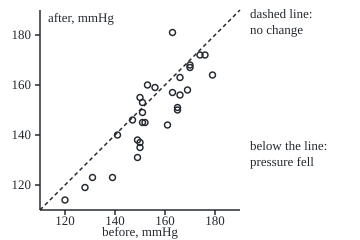
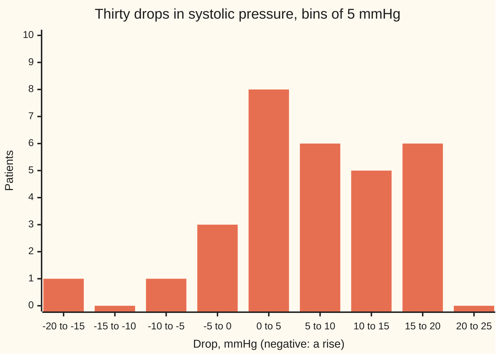

# t-tests: one sample, two samples, and paired

Probability and statistics → Confidence Intervals and Tests → Comparing averages → t-tests

---

## General Overview

Thirty patients with high blood pressure start a new drug. A nurse measures each one's systolic pressure (the higher number of the two, in millimetres of mercury, mmHg) before the first dose and again after eight weeks. Patient 1 goes from 152 to 145, a drop of 7. Patient 5 goes from 163 to 181, a rise of 18. Across all thirty the average drop is 6.0 mmHg.

Is that drop real? Blood pressure wobbles from day to day, and patients differ from each other by far more than 6. The question is whether 6 is large compared with how much an average of thirty drops would wobble if the true average change were zero.

The tool is the **t-test**, the term used from here on: divide the gap between what was seen and what was claimed by the estimate's standard error (its typical wobble from sample to sample), and look the ratio up in the t law (Student's t distribution, from [chi-square-t-and-f-distributions](../07-Sampling%20and%20Estimation/03-chi-square-t-and-f-distributions.md)). It has three shapes. The **one-sample** test compares one list with a fixed claim. The **paired** test subtracts each patient's two readings and runs the one-sample test on the differences. The **two-sample** test compares two separate groups, here the 15 women's drops against the 15 men's. On these data the paired test finds the drop at a ratio of 4.0263, a p-value of 0.000372; treating the before and after readings as two unrelated groups, the classic mistake, finds only 1.4983 and 0.139621.

**Every t-test is one ratio: the estimate minus the claimed value, divided by the estimate's own standard error; under the claim that ratio follows the t law whatever the unknown spread, so its tail area is an honest p-value, and the three tests differ only in what the estimate is and how its standard error is built.**

**What kind of fact this is:** a method. Its promise, that the test raises a false alarm exactly 5 times in 100 at the 5 percent level when readings are independent and normal, is a theorem proved on this card in Why it works, from the t law of [chi-square-t-and-f-distributions](../07-Sampling%20and%20Estimation/03-chi-square-t-and-f-distributions.md). Welch's version for unequal spreads is an approximation, and the card says how good.

### The picture: thirty patients, before against after

<p align="center"></p>

Each circle is one patient: pressure before across, after up, both to the same scale. The dashed line is "no change"; 25 of the 30 points lie below it. Along the line the points spread from about 120 to 180 mmHg: patients differ a lot from each other. Across the line they scatter far less: the drops spread 8.1621 mmHg. The paired test measures the average drop against the small spread; treating the two columns as unrelated groups measures it against the large one.

---

## The formula

Notation first, in words. Write $n$ for the number of patients and $d_i$ for patient i's drop, before minus after. A bar means an average: $\bar d$ is the average drop. The spread of the drops, their standard deviation estimated from the sample with n − 1 in the divisor as on [confidence-intervals](01-confidence-intervals.md), is $s_d$. The true mean drop of every patient who could take the drug is $\mu_d$ (mu), fixed and unknown. The claim under test, the **null hypothesis** of [hypothesis-tests-and-p-values](03-hypothesis-tests-and-p-values.md), says $\mu_d$ equals a stated number $\mu_0$ (mu-nought): 0 for "no average change".

**One sample and paired.** The paired test is the one-sample test run on the differences:

$$T = \frac{\bar d - \mu_0}{s_d/\sqrt n}, \qquad \text{degrees of freedom } n - 1$$

**Read it aloud:** the average drop's distance from the claimed value, counted in standard errors of the average.

**Two samples.** Group 1 (men) has $n_1$ patients, average $\bar x_1$ and spread $s_1$; group 2 (women) has $n_2$, $\bar x_2$ and $s_2$. Welch's statistic, the default:

$$T_W = \frac{\bar x_1 - \bar x_2}{\sqrt{s_1^2/n_1 + s_2^2/n_2}}, \qquad \nu = \frac{\left(s_1^2/n_1 + s_2^2/n_2\right)^2}{\dfrac{(s_1^2/n_1)^2}{n_1 - 1} + \dfrac{(s_2^2/n_2)^2}{n_2 - 1}}$$

**Read it aloud:** the gap between the two averages over the root of the two squared standard errors added, looked up in the t law with $\nu$ (nu) degrees of freedom, a number the data choose.

The older **pooled** test assumes the two groups share one spread and estimates it by $s_p$, a weighted blend of the two:

$$s_p^2 = \frac{(n_1 - 1)s_1^2 + (n_2 - 1)s_2^2}{n_1 + n_2 - 2}, \qquad T_P = \frac{\bar x_1 - \bar x_2}{s_p\sqrt{1/n_1 + 1/n_2}}, \qquad \text{degrees of freedom } n_1 + n_2 - 2$$

**The p-value**, two-sided: the chance under the claim of a ratio at least this far from 0 either way:

$$p = 2\,\bigl(1 - F_{\nu}(|t|)\bigr)$$

where $F_\nu$ is the t law's cumulative area with $\nu$ degrees of freedom and $t$ is the observed ratio.

| Symbol | Plain meaning | In our example | Push it up and the answer… |
| --- | --- | --- | --- |
| $n$ | number of patients, or pairs | 30 | shrinks the standard error like 1/√n |
| $d_i$ | patient i's drop, before minus after | 7, 2, 14, −3, −18, … mmHg | moves the average |
| $\bar d$ | average drop | 6.0 mmHg | pushes $T$ up |
| $s_d$ | spread of the drops, estimating their true spread σ | 8.1621 mmHg | pulls $T$ down |
| $\mu_d$, $\mu_0$ | true mean drop over all patients (fixed, unknown); the value claimed for it | unknown; 0, or the maker's 10 | a higher claim moves $T$ down |
| $T$, $t$, $T_W$, $T_P$ | the ratio before the data arrive; its value on these data; Welch's and the pooled two-sample ratios | 4.0263; 0.6646 for both two-sample ratios | further from 0 lowers the p-value |
| $n_1$, $n_2$ | sizes of the two groups | 15 men, 15 women | shrink the standard error |
| $\bar x_1$, $\bar x_2$ | the two groups' average drops | 7.0 and 5.0 mmHg | their gap drives $T_W$ |
| $s_1$, $s_2$ | the two groups' spreads | 6.4918 and 9.6806 mmHg | pull $T_W$ down |
| $s_p$ | pooled spread, assuming one shared spread | root of the blend above | pulls $T_P$ down |
| $r$ | correlation of before with after, from −1 to 1 | 0.8723 | shrinks the spread of the drops |
| $\nu$ | degrees of freedom of the t law used | 29 paired; 24.4735 Welch | thins the tails toward the bell's |
| $F_\nu$ | the t law's cumulative area left of a point | p = 0.000372 at $t$ = 4.0263, $\nu$ = 29 | — |
| $\alpha$, $t^*$ | chosen false-alarm rate; the t law's cutoff with α/2 beyond it | 0.05; 2.045230 | larger α: smaller $t^*$, narrower interval |
| $s_{\text{before}}$, $s_{\text{after}}$ | spreads of the before and after columns | 14.2444 and 16.6797 mmHg | widen the unpaired standard error |
| $\sigma$; $\sigma_1$, $\sigma_2$ | true spreads, unknown: of the drops; of the two groups | estimated by 8.1621; by 6.4918 and 9.6806 | widen every standard error |
| $Z$, $V$ | in the proof: the average in units of its true standard error; $(n-1)S^2/\sigma^2$ | standard normal; chi-square, 29 degrees of freedom | — |
| $D_i$, $\bar D$, $S$, $\bar X_k$, $S_k$, $S_p$, $n_k$ | in the proof: capital letters for drops, averages and spreads before the data arrive, k for the group | random versions of $d_i$, $\bar d$, $s_d$, … | — |

### When it holds

- **Independent patients.** Thirty readings from one clinic's faulty cuff act like fewer than thirty: the true standard error exceeds $s_d/\sqrt n$ and the p-value comes out too small.
- **The right shape for the data.** Two readings on one patient are tied together: here the before and after readings have correlation 0.8723. Analysed as two unrelated groups, the drop is measured against the spread between patients and the p-value rises from 0.000372 to 0.139621.
- **Normal readings, or enough of them.** The exact 5 percent needs normal differences (paired) or normal groups (two-sample). With thirty patients the central limit theorem makes the test close to right for most shapes. The far tail, where p is below 0.001, leans on normality hardest: an exact sign-flip test with no normal assumption gives 0.000543 here, against the t test's 0.000372.
- **Equal spreads, only for the pooled test.** With 5 patients spread 24 mmHg against 25 spread 8, the pooled test raises false alarms about 29 times in 100 at the 5 percent level (simulated, ± 0.7). Welch's test keeps about 5.6 in 100 (± 0.4).
- **Choices fixed in advance.** The claim, the side, and the number of patients are set before looking.

---

## Why it works

### Step 0: a ratio whose law does not depend on the unknown spread

Whether a 6 mmHg drop is large depends on the unknown spread of drops: ordinary if they spread by 20, extraordinary if by 2. Measured in units of its own estimated standard error, the average has one law, Student's t, whatever the spread. Its tail area is then computable, and is the p-value. A quantity whose law is free of the unknowns is a **pivot**, the device behind [confidence-intervals](01-confidence-intervals.md).

### Step 1: the one-sample ratio follows the t law

Suppose the drops are independent draws from one normal law with mean $\mu_d$ and spread σ (sigma). Three facts are proved on [chi-square-t-and-f-distributions](../07-Sampling%20and%20Estimation/03-chi-square-t-and-f-distributions.md). The average $\bar d$ is normal, centred at $\mu_d$, with spread $\sigma/\sqrt n$. The scaled spread $(n-1)s_d^2/\sigma^2$ follows the chi-square law with n − 1 degrees of freedom. The two are independent. A standard normal divided by the root of an independent chi-square over its degrees of freedom is t. Here σ cancels:

$$T = \frac{(\bar d - \mu_d)/(\sigma/\sqrt n)}{\sqrt{s_d^2/\sigma^2}} = \frac{\bar d - \mu_d}{s_d/\sqrt n}$$

So when the claim $\mu_d = \mu_0$ holds, $T$ follows the t law with n − 1 degrees of freedom. Here $T$ = 6.0 / 1.4902 = 4.0263 with 29 degrees of freedom, and the t law puts 0.000372 of its area beyond ±4.0263. If the true average change were zero, a ratio this far out would turn up in about 4 samples in 10,000.

The same ratio tests any claim. The maker says the mean drop is 10 mmHg. Then $T$ = (6.0 − 10)/1.4902 = −2.6842 and p = 0.011890: these patients are hard to square with 10.

### Step 2: pairing cancels what the patients share

Each reading carries the patient's own level, high for one and low for another, plus the day's wobble. Subtracting after from before removes the patient's level. The spread of a difference obeys

$$s_d^2 = s_{\text{before}}^2 + s_{\text{after}}^2 - 2\,r\,s_{\text{before}}\,s_{\text{after}}$$

where $r$ is the correlation of the two columns, a number from −1 to 1 measuring how closely they rise and fall together. Here the before readings spread 14.2444 mmHg and the after readings 16.6797, and r = 0.8723. The formula gives 66.6207, which is 8.1621 squared: the spread of the drops, computed straight from them. The −2 r term removes most of the between-patient spread. That is the whole gain from pairing.

Ignore the pairing and the standard error of the gap between the two column averages is the root of 14.2444 squared over 30 plus 16.6797 squared over 30: 4.0046 mmHg, not 1.4902. The same 6.0 mmHg gap becomes a ratio of 1.4983 and a p-value of 0.139621.

### Step 3: two separate groups

Men and women are different patients, so no pairing exists. The estimate is the gap between the groups' average drops, 7.0 − 5.0 = 2.0 mmHg. Averages of independent groups have variances that add, so the gap's standard error is the root of $s_1^2/n_1 + s_2^2/n_2$: 3.0095 mmHg. The ratio is 2.0 / 3.0095 = 0.6646.

Which t law? If both groups share one true spread, the pooled ratio $T_P$ follows the t law with $n_1 + n_2 - 2$ = 28 degrees of freedom exactly (proof below). If the spreads differ, no exact t law exists (the Behrens-Fisher problem). Welch matches the mean and variance of the estimated squared standard error to a scaled chi-square law, which yields the formula for $\nu$. Here the spreads are 6.4918 (men) and 9.6806 (women), $\nu$ = 24.4735, and p = 0.512545; the pooled test gives 0.511768. With equal group sizes the two ratios coincide and only the degrees of freedom differ. A 2 mmHg gap is well within what chance produces with 15 per group.

<details>
<summary>Detailed proof: the one-sample and pooled tests have size exactly α</summary>

Write α (alpha) for the chosen false-alarm rate, such as 0.05; a test's **size** is its actual false-alarm rate when the claim is true. Write $t^*$ for the t law's point with 1 − α/2 of its area to the left.

**One sample.** Let $D_1, \dots, D_n$, n ≥ 2, be independent normal with mean $\mu_0$ and spread σ > 0. By the chi-square-t-and-f card, $Z = (\bar D - \mu_0)/(\sigma/\sqrt n)$ is standard normal, $V = (n-1)S^2/\sigma^2$ is chi-square with n − 1 degrees of freedom, and Z and V are independent. Then $T = Z/\sqrt{V/(n-1)}$ follows the t law with n − 1 degrees of freedom, by that card's definition of the t law. The t law is continuous and symmetric, so $P(|T| > t^*) = 2 \cdot \alpha/2 = \alpha$. Nothing in this used σ, so the size is α at every σ > 0.

**Pooled two-sample.** Let group 1 be $n_1$ independent normal readings and group 2 be $n_2$ more, independent of group 1, all with one common mean and one common spread σ. The gap $\bar X_1 - \bar X_2$ is normal with mean 0 and variance $\sigma^2(1/n_1 + 1/n_2)$, since variances of independent quantities add. Each group gives $(n_k - 1)S_k^2/\sigma^2$, chi-square with $n_k - 1$ degrees of freedom, independent of its own average and of the other group. A sum of independent chi-squares is chi-square with the degrees of freedom added, so $(n_1 + n_2 - 2)S_p^2/\sigma^2$ is chi-square with $n_1 + n_2 - 2$ degrees of freedom and independent of the gap. Dividing the standardised gap by the root of that chi-square over its degrees of freedom, σ cancels and leaves $T_P$, which is therefore t with $n_1 + n_2 - 2$ degrees of freedom. The size is α by the same symmetry argument.

**Paired.** When each patient's two readings are jointly normal, their difference is normal, and independent across patients when the patients are. So the paired test is the one-sample test and inherits its exact size.

**Welch.** Write σ1 and σ2 for the two groups' true spreads. When they differ, $s_1^2/n_1 + s_2^2/n_2$ is a weighted sum of two independent chi-squares, not a scaled chi-square. Welch and Satterthwaite replace it by the scaled chi-square with the same mean and variance. Its variance, $2\sigma_1^4/(n_1^2(n_1-1)) + 2\sigma_2^4/(n_2^2(n_2-1))$, matched to $2(\sigma_1^2/n_1 + \sigma_2^2/n_2)^2/\nu$, gives the formula for $\nu$ with the sample spreads put in. The result is an approximation; the simulation below measures its size at about 5.6 percent (± 0.4) in a setting where the pooled test reaches about 29 (± 0.7).

</details>

### Step 4: from ratio to p-value and back to an interval

The p-value is the t law's area beyond the observed ratio on both sides: the chance, if the claim were true, of a ratio at least this extreme. It is not the chance that the claim is true.

The test at the 5 percent level rejects a claimed $\mu_0$ exactly when $|T|$ exceeds the cutoff 2.045230, which is exactly when $\mu_0$ lies outside the 95 percent t interval for the mean drop, 6.0 ± 2.045230 × 1.4902, or 2.9522 to 9.0478 mmHg. Zero and ten are outside: both rejected. Any claim from 3 to 9 mmHg survives. The interval says more than the p-value: it gives the size of the drop.

The same ratio says how many patients a repeat trial needs. **Power** is the chance the test catches a real effect of a stated size; [power-and-sample-size](04-power-and-sample-size.md) builds the rule for rates, and the same argument works for averages. To catch a true 6 mmHg drop 80 times in 100 at the 5 percent level, taking the drops' spread to be 8.1621 as in this trial, the true average drop must sit 1.959964 + 0.841621 = 2.8016 standard errors from 0: the bell's cutoff for a two-sided 5 percent test plus its cutoff for 80 percent. The standard error is 8.1621 over the root of the number of patients, so n = (2.8016 × 8.1621 / 6)^2 = 14.5. That rule uses the bell, but a t-test on so few patients has wider tails. Averaging the bell's chance over every spread the sample could show, by the chi-square law of Step 1, gives the exact power of the paired t-test: 0.7847 with 16 patients and 0.8119 with 17. Simulated paired trials of that size agree: 0.7805 ± 0.0065 and 0.8123 ± 0.0062. So 17 patients, not 15, give 80 percent power for a 6 mmHg drop.

A second road needs no t law. If there is no change on average and drops are symmetric about 0, each drop was as likely to be an equal rise, so every pattern of signs on the thirty drops is an equally likely no-change world. There are 1,073,741,824 such patterns, and a share of 0.000543 of them give an average as far from 0 as 6.0; against the claim of 10, 0.010861, beside the t test's 0.011890. Of all 155,117,520 ways to split the 30 drops into a men's and a women's group of 15, a share of 0.530955 give a gap as large as 2.0 mmHg, beside Welch's 0.512545. These are exact counts, not samples, so they carry no standard error. The verdicts agree. The far tail differs: flipping keeps each drop's size, so the real 6 mmHg shift itself widens the spread of the flipped averages, and areas below 0.001 are sensitive to such details. The counting road, the **sign test**, uses only that 25 of 30 patients dropped: if drops and rises were equally likely, 25 or more of either would occur with chance 0.000325.

---

## Worked numbers, by hand

The paired test on the thirty patients:

| Step | Arithmetic | Value |
| --- | --- | --- |
| drops $d_i$ | before minus after, patient by patient | 7, 2, 14, −3, −18, 13, … |
| average $\bar d$ | add the thirty drops, divide by 30 | 6.0 mmHg |
| spread $s_d$ | root of (squared distances from 6.0, added, over 29) | 8.1621 mmHg |
| standard error | 8.1621 / root of 30 | 1.4902 mmHg |
| ratio $t$ | (6.0 − 0) / 1.4902 | 4.0263 |
| degrees of freedom | 30 − 1 | 29 |
| p-value | 2 × t-law area beyond 4.0263 | 0.000372 |
| 95 percent interval | 6.0 ± 2.045230 × 1.4902 | 2.9522 to 9.0478 mmHg |
| **verdict** | p below 0.05; 0 outside the interval | **the drop is real: about 3 to 9 mmHg** |

The other two tests on the same patients:

| Test | Arithmetic | Value |
| --- | --- | --- |
| one-sample, claim 10 | (6.0 − 10) / 1.4902 | t = −2.6842, p = 0.011890 |
| two-sample, men 7.0 vs women 5.0 | 2.0 / root(6.4918^2/15 + 9.6806^2/15) = 2.0 / 3.0095 | t = 0.6646, ν = 24.4735, p = 0.512545 |

Systolic pressure fell by about 6 mmHg on average, plausibly anywhere from 3 to 9; whether the drug caused the fall needs a placebo arm. The maker's 10 is too high for these patients, and nothing here says men and women respond differently.

### The picture: are the drops close to normal?



Each bar counts the patients whose drop falls in that 5 mmHg bin, left end included. The bulk forms one rough hump between 0 and 20; the rise of 18 sits alone on the left. This is the check a paired t-test needs: no strong skew, no cluster of wild values. One stray point in thirty is tolerable, and the sign-flip and sign tests, which assume no normal law, agree with the verdict.

### What breaks if you drop a piece

| Mistake | Comes out at | What went wrong |
| --- | --- | --- |
| before and after tested as two unrelated groups | t = 1.4983, p = 0.139621; in simulation catches a true 6 mmHg drop about 23 times in 100 (± 0.7), against about 97.6 paired (± 0.2) | the standard error includes the 14 to 17 mmHg spread between patients, which pairing cancels |
| pooled test with unequal spreads and sizes | 5 patients spread 24 against 25 spread 8, no real difference: false alarm about 29 times in 100 at the 5 percent level (simulated, ± 0.7) | the pooled spread is dominated by the large, calm group; Welch keeps about 5.6 (± 0.4). Reversed, with the small group calm, pooling errs the other way and misses real gaps |
| one-sided test chosen after seeing the drop | p = 0.000186, half the two-sided 0.000372 | picking the side after looking doubles the false-alarm rate |

---

## Code, from first principles, and it actually runs

The code runs the three t-tests by three roads. Road 1 finds each t area by substituting an angle (u = √ν tan θ) and integrating with Simpson's rule (a weighted sum of heights at evenly spaced points), for any degrees of freedom. Road 2 is the closed form for whole-number degrees of freedom. Road 3 uses no t law: exact sign-flip, label-shuffle and sign-test p-values, by counting every subset of the drops by size and sum. The exact power averages the bell's chance over the chi-square law of the sample spread. Simulated trials (SplitMix64, seed 20260928; Box-Muller turns uniform draws into bell-shaped ones) measure false-alarm rates and power. Asserts set the two t roads, the pairing identity, the subset counts and the randomisation p-values against each other, the simulated false-alarm rates against 0.05, and the exact power against simulation at 16, 17 and 30 patients, with 16 short of 80 percent and 17 past it.

### Python

```python
# t-tests -- the check behind the card.  Standard library only.  30 patients' systolic blood pressure (mmHg)
# before and after 8 weeks on a drug.  Road 1: t areas by Simpson over an angle.  Road 2: the closed-form t
# area.  Road 3: exact sign-flip, shuffle and sign tests by counting, no t law.  Then sample size and simulations.
from math import sqrt, pi, cos, sin, atan, log, exp, comb as choose
from functools import reduce

BEFORE = [152, 151, 165, 156, 163, 150, 150, 151, 128, 166, 131, 139, 161, 153, 163,
          174, 176, 170, 149, 179, 141, 151, 165, 149, 150, 147, 170, 120, 169, 166]
AFTER = [145, 149, 151, 159, 181, 137, 155, 145, 119, 156, 123, 123, 144, 160, 157,
         172, 172, 168, 131, 164, 140, 153, 150, 138, 135, 146, 167, 114, 158, 163]
CLAIM, NOISE, SIM, SEED = 10.0, 8.0, 4000, 20260928     # patients 1-15 women, 16-30 men

def total(xs): return reduce(lambda a, b: a + b, xs, 0.0)    # plain left-to-right sum
def mean(xs): return total(xs) / len(xs)
def sd(xs):
    m = mean(xs)
    return sqrt(total((x - m) ** 2 for x in xs) / (len(xs) - 1))

def simpson(f, a, b, m=600):                 # integral of f from a to b, m even
    h = (b - a) / m
    return (f(a) + f(b) + total((4 if i % 2 else 2) * f(a + i * h) for i in range(1, m))) * h / 3

def t_area_angle(x, v):                      # road 1: any v > 0, u = root(v) tan(th)
    g = lambda th: cos(th) ** (v - 1)
    return 0.5 + 0.5 * simpson(g, 0.0, atan(x / sqrt(v))) / simpson(g, 0.0, pi / 2)

def t_area_closed(x, v):                     # road 2: whole-number v, closed form
    th = atan(x / sqrt(v))
    c2, term, total = cos(th) ** 2, 1.0, 1.0
    if v % 2 == 0:
        for j in range(1, v // 2):
            term *= c2 * (2 * j - 1) / (2 * j)
            total += term
        return 0.5 + sin(th) * total / 2
    for j in range(1, (v - 1) // 2):
        term *= c2 * (2 * j) / (2 * j + 1)
        total += term
    return 0.5 + (th + (sin(th) * cos(th) * total if v > 1 else 0.0)) / pi
def p_two(t, v, area): return 2 * (1 - area(abs(t), v))
def cutoff(area, p):                         # bisection: area(x) = p
    lo, hi = 0.0, 10.0
    for _ in range(60):
        mid = (lo + hi) / 2
        lo, hi = (mid, hi) if area(mid) < p else (lo, mid)
    return (lo + hi) / 2

def phi(x): return 0.5 + simpson(lambda u: exp(-u * u / 2), 0.0, x) / sqrt(2 * pi)   # the bell's area left of x
def power(m, gap, s):                        # exact paired-t power at 5%: the bell's chance averaged over chi-square
    k, ts, c, dens = m - 1, cutoff(lambda x: t_area_closed(x, m - 1), 0.975), gap * sqrt(m) / s, lambda v: v ** (k / 2 - 1) * exp(-v / 2)
    return simpson(lambda v: dens(v) * (phi(c - ts * sqrt(v / k)) + phi(-c - ts * sqrt(v / k))), 0.0, 6.0 * k) / simpson(dens, 0.0, 6.0 * k)

def welch(a, b):                             # t and Welch's degrees of freedom
    va, vb = sd(a) ** 2 / len(a), sd(b) ** 2 / len(b)
    return (mean(a) - mean(b)) / sqrt(va + vb), (va + vb) ** 2 / (va ** 2 / (len(a) - 1) + vb ** 2 / (len(b) - 1))
def pooled(a, b):
    na, nb = len(a), len(b)
    sp2 = ((na - 1) * sd(a) ** 2 + (nb - 1) * sd(b) ** 2) / (na + nb - 2)
    return (mean(a) - mean(b)) / sqrt(sp2 * (1 / na + 1 / nb)), na + nb - 2

n = len(BEFORE)
d = [b - a for b, a in zip(BEFORE, AFTER)]                 # drop, mmHg
dbar, sdd = mean(d), sd(d)
se = sdd / sqrt(n)
t0, t10 = dbar / se, (dbar - CLAIM) / se
tstar = cutoff(lambda x: t_area_closed(x, n - 1), 0.975)
print(f"drops: {d}")
print(f"n {n}, mean drop {dbar:.4f}, s {sdd:.4f}, standard error {se:.4f} mmHg")
print(f"before: mean {mean(BEFORE):.4f} s {sd(BEFORE):.4f}; after: mean {mean(AFTER):.4f} s {sd(AFTER):.4f}")
print(f"paired t vs 0: t {t0:.4f}, df {n - 1}, p road 1 {p_two(t0, n - 1, t_area_angle):.6f}, road 2 {p_two(t0, n - 1, t_area_closed):.6f}, one-sided {p_two(t0, n - 1, t_area_closed) / 2:.6f}")
print(f"one-sample t vs claim {CLAIM:.0f}: t {t10:.4f}, p road 1 {p_two(t10, n - 1, t_area_angle):.6f}, road 2 {p_two(t10, n - 1, t_area_closed):.6f}")
print(f"t cutoff 0.975, df {n - 1}: {tstar:.6f}; 95% interval for mean drop [{dbar - tstar * se:.4f}, {dbar + tstar * se:.4f}]")
(tw, vw), (tp, vp) = welch(BEFORE, AFTER), pooled(BEFORE, AFTER)
print(f"mistake, before vs after as independent: se {dbar / tw:.4f}, Welch t {tw:.4f} df {vw:.4f} p {p_two(tw, vw, t_area_angle):.6f}; pooled t {tp:.4f} p {p_two(tp, vp, t_area_closed):.6f}")
r = total((b - mean(BEFORE)) * (a - mean(AFTER)) for b, a in zip(BEFORE, AFTER)) / ((n - 1) * sd(BEFORE) * sd(AFTER))
print(f"  correlation before-after {r:.4f}; s^2(before)+s^2(after)-2 r s s = {sd(BEFORE)**2 + sd(AFTER)**2 - 2*r*sd(BEFORE)*sd(AFTER):.4f} = s_d^2 {sdd**2:.4f}")
wom, men = d[:15], d[15:]
(tw2, vw2), (tp2, vp2) = welch(men, wom), pooled(men, wom)
print(f"two-sample, men vs women: means {mean(men):.4f} {mean(wom):.4f}, s {sd(men):.4f} {sd(wom):.4f}, se {(mean(men) - mean(wom)) / tw2:.4f}")
print(f"  Welch t {tw2:.4f} df {vw2:.4f} p road 1 {p_two(tw2, vw2, t_area_angle):.6f}; pooled t {tp2:.4f} df {vp2} p {p_two(tp2, vp2, t_area_closed):.6f}")
bins = [sum(lo <= x < lo + 5 for x in d) for lo in range(-20, 25, 5)]
print(f"histogram of drops, bins of 5 from -20 to 25: {bins}")
k, m0 = sum(x > 0 for x in d), sum(x != 0 for x in d)
comb, tail = 1, 0                                           # exact sign test by counting
for j in range(0, min(k, m0 - k) + 1):
    tail += comb
    comb = comb * (m0 - j) // (j + 1)
print(f"sign test: {k} of {m0} dropped, exact two-sided p {min(1.0, 2 * tail / 2 ** m0):.6f}")
sub, T = {(0, 0): 1}, sum(d)                 # road 3: count every subset of the drops by its size k and sum s
for x in d: sub = {key: sub.get(key, 0) + sub.get((key[0] - 1, key[1] - x), 0) for key in set(sub) | {(k + 1, s + x) for k, s in sub}}
pe = [sum(c for (k, s), c in sub.items() if abs(2 * (s - mu * k) - (T - mu * n)) >= abs(T - mu * n) - 1e-9) / 2 ** n for mu in (0, CLAIM)]
pe.append(sum(c for (k, s), c in sub.items() if k == 15 and abs(2 * s - T) >= abs(2 * sum(men) - T)) / choose(n, 15))
print(f"exact randomisation p, all {2 ** n} sign patterns: vs 0 {pe[0]:.6f}, vs {CLAIM:.0f} {pe[1]:.6f}; all {choose(n, 15)} splits, men vs women {pe[2]:.6f}")
z = [cutoff(phi, q) for q in (0.975, 0.80)]
print(f"sample size, power 0.80 at a 6 mmHg drop, s {sdd:.4f}: z {z[0]:.6f} + {z[1]:.6f} = {sum(z):.4f}, normal rule n {(sum(z) * sdd / 6) ** 2:.1f}; exact t power n 16 {power(16, 6.0, sdd):.4f}, n 17 {power(17, 6.0, sdd):.4f}")

MASK, state = (1 << 64) - 1, SEED
def splitmix():                              # SplitMix64, seed 20260928
    global state
    state = (state + 0x9E3779B97F4A7C15) & MASK
    x = state
    x = ((x ^ (x >> 30)) * 0xBF58476D1CE4E5B9) & MASK
    x = ((x ^ (x >> 27)) * 0x94D049BB133111EB) & MASK
    return x ^ (x >> 31)
def unif(): return ((splitmix() >> 11) + 0.5) / 9007199254740992.0
def normal(): return sqrt(-2 * log(unif())) * cos(2 * pi * unif())

rate = lambda gen, test: sum(test(*gen()) < 0.05 for _ in range(SIM)) / SIM   # share with p < 0.05
def trial(drop):
    b = [152 + 13 * normal() for _ in range(n)]
    return b, [x - drop - NOISE * normal() for x in b]
pair = lambda b, a: p_two(mean([x - y for x, y in zip(b, a)]) / (sd([x - y for x, y in zip(b, a)]) / sqrt(n)), n - 1, t_area_closed)
unpair = lambda b, a: p_two(*welch(b, a), t_area_angle)
uneq = lambda: ([150 + 24 * normal() for _ in range(5)], [150 + 8 * normal() for _ in range(25)])
rows = [("paired, no real drop", rate(lambda: trial(0), pair)), ("paired, drop 6", rate(lambda: trial(6), pair)),
        ("unpaired, drop 6", rate(lambda: trial(6), unpair)),
        ("pooled, n 5 vs 25, s 24 vs 8, no difference", rate(uneq, lambda a, b: p_two(*pooled(a, b), t_area_closed))),
        ("Welch, same setting", rate(uneq, lambda a, b: p_two(*welch(a, b), t_area_angle)))]
rows += [(f"paired, n {m}, drop 6, spread as in the trial", rate(lambda: ([6 + sdd * normal() for _ in range(m)],), lambda dd: p_two(mean(dd) / (sd(dd) / sqrt(len(dd))), len(dd) - 1, t_area_closed))) for m in (16, 17)]
print(f"simulation, {SIM} trials each, share with p < 0.05:")
for nm, p in rows:
    print(f"  {nm:45s} {p:.4f} +/- {sqrt(p * (1 - p) / SIM):.4f}")
fig = [f"{40 + 2.5 * (b - 110):.1f} {210 - 2.5 * (a - 110):.1f}" for b, a in zip(BEFORE, AFTER)]
for i in range(0, n, 10): print("figure, points " + ", ".join(fig[i:i + 10]))

assert abs(p_two(t0, n - 1, t_area_angle) - p_two(t0, n - 1, t_area_closed)) < 1e-9   # two roads, odd df
assert abs(p_two(tp2, vp2, t_area_angle) - p_two(tp2, vp2, t_area_closed)) < 1e-9      # two roads, even df
assert abs(sdd ** 2 - (sd(BEFORE) ** 2 + sd(AFTER) ** 2 - 2 * r * sd(BEFORE) * sd(AFTER))) < 1e-9
assert abs(tp2 - tw2) < 1e-12                                      # equal sizes: same ratio
assert 14 <= vw2 <= vp2                                            # nu between 14 and 28
assert sum(sub.values()) == 2 ** n                                 # every sign pattern counted once
assert 2 * sum(c * s for (k, s), c in sub.items() if k == 15) == choose(n, 15) * T   # each drop is in half the splits
assert abs(pe[1] - p_two(t10, n - 1, t_area_closed)) < 0.15 * p_two(t10, n - 1, t_area_closed)   # exact flips and t within 15%
assert abs(pe[2] - p_two(tw2, vw2, t_area_angle)) < 0.05          # shuffle and Welch: different tests, near p
assert abs(rows[0][1] - 0.05) < 4 * sqrt(0.05 * 0.95 / SIM)        # paired t keeps its 5 percent
assert rows[3][1] - 0.05 > 4 * sqrt(0.05 * 0.95 / SIM)             # pooled t breaks with unequal spreads
assert abs(rows[4][1] - 0.05) < 4 * sqrt(0.05 * 0.95 / SIM)        # Welch repairs it
assert abs(power(n, 6.0, NOISE) - rows[1][1]) < 4 * sqrt(rows[1][1] * (1 - rows[1][1]) / SIM)   # exact power vs simulated
assert all(abs(power(16 + i, 6.0, sdd) - rows[5 + i][1]) < 4 * sqrt(rows[5 + i][1] * (1 - rows[5 + i][1]) / SIM) for i in (0, 1))   # small n too
assert power(16, 6.0, sdd) < 0.80 < power(17, 6.0, sdd)            # 17 patients, not 16, reach 80 percent
print("ALL CHECKS PASS")
```

**Ran 2026-10-06 on macOS, Python 3.14.6, standard library only. All checks passed. Output, pasted from the run:**

```
drops: [7, 2, 14, -3, -18, 13, -5, 6, 9, 10, 8, 16, 17, -7, 6, 2, 4, 2, 18, 15, 1, -2, 15, 11, 15, 1, 3, 6, 11, 3]
n 30, mean drop 6.0000, s 8.1621, standard error 1.4902 mmHg
before: mean 155.1667 s 14.2444; after: mean 149.1667 s 16.6797
paired t vs 0: t 4.0263, df 29, p road 1 0.000372, road 2 0.000372, one-sided 0.000186
one-sample t vs claim 10: t -2.6842, p road 1 0.011890, road 2 0.011890
t cutoff 0.975, df 29: 2.045230; 95% interval for mean drop [2.9522, 9.0478]
mistake, before vs after as independent: se 4.0046, Welch t 1.4983 df 56.6128 p 0.139621; pooled t 1.4983 p 0.139489
  correlation before-after 0.8723; s^2(before)+s^2(after)-2 r s s = 66.6207 = s_d^2 66.6207
two-sample, men vs women: means 7.0000 5.0000, s 6.4918 9.6806, se 3.0095
  Welch t 0.6646 df 24.4735 p road 1 0.512545; pooled t 0.6646 df 28 p 0.511768
histogram of drops, bins of 5 from -20 to 25: [1, 0, 1, 3, 8, 6, 5, 6, 0]
sign test: 25 of 30 dropped, exact two-sided p 0.000325
exact randomisation p, all 1073741824 sign patterns: vs 0 0.000543, vs 10 0.010861; all 155117520 splits, men vs women 0.530955
sample size, power 0.80 at a 6 mmHg drop, s 8.1621: z 1.959964 + 0.841621 = 2.8016, normal rule n 14.5; exact t power n 16 0.7847, n 17 0.8119
simulation, 4000 trials each, share with p < 0.05:
  paired, no real drop                          0.0490 +/- 0.0034
  paired, drop 6                                0.9762 +/- 0.0024
  unpaired, drop 6                              0.2288 +/- 0.0066
  pooled, n 5 vs 25, s 24 vs 8, no difference   0.2855 +/- 0.0071
  Welch, same setting                           0.0558 +/- 0.0036
  paired, n 16, drop 6, spread as in the trial  0.7805 +/- 0.0065
  paired, n 17, drop 6, spread as in the trial  0.8123 +/- 0.0062
figure, points 145.0 122.5, 142.5 112.5, 177.5 107.5, 155.0 87.5, 172.5 32.5, 140.0 142.5, 140.0 97.5, 142.5 122.5, 85.0 187.5, 180.0 95.0
figure, points 92.5 177.5, 112.5 177.5, 167.5 125.0, 147.5 85.0, 172.5 92.5, 200.0 55.0, 205.0 55.0, 190.0 65.0, 137.5 157.5, 212.5 75.0
figure, points 117.5 135.0, 142.5 102.5, 177.5 110.0, 137.5 140.0, 140.0 147.5, 132.5 120.0, 190.0 67.5, 65.0 200.0, 187.5 90.0, 180.0 77.5
ALL CHECKS PASS
```

### Rust

Same numbers, same labels, built with `rustc --edition 2021 -O`.

```rust
// t-tests -- the same check as the Python, in Rust.  No crates.  30 patients' systolic blood pressure (mmHg)
// before and after 8 weeks on a drug.  Road 1: t areas by Simpson over an angle.  Road 2: the closed-form t
// area.  Road 3: exact sign-flip, shuffle and sign tests by counting, no t law.  Then sample size and simulations.
use std::f64::consts::PI;

const BEFORE: [i64; 30] = [152, 151, 165, 156, 163, 150, 150, 151, 128, 166, 131, 139, 161, 153, 163,
    174, 176, 170, 149, 179, 141, 151, 165, 149, 150, 147, 170, 120, 169, 166];
const AFTER: [i64; 30] = [145, 149, 151, 159, 181, 137, 155, 145, 119, 156, 123, 123, 144, 160, 157,
    172, 172, 168, 131, 164, 140, 153, 150, 138, 135, 146, 167, 114, 158, 163];
const CLAIM: f64 = 10.0; const NOISE: f64 = 8.0; const SIM: usize = 4000; const SEED: u64 = 20260928;

fn mean(xs: &[f64]) -> f64 { xs.iter().fold(0.0, |a, x| a + x) / xs.len() as f64 }
fn sd(xs: &[f64]) -> f64 { let m = mean(xs); (xs.iter().fold(0.0, |a, x| a + (x - m).powi(2)) / (xs.len() - 1) as f64).sqrt() }

fn simpson<F: Fn(f64) -> f64>(f: F, a: f64, b: f64) -> f64 {   // integral of f, 600 steps
    let m = 600;
    let h = (b - a) / m as f64;
    let mut acc = 0.0;
    for i in 1..m { acc += (if i % 2 == 1 { 4.0 } else { 2.0 }) * f(a + i as f64 * h) }
    (f(a) + f(b) + acc) * h / 3.0
}

fn t_area_angle(x: f64, v: f64) -> f64 {         // road 1: any v > 0, u = root(v) tan(th)
    let g = |th: f64| th.cos().powf(v - 1.0);
    0.5 + 0.5 * simpson(g, 0.0, (x / v.sqrt()).atan()) / simpson(g, 0.0, PI / 2.0)
}

fn t_area_closed(x: f64, v: usize) -> f64 {      // road 2: whole-number v, closed form
    let th = (x / (v as f64).sqrt()).atan();
    let (c2, mut term, mut total) = (th.cos().powi(2), 1.0, 1.0);
    if v % 2 == 0 {
        for j in 1..v / 2 {
            term *= c2 * (2 * j - 1) as f64 / (2 * j) as f64;
            total += term;
        }
        return 0.5 + th.sin() * total / 2.0;
    }
    for j in 1..(v - 1) / 2 {
        term *= c2 * (2 * j) as f64 / (2 * j + 1) as f64;
        total += term;
    }
    0.5 + (th + if v > 1 { th.sin() * th.cos() * total } else { 0.0 }) / PI
}
fn p_ang(t: f64, v: f64) -> f64 { 2.0 * (1.0 - t_area_angle(t.abs(), v)) }
fn p_cl(t: f64, v: usize) -> f64 { 2.0 * (1.0 - t_area_closed(t.abs(), v)) }
fn cutoff<F: Fn(f64) -> f64>(area: F, p: f64) -> f64 {   // bisection: area(x) = p
    let (mut lo, mut hi) = (0.0, 10.0);
    for _ in 0..60 { let mid = (lo + hi) / 2.0; if area(mid) < p { lo = mid } else { hi = mid } }
    (lo + hi) / 2.0
}
fn phi(x: f64) -> f64 { 0.5 + simpson(|u: f64| (-u * u / 2.0).exp(), 0.0, x) / (2.0 * PI).sqrt() }   // the bell's area left of x
fn power(m: usize, gap: f64, s: f64) -> f64 {    // exact paired-t power at 5%: the bell's chance averaged over chi-square
    let (k, ts, c) = ((m - 1) as f64, cutoff(|x| t_area_closed(x, m - 1), 0.975), gap * (m as f64).sqrt() / s); let dens = |v: f64| v.powf(k / 2.0 - 1.0) * (-v / 2.0).exp();
    simpson(|v| dens(v) * (phi(c - ts * (v / k).sqrt()) + phi(-c - ts * (v / k).sqrt())), 0.0, 6.0 * k) / simpson(dens, 0.0, 6.0 * k)
}
fn welch(a: &[f64], b: &[f64]) -> (f64, f64) {   // t and Welch's degrees of freedom
    let (va, vb) = (sd(a).powi(2) / a.len() as f64, sd(b).powi(2) / b.len() as f64);
    ((mean(a) - mean(b)) / (va + vb).sqrt(),
     (va + vb).powi(2) / (va.powi(2) / (a.len() - 1) as f64 + vb.powi(2) / (b.len() - 1) as f64))
}
fn pooled(a: &[f64], b: &[f64]) -> (f64, usize) {
    let (na, nb) = (a.len(), b.len());
    let sp2 = ((na - 1) as f64 * sd(a).powi(2) + (nb - 1) as f64 * sd(b).powi(2)) / (na + nb - 2) as f64;
    ((mean(a) - mean(b)) / (sp2 * (1.0 / na as f64 + 1.0 / nb as f64)).sqrt(), na + nb - 2)
}

struct Rng(u64);
impl Rng {
    fn splitmix(&mut self) -> u64 {              // SplitMix64, seed 20260928
        self.0 = self.0.wrapping_add(0x9E3779B97F4A7C15);
        let mut x = self.0;
        x = (x ^ (x >> 30)).wrapping_mul(0xBF58476D1CE4E5B9);
        x = (x ^ (x >> 27)).wrapping_mul(0x94D049BB133111EB);
        x ^ (x >> 31)
    }
    fn unif(&mut self) -> f64 { ((self.splitmix() >> 11) as f64 + 0.5) / 9007199254740992.0 }
    fn normal(&mut self) -> f64 { let r = (-2.0 * self.unif().ln()).sqrt(); r * (2.0 * PI * self.unif()).cos() }
    fn normals(&mut self, k: usize, mu: f64, s: f64) -> Vec<f64> { (0..k).map(|_| mu + s * self.normal()).collect() }
}

fn main() {
    let n = BEFORE.len();
    let (bf, af): (Vec<f64>, Vec<f64>) = (BEFORE.iter().map(|&x| x as f64).collect(), AFTER.iter().map(|&x| x as f64).collect());
    let di: Vec<i64> = BEFORE.iter().zip(AFTER.iter()).map(|(b, a)| b - a).collect();   // drop, mmHg
    let d: Vec<f64> = di.iter().map(|&x| x as f64).collect();
    let (dbar, sdd) = (mean(&d), sd(&d));
    let se = sdd / (n as f64).sqrt();
    let (t0, t10) = (dbar / se, (dbar - CLAIM) / se);
    let tstar = cutoff(|x| t_area_closed(x, n - 1), 0.975);
    println!("drops: {:?}", di);
    println!("n {}, mean drop {:.4}, s {:.4}, standard error {:.4} mmHg", n, dbar, sdd, se);
    println!("before: mean {:.4} s {:.4}; after: mean {:.4} s {:.4}", mean(&bf), sd(&bf), mean(&af), sd(&af));
    println!("paired t vs 0: t {:.4}, df {}, p road 1 {:.6}, road 2 {:.6}, one-sided {:.6}", t0, n - 1, p_ang(t0, (n - 1) as f64), p_cl(t0, n - 1), p_cl(t0, n - 1) / 2.0);
    println!("one-sample t vs claim {:.0}: t {:.4}, p road 1 {:.6}, road 2 {:.6}", CLAIM, t10, p_ang(t10, (n - 1) as f64), p_cl(t10, n - 1));
    println!("t cutoff 0.975, df {}: {:.6}; 95% interval for mean drop [{:.4}, {:.4}]", n - 1, tstar, dbar - tstar * se, dbar + tstar * se);
    let ((tw, vw), (tp, vp)) = (welch(&bf, &af), pooled(&bf, &af));
    println!("mistake, before vs after as independent: se {:.4}, Welch t {:.4} df {:.4} p {:.6}; pooled t {:.4} p {:.6}", dbar / tw, tw, vw, p_ang(tw, vw), tp, p_cl(tp, vp));
    let r = bf.iter().zip(af.iter()).fold(0.0, |acc, (b, a)| acc + (b - mean(&bf)) * (a - mean(&af))) / ((n - 1) as f64 * sd(&bf) * sd(&af));
    let ident = sd(&bf).powi(2) + sd(&af).powi(2) - 2.0 * r * sd(&bf) * sd(&af);
    println!("  correlation before-after {:.4}; s^2(before)+s^2(after)-2 r s s = {:.4} = s_d^2 {:.4}", r, ident, sdd.powi(2));
    let (wom, men) = (&d[..15], &d[15..]);
    let ((tw2, vw2), (tp2, vp2)) = (welch(men, wom), pooled(men, wom));
    println!("two-sample, men vs women: means {:.4} {:.4}, s {:.4} {:.4}, se {:.4}", mean(men), mean(wom), sd(men), sd(wom), (mean(men) - mean(wom)) / tw2);
    println!("  Welch t {:.4} df {:.4} p road 1 {:.6}; pooled t {:.4} df {} p {:.6}", tw2, vw2, p_ang(tw2, vw2), tp2, vp2, p_cl(tp2, vp2));
    let bins: Vec<usize> = (-20..25).step_by(5).map(|lo| di.iter().filter(|&&x| lo <= x && x < lo + 5).count()).collect();
    println!("histogram of drops, bins of 5 from -20 to 25: {:?}", bins);
    let (k, m0) = (di.iter().filter(|&&x| x > 0).count() as u128, di.iter().filter(|&&x| x != 0).count() as u128);
    let (mut comb, mut tail) = (1u128, 0u128);   // exact sign test by counting
    for j in 0..=k.min(m0 - k) {
        tail += comb;
        comb = comb * (m0 - j) / (j + 1);
    }
    println!("sign test: {} of {} dropped, exact two-sided p {:.6}", k, m0, (2.0 * tail as f64 / 2f64.powi(m0 as i32)).min(1.0));
    let mut sub = vec![vec![0u64; 601]; n + 1];  // road 3: count every subset of the drops by its size k and sum s - 300
    sub[0][300] = 1;
    for &x in &di { for k in (0..n).rev() { for s in 0..601 { let c = sub[k][s]; if c > 0 { sub[k + 1][(s as i64 + x) as usize] += c } } } }
    let (tt, c15) = (di.iter().sum::<i64>() as f64, (1..=15u64).fold(1u64, |c, j| c * (15 + j) / j));   // C(30, 15)
    let flip = |mu: f64| (0..=n).map(|k| (0..601).filter(|&s| (2.0 * (s as f64 - 300.0 - mu * k as f64) - (tt - mu * n as f64)).abs() >= (tt - mu * n as f64).abs() - 1e-9).map(|s| sub[k][s]).sum::<u64>()).sum::<u64>() as f64 / 2f64.powi(n as i32);
    let pe = [flip(0.0), flip(CLAIM), (0..601).filter(|&s| (2.0 * (s as f64 - 300.0) - tt).abs() >= (2.0 * di[15..].iter().sum::<i64>() as f64 - tt).abs()).map(|s| sub[15][s]).sum::<u64>() as f64 / c15 as f64];
    println!("exact randomisation p, all {} sign patterns: vs 0 {:.6}, vs {:.0} {:.6}; all {} splits, men vs women {:.6}", 1u64 << n, pe[0], CLAIM, pe[1], c15, pe[2]);
    let z = [cutoff(phi, 0.975), cutoff(phi, 0.80)];
    println!("sample size, power 0.80 at a 6 mmHg drop, s {:.4}: z {:.6} + {:.6} = {:.4}, normal rule n {:.1}; exact t power n 16 {:.4}, n 17 {:.4}", sdd, z[0], z[1], z[0] + z[1], ((z[0] + z[1]) * sdd / 6.0).powi(2), power(16, 6.0, sdd), power(17, 6.0, sdd));

    let mut rng = Rng(SEED);
    let mut rates = Vec::new();                  // share of SIM simulated trials with p < 0.05
    for case in 0..7 {
        let mut hits = 0;
        for _ in 0..SIM {
            let p = if case < 3 {
                let b = rng.normals(n, 152.0, 13.0);
                let drop = if case == 0 { 0.0 } else { 6.0 };
                let a: Vec<f64> = b.iter().map(|x| x - drop - NOISE * rng.normal()).collect();
                let dd: Vec<f64> = b.iter().zip(a.iter()).map(|(x, y)| x - y).collect();
                if case < 2 { p_cl(mean(&dd) / (sd(&dd) / (n as f64).sqrt()), n - 1) } else { let (t, v) = welch(&b, &a); p_ang(t, v) }
            } else if case < 5 {
                let (a, b) = (rng.normals(5, 150.0, 24.0), rng.normals(25, 150.0, 8.0));
                if case == 3 { let (t, v) = pooled(&a, &b); p_cl(t, v) } else { let (t, v) = welch(&a, &b); p_ang(t, v) }
            } else {
                let dd = rng.normals(11 + case, 6.0, sdd);   // case 5: 16 patients, case 6: 17
                p_cl(mean(&dd) / (sd(&dd) / (dd.len() as f64).sqrt()), dd.len() - 1)
            };
            if p < 0.05 { hits += 1 }
        }
        rates.push(hits as f64 / SIM as f64);
    }
    let names = ["paired, no real drop", "paired, drop 6", "unpaired, drop 6", "pooled, n 5 vs 25, s 24 vs 8, no difference", "Welch, same setting", "paired, n 16, drop 6, spread as in the trial", "paired, n 17, drop 6, spread as in the trial"];
    println!("simulation, {} trials each, share with p < 0.05:", SIM);
    for (nm, p) in names.iter().zip(rates.iter()) {
        println!("  {:45} {:.4} +/- {:.4}", nm, p, (p * (1.0 - p) / SIM as f64).sqrt());
    }
    let fig: Vec<String> = bf.iter().zip(af.iter()).map(|(b, a)| format!("{:.1} {:.1}", 40.0 + 2.5 * (b - 110.0), 210.0 - 2.5 * (a - 110.0))).collect();
    for i in (0..n).step_by(10) { println!("figure, points {}", fig[i..i + 10].join(", ")) }

    assert!((p_ang(t0, (n - 1) as f64) - p_cl(t0, n - 1)).abs() < 1e-9);        // two roads, odd df
    assert!((p_ang(tp2, vp2 as f64) - p_cl(tp2, vp2)).abs() < 1e-9);            // two roads, even df
    assert!((sdd.powi(2) - ident).abs() < 1e-9);
    assert!((tp2 - tw2).abs() < 1e-12);                                      // equal sizes: same ratio
    assert!((14.0..=vp2 as f64).contains(&vw2));                              // nu between 14 and 28
    assert_eq!(sub.iter().map(|r| r.iter().sum::<u64>()).sum::<u64>(), 1u64 << n);   // every sign pattern counted once
    assert_eq!(2 * (0..601).map(|s| (s as i64 - 300) * sub[15][s] as i64).sum::<i64>(), c15 as i64 * tt as i64);   // each drop is in half the splits
    assert!((pe[1] - p_cl(t10, n - 1)).abs() < 0.15 * p_cl(t10, n - 1));   // exact flips and t within 15%
    assert!((pe[2] - p_ang(tw2, vw2)).abs() < 0.05);              // shuffle and Welch: different tests, near p
    assert!((rates[0] - 0.05).abs() < 4.0 * (0.05f64 * 0.95 / SIM as f64).sqrt());   // paired t keeps its 5 percent
    assert!(rates[3] - 0.05 > 4.0 * (0.05f64 * 0.95 / SIM as f64).sqrt());           // pooled t breaks with unequal spreads
    assert!((rates[4] - 0.05).abs() < 4.0 * (0.05f64 * 0.95 / SIM as f64).sqrt());   // Welch repairs it
    assert!((power(n, 6.0, NOISE) - rates[1]).abs() < 4.0 * (rates[1] * (1.0 - rates[1]) / SIM as f64).sqrt());   // exact power vs simulated
    for i in 0..2 { assert!((power(16 + i, 6.0, sdd) - rates[5 + i]).abs() < 4.0 * (rates[5 + i] * (1.0 - rates[5 + i]) / SIM as f64).sqrt()); }   // small n too
    assert!(power(16, 6.0, sdd) < 0.80 && 0.80 < power(17, 6.0, sdd));    // 17 patients, not 16, reach 80 percent
    println!("ALL CHECKS PASS");
}
```

**Ran 2026-10-06 on macOS, rustc 1.98.1, no crates. All checks passed. Output, pasted from the run:**

```
drops: [7, 2, 14, -3, -18, 13, -5, 6, 9, 10, 8, 16, 17, -7, 6, 2, 4, 2, 18, 15, 1, -2, 15, 11, 15, 1, 3, 6, 11, 3]
n 30, mean drop 6.0000, s 8.1621, standard error 1.4902 mmHg
before: mean 155.1667 s 14.2444; after: mean 149.1667 s 16.6797
paired t vs 0: t 4.0263, df 29, p road 1 0.000372, road 2 0.000372, one-sided 0.000186
one-sample t vs claim 10: t -2.6842, p road 1 0.011890, road 2 0.011890
t cutoff 0.975, df 29: 2.045230; 95% interval for mean drop [2.9522, 9.0478]
mistake, before vs after as independent: se 4.0046, Welch t 1.4983 df 56.6128 p 0.139621; pooled t 1.4983 p 0.139489
  correlation before-after 0.8723; s^2(before)+s^2(after)-2 r s s = 66.6207 = s_d^2 66.6207
two-sample, men vs women: means 7.0000 5.0000, s 6.4918 9.6806, se 3.0095
  Welch t 0.6646 df 24.4735 p road 1 0.512545; pooled t 0.6646 df 28 p 0.511768
histogram of drops, bins of 5 from -20 to 25: [1, 0, 1, 3, 8, 6, 5, 6, 0]
sign test: 25 of 30 dropped, exact two-sided p 0.000325
exact randomisation p, all 1073741824 sign patterns: vs 0 0.000543, vs 10 0.010861; all 155117520 splits, men vs women 0.530955
sample size, power 0.80 at a 6 mmHg drop, s 8.1621: z 1.959964 + 0.841621 = 2.8016, normal rule n 14.5; exact t power n 16 0.7847, n 17 0.8119
simulation, 4000 trials each, share with p < 0.05:
  paired, no real drop                          0.0490 +/- 0.0034
  paired, drop 6                                0.9762 +/- 0.0024
  unpaired, drop 6                              0.2288 +/- 0.0066
  pooled, n 5 vs 25, s 24 vs 8, no difference   0.2855 +/- 0.0071
  Welch, same setting                           0.0558 +/- 0.0036
  paired, n 16, drop 6, spread as in the trial  0.7805 +/- 0.0065
  paired, n 17, drop 6, spread as in the trial  0.8123 +/- 0.0062
figure, points 145.0 122.5, 142.5 112.5, 177.5 107.5, 155.0 87.5, 172.5 32.5, 140.0 142.5, 140.0 97.5, 142.5 122.5, 85.0 187.5, 180.0 95.0
figure, points 92.5 177.5, 112.5 177.5, 167.5 125.0, 147.5 85.0, 172.5 92.5, 200.0 55.0, 205.0 55.0, 190.0 65.0, 137.5 157.5, 212.5 75.0
figure, points 117.5 135.0, 142.5 102.5, 177.5 110.0, 137.5 140.0, 140.0 147.5, 132.5 120.0, 190.0 67.5, 65.0 200.0, 187.5 90.0, 180.0 77.5
ALL CHECKS PASS
```

The two outputs match line for line, simulations included: both languages draw the same random bits from the same generator and consume them in the same order.

> [!TIP]
> **Try changing**
> Guess first, then run it.
> - **Test the maker's claim at 8.** Set `CLAIM` to 8.0. Is 8 inside the interval from 2.9522 to 9.0478? It is, so the t test's p-value rises to 0.189976, well above 0.05, and the sign-flip line, now labelled vs 8, follows it with 0.200244.
> - **Weaken the pairing.** In the simulated trials, the after reading is the before reading minus the drop minus noise with spread `NOISE`, 8.0. Set it to 20.0. The drops now spread more than the patients do, and the paired test's power at a 6 mmHg drop falls from about 97.6 in 100 to well under half; the exact power, which an assert checks against the simulation, falls with it.
> - **Equal spreads.** In the unequal-groups simulation, change the spread 24 to 8. The pooled test's false-alarm rate falls back to about 5 in 100 and the assert that it breaks stops the run.

---

## The usual mistake

> [!warning]
> **Running a two-sample test on paired data.** The before and after readings come from the same thirty patients. Treated as two unrelated groups, the standard error is 4.0046 mmHg instead of 1.4902, because it includes the large differences between patients that subtracting would cancel. The same 6.0 mmHg drop gives p = 0.139621 instead of 0.000372, and a real effect goes unreported. The shape of the test must follow the shape of the data: one person measured twice is paired; two different sets of people are two samples.
>
> - **"p = 0.000372 means a 0.0372 percent chance the drug does nothing."** It is the chance of a ratio this extreme if the true average change were zero. The chance that the drug works needs a prior: [hypothesis-tests-and-p-values](03-hypothesis-tests-and-p-values.md).
> - **"p = 0.512545, so men and women respond the same."** A large p-value means the data cannot tell, not that the gap is zero. Step 4 of Why it works sizes a paired trial; two separate groups use the same rule per group with the squared spread doubled, since their gap carries both groups' wobble. [power-and-sample-size](04-power-and-sample-size.md) builds the rule for rates.
> - **The pooled test by habit.** With unequal spreads and group sizes it raised false alarms about 29 times in 100 at a nominal 5 (simulated, ± 0.7). Welch costs almost nothing when spreads are equal.
> - **Crediting the drug with the whole drop.** Readings often fall on a second visit anyway. The t-test measures a change; only a placebo group turns it into an effect of the drug.

---

## Where you meet it in real life

- **Clinical trials.** Before-and-after measurements on the same patients use the paired test; drug against placebo in two randomised arms uses the two-sample test, with Welch as the default in most software.
- **A/B tests on a website.** Average basket size under two page designs is a two-sample comparison; many runs at once need [multiple-testing](08-multiple-testing.md).
- **Laboratories.** Two instruments measuring the same samples give paired readings; the paired test asks whether one reads higher.
- **Manufacturing.** A batch's mean fill weight against its label is a one-sample test; NIST's engineering handbook uses exactly these recipes.
- **Yes-or-no outcomes.** When each patient only recovers or does not, the comparison of rates uses [intervals-for-proportions](02-intervals-for-proportions.md) and [chi-square-tests](06-chi-square-tests.md).

> **Say it back**
> A t-test divides an estimate's distance from a claimed value by its standard error and reads the ratio against the t law, whose shape does not depend on the unknown spread. The one-sample test compares one average with a claim; the paired test is the one-sample test on each patient's difference; the two-sample test compares separate groups, Welch's version by default. On thirty patients the paired test finds a 6.0 mmHg drop, 95 percent interval 2.9522 to 9.0478, p = 0.000372. Treating the same readings as two unrelated groups hides the drop behind the spread between patients. The test needs independent patients, near-normal data or enough of them, and a shape that matches how the data were collected.

---

## What this builds on

- [hypothesis-tests-and-p-values](03-hypothesis-tests-and-p-values.md): the null hypothesis, the p-value, and the 5 percent false-alarm budget.
- [chi-square-t-and-f-distributions](../07-Sampling%20and%20Estimation/03-chi-square-t-and-f-distributions.md): the t law of a mean over its estimated standard error, and the chi-square facts behind it.

## Where this goes next

- [chi-square-tests](06-chi-square-tests.md): the same logic for counts and categories instead of measurements.
- [likelihood-ratio-tests](07-likelihood-ratio-tests.md): the general recipe behind tests built from fitted models.
- [multiple-testing](08-multiple-testing.md): what happens to the 5 percent when many t-tests are run at once.

The t-test compares averages of measurements; the question it leaves open is how to test counts, such as how many patients in each group recovered, and the chi-square tests answer it.

---

## Sources

Verified 2026-09-28: every link below resolves to the publisher's page or the paper's DOI record.

- Student. "The Probable Error of a Mean." *Biometrika* 6(1), 1908. [DOI](https://doi.org/10.2307/2331554). The t law and the one-sample test for small samples.
- Welch, B. L. "The Generalization of 'Student's' Problem when Several Different Population Variances are Involved." *Biometrika* 34(1-2), 1947. [DOI](https://doi.org/10.1093/biomet/34.1-2.28). The two-sample test with unequal spreads and its degrees of freedom.
- Satterthwaite, F. E. "An Approximate Distribution of Estimates of Variance Components." *Biometrics Bulletin* 2(6), 1946. [DOI](https://doi.org/10.2307/3002019). Matching a sum of chi-squares to one scaled chi-square: the source of the ν formula.
- NIST/SEMATECH. *e-Handbook of Statistical Methods*, section 1.3.5.3, "Two-Sample t-Test for Equal Means." [Handbook page](https://www.itl.nist.gov/div898/handbook/eda/section3/eda353.htm). The pooled and Welch tests as used in engineering.
- Casella, George, and Roger L. Berger. *Statistical Inference*, 2nd ed. Routledge. [Publisher page](https://www.routledge.com/Statistical-Inference/Casella-Berger/p/book/9781032593036). Chapters 8 and 9: tests built from pivots, and their inversion into intervals.
