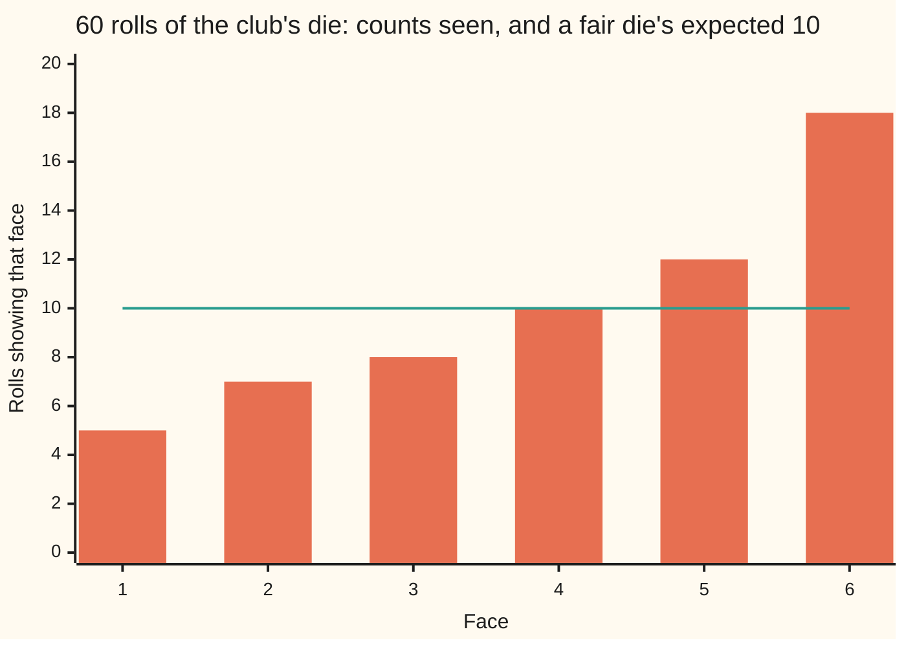
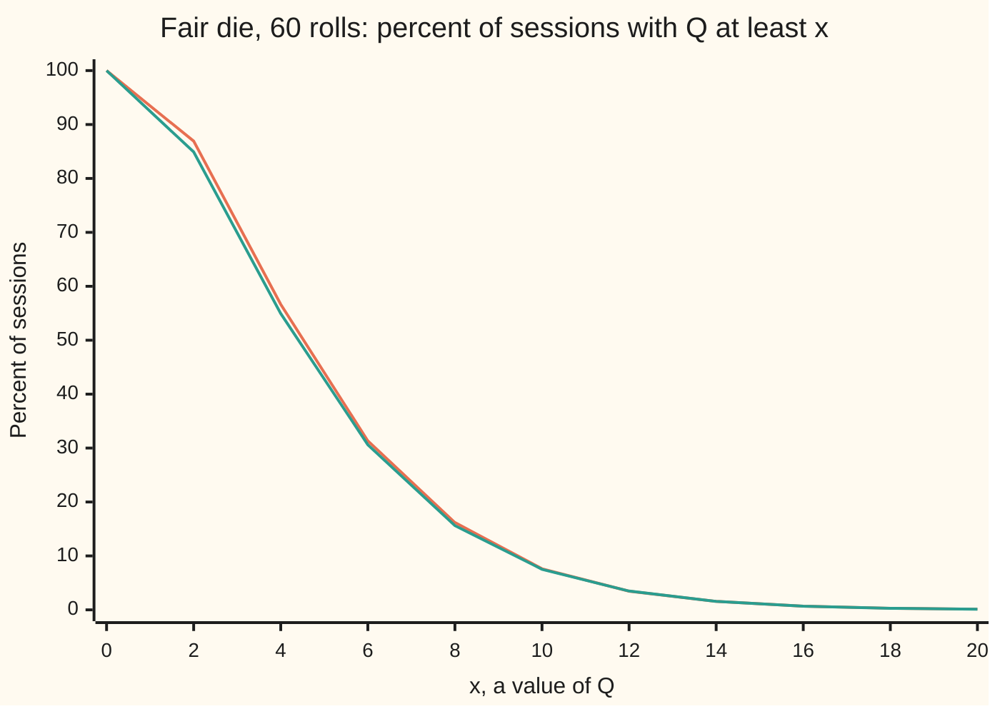

# Chi-square tests: does the table fit the model, and are the rows independent

[Syllabus](../../../SYLLABUS.md) → [Probability and statistics](../README.md) → [Confidence Intervals and Tests](../README.md#s08) → Chi-square tests

---

## General Overview

A board-game club suspects one of its dice. Someone rolls it 60 times and tallies the faces: 5 ones, 7 twos, 8 threes, 10 fours, 12 fives and 18 sixes. A fair die would give about 10 of each. Eighteen sixes looks bad. But a fair die never lands exactly 10, 10, 10, 10, 10, 10 either. The question is whether this much unevenness is more than a fair die produces by chance.

A drug trial asks the same kind of question of a different table. On the drug, 45 of 100 patients recovered; on a placebo (a dummy pill), 35 of 100. If recovery has nothing to do with which pill a patient got, both arms should recover at the overall rate, 80 of 200. Is a 10-point gap more than chance?

Karl Pearson's answer, from 1900, is one number for the whole table. For each box, take the gap between the count seen and the count the model expects, square it, and divide by the expected count. Add over the boxes. For the die this gives 10.6; for the trial, 2.08. Each is then compared with what a fair die, or a useless drug, would produce. That comparison needs one more count, the **degrees of freedom**: how many gaps are free to vary. The die has 5, the trial 1. Get that count wrong and the verdict changes.

**Square each gap between observed and expected counts, scale it by the expected count, and add: under the model, that sum behaves like a sum of squared bell-curve draws, one for each gap that is free to vary, and its tail beyond the observed value is the p-value.**

**What kind of fact this is:** a method. Its exact average under the model is a theorem, proved on this card in Why it works; its chi-square reference law is an approximation for large counts, proved in outline in a folded proof and checked against the exact law by enumeration.

### The picture: 60 rolls against a fair die's 10 each



Orange bars: the counts seen. Teal line: the 10 per face a fair die expects. Faces 1 and 6 carry most of the unevenness: their squared gaps over 10 are 2.5 and 6.4, out of a total of 10.6.

---

## The formula

Notation first. The table has $k$ boxes, here the six faces, and $n$ observations spread among them. $O_j$ is the count observed in box j and $p_j$ is the chance the model gives that box. The **expected count** is $E_j = n p_j$: 60 × 1/6 = 10 for every face. The chi-square law with $\nu$ degrees of freedom, written $\chi^2_\nu$, is the law of a sum of $\nu$ squared independent standard normal draws ([The reference distributions](../07-Sampling%20and%20Estimation/03-chi-square-t-and-f-distributions.md)).

$$Q = \sum_{j=1}^{k} \frac{(O_j - E_j)^2}{E_j}, \qquad \text{p-value} \approx P\big(\chi^2_{\nu} \ge Q\big), \qquad \nu = k - 1 - s$$

**Read it aloud:** Q is the sum over boxes of squared gap over expected count; the p-value is the chance a chi-square draw with nu degrees of freedom lands at Q or beyond, where nu is the number of boxes, less one for the fixed total, less one for each parameter the model had to estimate from these same counts.

For a table with $r$ rows and $c$ columns, the question "are rows and columns independent?" uses expected counts built from the table's own totals:

$$E_{ij} = \frac{R_i\, C_j}{n}, \qquad Q = \sum_{i,j} \frac{(O_{ij} - E_{ij})^2}{E_{ij}}, \qquad \nu = (r - 1)(c - 1)$$

**Read it aloud:** the expected count in a cell is its row total times its column total over the grand total; add the squared gaps over expected counts as before; the degrees of freedom are one less than the rows times one less than the columns.

| Symbol | Plain meaning | In our example | Push it up and the answer… |
| --- | --- | --- | --- |
| $n$ | observations in all | 60 rolls; 200 patients | the same proportions give a larger Q |
| $k$ | boxes, one per category | 6 faces | more degrees of freedom |
| $O_j$ | count observed in box j | 18 sixes | Q grows as it moves from $E_j$ |
| $p_j$ | the model's chance for box j | 1/6 | — |
| $E_j$ | expected count, $n p_j$ | 10 | a given gap counts for less |
| $Q$ | Pearson's statistic; many books write it $X^2$ | 10.6 dice; 2.083333 trial | smaller p-value |
| $\nu$ | degrees of freedom: gaps free to vary | 5 dice; 1 trial | a given Q is less surprising |
| $s$ | parameters estimated from the same counts | 0 dice | one fewer degree of freedom each |
| $r$, $c$ | rows and columns of a table | 2 arms, 2 outcomes | more degrees of freedom |
| $R_i$, $C_j$; $R_1$, $R_2$, $C_1$, $C_2$ | a row total and a column total; numbered for a 2 × 2 table | 100 per arm; 80 recovered, 120 not | — |
| $O_{ij}$, $E_{ij}$ | observed and expected count in row i, column j | 45 and 40, drug and recovered | — |
| $\chi^2_\nu$ | the chi-square law with nu degrees of freedom | chance beyond 10.6 with 5: 0.059914 | — |

### When it holds

- **Independent observations, each counted once.** Write every roll down twice and the proportions do not change, but Q doubles to 21.2 and the p-value falls from 0.059914 to 0.000743. Patients who share a ward, or one customer counted on every visit, cause the same false alarm.
- **Boxes fixed before looking.** Every observation lands in exactly one box, chosen by rules set in advance. Merging or splitting boxes after seeing the counts lets the data pick the test, and the p-value no longer means what it says.
- **Expected counts that are not tiny.** The chi-square law is a large-count approximation. With 60 rolls it is close. The 5% cut is the value of Q that the chi-square law exceeds 5% of the time, 11.0705 here; a fair die passes it in 0.0478 of sessions, exactly. With 12 rolls, 2 expected per face, the same rule rejects in 0.0329: the test is timid. The usual rule of thumb asks for at least 5 expected in each box; it is a guide, not a guarantee.
- **The model named before the data, or its fitted parameters paid for.** Each parameter estimated from the same counts removes one degree of freedom. The independence table estimates its row and column shares, which is why it has 1 degree of freedom, not 3.
- **Counts, not proportions.** Q depends on the size of the sample. Feed it proportions and the die's Q shrinks to 0.176667, with p-value 0.999345.

---

## Why it works

### Step 0: each gap, measured in its own spread, is roughly a bell-curve draw

The count of sixes in 60 fair rolls follows the binomial law, with average 10 and variance 60 × 1/6 × 5/6 = 8.33. By the central limit theorem ([Central limit theorem](../06-Limit%20Theorems%20in%20Practice/02-central-limit-theorem.md)) the gap between count and average, divided by its standard deviation, is close to a standard normal draw. Squaring and adding such draws gives a chi-square law. Pearson's Q is almost that sum. Two details separate "almost" from "exactly": the divisor is $E_j$ rather than the variance, and the gaps are tied, since the counts must add to 60. The steps below show that these two details offset each other and leave one fewer degree of freedom than there are boxes.

### Step 1: dividing by the expected count puts every box on one scale

A gap of 8 means a lot when 10 are expected and almost nothing when 1,000 are. A count's variance grows with its expected count, so the gap squared grows with it. Dividing by $E_j$ removes that growth. For a rare box, $p_j$ small, the variance $n p_j (1 - p_j)$ is almost exactly $E_j$, so dividing by $E_j$ standardises the squared gap. For a common box the divisor is too big by the factor $1/(1 - p_j)$, and the fixed total repays exactly that excess, as Steps 2 and 3 show.

### Step 2: with two boxes, Q is exactly a squared z-score

Take two boxes, chances p and 1 − p. The counts add to n, so the gaps are equal and opposite: call them g and −g. Then

$$Q = \frac{g^2}{np} + \frac{g^2}{n(1-p)} = \frac{g^2}{np(1-p)} = \left(\frac{g}{\sqrt{np(1-p)}}\right)^2 = z^2.$$

The reciprocals of the two divisors add up to exactly the reciprocal of the binomial variance, so the two too-large divisors together act as the right one. Q is the square of the familiar z-score, one standard normal draw squared: a chi-square law with 1 degree of freedom. Two boxes, one free gap, one degree of freedom. The 5% cut on that law is 3.8415, the square of the bell curve's two-sided 5% point.

### Step 3: the exact average of Q is k − 1, for any number of rolls

Each count $O_j$ is binomial on its own ([Multinomial](../03-Discrete%20Distributions/05-multinomial.md)), so the average of its squared gap is its variance, $n p_j (1 - p_j)$. Divide by $E_j = n p_j$ and the average of each term is $1 - p_j$. Add over the boxes: the chances add to 1, so

$$\text{average of } Q = \sum_{j=1}^{k} (1 - p_j) = k - 1.$$

A chi-square law with $\nu$ degrees of freedom has average $\nu$, one for each squared draw. So Q averages exactly what a chi-square law with k − 1 degrees of freedom averages. For the die that is 5. The checks confirm it by listing all 19,858 distinct tallies of 60 rolls, up to the order of faces, and weighting each by its exact multinomial chance: the average is 5.000000. The variance is 9.833333, against 2 × 5 for the chi-square law; the gap closes as the number of rolls grows.

An exact average does not make an exact law. With one roll of the die, Q is 5 on every outcome, a single value, while the chi-square law is spread out. The law is a large-sample statement, and its proof needs more than averages.

<details>
<summary>Detailed proof: why Q tends to a chi-square law with k − 1 degrees of freedom</summary>

Write each scaled gap as $u_j = (O_j - E_j)/\sqrt{E_j}$, so Q is the squared length of the list of scaled gaps. From the multinomial covariances, each scaled gap has variance $1 - p_j$, and the scaled gaps in boxes i and j have covariance $-\sqrt{p_i p_j}$. As a matrix, that is the identity minus the outer product of the list of square roots of the chances with itself. That list has length 1, since the chances add to 1.

That matrix is a projection: it removes the part of any list pointing along the list of square roots and keeps the rest. Its eigenvalues are 1, repeated k − 1 times, and 0 once, along the list of square roots. The zero is the fixed total: $\sum_j \sqrt{p_j}\, u_j = (\sum_j O_j - n)/\sqrt{n} = 0$ on every outcome.

The central limit theorem, applied to the list of counts as a whole, says that for large n the list of scaled gaps is close to a multivariate normal with this covariance ([Multivariate normal](../05-Transformations%20and%20Joint%20Laws/06-multivariate-normal.md)); that vector form is stated here, not proved. The spectral theorem ([The spectral theorem](../../03-Algebra/07-Eigenvalues%20and%20Symmetric%20Matrices/04-spectral-theorem.md)) gives a rotation into the projection's own axes. Rotation keeps lengths, so Q is unchanged. In the new axes the normal list has k − 1 independent standard normal coordinates and one coordinate that is always 0. Its squared length is a sum of k − 1 squared standard normals: a chi-square law with k − 1 degrees of freedom.

</details>

### The picture: the exact law of Q against the chi-square approximation



Orange line: the exact chance, summed over every tally of 60 fair rolls. Teal line: the right tail of the chi-square law with 5 degrees of freedom. At the plotted points they differ by about two points at most, near x = 2, and from 10 on agree to within a tenth of a point: in the tail, where tests are decided.

### Step 4: independence builds its expected counts from the table

The trial table, rows for arms and columns for outcomes:

| | Recovered | Not recovered | Row total |
| --- | --- | --- | --- |
| Drug | 45 | 55 | 100 |
| Placebo | 35 | 65 | 100 |
| Column total | 80 | 120 | 200 |

If recovery ignores the pill, both arms share one recovery rate. The best estimate is the pooled rate, 80 of 200 = 0.40. So each arm of 100 expects 40 recovered and 60 not: that is $R_i C_j / n$, row total times the column's share. The estimate is the maximum-likelihood choice, the one under which the observed table is most probable ([Maximum likelihood](../07-Sampling%20and%20Estimation/04-maximum-likelihood.md)).

Now count the free gaps. The table of gaps, observed minus expected, is `[[5, -5], [-5, 5]]`: every row and every column adds to zero, because the expected counts were built to match the totals. Choose the top-left gap and the other three follow. One free gap, one degree of freedom. In general: rc cells, less 1 for the grand total, less r − 1 for the estimated row shares, less c − 1 for the column shares, leaves (r − 1)(c − 1). When the row totals are fixed by design, as with 100 per arm here, no row shares are estimated: each arm has c − 1 free cells, r(c − 1) in all, less c − 1 for the pooled column shares, which again leaves (r − 1)(c − 1), here 1.

The four squared gaps over expected counts are 25/40, 25/60, 25/40 and 25/60, so Q = 2.083333. With 1 degree of freedom the tail is 0.148915.

### Step 5: the 2 × 2 test is the two-proportion z-test, squared

The two-proportion test of [Hypothesis tests](03-hypothesis-tests-and-p-values.md) divides the gap in recovery rates, 0.10, by its standard error at the pooled rate, $\sqrt{0.4 \times 0.6 \times (1/100 + 1/100)}$. That gives z = 1.443376, and z squared is 2.083333, the same as Q. The p-values agree too: twice the normal tail beyond z is 0.148915. This is the "p equals 0.15" of that card, reached through the table.

<details>
<summary>The algebra behind this, if you want it</summary>

Label the cells a, b in the first row and c, d in the second, with row totals $R_1$, $R_2$, column totals $C_1$, $C_2$ and grand total n. The top-left gap is $a - R_1 C_1/n = \big(a(a+b+c+d) - (a+b)(a+c)\big)/n = (ad - bc)/n$, and the other three gaps are the same size with alternating signs. Add the reciprocals of the four expected counts: $\sum n/(R_i C_j) = n (1/R_1 + 1/R_2)(1/C_1 + 1/C_2) = n^3/(R_1 R_2 C_1 C_2)$. Multiply by the squared gap:
$$Q = \frac{n\,(ad - bc)^2}{R_1 R_2 C_1 C_2}.$$
For the trial: 45 × 65 − 55 × 35 = 1,000, so Q = 200 × 1,000,000 / (100 × 100 × 80 × 120) = 200,000,000 / 96,000,000 = 2.083333. Writing the same expression with the recovery rates $a/R_1$ and $c/R_2$ and the pooled rate $C_1/n$ turns it into the square of the two-proportion z-score.

</details>

A second road to the same question avoids squared gaps altogether: the G statistic, twice the sum of observed count times the logarithm of observed over expected, which is the likelihood-ratio test of [Likelihood ratio tests](07-likelihood-ratio-tests.md) and has the same chi-square limit. For a small 2 × 2 table, Fisher's exact test replaces the approximation with hypergeometric chances ([Hypergeometric](../03-Discrete%20Distributions/03-hypergeometric.md)).

---

## Worked numbers, by hand

| Step | Arithmetic | Value |
| --- | --- | --- |
| expected per face | 60 × 1/6 | 10 |
| gaps | 5 − 10, 7 − 10, 8 − 10, 10 − 10, 12 − 10, 18 − 10 | −5, −3, −2, 0, 2, 8 |
| squared gaps over 10 | 25/10, 9/10, 4/10, 0, 4/10, 64/10 | 2.5, 0.9, 0.4, 0.0, 0.4, 6.4 |
| **Q, dice** | sum | **10.6** |
| degrees of freedom | 6 boxes − 1 for the total | 5 |
| p-value | chi-square tail beyond 10.6, 5 degrees | **0.059914** |
| pooled recovery rate | 80 / 200 | 0.40 |
| expected, each arm | 100 × 0.40 and 100 × 0.60 | 40 and 60 |
| **Q, trial** | 25/40 + 25/60 + 25/40 + 25/60 | **2.083333** |
| degrees of freedom | (2 − 1)(2 − 1) | 1 |
| p-value | chi-square tail beyond 2.083333, 1 degree | **0.148915** |

Read back at the club: a fair die rolled 60 times gives unevenness this large or larger in about 6 sessions in 100. That is unusual but not rare; at the conventional 5% cut, 11.0705, the die is not condemned. It is not evidence that the die is fair either, and 0.06 is not the chance the die is fair. Read back in the trial: if the drug did nothing, a 10-point gap or wider would appear in about 15 trials in 100. The trial has not shown an effect; it may simply be too small to see one ([Power](04-power-and-sample-size.md)).

### What breaks if you drop a piece

| Mistake | Comes out at | What went wrong |
| --- | --- | --- |
| Dice with 6 degrees of freedom | p 0.101554, cut 12.5916 | The fixed total ties the six gaps; only 5 are free |
| Trial with 3 degrees of freedom | p 0.555292, not 0.148915 | Cells minus one ignores the two estimated shares |
| Proportions fed in, not counts | Q 0.176667, p 0.999345 | Q measures evidence, which grows with the count |
| Every roll written down twice | Q 21.2, p 0.000743 | Duplicates are not independent; the data say nothing new |
| 12 rolls, 2 expected per face | rejects a fair die in 0.0329 of sessions, not 0.05 | Counts too small for the chi-square approximation |

The code prints all five.

---

## Code, from first principles, and it actually runs

The scripts build every tail themselves. The chi-square tail is reached twice: by the series for the incomplete gamma function (the chi-square law is a gamma law, [Gamma and beta](../04-Continuous%20Distributions/07-gamma-and-beta-distributions.md)), and by Simpson's rule on the density. The die's exact p-value comes from a third road with no approximation: every tally of 60 rolls, weighted by its multinomial chance. A fourth road simulates 20,000 sessions of 60 rolls from a SplitMix64 generator with seed 20260928, printed with standard errors. The trial's Q is computed three ways (cells, the shortcut, z squared), its tail three ways, and its exact tail by summing over every pair of binomial counts when both arms recover at 0.40.

### Python

```python
# Chi-square tests -- the check behind the card.  Only math.sqrt, math.exp,
# math.log and math.pi are imported.  Two questions.  Dice: 60 rolls came out
# 5, 7, 8, 10, 12, 18; is the die fair?  Trial: 45 of 100 recovered on the drug,
# 35 of 100 on placebo; is recovery independent of treatment?  Every tail is
# built here: a gamma series, Simpson's rule on the density, an exact sum over
# every tally, and a seeded simulation (SplitMix64, seed 20260928).
from math import sqrt, exp, log, pi
M64 = 2**64 - 1

def Phi(z):                               # bell area left of z, Taylor series
    term, total, j = z, z, 0
    while abs(term) > 1e-17 * max(1.0, abs(total)):
        j += 1
        term *= -z * z * (2 * j - 1) / (2 * j * (2 * j + 1))
        total += term
    return 0.5 + total / sqrt(2.0 * pi)

def gamma_half(a):                        # Gamma(a) for a = 1/2, 1, 3/2, ...
    g, x = (sqrt(pi), 0.5) if (2 * a) % 2 else (1.0, 1.0)
    while x < a: g, x = g * x, x + 1
    return g

def tail_series(q, df):                   # road one: 1 - lower gamma series
    a, x = df / 2, q / 2
    term, total, j = 1.0 / (a * gamma_half(a)), 0.0, 0
    while term > 1e-18 * max(total, 1e-300):
        total += term
        j += 1
        term *= x / (a + j)
    return 1 - exp(-x + a * log(x)) * total

def density(t, df):                       # the chi-square density
    return exp((df / 2 - 1) * log(t) - t / 2) / (2 ** (df / 2) * gamma_half(df / 2))

def tail_simpson(q, df, m=20000):         # road two: area from q to q + 200
    h = 200.0 / m
    s = density(q, df) + density(q + 200, df)
    s += sum((4 if i % 2 else 2) * density(q + i * h, df) for i in range(1, m))
    return s * h / 3

def cut(df, alpha=0.05):                  # bisection: the tail equals alpha
    a, b = 0.0, 100.0
    for _ in range(200):
        m = 0.5 * (a + b)
        a, b = (m, b) if tail_series(m, df) > alpha else (a, m)
    return 0.5 * (a + b)

LF = [0.0]
for i in range(1, 201): LF.append(LF[-1] + log(i))

def tallies(n, k, top=None):              # every tally c1 >= c2 >= ... >= ck
    top = n if top is None else top
    if k == 1:
        if n <= top: yield (n,)
        return
    for c in range(min(n, top), -1, -1):
        for rest in tallies(n - c, k - 1, c): yield (c,) + rest

def exact_law(n, k):                      # road three: (Q, chance) for every tally
    law, e = [], n / k
    for t in tallies(n, k):
        orders = LF[k] - sum(LF[t.count(v)] for v in set(t))
        chance = exp(LF[n] - sum(LF[c] for c in t) - n * log(k) + orders)
        law.append((sum((c - e) ** 2 for c in t) / e, chance))
    return law

def pearson(obs, exp_):                   # the statistic itself
    return sum((o - e) ** 2 / e for o, e in zip(obs, exp_))

state = 20260928                          # SplitMix64, the same stream as the Rust
def next64():
    global state
    state = (state + 0x9E3779B97F4A7C15) & M64
    x = state
    x = ((x ^ (x >> 30)) * 0xBF58476D1CE4E5B9) & M64
    x = ((x ^ (x >> 27)) * 0x94D049BB133111EB) & M64
    return x ^ (x >> 31)

DICE = [5, 7, 8, 10, 12, 18]
q_dice = pearson(DICE, [10] * 6)
c5, c1, SMALL = cut(5), cut(1), 12        # SMALL: rolls in the small session
law60 = exact_law(60, 6)
exact_p = sum(w for q, w in law60 if q >= q_dice - 1e-9)
mean_q = sum(q * w for q, w in law60)
var_q = sum(q * q * w for q, w in law60) - mean_q ** 2
size60 = sum(w for q, w in law60 if q > c5)
size12 = sum(w for q, w in exact_law(SMALL, 6) if q > c5)
print("dice: counts " + ", ".join(str(o) for o in DICE) + "; expected 10 each")
print("  gaps squared over 10: " + ", ".join(f"{(o - 10) ** 2 / 10:.1f}" for o in DICE))
print(f"  Q = {q_dice:.4f}, degrees of freedom 5")
print(f"  tail, gamma series        {tail_series(q_dice, 5):.6f}")
print(f"  tail, Simpson on density  {tail_simpson(q_dice, 5):.6f}")
print(f"  tail, exact sum over {len(law60)} tallies {exact_p:.6f}")
print(f"  exact mean of Q {mean_q:.6f} (k - 1 = 5); variance {var_q:.6f} (2 x 5 x 59/60 = {2 * 5 * 59 / 60:.6f})")
print(f"  5% cut, 5 degrees of freedom {c5:.4f}; 1 degree {c1:.4f}")
print(f"  exact chance fair die rejected at the 5% cut: 60 rolls {size60:.4f}, {SMALL} rolls {size12:.4f}")
RUNS, hit_p, hit_c = 20000, 0, 0
for _ in range(RUNS):                     # one run = 60 rolls of a fair die
    cnt = [0] * 6
    for _ in range(60): cnt[int((next64() >> 11) / 2**53 * 6)] += 1
    q = pearson(cnt, [10] * 6)
    hit_p += q >= q_dice - 1e-9
    hit_c += q > c5
for label, h, ex in ((f"Q >= {q_dice:.1f}", hit_p, exact_p), ("Q > 5% cut", hit_c, size60)):
    s = h / RUNS
    se = sqrt(s * (1 - s) / RUNS)
    print(f"  simulated {label:<11}{s:.4f}  se {se:.4f}  (sim - exact)/se {(s - ex) / se:>5.2f}")
    assert abs(s - ex) < 4 * se                                    # simulation agrees
print("chart, Q at least  " + " ".join(f"{x:>6d}" for x in range(0, 21, 2)))
print("chart, exact %     " + " ".join(f"{100 * sum(w for q, w in law60 if q >= x - 1e-9):6.2f}" for x in range(0, 21, 2)))
print("chart, chi-sq 5 %  " + " ".join(f"{100 * tail_series(x, 5) if x else 100.0:6.2f}" for x in range(0, 21, 2)))
T = [[45, 55], [35, 65]]                  # rows: drug, placebo; columns: recovered, not
R, C, n = [sum(r) for r in T], [T[0][j] + T[1][j] for j in range(2)], 200
E = [[R[i] * C[j] / n for j in range(2)] for i in range(2)]
q_cells = pearson(sum(T, []), sum(E, []))
a, b, c, d = 45, 55, 35, 65
q_short = n * (a * d - b * c) ** 2 / (R[0] * R[1] * C[0] * C[1])
pool = C[0] / n
z = (a / 100 - c / 100) / sqrt(pool * (1 - pool) * (1 / 100 + 1 / 100))
def binom(m, p): return [exp(LF[m] - LF[j] - LF[m - j] + j * log(p) + (m - j) * log(1 - p)) for j in range(m + 1)]
bp = binom(100, pool)
def q22(x, y):                            # the 2 x 2 statistic for x and y recovered
    s = x + y
    return 0.0 if s in (0, 200) else 200 * (x - y) ** 2 / (s * (200 - s))
exact_22 = sum(bp[x] * bp[y] for x in range(101) for y in range(101) if q22(x, y) >= q_cells - 1e-9)
print(f"trial: expected drug {E[0][0]:.1f} {E[0][1]:.1f}, placebo {E[1][0]:.1f} {E[1][1]:.1f}; pooled rate {pool:.2f}")
print(f"  Q by cells {q_cells:.6f}; by n(ad - bc)^2 / margins {q_short:.6f}; z^2 {z * z:.6f} (z = {z:.6f})")
print(f"  tail, gamma series 1 d.f. {tail_series(q_cells, 1):.6f}; Simpson {tail_simpson(q_cells, 1):.6f}; 2(1 - Phi(z)) {2 * (1 - Phi(z)):.6f}")
print(f"  exact tail, both arms binomial at 0.40: {exact_22:.6f}")
print("what breaks:")
print(f"  dice, 6 degrees of freedom: p {tail_series(q_dice, 6):.6f}, cut {cut(6):.4f}")
print(f"  trial, 3 degrees of freedom: p {tail_series(q_cells, 3):.6f}")
print(f"  dice, proportions fed in: Q {pearson([o / 60 for o in DICE], [1 / 6] * 6):.6f}, p {tail_series(pearson([o / 60 for o in DICE], [1 / 6] * 6), 5):.6f}")
print(f"  dice, every roll written down twice: Q {pearson([2 * o for o in DICE], [20] * 6):.4f}, p {tail_series(2 * q_dice, 5):.6f}")
assert abs(tail_series(q_dice, 5) - tail_simpson(q_dice, 5)) < 1e-8       # two roads to one tail
assert abs(mean_q - 5) < 1e-9 and abs(var_q - 2 * 5 * 59 / 60) < 1e-8     # exact moments by enumeration
assert abs(q_cells - z * z) < 1e-12 and abs(q_short - q_cells) < 1e-12    # three forms of the 2 x 2
assert abs(tail_series(q_cells, 1) - 2 * (1 - Phi(z))) < 1e-10            # chi-square 1 = z squared
assert abs(exact_p - tail_series(q_dice, 5)) < 0.01 and size12 < 0.04     # close at 60, off at 12
print("ALL CHECKS PASS")
```

**Ran 2026-09-28 on macOS, Python 3.14.6, standard library only. All checks passed. Output, pasted from the run:**

```
dice: counts 5, 7, 8, 10, 12, 18; expected 10 each
  gaps squared over 10: 2.5, 0.9, 0.4, 0.0, 0.4, 6.4
  Q = 10.6000, degrees of freedom 5
  tail, gamma series        0.059914
  tail, Simpson on density  0.059914
  tail, exact sum over 19858 tallies 0.060153
  exact mean of Q 5.000000 (k - 1 = 5); variance 9.833333 (2 x 5 x 59/60 = 9.833333)
  5% cut, 5 degrees of freedom 11.0705; 1 degree 3.8415
  exact chance fair die rejected at the 5% cut: 60 rolls 0.0478, 12 rolls 0.0329
  simulated Q >= 10.6  0.0607  se 0.0017  (sim - exact)/se  0.35
  simulated Q > 5% cut 0.0491  se 0.0015  (sim - exact)/se  0.87
chart, Q at least       0      2      4      6      8     10     12     14     16     18     20
chart, exact %     100.00  86.92  56.65  31.33  16.19   7.62   3.46   1.57   0.69   0.30   0.13
chart, chi-sq 5 %  100.00  84.91  54.94  30.62  15.62   7.52   3.48   1.56   0.68   0.29   0.12
trial: expected drug 40.0 60.0, placebo 40.0 60.0; pooled rate 0.40
  Q by cells 2.083333; by n(ad - bc)^2 / margins 2.083333; z^2 2.083333 (z = 1.443376)
  tail, gamma series 1 d.f. 0.148915; Simpson 0.148915; 2(1 - Phi(z)) 0.148915
  exact tail, both arms binomial at 0.40: 0.151939
what breaks:
  dice, 6 degrees of freedom: p 0.101554, cut 12.5916
  trial, 3 degrees of freedom: p 0.555292
  dice, proportions fed in: Q 0.176667, p 0.999345
  dice, every roll written down twice: Q 21.2000, p 0.000743
ALL CHECKS PASS
```

### Rust

Same numbers, same labels, built with `rustc --edition 2021 -O`.

```rust
// Chi-square tests -- the same check as the Python, in Rust.  No crates.  Two
// questions.  Dice: 60 rolls came out 5, 7, 8, 10, 12, 18; is the die fair?
// Trial: 45 of 100 recovered on the drug, 35 of 100 on placebo; is recovery
// independent of treatment?  Every tail is built here: a gamma series, Simpson's
// rule on the density, an exact sum over every tally, and a seeded simulation
// (SplitMix64, seed 20260928).
use std::f64::consts::PI;

fn phi(z: f64) -> f64 {                               // bell area left of z, Taylor series
    let (mut term, mut total, mut j) = (z, z, 0.0);
    while term.abs() > 1e-17 * total.abs().max(1.0) {
        j += 1.0;
        term *= -z * z * (2.0 * j - 1.0) / (2.0 * j * (2.0 * j + 1.0));
        total += term;
    }
    0.5 + total / (2.0 * PI).sqrt()
}

fn gamma_half(a: f64) -> f64 {                        // Gamma(a) for a = 1/2, 1, 3/2, ...
    let (mut g, mut x) = if (2.0 * a) as i64 % 2 == 1 { (PI.sqrt(), 0.5) } else { (1.0, 1.0) };
    while x < a { g *= x; x += 1.0 }
    g
}

fn tail_series(q: f64, df: f64) -> f64 {              // road one: 1 - lower gamma series
    let (a, x) = (df / 2.0, q / 2.0);
    let (mut term, mut total, mut j) = (1.0 / (a * gamma_half(a)), 0.0f64, 0.0);
    while term > 1e-18 * total.max(1e-300) {
        total += term;
        j += 1.0;
        term *= x / (a + j);
    }
    1.0 - (-x + a * x.ln()).exp() * total
}

fn density(t: f64, df: f64) -> f64 {                  // the chi-square density
    ((df / 2.0 - 1.0) * t.ln() - t / 2.0).exp() / (2f64.powf(df / 2.0) * gamma_half(df / 2.0))
}

fn tail_simpson(q: f64, df: f64) -> f64 {             // road two: area from q to q + 200
    let m = 20000;
    let h = 200.0 / m as f64;
    let mut s = density(q, df) + density(q + 200.0, df);
    for i in 1..m { s += if i % 2 == 1 { 4.0 } else { 2.0 } * density(q + i as f64 * h, df) }
    s * h / 3.0
}

fn cut(df: f64) -> f64 {                              // bisection: the tail equals 0.05
    let (mut a, mut b) = (0.0, 100.0);
    for _ in 0..200 {
        let m = 0.5 * (a + b);
        if tail_series(m, df) > 0.05 { a = m } else { b = m }
    }
    0.5 * (a + b)
}

fn tallies(n: usize, k: usize, top: usize, cur: &mut Vec<usize>, out: &mut Vec<Vec<usize>>) {
    if k == 1 {                                       // every tally c1 >= c2 >= ... >= ck
        if n <= top { cur.push(n); out.push(cur.clone()); cur.pop(); }
        return;
    }
    for c in (0..=n.min(top)).rev() {
        cur.push(c);
        tallies(n - c, k - 1, c, cur, out);
        cur.pop();
    }
}

fn exact_law(n: usize, k: usize, lf: &[f64]) -> Vec<(f64, f64)> {   // road three
    let mut all = Vec::new();
    tallies(n, k, n, &mut Vec::new(), &mut all);
    let e = n as f64 / k as f64;
    all.iter().map(|t| {
        let mut orders = lf[k];
        let mut seen: Vec<usize> = Vec::new();
        for &v in t { if !seen.contains(&v) { seen.push(v); orders -= lf[t.iter().filter(|&&c| c == v).count()] } }
        let chance = (lf[n] - t.iter().map(|&c| lf[c]).sum::<f64>() - n as f64 * (k as f64).ln() + orders).exp();
        (t.iter().map(|&c| (c as f64 - e).powi(2)).sum::<f64>() / e, chance)
    }).collect()
}

fn pearson(obs: &[f64], ex: &[f64]) -> f64 { obs.iter().zip(ex).map(|(o, e)| (o - e).powi(2) / e).sum() }

fn next64(state: &mut u64) -> u64 {                   // SplitMix64, the same stream as the Python
    *state = state.wrapping_add(0x9E3779B97F4A7C15);
    let mut x = *state;
    x = (x ^ (x >> 30)).wrapping_mul(0xBF58476D1CE4E5B9);
    x = (x ^ (x >> 27)).wrapping_mul(0x94D049BB133111EB);
    x ^ (x >> 31)
}

fn tail_at(law: &[(f64, f64)], x: f64) -> f64 { law.iter().filter(|p| p.0 >= x - 1e-9).map(|p| p.1).sum() }

fn main() {
    let mut lf = vec![0.0f64];
    for i in 1..=200 { let v = lf[i - 1] + (i as f64).ln(); lf.push(v) }
    let dice = [5.0, 7.0, 8.0, 10.0, 12.0, 18.0];
    let q_dice = pearson(&dice, &[10.0; 6]);
    let (c5, c1, small) = (cut(5.0), cut(1.0), 12);        // small: rolls in the small session
    let law60 = exact_law(60, 6, &lf);
    let exact_p = tail_at(&law60, q_dice);
    let mean_q: f64 = law60.iter().map(|p| p.0 * p.1).sum();
    let var_q = law60.iter().map(|p| p.0 * p.0 * p.1).sum::<f64>() - mean_q * mean_q;
    let size60: f64 = law60.iter().filter(|p| p.0 > c5).map(|p| p.1).sum();
    let size12: f64 = exact_law(small, 6, &lf).iter().filter(|p| p.0 > c5).map(|p| p.1).sum();
    let join = |v: Vec<String>| v.join(", ");
    println!("dice: counts {}; expected 10 each", join(dice.iter().map(|o| format!("{}", o)).collect()));
    println!("  gaps squared over 10: {}", join(dice.iter().map(|o| format!("{:.1}", (o - 10.0).powi(2) / 10.0)).collect()));
    println!("  Q = {:.4}, degrees of freedom 5", q_dice);
    println!("  tail, gamma series        {:.6}", tail_series(q_dice, 5.0));
    println!("  tail, Simpson on density  {:.6}", tail_simpson(q_dice, 5.0));
    println!("  tail, exact sum over {} tallies {:.6}", law60.len(), exact_p);
    println!("  exact mean of Q {:.6} (k - 1 = 5); variance {:.6} (2 x 5 x 59/60 = {:.6})", mean_q, var_q, 2.0 * 5.0 * 59.0 / 60.0);
    println!("  5% cut, 5 degrees of freedom {:.4}; 1 degree {:.4}", c5, c1);
    println!("  exact chance fair die rejected at the 5% cut: 60 rolls {:.4}, {} rolls {:.4}", size60, small, size12);
    let (runs, mut hit_p, mut hit_c, mut state) = (20000, 0, 0, 20260928u64);
    for _ in 0..runs {                                // one run = 60 rolls of a fair die
        let mut cnt = [0.0f64; 6];
        for _ in 0..60 { cnt[((next64(&mut state) >> 11) as f64 / 9007199254740992.0 * 6.0) as usize] += 1.0 }
        let q = pearson(&cnt, &[10.0; 6]);
        if q >= q_dice - 1e-9 { hit_p += 1 }
        if q > c5 { hit_c += 1 }
    }
    for (label, h, ex) in [(format!("Q >= {:.1}", q_dice), hit_p, exact_p), ("Q > 5% cut".to_string(), hit_c, size60)] {
        let s = h as f64 / runs as f64;
        let se = (s * (1.0 - s) / runs as f64).sqrt();
        println!("  simulated {:<11}{:.4}  se {:.4}  (sim - exact)/se {:>5.2}", label, s, se, (s - ex) / se);
        assert!((s - ex).abs() < 4.0 * se);                              // simulation agrees
    }
    let xs: Vec<f64> = (0..=10).map(|i| 2.0 * i as f64).collect();
    println!("chart, Q at least  {}", xs.iter().map(|x| format!("{:>6}", x)).collect::<Vec<_>>().join(" "));
    println!("chart, exact %     {}", xs.iter().map(|&x| format!("{:6.2}", 100.0 * tail_at(&law60, x))).collect::<Vec<_>>().join(" "));
    println!("chart, chi-sq 5 %  {}", xs.iter().map(|&x| format!("{:6.2}", if x > 0.0 { 100.0 * tail_series(x, 5.0) } else { 100.0 })).collect::<Vec<_>>().join(" "));
    let (a, b, c, d) = (45.0f64, 55.0f64, 35.0f64, 65.0f64);  // rows: drug, placebo
    let (r, cc, n) = ([a + b, c + d], [a + c, b + d], 200.0);
    let e = [r[0] * cc[0] / n, r[0] * cc[1] / n, r[1] * cc[0] / n, r[1] * cc[1] / n];
    let q_cells = pearson(&[a, b, c, d], &e);
    let q_short = n * (a * d - b * c).powi(2) / (r[0] * r[1] * cc[0] * cc[1]);
    let pool = cc[0] / n;
    let z = (a / 100.0 - c / 100.0) / (pool * (1.0 - pool) * (1.0 / 100.0 + 1.0 / 100.0)).sqrt();
    let bp: Vec<f64> = (0..=100).map(|j| (lf[100] - lf[j] - lf[100 - j] + j as f64 * pool.ln() + (100 - j) as f64 * (1.0 - pool).ln()).exp()).collect();
    let q22 = |x: f64, y: f64| { let s = x + y; if s == 0.0 || s == 200.0 { 0.0 } else { 200.0 * (x - y).powi(2) / (s * (200.0 - s)) } };
    let mut exact_22 = 0.0;
    for x in 0..=100 { for y in 0..=100 { if q22(x as f64, y as f64) >= q_cells - 1e-9 { exact_22 += bp[x] * bp[y] } } }
    println!("trial: expected drug {:.1} {:.1}, placebo {:.1} {:.1}; pooled rate {:.2}", e[0], e[1], e[2], e[3], pool);
    println!("  Q by cells {:.6}; by n(ad - bc)^2 / margins {:.6}; z^2 {:.6} (z = {:.6})", q_cells, q_short, z * z, z);
    println!("  tail, gamma series 1 d.f. {:.6}; Simpson {:.6}; 2(1 - Phi(z)) {:.6}", tail_series(q_cells, 1.0), tail_simpson(q_cells, 1.0), 2.0 * (1.0 - phi(z)));
    println!("  exact tail, both arms binomial at 0.40: {:.6}", exact_22);
    println!("what breaks:");
    println!("  dice, 6 degrees of freedom: p {:.6}, cut {:.4}", tail_series(q_dice, 6.0), cut(6.0));
    println!("  trial, 3 degrees of freedom: p {:.6}", tail_series(q_cells, 3.0));
    let props: Vec<f64> = dice.iter().map(|o| o / 60.0).collect();
    let q_prop = pearson(&props, &[1.0 / 6.0; 6]);
    println!("  dice, proportions fed in: Q {:.6}, p {:.6}", q_prop, tail_series(q_prop, 5.0));
    let twice: Vec<f64> = dice.iter().map(|o| 2.0 * o).collect();
    println!("  dice, every roll written down twice: Q {:.4}, p {:.6}", pearson(&twice, &[20.0; 6]), tail_series(2.0 * q_dice, 5.0));
    assert!((tail_series(q_dice, 5.0) - tail_simpson(q_dice, 5.0)).abs() < 1e-8);   // two roads to one tail
    assert!((mean_q - 5.0).abs() < 1e-9 && (var_q - 2.0 * 5.0 * 59.0 / 60.0).abs() < 1e-8);
    assert!((q_cells - z * z).abs() < 1e-12 && (q_short - q_cells).abs() < 1e-12); // three forms of the 2 x 2
    assert!((tail_series(q_cells, 1.0) - 2.0 * (1.0 - phi(z))).abs() < 1e-10);    // chi-square 1 = z squared
    assert!((exact_p - tail_series(q_dice, 5.0)).abs() < 0.01 && size12 < 0.04);  // close at 60, off at 12
    println!("ALL CHECKS PASS");
}
```

**Ran 2026-09-28 on macOS, rustc 1.98.1, no crates. All checks passed. Output, pasted from the run:**

```
dice: counts 5, 7, 8, 10, 12, 18; expected 10 each
  gaps squared over 10: 2.5, 0.9, 0.4, 0.0, 0.4, 6.4
  Q = 10.6000, degrees of freedom 5
  tail, gamma series        0.059914
  tail, Simpson on density  0.059914
  tail, exact sum over 19858 tallies 0.060153
  exact mean of Q 5.000000 (k - 1 = 5); variance 9.833333 (2 x 5 x 59/60 = 9.833333)
  5% cut, 5 degrees of freedom 11.0705; 1 degree 3.8415
  exact chance fair die rejected at the 5% cut: 60 rolls 0.0478, 12 rolls 0.0329
  simulated Q >= 10.6  0.0607  se 0.0017  (sim - exact)/se  0.35
  simulated Q > 5% cut 0.0491  se 0.0015  (sim - exact)/se  0.87
chart, Q at least       0      2      4      6      8     10     12     14     16     18     20
chart, exact %     100.00  86.92  56.65  31.33  16.19   7.62   3.46   1.57   0.69   0.30   0.13
chart, chi-sq 5 %  100.00  84.91  54.94  30.62  15.62   7.52   3.48   1.56   0.68   0.29   0.12
trial: expected drug 40.0 60.0, placebo 40.0 60.0; pooled rate 0.40
  Q by cells 2.083333; by n(ad - bc)^2 / margins 2.083333; z^2 2.083333 (z = 1.443376)
  tail, gamma series 1 d.f. 0.148915; Simpson 0.148915; 2(1 - Phi(z)) 0.148915
  exact tail, both arms binomial at 0.40: 0.151939
what breaks:
  dice, 6 degrees of freedom: p 0.101554, cut 12.5916
  trial, 3 degrees of freedom: p 0.555292
  dice, proportions fed in: Q 0.176667, p 0.999345
  dice, every roll written down twice: Q 21.2000, p 0.000743
ALL CHECKS PASS
```

The two outputs match line for line. The simulated chances land within one standard error of the exact ones: 0.0607 against 0.060153, and 0.0491 against 0.0478. The exact tail for the trial, 0.151939, assumes both arms recover at exactly 0.40; the true common rate is unknown, which is why the chi-square figure, 0.148915, is the one reported.

> [!TIP]
> **Try changing**
> Guess first, then run it.
> - **A worse die.** Set `DICE` to `[3, 7, 8, 10, 12, 20]`. Guess the p-value. Q rises to 16.6 and the tail falls to 0.005324; the exact sum gives 0.005395. All asserts still pass.
> - **A middling sample.** Set `SMALL` to 30: 5 expected per face, the rule of thumb's minimum. The fair die is now rejected in 0.0485 of sessions, close to 0.05, and the last assert stops the run because it expects a timid test.
> - **Pretend a parameter was fitted.** In the line printing the gamma-series tail for the dice, change the 5 to 4. The p-value becomes 0.031447, below the 5% cut: one degree of freedom moves the verdict.

---

## The usual mistake

> [!warning]
> **Counting degrees of freedom as boxes, or cells, minus one, whatever the model.** Every quantity estimated from the same counts removes one more. The independence table has four cells but one degree of freedom; using three turns a p-value of 0.148915 into 0.555292. A goodness-of-fit test whose model was fitted to the data (a Poisson rate estimated from the counts, say) must subtract that parameter too.
>
> - **Reading the p-value as the chance the model is true.** The die's 0.059914 is the chance a fair die produces this much unevenness or more, not the chance the die is fair.
> - **Taking a large p-value as proof of fit, or of no effect.** The trial's 0.148915 says the data do not rule out "no effect"; a trial of 100 per arm often misses a real 10-point gain.
> - **Feeding percentages or proportions.** Q must be computed on counts: proportions give the die a Q of 0.176667 and hide everything.
> - **Dividing by the observed count.** The divisor is the expected count. An observed zero in a box that expects 10 contributes 10, not a division by zero.

---

## Where you meet it in real life

- **Dice, lotteries and slot machines.** Gaming regulators test the fairness of physical and electronic games by counting outcomes against their stated chances.
- **Clinical trials and A/B tests.** A table of outcome by group, recovered or not, clicked or not, is tested for independence exactly as the trial here; the design side is on [Randomised experiments](../13-Survival%2C%20Design%20and%20Causality/04-randomised-experiments-and-ab-tests.md).
- **Genetics.** Mendel's ratios, and the Hardy–Weinberg check that gene frequencies match random mating, are goodness-of-fit tests; Hardy–Weinberg estimates an allele frequency and pays one degree of freedom for it.
- **Surveys.** Whether voting intention depends on age group is a test of independence in a table with several rows and columns.

> **Say it back**
> Pearson's Q adds, over every box, the squared gap between observed and expected counts divided by the expected count. Under the model its average is exactly the number of free gaps, and for large counts its law is chi-square with that many degrees of freedom. The fixed total removes one degree, and each parameter estimated from the counts removes another, so a die has 5 and a 2 × 2 table has 1. The die's 10.6 has a tail of about 6%, and the trial's 2.08 about 15%, the same as the two-proportion z-test. The approximation needs independent observations, boxes fixed in advance and expected counts that are not tiny.

---

## What this builds on

- [Hypothesis tests](03-hypothesis-tests-and-p-values.md): the null, the test statistic and what a p-value does and does not say; its two-proportion test is the 2 × 2 case here.
- [Multinomial](../03-Discrete%20Distributions/05-multinomial.md): the joint law of the counts, and the covariances behind the lost degree of freedom.
- [The reference distributions](../07-Sampling%20and%20Estimation/03-chi-square-t-and-f-distributions.md): the reference law as a sum of squared normals.

## Where this goes next

- [Likelihood ratio tests](07-likelihood-ratio-tests.md): the G statistic and Wilks' rule, which counts degrees of freedom as parameters freed, for any model, not only tables.
- [Many tests](08-multiple-testing.md): what happens when a club tests every die in the cupboard.

The rule "one degree of freedom per estimated parameter" is stated here for tables; why it holds for any smooth model fitted by maximum likelihood is the question Wilks' theorem answers on [Likelihood ratio tests](07-likelihood-ratio-tests.md).

---

## Sources

Verified 28 Sep 2026: every link below resolves to the publisher's page or the paper's DOI record.

- Pearson, Karl. "On the criterion that a given system of deviations from the probable in the case of a correlated system of variables is such that it can be reasonably supposed to have arisen from random sampling." *Philosophical Magazine*, series 5, 50 (1900): 157–175. [doi:10.1080/14786440009463897](https://doi.org/10.1080/14786440009463897). The statistic and its chi-square reference, with k − 1 for a fully named model.
- Fisher, R. A. "On the interpretation of χ^2 from contingency tables, and the calculation of P." *Journal of the Royal Statistical Society* 85 (1922): 87–94. [doi:10.2307/2340521](https://doi.org/10.2307/2340521). The correction to (r − 1)(c − 1) degrees of freedom for independence tables.
- Cochran, William G. "The χ^2 test of goodness of fit." *Annals of Mathematical Statistics* 23 (1952): 315–345. [doi:10.1214/aoms/1177729380](https://doi.org/10.1214/aoms/1177729380). The history of the limit, and the practical rules on small expected counts.
- NIST/SEMATECH. *e-Handbook of Statistical Methods*, section 1.3.5.15, "Chi-Square Goodness-of-Fit Test." [NIST page](https://www.itl.nist.gov/div898/handbook/eda/section3/eda35f.htm). The recipe, the degrees of freedom when parameters are estimated, and worked examples.
- Casella, George, and Roger L. Berger. *Statistical Inference*, 2nd ed. [Publisher page](https://www.routledge.com/Statistical-Inference/Casella-Berger/p/book/9781032593036). Large-sample tests; Pearson's statistic as the score test for the multinomial.
