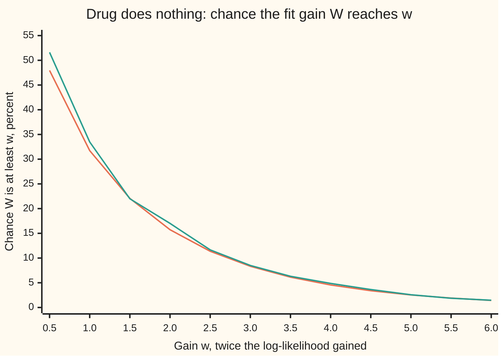
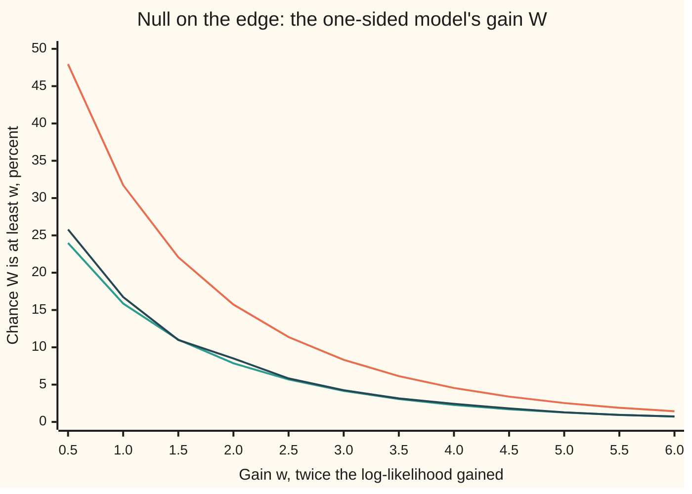

# Likelihood ratio tests: comparing two fits, and Wilks' chi-square rule

Probability and statistics → Confidence Intervals and Tests → Nested model comparison → Likelihood ratio tests

---

## General Overview

A drug trial: 45 of 100 patients recover on the drug, 35 of 100 on placebo. Two stories fit these numbers. The plain story has one recovery rate for everyone, so the drug makes no difference; its best single rate is 80 recoveries in 200, which is 0.40. The richer story gives each arm its own rate, 0.45 and 0.35. It has a second **parameter**: a number the model is free to set, here the drug arm's own rate.

The richer story always fits at least as well. It can set its two rates equal and copy the plain story exactly. So a better fit proves nothing by itself. The real question is whether the second parameter earns its keep: whether it improves the fit by more than chance alone would hand it.

A **likelihood ratio test** answers with one number. Score each story by its best **likelihood**: the chance it gives the data seen, with its parameters set as well as they can be ([maximum-likelihood](../07-Sampling%20and%20Estimation/04-maximum-likelihood.md)). Divide the plain story's best by the richer story's best: 0.352118. Minus twice its natural log is 2.087576. Samuel Wilks proved in 1938 that, when the plain story is true, this number behaves like a chi-square variable with one degree of freedom per parameter the plain story gives up, here one. A gain of 2.09 or more then turns up in about 15% of trials of a drug that does nothing, about 1 trial in 7. The second parameter has not earned its keep at the usual 5% level.

**Fit both models as well as each can, take twice the log of how much better the bigger one fits, and compare that with a chi-square law whose degrees of freedom count the parameters the smaller model gives up.**

**What kind of fact this is:** two theorems, and the test built on them. Wilks' rule is proved on this card in Why it works for the drug trial, and for any one-parameter model in a folded proof; its many-parameter form is stated. The Neyman–Pearson lemma, which says the likelihood ratio is the best test when both stories are fully specified, is proved on this card.

### The picture: how often chance alone produces each gain



Orange line: Wilks' prediction, the chi-square law with one degree of freedom. Teal line: the exact answer for this trial, computed by adding up the binomial chances of all 101 × 101 possible pairs of counts with both arms at the shared rate 0.40. They differ most at w = 0.5, 51.61 against 47.95, and by less than two points from w = 1.0 on. The observed gain 2.09 sits just past the 2.0 mark, where both lines read about 15 to 17%.

---

## The formula

Notation first. A hat marks an estimate: $\hat p_1 = 0.45$ is the observed recovery rate on the drug. The likelihood is written $L$ and its natural logarithm $\ell = \ln L$; logs turn the product of many patients' chances into a sum. A chi-square law with $m$ degrees of freedom, written $\chi^2_m$, is the law of a sum of $m$ squared independent standard bell-curve variables ([chi-square-tests](06-chi-square-tests.md)).

The likelihood ratio and the test statistic:

$$\Lambda = \frac{\text{best likelihood the smaller model allows}}{\text{best likelihood the bigger model allows}}, \qquad W = -2\ln\Lambda = 2\,\big[\ell_{\text{big}} - \ell_{\text{small}}\big]$$

**Read it aloud:** W is twice the log-likelihood the bigger model gains over the smaller one, each fitted as well as it can be.

For two arms with a recovered and a not-recovered cell each, the same number is a sum over the four cells:

$$W = 2\sum_{\text{4 cells}} O \ln\frac{O}{E}$$

**Read it aloud:** in each cell, the count seen times the log of seen over expected, where "expected" is what the one-rate model predicts; add the four and double.

This four-cell form is often called G, and the test the G-test.

Wilks' rule:

$$W \;\approx\; \chi^2_m \ \text{ when the smaller model is true}, \qquad m = (\text{free parameters, bigger}) - (\text{free parameters, smaller})$$

**Read it aloud:** if the smaller model is true, the gain behaves like a chi-square variable whose degrees of freedom count the parameters the smaller model pins down.

Here $m = 2 - 1 = 1$. Reject the smaller model at level $\alpha$ when $W \ge c$, where $c$ is the point the $\chi^2_m$ law exceeds with chance $\alpha$: for $m = 1$ and $\alpha = 0.05$, $c = 3.8415$.

The Neyman–Pearson lemma, for two **simple** hypotheses (each fixes every parameter, so each is one exact law):

$$\text{reject when } \frac{L_1(\text{data})}{L_0(\text{data})} \ge c_{\text{NP}}$$

**Read it aloud:** reject the null when the data are at least $c_{\text{NP}}$ times as likely under the alternative as under the null; no other rule with the same or smaller false-alarm rate catches the alternative more often.

| Symbol | Plain meaning | In our example | Push it up and the answer… |
| --- | --- | --- | --- |
| $x_1$, $n_1$ | recoveries and patients on the drug | 45, 100 | more recoveries: W grows |
| $x_2$, $n_2$ | recoveries and patients on placebo | 35, 100 | nearer 45: W shrinks toward 0 |
| $p_1$, $p_2$ | the true recovery rates on drug and placebo, unknown | unknown | — |
| $p_0$ | the one shared rate of the smaller model | unknown | — |
| $\hat p_1$, $\hat p_2$, $\hat p_0$ | the best-fitting rates: observed fractions | 0.45, 0.35, 0.40 | — |
| $L$, $\ell$, $L_0$, $L_1$ | likelihood, its log, and the likelihoods under a simple null and alternative | $\ell$ = −133.558545 (two rates), −134.602333 (one rate) | — |
| $\Lambda$ | best likelihood of the smaller model over that of the bigger; between 0 and 1 | 0.352118 | nearer 1: the extra parameter bought little |
| $W$ | the likelihood ratio statistic, −2 ln Λ | 2.087576 | the smaller model looks worse |
| $O$, $E$, $D$ | a cell's count seen, the count the one-rate model expects, and the gap O − E | 45, 40, 5 in the first cell | larger gaps: W grows roughly as their squares |
| $m$, $\chi^2_m$ | parameters given up, and the chi-square law with that many degrees of freedom | 1 | a larger m needs a larger W to reject |
| $c$, $\alpha$ | the cutoff, and the false-alarm rate it allows | 3.8415, 0.05 | smaller α: larger c, fewer rejections |
| $z$ | the two-proportion z statistic, the gap in rates over its spread under the null | 1.443376 | its square is Pearson's $X^2$ (written Q on chi-square-tests), close to W |
| $c_{\text{NP}}$ | the Neyman–Pearson threshold: how many times likelier the data must be under the alternative before the null is rejected | 5.4893 at n = 100 | fewer rejections, less power |

### When it holds

- **Nested models.** The smaller model is the bigger one with some parameters pinned, here $p_1 = p_2$. Two unrelated models, say a binomial against a Poisson, have no chi-square rule, and their W can even come out negative.
- **The null value inside the parameter range, not on its edge.** If the bigger model forbids the drug from doing worse than placebo, "no difference" sits on the edge. Then W is 0 about half the time, and the 3.8415 cutoff gives false alarms in 0.0257 of trials, not 0.05.
- **A smooth model whose possible outcomes do not depend on the parameter, and different parameter values give different laws.** The proof expands the log-likelihood as a parabola; a jump, a moving range of outcomes, or two parameter values giving the same law breaks that step.
- **Independent patients, and enough of them.** Wilks' rule is a large-sample rule. At 100 per arm and a shared rate of 0.40, the exact false-alarm rate of the 3.8415 cutoff is 0.0514, close to the promised 0.05.
- **Neyman–Pearson: two simple hypotheses.** Against a whole range of alternative rates there is, in general, no single most powerful test.

---

## Why it works

### Step 0: a bigger model always wins on fit, so measure the win against chance

The bigger model contains the smaller one, so its best fit is at least as good: $W \ge 0$ on every data set. Even when the drug does nothing, the drug arm's own rate chases the noise in its 100 patients and gains a little. Wilks' rule says how much: about 1 on average per pinned parameter, since a $\chi^2_1$ variable averages 1. For this trial the exact average gain under the null is 1.0081. The test asks whether the observed gain is large compared with that.

### Step 1: fit each model and take the log of the ratio

Each patient recovers or not, so an arm with x recoveries in n patients has log-likelihood $x \ln p + (n - x)\ln(1 - p)$, dropping the count of orderings, which is the same in both models and cancels from the ratio. [maximum-likelihood](../07-Sampling%20and%20Estimation/04-maximum-likelihood.md) shows the best rate is the observed fraction. The two-rate model takes 0.45 and 0.35; the one-rate model takes 80/200 = 0.40. The code finds all three again by golden-section search, a method that narrows an interval around the peak without using the formula.

Best log-likelihoods: −133.558545 with two rates, −134.602333 with one. The gain is 1.043788, so $W = 2.087576$.

The four-cell form follows cell by cell. In the drug arm's recovered cell the gain is $45(\ln 0.45 - \ln 0.40) = 45\ln(45/40)$, and 40 is exactly $E$, the count the one-rate model expects: 100 × 0.40. The other three cells go the same way.

### Step 2: near the smaller model, the gain is a sum of squares

Write each count as expected plus gap, $O = E + D$. Here every gap is 5 in size: 45 − 40, 55 − 60, 35 − 40, 65 − 60. The logarithm near 1 is almost a parabola: $\ln(1 + u) = u - u^2/2 + u^3/3 - \dots$ With $u = D/E$,

$$O\ln\frac{O}{E} = (E + D)\Big(\frac{D}{E} - \frac{D^2}{2E^2} + \dots\Big) = D + \frac{D^2}{2E} + (\text{terms in } D^3/E^2).$$

In each arm the two gaps cancel, +5 and −5, because both models put exactly 100 patients in that arm. So the $D$ terms add to zero and, after doubling,

$$W \approx \sum_{\text{4 cells}} \frac{D^2}{E} = 25\Big(\frac1{40} + \frac1{60} + \frac1{40} + \frac1{60}\Big) = 2.083333.$$

That is Pearson's $X^2$, the statistic of [chi-square-tests](06-chi-square-tests.md). It differs from W = 2.087576 by 0.004243, the higher-order terms. With equal arms the cubic terms cancel, so this is mostly the quartic term, in $D^4/E^3$. Pearson's test is the likelihood ratio test with the logarithm replaced by its parabola.

### Step 3: the sum of squares is one squared bell-curve variable

With two arms, the four squared gaps are one number seen four times, so $X^2$ collapses to a single square: $X^2 = z^2$, where

$$z = \frac{\hat p_1 - \hat p_2}{\sqrt{\hat p_0(1 - \hat p_0)\,(1/n_1 + 1/n_2)}} = \frac{0.10}{\sqrt{0.24 \times 0.02}} = 1.443376.$$

The top is the gap between the two observed rates. The bottom is that gap's standard deviation when both arms share one rate. When the drug does nothing, the gap averages 0, and by the central limit theorem it is close to a bell curve ([normal-approximation-to-binomial](../06-Limit%20Theorems%20in%20Practice/03-normal-approximation-to-binomial.md)). So $z$ is close to a standard normal, its square is close to $\chi^2_1$, and W, which differs from $z^2$ only by small higher-order terms, is close to $\chi^2_1$ too. That is Wilks' rule for this trial, with $m = 1$.

<details>
<summary>The algebra behind $X^2 = z^2$</summary>

Write the shared rate as $\hat p_0$ and its complement as $1 - \hat p_0$. The drug arm's recovered gap is $n_1(\hat p_1 - \hat p_0)$. Since $\hat p_0 = (n_1\hat p_1 + n_2\hat p_2)/(n_1 + n_2)$, that gap is $d = n_1 n_2(\hat p_1 - \hat p_2)/(n_1 + n_2)$, and the other three gaps are $\pm d$. The four expected counts are $n_1\hat p_0$, $n_1(1 - \hat p_0)$, $n_2\hat p_0$, $n_2(1 - \hat p_0)$, whose reciprocals add to $(1/n_1 + 1/n_2)/\big(\hat p_0(1 - \hat p_0)\big)$. Multiply by $d^2$:
$$X^2 = \frac{n_1 n_2(\hat p_1 - \hat p_2)^2}{(n_1 + n_2)\,\hat p_0(1 - \hat p_0)} = \frac{(\hat p_1 - \hat p_2)^2}{\hat p_0(1 - \hat p_0)(1/n_1 + 1/n_2)} = z^2.$$

</details>

### Step 4: in general, each pinned parameter adds one squared bell curve

**Wilks' theorem.** Suppose the observations are independent draws from a smooth model with k free parameters, different parameter values give different laws, and the set of possible outcomes does not depend on the parameters. The smaller model pins $m$ of them, and the true values lie strictly inside the parameter range. Then, as the number of observations grows, the chance that $W \le w$ tends to the chance that a $\chi^2_m$ variable is at most w, for every w.

The idea is Steps 2 and 3 in any model. Near its peak the log-likelihood is a parabola. The fitted parameters sit where the bumps of random noise put the peak. Pinning a parameter moves the fit from the peak, and the log-likelihood lost is a squared distance, measured in units of the noise. Each pinned direction contributes one squared, roughly standard normal distance. The folded proof does this for one parameter; the $m$-parameter version runs the same steps with a matrix in place of a number and is proved in Wilks' 1938 paper (Sources).

<details>
<summary>Detailed proof: Wilks' rule for one parameter</summary>

Take n independent observations from a model with one parameter; call it p as in the trial, though nothing below uses the binomial form. The null pins $p = p_0$, strictly inside the parameter range. Write $\ell(p)$ for the log-likelihood of all n observations and $\hat p$ for its maximiser.

**The score is a sum of independent pieces.** The slope $\ell'(p_0)$ is a sum of n independent terms, one per observation, each the slope of that observation's log-chance. Because the set of possible outcomes does not move with p, each term averages 0 and has variance $I(p_0)$, assumed positive: the Fisher information per observation ([fisher-information-and-cramer-rao](../07-Sampling%20and%20Estimation/07-fisher-information-and-cramer-rao.md)). By the central limit theorem, $\ell'(p_0)/\sqrt{nI(p_0)}$ is close to a standard normal $Z$.

**The curvature settles.** The second derivative $\ell''(p)/n$ is an average of n independent terms. By the law of large numbers, near $p_0$ it is close to its expectation, which at $p_0$ equals $-I(p_0)$; smoothness keeps it close on a small interval around $p_0$.

**The fit lands near the truth.** Because different values of p give different laws, the average log-likelihood is highest at $p_0$ in the long run, so $\hat p$ lies near $p_0$ for large n. Because $p_0$ is inside the range, $\hat p$ is an interior peak with $\ell'(\hat p) = 0$.

**Expand twice.** Taylor's theorem with the mean-value remainder gives $0 = \ell'(\hat p) = \ell'(p_0) + (\hat p - p_0)\,\ell''(a)$ for some point a between $p_0$ and $\hat p$. So $\hat p - p_0 \approx \ell'(p_0)/\big(nI(p_0)\big)$. Expanding around the peak, where the slope is 0, gives $\ell(p_0) = \ell(\hat p) + \tfrac12(p_0 - \hat p)^2\,\ell''(b)$ for some point b between them. Hence
$$W = 2\big[\ell(\hat p) - \ell(p_0)\big] = -(\hat p - p_0)^2\,\ell''(b) \approx nI(p_0)(\hat p - p_0)^2 \approx \frac{\ell'(p_0)^2}{nI(p_0)} \approx Z^2.$$
The errors in each "≈" shrink to 0 as n grows, so W's law tends to that of $Z^2$, which is $\chi^2_1$.

Each hypothesis was used once: fixed outcome set for the score's zero average, identifiability for the fit landing near $p_0$, an interior $p_0$ for the zero slope at $\hat p$, smoothness for both expansions, positive information for dividing by $I(p_0)$. The What breaks section shows the interior condition failing.

</details>

### Step 5: for two exact laws, the likelihood ratio is the best test there is

Now drop the unknowns. Suppose the placebo's rate is known to be 0.35 and the drug's makers claim exactly 0.45. Look only at the drug arm's count out of 100. Both hypotheses are simple: each is one exact binomial law. The ratio of their chances for a count $x$ is $(0.45/0.35)^x(0.55/0.65)^{100 - x}$, which rises with $x$. So "reject when the ratio is at least $c_{\text{NP}}$" means "reject when the count is at least some cutoff". The lowest cutoff whose false-alarm rate stays at or under 5% is 44 recoveries: false alarms 0.0389, and a trial of a drug that truly works at 0.45 is caught with chance 0.6172, the **power**. The ratio at 44 is 5.4893.

**Neyman–Pearson lemma.** Let $R^*$ be the set of outcomes where $L_1 \ge c_{\text{NP}}\,L_0$. Any other rejection set R whose false-alarm chance is no larger than that of $R^*$ has power no larger.

*Proof.* Split the power difference over outcomes in one set and not the other:
$$P_1(R^*) - P_1(R) = \sum_{R^*\setminus R} L_1 - \sum_{R\setminus R^*} L_1 \;\ge\; c_{\text{NP}}\sum_{R^*\setminus R} L_0 - c_{\text{NP}}\sum_{R\setminus R^*} L_0 = c_{\text{NP}}\,\big[P_0(R^*) - P_0(R)\big] \;\ge\; 0.$$
The first inequality holds because inside $R^*$ each outcome has $L_1 \ge c_{\text{NP}}L_0$, and outside it $L_1 < c_{\text{NP}}L_0$. The last holds because R spends no more false-alarm chance than $R^*$. So $R^*$ spends its false-alarm allowance on the outcomes that buy the most power per unit spent.

The code checks this by brute force on a smaller trial of 10 patients: the likelihood ratio rule "reject at 7 or more" has false alarms 0.0260 and power 0.1020, and the best power among all 2,048 possible rejection sets with false alarms at most 0.0260 is also 0.1020.

The likelihood ratio test carries this ratio over to hypotheses with free parameters by replacing each likelihood with its best fit. The optimality does not carry over in general; the calibration, Wilks' rule, does. Two other routes agree with it to first order: Pearson's $X^2$ (Step 2) and the two-proportion z test of [hypothesis-tests-and-p-values](03-hypothesis-tests-and-p-values.md), its square root (Step 3).

---

## Worked numbers, by hand

The drug trial: 45 of 100 recover on the drug, 35 of 100 on placebo.

| Step | Arithmetic | Value |
| --- | --- | --- |
| shared rate $\hat p_0$ | 80 / 200 | 0.40 |
| expected counts $E$ | 100 × 0.40, 100 × 0.60, twice | 40, 60, 40, 60 |
| drug, recovered | 45 × ln(45/40) = 45 × 0.117783 | 5.300237 |
| drug, not recovered | 55 × ln(55/60) = 55 × (−0.087011) | −4.785626 |
| placebo, recovered | 35 × ln(35/40) = 35 × (−0.133531) | −4.673599 |
| placebo, not recovered | 65 × ln(65/60) = 65 × 0.080043 | 5.202776 |
| log-likelihood gained | sum of the four | 1.043788 |
| $W$ | 2 × 1.043788 | 2.087576 |
| $\Lambda$ | e^(−1.043788) | 0.352118 |
| degrees of freedom $m$ | 2 parameters − 1 | 1 |
| cutoff $c$ at 5% | bisection on the $\chi^2_1$ tail | 3.8415 |
| **p-value** | $P(\chi^2_1 \ge 2.087576) = 2\big(1 - \Phi(\sqrt{2.087576})\big)$ | **0.1485** |

Here Φ is the standard bell curve's area to the left of a point, and a $\chi^2_1$ variable exceeds w exactly when a standard normal lands more than $\sqrt w$ from 0, on either side.

Read back in the trial: if the drug did nothing, a gain in fit this large would appear in about 1 trial in 7. The data do not rule out "no difference". They do not show it either: the observed difference is 0.10, with a standard error of 0.0689, so a real benefit of that size is still quite possible. The exact p-value for this trial, summed over all pairs of counts at the shared rate 0.40, is 0.1519; 20,000 simulated trials give 0.1541 with standard error 0.0026.

### What breaks if you drop a piece

| Mistake | Comes out at | What went wrong |
| --- | --- | --- |
| Drop the 2: compare 1.043788 with $\chi^2_1$ | p = 0.3069 | The chi-square rule is for twice the log-likelihood gained |
| Degrees of freedom = 2, the bigger model's parameter count | p = 0.3521 | m is the difference in parameter counts, 2 − 1 |
| Null on the edge: the bigger model forbids the drug from doing worse, cutoff still 3.8415 | false alarms 0.0257, not 0.05 | Whenever placebo does better, the constrained fit is the shared rate and W = 0; that is about half of all null trials |
| Two-sided rule "count ≤ 25 or ≥ 45" for the simple test of 0.35 against 0.45 | false alarms 0.0457, power 0.5387 | Spends false alarms on low counts, which the alternative makes rarer; the Neyman–Pearson rule gets power 0.6172 on 0.0389 |

The third row is the interior condition failing. Its law is not $\chi^2_1$ but an even mix of "exactly 0" and $\chi^2_1$, so every tail chance is halved:



Orange line: the $\chi^2_1$ tail that Wilks' rule would wrongly promise. Teal line: half of it, the rule Herman Chernoff proved for a null on the edge. Dark line: the exact tail of the one-sided model's W for this trial, which follows the teal line. The fix is to read the p-value from the halved law, or equivalently to use the cutoff where the $\chi^2_1$ tail is 0.10.

---

## Code, from first principles, and it actually runs

The scripts build every tool themselves: the bell curve's area by a Taylor series, checked by Simpson's rule (adding thin slices under the curve); the 5% cutoff by bisection (halving an interval that holds the answer); random numbers by a SplitMix64 generator with seed 20260928, identical in both languages. W is reached two ways: the four-cell formula, and golden-section search on each log-likelihood. Its p-value is reached three ways: Wilks' chi-square tail, exact enumeration of all 10,201 pairs of counts at the shared rate, and 20,000 simulated trials with a standard error. The Neyman–Pearson lemma is checked against all 2,048 rejection sets for a 10-patient arm. Every number on the card, including every plotted point, is printed below.

### Python

```python
# Likelihood ratio tests -- the check behind the card.  Standard library only.
# Drug trial: 45 of 100 recover on the drug, 35 of 100 on placebo.
# One shared recovery rate (1 parameter) against one rate per arm (2 parameters).
from math import log, exp, sqrt, pi

def Phi(x):                                   # bell-curve area left of x, Taylor series of erf
    t, s, n, y = x / sqrt(2.0), 0.0, 0, x / sqrt(2.0)
    while abs(t) > 1e-17:
        s, n = s + t / (2 * n + 1), n + 1
        t *= -y * y / n
    return 0.5 + s / sqrt(pi)

def Phi_simpson(x, m=2000):                   # second road: Simpson's rule on the bell-curve height
    h = x / m
    f = lambda u: exp(-u * u / 2) / sqrt(2 * pi)
    s = f(0) + f(x) + sum((4 if i % 2 else 2) * f(i * h) for i in range(1, m))
    return 0.5 + s * h / 3

def tail1(w):                                 # chance a chi-square with 1 degree of freedom exceeds w
    return 2.0 * (1.0 - Phi(sqrt(w))) if w > 0 else 1.0

def xlogy(x, y): return x * log(y) if x > 0 else 0.0
def loglik(x, n, p): return xlogy(x, p) + xlogy(n - x, 1 - p)

def W_formula(x1, x2, n1, n2):                # 2 * sum O ln(O/E) over the four cells
    pool = (x1 + x2) / (n1 + n2)
    cells = [(x1, n1 * pool), (n1 - x1, n1 * (1 - pool)), (x2, n2 * pool), (n2 - x2, n2 * (1 - pool))]
    return 2 * sum(o * log(o / e) for o, e in cells if o > 0)

def golden_max(f, lo=1e-12, hi=1 - 1e-12):   # golden-section search: no closed-form estimate used
    g = (sqrt(5) - 1) / 2
    a, b = lo, hi
    for _ in range(200):
        c, d = b - g * (b - a), a + g * (b - a)
        a, b = (a, d) if f(c) > f(d) else (c, b)
    return (a + b) / 2

def binom_pmf(n, p):                          # all binomial chances, by the ratio rule
    out = [(1 - p) ** n]
    for k in range(n):
        out.append(out[-1] * (n - k) / (k + 1) * p / (1 - p))
    return out

def splitmix(state):
    state = (state + 0x9E3779B97F4A7C15) & 0xFFFFFFFFFFFFFFFF
    z = state
    z = ((z ^ (z >> 30)) * 0xBF58476D1CE4E5B9) & 0xFFFFFFFFFFFFFFFF
    z = ((z ^ (z >> 27)) * 0x94D049BB133111EB) & 0xFFFFFFFFFFFFFFFF
    return state, (z ^ (z >> 31)) >> 11

x1, n1, x2, n2 = 45, 100, 35, 100
pool = (x1 + x2) / (n1 + n2)
# ---- road 1: the closed form ----
W = W_formula(x1, x2, n1, n2)
for o, e in ((45, 40), (55, 60), (35, 40), (65, 60)):
    print(f"cell O={o} E={e}: ln(O/E)={log(o / e):.6f}  O*ln(O/E)={o * log(o / e):.6f}")
print(f"W (closed form) = {W:.6f};  W/2 = {W / 2:.6f};  Lambda = exp(-W/2) = {exp(-W / 2):.6f}")
se = lambda p, n: sqrt(p * (1 - p) / n)
print(f"estimates: drug {x1 / n1:.2f} (se {se(x1 / n1, n1):.4f}), placebo {x2 / n2:.2f} (se {se(x2 / n2, n2):.4f}), difference {x1 / n1 - x2 / n2:.2f} (se {sqrt(se(x1 / n1, n1) ** 2 + se(x2 / n2, n2) ** 2):.4f})")
# ---- road 2: maximise each log-likelihood numerically ----
q1 = golden_max(lambda p: loglik(x1, n1, p)); q2 = golden_max(lambda p: loglik(x2, n2, p))
q0 = golden_max(lambda p: loglik(x1, n1, p) + loglik(x2, n2, p))
l_full, l_null = loglik(x1, n1, q1) + loglik(x2, n2, q2), loglik(x1, n1, q0) + loglik(x2, n2, q0)
W_num = 2 * (l_full - l_null)
print(f"golden search: p_drug={q1:.6f} p_placebo={q2:.6f} p_shared={q0:.6f}")
print(f"log-lik two rates={l_full:.6f} one rate={l_null:.6f}  W (search) = {W_num:.6f}")
assert abs(W - W_num) < 1e-8
# ---- the quadratic approximation: Pearson's X^2 = z^2 ----
z = (x1 / n1 - x2 / n2) / sqrt(pool * (1 - pool) * (1 / n1 + 1 / n2))
print(f"two-proportion z = {z:.6f};  z^2 = Pearson X^2 = {z * z:.6f};  W - X^2 = {W - z * z:.6f}")
assert abs(W - z * z) < 0.01
# ---- Wilks: chi-square tail with 1 degree of freedom; Phi two ways ----
print(f"Phi(1.96): series {Phi(1.96):.10f}  Simpson {Phi_simpson(1.96):.10f}")
assert abs(Phi(1.96) - Phi_simpson(1.96)) < 1e-10
lo, hi = 0.0, 20.0
for _ in range(100):
    mid = (lo + hi) / 2
    if tail1(mid) > 0.05: lo = mid
    else: hi = mid
crit = (lo + hi) / 2
p_chi = tail1(W)
print(f"5% cutoff (bisection) = {crit:.4f};  p-value by chi-square(1) = {p_chi:.4f}")
# ---- road 3: exact enumeration of W over all 101 x 101 outcomes, both arms at the shared rate ----
pm1, pm2 = binom_pmf(n1, pool), binom_pmf(n2, pool)
Ws, Wone = [], []
for a in range(n1 + 1):
    for b in range(n2 + 1):
        w, pr = W_formula(a, b, n1, n2), pm1[a] * pm2[b]
        Ws.append((w, pr)); Wone.append((w if a * n2 >= b * n1 else 0.0, pr))
ex_tail = lambda L, w: sum(pr for v, pr in L if v >= w - 1e-12)
p_exact = ex_tail(Ws, W)
size_exact, size_one = ex_tail(Ws, crit), ex_tail(Wone, crit)
print(f"exact at rate {pool:.2f}: P(W >= {W:.4f}) = {p_exact:.4f};  mean W = {sum(v * pr for v, pr in Ws):.4f}")
print(f"exact size of 'reject if W >= {crit:.4f}': two-rate model {size_exact:.4f}")
assert abs(p_chi - p_exact) < 0.01
# ---- road 4: simulation, SplitMix64 seed 20260928 ----
st, R, hitp, hit5 = 20260928, 20000, 0, 0
for _ in range(R):
    c = [0, 0]
    for arm, n in ((0, n1), (1, n2)):
        for _ in range(n):
            st, u = splitmix(st)
            c[arm] += u < pool * 2 ** 53
    w = W_formula(c[0], c[1], n1, n2)
    hitp += w >= W - 1e-12; hit5 += w >= crit
fp, f5 = hitp / R, hit5 / R
sp, s5 = sqrt(fp * (1 - fp) / R), sqrt(f5 * (1 - f5) / R)
print(f"simulated {R} trials: P(W >= {W:.4f}) = {fp:.4f} (se {sp:.4f});  size at cutoff = {f5:.4f} (se {s5:.4f})")
assert abs(fp - p_exact) < 4 * sp and abs(f5 - size_exact) < 4 * s5
# ---- the chart: exact tail against Wilks' chi-square tail, in percent ----
grid = [0.5 * i for i in range(1, 13)]
print("chart, w:", ", ".join(f"{w:.1f}" for w in grid))
print("chart, chi-square(1) %:", ", ".join(f"{100 * tail1(w):.2f}" for w in grid))
print("chart, exact two-rate %:", ", ".join(f"{100 * ex_tail(Ws, w):.2f}" for w in grid))
print("chart, half chi-square(1) %:", ", ".join(f"{50 * tail1(w):.2f}" for w in grid))
print("chart, exact one-sided %:", ", ".join(f"{100 * ex_tail(Wone, w):.2f}" for w in grid))
# ---- what breaks ----
print(f"breaks: size of one-sided model at {crit:.4f} = {size_one:.4f} (half of two-rate: {size_exact / 2:.4f})")
assert abs(size_one - size_exact / 2) < 0.005
print(f"breaks: drop the 2 -> p = {tail1(W / 2):.4f};  2 degrees of freedom -> p = {exp(-W / 2):.4f}")
# ---- Neyman-Pearson: drug arm alone, rate 0.35 against rate 0.45 ----
for n, alpha in ((100, 0.05), (10, 0.05)):
    f0, f1 = binom_pmf(n, 0.35), binom_pmf(n, 0.45)
    c = next(k for k in range(n + 1) if sum(f0[k:]) <= alpha)
    size, power = sum(f0[c:]), sum(f1[c:])
    print(f"NP n={n}: reject if count >= {c}; size {size:.4f}; power {power:.4f}; ratio at cutoff {f1[c] / f0[c]:.4f}")
    if n == 100: print(f"NP n=100: two-sided rule |count-35| >= 10 has size {sum(f0[:26]) + sum(f0[45:]):.4f}, power {sum(f1[:26]) + sum(f1[45:]):.4f}")
best = max(sum(f1[k] for k in range(11) if m >> k & 1)
           for m in range(2 ** 11) if sum(f0[k] for k in range(11) if m >> k & 1) <= size + 1e-15)
print(f"NP n=10: best power over all 2048 rejection sets of size <= {size:.4f}: {best:.4f}")
assert abs(best - power) < 1e-12
# ---- try changing ----
for (a, na, b, nb) in ((90, 200, 70, 200), (45, 100, 25, 100), (45, 100, 42, 100)):
    w = W_formula(a, b, na, nb)
    print(f"try: {a}/{na} vs {b}/{nb}: W = {w:.4f}, p = {tail1(w):.4f}")
print("all checks passed")
```

**Ran 2026-09-28 on macOS, Python 3.14.6, standard library only. All checks passed. Output, pasted from the run:**

```
cell O=45 E=40: ln(O/E)=0.117783  O*ln(O/E)=5.300237
cell O=55 E=60: ln(O/E)=-0.087011  O*ln(O/E)=-4.785626
cell O=35 E=40: ln(O/E)=-0.133531  O*ln(O/E)=-4.673599
cell O=65 E=60: ln(O/E)=0.080043  O*ln(O/E)=5.202776
W (closed form) = 2.087576;  W/2 = 1.043788;  Lambda = exp(-W/2) = 0.352118
estimates: drug 0.45 (se 0.0497), placebo 0.35 (se 0.0477), difference 0.10 (se 0.0689)
golden search: p_drug=0.450000 p_placebo=0.350000 p_shared=0.400000
log-lik two rates=-133.558545 one rate=-134.602333  W (search) = 2.087576
two-proportion z = 1.443376;  z^2 = Pearson X^2 = 2.083333;  W - X^2 = 0.004243
Phi(1.96): series 0.9750021049  Simpson 0.9750021049
5% cutoff (bisection) = 3.8415;  p-value by chi-square(1) = 0.1485
exact at rate 0.40: P(W >= 2.0876) = 0.1519;  mean W = 1.0081
exact size of 'reject if W >= 3.8415': two-rate model 0.0514
simulated 20000 trials: P(W >= 2.0876) = 0.1541 (se 0.0026);  size at cutoff = 0.0510 (se 0.0016)
chart, w: 0.5, 1.0, 1.5, 2.0, 2.5, 3.0, 3.5, 4.0, 4.5, 5.0, 5.5, 6.0
chart, chi-square(1) %: 47.95, 31.73, 22.07, 15.73, 11.38, 8.33, 6.14, 4.55, 3.39, 2.53, 1.90, 1.43
chart, exact two-rate %: 51.61, 33.48, 21.99, 17.01, 11.66, 8.50, 6.31, 4.87, 3.63, 2.57, 1.87, 1.47
chart, half chi-square(1) %: 23.98, 15.87, 11.03, 7.86, 5.69, 4.16, 3.07, 2.28, 1.69, 1.27, 0.95, 0.72
chart, exact one-sided %: 25.80, 16.74, 10.99, 8.51, 5.83, 4.25, 3.15, 2.43, 1.81, 1.29, 0.94, 0.74
breaks: size of one-sided model at 3.8415 = 0.0257 (half of two-rate: 0.0257)
breaks: drop the 2 -> p = 0.3069;  2 degrees of freedom -> p = 0.3521
NP n=100: reject if count >= 44; size 0.0389; power 0.6172; ratio at cutoff 5.4893
NP n=100: two-sided rule |count-35| >= 10 has size 0.0457, power 0.5387
NP n=10: reject if count >= 7; size 0.0260; power 0.1020; ratio at cutoff 3.5185
NP n=10: best power over all 2048 rejection sets of size <= 0.0260: 0.1020
try: 90/200 vs 70/200: W = 4.1752, p = 0.0410
try: 45/100 vs 25/100: W = 8.8839, p = 0.0029
try: 45/100 vs 42/100: W = 0.1831, p = 0.6687
all checks passed
```

### Rust

```rust
// Likelihood ratio tests -- the check behind the card.  Rust std only, no crates.
// Drug trial: 45 of 100 recover on the drug, 35 of 100 on placebo.
// One shared recovery rate (1 parameter) against one rate per arm (2 parameters).
use std::f64::consts::PI;

fn phi(x: f64) -> f64 { // bell-curve area left of x, Taylor series of erf
    let y = x / 2f64.sqrt();
    let (mut t, mut s, mut n) = (y, 0.0, 0.0);
    while t.abs() > 1e-17 { s += t / (2.0 * n + 1.0); n += 1.0; t *= -y * y / n; }
    0.5 + s / PI.sqrt()
}
fn phi_simpson(x: f64, m: usize) -> f64 { // second road: Simpson's rule on the bell-curve height
    let h = x / m as f64;
    let f = |u: f64| (-u * u / 2.0).exp() / (2.0 * PI).sqrt();
    let inner: f64 = (1..m).map(|i| (if i % 2 == 1 { 4.0 } else { 2.0 }) * f(i as f64 * h)).sum();
    0.5 + (f(0.0) + f(x) + inner) * h / 3.0
}
fn tail1(w: f64) -> f64 { if w > 0.0 { 2.0 * (1.0 - phi(w.sqrt())) } else { 1.0 } }
fn xlogy(x: f64, y: f64) -> f64 { if x > 0.0 { x * y.ln() } else { 0.0 } }
fn loglik(x: f64, n: f64, p: f64) -> f64 { xlogy(x, p) + xlogy(n - x, 1.0 - p) }
fn w_formula(x1: usize, x2: usize, n1: usize, n2: usize) -> f64 { // 2 * sum O ln(O/E)
    let pool = (x1 + x2) as f64 / (n1 + n2) as f64;
    let cells = [(x1 as f64, n1 as f64 * pool), ((n1 - x1) as f64, n1 as f64 * (1.0 - pool)),
                 (x2 as f64, n2 as f64 * pool), ((n2 - x2) as f64, n2 as f64 * (1.0 - pool))];
    2.0 * cells.iter().filter(|c| c.0 > 0.0).map(|&(o, e)| o * (o / e).ln()).sum::<f64>()
}
fn golden_max<F: Fn(f64) -> f64>(f: F) -> f64 { // golden-section search, no closed form used
    let g = (5f64.sqrt() - 1.0) / 2.0;
    let (mut a, mut b) = (1e-12, 1.0 - 1e-12);
    for _ in 0..200 {
        let (c, d) = (b - g * (b - a), a + g * (b - a));
        if f(c) > f(d) { b = d } else { a = c }
    }
    (a + b) / 2.0
}
fn binom_pmf(n: usize, p: f64) -> Vec<f64> { // all binomial chances, by the ratio rule
    let mut out = vec![(1.0 - p).powi(n as i32)];
    for k in 0..n { let last = out[k]; out.push(last * (n - k) as f64 / (k + 1) as f64 * p / (1.0 - p)); }
    out
}
fn splitmix(state: &mut u64) -> u64 {
    *state = state.wrapping_add(0x9E3779B97F4A7C15);
    let mut z = *state;
    z = (z ^ (z >> 30)).wrapping_mul(0xBF58476D1CE4E5B9);
    z = (z ^ (z >> 27)).wrapping_mul(0x94D049BB133111EB);
    (z ^ (z >> 31)) >> 11
}
fn ex_tail(l: &[(f64, f64)], w: f64) -> f64 { l.iter().filter(|v| v.0 >= w - 1e-12).map(|v| v.1).sum() }
fn join(v: &[f64], d: usize) -> String { v.iter().map(|x| format!("{:.*}", d, x)).collect::<Vec<_>>().join(", ") }

fn main() {
    let (x1, n1, x2, n2) = (45usize, 100usize, 35usize, 100usize);
    let pool = (x1 + x2) as f64 / (n1 + n2) as f64;
    // ---- road 1: the closed form ----
    let w = w_formula(x1, x2, n1, n2);
    for (o, e) in [(45.0f64, 40.0f64), (55.0, 60.0), (35.0, 40.0), (65.0, 60.0)] {
        println!("cell O={} E={}: ln(O/E)={:.6}  O*ln(O/E)={:.6}", o, e, (o / e).ln(), o * (o / e).ln());
    }
    println!("W (closed form) = {:.6};  W/2 = {:.6};  Lambda = exp(-W/2) = {:.6}", w, w / 2.0, (-w / 2.0).exp());
    let se = |p: f64, n: usize| (p * (1.0 - p) / n as f64).sqrt();
    let (e1, e2) = (x1 as f64 / n1 as f64, x2 as f64 / n2 as f64);
    println!("estimates: drug {:.2} (se {:.4}), placebo {:.2} (se {:.4}), difference {:.2} (se {:.4})", e1, se(e1, n1), e2, se(e2, n2), e1 - e2, (se(e1, n1).powi(2) + se(e2, n2).powi(2)).sqrt());
    // ---- road 2: maximise each log-likelihood numerically ----
    let (a1, b1, a2, b2) = (x1 as f64, n1 as f64, x2 as f64, n2 as f64);
    let q1 = golden_max(|p| loglik(a1, b1, p));
    let q2 = golden_max(|p| loglik(a2, b2, p));
    let q0 = golden_max(|p| loglik(a1, b1, p) + loglik(a2, b2, p));
    let l_full = loglik(a1, b1, q1) + loglik(a2, b2, q2);
    let l_null = loglik(a1, b1, q0) + loglik(a2, b2, q0);
    let w_num = 2.0 * (l_full - l_null);
    println!("golden search: p_drug={:.6} p_placebo={:.6} p_shared={:.6}", q1, q2, q0);
    println!("log-lik two rates={:.6} one rate={:.6}  W (search) = {:.6}", l_full, l_null, w_num);
    assert!((w - w_num).abs() < 1e-8);
    // ---- the quadratic approximation: Pearson's X^2 = z^2 ----
    let z = (a1 / b1 - a2 / b2) / (pool * (1.0 - pool) * (1.0 / b1 + 1.0 / b2)).sqrt();
    println!("two-proportion z = {:.6};  z^2 = Pearson X^2 = {:.6};  W - X^2 = {:.6}", z, z * z, w - z * z);
    assert!((w - z * z).abs() < 0.01);
    // ---- Wilks: chi-square tail with 1 degree of freedom; Phi two ways ----
    println!("Phi(1.96): series {:.10}  Simpson {:.10}", phi(1.96), phi_simpson(1.96, 2000));
    assert!((phi(1.96) - phi_simpson(1.96, 2000)).abs() < 1e-10);
    let (mut lo, mut hi) = (0.0f64, 20.0f64);
    for _ in 0..100 { let mid = (lo + hi) / 2.0; if tail1(mid) > 0.05 { lo = mid } else { hi = mid } }
    let crit = (lo + hi) / 2.0;
    let p_chi = tail1(w);
    println!("5% cutoff (bisection) = {:.4};  p-value by chi-square(1) = {:.4}", crit, p_chi);
    // ---- road 3: exact enumeration of W over all 101 x 101 outcomes, both arms at the shared rate ----
    let (pm1, pm2) = (binom_pmf(n1, pool), binom_pmf(n2, pool));
    let (mut ws, mut wone) = (Vec::new(), Vec::new());
    for a in 0..=n1 {
        for b in 0..=n2 {
            let (v, pr) = (w_formula(a, b, n1, n2), pm1[a] * pm2[b]);
            ws.push((v, pr));
            wone.push((if a * n2 >= b * n1 { v } else { 0.0 }, pr));
        }
    }
    let p_exact = ex_tail(&ws, w);
    let (size_exact, size_one) = (ex_tail(&ws, crit), ex_tail(&wone, crit));
    let mean_w: f64 = ws.iter().map(|v| v.0 * v.1).sum();
    println!("exact at rate {:.2}: P(W >= {:.4}) = {:.4};  mean W = {:.4}", pool, w, p_exact, mean_w);
    println!("exact size of 'reject if W >= {:.4}': two-rate model {:.4}", crit, size_exact);
    assert!((p_chi - p_exact).abs() < 0.01);
    // ---- road 4: simulation, SplitMix64 seed 20260928 ----
    let (mut st, r, mut hitp, mut hit5) = (20260928u64, 20000usize, 0usize, 0usize);
    let thresh = pool * 9007199254740992.0;
    for _ in 0..r {
        let mut c = [0usize, 0usize];
        for (arm, n) in [(0usize, n1), (1usize, n2)] {
            for _ in 0..n { if (splitmix(&mut st) as f64) < thresh { c[arm] += 1; } }
        }
        let v = w_formula(c[0], c[1], n1, n2);
        if v >= w - 1e-12 { hitp += 1; }
        if v >= crit { hit5 += 1; }
    }
    let (fp, f5) = (hitp as f64 / r as f64, hit5 as f64 / r as f64);
    let (sp, s5) = ((fp * (1.0 - fp) / r as f64).sqrt(), (f5 * (1.0 - f5) / r as f64).sqrt());
    println!("simulated {} trials: P(W >= {:.4}) = {:.4} (se {:.4});  size at cutoff = {:.4} (se {:.4})", r, w, fp, sp, f5, s5);
    assert!((fp - p_exact).abs() < 4.0 * sp && (f5 - size_exact).abs() < 4.0 * s5);
    // ---- the chart: exact tail against Wilks' chi-square tail, in percent ----
    let grid: Vec<f64> = (1..13).map(|i| 0.5 * i as f64).collect();
    println!("chart, w: {}", join(&grid, 1));
    println!("chart, chi-square(1) %: {}", join(&grid.iter().map(|&g| 100.0 * tail1(g)).collect::<Vec<_>>(), 2));
    println!("chart, exact two-rate %: {}", join(&grid.iter().map(|&g| 100.0 * ex_tail(&ws, g)).collect::<Vec<_>>(), 2));
    println!("chart, half chi-square(1) %: {}", join(&grid.iter().map(|&g| 50.0 * tail1(g)).collect::<Vec<_>>(), 2));
    println!("chart, exact one-sided %: {}", join(&grid.iter().map(|&g| 100.0 * ex_tail(&wone, g)).collect::<Vec<_>>(), 2));
    // ---- what breaks ----
    println!("breaks: size of one-sided model at {:.4} = {:.4} (half of two-rate: {:.4})", crit, size_one, size_exact / 2.0);
    assert!((size_one - size_exact / 2.0).abs() < 0.005);
    println!("breaks: drop the 2 -> p = {:.4};  2 degrees of freedom -> p = {:.4}", tail1(w / 2.0), (-w / 2.0).exp());
    // ---- Neyman-Pearson: drug arm alone, rate 0.35 against rate 0.45 ----
    let (mut f0, mut f1, mut size, mut power) = (Vec::new(), Vec::new(), 0.0, 0.0);
    for (n, alpha) in [(100usize, 0.05f64), (10, 0.05)] {
        f0 = binom_pmf(n, 0.35);
        f1 = binom_pmf(n, 0.45);
        let c = (0..=n).find(|&k| f0[k..].iter().sum::<f64>() <= alpha).unwrap();
        size = f0[c..].iter().sum();
        power = f1[c..].iter().sum();
        println!("NP n={}: reject if count >= {}; size {:.4}; power {:.4}; ratio at cutoff {:.4}", n, c, size, power, f1[c] / f0[c]);
        if n == 100 {
            let s2: f64 = f0[..26].iter().sum::<f64>() + f0[45..].iter().sum::<f64>();
            let p2: f64 = f1[..26].iter().sum::<f64>() + f1[45..].iter().sum::<f64>();
            println!("NP n=100: two-sided rule |count-35| >= 10 has size {:.4}, power {:.4}", s2, p2);
        }
    }
    let mut best = 0.0f64;
    for m in 0..(1usize << 11) {
        let s: f64 = (0..11).filter(|k| m >> k & 1 == 1).map(|k| f0[k]).sum();
        if s <= size + 1e-15 { best = best.max((0..11).filter(|k| m >> k & 1 == 1).map(|k| f1[k]).sum()); }
    }
    println!("NP n=10: best power over all 2048 rejection sets of size <= {:.4}: {:.4}", size, best);
    assert!((best - power).abs() < 1e-12);
    // ---- try changing ----
    for (a, na, b, nb) in [(90usize, 200usize, 70usize, 200usize), (45, 100, 25, 100), (45, 100, 42, 100)] {
        let v = w_formula(a, b, na, nb);
        println!("try: {}/{} vs {}/{}: W = {:.4}, p = {:.4}", a, na, b, nb, v, tail1(v));
    }
    println!("all checks passed");
}
```

**Ran 2026-09-28 on macOS, rustc 1.98.1, no crates. All checks passed. Output, pasted from the run:**

```
cell O=45 E=40: ln(O/E)=0.117783  O*ln(O/E)=5.300237
cell O=55 E=60: ln(O/E)=-0.087011  O*ln(O/E)=-4.785626
cell O=35 E=40: ln(O/E)=-0.133531  O*ln(O/E)=-4.673599
cell O=65 E=60: ln(O/E)=0.080043  O*ln(O/E)=5.202776
W (closed form) = 2.087576;  W/2 = 1.043788;  Lambda = exp(-W/2) = 0.352118
estimates: drug 0.45 (se 0.0497), placebo 0.35 (se 0.0477), difference 0.10 (se 0.0689)
golden search: p_drug=0.450000 p_placebo=0.350000 p_shared=0.400000
log-lik two rates=-133.558545 one rate=-134.602333  W (search) = 2.087576
two-proportion z = 1.443376;  z^2 = Pearson X^2 = 2.083333;  W - X^2 = 0.004243
Phi(1.96): series 0.9750021049  Simpson 0.9750021049
5% cutoff (bisection) = 3.8415;  p-value by chi-square(1) = 0.1485
exact at rate 0.40: P(W >= 2.0876) = 0.1519;  mean W = 1.0081
exact size of 'reject if W >= 3.8415': two-rate model 0.0514
simulated 20000 trials: P(W >= 2.0876) = 0.1541 (se 0.0026);  size at cutoff = 0.0510 (se 0.0016)
chart, w: 0.5, 1.0, 1.5, 2.0, 2.5, 3.0, 3.5, 4.0, 4.5, 5.0, 5.5, 6.0
chart, chi-square(1) %: 47.95, 31.73, 22.07, 15.73, 11.38, 8.33, 6.14, 4.55, 3.39, 2.53, 1.90, 1.43
chart, exact two-rate %: 51.61, 33.48, 21.99, 17.01, 11.66, 8.50, 6.31, 4.87, 3.63, 2.57, 1.87, 1.47
chart, half chi-square(1) %: 23.98, 15.87, 11.03, 7.86, 5.69, 4.16, 3.07, 2.28, 1.69, 1.27, 0.95, 0.72
chart, exact one-sided %: 25.80, 16.74, 10.99, 8.51, 5.83, 4.25, 3.15, 2.43, 1.81, 1.29, 0.94, 0.74
breaks: size of one-sided model at 3.8415 = 0.0257 (half of two-rate: 0.0257)
breaks: drop the 2 -> p = 0.3069;  2 degrees of freedom -> p = 0.3521
NP n=100: reject if count >= 44; size 0.0389; power 0.6172; ratio at cutoff 5.4893
NP n=100: two-sided rule |count-35| >= 10 has size 0.0457, power 0.5387
NP n=10: reject if count >= 7; size 0.0260; power 0.1020; ratio at cutoff 3.5185
NP n=10: best power over all 2048 rejection sets of size <= 0.0260: 0.1020
try: 90/200 vs 70/200: W = 4.1752, p = 0.0410
try: 45/100 vs 25/100: W = 8.8839, p = 0.0029
try: 45/100 vs 42/100: W = 0.1831, p = 0.6687
all checks passed
```

> [!TIP]
> **Try changing**
> - **Twice the trial, same rates: 90 of 200 against 70 of 200.** Guess first: does the same 0.10 difference become convincing? Every log-likelihood doubles, so W doubles to 4.1752 and p = 0.0410: past the 5% line. The effect did not change; the evidence did.
> - **A weaker placebo: 45 of 100 against 25 of 100.** Guess first. W = 8.8839 and p = 0.0029: the second parameter now clearly earns its keep.
> - **A close placebo: 45 of 100 against 42 of 100.** Guess first. W = 0.1831 and p = 0.6687: a gain well below the 1 that chance hands out on average.

---

## The usual mistake

> [!warning]
> **Reading Λ = 0.352 or p = 0.1485 as the chance that the drug does nothing.** Neither is. The ratio compares two best fits on the data seen. The p-value is the chance of a gain at least this large in trials where the drug does nothing. A statement about the chance that the drug works needs a prior and Bayes' rule, a different calculation.
>
> - **"The two-rate model fits better, so the drug works."** It always fits better: W ≥ 0 on every data set. The question is only whether 2.09 is more than chance supplies.
> - **Counting all the parameters.** Degrees of freedom are the parameters given up, not the parameters in the bigger model: 2 instead of 1 turns p = 0.1485 into 0.3521.
> - **A null on the edge of the range.** One-sided models, variances tested at 0 and mixture weights tested at 0 put the null on the edge; the plain $\chi^2_1$ cutoff then gives 0.0257 false alarms instead of 0.05.

---

## Where you meet it in real life

- **Clinical and A/B trials.** Comparing recovery or conversion rates across arms is this test or its parabola, Pearson's $X^2$ on [chi-square-tests](06-chi-square-tests.md); its power at a planned size is the subject of [power-and-sample-size](04-power-and-sample-size.md).
- **Building regression models.** Statistical software reports "deviance", which is twice a log-likelihood; the drop in deviance when a variable is added is W, compared with $\chi^2_m$.
- **Genetics.** A LOD score is the likelihood ratio in base-10 logs; linkage between a gene and a marker is traditionally declared at a LOD of 3.
- **Bank risk checks.** Kupiec's test of a value-at-risk model counts the days losses broke the limit and is a likelihood ratio test with one degree of freedom ([backtesting-var](../../12-Financial%20mathematics/39-Value%20at%20Risk%20and%20Expected%20Shortfall/08-backtesting-var.md)).

> **Say it back**
> A bigger model always fits at least as well as a smaller one nested inside it. The likelihood ratio test measures the gain as twice the log of the ratio of best fits. Wilks' rule says that, when the smaller model is true, the gain behaves like chi-square with one degree of freedom per pinned parameter, provided the model is smooth and the null value is not on the edge. In the drug trial the gain is 2.09, which chance alone reaches about 15% of the time, so the second rate has not earned its keep. When both hypotheses are exact laws, the likelihood ratio rule is the most powerful test of its size.

---

## What this builds on

- [maximum-likelihood](../07-Sampling%20and%20Estimation/04-maximum-likelihood.md): the likelihood, and the best-fitting rates 0.45, 0.35 and 0.40 that both sides of the ratio use.
- [chi-square-tests](06-chi-square-tests.md): the chi-square law, and Pearson's $X^2$, which is this test's quadratic form.

## Where this goes next

- [multiple-testing](08-multiple-testing.md): what happens to the false-alarm rate when many such tests are run.

One likelihood ratio test is calibrated by Wilks' rule; choosing a model by running many of them in turn is not, and keeping the false-alarm rate honest across many tests is what [multiple-testing](08-multiple-testing.md) answers.

---

## Sources

Verified 2026-09-28: every link below resolves to the cited work.

- Wilks, S. S. "The Large-Sample Distribution of the Likelihood Ratio for Testing Composite Hypotheses." *The Annals of Mathematical Statistics* 9 (1938): 60–62. [DOI](https://doi.org/10.1214/aoms/1177732360). The chi-square rule, with degrees of freedom counted as parameters given up.
- Neyman, J., and E. S. Pearson. "On the Problem of the Most Efficient Tests of Statistical Hypotheses." *Philosophical Transactions of the Royal Society A* 231 (1933): 289–337. [DOI](https://doi.org/10.1098/rsta.1933.0009). The lemma of Step 5.
- Chernoff, Herman. "On the Distribution of the Likelihood Ratio." *The Annals of Mathematical Statistics* 25 (1954): 573–578. [DOI](https://doi.org/10.1214/aoms/1177728725). The halved law when the null sits on the edge.
- Casella, George, and Roger L. Berger. *Statistical Inference*, 2nd ed. Routledge. [Publisher page](https://www.routledge.com/Statistical-Inference/Casella-Berger/p/book/9781032593036). Likelihood ratio tests, the Neyman–Pearson lemma, and the large-sample chi-square rule for the likelihood ratio.
- Stanford STATS 200, Lecture 22, "The generalized likelihood ratio test" (2016). [Lecture notes](https://web.stanford.edu/class/archive/stats/stats200/stats200.1172/Lecture22.pdf). States Wilks' rule for a simple null and for a nested sub-model, with the Taylor-expansion argument used in the folded callout.
