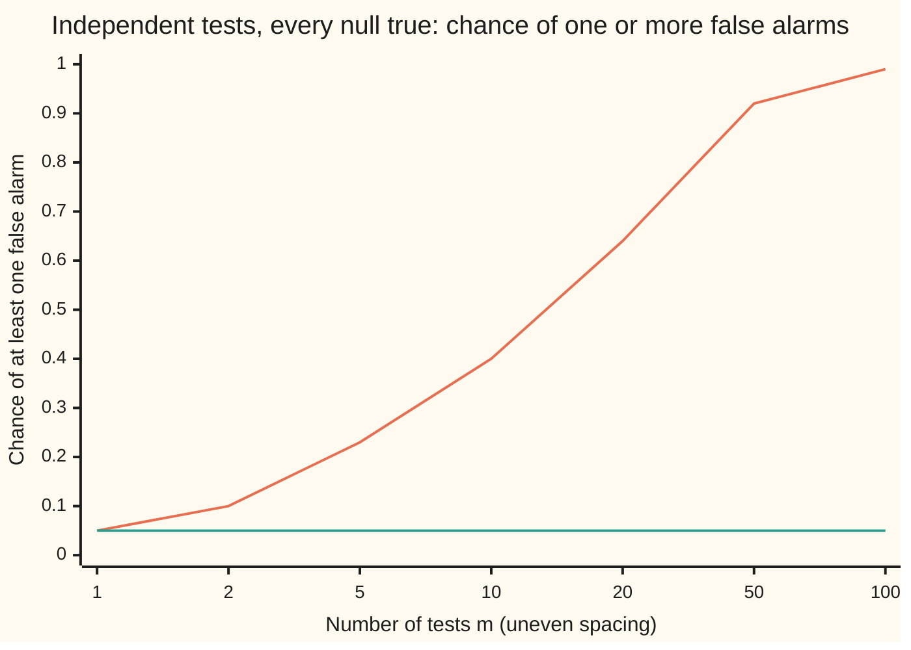
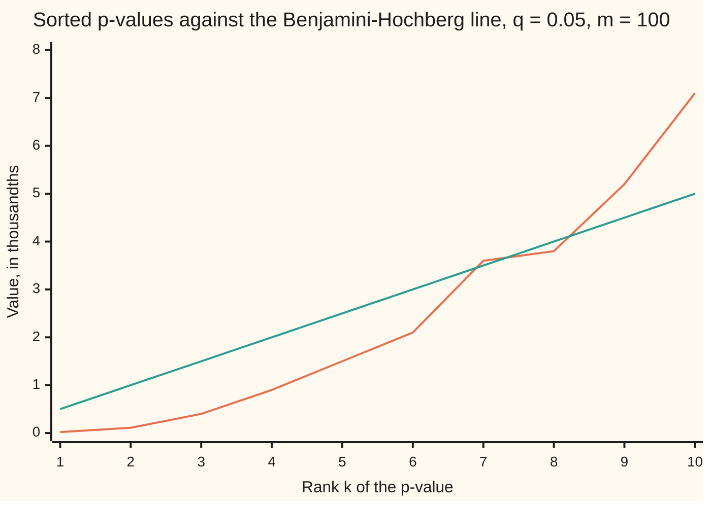

# Many tests: why one in twenty lies, and Bonferroni and false discovery control

[Syllabus](../../../SYLLABUS.md) → [Probability and statistics](../README.md) → [Confidence Intervals and Tests](../README.md#s08) → Many tests

---

## General Overview

A lab compares tumour tissue with healthy tissue on 100 genes. For each gene it runs one test and gets one p-value: the chance, if the gene truly does nothing, of a difference at least as large as the one seen ([Hypothesis tests](03-hypothesis-tests-and-p-values.md)). The usual rule flags a gene when its p-value is 0.05 or less.

That rule is built for one test. It lets a gene that does nothing through 1 time in 20. Run it 100 times and the slips add up. If no gene does anything at all, the lab still expects 5 flags; if the tests are also independent, the chance of at least one flag is 99.4%: almost every such experiment reports a discovery that is pure noise. Twelve genes are flagged in this lab's run. Some are real; the p-values alone cannot say which.

There are two repairs, and they answer two different questions. **Bonferroni** keeps the chance of even one false flag, across the whole family, at 5% or less, and pays by demanding a p-value of 0.0005 from each gene: 3 genes survive. **Benjamini–Hochberg** asks only that false flags make up at most 5% of the flagged list on average, and pays less: 8 genes survive. The first controls the **family-wise error rate**, the chance of any false flag. The second controls the **false discovery rate**, the average share of false flags among those reported.

**Test many things at the single-test level and false alarms pile up in proportion to the number of tests; divide the level by the number of tests and the chance of even one false alarm stays under the level (Bonferroni, by the union bound), or compare the sorted p-values against a rising line and the average share of false alarms stays under the level (Benjamini–Hochberg).**

**What kind of fact this is:** two theorems about two methods. The Bonferroni guarantee is proved on this card in Why it works; the Benjamini–Hochberg guarantee is proved there in a folded Detailed proof. The two error rates are definitions.

### The picture: the chance of at least one false alarm



Orange line: every test at 0.05, uncorrected; the chance is $1 - 0.95^m$. Teal line: every test at $0.05/m$, Bonferroni; the chance is $1 - (1 - 0.05/m)^m$, which stays just under 0.05 (0.048782 at 100 tests). Both lines are exact, computed by the checks.

---

## The formula

Notation first. The family has $m$ tests. Each test has a **null hypothesis**, the claim "this gene does nothing", and $m_0$ of the nulls are true; nobody knows which, or how many. $R$ counts the tests rejected (the genes flagged, called discoveries) and $V$ counts the rejected tests whose null was true (the false discoveries). $R$ is seen; $V$ never is. $P(\cdot)$ is a chance and $E[\cdot]$ a long-run average, as on the earlier cards of this wing.

The two error rates:

$$\mathrm{FWER} = P(V \ge 1), \qquad \mathrm{FDR} = E\!\left[\frac{V}{\max(R,1)}\right]$$

**Read it aloud:** the family-wise error rate is the chance of at least one false discovery; the false discovery rate is the long-run average of the false share of the flagged list, counting an empty list as zero.

The share $V/\max(R,1)$ in one experiment is the **false discovery proportion**, FDP. The FDR is its average over repeats of the whole experiment, not a statement about any one list.

**Bonferroni.** Reject test $i$ when its p-value $p_i$ satisfies

$$p_i \le \frac{\alpha}{m}. \qquad \text{Then } \mathrm{FWER} \le \frac{m_0}{m}\,\alpha \le \alpha.$$

**Read it aloud:** split the allowed error evenly over the tests; the chance of any false discovery is then at most the allowed error.

**Benjamini–Hochberg (BH).** Sort the p-values from smallest to largest, $p_{(1)} \le p_{(2)} \le \dots \le p_{(m)}$; the bracketed subscript means "the $k$-th smallest". Find the largest rank that sits on or under the line $kq/m$:

$$R = \max\left\{k : p_{(k)} \le \frac{k}{m}\,q\right\}, \qquad \text{reject every test with } p_i \le \frac{R}{m}\,q. \qquad \text{Then } \mathrm{FDR} \le \frac{m_0}{m}\,q \le q.$$

**Read it aloud:** the k-th smallest p-value may be as large as k shares of the allowance; take the deepest rank that meets its share, flag everything up to it, and the average false share of the list stays under the allowance.

If no rank qualifies, $R = 0$ and nothing is flagged.

| Symbol | Plain meaning | In our example | Push it up and the answer… |
| --- | --- | --- | --- |
| $m$ | tests in the family, fixed before looking | 100 genes | uncorrected false alarms rise; Bonferroni's cutoff tightens |
| $m_0$ | tests whose null is true; unknown | 90 in the simulation | more room for false discoveries |
| $i$, $k$, $r$ | a test's number, 1 to $m$; a rank in the sorted list; a candidate count | gene 1 to gene 100; rank 8 | BH's line $kq/m$ rises with the rank |
| $p_i$, $p_{(k)}$ | test $i$'s p-value; the $k$-th smallest p-value | 0.00002 for the strongest gene; $p_{(8)} = 0.0038$ | a test is less likely to be flagged |
| $\alpha$ | allowed family-wise error rate | 0.05 | more flags, more false ones |
| $q$ | allowed false discovery rate | 0.05 | more flags, more false ones |
| $t$, $c$ | a cutoff for p-values; Šidák's cutoff | 0.0005; 0.000513 | more flags |
| $R$, $R_i$ | tests rejected (discoveries); the same count with $p_i$ set to 0 | 8 by BH, 3 by Bonferroni | — |
| $V$ | rejected tests whose null is true; never seen | unknown for the lab | — |
| $A_i$ | the event "test $i$'s null is true and it is rejected" | — | — |
| $N$, $N_i$ | how many p-values sit at or below a cutoff; the same with $p_i$ set to 0 | 12 at or below 0.05 | — |
| FWER, FDR, FDP | chance of any false discovery; average false share; false share in one run | promised 0.05; averaged 0.0443 in simulation | — |

### When it holds

- **A family fixed in advance.** Both guarantees count the 100 tests actually run. Running 100 and then quoting only the best as if it were the only test is the uncorrected orange line: the chance of a false alarm is 99.4%, not 5%.
- **Valid p-values for the true nulls.** For a true null, the chance that $p_i \le t$ must be at most $t$ for every cutoff $t$. A miscalibrated test breaks both guarantees at the root.
- **Bonferroni: nothing else.** No independence is needed; the union bound holds for any dependence. With strongly linked tests it is needlessly strict: 100 copies of one test need no correction at all.
- **BH: independent tests, or a positive kind of dependence.** The proof below uses independence. Benjamini and Yekutieli extended it to tests that tend to move together in one direction. Under arbitrary dependence BH can fail: a two-test model below has FDR 0.15 against a promise of 0.10. Their repair divides $q$ by $1 + 1/2 + \dots + 1/m$, which is 5.187378 for 100 tests.
- **An average, not a promise per list.** FDR at 0.05 allows a particular list to be half false; it says the long-run average share is at most 5%.

---

## Why it works

### Step 0: false alarms add, whatever the dependence

Each true null is flagged with chance at most $\alpha$. The count of false flags is a sum of 0-or-1 indicators, one per true null, and an average of a sum is the sum of the averages, with or without independence. So

$$E[V] \le m_0\,\alpha.$$

With all 100 nulls true and the level at 0.05, that is 5 expected false flags. In 20,000 simulated experiments of 100 null genes the average was 4.9883, standard error 0.0154.

The number that matters is the chance of at least one. Under independence, each null escapes with chance 0.95 and all escape together with chance $0.95^{100}$, so

$$P(V \ge 1) = 1 - 0.95^{100} = 0.994079.$$

The simulation gave 0.9933, standard error 0.0006. That is the "one in twenty lies" of the title: at the single-test level, one null in twenty on average is flagged, and across a large family almost surely at least one is.

### Step 1: the union bound caps the chance of any false alarm

Let $A_i$ be the event that true null $i$ is rejected. A false discovery happens exactly when at least one $A_i$ happens. The chance of a union is at most the sum of the chances ([Stopping the sieve early](../../04-Combinatorics%20and%20graphs/04-Inclusion-Exclusion%20and%20Pigeonhole/04-union-bound-and-bonferroni.md)): the sum counts each overlap more than once, never less. So

$$\mathrm{FWER} = P\Big(\bigcup_{i \text{ null}} A_i\Big) \le \sum_{i \text{ null}} P(A_i) \le m_0 \cdot \frac{\alpha}{m} \le \alpha.$$

That is the whole Bonferroni theorem. The first step is the union bound; the second uses a valid p-value, $P(p_i \le \alpha/m) \le \alpha/m$; the third uses $m_0 \le m$. No step assumed the tests were independent, and no step needed to know which nulls are true.

For the lab: each gene needs $p_i \le 0.05/100 = 0.0005$. With 90 true nulls the bound gives 0.045. Under independence the exact value is $1 - 0.9995^{90} = 0.044013$, just under the bound, and the simulation gave 0.0442, standard error 0.0015. The union bound is nearly tight here because the events $A_i$ are rare and seldom overlap.

<details>
<summary>Šidák's cutoff: the exact version under independence</summary>

If the tests are independent, the cutoff $c$ that makes $1 - (1 - c)^{100}$ exactly 0.05 is $c = 1 - 0.95^{1/100} = 0.000513$. It is a hair looser than Bonferroni's 0.0005 and needs independence to keep its promise. The two differ only in the fifth decimal, because the union bound loses almost nothing when each event is rare.

</details>

### Step 2: the price of Bonferroni is missed discoveries

Suppose 10 of the 100 genes are real, each producing a test statistic shifted 3 standard deviations upward. At the uncorrected cutoff 0.05 the bar sits 1.6449 standard deviations up, and the lab finds 9.1231 of the 10 on average. At Bonferroni's 0.0005 the bar is 3.2905 standard deviations, above the typical real gene, and the average falls to 3.8571 of the 10. The simulation agrees: 3.8662 found, standard error 0.0109. Protection against even one false flag costs more than half of the real genes. That trade is the subject of [Power](04-power-and-sample-size.md).

### Step 3: Benjamini–Hochberg lets the cutoff grow with the evidence

A lab screening genes can live with a few false flags, followed up later, if they are a small share of the list. That is the false discovery rate. BH builds its cutoff from the data: the more small p-values there are, the more of them can be trusted, so the cutoff rises.

The lab's ten smallest p-values, in thousandths, against the BH line $k \times 0.05/100$:



Orange line: the sorted p-values. Teal line: the BH line, 0.5 thousandths per rank. Rank 7 pokes above its line, 3.60 against 3.50. Rank 8 is back under, 3.80 against 4.00. From rank 9 on, the p-values stay above. The largest rank under the line is 8, so BH flags the 8 smallest, everything at or below 0.0040, including rank 7.

Why a line through the origin with slope $q/m$? If the cutoff is $t$ and all 100 nulls were true, about $100t$ p-values would fall below it by chance. If $k$ p-values actually fall below $t = kq/m$, the expected number of false ones among them is at most $m \cdot kq/m = kq$, a share $q$ of the $k$ flagged. BH picks the largest list for which that estimate of the false share is still at most $q$.

### Step 4: why the average false share stays under q

Take one true null, gene $i$. Set its p-value to 0, run BH, and call the number flagged $R_i$; it depends only on the other 99 p-values. The step-up rule gives two facts: gene $i$ is flagged exactly when $p_i \le R_i q/m$, and then the real count $R$ equals $R_i$. Under independence, $p_i$ knows nothing about $R_i$. So if $R_i = r$, gene $i$ is flagged with chance at most $rq/m$ and then adds $1/r$ to the false share. The $r$ cancels: each true null adds at most $q/m$ to the FDR, and the $m_0$ of them add at most $m_0 q/m$.

For the lab's 90 true nulls that is $0.05 \times 90/100 = 0.045$. The simulation gave an average false share of 0.0443, standard error 0.0006: equality, within noise, because with independent, exactly uniform null p-values each bound in the argument is met exactly.

<details>
<summary>Detailed proof: Benjamini–Hochberg controls the FDR under independence</summary>

**Counting form.** Write $N(t)$ for how many p-values are at most $t$. The $k$-th smallest is at most $t$ exactly when $N(t) \ge k$. So $p_{(k)} \le kq/m$ exactly when $N(kq/m) \ge k$, and
$$R = \max\{r : N(rq/m) \ge r\}, \quad \text{or } 0 \text{ if no } r \text{ qualifies}.$$
The rejected set is $\{p_i \le Rq/m\}$, which has exactly $N(Rq/m)$ members. That number is at least $R$; if it were some $k > R$, then $N(kq/m) \ge N(Rq/m) = k$ and rank $k$ would qualify, contradicting the maximum. So exactly $R$ tests are rejected, ties included. The checks compute $R$ both ways, by the rank scan and by this count, and they agree in all 20,000 simulated experiments.

**Insert a zero.** Fix a true null $i$. Let $N_i$ and $R_i$ be the count and the BH number with $p_i$ replaced by 0; they are functions of the other p-values only. Lowering a p-value never lowers a count, so $R_i \ge R$, and $R_i \ge 1$ because the zero qualifies at rank 1.

*If $i$ is rejected*, then $p_i \le Rq/m$. At every threshold $rq/m$ with $r \ge R$, $p_i$ was already counted, so $N_i = N$ there. Ranks above $R$ fail for $N$, so they fail for $N_i$; rank $R$ passes for both. Hence $R_i = R$ and $p_i \le R_i q/m$.

*If $p_i \le R_i q/m$*, then at the threshold $R_i q/m$ the value $p_i$ is counted both before and after the change, so $N(R_i q/m) = N_i(R_i q/m) \ge R_i$. Rank $R_i$ qualifies for the original list: $R \ge R_i$. With $R_i \ge R$, $R = R_i$, and $p_i \le Rq/m$: $i$ is rejected.

So $\{i \text{ rejected}\} = \{p_i \le R_i q/m\}$, and $R = R_i$ on that event.

**Average.** The false share is $V/\max(R,1) = \sum_{i \text{ null}} \mathbf{1}\{i \text{ rejected}\}/\max(R,1)$, where $\mathbf{1}\{\cdot\}$ is 1 when the event happens and 0 otherwise. For one true null,
$$E\left[\frac{\mathbf{1}\{i \text{ rejected}\}}{\max(R,1)}\right] = \sum_{r=1}^{m} \frac{1}{r}\,P\!\left(p_i \le \frac{rq}{m},\ R_i = r\right) = \sum_{r=1}^{m} \frac{1}{r}\,P\!\left(p_i \le \frac{rq}{m}\right) P(R_i = r) \le \sum_{r=1}^{m} \frac{q}{m}\,P(R_i = r) = \frac{q}{m}.$$
The middle equality is independence of $p_i$ from the other p-values; the inequality is validity, $P(p_i \le t) \le t$. Summing over the $m_0$ true nulls gives $\mathrm{FDR} \le m_0 q / m$. If the null p-values are exactly uniform, the inequality is an equality and $\mathrm{FDR} = m_0 q/m$.

The middle equality is the only place independence enters. The dependent pair in What breaks is a model where it fails and the FDR exceeds $q$.

</details>

### Step 5: the two rates side by side

In every experiment, $V/\max(R,1) \le 1$ when $V \ge 1$, and it is 0 when $V = 0$. So the false share never exceeds the indicator of "at least one false flag", and averaging gives $\mathrm{FDR} \le \mathrm{FWER}$ for any procedure. FWER control implies FDR control; the reverse fails. When every null is true, any flag is false, $V = R$, and the two rates coincide.

In the lab's simulation BH kept the average false share at 0.0443, but at least one false gene was on its list in 27.50% of the experiments (standard error 0.32%). In exchange it found 6.1292 of the 10 real genes (standard error 0.0134), against Bonferroni's 3.8662 (standard error 0.0109). Uncorrected testing found 9.1290 (standard error 0.0063), but 0.3158 of its list was false on average (standard error 0.0007): about a third.

A third road reaches both theorems on a model small enough to list every outcome: 3 tests, level 0.75, the true nulls' p-values spread evenly over 0.25, 0.5, 0.75 and 1, the others 0. Adding up every outcome gives BH's FDR as exactly 0, 0.25, 0.5 and 0.75 for 0 to 3 true nulls, which is $0.75\,m_0/3$, and Bonferroni's FWER as 0, 0.25, 0.4375 and 0.578125, which is $1 - 0.75^{m_0}$, never above 0.75.

<details>
<summary>Holm's method: Bonferroni with a sliding cutoff</summary>

Holm compares the smallest p-value with $\alpha/m$, the next with $\alpha/(m-1)$, and so on, and stops at the first failure. It keeps the FWER at most $\alpha$ under any dependence and never flags fewer than Bonferroni. On the lab's list it flags 3, the same as Bonferroni: the fourth p-value, 0.0009, fails against $0.05/97$.

</details>

---

## Worked numbers, by hand

The lab's 100 p-values: the twelve smallest are 0.00002, 0.00011, 0.0004, 0.0009, 0.0015, 0.0021, 0.0036, 0.0038, 0.0052, 0.0071, 0.021 and 0.034; the other 88 are spread evenly from 0.06 to 0.93. Level $\alpha = q = 0.05$.

| Step | Arithmetic | Value |
| --- | --- | --- |
| expected false flags if every gene is null | 100 × 0.05 | 5 |
| chance of at least one, independent | 1 − 0.95^100 | 0.994079 |
| uncorrected flags | p-values at most 0.05 | **12** |
| Bonferroni cutoff | 0.05 / 100 | 0.0005 |
| Bonferroni flags | 0.00002, 0.00011, 0.0004 | **3** |
| BH line at rank k | k × 0.05 / 100 | 0.0005 k |
| rank 7 | 0.0036 against 0.0035 | above |
| rank 8 | 0.0038 against 0.0040 | under |
| ranks 9 and 10 | 0.0052 against 0.0045; 0.0071 against 0.0050 | above |
| largest rank under the line | ranks 9 to 100 all above | R = 8 |
| BH cutoff | 8 × 0.05 / 100 | 0.0040 |
| **BH flags** | every p-value at most 0.0040 | **8** |

Read back in the lab: Bonferroni reports 3 genes, using a method that puts even one false lead on its list in at most 5% of screens. BH reports 8, using a method whose lists are, on average over many screens, at most 5% false. Neither says which of this lab's genes are real, and a gene's p-value is never the chance that its null is true.

### What breaks if you drop a piece

| Mistake | Comes out at | What went wrong |
| --- | --- | --- |
| Test 100 null genes at 0.05 each, no correction | at least one false flag with chance 0.994079 | The family was ignored: the level was set for one test |
| BH stopped at the first rank above its line | 6 genes, not 8 | The rule takes the largest rank under the line; rank 7 fails but rank 8 passes |
| BH on two linked tests, both null, q = 0.10 | FDR 0.15 | Dependence: the p-values 0.05 and 1, 1 and 0.05, 0.1 and 0.1, 1 and 1, with chances 1, 1, 1 and 17 in 20, are each valid but not independent; Bonferroni still holds at 0.10 |
| Reading BH's 5% as the chance of any false flag | a false gene on the list in 0.2750 of screens | FDR averages the false share; FWER is a different, stricter target |

The code prints all four.

---

## Code, from first principles, and it actually runs

The scripts import only square roots, powers of e, logarithms, cosines and pi. The bell curve's tail area is built from its Taylor series near the centre and Laplace's continued fraction in the tail; its inverse comes from bisection. Random numbers come from a SplitMix64 generator, seed 20260928, turned into bell-curve draws by the Box–Muller formula, so both languages draw the same numbers. Three roads: the exact formulas; exact enumeration of the three-test model and the dependent pair; and 20,000 simulated experiments of 100 genes, each estimate printed with its standard error. BH is computed two ways, by scanning ranks and by counting, and the two must agree on every list.

### Python

```python
# Many tests -- the check behind the card.  Only math.sqrt, exp, log, cos, pi
# are imported.  100 genes, each tested at the 5% level.  Three roads: exact
# formulas, exact enumeration of small discrete models, and a seeded simulation
# (SplitMix64, seed 20260928) printed with standard errors.
from math import sqrt, exp, log, cos, pi
M64, ALPHA, M, M0, SHIFT, RUNS = (1 << 64) - 1, 0.05, 100, 90, 3.0, 20000

class SplitMix:                                   # the random numbers, written out
    def __init__(self, seed): self.s = seed
    def unif(self):                               # a draw strictly between 0 and 1
        self.s = (self.s + 0x9E3779B97F4A7C15) & M64
        z = self.s
        z = ((z ^ (z >> 30)) * 0xBF58476D1CE4E5B9) & M64
        z = ((z ^ (z >> 27)) * 0x94D049BB133111EB) & M64
        return (((z ^ (z >> 31)) >> 11) + 0.5) / 2.0 ** 53
    def normal(self):                             # Box-Muller: two uniforms, one bell draw
        a = self.unif()
        return sqrt(-2.0 * log(a)) * cos(2.0 * pi * self.unif())

def Q(z):                                         # bell area to the right of z
    if z < 0: return 1.0 - Q(-z)
    if z < 3.0:                                   # Taylor series of the area from 0 to z
        term, total, j = z, z, 0
        while abs(term) > 1e-17:
            j += 1
            term *= -z * z * (2 * j - 1) / (2 * j * (2 * j + 1))
            total += term
        return 0.5 - total / sqrt(2.0 * pi)
    f = 0.0                                       # Laplace's continued fraction, far tail
    for k in range(60, 0, -1): f = k / (z + f)
    return exp(-0.5 * z * z) / sqrt(2.0 * pi) / (z + f)

def Q_inv(t):                                     # the z with area t to its right, by halving
    a, b = -10.0, 10.0
    for _ in range(200):
        c = 0.5 * (a + b)
        if Q(c) > t: a = c
        else: b = c
    return 0.5 * (a + b)

def bh_stepup(ps, q):                             # road one: largest rank under its line
    s, m = sorted(ps), len(ps)
    return max([0] + [k for k in range(1, m + 1) if s[k - 1] <= q * k / m])

def bh_count(ps, q):                              # road two: largest r with r p-values under q r/m
    m = len(ps)
    for r in range(m, 0, -1):
        if sum(p <= q * r / m for p in ps) >= r: return r
    return 0

def first_fail(ps, q):                            # the mistake: stop at the first rank that fails
    s, m, k = sorted(ps), len(ps), 0
    while k < m and s[k] <= q * (k + 1) / m: k += 1
    return k

def holm(ps, a):                                  # step down: rank k against a/(m-k+1)
    s, m, k = sorted(ps), len(ps), 0
    while k < m and s[k] <= a / (m - k): k += 1
    return k

def row(label, v, d=6): print(f"{label:<44}{v:>12.{d}f}")

row("expected false alarms, 100 nulls, m x alpha", M * ALPHA)
row("chance of at least one, 1 - 0.95^100", 1 - (1 - ALPHA) ** M)
row("Bonferroni cutoff alpha/m", ALPHA / M)
row("Sidak cutoff 1 - 0.95^(1/100)", 1 - (1 - ALPHA) ** (1 / M))
row("Bonferroni FWER, 100 nulls, independent", 1 - (1 - ALPHA / M) ** M)
row("Bonferroni FWER, 90 nulls, independent", 1 - (1 - ALPHA / M) ** M0)
row("union bound, 90 nulls, 90 x alpha/m", M0 * ALPHA / M)
row("BH promise q m0/m, 90 nulls", ALPHA * M0 / M)
row("BY cutoff divisor 1 + 1/2 + ... + 1/100", sum(1 / k for k in range(1, M + 1)))
row("best of 100 nulls at or below 0.01", 1 - 0.99 ** M)
row("bell cutoff, one-sided 0.05", Q_inv(ALPHA), 4)
row("bell cutoff, one-sided 0.0005", Q_inv(ALPHA / M), 4)
LIST = [0.00002, 0.00011, 0.0004, 0.0009, 0.0015, 0.0021, 0.0036, 0.0038,
        0.0052, 0.0071, 0.021, 0.034] + [0.05 + 0.01 * j for j in range(1, 89)]
print("rank, p and BH line, then both in thousandths")
for k in range(1, 11):
    p, line = sorted(LIST)[k - 1], ALPHA * k / M
    print(f"  {k:>2} {p:>9.5f} {line:>9.5f} {1000 * p:>8.2f} {1000 * line:>8.2f}")
r1, r2 = bh_stepup(LIST, ALPHA), bh_count(LIST, ALPHA)
print(f"BH rank scan {r1}; BH by counting {r2}; first-failure stop {first_fail(LIST, ALPHA)}")
print(f"Bonferroni {sum(p <= ALPHA / M for p in LIST)}; Holm {holm(LIST, ALPHA)}; "
      f"uncorrected {sum(p <= ALPHA for p in LIST)}; BH cutoff {ALPHA * r1 / M:.4f}")
print("figure, tests m      " + " ".join(f"{m:>5}" for m in (1, 2, 5, 10, 20, 50, 100)))
print("figure, uncorrected  " + " ".join(f"{1 - 0.95 ** m:>5.2f}" for m in (1, 2, 5, 10, 20, 50, 100)))
print("figure, Bonferroni   " + " ".join(f"{1 - (1 - 0.05 / m) ** m:>5.2f}" for m in (1, 2, 5, 10, 20, 50, 100)))

enum = []                                         # road two: every outcome of 3 tests on a quarter grid
for m0 in range(4):                               # m0 nulls uniform on 1/4..1, the rest p = 0, level 3/4
    fdr6 = bon = 0
    for code in range(4 ** m0):
        ps = [((code >> (2 * i)) % 4 + 1) / 4 for i in range(m0)] + [0.0] * (3 - m0)
        r = bh_stepup(ps, 0.75); v = sum(p <= 0.75 * r / 3 for p in ps[:m0])
        fdr6 += 6 * v // max(r, 1); bon += any(p <= 0.25 for p in ps[:m0])
    enum.append((4 * fdr6 == 6 * m0 * 4 ** m0, bon == 4 ** m0 - 3 ** m0))
    print(f"enumerate m0={m0}: BH FDR {fdr6 / (6 * 4 ** m0):.6f} vs 0.75 m0/3; "
          f"Bonferroni FWER {bon / 4 ** m0:.6f} vs 1 - 0.75^m0")
DEP = [((0.05, 1.0), 1), ((1.0, 0.05), 1), ((0.1, 0.1), 1), ((1.0, 1.0), 17)]  # weights in 20ths
dep_bh = sum(w for ps, w in DEP if bh_count(list(ps), 0.1) > 0) / 20
dep_bon = sum(w for ps, w in DEP if min(ps) <= 0.05) / 20
print(f"dependent pair, both null, q = 0.10: BH FDR {dep_bh:.2f}; Bonferroni FWER {dep_bon:.2f}")

rng, agree, T = SplitMix(20260928), 0, {}
def tally(key, x):
    s = T.setdefault(key, [0.0, 0.0]); s[0] += x; s[1] += x * x
for _ in range(RUNS):
    u = [rng.unif() for _ in range(M)]
    k = sum(p <= ALPHA for p in u)                # scenario A: all 100 genes null
    tally("A false alarms", k); tally("A any, uncorrected", k > 0)
    tally("A any, Bonferroni", any(p <= ALPHA / M for p in u))
    ps = u[:M0] + [Q(rng.normal() + SHIFT) for _ in range(M - M0)]   # B: 90 null, 10 real
    r = bh_stepup(ps, ALPHA); agree += r == bh_count(ps, ALPHA)
    v = sum(p <= ALPHA * r / M for p in ps[:M0])
    tally("B BH FDP", v / max(r, 1)); tally("B BH any false", v > 0); tally("B BH real found", r - v)
    tally("B Bonferroni any false", any(p <= ALPHA / M for p in ps[:M0]))
    tally("B Bonferroni real found", sum(p <= ALPHA / M for p in ps[M0:]))
    r0, v0 = sum(p <= ALPHA for p in ps), sum(p <= ALPHA for p in ps[:M0])
    tally("B uncorrected FDP", v0 / max(r0, 1)); tally("B uncorrected real found", r0 - v0)
EST = {}
print(f"simulation, {RUNS} experiments of 100 genes, estimate and standard error")
for key, (s, s2) in T.items():
    mean = s / RUNS; se = sqrt(max(s2 / RUNS - mean * mean, 0.0) / RUNS); EST[key] = (mean, se)
    print(f"  {key:<30}{mean:>10.4f}{se:>10.4f}")
row("exact real found per 10, Bonferroni", 10 * Q(Q_inv(ALPHA / M) - SHIFT), 4)
row("exact real found per 10, uncorrected", 10 * Q(Q_inv(ALPHA) - SHIFT), 4)
print(f"BH two roads agree in {agree} of {RUNS} experiments")

def near(key, exact): return abs(EST[key][0] - exact) < 4 * EST[key][1]
assert r1 == r2 == 8 and agree == RUNS                     # two BH roads, one answer
assert all(a and b for a, b in enum) and dep_bh > 0.1 >= dep_bon   # enumeration; dependence breaks BH
assert near("A any, uncorrected", 1 - (1 - ALPHA) ** M) and near("A false alarms", M * ALPHA)
assert near("A any, Bonferroni", 1 - (1 - ALPHA / M) ** M) and near("B BH FDP", ALPHA * M0 / M)
assert near("B Bonferroni real found", 10 * Q(Q_inv(ALPHA / M) - SHIFT))
assert near("B Bonferroni any false", 1 - (1 - ALPHA / M) ** M0)
assert abs(Q_inv(ALPHA) - 1.6448536) < 1e-6 and abs(Q_inv(ALPHA / M) - 3.2905267) < 1e-6   # tabled bell cutoffs
assert near("B uncorrected real found", 10 * Q(Q_inv(ALPHA) - SHIFT))
print("ALL CHECKS PASS")
```

**Ran 2026-09-28 on macOS, Python 3.14.6, standard library only. All checks passed. Output, pasted from the run:**

```
expected false alarms, 100 nulls, m x alpha     5.000000
chance of at least one, 1 - 0.95^100            0.994079
Bonferroni cutoff alpha/m                       0.000500
Sidak cutoff 1 - 0.95^(1/100)                   0.000513
Bonferroni FWER, 100 nulls, independent         0.048782
Bonferroni FWER, 90 nulls, independent          0.044013
union bound, 90 nulls, 90 x alpha/m             0.045000
BH promise q m0/m, 90 nulls                     0.045000
BY cutoff divisor 1 + 1/2 + ... + 1/100         5.187378
best of 100 nulls at or below 0.01              0.633968
bell cutoff, one-sided 0.05                       1.6449
bell cutoff, one-sided 0.0005                     3.2905
rank, p and BH line, then both in thousandths
   1   0.00002   0.00050     0.02     0.50
   2   0.00011   0.00100     0.11     1.00
   3   0.00040   0.00150     0.40     1.50
   4   0.00090   0.00200     0.90     2.00
   5   0.00150   0.00250     1.50     2.50
   6   0.00210   0.00300     2.10     3.00
   7   0.00360   0.00350     3.60     3.50
   8   0.00380   0.00400     3.80     4.00
   9   0.00520   0.00450     5.20     4.50
  10   0.00710   0.00500     7.10     5.00
BH rank scan 8; BH by counting 8; first-failure stop 6
Bonferroni 3; Holm 3; uncorrected 12; BH cutoff 0.0040
figure, tests m          1     2     5    10    20    50   100
figure, uncorrected   0.05  0.10  0.23  0.40  0.64  0.92  0.99
figure, Bonferroni    0.05  0.05  0.05  0.05  0.05  0.05  0.05
enumerate m0=0: BH FDR 0.000000 vs 0.75 m0/3; Bonferroni FWER 0.000000 vs 1 - 0.75^m0
enumerate m0=1: BH FDR 0.250000 vs 0.75 m0/3; Bonferroni FWER 0.250000 vs 1 - 0.75^m0
enumerate m0=2: BH FDR 0.500000 vs 0.75 m0/3; Bonferroni FWER 0.437500 vs 1 - 0.75^m0
enumerate m0=3: BH FDR 0.750000 vs 0.75 m0/3; Bonferroni FWER 0.578125 vs 1 - 0.75^m0
dependent pair, both null, q = 0.10: BH FDR 0.15; Bonferroni FWER 0.10
simulation, 20000 experiments of 100 genes, estimate and standard error
  A false alarms                    4.9883    0.0154
  A any, uncorrected                0.9933    0.0006
  A any, Bonferroni                 0.0485    0.0015
  B BH FDP                          0.0443    0.0006
  B BH any false                    0.2750    0.0032
  B BH real found                   6.1292    0.0134
  B Bonferroni any false            0.0442    0.0015
  B Bonferroni real found           3.8662    0.0109
  B uncorrected FDP                 0.3158    0.0007
  B uncorrected real found          9.1290    0.0063
exact real found per 10, Bonferroni               3.8571
exact real found per 10, uncorrected              9.1231
BH two roads agree in 20000 of 20000 experiments
ALL CHECKS PASS
```

### Rust

Same numbers, same labels, built with `rustc --edition 2021 -O`.

```rust
// Many tests -- the same check as the Python, in Rust.  No crates.  100 genes,
// each tested at the 5% level.  Three roads: exact formulas, exact enumeration
// of small discrete models, and a seeded simulation (SplitMix64, seed 20260928)
// printed with standard errors.
use std::f64::consts::PI;
const ALPHA: f64 = 0.05; const SHIFT: f64 = 3.0;
const M: usize = 100; const M0: usize = 90; const RUNS: usize = 20000;

struct SplitMix { s: u64 }                        // the random numbers, written out
impl SplitMix {
    fn unif(&mut self) -> f64 {                   // a draw strictly between 0 and 1
        self.s = self.s.wrapping_add(0x9E3779B97F4A7C15);
        let mut z = self.s;
        z = (z ^ (z >> 30)).wrapping_mul(0xBF58476D1CE4E5B9);
        z = (z ^ (z >> 27)).wrapping_mul(0x94D049BB133111EB);
        (((z ^ (z >> 31)) >> 11) as f64 + 0.5) / 9007199254740992.0
    }
    fn normal(&mut self) -> f64 {                 // Box-Muller: two uniforms, one bell draw
        let a = self.unif();
        (-2.0 * a.ln()).sqrt() * (2.0 * PI * self.unif()).cos()
    }
}

fn q_tail(z: f64) -> f64 {                        // bell area to the right of z
    if z < 0.0 { return 1.0 - q_tail(-z); }
    if z < 3.0 {                                  // Taylor series of the area from 0 to z
        let (mut term, mut total, mut j) = (z, z, 0i64);
        while term.abs() > 1e-17 {
            j += 1;
            term *= -z * z * (2 * j - 1) as f64 / ((2 * j) * (2 * j + 1)) as f64;
            total += term;
        }
        return 0.5 - total / (2.0 * PI).sqrt();
    }
    let mut f = 0.0;                              // Laplace's continued fraction, far tail
    for k in (1..=60).rev() { f = k as f64 / (z + f); }
    (-0.5 * z * z).exp() / (2.0 * PI).sqrt() / (z + f)
}

fn q_inv(t: f64) -> f64 {                         // the z with area t to its right, by halving
    let (mut a, mut b) = (-10.0, 10.0);
    for _ in 0..200 {
        let c = 0.5 * (a + b);
        if q_tail(c) > t { a = c } else { b = c }
    }
    0.5 * (a + b)
}

fn sorted(ps: &[f64]) -> Vec<f64> { let mut s = ps.to_vec(); s.sort_by(|a, b| a.partial_cmp(b).unwrap()); s }

fn bh_stepup(ps: &[f64], q: f64) -> usize {       // road one: largest rank under its line
    let (s, m) = (sorted(ps), ps.len());
    (1..=m).filter(|&k| s[k - 1] <= q * k as f64 / m as f64).max().unwrap_or(0)
}

fn bh_count(ps: &[f64], q: f64) -> usize {        // road two: largest r with r p-values under q r/m
    let m = ps.len();
    for r in (1..=m).rev() {
        if ps.iter().filter(|&&p| p <= q * r as f64 / m as f64).count() >= r { return r; }
    }
    0
}

fn first_fail(ps: &[f64], q: f64) -> usize {      // the mistake: stop at the first rank that fails
    let (s, m, mut k) = (sorted(ps), ps.len(), 0);
    while k < m && s[k] <= q * (k + 1) as f64 / m as f64 { k += 1; }
    k
}

fn holm(ps: &[f64], a: f64) -> usize {            // step down: rank k against a/(m-k+1)
    let (s, m, mut k) = (sorted(ps), ps.len(), 0);
    while k < m && s[k] <= a / (m - k) as f64 { k += 1; }
    k
}

fn row(label: &str, v: f64, d: usize) { println!("{:<44}{:>12.*}", label, d, v); }
fn below(ps: &[f64], t: f64) -> usize { ps.iter().filter(|&&p| p <= t).count() }

fn main() {
    let (mf, m0f) = (M as f64, M0 as f64);
    row("expected false alarms, 100 nulls, m x alpha", mf * ALPHA, 6);
    row("chance of at least one, 1 - 0.95^100", 1.0 - (1.0 - ALPHA).powf(mf), 6);
    row("Bonferroni cutoff alpha/m", ALPHA / mf, 6);
    row("Sidak cutoff 1 - 0.95^(1/100)", 1.0 - (1.0 - ALPHA).powf(1.0 / mf), 6);
    row("Bonferroni FWER, 100 nulls, independent", 1.0 - (1.0 - ALPHA / mf).powf(mf), 6);
    row("Bonferroni FWER, 90 nulls, independent", 1.0 - (1.0 - ALPHA / mf).powf(m0f), 6);
    row("union bound, 90 nulls, 90 x alpha/m", m0f * ALPHA / mf, 6);
    row("BH promise q m0/m, 90 nulls", ALPHA * m0f / mf, 6);
    row("BY cutoff divisor 1 + 1/2 + ... + 1/100", (1..=M).map(|k| 1.0 / k as f64).sum(), 6);
    row("best of 100 nulls at or below 0.01", 1.0 - 0.99f64.powf(mf), 6);
    row("bell cutoff, one-sided 0.05", q_inv(ALPHA), 4);
    row("bell cutoff, one-sided 0.0005", q_inv(ALPHA / mf), 4);
    let mut list = vec![0.00002, 0.00011, 0.0004, 0.0009, 0.0015, 0.0021, 0.0036, 0.0038, 0.0052, 0.0071, 0.021, 0.034];
    for j in 1..89 { list.push(0.05 + 0.01 * j as f64); }
    println!("rank, p and BH line, then both in thousandths");
    let s = sorted(&list);
    for k in 1..=10 {
        let (p, line) = (s[k - 1], ALPHA * k as f64 / mf);
        println!("  {:>2} {:>9.5} {:>9.5} {:>8.2} {:>8.2}", k, p, line, 1000.0 * p, 1000.0 * line);
    }
    let (r1, r2) = (bh_stepup(&list, ALPHA), bh_count(&list, ALPHA));
    println!("BH rank scan {}; BH by counting {}; first-failure stop {}", r1, r2, first_fail(&list, ALPHA));
    println!("Bonferroni {}; Holm {}; uncorrected {}; BH cutoff {:.4}",
             below(&list, ALPHA / mf), holm(&list, ALPHA), below(&list, ALPHA), ALPHA * r1 as f64 / mf);
    let ms = [1.0f64, 2.0, 5.0, 10.0, 20.0, 50.0, 100.0];
    println!("figure, tests m      {}", ms.iter().map(|m| format!("{:>5}", m)).collect::<Vec<_>>().join(" "));
    println!("figure, uncorrected  {}", ms.iter().map(|m| format!("{:>5.2}", 1.0 - 0.95f64.powf(*m))).collect::<Vec<_>>().join(" "));
    println!("figure, Bonferroni   {}", ms.iter().map(|m| format!("{:>5.2}", 1.0 - (1.0 - 0.05 / m).powf(*m))).collect::<Vec<_>>().join(" "));

    let mut enum_ok = true;                       // road two: every outcome of 3 tests on a quarter grid
    for m0 in 0..4usize {                         // m0 nulls uniform on 1/4..1, the rest p = 0, level 3/4
        let (mut fdr6, mut bon) = (0usize, 0usize);
        for code in 0..4usize.pow(m0 as u32) {
            let mut ps: Vec<f64> = (0..m0).map(|i| ((code >> (2 * i)) % 4 + 1) as f64 / 4.0).collect();
            ps.extend(vec![0.0; 3 - m0]);
            let r = bh_stepup(&ps, 0.75);
            let v = below(&ps[..m0], 0.75 * r as f64 / 3.0);
            fdr6 += 6 * v / r.max(1);
            if below(&ps[..m0], 0.25) > 0 { bon += 1; }
        }
        let n = 4usize.pow(m0 as u32);
        enum_ok &= 4 * fdr6 == 6 * m0 * n && bon == n - 3usize.pow(m0 as u32);
        println!("enumerate m0={}: BH FDR {:.6} vs 0.75 m0/3; Bonferroni FWER {:.6} vs 1 - 0.75^m0",
                 m0, fdr6 as f64 / (6 * n) as f64, bon as f64 / n as f64);
    }
    let dep = [([0.05, 1.0], 1usize), ([1.0, 0.05], 1), ([0.1, 0.1], 1), ([1.0, 1.0], 17)];  // weights in 20ths
    let dep_bh = dep.iter().filter(|(ps, _)| bh_count(ps, 0.1) > 0).map(|(_, w)| w).sum::<usize>() as f64 / 20.0;
    let dep_bon = dep.iter().filter(|(ps, _)| ps[0].min(ps[1]) <= 0.05).map(|(_, w)| w).sum::<usize>() as f64 / 20.0;
    println!("dependent pair, both null, q = 0.10: BH FDR {:.2}; Bonferroni FWER {:.2}", dep_bh, dep_bon);
    let names = ["A false alarms", "A any, uncorrected", "A any, Bonferroni", "B BH FDP", "B BH any false",
                 "B BH real found", "B Bonferroni any false", "B Bonferroni real found", "B uncorrected FDP",
                 "B uncorrected real found"];
    let mut t = [[0.0f64; 2]; 10];
    let (mut rng, mut agree, cut) = (SplitMix { s: 20260928 }, 0usize, ALPHA / mf);
    let b = |x: bool| if x { 1.0 } else { 0.0 };
    for _ in 0..RUNS {
        let u: Vec<f64> = (0..M).map(|_| rng.unif()).collect();
        let k = below(&u, ALPHA);                 // scenario A: all 100 genes null
        let mut ps: Vec<f64> = u[..M0].to_vec();  // scenario B: 90 null, 10 real
        for _ in M0..M { ps.push(q_tail(rng.normal() + SHIFT)); }
        let r = bh_stepup(&ps, ALPHA);
        if r == bh_count(&ps, ALPHA) { agree += 1; }
        let v = below(&ps[..M0], ALPHA * r as f64 / mf);
        let (r0, v0) = (below(&ps, ALPHA), below(&ps[..M0], ALPHA));
        let xs = [k as f64, b(k > 0), b(below(&u, cut) > 0), v as f64 / r.max(1) as f64, b(v > 0),
                  (r - v) as f64, b(below(&ps[..M0], cut) > 0), below(&ps[M0..], cut) as f64,
                  v0 as f64 / r0.max(1) as f64, (r0 - v0) as f64];
        for i in 0..10 { t[i][0] += xs[i]; t[i][1] += xs[i] * xs[i]; }
    }
    let mut est = [(0.0f64, 0.0f64); 10];
    println!("simulation, {} experiments of 100 genes, estimate and standard error", RUNS);
    for i in 0..10 {
        let mean = t[i][0] / RUNS as f64;
        let se = ((t[i][1] / RUNS as f64 - mean * mean).max(0.0) / RUNS as f64).sqrt();
        est[i] = (mean, se);
        println!("  {:<30}{:>10.4}{:>10.4}", names[i], mean, se);
    }
    let bon_found = 10.0 * q_tail(q_inv(ALPHA / mf) - SHIFT);
    row("exact real found per 10, Bonferroni", bon_found, 4);
    row("exact real found per 10, uncorrected", 10.0 * q_tail(q_inv(ALPHA) - SHIFT), 4);
    println!("BH two roads agree in {} of {} experiments", agree, RUNS);
    let near = |i: usize, exact: f64| (est[i].0 - exact).abs() < 4.0 * est[i].1;
    assert!(r1 == 8 && r2 == 8 && agree == RUNS);                  // two BH roads, one answer
    assert!(enum_ok && dep_bh > 0.1 && 0.1 >= dep_bon);           // enumeration; dependence breaks BH
    assert!(near(1, 1.0 - (1.0 - ALPHA).powf(mf)) && near(0, mf * ALPHA));
    assert!(near(2, 1.0 - (1.0 - cut).powf(mf)) && near(3, ALPHA * m0f / mf));
    assert!(near(7, bon_found) && near(6, 1.0 - (1.0 - cut).powf(m0f)));
    assert!((q_inv(ALPHA) - 1.6448536).abs() < 1e-6 && (q_inv(cut) - 3.2905267).abs() < 1e-6 && near(9, 10.0 * q_tail(q_inv(ALPHA) - SHIFT)));
    println!("ALL CHECKS PASS");
}
```

**Ran 2026-09-28 on macOS, rustc 1.98.1, no crates. All checks passed. Output, pasted from the run:**

```
expected false alarms, 100 nulls, m x alpha     5.000000
chance of at least one, 1 - 0.95^100            0.994079
Bonferroni cutoff alpha/m                       0.000500
Sidak cutoff 1 - 0.95^(1/100)                   0.000513
Bonferroni FWER, 100 nulls, independent         0.048782
Bonferroni FWER, 90 nulls, independent          0.044013
union bound, 90 nulls, 90 x alpha/m             0.045000
BH promise q m0/m, 90 nulls                     0.045000
BY cutoff divisor 1 + 1/2 + ... + 1/100         5.187378
best of 100 nulls at or below 0.01              0.633968
bell cutoff, one-sided 0.05                       1.6449
bell cutoff, one-sided 0.0005                     3.2905
rank, p and BH line, then both in thousandths
   1   0.00002   0.00050     0.02     0.50
   2   0.00011   0.00100     0.11     1.00
   3   0.00040   0.00150     0.40     1.50
   4   0.00090   0.00200     0.90     2.00
   5   0.00150   0.00250     1.50     2.50
   6   0.00210   0.00300     2.10     3.00
   7   0.00360   0.00350     3.60     3.50
   8   0.00380   0.00400     3.80     4.00
   9   0.00520   0.00450     5.20     4.50
  10   0.00710   0.00500     7.10     5.00
BH rank scan 8; BH by counting 8; first-failure stop 6
Bonferroni 3; Holm 3; uncorrected 12; BH cutoff 0.0040
figure, tests m          1     2     5    10    20    50   100
figure, uncorrected   0.05  0.10  0.23  0.40  0.64  0.92  0.99
figure, Bonferroni    0.05  0.05  0.05  0.05  0.05  0.05  0.05
enumerate m0=0: BH FDR 0.000000 vs 0.75 m0/3; Bonferroni FWER 0.000000 vs 1 - 0.75^m0
enumerate m0=1: BH FDR 0.250000 vs 0.75 m0/3; Bonferroni FWER 0.250000 vs 1 - 0.75^m0
enumerate m0=2: BH FDR 0.500000 vs 0.75 m0/3; Bonferroni FWER 0.437500 vs 1 - 0.75^m0
enumerate m0=3: BH FDR 0.750000 vs 0.75 m0/3; Bonferroni FWER 0.578125 vs 1 - 0.75^m0
dependent pair, both null, q = 0.10: BH FDR 0.15; Bonferroni FWER 0.10
simulation, 20000 experiments of 100 genes, estimate and standard error
  A false alarms                    4.9883    0.0154
  A any, uncorrected                0.9933    0.0006
  A any, Bonferroni                 0.0485    0.0015
  B BH FDP                          0.0443    0.0006
  B BH any false                    0.2750    0.0032
  B BH real found                   6.1292    0.0134
  B Bonferroni any false            0.0442    0.0015
  B Bonferroni real found           3.8662    0.0109
  B uncorrected FDP                 0.3158    0.0007
  B uncorrected real found          9.1290    0.0063
exact real found per 10, Bonferroni               3.8571
exact real found per 10, uncorrected              9.1231
BH two roads agree in 20000 of 20000 experiments
ALL CHECKS PASS
```

The two outputs match line for line, simulation included, because both draw the same SplitMix64 numbers.

> [!TIP]
> **Try changing**
> Guess first, then run it.
> - **Make the tests copies of one.** Replace `u = [rng.unif() for _ in range(M)]` with `u = [rng.unif()] * M`. The chance of at least one false alarm falls to the single-test 5%, since 100 copies are one test, and the third assert stops the run: the formula $1 - 0.95^{100}$ assumed independence.
> - **Break the BH line.** In `bh_stepup`, change `q * k / m` to `q * k / (m - 1)`. The two roads to BH disagree in some simulated experiments, and the first assert stops it.
> - **Weaken the real genes.** Set `SHIFT = 2.0`. Every method finds fewer real genes, and BH drops towards Bonferroni. BH's average false share and Bonferroni's family error stay where they were, since both are set by the nulls; the uncorrected list's false share rises, because fewer real genes dilute the false ones. All checks still pass.

---

## The usual mistake

> [!warning]
> **Reporting the smallest of many p-values as if it were the only test.** A p-value of 0.01 is striking on its own. As the best of 100 null tests it is expected: the chance that some null reaches 0.01 or below is $1 - 0.99^{100} = 0.633968$. The family has to be declared, and corrected for, before looking.
>
> - **Treating FDR control as FWER control.** BH at 5% put at least one false gene on the list in 27.5% of the simulated screens, not 5%.
> - **Reading 1 − FDR as the chance each flagged gene is real.** The FDR is an average over many screens. It says nothing about which of today's 8 genes are false, and it allows a single list to be mostly false.
> - **Applying BH to strongly and irregularly linked tests without a check.** The dependent pair reaches FDR 0.15 against a promise of 0.10; the divisor 5.187378 for 100 tests is the price of safety under any dependence.

---

## Where you meet it in real life

- **Genomics.** A gene-expression study tests tens of thousands of genes at once; FDR control is the standard, often reported as Storey's q-value: the smallest FDR level at which a gene would be flagged.
- **Brain imaging.** A scan is tested voxel by voxel, tens of thousands of small cubes of brain; a well-known poster found "activity" in a dead salmon's brain by skipping the correction.
- **Clinical trials.** Regulators ask for a primary outcome named in advance, so a trial is not judged on whichever of many outcomes happened to cross 0.05; secondary outcomes get Bonferroni-type or Holm corrections.
- **Simultaneous confidence intervals.** Widen each of $m$ intervals from 95% to $1 - 0.05/m$ and all of them hold together with chance at least 95%, the interval twin of Bonferroni ([Confidence intervals](01-confidence-intervals.md)).
- **Trading strategies.** Backtest enough rules and the best one looks brilliant by chance; the finance wing corrects the Sharpe ratio, a strategy's return per unit of risk, for the number of trials in [Trying many strategies](../../12-Financial%20mathematics/50-Signals%2C%20Mean%20Reversion%20and%20Backtesting/06-deflated-sharpe-and-multiple-testing.md).

> **Say it back**
> A test at 5% lets a true null through 1 time in 20, so 100 tests on nothing produce about 5 false flags and at least one with chance 99.4%. Bonferroni divides the level by the number of tests; the union bound then keeps the chance of any false flag under the level, whatever the dependence. Benjamini–Hochberg flags every p-value up to the deepest rank under the line $kq/m$, and under independence the average false share of its list stays under $q$. The first is strict and loses real findings; the second finds more and accepts a controlled share of false ones. Neither turns a p-value into the chance that a finding is real.

---

## What this builds on

- [Hypothesis tests](03-hypothesis-tests-and-p-values.md): the single test, the p-value, and the promise that a true null is rejected with chance at most the level.
- [Stopping the sieve early](../../04-Combinatorics%20and%20graphs/04-Inclusion-Exclusion%20and%20Pigeonhole/04-union-bound-and-bonferroni.md): the chance of a union is at most the sum of the chances, the one line behind Bonferroni's theorem.

## Where this goes next

- [Trying many strategies](../../12-Financial%20mathematics/50-Signals%2C%20Mean%20Reversion%20and%20Backtesting/06-deflated-sharpe-and-multiple-testing.md): many backtested strategies as one family of tests, and a Sharpe ratio discounted for the number tried.
- Comparing diagrams: shape summaries turned into many features and tested together, where the same corrections decide which features count.

Both guarantees here count errors among tests already chosen; what these cards take up is how to count honestly when the family is a search over strategies or features, and the number of tests is itself hard to pin down.

---

## Sources

Verified 2026-09-28: every link below resolves to the publisher's page.

- Benjamini, Yoav, and Yosef Hochberg. "Controlling the False Discovery Rate: A Practical and Powerful Approach to Multiple Testing." *Journal of the Royal Statistical Society, Series B* 57, no. 1 (1995): 289–300. [doi:10.1111/j.2517-6161.1995.tb02031.x](https://doi.org/10.1111/j.2517-6161.1995.tb02031.x). The false discovery rate and the step-up procedure.
- Benjamini, Yoav, and Daniel Yekutieli. "The Control of the False Discovery Rate in Multiple Testing under Dependency." *Annals of Statistics* 29, no. 4 (2001): 1165–1188. [doi:10.1214/aos/1013699998](https://doi.org/10.1214/aos/1013699998). BH under positive dependence, and the divisor $1 + 1/2 + \dots + 1/m$ for any dependence.
- Dunn, Olive Jean. "Multiple Comparisons among Means." *Journal of the American Statistical Association* 56, no. 293 (1961): 52–64. [doi:10.1080/01621459.1961.10482090](https://doi.org/10.1080/01621459.1961.10482090). The division of the level by the number of comparisons, set out for statistical practice.
- Holm, Sture. "A Simple Sequentially Rejective Multiple Test Procedure." *Scandinavian Journal of Statistics* 6, no. 2 (1979): 65–70. [Journal page, JSTOR](https://www.jstor.org/stable/4615733). Holm's step-down method and its family-wise guarantee under any dependence.
- Storey, John D., and Robert Tibshirani. "Statistical Significance for Genomewide Studies." *Proceedings of the National Academy of Sciences* 100, no. 16 (2003): 9440–9445. [doi:10.1073/pnas.1530509100](https://doi.org/10.1073/pnas.1530509100). FDR in gene-expression studies, and the q-value.
