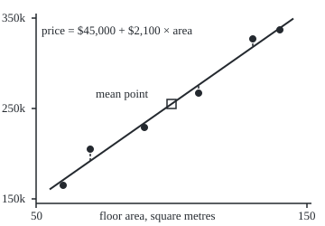
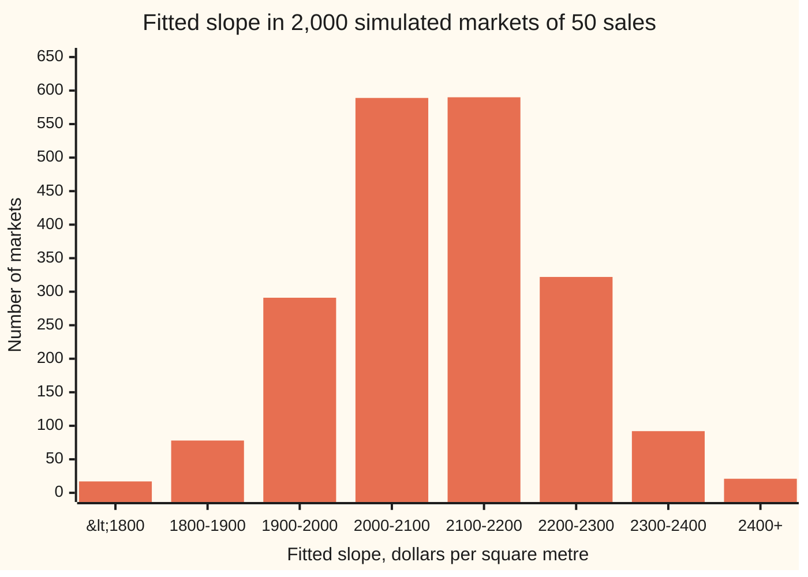

# Least squares: the line closest to the points, and what its slope means

[Syllabus](../../../SYLLABUS.md) → [Probability and statistics](../../../SYLLABUS.md#w09) → [Regression](../../../SYLLABUS.md#w09-s09) → Least squares

---

## General Overview

Six houses sold on one street last spring. The smallest had 60 square metres of floor and went for $165,000. The largest had 140 square metres and went for $337,000. In between: 70 square metres for $205,000, 90 for $229,000, 110 for $267,000, 130 for $327,000.

Bigger houses cost more, but not by a fixed amount. From 60 to 70 square metres the price jumps $40,000; from 130 to 140 it moves $10,000. No straight line passes through all six sales. Yet a buyer, a lender and a tax assessor all want one number: how much does an extra square metre add to the price on this street?

Least squares answers by scoring every possible line. For each sale, measure the gap between the real price and the line's price, square it, and add the six squares. The line with the smallest total wins. Here it is price = $45,000 + $2,100 × area. Its slope reads: **across these sales, each extra square metre goes with $2,100 more in price.** A second number, R squared, says how much of the price differences the line accounts for: 98.3% here.

**The least-squares line is the one whose squared vertical misses add up to the least; its slope is the covariance of area and price divided by the variance of area, and it always passes through the average sale.**

**What kind of fact this is:** a method; the claim that its formula gives the unique best line is a theorem, proved on this card in Why it works.

### The picture: six sales and the line that misses least

Drawn to scale. Across: floor area, 50 to 150 square metres. Up: price, $150,000 to $350,000. The dashed strokes are the misses, called residuals from here on.

<p align="center"></p>

Dots: the six sales. Solid line: the least-squares fit. The square marks the average sale, 100 square metres at $255,000; the line runs through it.

---

## The formula

Notation first, in words. The sales are numbered 1 to $n$; sale number i has floor area $x_i$ and price $y_i$. A bar over a letter means its average: $\bar x$ is the mean area. A capital sigma, Σ, with i beneath it means "add up over every sale". A hat marks a value the fit produces rather than one observed, as on the estimation shelf: $\hat y_i$ is the line's price for sale i.

Three sums carry everything. Two measure spread about the average sale; the third measures how area and price move together:

$$S_{xx} = \sum_i (x_i - \bar x)^2, \qquad S_{xy} = \sum_i (x_i - \bar x)(y_i - \bar y), \qquad S_{yy} = \sum_i (y_i - \bar y)^2$$

The least-squares line $\hat y = a + b\,x$ has

$$b = \frac{S_{xy}}{S_{xx}}, \qquad a = \bar y - b\,\bar x$$

**Read it aloud:** the slope is how much area and price move together, divided by how much area moves on its own; the intercept is whatever puts the line through the average sale.

How well the line does is one more ratio:

$$R^2 = 1 - \frac{SSE}{S_{yy}}, \qquad SSE = \sum_i (y_i - a - b\,x_i)^2$$

**Read it aloud:** R squared is one minus the share of the price spread the line leaves unexplained.

| Symbol | Plain meaning | In our example | Push it up and the answer… |
| --- | --- | --- | --- |
| $n$ | number of sales | 6 | slope wobbles less between samples |
| $x_i$, $y_i$ | floor area and price of sale i | 60 m^2, $165,000 for sale 1 | one point moves the line; squares make far points pull hardest |
| $\bar x$, $\bar y$ | average area, average price | 100 m^2, $255,000 | the line slides so it still passes through them |
| $S_{xx}$ | spread of the areas: squared distances from the mean area, added | 5,200 m^4 | slope shrinks, and is pinned down more firmly |
| $S_{xy}$ | co-movement: area gap times price gap, added | 10,920,000 $·m^2 | slope rises |
| $S_{yy}$ | spread of the prices, the total to be explained | 23,328,000,000 $^2 | R squared rises if the line's misses stay the same |
| $b$ | slope: dollars per extra square metre | $2,100 per m^2 | steeper line |
| $a$ | intercept: the line's price at zero area | $45,000 | line shifts up |
| $\hat y_i$ | the line's price for sale i | $171,000 for sale 1 | — |
| $e_i$ | residual: real price minus line price, $y_i - \hat y_i$ | −$6,000 for sale 1 | — |
| $SSE$ | sum of squared residuals, the score least squares minimises | 396,000,000 $^2 | R squared falls |
| $R^2$, $r$ | share of price spread explained; the correlation, whose square it is | 0.9830 and 0.9915 | — |

Dividing $S_{xy}$ and $S_{xx}$ both by $n$ turns them into the covariance of area and price and the variance of area from [Two variables at once](../02-Random%20Variables/04-joint-distributions-and-covariance.md). The $n$ cancels, so the slope is Cov(area, price) / Var(area): 1,820,000 / 866.67 = 2,100.

The units check themselves. $S_{xy}$ is dollars times square metres; $S_{xx}$ is square metres times square metres; the ratio is dollars per square metre. R squared has no units: it is the same number whether prices are in dollars or thousands, areas in metres or feet.

### When it holds

- **The areas must differ.** If all six houses had 100 square metres, $S_{xx}$ would be 0 and the slope 0/0: no data can say what an extra metre is worth when no house has one.
- **The pattern must be roughly straight.** The method returns a line for any cloud, curved or not, and a high R squared does not prove straightness. Plot first; [Diagnostics](04-diagnostics-and-residuals.md) reads the residuals for curves.
- **No single sale may dominate.** Squaring makes a big miss count heavily. Raise the last house from $337,000 to $437,000 and the slope jumps to $2,869.23 per square metre.
- **For the slope to estimate a market-wide rate,** the misses must average zero at every area: the sales must be a fair sample of the street. The line itself is exact arithmetic on the data; calling $2,100 an estimate of something beyond these six houses is a statistical claim, and its uncertainty is the work of [Regression error bars](02-regression-inference.md).
- **Inside the range of the data.** The line was fitted on 60 to 140 square metres. The intercept, $45,000 at zero area, lies far outside and describes no real house.

---

## Why it works

### Step 0: turn "closest" into a score, then find the bottom of a bowl

A line is two numbers, intercept $a$ and slope $b$. Each choice gives six residuals, and the score is the sum of their squares, $SSE$. Squares make every miss count as positive, so misses above and below cannot cancel, and they make the score a smooth bowl over all possible pairs of numbers. When the areas differ, the bowl has one lowest point. Completing the square, as for a quadratic equation, finds it without calculus and proves nothing lower exists.

### Step 1: whatever the slope, the best intercept runs the line through the average sale

Fix a slope. Then each sale leaves a number $y_i - b\,x_i$: its price with the slope's share removed. The intercept must be one constant that sits as close as possible to all six of those numbers in the squared sense. For any list of numbers, the constant with the smallest squared distance to them is their average: moving the constant away from the average by some amount adds $n$ times that amount squared to the total. So the best intercept is $a = \bar y - b\,\bar x$, which says exactly that the line passes through the point ($\bar x$, $\bar y$).

For the six houses: average area 100, average price $255,000. Every candidate slope worth considering pivots about that point.

### Step 2: with the line pinned there, the score is a parabola in the slope

Measure every sale from the average sale: area gap $x_i - \bar x$, price gap $y_i - \bar y$. With the intercept chosen as in Step 1, each residual is price gap minus $b$ times area gap. Square, add, and group the terms:

$$SSE(b) = S_{yy} - 2b\,S_{xy} + b^2 S_{xx} = S_{xx}\left(b - \frac{S_{xy}}{S_{xx}}\right)^2 + S_{yy} - \frac{S_{xy}^2}{S_{xx}}$$

The first term is a square times a positive number, so it is never below zero, and it is zero only at $b = S_{xy}/S_{xx}$. The second part does not depend on $b$ at all. So the lowest score is reached at that slope and nowhere else.

On the six houses, in thousands of dollars: $S_{xy}$ = 10,920 and $S_{xx}$ = 5,200, so $b$ = 2.1 thousand dollars, $2,100, per square metre. The leftover score is 23,328 − 10,920^2 / 5,200 = 23,328 − 22,932 = 396, which is $SSE$ = 396,000,000 in dollars squared.

<details>
<summary>Detailed proof: the pair (a, b) is the unique minimiser</summary>

Write $u_i = y_i - b\,x_i$ and let $\bar u = \bar y - b\,\bar x$ be their average. For any intercept $a$:
$$\sum_i (u_i - a)^2 = \sum_i (u_i - \bar u)^2 + 2(\bar u - a)\sum_i (u_i - \bar u) + n(\bar u - a)^2.$$
The middle sum is zero, because gaps from an average add to zero. So $SSE(a, b) = \sum_i (u_i - \bar u)^2 + n(\bar u - a)^2$, and for each $b$ the second term vanishes only at $a = \bar y - b\,\bar x$.

Now $u_i - \bar u = (y_i - \bar y) - b(x_i - \bar x)$. Expanding the square and adding gives $S_{yy} - 2b S_{xy} + b^2 S_{xx}$. When $S_{xx} > 0$, completing the square gives the display in Step 2, whose only minimum is $b = S_{xy}/S_{xx}$. Every other pair $(a, b)$ loses on at least one of the two non-negative terms, so the minimiser is unique. When $S_{xx} = 0$, the score does not depend on $b$ and every slope ties: the first bullet of When it holds.

</details>

### Step 3: the slope is covariance over variance

Divide the top and bottom of $S_{xy}/S_{xx}$ by $n$. The top becomes the covariance of area and price, 1,820,000 dollar square metres; the bottom the variance of area, 866.67 square metres squared. The slope is their ratio. Covariance says whether the two readings move together and how strongly; dividing by the variance of area converts that into dollars per square metre. A street where areas barely differ needs a steep slope to explain the same co-movement; a street with wide variation in area spreads it thin.

Swap the roles and the answer changes. Fitting area on price uses $S_{xy}/S_{yy}$, the least-squares rule for predicting area from price. It is a different line, because it scores horizontal misses instead of vertical ones.

### Step 4: total spread = explained + left over, and R squared is the explained share

Step 2 at its best slope reads $S_{yy} = S_{xy}^2/S_{xx} + SSE$. In words: the price spread splits into a part the line reproduces, 22,932 (thousand dollars, squared), and the part it misses, 396. That split is why R squared is a share:

$$R^2 = \frac{S_{xy}^2 / S_{xx}}{S_{yy}} = 1 - \frac{SSE}{S_{yy}} = \frac{22{,}932}{23{,}328} = 0.9830.$$

The first fraction is $S_{xy}^2/(S_{xx}\,S_{yy})$, the square of the correlation (ρ on the covariance card; $r$ when computed from a sample). For a straight line with an intercept, R squared is the correlation squared: the code prints r = 0.9915 and r^2 = 0.9830.

### Step 5: the residuals are balanced against the data

At the best line, two facts hold. The residuals add to zero, because the line runs through the average sale. And the residuals, weighted by area, also add to zero: they show no leftover trend with area, or a steeper or shallower line would have scored better. On the houses: −6,000 + 13,000 − 5,000 − 9,000 + 9,000 − 2,000 = 0. Weighted by area, in thousand dollars times square metres: −6 × 60 + 13 × 70 − 5 × 90 − 9 × 110 + 9 × 130 − 2 × 140 = −360 + 910 − 450 − 990 + 1,170 − 280 = 0. These two balance conditions are the normal equations.

The other door: stack the sales into a matrix and the normal equations say the residuals stand at right angles to everything a line can produce. The fitted prices are the shadow of the real ones, called their projection. That view, which extends to many predictors at once, is [Least squares](../../03-Algebra/06-Dot%20Products%20and%20Best%20Fits/04-least-squares.md) and then [Multiple regression](03-multiple-regression-and-gauss-markov.md).

---

## Worked numbers, by hand

Prices in thousands of dollars; areas in square metres. Gaps are measured from the average sale, 100 m^2 and 255 thousand.

| Step | Arithmetic | Value |
| --- | --- | --- |
| average area $\bar x$ | (60 + 70 + 90 + 110 + 130 + 140) / 6 | 100 |
| average price $\bar y$ | (165 + 205 + 229 + 267 + 327 + 337) / 6 | 255 |
| area gaps | each area − 100 | −40, −30, −10, 10, 30, 40 |
| price gaps | each price − 255 | −90, −50, −26, 12, 72, 82 |
| $S_{xx}$ | 1,600 + 900 + 100 + 100 + 900 + 1,600 | 5,200 |
| $S_{xy}$ | 3,600 + 1,500 + 260 + 120 + 2,160 + 3,280 | 10,920 |
| slope $b$ | 10,920 / 5,200 | 2.1, so **$2,100 per m^2** |
| intercept $a$ | 255 − 2.1 × 100 | 45, so $45,000 |
| fitted prices | 45 + 2.1 × area | 171, 192, 234, 276, 318, 339 |
| residuals | price − fitted | −6, 13, −5, −9, 9, −2 |
| $SSE$ | 36 + 169 + 25 + 81 + 81 + 4 | 396 |
| $S_{yy}$ | 8,100 + 2,500 + 676 + 144 + 5,184 + 6,724 | 23,328 |
| $R^2$ | 1 − 396 / 23,328 | **0.9830** |
| standard error of $b$ | from [Regression error bars](02-regression-inference.md) | $138 per m^2 |

On this street, a house with 10 more square metres sold, on average, for about $21,000 more; the line accounts for 98.3% of the spread in prices. Six sales pin the slope only to $2,100 ± $138 per square metre (one standard error): a description of these six sales, and a rough estimate for the street.

### What breaks if you drop a piece

Same six sales; the right slope is $2,100 per square metre.

| Mistake | Comes out at | What went wrong |
| --- | --- | --- |
| Fit area on price, then invert the slope | $2,136.26 per m^2 | That line minimises horizontal misses; inverting it gives $2,100 / R^2, not $2,100 |
| Force the line through zero (no intercept) | $2,514.11 per m^2 | A house of zero area is made to cost $0, so the line tilts to reach the origin |
| Draw the line through the two end houses | $2,150.00 per m^2 | Uses two sales out of six; a different pair gives a different answer |
| Make the plain sum of residuals zero | a flat line at $255,000 scores 0, as good as the fit | Misses above and below cancel, so every line through the average sale ties; squared, the flat line scores 23,328,000,000 against 396,000,000 |

### A second case: 50 sales, 2,000 times over

The shelf's house example has 50 sales. The code builds a market where the true rule is known: 50 areas drawn between 50 and 150 square metres, each price set to $45,000 + $2,100 × area plus a random miss with standard deviation $25,000 (the noise). One such market fits a slope of $2,161.75 per square metre, standard error $139.11, R squared 0.8342: noisier than the six-house street, so the line explains less.

Repeat with fresh noise 2,000 times. The fitted slopes average $2,104.42. The standard error of that average is $2.76, so that average sits 1.6 standard errors from the true $2,100: no sign that least squares leans either way. The slopes themselves spread by $123.55 from market to market, matching $123.46 from the formula on [Regression error bars](02-regression-inference.md).



Bars: how many of the 2,000 markets gave a slope in each $100 band. The end bars hold everything beyond them. The pile centres on the true $2,100: one sample's slope is one draw from this pile.

---

## Code, from first principles, and it actually runs

Nothing imported knows the answer. The line is reached three ways that share no formula: the centred sums of this card; the raw normal equations (sums of areas, prices, squares and products, solved by Cramer's rule); and a blind golden-section search that tries lines and keeps whichever scores lower, knowing nothing but the score. R squared is computed as one minus the missed share, as the explained share, and as the squared correlation. Then 2,000 simulated markets, drawn from a SplitMix64 generator (a short, fixed recipe for pseudo-random numbers, seed 2026092801) with Box–Muller turning pairs of uniform draws into normal ones, check that the slope centres on the truth. Every number on the card, including each point of the drawing and each bar, is printed below.

### Python

```python
# Least squares regression -- the check behind the card.  Standard library only.
# Six house sales: floor area in square metres, price in dollars.  The line is reached
# three ways that share no formula: centred sums, the raw-sum normal equations solved by
# Cramer's rule, and a blind golden-section search of the squared-miss bowl.  Then 2,000
# simulated markets of 50 sales each, from a SplitMix64 generator written out below.
from math import sqrt, log, cos, pi

AREA = [60.0, 70.0, 90.0, 110.0, 130.0, 140.0]
PRICE = [165000.0, 205000.0, 229000.0, 267000.0, 327000.0, 337000.0]

def centred(xs, ys):                 # road 1: slope = S_xy / S_xx, line through the mean point
    n = len(xs); xb = sum(xs) / n; yb = sum(ys) / n
    sxx = sum((x - xb) * (x - xb) for x in xs)
    sxy = sum((x - xb) * (y - yb) for x, y in zip(xs, ys))
    syy = sum((y - yb) * (y - yb) for y in ys)
    b = sxy / sxx
    return xb, yb, sxx, sxy, syy, yb - b * xb, b

def raw(xs, ys):                     # road 2: n a + (sum x) b = sum y ; (sum x) a + (sum x^2) b = sum xy
    n = len(xs); sx = sum(xs); sy = sum(ys)
    sxx = sum(x * x for x in xs); sxy = sum(x * y for x, y in zip(xs, ys))
    det = n * sxx - sx * sx
    return (sy * sxx - sx * sxy) / det, (n * sxy - sx * sy) / det, sxy / sxx

def sse(a, b, xs, ys): return sum((y - a - b * x) * (y - a - b * x) for x, y in zip(xs, ys))

def golden(f, lo, hi, steps=90):     # shrink a bracket around the bottom of a one-dip curve
    g = (sqrt(5.0) - 1.0) / 2.0
    c, d = hi - g * (hi - lo), lo + g * (hi - lo)
    fc, fd = f(c), f(d)
    for _ in range(steps):
        if fc < fd: hi, d, fd = d, c, fc; c = hi - g * (hi - lo); fc = f(c)
        else: lo, c, fc = c, d, fd; d = lo + g * (hi - lo); fd = f(d)
    return (lo + hi) / 2.0

def search(xs, ys):                  # road 3: no formula, only "try a line, score its misses"
    best_a = lambda b: golden(lambda a: sse(a, b, xs, ys), -1e6, 1e6)
    b = golden(lambda b: sse(best_a(b), b, xs, ys), -1e4, 1e4)
    return best_a(b), b

xb, yb, sxx, sxy, syy, a1, b1 = centred(AREA, PRICE)
a2, b2, b_origin = raw(AREA, PRICE)
a3, b3 = search(AREA, PRICE)
fit = [a1 + b1 * x for x in AREA]
res = [y - f for y, f in zip(PRICE, fit)]
sse1 = sse(a1, b1, AREA, PRICE)
r = sxy / sqrt(sxx * syy)
explained = sum((f - yb) * (f - yb) for f in fit)
se_b = sqrt(sse1 / (len(AREA) - 2)) / sqrt(sxx)

print("sale  area  price     d_x   d_y(k)  product(k)  fitted    residual")
for i, (x, y, f, e) in enumerate(zip(AREA, PRICE, fit, res)):
    print(f"{i + 1:>4} {x:5.0f} {y:8.0f} {x - xb:6.0f} {(y - yb) / 1000:7.0f} "
          f"{(x - xb) * (y - yb) / 1000:10.0f} {f:9.0f} {e:9.0f}")
rows = [("mean area (m2)", xb), ("mean price ($)", yb), ("S_xx (m2^2)", sxx),
        ("S_xy ($ m2)", sxy), ("S_yy ($^2)", syy),
        ("Cov(area, price), divide by n", sxy / len(AREA)), ("Var(area), divide by n", sxx / len(AREA)),
        ("1 slope, centred sums", b1), ("  intercept", a1),
        ("2 slope, raw normal equations", b2), ("  intercept", a2),
        ("3 slope, golden search", b3), ("  intercept", a3),
        ("SSE at the fit ($^2)", sse1), ("SSE at the searched line", sse(a3, b3, AREA, PRICE)),
        ("sum of residuals", sum(res)), ("sum of residual x area", sum(e * x for e, x in zip(res, AREA))),
        ("explained, S_xy^2 / S_xx ($^2)", sxy * sxy / sxx),
        ("R^2 = 1 - SSE/S_yy", 1.0 - sse1 / syy), ("R^2 = explained/S_yy", explained / syy),
        ("r, correlation", r), ("r^2", r * r), ("standard error of slope", se_b),
        ("wrong: area on price, inverted", syy / sxy), ("wrong: no intercept", b_origin),
        ("wrong: two end houses only", (PRICE[-1] - PRICE[0]) / (AREA[-1] - AREA[0])),
        ("wrong: flat line, residual sum", sum(y - yb for y in PRICE)), ("  flat line SSE", syy)]
for name, v in rows: print(f"{name:<32} {v:>18.4f}")

# ---- try changing ----
ft2 = [x * 10.7639 for x in AREA]                        # square feet in a square metre
_, _, _, _, syy_f, _, b_f = centred(ft2, PRICE)
big = PRICE[:-1] + [437000.0]
_, _, _, _, _, a_m, b_m = centred(AREA, big)
_, _, _, _, _, a_u, b_u = centred(AREA, [y + 20000.0 for y in PRICE])
print(f"try: square feet, slope {b_f:.2f}  R^2 {1.0 - sse(centred(ft2, PRICE)[5], b_f, ft2, PRICE) / syy_f:.5f}")
print(f"try: last house $437,000, slope {b_m:.2f}  intercept {a_m:.2f}")
print(f"try: every price +$20,000, slope {b_u:.2f}  intercept {a_u:.2f}")

# ---- the figure: x px = 40 + 3 (area - 50), y px = 220 - (price - 150,000) / 1,000 ----
px = lambda x: 40.0 + 3.0 * (x - 50.0)
py = lambda y: 220.0 - (y - 150000.0) / 1000.0
print("figure, points " + " ".join(f"({px(x):.0f},{py(y):.0f})" for x, y in zip(AREA, PRICE)))
print("figure, line   " + " ".join(f"({px(x):.0f},{py(a1 + b1 * x):.1f})" for x in (55.0, 145.0)) +
      " fitted " + " ".join(f"{py(f):.0f}" for f in fit) + f" mean ({px(xb):.0f},{py(yb):.0f})")

# ---- 2,000 simulated markets, 50 sales each: true line 45,000 + 2,100 area, noise sd 25,000 ----
MASK, state = (1 << 64) - 1, 2026092801
def splitmix():
    global state
    state = (state + 0x9E3779B97F4A7C15) & MASK
    z = state
    z = ((z ^ (z >> 30)) * 0xBF58476D1CE4E5B9) & MASK
    z = ((z ^ (z >> 27)) * 0x94D049BB133111EB) & MASK
    return z ^ (z >> 31)
def normal():                         # Box-Muller
    u1 = ((splitmix() >> 11) + 0.5) / 2.0 ** 53
    u2 = ((splitmix() >> 11) + 0.5) / 2.0 ** 53
    return sqrt(-2.0 * log(u1)) * cos(2.0 * pi * u2)
areas = [50.0 + float(splitmix() % 101) for _ in range(50)]
slopes, bins = [], [0] * 8
for m in range(2000):
    prices = [45000.0 + 2100.0 * x + 25000.0 * normal() for x in areas]
    _, _, sx50, _, sy50, a50, b50 = centred(areas, prices)
    if m == 0:
        s50 = sse(a50, b50, areas, prices)
        print(f"market 1: slope {b50:.2f}  intercept {a50:.2f}  R^2 {1.0 - s50 / sy50:.4f}  "
              f"se {sqrt(s50 / 48.0) / sqrt(sx50):.2f}")
    slopes.append(b50)
    bins[min(7, max(0, int((b50 - 1700.0) // 100.0)))] += 1
mean_b = sum(slopes) / len(slopes)
sd_b = sqrt(sum((s - mean_b) * (s - mean_b) for s in slopes) / (len(slopes) - 1))
theory = 25000.0 / sqrt(sx50)
print(f"2000 markets: mean slope {mean_b:.2f}  se of mean {sd_b / sqrt(2000.0):.2f}  "
      f"spread {sd_b:.2f}  theory {theory:.2f}")
print("figure, slope bins 1700..2500 by 100: " + " ".join(str(c) for c in bins))

assert abs(b1 - 2100.0) < 1e-9 and abs(a1 - 45000.0) < 1e-6, "centred road vs the hand table"
assert abs(b2 - b1) < 1e-6 and abs(a2 - a1) < 1e-4, "raw normal equations vs centred sums"
assert abs(b3 - b1) < 1e-3 and abs(a3 - a1) < 0.1, "blind search lands on the formula's line"
assert abs((1.0 - sse1 / syy) - r * r) < 1e-12, "R^2 from misses equals squared correlation"
assert abs(mean_b - 2100.0) < 4.0 * sd_b / sqrt(2000.0), "simulated slopes centre on the true 2,100"
assert abs(sd_b / theory - 1.0) < 0.1, "simulated spread matches sigma / sqrt(S_xx)"
print("ALL CHECKS PASS")
```

**Ran 2026-09-28 on macOS, Python 3.14.6, standard library only. All checks passed. Output, pasted from the run:**

```
sale  area  price     d_x   d_y(k)  product(k)  fitted    residual
   1    60   165000    -40     -90       3600    171000     -6000
   2    70   205000    -30     -50       1500    192000     13000
   3    90   229000    -10     -26        260    234000     -5000
   4   110   267000     10      12        120    276000     -9000
   5   130   327000     30      72       2160    318000      9000
   6   140   337000     40      82       3280    339000     -2000
mean area (m2)                             100.0000
mean price ($)                          255000.0000
S_xx (m2^2)                               5200.0000
S_xy ($ m2)                           10920000.0000
S_yy ($^2)                         23328000000.0000
Cov(area, price), divide by n          1820000.0000
Var(area), divide by n                     866.6667
1 slope, centred sums                     2100.0000
  intercept                              45000.0000
2 slope, raw normal equations             2100.0000
  intercept                              45000.0000
3 slope, golden search                    2100.0000
  intercept                              45000.0001
SSE at the fit ($^2)                 396000000.0000
SSE at the searched line             396000000.0000
sum of residuals                             0.0000
sum of residual x area                       0.0000
explained, S_xy^2 / S_xx ($^2)     22932000000.0000
R^2 = 1 - SSE/S_yy                           0.9830
R^2 = explained/S_yy                         0.9830
r, correlation                               0.9915
r^2                                          0.9830
standard error of slope                    137.9799
wrong: area on price, inverted            2136.2637
wrong: no intercept                       2514.1104
wrong: two end houses only                2150.0000
wrong: flat line, residual sum               0.0000
  flat line SSE                    23328000000.0000
try: square feet, slope 195.10  R^2 0.98302
try: last house $437,000, slope 2869.23  intercept -15256.41
try: every price +$20,000, slope 2100.00  intercept 65000.00
figure, points (70,205) (100,165) (160,141) (220,103) (280,43) (310,33)
figure, line   (55,209.5) (325,20.5) fitted 199 178 136 94 52 31 mean (190,115)
market 1: slope 2161.75  intercept 41965.58  R^2 0.8342  se 139.11
2000 markets: mean slope 2104.42  se of mean 2.76  spread 123.55  theory 123.46
figure, slope bins 1700..2500 by 100: 17 78 291 589 590 322 92 21
ALL CHECKS PASS
```

### Rust

```rust
// Least squares regression -- the same check as least_squares_regression_check.py, in Rust.
// Std only, no crates.  Six house sales, three roads to the line (centred sums, raw-sum
// normal equations by Cramer's rule, blind golden-section search), then 2,000 simulated
// markets of 50 sales from the same SplitMix64 stream as the Python.
// Compile: rustc --edition 2021 -O least_squares_regression_check.rs -o /tmp/lsq_check
const AREA: [f64; 6] = [60.0, 70.0, 90.0, 110.0, 130.0, 140.0];
const PRICE: [f64; 6] = [165000.0, 205000.0, 229000.0, 267000.0, 327000.0, 337000.0];

// road 1: slope = S_xy / S_xx, line through the mean point
fn centred(xs: &[f64], ys: &[f64]) -> (f64, f64, f64, f64, f64, f64, f64) {
    let n = xs.len() as f64;
    let xb = xs.iter().sum::<f64>() / n;
    let yb = ys.iter().sum::<f64>() / n;
    let (mut sxx, mut sxy, mut syy) = (0.0, 0.0, 0.0);
    for x in xs { sxx += (x - xb) * (x - xb); }
    for (x, y) in xs.iter().zip(ys) { sxy += (x - xb) * (y - yb); }
    for y in ys { syy += (y - yb) * (y - yb); }
    let b = sxy / sxx;
    (xb, yb, sxx, sxy, syy, yb - b * xb, b)
}

// road 2: n a + (sum x) b = sum y ; (sum x) a + (sum x^2) b = sum xy, solved by Cramer's rule
fn raw(xs: &[f64], ys: &[f64]) -> (f64, f64, f64) {
    let n = xs.len() as f64;
    let sx: f64 = xs.iter().sum();
    let sy: f64 = ys.iter().sum();
    let (mut sxx, mut sxy) = (0.0, 0.0);
    for x in xs { sxx += x * x; }
    for (x, y) in xs.iter().zip(ys) { sxy += x * y; }
    let det = n * sxx - sx * sx;
    ((sy * sxx - sx * sxy) / det, (n * sxy - sx * sy) / det, sxy / sxx)
}

fn sse(a: f64, b: f64, xs: &[f64], ys: &[f64]) -> f64 {
    let mut s = 0.0;
    for (x, y) in xs.iter().zip(ys) { s += (y - a - b * x) * (y - a - b * x); }
    s
}

// shrink a bracket around the bottom of a one-dip curve
fn golden<F: Fn(f64) -> f64>(f: F, mut lo: f64, mut hi: f64) -> f64 {
    let g = (5.0_f64.sqrt() - 1.0) / 2.0;
    let (mut c, mut d) = (hi - g * (hi - lo), lo + g * (hi - lo));
    let (mut fc, mut fd) = (f(c), f(d));
    for _ in 0..90 {
        if fc < fd { hi = d; d = c; fd = fc; c = hi - g * (hi - lo); fc = f(c); }
        else { lo = c; c = d; fc = fd; d = lo + g * (hi - lo); fd = f(d); }
    }
    (lo + hi) / 2.0
}

// road 3: no formula, only "try a line, score its misses"
fn search(xs: &[f64], ys: &[f64]) -> (f64, f64) {
    let best_a = |b: f64| golden(|a| sse(a, b, xs, ys), -1e6, 1e6);
    let b = golden(|b| sse(best_a(b), b, xs, ys), -1e4, 1e4);
    (best_a(b), b)
}

struct SplitMix(u64);
impl SplitMix {
    fn next(&mut self) -> u64 {
        self.0 = self.0.wrapping_add(0x9E3779B97F4A7C15);
        let mut z = self.0;
        z = (z ^ (z >> 30)).wrapping_mul(0xBF58476D1CE4E5B9);
        z = (z ^ (z >> 27)).wrapping_mul(0x94D049BB133111EB);
        z ^ (z >> 31)
    }
    fn normal(&mut self) -> f64 { // Box-Muller
        let u1 = ((self.next() >> 11) as f64 + 0.5) / 2f64.powi(53);
        let u2 = ((self.next() >> 11) as f64 + 0.5) / 2f64.powi(53);
        (-2.0 * u1.ln()).sqrt() * (2.0 * std::f64::consts::PI * u2).cos()
    }
}

fn main() {
    let (xb, yb, sxx, sxy, syy, a1, b1) = centred(&AREA, &PRICE);
    let (a2, b2, b_origin) = raw(&AREA, &PRICE);
    let (a3, b3) = search(&AREA, &PRICE);
    let fit: Vec<f64> = AREA.iter().map(|x| a1 + b1 * x).collect();
    let res: Vec<f64> = PRICE.iter().zip(&fit).map(|(y, f)| y - f).collect();
    let sse1 = sse(a1, b1, &AREA, &PRICE);
    let r = sxy / (sxx * syy).sqrt();
    let explained: f64 = fit.iter().map(|f| (f - yb) * (f - yb)).sum();
    let se_b = (sse1 / (AREA.len() as f64 - 2.0)).sqrt() / sxx.sqrt();

    println!("sale  area  price     d_x   d_y(k)  product(k)  fitted    residual");
    for i in 0..6 {
        let (x, y) = (AREA[i], PRICE[i]);
        println!("{:>4} {:5.0} {:8.0} {:6.0} {:7.0} {:10.0} {:9.0} {:9.0}", i + 1, x, y, x - xb,
                 (y - yb) / 1000.0, (x - xb) * (y - yb) / 1000.0, fit[i], res[i]);
    }
    let n = AREA.len() as f64;
    let rows: Vec<(&str, f64)> = vec![
        ("mean area (m2)", xb), ("mean price ($)", yb), ("S_xx (m2^2)", sxx),
        ("S_xy ($ m2)", sxy), ("S_yy ($^2)", syy),
        ("Cov(area, price), divide by n", sxy / n), ("Var(area), divide by n", sxx / n),
        ("1 slope, centred sums", b1), ("  intercept", a1),
        ("2 slope, raw normal equations", b2), ("  intercept", a2),
        ("3 slope, golden search", b3), ("  intercept", a3),
        ("SSE at the fit ($^2)", sse1), ("SSE at the searched line", sse(a3, b3, &AREA, &PRICE)),
        ("sum of residuals", res.iter().sum()),
        ("sum of residual x area", res.iter().zip(&AREA).map(|(e, x)| e * x).sum()),
        ("explained, S_xy^2 / S_xx ($^2)", sxy * sxy / sxx),
        ("R^2 = 1 - SSE/S_yy", 1.0 - sse1 / syy), ("R^2 = explained/S_yy", explained / syy),
        ("r, correlation", r), ("r^2", r * r), ("standard error of slope", se_b),
        ("wrong: area on price, inverted", syy / sxy), ("wrong: no intercept", b_origin),
        ("wrong: two end houses only", (PRICE[5] - PRICE[0]) / (AREA[5] - AREA[0])),
        ("wrong: flat line, residual sum", PRICE.iter().map(|y| y - yb).sum()), ("  flat line SSE", syy),
    ];
    for (name, v) in &rows { println!("{:<32} {:>18.4}", name, v); }

    // ---- try changing ----
    let ft2: Vec<f64> = AREA.iter().map(|x| x * 10.7639).collect();
    let (_, _, _, _, syy_f, a_f, b_f) = centred(&ft2, &PRICE);
    let mut big = PRICE.to_vec(); big[5] = 437000.0;
    let (_, _, _, _, _, a_m, b_m) = centred(&AREA, &big);
    let up: Vec<f64> = PRICE.iter().map(|y| y + 20000.0).collect();
    let (_, _, _, _, _, a_u, b_u) = centred(&AREA, &up);
    println!("try: square feet, slope {:.2}  R^2 {:.5}", b_f, 1.0 - sse(a_f, b_f, &ft2, &PRICE) / syy_f);
    println!("try: last house $437,000, slope {:.2}  intercept {:.2}", b_m, a_m);
    println!("try: every price +$20,000, slope {:.2}  intercept {:.2}", b_u, a_u);

    // ---- the figure: x px = 40 + 3 (area - 50), y px = 220 - (price - 150,000) / 1,000 ----
    let px = |x: f64| 40.0 + 3.0 * (x - 50.0);
    let py = |y: f64| 220.0 - (y - 150000.0) / 1000.0;
    let pts: Vec<String> = AREA.iter().zip(&PRICE).map(|(x, y)| format!("({:.0},{:.0})", px(*x), py(*y))).collect();
    println!("figure, points {}", pts.join(" "));
    let ends: Vec<String> = [55.0, 145.0].iter().map(|x| format!("({:.0},{:.1})", px(*x), py(a1 + b1 * x))).collect();
    let fy: Vec<String> = fit.iter().map(|f| format!("{:.0}", py(*f))).collect();
    println!("figure, line   {} fitted {} mean ({:.0},{:.0})", ends.join(" "), fy.join(" "), px(xb), py(yb));

    // ---- 2,000 simulated markets, 50 sales each: true line 45,000 + 2,100 area, noise sd 25,000 ----
    let mut rng = SplitMix(2026092801);
    let areas: Vec<f64> = (0..50).map(|_| 50.0 + (rng.next() % 101) as f64).collect();
    let (mut slopes, mut bins, mut sx50) = (Vec::new(), [0u32; 8], 0.0);
    for m in 0..2000 {
        let prices: Vec<f64> = areas.iter().map(|x| 45000.0 + 2100.0 * x + 25000.0 * rng.normal()).collect();
        let (_, _, sx, _, sy50, a50, b50) = centred(&areas, &prices);
        sx50 = sx;
        if m == 0 {
            let s50 = sse(a50, b50, &areas, &prices);
            println!("market 1: slope {:.2}  intercept {:.2}  R^2 {:.4}  se {:.2}", b50, a50,
                     1.0 - s50 / sy50, (s50 / 48.0).sqrt() / sx.sqrt());
        }
        slopes.push(b50);
        bins[(((b50 - 1700.0) / 100.0).floor().max(0.0) as usize).min(7)] += 1;
    }
    let mean_b = slopes.iter().sum::<f64>() / 2000.0;
    let sd_b = (slopes.iter().map(|s| (s - mean_b) * (s - mean_b)).sum::<f64>() / 1999.0).sqrt();
    let theory = 25000.0 / sx50.sqrt();
    println!("2000 markets: mean slope {:.2}  se of mean {:.2}  spread {:.2}  theory {:.2}",
             mean_b, sd_b / 2000f64.sqrt(), sd_b, theory);
    let b: Vec<String> = bins.iter().map(|c| c.to_string()).collect();
    println!("figure, slope bins 1700..2500 by 100: {}", b.join(" "));

    assert!((b1 - 2100.0).abs() < 1e-9 && (a1 - 45000.0).abs() < 1e-6, "centred road vs the hand table");
    assert!((b2 - b1).abs() < 1e-6 && (a2 - a1).abs() < 1e-4, "raw normal equations vs centred sums");
    assert!((b3 - b1).abs() < 1e-3 && (a3 - a1).abs() < 0.1, "blind search lands on the formula's line");
    assert!(((1.0 - sse1 / syy) - r * r).abs() < 1e-12, "R^2 from misses equals squared correlation");
    assert!((mean_b - 2100.0).abs() < 4.0 * sd_b / 2000f64.sqrt(), "simulated slopes centre on the true 2,100");
    assert!((sd_b / theory - 1.0).abs() < 0.1, "simulated spread matches sigma / sqrt(S_xx)");
    println!("ALL CHECKS PASS");
}
```

**Ran 2026-09-28 on macOS, rustc 1.98.1, no crates. All checks passed. Output, pasted from the run:**

```
sale  area  price     d_x   d_y(k)  product(k)  fitted    residual
   1    60   165000    -40     -90       3600    171000     -6000
   2    70   205000    -30     -50       1500    192000     13000
   3    90   229000    -10     -26        260    234000     -5000
   4   110   267000     10      12        120    276000     -9000
   5   130   327000     30      72       2160    318000      9000
   6   140   337000     40      82       3280    339000     -2000
mean area (m2)                             100.0000
mean price ($)                          255000.0000
S_xx (m2^2)                               5200.0000
S_xy ($ m2)                           10920000.0000
S_yy ($^2)                         23328000000.0000
Cov(area, price), divide by n          1820000.0000
Var(area), divide by n                     866.6667
1 slope, centred sums                     2100.0000
  intercept                              45000.0000
2 slope, raw normal equations             2100.0000
  intercept                              45000.0000
3 slope, golden search                    2100.0000
  intercept                              45000.0001
SSE at the fit ($^2)                 396000000.0000
SSE at the searched line             396000000.0000
sum of residuals                             0.0000
sum of residual x area                       0.0000
explained, S_xy^2 / S_xx ($^2)     22932000000.0000
R^2 = 1 - SSE/S_yy                           0.9830
R^2 = explained/S_yy                         0.9830
r, correlation                               0.9915
r^2                                          0.9830
standard error of slope                    137.9799
wrong: area on price, inverted            2136.2637
wrong: no intercept                       2514.1104
wrong: two end houses only                2150.0000
wrong: flat line, residual sum               0.0000
  flat line SSE                    23328000000.0000
try: square feet, slope 195.10  R^2 0.98302
try: last house $437,000, slope 2869.23  intercept -15256.41
try: every price +$20,000, slope 2100.00  intercept 65000.00
figure, points (70,205) (100,165) (160,141) (220,103) (280,43) (310,33)
figure, line   (55,209.5) (325,20.5) fitted 199 178 136 94 52 31 mean (190,115)
market 1: slope 2161.75  intercept 41965.58  R^2 0.8342  se 139.11
2000 markets: mean slope 2104.42  se of mean 2.76  spread 123.55  theory 123.46
figure, slope bins 1700..2500 by 100: 17 78 291 589 590 322 92 21
ALL CHECKS PASS
```

The two outputs agree line for line, including the simulated markets: both programs draw the same SplitMix64 stream. The blind search lands $0.0001 off on the intercept, which is as finely as double-precision arithmetic can locate the bottom of a bowl that flat.

> [!TIP]
> **Try changing**
> Guess the direction first.
> - **Measure in square feet.** Multiply every area by 10.7639. The slope becomes $195.10 per square foot; R squared stays 0.98302. A slope carries units; R squared does not.
> - **Make the last house a mansion.** Set its price to $437,000. The slope leaps to $2,869.23 and the intercept goes negative, −$15,256.41. One sale moved the slope by more than a third.
> - **Add $20,000 to every price.** The slope stays $2,100.00; the intercept becomes $65,000.00. A slope reads differences, not levels.

---

## The usual mistake

> [!warning]
> **Reading the slope as a cause.** $2,100 per square metre says that on this street larger houses sold for more, at that rate. It does not say that building a 10 m^2 extension adds $21,000. Larger houses may also have bigger gardens or better views, and the slope carries those along with the floor area. Least squares measures how two readings move together, and nothing more.
>
> - **Fitting the wrong way round.** Area on price, inverted, gives $2,136.26, not $2,100. The two lines agree only when every point lies on one line.
> - **Reading R squared as a chance.** 0.9830 is a share of spread in these six prices. It is not the chance the line is right, nor the share of houses the line gets right.
> - **Trusting the intercept.** $45,000 is the line's price at zero area, 60 square metres below the smallest sale. It is not the value of the land.
> - **Dropping the intercept to "simplify".** The through-zero slope is $2,514.11, and the usual R squared formula no longer means a share.

---

## Where you meet it in real life

- **Property valuation.** Price per square metre comes from fits like this one, usually with more readings such as location and age: [Multiple regression](03-multiple-regression-and-gauss-markov.md).
- **A stock's beta.** Regress a stock's returns on the market's returns; the slope is beta, the stock's sensitivity to the market: [CAPM](../../12-Financial%20mathematics/37-Portfolio%20Theory/04-capm-and-beta.md).
- **Hedge ratios.** How many futures contracts offset a holding is a regression slope of one price change on another: [Imperfect hedges](../../12-Financial%20mathematics/40-Hedging%2C%20Volatility%20Forecasts%20and%20Stress/03-hedge-ratios-basis-risk-and-cross-hedging.md).
- **Calibration of instruments.** A thermometer or scale is read against known standards, and the least-squares line converts its reading into the true value.
- **Machine learning.** Squared-error loss, averaged over training data, is this card's score with more parameters: Loss and empirical risk.

> **Say it back**
> Least squares scores a line by its squared vertical misses and takes the line with the lowest score. Completing the square shows the winner runs through the average sale and has slope equal to covariance over variance. On six house sales it gives $2,100 per square metre with an intercept of $45,000. R squared splits the price spread into the part the line reproduces and the part it misses: 98.3% explained here. The slope describes how price and area moved together in these sales, not what an extension would add.

---

## What this builds on

- [Two variables at once](../02-Random%20Variables/04-joint-distributions-and-covariance.md): covariance and correlation, the two quantities the slope and R squared are built from.
- [Least squares](../../03-Algebra/06-Dot%20Products%20and%20Best%20Fits/04-least-squares.md): the same minimisation as a projection, with the normal equations in matrix form.

## Where this goes next

- [Regression error bars](02-regression-inference.md): the standard error of the slope from one sample, confidence intervals and tests for it.
- [Autoregression](../12-Time%20Series/02-ar-models.md): regressing a series on its own past values.
- [Longstaff-Schwartz](../../12-Financial%20mathematics/06-Numerical%20Methods%20for%20Pricing/06-longstaff-schwartz-least-squares-monte-carlo.md): a regression inside a simulation decides when to exercise an option early.
- [Calibration](../../12-Financial%20mathematics/07-Greeks%20by%20Numbers%20and%20Calibration/06-calibration-as-least-squares.md): fitting a pricing model's inputs to market prices by squared misses.
- [CAPM](../../12-Financial%20mathematics/37-Portfolio%20Theory/04-capm-and-beta.md): beta as a least-squares slope.
- [Imperfect hedges](../../12-Financial%20mathematics/40-Hedging%2C%20Volatility%20Forecasts%20and%20Stress/03-hedge-ratios-basis-risk-and-cross-hedging.md): the minimum-variance hedge ratio is covariance over variance.
- Adapting as you go: a controller that refits its model by least squares as data arrive.
- Loss and empirical risk: squared error as one loss among several.
- Nonlinear least squares: the same score when the model is curved in its parameters.
- Least squares two ways: why software avoids the raw normal equations of road 2 on hard problems.
- Reproducing kernels: least squares over whole spaces of functions.

The fitted $2,100 is one draw from a pile of possible slopes; how wide that pile is, judged from a single sample of sales, is [Regression error bars](02-regression-inference.md).

---

## Sources

Verified 2026-09-28: every link below resolves to the publisher's page.

- Freedman, David, Robert Pisani, and Roger Purves. *Statistics*, 4th ed. W. W. Norton, 2007. [Publisher page](https://wwnorton.com/books/9780393929720). The regression line as the line through the point of averages, R squared, and association read without cause.
- Galton, Francis. "Regression Towards Mediocrity in Hereditary Stature." *Journal of the Anthropological Institute of Great Britain and Ireland* 15 (1886): 246–263. [doi:10.2307/2841583](https://doi.org/10.2307/2841583). The paper that named regression.
- Stigler, Stephen M. "Gauss and the Invention of Least Squares." *Annals of Statistics* 9, no. 3 (1981): 465–474. [doi:10.1214/aos/1176345451](https://doi.org/10.1214/aos/1176345451). Legendre's 1805 publication and Gauss's priority claim.
- Anscombe, F. J. "Graphs in Statistical Analysis." *The American Statistician* 27, no. 1 (1973): 17–21. [doi:10.1080/00031305.1973.10478966](https://doi.org/10.1080/00031305.1973.10478966). Four data sets with the same line and the same R squared, only one of them straight: why the plot comes first.
