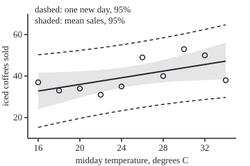

# Regression error bars: standard errors, t-tests and prediction intervals for a fitted line

[Syllabus](../../../SYLLABUS.md) → [Probability and statistics](../../../SYLLABUS.md#w09) → [Regression](../../../SYLLABUS.md#w09-s09) → Regression error bars

---

## General Overview

A café logged two numbers on ten summer days: the midday temperature and the iced coffees sold.

| Temperature, °C | 16 | 18 | 20 | 22 | 24 | 26 | 28 | 30 | 32 | 34 |
| --- | --- | --- | --- | --- | --- | --- | --- | --- | --- | --- |
| Iced coffees sold | 37 | 33 | 34 | 31 | 35 | 49 | 40 | 53 | 50 | 38 |

The least-squares line through these points ([Least squares](01-least-squares-regression.md)) says sales are 20 coffees plus 0.8 for every degree. The owner asks the plain question: is the slope different from zero, or could a flat line have produced these ten days by luck?

Ten other days would give a different line. The slope is an estimate, and it needs an error bar. Here the error bar is 0.36 coffees per degree, the slope's standard error: the typical distance between a fitted slope and the true one. The slope sits 2.22 standard errors above zero. With only ten days that is not quite enough: the 95 percent interval for the slope runs from −0.03 to 1.63, and it contains zero. The p-value is 0.057. That is not the chance that heat does nothing. It says a truly flat café would produce a slope this far from zero, either way, about 1 time in 17.

The same machinery forecasts. On a 30 °C day the line predicts 44 coffees. The 95 percent interval for the average over many such days runs from 37.7 to 50.3. For one particular day it runs from 27.6 to 60.4, because a single day carries its own noise on top of the line's uncertainty.

**The fitted slope is a weighted sum of the days' noise, so its spread can be computed exactly; estimate the noise from the leftovers, divide, and the ratio follows Student's t law, which gives the test, the interval for the slope, and, with one extra term for a new day's own noise, the prediction interval.**

**What kind of fact this is:** a theorem inside a model. The model is the assumption that each day's sales are the line plus independent normal noise of one fixed spread; given it, the variances and the t law are proved on this card in Why it works. The intervals and the test built on them are a method.

### The picture: ten days, the line, and its two bands

<p align="center"></p>

The ten circles are the days, drawn to scale. The solid line is the fit. The shaded band is the 95 percent interval for mean sales at each temperature; it is narrowest at 25 °C, the average temperature, and flares towards the ends. The dashed lines bound the 95 percent interval for one new day. Each band is 95 percent at one temperature at a time, not for the whole line at once. Every coordinate is printed by both checks on the lines starting `figure,`.

---

## The formula

Notation first. Greek letters are the true, unknown numbers; a hat marks an estimate of one from the data (shelf 07). Capital $Y_i$ is day i's sales before the day happens, a random variable; lower-case $y_i$ is the number recorded. The model says each day is the true line plus noise:

$$Y_i = \beta_0 + \beta_1 x_i + \varepsilon_i, \qquad \varepsilon_1, \dots, \varepsilon_n \text{ independent, each } N(0, \sigma^2).$$

Two sums carry everything. $S_{xx} = \sum (x_i - \bar x)^2$ measures how spread out the temperatures are, with $\bar x$ their average. SSE is the sum of the squared leftovers, each day's recorded sales minus the line's value. Then:

$$\mathrm{Var}(\hat\beta_1) = \frac{\sigma^2}{S_{xx}}, \qquad s^2 = \frac{\mathrm{SSE}}{n-2}, \qquad \mathrm{SE}(\hat\beta_1) = \frac{s}{\sqrt{S_{xx}}}, \qquad t = \frac{\hat\beta_1 - \beta_1}{\mathrm{SE}(\hat\beta_1)} \sim t_{n-2}.$$

**Read it aloud:** the slope wobbles by the noise's spread divided by the root of how spread out the temperatures are; replace the unknown noise spread by the one estimated from the leftovers, with n − 2 in the divisor, and the slope's distance from the truth, counted in standard errors, follows Student's t law with n − 2 degrees of freedom.

Write $t_*$ for the 95 percent cutoff of that law: the number with 95 percent of its area between $-t_*$ and $t_*$. The interval for the slope, and the test of "slope zero", are that sentence turned round:

$$\hat\beta_1 \pm t_* \,\mathrm{SE}(\hat\beta_1), \qquad \text{reject slope zero when } \left|\hat\beta_1\right| / \mathrm{SE}(\hat\beta_1) > t_*.$$

At a new temperature $x_0$ the line predicts $\hat y_0 = \hat\beta_0 + \hat\beta_1 x_0$, and two intervals come from one number $h_0$:

$$h_0 = \frac1n + \frac{(x_0 - \bar x)^2}{S_{xx}}, \qquad \text{mean sales: } \hat y_0 \pm t_*\, s\sqrt{h_0}, \qquad \text{one new day: } \hat y_0 \pm t_*\, s\sqrt{1 + h_0}.$$

**Read it aloud:** the line is least sure far from the average temperature; one new day adds its own full noise, the 1 under the root.

The intercept is the line's height at 0 °C, so its standard error is the mean-sales one with $x_0 = 0$: $\mathrm{SE}(\hat\beta_0) = s\sqrt{1/n + \bar x^2/S_{xx}}$.

| Symbol | Plain meaning | In our example | Push it up and the answer… |
| --- | --- | --- | --- |
| $x_i$, $y_i$, $Y_i$, $n$ | day i's temperature; its sales as recorded; its sales as a random variable; the number of days | 16 °C and 37 coffees on day 1; n = 10 | more days: every error bar shrinks |
| $\bar x$, $\bar y$, $\bar Y$ | average temperature, average sales; $\bar Y$ is the average sales as a random variable | 25 °C, 40 coffees | — |
| $S_{xx}$ | sum of squared distances of the temperatures from their average: how spread out the days were | 330 | the slope's error bar shrinks as one over its root |
| $S_{yy}$ | sum of squared distances of the sales from their average: the flat line's squared leftovers | 554 | with SSE held, the slope removes more and F rises |
| $w_i$ | the weight day i gets in the fitted slope, $(x_i - \bar x)/S_{xx}$ | −0.0273 at 16 °C, 0.0273 at 34 °C | — |
| $\beta_0$, $\beta_1$ | the true intercept and slope, never seen | unknown | — |
| $\hat\beta_0$, $\hat\beta_1$ | the fitted intercept and slope | 20 coffees, 0.8 coffees per degree | a bigger slope: a bigger t |
| $\varepsilon_i$, $\bar\varepsilon$, $\sigma$ | day i's noise; the average of the ten noises; the noise's true spread (standard deviation) | unknown; the simulation uses 6.546 | every error bar grows in step |
| $e_i$, $\mathrm{SSE}$ | day i's leftover (residual), recorded minus fitted; the sum of their squares | 4.2 on day 1; 342.8 | — |
| $s$ | the estimated noise spread, the root of SSE over n − 2 | 6.546 coffees | every interval widens in step |
| $\mathrm{SE}$ | standard error: the estimated standard deviation of an estimate | 0.3603 for the slope, 9.243 for the intercept | t falls |
| $t$, $t_*$ | the slope in standard errors; the 95 percent cutoff of Student's t on n − 2 degrees of freedom | 2.220; 2.306, on 8 degrees | more degrees: the cutoff falls towards 1.96 |
| $x_0$, $\hat y_0$, $h_0$, $Y_0$ | a new temperature; the line's forecast there; its distance factor; that day's actual sales, still to come | 30 °C; 44 coffees; 0.1758; unknown | $x_0$ far from 25: both intervals widen |
| $u_k$, $Z_k$ | in the folded proof: n perpendicular directions of length one, the first along the 1s and the second along the temperature gaps; the noise measured along direction k, in units of σ | — | — |

### When it holds

- **The mean really is a straight line.** If sales level off in the heat, the leftovers carry the bend, s is inflated, and the forecast at 34 °C is biased in a way no interval reports.
- **The days are independent.** If busy days follow busy days (a day-to-day correlation of 0.8) and the ten days run in temperature order, a truly flat café is declared "sloped" 40 percent of the time instead of 5. The checks print that rate.
- **One noise spread for every temperature.** If hot days are noisier, the single s is too small at 34 °C and too large at 16 °C, and the prediction band is wrong at both ends.
- **Normal noise.** With ten days the t law needs it. With many days the central limit theorem makes the slope nearly normal anyway, so the slope's interval survives; the prediction interval for one day does not, because one day's noise is never averaged.
- **The temperatures are fixed, not chosen after looking at sales.** Picking the days that fit best makes every error bar a lie.

---

## Why it works

### Step 0: the slope is a weighted sum of noise

The fitted slope is fixed arithmetic on the ten sales figures, and each figure is the true line plus noise. So the fitted slope is the true slope plus a weighted sum of the ten noises. The spread of a weighted sum of independent noises is known exactly: each weight enters squared ([Variance](../02-Random%20Variables/03-variance-and-standard-deviation.md)), and independent variances add ([Two variables at once](../02-Random%20Variables/04-joint-distributions-and-covariance.md)). Everything on this card is that one observation, worked out.

### Step 1: the slope's weights

The least-squares slope is $\hat\beta_1 = \sum (x_i - \bar x)\, y_i / S_{xx}$. Written as weights, $\hat\beta_1 = \sum w_i Y_i$ with $w_i = (x_i - \bar x)/S_{xx}$. The 16 °C day gets weight −9/330, which is −0.0273; the 34 °C day gets +0.0273; the days at 24 and 26 °C barely count. Days far from the average temperature steer the slope.

The weights add to zero, and $\sum w_i x_i = 1$. Put the model in: $\sum w_i(\beta_0 + \beta_1 x_i) = \beta_1$. So $\hat\beta_1 = \beta_1 + \sum w_i \varepsilon_i$. The noise averages to zero, so the fitted slope is right on average: unbiased.

### Step 2: the variances add

Independent noises add their variances, each scaled by its weight squared: $\mathrm{Var}(\hat\beta_1) = \sigma^2 \sum w_i^2 = \sigma^2 S_{xx}/S_{xx}^2 = \sigma^2/S_{xx}$. Spreading the temperatures out, a bigger $S_{xx}$, is the cheap way to a tight slope: ten days from 16 to 34 °C beat ten days from 24 to 26.

The line's height at $x_0$ is $\hat y_0 = \bar Y + \hat\beta_1 (x_0 - \bar x)$. The average $\bar Y$ has variance $\sigma^2/n$. Its covariance with the slope is $\sigma^2 \sum w_i / n = 0$, because the weights add to zero. So the two variances add: $\mathrm{Var}(\hat y_0) = \sigma^2 h_0$. A new day's sales $Y_0$ bring fresh noise, independent of the ten, so $\mathrm{Var}(Y_0 - \hat y_0) = \sigma^2 (1 + h_0)$. That is the 1 under the root.

### Step 3: estimate the noise, dividing by n − 2

The noise spread is unknown. The leftovers estimate it. Fitting two numbers, an intercept and a slope, forces two constraints on the leftovers: they add to zero, and they have no slope against temperature. Only n − 2 of them are free. The sum of their squares is too small by exactly two noise variances on average: the expected SSE is $(n-2)\sigma^2$. Dividing by n − 2 makes $s^2$ right on average. Dividing by n gives s = 5.855 here instead of 6.546; in the simulation that divisor averages 34.25 in squares when the truth is 42.85.

### Step 4: the ratio is Student's t

The slope is a weighted sum of normals, so it is normal: $(\hat\beta_1 - \beta_1)/(\sigma/\sqrt{S_{xx}})$ is standard normal. The leftovers' sum of squares over $\sigma^2$ is a chi-square variable with n − 2 degrees of freedom, and it is independent of the slope. A standard normal divided by the root of an independent chi-square over its degrees is Student's t by definition ([The reference distributions](../07-Sampling%20and%20Estimation/03-chi-square-t-and-f-distributions.md)). The unknown σ cancels between top and bottom. What is left uses only data: that is t. The same argument with $\hat y_0$ or $Y_0 - \hat y_0$ on top gives the two forecast intervals.

<details>
<summary>Detailed proof</summary>

**The expected SSE.** The leftovers satisfy $\mathrm{SSE} = S_{yy} - \hat\beta_1^2 S_{xx}$, where $S_{yy} = \sum (Y_i - \bar Y)^2$: the flat line's squared leftovers, minus what the slope removes. Under the model, $Y_i - \bar Y = \beta_1(x_i - \bar x) + (\varepsilon_i - \bar\varepsilon)$, so $E[S_{yy}] = \beta_1^2 S_{xx} + (n-1)\sigma^2$, using the sample-variance fact $E\big[\sum(\varepsilon_i - \bar\varepsilon)^2\big] = (n-1)\sigma^2$. And $E[\hat\beta_1^2] = \mathrm{Var}(\hat\beta_1) + \beta_1^2 = \sigma^2/S_{xx} + \beta_1^2$. Subtract: $E[\mathrm{SSE}] = (n-2)\sigma^2$.

**Chi-square, and independent of the slope.** Write the ten days as a list of ten numbers, a vector. Take $u_1 = (1, \dots, 1)/\sqrt n$ and $u_2 = (x_1 - \bar x, \dots, x_n - \bar x)/\sqrt{S_{xx}}$. They have length one and are at right angles, since the deviations add to zero. Complete them with $u_3, \dots, u_n$ to a set of n mutually perpendicular unit vectors. Set $Z_k = (u_k \cdot \varepsilon)/\sigma$. A rotation of independent standard normals is again independent standard normals ([Multivariate normal](../05-Transformations%20and%20Joint%20Laws/06-multivariate-normal.md)), so $Z_1, \dots, Z_n$ are independent standard normals.

The fitted values are the projection of the data onto the plane spanned by the first two unit vectors; that is what least squares does. The true line $\beta_0 + \beta_1 x$ already lies in that plane, so the leftovers are the part of the noise off the plane: $e = \sigma \sum_{k \ge 3} Z_k u_k$. Hence $\mathrm{SSE}/\sigma^2 = Z_3^2 + \dots + Z_n^2$, a chi-square with n − 2 degrees. Meanwhile $\hat\beta_1 - \beta_1 = \sigma Z_2/\sqrt{S_{xx}}$ and $\bar Y = \beta_0 + \beta_1 \bar x + \sigma Z_1/\sqrt n$ use only the first two coordinates. Different independent coordinates: independent. A new day's noise is independent of all n of them, which covers the prediction interval.

</details>

### Step 5: the test, the interval and the F ratio are one fact

"Zero lies outside $\hat\beta_1 \pm t_*\mathrm{SE}$" and "$\left|\hat\beta_1\right|/\mathrm{SE} > t_*$" are the same inequality rearranged. So the test at 5 percent and the 95 percent interval always agree. Here t = 2.220 falls short of 2.306, and zero sits just inside the interval.

A second road reaches the same t. Drop the slope and fit a flat line at 40 coffees: its squared leftovers are $S_{yy} = 554$. The slope removes 554 − 342.8 = 211.2 of that. Divided by $s^2$ = 42.85, the removal is 4.929, the F ratio. It equals $t^2$ exactly, because the removal is $\hat\beta_1^2 S_{xx}$ and $s^2/S_{xx}$ is $\mathrm{SE}^2$. The matrix form of the same variances, $\sigma^2$ times the inverse of a 2 × 2 table of sums, is the route [Multiple regression](03-multiple-regression-and-gauss-markov.md) takes to many predictors; the checks compute it as a third road.

---

## Worked numbers, by hand

| Step | Arithmetic | Value |
| --- | --- | --- |
| averages | 250 / 10 and 400 / 10 | 25 °C and 40 coffees |
| $S_{xx}$ | 81 + 49 + 25 + 9 + 1, doubled | 330 |
| cross sum | −9 × 37 − 7 × 33 − … + 9 × 38 | 264 |
| slope | 264 / 330 | **0.8** coffees per degree |
| intercept | 40 − 0.8 × 25 | 20 |
| leftovers | 37 − 32.8, 33 − 34.4, … , 38 − 47.2 | 4.2, −1.4, −2.0, −6.6, −4.2, 8.2, −2.4, 9.0, 4.4, −9.2 |
| SSE | 17.64 + 1.96 + … + 84.64 | 342.8 |
| $s^2$, s | 342.8 / 8, then the root | 42.85; 6.546 |
| slope's SE | 6.546 / √330 = 6.546 / 18.166 | 0.3603 |
| t | 0.8 / 0.3603 | **2.220** |
| cutoff, 8 degrees | table of Student's t, or the checks' bisection | 2.306 |
| slope interval | 0.8 ± 2.306 × 0.3603 = 0.8 ± 0.831 | **−0.031 to 1.631** |
| p-value | area of t on 8 degrees beyond ±2.220 | 0.057 |
| intercept's SE | 6.546 × √(0.1 + 625/330) = 6.546 × √1.9939 | 9.243 |
| at 30 °C | 20 + 0.8 × 30; h = 0.1 + 25/330 | 44 coffees; 0.1758 |
| mean sales | 44 ± 2.306 × 6.546 × √0.1758 = 44 ± 6.33 | **37.67 to 50.33** |
| one new day | 44 ± 2.306 × 6.546 × √1.1758 = 44 ± 16.37 | **27.63 to 60.37** |

Ten days put the slope at 0.8 coffees per degree with a standard error of 0.36. That is suggestive, and it is not settled at 95 percent: a flat café throws a slope this steep 5.7 percent of the time. On a 30 °C day, plan stock for anything from about 28 to 60.

### What breaks if you drop a piece

| Mistake | Comes out at | What went wrong |
| --- | --- | --- |
| The normal cutoff 1.96 instead of t on 8 degrees | p = 0.026, "significant"; in truth the rule fires for 8.6 percent of flat cafés, not 5 | s is itself a guess from ten days, and t's heavier tails pay for it |
| SSE divided by n instead of n − 2 | s = 5.855, t = 2.482, p = 0.038 | two leftovers were spent fitting the line; this s averages 34.25 in squares against the true 42.85 |
| The mean-sales interval used for one day | 37.67 to 50.33 holds a new day's sales 60 percent of the time | the new day's own noise, the 1 under the root, was left out |
| Busy days follow busy days, correlation 0.8 | a truly flat café "shows a slope" 40 percent of the time | independence dropped: ten correlated days carry the information of far fewer |

---

## Code, from first principles, and it actually runs

The scripts fit the ten days, then reach every number by at least two roads. The slope's standard error comes from the deviations and from the inverse of the 2 × 2 table of raw sums; t comes from the slope and, as $t^2$, from the F ratio of dropping the slope; the p-value and the cutoff come from a finite series for Student's t and from Simpson's rule on its density. A seeded simulation then refits 20,000 imaginary cafés whose true line is 20 + 0.8x with noise spread 6.546, and counts how often each interval holds its target; a second run drops independence. Random numbers come from SplitMix64 and the Box-Muller recipe, written out in both languages, so Python and Rust draw the same stream.

### Python

```python
# Regression error bars -- the check behind the card.  Standard library only; nothing imported
# holds the answer.  A cafe logged midday temperature and iced coffees sold on ten summer days.
# Roads: the slope's standard error from deviations and from the 2x2 matrix inverse; t from the
# slope and F from dropping the slope; t tail areas from a finite series and from Simpson's rule;
# a seeded simulation (SplitMix64, Box-Muller) that refits thousands of cafes and counts coverage.
from math import sqrt, atan, sin, cos, log, pi

X = [16, 18, 20, 22, 24, 26, 28, 30, 32, 34]          # midday temperature, degrees C
Y = [37, 33, 34, 31, 35, 49, 40, 53, 50, 38]          # iced coffees sold
N, NU, X0 = len(X), len(X) - 2, 30                     # ten days, 8 degrees of freedom, a 30 C day

def fit(x, y):                                         # least squares from deviations
    n = len(x); mx, my = sum(x) / n, sum(y) / n
    sxx = sum((a - mx) ** 2 for a in x); sxy = sum((a - mx) * b for a, b in zip(x, y))
    b1 = sxy / sxx; b0 = my - b1 * mx
    sse = sum((b - b0 - b1 * a) ** 2 for a, b in zip(x, y))
    return b0, b1, sse, sxx, mx

def t_inside(t, v):                                    # P(|T| <= t), even v: finite series in the angle
    th = atan(t / sqrt(v)); c, term, tot = cos(th) ** 2, 1.0, 1.0
    for k in range(1, v // 2):
        term *= c * (2 * k - 1) / (2 * k); tot += term
    return sin(th) * tot

def simpson(f, a, b, m=2000):
    h = (b - a) / m
    return h / 3 * (f(a) + f(b) + sum((4 if i % 2 else 2) * f(a + i * h) for i in range(1, m)))

def t_dens(t, v=8):                                    # Gamma(9/2) / (sqrt(8 pi) Gamma(4)), Gammas by hand
    g = 3.5 * 2.5 * 1.5 * 0.5 * sqrt(pi) / (sqrt(v * pi) * 6.0)
    return g * (1 + t * t / v) ** (-(v + 1) / 2)

def z_dens(z): return 2.718281828459045 ** (-z * z / 2) / sqrt(2 * pi)

def bisect(f, target, lo, hi):
    for _ in range(100):
        mid = (lo + hi) / 2
        lo, hi = (mid, hi) if f(mid) < target else (lo, mid)
    return (lo + hi) / 2

b0, b1, sse, sxx, mx = fit(X, Y)
s = sqrt(sse / NU); se1 = s / sqrt(sxx); se0 = s * sqrt(1 / N + mx ** 2 / sxx)
sx, sxx_raw = sum(X), sum(a * a for a in X)            # road 2: (X'X)^-1 from raw sums, no deviations
g22 = N / (N * sxx_raw - sx * sx); g11 = sxx_raw / (N * sxx_raw - sx * sx); g12 = -sx / (N * sxx_raw - sx * sx)
t = b1 / se1
syy = sum((b - sum(Y) / N) ** 2 for b in Y)            # road 2 for t: the flat line's SSE against the fitted one
F = (syy - sse) / (sse / NU)
tq = bisect(lambda q: t_inside(q, NU), 0.95, 0.0, 20.0)
p_ser, p_simp = 1 - t_inside(t, NU), 1 - 2 * simpson(t_dens, 0.0, t)
h = 1 / N + (X0 - mx) ** 2 / sxx; h_mat = g11 + 2 * X0 * g12 + X0 * X0 * g22
yhat0, hw_m, hw_p = b0 + b1 * X0, tq * s * sqrt(h), tq * s * sqrt(1 + h)
print("data, temperature C  " + " ".join(f"{a:>3}" for a in X))
print("data, iced coffees   " + " ".join(f"{b:>3}" for b in Y))
print(f"sums: mean x {mx:.4f}, mean y {sum(Y) / N:.4f}, Sxx {sxx:.4f}, Sxy {b1 * sxx:.4f}, Syy {syy:.4f}")
print(f"fit: slope {b1:.4f} coffees per degree, intercept {b0:.4f}")
print("residuals " + " ".join(f"{b - b0 - b1 * a:.1f}" for a, b in zip(X, Y)))
print(f"SSE {sse:.4f}; s^2 = SSE/8 {s * s:.4f}; s {s:.4f}")
print(f"hand: sqrt(Sxx) {sqrt(sxx):.4f}; weights at 16 and 34 C {(16 - mx) / sxx:.4f} {(34 - mx) / sxx:.4f}; h at 0 C {1 / N + mx ** 2 / sxx:.4f}")
print(f"road 1, SE(slope) = s/sqrt(Sxx)        {se1:.4f}")
print(f"road 2, SE(slope) = s sqrt(G22)        {s * sqrt(g22):.4f}")
print(f"SE(intercept) {se0:.4f}; road 2 {s * sqrt(g11):.4f}")
print(f"road 1, t = slope / SE                 {t:.4f}; t^2 {t * t:.4f}")
print(f"road 2, F = (Syy - SSE) / s^2          {F:.4f}; Syy - SSE {syy - sse:.4f}")
print(f"cutoff t* for 95%, 8 df                {tq:.4f}; Simpson area outside it {1 - 2 * simpson(t_dens, 0.0, tq):.4f}")
print(f"p-value, t on 8 df: series {p_ser:.4f}; Simpson {p_simp:.4f}")
print(f"95% interval for the slope: {b1 - tq * se1:.4f} to {b1 + tq * se1:.4f} (half-width {tq * se1:.4f})")
print(f"at 30 C: fitted {yhat0:.4f}; h {h:.4f}; h from the matrix {h_mat:.4f}")
print(f"mean sales at 30 C: {yhat0 - hw_m:.2f} to {yhat0 + hw_m:.2f} (SE {s * sqrt(h):.4f}, half-width {hw_m:.2f})")
print(f"one new 30 C day:   {yhat0 - hw_p:.2f} to {yhat0 + hw_p:.2f} (SE {s * sqrt(1 + h):.4f}, half-width {hw_p:.2f})")
p_z = 1 - 2 * simpson(z_dens, 0.0, t); s_n = sqrt(sse / N)
print(f"mistake, normal cutoff: p {p_z:.4f}; true false-alarm rate of 1.96 on 8 df {1 - t_inside(1.96, NU):.4f}")
print(f"mistake, SSE/n: s {s_n:.4f}, SE {s_n / sqrt(sxx):.4f}, t {b1 / (s_n / sqrt(sxx)):.4f}, p {1 - t_inside(b1 / (s_n / sqrt(sxx)), NU):.4f}")
cov_mix = t_inside(tq * sqrt(h / (1 + h)), NU)
print(f"mistake, mean interval for one new day: closed-form coverage {cov_mix:.4f}")

state = 20260928                                      # SplitMix64, the same stream in Python and Rust
def u01():
    global state
    state = (state + 0x9E3779B97F4A7C15) & 0xFFFFFFFFFFFFFFFF
    z = state
    z = ((z ^ (z >> 30)) * 0xBF58476D1CE4E5B9) & 0xFFFFFFFFFFFFFFFF
    z = ((z ^ (z >> 27)) * 0x94D049BB133111EB) & 0xFFFFFFFFFFFFFFFF
    return ((z ^ (z >> 31)) >> 11) * 2.0 ** -53
def gauss():                                          # Box-Muller, one draw per call
    u = u01()
    while u == 0.0: u = u01()
    return sqrt(-2 * log(u)) * cos(2 * pi * u01())

def cafes(slope, rho, m=20000):                       # refit m simulated cafes; errors AR(1) with rho
    hits = [0] * 5; sb = sb2 = ss2 = 0.0
    for _ in range(m):
        e = s * gauss(); errs = [e]
        for _ in range(N - 1):
            e = rho * e + s * sqrt(1 - rho * rho) * gauss(); errs.append(e)
        y = [b0 + slope * a + ea for a, ea in zip(X, errs)]
        c0, c1, cse, _, _ = fit(X, y); cs = sqrt(cse / NU); cse1 = cs / sqrt(sxx)
        new = b0 + slope * X0 + s * gauss(); mid = c0 + c1 * X0
        sb += c1; sb2 += c1 * c1; ss2 += cs * cs
        hits[0] += abs(c1 - slope) <= tq * cse1; hits[1] += abs(c1 - slope) <= 1.96 * cse1
        hits[2] += abs(mid - (b0 + slope * X0)) <= tq * cs * sqrt(h)
        hits[3] += abs(mid - new) <= tq * cs * sqrt(1 + h); hits[4] += abs(mid - new) <= tq * cs * sqrt(h)
    return [k / m for k in hits], sqrt(sb2 / m - (sb / m) ** 2), ss2 / m, m

rates, sd1, ms2, m = cafes(b1, 0.0)
e = lambda r: sqrt(r * (1 - r) / m)
print(f"simulation, {m} cafes, seed 20260928, true slope 0.8, s as sigma:")
print(f"  spread of fitted slopes {sd1:.4f} (+/- {sd1 / sqrt(2 * m):.4f}); formula sigma/sqrt(Sxx) {s / sqrt(sxx):.4f}")
print(f"  average s^2 {ms2:.4f} (+/- {s * s * sqrt(2 / NU / m):.4f}); true sigma^2 {s * s:.4f}; average SSE/n {ms2 * NU / N:.4f}")
names = ["t interval holds the slope", "1.96 interval holds the slope", "mean interval holds the mean",
         "prediction interval holds the new day", "mean interval holds the new day"]
for nm, r in zip(names, rates): print(f"  {nm:<38}{r:.4f} (+/- {e(r):.4f})")
bad, _, _, _ = cafes(0.0, 0.8)
print(f"drop independence: rho 0.8 day to day, true slope 0; t test rejects {1 - bad[0]:.4f} (+/- {e(bad[0]):.4f}) of cafes")
px = lambda a: 40 + 15 * (a - 15); py = lambda v: 200 - 3 * (v - 10)
grid = list(range(16, 35, 2)); band = lambda a, one: tq * s * sqrt(one + 1 / N + (a - mx) ** 2 / sxx)
print("figure, points " + " ".join(f"{px(a):.1f},{py(b):.1f}" for a, b in zip(X, Y)))
print(f"figure, fit line {px(16):.1f},{py(b0 + b1 * 16):.1f} {px(34):.1f},{py(b0 + b1 * 34):.1f}")
for lab, one, sg in (("mean band upper", 0, 1), ("mean band lower", 0, -1), ("prediction upper", 1, 1), ("prediction lower", 1, -1)):
    print(f"figure, {lab} " + " ".join(f"{px(a):.1f},{py(b0 + b1 * a + sg * band(a, one)):.1f}" for a in grid))
assert abs(t * t - F) < 1e-9 and abs(s * sqrt(g22) - se1) < 1e-12   # two roads to t, two to the SE
assert abs(p_ser - p_simp) < 1e-8 and abs(h - h_mat) < 1e-12        # series against Simpson; h two ways
assert abs(b1 - 0.8) < 1e-12 and abs(sse - 342.8) < 1e-9            # the hand table's numbers
assert abs(sd1 - s / sqrt(sxx)) < 4 * sd1 / sqrt(2 * m) and abs(ms2 - s * s) < 4 * s * s * sqrt(2 / NU / m)
for r, want in zip(rates, [0.95, t_inside(1.96, NU), 0.95, 0.95, cov_mix]): assert abs(r - want) < 4 * e(want)
assert 1 - bad[0] > 0.05 + 4 * e(0.05)                              # dependence breaks the 5 percent
print("ALL CHECKS PASS")
```

**Ran 2026-09-28 on macOS, Python 3.14.6, standard library only. All checks passed. Output, pasted from the run:**

```
data, temperature C   16  18  20  22  24  26  28  30  32  34
data, iced coffees    37  33  34  31  35  49  40  53  50  38
sums: mean x 25.0000, mean y 40.0000, Sxx 330.0000, Sxy 264.0000, Syy 554.0000
fit: slope 0.8000 coffees per degree, intercept 20.0000
residuals 4.2 -1.4 -2.0 -6.6 -4.2 8.2 -2.4 9.0 4.4 -9.2
SSE 342.8000; s^2 = SSE/8 42.8500; s 6.5460
hand: sqrt(Sxx) 18.1659; weights at 16 and 34 C -0.0273 0.0273; h at 0 C 1.9939
road 1, SE(slope) = s/sqrt(Sxx)        0.3603
road 2, SE(slope) = s sqrt(G22)        0.3603
SE(intercept) 9.2434; road 2 9.2434
road 1, t = slope / SE                 2.2201; t^2 4.9288
road 2, F = (Syy - SSE) / s^2          4.9288; Syy - SSE 211.2000
cutoff t* for 95%, 8 df                2.3060; Simpson area outside it 0.0500
p-value, t on 8 df: series 0.0572; Simpson 0.0572
95% interval for the slope: -0.0310 to 1.6310 (half-width 0.8310)
at 30 C: fitted 44.0000; h 0.1758; h from the matrix 0.1758
mean sales at 30 C: 37.67 to 50.33 (SE 2.7443, half-width 6.33)
one new 30 C day:   27.63 to 60.37 (SE 7.0980, half-width 16.37)
mistake, normal cutoff: p 0.0264; true false-alarm rate of 1.96 on 8 df 0.0857
mistake, SSE/n: s 5.8549, SE 0.3223, t 2.4821, p 0.0380
mistake, mean interval for one new day: closed-form coverage 0.6014
simulation, 20000 cafes, seed 20260928, true slope 0.8, s as sigma:
  spread of fitted slopes 0.3576 (+/- 0.0018); formula sigma/sqrt(Sxx) 0.3603
  average s^2 42.8071 (+/- 0.1515); true sigma^2 42.8500; average SSE/n 34.2457
  t interval holds the slope            0.9521 (+/- 0.0015)
  1.96 interval holds the slope         0.9159 (+/- 0.0020)
  mean interval holds the mean          0.9520 (+/- 0.0015)
  prediction interval holds the new day 0.9490 (+/- 0.0016)
  mean interval holds the new day       0.5975 (+/- 0.0035)
drop independence: rho 0.8 day to day, true slope 0; t test rejects 0.4001 (+/- 0.0035) of cafes
figure, points 55.0,119.0 85.0,131.0 115.0,128.0 145.0,137.0 175.0,125.0 205.0,83.0 235.0,110.0 265.0,71.0 295.0,80.0 325.0,116.0
figure, fit line 55.0,131.6 325.0,88.4
figure, mean band upper 55.0,105.0 85.0,104.2 115.0,103.0 145.0,101.0 175.0,97.9 205.0,93.1 235.0,86.6 265.0,79.0 295.0,70.6 325.0,61.8
figure, mean band lower 55.0,158.2 85.0,149.4 115.0,141.0 145.0,133.4 175.0,126.9 205.0,122.1 235.0,119.0 265.0,117.0 295.0,115.8 325.0,115.0
figure, prediction upper 55.0,79.1 85.0,76.2 115.0,72.9 145.0,69.1 175.0,64.8 205.0,60.0 235.0,54.7 265.0,48.9 295.0,42.6 325.0,35.9
figure, prediction lower 55.0,184.1 85.0,177.4 115.0,171.1 145.0,165.3 175.0,160.0 205.0,155.2 235.0,150.9 265.0,147.1 295.0,143.8 325.0,140.9
ALL CHECKS PASS
```

### Rust

Same numbers, same labels, built with `rustc --edition 2021 -O`.

```rust
// Regression error bars -- the same check as the Python, in Rust.  No crates.  A cafe logged
// midday temperature and iced coffees sold on ten summer days.  Roads: the slope's standard error
// from deviations and from the 2x2 matrix inverse; t from the slope and F from dropping the slope;
// t tail areas from a finite series and from Simpson's rule; a seeded simulation (SplitMix64,
// Box-Muller) that refits thousands of cafes and counts coverage.
use std::f64::consts::PI;

const X: [f64; 10] = [16.0, 18.0, 20.0, 22.0, 24.0, 26.0, 28.0, 30.0, 32.0, 34.0];
const Y: [f64; 10] = [37.0, 33.0, 34.0, 31.0, 35.0, 49.0, 40.0, 53.0, 50.0, 38.0];
const N: usize = 10;
const NU: u32 = 8;
const X0: f64 = 30.0;

fn fit(x: &[f64], y: &[f64]) -> (f64, f64, f64, f64, f64) {
    let n = x.len() as f64;
    let mx = x.iter().sum::<f64>() / n;
    let my = y.iter().sum::<f64>() / n;
    let sxx: f64 = x.iter().map(|a| (a - mx).powi(2)).sum();
    let sxy: f64 = x.iter().zip(y).map(|(a, b)| (a - mx) * b).sum();
    let b1 = sxy / sxx;
    let b0 = my - b1 * mx;
    let sse: f64 = x.iter().zip(y).map(|(a, b)| (b - b0 - b1 * a).powi(2)).sum();
    (b0, b1, sse, sxx, mx)
}
fn t_inside(t: f64, v: u32) -> f64 {              // P(|T| <= t), even v: finite series in the angle
    let th = (t / (v as f64).sqrt()).atan();
    let c = th.cos().powi(2);
    let (mut term, mut tot) = (1.0, 1.0);
    for k in 1..(v / 2) {
        term *= c * (2 * k - 1) as f64 / (2 * k) as f64;
        tot += term;
    }
    th.sin() * tot
}
fn simpson(f: &dyn Fn(f64) -> f64, a: f64, b: f64) -> f64 {
    let m = 2000;
    let h = (b - a) / m as f64;
    let inner: f64 = (1..m).map(|i| (if i % 2 == 1 { 4.0 } else { 2.0 }) * f(a + i as f64 * h)).sum();
    h / 3.0 * (f(a) + f(b) + inner)
}
fn t_dens(t: f64) -> f64 {                         // Gamma(9/2) / (sqrt(8 pi) Gamma(4)), by hand
    let v = 8.0;
    let g = 3.5 * 2.5 * 1.5 * 0.5 * PI.sqrt() / ((v * PI).sqrt() * 6.0);
    g * (1.0 + t * t / v).powf(-(v + 1.0) / 2.0)
}
fn z_dens(z: f64) -> f64 { 2.718281828459045f64.powf(-z * z / 2.0) / (2.0 * PI).sqrt() }
fn bisect(f: &dyn Fn(f64) -> f64, target: f64, mut lo: f64, mut hi: f64) -> f64 {
    for _ in 0..100 {
        let mid = (lo + hi) / 2.0;
        if f(mid) < target { lo = mid } else { hi = mid }
    }
    (lo + hi) / 2.0
}
struct Rng(u64);                                   // SplitMix64, the same stream as the Python
impl Rng {
    fn u01(&mut self) -> f64 {
        self.0 = self.0.wrapping_add(0x9E3779B97F4A7C15);
        let mut z = self.0;
        z = (z ^ (z >> 30)).wrapping_mul(0xBF58476D1CE4E5B9);
        z = (z ^ (z >> 27)).wrapping_mul(0x94D049BB133111EB);
        ((z ^ (z >> 31)) >> 11) as f64 * 2f64.powi(-53)
    }
    fn gauss(&mut self) -> f64 {                   // Box-Muller, one draw per call
        let mut u = self.u01();
        while u == 0.0 { u = self.u01(); }
        (-2.0 * u.ln()).sqrt() * (2.0 * PI * self.u01()).cos()
    }
}
fn main() {
    let (b0, b1, sse, sxx, mx) = fit(&X, &Y);
    let n = N as f64;
    let s = (sse / NU as f64).sqrt();
    let se1 = s / sxx.sqrt();
    let se0 = s * (1.0 / n + mx * mx / sxx).sqrt();
    let sx: f64 = X.iter().sum();                   // road 2: (X'X)^-1 from raw sums, no deviations
    let sxx_raw: f64 = X.iter().map(|a| a * a).sum();
    let det = n * sxx_raw - sx * sx;
    let (g11, g12, g22) = (sxx_raw / det, -sx / det, n / det);
    let t = b1 / se1;
    let ybar = Y.iter().sum::<f64>() / n;
    let syy: f64 = Y.iter().map(|b| (b - ybar).powi(2)).sum();   // road 2 for t: the flat line's SSE
    let f_stat = (syy - sse) / (sse / NU as f64);
    let tq = bisect(&|q| t_inside(q, NU), 0.95, 0.0, 20.0);
    let (p_ser, p_simp) = (1.0 - t_inside(t, NU), 1.0 - 2.0 * simpson(&t_dens, 0.0, t));
    let h = 1.0 / n + (X0 - mx).powi(2) / sxx;
    let h_mat = g11 + 2.0 * X0 * g12 + X0 * X0 * g22;
    let (yhat0, hw_m, hw_p) = (b0 + b1 * X0, tq * s * h.sqrt(), tq * s * (1.0 + h).sqrt());
    let row = |v: &[f64]| v.iter().map(|a| format!("{:>3}", a)).collect::<Vec<_>>().join(" ");
    println!("data, temperature C  {}", row(&X));
    println!("data, iced coffees   {}", row(&Y));
    println!("sums: mean x {:.4}, mean y {:.4}, Sxx {:.4}, Sxy {:.4}, Syy {:.4}", mx, ybar, sxx, b1 * sxx, syy);
    println!("fit: slope {:.4} coffees per degree, intercept {:.4}", b1, b0);
    let res: Vec<String> = X.iter().zip(&Y).map(|(a, b)| format!("{:.1}", b - b0 - b1 * a)).collect();
    println!("residuals {}", res.join(" "));
    println!("SSE {:.4}; s^2 = SSE/8 {:.4}; s {:.4}", sse, s * s, s);
    println!("hand: sqrt(Sxx) {:.4}; weights at 16 and 34 C {:.4} {:.4}; h at 0 C {:.4}", sxx.sqrt(), (16.0 - mx) / sxx, (34.0 - mx) / sxx, 1.0 / n + mx * mx / sxx);
    println!("road 1, SE(slope) = s/sqrt(Sxx)        {:.4}", se1);
    println!("road 2, SE(slope) = s sqrt(G22)        {:.4}", s * g22.sqrt());
    println!("SE(intercept) {:.4}; road 2 {:.4}", se0, s * g11.sqrt());
    println!("road 1, t = slope / SE                 {:.4}; t^2 {:.4}", t, t * t);
    println!("road 2, F = (Syy - SSE) / s^2          {:.4}; Syy - SSE {:.4}", f_stat, syy - sse);
    println!("cutoff t* for 95%, 8 df                {:.4}; Simpson area outside it {:.4}", tq, 1.0 - 2.0 * simpson(&t_dens, 0.0, tq));
    println!("p-value, t on 8 df: series {:.4}; Simpson {:.4}", p_ser, p_simp);
    println!("95% interval for the slope: {:.4} to {:.4} (half-width {:.4})", b1 - tq * se1, b1 + tq * se1, tq * se1);
    println!("at 30 C: fitted {:.4}; h {:.4}; h from the matrix {:.4}", yhat0, h, h_mat);
    println!("mean sales at 30 C: {:.2} to {:.2} (SE {:.4}, half-width {:.2})", yhat0 - hw_m, yhat0 + hw_m, s * h.sqrt(), hw_m);
    println!("one new 30 C day:   {:.2} to {:.2} (SE {:.4}, half-width {:.2})", yhat0 - hw_p, yhat0 + hw_p, s * (1.0 + h).sqrt(), hw_p);
    let (p_z, s_n) = (1.0 - 2.0 * simpson(&z_dens, 0.0, t), (sse / n).sqrt());
    println!("mistake, normal cutoff: p {:.4}; true false-alarm rate of 1.96 on 8 df {:.4}", p_z, 1.0 - t_inside(1.96, NU));
    let tn = b1 / (s_n / sxx.sqrt());
    println!("mistake, SSE/n: s {:.4}, SE {:.4}, t {:.4}, p {:.4}", s_n, s_n / sxx.sqrt(), tn, 1.0 - t_inside(tn, NU));
    let cov_mix = t_inside(tq * (h / (1.0 + h)).sqrt(), NU);
    println!("mistake, mean interval for one new day: closed-form coverage {:.4}", cov_mix);

    let mut rng = Rng(20260928);
    let mut cafes = |slope: f64, rho: f64, m: usize| -> ([f64; 5], f64, f64) {
        let (mut hits, mut sb, mut sb2, mut ss2) = ([0usize; 5], 0.0, 0.0, 0.0);
        for _ in 0..m {
            let mut e = s * rng.gauss();
            let mut errs = vec![e];
            for _ in 0..N - 1 { e = rho * e + s * (1.0 - rho * rho).sqrt() * rng.gauss(); errs.push(e); }
            let y: Vec<f64> = X.iter().zip(&errs).map(|(a, ea)| b0 + slope * a + ea).collect();
            let (c0, c1, cse, _, _) = fit(&X, &y);
            let cs = (cse / NU as f64).sqrt();
            let cse1 = cs / sxx.sqrt();
            let new = b0 + slope * X0 + s * rng.gauss();
            let mid = c0 + c1 * X0;
            sb += c1; sb2 += c1 * c1; ss2 += cs * cs;
            hits[0] += ((c1 - slope).abs() <= tq * cse1) as usize;
            hits[1] += ((c1 - slope).abs() <= 1.96 * cse1) as usize;
            hits[2] += ((mid - (b0 + slope * X0)).abs() <= tq * cs * h.sqrt()) as usize;
            hits[3] += ((mid - new).abs() <= tq * cs * (1.0 + h).sqrt()) as usize;
            hits[4] += ((mid - new).abs() <= tq * cs * h.sqrt()) as usize;
        }
        let mf = m as f64;
        (hits.map(|k| k as f64 / mf), (sb2 / mf - (sb / mf).powi(2)).sqrt(), ss2 / mf)
    };
    let m = 20000usize;
    let mf = m as f64;
    let (rates, sd1, ms2) = cafes(b1, 0.0, m);
    let e = |r: f64| (r * (1.0 - r) / mf).sqrt();
    println!("simulation, {} cafes, seed 20260928, true slope 0.8, s as sigma:", m);
    println!("  spread of fitted slopes {:.4} (+/- {:.4}); formula sigma/sqrt(Sxx) {:.4}", sd1, sd1 / (2.0 * mf).sqrt(), s / sxx.sqrt());
    println!("  average s^2 {:.4} (+/- {:.4}); true sigma^2 {:.4}; average SSE/n {:.4}", ms2, s * s * (2.0 / NU as f64 / mf).sqrt(), s * s, ms2 * NU as f64 / n);
    let names = ["t interval holds the slope", "1.96 interval holds the slope", "mean interval holds the mean",
                 "prediction interval holds the new day", "mean interval holds the new day"];
    for (nm, r) in names.iter().zip(rates.iter()) { println!("  {:<38}{:.4} (+/- {:.4})", nm, r, e(*r)); }
    let (bad, _, _) = cafes(0.0, 0.8, m);
    println!("drop independence: rho 0.8 day to day, true slope 0; t test rejects {:.4} (+/- {:.4}) of cafes", 1.0 - bad[0], e(bad[0]));
    let px = |a: f64| 40.0 + 15.0 * (a - 15.0);
    let py = |v: f64| 200.0 - 3.0 * (v - 10.0);
    let band = |a: f64, one: f64| tq * s * (one + 1.0 / n + (a - mx).powi(2) / sxx).sqrt();
    let pts: Vec<String> = X.iter().zip(&Y).map(|(a, b)| format!("{:.1},{:.1}", px(*a), py(*b))).collect();
    println!("figure, points {}", pts.join(" "));
    println!("figure, fit line {:.1},{:.1} {:.1},{:.1}", px(16.0), py(b0 + b1 * 16.0), px(34.0), py(b0 + b1 * 34.0));
    for (lab, one, sg) in [("mean band upper", 0.0, 1.0), ("mean band lower", 0.0, -1.0), ("prediction upper", 1.0, 1.0), ("prediction lower", 1.0, -1.0)] {
        let v: Vec<String> = X.iter().map(|a| format!("{:.1},{:.1}", px(*a), py(b0 + b1 * a + sg * band(*a, one)))).collect();
        println!("figure, {} {}", lab, v.join(" "));
    }
    assert!((t * t - f_stat).abs() < 1e-9 && (s * g22.sqrt() - se1).abs() < 1e-12);   // two roads to t, to the SE
    assert!((p_ser - p_simp).abs() < 1e-8 && (h - h_mat).abs() < 1e-12);            // series vs Simpson; h two ways
    assert!((b1 - 0.8).abs() < 1e-12 && (sse - 342.8).abs() < 1e-9);                // the hand table's numbers
    assert!((sd1 - s / sxx.sqrt()).abs() < 4.0 * sd1 / (2.0 * mf).sqrt() && (ms2 - s * s).abs() < 4.0 * s * s * (2.0 / NU as f64 / mf).sqrt());
    for (r, want) in rates.iter().zip([0.95, t_inside(1.96, NU), 0.95, 0.95, cov_mix]) { assert!((r - want).abs() < 4.0 * e(want)); }
    assert!(1.0 - bad[0] > 0.05 + 4.0 * e(0.05));                                   // dependence breaks the 5 percent
    println!("ALL CHECKS PASS");
}
```

**Ran 2026-09-28 on macOS, rustc 1.98.1, no crates. All checks passed. Output, pasted from the run:**

```
data, temperature C   16  18  20  22  24  26  28  30  32  34
data, iced coffees    37  33  34  31  35  49  40  53  50  38
sums: mean x 25.0000, mean y 40.0000, Sxx 330.0000, Sxy 264.0000, Syy 554.0000
fit: slope 0.8000 coffees per degree, intercept 20.0000
residuals 4.2 -1.4 -2.0 -6.6 -4.2 8.2 -2.4 9.0 4.4 -9.2
SSE 342.8000; s^2 = SSE/8 42.8500; s 6.5460
hand: sqrt(Sxx) 18.1659; weights at 16 and 34 C -0.0273 0.0273; h at 0 C 1.9939
road 1, SE(slope) = s/sqrt(Sxx)        0.3603
road 2, SE(slope) = s sqrt(G22)        0.3603
SE(intercept) 9.2434; road 2 9.2434
road 1, t = slope / SE                 2.2201; t^2 4.9288
road 2, F = (Syy - SSE) / s^2          4.9288; Syy - SSE 211.2000
cutoff t* for 95%, 8 df                2.3060; Simpson area outside it 0.0500
p-value, t on 8 df: series 0.0572; Simpson 0.0572
95% interval for the slope: -0.0310 to 1.6310 (half-width 0.8310)
at 30 C: fitted 44.0000; h 0.1758; h from the matrix 0.1758
mean sales at 30 C: 37.67 to 50.33 (SE 2.7443, half-width 6.33)
one new 30 C day:   27.63 to 60.37 (SE 7.0980, half-width 16.37)
mistake, normal cutoff: p 0.0264; true false-alarm rate of 1.96 on 8 df 0.0857
mistake, SSE/n: s 5.8549, SE 0.3223, t 2.4821, p 0.0380
mistake, mean interval for one new day: closed-form coverage 0.6014
simulation, 20000 cafes, seed 20260928, true slope 0.8, s as sigma:
  spread of fitted slopes 0.3576 (+/- 0.0018); formula sigma/sqrt(Sxx) 0.3603
  average s^2 42.8071 (+/- 0.1515); true sigma^2 42.8500; average SSE/n 34.2457
  t interval holds the slope            0.9521 (+/- 0.0015)
  1.96 interval holds the slope         0.9159 (+/- 0.0020)
  mean interval holds the mean          0.9520 (+/- 0.0015)
  prediction interval holds the new day 0.9490 (+/- 0.0016)
  mean interval holds the new day       0.5975 (+/- 0.0035)
drop independence: rho 0.8 day to day, true slope 0; t test rejects 0.4001 (+/- 0.0035) of cafes
figure, points 55.0,119.0 85.0,131.0 115.0,128.0 145.0,137.0 175.0,125.0 205.0,83.0 235.0,110.0 265.0,71.0 295.0,80.0 325.0,116.0
figure, fit line 55.0,131.6 325.0,88.4
figure, mean band upper 55.0,105.0 85.0,104.2 115.0,103.0 145.0,101.0 175.0,97.9 205.0,93.1 235.0,86.6 265.0,79.0 295.0,70.6 325.0,61.8
figure, mean band lower 55.0,158.2 85.0,149.4 115.0,141.0 145.0,133.4 175.0,126.9 205.0,122.1 235.0,119.0 265.0,117.0 295.0,115.8 325.0,115.0
figure, prediction upper 55.0,79.1 85.0,76.2 115.0,72.9 145.0,69.1 175.0,64.8 205.0,60.0 235.0,54.7 265.0,48.9 295.0,42.6 325.0,35.9
figure, prediction lower 55.0,184.1 85.0,177.4 115.0,171.1 145.0,165.3 175.0,160.0 205.0,155.2 235.0,150.9 265.0,147.1 295.0,143.8 325.0,140.9
ALL CHECKS PASS
```

The two outputs match line for line, simulation included, because both draw the same SplitMix64 stream. The simulated spread of slopes, 0.3576, sits 1.5 of its standard errors from the formula's 0.3603; every coverage lands within its band.

> [!TIP]
> **Try changing**
> Guess first, then run it.
> - **Make the days independent again.** In the second simulation, change `cafes(0.0, 0.8)` to `cafes(0.0, 0.0)`. The false-alarm rate falls from 0.4001 to 0.0497, the promised 5 percent, and the last assert stops the run because nothing is broken any more.
> - **Forecast a 40 °C day.** Set `X0` to 40, beyond every recorded day. The forecast is 52 coffees; the mean interval widens to 38.65 to 65.35 and one day to 31.85 to 72.15, because h grows to 0.7818. The mean-sales interval now holds a new day 83 percent of the time, and all checks still pass: the formula knows how far out it is, though not whether the line still holds at 40 °C.
> - **Give the hottest day a strong 58 coffees instead of 38.** Change the last sales figure. The slope rises to 1.3455, t to 4.4941, p to 0.0020, and the interval, 0.6551 to 2.0358, clears zero. The assert pinned to the hand table's 0.8 stops the run. One day moved the verdict: see [Diagnostics](04-diagnostics-and-residuals.md).

---

## The usual mistake

> [!warning]
> **Reading "not significant" as "no effect".** The interval, −0.031 to 1.631, contains zero, and it also contains 1.5 coffees a degree. Ten days cannot tell a flat café from a strongly heat-driven one. The honest report is the slope with its interval, not a verdict. The same goes the other way: a p-value below 0.05 is not the chance the slope is real, and a real slope is not proof that heat causes sales; a school holiday that falls in the hot weeks would do the same.
>
> - **The mean interval as a forecast.** "44 ± 6.33" describes the average 30 °C day; one day needs 44 ± 16.37. The narrow one holds a single day about 60 percent of the time.
> - **1.96 with ten points.** With 8 degrees of freedom the cutoff is 2.306. Using 1.96 turns p = 0.057 into 0.026 and fires on 8.6 percent of flat cafés.
> - **n in the divisor.** s comes out at 5.855 instead of 6.546, every error bar shrinks by the factor √(8/10), and t becomes 2.482.
> - **The interval as a statement about this slope.** "95 percent" describes the recipe: over many cafés, 95 in 100 of its intervals hold the true slope (the simulation counts 0.9521). This café's interval either holds it or does not.

---

## Where you meet it in real life

- **Every regression table.** Statistics software prints each coefficient with a standard error, a t value and a p-value; these are the four columns derived here, for one predictor.
- **Calibration in a laboratory.** A machine's reading is fitted against known standards, and the prediction interval says how far an unknown sample's reading can be trusted.
- **Stock planning.** Stock is ordered for one particular day, so the forecast needs the prediction interval.
- **Finance.** A stock's beta is a regression slope, and its standard error says how much of it is noise; the finance wing uses this card's formulas there.
- **Checking the assumptions.** The leftovers themselves test the model: [Diagnostics](04-diagnostics-and-residuals.md).

> **Say it back**
> The fitted slope is the true slope plus a weighted sum of the days' noise, so its variance is the noise variance over the temperatures' spread. The noise is estimated from the leftovers, dividing by n − 2 because the line used two of them. The slope divided by its standard error follows Student's t with n − 2 degrees, which gives both the test and the interval. A forecast for the mean at a new temperature carries the line's uncertainty; a forecast for one day adds that day's own noise. For the café, 0.8 ± 0.83 coffees per degree: ten days cannot yet rule out zero.

---

## What this builds on

- [Least squares](01-least-squares-regression.md): the fitted line, its slope as a cross sum over $S_{xx}$, and the leftovers that add to zero.
- [Confidence intervals](../08-Confidence%20Intervals%20and%20Tests/01-confidence-intervals.md): the t interval for one mean, and what "95 percent" promises; this card runs the same recipe on a slope.

## Where this goes next

- [Multiple regression](03-multiple-regression-and-gauss-markov.md): several predictors at once, the matrix form of these variances, and why least squares has the smallest ones among unbiased linear fits. It shows how a slope changes once other predictors enter the fit: there, a house's floor area once its age and distance to the station are held fixed.

---

## Sources

Verified 2026-09-28: every link below resolves to the publisher's page.

- Student. "The Probable Error of a Mean." *Biometrika* 6, no. 1 (1908): 1–25. [doi:10.2307/2331554](https://doi.org/10.2307/2331554). The t law for a mean whose spread is estimated from the same data.
- Fisher, R. A. "The Goodness of Fit of Regression Formulae, and the Distribution of Regression Coefficients." *Journal of the Royal Statistical Society* 85, no. 4 (1922): 597–612. [doi:10.2307/2341124](https://doi.org/10.2307/2341124). Shows the fitted coefficient over its estimated standard error follows Student's law, with the degrees reduced by the coefficients fitted.
- Seber, George A. F., and Alan J. Lee. *Linear Regression Analysis*, 2nd ed. Wiley, 2003. [Publisher page](https://www.wiley.com/en-us/Linear+Regression+Analysis%2C+2nd+Edition-p-9780471415404). The projection proof of independence and the chi-square law, in full.
- Weisberg, Sanford. *Applied Linear Regression*, 4th ed. Wiley, 2014. [Publisher page](https://www.wiley.com/en-us/Applied+Linear+Regression%2C+4th+Edition-p-9781118386088). Standard errors, the t test, and the mean and prediction intervals for one predictor, with worked data.
