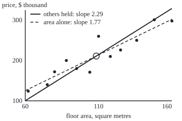
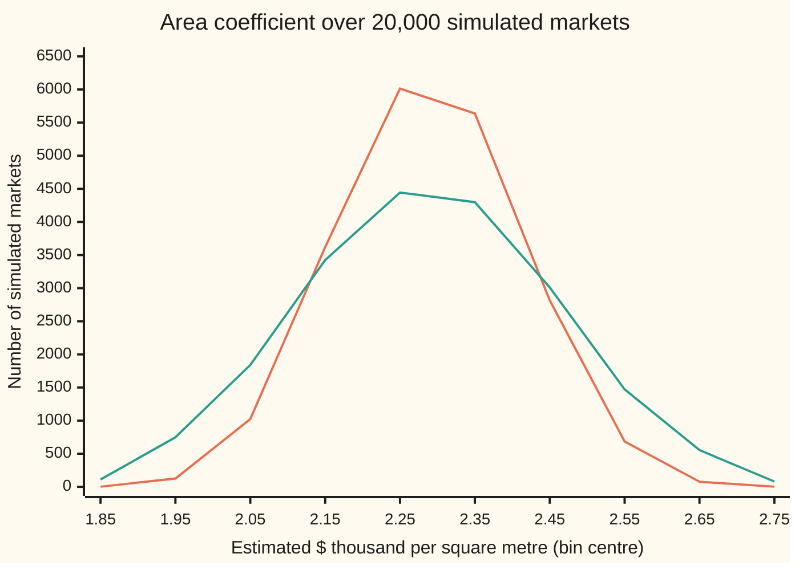

# Multiple regression: several predictors at once, and why least squares is best among linear unbiased fits

[Syllabus](../../../SYLLABUS.md) → [Probability and statistics](../../../SYLLABUS.md#w09) → [Regression](../../../SYLLABUS.md#w09-s09) → Multiple regression

---

## General Overview

Twelve houses sold last year within walking distance of one railway station. For each sale the record holds four numbers: floor area in square metres, age in years, walking distance to the station in kilometres, and the price paid, in thousands of dollars.

| Sale | Area (sq m) | Age (years) | Distance (km) | Price ($ thousand) |
| --- | --- | --- | --- | --- |
| 1 | 62 | 35 | 0.5 | 124 |
| 2 | 75 | 12 | 1.8 | 140 |
| 3 | 80 | 28 | 0.6 | 172 |
| 4 | 88 | 5 | 1.4 | 200 |
| 5 | 95 | 40 | 0.9 | 180 |
| 6 | 104 | 18 | 2.6 | 171 |
| 7 | 110 | 8 | 1.0 | 260 |
| 8 | 118 | 30 | 1.5 | 210 |
| 9 | 125 | 15 | 3.0 | 226 |
| 10 | 136 | 22 | 2.2 | 250 |
| 11 | 148 | 10 | 2.4 | 301 |
| 12 | 160 | 3 | 3.6 | 298 |

What is one more square metre worth? A straight line through price against area alone says $1,769. But in this town the bigger houses sit farther from the station, and distance costs money. The line on area alone has quietly charged the bigger houses for their walk.

Fitting all three predictors at once separates them. The answer becomes $2,288 per square metre, give or take $120: the price gap between two houses of the same age and the same walk that differ by one square metre. That reading, "holding the others fixed", is the first thing this card explains. The second is why the least-squares fit is the one to trust: among every rule that makes each coefficient a fixed weighted sum of the prices and is right on average, least squares has the smallest spread. That is the Gauss–Markov theorem, named for Carl Friedrich Gauss, who proved it in the 1820s, and Andrey Markov, who restated it later.

**Stack the predictors as columns, solve one linear system for all the coefficients at once, and each coefficient measures its own column with the others held fixed; if the errors average zero and share one spread without correlation, no other linear unbiased rule beats that fit.**

**What kind of fact this is:** a method (the fit) resting on a theorem (Gauss–Markov), both proved on this card in Why it works.

### The picture: one cloud of sales, two slopes

<p align="center"></p>

Drawn to scale from the `figure,` lines both checks print. Dots: the twelve sales. Dashed: the best line on area alone. Solid: the three-predictor fit with age and distance set at their averages, so only area moves. Both pass through the ringed centre of the data. Once distance is held still, floor space is worth more.

---

## The formula

Notation first, in words. A **column** is a list of numbers written top to bottom, one per sale. The prices form the column $y$. The predictors form a table $X$ with one row per sale and one column per predictor, plus a leading column of 1s that carries the base price; it is called the **design matrix**. $X^T$ is $X$ turned on its side (its **transpose**), and $I$ is the identity matrix, 1s down the diagonal and 0s elsewhere. For a column of random numbers, $\operatorname{Cov}(\cdot)$ is the square table of all their covariances, variances down the diagonal: the **covariance matrix**. An estimate carries a hat.

The model says each price is a weighted sum of the predictors plus an error:

$$y = X\beta + \varepsilon$$

**Read it aloud:** each price is a base amount, plus so much per square metre, per year of age and per kilometre (here the last two come out negative), plus an error that averages zero.

The least-squares fit solves the **normal equations**, one linear system for all the coefficients:

$$X^T X \hat\beta = X^T y \qquad\text{so}\qquad \hat\beta = (X^T X)^{-1} X^T y = L y$$

**Read it aloud:** pick the coefficients whose misses are perpendicular to every column; that choice is a fixed table of weights applied to the prices.

The Gauss–Markov theorem compares least squares with any rival rule $A y$, where $A$ is a fixed 4-by-12 table of weights with $AX = I$, reported through any fixed mix $c$ of the coefficients. If the errors average zero and $\operatorname{Cov}(\varepsilon) = \sigma^2 I$, then

$$\operatorname{Cov}(\hat\beta) = \sigma^2 (X^T X)^{-1}, \qquad \operatorname{Var}(c^T A y) \ \ge\ \operatorname{Var}(c^T \hat\beta) \ \text{ for every } A \text{ with } A X = I$$

**Read it aloud:** the fit's spread is the error spread times the inverse of $X^T X$; any other fixed weighted-sum rule that is right on average for every possible truth has at least as much spread, for any coefficient and any combination of coefficients.

| Symbol | Plain meaning | In our example | Push it up and the answer… |
| --- | --- | --- | --- |
| $y$ | the prices, one per sale | 124 to 301, $ thousand | coefficients move with it |
| $X$ | design matrix: a column of 1s, then one column per predictor | 12 rows, 4 columns | more columns, more to separate |
| $n$, $p$ | number of sales; number of coefficients | 12 and 4 | more sales, smaller spread |
| $\beta$, $\beta_1$ | the true coefficients, unknown; $\beta_1$ is the one on area | — | — |
| $\hat\beta$ | the fitted coefficients | 53.43, 2.288, −1.693, −32.71 | — |
| $\varepsilon$, $e$ | errors, unknown; $e$ is the fitted misses, price minus fit | one per sale | — |
| $\sigma$, $s$ | the errors' common spread; its estimate from the misses | $s$ = 7.59, $ thousand | every error bar grows in step |
| $L$ | the least-squares weights $(X^T X)^{-1} X^T$ | 4 rows of 12 weights | — |
| $H$ | the hat matrix $X(X^T X)^{-1} X^T$: turns the prices into the fitted prices; its diagonal holds the leverages | 12 rows of 12 | — |
| $A$, $D$, $M$ | a rival rule's weights; its difference $A - L$; $M$ any fixed weights | the fit to the first 8 sales | larger $D$, more spread |
| $c$ | a fixed mix of coefficients to report | 10 on area alone: a 10 sq m difference | — |
| $r_j$, $r_1$ | column j after removing all it shares with the others; $r_1$ for area | area not explained by age and distance | longer $r_j$, smaller error bar |
| $I$ | identity matrix: 1s on the diagonal | 4 by 4 | — |

Two helper formulas come out of Why it works. Each coefficient is a one-column slope on what its column does not share with the others, and its standard error is set by that leftover's length:

$$\hat\beta_j = \frac{r_j^T y}{r_j^T r_j}, \qquad \operatorname{se}(\hat\beta_j) = \frac{s}{\sqrt{r_j^T r_j}}, \qquad s = \sqrt{\frac{\text{sum of squared misses}}{n - p}}$$

### When it holds

- **The mean is a weighted sum of the columns.** If price bends with area, the coefficients still come out, but they answer a straight-line question the data do not ask; [Diagnostics](04-diagnostics-and-residuals.md) shows how to see the bend.
- **No column is a weighted sum of the others.** Add walking minutes at 12 per kilometre beside distance and nothing of the new column is left once the others are removed: $X^T X$ has no inverse and the two coefficients have no single answer.
- **One common spread, no correlation between errors.** Let the spread grow with distance, 4 thousand dollars per kilometre, and a weighted fit, which counts each sale in proportion to one over its error variance, gives the area coefficient a standard deviation of 0.0907 against least squares' 0.1284. The theorem's conclusion fails.
- **The columns and the rival's weights are fixed before the prices are seen.** A rule that looks at the prices to choose its weights is outside the comparison.
- **Normal errors are not needed.** The theorem uses only averages and covariances; the simulation below uses flat, uniform noise. Normality is what the exact t intervals of [Regression error bars](02-regression-inference.md) add.

---

## Why it works

### Step 0: the fit is a shadow, and a rival is the shadow plus noise it cannot use

The twelve prices form one point in a space with twelve directions. The four columns of $X$ reach only a flat slice of that space. The fit is the point of the slice nearest the prices, its shadow; the exact term is **orthogonal projection**. The miss sticks straight out of the slice.

A rival rule that is right on average can differ from least squares only by a piece blind to the slice: pure noise, uncorrelated with the fit. Adding uncorrelated noise only adds spread. The steps below make that exact.

### Step 1: the normal equations

Write the miss as $e = y - X\hat\beta$. The fit makes the sum of squared misses as small as possible. At the minimum no small change of the coefficients helps, which forces the miss to be perpendicular to every column: $X^T e = 0$ ([Least squares](../../03-Algebra/06-Dot%20Products%20and%20Best%20Fits/04-least-squares.md) proves this for a line; the proof never used the number of columns). Expanding gives $X^T X \hat\beta = X^T y$, four equations in four unknowns ([Solving A x = b](../../03-Algebra/05-Solving%20Systems/01-matrix-equation-ax-b.md)). When no column copies the others, $X^T X$ has an inverse, and the solution is $\hat\beta = L y$ with $L = (X^T X)^{-1} X^T$.

Two facts about $L$ carry the rest of the card. First, $L X = (X^T X)^{-1} X^T X = I$. Second, $L L^T = (X^T X)^{-1} X^T X (X^T X)^{-1} = (X^T X)^{-1}$.

The fitted prices are $X\hat\beta = XLy = Hy$, where $H = X(X^T X)^{-1} X^T$ is the **hat matrix**: it puts the hat on the prices. Its diagonal entries are the **leverages**, how far each fitted price follows a change in its own sale's price, which [Diagnostics](04-diagnostics-and-residuals.md) reads.

### Step 2: "holding the others fixed" is a one-column slope on the leftover

Split the area column in two: the part age, distance and the 1s can predict, and the leftover $r_1$, which is perpendicular to all three. Take the fitted equation $y = X\hat\beta + e$ and multiply both sides by $r_1^T$, the dot product with the leftover.

- Against the 1s, age and distance columns the leftover gives 0, by construction.
- Against the miss $e$ it gives 0, since $e$ is perpendicular to every column and $r_1$ is built from columns.
- Against the area column it gives $r_1^T r_1$, since the predictable part of area is perpendicular to $r_1$.

So $r_1^T y = \hat\beta_1\, r_1^T r_1$, the helper formula. The area coefficient uses only the part of area that age and distance cannot predict. Among these twelve sales, that is what "holding age and distance fixed" means. This is the Frisch–Waugh–Lovell theorem: Frisch and Waugh proved it for time trends in 1933, Lovell in general in 1963.

### Step 3: the fit is unbiased, and its spread is $\sigma^2 (X^T X)^{-1}$

Put the model into the fit: $\hat\beta = L(X\beta + \varepsilon) = \beta + L\varepsilon$, by Step 1's $LX = I$. The errors average zero, so $E[\hat\beta] = \beta$: right on average, whatever the truth.

For a fixed table of weights $M$, the covariance matrix of $M\varepsilon$ is $M \operatorname{Cov}(\varepsilon) M^T$; entry by entry this is the rule that covariance of weighted sums expands into weighted covariances. With $\operatorname{Cov}(\varepsilon) = \sigma^2 I$, the fit's covariance matrix is $\sigma^2 L L^T = \sigma^2 (X^T X)^{-1}$.

Step 2 gives the second helper: $\hat\beta_j$ weights the prices by $r_j / r_j^T r_j$, so its variance is $\sigma^2 / r_j^T r_j$. When the other columns predict area well, little of area is left over, and the area coefficient wobbles.

In practice $\sigma$ is unknown. It is replaced by $s$, from the sum of squared misses divided by $n - p$, not $n$: fitting four coefficients uses up four of the twelve directions the misses could have taken. [Regression error bars](02-regression-inference.md) shows why. Over the 20,000 simulated markets below, $s^2$ averages 57.7601 ± 0.1573 against the true $\sigma^2$ = 57.76.

### Step 4: every unbiased rival pays extra spread (Gauss–Markov)

A **linear** rule makes each coefficient a fixed weighted sum of the prices: $A y$ for a table $A$ of 4 by 12 weights chosen before the prices are seen. It is **unbiased** when $E[A y] = A X \beta = \beta$ for every possible truth, which is exactly $A X = I$.

Write the rival as least squares plus a difference: $A = L + D$. Then $DX = AX - LX = I - I = 0$: the difference is blind to every column. The cross term vanishes, $L D^T = (X^T X)^{-1} (D X)^T = 0$, and so

$$\operatorname{Cov}(A y) = \sigma^2 (L + D)(L + D)^T = \sigma^2 (X^T X)^{-1} + \sigma^2 D D^T.$$

For any mix $c$ of coefficients, the rival's variance exceeds the fit's by $\sigma^2$ times the squared length of $D^T c$, never negative. Least squares is the **best linear unbiased estimator**, BLUE for short.

<details>
<summary>Detailed proof</summary>

**The class.** A rule is linear when it is $A y$ with $A$ fixed. Its mean is $E[A y] = A X \beta + A E[\varepsilon] = A X \beta$. This equals $\beta$ for every $\beta$ exactly when $A X = I$: if $A X = I$ it holds at once; conversely, taking $\beta$ to be each column of $I$ in turn reads off each column of $A X$ as the matching column of $I$.

**The covariance rule.** For fixed $M$, entry $(j, k)$ of $\operatorname{Cov}(M\varepsilon)$ is $\operatorname{Cov}(\sum_a M_{ja} \varepsilon_a, \sum_b M_{kb} \varepsilon_b) = \sum_a \sum_b M_{ja} M_{kb} \operatorname{Cov}(\varepsilon_a, \varepsilon_b)$, which is entry $(j, k)$ of $M \operatorname{Cov}(\varepsilon) M^T$. With $\operatorname{Cov}(\varepsilon) = \sigma^2 I$ only the terms $a = b$ survive, giving $\sigma^2 M M^T$. Adding the fixed $A X \beta$ changes no covariance.

**The gap.** Put $D = A - L$. Then $D X = 0$, so $L D^T = (X^T X)^{-1} X^T D^T = (X^T X)^{-1} (D X)^T = 0$, and its transpose $D L^T = 0$. Expanding, $(L + D)(L + D)^T = L L^T + L D^T + D L^T + D D^T = (X^T X)^{-1} + D D^T$.

**Every combination.** For a fixed column $c$, $\operatorname{Var}(c^T A y) = c^T \operatorname{Cov}(A y)\, c = \operatorname{Var}(c^T \hat\beta) + \sigma^2 (D^T c)^T (D^T c)$. The last term is a sum of squares, so it is at least 0.

**Equality.** With $\sigma > 0$ the rival ties on the mix $c$ only when $D^T c = 0$. It ties on every coefficient only when every diagonal entry of $D D^T$ is 0, that is, every row of $D$ is zero and $A = L$.

**What was not used.** Normal errors, independent errors and any distribution beyond means and covariances. The errors may even be dependent, as long as they are uncorrelated with one common variance.

</details>

On the house data, one rival fits the first 8 sales only and ignores the last 4. It is linear and unbiased, since $A X = I$ holds to 1e-9. Per unit of $\sigma^2$, its area variance is 0.000481548 against least squares' 0.000251295: 1.9163 times larger. The gap, 0.000230253, equals the area entry of $D D^T$, as Step 4 says. Two hundred random unbiased rivals, built as $L$ plus a random table with the column-blind property, all lose: the extra variance runs from 0.000064659 to 0.000551976, never below zero.

### The picture: 20,000 imagined markets

Take the fitted coefficients as the truth, with error spread $\sigma$ = 7.6 thousand dollars, and draw 20,000 fresh sets of twelve prices using flat, uniform noise. Estimate the area coefficient each time by both rules.



Orange: least squares on all 12 sales. Green: the rival fit to the first 8. Both centre on the true 2.288: the simulated averages are 2.288163 ± 0.000847 and 2.287837 ± 0.001180. Least squares is the tall narrow hump: simulated standard deviation 0.119801 against the formula's 0.120477, while the rival spreads to 0.166904 against 0.166776.

### Step 5: what leaving a column out does

Fit price on area alone and the slope is 1.768541. The two answers are linked exactly. Let the **drift** of a column be its own slope on area alone: among these sales, age drifts −0.182352 years per square metre (bigger houses are a little newer) and distance drifts 0.025320 km per square metre (bigger houses are farther out, about 25 metres per square metre). Then

$$\text{slope on area alone} = \hat\beta_1 + \hat\beta_{\text{age}} \times \text{age drift} + \hat\beta_{\text{dist}} \times \text{distance drift}$$

Proof: take the area-alone slope of both sides of $y = X\hat\beta + e$. Slope is linear in what it measures; the 1s column has slope 0, area has slope 1, and the miss has slope 0 because it is perpendicular to the 1s and to area. On the numbers, newness pushes the lone slope up and the walk pulls it down by more, landing at 1.768541. The lone slope is not wrong arithmetic. It answers a different question: how price differs between houses of different size, letting age and distance come along as they happen to in this town.

A second road to the fit avoids forming $X^T X$: orthogonalise the columns one by one and back-substitute, the QR route of Least squares two ways. The checks take a close relative of it, Step 2's leftovers, and land on the same coefficients.

---

## Worked numbers, by hand

| Step | Arithmetic | Value |
| --- | --- | --- |
| $X^T X$, first row | 12 sales; sum of areas; sum of ages; sum of distances | 12, 1301, 226, 21.50 |
| $X^T X$, area row | area against 1s, area, age, distance | 1301, 151103, 22669, 2585.50 |
| $X^T X$, age row | age against each column | 226, 22669, 5884, 326.90 |
| $X^T X$, distance row | distance against each column | 21.50, 2585.50, 326.90, 49.19 |
| $X^T y$ | each column against the prices | 2532, 292290, 43288, 4902 |
| solve the four equations | elimination on the four rows above, done by machine (road 1 of the checks) | 53.425906, 2.288019, −1.692898, −32.708307 |
| sum of squared misses | 12 misses, squared and added | 460.8341 |
| $s$ | square root of 460.8341 / (12 − 4) | 7.589747 |
| area error bar | $s$ times the square root of 0.000251295 | 0.120315 |
| house of 100 sq m, 20 years, 1.5 km | 53.425906 + 2.288019 × 100 − 1.692898 × 20 − 32.708307 × 1.5 | 199.3074 |
| same house at 110 sq m | add 10 × 2.288019 | **222.1876** |

Two houses alike in age and walk, 10 square metres apart, differ in fitted price by about $22,880, give or take ten times $120. The area-alone slope would have said $17,685.

The coefficients in words, each with its error bar: $2,288 per square metre (±$120), −$1,693 per year of age (±$233), −$32,708 per kilometre of walk (±$4,085), and a base of $53,426 (±$11,770) that belongs to a house of no size at the station and means nothing on its own.

### What breaks if you drop a piece

| Mistake | Comes out at | What went wrong |
| --- | --- | --- |
| Price on area alone, read as "with the rest fixed" | 1.768541 per sq m, not 2.288019 | Distance and age move with area in these sales and ride along |
| Spreads grow with distance (4 per km), fit still called best | least squares sd 0.128376, weighted fit 0.090650 | Unequal spreads break Gauss–Markov; a linear unbiased weighted fit wins |
| Walking minutes (12 per km) added beside distance | 0.000000 of the new column left over | Redundant column: $X^T X$ has no inverse, the coefficients no single answer |
| Last 4 sales dropped to "tidy" the data | area sd 0.166776, not 0.120477 | Unbiased still, but 1.9163 times the variance |

The code prints all four.

---

## Code, from first principles, and it actually runs

The fit comes by two roads sharing no arithmetic: the normal equations solved by elimination, and Step 2's leftovers built by Gram–Schmidt, which never forms $X^T X$; the error bars come out both ways. A third road rebuilds the area-alone slope from the full fit. Gauss–Markov is checked three ways: exact variances for the first-8 rival, 200 random unbiased rivals, and 20,000 simulated markets from a SplitMix64 generator, seed 20260928, written out in both languages; the same markets confirm that $s^2$ averages $\sigma^2$. The last block prints the what-breaks cases and the figure coordinates.

### Python

```python
# Multiple regression and Gauss-Markov -- the check behind the card.  Standard library
# only: solver, Gram-Schmidt residuals and random numbers are written out here.  Twelve
# sales: price ($ thousand) from floor area (m2), age (years), distance to station (km).
from math import sqrt, floor
AREA = [62, 75, 80, 88, 95, 104, 110, 118, 125, 136, 148, 160]
AGE = [35, 12, 28, 5, 40, 18, 8, 30, 15, 22, 10, 3]
DIST = [0.5, 1.8, 0.6, 1.4, 0.9, 2.6, 1.0, 1.5, 3.0, 2.2, 2.4, 3.6]
PRICE = [124, 140, 172, 200, 180, 171, 260, 210, 226, 250, 301, 298]
n, p = 12, 4
X = [[1.0] * n, [float(a) for a in AREA], [float(g) for g in AGE], DIST]  # the columns of X
y = [float(v) for v in PRICE]
def dot(u, v):                           # plain running sum, same order as the Rust
    s = 0.0
    for a, b in zip(u, v):
        s += a * b
    return s
def solve(M, rhs):                       # Gaussian elimination with partial pivoting
    m = len(M)
    A = [row[:] + [r] for row, r in zip(M, rhs)]
    for k in range(m):
        piv = max(range(k, m), key=lambda i: abs(A[i][k]))
        A[k], A[piv] = A[piv], A[k]
        for i in range(k + 1, m):
            f = A[i][k] / A[k][k]
            for j in range(k, m + 1):
                A[i][j] -= f * A[k][j]
    x = [0.0] * m
    for k in range(m - 1, -1, -1):       # back substitution
        x[k] = (A[k][m] - dot(A[k][k + 1:m], x[k + 1:])) / A[k][k]
    return x
def weights(cols, wt):                   # rows of (X^T W X)^-1 X^T W, W = diag(wt)
    Xw = [[c[i] * wt[i] for i in range(n)] for c in cols]
    XtWX = [[dot(a, b) for b in cols] for a in Xw]
    G = [solve(XtWX, [1.0 * (i == j) for i in range(p)]) for j in range(p)]   # G is symmetric
    return [[dot(G[j], [c[i] for c in Xw]) for i in range(n)] for j in range(p)], G
def residual(v, others):                 # v minus its shadow on the others (Gram-Schmidt)
    basis = []
    for u in others + [v]:
        w = u[:]
        for q in basis:
            c = dot(w, q)
            w = [a - c * b for a, b in zip(w, q)]
        if u is v:
            return w
        basis.append([a / sqrt(dot(w, w)) for a in w])
row = lambda label, v, fmt="{:>12.6f}": print(f"{label:<36}" + "".join(fmt.format(x) for x in v))
spread = lambda e: sqrt(dot(e, e) / (n - p))   # s from the misses: divide by n - p, not n
# road 1: the normal equations X^T X b = X^T y, solved by elimination
XtX = [[dot(a, b) for b in X] for a in X]
beta = solve(XtX, [dot(a, y) for a in X])
L, G = weights(X, [1.0] * n)             # L = (X^T X)^-1 X^T, G = (X^T X)^-1
fit = [dot([c[i] for c in X], beta) for i in range(n)]
res = [a - b for a, b in zip(y, fit)]
rss, s_hat = dot(res, res), spread(res)
# road 2: partial out the other columns; each coefficient is then a one-column slope
rj = [residual(X[j], X[:j] + X[j + 1:]) for j in range(p)]
beta2 = [dot(r, y) / dot(r, r) for r in rj]
for j in range(p):
    row(f"X^T X row {j + 1}   | X^T y {dot(X[j], y):.0f}", XtX[j], "{:>12.2f}")
print(f"{'':<36}" + "".join(f"{s:>12}" for s in ("intercept", "area", "age", "distance")))
row("road 1, normal equations", beta)
row("road 2, partialling out", beta2)
row("standard error, from (X^T X)^-1", [s_hat * sqrt(G[j][j]) for j in range(p)])
row("standard error, from residual sizes", [s_hat / sqrt(dot(r, r)) for r in rj])
print(f"residual sum of squares {rss:.4f}; spread s = sqrt(RSS / {n - p}) = {s_hat:.6f}")
ra = residual(X[1], [X[0]])
alone = dot(ra, y) / dot(ra, ra)
house = [1.0, 100.0, 20.0, 1.5]          # holding the others fixed, and leaving them out
print(f"house 100 m2, 20 years, 1.5 km: {dot(house, beta):.4f}; at 110 m2: {dot(house, beta) + 10 * beta[1]:.4f}; 10 m2 alone: {10 * alone:.4f}")
drift = [dot(ra, X[k]) / dot(ra, ra) for k in (2, 3)]
rebuilt = beta[1] + beta[2] * drift[0] + beta[3] * drift[1]
print(f"area alone: slope {alone:.6f}; age drift {drift[0]:.6f}, distance drift {drift[1]:.6f}")
print(f"area alone, rebuilt from the full fit: {rebuilt:.6f}")
# Gauss-Markov: OLS weights L against A, the least-squares fit of the first 8 sales only
A, _ = weights(X, [1.0] * 8 + [0.0] * 4)
miss = max(abs(dot(M[j], X[k]) - (j == k)) for M in (L, A) for j in range(p) for k in range(p))
D = [a - b for a, b in zip(A[1], L[1])]
ll, aa = dot(L[1], L[1]), dot(A[1], A[1])
print(f"LX = I and AX = I to 1e-9: {'yes' if miss < 1e-9 else 'no'}; (X^T X)^-1 area entry {G[1][1]:.9f}")
print(f"area variance / sigma^2: OLS {ll:.9f}, first 8 {aa:.9f}, gap {aa - ll:.9f}, D D^T {dot(D, D):.9f}, ratio {aa / ll:.4f}")
state = 20260928                         # SplitMix64, seed 20260928
def draw():
    global state
    state = (state + 0x9E3779B97F4A7C15) & 0xFFFFFFFFFFFFFFFF
    z = ((state ^ (state >> 30)) * 0xBF58476D1CE4E5B9) & 0xFFFFFFFFFFFFFFFF
    z = ((z ^ (z >> 27)) * 0x94D049BB133111EB) & 0xFFFFFFFFFFFFFFFF
    return ((z ^ (z >> 31)) >> 11) / 9007199254740992.0
hat = [[dot([c[i] for c in X], [L[j][k] for j in range(p)]) for k in range(n)] for i in range(n)]  # H = X L
excess, bias = [], 0.0
for _ in range(200):                     # 200 random rivals L + M(I - H): unbiased by design
    M = [[0.02 * draw() - 0.01 for _ in range(n)] for _ in range(p)]
    R = [[L[j][k] + M[j][k] - dot(M[j], [hat[i][k] for i in range(n)]) for k in range(n)] for j in range(p)]
    bias = max([bias] + [abs(dot(R[j], X[k]) - (j == k)) for j in range(p) for k in range(p)])
    excess.append(dot(R[1], R[1]) - ll)
print(f"200 random rivals, all unbiased to 1e-9: {'yes' if bias < 1e-9 else 'no'}; area-variance excess {min(excess):.9f} to {max(excess):.9f}")
sigma, reps, est, s2 = 7.6, 20000, [[], []], []
for _ in range(reps):                    # truth = the fit above; uniform noise, not normal
    ys = [f + (2.0 * draw() - 1.0) * sigma * sqrt(3.0) for f in fit]
    est[0].append(dot(L[1], ys))
    est[1].append(dot(A[1], ys))
    s2.append(spread([a - dot(r, ys) for a, r in zip(ys, hat)]) ** 2)   # s^2 of this market
sim, bins = [], [[], []]                 # sample mean and sd of each rule's area coefficient
for k, (lab, v) in enumerate((("OLS", ll), ("first 8", aa))):
    mean = dot(est[k], [1.0] * reps) / reps
    sd = sqrt(dot(est[k], est[k]) / reps - mean * mean)
    sim.append((mean, sd, sigma * sqrt(v)))
    bins[k] = [sum(1 for e in est[k] if floor((e - 1.8) / 0.1) == b) for b in range(10)]
    print(f"simulated {lab:<8} mean {mean:.6f} +/- {sd / sqrt(reps):.6f}, sd {sd:.6f}, exact sd {sigma * sqrt(v):.6f}")
v2 = dot(s2, [1.0] * reps) / reps
e2 = sqrt(dot(s2, s2) / reps - v2 * v2) / sqrt(reps)
print(f"simulated s^2 mean {v2:.4f} +/- {e2:.4f}; sigma^2 {sigma * sigma:.4f}")
print("chart, bin centres " + " ".join(f"{1.85 + 0.1 * b:.2f}" for b in range(10)))
print("chart, OLS counts " + " ".join(str(c) for c in bins[0]))
print("chart, first 8 counts " + " ".join(str(c) for c in bins[1]))
sp2 = [(4.0 * d) * (4.0 * d) for d in DIST]  # what breaks: spread 4 x distance ($ thousand)
W, Gw = weights(X, [1.0 / s for s in sp2])
ols_var, gls_var = dot([v * v for v in L[1]], sp2), dot([w * w for w in W[1]], sp2)
print(f"unequal spreads, area sd: OLS {sqrt(ols_var):.6f}, weighted {sqrt(gls_var):.6f}, from inverse {sqrt(Gw[1][1]):.6f}")
rw = residual([12.0 * d for d in DIST], X)
print(f"walking minutes = 12 x km: length left after the other columns {sqrt(dot(rw, rw)):.6f}")
px = lambda a: 50 + (a - 60) * 2.9      # figure: area 60..160 -> x 50..340
py = lambda v: 200 - (v - 100) * 0.8     # price 100..320 -> y 200..24
print("figure, points " + " ".join(f"{px(a):.1f},{py(v):.1f}" for a, v in zip(AREA, PRICE)))
ma, my = dot(X[0], X[1]) / n, dot(X[0], y) / n
held = beta[0] + beta[2] * dot(X[0], X[2]) / n + beta[3] * dot(X[0], X[3]) / n
print(f"figure, area alone {py(my + (60 - ma) * alone):.1f} to {py(my + (160 - ma) * alone):.1f}; held fixed "
      f"{py(held + 60 * beta[1]):.1f} to {py(held + 160 * beta[1]):.1f}; centre {px(ma):.1f},{py(my):.1f}")
assert max(abs(a - b) for a, b in zip(beta, beta2)) < 1e-9          # two roads, one fit
assert abs(alone - rebuilt) < 1e-9                                   # the left-out-column identity
assert abs(ll - G[1][1]) < 1e-12                                     # L L^T = (X^T X)^-1
assert abs((aa - ll) - dot(D, D)) < 1e-12                            # cross terms vanish
assert miss < 1e-9 and bias < 1e-9                                 # L and every rival unbiased
assert min(excess) > 0                                               # every rival loses
for mean, sd, exact in sim:                                          # simulation within 4 SE
    assert abs(mean - beta[1]) < 4 * sd / sqrt(reps)                 # unbiased
    assert abs(sd - exact) < 4 * exact / sqrt(2 * reps)              # spread as the formula says
assert abs(v2 - sigma * sigma) < 4 * e2                              # s^2 right on average
assert abs(gls_var - Gw[1][1]) < 1e-12                               # two roads, weighted sd
assert gls_var < ols_var                                             # the theorem fails here
print("ALL CHECKS PASS")
```

**Ran 2026-09-28 on macOS, Python 3.14.6, standard library only. All checks passed. Output, pasted from the run:**

```
X^T X row 1   | X^T y 2532                 12.00     1301.00      226.00       21.50
X^T X row 2   | X^T y 292290             1301.00   151103.00    22669.00     2585.50
X^T X row 3   | X^T y 43288               226.00    22669.00     5884.00      326.90
X^T X row 4   | X^T y 4902                 21.50     2585.50      326.90       49.19
                                       intercept        area         age    distance
road 1, normal equations               53.425906    2.288019   -1.692898  -32.708307
road 2, partialling out                53.425906    2.288019   -1.692898  -32.708307
standard error, from (X^T X)^-1        11.769678    0.120315    0.233450    4.084971
standard error, from residual sizes    11.769678    0.120315    0.233450    4.084971
residual sum of squares 460.8341; spread s = sqrt(RSS / 8) = 7.589747
house 100 m2, 20 years, 1.5 km: 199.3074; at 110 m2: 222.1876; 10 m2 alone: 17.6854
area alone: slope 1.768541; age drift -0.182352, distance drift 0.025320
area alone, rebuilt from the full fit: 1.768541
LX = I and AX = I to 1e-9: yes; (X^T X)^-1 area entry 0.000251295
area variance / sigma^2: OLS 0.000251295, first 8 0.000481548, gap 0.000230253, D D^T 0.000230253, ratio 1.9163
200 random rivals, all unbiased to 1e-9: yes; area-variance excess 0.000064659 to 0.000551976
simulated OLS      mean 2.288163 +/- 0.000847, sd 0.119801, exact sd 0.120477
simulated first 8  mean 2.287837 +/- 0.001180, sd 0.166904, exact sd 0.166776
simulated s^2 mean 57.7601 +/- 0.1573; sigma^2 57.7600
chart, bin centres 1.85 1.95 2.05 2.15 2.25 2.35 2.45 2.55 2.65 2.75
chart, OLS counts 2 126 1022 3619 6014 5637 2816 685 77 2
chart, first 8 counts 110 748 1840 3424 4444 4298 3011 1472 555 81
unequal spreads, area sd: OLS 0.128376, weighted 0.090650, from inverse 0.090650
walking minutes = 12 x km: length left after the other columns 0.000000
figure, points 55.8,180.8 93.5,168.0 108.0,142.4 131.2,120.0 151.5,136.0 177.6,143.2 195.0,72.0 218.2,112.0 238.5,99.2 270.4,80.0 305.2,39.2 340.0,41.6
figure, area alone 179.7 to 38.2; held fixed 199.8 to 16.8; centre 190.4,111.2
ALL CHECKS PASS
```

### Rust

Same numbers, same labels, built with `rustc --edition 2021 -O`.

```rust
// Multiple regression and Gauss-Markov -- the same check as the Python, in Rust.  No
// crates: solver, Gram-Schmidt residuals and random numbers are written out here.  Twelve
// sales: price ($ thousand) from floor area (m2), age (years), distance to station (km).
const N: usize = 12; const P: usize = 4;
type Mat = Vec<Vec<f64>>;
fn dot(u: &[f64], v: &[f64]) -> f64 {           // plain running sum, same order as the Python
    let mut s = 0.0;
    for (a, b) in u.iter().zip(v) { s += a * b; } s
}
fn solve(m: &Mat, rhs: &[f64]) -> Vec<f64> {    // Gaussian elimination with partial pivoting
    let k_max = m.len();
    let mut a: Mat = m.iter().zip(rhs).map(|(r, &b)| { let mut v = r.clone(); v.push(b); v }).collect();
    for k in 0..k_max {
        let mut piv = k;
        for i in k + 1..k_max { if a[i][k].abs() > a[piv][k].abs() { piv = i; } }
        a.swap(k, piv);
        for i in k + 1..k_max {
            let f = a[i][k] / a[k][k];
            for j in k..=k_max { a[i][j] -= f * a[k][j]; }
        }
    }
    let mut x = vec![0.0; k_max];
    for k in (0..k_max).rev() {                  // back substitution
        x[k] = (a[k][k_max] - dot(&a[k][k + 1..k_max], &x[k + 1..])) / a[k][k];
    }
    x
}
fn col(x: &Mat, i: usize) -> Vec<f64> { x.iter().map(|c| c[i]).collect() }
fn eye(j: usize, k: usize) -> f64 { if j == k { 1.0 } else { 0.0 } }
fn weights(cols: &Mat, wt: &[f64]) -> (Mat, Mat) {   // rows of (X^T W X)^-1 X^T W, W = diag(wt)
    let xw: Mat = cols.iter().map(|c| (0..N).map(|i| c[i] * wt[i]).collect()).collect();
    let xtwx: Mat = xw.iter().map(|a| cols.iter().map(|b| dot(a, b)).collect()).collect();
    let g: Mat = (0..P).map(|j| solve(&xtwx, &(0..P).map(|i| eye(i, j)).collect::<Vec<_>>())).collect();
    let h: Mat = (0..P).map(|j| (0..N).map(|i| dot(&g[j], &col(&xw, i))).collect()).collect();
    (h, g)
}
fn residual(v: &[f64], others: &[Vec<f64>]) -> Vec<f64> {  // v minus its shadow on the others
    let mut basis: Mat = Vec::new();
    let strip = |u: &[f64], basis: &Mat| {
        let mut w = u.to_vec();
        for q in basis { let c = dot(&w, q); w = w.iter().zip(q).map(|(a, b)| a - c * b).collect(); }
        w
    };
    for u in others {
        let w = strip(u, &basis);
        let size = dot(&w, &w).sqrt();
        basis.push(w.iter().map(|a| a / size).collect());
    }
    strip(v, &basis)
}
fn row(label: &str, v: &[f64], prec: usize) {
    println!("{:<36}{}", label, v.iter().map(|x| format!("{:>12.*}", prec, x)).collect::<String>());
}
fn spread(e: &[f64]) -> f64 { (dot(e, e) / (N - P) as f64).sqrt() }  // s: divide by n - p, not n
struct SplitMix(u64);                            // SplitMix64, seed 20260928
impl SplitMix {
    fn draw(&mut self) -> f64 {
        self.0 = self.0.wrapping_add(0x9E3779B97F4A7C15);
        let mut z = (self.0 ^ (self.0 >> 30)).wrapping_mul(0xBF58476D1CE4E5B9);
        z = (z ^ (z >> 27)).wrapping_mul(0x94D049BB133111EB);
        ((z ^ (z >> 31)) >> 11) as f64 / 9007199254740992.0
    }
}

fn main() {
    let area = [62.0, 75.0, 80.0, 88.0, 95.0, 104.0, 110.0, 118.0, 125.0, 136.0, 148.0, 160.0];
    let age = [35.0, 12.0, 28.0, 5.0, 40.0, 18.0, 8.0, 30.0, 15.0, 22.0, 10.0, 3.0];
    let dist = [0.5, 1.8, 0.6, 1.4, 0.9, 2.6, 1.0, 1.5, 3.0, 2.2, 2.4, 3.6];
    let y = vec![124.0, 140.0, 172.0, 200.0, 180.0, 171.0, 260.0, 210.0, 226.0, 250.0, 301.0, 298.0];
    let x: Mat = vec![vec![1.0; N], area.to_vec(), age.to_vec(), dist.to_vec()];  // the columns of X
    // road 1: the normal equations X^T X b = X^T y, solved by elimination
    let xtx: Mat = x.iter().map(|a| x.iter().map(|b| dot(a, b)).collect()).collect();
    let beta = solve(&xtx, &x.iter().map(|a| dot(a, &y)).collect::<Vec<_>>());
    let (l, g) = weights(&x, &[1.0; N]);         // L = (X^T X)^-1 X^T, G = (X^T X)^-1
    let fit: Vec<f64> = (0..N).map(|i| dot(&col(&x, i), &beta)).collect();
    let res: Vec<f64> = y.iter().zip(&fit).map(|(a, b)| a - b).collect();
    let (rss, s_hat) = (dot(&res, &res), spread(&res));
    // road 2: partial out the other columns; each coefficient is then a one-column slope
    let rj: Mat = (0..P).map(|j| {
        let others: Mat = (0..P).filter(|&k| k != j).map(|k| x[k].clone()).collect();
        residual(&x[j], &others)
    }).collect();
    let beta2: Vec<f64> = rj.iter().map(|r| dot(r, &y) / dot(r, r)).collect();
    for j in 0..P { row(&format!("X^T X row {}   | X^T y {:.0}", j + 1, dot(&x[j], &y)), &xtx[j], 2); }
    println!("{:<36}{:>12}{:>12}{:>12}{:>12}", "", "intercept", "area", "age", "distance");
    row("road 1, normal equations", &beta, 6);
    row("road 2, partialling out", &beta2, 6);
    row("standard error, from (X^T X)^-1", &(0..P).map(|j| s_hat * g[j][j].sqrt()).collect::<Vec<_>>(), 6);
    row("standard error, from residual sizes", &rj.iter().map(|r| s_hat / dot(r, r).sqrt()).collect::<Vec<_>>(), 6);
    println!("residual sum of squares {:.4}; spread s = sqrt(RSS / {}) = {:.6}", rss, N - P, s_hat);
    let house = [1.0, 100.0, 20.0, 1.5];         // holding the others fixed, and leaving them out
    let ra = residual(&x[1], &x[..1]);
    let alone = dot(&ra, &y) / dot(&ra, &ra);
    println!("house 100 m2, 20 years, 1.5 km: {:.4}; at 110 m2: {:.4}; 10 m2 alone: {:.4}", dot(&house, &beta), dot(&house, &beta) + 10.0 * beta[1], 10.0 * alone);
    let drift = [dot(&ra, &x[2]) / dot(&ra, &ra), dot(&ra, &x[3]) / dot(&ra, &ra)];
    let rebuilt = beta[1] + beta[2] * drift[0] + beta[3] * drift[1];
    println!("area alone: slope {:.6}; age drift {:.6}, distance drift {:.6}", alone, drift[0], drift[1]);
    println!("area alone, rebuilt from the full fit: {:.6}", rebuilt);
    // Gauss-Markov: OLS weights L against A, the least-squares fit of the first 8 sales only
    let (a, _) = weights(&x, &(0..N).map(|i| if i < 8 { 1.0 } else { 0.0 }).collect::<Vec<_>>());
    let mut miss: f64 = 0.0;
    for m in [&l, &a] { for j in 0..P { for k in 0..P { miss = miss.max((dot(&m[j], &x[k]) - eye(j, k)).abs()); } } }
    let d: Vec<f64> = a[1].iter().zip(&l[1]).map(|(p, q)| p - q).collect();
    let (ll, aa) = (dot(&l[1], &l[1]), dot(&a[1], &a[1]));
    println!("LX = I and AX = I to 1e-9: {}; (X^T X)^-1 area entry {:.9}", if miss < 1e-9 { "yes" } else { "no" }, g[1][1]);
    println!("area variance / sigma^2: OLS {:.9}, first 8 {:.9}, gap {:.9}, D D^T {:.9}, ratio {:.4}", ll, aa, aa - ll, dot(&d, &d), aa / ll);
    let mut rng = SplitMix(20260928);
    let hat: Mat = (0..N).map(|i| (0..N).map(|k| dot(&col(&x, i), &col(&l, k))).collect()).collect();  // H = X L
    let (mut excess, mut bias): (Vec<f64>, f64) = (Vec::new(), 0.0);
    for _ in 0..200 {                            // 200 random rivals L + M(I - H): unbiased by design
        let m: Mat = (0..P).map(|_| (0..N).map(|_| 0.02 * rng.draw() - 0.01).collect()).collect();
        let r: Mat = (0..P).map(|j| (0..N).map(|k| l[j][k] + m[j][k] - dot(&m[j], &col(&hat, k))).collect()).collect();
        for j in 0..P { for k in 0..P { bias = bias.max((dot(&r[j], &x[k]) - eye(j, k)).abs()); } }
        excess.push(dot(&r[1], &r[1]) - ll);
    }
    let (lo, hi) = excess.iter().fold((f64::INFINITY, f64::NEG_INFINITY), |(l, u), &e| (l.min(e), u.max(e)));
    println!("200 random rivals, all unbiased to 1e-9: {}; area-variance excess {:.9} to {:.9}", if bias < 1e-9 { "yes" } else { "no" }, lo, hi);
    let (sigma, reps) = (7.6, 20000usize);
    let (mut est, mut s2): (Mat, Vec<f64>) = (vec![Vec::new(), Vec::new()], Vec::new());
    for _ in 0..reps {                           // truth = the fit above; uniform noise, not normal
        let ys: Vec<f64> = fit.iter().map(|f| f + (2.0 * rng.draw() - 1.0) * sigma * 3.0f64.sqrt()).collect();
        est[0].push(dot(&l[1], &ys));
        est[1].push(dot(&a[1], &ys));
        s2.push(spread(&(0..N).map(|i| ys[i] - dot(&hat[i], &ys)).collect::<Vec<_>>()).powi(2));  // s^2 of this market
    }
    let (mut sim, mut bins) = (Vec::new(), vec![vec![0usize; 10]; 2]);  // mean and sd of each rule
    for (k, (lab, v)) in [("OLS", ll), ("first 8", aa)].iter().enumerate() {
        let mean = dot(&est[k], &vec![1.0; reps]) / reps as f64;
        let sd = (dot(&est[k], &est[k]) / reps as f64 - mean * mean).sqrt();
        sim.push((mean, sd, sigma * v.sqrt()));
        for b in 0..10 { bins[k][b] = est[k].iter().filter(|&&e| ((e - 1.8) / 0.1).floor() == b as f64).count(); }
        println!("simulated {:<8} mean {:.6} +/- {:.6}, sd {:.6}, exact sd {:.6}", lab, mean, sd / (reps as f64).sqrt(), sd, sigma * v.sqrt());
    }
    let v2 = dot(&s2, &vec![1.0; reps]) / reps as f64;
    let e2 = (dot(&s2, &s2) / reps as f64 - v2 * v2).sqrt() / (reps as f64).sqrt();
    println!("simulated s^2 mean {:.4} +/- {:.4}; sigma^2 {:.4}", v2, e2, sigma * sigma);
    let join = |v: Vec<String>| v.join(" ");
    println!("chart, bin centres {}", join((0..10).map(|b| format!("{:.2}", 1.85 + 0.1 * b as f64)).collect()));
    println!("chart, OLS counts {}", join(bins[0].iter().map(|c| c.to_string()).collect()));
    println!("chart, first 8 counts {}", join(bins[1].iter().map(|c| c.to_string()).collect()));
    let sp2: Vec<f64> = dist.iter().map(|d| (4.0 * d) * (4.0 * d)).collect();  // what breaks: spread 4 x distance
    let (w, gw) = weights(&x, &sp2.iter().map(|s| 1.0 / s).collect::<Vec<_>>());
    let sq = |r: &[f64]| r.iter().map(|v| v * v).collect::<Vec<_>>();
    let (ols_var, gls_var) = (dot(&sq(&l[1]), &sp2), dot(&sq(&w[1]), &sp2));
    println!("unequal spreads, area sd: OLS {:.6}, weighted {:.6}, from inverse {:.6}", ols_var.sqrt(), gls_var.sqrt(), gw[1][1].sqrt());
    let rw = residual(&dist.iter().map(|d| 12.0 * d).collect::<Vec<_>>(), &x);
    println!("walking minutes = 12 x km: length left after the other columns {:.6}", dot(&rw, &rw).sqrt());
    let px = |a: f64| 50.0 + (a - 60.0) * 2.9;    // figure: area 60..160 -> x 50..340
    let py = |v: f64| 200.0 - (v - 100.0) * 0.8;  // price 100..320 -> y 200..24
    println!("figure, points {}", join((0..N).map(|i| format!("{:.1},{:.1}", px(area[i]), py(y[i]))).collect()));
    let (ma, my) = (dot(&x[0], &x[1]) / N as f64, dot(&x[0], &y) / N as f64);
    let held = beta[0] + beta[2] * dot(&x[0], &x[2]) / N as f64 + beta[3] * dot(&x[0], &x[3]) / N as f64;
    println!("figure, area alone {:.1} to {:.1}; held fixed {:.1} to {:.1}; centre {:.1},{:.1}",
             py(my + (60.0 - ma) * alone), py(my + (160.0 - ma) * alone),
             py(held + 60.0 * beta[1]), py(held + 160.0 * beta[1]), px(ma), py(my));
    assert!(beta.iter().zip(&beta2).all(|(p, q)| (p - q).abs() < 1e-9));  // two roads, one fit
    assert!((alone - rebuilt).abs() < 1e-9);                              // the left-out-column identity
    assert!((ll - g[1][1]).abs() < 1e-12);                                // L L^T = (X^T X)^-1
    assert!(((aa - ll) - dot(&d, &d)).abs() < 1e-12);                     // cross terms vanish
    assert!(miss < 1e-9 && bias < 1e-9);                                 // L and every rival unbiased
    assert!(lo > 0.0);                                                    // every rival loses
    for &(mean, sd, exact) in &sim {                                      // simulation within 4 SE
        assert!((mean - beta[1]).abs() < 4.0 * sd / (reps as f64).sqrt());         // unbiased
        assert!((sd - exact).abs() < 4.0 * exact / (2.0 * reps as f64).sqrt());   // spread as the formula says
    }
    assert!((v2 - sigma * sigma).abs() < 4.0 * e2);                      // s^2 right on average
    assert!((gls_var - gw[1][1]).abs() < 1e-12);                          // two roads, weighted sd
    assert!(gls_var < ols_var);                                           // the theorem fails here
    println!("ALL CHECKS PASS");
}
```

**Ran 2026-09-28 on macOS, rustc 1.98.1, no crates. All checks passed. Output, pasted from the run:**

```
X^T X row 1   | X^T y 2532                 12.00     1301.00      226.00       21.50
X^T X row 2   | X^T y 292290             1301.00   151103.00    22669.00     2585.50
X^T X row 3   | X^T y 43288               226.00    22669.00     5884.00      326.90
X^T X row 4   | X^T y 4902                 21.50     2585.50      326.90       49.19
                                       intercept        area         age    distance
road 1, normal equations               53.425906    2.288019   -1.692898  -32.708307
road 2, partialling out                53.425906    2.288019   -1.692898  -32.708307
standard error, from (X^T X)^-1        11.769678    0.120315    0.233450    4.084971
standard error, from residual sizes    11.769678    0.120315    0.233450    4.084971
residual sum of squares 460.8341; spread s = sqrt(RSS / 8) = 7.589747
house 100 m2, 20 years, 1.5 km: 199.3074; at 110 m2: 222.1876; 10 m2 alone: 17.6854
area alone: slope 1.768541; age drift -0.182352, distance drift 0.025320
area alone, rebuilt from the full fit: 1.768541
LX = I and AX = I to 1e-9: yes; (X^T X)^-1 area entry 0.000251295
area variance / sigma^2: OLS 0.000251295, first 8 0.000481548, gap 0.000230253, D D^T 0.000230253, ratio 1.9163
200 random rivals, all unbiased to 1e-9: yes; area-variance excess 0.000064659 to 0.000551976
simulated OLS      mean 2.288163 +/- 0.000847, sd 0.119801, exact sd 0.120477
simulated first 8  mean 2.287837 +/- 0.001180, sd 0.166904, exact sd 0.166776
simulated s^2 mean 57.7601 +/- 0.1573; sigma^2 57.7600
chart, bin centres 1.85 1.95 2.05 2.15 2.25 2.35 2.45 2.55 2.65 2.75
chart, OLS counts 2 126 1022 3619 6014 5637 2816 685 77 2
chart, first 8 counts 110 748 1840 3424 4444 4298 3011 1472 555 81
unequal spreads, area sd: OLS 0.128376, weighted 0.090650, from inverse 0.090650
walking minutes = 12 x km: length left after the other columns 0.000000
figure, points 55.8,180.8 93.5,168.0 108.0,142.4 131.2,120.0 151.5,136.0 177.6,143.2 195.0,72.0 218.2,112.0 238.5,99.2 270.4,80.0 305.2,39.2 340.0,41.6
figure, area alone 179.7 to 38.2; held fixed 199.8 to 16.8; centre 190.4,111.2
ALL CHECKS PASS
```

The two outputs match line for line, the simulation included, because both draw the same SplitMix64 numbers and sum in the same order.

> [!TIP]
> **Try changing**
> Guess first, then run it.
> - **Double the noise.** Set `sigma` to 15.2. Guess: both exact standard deviations double, to twice 0.120477 and twice 0.166776, and every check still passes.
> - **A kinder rival.** Give the rival the first 10 sales, `[1.0] * 10 + [0.0] * 2`. Guess: the variance ratio falls toward 1 but stays above it; least squares still wins.
> - **Equal spreads.** Set every entry of `sp2` to 16.0. Guess: the weighted fit and least squares now agree to six places, and the last assert stops the run, since the theorem is back in force.
> - **Wilder rivals.** Widen the random tables from ±0.01 to ±1. Guess: the extra variance grows enormously, and not one rival wins.

---

## The usual mistake

> [!warning]
> **Reading a coefficient as what happens when one thing changes in the world.** The area coefficient compares houses in this data that match on age and distance. It is not the price of building an extension: a bigger house may also have a bigger garden, a quieter street or anything else left out of the table, and each of those rides along with area exactly as distance did on the area-alone line. Correlation, adjusted or not, is not cause.
>
> - **Taking the lone slope for the adjusted one.** Area alone gives 1.768541; with age and distance held it is 2.288019. Neither is wrong; they answer different questions.
> - **"Best" read as best of all.** Gauss–Markov ranks only linear rules that are unbiased for every truth. A rule that accepts a small bias can have a smaller average squared miss: [Bias and variance](../07-Sampling%20and%20Estimation/06-bias-variance-and-mean-squared-error.md) shows the trade, [Regularisation](06-ridge-and-lasso.md) applies it here.
> - **Thinking the theorem needs normal errors.** The simulation's flat noise still lands on the formula: 0.119801 against 0.120477.

---

## Where you meet it in real life

- **House-price indexes.** Statistics offices regress sale prices on size, age and location to price a standard house over time: this card's fit, many predictors wide.
- **Pay studies.** A wage gap "holding experience and hours fixed" is a multiple-regression coefficient; Step 5 explains why it differs from the raw gap.
- **Drug trials.** A patient's starting blood pressure added as a column shrinks the leftover noise and tightens the treatment coefficient's error bar.
- **Finance.** A share's return regressed on several market factors at once is this card's fit, with the factor loadings as coefficients: [Factor models](../../12-Financial%20mathematics/37-Portfolio%20Theory/05-factor-models-and-apt.md).

> **Say it back**
> Put the predictors in columns, add a column of 1s, and solve the normal equations for all the coefficients at once. Each coefficient is the slope of price on what its column does not share with the others, which is what "holding the others fixed" means in the data. The fit is unbiased and its covariance matrix is the error variance times the inverse of $X^T X$. Any other fixed weighted-sum rule that is right on average differs from least squares by a piece blind to the columns, so it can only add spread: that is Gauss–Markov. The guarantee needs zero-mean errors with one common spread and no correlation, and nothing about normality.

---

## What this builds on

- [Regression error bars](02-regression-inference.md): the standard error of a slope and the $n - 2$ divisor, which becomes $n - p$ here, for four coefficients at once.
- [Least squares](../../03-Algebra/06-Dot%20Products%20and%20Best%20Fits/04-least-squares.md): the normal equations and the perpendicular miss.
- [Solving A x = b](../../03-Algebra/05-Solving%20Systems/01-matrix-equation-ax-b.md): stacking many equations into one matrix equation and solving it.

## Where this goes next

- [Diagnostics](04-diagnostics-and-residuals.md): checks the assumptions this card needs, reading the misses for bends, unequal spreads and single sales that drag the fit.
- [Logistic regression](05-logistic-regression.md): the same columns predicting a yes-or-no outcome, where the fit is no longer linear in the data.
- [Regularisation](06-ridge-and-lasso.md): step outside the unbiased class on purpose, trading a little bias for less spread.
- [Factor models](../../12-Financial%20mathematics/37-Portfolio%20Theory/05-factor-models-and-apt.md): returns explained by several factors at once.

Gauss–Markov says least squares is best when its assumptions hold; the open question is how to tell from twelve misses whether they do.

---

## Sources

Verified 2026-09-28: every link below resolves to the publisher's page.

- Ragnar Frisch and Frederick V. Waugh, "Partial time regressions as compared with individual trends", *Econometrica* 1 (1933), 387–401. [doi:10.2307/1907330](https://doi.org/10.2307/1907330). The leftover-column result of Step 2, for time trends.
- Michael C. Lovell, "Seasonal adjustment of economic time series and multiple regression analysis", *Journal of the American Statistical Association* 58 (1963), 993–1010. [doi:10.1080/01621459.1963.10480682](https://doi.org/10.1080/01621459.1963.10480682). The same result for any columns.
- A. C. Aitken, "On least squares and linear combination of observations", *Proceedings of the Royal Society of Edinburgh* 55 (1936), 42–48. [doi:10.1017/S0370164600014346](https://doi.org/10.1017/S0370164600014346). Gauss–Markov in matrix form, and the weighted fit that wins when spreads differ.
- Gareth James, Daniela Witten, Trevor Hastie and Robert Tibshirani, *An Introduction to Statistical Learning: with Applications in R*, 2nd ed., Springer, 2021. [doi:10.1007/978-1-0716-1418-1](https://doi.org/10.1007/978-1-0716-1418-1). Chapter 3 treats multiple regression and the reading of its coefficients.
