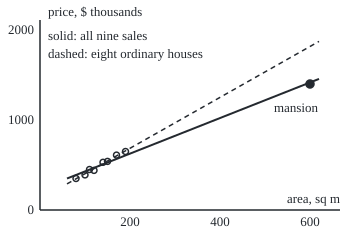
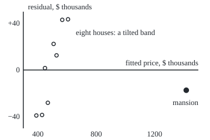

# Diagnostics: residual plots, leverage, and the assumptions a regression quietly makes

[Syllabus](../../../SYLLABUS.md) → [Probability and statistics](../../../SYLLABUS.md#w09) → [Regression](../../../SYLLABUS.md#w09-s09) → Diagnostics

---

## General Overview

Nine houses sold on one street last spring. Eight are ordinary: 80 to 190 square metres, $350,000 to $650,000. The ninth is a mansion of 600 square metres that sold for $1,400,000. Prices on this card are in thousands of dollars, so 1,400 means $1,400,000.

Fit one straight line through all nine by least squares ([Least squares](01-least-squares-regression.md)). It says each extra square metre adds $1,978 (standard error $77). Fit the eight ordinary houses alone and it says $2,827 (standard error $149). One sale moved the answer that far. Yet the mansion sits almost on the nine-house line: it misses by only $17,400, the seventh-largest miss of the nine.

That is the trap diagnostics exist for. A **residual** is what the line missed for one sale: the sale price minus the line's price. Residuals are the only evidence a fit leaves about its own assumptions. Read the right way, they show a line that bends, a spread that grows, and a sale that steers. Read the wrong way, the mansion looks like the best-behaved house on the street, because it pulled the line onto itself.

**A regression is checked by its residuals, but each residual must be judged against how far that sale can pull the line (its leverage), so the tools are the residual plot, the leverage, the residual rescaled by its own spread, and the change in the fit when the sale is deleted.**

**What kind of fact this is:** a method, a set of checks. The two facts it stands on, that a residual's spread shrinks with leverage and that deleting a sale multiplies its residual by exactly one over one minus its leverage, are theorems proved on this card in Why it works.

### The picture: one mansion pulling the line

Floor area across, price up, drawn to scale. Solid: the line through all nine sales. Dashed: the line through the eight ordinary houses, carried out to 600 square metres.

<p align="center"></p>

The eight ordinary houses climb steeply. The line through all nine is tilted down to meet the mansion, and passes it within $17,400. The dashed line would have priced the mansion at $1,816,700.

---

## The formula

Notation first, in words. Sale number i has floor area $x_i$ and price $y_i$. A hat marks an estimate, as on shelf 07: $\hat y_i$ is the fitted line's price for sale i. $\bar x$ is the average area. A subscript in brackets, as in $\hat y_{(i)}$, means "fitted with sale i left out". Var, as on shelf 02, is the variance: the long-run average squared distance from the mean. $\sigma$ is the spread of the true errors around the true line, and $s$ its estimate from the residuals. $p$ counts the numbers the line estimates: 2, intercept and slope.

The residual and the leverage:

$$e_i = y_i - \hat y_i, \qquad h_i = \frac{1}{n} + \frac{(x_i - \bar x)^2}{S_{xx}}, \qquad S_{xx} = \sum_{j=1}^{n} (x_j - \bar x)^2$$

**Read it aloud:** a residual is price minus fitted price; a sale's leverage is one over the number of sales, plus its squared distance from the average area as a share of all such squared distances.

The residual's spread, and the residual rescaled by it:

$$\operatorname{Var}(e_i) = \sigma^2 (1 - h_i), \qquad r_i = \frac{e_i}{s\sqrt{1 - h_i}}$$

**Read it aloud:** a sale's residual scatters less the more leverage it has; dividing by its own spread puts every residual on one scale.

Deleting sale i, and what that does to the whole fit:

$$e_{(i)} = y_i - \hat y_{(i)} = \frac{e_i}{1 - h_i}, \qquad D_i = \frac{\sum_{j} \bigl(\hat y_j - \hat y_{j(i)}\bigr)^2}{p\, s^2} = \frac{r_i^2}{p} \cdot \frac{h_i}{1 - h_i}$$

**Read it aloud:** the sale's miss when the line never saw it is its ordinary miss divided by one minus its leverage; Cook's distance is how far all the fitted prices move when the sale is deleted, and it needs no refit.

| Symbol | Plain meaning | In our example | Push it up and the answer… |
| --- | --- | --- | --- |
| $n$ | number of sales | 9 | the average leverage, p/n, falls |
| $x_i$, $y_i$ | floor area and price of sale i | mansion: 600 sq m, 1,400 | a sale far from $\bar x$ gains leverage |
| $\hat y_i$, $e_i$ | fitted price; residual, price minus fitted | mansion: 1,417.4 and −17.4 | — |
| $\bar x$, $S_{xx}$ | average area; total squared distance of areas from it | 184.44 sq m; 203,822.22 | a wider spread of areas lowers every $h_i$ |
| $h_i$ | leverage: how far the fitted price follows a change of 1 in the price | mansion 0.958; house 8, 0.111 | the sale's residual is squeezed toward 0 |
| $p$ | numbers the line estimates, intercept and slope | 2 | the leverages add up to it |
| $\sigma$, $\sigma_j$ | spread of the true errors, unknown; the same at sale j, when it varies | simulation: 40, or a funnel | every residual scatters more |
| $s$, $s_{(i)}$ | estimate of $\sigma$ from the residuals, with n − p in the divisor; the same without sale i | 34.84; mansion out, 14.52 | — |
| $r_i$, $t_i$ | studentized residual (scaled by its own estimated spread), using $s$; external version, using $s_{(i)}$ | mansion −2.44; −5.86 | beyond about ±2 the sale is flagged |
| $\hat y_{(i)}$, $e_{(i)}$ | fitted price and miss, from a line that never saw sale i | mansion 1,816.7 and −416.7 | — |
| $D_i$ | Cook's distance: the shift of all fitted prices when sale i goes | mansion 68.548; the rest below 0.15 | above 1 the sale is steering the fit |
| $X$, $H$ | in the proofs: the table holding a 1 and the area for each sale; the hat matrix $X(X^{\top}X)^{-1}X^{\top}$, which turns prices into fitted prices | 9 rows by 2; 9 by 9, the leverages down its diagonal | — |
| $\beta$, $\varepsilon$ | in the proofs: the true intercept and slope; the true errors, price minus the true line | unknown for the street; simulation: 120 and 2.8 | — |
| $I$ | the identity matrix: 1s down its diagonal, 0s elsewhere | 9 by 9 | — |
| $\Phi^{-1}$ | the normal quantile of shelf 04: the point on the bell curve with a given chance below it | the quantile plot's straight line | — |

The external version $t_i$ swaps $s$ for $s_{(i)}$, so a wild sale cannot inflate the yardstick it is measured with. The house rules of thumb are conventions, not theorems: leverage above 2p/n, here 0.444; $\lvert t_i \rvert$ above 2 or 3; Cook's distance above 1.

### When it holds

These are the assumptions a least squares line quietly makes, each with the residual pattern that betrays it and what its failure does to the answer.

- **The mean is a straight line.** If not, the residual plot shows a bend or a tilted band. Here one line cannot serve small houses and the mansion at once: the slope comes out $1,978 per square metre where the ordinary houses say $2,827, and a 150 square metre house is priced at $527,400 instead of $544,500.
- **The spread is the same everywhere.** If it changes with size, the residual plot fans out like a funnel. The slope stays right on average, but its textbook standard error is wrong: too small when the largest spreads sit at the sales far from the average area, which carry the most weight in the slope, too large when they sit near it. Step 5's funnel is the first kind, and a "95 percent" interval covers the truth about 90 percent of the time.
- **No single sale steers the fit.** A sale with high leverage can hold the line to itself. Its residual looks small; Cook's distance and the external studentized residual expose it.
- **The errors are independent.** Sales on one street in one month share shocks. Correlated errors leave residuals in runs, and the standard errors are again too small; the cure is the funnel's cure (Step 5) in its clustered form, which lets errors within a group of sales move together.
- **For small samples, bell-shaped errors.** The t-based intervals of [Regression error bars](02-regression-inference.md) use it. A normal quantile plot checks it: the sorted residuals against $\Phi^{-1}$, the normal quantile of shelf 04, of evenly spaced chances lie on a straight line if the errors are bell-shaped; with fifty or more sales it matters much less.

---

## Why it works

### Step 0: the line is fitted to make residuals small, so a sale that can move the line hides its own miss

Least squares chooses the line that makes the sum of squared residuals as small as it can. Every sale pulls. A sale near the average area pulls on the line's height, and a sale far out pulls on its tilt, with a long lever arm. The mansion is 415.56 square metres from the average area, and its squared distance is 0.8472 of the total for all nine. The line buys a small mansion residual by tilting, and pays with residuals spread across the eight ordinary houses. So a residual is not evidence on its own: it has to be read against how much of it the line was free to erase.

### Step 1: leverage is how far the fitted price follows the sale's own price

Raise the mansion's price by 1, a thousand dollars, and refit. The line's price for the mansion rises by 0.958: the line follows 0.958 of any change in that sale's price. That sensitivity is the leverage $h_i$. The code measures it this way for all nine sales, by nudging and refitting, and gets the same numbers as the formula.

The formula comes from how the line is built. The fitted price is $\hat y_i = \bar y + b(x_i - \bar x)$, where $\bar y$ is the average price and b the slope, $b = \sum_j (x_j - \bar x) y_j / S_{xx}$. Raise $y_i$ by 1: the average price rises by $1/n$, and the slope rises by $(x_i - \bar x)/S_{xx}$, which moves the fitted price at $x_i$ by that times $(x_i - \bar x)$. Together, $h_i = 1/n + (x_i - \bar x)^2/S_{xx}$. For the mansion: 0.1111 + 172,686.4/203,822.22 = 0.1111 + 0.8472 = 0.9584.

The leverages always add up to $p$, the number of things the line estimates: here 2.0000, an average of 2/9 per sale. The mansion holds almost half of the total by itself.

### Step 2: a high-leverage residual has a small spread

The residual is the price minus a fitted price that already contains fraction $h_i$ of the sale's own error. Only $1 - h_i$ of that error survives, plus small shares of the other sales' errors, and the variance works out to exactly $\sigma^2(1 - h_i)$. For house 1 the residual's spread is 0.914 of the error's spread; for the mansion it is 0.204. The mansion's residual is held to about a fifth of the size of anyone else's. Judged on one yardstick, a residual of −17.4 looks tame; divided by its own spread, $s\sqrt{1 - h_i} = 7.11$, it is −2.44, the largest on the street.

<details>
<summary>Detailed proof: the residual's variance</summary>

Stack the prices into a column y. The fitted prices are $\hat y = Hy$, where $H = X(X^{\top}X)^{-1}X^{\top}$ is the **hat matrix** of [Multiple regression](03-multiple-regression-and-gauss-markov.md): it turns prices into fitted prices. X has a column of 1s and a column of areas. Its diagonal entries are the leverages: the i-th is the change in $\hat y_i$ per unit change in $y_i$, which is Step 1's $h_i$.

H is symmetric, and $HH = H$, because fitting a line to prices already on the line changes nothing. The residuals are $e = (I - H)y$. Write $y = X\beta + \varepsilon$, with the errors ε independent, mean 0 and variance $\sigma^2$. Since $HX = X$, the line part cancels and $e = (I - H)\varepsilon$. So the variance matrix of e is $(I - H)\,\sigma^2 I\,(I - H)^{\top} = \sigma^2 (I - H)$, using symmetry and $HH = H$ once. Its diagonal entry is $\operatorname{Var}(e_i) = \sigma^2(1 - h_i)$.

The leverages add to the trace of H. The trace of $X(X^{\top}X)^{-1}X^{\top}$ equals the trace of $(X^{\top}X)^{-1}X^{\top}X$, the p-by-p identity, which is p.

</details>

### Step 3: deleting a sale multiplies its residual by exactly one over one minus its leverage

To see whether a sale fits the pattern of the others, price it with a line that never saw it. That line prices the mansion at 1,816.7, a miss of −416.7, against −17.4 when the mansion was in. The ratio is $1/(1 - h_i) = 1/0.0416$, and that is no accident.

Replace the mansion's price with the deleted line's 1,816.7. That sale now sits exactly on the eight-house line, so adding it costs that line nothing, and least squares on all nine returns the same line. The mansion's own price moved by $-e_{(i)}$, up 416.7, and its fitted price followed by $h_i$ times that move (Step 1). Before the move, then, its fitted price was $\hat y_{(i)} + h_i e_{(i)}$, so $e_i = e_{(i)} - h_i e_{(i)} = (1 - h_i) e_{(i)}$. One fit gives every sale's deleted residual, with no refitting. The code refits nine times anyway, as the second road.

### Step 4: Cook's distance is the shift of every fitted price, read off one fit

Deleting sale i moves every fitted price, not just its own. Adding the squared moves and scaling by $p s^2$ gives Cook's distance, $D_i$. The same planting argument turns it into $D_i = (r_i^2/p) \cdot h_i/(1 - h_i)$: a sale steers the fit only if it both misses (large $r_i$) and has leverage (large $h_i$). Neither alone is enough. House 8 has the biggest raw residual, 43.5, and a Cook's distance of 0.110. The mansion has one of the smallest and a Cook's distance of 68.548.

The external studentized residual asks the same question as a test. It divides the deleted residual by its own standard error as a prediction from the eight-house line, whose spread is $s_{(i)} = 14.52$. The mansion gets −5.86: it sits nearly six standard errors from where the other eight houses put it.

<details>
<summary>Detailed proof: Cook's distance from one fit</summary>

Deleting sale i gives the same line as keeping it with its price replaced by $\hat y_{(i)}$ (Step 3). That replacement changes the price column by $-e_{(i)}$ in entry i and nothing elsewhere, so the fitted prices change by $-e_{(i)}$ times column i of H: $\hat y_j - \hat y_{j(i)} = H_{ji}\, e_{(i)}$.

Summing squares, $\sum_j H_{ji}^2 = (HH)_{ii} = h_i$, by symmetry and $HH = H$. So $\sum_j (\hat y_j - \hat y_{j(i)})^2 = h_i\, e_{(i)}^2 = h_i e_i^2 / (1 - h_i)^2$. Divide by $p s^2$ and write $e_i^2 = r_i^2 s^2 (1 - h_i)$: $D_i = r_i^2 h_i / (p(1 - h_i))$.

The external version: the line without sale i misses each sale j, at its real price, by $y_j - \hat y_{j(i)} = e_j + H_{ji}\, e_{(i)}$. Square and add over all nine sales. The cross term is $2e_{(i)}(He)_i$, which is 0 because $He = (H - HH)y = 0$, so the total is $\sum_j e_j^2 + h_i e_{(i)}^2$. The eight-sale sum leaves out sale i's own term, $e_{(i)}^2$. So removing sale i takes $(1 - h_i)\, e_{(i)}^2 = e_{(i)} e_i = e_i^2/(1 - h_i)$ off the sum of squared residuals, which gives $(n - p - 1)s_{(i)}^2 = (n - p)s^2 - e_i^2/(1 - h_i)$, and $t_i = e_i / (s_{(i)}\sqrt{1 - h_i})$.

</details>

### Step 5: an uneven spread leaves the slope right and its error bar wrong

The slope is a weighted sum of prices, $b = \sum_j (x_j - \bar x) y_j / S_{xx}$. With independent errors of spread $\sigma_j$ at sale j, its variance is $\sum_j (x_j - \bar x)^2 \sigma_j^2 / S_{xx}^2$: one over $S_{xx}$ times an average of the $\sigma_j^2$ that weights each sale by $(x_j - \bar x)^2$. The textbook formula replaces every $\sigma_j$ by one common $\sigma$, giving $\sigma^2/S_{xx}$, and its estimate $s^2$ averages the $\sigma_j^2$ almost evenly. So the textbook figure is too small when the largest spreads sit at the sales far from the average area, and too large when they sit near it; a spread that grows with area does not settle which. In the funnel below, the spread climbs fastest at the biggest houses, which carry the largest weights, and the textbook formula undercounts them.

The code tests this on 50 simulated sales, 60 to 240 square metres, true price 120 + 2.8 × area, run 4,000 times. With an even spread of 40, the slope's true spread is 0.1022, the textbook standard error averages 0.1016, and "slope ± 2 standard errors" covers the true slope in 0.9490 of runs. With a funnel, spread $40 \times (\text{area}/150)^2$, the slope still averages 2.8018. But its true spread is 0.1637, the textbook standard error averages 0.1393, and the interval covers the truth in 0.9052 of runs. The residual plot shows it: residuals below 120 square metres average 13.0 in size, those at 180 and up average 62.1.

White's heteroskedasticity-consistent standard error (1980) estimates the weighted sum above from the squared residuals, and is the usual cure for a funnel. A line that resists a single sale, such as a least absolute deviations fit, is one cure for a steering outlier. White's paper is in the Sources.

---

## Worked numbers, by hand

The mansion, from the nine-sale fit.

| Step | Arithmetic | Value |
| --- | --- | --- |
| fitted price | 230.80 + 1.9776 × 600 | 1,417.4 |
| residual | 1,400 − 1,417.4 | −17.4 |
| distance from the average area | 600 − 184.44 | 415.56 |
| leverage | 1/9 + 415.56^2 / 203,822.22 = 0.1111 + 0.8472 | **0.9584** |
| the residual's own spread | 34.84 × √0.0416 = 34.84 × 0.204 | 7.11 |
| studentized residual | −17.4 / 7.11 | −2.44 |
| deleted residual | −17.4 / 0.0416 | −416.7 |
| check: the eight-house line at 600 | 120.39 + 2.8272 × 600 = 1,816.7; 1,400 − 1,816.7 | −416.7 |
| Cook's distance | 5.96 × 0.9584 / (2 × 0.0416), unrounded | **68.548** |

The mansion is not a small miss; it is a sale the line bent to meet, and deleting it moves every fitted price on the street by far more than any other sale.

### What breaks if you drop a piece

| Mistake | Comes out at | What went wrong |
| --- | --- | --- |
| Judging the mansion by its raw residual | 17.4, 7th largest of 9 | Leverage 0.958 lets it pull the line onto itself; external studentized residual −5.86 |
| One straight line for small houses and the mansion | slope 1.9776 (SE 0.0772); 150 sq m house at 527.4 | Linearity dropped; the eight houses say 2.8272 (SE 0.1486) and 544.5 |
| Deleting the mansion, then pricing a 600 sq m house | 1,816.7 against a sale at 1,400 | Extrapolation: no ordinary house is near 600 sq m |
| Textbook standard error under a funnel | 0.1393 against a true 0.1637; covers in 0.9052 | Constant spread dropped |

The code prints every row. The second row has a sting: with the mansion in, the slope's standard error is about half as large, so the wrong answer looks more precise.

### The picture: the residual plot

Residual up, fitted price across, from the nine-sale line, drawn to scale.

<p align="center"></p>

The eight ordinary houses climb from −39.0 to +43.5 as their fitted price rises: a tilted band, the sign that one straight line does not fit them. The mansion, at −17.4, looks harmless. The plot flags the problem through the other houses, not through the sale that caused it; leverage and Cook's distance name the culprit.

---

## Code, from first principles, and it actually runs

The checks reach every diagnostic by two roads that share no formula, and take a third for the funnel. Road 1 is the formulas above: leverage, studentized residuals, deleted residuals and Cook's distance, all from one fit. Road 2 is brute force: nudge each sale's price by one and refit to measure leverage, then delete each sale in turn and refit to get its deleted residual, its external studentized residual and the shift of every fitted price. Road 3 is a seeded simulation of fifty sales, with random numbers from SplitMix64 (a small, written-out generator, seed 20260928) turned into bell-shaped draws by the Box–Muller recipe. It compares the slope's exact spread, its simulated spread and its textbook standard error, with an even spread and with a funnel. Both programs draw the same numbers and print the same bytes.

### Python

```python
# Diagnostics and residuals -- the check behind the card.  Standard library only.
# Nine house sales, one of them a mansion: which sale is steering the line?
# Road 1: the leverage formulas.  Road 2: brute force -- nudge a price, or delete a sale,
# and refit.  Road 3: a seeded simulation of 50 sales whose spread grows with size.
from math import sqrt, log, cos, pi

AREA = [80, 100, 110, 120, 140, 150, 170, 190, 600]            # floor area, square metres
PRICE = [350, 390, 450, 440, 530, 540, 610, 650, 1400]         # sale price, $ thousands
N, P, M = len(AREA), 2, len(AREA) - 1                          # P: intercept and slope; M: the mansion

def fit(x, y):                                                  # least squares line: intercept, slope
    mx, my = sum(x) / len(x), sum(y) / len(y)
    sxx = sum((a - mx) ** 2 for a in x)
    b = sum((a - mx) * (c - my) for a, c in zip(x, y)) / sxx
    return my - b * mx, b

def resid(x, y, a, b): return [c - (a + b * v) for v, c in zip(x, y)]

def drop(v, i): return v[:i] + v[i + 1:]

a, b = fit(AREA, PRICE)
e = resid(AREA, PRICE, a, b)
s = sqrt(sum(r * r for r in e) / (N - P))                       # typical size of a residual
mx = sum(AREA) / N
sxx = sum((v - mx) ** 2 for v in AREA)
h = [1 / N + (v - mx) ** 2 / sxx for v in AREA]                 # road 1: leverage by formula
h_nudge = []                                                    # road 2: lift one price by 1, refit
for i in range(N):
    y2 = PRICE[:]; y2[i] += 1.0
    a2, b2 = fit(AREA, y2)
    h_nudge.append((a2 + b2 * AREA[i]) - (a + b * AREA[i]))
r = [e[i] / (s * sqrt(1 - h[i])) for i in range(N)]            # studentized, internal
t_f, t_r, d_f, d_r, del_f, del_r = [], [], [], [], [], []
for i in range(N):
    s_i2 = ((N - P) * s * s - e[i] ** 2 / (1 - h[i])) / (N - P - 1)
    t_f.append(e[i] / (sqrt(s_i2) * sqrt(1 - h[i])))             # road 1: external, by formula
    d_f.append(r[i] ** 2 * h[i] / (P * (1 - h[i])))              # road 1: Cook's distance
    del_f.append(e[i] / (1 - h[i]))                              # road 1: deletion residual
    ai, bi = fit(drop(AREA, i), drop(PRICE, i))                  # road 2: delete the sale, refit
    ei = resid(drop(AREA, i), drop(PRICE, i), ai, bi)
    si = sqrt(sum(q * q for q in ei) / (N - 1 - P))
    del_r.append(PRICE[i] - (ai + bi * AREA[i]))                  # the sale, priced by the other eight
    mi = sum(drop(AREA, i)) / (N - 1)
    sxx_i = sum((v - mi) ** 2 for v in drop(AREA, i))
    t_r.append(del_r[i] / (si * sqrt(1 + 1 / (N - 1) + (AREA[i] - mi) ** 2 / sxx_i)))   # its own error bar
    d_r.append(sum((a + b * v - ai - bi * v) ** 2 for v in AREA) / (P * s * s))

print("house   area  price  fitted  resid  leverage  lev by nudge")
for i in range(N):
    name = "mansion" if i == M else f"{i + 1:>7}"
    print(f"{name}{AREA[i]:>6}{PRICE[i]:>7}{a + b * AREA[i]:>8.1f}{e[i]:>7.1f}{h[i]:>10.3f}{h_nudge[i]:>14.3f}")
print("house   studentized  external  ext by refit   Cook's D  D by refit")
for i in range(N):
    name = "mansion" if i == M else f"{i + 1:>7}"
    print(f"{name}{r[i]:>13.2f}{t_f[i]:>10.2f}{t_r[i]:>14.2f}{d_f[i]:>11.3f}{d_r[i]:>12.3f}")
a0, b0 = fit(AREA[:M], PRICE[:M])
e0 = resid(AREA[:M], PRICE[:M], a0, b0)
s0 = sqrt(sum(q * q for q in e0) / (M - P))
sxx0 = sum((v - sum(AREA[:M]) / M) ** 2 for v in AREA[:M])
print(f"fit with the mansion:    intercept {a:.2f}, slope {b:.4f} (SE {s / sqrt(sxx):.4f}), "
      f"i.e. ${b * 1000:.0f} per m2; s = {s:.2f}")
print(f"fit without the mansion: intercept {a0:.2f}, slope {b0:.4f} (SE {s0 / sqrt(sxx0):.4f}), "
      f"i.e. ${b0 * 1000:.0f} per m2; s = {s0:.2f}")
print(f"mansion by hand: 1/N {1 / N:.4f}; area - mean {AREA[M] - mx:.2f}; squared {(AREA[M] - mx) ** 2:.1f}; "
      f"over Sxx {(AREA[M] - mx) ** 2 / sxx:.4f}; leverage {h[M]:.4f}")
print(f"mansion by hand: 1 - h {1 - h[M]:.4f}; root {sqrt(1 - h[M]):.3f} (house 1: {sqrt(1 - h[0]):.3f}); "
      f"s x root {s * sqrt(1 - h[M]):.2f}; r squared {r[M] ** 2:.2f}")
zero = abs(sum(e)) < 1e-9 and abs(sum(v * q for v, q in zip(AREA, e))) < 1e-9
print(f"mean area {mx:.2f}; Sxx {sxx:.2f}; residuals and area x residual both sum to 0: "
      f"{'yes' if zero else 'no'}; sum of leverages {sum(h):.4f}")
print(f"flag lines: leverage above 2P/N = {2 * P / N:.3f}; Cook's D above 1")
print(f"mansion's deletion residual: formula {del_f[M]:.1f}, refit {del_r[M]:.1f}; "
      f"line without it predicts {a0 + b0 * 600:.1f} for 600 m2")
rank = sorted(range(N), key=lambda i: -abs(e[i])).index(M) + 1
print(f"mistake, raw residual: mansion's |residual| {abs(e[M]):.1f} ranks {rank} of {N} by size")
print(f"mistake, one line for all: a 150 m2 house priced {a + b * 150:.1f} with the mansion, {a0 + b0 * 150:.1f} without")
print(f"mistake, extrapolating: 600 m2 predicted {a0 + b0 * 600:.1f}, sold {PRICE[M]}")
sx = lambda v: 40 + 0.45 * v                                    # figure 1: price against area
sy = lambda p: 210 - 0.09 * p
print("figure, houses " + " ".join(f"({sx(v):.1f},{sy(p):.1f})" for v, p in zip(AREA, PRICE)))
print(f"figure, line with mansion ({sx(60):.1f},{sy(a + b * 60):.1f}) ({sx(620):.1f},{sy(a + b * 620):.1f}); "
      f"without ({sx(60):.1f},{sy(a0 + b0 * 60):.1f}) ({sx(620):.1f},{sy(a0 + b0 * 620):.1f})")
fx = lambda f: 40 + 0.25 * (f - 300)                            # figure 2: residual against fitted
fy = lambda q: 120 - 2.0 * q
print("figure, residual plot " + " ".join(f"({fx(a + b * v):.1f},{fy(q):.1f})" for v, q in zip(AREA, e)))

MASK, state = (1 << 64) - 1, 20260928                           # road 3: SplitMix64, seed 20260928
def splitmix():
    global state
    state = (state + 0x9E3779B97F4A7C15) & MASK
    z = state
    z = ((z ^ (z >> 30)) * 0xBF58476D1CE4E5B9) & MASK
    z = ((z ^ (z >> 27)) * 0x94D049BB133111EB) & MASK
    return z ^ (z >> 31)
def unif(): return ((splitmix() >> 11) + 0.5) / 2.0 ** 53
def normal(): return sqrt(-2.0 * log(unif())) * cos(2.0 * pi * unif())

SALES, REPS = 50, 4000
xs = [60 + 180 * unif() for _ in range(SALES)]                  # 50 floor areas, fixed for every run
xm = sum(xs) / SALES
print(f"simulation: {SALES} sales, areas 60 to 240 m2, true price 120 + 2.8 x area, {REPS} runs, seed 20260928; "
      f"spread 40, or 40 x (area/150)^2")
sxx50 = sum((v - xm) ** 2 for v in xs)
for label, sd in (("even spread", lambda v: 40.0), ("funnel", lambda v: 40.0 * (v / 150) ** 2)):
    exact = sqrt(sum((v - xm) ** 2 * sd(v) ** 2 for v in xs)) / sxx50
    slopes, ses, hits, small, big = [], [], 0, 0.0, 0.0
    for rep in range(REPS):
        ys = [120 + 2.8 * v + sd(v) * normal() for v in xs]
        a5, b5 = fit(xs, ys)
        e5 = resid(xs, ys, a5, b5)
        se = sqrt(sum(q * q for q in e5) / (SALES - P) / sxx50)   # the textbook standard error
        slopes.append(b5); ses.append(se); hits += abs(b5 - 2.8) <= 2 * se
        small += sum(abs(q) for v, q in zip(xs, e5) if v < 120) / REPS
        big += sum(abs(q) for v, q in zip(xs, e5) if v >= 180) / REPS
    sim = sqrt(sum((q - sum(slopes) / REPS) ** 2 for q in slopes) / (REPS - 1))
    cover = hits / REPS
    nsm, nbg = sum(v < 120 for v in xs), sum(v >= 180 for v in xs)
    print(f"{label}: slope mean {sum(slopes) / REPS:.4f}; true SD exact {exact:.4f}, simulated {sim:.4f} "
          f"(+/- {sim / sqrt(2 * (REPS - 1)):.4f}); textbook SE {sum(ses) / REPS:.4f}")
    print(f"{label}: b +/- 2 SE covers 2.8 in {cover:.4f} (+/- {sqrt(cover * (1 - cover) / REPS):.4f}); "
          f"mean |resid| below 120 m2 {small / nsm:.1f}, 180 m2 and up {big / nbg:.1f}")
    assert abs(sim - exact) < 4 * sim / sqrt(2 * (REPS - 1))   # simulation agrees with the exact spread
    if label == "funnel": assert cover < 0.93 and sum(ses) / REPS < 0.9 * exact
assert all(abs(h[i] - h_nudge[i]) < 1e-9 for i in range(N))    # leverage: formula = nudge-and-refit
assert abs(sum(h) - P) < 1e-12                                  # leverages add up to the line's 2 numbers
assert all(abs(d_f[i] - d_r[i]) < 1e-9 * (1 + d_r[i]) for i in range(N))   # Cook's D: formula = deletion
assert all(abs(t_f[i] - t_r[i]) < 1e-9 and abs(del_f[i] - del_r[i]) < 1e-9 for i in range(N))
print("ALL CHECKS PASS")
```

**Ran 2026-09-28 on macOS, Python 3.14.6, standard library only. All checks passed. Output, pasted from the run:**

```
house   area  price  fitted  resid  leverage  lev by nudge
      1    80    350   389.0  -39.0     0.165         0.165
      2   100    390   428.6  -38.6     0.146         0.146
      3   110    450   448.3    1.7     0.138         0.138
      4   120    440   468.1  -28.1     0.131         0.131
      5   140    530   507.7   22.3     0.121         0.121
      6   150    540   527.4   12.6     0.117         0.117
      7   170    610   567.0   43.0     0.112         0.112
      8   190    650   606.5   43.5     0.111         0.111
mansion   600   1400  1417.4  -17.4     0.958         0.958
house   studentized  external  ext by refit   Cook's D  D by refit
      1        -1.22     -1.28         -1.28      0.148       0.148
      2        -1.20     -1.24         -1.24      0.123       0.123
      3         0.05      0.05          0.05      0.000       0.000
      4        -0.87     -0.85         -0.85      0.057       0.057
      5         0.68      0.66          0.66      0.032       0.032
      6         0.38      0.36          0.36      0.010       0.010
      7         1.31      1.40          1.40      0.108       0.108
      8         1.32      1.41          1.41      0.110       0.110
mansion        -2.44     -5.86         -5.86     68.548      68.548
fit with the mansion:    intercept 230.80, slope 1.9776 (SE 0.0772), i.e. $1978 per m2; s = 34.84
fit without the mansion: intercept 120.39, slope 2.8272 (SE 0.1486), i.e. $2827 per m2; s = 14.52
mansion by hand: 1/N 0.1111; area - mean 415.56; squared 172686.4; over Sxx 0.8472; leverage 0.9584
mansion by hand: 1 - h 0.0416; root 0.204 (house 1: 0.914); s x root 7.11; r squared 5.96
mean area 184.44; Sxx 203822.22; residuals and area x residual both sum to 0: yes; sum of leverages 2.0000
flag lines: leverage above 2P/N = 0.444; Cook's D above 1
mansion's deletion residual: formula -416.7, refit -416.7; line without it predicts 1816.7 for 600 m2
mistake, raw residual: mansion's |residual| 17.4 ranks 7 of 9 by size
mistake, one line for all: a 150 m2 house priced 527.4 with the mansion, 544.5 without
mistake, extrapolating: 600 m2 predicted 1816.7, sold 1400
figure, houses (76.0,178.5) (85.0,174.9) (89.5,169.5) (94.0,170.4) (103.0,162.3) (107.5,161.4) (116.5,155.1) (125.5,151.5) (310.0,84.0)
figure, line with mansion (67.0,178.5) (319.0,78.9); without (67.0,183.9) (319.0,41.4)
figure, residual plot (62.3,198.0) (72.1,197.1) (77.1,116.7) (82.0,176.2) (91.9,75.3) (96.9,94.9) (106.7,34.0) (116.6,33.1) (319.3,154.7)
simulation: 50 sales, areas 60 to 240 m2, true price 120 + 2.8 x area, 4000 runs, seed 20260928; spread 40, or 40 x (area/150)^2
even spread: slope mean 2.8007; true SD exact 0.1022, simulated 0.1012 (+/- 0.0011); textbook SE 0.1016
even spread: b +/- 2 SE covers 2.8 in 0.9490 (+/- 0.0035); mean |resid| below 120 m2 31.3, 180 m2 and up 31.0
funnel: slope mean 2.8018; true SD exact 0.1637, simulated 0.1622 (+/- 0.0018); textbook SE 0.1393
funnel: b +/- 2 SE covers 2.8 in 0.9052 (+/- 0.0046); mean |resid| below 120 m2 13.0, 180 m2 and up 62.1
ALL CHECKS PASS
```

### Rust

Same roads, same labels, built with `rustc --edition 2021 -O`.

```rust
// Diagnostics and residuals -- the same check as the Python, in Rust.  No crates.
// Nine house sales, one of them a mansion: which sale is steering the line?
// Road 1: the leverage formulas.  Road 2: brute force -- nudge a price, or delete a sale,
// and refit.  Road 3: a seeded simulation of 50 sales whose spread grows with size.
const AREA: [f64; 9] = [80.0, 100.0, 110.0, 120.0, 140.0, 150.0, 170.0, 190.0, 600.0];
const PRICE: [f64; 9] = [350.0, 390.0, 450.0, 440.0, 530.0, 540.0, 610.0, 650.0, 1400.0];
const N: usize = 9;
const P: f64 = 2.0;
const M: usize = 8;

fn mean(v: &[f64]) -> f64 { v.iter().sum::<f64>() / v.len() as f64 }

fn fit(x: &[f64], y: &[f64]) -> (f64, f64) {                    // least squares line
    let (mx, my) = (mean(x), mean(y));
    let sxx: f64 = x.iter().map(|a| (a - mx) * (a - mx)).sum();
    let b = x.iter().zip(y).map(|(a, c)| (a - mx) * (c - my)).sum::<f64>() / sxx;
    (my - b * mx, b)
}

fn resid(x: &[f64], y: &[f64], a: f64, b: f64) -> Vec<f64> {
    x.iter().zip(y).map(|(v, c)| c - (a + b * v)).collect()
}

fn drop(v: &[f64], i: usize) -> Vec<f64> { [&v[..i], &v[i + 1..]].concat() }

struct Rng(u64);
impl Rng {                                                        // SplitMix64
    fn next(&mut self) -> u64 {
        self.0 = self.0.wrapping_add(0x9E3779B97F4A7C15);
        let mut z = self.0;
        z = (z ^ (z >> 30)).wrapping_mul(0xBF58476D1CE4E5B9);
        z = (z ^ (z >> 27)).wrapping_mul(0x94D049BB133111EB);
        z ^ (z >> 31)
    }
    fn unif(&mut self) -> f64 { ((self.next() >> 11) as f64 + 0.5) / 2f64.powi(53) }
    fn normal(&mut self) -> f64 {
        let u1 = self.unif();
        let u2 = self.unif();
        (-2.0 * u1.ln()).sqrt() * (2.0 * std::f64::consts::PI * u2).cos()
    }
}

fn main() {
    let (a, b) = fit(&AREA, &PRICE);
    let e = resid(&AREA, &PRICE, a, b);
    let s = (e.iter().map(|r| r * r).sum::<f64>() / (N as f64 - P)).sqrt();
    let mx = mean(&AREA);
    let sxx: f64 = AREA.iter().map(|v| (v - mx) * (v - mx)).sum();
    let h: Vec<f64> = AREA.iter().map(|v| 1.0 / N as f64 + (v - mx) * (v - mx) / sxx).collect();
    let mut h_nudge = vec![0.0; N];
    for i in 0..N {                                               // road 2: lift one price by 1, refit
        let mut y2 = PRICE.to_vec();
        y2[i] += 1.0;
        let (a2, b2) = fit(&AREA, &y2);
        h_nudge[i] = (a2 + b2 * AREA[i]) - (a + b * AREA[i]);
    }
    let r: Vec<f64> = (0..N).map(|i| e[i] / (s * (1.0 - h[i]).sqrt())).collect();
    let (mut t_f, mut t_r, mut d_f, mut d_r, mut del_f, mut del_r) = (vec![], vec![], vec![], vec![], vec![], vec![]);
    let nf = N as f64;
    for i in 0..N {
        let s_i2 = ((nf - P) * s * s - e[i] * e[i] / (1.0 - h[i])) / (nf - P - 1.0);
        t_f.push(e[i] / (s_i2.sqrt() * (1.0 - h[i]).sqrt()));      // road 1: external, by formula
        d_f.push(r[i] * r[i] * h[i] / (P * (1.0 - h[i])));         // road 1: Cook's distance
        del_f.push(e[i] / (1.0 - h[i]));                           // road 1: deletion residual
        let (xa, ya) = (drop(&AREA, i), drop(&PRICE, i));          // road 2: delete the sale, refit
        let (ai, bi) = fit(&xa, &ya);
        let ei = resid(&xa, &ya, ai, bi);
        let si = (ei.iter().map(|q| q * q).sum::<f64>() / (nf - 1.0 - P)).sqrt();
        del_r.push(PRICE[i] - (ai + bi * AREA[i]));
        let mi = mean(&xa);
        let sxx_i: f64 = xa.iter().map(|v| (v - mi) * (v - mi)).sum();
        t_r.push(del_r[i] / (si * (1.0 + 1.0 / (nf - 1.0) + (AREA[i] - mi).powi(2) / sxx_i).sqrt()));
        d_r.push(AREA.iter().map(|v| (a + b * v - ai - bi * v).powi(2)).sum::<f64>() / (P * s * s));
    }
    let name = |i: usize| if i == M { "mansion".to_string() } else { format!("{:>7}", i + 1) };
    println!("house   area  price  fitted  resid  leverage  lev by nudge");
    for i in 0..N {
        println!("{}{:>6}{:>7}{:>8.1}{:>7.1}{:>10.3}{:>14.3}", name(i), AREA[i], PRICE[i], a + b * AREA[i], e[i], h[i], h_nudge[i]);
    }
    println!("house   studentized  external  ext by refit   Cook's D  D by refit");
    for i in 0..N {
        println!("{}{:>13.2}{:>10.2}{:>14.2}{:>11.3}{:>12.3}", name(i), r[i], t_f[i], t_r[i], d_f[i], d_r[i]);
    }
    let (a0, b0) = fit(&AREA[..M], &PRICE[..M]);
    let e0 = resid(&AREA[..M], &PRICE[..M], a0, b0);
    let s0 = (e0.iter().map(|q| q * q).sum::<f64>() / (M as f64 - P)).sqrt();
    let m0 = mean(&AREA[..M]);
    let sxx0: f64 = AREA[..M].iter().map(|v| (v - m0) * (v - m0)).sum();
    println!("fit with the mansion:    intercept {:.2}, slope {:.4} (SE {:.4}), i.e. ${:.0} per m2; s = {:.2}",
             a, b, s / sxx.sqrt(), b * 1000.0, s);
    println!("fit without the mansion: intercept {:.2}, slope {:.4} (SE {:.4}), i.e. ${:.0} per m2; s = {:.2}",
             a0, b0, s0 / sxx0.sqrt(), b0 * 1000.0, s0);
    let dm = AREA[M] - mx;
    println!("mansion by hand: 1/N {:.4}; area - mean {:.2}; squared {:.1}; over Sxx {:.4}; leverage {:.4}",
             1.0 / nf, dm, dm * dm, dm * dm / sxx, h[M]);
    println!("mansion by hand: 1 - h {:.4}; root {:.3} (house 1: {:.3}); s x root {:.2}; r squared {:.2}",
             1.0 - h[M], (1.0 - h[M]).sqrt(), (1.0 - h[0]).sqrt(), s * (1.0 - h[M]).sqrt(), r[M] * r[M]);
    let zero = e.iter().sum::<f64>().abs() < 1e-9 && AREA.iter().zip(&e).map(|(v, q)| v * q).sum::<f64>().abs() < 1e-9;
    println!("mean area {:.2}; Sxx {:.2}; residuals and area x residual both sum to 0: {}; sum of leverages {:.4}",
             mx, sxx, if zero { "yes" } else { "no" }, h.iter().sum::<f64>());
    println!("flag lines: leverage above 2P/N = {:.3}; Cook's D above 1", 2.0 * P / nf);
    println!("mansion's deletion residual: formula {:.1}, refit {:.1}; line without it predicts {:.1} for 600 m2",
             del_f[M], del_r[M], a0 + b0 * 600.0);
    let rank = (0..N).filter(|&i| e[i].abs() > e[M].abs()).count() + 1;
    println!("mistake, raw residual: mansion's |residual| {:.1} ranks {} of {} by size", e[M].abs(), rank, N);
    println!("mistake, one line for all: a 150 m2 house priced {:.1} with the mansion, {:.1} without", a + b * 150.0, a0 + b0 * 150.0);
    println!("mistake, extrapolating: 600 m2 predicted {:.1}, sold {}", a0 + b0 * 600.0, PRICE[M]);
    let sx = |v: f64| 40.0 + 0.45 * v;                            // figure 1: price against area
    let sy = |p: f64| 210.0 - 0.09 * p;
    let pts: Vec<String> = (0..N).map(|i| format!("({:.1},{:.1})", sx(AREA[i]), sy(PRICE[i]))).collect();
    println!("figure, houses {}", pts.join(" "));
    println!("figure, line with mansion ({:.1},{:.1}) ({:.1},{:.1}); without ({:.1},{:.1}) ({:.1},{:.1})",
             sx(60.0), sy(a + b * 60.0), sx(620.0), sy(a + b * 620.0), sx(60.0), sy(a0 + b0 * 60.0), sx(620.0), sy(a0 + b0 * 620.0));
    let pts: Vec<String> = (0..N).map(|i| format!("({:.1},{:.1})", 40.0 + 0.25 * (a + b * AREA[i] - 300.0), 120.0 - 2.0 * e[i])).collect();
    println!("figure, residual plot {}", pts.join(" "));

    let mut rng = Rng(20260928);                                  // road 3: SplitMix64, seed 20260928
    let (sales, reps) = (50usize, 4000usize);
    let xs: Vec<f64> = (0..sales).map(|_| 60.0 + 180.0 * rng.unif()).collect();
    let xm = mean(&xs);
    let sxx50: f64 = xs.iter().map(|v| (v - xm) * (v - xm)).sum();
    println!("simulation: {} sales, areas 60 to 240 m2, true price 120 + 2.8 x area, {} runs, seed 20260928; \
              spread 40, or 40 x (area/150)^2", sales, reps);
    for (label, funnel) in [("even spread", false), ("funnel", true)] {
        let sd = |v: f64| if funnel { 40.0 * (v / 150.0).powi(2) } else { 40.0 };
        let exact = xs.iter().map(|&v| (v - xm).powi(2) * sd(v).powi(2)).sum::<f64>().sqrt() / sxx50;
        let (mut slopes, mut ses, mut hits, mut small, mut big) = (vec![], vec![], 0usize, 0.0, 0.0);
        for _ in 0..reps {
            let ys: Vec<f64> = xs.iter().map(|&v| 120.0 + 2.8 * v + sd(v) * rng.normal()).collect();
            let (a5, b5) = fit(&xs, &ys);
            let e5 = resid(&xs, &ys, a5, b5);
            let se = (e5.iter().map(|q| q * q).sum::<f64>() / (sales as f64 - P) / sxx50).sqrt();
            slopes.push(b5); ses.push(se);
            if (b5 - 2.8).abs() <= 2.0 * se { hits += 1 }
            small += xs.iter().zip(&e5).filter(|(v, _)| **v < 120.0).map(|(_, q)| q.abs()).sum::<f64>() / reps as f64;
            big += xs.iter().zip(&e5).filter(|(v, _)| **v >= 180.0).map(|(_, q)| q.abs()).sum::<f64>() / reps as f64;
        }
        let rf = reps as f64;
        let sm = slopes.iter().sum::<f64>() / rf;
        let sim = (slopes.iter().map(|q| (q - sm).powi(2)).sum::<f64>() / (rf - 1.0)).sqrt();
        let cover = hits as f64 / rf;
        let mse = ses.iter().sum::<f64>() / rf;
        let nsm = xs.iter().filter(|v| **v < 120.0).count() as f64;
        let nbg = xs.iter().filter(|v| **v >= 180.0).count() as f64;
        println!("{}: slope mean {:.4}; true SD exact {:.4}, simulated {:.4} (+/- {:.4}); textbook SE {:.4}",
                 label, sm, exact, sim, sim / (2.0 * (rf - 1.0)).sqrt(), mse);
        println!("{}: b +/- 2 SE covers 2.8 in {:.4} (+/- {:.4}); mean |resid| below 120 m2 {:.1}, 180 m2 and up {:.1}",
                 label, cover, (cover * (1.0 - cover) / rf).sqrt(), small / nsm, big / nbg);
        assert!((sim - exact).abs() < 4.0 * sim / (2.0 * (rf - 1.0)).sqrt());   // simulation agrees with the exact spread
        if funnel { assert!(cover < 0.93 && mse < 0.9 * exact) }
    }
    assert!((0..N).all(|i| (h[i] - h_nudge[i]).abs() < 1e-9));   // leverage: formula = nudge-and-refit
    assert!((h.iter().sum::<f64>() - P).abs() < 1e-12);            // leverages add up to the line's 2 numbers
    assert!((0..N).all(|i| (d_f[i] - d_r[i]).abs() < 1e-9 * (1.0 + d_r[i])));   // Cook's D: formula = deletion
    assert!((0..N).all(|i| (t_f[i] - t_r[i]).abs() < 1e-9 && (del_f[i] - del_r[i]).abs() < 1e-9));
    println!("ALL CHECKS PASS");
}
```

**Ran 2026-09-28 on macOS, rustc 1.98.1, no crates. All checks passed. Output, pasted from the run:**

```
house   area  price  fitted  resid  leverage  lev by nudge
      1    80    350   389.0  -39.0     0.165         0.165
      2   100    390   428.6  -38.6     0.146         0.146
      3   110    450   448.3    1.7     0.138         0.138
      4   120    440   468.1  -28.1     0.131         0.131
      5   140    530   507.7   22.3     0.121         0.121
      6   150    540   527.4   12.6     0.117         0.117
      7   170    610   567.0   43.0     0.112         0.112
      8   190    650   606.5   43.5     0.111         0.111
mansion   600   1400  1417.4  -17.4     0.958         0.958
house   studentized  external  ext by refit   Cook's D  D by refit
      1        -1.22     -1.28         -1.28      0.148       0.148
      2        -1.20     -1.24         -1.24      0.123       0.123
      3         0.05      0.05          0.05      0.000       0.000
      4        -0.87     -0.85         -0.85      0.057       0.057
      5         0.68      0.66          0.66      0.032       0.032
      6         0.38      0.36          0.36      0.010       0.010
      7         1.31      1.40          1.40      0.108       0.108
      8         1.32      1.41          1.41      0.110       0.110
mansion        -2.44     -5.86         -5.86     68.548      68.548
fit with the mansion:    intercept 230.80, slope 1.9776 (SE 0.0772), i.e. $1978 per m2; s = 34.84
fit without the mansion: intercept 120.39, slope 2.8272 (SE 0.1486), i.e. $2827 per m2; s = 14.52
mansion by hand: 1/N 0.1111; area - mean 415.56; squared 172686.4; over Sxx 0.8472; leverage 0.9584
mansion by hand: 1 - h 0.0416; root 0.204 (house 1: 0.914); s x root 7.11; r squared 5.96
mean area 184.44; Sxx 203822.22; residuals and area x residual both sum to 0: yes; sum of leverages 2.0000
flag lines: leverage above 2P/N = 0.444; Cook's D above 1
mansion's deletion residual: formula -416.7, refit -416.7; line without it predicts 1816.7 for 600 m2
mistake, raw residual: mansion's |residual| 17.4 ranks 7 of 9 by size
mistake, one line for all: a 150 m2 house priced 527.4 with the mansion, 544.5 without
mistake, extrapolating: 600 m2 predicted 1816.7, sold 1400
figure, houses (76.0,178.5) (85.0,174.9) (89.5,169.5) (94.0,170.4) (103.0,162.3) (107.5,161.4) (116.5,155.1) (125.5,151.5) (310.0,84.0)
figure, line with mansion (67.0,178.5) (319.0,78.9); without (67.0,183.9) (319.0,41.4)
figure, residual plot (62.3,198.0) (72.1,197.1) (77.1,116.7) (82.0,176.2) (91.9,75.3) (96.9,94.9) (106.7,34.0) (116.6,33.1) (319.3,154.7)
simulation: 50 sales, areas 60 to 240 m2, true price 120 + 2.8 x area, 4000 runs, seed 20260928; spread 40, or 40 x (area/150)^2
even spread: slope mean 2.8007; true SD exact 0.1022, simulated 0.1012 (+/- 0.0011); textbook SE 0.1016
even spread: b +/- 2 SE covers 2.8 in 0.9490 (+/- 0.0035); mean |resid| below 120 m2 31.3, 180 m2 and up 31.0
funnel: slope mean 2.8018; true SD exact 0.1637, simulated 0.1622 (+/- 0.0018); textbook SE 0.1393
funnel: b +/- 2 SE covers 2.8 in 0.9052 (+/- 0.0046); mean |resid| below 120 m2 13.0, 180 m2 and up 62.1
ALL CHECKS PASS
```

The two outputs match line for line. The formula columns and the refit columns agree to every printed digit, and the asserts hold them to within 10^−9.

> [!TIP]
> **Try changing**
> Guess first, then run it. The asserts compare the two roads, so a slip in either one stops the program.
> - **Put the mansion on the trend.** Set its price to `1817`. Its leverage column does not change at all, since leverage depends only on areas; its Cook's distance falls to near 0. High leverage is a position, not a verdict.
> - **Drop the leverage from the deleted residual.** Change `e[i] / (1 - h[i])` to `e[i]`. The mansion's formula value becomes −17.4 against a refit value of −416.7, and the last assert stops it.
> - **Remove the funnel.** Change the funnel's spread to `40.0`. Both runs now cover about 0.95 of the time, and the funnel assert stops it: nothing is left to catch.
> - **Move the mansion further out.** Set its area to `900`. Its leverage climbs closer to 1 and Cook's distance grows several times over, while its raw residual barely moves.

---

## The usual mistake

> [!warning]
> **Hunting outliers by the size of the raw residual.** The sale that steers the line hardest is the one the line was bent to meet, so its residual is small by construction. The mansion misses by 17.4, seventh of nine; its external studentized residual is −5.86 and its Cook's distance 68.548. Judge each residual against its own spread, $s\sqrt{1 - h_i}$, or by deleting the sale.
>
> - **Deleting the flagged sale and moving on.** A high Cook's distance says the answer depends on that sale, not that the sale is wrong. The mansion is a real sale; what fails is one straight line for all sizes. Pricing a 600 square metre house from the eight-house line gives 1,816.7 against a real 1,400.
> - **Reading a small standard error as a good fit.** With the mansion in, the slope's standard error is 0.0772, half the eight-house 0.1486, and the slope is the wrong one.
> - **Trusting the slope's error bar under a funnel.** The slope stays right on average, 2.8018 against 2.8, but its textbook standard error is 0.1393 where the truth is 0.1637; use a heteroskedasticity-consistent standard error.
> - **Treating a pattern in residuals as cause.** A tilted band says the model is missing something; it does not say what, and floor area is not shown to cause price by any of this.

---

## Where you meet it in real life

- **Property valuation.** Automated valuations fit prices on floor area and location. A handful of luxury sales can tilt the price per square metre for a whole district; valuers screen them by leverage and Cook's distance before publishing an index.
- **Stock betas.** A stock's sensitivity to the market is a regression slope on daily returns. One crash day has the leverage of the mansion; a beta estimated across it can move sharply when that day is dropped.
- **Laboratory calibration.** A calibration line through standards at a few concentrations, with one standard far above the rest, has the mansion's shape; the residual plot of the low standards shows the tilted band.
- **Economics and medicine.** Most published regressions in economics now report heteroskedasticity-consistent standard errors, because incomes, firm sizes and doses spread out as they grow.

> **Say it back**
> A residual is what the line missed, and the residuals are the fit's only evidence about its own assumptions. But a sale far from the average area has leverage: the line follows most of its price, so its residual is squeezed small. Divide each residual by its own spread, or delete the sale and see how far it lands from the others' line, and the mansion stands out: −5.86 standard errors, Cook's distance 68.548. The residual plot shows a bend or a funnel; leverage and Cook's distance show which sale is steering.

---

## What this builds on

- [Multiple regression](03-multiple-regression-and-gauss-markov.md): least squares in matrix form, the fit as a projection, the hat matrix whose diagonal holds the leverages, and the assumptions under which least squares is best.

## Where this goes next

- [Logistic regression](05-logistic-regression.md): a yes-or-no outcome, where the spread is uneven by design, widest where the chance is one half, and least squares gives way to maximum likelihood.
- [Regularisation](06-ridge-and-lasso.md): a fit that trades a little bias for stability when predictors move together.
- [Overfitting](08-cross-validation-and-overfitting.md): pricing each sale from a fit that never saw it, for which Step 3's $e_i/(1 - h_i)$ is the one-fit shortcut.

Every check on this card reads a line against the sales it was fitted to; how well a fit prices a sale it has never seen is the question cross-validation answers.

---

## Sources

Verified 28 Sep 2026: every link below resolves to the publisher's page.

- Cook, R. Dennis. "Detection of Influential Observation in Linear Regression." *Technometrics* 19, no. 1 (1977): 15–18. [doi:10.1080/00401706.1977.10489493](https://doi.org/10.1080/00401706.1977.10489493). The distance named after him, and its one-fit formula.
- Hoaglin, David C., and Roy E. Welsch. "The Hat Matrix in Regression and ANOVA." *The American Statistician* 32, no. 1 (1978): 17–22. [doi:10.1080/00031305.1978.10479237](https://doi.org/10.1080/00031305.1978.10479237). Leverage as the hat matrix's diagonal, the 2p/n rule, and the deletion formulas.
- Belsley, David A., Edwin Kuh, and Roy E. Welsch. *Regression Diagnostics: Identifying Influential Data and Sources of Collinearity*. Wiley, 1980. [doi:10.1002/0471725153](https://doi.org/10.1002/0471725153). The standard book on deleting one observation at a time.
- Anscombe, F. J. "Graphs in Statistical Analysis." *The American Statistician* 27, no. 1 (1973): 17–21. [doi:10.1080/00031305.1973.10478966](https://doi.org/10.1080/00031305.1973.10478966). Four data sets with the same fitted line and different residual plots, including one steered by a single point.
- White, Halbert. "A Heteroskedasticity-Consistent Covariance Matrix Estimator and a Direct Test for Heteroskedasticity." *Econometrica* 48, no. 4 (1980): 817–838. [doi:10.2307/1912934](https://doi.org/10.2307/1912934). The standard error that stays honest under a funnel.
