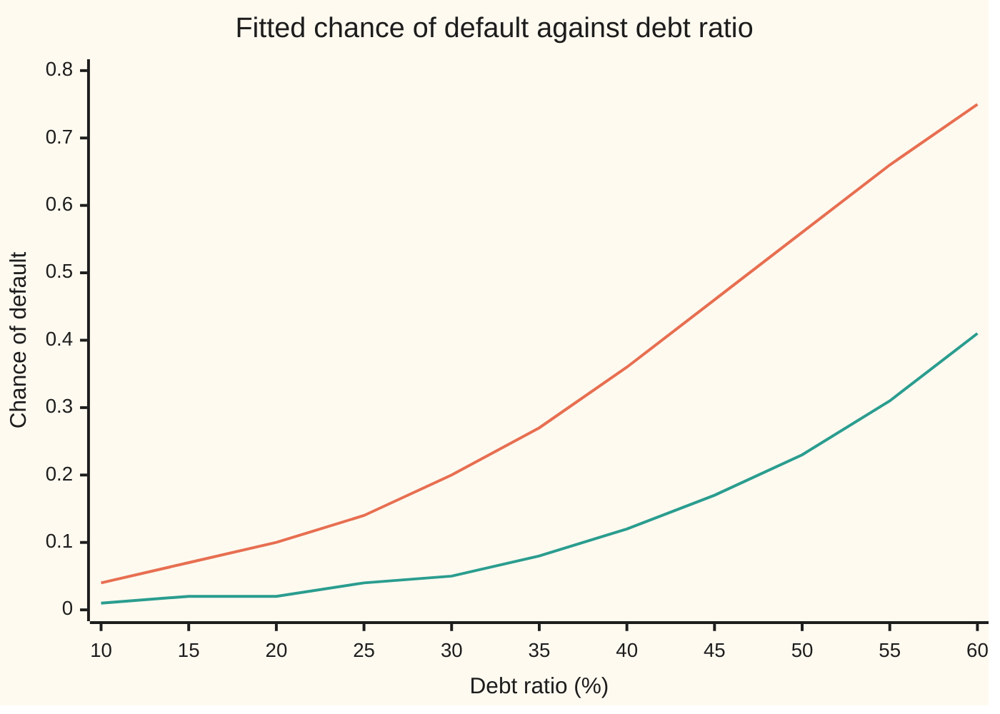
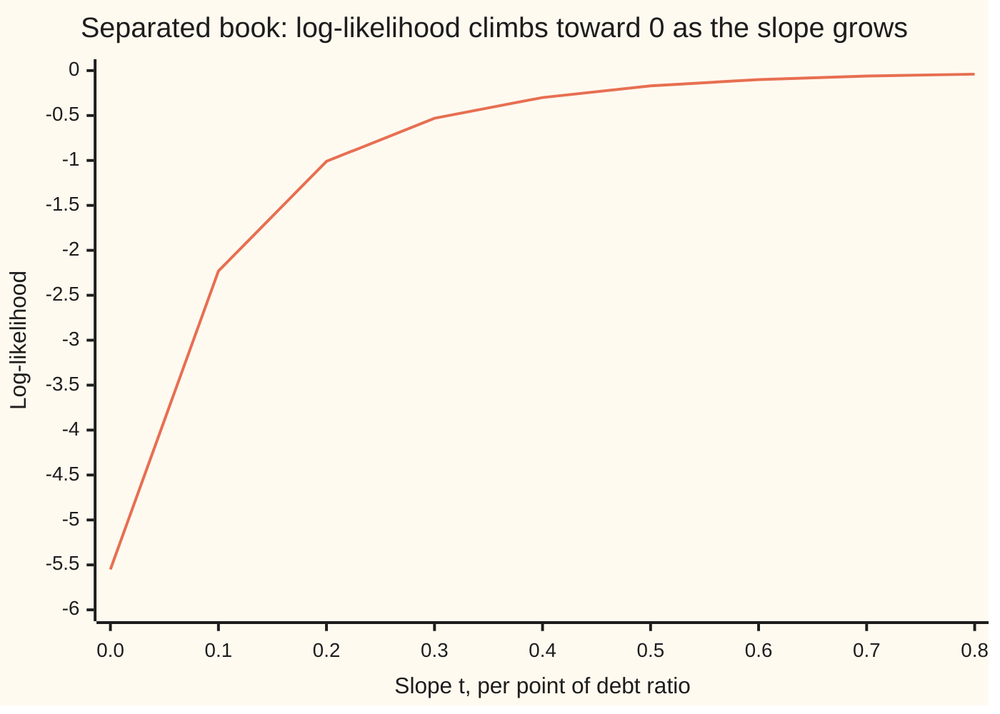

# Logistic regression: predicting a yes or no

[Syllabus](../../../SYLLABUS.md) → [Probability and statistics](../../../SYLLABUS.md#w09) → [Regression](../../../SYLLABUS.md#w09-s09) → Logistic regression

---

## General Overview

A lender keeps the records of 500 past personal loans. Each record holds three facts: the borrower's yearly income, between $25,000 and $125,000; the borrower's **debt ratio**, the share of monthly income already committed to debt payments, between 10% and 60%; and whether the loan **defaulted**, meaning the payments stopped. Of the 500 loans, 103 defaulted: a share of 0.2060, about 1 in 5.

| Loan | Income | Debt ratio | Defaulted? |
| --- | --- | --- | --- |
| 1 | $124,000 | 56% | no |
| 2 | $60,000 | 44% | yes |
| 3 | $51,000 | 25% | yes |
| 4 | $71,000 | 14% | no |

A new applicant, call her A, earns $50,000 with a debt ratio of 45%. The lender wants her chance of default. The answer must be a number between 0 and 1, and it must rise with debt and fall with income.

A straight line fitted by least squares cannot promise the first part: fitted to these 500 loans, it gives a borrower on $125,000 with a 10% debt ratio a chance of −0.2124. **Logistic regression** draws the straight line on a different scale, the log of the odds, where every number is allowed, and converts back to a chance at the end. Its answer for A is 0.4016, about 2 in 5, with a 95% interval of 0.3312 to 0.4764.

The loans on this card are simulated from a stated model with a fixed seed, so the fit can be graded against the true values.

**Logistic regression models the log-odds of a yes as a straight line in the predictors and picks the line under which the observed yeses and noes were most likely; for these 500 loans, each extra 10 points of debt ratio multiplies the odds of default by 2.2909, with a 95% interval of 1.8657 to 2.8129.**

**What kind of fact this is:** a model, since a straight line on the log-odds scale is an assumption about loans and not a law, fitted by a method, maximum likelihood; that the best fit is unique whenever it exists is a theorem proved on this card in Why it works, and the card shows a loan book where no best fit exists.

### The picture: the fitted chance of default at two incomes



First line (orange): a borrower earning $40,000. Second line (green): a borrower earning $100,000. Both are pieces of one S-shaped curve that cannot leave the band from 0 to 1. The higher income shifts the curve right: the same debt ratio carries less risk.

---

## The formula

Notation first, in words. A subscript i numbers the loans, from 1 to $n$ = 500. For loan i, $y_i$ is 1 if it defaulted and 0 if it was repaid; $x_{i1}$ is income in thousands of dollars and $x_{i2}$ is the debt ratio in percentage points. The **odds** of an event are its chance divided by the chance it fails: among the 297 loans with debt ratios under 40%, 27 defaulted, odds of 0.1000, one default for every ten loans repaid. The **log-odds** are the natural logarithm of the odds.

$$\ln\frac{p_i}{1-p_i} \;=\; z_i \;=\; \beta_0 + \beta_1 x_{i1} + \beta_2 x_{i2}, \qquad p_i = \Lambda(z_i) = \frac{1}{1+e^{-z_i}}$$

**Read it aloud:** the log-odds of default for loan i is a straight line in income and debt ratio, called the score; the chance of default is the score passed through the logistic curve.

The line is chosen by maximum likelihood. Each defaulted loan contributes its chance $p_i$, each repaid loan $1 - p_i$, and the logarithms add:

$$\ell(\beta_0,\beta_1,\beta_2) \;=\; \sum_{i=1}^{n}\Big[\,y_i \ln p_i + (1-y_i)\ln(1-p_i)\,\Big] \;=\; \sum_{i=1}^{n}\Big[\,y_i z_i - \ln\!\big(1+e^{z_i}\big)\Big]$$

**Read it aloud:** the log-likelihood adds, over every loan, the logarithm of the chance the model gave to what actually happened.

The peak is where all three slopes of $\ell$ are zero. Set to zero, they are the **likelihood equations**:

$$\sum_{i=1}^{n} (y_i - p_i) = 0, \qquad \sum_{i=1}^{n} x_{i1}(y_i - p_i) = 0, \qquad \sum_{i=1}^{n} x_{i2}(y_i - p_i) = 0$$

**Read it aloud:** at the best fit, observed minus predicted balances out overall, and balances out again when weighted by income and by debt ratio.

The first equation says the fitted chances add up to the 103 defaults seen. The bend of the log-likelihood at the peak gives the standard errors. The bend is minus the **information table**, a 3-by-3 table of sums, one entry for each pair j, k, where j and k run over 0, 1, 2, standing for the constant, income and debt ratio:

$$\sum_{i=1}^{n} w_i\, x_{ij}\, x_{ik}, \qquad w_i = p_i(1-p_i), \qquad x_{i0} = 1$$

**Read it aloud:** each loan adds its predictors' products, weighted by how uncertain the model is about it; the standard errors are the square roots of the diagonal of this table's inverse.

The coefficients are read through the odds:

$$\frac{\text{odds of default at debt ratio } x_{i2} + 10}{\text{odds of default at debt ratio } x_{i2}} \;=\; e^{10\,\beta_2}$$

**Read it aloud:** ten more points of debt ratio, income held fixed, multiply the odds of default by the same factor for every borrower.

| Symbol | Plain meaning | In our example | Push it up and the chance of default… |
| --- | --- | --- | --- |
| $n$ | the number of loans | 500 | — |
| $y_i$ | loan i's outcome: 1 defaulted, 0 repaid | loan 2: 1 | — |
| $x_{i1}$, $x_{i2}$ | income in thousands of dollars; debt ratio in percentage points | applicant A: 50 and 45 | income: falls; debt ratio: rises |
| $\beta_0$ | the intercept: the score at zero income and zero debt | estimate −2.9213 | rises everywhere |
| $\beta_1$ | change in log-odds per $1,000 of income | estimate −0.0242, SE 0.0047 | falls less steeply with income |
| $\beta_2$ | change in log-odds per point of debt ratio | estimate 0.0829, SE 0.0105 | climbs faster with debt |
| $z_i$ | the score: the log-odds of default | applicant A: −0.3987 | rises toward 1 |
| $p_i$ | the chance of default | applicant A: 0.4016 | — |
| $\Lambda$ | the logistic curve, which turns a score into a chance (some texts write σ; this wing keeps σ for the standard deviation) | Λ(−0.3987) = 0.4016 | — |
| $\ell$ | the log-likelihood | −200.0216 at the peak | — |
| $w_i$ | loan i's weight in the information table, p(1 − p) | largest, 0.25, where the chance is one half | — |
| $t$, $v$, $s_i$ | in the proofs: a distance along a path, the path's direction, and how fast loan i's score moves along it | separated book: slope t per point of debt ratio | the log-likelihood climbs toward 0 |

### When it holds

- **Loans independent of each other.** The likelihood multiplies one chance per loan. If a factory closure sinks twenty borrowers at once, the defaults cluster and the standard errors come out too small.
- **Log-odds straight in the predictors.** If risk jumps once debt passes 50%, the straight line averages the jump away, and fitted chances run high in one region and low in another. The check works in bands: group the loans by fitted chance and compare each band's average fitted chance with its observed share of defaults (Hosmer and Lemeshow's test, in the Sources, turns the gaps into one number). It is the yes-or-no form of judging a fit by what it misses, the idea of [Diagnostics](04-diagnostics-and-residuals.md).
- **Outcomes that overlap.** No straight line in income and debt may split the defaults from the repayments. If one does, even with some loans lying on the line, no finite best fit exists (Step 8).
- **The same population.** A lender's past loans were approved loans. Applicants the lender rejected never appear, so the model describes approved borrowers, not all comers.
- **Enough loans.** The curvature standard errors are a large-sample approximation. Here they agree with 400 simulated refits to within about 5%; a book of a few dozen loans gives no such promise.

---

## Why it works

### Step 0: stretch the chance until a line fits

A chance lives between 0 and 1. The odds live between 0 and infinity: a chance of 0.4016 is odds 0.6712. The log of the odds lives on the whole number line. A straight line in income and debt can take any value, so it should describe a quantity that can too. On the log-odds scale it can never produce an impossible chance.

### Step 1: convert back with the logistic curve

Solve $\ln\big(p/(1-p)\big) = z$ for the chance. Exponentiate: the odds are $e^{z}$. Then the chance is odds over one plus odds, $e^{z}/(1+e^{z})$, which is $1/(1+e^{-z})$ after dividing top and bottom by $e^{z}$. That is the logistic curve $\Lambda$. It passes through one half at score zero, flattens toward 0 on the left and 1 on the right, and is symmetric: $\Lambda(-z) = 1 - \Lambda(z)$.

Differentiate $(1+e^{-z})^{-1}$ and the slope is $e^{-z}/(1+e^{-z})^2$, which is $\Lambda(z)\,\big(1-\Lambda(z)\big)$: steepest at one half, where it is 0.25, and nearly flat near 0 or 1.

### Step 2: the likelihood of a yes-or-no record

Each loan is one Bernoulli trial, a single yes-or-no draw with its own chance ([Binomial](../03-Discrete%20Distributions/01-bernoulli-and-binomial.md)). Loan i contributes $p_i$ if it defaulted and $1 - p_i$ if not. Independence multiplies the contributions, and the logarithm turns the product into the sum in the formula.

The sum simplifies. Split $y \ln p + (1-y)\ln(1-p)$ as $y \ln\big(p/(1-p)\big) + \ln(1-p)$. The first log is the score $z$. The second is $\ln\big(1/(1+e^{z})\big) = -\ln(1+e^{z})$. So each loan adds $y z - \ln(1+e^{z})$, the second form in the formula. The check writes $\ln(1+e^{z})$ as $\max(z, 0) + \ln(1+e^{-\lvert z\rvert})$, the same number, so it never overflows.

### Step 3: the slopes, and why there is no closed form

Differentiate one loan's term in its score: $y - e^{z}/(1+e^{z}) = y - p$. The score depends on each coefficient through the chain rule: moving $\beta_1$ by one moves $z_i$ by $x_{i1}$. So the slope of $\ell$ in $\beta_1$ is the sum of $x_{i1}(y_i - p_i)$, and likewise for the other two. Setting all three to zero gives the likelihood equations.

On [Multiple regression](03-multiple-regression-and-gauss-markov.md) the same equations are linear in the coefficients and solve in one step. Here each $p_i$ bends through the logistic curve, so no formula solves them; they are solved by climbing.

### Step 4: one peak at most

Differentiate the slopes once more. Loan i's term bends by $-p_i(1-p_i) = -w_i$ in its own score, so the curvature of $\ell$ is minus the information table. Along any straight path through the coefficients, the second derivative of $\ell$ is minus a sum of weights times squares. It is never positive: $\ell$ is **concave**, shaped like a dome ([Convex functions](../../06-Calculus%20and%20analysis/07-Several%20Variables/09-convex-functions.md)). It is strictly negative unless the path leaves every score unchanged, which happens only when one predictor is an exact combination of the others.

A strictly concave dome has at most one top, and any point where all slopes are zero is that top. So when Newton's method, below, finds a point where every slope is zero, the search is over: no other coefficients fit better.

<details>
<summary>Detailed proof: one peak, and none under separation</summary>

**Concavity.** Write the path as $\beta + t v$, where $v$ is a direction with entries $v_0, v_1, v_2$, and let $s_i = v_0 + v_1 x_{i1} + v_2 x_{i2}$, the rate at which loan i's score moves. Each loan's term $y_i z_i - \ln(1+e^{z_i})$ has second derivative $-w_i$ in its score, so along the path the second derivative of $\ell$ is $-\sum_i w_i s_i^2$. Every $w_i$ is positive at finite coefficients, so the sum is zero only if the direction changes no loan's score. Unless one predictor is an exact combination of the others and the constant, no such direction exists.

**Uniqueness.** Suppose two different coefficient sets both maximise $\ell$. On the straight path between them, $\ell$ is a strictly concave function of one variable with equal values at both ends. A strictly concave function lies above its chord, so the midpoint beats both ends. Contradiction. And a point with zero slopes is the top: along every path out of it, the slope starts at zero and only decreases, so $\ell$ only falls.

**Separation.** Suppose a direction exists with $s_i > 0$ for every defaulted loan and $s_i < 0$ for every repaid one. Walk out along it, $t v$ with $t$ growing. Each defaulted loan's chance tends to 1 and each repaid loan's to 0, so $\ell$ tends to 0. At any finite coefficients each chance lies strictly between 0 and 1, so $\ell$ is strictly negative. It gets arbitrarily close to 0 and never reaches it: there is no maximum. Albert and Anderson (1984) show that separation of this kind, complete or with ties on the dividing line, is exactly when the finite maximum fails to exist.

</details>

### Step 5: climb by Newton's method

Near the current guess, replace $\ell$ by its quadratic Taylor approximation, which uses the slopes and the curvature. Jump to that quadratic's top: the step is the inverse of the information table times the slopes. Then repeat ([Newton's method](../../06-Calculus%20and%20analysis/03-What%20Derivatives%20Tell%20You/06-newtons-method.md)).

Starting from all coefficients at zero, which gives every loan a chance of one half, Newton's method reached the peak in 7 steps. There the largest slope was below 0.000000001. The fit:

| Coefficient | Estimate | Standard error | Value used to simulate |
| --- | --- | --- | --- |
| intercept | −2.9213 | 0.5091 | −2.5500 |
| income, per $1,000 | −0.0242 | 0.0047 | −0.0300 |
| debt ratio, per point | 0.0829 | 0.0105 | 0.0800 |

Each estimate lies within three standard errors of the value used to draw the data; the check asserts it. Each Newton step is also a weighted least-squares fit, with weights $w_i$, which is why statisticians call the method iteratively reweighted least squares (Nelder and Wedderburn, 1972).

### Step 6: read a coefficient as an odds multiplier

Raise the debt ratio by one point and hold income fixed. The score rises by the debt coefficient, 0.0829. The log-odds rise by the same amount, so the odds are multiplied by $e^{0.0829}$. Ten points multiply the odds by $e^{10 \times 0.0829}$ = 2.2909. The same multiplier applies to every borrower, rich or poor.

The chance does not move by a fixed amount. Applicant A, at $50,000, goes from 0.2266 at a 35% debt ratio to 0.4016 at 45% and 0.6059 at 55%. Applicant B, at $100,000, goes from 0.0246 at 20% to 0.0547 at 30%. Each step multiplies the odds by 2.2909; the change in chance depends on where the borrower sits on the S-curve. An extra $10,000 of income multiplies the odds by 0.7854, a cut of about a fifth.

These are associations in past loans: borrowers with more debt defaulted more often. Whether adding debt to a given borrower would cause a default, the fit cannot say.

### Step 7: standard errors from the bend of the peak

A sharply bent peak pins the coefficients down; a flat one does not. Invert the information table at the peak and take square roots of its diagonal: 0.5091, 0.0047 and 0.0105. Why the inverse curvature measures the spread of an estimate is shown on [Fisher information](../07-Sampling%20and%20Estimation/07-fisher-information-and-cramer-rao.md). The check draws 400 fresh loan books from the fitted model, refits each, and measures the spread of the estimates: 0.5360, 0.0047 and 0.0106.

A 95% interval is the estimate plus or minus 1.96 standard errors, 1.96 being the normal quantile $\Phi^{-1}(0.975)$ ([Confidence intervals](../08-Confidence%20Intervals%20and%20Tests/01-confidence-intervals.md)). For the debt odds multiplier it runs from 1.8657 to 2.8129. The interval is a statement about the method: across the 400 simulated books, the interval built this way caught the debt coefficient the books were drawn from in 0.9500 of them. It is not a 95% chance that this particular interval holds the truth.

### Step 8: when the peak runs away

Take a small, tidy book of eight loans. Debt ratios 20%, 25%, 30% and 35% were all repaid. Debt ratios 45%, 50%, 55% and 60% all defaulted. A dividing line at 40% separates them perfectly.

Fit the score $t \times (\text{debt ratio} - 40)$ and let $t$ grow. Every defaulted loan's chance climbs toward 1 and every repaid loan's falls toward 0. The log-likelihood rises toward 0 and never arrives.



One line: the log-likelihood of the eight loans along the path. At slope 0 every chance is one half, giving eight times ln 0.5, −5.55. It rises for ever toward a ceiling of 0.

Newton's method on this book never converges. The slope reaches 0.6777 after 5 steps, 1.6655 after 10 and 4.6654 after 25, while its curvature standard error goes from 0.7 to 16442.2. Software that stops after a fixed number of steps prints a large coefficient with an enormous standard error: a symptom of separation, not an estimate. The remedies are more data, fewer predictors, or a penalty on large coefficients ([Regularisation](06-ridge-and-lasso.md)).

### The other door

With a single yes-or-no predictor, the fit has a closed form. Split the 500 loans at a 40% debt ratio. Below it, 27 of 297 defaulted, odds 0.1000; at or above it, 76 of 203, odds 0.5984. The odds ratio is 5.9843, and its logarithm, 1.7891, is the maximum-likelihood slope: with two groups the fitted chances must equal the two observed shares. Newton's method, run on the same two groups, returns 1.7891. Logistic regression generalises the odds ratio of a 2-by-2 table.

---

## Worked numbers, by hand

Applicant A: income $50,000, debt ratio 45%. Coefficients from the fit above.

| Step | Arithmetic | Value |
| --- | --- | --- |
| intercept | from the fit | −2.9213 |
| income part | income coefficient × 50 | −1.2077 |
| debt part | debt coefficient × 45 | 3.7302 |
| score, the log-odds | −2.9213 − 1.2077 + 3.7302 (unrounded parts give −0.3987) | −0.3987 |
| odds | $e^{-0.3987}$ | 0.6712 |
| chance | 0.6712 ÷ (1 + 0.6712) | **0.4016** |
| 95% interval for the chance | score ± 1.96 standard errors, each end through the logistic curve | 0.3312 to 0.4764 |
| same applicant at a 35% debt ratio | odds 0.6712 ÷ 2.2909 | odds 0.2930, chance 0.2266 |

Among borrowers like A the model expects about 2 in 5 to default, with the data allowing about 1 in 3 to a little under 1 in 2. Ten points less debt brings it to a little over 1 in 5.

### What breaks if you drop a piece

| Mistake | Comes out at | What went wrong |
| --- | --- | --- |
| A straight line fitted by least squares instead of the logistic curve | −0.2124 for $125,000 and a 10% debt ratio; the logistic model gives 0.0060 | a line on the chance scale runs below 0 and above 1 |
| The odds multiplier 2.2909 applied to A's chance of 0.4016, for a 55% debt ratio | 0.9201; the model gives 0.6059 | odds multiply, chances do not |
| The intercept read as a typical borrower's chance | 0.0511, against an observed share of 0.2060 | the intercept is the score at zero income and zero debt, far outside the data |
| A separated book reported after 25 Newton steps | slope 4.6654, standard error 16442.2 | there is no finite peak; the software stopped, the fit did not converge |

The code prints every number in this table.

---

## Code, from first principles, and it actually runs

Both programs draw the same 500 loans from SplitMix64, a small random generator written out in each language with seed 20260928. Three roads reach the fit. Newton's method uses the slope and information formulas. A second climb measures slopes by nudging each coefficient, so its agreement tests the slope formula. The two-group model is solved by hand and by Newton. Standard errors come from the curvature and from 400 refitted books. Then come the mistakes and the separated book.

### Python

```python
# Logistic regression -- the check behind the card.  Standard library only.  500 loans drawn with
# SplitMix64 (seed 20260928, same draws as the Rust check), fitted by Newton's method, by a climb that
# nudges instead of using the slope formula, and for two groups by a 2x2 table; SEs two ways.
from math import exp, log, sqrt
M64 = (1 << 64) - 1
state = [20260928]
def unif():                               # SplitMix64: a uniform number in [0, 1)
    state[0] = (state[0] + 0x9E3779B97F4A7C15) & M64
    z = state[0]
    z = ((z ^ (z >> 30)) * 0xBF58476D1CE4E5B9) & M64
    z = ((z ^ (z >> 27)) * 0x94D049BB133111EB) & M64
    return ((z ^ (z >> 31)) >> 11) / 9007199254740992.0
def sig(z):                               # the logistic curve, written to avoid overflow
    return 1.0 / (1.0 + exp(-z)) if z >= 0 else exp(z) / (1.0 + exp(z))
def dot(b, x):
    s = 0.0
    for bj, xj in zip(b, x): s += bj * xj
    return s
def loglik(b, X, y):                      # sum of y*score - ln(1 + e^score)
    s = 0.0
    for x, yi in zip(X, y):
        z = dot(b, x)
        s += yi * z - (max(z, 0.0) + log(1.0 + exp(-abs(z))))
    return s
def solve(A, v):                          # Gaussian elimination with row swaps
    k = len(v); M = [A[i][:] + [v[i]] for i in range(k)]
    for c in range(k):
        r = max(range(c, k), key=lambda i: abs(M[i][c]))
        M[c], M[r] = M[r], M[c]
        for i in range(c + 1, k):
            f = M[i][c] / M[c][c]
            M[i] = [a - f * b for a, b in zip(M[i], M[c])]
    out = [0.0] * k
    for i in reversed(range(k)):
        s = M[i][k]
        for j in range(i + 1, k): s -= M[i][j] * out[j]
        out[i] = s / M[i][i]
    return out
def info(b, X, y):                        # the slopes and the curvature (information)
    k = len(b)
    g, H = [0.0] * k, [[0.0] * k for _ in range(k)]
    for x, yi in zip(X, y):
        p = sig(dot(b, x))
        w = p * (1.0 - p)
        for j in range(k):
            g[j] += x[j] * (yi - p)
            for m in range(k): H[j][m] += w * x[j] * x[m]
    return g, H
def newton(X, y, steps=60):               # step = curvature^-1 times slopes, from zero
    b = [0.0] * len(X[0])
    for it in range(1, steps + 1):
        g, H = info(b, X, y)
        d = solve(H, g)
        b = [bj + dj for bj, dj in zip(b, d)]
        if max(abs(v) for v in d) < 1e-10: break
    return b, it
def ses(b, X, y):                         # square roots of the inverse curvature's diagonal
    H = info(b, X, y)[1]
    return [sqrt(solve(H, [1.0 if i == j else 0.0 for i in range(len(b))])[j]) for j in range(len(b))]
def nudge(c, j, e): return [cj + (e if i == j else 0.0) for i, cj in enumerate(c)]
def show(label, v): print(f"{label:<48}{v:>12.4f}")
def row(label, vs): print(f"{label:<14}" + " ".join(f"{v:5.2f}" for v in vs))
TRUE, n = [-2.55, -0.03, 0.08], 500
X, y = [], []
for _ in range(n):                        # income $25k-$125k, debt ratio 10%-60%
    inc, debt = 25 + int(101 * unif()), 10 + int(51 * unif())
    X.append([1.0, float(inc), float(debt)])
    y.append(1 if unif() < sig(TRUE[0] + TRUE[1] * inc + TRUE[2] * debt) else 0)
print(f"loans {n}; first four (income $k, debt %, default): "
      + ", ".join(f"({x[1]:.0f}, {x[2]:.0f}, {yi})" for x, yi in zip(X[:4], y[:4])))
print(f"defaults among the {n}: {sum(y)}, a share of {sum(y) / n:.4f}")
b, its = newton(X, y)
g = info(b, X, y)[0]
se = ses(b, X, y)
Hinv = [solve(info(b, X, y)[1], [1.0 if i == j else 0.0 for i in range(3)]) for j in range(3)]
print(f"Newton steps to converge: {its}; largest slope below 1e-9: {'yes' if max(map(abs, g)) < 1e-9 else 'no'}")
show("log-likelihood at the peak", loglik(b, X, y))
m1, m2 = sum(x[1] for x in X) / n, sum(x[2] for x in X) / n     # road 2: rescale, nudge, climb
s1, s2 = (sqrt(sum((x[j] - m) ** 2 for x in X) / n) for j, m in ((1, m1), (2, m2)))
Z = [[1.0, (x[1] - m1) / s1, (x[2] - m2) / s2] for x in X]
c, h = [0.0, 0.0, 0.0], 1e-5
for _ in range(300):
    gr = [(loglik(nudge(c, j, h), Z, y) - loglik(nudge(c, j, -h), Z, y)) / (2 * h) / n for j in range(3)]
    c = [cj + 4.0 * gj for cj, gj in zip(c, gr)]
climb = [c[0] - c[1] * m1 / s1 - c[2] * m2 / s2, c[1] / s1, c[2] / s2]
reps, cover = [], 0                       # road 3: 400 fresh loan books from the fitted model
for _ in range(400):
    ys = [1 if unif() < sig(dot(b, x)) else 0 for x in X]
    r = newton(X, ys)[0]
    reps.append(r)
    if abs(r[2] - b[2]) < 1.96 * ses(r, X, ys)[2]: cover += 1
mean = [sum(r[j] for r in reps) / 400 for j in range(3)]
sim = [sqrt(sum((r[j] - mean[j]) ** 2 for r in reps) / 399) for j in range(3)]
print("coefficient     Newton   climb    truth    SE curvature  SE 400 refits")
for j, name in enumerate(("b0 intercept", "b1 income", "b2 debt")):
    print(f"{name:<13}{b[j]:9.4f}{climb[j]:9.4f}{TRUE[j]:9.4f}{se[j]:11.4f}{sim[j]:15.4f}")
show("coverage of b2 +/- 1.96 SE over 400 refits", cover / 400)
for lab, j in (("+10 points of debt ratio", 2), ("+$10k of income", 1)):
    print(f"odds ratio, {lab:<25}{exp(10 * b[j]):.4f}; 95% interval "
          f"{exp(10 * (b[j] - 1.96 * se[j])):.4f} to {exp(10 * (b[j] + 1.96 * se[j])):.4f}")
for lab, inc, debt in (("A", 50, 45), ("A, debt 35", 50, 35), ("A, debt 55", 50, 55),
                       ("B", 100, 20), ("B, debt 30", 100, 30)):
    z = b[0] + b[1] * inc + b[2] * debt
    sz = sqrt(sum(u * v * Hinv[j][k] for j, u in enumerate((1, inc, debt)) for k, v in enumerate((1, inc, debt))))
    print(f"applicant {lab:<10} income part {b[1] * inc:8.4f}  debt part {b[2] * debt:7.4f}"
          f"  score {z:8.4f}  odds {exp(z):7.4f}  chance {sig(z):.4f}, 95% {sig(z - 1.96 * sz):.4f} to {sig(z + 1.96 * sz):.4f}")
show("mistake: odds ratio used on A's chance, debt 55", sig(b[0] + 50 * b[1] + 45 * b[2]) * exp(10 * b[2]))
show("mistake: intercept as a typical chance, Λ(b0)", sig(b[0]))
ls = solve([[sum(r[j] * r[k] for r in X) for k in range(3)] for j in range(3)],
           [sum(r[j] * yi for r, yi in zip(X, y)) for j in range(3)])        # the straight line
show("mistake: straight line, income 125, debt 10", ls[0] + 125 * ls[1] + 10 * ls[2])
show("mistake: straight line, income 25, debt 60", ls[0] + 25 * ls[1] + 60 * ls[2])
show("logistic model, income 125, debt 10", sig(b[0] + 125 * b[1] + 10 * b[2]))
G = [[1.0, 1.0 if x[2] >= 40 else 0.0] for x in X]                        # two groups
nh, dh = sum(1 for r in G if r[1]), sum(yi for r, yi in zip(G, y) if r[1])
nl, dl = n - nh, sum(y) - dh
bg = newton(G, y)[0]
print(f"two groups: debt under 40%: {dl} of {nl} defaulted, odds {dl / (nl - dl):.4f}; "
      f"40% or more: {dh} of {nh}, odds {dh / (nh - dh):.4f}; ratio {dh / (nh - dh) / (dl / (nl - dl)):.4f}")
show("two groups: slope, log of the odds ratio by hand", log(dh / (nh - dh)) - log(dl / (nl - dl)))
show("two groups: slope, Newton", bg[1])
row("chart, debt", [10 + 5 * i for i in range(11)])
row("chart, $40k", [sig(b[0] + 40 * b[1] + b[2] * (10 + 5 * i)) for i in range(11)])
row("chart, $100k", [sig(b[0] + 100 * b[1] + b[2] * (10 + 5 * i)) for i in range(11)])
S = [[1.0, d] for d in (20.0, 25.0, 30.0, 35.0, 45.0, 50.0, 55.0, 60.0)]      # separated book
sy = [0, 0, 0, 0, 1, 1, 1, 1]
for k in (5, 10, 15, 20, 25):
    bs = newton(S, sy, k)[0]
    print(f"separated, {k:2d} Newton steps: slope {bs[1]:.4f}  log-lik {loglik(bs, S, sy):.10f}"
          f"  SE of slope {ses(bs, S, sy)[1]:.1f}")
ts = [0.1 * i for i in range(9)]
row("chart, t", ts)
row("chart, loglik", [loglik([-40 * t, t], S, sy) for t in ts])
assert max(abs(p - q) for p, q in zip(b, climb)) < 1e-6, "Newton and the slope-free climb must agree"
assert all(abs(b[j] - TRUE[j]) < 3 * se[j] for j in range(3)), "fit within 3 SE of the truth"
assert all(abs(sim[j] / se[j] - 1) < 0.15 for j in range(3)), "curvature SE must match the refits"
assert abs(bg[1] - (log(dh / (nh - dh)) - log(dl / (nl - dl)))) < 1e-9, "two-group closed form"
assert loglik(newton(S, sy, 25)[0], S, sy) > loglik(newton(S, sy, 20)[0], S, sy), "separation climbs"
print("ALL CHECKS PASS")
```

**Ran 2026-09-28 on macOS, Python 3.14.6, standard library only. All checks passed. Output, pasted from the run:**

```
loans 500; first four (income $k, debt %, default): (124, 56, 0), (60, 44, 1), (51, 25, 1), (71, 14, 0)
defaults among the 500: 103, a share of 0.2060
Newton steps to converge: 7; largest slope below 1e-9: yes
log-likelihood at the peak                         -200.0216
coefficient     Newton   climb    truth    SE curvature  SE 400 refits
b0 intercept   -2.9213  -2.9213  -2.5500     0.5091         0.5360
b1 income      -0.0242  -0.0242  -0.0300     0.0047         0.0047
b2 debt         0.0829   0.0829   0.0800     0.0105         0.0106
coverage of b2 +/- 1.96 SE over 400 refits            0.9500
odds ratio, +10 points of debt ratio 2.2909; 95% interval 1.8657 to 2.8129
odds ratio, +$10k of income          0.7854; 95% interval 0.7162 to 0.8614
applicant A          income part  -1.2077  debt part  3.7302  score  -0.3987  odds  0.6712  chance 0.4016, 95% 0.3312 to 0.4764
applicant A, debt 35 income part  -1.2077  debt part  2.9013  score  -1.2276  odds  0.2930  chance 0.2266, 95% 0.1752 to 0.2878
applicant A, debt 55 income part  -1.2077  debt part  4.5592  score   0.4302  odds  1.5376  chance 0.6059, 95% 0.5057 to 0.6980
applicant B          income part  -2.4153  debt part  1.6579  score  -3.6787  odds  0.0253  chance 0.0246, 95% 0.0129 to 0.0464
applicant B, debt 30 income part  -2.4153  debt part  2.4868  score  -2.8498  odds  0.0579  chance 0.0547, 95% 0.0338 to 0.0873
mistake: odds ratio used on A's chance, debt 55       0.9201
mistake: intercept as a typical chance, Λ(b0)         0.0511
mistake: straight line, income 125, debt 10          -0.2124
mistake: straight line, income 25, debt 60            0.6242
logistic model, income 125, debt 10                   0.0060
two groups: debt under 40%: 27 of 297 defaulted, odds 0.1000; 40% or more: 76 of 203, odds 0.5984; ratio 5.9843
two groups: slope, log of the odds ratio by hand      1.7891
two groups: slope, Newton                             1.7891
chart, debt   10.00 15.00 20.00 25.00 30.00 35.00 40.00 45.00 50.00 55.00 60.00
chart, $40k    0.04  0.07  0.10  0.14  0.20  0.27  0.36  0.46  0.56  0.66  0.75
chart, $100k   0.01  0.02  0.02  0.04  0.05  0.08  0.12  0.17  0.23  0.31  0.41
separated,  5 Newton steps: slope 0.6777  log-lik -0.0687496695  SE of slope 0.7
separated, 10 Newton steps: slope 1.6655  log-lik -0.0004835514  SE of slope 9.1
separated, 15 Newton steps: slope 2.6654  log-lik -0.0000032590  SE of slope 110.8
separated, 20 Newton steps: slope 3.6654  log-lik -0.0000000220  SE of slope 1349.7
separated, 25 Newton steps: slope 4.6654  log-lik -0.0000000001  SE of slope 16442.2
chart, t       0.00  0.10  0.20  0.30  0.40  0.50  0.60  0.70  0.80
chart, loglik -5.55 -2.23 -1.01 -0.53 -0.30 -0.17 -0.10 -0.06 -0.04
ALL CHECKS PASS
```

### Rust

Same numbers, same labels, built with `rustc --edition 2021 -O`.

```rust
// Logistic regression -- the same check as the Python, in Rust, no crates.  500 loans drawn with
// SplitMix64 (seed 20260928, same draws as the Python), fitted by Newton's method, by a climb that
// nudges instead of using the slope formula, and for two groups by a 2x2 table; SEs two ways.
struct Rng(u64);
impl Rng {
    fn unif(&mut self) -> f64 {                   // SplitMix64: a uniform number in [0, 1)
        self.0 = self.0.wrapping_add(0x9E3779B97F4A7C15);
        let mut z = self.0;
        z = (z ^ (z >> 30)).wrapping_mul(0xBF58476D1CE4E5B9);
        z = (z ^ (z >> 27)).wrapping_mul(0x94D049BB133111EB);
        ((z ^ (z >> 31)) >> 11) as f64 / 9007199254740992.0
    }
}
fn sig(z: f64) -> f64 {                           // the logistic curve, written to avoid overflow
    if z >= 0.0 { 1.0 / (1.0 + (-z).exp()) } else { z.exp() / (1.0 + z.exp()) }
}
fn dot(b: &[f64], x: &[f64]) -> f64 { b.iter().zip(x).fold(0.0, |s, (bj, xj)| s + bj * xj) }
fn loglik(b: &[f64], xs: &[Vec<f64>], y: &[u8]) -> f64 {   // sum of y*score - ln(1 + e^score)
    let mut s = 0.0;
    for (x, &yi) in xs.iter().zip(y) {
        let z = dot(b, x);
        s += yi as f64 * z - (z.max(0.0) + (1.0 + (-z.abs()).exp()).ln());
    }
    s
}
fn solve(a: &[Vec<f64>], v: &[f64]) -> Vec<f64> {   // Gaussian elimination with row swaps
    let k = v.len();
    let mut m: Vec<Vec<f64>> = (0..k).map(|i| { let mut r = a[i].clone(); r.push(v[i]); r }).collect();
    for c in 0..k {
        let mut r = c;
        for i in c + 1..k { if m[i][c].abs() > m[r][c].abs() { r = i } }
        m.swap(c, r);
        for i in c + 1..k {
            let f = m[i][c] / m[c][c];
            for j in 0..=k { m[i][j] = m[i][j] - f * m[c][j] }
        }
    }
    let mut out = vec![0.0; k];
    for i in (0..k).rev() {
        let mut s = m[i][k];
        for j in i + 1..k { s -= m[i][j] * out[j] }
        out[i] = s / m[i][i];
    }
    out
}
fn info(b: &[f64], xs: &[Vec<f64>], y: &[u8]) -> (Vec<f64>, Vec<Vec<f64>>) {  // slopes, curvature
    let k = b.len();
    let (mut g, mut h) = (vec![0.0; k], vec![vec![0.0; k]; k]);
    for (x, &yi) in xs.iter().zip(y) {
        let p = sig(dot(b, x)); let w = p * (1.0 - p);
        for j in 0..k {
            g[j] += x[j] * (yi as f64 - p);
            for m in 0..k { h[j][m] += w * x[j] * x[m] }
        }
    }
    (g, h)
}
fn newton(xs: &[Vec<f64>], y: &[u8], steps: usize) -> (Vec<f64>, usize) {  // from zero
    let mut b = vec![0.0; xs[0].len()];
    for it in 1..=steps {
        let (g, h) = info(&b, xs, y);
        let d = solve(&h, &g);
        for j in 0..b.len() { b[j] += d[j] }
        if d.iter().fold(0.0f64, |a, v| a.max(v.abs())) < 1e-10 { return (b, it) }
    }
    (b, steps)
}
fn ses(b: &[f64], xs: &[Vec<f64>], y: &[u8]) -> Vec<f64> {  // roots of inverse curvature's diagonal
    let h = info(b, xs, y).1;
    (0..b.len()).map(|j| solve(&h, &(0..b.len()).map(|i| if i == j { 1.0 } else { 0.0 }).collect::<Vec<f64>>())[j].sqrt()).collect()
}
fn nudge(c: &[f64], j: usize, e: f64) -> Vec<f64> { c.iter().enumerate().map(|(i, cj)| cj + if i == j { e } else { 0.0 }).collect() }
fn show(label: &str, v: f64) { println!("{:<48}{:>12.4}", label, v) }
fn row(label: &str, vs: &[f64]) { println!("{:<14}{}", label, vs.iter().map(|v| format!("{:5.2}", v)).collect::<Vec<_>>().join(" ")) }
fn main() {
    let tru = [-2.55, -0.03, 0.08];
    let mut rng = Rng(20260928);
    let (mut xs, mut y): (Vec<Vec<f64>>, Vec<u8>) = (vec![], vec![]);
    for _ in 0..500 {                             // income $25k-$125k, debt ratio 10%-60%
        let (inc, debt) = (25.0 + (101.0 * rng.unif()).floor(), 10.0 + (51.0 * rng.unif()).floor());
        xs.push(vec![1.0, inc, debt]);
        y.push(if rng.unif() < sig(tru[0] + tru[1] * inc + tru[2] * debt) { 1 } else { 0 });
    }
    let (n, ny) = (y.len() as f64, y.iter().map(|&v| v as usize).sum::<usize>());
    let first: Vec<String> = (0..4).map(|i| format!("({:.0}, {:.0}, {})", xs[i][1], xs[i][2], y[i])).collect();
    println!("loans {}; first four (income $k, debt %, default): {}", y.len(), first.join(", "));
    println!("defaults among the {}: {}, a share of {:.4}", y.len(), ny, ny as f64 / n);
    let (b, its) = newton(&xs, &y, 60);
    let g = info(&b, &xs, &y).0;
    let se = ses(&b, &xs, &y);
    let hinv: Vec<Vec<f64>> = (0..3).map(|j| solve(&info(&b, &xs, &y).1, &(0..3).map(|i| if i == j { 1.0 } else { 0.0 }).collect::<Vec<f64>>())).collect();
    let small = g.iter().fold(0.0f64, |a, v| a.max(v.abs())) < 1e-9;
    println!("Newton steps to converge: {}; largest slope below 1e-9: {}", its, if small { "yes" } else { "no" });
    show("log-likelihood at the peak", loglik(&b, &xs, &y));
    let mean = |j: usize| xs.iter().fold(0.0, |a, x| a + x[j]) / n;       // road 2: rescale, nudge, climb
    let (m1, m2) = (mean(1), mean(2));
    let sd = |j: usize, m: f64| (xs.iter().fold(0.0, |a, x| a + (x[j] - m).powi(2)) / n).sqrt();
    let (s1, s2) = (sd(1, m1), sd(2, m2));
    let zs: Vec<Vec<f64>> = xs.iter().map(|x| vec![1.0, (x[1] - m1) / s1, (x[2] - m2) / s2]).collect();
    let (mut c, h) = (vec![0.0; 3], 1e-5);
    for _ in 0..300 {
        let gr: Vec<f64> = (0..3).map(|j| (loglik(&nudge(&c, j, h), &zs, &y) - loglik(&nudge(&c, j, -h), &zs, &y)) / (2.0 * h) / n).collect();
        for j in 0..3 { c[j] = c[j] + 4.0 * gr[j] }
    }
    let climb = [c[0] - c[1] * m1 / s1 - c[2] * m2 / s2, c[1] / s1, c[2] / s2];
    let (mut reps, mut cover): (Vec<Vec<f64>>, usize) = (vec![], 0);   // road 3: 400 fresh loan books
    for _ in 0..400 {
        let ys: Vec<u8> = xs.iter().map(|x| if rng.unif() < sig(dot(&b, x)) { 1 } else { 0 }).collect();
        let r = newton(&xs, &ys, 60).0;
        if (r[2] - b[2]).abs() < 1.96 * ses(&r, &xs, &ys)[2] { cover += 1 }
        reps.push(r);
    }
    let rm: Vec<f64> = (0..3).map(|j| reps.iter().fold(0.0, |a, r| a + r[j]) / 400.0).collect();
    let sim: Vec<f64> = (0..3).map(|j| (reps.iter().fold(0.0, |a, r| a + (r[j] - rm[j]).powi(2)) / 399.0).sqrt()).collect();
    println!("coefficient     Newton   climb    truth    SE curvature  SE 400 refits");
    for (j, name) in ["b0 intercept", "b1 income", "b2 debt"].iter().enumerate() {
        println!("{:<13}{:9.4}{:9.4}{:9.4}{:11.4}{:15.4}", name, b[j], climb[j], tru[j], se[j], sim[j]);
    }
    show("coverage of b2 +/- 1.96 SE over 400 refits", cover as f64 / 400.0);
    for (lab, j) in [("+10 points of debt ratio", 2), ("+$10k of income", 1)] {
        println!("odds ratio, {:<25}{:.4}; 95% interval {:.4} to {:.4}", lab, (10.0 * b[j]).exp(),
                 (10.0 * (b[j] - 1.96 * se[j])).exp(), (10.0 * (b[j] + 1.96 * se[j])).exp());
    }
    for (lab, inc, debt) in [("A", 50.0, 45.0), ("A, debt 35", 50.0, 35.0), ("A, debt 55", 50.0, 55.0),
                             ("B", 100.0, 20.0), ("B, debt 30", 100.0, 30.0)] {
        let (z, xv) = (b[0] + b[1] * inc + b[2] * debt, [1.0, inc, debt]);
        let sz = (0..3).fold(0.0, |a, j| (0..3).fold(a, |a, k| a + xv[j] * xv[k] * hinv[j][k])).sqrt();
        println!("applicant {:<10} income part {:8.4}  debt part {:7.4}  score {:8.4}  odds {:7.4}  chance {:.4}, 95% {:.4} to {:.4}",
                 lab, b[1] * inc, b[2] * debt, z, z.exp(), sig(z), sig(z - 1.96 * sz), sig(z + 1.96 * sz));
    }
    show("mistake: odds ratio used on A's chance, debt 55", sig(b[0] + 50.0 * b[1] + 45.0 * b[2]) * (10.0 * b[2]).exp());
    show("mistake: intercept as a typical chance, Λ(b0)", sig(b[0]));
    let xtx: Vec<Vec<f64>> = (0..3).map(|j| (0..3).map(|k| xs.iter().fold(0.0, |a, r| a + r[j] * r[k])).collect()).collect();
    let xty: Vec<f64> = (0..3).map(|j| xs.iter().zip(&y).fold(0.0, |a, (r, &yi)| a + r[j] * yi as f64)).collect();
    let ls = solve(&xtx, &xty);                    // the straight line
    show("mistake: straight line, income 125, debt 10", ls[0] + 125.0 * ls[1] + 10.0 * ls[2]);
    show("mistake: straight line, income 25, debt 60", ls[0] + 25.0 * ls[1] + 60.0 * ls[2]);
    show("logistic model, income 125, debt 10", sig(b[0] + 125.0 * b[1] + 10.0 * b[2]));
    let gx: Vec<Vec<f64>> = xs.iter().map(|x| vec![1.0, if x[2] >= 40.0 { 1.0 } else { 0.0 }]).collect();
    let nh = gx.iter().filter(|r| r[1] == 1.0).count();
    let dh: usize = gx.iter().zip(&y).filter(|(r, _)| r[1] == 1.0).map(|(_, &v)| v as usize).sum();
    let (nl, dl) = (500 - nh, ny - dh);
    let bg = newton(&gx, &y, 60).0;
    let by_hand = (dh as f64 / (nh - dh) as f64).ln() - (dl as f64 / (nl - dl) as f64).ln();
    let (ol, oh) = (dl as f64 / (nl - dl) as f64, dh as f64 / (nh - dh) as f64);
    println!("two groups: debt under 40%: {} of {} defaulted, odds {:.4}; 40% or more: {} of {}, odds {:.4}; ratio {:.4}",
             dl, nl, ol, dh, nh, oh, oh / ol);
    show("two groups: slope, log of the odds ratio by hand", by_hand);
    show("two groups: slope, Newton", bg[1]);
    row("chart, debt", &(0..11).map(|i| 10.0 + 5.0 * i as f64).collect::<Vec<f64>>());
    for (lab, inc) in [("chart, $40k", 40.0), ("chart, $100k", 100.0)] {
        row(lab, &(0..11).map(|i| sig(b[0] + inc * b[1] + b[2] * (10.0 + 5.0 * i as f64))).collect::<Vec<f64>>());
    }
    let sx: Vec<Vec<f64>> = [20.0, 25.0, 30.0, 35.0, 45.0, 50.0, 55.0, 60.0].iter().map(|&d| vec![1.0, d]).collect();
    let sy: Vec<u8> = vec![0, 0, 0, 0, 1, 1, 1, 1];            // separated book
    for k in [5, 10, 15, 20, 25] {
        let bs = newton(&sx, &sy, k).0;
        println!("separated, {:2} Newton steps: slope {:.4}  log-lik {:.10}  SE of slope {:.1}",
                 k, bs[1], loglik(&bs, &sx, &sy), ses(&bs, &sx, &sy)[1]);
    }
    let ts: Vec<f64> = (0..9).map(|i| 0.1 * i as f64).collect();
    row("chart, t", &ts);
    row("chart, loglik", &ts.iter().map(|&t| loglik(&[-40.0 * t, t], &sx, &sy)).collect::<Vec<f64>>());
    assert!((0..3).all(|j| (b[j] - climb[j]).abs() < 1e-6), "Newton and the slope-free climb must agree");
    assert!((0..3).all(|j| (b[j] - tru[j]).abs() < 3.0 * se[j]), "fit within 3 SE of the truth");
    assert!((0..3).all(|j| (sim[j] / se[j] - 1.0).abs() < 0.15), "curvature SE must match the refits");
    assert!((bg[1] - by_hand).abs() < 1e-9, "two-group closed form");
    assert!(loglik(&newton(&sx, &sy, 25).0, &sx, &sy) > loglik(&newton(&sx, &sy, 20).0, &sx, &sy), "separation climbs");
    println!("ALL CHECKS PASS");
}
```

**Ran 2026-09-28 on macOS, rustc 1.98.1, no crates. All checks passed. Output, pasted from the run:**

```
loans 500; first four (income $k, debt %, default): (124, 56, 0), (60, 44, 1), (51, 25, 1), (71, 14, 0)
defaults among the 500: 103, a share of 0.2060
Newton steps to converge: 7; largest slope below 1e-9: yes
log-likelihood at the peak                         -200.0216
coefficient     Newton   climb    truth    SE curvature  SE 400 refits
b0 intercept   -2.9213  -2.9213  -2.5500     0.5091         0.5360
b1 income      -0.0242  -0.0242  -0.0300     0.0047         0.0047
b2 debt         0.0829   0.0829   0.0800     0.0105         0.0106
coverage of b2 +/- 1.96 SE over 400 refits            0.9500
odds ratio, +10 points of debt ratio 2.2909; 95% interval 1.8657 to 2.8129
odds ratio, +$10k of income          0.7854; 95% interval 0.7162 to 0.8614
applicant A          income part  -1.2077  debt part  3.7302  score  -0.3987  odds  0.6712  chance 0.4016, 95% 0.3312 to 0.4764
applicant A, debt 35 income part  -1.2077  debt part  2.9013  score  -1.2276  odds  0.2930  chance 0.2266, 95% 0.1752 to 0.2878
applicant A, debt 55 income part  -1.2077  debt part  4.5592  score   0.4302  odds  1.5376  chance 0.6059, 95% 0.5057 to 0.6980
applicant B          income part  -2.4153  debt part  1.6579  score  -3.6787  odds  0.0253  chance 0.0246, 95% 0.0129 to 0.0464
applicant B, debt 30 income part  -2.4153  debt part  2.4868  score  -2.8498  odds  0.0579  chance 0.0547, 95% 0.0338 to 0.0873
mistake: odds ratio used on A's chance, debt 55       0.9201
mistake: intercept as a typical chance, Λ(b0)         0.0511
mistake: straight line, income 125, debt 10          -0.2124
mistake: straight line, income 25, debt 60            0.6242
logistic model, income 125, debt 10                   0.0060
two groups: debt under 40%: 27 of 297 defaulted, odds 0.1000; 40% or more: 76 of 203, odds 0.5984; ratio 5.9843
two groups: slope, log of the odds ratio by hand      1.7891
two groups: slope, Newton                             1.7891
chart, debt   10.00 15.00 20.00 25.00 30.00 35.00 40.00 45.00 50.00 55.00 60.00
chart, $40k    0.04  0.07  0.10  0.14  0.20  0.27  0.36  0.46  0.56  0.66  0.75
chart, $100k   0.01  0.02  0.02  0.04  0.05  0.08  0.12  0.17  0.23  0.31  0.41
separated,  5 Newton steps: slope 0.6777  log-lik -0.0687496695  SE of slope 0.7
separated, 10 Newton steps: slope 1.6655  log-lik -0.0004835514  SE of slope 9.1
separated, 15 Newton steps: slope 2.6654  log-lik -0.0000032590  SE of slope 110.8
separated, 20 Newton steps: slope 3.6654  log-lik -0.0000000220  SE of slope 1349.7
separated, 25 Newton steps: slope 4.6654  log-lik -0.0000000001  SE of slope 16442.2
chart, t       0.00  0.10  0.20  0.30  0.40  0.50  0.60  0.70  0.80
chart, loglik -5.55 -2.23 -1.01 -0.53 -0.30 -0.17 -0.10 -0.06 -0.04
ALL CHECKS PASS
```

The two outputs match line for line.

> [!TIP]
> **Try changing**
> Guess first, then run the Python.
> - **Four times the loans.** Set `n` to 2000 on the `TRUE, n` line. Standard errors should halve. They do: the debt coefficient comes out at 0.0761 with standard error 0.0052, and the odds multiplier's interval narrows to 1.9327 to 2.3689.
> - **Break the separation.** In the eight-loan book, set `sy` to `[0, 0, 1, 0, 1, 1, 1, 1]`, so the loan at 30% defaults. Now no line splits the outcomes. Newton's method settles at a slope of 0.2223 with standard error 0.2 after 5 steps and stays there, and the last assert stops the run, since the log-likelihood no longer climbs.
> - **Stop the climb early.** Change `range(300)` in the slope-free climb to `range(20)`. The climb stops short, at an intercept of −2.9095, and the first assert stops the run: two roads that disagree are caught.

---

## The usual mistake

> [!warning]
> **Reading a coefficient as a change in chance.** The debt coefficient 0.0829 is a change in log-odds per point. Its odds multiplier, 2.2909 per ten points, is not a risk multiplier: applied to A's chance of 0.4016 it gives 0.9201, while the model's answer is 0.6059. Convert through the odds, then back through the logistic curve.
>
> - **Trusting a huge coefficient.** A slope of 4.6654 with a standard error of 16442.2 is separation, not a strong effect. Check whether a line splits the outcomes.
> - **Reading the intercept as a baseline chance.** The logistic curve of the intercept is 0.0511, the chance for a borrower with no income and no debt. No such borrower is in the data; the observed default share is 0.2060.
> - **Calling an association a cause.** Borrowers with higher debt ratios defaulted more often. Whether more debt would push a given borrower into default is a different question, which needs a design, not a fit.

---

## Where you meet it in real life

- **Credit scoring.** Many lenders' scorecards are logistic regressions, with the log-odds rescaled into points. A bank's estimated chance of default then feeds its capital calculation on [The Basel credit formula](../../12-Financial%20mathematics/48-Regulatory%20Capital%20in%20Outline/03-vasicek-asrf-and-credit-capital.md).
- **Medicine.** Odds ratios for smoking, age or a gene in studies of disease risk are exponentials of logistic regression coefficients.
- **Machine learning.** A single artificial neuron with a logistic output, trained on yes-or-no labels by minimising cross-entropy, is exactly this model fitted by maximum likelihood (The perceptron and its stack).
- **Checking predictions.** Whether a model predicts new loans as well as old ones is judged by holding some back, on [Overfitting](08-cross-validation-and-overfitting.md).

> **Say it back**
> A chance must stay between 0 and 1, so logistic regression draws its straight line on the log-odds scale and converts back through the logistic curve. The line is chosen by maximum likelihood; the log-likelihood is a dome, so there is at most one best fit, and Newton's method finds it in a few steps. A coefficient multiplies the odds by a fixed factor, but the change in chance depends on where the borrower starts. Standard errors come from the bend of the dome. If a line separates the yeses from the noes, the dome has no top and the coefficients run off to infinity.

---

## What this builds on

- [Multiple regression](03-multiple-regression-and-gauss-markov.md): a straight line in several predictors, fitted by normal equations; this card keeps the line and changes the scale.
- [Maximum likelihood](../07-Sampling%20and%20Estimation/04-maximum-likelihood.md): the rule that picks the coefficients, the failure at an edge, and the curvature standard error.
- [Newton's method](../../06-Calculus%20and%20analysis/03-What%20Derivatives%20Tell%20You/06-newtons-method.md) and [Convex functions](../../06-Calculus%20and%20analysis/07-Several%20Variables/09-convex-functions.md): the climb, and why a dome has one top.

## Where this goes next

- [Cox regression in outline](../13-Survival%2C%20Design%20and%20Causality/03-cox-proportional-hazards-in-outline.md): not whether a loan defaults but when, with coefficients read as hazard multipliers.
- The perceptron and its stack: logistic units stacked in layers, fitted by the same likelihood.
- Softmax and cross-entropy: more than two outcomes, one score each.
- Support vector machines: a dividing line chosen for its margin rather than its likelihood, which welcomes the separation that breaks this fit.

This card sorts each loan into two outcomes; when there are three or more, such as repaid, late and defaulted, the log-odds line becomes one score per outcome, and how those scores share out the chance is Softmax and cross-entropy.

---

## Sources

Verified 28 Sep 2026: every link below resolves to the publisher's page.

- Cox, D. R. "The Regression Analysis of Binary Sequences." *Journal of the Royal Statistical Society, Series B* 20, no. 2 (1958): 215–232. [doi:10.1111/j.2517-6161.1958.tb00292.x](https://doi.org/10.1111/j.2517-6161.1958.tb00292.x). The paper that set the logistic model up for yes-or-no outcomes.
- Albert, A., and J. A. Anderson. "On the Existence of Maximum Likelihood Estimates in Logistic Regression Models." *Biometrika* 71, no. 1 (1984): 1–10. [doi:10.1093/biomet/71.1.1](https://doi.org/10.1093/biomet/71.1.1). Separation, and exactly when a finite fit exists.
- Nelder, J. A., and R. W. M. Wedderburn. "Generalized Linear Models." *Journal of the Royal Statistical Society, Series A* 135, no. 3 (1972): 370–384. [doi:10.2307/2344614](https://doi.org/10.2307/2344614). Newton's method as iteratively reweighted least squares.
- Hosmer, David W., Jr., Stanley Lemeshow, and Rodney X. Sturdivant. *Applied Logistic Regression*, 3rd ed. Wiley, 2013. [Publisher page](https://www.wiley.com/en-us/Applied+Logistic+Regression%2C+3rd+Edition-p-9780470582473). Fitting, reading odds ratios, and checking the fit.
- Agresti, Alan. *Categorical Data Analysis*, 3rd ed. Wiley, 2013. [Publisher page](https://www.wiley.com/en-us/Categorical+Data+Analysis%2C+3rd+Edition-p-9780470463635). The likelihood, the information table and the 2-by-2 odds ratio in one framework.
