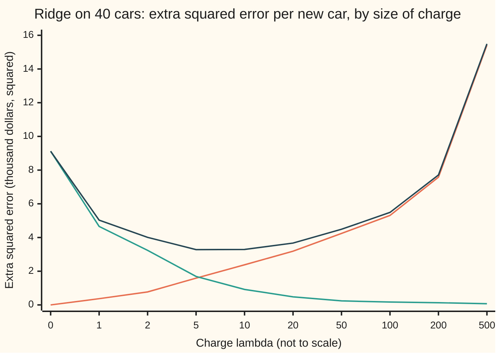
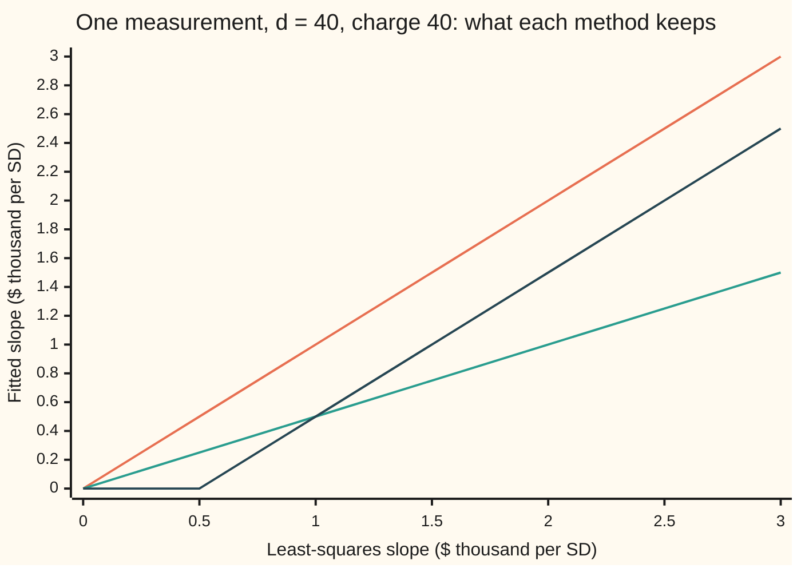
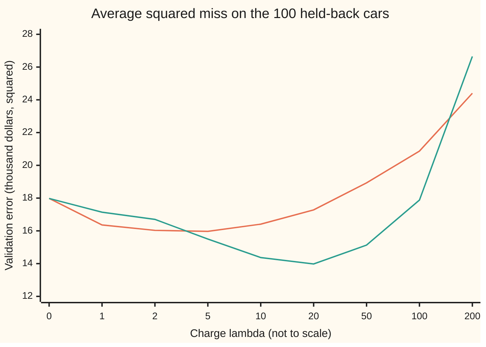

# Regularisation: shrinking coefficients to trade bias for stability

[Syllabus](../../../SYLLABUS.md) → [Probability and statistics](../README.md) → [Regression](../README.md#s09) → Regularisation

---

## General Overview

A used-car dealer prices trade-ins from twenty measurements taken when a car comes in: age, odometer reading, number of owners, service stamps, tyre tread and fifteen more. Each is **standardised**: measured from the dealer's average car, in units of its own standard deviation, and turned so that a higher number means a better car. The twenty move together. An old car tends to have high mileage, worn tyres and more owners, so here every pair of measurements is correlated 0.8.

This dealer is a simulation, which is what makes it useful: the true pricing rule is known. The average car sells for $15,000. Only three measurements matter. One standard deviation on the first adds $4,000, on the second $3,000, on the third $2,000; the other seventeen add nothing. Each sale also misses the rule by random noise with a standard deviation of $3,000. The dealer has 40 past sales to fit and 100 more held back. Prices below are in thousands of dollars.

Ordinary least squares, the fit of [Multiple regression](03-multiple-regression-and-gauss-markov.md), gets the first three slopes in the right order: 4.27, 4.00 and 2.19, against a true 4, 3 and 2. It also gives the sixth measurement, worth nothing, a slope of −2.53. On new cars its average squared miss is 16.70. A dealer who knew the true rule would still have an average squared miss of 9.00, the noise alone; the rest is avoidable.

The cause is the correlation. Forty sales pin down what the twenty measurements do together, but barely how they differ, so a little noise swings the split of credit between near-twins a long way.

**Regularisation** fits with a charge on large coefficients. **Ridge** charges their sum of squares; **lasso** charges their sum of sizes, and can set some exactly to zero. With the charge picked on the 100 held-back cars, the average squared miss on new cars is 12.42 for ridge and 11.41 for lasso. Both aim the coefficients away from the truth, a **bias** accepted on purpose, and in exchange the coefficients stop swinging with the noise: less **variance**.

**A charge on the size of the coefficients shrinks their overall size toward zero, though a single slope can grow (under ridge the fifth goes from 0.32 to 0.64); it adds a small bias and removes much more variance along the directions the data barely measure, and the charge is set by how well the fit predicts cars it has not seen.**

**What kind of fact this is:** a method: ridge and lasso are recipes chosen for their results, not laws. Inside the method sits a theorem, the exact bias and variance of ridge for a fixed charge, proved on this card in Why it works.

### The picture: the charge against the error it causes

For each size of charge, the checks compute exactly the extra squared error the fitted slopes add to a new car's price, averaged over every noise the 40 sales could have carried, their measurements held fixed.



Orange: the squared bias, zero with no charge and climbing. Green: the variance, 9.12 with no charge and collapsing. Dark blue: their sum, lowest at 3.28 when the charge is 5, against 9.12 for plain least squares.

---

## The formula

Reminders of the notation. A hat marks an estimate: $\hat b_j$ is the fitted slope, the true one is $\beta_j$. The table of measurements is a matrix $X$, one row per car and one column per measurement, and $X^\top$ is that table turned on its side, as on the multiple-regression card. Every column of $X$ is centred (its average subtracted), so $G = X^\top X$ holds each pair of columns' summed products.

Ridge picks the intercept $a$ and the twenty slopes that make one total smallest:

$$\text{ridge:}\quad \sum_{i=1}^{n}\Big(y_i - a - \sum_{j=1}^{p} x_{ij} b_j\Big)^2 \;+\; \lambda \sum_{j=1}^{p} b_j^2$$

**Read it aloud:** the squared misses on the cars already sold, plus lambda times the sum of the squared slopes.

Lasso changes only the charge:

$$\text{lasso:}\quad \sum_{i=1}^{n}\Big(y_i - a - \sum_{j=1}^{p} x_{ij} b_j\Big)^2 \;+\; \lambda \sum_{j=1}^{p} |b_j|$$

**Read it aloud:** the same squared misses, plus lambda times the sum of the slopes' sizes, signs ignored.

The intercept is never charged; with centred columns it drops out, and ridge's slopes have a formula:

$$\hat b_{\text{ridge}} = (G + \lambda I)^{-1} X^\top y$$

**Read it aloud:** least squares with lambda added down the diagonal before solving.

Lasso has no formula. It is found one slope at a time, each set by the **soft-threshold** rule, which moves a number toward zero by a fixed amount and stops at zero. In it, sign(r) is +1, 0 or −1 as r is positive, zero or negative:

$$b_j = \frac{S(r_j,\ \lambda/2)}{G_{jj}}, \qquad S(r, t) = \operatorname{sign}(r)\,\max(|r| - t,\ 0), \qquad r_j = (X^\top y)_j - \sum_{k \ne j} G_{jk}\, b_k$$

**Read it aloud:** take what measurement j explains once the others have had their say, knock lambda over two off its size, and scale.

| Symbol | Plain meaning | In our example | Push it up and the answer… |
| --- | --- | --- | --- |
| $y_i$ | the price of car i, in thousands of dollars | 15 for the average car, give or take the noise | — |
| $X$, $x_{ij}$, $n$, $p$ | the centred table of measurements; $x_{ij}$ is measurement j on car i; n cars, p measurements | 40 cars, 20 measurements | more cars: every method improves and the charge matters less |
| $a$ | the intercept: the price of an average car | 14.67 for ridge at charge 5 | — |
| $b_j$ | the fitted slope for measurement j: dollars per standard deviation | ridge 2.05 for the first | — |
| $\beta_j$ | the true slope, known only because this is a simulation | 4, 3, 2, then seventeen zeros | — |
| $\lambda$ | lambda, the charge per unit of coefficient size | 5 for ridge, 20 for lasso, picked on held-back cars | the slopes' overall size shrinks; bias up, variance down |
| $\sigma$ | the noise: SD of a price around the true rule | 3, so squared noise 9.00 | every error grows; the best charge grows |
| $G$, $I$ | $G = X^\top X$, the columns' summed products; $I$ the identity matrix, ones down its diagonal | a 20 by 20 table | — |
| $d_j$ | the strength of direction j in $G$: how much the 40 cars vary along it | 741.9 at most, 0.86 at least | least squares' variance there falls, as $\sigma^2/d_j$ |
| $\theta_j$ | the true slopes measured along direction j | — | a large one makes shrinking it costly |
| $S$ | the soft-threshold: pull toward zero by t, stop at zero | S(2.00, 0.5) = 1.50 | — |
| $r_j$ | what measurement j explains once the others are fitted | recomputed on every pass | — |

### When it holds

- **Measurements on a common scale.** The charge counts coefficient size in the columns' own units. Divide the first measurement's numbers by 10 and ridge shrinks its slope to 0.04 instead of 2.05. Standardise first.
- **The intercept left uncharged.** Charging it drags the average car's price toward zero, 12.86 instead of 14.67.
- **The charge picked on cars the fit never saw.** Scored on its own 40 sales, the pick is always no charge.
- **For the bias and variance formulas: a fixed charge, fixed measurements, and noise that is independent from car to car with mean zero and one common SD.** Once the charge is chosen from the same data, the formulas describe each candidate, not the whole pick-then-fit procedure.
- **For lasso's zeros: no near-twins.** Among strongly correlated measurements, which one lasso keeps is close to arbitrary; with exact twins the answer is not even unique.

---

## Why it works

### Step 0: the data measure some directions well and others hardly at all

Think of the twenty slopes as one point in twenty dimensions. The squared misses on the 40 sales form a bowl around the least-squares point. Along "all twenty together" the bowl is steep: cars differ a lot in overall condition, so a wrong total shows at once. Along "measurement 6 minus measurement 9" it is nearly flat: those two barely differ between cars, so trading credit between them hardly changes the misses. Noise tips a flat bowl easily. A charge on coefficient size adds a second bowl, centred at zero, that holds the flat directions in place.

### Step 1: ridge's slopes come from one linear solve

Centre every column and the price, which takes the intercept out: it becomes the average price, and no longer interacts with the slopes. What remains is the squared misses $\lVert y - Xb\rVert^2$ plus $\lambda \lVert b\rVert^2$, where $\lVert v\rVert^2$ is the sum of the squares of v's entries. Its rate of change in every direction is zero at the bottom:

$$-2X^\top(y - Xb) + 2\lambda b = 0 \quad\Longleftrightarrow\quad (G + \lambda I)\,b = X^\top y$$

For any nonzero direction h, $h^\top (G + \lambda I) h = \lVert Xh\rVert^2 + \lambda \lVert h\rVert^2$, which is positive when lambda is. So the matrix can be inverted, the bowl has one bottom, and ridge has one answer even when two columns are identical. Least squares, at lambda zero, needs the columns to have no exact twins.

### Step 2: along each direction, ridge multiplies by d/(d + λ)

The spectral theorem for symmetric matrices ([The spectral theorem](../../03-Algebra/07-Eigenvalues%20and%20Symmetric%20Matrices/04-spectral-theorem.md)) says $G$ has twenty perpendicular directions along which it only stretches, each by its strength $d_j$ (its eigenvalue). Along direction j, least squares estimates the true coordinate $\theta_j$ with no bias and variance $\sigma^2/d_j$. Ridge multiplies that estimate by $d_j/(d_j + \lambda)$. Its mean falls short of $\theta_j$ by the same factor and its variance becomes $\sigma^2 d_j/(d_j + \lambda)^2$.

In the dealer's 40 cars the strongest direction has strength 741.9 and the weakest 0.86. Along the strongest, a charge of 5 changes almost nothing. Along the weakest, least squares' variance is 10.43 and ridge's at charge 5 is 0.23. Ridge leaves what the data measured alone and flattens what they did not.

### Step 3: some charge always beats least squares

A direction's mean squared error is its variance plus its squared bias ([Bias and variance](../07-Sampling%20and%20Estimation/06-bias-variance-and-mean-squared-error.md)):

$$E\big[(\hat\theta_j - \theta_j)^2\big] = \frac{\sigma^2 d_j + \lambda^2 \theta_j^2}{(d_j + \lambda)^2}$$

Near a charge of zero, the bias term grows like lambda squared while the variance falls in proportion to lambda. So a small enough charge lowers every direction's error at once. That is Hoerl and Kennard's 1970 result. How small depends on the true slopes, which is why the charge has to be tuned, not derived.

<details>
<summary>Detailed proof: ridge's mean, variance and the gain at small charge</summary>

Write the prices as $y = a_0\mathbf{1} + X\beta + \varepsilon$, where the noises $\varepsilon_i$ are independent, with mean zero and variance $\sigma^2$, and the columns of X are centred. Then $X^\top y = G\beta + X^\top\varepsilon$, since the centred columns sum to zero. Put $A = G + \lambda I$:

$$\hat b = A^{-1}G\beta + A^{-1}X^\top\varepsilon.$$

The second term has mean zero, so $E[\hat b] = A^{-1}G\beta = \beta - \lambda A^{-1}\beta$, and the bias is $-\lambda A^{-1}\beta$. The covariance of $X^\top\varepsilon$ is $\sigma^2 G$, so the covariance of $\hat b$ is $\sigma^2 A^{-1} G A^{-1}$.

Diagonalise $G = QDQ^\top$ with Q's columns perpendicular unit directions. Then $A^{-1} = Q(D + \lambda I)^{-1}Q^\top$, and in the coordinates $\theta = Q^\top\beta$ everything separates: direction j has mean $d_j\theta_j/(d_j+\lambda)$ and variance $\sigma^2 d_j/(d_j+\lambda)^2$. Squared bias plus variance gives the displayed error.

Differentiate it in lambda. The numerator's derivative is $2\lambda\theta_j^2$ and the denominator's is $2(d_j + \lambda)$, so at lambda zero the derivative is $-2\sigma^2 d_j \cdot d_j / d_j^4 = -2\sigma^2/d_j^2$, negative for every direction with $d_j > 0$. Summing over directions, the total squared error of the slopes falls as the charge leaves zero. The prediction-weighted error on the chart behaves the same way: its bias part starts at zero with zero slope, and its variance part, $\sigma^2$ times the trace of the prediction weights times $A^{-1}GA^{-1}$, has derivative $-2\sigma^2$ times the trace of the weights times $G^{-2}$ at zero, which is negative.

</details>

The checks compute this error exactly for the prediction weighting, 3.28 at charge 5, and then redraw the 40 prices' noise 2,000 times, refit, and average: 3.25, with a standard error of 0.02. At charge zero the exact figure is 9.12 and the redraws give 9.09, with a standard error of 0.10.

### Step 4: the sum of sizes has a corner, so lasso can land on zero

Take one standardised measurement across the 40 cars, so the sum of its squares is $d = 40$. If least squares gives it slope z, the squared misses rise by $d(b - z)^2$ as b moves away from z. Charge it and minimise:

- **Ridge**, $d(b - z)^2 + \lambda b^2$: set its rate of change to zero and get $b = z\,d/(d + \lambda)$. A fixed fraction of z, never exactly zero unless z is.
- **Lasso**, $d(b - z)^2 + \lambda |b|$: for positive b the rate of change is $2d(b - z) + \lambda$, zero at $b = z - \lambda/(2d)$. That only lands on the positive side when z exceeds $\lambda/(2d)$. Otherwise the smallest total sits at the corner, b = 0, where the charge's steepness $\lambda$ outweighs what the fit gains. So $b = S(z, \lambda/(2d))$.

The difference is the steepness at zero. A squared charge is flat there, so a small slope costs almost nothing; a size charge rises at rate lambda from the start, and a measurement must beat that to be kept.



Orange: least squares, the slope as the data give it. Green: ridge, every slope halved, since 40/(40 + 40) is one half. Dark blue: lasso, every slope moved down by 0.5 and anything below 0.5 set to zero.

### Step 5: lasso is solved one slope at a time, and certified

With twenty correlated slopes there is no formula. **Coordinate descent** fixes all slopes but one, finds the best value for that one by the soft-threshold rule of Step 4 applied to $r_j$, and cycles through all twenty, many times. Each move lowers the total, and the total is **convex**, bowl-shaped with no false bottoms, so the cycle settles on the minimum (Friedman, Hastie and Tibshirani, 2010).

The answer can be checked without trusting the search. At lasso's minimum, every kept measurement's summed product with the leftover misses, $\big(X^\top(y - X\hat b)\big)_j$, equals exactly $\lambda/2$ with the slope's sign. Every dropped one's is at most $\lambda/2$ in size. The checks test all twenty at the chosen charge; the worst violation is 0.000000000. The same descent run with ridge's rule matches ridge's linear solve to nine decimals, a second road to ridge's slopes.

### Step 6: pick the charge on cars the fit has not seen

Training error, the squared misses on the fitted cars, always prefers no charge, since least squares minimises exactly that. So each candidate charge is fitted on the 40 sales and scored on the 100 held back. The lowest score wins: charge 5 for ridge, at 15.97 ± 2.01, and charge 20 for lasso, at 13.98 ± 1.81.

The validation score is an estimate, with a standard error of about 2: as a guess at the error level it is rough, since ridge's true error at charge 5 is 12.42. It ranks charges much more sharply, because every charge faces the same 100 cars. Here both picks match the grid's lowest true error. Reusing every car for both fitting and scoring, in turns, is cross-validation: [Overfitting](08-cross-validation-and-overfitting.md).



Orange: ridge, lowest at charge 5. Green: lasso, lowest at charge 20. At charge zero both are least squares.

A different route to stability drops the weak directions of Step 2 entirely instead of shrinking them: [Principal components](07-principal-components.md).

---

## Worked numbers, by hand

The smallest version of the dealer's problem: two measurements that are exact twins, the odometer as read from the dashboard and as copied into the service book. Three cars, centred readings −1, 0 and 1 on both, centred prices −2, 0 and 2. Any two slopes adding to 2 fit perfectly, so least squares has no single answer. Charge 2:

| Step | Arithmetic | Value |
| --- | --- | --- |
| $G$ | each entry 1 + 0 + 1 | `[[2, 2], [2, 2]]` |
| $X^\top y$ | (−1)(−2) + 0 + (1)(2), for each twin | 4 and 4 |
| $G + \lambda I$ | add 2 down the diagonal | `[[4, 2], [2, 4]]` |
| ridge slopes | by symmetry both equal b, and 4b + 2b = 4 | **0.6667 each** |
| fit error | 2 × (2 − 2 × 0.6667) squared | 0.8889 |
| ridge charge | 2 × (0.6667 squared + 0.6667 squared) | 1.7778 |
| lasso, total slope s | minimise 2(2 − s) squared + 2s: rate of change −4(2 − s) + 2 = 0 | s = 1.5 |
| lasso's split, by descent | first twin takes all; second's r is 1, not above 1 | **1.5 and 0**, total 3.5 |
| the even split | 0.75 and 0.75 | total 3.5 |

Ridge splits the twins evenly, the only split its squared charge allows. Lasso scores the same whether one twin takes everything or they share, so its zero on the second twin says nothing about that twin's worth.

### What breaks if you drop a piece

| Mistake | Comes out at | What went wrong |
| --- | --- | --- |
| Charge picked by training error | charge 0, true error 16.70 | The fitted cars always favour no charge |
| Intercept charged too, charge 5 | intercept 12.86, not 14.67; true error 17.25 | The average car's price was pulled toward zero |
| First measurement's numbers divided by 10 | its slope 0.04; true error 15.25 | The charge fell 100 times harder on that slope |

Ridge done properly scores 12.42; the code prints all three.

---

## Code, from first principles, and it actually runs

Both programs build the dealer from SplitMix64, a short random generator written out in both languages with seed 20260928, turned into bell-curve noise by the Box–Muller recipe (a logarithm, a square root and a cosine applied to uniform draws). Five roads cross-check each other: ridge by elimination and by coordinate descent; its exact bias and variance against 2,000 redrawn noises; the exact true error of the chosen fit, and of the fit with a charged intercept, against 20,000 fresh cars; lasso's answer against its optimality conditions; and the twins and one-measurement chart against the hand values.

### Python

```python
# Ridge and lasso -- the check behind the card; only math is imported.
# A used-car dealer prices cars from 20 intake measurements that move together
# (every pair correlated 0.8).  Truth: price = 15 + 4 x1 + 3 x2 + 2 x3, in
# $ thousand, plus noise of SD 3.  40 cars to fit, 100 more to validate.
import math

P, N, NV, RHO, SIG, A0, R = 20, 40, 100, 0.8, 3.0, 15.0, 2000
BETA = [4.0, 3.0, 2.0] + [0.0] * (P - 3)
LAMS = [0, 1, 2, 5, 10, 20, 50, 100, 200, 500]
M64, state = (1 << 64) - 1, 20260928

def uniform():                                # SplitMix64: a draw in (0, 1]
    global state
    state = (state + 0x9E3779B97F4A7C15) & M64
    z = ((state ^ (state >> 30)) * 0xBF58476D1CE4E5B9) & M64
    z = ((z ^ (z >> 27)) * 0x94D049BB133111EB) & M64
    return (((z ^ (z >> 31)) >> 11) + 1) * 2.0 ** -53

def normal():                                 # Box-Muller, cosine half only
    u = uniform()
    return math.sqrt(-2.0 * math.log(u)) * math.cos(2.0 * math.pi * uniform())

def car():                                    # 20 readings sharing one factor
    f = normal()
    return [math.sqrt(RHO) * f + math.sqrt(1 - RHO) * normal() for _ in range(P)]

def dot(u, v): return sum(a * b for a, b in zip(u, v))

def solve(A, b):                              # Gaussian elimination, partial pivoting
    n = len(b)
    M = [A[i][:] + [b[i]] for i in range(n)]
    for k in range(n):
        p = max(range(k, n), key=lambda r: abs(M[r][k]))
        M[k], M[p] = M[p], M[k]
        for r in range(k + 1, n):
            f = M[r][k] / M[k][k]
            for c in range(k, n + 1):
                M[r][c] -= f * M[k][c]
    x = [0.0] * n
    for i in range(n - 1, -1, -1):
        x[i] = (M[i][n] - sum(M[i][c] * x[c] for c in range(i + 1, n))) / M[i][i]
    return x

def ridge(G, c, lam):                         # road 1: solve (G + lam I) b = c
    return solve([[G[i][j] + (lam if i == j else 0.0) for j in range(len(c))]
                  for i in range(len(c))], c)

def descent(G, c, lam, lasso, sweeps=3000):   # road 2: one coefficient at a time
    b = [0.0] * len(c)
    for _ in range(sweeps):
        for j in range(len(c)):
            r = c[j] - sum(G[j][k] * b[k] for k in range(len(c)) if k != j)
            if lasso: b[j] = math.copysign(max(abs(r) - lam / 2, 0.0), r) / G[j][j] + 0.0
            else: b[j] = r / (G[j][j] + lam)
    return b

def snorm(v): return (1 - RHO) * dot(v, v) + RHO * sum(v) ** 2    # v' Sigma v

def risk(lam):                                # exact bias^2 and variance, fixed design
    Ai = [ridge(G, [float(i == k) for i in range(P)], lam) for k in range(P)]
    bias = [-lam * dot(Ai[i], BETA) for i in range(P)]
    AG = [[sum(Ai[i][m] * G[m][j] for m in range(P)) for j in range(P)] for i in range(P)]
    C = [[sum(AG[i][m] * Ai[m][j] for m in range(P)) for j in range(P)] for i in range(P)]
    return snorm(bias), SIG ** 2 * ((1 - RHO) * sum(C[i][i] for i in range(P)) + RHO * sum(map(sum, C)))

def fit(y, lam, lasso):                       # centred fit, intercept left unpenalised
    c = [dot(col, y) for col in Xc]
    b = descent(G, c, lam, True) if lasso else ridge(G, c, lam)
    return sum(y) / N - dot(mx, b), b

def errs(Xs, ys, a, b): return [(yy - a - dot(x, b)) ** 2 for x, yy in zip(Xs, ys)]
def mean_se(e): m = sum(e) / len(e); return m, math.sqrt(sum((t - m) ** 2 for t in e) / (len(e) - 1) / len(e))
def truth(a, b): return SIG ** 2 + (A0 - a) ** 2 + snorm([u - v for u, v in zip(BETA, b)])
def price(x): return A0 + dot(BETA, x) + SIG * normal()

X = [car() for _ in range(N)]; y = [price(x) for x in X]
Xv = [car() for _ in range(NV)]; yv = [price(x) for x in Xv]
mx = [sum(r[j] for r in X) / N for j in range(P)]
Xc = [[X[k][j] - mx[j] for k in range(N)] for j in range(P)]      # centred columns
G = [[dot(Xc[i], Xc[j]) for j in range(P)] for i in range(P)]
def unit(v): n = math.sqrt(dot(v, v)); return [t / n for t in v]
v, w = [1.0] * P, [1.0] + [0.0] * (P - 1)     # power and inverse iteration on G
for _ in range(300): v, w = unit([dot(g, v) for g in G]), unit(solve(G, w))
dmax, dmin = dot(v, [dot(g, v) for g in G]), dot(w, [dot(g, w) for g in G])
print("lambda  bias^2  variance  risk | ridge: val   true | lasso: val   true  kept")
rows = []
for lam in LAMS:
    b2, var = risk(lam)
    (ar, br), (al, bl) = fit(y, lam, False), fit(y, lam, True)
    vr, vl = mean_se(errs(Xv, yv, ar, br))[0], mean_se(errs(Xv, yv, al, bl))[0]
    rows.append((lam, b2 + var, vr, vl, ar, br, al, bl))
    print(f"{lam:>6} {b2:7.2f} {var:9.2f} {b2 + var:5.2f} | {vr:11.2f} {truth(ar, br):6.2f} |"
          f" {vl:11.2f} {truth(al, bl):6.2f} {sum(t != 0.0 for t in bl):5d}")
pr, pl, ols = min(rows, key=lambda r: r[2]), min(rows, key=lambda r: r[3]), rows[0]
print(f"G's strongest direction {dmax:.1f}, weakest {dmin:.2f}; slope variance along the weakest:"
      f" OLS {SIG**2 / dmin:.2f}, ridge {SIG**2 * dmin / (dmin + pr[0]) ** 2:.2f}")
print(f"ridge picked lambda {pr[0]}: validation {pr[2]:.2f} +- {mean_se(errs(Xv, yv, pr[4], pr[5]))[1]:.2f}")
print(f"lasso picked lambda {pl[0]}: validation {pl[3]:.2f} +- {mean_se(errs(Xv, yv, pl[6], pl[7]))[1]:.2f}")
print(f"true error per new car: OLS {truth(ols[4], ols[5]):.2f}, ridge {truth(pr[4], pr[5]):.2f},"
      f" lasso {truth(pl[6], pl[7]):.2f}, floor {SIG**2:.2f}")
Xn = [car() for _ in range(20000)]; yn = [price(x) for x in Xn]; sim = mean_se(errs(Xn, yn, pr[4], pr[5]))
print(f"ridge pick on 20000 fresh cars: {sim[0]:.2f} +- {sim[1]:.2f}")
for name, b in (("OLS  ", ols[5]), ("ridge", pr[5]), ("lasso", pl[7])):
    print(name, "b1..b6:", " ".join(f"{t:6.2f}" for t in b[:6]), f"| sum of all 20: {sum(b):.2f}")
print("lasso keeps:", ", ".join(f"x{j + 1} {t:.2f}" for j, t in enumerate(pl[7]) if t != 0.0))
kkt = max(abs(r - lam_s) if t != 0.0 else max(abs(r) - pl[0] / 2, 0.0) for t, r, lam_s in
          [(t, dot(col, y) - dot(g, pl[7]), math.copysign(pl[0] / 2, t)) for t, col, g in zip(pl[7], Xc, G)])
print(f"lasso optimality conditions, worst violation: {kkt:.9f}")
cd_gap = max(abs(a - b) for a, b in zip(pr[5], descent(G, [dot(col, y) for col in Xc], pr[0], False)))
print(f"ridge by elimination vs by descent, largest gap: {cd_gap:.9f}")
sims = []
for lam in (0, pr[0]):
    sims.append(mean_se([snorm([u - t for u, t in zip(BETA, fit([price(x) for x in X], lam, False)[1])])
                         for _ in range(R)]))
    print(f"risk at lambda {lam}: exact {rows[LAMS.index(lam)][1]:.2f}, {R} redrawn noises {sims[-1][0]:.2f} +- {sims[-1][1]:.2f}")
tw_r, tw_l = ridge([[2.0, 2.0], [2.0, 2.0]], [4.0, 4.0], 2.0), descent([[2.0, 2.0], [2.0, 2.0]], [4.0, 4.0], 2.0, True)
tw_cost = lambda b: 2 * (2 - b[0] - b[1]) ** 2 + 2 * (abs(b[0]) + abs(b[1]))
print(f"twins: ridge {tw_r[0]:.4f} {tw_r[1]:.4f}, fit error {2 * (2 - sum(tw_r)) ** 2:.4f}, penalty {2 * dot(tw_r, tw_r):.4f}; lasso {tw_l[0]:.4f} {tw_l[1]:.4f}, cost {tw_cost(tw_l):.4f}; split 0.75 0.75 costs {tw_cost([0.75, 0.75]):.4f}")
zs = [0.5 * k for k in range(7)]
sr = [ridge([[40.0]], [40.0 * z], 40.0)[0] for z in zs]
sl = [descent([[40.0]], [40.0 * z], 40.0, True, 5)[0] for z in zs]
print("chart, OLS slope ", " ".join(f"{z:5.2f}" for z in zs))
print("chart, ridge     ", " ".join(f"{t:5.2f}" for t in sr))
print("chart, lasso     ", " ".join(f"{t:5.2f}" for t in sl))
by_train = min(LAMS, key=lambda lam: mean_se(errs(X, y, *fit(y, lam, False)))[0])
Zt = [[1.0] * N] + [[r[j] for r in X] for j in range(P)]        # raw columns plus a column of ones
pen = ridge([[dot(u, v) for v in Zt] for u in Zt], [dot(u, y) for u in Zt], pr[0])   # charge on a too
Xc[0] = [t * 0.1 for t in Xc[0]]; G = [[dot(Xc[i], Xc[j]) for j in range(P)] for i in range(P)]
mx[0] *= 0.1; a_sc, b_sc = fit(y, pr[0], False); b_sc[0] *= 0.1
print(f"mistake, lambda by training error: picks {by_train}, true error {truth(ols[4], ols[5]):.2f}")
print(f"mistake, penalised intercept: {pen[0]:.2f} not {pr[4]:.2f}, true error {truth(pen[0], pen[1:]):.2f}")
print(f"mistake, x1 recorded divided by 10: b1 {b_sc[0]:.2f}, true error {truth(a_sc, b_sc):.2f}")
assert abs(sim[0] - truth(pr[4], pr[5])) < 4 * sim[1]              # formula vs fresh cars
sp = mean_se(errs(Xn, yn, pen[0], pen[1:])); assert abs(sp[0] - truth(pen[0], pen[1:])) < 4 * sp[1]  # intercept part
assert all(abs(s[0] - rows[LAMS.index(l)][1]) < 4 * s[1] for s, l in zip(sims, (0, pr[0])))
assert kkt < 1e-6 and cd_gap < 1e-9                                   # lasso certified; two ridge roads
assert abs(tw_r[0] - 2 / 3) < 1e-12 and abs(tw_l[0] + tw_l[1] - 1.5) < 1e-12
assert all(abs(a - z / 2) < 1e-12 and abs(b - max(z - 0.5, 0)) < 1e-12 for z, a, b in zip(zs, sr, sl))
print("ALL CHECKS PASS")
```

**Ran 2026-09-28 on macOS, Python 3.14.6, standard library only. All checks passed. Output, pasted from the run:**

```
lambda  bias^2  variance  risk | ridge: val   true | lasso: val   true  kept
     0    0.00      9.12  9.12 |       17.98  16.70 |       17.98  16.70    20
     1    0.37      4.66  5.03 |       16.36  13.76 |       17.14  15.33    20
     2    0.77      3.24  4.01 |       16.03  12.94 |       16.70  14.50    17
     5    1.59      1.69  3.28 |       15.97  12.42 |       15.50  12.87    15
    10    2.38      0.92  3.29 |       16.41  12.65 |       14.37  11.63    10
    20    3.19      0.48  3.67 |       17.28  13.31 |       13.98  11.41     6
    50    4.24      0.24  4.49 |       18.93  14.57 |       15.13  12.01     6
   100    5.31      0.17  5.49 |       20.87  16.01 |       17.88  13.83     6
   200    7.58      0.13  7.71 |       24.40  18.81 |       26.65  20.67     6
   500   15.42      0.07 15.49 |       34.12  27.21 |       60.21  52.05     3
G's strongest direction 741.9, weakest 0.86; slope variance along the weakest: OLS 10.43, ridge 0.23
ridge picked lambda 5: validation 15.97 +- 2.01
lasso picked lambda 20: validation 13.98 +- 1.81
true error per new car: OLS 16.70, ridge 12.42, lasso 11.41, floor 9.00
ridge pick on 20000 fresh cars: 12.41 +- 0.12
OLS   b1..b6:   4.27   4.00   2.19  -0.27   0.32  -2.53 | sum of all 20: 8.12
ridge b1..b6:   2.05   2.04   1.16   0.03   0.64  -0.67 | sum of all 20: 8.10
lasso b1..b6:   2.25   2.50   0.82   0.00   0.00   0.00 | sum of all 20: 8.26
lasso keeps: x1 2.25, x2 2.50, x3 0.82, x9 2.15, x11 0.20, x15 0.35
lasso optimality conditions, worst violation: 0.000000000
ridge by elimination vs by descent, largest gap: 0.000000000
risk at lambda 0: exact 9.12, 2000 redrawn noises 9.09 +- 0.10
risk at lambda 5: exact 3.28, 2000 redrawn noises 3.25 +- 0.02
twins: ridge 0.6667 0.6667, fit error 0.8889, penalty 1.7778; lasso 1.5000 0.0000, cost 3.5000; split 0.75 0.75 costs 3.5000
chart, OLS slope   0.00  0.50  1.00  1.50  2.00  2.50  3.00
chart, ridge       0.00  0.25  0.50  0.75  1.00  1.25  1.50
chart, lasso       0.00  0.00  0.50  1.00  1.50  2.00  2.50
mistake, lambda by training error: picks 0, true error 16.70
mistake, penalised intercept: 12.86 not 14.67, true error 17.25
mistake, x1 recorded divided by 10: b1 0.04, true error 15.25
ALL CHECKS PASS
```

### Rust

```rust
// Ridge and lasso -- the same check as the Python, in Rust; std only.
// A used-car dealer prices cars from 20 intake measurements that move together
// (every pair correlated 0.8).  Truth: price = 15 + 4 x1 + 3 x2 + 2 x3, in
// $ thousand, plus noise of SD 3.  40 cars to fit, 100 more to validate.
const P: usize = 20; const N: usize = 40; const NV: usize = 100; const R: usize = 2000;
const RHO: f64 = 0.8; const SIG: f64 = 3.0; const A0: f64 = 15.0;
const LAMS: [f64; 10] = [0.0, 1.0, 2.0, 5.0, 10.0, 20.0, 50.0, 100.0, 200.0, 500.0];
type Mat = Vec<Vec<f64>>;

struct Rng(u64);
impl Rng {
    fn uniform(&mut self) -> f64 { // SplitMix64: a draw in (0, 1]
        self.0 = self.0.wrapping_add(0x9E3779B97F4A7C15);
        let mut z = (self.0 ^ (self.0 >> 30)).wrapping_mul(0xBF58476D1CE4E5B9);
        z = (z ^ (z >> 27)).wrapping_mul(0x94D049BB133111EB);
        (((z ^ (z >> 31)) >> 11) + 1) as f64 * 2f64.powi(-53)
    }
    fn normal(&mut self) -> f64 { // Box-Muller, cosine half only
        let u = self.uniform();
        (-2.0 * u.ln()).sqrt() * (2.0 * std::f64::consts::PI * self.uniform()).cos()
    }
    fn car(&mut self) -> Vec<f64> { // 20 readings sharing one factor
        let f = self.normal();
        (0..P).map(|_| RHO.sqrt() * f + (1.0 - RHO).sqrt() * self.normal()).collect()
    }
    fn price(&mut self, x: &[f64]) -> f64 { A0 + dot(&BETA, x) + SIG * self.normal() }
}

const BETA: [f64; P] = [4.0, 3.0, 2.0, 0.0, 0.0, 0.0, 0.0, 0.0, 0.0, 0.0, 0.0, 0.0, 0.0, 0.0, 0.0, 0.0, 0.0, 0.0, 0.0, 0.0];

fn dot(u: &[f64], v: &[f64]) -> f64 { u.iter().zip(v).map(|(a, b)| a * b).sum() }

fn solve(a: &Mat, b: &[f64]) -> Vec<f64> { // Gaussian elimination, partial pivoting
    let n = b.len();
    let mut m: Mat = (0..n).map(|i| { let mut r = a[i].clone(); r.push(b[i]); r }).collect();
    for k in 0..n {
        let mut p = k;
        for r in k + 1..n { if m[r][k].abs() > m[p][k].abs() { p = r; } }
        m.swap(k, p);
        for r in k + 1..n { let f = m[r][k] / m[k][k]; for c in k..=n { let t = f * m[k][c]; m[r][c] -= t; } }
    }
    let mut x = vec![0.0; n];
    for i in (0..n).rev() { x[i] = (m[i][n] - (i + 1..n).map(|c| m[i][c] * x[c]).sum::<f64>()) / m[i][i]; }
    x
}

fn ridge(g: &Mat, c: &[f64], lam: f64) -> Vec<f64> { // road 1: solve (G + lam I) b = c
    let a: Mat = (0..c.len()).map(|i| (0..c.len()).map(|j| g[i][j] + if i == j { lam } else { 0.0 }).collect()).collect();
    solve(&a, c)
}

fn descent(g: &Mat, c: &[f64], lam: f64, lasso: bool, sweeps: usize) -> Vec<f64> { // road 2
    let (p, mut b) = (c.len(), vec![0.0; c.len()]);
    for _ in 0..sweeps { for j in 0..p {
        let r = c[j] - (0..p).filter(|&k| k != j).map(|k| g[j][k] * b[k]).sum::<f64>();
        b[j] = if lasso { (r.abs() - lam / 2.0).max(0.0).copysign(r) / g[j][j] + 0.0 } else { r / (g[j][j] + lam) };
    } }
    b
}

fn snorm(v: &[f64]) -> f64 { (1.0 - RHO) * dot(v, v) + RHO * v.iter().sum::<f64>().powi(2) } // v' Sigma v

fn risk(g: &Mat, lam: f64) -> (f64, f64) { // exact bias^2 and variance, fixed design
    let ai: Mat = (0..P).map(|k| ridge(g, &(0..P).map(|i| if i == k { 1.0 } else { 0.0 }).collect::<Vec<_>>(), lam)).collect();
    let bias: Vec<f64> = (0..P).map(|i| -lam * dot(&ai[i], &BETA)).collect();
    let ag: Mat = (0..P).map(|i| (0..P).map(|j| (0..P).map(|m| ai[i][m] * g[m][j]).sum()).collect()).collect();
    let c: Mat = (0..P).map(|i| (0..P).map(|j| (0..P).map(|m| ag[i][m] * ai[m][j]).sum()).collect()).collect();
    let (tr, all) = ((0..P).map(|i| c[i][i]).sum::<f64>(), c.iter().map(|r| r.iter().sum::<f64>()).sum::<f64>());
    (snorm(&bias), SIG * SIG * ((1.0 - RHO) * tr + RHO * all))
}

fn fit(xc: &Mat, g: &Mat, mx: &[f64], y: &[f64], lam: f64, lasso: bool) -> (f64, Vec<f64>) {
    let c: Vec<f64> = xc.iter().map(|col| dot(col, y)).collect(); // centred fit, free intercept
    let b = if lasso { descent(g, &c, lam, true, 3000) } else { ridge(g, &c, lam) };
    (y.iter().sum::<f64>() / N as f64 - dot(mx, &b), b)
}

fn errs(xs: &Mat, ys: &[f64], a: f64, b: &[f64]) -> Vec<f64> { xs.iter().zip(ys).map(|(x, yy)| (yy - a - dot(x, b)).powi(2)).collect() }
fn mean_se(e: &[f64]) -> (f64, f64) {
    let (n, m) = (e.len() as f64, e.iter().sum::<f64>() / e.len() as f64);
    (m, (e.iter().map(|t| (t - m).powi(2)).sum::<f64>() / (n - 1.0) / n).sqrt())
}
fn gap(b: &[f64]) -> Vec<f64> { BETA.iter().zip(b).map(|(u, v)| u - v).collect() }
fn truth(a: f64, b: &[f64]) -> f64 { SIG * SIG + (A0 - a).powi(2) + snorm(&gap(b)) } // exact error per new car
fn unit(v: Vec<f64>) -> Vec<f64> { let n = dot(&v, &v).sqrt(); v.iter().map(|t| t / n).collect() }
fn gram(xc: &Mat) -> Mat { (0..P).map(|i| (0..P).map(|j| dot(&xc[i], &xc[j])).collect()).collect() }
fn row(v: &[f64], w: usize) -> String { v.iter().map(|t| format!("{:w$.2}", t, w = w)).collect::<Vec<_>>().join(" ") }

fn main() {
    let mut rng = Rng(20260928);
    let x: Mat = (0..N).map(|_| rng.car()).collect();
    let y: Vec<f64> = x.iter().map(|r| rng.price(r)).collect();
    let xv: Mat = (0..NV).map(|_| rng.car()).collect();
    let yv: Vec<f64> = xv.iter().map(|r| rng.price(r)).collect();
    let mut mx: Vec<f64> = (0..P).map(|j| x.iter().map(|r| r[j]).sum::<f64>() / N as f64).collect();
    let mut xc: Mat = (0..P).map(|j| (0..N).map(|k| x[k][j] - mx[j]).collect()).collect();
    let mut g = gram(&xc);
    let (mut v, mut w) = (vec![1.0; P], (0..P).map(|i| if i == 0 { 1.0 } else { 0.0 }).collect::<Vec<f64>>());
    for _ in 0..300 { v = unit(g.iter().map(|r| dot(r, &v)).collect()); w = unit(solve(&g, &w)); }
    let quad = |u: &Vec<f64>| dot(u, &g.iter().map(|r| dot(r, u)).collect::<Vec<_>>());
    let (dmax, dmin) = (quad(&v), quad(&w));
    println!("lambda  bias^2  variance  risk | ridge: val   true | lasso: val   true  kept");
    let mut rows: Vec<(f64, f64, f64, f64, f64, Vec<f64>, f64, Vec<f64>)> = Vec::new();
    for &lam in LAMS.iter() {
        let (b2, var) = risk(&g, lam);
        let (ar, br) = fit(&xc, &g, &mx, &y, lam, false);
        let (al, bl) = fit(&xc, &g, &mx, &y, lam, true);
        let (vr, vl) = (mean_se(&errs(&xv, &yv, ar, &br)).0, mean_se(&errs(&xv, &yv, al, &bl)).0);
        println!("{:>6} {:7.2} {:9.2} {:5.2} | {:11.2} {:6.2} | {:11.2} {:6.2} {:5}", lam, b2, var, b2 + var,
                 vr, truth(ar, &br), vl, truth(al, &bl), bl.iter().filter(|&&t| t != 0.0).count());
        rows.push((lam, b2 + var, vr, vl, ar, br, al, bl));
    }
    let (pr, pl, ols) = (rows.iter().min_by(|a, b| a.2.partial_cmp(&b.2).unwrap()).unwrap().clone(),
                         rows.iter().min_by(|a, b| a.3.partial_cmp(&b.3).unwrap()).unwrap().clone(), rows[0].clone());
    println!("G's strongest direction {:.1}, weakest {:.2}; slope variance along the weakest: OLS {:.2}, ridge {:.2}",
             dmax, dmin, SIG * SIG / dmin, SIG * SIG * dmin / (dmin + pr.0).powi(2));
    println!("ridge picked lambda {}: validation {:.2} +- {:.2}", pr.0, pr.2, mean_se(&errs(&xv, &yv, pr.4, &pr.5)).1);
    println!("lasso picked lambda {}: validation {:.2} +- {:.2}", pl.0, pl.3, mean_se(&errs(&xv, &yv, pl.6, &pl.7)).1);
    println!("true error per new car: OLS {:.2}, ridge {:.2}, lasso {:.2}, floor {:.2}",
             truth(ols.4, &ols.5), truth(pr.4, &pr.5), truth(pl.6, &pl.7), SIG * SIG);
    let xn: Mat = (0..20000).map(|_| rng.car()).collect();
    let yn: Vec<f64> = xn.iter().map(|r| rng.price(r)).collect(); let sim = mean_se(&errs(&xn, &yn, pr.4, &pr.5));
    println!("ridge pick on 20000 fresh cars: {:.2} +- {:.2}", sim.0, sim.1);
    for (name, b) in [("OLS  ", &ols.5), ("ridge", &pr.5), ("lasso", &pl.7)] {
        println!("{} b1..b6: {} | sum of all 20: {:.2}", name, row(&b[..6], 6), b.iter().sum::<f64>());
    }
    let kept: Vec<String> = pl.7.iter().enumerate().filter(|(_, &t)| t != 0.0).map(|(j, t)| format!("x{} {:.2}", j + 1, t)).collect();
    println!("lasso keeps: {}", kept.join(", "));
    let kkt = (0..P).map(|j| { let (r, t) = (dot(&xc[j], &y) - dot(&g[j], &pl.7), pl.7[j]);
        if t != 0.0 { (r - (pl.0 / 2.0).copysign(t)).abs() } else { (r.abs() - pl.0 / 2.0).max(0.0) } }).fold(0.0, f64::max);
    println!("lasso optimality conditions, worst violation: {:.9}", kkt);
    let cd = descent(&g, &xc.iter().map(|col| dot(col, &y)).collect::<Vec<_>>(), pr.0, false, 3000);
    let cd_gap = pr.5.iter().zip(&cd).map(|(a, b)| (a - b).abs()).fold(0.0, f64::max);
    println!("ridge by elimination vs by descent, largest gap: {:.9}", cd_gap);
    let mut sims = Vec::new();
    for (lam, exact) in [(0.0, ols.1), (pr.0, pr.1)] {
        let e: Vec<f64> = (0..R).map(|_| { let ys: Vec<f64> = x.iter().map(|r| rng.price(r)).collect();
            snorm(&gap(&fit(&xc, &g, &mx, &ys, lam, false).1)) }).collect();
        let s = mean_se(&e);
        println!("risk at lambda {}: exact {:.2}, {} redrawn noises {:.2} +- {:.2}", lam, exact, R, s.0, s.1);
        sims.push((s, exact));
    }
    let tw: Mat = vec![vec![2.0, 2.0], vec![2.0, 2.0]];
    let (tw_r, tw_l) = (ridge(&tw, &[4.0, 4.0], 2.0), descent(&tw, &[4.0, 4.0], 2.0, true, 3000));
    let tw_cost = |b: &[f64]| 2.0 * (2.0 - b[0] - b[1]).powi(2) + 2.0 * (b[0].abs() + b[1].abs());
    println!("twins: ridge {:.4} {:.4}, fit error {:.4}, penalty {:.4}; lasso {:.4} {:.4}, cost {:.4}; split 0.75 0.75 costs {:.4}",
             tw_r[0], tw_r[1], 2.0 * (2.0 - tw_r[0] - tw_r[1]).powi(2), 2.0 * dot(&tw_r, &tw_r), tw_l[0], tw_l[1], tw_cost(&tw_l), tw_cost(&[0.75, 0.75]));
    let zs: Vec<f64> = (0..7).map(|k| 0.5 * k as f64).collect();
    let sr: Vec<f64> = zs.iter().map(|z| ridge(&vec![vec![40.0]], &[40.0 * z], 40.0)[0]).collect();
    let sl: Vec<f64> = zs.iter().map(|z| descent(&vec![vec![40.0]], &[40.0 * z], 40.0, true, 5)[0]).collect();
    println!("chart, OLS slope  {}", row(&zs, 5));
    println!("chart, ridge      {}", row(&sr, 5));
    println!("chart, lasso      {}", row(&sl, 5));
    let by_train = LAMS.iter().map(|&lam| { let (a, b) = fit(&xc, &g, &mx, &y, lam, false); (mean_se(&errs(&x, &y, a, &b)).0, lam) })
        .fold((f64::INFINITY, 0.0), |m, t| if t.0 < m.0 { t } else { m }).1;
    let zt: Mat = std::iter::once(vec![1.0; N]).chain((0..P).map(|j| x.iter().map(|r| r[j]).collect())).collect(); // raw columns plus ones
    let pen = ridge(&zt.iter().map(|u| zt.iter().map(|v| dot(u, v)).collect()).collect(), &zt.iter().map(|u| dot(u, &y)).collect::<Vec<_>>(), pr.0); // charge on a too
    xc[0] = xc[0].iter().map(|t| t * 0.1).collect(); g = gram(&xc); mx[0] *= 0.1;
    let (a_sc, mut b_sc) = fit(&xc, &g, &mx, &y, pr.0, false); b_sc[0] *= 0.1;
    println!("mistake, lambda by training error: picks {}, true error {:.2}", by_train, truth(ols.4, &ols.5));
    println!("mistake, penalised intercept: {:.2} not {:.2}, true error {:.2}", pen[0], pr.4, truth(pen[0], &pen[1..]));
    println!("mistake, x1 recorded divided by 10: b1 {:.2}, true error {:.2}", b_sc[0], truth(a_sc, &b_sc));
    assert!((sim.0 - truth(pr.4, &pr.5)).abs() < 4.0 * sim.1); // formula vs fresh cars
    let sp = mean_se(&errs(&xn, &yn, pen[0], &pen[1..])); assert!((sp.0 - truth(pen[0], &pen[1..])).abs() < 4.0 * sp.1); // intercept part
    assert!(sims.iter().all(|((m, se), exact)| (m - exact).abs() < 4.0 * se));
    assert!(kkt < 1e-6 && cd_gap < 1e-9); // lasso certified; two ridge roads
    assert!((tw_r[0] - 2.0 / 3.0).abs() < 1e-12 && (tw_l[0] + tw_l[1] - 1.5).abs() < 1e-12);
    assert!(zs.iter().zip(&sr).zip(&sl).all(|((z, a), b)| (a - z / 2.0).abs() < 1e-12 && (b - (z - 0.5).max(0.0)).abs() < 1e-12));
    println!("ALL CHECKS PASS");
}
```

**Ran 2026-09-28 on macOS, rustc 1.98.1, no crates. All checks passed. Output, pasted from the run:**

```
lambda  bias^2  variance  risk | ridge: val   true | lasso: val   true  kept
     0    0.00      9.12  9.12 |       17.98  16.70 |       17.98  16.70    20
     1    0.37      4.66  5.03 |       16.36  13.76 |       17.14  15.33    20
     2    0.77      3.24  4.01 |       16.03  12.94 |       16.70  14.50    17
     5    1.59      1.69  3.28 |       15.97  12.42 |       15.50  12.87    15
    10    2.38      0.92  3.29 |       16.41  12.65 |       14.37  11.63    10
    20    3.19      0.48  3.67 |       17.28  13.31 |       13.98  11.41     6
    50    4.24      0.24  4.49 |       18.93  14.57 |       15.13  12.01     6
   100    5.31      0.17  5.49 |       20.87  16.01 |       17.88  13.83     6
   200    7.58      0.13  7.71 |       24.40  18.81 |       26.65  20.67     6
   500   15.42      0.07 15.49 |       34.12  27.21 |       60.21  52.05     3
G's strongest direction 741.9, weakest 0.86; slope variance along the weakest: OLS 10.43, ridge 0.23
ridge picked lambda 5: validation 15.97 +- 2.01
lasso picked lambda 20: validation 13.98 +- 1.81
true error per new car: OLS 16.70, ridge 12.42, lasso 11.41, floor 9.00
ridge pick on 20000 fresh cars: 12.41 +- 0.12
OLS   b1..b6:   4.27   4.00   2.19  -0.27   0.32  -2.53 | sum of all 20: 8.12
ridge b1..b6:   2.05   2.04   1.16   0.03   0.64  -0.67 | sum of all 20: 8.10
lasso b1..b6:   2.25   2.50   0.82   0.00   0.00   0.00 | sum of all 20: 8.26
lasso keeps: x1 2.25, x2 2.50, x3 0.82, x9 2.15, x11 0.20, x15 0.35
lasso optimality conditions, worst violation: 0.000000000
ridge by elimination vs by descent, largest gap: 0.000000000
risk at lambda 0: exact 9.12, 2000 redrawn noises 9.09 +- 0.10
risk at lambda 5: exact 3.28, 2000 redrawn noises 3.25 +- 0.02
twins: ridge 0.6667 0.6667, fit error 0.8889, penalty 1.7778; lasso 1.5000 0.0000, cost 3.5000; split 0.75 0.75 costs 3.5000
chart, OLS slope   0.00  0.50  1.00  1.50  2.00  2.50  3.00
chart, ridge       0.00  0.25  0.50  0.75  1.00  1.25  1.50
chart, lasso       0.00  0.00  0.50  1.00  1.50  2.00  2.50
mistake, lambda by training error: picks 0, true error 16.70
mistake, penalised intercept: 12.86 not 14.67, true error 17.25
mistake, x1 recorded divided by 10: b1 0.04, true error 15.25
ALL CHECKS PASS
```

The two outputs match line for line.

> [!TIP]
> **Try changing**
> Guess first, then run it. The asserts compare roads, not fixed prices, so each change runs to the end.
> - **Hold back only 40 cars.** Set `NV` to `40`. Validation now picks charge 0 for ridge, plain least squares, true error 16.70; lasso picks 5, at 12.87. A small validation set is noisy enough to pick badly.
> - **Spread the truth thin.** Set `BETA = [0.45] * P`: every measurement matters a little, same total. Ridge now wins, 10.26 at charge 20 against lasso's 11.72. Lasso suits a few large effects, ridge many small ones.
> - **Quieter prices.** Set `SIG` to `1.0`. Less noise means less variance to remove: ridge's pick falls to charge 0 at 1.86, lasso's to 5 at 1.26, against a floor of 1.00.

---

## The usual mistake

> [!warning]
> **Reading lasso's kept list as the measurements that matter.** At charge 20, lasso keeps measurements 1, 2 and 3, the true ones, and also 9, 11 and 15, which are worth nothing. Measurement 9 gets 2.15, more than the true third's 0.82. Among correlated measurements, lasso keeps whichever the noise happened to favour. The twins show the extreme: a zero there is an arbitrary choice between equally good answers.
>
> - **Reading ridge's slopes as effects.** Ridge gives the first measurement 2.05 when the truth is 4. The shrinkage is deliberate; the slopes are tuned for prediction, not for describing the world. Neither method turns correlation into cause.
> - **Quoting the validation score as the error.** Ridge's 15.97 ± 2.01 is a rough estimate of a true 12.42. Held-back cars rank charges well and measure the level poorly.
> - **Quoting ordinary standard errors on shrunk slopes.** They assume no bias and a charge fixed in advance.
> - **Comparing charges across software.** Some programs divide the squared misses by the number of cars; this card sums them. The same fit then needs a charge 40 times smaller.

---

## Where you meet it in real life

- **Pricing and credit scoring.** Insurers and lenders fit many overlapping customer features; ridge-style charges keep fitted rates stable from year to year. The same idea on the logistic curve is penalised [Logistic regression](05-logistic-regression.md).
- **Genetics.** Thousands of gene readings, a few hundred patients: least squares has no single answer, and lasso is a standard first screen.
- **Machine learning.** "Weight decay" in a neural network is ridge's charge applied to every weight.
- **Portfolios.** Estimated asset returns and covariances are shrunk toward simple targets for the same trade of bias for variance: [Estimation error](../../12-Financial%20mathematics/37-Portfolio%20Theory/07-estimation-error-and-shrinkage.md).

> **Say it back**
> Correlated measurements leave directions the data barely measure, and least squares swings wildly along them. Ridge adds a charge on squared slopes, which shrinks each direction by d/(d + λ): the weak ones almost to nothing, the strong ones hardly at all. Lasso charges slope sizes instead, which subtracts a fixed amount and cuts small slopes to exactly zero. Both accept a bias to remove more variance, and the charge is picked on cars the fit has not seen. For the dealer, the true error per new car falls from 16.70 to 12.42 with ridge and 11.41 with lasso, against 9.00 for knowing the rule.

---

## What this builds on

- [Multiple regression](03-multiple-regression-and-gauss-markov.md): least squares with many measurements, the normal equations this card adds lambda to, and the unbiasedness ridge gives up.
- [Bias and variance](../07-Sampling%20and%20Estimation/06-bias-variance-and-mean-squared-error.md): the split of mean squared error into variance plus squared bias, and shrinking toward zero for one number.

## Where this goes next

- [Overfitting](08-cross-validation-and-overfitting.md): picking the charge with every car used for both fitting and scoring, in turns.
- Compressed sensing: the sum-of-sizes charge recovering a sparse signal exactly.
- Proximal gradient: the soft-threshold as a general step for sums with corners, and how fast it converges.

One held-back set picked the charge here, and a smaller one picked badly; how to pick it reliably when every car is precious is the question cross-validation answers.

---

## Sources

Verified 28 Sep 2026: every link below resolves to the publisher's page.

- Hoerl, Arthur E., and Robert W. Kennard. "Ridge Regression: Biased Estimation for Nonorthogonal Problems." *Technometrics* 12, no. 1 (1970): 55–67. [doi:10.1080/00401706.1970.10488634](https://doi.org/10.1080/00401706.1970.10488634). The original ridge paper, with the proof that some positive charge beats least squares.
- Tibshirani, Robert. "Regression Shrinkage and Selection via the Lasso." *Journal of the Royal Statistical Society, Series B* 58, no. 1 (1996): 267–288. [doi:10.1111/j.2517-6161.1996.tb02080.x](https://doi.org/10.1111/j.2517-6161.1996.tb02080.x). The original lasso paper, and the corner geometry behind its zeros.
- Friedman, Jerome, Trevor Hastie, and Robert Tibshirani. "Regularization Paths for Generalized Linear Models via Coordinate Descent." *Journal of Statistical Software* 33, no. 1 (2010). [doi:10.18637/jss.v033.i01](https://doi.org/10.18637/jss.v033.i01). The coordinate-descent method the checks use, with the soft-threshold update.
- Hastie, Trevor, Robert Tibshirani, and Jerome Friedman. *The Elements of Statistical Learning*, 2nd ed. Springer, 2009. [Publisher page](https://doi.org/10.1007/978-0-387-84858-7). Chapter 3 treats ridge and lasso side by side, including the shrink-by-direction view of Step 2.
