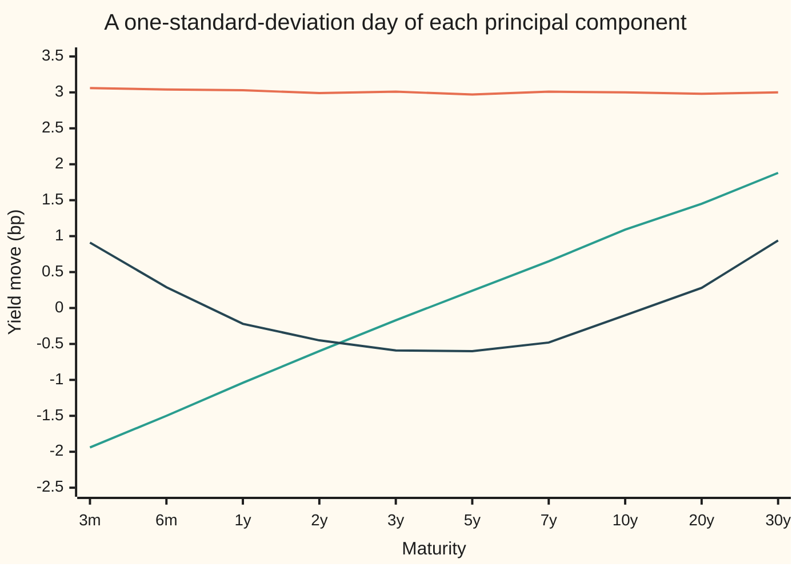
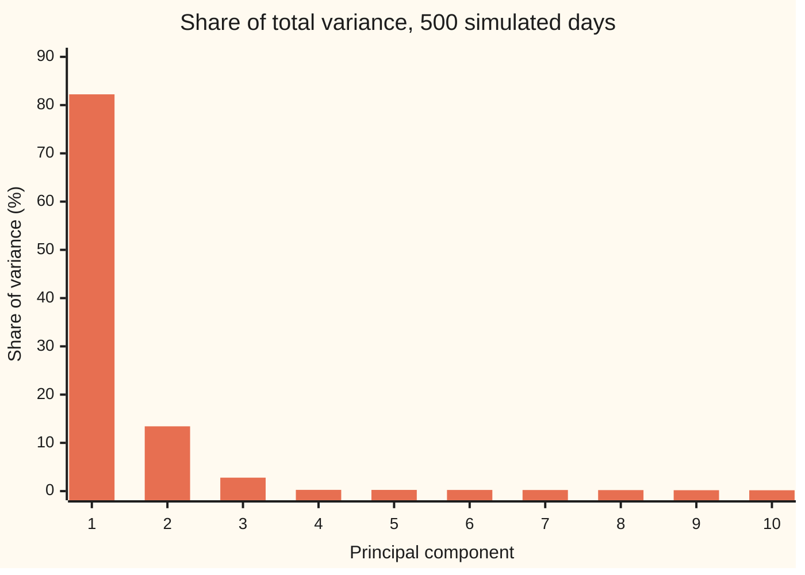

# Principal components: the directions your data varies most

Probability and statistics → Regression → Dimension reduction → Principal components

---

## General Overview

A bond desk watches government bond yields at ten maturities: 3 months, 6 months, 1, 2, 3, 5, 7, 10, 20 and 30 years. Each trading day every one of the ten yields moves, usually by a few basis points. A basis point (bp) is a hundredth of a percent: a yield going from 4.00% to 4.03% has moved 3 bp. That is ten numbers a day, for every one of 500 trading days, about two years.

The ten numbers are not ten separate stories. On most days all ten go the same way by about the same amount. On some days the long end moves more than the short end, so the curve tilts. Now and then the middle moves against both ends, so the curve bends. Traders have names for the three: **level**, **slope** and **curvature**. A whole day's move is summed up in two or three words: "rates up 5, curve steeper."

The 500 days on this card are simulated from exactly those three hidden shapes plus a little noise, so the right answer is known in advance. The method below is handed only the 500 rows of ten numbers. It recovers the level move as the direction carrying 82.23% of all day-to-day variance, the slope move as the next, carrying 13.43%, and the curvature move as the third. Two numbers a day, a level score and a slope score, keep 95.66% of the variance of ten, with a standard error of 0.30 percentage points.

The 500 days form a swarm of points in a ten-dimensional room, one point per day. The swarm is shaped like a very long, flattened rugby ball. Its longest axis is the level move, its next-longest the slope move. Those axes, found from the data and ranked by how far the swarm stretches along them, are the **principal components**, and that term carries the rest of the card. The method that finds them is principal component analysis, **PCA**.

**The principal components of a set of measurements are the eigenvectors of their covariance matrix, ranked by eigenvalue: the first is the direction along which the data varies most, each eigenvalue is the variance along its own direction, and keeping the top few directions keeps the largest share of total variance that any choice of that many directions can keep.**

**What kind of fact this is:** a method, resting on a theorem proved on this card in Why it works: no unit direction carries more variance than the covariance matrix's top eigenvector.

### The picture: the three directions, as bond moves

Each line is one principal component, drawn as the move a typical day of that kind makes at each maturity: the direction scaled by its own standard deviation.



The flat orange line is the first component, level: every yield up about 3 bp. The green line is the second, slope: short yields down, long yields up, crossing zero between 3 and 5 years. The dark line is the third, curvature: both ends up, the middle down. Each sign is a convention: the same component upside down describes the same kind of day.

---

## The formula

Notation first, in words. One day's ten yield moves form a **vector**: a list of numbers treated as one object, written $x_t$ for day t. A **direction** is a vector $u$ of length one, so that the sum of its squared entries is 1. Writing $u^T x_t$ means: multiply entry by entry and add up. It is a weighted sum of the day's ten moves, and it measures how far the day went along the direction. The superscript T is the transpose, turning a column into a row. As on the rest of this wing, a hat marks a quantity estimated from data.

The covariance matrix gathers every variance and every covariance of the ten maturities into one ten-by-ten table ([multivariate-normal](../05-Transformations%20and%20Joint%20Laws/06-multivariate-normal.md)):

$$\hat\Sigma = \frac{1}{n-1}\sum_{t=1}^{n} (x_t - \bar x)(x_t - \bar x)^T$$

**Read it aloud:** remove the average day from every day, and average the products of every pair of maturities' moves.

The variance of the data along a direction, and the rule for the best directions:

$$\operatorname{Var}\big(u^T x\big) = u^T \hat\Sigma\, u, \qquad \hat\Sigma\, u_k = \hat\lambda_k\, u_k, \qquad \hat\lambda_1 \ge \hat\lambda_2 \ge \dots \ge \hat\lambda_d \ge 0$$

**Read it aloud:** the spread along any direction is read off the covariance matrix; the directions the matrix only stretches, never turns, are the principal components, and the stretch factor of each is the variance along it.

The share of total variance kept by the first $r$ components:

$$\text{share}(r) = \frac{\hat\lambda_1 + \dots + \hat\lambda_r}{\hat\lambda_1 + \dots + \hat\lambda_d}$$

**Read it aloud:** the variance along the kept directions, over the variance along all of them.

Each day's position along component k is its **score**, $z_{tk} = u_k^T (x_t - \bar x)$. Keeping two components replaces each day's ten moves with two scores.

| Symbol | Plain meaning | In our example | Push it up and the answer… |
| --- | --- | --- | --- |
| $x_t$ | day t's moves at every maturity, in bp | day 1: −0.46 at 3 months to −3.57 at 30 years | — |
| $\bar x$ | the average day | close to 0 at every maturity | shifts every day, changes no spread |
| $n$ | number of days | 500 | smaller standard errors |
| $d$ | number of measurements per day | 10 maturities | more directions to share the variance |
| $\hat\Sigma$ | covariance matrix of the data, d by d | diagonal from 14.06 (3 months) down to 9.39 (5 years) | more variance to explain |
| $\Sigma$ | the covariance matrix of the model that made the data | eigenvalues 90.25, 13.45, 3.22, then 0.25 seven times | — |
| $u$, $u_i$, $u^T$ | any direction: ten weights $u_i$, squares summing to 1; $u^T$ is the same list written as a row, for the weighted sum | the best one found at random carries 70.335 | — |
| $u_k$, $u_1$, $u_2$, $u_3$ | the k-th principal component; its entries are the loadings | $u_1$ ≈ 0.316 at every maturity | — |
| $c_k$, $c_1, \dots, c_{10}$ | in Step 2: how much of direction $u$ lies along eigenvector k; their squares sum to 1 | for $u = u_1$: $c_1 = 1$, the rest 0 | — |
| $\hat\lambda_k$, $\lambda_k$ | variance along $u_k$ in the data; the model's true value | 90.556, 14.789, 3.069 | a bigger share for that component |
| $z_{tk}$, $z_t$ | day t's score on component k; $z_t$ (Step 1), its score on any direction $u$ | day 1: −5.69 on level, −3.01 on slope | — |
| $r$ | components kept | 2 | share kept rises, never falls |
| $\text{share}(r)$ | the share of total variance kept by the first r components | 95.66% at r = 2; the model's 95.43% | — |
| $v_j$, $w_k$ | in the Detailed proof: any r perpendicular directions, and the share of eigenvector k they catch | — | — |

### When it holds

- **All measurements in one unit.** Variance is measured in squared units, so a column quoted in bigger numbers wins. Quote the 30-year yield in percent while the rest stay in bp and the first component ignores it: its 30-year loading falls to 0.0031. With mixed units, standardise each column first, which means working from the correlation matrix.
- **The average removed.** PCA describes spread about the centre. Run it on yield levels without subtracting the average curve and the "first component" is the average curve itself, claiming 99.961% of a quantity that is mostly the curve's height, not its moves.
- **Separated eigenvalues.** A direction is pinned down only when its eigenvalue stands clear of its neighbours. Here the seven smallest are all 0.25 in the model: those directions are noise, and two samples of 500 days give fourth components at cosine 0.0327, nearly perpendicular.
- **Enough days.** Every $\hat\lambda_k$ is an estimate. For normal data with separated eigenvalues its standard error is about $\lambda_k$ times the square root of 2/(n − 1): 5.714 on the first eigenvalue here.
- **Flat structure.** PCA finds flat subspaces through the centre of the data. Data lying on a curved surface needs a different tool: manifold-learning-and-the-manifold-hypothesis.

---

## Why it works

### Step 0: spread along any direction is a question about one matrix

Once the covariance matrix is known, the variance of every weighted sum of the ten yields follows from it, without going back to the data. So "which direction carries the most variance?" is a question about one symmetric table of numbers. The spectral theorem ([spectral-theorem](../../03-Algebra/07-Eigenvalues%20and%20Symmetric%20Matrices/04-spectral-theorem.md)) says every such table has a set of perpendicular axes along which it only stretches. Along those axes the question answers itself.

### Step 1: the variance along a direction is $u^T \hat\Sigma u$

Take a direction $u$ and give each day its score $z_t = u^T (x_t - \bar x)$. The scores average to zero, because the centred days do. Their variance is the average of the squared scores. A square of a weighted sum is a double sum over pairs of maturities:

$$z_t^2 = \sum_{i}\sum_{j} u_i u_j (x_{ti} - \bar x_i)(x_{tj} - \bar x_j)$$

Averaging over days turns each product into entry (i, j) of $\hat\Sigma$, so the variance is $\sum_i \sum_j u_i u_j \hat\Sigma_{ij} = u^T \hat\Sigma u$. The code checks this on the first component: the 500 scores have variance 90.556468, which is $\hat\lambda_1$ to every printed digit.

### Step 2: the top eigenvector wins

By the spectral theorem, $\hat\Sigma$ has ten perpendicular unit eigenvectors $u_1, \dots, u_{10}$, with eigenvalues in falling order. Any direction is a mix of them, $u = c_1 u_1 + \dots + c_{10} u_{10}$, with $c_1^2 + \dots + c_{10}^2 = 1$ because $u$ has length one. Multiplying out, every cross term dies because the eigenvectors are perpendicular:

$$u^T \hat\Sigma u = \hat\lambda_1 c_1^2 + \hat\lambda_2 c_2^2 + \dots + \hat\lambda_{10} c_{10}^2 \le \hat\lambda_1 (c_1^2 + \dots + c_{10}^2) = \hat\lambda_1$$

The variance along any direction is a weighted average of the eigenvalues, with weights $c_k^2$. An average cannot beat its largest member. It equals it only when all the weight sits on $u_1$ (or, if the top eigenvalue were tied, on its tied partners). So the first principal component is the top eigenvector, and its variance is $\hat\lambda_1 = 90.556$ bp^2. Two thousand random directions, tried in the code, never do better: the best reaches 70.335.

### Step 3: the next direction is the next eigenvector, and scores do not move together

Ask for the most variance among directions perpendicular to $u_1$. Those directions have $c_1 = 0$, and the same averaging argument gives $\hat\lambda_2$, reached at $u_2$. Continue for $u_3$ and on down.

The scores on two components are uncorrelated. Their covariance is $u_j^T \hat\Sigma u_k = \hat\lambda_k\, u_j^T u_k = 0$, because the eigenvectors are perpendicular. In the code the level and slope scores have covariance 0.000000. Uncorrelated is not independent in general; for normal data it is ([multivariate-normal](../05-Transformations%20and%20Joint%20Laws/06-multivariate-normal.md)).

### Step 4: total variance is conserved, so shares make sense

The total variance is the sum of the ten maturities' variances, the diagonal of $\hat\Sigma$, called its trace. Turning to the eigenvector axes is a rotation: it moves variance between axes but creates and destroys none. So the trace equals the sum of the eigenvalues: 110.1298 both ways in the code. That is why each eigenvalue divided by the total is a share of something fixed, and why the shares add to 100%.

### Step 5: keeping r components is the best r-dimensional summary

Rebuild each day from its first two scores: $\bar x + z_{t1} u_1 + z_{t2} u_2$. What is lost is the part of the day along $u_3, \dots, u_{10}$. By Pythagoras, the squared length lost is the sum of the squared scores on those eight components, and averaging over days, with the same n − 1 divisor as $\hat\Sigma$, gives $\hat\lambda_3 + \dots + \hat\lambda_{10}$. In the code, the rebuild error averaged that way is 4.784772 bp^2 per day, equal to the sum of the last eight eigenvalues. No other flat two-dimensional summary through the average day loses less.

<details>
<summary>Detailed proof: no other r directions keep more variance</summary>

Take any r perpendicular unit directions $v_1, \dots, v_r$. For each eigenvector $u_k$, let $w_k$ be the sum of its squared overlaps $(u_k^T v_j)^2$ over j: the squared length of $u_k$'s shadow on the span of the $v_j$. A shadow is never longer than the vector, so each $w_k$ lies between 0 and 1. Summing the other way round, each $v_j$ has length one, so the $w_k$ add to r.

The variance kept by the $v_j$ is $\sum_j v_j^T \hat\Sigma v_j = \sum_k \hat\lambda_k w_k$ (expand each $v_j$ over the eigenvectors, as in Step 2). The top r eigenvectors keep $\hat\lambda_1 + \dots + \hat\lambda_r$. The difference is

$$\sum_{k \le r} \hat\lambda_k - \sum_k \hat\lambda_k w_k = \sum_{k \le r} (\hat\lambda_k - \hat\lambda_r)(1 - w_k) + \sum_{k > r} (\hat\lambda_r - \hat\lambda_k)\, w_k \ge 0$$

Both sums are non-negative term by term, since eigenvalues fall and each $w_k$ lies between 0 and 1. To check the identity, expand the right side and use $\sum_{k \le r} (1 - w_k) = \sum_{k > r} w_k$, which is the statement that the $w_k$ add to r. So no r directions keep more than the top r eigenvalues. Since kept variance plus rebuild error is the fixed trace (Pythagoras, averaged over days), keeping the most variance is the same as losing the least.

</details>

<details>
<summary>Why level, slope and curvature?</summary>

In this card's model the three shapes were chosen perpendicular: level adds 1 at every maturity, slope adds −9, −7, … up to 9, curvature adds 6, 2, −1, −3, −4 and back. For such shapes the model's covariance is a sum of one piece per shape plus noise, and each shape is an exact eigenvector, with eigenvalue (shock size)^2 × (shape length)^2 + (noise)^2. Real Treasury moves were not built this way, yet their first three components have the same look: no sign change, one, then two. Litterman and Scheinkman reported this in 1991, and it is why the finance wing hedges curves in exactly these three directions.

</details>

The alternative road skips the covariance matrix. Stack the centred days as the rows of a 500-by-10 table and take its singular value decomposition ([singular-value-decomposition](../../03-Algebra/07-Eigenvalues%20and%20Symmetric%20Matrices/06-singular-value-decomposition.md)). Its right singular vectors are the principal components, and each squared singular value divided by n − 1 is an eigenvalue. Software does it this way because it avoids squaring the data's rounding errors: svd-and-the-pseudoinverse.

---

## Worked numbers, by hand

The model makes each day from three shocks: a level shock with standard deviation 3 bp, a slope shock of 0.2, a curvature shock of 0.15, each multiplying its shape, plus independent noise of 0.5 bp at every maturity. Its exact eigenvalues follow from the shapes' squared lengths.

| Step | Arithmetic | Value |
| --- | --- | --- |
| level shape, squared length | ten entries of 1 | 10 |
| level eigenvalue | 3^2 × 10 + 0.5^2 = 90 + 0.25 | 90.25 bp^2 |
| slope shape, squared length | twice (9^2 + 7^2 + 5^2 + 3^2 + 1^2) | 330 |
| slope eigenvalue | 0.2^2 × 330 + 0.5^2 = 13.2 + 0.25 | 13.45 bp^2 |
| curvature shape, squared length | twice (6^2 + 2^2 + 1^2 + 3^2 + 4^2) | 132 |
| curvature eigenvalue | 0.15^2 × 132 + 0.5^2 = 2.97 + 0.25 | 3.22 bp^2 |
| the other seven | noise alone | 0.25 bp^2 each |
| total variance | 90.25 + 13.45 + 3.22 + seven times 0.25 | 108.67 bp^2 |
| level share | 90.25 / 108.67 | 83.05% |
| slope share | 13.45 / 108.67 | 12.38% |
| **kept by two components** | (90.25 + 13.45) / 108.67 | **95.43%** |

A Jacobi eigenvalue routine (described under Code) run on the model's covariance returns 90.2500, 13.4500, 3.2200 and 0.2500, to four decimals.

The data give estimates, and every estimate carries an error. From the 500 simulated days, $\hat\lambda_1 = 90.556$ with standard error 5.714, $\hat\lambda_2 = 14.789$ with standard error 0.852, and $\hat\lambda_3 = 3.069$ with standard error 0.204. They sit 0.05, 1.57 and −0.74 standard errors from the truth. Two components keep 95.66% of this sample's variance. Across 200 samples of 500 days, this one and 199 more, that share has standard deviation 0.299 percentage points, which is its standard error, so 95.66% is within one standard error of the model's 95.43%.

In the world of the desk: two numbers a day, how far rates moved overall and how far the curve tilted, carry about 95 parts in every 100 of the day-to-day variance in ten yields.

### The picture: how the variance is shared



This bar chart is called a scree plot, after the rubble at the foot of a cliff. Three bars stand; seven lie flat at about a quarter of a percent each, the noise.

### Reducing ten numbers to two: day 1

Day 1 moved −0.46 bp at 3 months, falling steadily to −3.57 bp at 30 years: yields down, the long end most. Its scores are −5.69 on level and −3.01 on slope. Rebuilt from those two numbers, the day reads −0.16 at 3 months and −3.17 at 30 years, the right shape, off by a few tenths of a basis point at each maturity. The lost part, about 4.78 bp^2 a day on average, is the curvature and the noise.

### What breaks if you drop a piece

| Mistake | Comes out at | What went wrong |
| --- | --- | --- |
| 30-year yield in percent, the rest in bp | 30-year loading on the first component 0.0031 instead of about 0.316; two components "keep" 96.62% | a column in smaller numbers has tiny variance, so PCA ignores it |
| Yield levels, average not removed | first component 99.961%, cosine 1.0000 with the average curve | uncentred PCA finds where the data sits, not how it moves |
| Fourth component read as a fourth factor | cosine 0.0327 between two samples' fourth components, against 0.9996 for their first | tied eigenvalues leave the direction undetermined: it is noise |

The code prints all three.

---

## Code, from first principles, and it actually runs

Nothing is imported but `math`. Random numbers come from SplitMix64 with seed 2026, written out in both languages, turned into normal draws by the Box–Muller formula, so Python and Rust simulate the same days. The eigenvalues are reached by independent roads: the exact formula from the model's shapes; a Jacobi routine, which rotates the matrix pair of entries by pair until nothing is left off the diagonal; power iteration, which multiplies a starting vector by the matrix a thousand times until it lines up with the top eigenvector, then removes that direction and repeats; the variance of the scores computed straight from the days; and 200 replicate samples, whose spread is set against the standard-error formula.

### Python

```python
# Principal components -- the check behind the card.  Only math is imported.
# 500 simulated trading days of yield-curve changes at 10 tenors (3m 6m 1y 2y
# 3y 5y 7y 10y 20y 30y), in basis points (bp, hundredths of a percent), built
# from three hidden shapes plus noise.  PCA must find the shapes.  Seed 2026.
import math

D, N, REPS, M64 = 10, 500, 200, (1 << 64) - 1
LEVEL = [1.0] * D                                          # every tenor moves 1
SLOPE = [2.0 * j - 9 for j in range(D)]                    # -9, -7, ..., 9
CURVE = [((2.0 * j - 9) * (2.0 * j - 9) - 33) / 8 for j in range(D)]  # 6, 2, -1, -3, -4, ...
SHAPES, SDS, NOISE = [LEVEL, SLOPE, CURVE], [3.0, 0.2, 0.15], 0.5

class Rng:                                                 # SplitMix64
    def __init__(self, seed): self.s = seed
    def unif(self):
        self.s = (self.s + 0x9E3779B97F4A7C15) & M64
        z = ((self.s ^ (self.s >> 30)) * 0xBF58476D1CE4E5B9) & M64
        z = ((z ^ (z >> 27)) * 0x94D049BB133111EB) & M64
        return (((z ^ (z >> 31)) >> 11) + 0.5) / 2.0 ** 53
    def normal(self):                                      # Box-Muller, cosine half
        u1 = self.unif(); u2 = self.unif()
        return math.sqrt(-2.0 * math.log(u1)) * math.cos(2.0 * math.pi * u2)

def add(xs):                                               # plain left-to-right sum
    s = 0.0
    for x in xs: s += x
    return s
def dot(a, b): return add(x * y for x, y in zip(a, b))
def unit(v): n = math.sqrt(dot(v, v)); return [x / n for x in v]
def trace(m): return add(m[i][i] for i in range(D))
def row(label, vals, f="{:8.2f}"): print(f"{label:<30}" + "".join(f.format(x) for x in vals))
def fix_sign(v): return v if v[D - 1] >= 0 else [-x for x in v]   # 30y entry positive

def one_day(rng):                                          # three shape shocks, then noise
    f = [rng.normal() * sd for sd in SDS]
    return [f[0] * LEVEL[j] + f[1] * SLOPE[j] + f[2] * CURVE[j] + NOISE * rng.normal() for j in range(D)]
def simulate(rng, n): return [one_day(rng) for _ in range(n)]

def covariance(days, centre=True):                         # divide by n - 1
    n = len(days); mean = [0.0] * D
    for x in days:
        for j in range(D): mean[j] += x[j] / n
    c, off = [[0.0] * D for _ in range(D)], (mean if centre else [0.0] * D)
    for x in days:
        y = [x[j] - off[j] for j in range(D)]
        for i in range(D):
            for j in range(D): c[i][j] += y[i] * y[j]
    return mean, [[v / (n - 1) for v in r] for r in c]

def jacobi(m):                                             # road 1: rotate until diagonal
    a = [r[:] for r in m]; v = [[float(i == j) for j in range(D)] for i in range(D)]
    for _ in range(60):
        if add(a[i][j] * a[i][j] for i in range(D) for j in range(D) if i != j) < 1e-24: break
        for p in range(D):
            for q in range(p + 1, D):
                if a[p][q] == 0.0: continue
                th = (a[q][q] - a[p][p]) / (2.0 * a[p][q])
                t = (1.0 if th >= 0 else -1.0) / (abs(th) + math.sqrt(th * th + 1.0))
                c = 1.0 / math.sqrt(t * t + 1.0); s = t * c
                for k in range(D): a[k][p], a[k][q] = c * a[k][p] - s * a[k][q], s * a[k][p] + c * a[k][q]
                for k in range(D): a[p][k], a[q][k] = c * a[p][k] - s * a[q][k], s * a[p][k] + c * a[q][k]
                for k in range(D): v[k][p], v[k][q] = c * v[k][p] - s * v[k][q], s * v[k][p] + c * v[k][q]
    order = sorted(range(D), key=lambda k: -a[k][k])
    return [a[k][k] for k in order], [fix_sign([v[i][k] for i in range(D)]) for k in order]

def power_top(m, k):                                       # road 2: multiply and deflate
    a = [r[:] for r in m]; out = []
    for _ in range(k):
        v = [j + 1.0 for j in range(D)]
        for _ in range(1000):
            w = [dot(r, v) for r in a]; nw = math.sqrt(dot(w, w)); v = [x / nw for x in w]
        lam = dot(v, [dot(r, v) for r in a]); out.append((lam, fix_sign(v)))
        a = [[a[i][j] - lam * v[i] * v[j] for j in range(D)] for i in range(D)]
    return out

# ---- exact: the model's own covariance, and its eigenvalues by hand ----
sigma = [[NOISE * NOISE * (i == j) + add(sd * sd * b[i] * b[j] for sd, b in zip(SDS, SHAPES))
          for j in range(D)] for i in range(D)]
exact = [sd * sd * dot(b, b) + NOISE * NOISE for sd, b in zip(SDS, SHAPES)] + [NOISE * NOISE]
lam_sigma = jacobi(sigma)[0]; row("exact, eigenvalues (bp^2)", exact, "{:8.4f}")
row("jacobi on the model, top four", lam_sigma[:4], "{:8.4f}")
row("exact, shares 1-3 and top two %", [100 * e / trace(sigma) for e in exact[:3]] + [100 * (exact[0] + exact[1]) / trace(sigma)])
row("exact, length^2 and shape part", [dot(b, b) for b in SHAPES] + [sd * sd * dot(b, b) for sd, b in zip(SDS, SHAPES)])
print(f"exact, total variance (trace)  {trace(sigma):.4f}"); assert max(abs(lam_sigma[k] - exact[k]) for k in range(4)) < 1e-9
# ---- simulated: 200 samples of 500 days; the first is the card's sample ----
rng = Rng(2026); lam1s, top2s = [], []
for rep in range(REPS):
    days = simulate(rng, N); mean, S = covariance(days); lam, vec = jacobi(S)
    lam1s.append(lam[0]); top2s.append((lam[0] + lam[1]) / trace(S))
    if rep == 0: days0, mean0, S0, lam0, vec0 = days, mean, S, lam, vec
    if rep == 1: vec1 = vec
row("sample, variance by tenor", [S0[j][j] for j in range(D)])
row("sample, eigenvalues 1-10", lam0, "{:8.3f}")
tot = trace(S0); row("sample, share % (chart)", [100 * l / tot for l in lam0])
row("sample, cumulative %", [100 * add(lam0[:k + 1]) / tot for k in range(D)])
print(f"sample, trace {tot:.4f} = eigenvalue sum {add(lam0):.4f}")
assert abs(tot - add(lam0)) < 1e-9
se = [e * math.sqrt(2.0 / (N - 1)) for e in exact[:3]]; row("sample vs exact, formula SE", se, "{:8.3f}")
row("sample vs exact, gap in SEs", [(lam0[k] - exact[k]) / se[k] for k in range(3)])
for k in range(3): assert abs(lam0[k] - exact[k]) < 4 * se[k]
m1 = add(lam1s) / REPS; sd1 = math.sqrt(add((x - m1) * (x - m1) for x in lam1s) / (REPS - 1))
m2 = add(top2s) / REPS; sd2 = math.sqrt(add((x - m2) * (x - m2) for x in top2s) / (REPS - 1))
print(f"replicates, lambda1 mean {m1:.3f}  sd {sd1:.3f}  formula SE {se[0]:.3f}")
print(f"replicates, top-two share mean {100 * m2:.3f}%  sd {100 * sd2:.3f}%")
assert abs(sd1 / se[0] - 1) < 0.15
# ---- the directions: loadings, bp moves, and agreement with the hidden shapes ----
for k in range(3): row(f"loadings, PC{k + 1}", vec0[k], "{:8.3f}")
for k in range(3): row(f"chart, PC{k + 1} one-SD day (bp)", [math.sqrt(lam0[k]) * x for x in vec0[k]])
row("cosine with hidden shape 1-3", cos := [abs(dot(vec0[k], unit(SHAPES[k]))) for k in range(3)], "{:8.4f}")
assert min(cos) > 0.98
pw = power_top(S0, 2)
print(f"power iteration, top two {pw[0][0]:.6f} {pw[1][0]:.6f}")
gap = max(abs(pw[k][1][j] - vec0[k][j]) for k in range(2) for j in range(D))
print(f"power vs jacobi, largest loading gap below 1e-9: {'yes' if gap < 1e-9 else 'no'}")
assert max(abs(pw[k][0] - lam0[k]) for k in range(2)) < 1e-8
assert gap < 1e-9
# ---- reduce 10 numbers a day to 2 scores, and rebuild ----
ys = [[x[j] - mean0[j] for j in range(D)] for x in days0]
z = [[dot(vec0[k], y) for k in range(2)] for y in ys]
var1 = add(s[0] * s[0] for s in z) / (N - 1); cov12 = add(s[0] * s[1] for s in z) / (N - 1)
print(f"scores, variance of PC1 scores {var1:.6f}; PC1-PC2 covariance {abs(cov12):.6f}")
assert abs(var1 - lam0[0]) < 1e-8
err = add((y[j] - s[0] * vec0[0][j] - s[1] * vec0[1][j]) ** 2 for y, s in zip(ys, z) for j in range(D)) / (N - 1)
print(f"reduce, rebuild error per day {err:.6f} vs eigenvalues 3-10 {add(lam0[2:]):.6f}")
assert abs(err - add(lam0[2:])) < 1e-8
row("day 1, actual change (bp)", days0[0])
print(f"day 1, scores PC1 {z[0][0]:.2f}  PC2 {z[0][1]:.2f}")
row("day 1, rebuilt from 2 scores", [mean0[j] + z[0][0] * vec0[0][j] + z[0][1] * vec0[1][j] for j in range(D)])
best = max(dot(u, [dot(r, u) for r in S0]) for u in (unit([rng.normal() for _ in range(D)]) for _ in range(2000)))
print(f"random directions, best of 2000 {best:.3f} vs lambda1 {lam0[0]:.3f}")
assert best <= lam0[0]
# ---- what breaks ----
pct = [x[:D - 1] + [x[D - 1] / 100] for x in days0]; Sp = covariance(pct)[1]; lp, vp = jacobi(Sp)
print(f"breaks, 30y in percent: top-two share {100 * (lp[0] + lp[1]) / trace(Sp):.2f}%, PC1 30y loading {vp[0][D - 1]:.4f}")
level, lev = [400.0 + 5 * s for s in SLOPE], []
for x in days0: level = [level[j] + x[j] for j in range(D)]; lev.append(level)
avg, Mu = covariance(lev, centre=False); lu, vu = jacobi(Mu)
print(f"breaks, levels uncentred: PC1 share {100 * lu[0] / trace(Mu):.3f}%, cosine with average curve {abs(dot(vu[0], unit(avg))):.4f}")
row("breaks, sample 1 vs 2: cosine PC1-5", [abs(dot(vec0[k], vec1[k])) for k in range(5)], "{:8.4f}")
print("ALL CHECKS PASS")
```

**Ran 2026-09-28 on macOS, Python 3.14.6, standard library only. All checks passed. Output, pasted from the run:**

```
exact, eigenvalues (bp^2)      90.2500 13.4500  3.2200  0.2500
jacobi on the model, top four  90.2500 13.4500  3.2200  0.2500
exact, shares 1-3 and top two %   83.05   12.38    2.96   95.43
exact, length^2 and shape part   10.00  330.00  132.00   90.00   13.20    2.97
exact, total variance (trace)  108.6700
sample, variance by tenor        14.06   11.75   10.48    9.71    9.59    9.39    9.95   10.42   11.23   13.54
sample, eigenvalues 1-10        90.556  14.789   3.069   0.284   0.279   0.260   0.250   0.233   0.209   0.201
sample, share % (chart)          82.23   13.43    2.79    0.26    0.25    0.24    0.23    0.21    0.19    0.18
sample, cumulative %             82.23   95.66   98.44   98.70   98.95   99.19   99.42   99.63   99.82  100.00
sample, trace 110.1298 = eigenvalue sum 110.1298
sample vs exact, formula SE      5.714   0.852   0.204
sample vs exact, gap in SEs       0.05    1.57   -0.74
replicates, lambda1 mean 90.751  sd 5.899  formula SE 5.714
replicates, top-two share mean 95.451%  sd 0.299%
loadings, PC1                    0.322   0.320   0.318   0.314   0.316   0.312   0.317   0.315   0.313   0.316
loadings, PC2                   -0.505  -0.389  -0.269  -0.155  -0.045   0.063   0.168   0.284   0.377   0.490
loadings, PC3                    0.520   0.165  -0.126  -0.258  -0.337  -0.340  -0.274  -0.058   0.159   0.536
chart, PC1 one-SD day (bp)        3.06    3.04    3.03    2.99    3.01    2.97    3.01    3.00    2.98    3.00
chart, PC2 one-SD day (bp)       -1.94   -1.50   -1.04   -0.60   -0.17    0.24    0.65    1.09    1.45    1.88
chart, PC3 one-SD day (bp)        0.91    0.29   -0.22   -0.45   -0.59   -0.60   -0.48   -0.10    0.28    0.94
cosine with hidden shape 1-3    1.0000  0.9997  0.9984
power iteration, top two 90.556468 14.788519
power vs jacobi, largest loading gap below 1e-9: yes
scores, variance of PC1 scores 90.556468; PC1-PC2 covariance 0.000000
reduce, rebuild error per day 4.784772 vs eigenvalues 3-10 4.784772
day 1, actual change (bp)        -0.46   -0.63   -0.34   -1.33   -1.18   -2.03   -2.42   -2.57   -2.36   -3.57
day 1, scores PC1 -5.69  PC2 -3.01
day 1, rebuilt from 2 scores     -0.16   -0.48   -0.84   -1.21   -1.59   -1.87   -2.22   -2.54   -2.81   -3.17
random directions, best of 2000 70.335 vs lambda1 90.556
breaks, 30y in percent: top-two share 96.62%, PC1 30y loading 0.0031
breaks, levels uncentred: PC1 share 99.961%, cosine with average curve 1.0000
breaks, sample 1 vs 2: cosine PC1-5  0.9996  0.9988  0.9984  0.0327  0.4128
ALL CHECKS PASS
```

### Rust

```rust
// Principal components -- the same check as principal_components_check.py, in Rust.
// Standard library only, no crates.  500 simulated trading days of yield-curve
// changes at 10 tenors (3m 6m 1y 2y 3y 5y 7y 10y 20y 30y), in basis points,
// built from three hidden shapes plus noise.  PCA must find them.  Seed 2026.
const D: usize = 10; const N: usize = 500; const REPS: usize = 200;
const SDS: [f64; 3] = [3.0, 0.2, 0.15]; const NOISE: f64 = 0.5;
type Mat = Vec<Vec<f64>>;
struct Rng { s: u64 }                                        // SplitMix64
impl Rng {
    fn unif(&mut self) -> f64 {
        self.s = self.s.wrapping_add(0x9E3779B97F4A7C15);
        let mut z = (self.s ^ (self.s >> 30)).wrapping_mul(0xBF58476D1CE4E5B9);
        z = (z ^ (z >> 27)).wrapping_mul(0x94D049BB133111EB);
        (((z ^ (z >> 31)) >> 11) as f64 + 0.5) / 9007199254740992.0
    }
    fn normal(&mut self) -> f64 {                            // Box-Muller, cosine half
        let u1 = self.unif(); let u2 = self.unif();
        (-2.0 * u1.ln()).sqrt() * (2.0 * std::f64::consts::PI * u2).cos()
    }
}
fn add(xs: impl Iterator<Item = f64>) -> f64 { let mut s = 0.0; for x in xs { s += x; } s }
fn dot(a: &[f64], b: &[f64]) -> f64 { add(a.iter().zip(b).map(|(x, y)| x * y)) }
fn unit(v: &[f64]) -> Vec<f64> { let n = dot(v, v).sqrt(); v.iter().map(|x| x / n).collect() }
fn trace(m: &Mat) -> f64 { add((0..D).map(|i| m[i][i])) }
fn row(label: &str, vals: &[f64], dp: usize) {
    println!("{:<30}{}", label, vals.iter().map(|v| format!("{:8.*}", dp, v)).collect::<String>());
}
fn fix_sign(v: Vec<f64>) -> Vec<f64> { if v[D - 1] >= 0.0 { v } else { v.iter().map(|x| -x).collect() } }
fn shapes() -> [Vec<f64>; 3] {
    let s: Vec<f64> = (0..D).map(|j| 2.0 * j as f64 - 9.0).collect();
    [vec![1.0; D], s.clone(), s.iter().map(|x| (x * x - 33.0) / 8.0).collect()]
}
fn one_day(rng: &mut Rng, sh: &[Vec<f64>; 3]) -> Vec<f64> {   // three shape shocks, then noise
    let f: Vec<f64> = SDS.iter().map(|sd| rng.normal() * sd).collect();
    (0..D).map(|j| f[0] * sh[0][j] + f[1] * sh[1][j] + f[2] * sh[2][j] + NOISE * rng.normal()).collect()
}
fn simulate(rng: &mut Rng, sh: &[Vec<f64>; 3], n: usize) -> Mat { (0..n).map(|_| one_day(rng, sh)).collect() }
fn covariance(days: &Mat, centre: bool) -> (Vec<f64>, Mat) {  // divide by n - 1
    let n = days.len() as f64; let mut mean = vec![0.0; D];
    for x in days { for j in 0..D { mean[j] += x[j] / n; } }
    let off = if centre { mean.clone() } else { vec![0.0; D] };
    let mut c = vec![vec![0.0; D]; D];
    for x in days {
        let y: Vec<f64> = (0..D).map(|j| x[j] - off[j]).collect();
        for i in 0..D { for j in 0..D { c[i][j] += y[i] * y[j]; } }
    }
    (mean, c.iter().map(|r| r.iter().map(|v| v / (n - 1.0)).collect()).collect())
}
fn jacobi(m: &Mat) -> (Vec<f64>, Vec<Vec<f64>>) {           // road 1: rotate until diagonal
    let mut a = m.clone();
    let mut v: Mat = (0..D).map(|i| (0..D).map(|j| if i == j { 1.0 } else { 0.0 }).collect()).collect();
    for _ in 0..60 {
        let off = add((0..D).flat_map(|i| (0..D).map(move |j| (i, j))).filter(|&(i, j)| i != j).map(|(i, j)| a[i][j] * a[i][j]));
        if off < 1e-24 { break; }
        for p in 0..D {
            for q in p + 1..D {
                if a[p][q] == 0.0 { continue; }
                let th = (a[q][q] - a[p][p]) / (2.0 * a[p][q]);
                let t = (if th >= 0.0 { 1.0 } else { -1.0 }) / (th.abs() + (th * th + 1.0).sqrt());
                let c = 1.0 / (t * t + 1.0).sqrt(); let s = t * c;
                for k in 0..D { let (x, y) = (a[k][p], a[k][q]); a[k][p] = c * x - s * y; a[k][q] = s * x + c * y; }
                for k in 0..D { let (x, y) = (a[p][k], a[q][k]); a[p][k] = c * x - s * y; a[q][k] = s * x + c * y; }
                for k in 0..D { let (x, y) = (v[k][p], v[k][q]); v[k][p] = c * x - s * y; v[k][q] = s * x + c * y; }
            }
        }
    }
    let mut order: Vec<usize> = (0..D).collect();
    order.sort_by(|&i, &j| a[j][j].partial_cmp(&a[i][i]).unwrap());
    (order.iter().map(|&k| a[k][k]).collect(), order.iter().map(|&k| fix_sign((0..D).map(|i| v[i][k]).collect())).collect())
}
fn power_top(m: &Mat, k: usize) -> Vec<(f64, Vec<f64>)> {  // road 2: multiply and deflate
    let mut a = m.clone(); let mut out = Vec::new();
    for _ in 0..k {
        let mut v: Vec<f64> = (0..D).map(|j| j as f64 + 1.0).collect();
        for _ in 0..1000 {
            let w: Vec<f64> = a.iter().map(|r| dot(r, &v)).collect();
            let nw = dot(&w, &w).sqrt(); v = w.iter().map(|x| x / nw).collect();
        }
        let av: Vec<f64> = a.iter().map(|r| dot(r, &v)).collect(); let lam = dot(&v, &av);
        for i in 0..D { for j in 0..D { a[i][j] -= lam * v[i] * v[j]; } }
        out.push((lam, fix_sign(v)));
    }
    out
}
fn main() {
    let sh = shapes();
    // ---- exact: the model's own covariance, and its eigenvalues by hand ----
    let sigma: Mat = (0..D).map(|i| (0..D).map(|j| (if i == j { NOISE * NOISE } else { 0.0 })
        + add((0..3).map(|k| SDS[k] * SDS[k] * sh[k][i] * sh[k][j]))).collect()).collect();
    let mut exact: Vec<f64> = (0..3).map(|k| SDS[k] * SDS[k] * dot(&sh[k], &sh[k]) + NOISE * NOISE).collect(); exact.push(NOISE * NOISE);
    let lam_sigma = jacobi(&sigma).0; row("exact, eigenvalues (bp^2)", &exact, 4);
    row("jacobi on the model, top four", &lam_sigma[..4], 4);
    let ts = trace(&sigma);
    row("exact, shares 1-3 and top two %", &[100.0 * exact[0] / ts, 100.0 * exact[1] / ts, 100.0 * exact[2] / ts, 100.0 * (exact[0] + exact[1]) / ts], 2);
    let parts: Vec<f64> = (0..3).map(|k| dot(&sh[k], &sh[k])).chain((0..3).map(|k| SDS[k] * SDS[k] * dot(&sh[k], &sh[k]))).collect();
    row("exact, length^2 and shape part", &parts, 2);
    println!("exact, total variance (trace)  {:.4}", ts);
    for k in 0..4 { assert!((lam_sigma[k] - exact[k]).abs() < 1e-9); }
    // ---- simulated: 200 samples of 500 days; the first is the card's sample ----
    let mut rng = Rng { s: 2026 }; let (mut lam1s, mut top2s) = (Vec::new(), Vec::new());
    let (mut days0, mut mean0, mut s0, mut lam0, mut vec0, mut vec1) = (vec![], vec![], vec![], vec![], vec![], vec![]);
    for rep in 0..REPS {
        let days = simulate(&mut rng, &sh, N); let (mean, s) = covariance(&days, true); let (lam, vec) = jacobi(&s);
        lam1s.push(lam[0]); top2s.push((lam[0] + lam[1]) / trace(&s));
        if rep == 0 { days0 = days; mean0 = mean; s0 = s; lam0 = lam; vec0 = vec; } else if rep == 1 { vec1 = vec; }
    }
    row("sample, variance by tenor", &(0..D).map(|j| s0[j][j]).collect::<Vec<_>>(), 2);
    row("sample, eigenvalues 1-10", &lam0, 3);
    let tot = trace(&s0); row("sample, share % (chart)", &lam0.iter().map(|l| 100.0 * l / tot).collect::<Vec<_>>(), 2);
    row("sample, cumulative %", &(0..D).map(|k| 100.0 * add(lam0[..k + 1].iter().copied()) / tot).collect::<Vec<_>>(), 2);
    let lsum = add(lam0.iter().copied()); println!("sample, trace {:.4} = eigenvalue sum {:.4}", tot, lsum);
    assert!((tot - lsum).abs() < 1e-9);
    let se: Vec<f64> = exact[..3].iter().map(|e| e * (2.0 / (N as f64 - 1.0)).sqrt()).collect(); row("sample vs exact, formula SE", &se, 3);
    row("sample vs exact, gap in SEs", &(0..3).map(|k| (lam0[k] - exact[k]) / se[k]).collect::<Vec<_>>(), 2);
    for k in 0..3 { assert!((lam0[k] - exact[k]).abs() < 4.0 * se[k]); }
    let r = REPS as f64;
    let m1 = add(lam1s.iter().copied()) / r; let sd1 = (add(lam1s.iter().map(|x| (x - m1) * (x - m1))) / (r - 1.0)).sqrt();
    let m2 = add(top2s.iter().copied()) / r; let sd2 = (add(top2s.iter().map(|x| (x - m2) * (x - m2))) / (r - 1.0)).sqrt();
    println!("replicates, lambda1 mean {:.3}  sd {:.3}  formula SE {:.3}", m1, sd1, se[0]);
    println!("replicates, top-two share mean {:.3}%  sd {:.3}%", 100.0 * m2, 100.0 * sd2);
    assert!((sd1 / se[0] - 1.0).abs() < 0.15);
    // ---- the directions: loadings, bp moves, and agreement with the hidden shapes ----
    for k in 0..3 { row(&format!("loadings, PC{}", k + 1), &vec0[k], 3); }
    for k in 0..3 { row(&format!("chart, PC{} one-SD day (bp)", k + 1), &vec0[k].iter().map(|x| lam0[k].sqrt() * x).collect::<Vec<_>>(), 2); }
    let cos: Vec<f64> = (0..3).map(|k| dot(&vec0[k], &unit(&sh[k])).abs()).collect();
    row("cosine with hidden shape 1-3", &cos, 4);
    assert!(cos.iter().all(|&c| c > 0.98));
    let pw = power_top(&s0, 2);
    println!("power iteration, top two {:.6} {:.6}", pw[0].0, pw[1].0);
    let mut gap: f64 = 0.0;
    for k in 0..2 { for j in 0..D { gap = gap.max((pw[k].1[j] - vec0[k][j]).abs()); } }
    println!("power vs jacobi, largest loading gap below 1e-9: {}", if gap < 1e-9 { "yes" } else { "no" });
    for k in 0..2 { assert!((pw[k].0 - lam0[k]).abs() < 1e-8); }
    assert!(gap < 1e-9);
    // ---- reduce 10 numbers a day to 2 scores, and rebuild ----
    let ys: Mat = days0.iter().map(|x| (0..D).map(|j| x[j] - mean0[j]).collect()).collect();
    let z: Mat = ys.iter().map(|y| (0..2).map(|k| dot(&vec0[k], y)).collect()).collect();
    let nm = N as f64 - 1.0;
    let var1 = add(z.iter().map(|s| s[0] * s[0])) / nm; let cov12 = add(z.iter().map(|s| s[0] * s[1])) / nm;
    println!("scores, variance of PC1 scores {:.6}; PC1-PC2 covariance {:.6}", var1, cov12.abs());
    assert!((var1 - lam0[0]).abs() < 1e-8);
    let err = add(ys.iter().zip(&z).flat_map(|(y, s)| (0..D).map(|j| (y[j] - s[0] * vec0[0][j] - s[1] * vec0[1][j]).powi(2)).collect::<Vec<_>>())) / nm;
    let rest = add(lam0[2..].iter().copied());
    println!("reduce, rebuild error per day {:.6} vs eigenvalues 3-10 {:.6}", err, rest);
    assert!((err - rest).abs() < 1e-8);
    row("day 1, actual change (bp)", &days0[0], 2);
    println!("day 1, scores PC1 {:.2}  PC2 {:.2}", z[0][0], z[0][1]);
    row("day 1, rebuilt from 2 scores", &(0..D).map(|j| mean0[j] + z[0][0] * vec0[0][j] + z[0][1] * vec0[1][j]).collect::<Vec<_>>(), 2);
    let mut best: f64 = 0.0;
    for _ in 0..2000 {
        let u = unit(&(0..D).map(|_| rng.normal()).collect::<Vec<_>>());
        best = best.max(dot(&u, &s0.iter().map(|r| dot(r, &u)).collect::<Vec<_>>()));
    }
    println!("random directions, best of 2000 {:.3} vs lambda1 {:.3}", best, lam0[0]);
    assert!(best <= lam0[0]);
    // ---- what breaks ----
    let pct: Mat = days0.iter().map(|x| { let mut y = x.clone(); y[D - 1] /= 100.0; y }).collect();
    let sp = covariance(&pct, true).1; let (lp, vp) = jacobi(&sp);
    println!("breaks, 30y in percent: top-two share {:.2}%, PC1 30y loading {:.4}", 100.0 * (lp[0] + lp[1]) / trace(&sp), vp[0][D - 1]);
    let mut level: Vec<f64> = sh[1].iter().map(|s| 400.0 + 5.0 * s).collect(); let mut lev: Mat = Vec::new();
    for x in &days0 { level = (0..D).map(|j| level[j] + x[j]).collect(); lev.push(level.clone()); }
    let (avg, mu) = covariance(&lev, false); let (lu, vu) = jacobi(&mu);
    println!("breaks, levels uncentred: PC1 share {:.3}%, cosine with average curve {:.4}", 100.0 * lu[0] / trace(&mu), dot(&vu[0], &unit(&avg)).abs());
    row("breaks, sample 1 vs 2: cosine PC1-5", &(0..5).map(|k| dot(&vec0[k], &vec1[k]).abs()).collect::<Vec<_>>(), 4);
    println!("ALL CHECKS PASS");
}
```

**Ran 2026-09-28 on macOS, rustc 1.98.1, no crates. All checks passed. Output, pasted from the run:**

```
exact, eigenvalues (bp^2)      90.2500 13.4500  3.2200  0.2500
jacobi on the model, top four  90.2500 13.4500  3.2200  0.2500
exact, shares 1-3 and top two %   83.05   12.38    2.96   95.43
exact, length^2 and shape part   10.00  330.00  132.00   90.00   13.20    2.97
exact, total variance (trace)  108.6700
sample, variance by tenor        14.06   11.75   10.48    9.71    9.59    9.39    9.95   10.42   11.23   13.54
sample, eigenvalues 1-10        90.556  14.789   3.069   0.284   0.279   0.260   0.250   0.233   0.209   0.201
sample, share % (chart)          82.23   13.43    2.79    0.26    0.25    0.24    0.23    0.21    0.19    0.18
sample, cumulative %             82.23   95.66   98.44   98.70   98.95   99.19   99.42   99.63   99.82  100.00
sample, trace 110.1298 = eigenvalue sum 110.1298
sample vs exact, formula SE      5.714   0.852   0.204
sample vs exact, gap in SEs       0.05    1.57   -0.74
replicates, lambda1 mean 90.751  sd 5.899  formula SE 5.714
replicates, top-two share mean 95.451%  sd 0.299%
loadings, PC1                    0.322   0.320   0.318   0.314   0.316   0.312   0.317   0.315   0.313   0.316
loadings, PC2                   -0.505  -0.389  -0.269  -0.155  -0.045   0.063   0.168   0.284   0.377   0.490
loadings, PC3                    0.520   0.165  -0.126  -0.258  -0.337  -0.340  -0.274  -0.058   0.159   0.536
chart, PC1 one-SD day (bp)        3.06    3.04    3.03    2.99    3.01    2.97    3.01    3.00    2.98    3.00
chart, PC2 one-SD day (bp)       -1.94   -1.50   -1.04   -0.60   -0.17    0.24    0.65    1.09    1.45    1.88
chart, PC3 one-SD day (bp)        0.91    0.29   -0.22   -0.45   -0.59   -0.60   -0.48   -0.10    0.28    0.94
cosine with hidden shape 1-3    1.0000  0.9997  0.9984
power iteration, top two 90.556468 14.788519
power vs jacobi, largest loading gap below 1e-9: yes
scores, variance of PC1 scores 90.556468; PC1-PC2 covariance 0.000000
reduce, rebuild error per day 4.784772 vs eigenvalues 3-10 4.784772
day 1, actual change (bp)        -0.46   -0.63   -0.34   -1.33   -1.18   -2.03   -2.42   -2.57   -2.36   -3.57
day 1, scores PC1 -5.69  PC2 -3.01
day 1, rebuilt from 2 scores     -0.16   -0.48   -0.84   -1.21   -1.59   -1.87   -2.22   -2.54   -2.81   -3.17
random directions, best of 2000 70.335 vs lambda1 90.556
breaks, 30y in percent: top-two share 96.62%, PC1 30y loading 0.0031
breaks, levels uncentred: PC1 share 99.961%, cosine with average curve 1.0000
breaks, sample 1 vs 2: cosine PC1-5  0.9996  0.9988  0.9984  0.0327  0.4128
ALL CHECKS PASS
```

The two outputs agree line for line. Both sum in the same order, so both land on the same digits.

> [!TIP]
> **Try changing**
> Guess first, then run.
> - **Silence the noise.** Set the noise, the last number on the `SHAPES, SDS, NOISE` line, to 0. The model's eigenvalues become 90.00, 13.20 and 2.97, the "shape part" numbers, and the other seven become 0: three directions hold all the variance. Every check still passes.
> - **Switch off the slope.** Set the middle entry of `SDS` to 0. The slope's eigenvalue falls to the noise level, 0.25, below curvature's 3.22, so curvature becomes the second component. The first assert fails: the exact list, written in shape order, is no longer in falling order.
> - **Fewer days.** Set `N = 50`. Every standard error grows by the square root of the ratio of day counts, and the replicate spread grows with it. Every check still passes: the three shapes stand far enough above the noise to be found from 50 days.
> - **Starve the power iteration.** Change 1000 to 3. Three multiplications are not enough to line the vector up with the top eigenvector, and the check against Jacobi fails.

---

## The usual mistake

> [!warning]
> **Reading "explains 82% of the variance" as "matters 82%".** A share of variance is a statement about spread in the data, not about importance for any particular question. A portfolio hedged against level alone still loses on a slope day, and when the components are used to predict something else, as in principal components regression, the direction that predicts can be one with a small eigenvalue. PCA never looks at the thing to be predicted.
>
> - **Taking PCA for a regression line.** The first component minimises squared distances measured perpendicular to the line, treating every variable alike; least squares minimises vertical distances from one chosen response ([least-squares-regression](01-least-squares-regression.md)). On the same data they give different lines.
> - **Mixing units.** The 30-year yield in percent gets a loading of 0.0031 and drops out.
> - **Forgetting to centre.** On levels the first component claims 99.961% and is only the average curve.
> - **Trusting signs and small components.** Each component is defined only up to sign, and a component whose eigenvalue ties with others is noise: two samples' fourth components meet at cosine 0.0327.

---

## Where you meet it in real life

- **Bond risk.** Desks report exposure to level, slope and curvature instead of ten maturities, and hedge those three: [principal-components-of-the-curve](../../12-Financial%20mathematics/33-Curves%20in%20Depth/01-principal-components-of-the-curve.md).
- **Regression with tangled predictors.** When predictors move together, regressing on the first few components instead is one repair, principal components regression: least squares on the predictors' first r scores keeps the fit along the r strongest directions whole and sets it to zero along every weaker one. Ridge works along the same directions but shrinks instead of cutting, multiplying the fit along each by a factor between 0 and 1, near 1 where the eigenvalue is large and near 0 where it is small ([ridge-and-lasso](06-ridge-and-lasso.md)). How many components to keep is then chosen on held-out data ([cross-validation-and-overfitting](08-cross-validation-and-overfitting.md)).
- **Genetics.** Plotting people's first two principal component scores, computed from many thousands of genetic markers, separates populations by ancestry; studies correct for that structure before testing a gene.
- **Images and signals.** A face image of many thousands of pixels is stored as a short list of scores on components learned from other faces; the same compression shrinks sensor logs and survey batteries.
- **Machine learning.** PCA is the first step of many pipelines, and its curved and kernel versions follow: principal-components-and-dimension-reduction.

> **Say it back**
> Centre the data and build its covariance matrix. The variance along any unit direction is that matrix sandwiched by the direction, and a weighted average of the eigenvalues, so the top eigenvector is the direction of most variance and each eigenvalue is the variance along its own eigenvector. The eigenvalues add up to the total variance, so each one's share says how much spread its direction holds. On ten yields, level and slope keep about 95% of the day-to-day variance, so two scores replace ten numbers. Shares depend on units and centring, and small tied components are noise.

---

## What this builds on

- [multivariate-normal](../05-Transformations%20and%20Joint%20Laws/06-multivariate-normal.md): the covariance matrix, and the variance of a weighted sum as the matrix sandwiched by the weights.
- [spectral-theorem](../../03-Algebra/07-Eigenvalues%20and%20Symmetric%20Matrices/04-spectral-theorem.md): perpendicular eigenvectors for every symmetric matrix, the fact Step 2 stands on.
- [singular-value-decomposition](../../03-Algebra/07-Eigenvalues%20and%20Symmetric%20Matrices/06-singular-value-decomposition.md): the same components read straight off the data table.

## Where this goes next

- [principal-components-of-the-curve](../../12-Financial%20mathematics/33-Curves%20in%20Depth/01-principal-components-of-the-curve.md): the same analysis on real yield curves, and hedging with it.
- principal-components-and-dimension-reduction: PCA inside learning pipelines, with choosing r.
- svd-and-the-pseudoinverse: computing the components stably from the data table.
- mapper-and-reeb-graphs: principal component scores as the lens for mapping the shape of data.
- reproducing-kernel-hilbert-spaces: kernel PCA, the same eigenvalue problem after a curved change of coordinates.
- frechet-means-and-statistics-on-curved-data: averages and principal directions when the data live on a curved space.
- manifold-learning-and-the-manifold-hypothesis: when the data lie near a curved surface that no flat subspace fits.

PCA finds the best flat summary through the centre of the data; what to do when the data bend away from every flat subspace is the question the manifold-learning cards answer.

---

## Sources

Verified 2026-09-28: every link below resolves to the publisher's page.

- Pearson, Karl. "On lines and planes of closest fit to systems of points in space." *The London, Edinburgh, and Dublin Philosophical Magazine and Journal of Science* 2, no. 11 (1901): 559–572. [doi:10.1080/14786440109462720](https://doi.org/10.1080/14786440109462720). The best-fitting line and plane by perpendicular distance: Step 5.
- Hotelling, Harold. "Analysis of a complex of statistical variables into principal components." *Journal of Educational Psychology* 24, no. 6 (1933): 417–441. [doi:10.1037/h0071325](https://doi.org/10.1037/h0071325). Names the principal components and finds them as eigenvectors of the covariance matrix.
- Anderson, T. W. "Asymptotic Theory for Principal Component Analysis." *The Annals of Mathematical Statistics* 34, no. 1 (1963): 122–148. [doi:10.1214/aoms/1177704248](https://doi.org/10.1214/aoms/1177704248). The standard error of an estimated eigenvalue used in When it holds and the code.
- Litterman, Robert, and José Scheinkman. "Common Factors Affecting Bond Returns." *The Journal of Fixed Income* 1, no. 1 (1991): 54–61. [doi:10.3905/jfi.1991.692347](https://doi.org/10.3905/jfi.1991.692347). Level, slope and curvature found in Treasury returns.
- Jolliffe, I. T. *Principal Component Analysis*, 2nd ed. Springer, 2002. [Publisher page](https://doi.org/10.1007/b98835). The standard monograph: derivations, choosing how many components to keep, and scaling.
