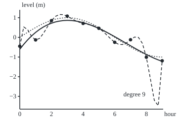
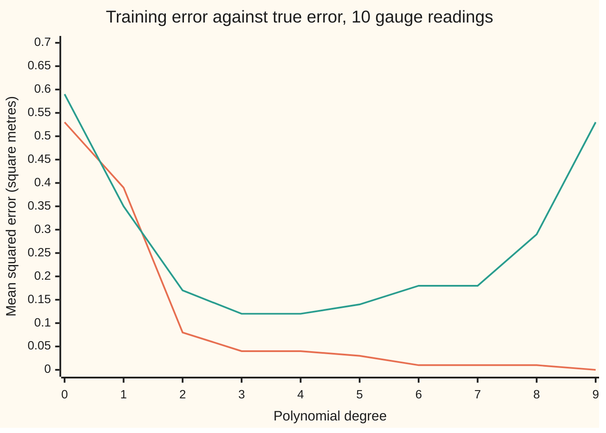

# Overfitting: a model that memorises, and the held-out test that catches it

[Syllabus](../../../SYLLABUS.md) → [Probability and statistics](../README.md) → [Regression](../README.md#s09) → Overfitting

---

## General Overview

A harbour tide gauge reads the water level once an hour, from hour 0 to hour 9. The true level is a slow sine wave with a 12-hour period: it rises from 0 to 1 metre above the harbour's mean, then falls to −1 m. The gauge is cheap. Each reading carries an error with a standard deviation of 0.3 m and is rounded to the centimetre. The ten readings are −0.45, −0.13, 0.85, 1.08, 0.71, 0.46, −0.25, −0.12, −1.01 and −1.19 metres.

The harbour master wants a curve through these readings, to read off the level at half past any hour. A straight line is too stiff: the level goes up and comes down. A polynomial of degree 9, with ten adjustable numbers, can pass exactly through all ten readings. Its error on the readings is zero. Between the last two readings it dives: at hour 8.75 it reads −3.48 m, where the true level is −0.99 m. On fresh readings taken at random moments across the nine hours, its average squared error is 4.45 times that of a plain cubic, a polynomial of degree 3.

That is **overfitting**: a curve flexible enough to copy the noise in its data along with the signal. It memorises instead of learning. The error on the readings it was fitted to, its **training error**, cannot see this: it falls with every added coefficient, down to zero. The cure is to score the curve on readings it was not allowed to see. Cutting the data into parts, fitting on all but one part, scoring on the part held out, and rotating is **cross-validation**. On this record it picks degree 3, the degree that does best on fresh readings; on most records from the same gauge it lands near the best degree rather than on it (Step 6).

**A curve's error on its own data is biased low by an amount that grows with its flexibility, so a fitting procedure is judged, and its flexibility chosen, by its error on data held out from the fit.**

**What kind of fact this is:** a method. The fact that makes it work is a theorem proved on this card in Why it works: against repeat readings at the same hours, training error flatters a least-squares fit by $2\sigma^2 p/n$ on average. The shortcut that gives a fit's leave-one-out errors from one fit is proved on [Diagnostics](04-diagnostics-and-residuals.md).

### The picture: ten readings, two curves

The ten dots are the gauge readings. The dotted curve is the true level. The solid curve is the least-squares cubic, degree 3. The dashed curve is the degree-9 polynomial through every reading. Drawn to scale from the checks' output: 32 units per hour across, 40 units per metre down.

<p align="center"></p>

The cubic stays near the true level except at the left end, where the low readings at hours 0 and 1 drag it well below the tide. The degree-9 curve obeys every dot and nothing else: it kinks up between hours 0 and 1 and plunges between hours 8 and 9, where no reading holds it down.

---

## The formula

Notation first. Reading $i$ is $y_i$, taken at hour $t_i$, for $i = 1, \dots, n$; here $n = 10$ and $t_i = i - 1$. A hat marks an estimate, as on [Samples and estimators](../07-Sampling%20and%20Estimation/01-populations-samples-and-estimators.md): $\hat f$ is the fitted curve. A superscript in brackets with a minus sign names what was left out: $\hat f^{(-k)}$ is the curve fitted with part $k$ of the data held back. The data are cut into $K$ parts of about equal size, called **folds**; here $K = 5$, and fold $k$ holds hours $k - 1$ and $k + 4$: hours 0 and 5, then 1 and 6, and so on. The **K-fold cross-validation estimate** of a procedure's error is

$$\mathrm{CV}_K = \frac{1}{n}\sum_{k=1}^{K}\ \sum_{i \in \text{fold } k}\big(y_i - \hat f^{(-k)}(t_i)\big)^2$$

**Read it aloud:** hold back one fold, fit on the rest, square the misses on the held-back readings; do this for every fold, and average all $n$ squared misses.

With $K = n$ each fold is one reading. That is **leave-one-out** cross-validation. For a least-squares fit it needs no refitting at all:

$$y_i - \hat f^{(-i)}(t_i) = \frac{e_i}{1 - h_i}$$

**Read it aloud:** the miss on a reading the fit never saw is the ordinary miss on it, its residual, divided by one minus its leverage.

The **leverage** $h_i$ is how strongly reading $i$ pulls the fitted curve toward itself, a number between 0 and 1 ([Diagnostics](04-diagnostics-and-residuals.md) proves the shortcut above and uses leverage to flag influential points). The leverages are the diagonal entries of the **hat matrix** $H$, the matrix that turns the ten readings into the ten fitted values.

Why training error cannot be trusted is one more line. Write $\overline{\mathrm{err}}$ for the **training error**, the average squared residual over the $n$ readings; $p$ for the number of coefficients; and $\sigma$ for the noise's standard deviation. Suppose each reading is taken again at the same hour, with new noise. The average amount by which training error falls short of the error on those repeat readings is the **in-sample optimism**: in-sample, because the repeat readings sit at the hours the curve was fitted to. Averaged over all the records the gauge could produce,

$$E[\text{error on the repeat readings}] - E[\overline{\mathrm{err}}] = \frac{2\sigma^2 p}{n}$$

**Read it aloud:** a least-squares fit's error on its own readings is lower than on repeat readings at the same hours, on average, by twice the noise variance times the number of coefficients, divided by the number of readings.

| Symbol | Plain meaning | In our example | Push it up and the answer… |
| --- | --- | --- | --- |
| $t_i$, $y_i$, $i$, $j$ | the hour and the gauge reading of reading $i$; $j$ is a second reading's number | hour 0, −0.45 m | — |
| $y_i'$, $\varepsilon_i'$ | in the optimism proof: a repeat reading at hour $t_i$, and its fresh noise | — | — |
| $n$ | the number of readings | 10 | the optimism shrinks like $1/n$ |
| $X$ | the design matrix, one row per reading holding the powers of its rescaled hour | 10 rows, 4 columns at degree 3 | — |
| $f$ | the true level, a sine wave; unknown outside a simulation | −0.9914 m at hour 8.75 | — |
| $d$, $p$ | the polynomial's degree, and its number of coefficients, $p = d + 1$ | degree 3, $p = 4$ | training error falls; the optimism grows |
| $\hat f$, $\hat y$, $\hat y_i$ | the curve fitted by least squares to all ten readings; its fitted values at the ten hours, and the one at hour $t_i$ | the cubic in the picture | — |
| $K$, $k$, $\hat f^{(-k)}$ | the number of folds, one fold, and the curve fitted without it ($\hat f^{(-i)}$: without reading $i$) | 5 folds of two readings; cubics on 8 readings | each fit sees more of the data |
| $\mathrm{CV}_K$ | the cross-validation estimate, in square metres | 0.1651, 5-fold, degree 3 | — |
| $e_i$ | the residual: reading minus fitted value | 0.1583 m at hour 0, degree 3 | — |
| $H$, $h_{ij}$, $h_i$ | the hat matrix, its entries, and its $i$-th diagonal entry, the leverage | $h_i$ = 0.8238 at hour 0, degree 3 | the held-out miss grows as $1/(1 - h_i)$ |
| $\sigma$, $\varepsilon_i$ | the gauge noise's standard deviation, and reading $i$'s own noise | 0.3 m | every error grows |
| $\overline{\mathrm{err}}$, $\mathrm{Err}$ | training error, and true error: the average squared miss on a fresh reading at a random moment in hours 0 to 9 | 0.0434 and 0.1197 at degree 3 | — |

### When it holds

- **Held-out readings independent of the training readings.** Enter every reading twice and leave-one-out keeps each held-out reading's twin in the fit, so degree 9 scores 0.0000.
- **New cases like the old ones.** Cross-validation scores the fit on hours 0 to 9. It says nothing about hour 12, where every polynomial here is a guess.
- **Every choice made inside the loop.** Anything learned from the data, such as a scaling or a selection of inputs, is learned again on each fold's training part. The degree picked by the lowest score, quoted with that same score, is flattered, since the score helped pick it; an untouched test set, or a second cross-validation wrapped around the first, gives the honest figure.
- **The fit being scored is the fit on fewer readings.** Five-fold fits on 8 readings, not 10. At high degrees that is a much worse curve than the one finally used; What breaks shows degree 7.
- **The optimism formula needs a least-squares fit and plain noise:** each reading's noise averaging zero, all with the same variance, no two correlated. Readings that drift together can flatter the fit by far more than $2\sigma^2 p/n$.

---

## Why it works

### Step 0: noise the fit has seen looks like skill

A fitted curve bends toward every reading it is given, noise included, and scored on those readings the bend counts as accuracy. A held-out reading carries noise the curve never saw, so its miss measures what a new reading would get.

### Step 1: training error never rises

Every cubic is also a quartic whose top coefficient is zero. So the best quartic fits at least as well as the best cubic, and training error can only fall as the degree rises. Ten coefficients can match ten readings exactly, and training error hits zero.

The true error does something else. It falls while extra coefficients capture the tide's shape, then rises once they start tracking noise.



Orange: training error, falling to 0.00 at degree 9. Green: true error, lowest at degree 3 (0.12), back up to 0.53 at degree 9. The gap between the two lines is what overfitting costs.

### Step 2: how much training error flatters

Write each reading as the true level plus noise: $y_i = f(t_i) + \varepsilon_i$. A least-squares fitted value is a weighted sum of all the readings, and reading $i$'s own weight is its leverage $h_i$. So the fitted value at hour $t_i$ contains $h_i \varepsilon_i$, a share of the very noise it is scored against. A repeat reading at the same hour carries fresh noise the fit never copied. The two errors differ on average by $2\sigma^2 h_i$, and the leverages add up to $p$ ([Diagnostics](04-diagnostics-and-residuals.md)), so the average gap over the readings is $2\sigma^2 p/n$.

For the cubic: 2 × 0.09 × 4 / 10 = 0.0720 square metres. Ten thousand simulated records give 0.0721, with standard error 0.0007. At degree 9 the in-sample optimism is 0.1800, twice the noise variance: the curve has swallowed all the noise. Between the readings a flexible curve can do far worse. The chart's gap at degree 9, true error at random moments minus training error, is 0.5327 − 0.0000 = 0.53, about three times the optimism, because the curve through every reading swings far from the tide between them, to −3.48 m at hour 8.75. For the cubic the two nearly agree: training error plus optimism is 0.0434 + 0.0720 = 0.1154, against a true error of 0.1197.

<details>
<summary>Detailed proof: the optimism of training error is $2\sigma^2 p/n$</summary>

**Setup.** Readings $y_i = f(t_i) + \varepsilon_i$ for $i = 1, \dots, n$. The noises have average 0 and variance $\sigma^2$, and no two are correlated. A repeat reading $y_i' = f(t_i) + \varepsilon_i'$ has fresh noise with the same properties, uncorrelated with all the $\varepsilon_j$. The fit is least squares on a design matrix $X$ with $n$ rows and $p$ columns, full column rank (no column is a mix of the others), so the fitted values are $\hat y = Hy$, where $H = X(X^\top X)^{-1}X^\top$ is the hat matrix of [Diagnostics](04-diagnostics-and-residuals.md). Write $h_{ij}$ for the entries of $H$ and $h_i = h_{ii}$.

**The repeat reading.** $y_i' - \hat y_i = \varepsilon_i' + (f(t_i) - \hat y_i)$. The fitted value does not involve $\varepsilon_i'$, so the cross term averages to zero: $E[(y_i' - \hat y_i)^2] = \sigma^2 + E[(f(t_i) - \hat y_i)^2]$.

**The training reading.** $y_i - \hat y_i = \varepsilon_i + (f(t_i) - \hat y_i)$, so $E[(y_i - \hat y_i)^2] = \sigma^2 + E[(f(t_i) - \hat y_i)^2] - 2E[\varepsilon_i \hat y_i]$, using $E[\varepsilon_i f(t_i)] = 0$. Now $\hat y_i = \sum_j h_{ij}(f(t_j) + \varepsilon_j)$, and $E[\varepsilon_i \varepsilon_j]$ is $\sigma^2$ when $j = i$ and 0 otherwise, so $E[\varepsilon_i \hat y_i] = h_i \sigma^2$.

**Subtract and average.** Each reading's gap is $2\sigma^2 h_i$. Averaged over $i$ it is $2\sigma^2 \big(\sum_i h_i\big)/n$, and the leverages add up to $p$, as [Diagnostics](04-diagnostics-and-residuals.md) proves, so the average gap is $2\sigma^2 p/n$.

Nothing here needed bell-shaped noise, or the true level to be a polynomial. The checks confirm $\sum_i h_i = p$ for every degree, 4.0000 for the cubic and 10.0000 for degree 9.

</details>

### Step 3: a held-out reading is scored honestly

Fit without reading $i$. The curve $\hat f^{(-i)}$ is built from the other nine readings, so it contains no share of $\varepsilon_i$. The cross term from Step 2 is now zero, and

$$E\big[(y_i - \hat f^{(-i)}(t_i))^2\big] = \sigma^2 + E\big[(f(t_i) - \hat f^{(-i)}(t_i))^2\big]$$

That is exactly the average error of a brand-new reading at hour $t_i$, for the curve fitted to nine readings. The held-out miss is an honest sample of new-reading error. It is honest about a slightly different procedure, one that had nine readings instead of ten.

### Step 4: rotate the hold-out

One held-out reading is a noisy score. Rotating uses every reading once as a test and $K - 1$ times as training. With five folds, the first fold holds out hours 0 and 5, the next hours 1 and 6, and so on; each time the cubic is refitted on the other eight, and the two squared misses are added. For degree 3 the five folds give 0.8357, 0.4036, 0.2052, 0.1624 and 0.0442. Their total over ten readings is the five-fold estimate, 0.1651.

The first fold is the worst because it holds out hour 0, and the curve fitted to hours 1–4 and 6–9 must reach back past its data to get there. Held-out end points are where polynomials are most exposed.

### Step 5: leave-one-out from a single fit

Leave-one-out seems to need ten refits per degree. For least squares one fit is enough: the held-out miss is $e_i/(1 - h_i)$, the deleted-residual identity proved on [Diagnostics](04-diagnostics-and-residuals.md).

At hour 0 the cubic's residual is 0.1583 m and its leverage 0.8238: an end reading pulls a cubic hard toward itself. So the held-out miss is 0.1583 / (1 − 0.8238) = 0.8984 m, and the refit without hour 0 misses by 0.8984 m too.

At degree 9 every leverage is 1 and the shortcut divides by zero: dropping a reading leaves nine readings for ten coefficients, and there is no unique curve to predict with.

### Step 6: choose the degree where the held-out error bottoms out

Run the estimate for each degree and take the lowest. Five-fold and leave-one-out both choose degree 3: 0.1651 and 0.1697. Ten squared misses make a rough average: the leave-one-out figure has standard error 0.0775, almost half its size. The true error, computed from the known tide, is also lowest at degree 3, 0.1197. The chosen degree is then refitted on all ten readings; that refit is the curve in the picture.

The scores tend to sit above the true error on average, because each was earned by a curve fitted to fewer readings; part of this record's gap is noise, since it is smaller than the 0.0775 standard error. The ranking matters more than the level. Hitting the very best degree is not guaranteed, and this record is a kind one: on most records from the same gauge, at the same noise, leave-one-out picks a degree near the best rather than the best itself, usually one off, and only rarely one of the wild high degrees. Try changing shows misses with a quieter gauge, a noisier one and another record.

Two other roads lead to the same place. Adding $2\sigma^2 p/n$ back onto the training error estimates the repeat-reading error directly; this is Mallows' Cp, and it needs the noise level known. Resampling the readings with replacement estimates the optimism instead ([Bootstrap](../07-Sampling%20and%20Estimation/08-bootstrap.md)). Cross-validation needs neither a noise level nor a least-squares fit, which is why it is the default.

---

## Worked numbers, by hand

Degree 3, the ten gauge readings, noise standard deviation 0.3 m.

| Step | Arithmetic | Value |
| --- | --- | --- |
| training error of the cubic | average squared residual over the ten readings | 0.0434 |
| five-fold, fold by fold | squared misses on hours (0, 5), (1, 6), (2, 7), (3, 8), (4, 9) | 0.8357, 0.4036, 0.2052, 0.1624, 0.0442 |
| five-fold estimate | the five totals added, divided by 10 readings | **0.1651** |
| leave-one-out at hour 0 | 0.1583 / (1 − 0.8238) | 0.8984 m |
| leave-one-out estimate | average of ten such squared misses | **0.1697** |
| optimism of training error | 2 × 0.09 × 4 / 10 | 0.0720 |
| true error of the cubic | noise variance 0.09 plus the average squared gap to the tide | **0.1197** |
| true error of degree 9 | the same, for the curve through every reading | 0.5327, 4.45 times the cubic's |

Training error says 0.0434 square metres, the held-out estimates 0.1651 and 0.1697, the truth 0.1197. Training error understates the truth almost threefold; the held-out estimates overstate it by much less.

### What breaks if you drop a piece

| Mistake | Comes out at | What went wrong |
| --- | --- | --- |
| Choosing the degree by training error | degree 9: true error 0.5327 against 0.1197 | training error falls with every coefficient, whatever the truth |
| Entering every reading twice, then leaving one out | degree 9 scores 0.0000, the lowest of all | the held-out reading's twin stayed in the fit |
| The shortcut at degree 9 | leverage 1.0000 at every reading, so 0 / 0 | a curve through every reading has nothing to predict with once one is gone |
| Reading five-fold's score as the final fit's error | degree 7: 38.8367 against a true 0.1793 | five-fold scored curves fitted to 8 readings, which swing wildly at the ends |

The code prints all four.

---

## Code, from first principles, and it actually runs

The scripts build the gauge record from a stated seed, then take two roads to each number. Leave-one-out: ten refits, and the one-fit shortcut. True error: Simpson's rule on the squared gap to the known tide, and 50,000 fresh simulated readings with a standard error. Optimism: the formula, and 10,000 simulated records with repeat readings. The degree-9 curve: the least-squares equations, and Lagrange's formula for the polynomial through given points, which solves nothing. Random numbers come from SplitMix64, a short generator written out in both languages, made bell-shaped by the Box–Muller recipe. Hours are rescaled to run from −1 to 1 before powers are taken, which keeps degree 9 solvable in floating point; the rescaling is fixed in advance and learns nothing from the data. In the table, "se" columns are standard errors, and a dash marks a degree too high for the readings a fold leaves.

### Python

```python
# Overfitting and cross-validation -- the check behind the card; only math is imported.
# A tide gauge reads the harbour level at hours 0 to 9.  The true level is
# sin(pi t / 6) metres; each reading adds gauge noise of SD 0.3 m (SplitMix64
# and Box-Muller, written out) and is rounded to the centimetre.  Polynomials
# of degree 0 to 9 are fitted by least squares and judged by several roads.
import math

N, SIG, SEED, FRESH, RECORDS = 10, 0.3, 20260922, 50000, 10000
M64 = 0xFFFFFFFFFFFFFFFF
TS = [float(t) for t in range(N)]

def splitmix64(s):                          # the generator both languages share
    s = (s + 0x9E3779B97F4A7C15) & M64
    z = ((s ^ (s >> 30)) * 0xBF58476D1CE4E5B9) & M64
    z = ((z ^ (z >> 27)) * 0x94D049BB133111EB) & M64
    return s, z ^ (z >> 31)
def uniform(s):                             # a draw in (0, 1] from 53 random bits
    s, z = splitmix64(s)
    return s, ((z >> 11) + 1) * 2.0 ** -53
def normal(s):                              # Box-Muller, cosine half only
    s, u1 = uniform(s)
    s, u2 = uniform(s)
    return s, math.sqrt(-2.0 * math.log(u1)) * math.cos(2.0 * math.pi * u2)
def tide(t): return math.sin(math.pi * t / 6.0)       # the true level, known because we built it
def powers(t, d): return [((t - 4.5) / 4.5) ** j for j in range(d + 1)]   # hours rescaled to [-1, 1]
def solve(a, b):                            # Gaussian elimination with partial pivoting
    p = len(b)
    m = [a[i][:] + [b[i]] for i in range(p)]
    for c in range(p):
        k = max(range(c, p), key=lambda r: abs(m[r][c]))
        m[c], m[k] = m[k], m[c]
        for r in range(c + 1, p):
            f = m[r][c] / m[c][c]
            for j in range(c, p + 1):
                m[r][j] -= f * m[c][j]
    x = [0.0] * p
    for c in range(p - 1, -1, -1):
        x[c] = (m[c][p] - sum(m[c][j] * x[j] for j in range(c + 1, p))) / m[c][c]
    return x
def gram(ts, d):                            # the rows of X, and X'X
    rows = [powers(t, d) for t in ts]
    return rows, [[sum(r[i] * r[j] for r in rows) for j in range(d + 1)] for i in range(d + 1)]
def fit(ts, ys, d):                         # least squares by the normal equations X'X c = X'y
    rows, a = gram(ts, d)
    return solve(a, [sum(r[i] * y for r, y in zip(rows, ys)) for i in range(d + 1)])
def pred(c, t): return sum(cj * x for cj, x in zip(c, powers(t, len(c) - 1)))
def hat(d):                                 # H = X (X'X)^-1 X': readings in, fitted values out
    rows, a = gram(TS, d)
    v = [solve(a, r) for r in rows]
    return [[sum(x * y for x, y in zip(rows[i], v[j])) for j in range(N)] for i in range(N)]
def lagrange(t):                            # degree 9 through all ten readings, no equations solved
    return sum(y * math.prod((t - s) / (ti - s) for s in TS if s != ti) for ti, y in zip(TS, YS))
def loo(ts, ys, d, i):                      # refit without reading i, return its held-out error
    return ys[i] - pred(fit(ts[:i] + ts[i + 1:], ys[:i] + ys[i + 1:], d), ts[i])
def fold(d, k):                             # 5 folds: fold k holds out hours k and k + 5
    c = fit([t for t in TS if t % 5 != k], [y for t, y in zip(TS, YS) if t % 5 != k], d)
    return sum((YS[i] - pred(c, TS[i])) ** 2 for i in (k, k + 5))
def mean_se(xs):                            # an average and its standard error
    m = sum(xs) / len(xs)
    return m, math.sqrt(sum((x - m) ** 2 for x in xs) / (len(xs) - 1) / len(xs))
def f4(v): return f"{v:9.4f}" if v == v else "        -"

state, YS, fresh, recs = SEED, [], [], []
for t in TS:
    state, z = normal(state)
    YS.append(math.floor((tide(t) + SIG * z) * 100 + 0.5) / 100)
for _ in range(FRESH):                      # fresh readings at random hours in [0, 9]
    state, u = uniform(state)
    state, z = normal(state)
    fresh.append((9.0 * u, tide(9.0 * u) + SIG * z))
for _ in range(RECORDS):                    # whole new records at hours 0..9, each with a repeat reading
    one = []
    for t in TS:
        state, z = normal(state)
        state, z2 = normal(state)
        one.append((tide(t) + SIG * z, tide(t) + SIG * z2))
    recs.append(one)

print(f"setup: {N} readings at hours 0 to 9, gauge noise SD {SIG} m, noise variance {SIG * SIG:.4f}, seed {SEED}")
print("record, hour  " + "".join(f"{t:7.0f}" for t in TS))
print("record, level " + "".join(f"{y:7.2f}" for y in YS))
print("deg     train   5-fold  LOO-refit  LOO-hat   LOO-se  true-int  true-sim   sim-se  optim-sim  2s2p/n   opt-se")
R, fits = {}, {}
for d in range(10):
    c = fits[d] = fit(TS, YS, d)
    H = hat(d)
    train = sum((y - pred(c, t)) ** 2 for t, y in zip(TS, YS)) / N
    k2 = 1800                               # Simpson's rule on the squared gap to the truth
    integ = sum((1 if k in (0, k2) else 4 if k % 2 else 2) * (tide(k * 9 / k2) - pred(c, k * 9 / k2)) ** 2
                for k in range(k2 + 1)) * (9 / k2) / 3 / 9 + SIG * SIG
    sim, sim_se = mean_se([(y - pred(c, t)) ** 2 for t, y in fresh])
    kf = lr = lh = lse = float("nan")
    if d <= 7:                              # 8 readings pin at most 8 coefficients
        kf = sum(fold(d, k) for k in range(5)) / N
    if d <= 8:
        lr, lse = mean_se([loo(TS, YS, d, i) ** 2 for i in range(N)])
        lh = sum(((YS[i] - pred(c, TS[i])) / (1 - H[i][i])) ** 2 for i in range(N)) / N
    gaps = []                               # new reading's error minus training error, same hours
    for one in recs:
        yh = [sum(H[i][j] * one[j][0] for j in range(N)) for i in range(N)]
        gaps.append(sum((one[i][1] - yh[i]) ** 2 - (one[i][0] - yh[i]) ** 2 for i in range(N)) / N)
    gap, gse = mean_se(gaps)
    R[d] = dict(train=train, kf=kf, lr=lr, lh=lh, integ=integ, sim=sim, sim_se=sim_se, gap=gap, gse=gse,
                p=2 * SIG * SIG * (d + 1) / N, trace=sum(H[i][i] for i in range(N)), h=[H[i][i] for i in range(N)])
    print(f"{d:3d} {train:9.4f}{f4(kf)}{f4(lr)}{f4(lh)}{f4(lse)}{integ:9.4f}{sim:10.4f}{sim_se:9.4f}"
          f"{gap:10.4f}{R[d]['p']:9.4f}{gse:9.4f}")

best = {key: min(range(top), key=lambda d: R[d][key]) for key, top in
        (("train", 10), ("kf", 8), ("lr", 9), ("integ", 10))}
print(f"lowest training error: degree {best['train']}; lowest 5-fold: degree {best['kf']}; "
      f"lowest LOO: degree {best['lr']}; lowest true error: degree {best['integ']}")
print(f"degree 9 true error / degree 3 true error: {R[9]['integ'] / R[3]['integ']:.2f}")
print("degree 3, 5-fold held-out squared errors by fold (hours k, k+5): " + " ".join(f"{fold(3, k):.4f}" for k in range(5)))
e0, h0 = YS[0] - pred(fits[3], 0.0), R[3]["h"][0]
print(f"degree 3, hour 0: residual {e0:.4f}, leverage {h0:.4f}, residual/(1 - leverage) {e0 / (1 - h0):.4f}, "
      f"refit without it {loo(TS, YS, 3, 0):.4f}")
for d in (3, 9):
    print(f"degree {d}, leverages: " + " ".join(f"{h:.4f}" for h in R[d]["h"]) + f"; sum {R[d]['trace']:.4f}")
print(f"degree 9 at hour 8.75: normal equations {pred(fits[9], 8.75):.6f}, Lagrange {lagrange(8.75):.6f}, "
      f"truth {tide(8.75):.4f}")
T2, Y2 = TS + TS, YS + YS
leak = [sum(loo(T2, Y2, d, i) ** 2 for i in range(2 * N)) / (2 * N) for d in range(10)]
print("leak, LOO with every reading entered twice, degree 0..9: " + " ".join(f"{v:.4f}" for v in leak))
for name, key in (("training error", "train"), ("true error    ", "integ")):
    print(f"chart, {name} " + " ".join(f"{R[d][key]:.2f}" for d in range(10)))
X, Y = (lambda t: f"{40 + 32 * t:.1f}"), (lambda v: f"{20 + 40 * (1.4 - v):.1f}")
print("figure, readings " + " ".join(f"{X(t)},{Y(y)}" for t, y in zip(TS, YS)))
for name, g in (("truth", tide), ("degree 3", lambda t: pred(fits[3], t)), ("degree 9", lambda t: pred(fits[9], t))):
    print(f"figure, {name} " + " ".join(f"{X(k / 4)},{Y(g(k / 4))}" for k in range(37)))

for d in range(9):                          # the shortcut and the refits are separate roads
    assert abs(R[d]["lr"] - R[d]["lh"]) < 1e-7 * max(1.0, R[d]["lr"]), f"LOO shortcut vs refit, degree {d}"
for d in range(10):
    assert abs(R[d]["integ"] - R[d]["sim"]) < 4 * R[d]["sim_se"], f"Simpson vs fresh readings, degree {d}"
    assert abs(R[d]["gap"] - R[d]["p"]) < 4 * R[d]["gse"], f"simulated optimism vs 2 sigma^2 p / n, degree {d}"
    assert abs(R[d]["trace"] - (d + 1)) < 1e-8, f"sum of leverages vs number of coefficients, degree {d}"
assert abs(pred(fits[9], 8.75) - lagrange(8.75)) < 1e-6, "normal equations vs Lagrange at degree 9"
assert best["lr"] == best["integ"], "leave-one-out picks the degree with the lowest true error"
print("ALL CHECKS PASS")
```

**Ran 2026-09-28 on macOS, Python 3.14.6, standard library only. All checks passed. Output, pasted from the run:**

```
setup: 10 readings at hours 0 to 9, gauge noise SD 0.3 m, noise variance 0.0900, seed 20260922
record, hour        0      1      2      3      4      5      6      7      8      9
record, level   -0.45  -0.13   0.85   1.08   0.71   0.46  -0.25  -0.12  -1.01  -1.19
deg     train   5-fold  LOO-refit  LOO-hat   LOO-se  true-int  true-sim   sim-se  optim-sim  2s2p/n   opt-se
  0    0.5337   0.5593   0.6589   0.6589   0.2022   0.5921    0.5979   0.0026    0.0184   0.0180   0.0019
  1    0.3882   0.6250   0.6854   0.6854   0.2275   0.3499    0.3543   0.0018    0.0363   0.0360   0.0014
  2    0.0846   0.2021   0.1999   0.1999   0.0696   0.1696    0.1715   0.0010    0.0539   0.0540   0.0009
  3    0.0434   0.1651   0.1697   0.1697   0.0775   0.1197    0.1208   0.0008    0.0721   0.0720   0.0007
  4    0.0419   0.5150   0.4602   0.4602   0.3304   0.1221    0.1232   0.0008    0.0900   0.0900   0.0007
  5    0.0310   2.2112   2.2078   2.2078   1.3869   0.1374    0.1386   0.0009    0.1076   0.1080   0.0007
  6    0.0141   4.8459   1.7888   1.7888   1.5637   0.1822    0.1832   0.0013    0.1256   0.1260   0.0007
  7    0.0126  38.8367  37.9334  37.9334  27.1550   0.1793    0.1803   0.0012    0.1432   0.1440   0.0008
  8    0.0057        - 558.1682 558.1682 366.0221   0.2915    0.2915   0.0021    0.1617   0.1620   0.0008
  9    0.0000        -        -        -        -   0.5327    0.5317   0.0059    0.1795   0.1800   0.0008
lowest training error: degree 9; lowest 5-fold: degree 3; lowest LOO: degree 3; lowest true error: degree 3
degree 9 true error / degree 3 true error: 4.45
degree 3, 5-fold held-out squared errors by fold (hours k, k+5): 0.8357 0.4036 0.2052 0.1624 0.0442
degree 3, hour 0: residual 0.1583, leverage 0.8238, residual/(1 - leverage) 0.8984, refit without it 0.8984
degree 3, leverages: 0.8238 0.3016 0.3261 0.3075 0.2410 0.2410 0.3075 0.3261 0.3016 0.8238; sum 4.0000
degree 9, leverages: 1.0000 1.0000 1.0000 1.0000 1.0000 1.0000 1.0000 1.0000 1.0000 1.0000; sum 10.0000
degree 9 at hour 8.75: normal equations -3.475719, Lagrange -3.475719, truth -0.9914
leak, LOO with every reading entered twice, degree 0..9: 0.5913 0.4991 0.1159 0.0647 0.0685 0.0592 0.0273 0.0280 0.0146 0.0000
chart, training error 0.53 0.39 0.08 0.04 0.04 0.03 0.01 0.01 0.01 0.00
chart, true error     0.59 0.35 0.17 0.12 0.12 0.14 0.18 0.18 0.29 0.53
figure, readings 40.0,94.0 72.0,81.2 104.0,42.0 136.0,32.8 168.0,47.6 200.0,57.6 232.0,86.0 264.0,80.8 296.0,116.4 328.0,123.6
figure, truth 40.0,76.0 48.0,70.8 56.0,65.6 64.0,60.7 72.0,56.0 80.0,51.6 88.0,47.7 96.0,44.3 104.0,41.4 112.0,39.0 120.0,37.4 128.0,36.3 136.0,36.0 144.0,36.3 152.0,37.4 160.0,39.0 168.0,41.4 176.0,44.3 184.0,47.7 192.0,51.6 200.0,56.0 208.0,60.7 216.0,65.6 224.0,70.8 232.0,76.0 240.0,81.2 248.0,86.4 256.0,91.3 264.0,96.0 272.0,100.4 280.0,104.3 288.0,107.7 296.0,110.6 304.0,113.0 312.0,114.6 320.0,115.7 328.0,116.0
figure, degree 3 40.0,100.3 48.0,90.1 56.0,81.0 64.0,72.9 72.0,65.9 80.0,59.8 88.0,54.7 96.0,50.5 104.0,47.2 112.0,44.6 120.0,42.9 128.0,41.8 136.0,41.4 144.0,41.7 152.0,42.6 160.0,44.0 168.0,46.0 176.0,48.4 184.0,51.2 192.0,54.4 200.0,57.9 208.0,61.7 216.0,65.8 224.0,70.1 232.0,74.6 240.0,79.1 248.0,83.8 256.0,88.4 264.0,93.1 272.0,97.7 280.0,102.2 288.0,106.6 296.0,110.8 304.0,114.8 312.0,118.5 320.0,121.8 328.0,124.9
figure, degree 9 40.0,94.0 48.0,54.8 56.0,60.4 64.0,74.3 72.0,81.2 80.0,78.1 88.0,67.6 96.0,54.3 104.0,42.0 112.0,33.4 120.0,29.5 128.0,29.7 136.0,32.8 144.0,37.3 152.0,41.7 160.0,45.2 168.0,47.6 176.0,49.2 184.0,50.9 192.0,53.4 200.0,57.6 208.0,63.6 216.0,71.2 224.0,79.1 232.0,86.0 240.0,90.2 248.0,90.6 256.0,87.0 264.0,80.8 272.0,75.4 280.0,76.0 288.0,88.2 296.0,116.4 304.0,159.3 312.0,203.8 320.0,215.0 328.0,123.6
ALL CHECKS PASS
```

### Rust

Same numbers, same labels, built with `rustc --edition 2021 -O`.

```rust
// Overfitting and cross-validation -- the same check as the Python, in Rust, std only.
// A tide gauge reads the harbour level at hours 0 to 9.  The true level is
// sin(pi t / 6) metres; each reading adds gauge noise of SD 0.3 m (SplitMix64
// and Box-Muller, written out) and is rounded to the centimetre.  Polynomials
// of degree 0 to 9 are fitted by least squares and judged by several roads.
use std::f64::consts::PI;

const N: usize = 10;
const SIG: f64 = 0.3;
const SEED: u64 = 20260922; const FRESH: usize = 50000; const RECORDS: usize = 10000;

fn splitmix64(s: &mut u64) -> u64 {             // the generator both languages share
    *s = s.wrapping_add(0x9E3779B97F4A7C15);
    let mut z = (*s ^ (*s >> 30)).wrapping_mul(0xBF58476D1CE4E5B9);
    z = (z ^ (z >> 27)).wrapping_mul(0x94D049BB133111EB);
    z ^ (z >> 31)
}
fn uniform(s: &mut u64) -> f64 { ((splitmix64(s) >> 11) + 1) as f64 * 2f64.powi(-53) }
fn normal(s: &mut u64) -> f64 {                 // Box-Muller, cosine half only
    let (u1, u2) = (uniform(s), uniform(s));
    (-2.0 * u1.ln()).sqrt() * (2.0 * PI * u2).cos()
}
fn tide(t: f64) -> f64 { (PI * t / 6.0).sin() }  // the true level, known because we built it
fn powers(t: f64, d: usize) -> Vec<f64> { (0..=d).map(|j| ((t - 4.5) / 4.5).powf(j as f64)).collect() }
fn solve(a: &[Vec<f64>], b: &[f64]) -> Vec<f64> { // Gaussian elimination with partial pivoting
    let p = b.len();
    let mut m: Vec<Vec<f64>> = (0..p).map(|i| { let mut r = a[i].clone(); r.push(b[i]); r }).collect();
    for c in 0..p {
        let k = (c..p).fold(c, |k, r| if m[r][c].abs() > m[k][c].abs() { r } else { k });
        m.swap(c, k);
        for r in c + 1..p {
            let f = m[r][c] / m[c][c];
            for j in c..=p { m[r][j] -= f * m[c][j] }
        }
    }
    let mut x = vec![0.0; p];
    for c in (0..p).rev() {
        let s: f64 = (c + 1..p).map(|j| m[c][j] * x[j]).fold(0.0, |u, v| u + v);
        x[c] = (m[c][p] - s) / m[c][c];
    }
    x
}
fn sum(v: impl Iterator<Item = f64>) -> f64 { v.fold(0.0, |a, b| a + b) }
fn gram(ts: &[f64], d: usize) -> (Vec<Vec<f64>>, Vec<Vec<f64>>) { // the rows of X, and X'X
    let rows: Vec<Vec<f64>> = ts.iter().map(|&t| powers(t, d)).collect();
    let a = (0..=d).map(|i| (0..=d).map(|j| sum(rows.iter().map(|r| r[i] * r[j]))).collect()).collect();
    (rows, a)
}
fn fit(ts: &[f64], ys: &[f64], d: usize) -> Vec<f64> { // least squares by the normal equations
    let (rows, a) = gram(ts, d);
    let b: Vec<f64> = (0..=d).map(|i| sum(rows.iter().zip(ys).map(|(r, y)| r[i] * y))).collect();
    solve(&a, &b)
}
fn pred(c: &[f64], t: f64) -> f64 { sum(c.iter().zip(powers(t, c.len() - 1)).map(|(a, b)| a * b)) }
fn hat(ts: &[f64], d: usize) -> Vec<Vec<f64>> {  // H = X (X'X)^-1 X': readings in, fitted values out
    let (rows, a) = gram(ts, d);
    let v: Vec<Vec<f64>> = rows.iter().map(|r| solve(&a, r)).collect();
    (0..N).map(|i| (0..N).map(|j| sum(rows[i].iter().zip(&v[j]).map(|(x, y)| x * y))).collect()).collect()
}
fn lagrange(ts: &[f64], ys: &[f64], t: f64) -> f64 { // degree 9 through all ten readings
    sum(ts.iter().zip(ys).map(|(&ti, &y)| {
        y * ts.iter().filter(|&&s| s != ti).fold(1.0, |acc, &s| acc * ((t - s) / (ti - s)))
    }))
}
fn loo(ts: &[f64], ys: &[f64], d: usize, i: usize) -> f64 { // refit without reading i
    let (mut t2, mut y2) = (ts.to_vec(), ys.to_vec());
    (t2.remove(i), y2.remove(i));
    ys[i] - pred(&fit(&t2, &y2, d), ts[i])
}
fn fold(ts: &[f64], ys: &[f64], d: usize, k: usize) -> f64 { // fold k holds out hours k and k + 5
    let keep: Vec<usize> = (0..N).filter(|j| j % 5 != k).collect();
    let tk: Vec<f64> = keep.iter().map(|&j| ts[j]).collect();
    let yk: Vec<f64> = keep.iter().map(|&j| ys[j]).collect();
    let c = fit(&tk, &yk, d);
    sum([k, k + 5].iter().map(|&i| (ys[i] - pred(&c, ts[i])).powi(2)))
}
fn mean_se(xs: &[f64]) -> (f64, f64) {          // an average and its standard error
    let n = xs.len() as f64;
    let m = sum(xs.iter().copied()) / n;
    (m, (sum(xs.iter().map(|x| (x - m).powi(2))) / (n - 1.0) / n).sqrt())
}
fn f4(v: f64) -> String { if v.is_nan() { "        -".to_string() } else { format!("{:9.4}", v) } }
fn join(v: impl Iterator<Item = String>) -> String { v.collect::<Vec<String>>().join(" ") }

fn main() {
    let ts: Vec<f64> = (0..N).map(|t| t as f64).collect();
    let mut state = SEED;
    let ys: Vec<f64> = ts.iter().map(|&t| ((tide(t) + SIG * normal(&mut state)) * 100.0 + 0.5).floor() / 100.0).collect();
    let fresh: Vec<(f64, f64)> = (0..FRESH).map(|_| {       // fresh readings at random hours in [0, 9]
        let u = uniform(&mut state);
        (9.0 * u, tide(9.0 * u) + SIG * normal(&mut state))
    }).collect();
    let recs: Vec<Vec<(f64, f64)>> = (0..RECORDS).map(|_| ts.iter().map(|&t| {
        let (z, z2) = (normal(&mut state), normal(&mut state));
        (tide(t) + SIG * z, tide(t) + SIG * z2)
    }).collect()).collect();
    println!("setup: {} readings at hours 0 to 9, gauge noise SD {} m, noise variance {:.4}, seed {}", N, SIG, SIG * SIG, SEED);
    println!("record, hour  {}", ts.iter().map(|t| format!("{:7.0}", t)).collect::<String>());
    println!("record, level {}", ys.iter().map(|y| format!("{:7.2}", y)).collect::<String>());
    println!("deg     train   5-fold  LOO-refit  LOO-hat   LOO-se  true-int  true-sim   sim-se  optim-sim  2s2p/n   opt-se");
    let (mut fits, mut rr, mut levs) = (Vec::new(), Vec::new(), Vec::<Vec<f64>>::new()); // rr: columns as pushed
    for d in 0..N {
        let c = fit(&ts, &ys, d);
        let h = hat(&ts, d);
        let train = sum(ts.iter().zip(&ys).map(|(&t, y)| (y - pred(&c, t)).powi(2))) / N as f64;
        let k2 = 1800usize;                               // Simpson's rule on the squared gap to the truth
        let integ = sum((0..=k2).map(|k| {
            let w = if k == 0 || k == k2 { 1.0 } else if k % 2 == 1 { 4.0 } else { 2.0 };
            let t = (k * 9) as f64 / k2 as f64;
            w * (tide(t) - pred(&c, t)).powi(2)
        })) * (9.0 / k2 as f64) / 3.0 / 9.0 + SIG * SIG;
        let (sim, sim_se) = mean_se(&fresh.iter().map(|&(t, y)| (y - pred(&c, t)).powi(2)).collect::<Vec<f64>>());
        let (mut kf, mut lr, mut lh, mut lse) = (f64::NAN, f64::NAN, f64::NAN, f64::NAN);
        if d <= 7 { kf = sum((0..5).map(|k| fold(&ts, &ys, d, k))) / N as f64 }
        if d <= 8 {
            let e2: Vec<f64> = (0..N).map(|i| loo(&ts, &ys, d, i).powi(2)).collect();
            (lr, lse) = mean_se(&e2);
            lh = sum((0..N).map(|i| ((ys[i] - pred(&c, ts[i])) / (1.0 - h[i][i])).powi(2))) / N as f64;
        }
        let gaps: Vec<f64> = recs.iter().map(|one| {        // new reading's error minus training error
            let yh: Vec<f64> = (0..N).map(|i| sum((0..N).map(|j| h[i][j] * one[j].0))).collect();
            sum((0..N).map(|i| (one[i].1 - yh[i]).powi(2) - (one[i].0 - yh[i]).powi(2))) / N as f64
        }).collect();
        let (gap, gse) = mean_se(&gaps);
        let p = 2.0 * SIG * SIG * (d + 1) as f64 / N as f64;
        levs.push((0..N).map(|i| h[i][i]).collect());
        let trace = sum(levs[d].iter().copied());
        println!("{:3} {:9.4}{}{}{}{}{:9.4}{:10.4}{:9.4}{:10.4}{:9.4}{:9.4}",
                 d, train, f4(kf), f4(lr), f4(lh), f4(lse), integ, sim, sim_se, gap, p, gse);
        rr.push([train, kf, lr, lh, integ, sim, sim_se, gap, gse, p, trace]);
        fits.push(c);
    }
    let argmin = |col: usize, top: usize| (0..top).fold(0, |b, d| if rr[d][col] < rr[b][col] { d } else { b });
    let (b_train, b_kf, b_lr, b_integ) = (argmin(0, 10), argmin(1, 8), argmin(2, 9), argmin(4, 10));
    println!("lowest training error: degree {}; lowest 5-fold: degree {}; lowest LOO: degree {}; lowest true error: degree {}",
             b_train, b_kf, b_lr, b_integ);
    println!("degree 9 true error / degree 3 true error: {:.2}", rr[9][4] / rr[3][4]);
    println!("degree 3, 5-fold held-out squared errors by fold (hours k, k+5): {}",
             join((0..5).map(|k| format!("{:.4}", fold(&ts, &ys, 3, k)))));
    let (e0, h0) = (ys[0] - pred(&fits[3], 0.0), levs[3][0]);
    println!("degree 3, hour 0: residual {:.4}, leverage {:.4}, residual/(1 - leverage) {:.4}, refit without it {:.4}",
             e0, h0, e0 / (1.0 - h0), loo(&ts, &ys, 3, 0));
    for d in [3, 9] {
        println!("degree {}, leverages: {}; sum {:.4}", d, join(levs[d].iter().map(|h| format!("{:.4}", h))), rr[d][10]);
    }
    let (p9, l9) = (pred(&fits[9], 8.75), lagrange(&ts, &ys, 8.75));
    println!("degree 9 at hour 8.75: normal equations {:.6}, Lagrange {:.6}, truth {:.4}", p9, l9, tide(8.75));
    let (t2, y2): (Vec<f64>, Vec<f64>) = (ts.iter().chain(&ts).copied().collect(), ys.iter().chain(&ys).copied().collect());
    let leak: Vec<f64> = (0..N).map(|d| sum((0..2 * N).map(|i| loo(&t2, &y2, d, i).powi(2))) / (2 * N) as f64).collect();
    println!("leak, LOO with every reading entered twice, degree 0..9: {}", join(leak.iter().map(|v| format!("{:.4}", v))));
    for (name, col) in [("training error", 0), ("true error    ", 4)] {
        println!("chart, {} {}", name, join((0..N).map(|d| format!("{:.2}", rr[d][col]))));
    }
    let xy = |t: f64, v: f64| format!("{:.1},{:.1}", 40.0 + 32.0 * t, 20.0 + 40.0 * (1.4 - v));
    println!("figure, readings {}", join(ts.iter().zip(&ys).map(|(&t, &y)| xy(t, y))));
    let curves: [(&str, Box<dyn Fn(f64) -> f64>); 3] = [("truth", Box::new(tide)),
        ("degree 3", Box::new(|t| pred(&fits[3], t))), ("degree 9", Box::new(|t| pred(&fits[9], t)))];
    for (name, g) in curves.iter() {
        println!("figure, {} {}", name, join((0..37).map(|k| xy(k as f64 / 4.0, g(k as f64 / 4.0)))));
    }
    for d in 0..9 { assert!((rr[d][2] - rr[d][3]).abs() < 1e-7 * rr[d][2].max(1.0), "LOO shortcut vs refit") }
    for d in 0..N {
        assert!((rr[d][4] - rr[d][5]).abs() < 4.0 * rr[d][6], "Simpson vs fresh readings");
        assert!((rr[d][7] - rr[d][9]).abs() < 4.0 * rr[d][8], "simulated optimism vs 2 sigma^2 p / n");
        assert!((rr[d][10] - (d + 1) as f64).abs() < 1e-8, "sum of leverages vs number of coefficients");
    }
    assert!((p9 - l9).abs() < 1e-6, "normal equations vs Lagrange at degree 9");
    assert!(b_lr == b_integ, "leave-one-out picks the degree with the lowest true error");
    println!("ALL CHECKS PASS");
}
```

**Ran 2026-09-28 on macOS, rustc 1.98.1, no crates. All checks passed. Output, pasted from the run:**

```
setup: 10 readings at hours 0 to 9, gauge noise SD 0.3 m, noise variance 0.0900, seed 20260922
record, hour        0      1      2      3      4      5      6      7      8      9
record, level   -0.45  -0.13   0.85   1.08   0.71   0.46  -0.25  -0.12  -1.01  -1.19
deg     train   5-fold  LOO-refit  LOO-hat   LOO-se  true-int  true-sim   sim-se  optim-sim  2s2p/n   opt-se
  0    0.5337   0.5593   0.6589   0.6589   0.2022   0.5921    0.5979   0.0026    0.0184   0.0180   0.0019
  1    0.3882   0.6250   0.6854   0.6854   0.2275   0.3499    0.3543   0.0018    0.0363   0.0360   0.0014
  2    0.0846   0.2021   0.1999   0.1999   0.0696   0.1696    0.1715   0.0010    0.0539   0.0540   0.0009
  3    0.0434   0.1651   0.1697   0.1697   0.0775   0.1197    0.1208   0.0008    0.0721   0.0720   0.0007
  4    0.0419   0.5150   0.4602   0.4602   0.3304   0.1221    0.1232   0.0008    0.0900   0.0900   0.0007
  5    0.0310   2.2112   2.2078   2.2078   1.3869   0.1374    0.1386   0.0009    0.1076   0.1080   0.0007
  6    0.0141   4.8459   1.7888   1.7888   1.5637   0.1822    0.1832   0.0013    0.1256   0.1260   0.0007
  7    0.0126  38.8367  37.9334  37.9334  27.1550   0.1793    0.1803   0.0012    0.1432   0.1440   0.0008
  8    0.0057        - 558.1682 558.1682 366.0221   0.2915    0.2915   0.0021    0.1617   0.1620   0.0008
  9    0.0000        -        -        -        -   0.5327    0.5317   0.0059    0.1795   0.1800   0.0008
lowest training error: degree 9; lowest 5-fold: degree 3; lowest LOO: degree 3; lowest true error: degree 3
degree 9 true error / degree 3 true error: 4.45
degree 3, 5-fold held-out squared errors by fold (hours k, k+5): 0.8357 0.4036 0.2052 0.1624 0.0442
degree 3, hour 0: residual 0.1583, leverage 0.8238, residual/(1 - leverage) 0.8984, refit without it 0.8984
degree 3, leverages: 0.8238 0.3016 0.3261 0.3075 0.2410 0.2410 0.3075 0.3261 0.3016 0.8238; sum 4.0000
degree 9, leverages: 1.0000 1.0000 1.0000 1.0000 1.0000 1.0000 1.0000 1.0000 1.0000 1.0000; sum 10.0000
degree 9 at hour 8.75: normal equations -3.475719, Lagrange -3.475719, truth -0.9914
leak, LOO with every reading entered twice, degree 0..9: 0.5913 0.4991 0.1159 0.0647 0.0685 0.0592 0.0273 0.0280 0.0146 0.0000
chart, training error 0.53 0.39 0.08 0.04 0.04 0.03 0.01 0.01 0.01 0.00
chart, true error     0.59 0.35 0.17 0.12 0.12 0.14 0.18 0.18 0.29 0.53
figure, readings 40.0,94.0 72.0,81.2 104.0,42.0 136.0,32.8 168.0,47.6 200.0,57.6 232.0,86.0 264.0,80.8 296.0,116.4 328.0,123.6
figure, truth 40.0,76.0 48.0,70.8 56.0,65.6 64.0,60.7 72.0,56.0 80.0,51.6 88.0,47.7 96.0,44.3 104.0,41.4 112.0,39.0 120.0,37.4 128.0,36.3 136.0,36.0 144.0,36.3 152.0,37.4 160.0,39.0 168.0,41.4 176.0,44.3 184.0,47.7 192.0,51.6 200.0,56.0 208.0,60.7 216.0,65.6 224.0,70.8 232.0,76.0 240.0,81.2 248.0,86.4 256.0,91.3 264.0,96.0 272.0,100.4 280.0,104.3 288.0,107.7 296.0,110.6 304.0,113.0 312.0,114.6 320.0,115.7 328.0,116.0
figure, degree 3 40.0,100.3 48.0,90.1 56.0,81.0 64.0,72.9 72.0,65.9 80.0,59.8 88.0,54.7 96.0,50.5 104.0,47.2 112.0,44.6 120.0,42.9 128.0,41.8 136.0,41.4 144.0,41.7 152.0,42.6 160.0,44.0 168.0,46.0 176.0,48.4 184.0,51.2 192.0,54.4 200.0,57.9 208.0,61.7 216.0,65.8 224.0,70.1 232.0,74.6 240.0,79.1 248.0,83.8 256.0,88.4 264.0,93.1 272.0,97.7 280.0,102.2 288.0,106.6 296.0,110.8 304.0,114.8 312.0,118.5 320.0,121.8 328.0,124.9
figure, degree 9 40.0,94.0 48.0,54.8 56.0,60.4 64.0,74.3 72.0,81.2 80.0,78.1 88.0,67.6 96.0,54.3 104.0,42.0 112.0,33.4 120.0,29.5 128.0,29.7 136.0,32.8 144.0,37.3 152.0,41.7 160.0,45.2 168.0,47.6 176.0,49.2 184.0,50.9 192.0,53.4 200.0,57.6 208.0,63.6 216.0,71.2 224.0,79.1 232.0,86.0 240.0,90.2 248.0,90.6 256.0,87.0 264.0,80.8 272.0,75.4 280.0,76.0 288.0,88.2 296.0,116.4 304.0,159.3 312.0,203.8 320.0,215.0 328.0,123.6
ALL CHECKS PASS
```

The two outputs match line for line.

> [!TIP]
> **Try changing**
> Guess first, then run it. The last assert says leave-one-out picks the degree with the lowest true error, so expect it to stop some runs.
> - **A better gauge.** Set `SIG` to `0.1`. Does cross-validation still find the best degree? Leave-one-out picks 3, the truth now prefers 4, and the last assert stops the run. The two true errors are close: a good degree, not the best.
> - **A worse gauge.** Set `SIG` to `0.6`. Simpler or more complex? Leave-one-out drops to degree 2 while the truth prefers 3: nine noisy readings make shakier fits than ten, and the held-out score leans stiff.
> - **Another record.** Set `SEED` to `20260928`. Leave-one-out picks 3, the truth 4, and only the last assert fails: the shortcut, the optimism and the two roads to the true error hold on any record.
> - **Break the shortcut.** Replace `(1 - H[i][i])` with `(1 - H[i][i] / 2)`. The first assert stops the run at degree 0: the refits disagree with the altered formula.

---

## The usual mistake

> [!warning]
> **Judging a model by its error on the data it was fitted to.** That error is biased low, and the bias grows with every coefficient. For least squares it sits $2\sigma^2 p/n$ below the error on repeat readings at the same hours, on average; at fresh moments between the readings a flexible curve can do far worse. On the tide gauge training error ranks degree 9 first, at 0.0000, when degree 9's true error is 4.45 times the cubic's. Only error on data the fit never saw can rank models.
>
> - **Letting copies cross the split.** Repeat visits by one patient or overlapping time windows put a held-out case's twin in the training part. With every gauge reading entered twice, leave-one-out scores degree 9 at 0.0000.
> - **Learning anything outside the loop.** A scaling, a fill-in value for missing data or a chosen set of inputs, computed before splitting, has already seen the held-out part. Each is learned again inside every fold.
> - **Tuning on the test set.** Choosing among models by their test score, then quoting that score, makes the test set training data; the winner's score is biased low.
> - **Random folds for forecasts.** To predict later readings, hold out a later stretch and train on what came before. Random folds let the fit peek at the future.

---

## Where you meet it in real life

- **Machine learning.** Tuning settings, from a tree's depth to how long a network trains, are chosen by held-out error; a final untouched test set reports the result. Loss and empirical risk names training error as empirical risk.
- **Choosing a penalty.** Ridge regression and the lasso trade fit for smaller coefficients through a penalty weight ([Regularisation](06-ridge-and-lasso.md)). Standard practice picks that weight by ten-fold cross-validation.
- **Clinical prediction rules.** A risk score is cross-validated on one hospital's patients, then checked on another's, which usually scores it worse.
- **Competition leaderboards.** Teams that tune against the public score often drop when the private test set is revealed: the public set was used for choosing.

> **Say it back**
> A curve's error on its own data is too low, because the fit has copied part of the noise it is scored against. For least squares the average gap to repeat readings at the same hours is twice the noise variance times the number of coefficients over the number of readings. A reading held out of the fit is scored honestly, so cross-validation holds out each part of the data in turn and averages the misses. For least squares the leave-one-out misses come from one fit, residual over one minus leverage. On ten tide readings, training error picks degree 9; cross-validation picks degree 3, the degree with the lowest true error.

---

## What this builds on

- [Regularisation](06-ridge-and-lasso.md): flexibility as something to be paid for, and a penalty weight that needs choosing.
- [Least squares](01-least-squares-regression.md): the fit itself, found by minimising squared misses.
- [Diagnostics](04-diagnostics-and-residuals.md): residuals, the hat matrix and leverage.
- [Bias and variance](../07-Sampling%20and%20Estimation/06-bias-variance-and-mean-squared-error.md): why a stiffer curve can miss by less on average than a flexible one.

## Where this goes next

- Loss and empirical risk: training error as empirical risk, for losses other than the squared miss.
- Bayesian optimisation: searching many tuning settings when each cross-validation run is expensive.
- Fitting instead of passing through: polynomial fits that stay stable at high degree, and why equally spaced interpolation swings at the ends.
- Persistence in practice: telling real shape from noise, asked of holes and loops.
- Learning with a guarantee: bounds on the gap between training and true error that hold before any data are held out.

Cross-validation measures the gap between training and true error after the fact, one record at a time; how large that gap can be before any data are held out, for a whole family of curves at once, is the question pac-learning-and-vc-dimension answers.

---

## Sources

Verified 28 Sep 2026: every link below resolves to the publisher's page or the paper's DOI.

- Stone, M. "Cross-Validatory Choice and Assessment of Statistical Predictions." *Journal of the Royal Statistical Society, Series B* 36 (1974): 111–133. [DOI 10.1111/j.2517-6161.1974.tb00994.x](https://doi.org/10.1111/j.2517-6161.1974.tb00994.x). Cross-validation for choosing and for assessing a predictor.
- Efron, Bradley. "How Biased Is the Apparent Error Rate of a Prediction Rule?" *Journal of the American Statistical Association* 81 (1986): 461–470. [DOI 10.1080/01621459.1986.10478291](https://doi.org/10.1080/01621459.1986.10478291). The optimism of training error as a covariance, the argument of Step 2.
- Hastie, Trevor, Robert Tibshirani and Jerome Friedman. *The Elements of Statistical Learning*, 2nd ed. Springer, 2009. [DOI 10.1007/978-0-387-84858-7](https://doi.org/10.1007/978-0-387-84858-7); the authors' [free edition](https://hastie.su.domains/ElemStatLearn/). Chapter 7: the $2\sigma^2 p/n$ optimism, K-fold cross-validation and its pitfalls.
- James, Gareth, Daniela Witten, Trevor Hastie and Robert Tibshirani. *An Introduction to Statistical Learning*. [Book site with free editions](https://www.statlearning.com/). Chapter 5 states the leave-one-out shortcut with leverage.
- Bishop, Christopher M. *Pattern Recognition and Machine Learning*. Springer, 2006. [Microsoft Research page](https://www.microsoft.com/en-us/research/publication/pattern-recognition-machine-learning/). Section 1.1 fits a degree-9 polynomial through ten noisy points of a sine wave, the picture this card redraws.
