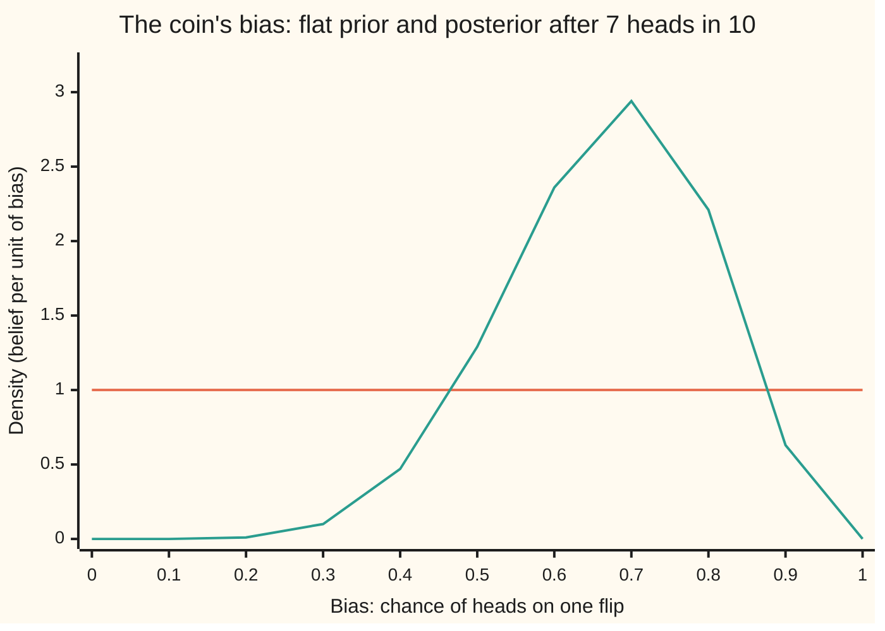
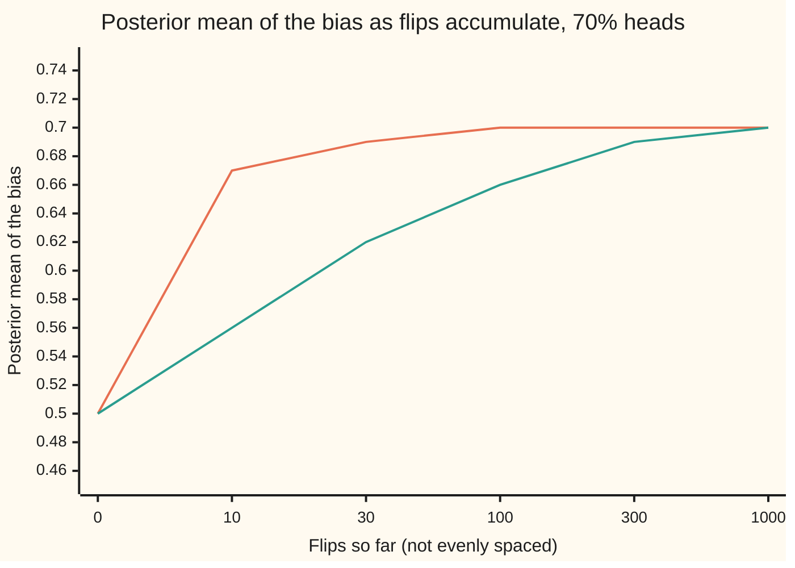

# Bayesian updating: a prior belief, the data, and the posterior that combines them

[Syllabus](../../../SYLLABUS.md) → [Probability and statistics](../../../SYLLABUS.md#w09) → [Bayesian Inference](../../../SYLLABUS.md#w09-s10) → Bayesian updating

---

## General Overview

A coin comes out of a new batch. Nobody knows whether it is fair. It is flipped 10 times and lands heads 7 times. What does that say about the coin?

The coin has one hidden number: its chance of landing heads on any flip, called its **bias** (the coin sense of the word, not the estimator's bias of [Bias and variance](../07-Sampling%20and%20Estimation/06-bias-variance-and-mean-squared-error.md)). A fair coin has bias 0.5. Seven heads in ten does not prove the bias is 0.7. A fair coin shows 7 or more heads in 10 flips with chance 176/1024 = 0.1719, about 1 time in 6. What the flips can do is shift belief: some biases now look more plausible than others, and by a computable amount.

Bayesian updating does that computation. It starts from a **prior**: a statement, before any flip, of how plausible each possible bias is. It multiplies in how well each bias explains the 7 heads. It rescales the product so it is a probability law again. The result is the **posterior**: the belief after the data. For this coin, starting from "every bias from 0 to 1 equally plausible", the posterior puts the bias near 0.67, give or take 0.13, and gives a chance of about 8 in 9 (0.8867) that the coin favours heads.

**Bayesian updating treats an unknown number as uncertain, gives it a prior, and uses Bayes' rule over every possible value at once: the posterior is prior times how well each value explains the data, rescaled to total one.**

**What kind of fact this is:** a method. Its engine is Bayes' rule, a theorem proved on [Bayes' rule](../01-Chance%20and%20Events/06-bayes-rule.md) and extended to a continuous unknown on this card in Why it works; the prior is a modelling choice, not a fact.

### The picture: belief before and after 7 heads in 10



Orange, flat: the prior, every bias equally plausible. Green, humped: the posterior after 7 heads in 10. Both enclose an area of 1. The data moved the belief off the low biases and piled it up between 0.5 and 0.9, highest at 0.7. A bias of 0 or 1 is now impossible: a coin that never lands heads cannot show 7, and one that always does cannot show 3 tails.

---

## The formula

Notation first. $\theta$, the Greek letter theta, is the coin's bias. $n$ is the number of flips, $h$ the heads and $t = n - h$ the tails. $D$ stands for the data, here "7 heads in 10 flips". Inside the integral, $u$ stands for the bias so it does not clash with $\theta$. A density $f$ spreads belief over a range of values the way a density spreads chance ([Densities](../04-Continuous%20Distributions/01-densities-and-cdfs.md)): the chance that $\theta$ lands in an interval is the area under $f$ over that interval.

$$f(\theta \mid D) = \frac{P(D \mid \theta)\, f(\theta)}{P(D)}, \qquad P(D) = \int_0^1 P(D \mid u)\, f(u)\, du$$

**Read it aloud:** the belief in each bias after the data is the belief before, times the chance that a coin with that bias would produce the data, divided by the total of that product over every bias.

For flips of a coin, the chance of the data at a fixed bias is the binomial chance:

$$P(D \mid \theta) = \binom{n}{h}\, \theta^{h} (1 - \theta)^{t}$$

With $h = 7$ heads and $t = 3$ tails, the posterior from a flat prior is $1320\,\theta^{7}(1-\theta)^{3}$. Where the 1320 comes from is Step 3 below.

| Symbol | Plain meaning | In our example | Push it up and the answer… |
| --- | --- | --- | --- |
| $\theta$ | the bias: the coin's chance of heads on one flip, unknown | somewhere in 0 to 1 | — (it is what the card learns about) |
| $n$, $h$, $t$ | flips, heads, tails, with $n = h + t$ | 10, 7, 3 | more flips: a narrower posterior |
| $D$ | the data actually seen | 7 heads in 10 flips | — |
| $f(\theta)$ | the **prior**: density of belief in each bias before the data | 1 for every bias (flat) | more prior weight near a value pulls the posterior toward it |
| $P(D \mid \theta)$ | the **likelihood**: chance of the data if the bias were $\theta$, read as a function of $\theta$ | 0.2668 at $\theta = 0.7$ | a bias that explains the data better gains belief |
| $\binom{n}{h}$ | the number of orders in which $h$ heads can fall among $n$ flips | 120 | — (it cancels in the division) |
| $P(D)$ | the **evidence**: chance of the data averaged over the prior | 1/11 = 0.0909 | — (computed, not chosen) |
| $f(\theta \mid D)$ | the **posterior**: density of belief after the data | $1320\,\theta^{7}(1-\theta)^{3}$, peak 2.94 at 0.7 | — |
| $u$ | a stand-in letter for the bias inside the integral, so it does not clash with $\theta$ | runs from 0 to 1 | — |
| $m$, $w$ | number of cells in a grid of candidate biases, and each cell's width $w = 1/m$ | 11 candidates, then 4000 cells | more cells: closer to the exact answer |
| $I(a, b)$, $a$, $b$, $c$ | the area under $\theta^{a}(1-\theta)^{b}$ from 0 to 1, for whole numbers $a$ and $b$; $c$ is the power in the sceptic's prior | $I(7, 3) = 1/1320$; $c = 10$ | larger $c$: a prior more sure the coin is fair |
| $E[\theta \mid D]$ | the posterior mean: the average bias under the posterior | 2/3 = 0.6667 | — |

### When it holds

- **The prior is a real probability law, with area 1.** A "prior" that is flat over every number, with infinite area, can still give a sensible posterior, but the evidence $P(D)$ then means nothing and each case needs its own check.
- **The flips are independent once the bias is fixed, and the bias does not change.** That is what makes the likelihood a binomial chance. A coin that wears as it is flipped, or flips recorded twice, break it; What breaks shows the double count.
- **The prior gives some weight to every bias that could be true.** A bias with prior weight zero keeps posterior weight zero forever, whatever the data say.
- **The data are possible under the model.** $P(D)$ sits in a denominator. If every bias the prior allows makes the data impossible, the formula divides by zero and the model, not the arithmetic, needs fixing.
- **The posterior is a statement inside the model.** It says how plausible each bias is given this prior and this likelihood. It is not a guarantee about a method's long-run record, which is what a confidence interval gives.

---

## Why it works

### Step 0: an unknown number, treated as uncertain

The bias is fixed but unknown. Bayesian updating puts a probability law on it anyway, to describe belief about it. Once each possible bias is a hypothesis with a prior weight, the data are evidence, and Bayes' rule says how evidence reweights hypotheses. The only new work is that there are infinitely many hypotheses, one for every number from 0 to 1.

### Step 1: eleven candidate coins

Start with a list. Suppose the coin must be one of eleven: bias 0.0, 0.1, …, 1.0, each with prior chance 1/11. These eleven hypotheses do not overlap and cover every case, so Bayes' rule in its general form from [Bayes' rule](../01-Chance%20and%20Events/06-bayes-rule.md) applies directly:

$$P(\theta = 0.7 \mid D) = \frac{P(D \mid 0.7) \times \tfrac{1}{11}}{\sum_{\text{all 11 candidates}} P(D \mid \text{candidate}) \times \tfrac{1}{11}}.$$

The top is $120 \times 0.7^{7} \times 0.3^{3} / 11 = 0.024257$. The bottom adds eleven such terms: 0.082727. So the bias-0.7 coin gets posterior chance 0.2932, up from 1/11 = 0.0909. Worked numbers lists every candidate.

### Step 2: more candidates, and chance becomes density

Split 0 to 1 into $m$ cells of width $w = 1/m$ and put a candidate at the middle of each. A prior density $f$ gives the cell at $\theta$ a prior chance of about $f(\theta)\,w$. Bayes' rule on the list gives that cell a posterior chance of

$$\frac{P(D \mid \theta)\, f(\theta)\, w}{\sum_{\text{cells}} P(D \mid u)\, f(u)\, w}.$$

Divide by the width $w$ to turn chance per cell into chance per unit of bias. The bottom is a sum of heights times widths: the area under $P(D \mid u) f(u)$, which becomes the integral $P(D)$ as the cells shrink. What is left is the formula. Nothing new was assumed. The continuous version is the list version with the list made fine.

With 4000 cells the code gets the area under $\theta^{7}(1-\theta)^{3}$ as 0.00075758, the same as the exact value to eight places.

### Step 3: normalise, exactly

The posterior is proportional to $\theta^{7}(1-\theta)^{3}$: the constant 120 and the flat prior's 1 cancel between top and bottom. To make it a density, divide by its area. Write $I(a, b)$ for the area under $\theta^{a}(1-\theta)^{b}$ from 0 to 1. Expand the bracket and integrate term by term:

$$\theta^{7}(1-\theta)^{3} = \theta^{7} - 3\theta^{8} + 3\theta^{9} - \theta^{10}, \qquad I(7,3) = \tfrac18 - \tfrac39 + \tfrac{3}{10} - \tfrac{1}{11} = \tfrac{1}{1320}.$$

So the posterior density is $1320\,\theta^{7}(1-\theta)^{3}$, and the evidence is $P(D) = 120/1320 = 1/11$. That last number has a plain meaning: before any flip, with a flat prior, all eleven head counts from 0 to 10 are equally likely.

Every question about the bias is now an area. The posterior mean $E[\theta \mid D]$, the average bias under the posterior, is $1320 \times I(8,3)$, and $I(8,3) = 1/1980$ by the same expansion, so the mean is $1320/1980 = 2/3$. The chance the coin favours heads is the area to the right of 0.5, which comes to $227/256 = 0.8867$. The posterior's spread, its standard deviation, is 0.1307. How to turn areas like these into an interval and a decision is [Credible intervals and decisions](05-credible-intervals-and-decisions.md).

### Step 4: today's posterior is tomorrow's prior

Take the flips one at a time. After each flip, multiply the current belief by $\theta$ for a head or $1 - \theta$ for a tail, and rescale. After ten flips the product is $\theta^{7}(1-\theta)^{3}$ whatever the order, because multiplication does not care about order. Heads first or tails first, one at a time or all at once, the code lands on mean 0.6667 every time.

This is why the method is called updating. A posterior is a prior, ready for the next flip. The rescaling after each step changes nothing in the end: rescaling is a division by a constant, and constants cancel at the final normalisation.

### Step 5: the prior washes out

Take a second, stubborn prior: a sceptic who thinks coins are nearly fair, with density proportional to $(\theta(1-\theta))^{10}$. Its peak is at 0.5, height 3.70, and its spread is 0.1043. After 7 heads in 10, the flat prior's posterior mean is 0.6667 and the sceptic's is 0.5625: a gap of 0.1042. Now keep flipping at the same rate of 70 percent heads.



Orange: the flat prior. Green: the sceptic. The two start together at 0.50, split apart after 10 flips, and close again. The gap is 0.1042 at 10 flips, 0.0321 at 100 and 0.0039 at 1000.

The reason is in the logarithm of the posterior:

$$\ln f(\theta \mid D) = \ln f(\theta) + h \ln \theta + t \ln(1-\theta) + \text{a constant}.$$

The prior's term is fixed. The data's terms grow in proportion to the number of flips. After enough flips, the data outweigh any prior that gave the truth some room. The posterior also narrows: its spread falls from 0.1307 at 10 flips to 0.0453 at 100, roughly by $1/\sqrt{n}$.

<details>
<summary>Detailed proof: the exact area, and the size of the gap</summary>

**Claim 1.** For whole numbers $a, b \ge 0$, $I(a, b) = \int_0^1 \theta^{a}(1-\theta)^{b}\, d\theta = \dfrac{a!\, b!}{(a+b+1)!}$.

**Proof.** For $b = 0$, $I(a, 0) = 1/(a+1) = a!\,0!/(a+1)!$. For $b \ge 1$, integrate by parts, raising the power of $\theta$ and lowering the power of $1 - \theta$:
$$I(a,b) = \Big[\tfrac{\theta^{a+1}}{a+1}(1-\theta)^{b}\Big]_0^1 + \tfrac{b}{a+1}\int_0^1 \theta^{a+1}(1-\theta)^{b-1}\,d\theta = \tfrac{b}{a+1}\, I(a+1, b-1),$$
since the bracket vanishes at both ends. Repeating $b$ times gives $I(a,b) = \frac{b!\,a!}{(a+b)!}\, I(a+b, 0) = \frac{a!\,b!}{(a+b+1)!}$. Check: $I(7,3) = 7!\,3!/11! = 1/1320$.

**Claim 2.** With a prior proportional to $(\theta(1-\theta))^{c}$ and $h$ heads in $n$ flips, the posterior mean is $\dfrac{c+h+1}{2c+n+2}$.

**Proof.** The posterior is proportional to $\theta^{c+h}(1-\theta)^{c+t}$. Its mean is $I(c+h+1, c+t)/I(c+h, c+t)$. By Claim 1 the factorials cancel down to $(c+h+1)/(2c+h+t+2)$. The flat prior is $c = 0$, giving $(h+1)/(n+2) = 8/12$ here, Laplace's rule of succession. The sceptic is $c = 10$, giving $18/32 = 0.5625$.

**Claim 3.** The two posterior means differ by $\dfrac{10\,(2h - n)}{(n+2)(n+22)}$, which is less than $10/(n+22)$ in size.

**Proof.** Cross-multiply: $(h+1)(n+22) - (h+11)(n+2) = 20h - 10n$. Divide by $(n+2)(n+22)$. Since $\lvert 2h - n\rvert \le n < n + 2$, the size is below $10/(n+22)$. At $n = 10$, $h = 7$: $40/384 = 0.1042$. At $n = 1000$, $h = 700$: $4000/1024044 = 0.0039$. The gap shrinks like $1/n$: the prior washes out.

</details>

A second road to the posterior needs no integral at all. Draw a bias from the prior, flip a coin with that bias ten times, and keep the bias only if the flips show 7 heads. The kept biases are draws from the posterior, because a bias is kept in proportion to prior times likelihood. The code does this 200,000 times. The general engine behind drawing from a posterior that cannot be integrated by hand is [MCMC in outline](06-markov-chain-monte-carlo-in-outline.md).

---

## Worked numbers, by hand

The eleven candidate coins, prior 1/11 each, after 7 heads in 10. Candidates 0.0 and 1.0 contribute exactly zero; 0.1 to 0.4 contribute small amounts, printed by the code.

| Step | Arithmetic | Value |
| --- | --- | --- |
| likelihood at 0.7 | $120 \times 0.7^{7} \times 0.3^{3}$ | 0.266828 |
| prior × likelihood, 0.5 | $120 \times 0.5^{10} / 11$ | 0.010653 |
| prior × likelihood, 0.6 | $120 \times 0.6^{7} \times 0.4^{3} / 11$ | 0.019545 |
| prior × likelihood, 0.7 | $0.266828 / 11$ | 0.024257 |
| prior × likelihood, 0.8 | $120 \times 0.8^{7} \times 0.2^{3} / 11$ | 0.018302 |
| prior × likelihood, 0.9 | $120 \times 0.9^{7} \times 0.1^{3} / 11$ | 0.005218 |
| evidence, the list's $P(D)$ | the five above plus 0.1 to 0.4, from the output | 0.082727 |
| posterior at 0.7 | $0.024257 / 0.082727$ | 0.2932 |
| posterior mean on the list | $\sum \text{candidate} \times \text{posterior}$ | 0.6670 |
| exact area | $\tfrac18 - \tfrac39 + \tfrac3{10} - \tfrac1{11}$ | 1/1320 |
| exact evidence | $120 / 1320$ | 1/11 = 0.0909 |
| **exact posterior mean** | $1320 \times I(8,3) = 1320/1980$ | **2/3 = 0.6667** |

After 7 heads in 10, and starting from no preference among biases, the best single guess for the bias is 0.67, with a spread of 0.13; the chance the coin favours heads is 0.8867, about 8 in 9. Eleven candidates already put the mean at 0.6670; the fine grid and the exact integral agree at 0.6667.

### What breaks if you drop a piece

| Mistake | Comes out at | What went wrong |
| --- | --- | --- |
| Skip the division by the evidence | P(bias above 0.5) reads 0.0806, not 0.8867 | Prior × likelihood has area 0.0909, not 1; every chance read off it is 11 times too small |
| Prior of zero outside 0.4 to 0.6, then 700 heads in 1000 | mean 0.5977, not 0.6996 | A bias the prior rules out can never come back; the posterior piles up against the fence |
| Feed the same 10 flips in twice | mean 0.6818, spread 0.0971, not 0.6667 and 0.1307 | The copy is not new evidence; the posterior claims more certainty than the flips support |
| Read the likelihood at 0.7 as a chance | 0.2668 "chance the bias is 0.7" | The likelihood is a chance of the data, not of the bias; its area over biases is 0.0909, not 1 |

---

## Code, from first principles, and it actually runs

The scripts reach the posterior by four roads. Road 1 is Bayes' rule on the list of eleven candidate coins. Road 2 is exact: it expands $\theta^{7}(1-\theta)^{3}$ and integrates term by term in whole-number fractions, giving 1/1320, 2/3 and 227/256 as fractions. Road 3 is a grid of 4000 cells, worked on the log scale so that 1000 flips do not underflow; it takes any prior. Road 4 simulates: 200,000 biases drawn from the flat prior, each flipped ten times by a small random-number generator written out in both languages (SplitMix64, seed 20260929), keeping only those that show 7 heads. Each simulated number is printed with its standard error, the typical gap between a simulated share and the truth. The scripts then update one flip at a time in two orders, compare the flat and sceptic priors at six flip counts by the factorial formula and by the grid, and print every chart point and every "what breaks" and "try changing" value. There is no `random` or `statistics` module, and nothing imported knows the answer.

### Python

```python
# Bayesian updating -- the check behind the card.  Standard library only.
# A new coin shows h = 7 heads in n = 10 flips.  theta is its unknown chance of
# heads.  Roads to the posterior: 11 candidate coins (Bayes' rule on a list),
# the exact integral by expanding the polynomial, a 4,000-cell grid, and a
# seeded simulation that keeps only the imaginary coins that also show 7 of 10.
from fractions import Fraction as Fr
from math import comb, log, exp, sqrt
N, H = 10, 7
T = N - H
LIK = lambda th, h=H, t=T: comb(h + t, h) * th ** h * (1 - th) ** t

M64 = (1 << 64) - 1
class SplitMix64:                               # small generator, same in Rust
    def __init__(self, seed): self.s = seed
    def unif(self):
        self.s = (self.s + 0x9E3779B97F4A7C15) & M64
        z = self.s
        z = ((z ^ (z >> 30)) * 0xBF58476D1CE4E5B9) & M64
        z = ((z ^ (z >> 27)) * 0x94D049BB133111EB) & M64
        return ((z ^ (z >> 31)) >> 11) / 9007199254740992.0

# road 1: eleven candidate coins, prior 1/11 each, Bayes' rule on a list
cand = [i / 10 for i in range(11)]
joint = [LIK(c) / 11 for c in cand]
ev11 = sum(joint)
post11 = [j / ev11 for j in joint]
print(f"coin: h = {H} heads in n = {N} flips; candidates 0.0 to 1.0, prior 1/11 each")
for c, j, p in zip(cand, joint, post11):
    print(f"list  theta={c:.1f}  likelihood={LIK(c):.6f}  prior*lik={j:.6f}  posterior={p:.4f}")
m11 = sum(c * p for c, p in zip(cand, post11))
g11 = sum(p for c, p in zip(cand, post11) if c > 0.5)
print(f"list  evidence={ev11:.6f}  mean={m11:.4f}  P(theta>0.5)={g11:.4f}")

# road 2: exact, expanding theta^7 (1-theta)^3 and integrating term by term
def poly(h, t):                                 # coefficients of theta^h (1-theta)^t
    return {h + k: Fr(comb(t, k) * (-1) ** k) for k in range(t + 1)}
def integ(cs, a, b, shift=0):                   # exact integral of theta^shift * poly
    return sum(c * (Fr(b) ** (p + shift + 1) - Fr(a) ** (p + shift + 1)) / (p + shift + 1)
               for p, c in cs.items())
cs = poly(H, T)
area = integ(cs, 0, 1)
ev_exact = comb(N, H) * area                    # flat prior f = 1
mean_exact = integ(cs, 0, 1, 1) / area
gt_exact = integ(cs, Fr(1, 2), 1) / area
sq_exact = integ(cs, 0, 1, 2) / area
sd_exact = sqrt(sq_exact - mean_exact ** 2)
print(f"exact area of theta^7(1-theta)^3 = {area}; evidence = {ev_exact} = {float(ev_exact):.6f}")
print(f"exact posterior = {1 / area} theta^7 (1-theta)^3; mean = {mean_exact} = {float(mean_exact):.4f}; "
      f"sd = {sd_exact:.4f}; P(theta>0.5) = {gt_exact} = {float(gt_exact):.4f}")
fair = sum(comb(N, j) for j in range(H, N + 1))
print(f"exact I(8,3) = {integ(cs, 0, 1, 1)}; a fair coin shows 7 or more heads in 10 with chance {fair}/1024 = {fair / 1024:.4f}")

# road 3: a fine grid, any prior, log scale so 1,000 flips do not underflow
def grid(logprior, h, t, cells=4000, lo=0.0, hi=1.0):
    w = (hi - lo) / cells
    th = [lo + (i + 0.5) * w for i in range(cells)]
    lw = [logprior(x) + h * log(x) + t * log(1 - x) for x in th]
    top = max(lw)
    wt = [exp(v - top) for v in lw]
    z = sum(wt)
    mean = sum(x * v for x, v in zip(th, wt)) / z
    sd = sqrt(sum((x - mean) ** 2 * v for x, v in zip(th, wt)) / z)
    gt = sum(v for x, v in zip(th, wt) if x > 0.5) / z
    return mean, sd, gt, z * w * exp(top)
flat = lambda x: 0.0
gm, gsd, ggt, garea = grid(flat, H, T)
print(f"grid  4000 cells: area = {garea:.8f} (1/1320 = {1 / 1320:.8f}); mean = {gm:.4f}; sd = {gsd:.4f}; P(theta>0.5) = {ggt:.4f}")

# road 4: simulate. Draw a coin theta from the flat prior, flip it 10 times,
# keep theta only when the flips show 7 heads.  Kept thetas follow the posterior.
rng, draws, kept = SplitMix64(20260929), 200000, []
for _ in range(draws):
    th = rng.unif()
    if sum(rng.unif() < th for _ in range(N)) == H:
        kept.append(th)
k = len(kept)
acc, acc_se = k / draws, sqrt(k / draws * (1 - k / draws) / draws)
sm = sum(kept) / k
ssd = sqrt(sum((x - sm) ** 2 for x in kept) / (k - 1))
sg = sum(x > 0.5 for x in kept) / k
print(f"sim   seed 20260929, {draws} coins, {k} show 7 heads: evidence {acc:.4f} (se {acc_se:.4f})")
print(f"sim   mean {sm:.4f} (se {ssd / sqrt(k):.4f}); sd {ssd:.4f}; P(theta>0.5) {sg:.4f} (se {sqrt(sg * (1 - sg) / k):.4f})")

# staged: 7 heads first then 3 tails, 3 tails first then 7 heads, one flip at a time
seqs = {"heads first": [1] * 7 + [0] * 3, "tails first": [0] * 3 + [1] * 7}
th, st = [(i + 0.5) / 4000 for i in range(4000)], []
for name, seq in seqs.items():
    wt = [1.0] * 4000
    for f in seq:
        wt = [v * (x if f else 1 - x) for v, x in zip(wt, th)]
        z = sum(wt)
        wt = [v / z for v in wt]                # today's posterior is tomorrow's prior
    st.append(sum(x * v for x, v in zip(th, wt)))
    print(f"staged {name}, renormalised after every flip: mean = {st[-1]:.4f}")

# figure: flat prior and posterior density at theta = 0, 0.1, ..., 1
print("figure, flat prior density 1.00 at every theta; posterior density 1320 theta^7 (1-theta)^3: " +
      ", ".join(f"{float(1 / area) * (i / 10) ** 7 * (1 - i / 10) ** 3:.2f}" for i in range(11)))

# the prior washes out: flat versus a sceptic, f proportional to (theta(1-theta))^10
lnf = lambda m: sum(log(j) for j in range(2, m + 1))
def exact_mean(a, h, t):                        # ratio of two integrals a!b!/(a+b+1)!
    return exp(lnf(a + h + 1) + lnf(a + t) - lnf(2 * a + h + t + 2)
               - lnf(a + h) - lnf(a + t) + lnf(2 * a + h + t + 1))
sceptic = lambda x: 10 * log(x * (1 - x))
print(f"sceptic prior density at 0.5: {21 * comb(20, 10) * 0.25 ** 10:.2f}; prior sd {sqrt(0.25 / 23):.4f}")
fl_row, sc_row = [], []
for n in (0, 10, 30, 100, 300, 1000):
    h = 7 * n // 10
    ef, es = exact_mean(0, h, n - h), exact_mean(10, h, n - h)
    gf, gs = grid(flat, h, n - h)[0], grid(sceptic, h, n - h)[0]
    fl_row.append(gf); sc_row.append(gs)
    print(f"washout n={n:4d} h={h:3d}: flat exact {ef:.4f} grid {gf:.4f}; sceptic exact {es:.4f} grid {gs:.4f}; gap {abs(ef - es):.4f}")
print("figure, washout means flat: " + ", ".join(f"{v:.2f}" for v in fl_row))
print("figure, washout means sceptic: " + ", ".join(f"{v:.2f}" for v in sc_row))

# what breaks
print(f"break 1, no division by the evidence: area under prior*lik = {float(ev_exact):.4f}; "
      f"P(theta>0.5) read off it = {float(ev_exact * gt_exact):.4f}, not {float(gt_exact):.4f}")
tm = grid(lambda x: 0.0, 700, 300, cells=4000, lo=0.4, hi=0.6)[0]
print(f"break 2, prior zero outside 0.4 to 0.6, then 700 heads in 1000: mean = {tm:.4f}, not {grid(flat, 700, 300)[0]:.4f}")
dm, dsd = grid(flat, 2 * H, 2 * T)[:2]
print(f"break 3, the same 10 flips fed in twice: mean = {dm:.4f}, sd = {dsd:.4f}; honest sd = {gsd:.4f}")
print(f"break 4, likelihood at 0.7 read as a chance: {LIK(0.7):.4f}; its area over theta = {float(ev_exact):.4f}, not 1")

# try changing
am, _, ag, _ = grid(flat, 10, 0)
print(f"try: 10 heads in 10, mean = {am:.4f}, P(theta>0.5) = {ag:.4f}; 70 of 100, sd = {grid(flat, 70, 30)[1]:.4f}; "
      f"prior 0.4 to 0.6 with 10 flips, mean = {grid(flat, H, T, 4000, 0.4, 0.6)[0]:.4f}")

assert area == Fr(1, 1320) and abs(garea - float(area)) < 1e-9        # exact; grid area vs exact
assert abs(gm - float(mean_exact)) < 1e-6 and abs(ggt - float(gt_exact)) < 1e-6   # grid vs exact
assert abs(sm - float(mean_exact)) < 4 * ssd / sqrt(k) and abs(acc - 1 / 11) < 4 * acc_se  # sim
assert abs(m11 - float(mean_exact)) < 0.01                            # 11 coins already close
assert all(abs(exact_mean(0, 7 * n // 10, n - 7 * n // 10) - f) < 1e-6 for n, f in zip((0, 10, 30, 100, 300, 1000), fl_row))
assert abs(dm - exact_mean(0, 2 * H, 2 * T)) < 1e-6                    # double count
assert abs(tm - (0.6 - 1 / (700 / 0.6 - 300 / 0.4))) < 5e-4 and all(abs(s - gm) < 1e-9 for s in st)  # fence; order
assert abs(sc_row[1] - exact_mean(10, H, T)) < 1e-6 and abs(sc_row[-1] - exact_mean(10, 700, 300)) < 1e-6
print("ALL CHECKS PASS")
```

**Ran 2026-10-06 on macOS, Python 3.14.6, standard library only. All checks passed. Output, pasted from the run:**

```
coin: h = 7 heads in n = 10 flips; candidates 0.0 to 1.0, prior 1/11 each
list  theta=0.0  likelihood=0.000000  prior*lik=0.000000  posterior=0.0000
list  theta=0.1  likelihood=0.000009  prior*lik=0.000001  posterior=0.0000
list  theta=0.2  likelihood=0.000786  prior*lik=0.000071  posterior=0.0009
list  theta=0.3  likelihood=0.009002  prior*lik=0.000818  posterior=0.0099
list  theta=0.4  likelihood=0.042467  prior*lik=0.003861  posterior=0.0467
list  theta=0.5  likelihood=0.117188  prior*lik=0.010653  posterior=0.1288
list  theta=0.6  likelihood=0.214991  prior*lik=0.019545  posterior=0.2363
list  theta=0.7  likelihood=0.266828  prior*lik=0.024257  posterior=0.2932
list  theta=0.8  likelihood=0.201327  prior*lik=0.018302  posterior=0.2212
list  theta=0.9  likelihood=0.057396  prior*lik=0.005218  posterior=0.0631
list  theta=1.0  likelihood=0.000000  prior*lik=0.000000  posterior=0.0000
list  evidence=0.082727  mean=0.6670  P(theta>0.5)=0.8138
exact area of theta^7(1-theta)^3 = 1/1320; evidence = 1/11 = 0.090909
exact posterior = 1320 theta^7 (1-theta)^3; mean = 2/3 = 0.6667; sd = 0.1307; P(theta>0.5) = 227/256 = 0.8867
exact I(8,3) = 1/1980; a fair coin shows 7 or more heads in 10 with chance 176/1024 = 0.1719
grid  4000 cells: area = 0.00075758 (1/1320 = 0.00075758); mean = 0.6667; sd = 0.1307; P(theta>0.5) = 0.8867
sim   seed 20260929, 200000 coins, 18286 show 7 heads: evidence 0.0914 (se 0.0006)
sim   mean 0.6665 (se 0.0010); sd 0.1316; P(theta>0.5) 0.8829 (se 0.0024)
staged heads first, renormalised after every flip: mean = 0.6667
staged tails first, renormalised after every flip: mean = 0.6667
figure, flat prior density 1.00 at every theta; posterior density 1320 theta^7 (1-theta)^3: 0.00, 0.00, 0.01, 0.10, 0.47, 1.29, 2.36, 2.94, 2.21, 0.63, 0.00
sceptic prior density at 0.5: 3.70; prior sd 0.1043
washout n=   0 h=  0: flat exact 0.5000 grid 0.5000; sceptic exact 0.5000 grid 0.5000; gap 0.0000
washout n=  10 h=  7: flat exact 0.6667 grid 0.6667; sceptic exact 0.5625 grid 0.5625; gap 0.1042
washout n=  30 h= 21: flat exact 0.6875 grid 0.6875; sceptic exact 0.6154 grid 0.6154; gap 0.0721
washout n= 100 h= 70: flat exact 0.6961 grid 0.6961; sceptic exact 0.6639 grid 0.6639; gap 0.0321
washout n= 300 h=210: flat exact 0.6987 grid 0.6987; sceptic exact 0.6863 grid 0.6863; gap 0.0123
washout n=1000 h=700: flat exact 0.6996 grid 0.6996; sceptic exact 0.6957 grid 0.6957; gap 0.0039
figure, washout means flat: 0.50, 0.67, 0.69, 0.70, 0.70, 0.70
figure, washout means sceptic: 0.50, 0.56, 0.62, 0.66, 0.69, 0.70
break 1, no division by the evidence: area under prior*lik = 0.0909; P(theta>0.5) read off it = 0.0806, not 0.8867
break 2, prior zero outside 0.4 to 0.6, then 700 heads in 1000: mean = 0.5977, not 0.6996
break 3, the same 10 flips fed in twice: mean = 0.6818, sd = 0.0971; honest sd = 0.1307
break 4, likelihood at 0.7 read as a chance: 0.2668; its area over theta = 0.0909, not 1
try: 10 heads in 10, mean = 0.9167, P(theta>0.5) = 0.9995; 70 of 100, sd = 0.0453; prior 0.4 to 0.6 with 10 flips, mean = 0.5245
ALL CHECKS PASS
```

### Rust

Same numbers, same labels, built with `rustc --edition 2021 -O`.

```rust
// Bayesian updating -- the same check as the Python, in Rust.  No crates.
// A new coin shows h = 7 heads in n = 10 flips.  theta is its unknown chance of
// heads.  Roads to the posterior: 11 candidate coins (Bayes' rule on a list),
// the exact integral by expanding the polynomial, a 4,000-cell grid, and a
// seeded simulation that keeps only the imaginary coins that also show 7 of 10.
const N: i64 = 10;
const H: i64 = 7;
const T: i64 = N - H;
fn comb(n: i64, k: i64) -> i64 { (0..k).fold(1, |c, j| c * (n - j) / (j + 1)) }
fn lik(th: f64, h: i64, t: i64) -> f64 { comb(h + t, h) as f64 * th.powi(h as i32) * (1.0 - th).powi(t as i32) }

#[derive(Clone, Copy)]
struct Fr { n: i128, d: i128 }                    // exact fractions, always reduced
fn gcd(a: i128, b: i128) -> i128 { if b == 0 { a.abs() } else { gcd(b, a % b) } }
fn fr(n: i128, d: i128) -> Fr { let g = gcd(n, d) * d.signum(); Fr { n: n / g, d: d / g } }
fn add(a: Fr, b: Fr) -> Fr { fr(a.n * b.d + b.n * a.d, a.d * b.d) }
fn mul(a: Fr, b: Fr) -> Fr { fr(a.n * b.n, a.d * b.d) }
fn div(a: Fr, b: Fr) -> Fr { fr(a.n * b.d, a.d * b.n) }
fn pw(a: Fr, k: i64) -> Fr { (0..k).fold(fr(1, 1), |p, _| mul(p, a)) }
fn fl(a: Fr) -> f64 { a.n as f64 / a.d as f64 }
fn show(a: Fr) -> String { if a.d == 1 { format!("{}", a.n) } else { format!("{}/{}", a.n, a.d) } }

// exact integral of theta^shift * theta^h (1-theta)^t from lo to hi, term by term
fn integ(h: i64, t: i64, lo: Fr, hi: Fr, shift: i64) -> Fr {
    let mut s = fr(0, 1);
    for k in 0..=t {
        let p = h + k + shift + 1;
        let c = fr((comb(t, k) * if k % 2 == 0 { 1 } else { -1 }) as i128, p as i128);
        s = add(s, mul(c, add(pw(hi, p), mul(fr(-1, 1), pw(lo, p)))));
    }
    s
}

struct SplitMix64 { s: u64 }                      // small generator, same in Python
impl SplitMix64 {
    fn unif(&mut self) -> f64 {
        self.s = self.s.wrapping_add(0x9E3779B97F4A7C15);
        let mut z = self.s;
        z = (z ^ (z >> 30)).wrapping_mul(0xBF58476D1CE4E5B9);
        z = (z ^ (z >> 27)).wrapping_mul(0x94D049BB133111EB);
        ((z ^ (z >> 31)) >> 11) as f64 / 9007199254740992.0
    }
}

// a fine grid, any prior, log scale so 1,000 flips do not underflow
fn grid(logprior: &dyn Fn(f64) -> f64, h: i64, t: i64, cells: usize, lo: f64, hi: f64) -> (f64, f64, f64, f64) {
    let w = (hi - lo) / cells as f64;
    let th: Vec<f64> = (0..cells).map(|i| lo + (i as f64 + 0.5) * w).collect();
    let lw: Vec<f64> = th.iter().map(|&x| logprior(x) + h as f64 * x.ln() + t as f64 * (1.0 - x).ln()).collect();
    let top = lw.iter().cloned().fold(f64::NEG_INFINITY, f64::max);
    let wt: Vec<f64> = lw.iter().map(|v| (v - top).exp()).collect();
    let z: f64 = wt.iter().sum();
    let mean = th.iter().zip(&wt).map(|(x, v)| x * v).sum::<f64>() / z;
    let sd = (th.iter().zip(&wt).map(|(x, v)| (x - mean).powi(2) * v).sum::<f64>() / z).sqrt();
    let gt = th.iter().zip(&wt).filter(|(x, _)| **x > 0.5).map(|(_, v)| v).sum::<f64>() / z;
    (mean, sd, gt, z * w * top.exp())
}

fn lnf(m: i64) -> f64 { (2..=m).map(|j| (j as f64).ln()).sum() }
fn exact_mean(a: i64, h: i64, t: i64) -> f64 {    // ratio of two integrals a!b!/(a+b+1)!
    (lnf(a + h + 1) + lnf(a + t) - lnf(2 * a + h + t + 2) - lnf(a + h) - lnf(a + t) + lnf(2 * a + h + t + 1)).exp()
}

fn main() {
    // road 1: eleven candidate coins, prior 1/11 each, Bayes' rule on a list
    let cand: Vec<f64> = (0..11).map(|i| i as f64 / 10.0).collect();
    let joint: Vec<f64> = cand.iter().map(|&c| lik(c, H, T) / 11.0).collect();
    let ev11: f64 = joint.iter().sum();
    let post11: Vec<f64> = joint.iter().map(|j| j / ev11).collect();
    println!("coin: h = {} heads in n = {} flips; candidates 0.0 to 1.0, prior 1/11 each", H, N);
    for i in 0..11 {
        println!("list  theta={:.1}  likelihood={:.6}  prior*lik={:.6}  posterior={:.4}", cand[i], lik(cand[i], H, T), joint[i], post11[i]);
    }
    let m11: f64 = cand.iter().zip(&post11).map(|(c, p)| c * p).sum();
    let g11: f64 = cand.iter().zip(&post11).filter(|(c, _)| **c > 0.5).map(|(_, p)| p).sum();
    println!("list  evidence={:.6}  mean={:.4}  P(theta>0.5)={:.4}", ev11, m11, g11);

    // road 2: exact, expanding theta^7 (1-theta)^3 and integrating term by term
    let (z0, one, half) = (fr(0, 1), fr(1, 1), fr(1, 2));
    let area = integ(H, T, z0, one, 0);
    let ev_exact = mul(fr(comb(N, H) as i128, 1), area);
    let mean_exact = div(integ(H, T, z0, one, 1), area);
    let gt_exact = div(integ(H, T, half, one, 0), area);
    let sq_exact = div(integ(H, T, z0, one, 2), area);
    let sd_exact = (fl(sq_exact) - fl(mean_exact).powi(2)).sqrt();
    println!("exact area of theta^7(1-theta)^3 = {}; evidence = {} = {:.6}", show(area), show(ev_exact), fl(ev_exact));
    println!("exact posterior = {} theta^7 (1-theta)^3; mean = {} = {:.4}; sd = {:.4}; P(theta>0.5) = {} = {:.4}",
             show(div(one, area)), show(mean_exact), fl(mean_exact), sd_exact, show(gt_exact), fl(gt_exact));
    let fair: i64 = (H..=N).map(|j| comb(N, j)).sum();
    println!("exact I(8,3) = {}; a fair coin shows 7 or more heads in 10 with chance {}/1024 = {:.4}", show(integ(H, T, z0, one, 1)), fair, fair as f64 / 1024.0);

    // road 3: the grid
    let flat = |_x: f64| 0.0;
    let (gm, gsd, ggt, garea) = grid(&flat, H, T, 4000, 0.0, 1.0);
    println!("grid  4000 cells: area = {:.8} (1/1320 = {:.8}); mean = {:.4}; sd = {:.4}; P(theta>0.5) = {:.4}", garea, 1.0 / 1320.0, gm, gsd, ggt);

    // road 4: simulate, keep the coins whose 10 flips show 7 heads
    let (mut rng, draws) = (SplitMix64 { s: 20260929 }, 200000);
    let mut kept: Vec<f64> = Vec::new();
    for _ in 0..draws {
        let th = rng.unif();
        let heads = (0..N).filter(|_| rng.unif() < th).count() as i64;
        if heads == H { kept.push(th) }
    }
    let k = kept.len() as f64;
    let acc = k / draws as f64;
    let acc_se = (acc * (1.0 - acc) / draws as f64).sqrt();
    let sm = kept.iter().sum::<f64>() / k;
    let ssd = (kept.iter().map(|x| (x - sm).powi(2)).sum::<f64>() / (k - 1.0)).sqrt();
    let sg = kept.iter().filter(|&&x| x > 0.5).count() as f64 / k;
    println!("sim   seed 20260929, {} coins, {} show 7 heads: evidence {:.4} (se {:.4})", draws, kept.len(), acc, acc_se);
    println!("sim   mean {:.4} (se {:.4}); sd {:.4}; P(theta>0.5) {:.4} (se {:.4})", sm, ssd / k.sqrt(), ssd, sg, (sg * (1.0 - sg) / k).sqrt());

    // staged: one flip at a time, renormalising after each
    let (th, mut st): (Vec<f64>, Vec<f64>) = ((0..4000).map(|i| (i as f64 + 0.5) / 4000.0).collect(), Vec::new());
    for (name, heads_first) in [("heads first", true), ("tails first", false)] {
        let seq: Vec<bool> = if heads_first { [vec![true; 7], vec![false; 3]].concat() } else { [vec![false; 3], vec![true; 7]].concat() };
        let mut wt = vec![1.0f64; 4000];
        for f in seq {
            wt = wt.iter().zip(&th).map(|(v, x)| v * if f { *x } else { 1.0 - x }).collect();
            let z: f64 = wt.iter().sum();
            wt = wt.iter().map(|v| v / z).collect();   // today's posterior is tomorrow's prior
        }
        st.push(th.iter().zip(&wt).map(|(x, v)| x * v).sum::<f64>());
        println!("staged {}, renormalised after every flip: mean = {:.4}", name, st[st.len() - 1]);
    }

    // figure: posterior density at theta = 0, 0.1, ..., 1
    let dens: Vec<String> = (0..11).map(|i| format!("{:.2}", fl(div(one, area)) * (i as f64 / 10.0).powi(7) * (1.0 - i as f64 / 10.0).powi(3))).collect();
    println!("figure, flat prior density 1.00 at every theta; posterior density 1320 theta^7 (1-theta)^3: {}", dens.join(", "));

    // the prior washes out: flat versus a sceptic, f proportional to (theta(1-theta))^10
    let sceptic = |x: f64| 10.0 * (x * (1.0 - x)).ln();
    println!("sceptic prior density at 0.5: {:.2}; prior sd {:.4}", 21.0 * comb(20, 10) as f64 * 0.25f64.powi(10), (0.25f64 / 23.0).sqrt());
    let (mut fl_row, mut sc_row) = (Vec::new(), Vec::new());
    for n in [0i64, 10, 30, 100, 300, 1000] {
        let h = 7 * n / 10;
        let (ef, es) = (exact_mean(0, h, n - h), exact_mean(10, h, n - h));
        let (gf, gs) = (grid(&flat, h, n - h, 4000, 0.0, 1.0).0, grid(&sceptic, h, n - h, 4000, 0.0, 1.0).0);
        fl_row.push(gf); sc_row.push(gs);
        println!("washout n={:4} h={:3}: flat exact {:.4} grid {:.4}; sceptic exact {:.4} grid {:.4}; gap {:.4}", n, h, ef, gf, es, gs, (ef - es).abs());
    }
    let j = |r: &Vec<f64>| r.iter().map(|v| format!("{:.2}", v)).collect::<Vec<_>>().join(", ");
    println!("figure, washout means flat: {}", j(&fl_row));
    println!("figure, washout means sceptic: {}", j(&sc_row));

    // what breaks
    println!("break 1, no division by the evidence: area under prior*lik = {:.4}; P(theta>0.5) read off it = {:.4}, not {:.4}",
             fl(ev_exact), fl(mul(ev_exact, gt_exact)), fl(gt_exact));
    let tm = grid(&flat, 700, 300, 4000, 0.4, 0.6).0;
    println!("break 2, prior zero outside 0.4 to 0.6, then 700 heads in 1000: mean = {:.4}, not {:.4}", tm, grid(&flat, 700, 300, 4000, 0.0, 1.0).0);
    let (dm, dsd, _, _) = grid(&flat, 2 * H, 2 * T, 4000, 0.0, 1.0);
    println!("break 3, the same 10 flips fed in twice: mean = {:.4}, sd = {:.4}; honest sd = {:.4}", dm, dsd, gsd);
    println!("break 4, likelihood at 0.7 read as a chance: {:.4}; its area over theta = {:.4}, not 1", lik(0.7, H, T), fl(ev_exact));

    // try changing
    let (am, _, ag, _) = grid(&flat, 10, 0, 4000, 0.0, 1.0);
    println!("try: 10 heads in 10, mean = {:.4}, P(theta>0.5) = {:.4}; 70 of 100, sd = {:.4}; prior 0.4 to 0.6 with 10 flips, mean = {:.4}",
             am, ag, grid(&flat, 70, 30, 4000, 0.0, 1.0).1, grid(&flat, H, T, 4000, 0.4, 0.6).0);

    assert!(area.n == 1 && area.d == 1320 && (garea - fl(area)).abs() < 1e-9);         // exact; grid area vs exact
    assert!((gm - fl(mean_exact)).abs() < 1e-6 && (ggt - fl(gt_exact)).abs() < 1e-6);   // grid vs exact
    assert!((sm - fl(mean_exact)).abs() < 4.0 * ssd / k.sqrt() && (acc - 1.0 / 11.0).abs() < 4.0 * acc_se);
    assert!((m11 - fl(mean_exact)).abs() < 0.01);                                     // 11 coins already close
    assert!([0i64, 10, 30, 100, 300, 1000].iter().zip(&fl_row).all(|(&n, f)| (exact_mean(0, 7 * n / 10, n - 7 * n / 10) - f).abs() < 1e-6));
    assert!((dm - exact_mean(0, 2 * H, 2 * T)).abs() < 1e-6);                          // double count
    assert!((tm - (0.6 - 1.0 / (700.0 / 0.6 - 300.0 / 0.4))).abs() < 5e-4 && st.iter().all(|s| (s - gm).abs() < 1e-9));
    assert!((sc_row[1] - exact_mean(10, H, T)).abs() < 1e-6 && (sc_row[5] - exact_mean(10, 700, 300)).abs() < 1e-6);
    println!("ALL CHECKS PASS");
}
```

**Ran 2026-10-06 on macOS, rustc 1.98.1, no crates. All checks passed. Output, pasted from the run:**

```
coin: h = 7 heads in n = 10 flips; candidates 0.0 to 1.0, prior 1/11 each
list  theta=0.0  likelihood=0.000000  prior*lik=0.000000  posterior=0.0000
list  theta=0.1  likelihood=0.000009  prior*lik=0.000001  posterior=0.0000
list  theta=0.2  likelihood=0.000786  prior*lik=0.000071  posterior=0.0009
list  theta=0.3  likelihood=0.009002  prior*lik=0.000818  posterior=0.0099
list  theta=0.4  likelihood=0.042467  prior*lik=0.003861  posterior=0.0467
list  theta=0.5  likelihood=0.117188  prior*lik=0.010653  posterior=0.1288
list  theta=0.6  likelihood=0.214991  prior*lik=0.019545  posterior=0.2363
list  theta=0.7  likelihood=0.266828  prior*lik=0.024257  posterior=0.2932
list  theta=0.8  likelihood=0.201327  prior*lik=0.018302  posterior=0.2212
list  theta=0.9  likelihood=0.057396  prior*lik=0.005218  posterior=0.0631
list  theta=1.0  likelihood=0.000000  prior*lik=0.000000  posterior=0.0000
list  evidence=0.082727  mean=0.6670  P(theta>0.5)=0.8138
exact area of theta^7(1-theta)^3 = 1/1320; evidence = 1/11 = 0.090909
exact posterior = 1320 theta^7 (1-theta)^3; mean = 2/3 = 0.6667; sd = 0.1307; P(theta>0.5) = 227/256 = 0.8867
exact I(8,3) = 1/1980; a fair coin shows 7 or more heads in 10 with chance 176/1024 = 0.1719
grid  4000 cells: area = 0.00075758 (1/1320 = 0.00075758); mean = 0.6667; sd = 0.1307; P(theta>0.5) = 0.8867
sim   seed 20260929, 200000 coins, 18286 show 7 heads: evidence 0.0914 (se 0.0006)
sim   mean 0.6665 (se 0.0010); sd 0.1316; P(theta>0.5) 0.8829 (se 0.0024)
staged heads first, renormalised after every flip: mean = 0.6667
staged tails first, renormalised after every flip: mean = 0.6667
figure, flat prior density 1.00 at every theta; posterior density 1320 theta^7 (1-theta)^3: 0.00, 0.00, 0.01, 0.10, 0.47, 1.29, 2.36, 2.94, 2.21, 0.63, 0.00
sceptic prior density at 0.5: 3.70; prior sd 0.1043
washout n=   0 h=  0: flat exact 0.5000 grid 0.5000; sceptic exact 0.5000 grid 0.5000; gap 0.0000
washout n=  10 h=  7: flat exact 0.6667 grid 0.6667; sceptic exact 0.5625 grid 0.5625; gap 0.1042
washout n=  30 h= 21: flat exact 0.6875 grid 0.6875; sceptic exact 0.6154 grid 0.6154; gap 0.0721
washout n= 100 h= 70: flat exact 0.6961 grid 0.6961; sceptic exact 0.6639 grid 0.6639; gap 0.0321
washout n= 300 h=210: flat exact 0.6987 grid 0.6987; sceptic exact 0.6863 grid 0.6863; gap 0.0123
washout n=1000 h=700: flat exact 0.6996 grid 0.6996; sceptic exact 0.6957 grid 0.6957; gap 0.0039
figure, washout means flat: 0.50, 0.67, 0.69, 0.70, 0.70, 0.70
figure, washout means sceptic: 0.50, 0.56, 0.62, 0.66, 0.69, 0.70
break 1, no division by the evidence: area under prior*lik = 0.0909; P(theta>0.5) read off it = 0.0806, not 0.8867
break 2, prior zero outside 0.4 to 0.6, then 700 heads in 1000: mean = 0.5977, not 0.6996
break 3, the same 10 flips fed in twice: mean = 0.6818, sd = 0.0971; honest sd = 0.1307
break 4, likelihood at 0.7 read as a chance: 0.2668; its area over theta = 0.0909, not 1
try: 10 heads in 10, mean = 0.9167, P(theta>0.5) = 0.9995; 70 of 100, sd = 0.0453; prior 0.4 to 0.6 with 10 flips, mean = 0.5245
ALL CHECKS PASS
```

The two outputs match line for line, including the simulated numbers, because both languages draw the same stream.

> [!TIP]
> **Try changing**
> Guess first, then run it.
> - **Ten heads in ten.** Set `H = 10` in Python (`const H: i64 = 10` in Rust). A natural guess is 1. The mean goes to 0.9167, which is (10 + 1)/(10 + 2), and the chance the coin favours heads to 0.9995. The flat prior still keeps some doubt. The exact-area assert stops the run, since the area is no longer 1/1320.
> - **A hundred flips.** Set `N = 100` and `H = 70` in the Python (the Rust's whole-number fractions overflow at that size). Guess how the spread changes. It falls from 0.1307 to 0.0453, about $1/\sqrt{10}$ of the old spread for ten times the flips. The exact-area assert then stops the run, as intended.
> - **Fence the prior, fewer flips.** In break 2, replace `700, 300` with `H, T`. Guess where the mean lands. It is 0.5245: the fence at 0.6 already bites after ten flips, though the flips point at 0.7. The fence assert then stops the run, since it still expects the 1000-flip answer; the `try:` line prints the same 0.5245 with no edit.
> - **Another seed.** Change 20260929. The simulated numbers move by a standard error or two; the exact ones do not move.

---

## The usual mistake

> [!warning]
> **Reading the likelihood as the posterior.** A coin with bias 0.7 shows 7 heads in 10 with chance 0.2668. That is not "a 27 percent chance the bias is 0.7". The first is a chance of the data for a fixed coin; the second is a belief about the coin, and it needs a prior. Integrated over every bias, the likelihood has area 0.0909, not 1: it is not a probability law for the bias at all. The same turn-around confuses a test's hit rate with the chance a positive is real on [Bayes' rule](../01-Chance%20and%20Events/06-bayes-rule.md).
>
> - **Skipping the rescaling.** Reading chances off prior × likelihood without dividing by the evidence gives 0.0806 for "bias above 0.5", eleven times too small; the right answer is 0.8867.
> - **A prior that rules out the truth.** Zero prior weight outside 0.4 to 0.6 leaves the mean at 0.5977 after 700 heads in 1000. No amount of data revives a value given zero weight.
> - **Counting the same data twice.** Feeding the ten flips in again gives mean 0.6818 and spread 0.0971 instead of 0.1307: false confidence, from no new flips.
> - **Calling a flat prior "no assumption".** Flat on the bias is not flat on other ways of describing the same coin, such as the chance of two heads in a row. Every prior is a choice, and the card that uses one says which.

---

## Where you meet it in real life

- **Website tests.** A shop that shows two versions of a page treats each version's click rate as an unknown bias and updates it visit by visit; the counting shortcut for this case is [Beta-binomial](02-beta-binomial.md).
- **Drug trials.** Some trials update the chance a treatment works after each group of patients, and stop early when the posterior is decisive either way.
- **Spam filters.** Each word in a message updates the chance the message is spam, one word at a time, as in Step 4.
- **Search for lost objects.** Searchers keep a posterior map of where a wreck might lie; each empty search area lowers the belief there and raises it everywhere else.
- **Rates of rare events.** Accidents per year or calls per hour are unknown rates updated the same way, with a different likelihood: [Gamma-Poisson](04-gamma-poisson.md).

> **Say it back**
> An unknown number, like a coin's bias, gets a prior: a density saying how plausible each value is before the data. Multiply the prior by the likelihood, the chance each value gives to the data seen, and divide by the total area so the result is a probability law again: that is the posterior. For 7 heads in 10 from a flat prior, the posterior is $1320\,\theta^{7}(1-\theta)^{3}$, with mean 2/3 and a chance of 0.8867 that the coin favours heads. Updating one flip at a time gives the same answer as all at once. As data pile up, any prior that gave the truth some room is outweighed, and the posteriors from different priors agree.

---

## What this builds on

- [Bayes' rule](../01-Chance%20and%20Events/06-bayes-rule.md): the rule for a list of hypotheses, and the evidence as the total chance of the data; this card applies it to every possible bias at once.
- [Densities](../04-Continuous%20Distributions/01-densities-and-cdfs.md): a density as chance per unit, and chance as the area under it.

## Where this goes next

- [Beta-binomial](02-beta-binomial.md): the priors $\theta^{a}(1-\theta)^{b}$ used here form a family that the coin's data keep inside itself, so updating becomes adding heads and tails to two counters. That card names the curve $\theta^{a}(1-\theta)^{b}$ Beta($a + 1$, $b + 1$), one more than each power, so the flat-prior posterior $\theta^{7}(1-\theta)^{3}$ here is its Beta(8, 4).
- [Normal-normal](03-normal-normal.md): the same update for an unknown average measured with bell-curve noise, where certainty adds up measurement by measurement.
- Deciding under uncertainty: turning a posterior into an action, and pricing the next flip before paying for it.

The normalisation here took a polynomial expansion; which priors make that step collapse into adding counts, and what the posterior then says about the next flip, is [Beta-binomial](02-beta-binomial.md).

---

## Sources

Verified 2026-09-29: every link below resolves to the publisher's page.

- Bayes, Thomas, and Richard Price. "An Essay towards Solving a Problem in the Doctrine of Chances." *Philosophical Transactions of the Royal Society of London* 53 (1763). [DOI 10.1098/rstl.1763.0053](https://doi.org/10.1098/rstl.1763.0053). The original: an unknown chance given a flat prior, updated on counts of successes and failures.
- Gelman, Andrew, John B. Carlin, Hal S. Stern, David B. Dunson, Aki Vehtari and Donald B. Rubin. *Bayesian Data Analysis*, 3rd ed. CRC Press, 2013. [Publisher page](https://www.routledge.com/Bayesian-Data-Analysis/Gelman-Carlin-Stern-Dunson-Vehtari-Rubin/p/book/9781439840955); [authors' page with the free PDF](https://sites.stat.columbia.edu/gelman/book/). Chapter 2 works the binomial model with a flat prior, as here.
- MacKay, David J. C. *Information Theory, Inference, and Learning Algorithms*. Cambridge University Press, 2003. [Author's page with the free text](https://www.inference.org.uk/itila/book.html). Chapter 3 infers a bent coin's bias, including how different priors compare.
