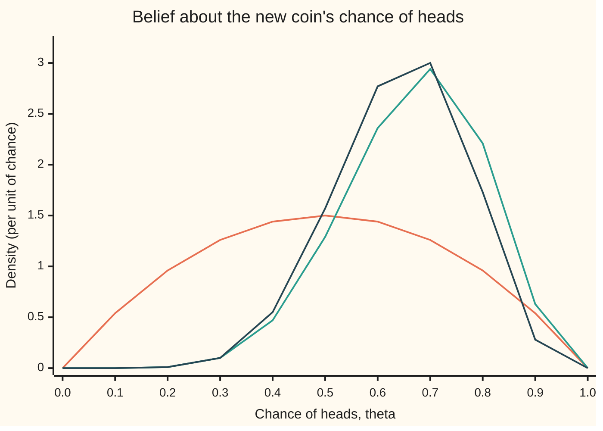
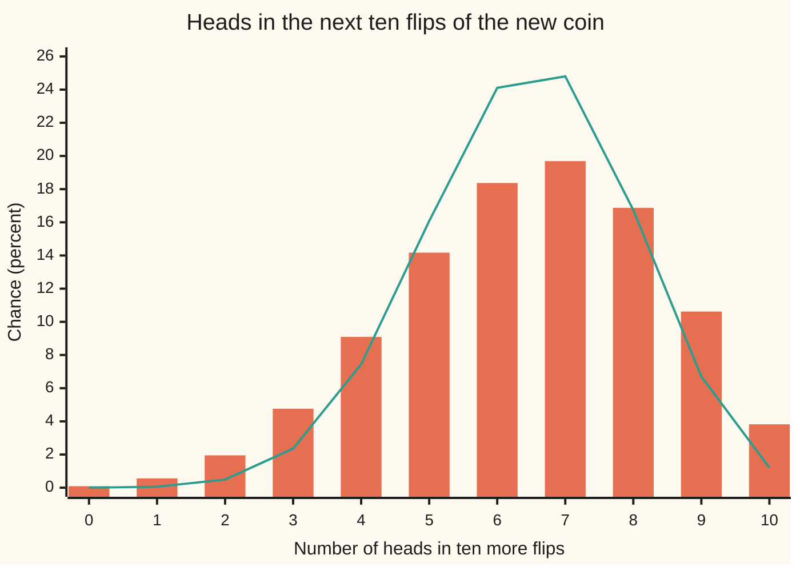

# Beta-binomial: the conjugate update for a proportion

[Syllabus](../../../SYLLABUS.md) → [Probability and statistics](../../../SYLLABUS.md#w09) → [Bayesian Inference](../../../SYLLABUS.md#w09-s10) → Beta-binomial

---

## General Overview

A mint releases a new commemorative coin. Its faces are stamped unevenly, so nobody can say in advance that it lands heads half the time. Someone flips it 10 times and sees 7 heads. Call the coin's unknown chance of heads θ (theta), a number between 0 and 1. What is θ now, and how likely is the 11th flip to come up heads?

Before any flip, the belief about that chance was mild: probably near a half, but far from sure. That belief is the **prior**, the distribution held before the data ([Bayesian updating](01-priors-posteriors-and-updating.md)). Here it is the beta law Beta(2, 2): a hump centred on 0.5 with standard deviation 0.2236 ([Gamma and beta](../04-Continuous%20Distributions/07-gamma-and-beta-distributions.md)).

After the 10 flips, the updated belief, the **posterior**, is Beta(9, 5). Nothing was integrated to get it: the 7 heads were added to the first number and the 3 tails to the second. The posterior averages 0.6429, not the raw 0.7, because the prior still holds some weight. The chance that the next flip lands heads is that same average, 9 in 14.

That shortcut, add the counts and stay inside the beta family, is what **conjugate** means: the prior and the posterior belong to the same family of laws. It turns Bayesian updating for any yes-or-no proportion into bookkeeping.

**A beta prior on a chance, updated with s successes in n independent trials, becomes the beta law with s added to its first number and n − s to its second; its average is the next trial's chance of success.**

**What kind of fact this is:** a theorem, proved on this card in Why it works. Choosing a beta law for the prior, and treating the flips as independent with one fixed chance, is a model.

### The picture: prior, data and posterior



Orange: the prior Beta(2, 2), wide and centred on 0.5. Green: what the 10 flips say alone, the curve θ^7 (1 − θ)^3 scaled to area 1, which is Beta(8, 4), peaked at 0.7. Dark blue: the posterior Beta(9, 5), the product of the two, taller than either and pulled a little back towards 0.5 from the data's peak.

---

## The formula

Notation first, in words. θ is not known, so it carries a distribution. "θ ~ Beta(a, b)" reads "theta follows the beta law with numbers a and b". A vertical bar reads "given": θ | data is theta's law once the flips are known. The flips give s heads in n.

$$\theta \sim \mathrm{Beta}(a, b) \quad\text{and}\quad s \text{ heads in } n \text{ flips} \quad\Longrightarrow\quad \theta \mid \text{data} \sim \mathrm{Beta}(a + s,\; b + n - s)$$

**Read it aloud:** heads go into the first number, tails into the second, and the law stays a beta law.

Its average, and the chance the next flip lands heads, are one number:

$$P(\text{next flip heads} \mid \text{data}) \;=\; E[\theta \mid \text{data}] \;=\; \frac{a + s}{a + b + n} \;=\; \frac{a + b}{a + b + n}\cdot\frac{a}{a + b} \;+\; \frac{n}{a + b + n}\cdot\frac{s}{n}$$

**Read it aloud:** the next flip's chance of heads is the posterior average, which is a weighted average of the prior's average and the observed fraction, the weights being the prior's total a + b against the number of flips n.

For m more flips, with K the number of heads among them, the count follows the **beta-binomial law**:

$$P(K = k \mid \text{data}) \;=\; \binom{m}{k}\,\frac{B(a + s + k,\; b + n - s + m - k)}{B(a + s,\; b + n - s)} \;=\; \binom{m}{k}\,\frac{\alpha(\alpha+1)\cdots(\alpha+k-1)\;\cdot\;\beta(\beta+1)\cdots(\beta+m-k-1)}{(\alpha+\beta)(\alpha+\beta+1)\cdots(\alpha+\beta+m-1)}$$

where α = a + s and β = b + n − s are the posterior's two numbers, 9 and 5 here, and B is the beta integral, the area that scales a beta curve to total 1.

**Read it aloud:** the chance of k heads in m more flips is the number of orders times rising products, as if each future head were drawn from a stock of α heads that grows by one each time, and each tail from a stock of β.

| Symbol | Plain meaning | In our example | Push it up and the answer… |
| --- | --- | --- | --- |
| $\theta$ | the coin's unknown chance of heads | believed near 0.6429 after the flips | — |
| $a$, $b$ | the prior's two numbers | 2 and 2 | a up: prior average up; both up: prior held more firmly |
| $n$, $s$ | flips made, heads seen | 10 and 7 | s up: posterior shifts right; n up: data outweigh the prior |
| $\alpha$, $\beta$ | the posterior's two numbers, a + s and b + n − s | 9 and 5 | — |
| $B(a, b)$ | the beta integral, the area that makes a beta curve's total 1 | 1/B(9, 5) = 6435 | — |
| $\Gamma$ | the gamma integral, used in the folded proof of Step 5: the factorial extended to every positive number, Γ(k) = (k − 1)! for whole k | B(9, 5) = Γ(9)Γ(5)/Γ(14) = 8! 4!/13! = 1/6435 | — |
| $f(\theta)$ | a density: chance per unit of θ | posterior 3.00 at θ = 0.7; highest at the mode, 0.6667 | — |
| $E$, $\mathrm{Var}$ | the long-run average, and the variance | E[θ \| data] = 0.6429, sd 0.1237 | — |
| $m$, $K$, $k$ | future flips, the heads among them, and one value of that count | m = 2: k = 0, 1, 2 | m up: the predictive spreads beyond the binomial |
| $\binom{m}{k}$ | orders of k heads among m flips, C(m, k) | m = 2, k = 1: C(2, 1) = 2 | — |
| $\mu$, $I_j$, $j$ | the posterior average α/(α + β), used in Step 5; and a flag equal to 1 when future flip number j lands heads | μ = 0.6429 | — |
| $L(\theta)$ | the likelihood: the chance of the observed flips if the chance of heads were θ | θ^7 (1 − θ)^3 | — |

### When it holds

- **One fixed chance for every flip.** If the mint swaps coins halfway, Beta(9, 5) describes neither coin.
- **Flips independent once θ is fixed.** Counting the same 10 flips twice turns them into 20 fake-independent ones: Beta(16, 8), standard deviation 0.0943 instead of 0.1237, and 0.9534 instead of 0.8666 for "the coin favours heads". The belief is sharper than the evidence.
- **Positive prior numbers.** With a and b above 0 the prior is a real distribution and so is every posterior. At a = b = 0 the prior's area is infinite, and an all-heads record would leave a posterior with infinite area too.
- **Two outcomes only.** Heads or tails. More categories need the Dirichlet law, the several-outcome version of the beta.
- **The stopping rule does not matter** so long as it looks only at flips already seen. Flipping until the seventh head (here, flip 10) and flipping exactly 10 times give the same likelihood θ^7 (1 − θ)^3 up to a constant, so the same posterior.

---

## Why it works

### Step 0: each flip multiplies the belief by θ or by 1 − θ, and a beta curve is already such a product

Bayes' rule says the posterior is the prior times the likelihood, divided by one constant ([Bayesian updating](01-priors-posteriors-and-updating.md)). A head has chance θ, a tail 1 − θ. A beta density is θ to a power times 1 − θ to a power. Multiplying such a curve by more factors of θ and 1 − θ only raises the two powers. The family is closed under updating; the rest is reading off the powers and the constant.

### Step 1: the likelihood of the record

The record was H T H H H T H H T H. If the chance of heads were θ, independence gives its chance as a product of ten factors: θ for each head, 1 − θ for each tail.

$$L(\theta) = \theta^{7}\,(1 - \theta)^{3}$$

Order is irrelevant: any record with 7 heads and 3 tails gives the same product. Reporting only the count multiplies L by C(10, 7) = 120, a number that does not depend on θ and so cancels in Step 2.

### Step 2: multiply by the prior and read off the new beta law

The prior Beta(2, 2) has density 6 θ (1 − θ); the 6 is 1/B(2, 2). Multiply:

$$f(\theta \mid \text{data}) \;\propto\; \theta\,(1-\theta)\;\cdot\;\theta^{7}(1-\theta)^{3} \;=\; \theta^{8}\,(1-\theta)^{4}$$

The sign ∝ reads "is a constant multiple of". The curve θ^8 (1 − θ)^4 is the shape of Beta(9, 5), since a beta law with numbers α and β has powers α − 1 and β − 1. A density must have area 1, and only one constant does that: 1/B(9, 5) = 6435. So the posterior is Beta(9, 5), exactly.

The constant thrown away along the way is worth keeping once. Before any flip, the chance of seeing 7 heads in 10 was the likelihood averaged over the prior, the **evidence**: C(10, 7) × B(9, 5)/B(2, 2) = 120 × 6/6435 = 16/143 = 0.1119, about 1 run in 9.

<details>
<summary>Detailed proof: the update, for any beta prior and any record</summary>

Let the prior be $f(\theta) = \theta^{a-1}(1-\theta)^{b-1}/B(a,b)$ on $0 < \theta < 1$, with $a, b > 0$. A record of $n$ flips with $s$ heads, independent given θ, has likelihood $L(\theta) = \theta^s(1-\theta)^{n-s}$. Bayes' rule for a density gives
$$f(\theta \mid \text{data}) = \frac{L(\theta) f(\theta)}{\int_0^1 L(u) f(u)\,du} = \frac{\theta^{a+s-1}(1-\theta)^{b+n-s-1}/B(a,b)}{B(a+s,\,b+n-s)/B(a,b)} = \frac{\theta^{a+s-1}(1-\theta)^{b+n-s-1}}{B(a+s,\,b+n-s)}.$$
The middle step uses the definition of the beta integral, $B(\alpha,\beta) = \int_0^1 u^{\alpha-1}(1-u)^{\beta-1}\,du$, which is finite because $a + s > 0$ and $b + n - s > 0$. The right side is the Beta(a + s, b + n − s) density. The denominator of the first fraction is the evidence for the ordered record; for the count alone multiply by $\binom{n}{s}$, which cancels between top and bottom and leaves the posterior unchanged. Both B values are ratios of factorials when the numbers are whole: $B(\alpha,\beta) = (\alpha-1)!\,(\beta-1)!/(\alpha+\beta-1)!$, from [Gamma and beta](../04-Continuous%20Distributions/07-gamma-and-beta-distributions.md).

</details>

### Step 3: the average is a compromise, and its weights are counts

A beta law's average is its first number over the total: E[θ | data] = 9/14 = 0.6429. Split the 14 into its sources, the prior's 4 and the data's 10:

$$\frac{9}{14} = \frac{4}{14}\cdot 0.5 + \frac{10}{14}\cdot 0.7 = 0.2857 \times 0.5 + 0.7143 \times 0.7$$

The prior pulls with the weight of a + b = 4 flips, the data with the weight of their 10. A helpful picture: the prior acts like 2 heads and 2 tails already seen. The picture is only bookkeeping; a and b may be fractions, and no such flips took place. The proper name for a + b is the prior's **concentration**: the larger it is, the more flips it takes to move the average.

The spread shrinks too. Var(θ | data) = αβ/((α + β)^2 (α + β + 1)) = 45/2940, a standard deviation of 0.1237, down from the prior's 0.2236. The peak, the **mode**, sits at (α − 1)/(α + β − 2) = 8/12 = 0.6667 (the formula needs both numbers above 1): the posterior's highest point is not its average, because the long left tail pulls the average down.

One more reading: how sure is the coin to favour heads? For whole numbers, a Beta(9, 5) draw behaves like the 9th smallest of 13 random numbers spread evenly on 0 to 1, so it lies above 0.5 exactly when fewer than 9 of the 13 fall below 0.5, a sum of binomial terms ([Gamma and beta](../04-Continuous%20Distributions/07-gamma-and-beta-distributions.md), Step 6): 7099/8192 = 0.8666. Before the flips it was 0.5000. That is a statement about the coin given the data and the prior; it is not a p-value.

### Step 4: the next flip's chance is the posterior average

If θ were known, the next flip would land heads with chance θ. It is not known, so average over the belief, the law of total probability with a density:

$$P(\text{next flip heads} \mid \text{data}) = \int_0^1 \theta\, f(\theta \mid \text{data})\,d\theta = E[\theta \mid \text{data}] = \frac{9}{14} = 0.6429$$

The posterior average, not the peak, prices a bet on the next flip. With a flat prior, Beta(1, 1), the same rule gives (s + 1)/(n + 2) = 8/12 = 0.6667, **Laplace's rule of succession**.

### Step 5: several flips share one unknown, so they spread wider

Two more flips. Given θ they are independent, with chance θ^2 of two heads. Averaged over the posterior:

$$P(K = 2 \mid \text{data}) = E[\theta^2 \mid \text{data}] = \frac{9 \cdot 10}{14 \cdot 15} = \frac{3}{7} = 0.4286$$

and likewise P(K = 1) = 2 × 9 × 5/210 = 0.4286 and P(K = 0) = 5 × 6/210 = 0.1429. Plugging the single number 9/14 into a binomial instead gives 0.1276, 0.4592, 0.4133: too few runs of all heads and all tails.

The reason is shared ignorance. If the first new flip lands heads, that is evidence θ is high, so the second flip is more likely to be heads too. Given θ the flips are independent; averaged over θ they are positively linked. Over m flips the variance picks up a second term:

$$\mathrm{Var}(K \mid \text{data}) = m\,\mu(1-\mu) + m(m-1)\,\mathrm{Var}(\theta \mid \text{data}) = \frac{m\,\alpha\beta\,(\alpha+\beta+m)}{(\alpha+\beta)^2(\alpha+\beta+1)}, \qquad \mu = \frac{\alpha}{\alpha+\beta}$$

For the next ten flips: variance 3.6735 against the binomial's 2.2959, standard deviation 1.9166 against 1.5152. The chance of ten heads in ten is 0.0382, not 0.0121.

<details>
<summary>Detailed proof: the predictive law and its variance</summary>

Given θ, the count K in m flips is Binomial(m, θ). Average over the posterior Beta(α, β):
$$P(K = k \mid \text{data}) = \int_0^1 \binom{m}{k}\theta^k(1-\theta)^{m-k}\,\frac{\theta^{\alpha-1}(1-\theta)^{\beta-1}}{B(\alpha,\beta)}\,d\theta = \binom{m}{k}\frac{B(\alpha+k,\,\beta+m-k)}{B(\alpha,\beta)}.$$
Here Γ is the gamma integral of [Gamma and beta](../04-Continuous%20Distributions/07-gamma-and-beta-distributions.md), the factorial extended to every positive number, with Γ(k) = (k − 1)! for whole k. For any positive numbers u, v and z, $B(u,v) = \Gamma(u)\Gamma(v)/\Gamma(u+v)$ and $\Gamma(z+1) = z\,\Gamma(z)$; with these, the ratio of beta integrals collapses to the rising products in The formula. Summing over $k$ inside the integral gives $(\theta + 1 - \theta)^m = 1$, so the chances total 1.

For the variance, write $K = I_1 + \cdots + I_m$, with $I_j$ equal to 1 when future flip $j$ is heads. Each has average $\mu = E[\theta]$ and variance $\mu(1-\mu)$. For $i \neq j$, $E[I_i I_j] = E[\theta^2]$, so $\mathrm{Cov}(I_i, I_j) = E[\theta^2] - \mu^2 = \mathrm{Var}(\theta)$, all under the posterior. Adding the $m$ variances and the $m(m-1)$ covariances gives the formula in Step 5. With $E[\theta^2] = \alpha(\alpha+1)/((\alpha+\beta)(\alpha+\beta+1))$ the right side simplifies to $m\alpha\beta(\alpha+\beta+m)/((\alpha+\beta)^2(\alpha+\beta+1))$.

</details>

<details>
<summary>The same law from an urn</summary>

Put 9 red balls and 5 blue in an urn. Draw one, note its colour, and put it back with one more of the same colour. Repeat. The chance of red, red is 9/14 × 10/15, of red, blue is 9/14 × 5/15, and so on: exactly the rising products above. This **Pólya urn**, studied by Eggenberger and Pólya in 1923, never mentions θ, yet its draws follow the beta-binomial law. The check enumerates all 1,024 draw paths of ten draws and recovers the predictive law for the next ten flips in whole numbers.

</details>

### The picture: the next ten flips, honest and plug-in



Orange bars: the beta-binomial predictive, averaged over the posterior Beta(9, 5). Green line: the plug-in Binomial(10, 9/14). Both average 6.4286 heads. The bars are lower in the middle and heavier at both ends: the honest forecast admits it does not know θ.

### Step 6: order and batching do not matter

Update one flip at a time and the posterior average walks 0.6000, 0.5000, 0.5714, 0.6250, 0.6667, 0.6000, 0.6364, 0.6667, 0.6154, 0.6429, ending where the batch update ended. Each step adds 1 to one of the two numbers, and addition does not care about order. So yesterday's posterior is today's prior, and a coin flipped by two people can be updated in either order.

The same bookkeeping exists for other pairs of prior and data. A normal prior with normal measurements stays normal ([Normal-normal](03-normal-normal.md)); a gamma prior on a rate, with Poisson counts, stays gamma ([Gamma-Poisson](04-gamma-poisson.md)). When no such pair fits, the posterior is found by simulation ([MCMC in outline](06-markov-chain-monte-carlo-in-outline.md)).

---

## Worked numbers, by hand

The new coin: prior Beta(2, 2), then 7 heads in 10 flips.

| Step | Arithmetic | Value |
| --- | --- | --- |
| posterior numbers | 2 + 7 and 2 + 3 | Beta(9, 5) |
| posterior average | 9/14 | 0.6429 |
| same, as a compromise | 4/14 × 0.5 + 10/14 × 0.7 | 0.6429 |
| posterior standard deviation | √(9 × 5/(14^2 × 15)) = √(45/2940) | 0.1237 |
| posterior mode | 8/12 | 0.6667 |
| evidence for 7 of 10 | 120 × 6/6435 = 720/6435 | 0.1119 |
| chance the coin favours heads | 7099/8192 | 0.8666 |
| two more flips, both heads | 9 × 10/(14 × 15) | 0.4286 |
| **next flip heads** | **9/14** | **0.6429** |

After seeing 7 heads in 10, a fair bet on the 11th flip pays as if heads comes up about 9 times in 14, a little under the raw 7 in 10.

### What breaks if you drop a piece

The right answers: next flip 0.6429, both of two more flips heads 0.4286, posterior standard deviation 0.1237.

| Mistake | Comes out at | What went wrong |
| --- | --- | --- |
| Plug 9/14 into a binomial for future flips | two heads 0.4133; ten of ten 0.0121 instead of 0.0382 | the uncertainty about θ, shared by every future flip, was dropped |
| Ignore the prior | next flip 0.7000 | the raw fraction s/n treats 10 flips as certainty |
| Heads added to the second number | Beta(5, 9), average 0.3571 | the first number goes with θ, the heads |
| The same 10 flips counted twice | Beta(16, 8): sd 0.0943, P(θ > 0.5) = 0.9534 | the flips are not new and independent; a hypothesis dropped, not a slip |

The code prints every row.

---

## Code, from first principles, and it actually runs

Nothing imported holds the answer: no statistics module, no random module, no beta function. Four roads. The conjugate formulas add counts. A grid of 2,001 points on θ starts from the prior 6θ(1 − θ), multiplies in one factor per flip, and integrates by Simpson's rule; it never uses the update rule, yet reproduces the posterior average, the chance above 0.5, the evidence and every predictive chance. A Pólya urn enumerates every draw path in whole numbers. A simulation with a SplitMix64 generator (a small, written-out source of random bits, seed 20260929) draws θ from the prior as the middle of three uniform numbers, flips ten coins, and keeps only the 22,252 runs of 200,000 that show 7 heads; each estimate carries its standard error. The asserts set roads side by side, never a number against itself.

### Python

```python
# Beta-binomial -- the check behind the card.  Nothing imported holds the answer.
# A new coin shows 7 heads in 10 flips.  Prior Beta(2, 2) on its chance of heads, theta.
# Roads: (1) conjugate formulas, heads added to a, tails to b; (2) a 2,000-step grid updated
# flip by flip, integrated by Simpson's rule, never using the update rule; (3) a Polya urn,
# every draw path counted; (4) a seeded simulation keeping only coins that show 7 of 10.
from math import sqrt

A0, B0, N, S = 2, 2, 10, 7                   # prior counts; flips; heads
FLIPS = "HTHHHTHHTH"                         # the record, in order: 7 heads, 3 tails
A, B = A0 + S, B0 + N - S                    # the conjugate update: Beta(9, 5)

def fact(n):
    out = 1
    for j in range(2, n + 1):
        out *= j
    return out

def comb(n, k):
    return fact(n) // (fact(k) * fact(n - k))

def rising(x, k):                            # x (x+1) ... (x+k-1), whole numbers
    out = 1
    for j in range(k):
        out *= x + j
    return out

def bdens(t, a, b):                          # beta density, whole a and b
    return fact(a + b - 1) / (fact(a - 1) * fact(b - 1)) * t ** (a - 1) * (1 - t) ** (b - 1)

def pred(a, b, m, k):                        # road 1: chance of k heads in m more flips
    return comb(m, k) * rising(a, k) * rising(b, m - k) / rising(a + b, m)

def urn(red, blue, m):                       # road 3: every draw path of a Polya urn
    ways = [0] * (m + 1)
    for path in range(2 ** m):
        r, bl, w, k = red, blue, 1, 0
        for i in range(m):
            if path >> i & 1:
                w, r, k = w * r, r + 1, k + 1
            else:
                w, bl = w * bl, bl + 1
        ways[k] += w
    return ways, rising(red + blue, m)

# road 2: a grid on theta, prior times one factor per flip, integrated by Simpson's rule
G = 2000
h = 1.0 / G
ts = [i * h for i in range(G + 1)]
wt = [(1 if i in (0, G) else 4 if i % 2 else 2) * h / 3 for i in range(G + 1)]
post = [6 * t * (1 - t) for t in ts]         # Beta(2, 2) prior density
means = []
for c in FLIPS:
    post = [p * (t if c == "H" else 1 - t) for p, t in zip(post, ts)]
    z = sum(w * p for w, p in zip(wt, post))
    means.append(sum(w * t * p for w, t, p in zip(wt, ts, post)) / z)
def grid(f, lo=0):                           # Simpson: f(theta) x posterior, from node lo to 1
    n = G - lo
    return sum((1 if i in (0, n) else 4 if i % 2 else 2) * h / 3 * f(ts[lo + i]) * post[lo + i]
               for i in range(n + 1)) / z

T = A + B
mean, var = A / T, A * B / (T * T * (T + 1))
evid = comb(N, S) * fact(A - 1) * fact(B - 1) * fact(A0 + B0 - 1) / (fact(T - 1) * fact(A0 - 1) * fact(B0 - 1))
over = sum(comb(T - 1, j) for j in range(A)) / 2 ** (T - 1)   # P(theta > 1/2): fewer than 9 of 13 below
print(f"prior Beta({A0},{B0}): mean {A0 / (A0 + B0):.4f}, sd {sqrt(A0 * B0 / ((A0 + B0) ** 2 * (A0 + B0 + 1))):.4f}")
print(f"posterior Beta({A},{B}): mean {mean:.4f}, by grid {grid(lambda t: t):.4f}; sd {sqrt(var):.4f}, "
      f"by grid {sqrt(grid(lambda t: t * t) - grid(lambda t: t) ** 2):.4f}; mode {A - 1}/{T - 2} = {(A - 1) / (T - 2):.4f}; variance {A * B}/{T * T * (T + 1)}")
print(f"weights: prior {A0 + B0}/{T} = {(A0 + B0) / T:.4f}, data {N}/{T} = {N / T:.4f}; "
      f"{(A0 + B0) / T:.4f} x 0.5 + {N / T:.4f} x {S / N:.1f} = {(A0 + B0) / T * 0.5 + N / T * S / N:.4f}")
print(f"grid of {G + 1} points, means after each flip " + FLIPS + ": " + ", ".join(f"{m:.4f}" for m in means))
print(f"evidence P(7 of 10) = 16/143 = {16 / 143:.4f}; beta ratio {evid:.4f}; grid {comb(N, S) * z:.4f}; about 1 in {round(1 / evid)}")
c22, c84, c95 = (fact(a + b - 1) // (fact(a - 1) * fact(b - 1)) for a, b in ((2, 2), (8, 4), (9, 5)))
print(f"constants 1/B: Beta(2,2) {c22}, Beta(8,4) {c84}, Beta(9,5) {c95}; C(10,7) = {comb(N, S)}; "
      f"{comb(N, S)} x {c22} / {c95} = {comb(N, S) * c22}/{c95}")
print(f"P(theta > 0.5): prior 0.5000; posterior {int(over * 8192)}/8192 = {over:.4f}, by grid {grid(lambda t: 1, G // 2):.4f}")
w2, d2 = urn(A, B, 2)
print(f"next flip heads: {A}/{T} = {pred(A, B, 1, 1):.4f}; by grid {grid(lambda t: t):.4f}")
print(f"next two, k = 0, 1, 2: formula {', '.join(f'{pred(A, B, 2, k):.4f}' for k in range(3))}; "
      f"urn {w2}/{d2}; grid {', '.join(f'{grid(lambda t: comb(2, k) * t ** k * (1 - t) ** (2 - k)):.4f}' for k in range(3))}")
p = A / T
print(f"plug-in Binomial(2, {A}/{T}): {', '.join(f'{comb(2, k) * p ** k * (1 - p) ** (2 - k):.4f}' for k in range(3))}")
w10, d10 = urn(A, B, 10)
bb = [pred(A, B, 10, k) for k in range(11)]
pl = [comb(10, k) * p ** k * (1 - p) ** (10 - k) for k in range(11)]
gr = [grid(lambda t: comb(10, k) * t ** k * (1 - t) ** (10 - k)) for k in range(11)]
m10 = sum(k * q for k, q in enumerate(bb))
v10 = sum((k - m10) ** 2 * q for k, q in enumerate(bb))
print(f"next ten: mean {m10:.4f}; variance {v10:.4f}, closed form {10 * A * B * (T + 10) / (T * T * (T + 1)):.4f}; "
      f"plug-in variance {10 * p * (1 - p):.4f}; sd {sqrt(v10):.4f} against {sqrt(10 * p * (1 - p)):.4f}")
print(f"next ten, urn paths {2 ** 10}, total {sum(w10)} = 14 x 15 x ... x 23 = {d10}")
# road 4: simulation, SplitMix64 seed 20260929
MASK = (1 << 64) - 1
state = 20260929
def uniform():
    global state
    state = (state + 0x9E3779B97F4A7C15) & MASK
    z = state
    z = ((z ^ (z >> 30)) * 0xBF58476D1CE4E5B9) & MASK
    z = ((z ^ (z >> 27)) * 0x94D049BB133111EB) & MASK
    return (((z ^ (z >> 31)) >> 11) + 0.5) / 2.0 ** 53
R = 200_000
kept, st, st2, sover, snext, stwo = 0, 0.0, 0.0, 0, 0, 0
for _ in range(R):
    th = sorted((uniform(), uniform(), uniform()))[1]   # middle of three uniforms: Beta(2, 2)
    if sum(uniform() < th for _ in range(N)) != S:
        continue
    f1, f2 = uniform() < th, uniform() < th
    kept, st, st2, sover = kept + 1, st + th, st2 + th * th, sover + (th > 0.5)
    snext, stwo = snext + f1, stwo + (f1 and f2)
acc, sm = kept / R, st / kept
ssd = sqrt(st2 / kept - sm * sm)
se = lambda q, n: sqrt(q * (1 - q) / n)
pn, p2, po = snext / kept, stwo / kept, sover / kept
print(f"simulated {R} coins, seed 20260929; kept {kept} showing 7 of 10; estimate (standard error)")
print(f"  evidence {acc:.4f} ({se(acc, R):.4f}); posterior mean {sm:.4f} ({ssd / sqrt(kept):.4f}); "
      f"P(theta > 0.5) {po:.4f} ({se(po, kept):.4f})")
print(f"  next flip heads {pn:.4f} ({se(pn, kept):.4f}); next two both heads {p2:.4f} ({se(p2, kept):.4f})")
# what breaks
print(f"mistake, plug-in for two more: both heads {p * p:.4f} not {pred(A, B, 2, 2):.4f}; "
      f"ten heads in ten {pl[10]:.4f} not {bb[10]:.4f}")
print(f"mistake, prior ignored: next flip {S / N:.4f}")
print(f"mistake, heads added to b: Beta({A0 + N - S},{B0 + S}) mean {(A0 + N - S) / T:.4f}")
d_over = sum(comb(A0 + 2 * N + B0 - 1, j) for j in range(A0 + 2 * S)) / 2 ** (A0 + 2 * N + B0 - 1)
print(f"mistake, the 10 flips counted twice: Beta({A0 + 2 * S},{B0 + 2 * (N - S)}) mean {(A0 + 2 * S) / (T + N):.4f}, "
      f"sd {sqrt((A0 + 2 * S) * (B0 + 2 * N - 2 * S) / ((T + N) ** 2 * (T + N + 1))):.4f}, P(theta > 0.5) {d_over:.4f}")
print(f"try: prior Beta(1,1) next flip {1 + S}/{2 + N} = {(1 + S) / (2 + N):.4f}; Beta(20,20) {(20 + S) / (40 + N):.4f}; "
      f"70 of 100 {A0 + 70}/{A0 + B0 + 100} = {(A0 + 70) / (A0 + B0 + 100):.4f}")
# figures
print("figure, theta: " + ", ".join(f"{i / 10:.1f}" for i in range(11)))
for a, b, lab in ((A0, B0, "prior Beta(2,2)"), (S + 1, N - S + 1, "data alone Beta(8,4)"), (A, B, "posterior Beta(9,5)")):
    print(f"figure, {lab}: " + ", ".join(f"{bdens(i / 10, a, b):.2f}" for i in range(11)))
print("figure, next ten, beta-binomial, percent: " + ", ".join(f"{100 * q:.2f}" for q in bb))
print("figure, next ten, plug-in binomial, percent: " + ", ".join(f"{100 * q:.2f}" for q in pl))
# asserts: every one sets two separate roads side by side
assert abs(grid(lambda t: t) - mean) < 1e-10 and abs(means[-1] - mean) < 1e-10
assert abs(grid(lambda t: 1, G // 2) - over) < 1e-10 and abs(comb(N, S) * z - evid) < 1e-10
assert all(w10[k] == comb(10, k) * rising(A, k) * rising(B, 10 - k) for k in range(11)) and sum(w10) == d10
assert all(abs(g - q) < 1e-10 for g, q in zip(gr, bb)) and abs(v10 - 10 * A * B * (T + 10) / (T * T * (T + 1))) < 1e-12
assert abs(sm - mean) < 4 * ssd / sqrt(kept) and abs(pn - mean) < 4 * se(pn, kept)
assert abs(acc - 16 / 143) < 4 * se(acc, R) and abs(p2 - pred(A, B, 2, 2)) < 4 * se(p2, kept)
```

**Ran 2026-09-29 on macOS, Python 3.14.6, standard library only. All checks passed. Output, pasted from the run:**

```
prior Beta(2,2): mean 0.5000, sd 0.2236
posterior Beta(9,5): mean 0.6429, by grid 0.6429; sd 0.1237, by grid 0.1237; mode 8/12 = 0.6667; variance 45/2940
weights: prior 4/14 = 0.2857, data 10/14 = 0.7143; 0.2857 x 0.5 + 0.7143 x 0.7 = 0.6429
grid of 2001 points, means after each flip HTHHHTHHTH: 0.6000, 0.5000, 0.5714, 0.6250, 0.6667, 0.6000, 0.6364, 0.6667, 0.6154, 0.6429
evidence P(7 of 10) = 16/143 = 0.1119; beta ratio 0.1119; grid 0.1119; about 1 in 9
constants 1/B: Beta(2,2) 6, Beta(8,4) 1320, Beta(9,5) 6435; C(10,7) = 120; 120 x 6 / 6435 = 720/6435
P(theta > 0.5): prior 0.5000; posterior 7099/8192 = 0.8666, by grid 0.8666
next flip heads: 9/14 = 0.6429; by grid 0.6429
next two, k = 0, 1, 2: formula 0.1429, 0.4286, 0.4286; urn [30, 90, 90]/210; grid 0.1429, 0.4286, 0.4286
plug-in Binomial(2, 9/14): 0.1276, 0.4592, 0.4133
next ten: mean 6.4286; variance 3.6735, closed form 3.6735; plug-in variance 2.2959; sd 1.9166 against 1.5152
next ten, urn paths 1024, total 4151586700800 = 14 x 15 x ... x 23 = 4151586700800
simulated 200000 coins, seed 20260929; kept 22252 showing 7 of 10; estimate (standard error)
  evidence 0.1113 (0.0007); posterior mean 0.6427 (0.0008); P(theta > 0.5) 0.8643 (0.0023)
  next flip heads 0.6400 (0.0032); next two both heads 0.4292 (0.0033)
mistake, plug-in for two more: both heads 0.4133 not 0.4286; ten heads in ten 0.0121 not 0.0382
mistake, prior ignored: next flip 0.7000
mistake, heads added to b: Beta(5,9) mean 0.3571
mistake, the 10 flips counted twice: Beta(16,8) mean 0.6667, sd 0.0943, P(theta > 0.5) 0.9534
try: prior Beta(1,1) next flip 8/12 = 0.6667; Beta(20,20) 0.5400; 70 of 100 72/104 = 0.6923
figure, theta: 0.0, 0.1, 0.2, 0.3, 0.4, 0.5, 0.6, 0.7, 0.8, 0.9, 1.0
figure, prior Beta(2,2): 0.00, 0.54, 0.96, 1.26, 1.44, 1.50, 1.44, 1.26, 0.96, 0.54, 0.00
figure, data alone Beta(8,4): 0.00, 0.00, 0.01, 0.10, 0.47, 1.29, 2.36, 2.94, 2.21, 0.63, 0.00
figure, posterior Beta(9,5): 0.00, 0.00, 0.01, 0.10, 0.55, 1.57, 2.77, 3.00, 1.73, 0.28, 0.00
figure, next ten, beta-binomial, percent: 0.09, 0.56, 1.95, 4.76, 9.09, 14.17, 18.37, 19.69, 16.87, 10.62, 3.82
figure, next ten, plug-in binomial, percent: 0.00, 0.06, 0.49, 2.36, 7.44, 16.08, 24.11, 24.80, 16.74, 6.70, 1.21
```

### Rust

Same numbers, same labels, built with `rustc --edition 2021 -O`.

```rust
// Beta-binomial -- the same check as the Python, in Rust.  No crates.
// A new coin shows 7 heads in 10 flips.  Prior Beta(2, 2) on its chance of heads, theta.
// Roads: (1) conjugate formulas, heads added to a, tails to b; (2) a 2,000-step grid updated
// flip by flip, integrated by Simpson's rule, never using the update rule; (3) a Polya urn,
// every draw path counted; (4) a seeded simulation keeping only coins that show 7 of 10.
const A0: u64 = 2; const B0: u64 = 2; const N: u64 = 10; const S: u64 = 7; // prior counts; flips; heads
const FLIPS: &str = "HTHHHTHHTH"; // the record, in order: 7 heads, 3 tails
const A: u64 = A0 + S; const B: u64 = B0 + N - S; // the conjugate update: Beta(9, 5)
const G: usize = 2000;

fn fact(n: u64) -> u64 { (2..=n).product() }
fn comb(n: u64, k: u64) -> u64 { (0..k).fold(1, |v, j| v * (n - j) / (j + 1)) }
fn rising(x: u64, k: u64) -> u64 { (0..k).map(|j| x + j).product() } // x (x+1) ... (x+k-1)

fn bdens(t: f64, a: u64, b: u64) -> f64 { // beta density, whole a and b
    fact(a + b - 1) as f64 / (fact(a - 1) * fact(b - 1)) as f64 * t.powi(a as i32 - 1) * (1.0 - t).powi(b as i32 - 1)
}
fn pred(a: u64, b: u64, m: u64, k: u64) -> f64 { // road 1: chance of k heads in m more flips
    (comb(m, k) * rising(a, k) * rising(b, m - k)) as f64 / rising(a + b, m) as f64
}
fn urn(red: u64, blue: u64, m: u64) -> (Vec<u64>, u64) { // road 3: every draw path of a Polya urn
    let mut ways = vec![0u64; m as usize + 1];
    for path in 0..(1u64 << m) {
        let (mut r, mut bl, mut w, mut k) = (red, blue, 1u64, 0usize);
        for i in 0..m {
            if path >> i & 1 == 1 { w *= r; r += 1; k += 1 } else { w *= bl; bl += 1 }
        }
        ways[k] += w;
    }
    (ways, rising(red + blue, m))
}
fn binom(m: u64, k: u64, p: f64) -> f64 { comb(m, k) as f64 * p.powi(k as i32) * (1.0 - p).powi((m - k) as i32) }
fn join(xs: &[f64], d: usize) -> String { xs.iter().map(|x| format!("{:.*}", d, x)).collect::<Vec<_>>().join(", ") }

struct SplitMix(u64); // SplitMix64, seed 20260929
impl SplitMix {
    fn uniform(&mut self) -> f64 {
        self.0 = self.0.wrapping_add(0x9E3779B97F4A7C15);
        let mut z = self.0;
        z = (z ^ (z >> 30)).wrapping_mul(0xBF58476D1CE4E5B9);
        z = (z ^ (z >> 27)).wrapping_mul(0x94D049BB133111EB);
        (((z ^ (z >> 31)) >> 11) as f64 + 0.5) / 2f64.powi(53)
    }
}

fn main() {
    // road 2: a grid on theta, prior times one factor per flip, integrated by Simpson's rule
    let h = 1.0 / G as f64;
    let ts: Vec<f64> = (0..=G).map(|i| i as f64 * h).collect();
    let sw = |i: usize, n: usize| (if i == 0 || i == n { 1.0 } else if i % 2 == 1 { 4.0 } else { 2.0 }) * h / 3.0;
    let mut post: Vec<f64> = ts.iter().map(|t| 6.0 * t * (1.0 - t)).collect(); // Beta(2, 2) prior density
    let (mut means, mut z) = (Vec::new(), 0.0);
    for c in FLIPS.chars() {
        for i in 0..=G { post[i] *= if c == 'H' { ts[i] } else { 1.0 - ts[i] } }
        z = (0..=G).map(|i| sw(i, G) * post[i]).sum::<f64>();
        means.push((0..=G).map(|i| sw(i, G) * ts[i] * post[i]).sum::<f64>() / z);
    }
    let grid = |f: &dyn Fn(f64) -> f64, lo: usize| -> f64 { // Simpson: f(theta) x posterior, from node lo to 1
        let n = G - lo;
        (0..=n).map(|i| sw(i, n) * f(ts[lo + i]) * post[lo + i]).sum::<f64>() / z
    };
    let (af, bf, a0, b0, nf, sf) = (A as f64, B as f64, A0 as f64, B0 as f64, N as f64, S as f64);
    let t = af + bf;
    let (mean, var) = (af / t, af * bf / (t * t * (t + 1.0)));
    let evid = (comb(N, S) * fact(A - 1) * fact(B - 1) * fact(A0 + B0 - 1)) as f64 / (fact(A + B - 1) * fact(A0 - 1) * fact(B0 - 1)) as f64;
    let over = (0..A).map(|j| comb(A + B - 1, j)).sum::<u64>() as f64 / 2f64.powi((A + B - 1) as i32);
    let gm = grid(&|t| t, 0);
    println!("prior Beta({},{}): mean {:.4}, sd {:.4}", A0, B0, a0 / (a0 + b0), (a0 * b0 / ((a0 + b0).powi(2) * (a0 + b0 + 1.0))).sqrt());
    println!("posterior Beta({},{}): mean {:.4}, by grid {:.4}; sd {:.4}, by grid {:.4}; mode {}/{} = {:.4}; variance {}/{}", A, B, mean, gm, var.sqrt(), (grid(&|t| t * t, 0) - gm * gm).sqrt(), A - 1, A + B - 2, (af - 1.0) / (t - 2.0), A * B, (A + B) * (A + B) * (A + B + 1));
    let (wp, wd) = ((a0 + b0) / t, nf / t);
    println!("weights: prior {}/{} = {:.4}, data {}/{} = {:.4}; {:.4} x 0.5 + {:.4} x {:.1} = {:.4}", A0 + B0, A + B, wp, N, A + B, wd, wp, wd, sf / nf, wp * 0.5 + wd * sf / nf);
    println!("grid of {} points, means after each flip {}: {}", G + 1, FLIPS, join(&means, 4));
    println!("evidence P(7 of 10) = 16/143 = {:.4}; beta ratio {:.4}; grid {:.4}; about 1 in {}", 16.0 / 143.0, evid, comb(N, S) as f64 * z, (1.0 / evid).round());
    let inv: Vec<u64> = [(2, 2), (8, 4), (9, 5)].iter().map(|&(a, b)| fact(a + b - 1) / (fact(a - 1) * fact(b - 1))).collect();
    println!("constants 1/B: Beta(2,2) {}, Beta(8,4) {}, Beta(9,5) {}; C(10,7) = {}; {} x {} / {} = {}/{}", inv[0], inv[1], inv[2], comb(N, S), comb(N, S), inv[0], inv[2], comb(N, S) * inv[0], inv[2]);
    let gover = grid(&|_| 1.0, G / 2);
    println!("P(theta > 0.5): prior 0.5000; posterior {}/8192 = {:.4}, by grid {:.4}", (over * 8192.0) as u64, over, gover);
    let (w2, d2) = urn(A, B, 2);
    println!("next flip heads: {}/{} = {:.4}; by grid {:.4}", A, A + B, pred(A, B, 1, 1), gm);
    let g2: Vec<f64> = (0..3).map(|k| grid(&|t| binom(2, k, t), 0)).collect();
    let f2: Vec<f64> = (0..3).map(|k| pred(A, B, 2, k)).collect();
    println!("next two, k = 0, 1, 2: formula {}; urn {:?}/{}; grid {}", join(&f2, 4), w2, d2, join(&g2, 4));
    let p = mean;
    println!("plug-in Binomial(2, {}/{}): {}", A, A + B, join(&(0..3).map(|k| binom(2, k, p)).collect::<Vec<_>>(), 4));
    let (w10, d10) = urn(A, B, 10);
    let bb: Vec<f64> = (0..=10).map(|k| pred(A, B, 10, k)).collect();
    let pl: Vec<f64> = (0..=10).map(|k| binom(10, k, p)).collect();
    let gr: Vec<f64> = (0..=10).map(|k| grid(&|t| binom(10, k, t), 0)).collect();
    let m10: f64 = bb.iter().enumerate().map(|(k, q)| k as f64 * q).sum();
    let v10: f64 = bb.iter().enumerate().map(|(k, q)| (k as f64 - m10).powi(2) * q).sum();
    let v10c = 10.0 * af * bf * (t + 10.0) / (t * t * (t + 1.0));
    println!("next ten: mean {:.4}; variance {:.4}, closed form {:.4}; plug-in variance {:.4}; sd {:.4} against {:.4}", m10, v10, v10c, 10.0 * p * (1.0 - p), v10.sqrt(), (10.0 * p * (1.0 - p)).sqrt());
    println!("next ten, urn paths {}, total {} = 14 x 15 x ... x 23 = {}", 1u64 << 10, w10.iter().sum::<u64>(), d10);
    // road 4: simulation, SplitMix64 seed 20260929
    let mut rng = SplitMix(20260929);
    let r = 200_000usize;
    let (mut kept, mut st, mut st2, mut sover, mut snext, mut stwo) = (0usize, 0.0, 0.0, 0usize, 0usize, 0usize);
    for _ in 0..r {
        let (u1, u2, u3) = (rng.uniform(), rng.uniform(), rng.uniform());
        let th = u1.min(u2).max(u1.max(u2).min(u3)); // middle of three uniforms: Beta(2, 2)
        let heads = (0..N).filter(|_| rng.uniform() < th).count() as u64;
        if heads != S { continue }
        let (f1, f2) = (rng.uniform() < th, rng.uniform() < th);
        kept += 1; st += th; st2 += th * th; sover += (th > 0.5) as usize;
        snext += f1 as usize; stwo += (f1 && f2) as usize;
    }
    let kf = kept as f64;
    let (acc, sm) = (kf / r as f64, st / kf);
    let ssd = (st2 / kf - sm * sm).sqrt();
    let se = |q: f64, n: f64| (q * (1.0 - q) / n).sqrt();
    let (pn, p2, po) = (snext as f64 / kf, stwo as f64 / kf, sover as f64 / kf);
    println!("simulated {} coins, seed 20260929; kept {} showing 7 of 10; estimate (standard error)", r, kept);
    println!("  evidence {:.4} ({:.4}); posterior mean {:.4} ({:.4}); P(theta > 0.5) {:.4} ({:.4})", acc, se(acc, r as f64), sm, ssd / kf.sqrt(), po, se(po, kf));
    println!("  next flip heads {:.4} ({:.4}); next two both heads {:.4} ({:.4})", pn, se(pn, kf), p2, se(p2, kf));
    // what breaks
    println!("mistake, plug-in for two more: both heads {:.4} not {:.4}; ten heads in ten {:.4} not {:.4}", p * p, f2[2], pl[10], bb[10]);
    println!("mistake, prior ignored: next flip {:.4}", sf / nf);
    println!("mistake, heads added to b: Beta({},{}) mean {:.4}", A0 + N - S, B0 + S, (A0 + N - S) as f64 / t);
    let (da, db) = (A0 + 2 * S, B0 + 2 * (N - S));
    let d_over = (0..da).map(|j| comb(da + db - 1, j)).sum::<u64>() as f64 / 2f64.powi((da + db - 1) as i32);
    let (daf, dbf) = (da as f64, db as f64);
    println!("mistake, the 10 flips counted twice: Beta({},{}) mean {:.4}, sd {:.4}, P(theta > 0.5) {:.4}", da, db, daf / (daf + dbf), (daf * dbf / ((daf + dbf).powi(2) * (daf + dbf + 1.0))).sqrt(), d_over);
    println!("try: prior Beta(1,1) next flip {}/{} = {:.4}; Beta(20,20) {:.4}; 70 of 100 {}/{} = {:.4}", 1 + S, 2 + N, (1.0 + sf) / (2.0 + nf), (20.0 + sf) / (40.0 + nf), A0 + 70, A0 + B0 + 100, (a0 + 70.0) / (a0 + b0 + 100.0));
    // figures
    let xs: Vec<f64> = (0..=10).map(|i| i as f64 / 10.0).collect();
    println!("figure, theta: {}", join(&xs, 1));
    for (a, b, lab) in [(A0, B0, "prior Beta(2,2)"), (S + 1, N - S + 1, "data alone Beta(8,4)"), (A, B, "posterior Beta(9,5)")] {
        println!("figure, {}: {}", lab, join(&xs.iter().map(|&x| bdens(x, a, b)).collect::<Vec<_>>(), 2));
    }
    println!("figure, next ten, beta-binomial, percent: {}", join(&bb.iter().map(|q| 100.0 * q).collect::<Vec<_>>(), 2));
    println!("figure, next ten, plug-in binomial, percent: {}", join(&pl.iter().map(|q| 100.0 * q).collect::<Vec<_>>(), 2));
    // asserts: every one sets two separate roads side by side
    assert!((gm - mean).abs() < 1e-10 && (means[9] - mean).abs() < 1e-10);
    assert!((gover - over).abs() < 1e-10 && (comb(N, S) as f64 * z - evid).abs() < 1e-10);
    assert!((0..=10).all(|k| w10[k as usize] == comb(10, k) * rising(A, k) * rising(B, 10 - k)) && w10.iter().sum::<u64>() == d10);
    assert!(gr.iter().zip(&bb).all(|(g, q)| (g - q).abs() < 1e-10) && (v10 - v10c).abs() < 1e-12);
    assert!((sm - mean).abs() < 4.0 * ssd / kf.sqrt() && (pn - mean).abs() < 4.0 * se(pn, kf));
    assert!((acc - 16.0 / 143.0).abs() < 4.0 * se(acc, r as f64) && (p2 - f2[2]).abs() < 4.0 * se(p2, kf));
}
```

**Ran 2026-09-29 on macOS, rustc 1.98.1, no crates. All checks passed. Output, pasted from the run:**

```
prior Beta(2,2): mean 0.5000, sd 0.2236
posterior Beta(9,5): mean 0.6429, by grid 0.6429; sd 0.1237, by grid 0.1237; mode 8/12 = 0.6667; variance 45/2940
weights: prior 4/14 = 0.2857, data 10/14 = 0.7143; 0.2857 x 0.5 + 0.7143 x 0.7 = 0.6429
grid of 2001 points, means after each flip HTHHHTHHTH: 0.6000, 0.5000, 0.5714, 0.6250, 0.6667, 0.6000, 0.6364, 0.6667, 0.6154, 0.6429
evidence P(7 of 10) = 16/143 = 0.1119; beta ratio 0.1119; grid 0.1119; about 1 in 9
constants 1/B: Beta(2,2) 6, Beta(8,4) 1320, Beta(9,5) 6435; C(10,7) = 120; 120 x 6 / 6435 = 720/6435
P(theta > 0.5): prior 0.5000; posterior 7099/8192 = 0.8666, by grid 0.8666
next flip heads: 9/14 = 0.6429; by grid 0.6429
next two, k = 0, 1, 2: formula 0.1429, 0.4286, 0.4286; urn [30, 90, 90]/210; grid 0.1429, 0.4286, 0.4286
plug-in Binomial(2, 9/14): 0.1276, 0.4592, 0.4133
next ten: mean 6.4286; variance 3.6735, closed form 3.6735; plug-in variance 2.2959; sd 1.9166 against 1.5152
next ten, urn paths 1024, total 4151586700800 = 14 x 15 x ... x 23 = 4151586700800
simulated 200000 coins, seed 20260929; kept 22252 showing 7 of 10; estimate (standard error)
  evidence 0.1113 (0.0007); posterior mean 0.6427 (0.0008); P(theta > 0.5) 0.8643 (0.0023)
  next flip heads 0.6400 (0.0032); next two both heads 0.4292 (0.0033)
mistake, plug-in for two more: both heads 0.4133 not 0.4286; ten heads in ten 0.0121 not 0.0382
mistake, prior ignored: next flip 0.7000
mistake, heads added to b: Beta(5,9) mean 0.3571
mistake, the 10 flips counted twice: Beta(16,8) mean 0.6667, sd 0.0943, P(theta > 0.5) 0.9534
try: prior Beta(1,1) next flip 8/12 = 0.6667; Beta(20,20) 0.5400; 70 of 100 72/104 = 0.6923
figure, theta: 0.0, 0.1, 0.2, 0.3, 0.4, 0.5, 0.6, 0.7, 0.8, 0.9, 1.0
figure, prior Beta(2,2): 0.00, 0.54, 0.96, 1.26, 1.44, 1.50, 1.44, 1.26, 0.96, 0.54, 0.00
figure, data alone Beta(8,4): 0.00, 0.00, 0.01, 0.10, 0.47, 1.29, 2.36, 2.94, 2.21, 0.63, 0.00
figure, posterior Beta(9,5): 0.00, 0.00, 0.01, 0.10, 0.55, 1.57, 2.77, 3.00, 1.73, 0.28, 0.00
figure, next ten, beta-binomial, percent: 0.09, 0.56, 1.95, 4.76, 9.09, 14.17, 18.37, 19.69, 16.87, 10.62, 3.82
figure, next ten, plug-in binomial, percent: 0.00, 0.06, 0.49, 2.36, 7.44, 16.08, 24.11, 24.80, 16.74, 6.70, 1.21
```

The two outputs are identical, simulation included, because both programs draw the same SplitMix64 numbers in the same order. The simulated lines sit within about one standard error of the exact ones: evidence 0.1113 (0.0007) against 0.1119, posterior average 0.6427 (0.0008) against 0.6429, next flip 0.6400 (0.0032) against 0.6429.

> [!TIP]
> **Try changing**
> Guess first, then read the `try:` line or run it.
> - **A flat prior.** Guess the next flip's chance under Beta(1, 1). It is 8/12 = 0.6667, Laplace's rule. Setting `A0, B0` to 1, 1 in the code stops it at the first assert: the grid and the simulation still start from Beta(2, 2), and a road that misses the change disagrees.
> - **A stubborn prior.** Beta(20, 20) holds 0.5 with the weight of 40 flips. The same 7 of 10 moves the next flip only to 0.5400.
> - **More data.** 70 heads in 100 with the Beta(2, 2) prior gives 72/104 = 0.6923: the prior's 4 now weigh against 100, and the answer closes on 0.7.
> - **Change the seed.** Replace `20260929` with any other number. The simulated lines move by about one standard error; the exact and grid lines do not, and the asserts, set at four standard errors, pass for almost every seed.

---

## The usual mistake

> [!warning]
> **Forecasting future flips with one plugged-in chance.** Using 9/14 as if it were the coin's known chance gets the next single flip right, 0.6429, but every forecast of several flips wrong. Two heads in two more flips: 0.4133 instead of 0.4286. Ten of ten: 0.0121 instead of 0.0382. The future flips share one unknown θ; averaging over it adds the term m(m − 1)Var(θ | data) to the variance.
>
> - **The raw fraction as the forecast.** 7/10 = 0.7000 ignores the prior; the posterior average is 0.6429.
> - **Mode read as average.** The posterior peaks at 0.6667 but averages 0.6429, and the average is what prices the next flip.
> - **Old data reused as new.** Updating twice on the same flips gives Beta(16, 8) and claims a standard deviation of 0.0943 the evidence does not support.
> - **The posterior chance read as a p-value.** 0.8666 is the chance, under this prior, that the coin favours heads. A p-value is a chance about data under a hypothesis, not about the hypothesis.

---

## Where you meet it in real life

- **A/B tests on web pages.** Each page's conversion rate gets a beta prior; buyers go into the first number, non-buyers into the second, and the chance one page beats the other is read from the two posteriors. The prior side is on [Gamma and beta](../04-Continuous%20Distributions/07-gamma-and-beta-distributions.md).
- **Drug trials.** Early-phase trials often track a response rate with a beta prior, updated patient by patient, and stop when the posterior chance of a useful rate falls too low.
- **Sports averages early in a season.** A batter's first few games say little; a beta prior built from past seasons pulls the estimate towards the league average, the same compromise as Step 3.
- **Ranking by ratings.** A product with a handful of perfect reviews should not outrank one with hundreds of mostly good ones; the posterior average under a modest prior orders them sensibly.

> **Say it back**
> A beta prior on a chance, times the likelihood of s successes and n − s failures, is again a beta law, with s added to the first number and n − s to the second. For the new coin, Beta(2, 2) and 7 heads in 10 give Beta(9, 5). Its average, 9/14 = 0.6429, is a weighted average of the prior's 0.5 and the data's 0.7, with weights 4 and 10. That average is also the chance the next flip lands heads. Several future flips share the unknown chance, so their count follows the beta-binomial law, wider than any binomial.

---

## What this builds on

- [Bayesian updating](01-priors-posteriors-and-updating.md): Bayes' rule for a belief about an unknown, posterior proportional to prior times likelihood.
- [Gamma and beta](../04-Continuous%20Distributions/07-gamma-and-beta-distributions.md): the beta law, its constant B(a, b), its average and variance, and its tail as a binomial sum.

## Where this goes next

- [Gamma-Poisson](04-gamma-poisson.md): the same add-the-counts update for a rate of events rather than a proportion.
- [Credible intervals and decisions](05-credible-intervals-and-decisions.md): turning Beta(9, 5) into an interval for θ and into a decision.

This card ends with a whole law for θ and one number to bet on; how to report a range for θ, and how to act on it, is what credible intervals and decisions settle.

---

## Sources

Verified 2026-09-29: every link below resolves to the publisher's page or the DOI registry's record.

- Bayes, Thomas. "An Essay towards Solving a Problem in the Doctrine of Chances." *Philosophical Transactions of the Royal Society of London* 53 (1763), 370–418. [DOI](https://doi.org/10.1098/rstl.1763.0053). The original problem: a chance with a flat prior, updated by successes and failures.
- Eggenberger, F., and G. Pólya. "Über die Statistik verketteter Vorgänge." *Zeitschrift für Angewandte Mathematik und Mechanik* 3 (1923), 279–289. [DOI](https://doi.org/10.1002/zamm.19230030407). The urn that reinforces each colour drawn.
- Blitzstein, Joseph K., and Jessica Hwang. *Introduction to Probability*, 2nd ed. Chapman and Hall/CRC, 2019. [Publisher page](https://www.routledge.com/Introduction-to-Probability-Second-Edition/Blitzstein-Hwang/p/book/9781138369917). Chapter 8 proves beta-binomial conjugacy and reads a and b as prior successes and failures.
- Gelman, Andrew, et al. *Bayesian Data Analysis*, 3rd ed. Chapman and Hall/CRC, 2013. [Publisher page](https://www.routledge.com/Bayesian-Data-Analysis/Gelman-Carlin-Stern-Dunson-Vehtari-Rubin/p/book/9781439840955); [authors' page](https://sites.stat.columbia.edu/gelman/book/). Chapter 2 works the binomial model with a beta prior, the posterior as a compromise, and the predictive for new trials.
