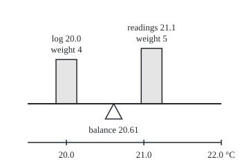
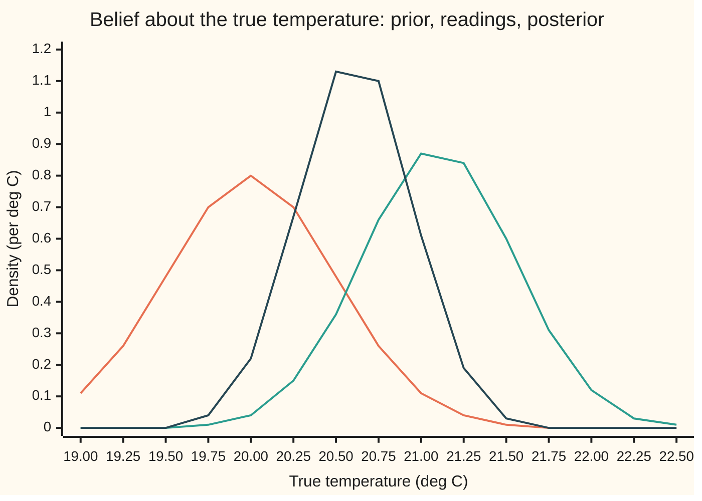
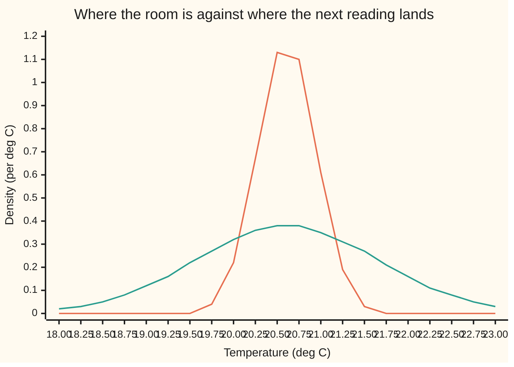

# Normal-normal: updating a mean with precision weights

[Syllabus](../../../SYLLABUS.md) → [Probability and statistics](../../../SYLLABUS.md#w09) → [Bayesian Inference](../../../SYLLABUS.md#w09-s10) → Normal-normal

---

## General Overview

A server room is meant to sit at 20.0 °C. The building log says the air conditioning holds it there, give or take about half a degree. A cheap temperature sensor on a rack is less steady: each reading strays from the room's true temperature by about 1.0 °C, up or down, at random. In one minute it reports five readings: 21.3, 19.8, 22.1, 20.9 and 21.4 °C. Their average is 21.1 °C.

Two pieces of information now disagree. The log says 20.0. The readings say 21.1. Neither is worthless and neither is exact. The question is what to believe about the room's true temperature, and how sure to be. A second question follows: what will the sensor's next reading be?

The answer is a weighted average. Picture a seesaw with the log's 20.0 on one end and the readings' 21.1 on the other. Each side sits on a block whose weight is its **precision**: one divided by its variance, where the variance is the square of the spread. The log's spread of 0.5 °C gives variance 0.25 and precision 4. Five readings averaged have variance 1/5 = 0.2 and precision 5. The seesaw balances at **20.61 °C**, a little closer to the readings. From here on the balance point is called the **precision-weighted average**.

The uncertainty shrinks too. Precisions add: 4 + 5 = 9, so the variance of the answer is 1/9 and its spread is 1/3 of a degree. The next reading is another matter. It carries the sensor's own 1.0-degree jitter on top of that 1/3, so its spread is about 1.05 °C, wider than the sensor's own 1.0 °C; no number of readings brings it below that.

**When a normal belief about an unknown value meets normal readings of it, the updated belief is again normal: its centre is the precision-weighted average of the old centre and the readings' average, its precision is the sum of the two precisions, and a new reading adds its own noise variance on top.**

**What kind of fact this is:** a theorem inside a model. The normal belief and the normal noise are assumptions about the room and the sensor; given them, the updated law and the law of the next reading are proved on this card in Why it works.

### The picture: the seesaw, to scale

<p align="center"></p>

The beam is the temperature scale, 112 units to the degree. The blocks' heights are 16 units per unit of precision: 64 for the log, 80 for the readings. The pivot sits at 20.61, where the log's weight times its distance from the pivot equals the readings' weight times theirs.

---

## The formula

Notation first, in words. The Greek letter $\theta$ (theta) is the room's true temperature, the unknown. A reminder from [Normal](../04-Continuous%20Distributions/04-normal-distribution.md): N(m, v) is the normal law with centre m and variance v, the variance in the second slot. A reminder from [Bayesian updating](01-priors-posteriors-and-updating.md): the **prior** is the belief before the readings, the **posterior** the belief after, and a vertical bar reads "given". The model is two lines:

$$\theta \sim N(m_0,\, v_0), \qquad y_i \mid \theta \sim N(\theta,\, s^2) \text{ independently, for } i = 1, \dots, n.$$

Here $m_0$ and $v_0$ are the prior centre and variance, $y_1, \dots, y_n$ are the n readings, and $s^2$ is one reading's noise variance. The update is two more, with $\bar y$ (y-bar) the readings' average:

$$\theta \mid y_1, \dots, y_n \;\sim\; N(m_n,\, v_n), \qquad m_n = \frac{a_0\, m_0 + a_D\, \bar y}{a_0 + a_D}, \qquad v_n = \frac{1}{a_0 + a_D},$$

with the two precisions

$$a_0 = \frac{1}{v_0}, \qquad a_D = \frac{n}{s^2}.$$

**Read it aloud:** after the readings, the true temperature is normal, centred at the average of the prior centre and the readings' average weighted by their precisions, with a precision equal to the two precisions added.

The next reading, from the same sensor, has the **posterior predictive** law, the law of a reading not yet taken:

$$Y_{\text{new}} \mid y_1, \dots, y_n \;\sim\; N(m_n,\; v_n + s^2).$$

**Read it aloud:** the next reading is centred where the belief is centred, and its variance is the belief's variance plus one reading's noise.

| Symbol | Plain meaning | In our example | Push it up and the answer… |
| --- | --- | --- | --- |
| $\theta$ | the room's true temperature, unknown | about 20.61 °C after the update | — |
| $m_0$ | the prior centre: the log's setting | 20.0 °C | $m_n$ rises by 0.44 per degree |
| $v_0$ | the prior variance: the log's spread squared | 0.25 (spread 0.5 °C) | the prior counts for less; $m_n$ moves toward 21.1 |
| $s^2$ | one reading's noise variance, known | 1.0 (spread 1.0 °C) | the readings count for less; the next reading spreads wider |
| $n$ | the number of readings | 5 | $a_D$ grows; $v_n$ shrinks |
| $y_i$ | the i-th reading | 21.3, 19.8, 22.1, 20.9, 21.4 | $m_n$ rises by 0.11 per degree on one reading |
| $\bar y$ | the readings' average, $(y_1 + \dots + y_n)/n$ | 21.1 °C | $m_n$ rises by 0.56 per degree |
| $a_0$ | the prior's precision, $1/v_0$ | 4 | $m_n$ leans toward 20.0 |
| $a_D$ | the readings' precision, $n/s^2$ | 5 | $m_n$ leans toward 21.1 |
| $m_n$ | the posterior centre | 20.6111 °C | — |
| $v_n$ | the posterior variance | 0.1111 (spread 0.3333 °C) | — |
| $Y_{\text{new}}$ | the next reading, not yet taken | centre 20.6111, spread 1.0541 | — |
| $\Phi$ | the standard normal's area left of a point, from normal-distribution | Φ(1.96) = 0.9750 | — |

The readings' precision is n/s^2, not 1/s^2, because it belongs to their average: the average of five independent readings has variance s^2/5.

### When it holds

- **The noise variance is known.** If $s^2$ is estimated from the same five readings, the honest law of the next reading is wider, with heavier tails (a Student t, [The reference distributions](../07-Sampling%20and%20Estimation/03-chi-square-t-and-f-distributions.md)), and these formulas understate the spread.
- **Readings are independent given the true temperature.** If the sensor shares an error across readings, a drift or a warm spot, five readings carry less than five readings' worth of information. With errors correlated 0.5 the formula still claims a spread of 0.3333 while the real error spread is 0.4843 (What breaks, below).
- **Both laws are normal.** A normal prior allows any temperature, however unlikely; a sensor with occasional wild readings (heavy tails) drags the average and the normal update follows it blindly.
- **The prior is proper and honest.** A prior variance of zero is certainty and ignores every reading; the formulas need $v_0 > 0$. A prior centre copied from the readings counts them twice.
- **The true temperature stands still.** If the room warms between readings, the belief must spread out between updates; that is the Kalman filter.

---

## Why it works

### Step 0: bells multiplied are a bell

Bayes' rule says the posterior is proportional to the prior times the likelihood: the prior density at each candidate temperature, multiplied by the chance density of the observed readings if that temperature were true. Every normal density is a constant times e raised to minus a quadratic in the variable. Multiply several and the exponents add. A sum of quadratics in θ is one quadratic in θ. So the posterior is e to minus a quadratic: a normal. Completing the square, rewriting a quadratic as a squared term plus a constant, reads off its centre and variance.

### Step 1: write the exponent

The prior contributes $(\theta - m_0)^2 / v_0$. Each reading contributes $(y_i - \theta)^2 / s^2$. The posterior density is a constant times

$$\exp\!\Big(-\tfrac12\Big[\frac{(\theta - m_0)^2}{v_0} + \sum_{i=1}^{n} \frac{(y_i - \theta)^2}{s^2}\Big]\Big).$$

Here Σ (capital sigma) means "add up over i from 1 to n".

### Step 2: the readings enter only through their average

Split each reading into its distance from the average plus the average's distance from θ. The cross terms cancel because the distances from the average add to zero:

$$\sum_{i=1}^{n} (y_i - \theta)^2 = \sum_{i=1}^{n} (y_i - \bar y)^2 + n\,(\bar y - \theta)^2.$$

The first sum does not contain θ, so it folds into the constant. What remains is $n(\bar y - \theta)^2 / s^2 = a_D (\theta - \bar y)^2$. The five readings act as one reading of 21.1 with precision 5.

### Step 3: complete the square

The bracket is now $a_0(\theta - m_0)^2 + a_D(\theta - \bar y)^2$. Expand, collect the θ^2 terms, the θ terms and the rest:

$$a_0(\theta - m_0)^2 + a_D(\theta - \bar y)^2 = (a_0 + a_D)\,(\theta - m_n)^2 + \frac{a_0 a_D}{a_0 + a_D}\,(\bar y - m_0)^2,$$

with $m_n$ exactly the precision-weighted average. The coefficient of θ^2 is $a_0 + a_D$: precisions add. The θ term fixes the centre at $m_n$. The last piece holds no θ and joins the constant.

### Step 4: read off the posterior

The posterior density is a constant times $\exp(-(\theta - m_n)^2 / (2 v_n))$ with $v_n = 1/(a_0 + a_D)$. That is the shape of N(m_n, v_n). A density must have total area 1, and only one constant does that, so the posterior is exactly N(m_n, v_n). The prior was normal and so is the posterior; a prior family with this property is called **conjugate**.

### Step 5: the next reading adds its own noise

The next reading is the true temperature plus fresh noise: $Y_{\text{new}} = \theta + \text{noise}$, where the noise is N(0, s^2) and independent of everything before. Given the five readings, θ is N(m_n, v_n). The sum of two independent normals is normal, with centres added and variances added. So the next reading is N(m_n, v_n + s^2): 1/9 + 1 = 10/9, spread 1.0541 °C. The Detailed proof below derives the sum rule from the same square.

<details>
<summary>Detailed proof</summary>

**The identity in Step 3.** Expand the left side: $(a_0 + a_D)\theta^2 - 2(a_0 m_0 + a_D \bar y)\theta + a_0 m_0^2 + a_D \bar y^2$. Write $A = a_0 + a_D$ and $B = a_0 m_0 + a_D \bar y$, so $m_n = B/A$. Then the left side is $A(\theta - B/A)^2 + a_0 m_0^2 + a_D \bar y^2 - B^2/A$. The leftover, over the common denominator A, is
$$\frac{(a_0 + a_D)(a_0 m_0^2 + a_D \bar y^2) - (a_0 m_0 + a_D \bar y)^2}{A} = \frac{a_0 a_D (m_0^2 - 2 m_0 \bar y + \bar y^2)}{A} = \frac{a_0 a_D}{a_0 + a_D}(\bar y - m_0)^2.$$
**The constant.** The prior times the likelihood equals $c\,\exp(-A(\theta - m_n)^2/2)$ for a positive c free of θ. The Gaussian integral gives $\int \exp(-A(\theta - m_n)^2/2)\,d\theta = \sqrt{2\pi/A}$, so dividing by the total area leaves $\sqrt{A/(2\pi)}\exp(-A(\theta - m_n)^2/2)$: the N(m_n, 1/A) density. The total area, $c\sqrt{2\pi/A}$, is the **evidence**, the density of the readings averaged over the prior; its θ-free factor $\exp(-\tfrac12 \tfrac{a_0 a_D}{a_0 + a_D}(\bar y - m_0)^2)$ says the readings' average is N(m_0, v_0 + s^2/n) before θ is known, since $a_0 a_D/(a_0 + a_D) = 1/(v_0 + s^2/n)$.

**The next reading.** Its density at y is the average, over the posterior, of the noise density centred at θ:
$$p(y) = \int \frac{e^{-(\theta - m_n)^2/(2 v_n)}}{\sqrt{2\pi v_n}}\,\frac{e^{-(y - \theta)^2/(2 s^2)}}{\sqrt{2\pi s^2}}\,d\theta.$$
The exponent is Step 3's bracket again, with precisions 1/v_n and 1/s^2 and centres m_n and y. The same identity turns it into a square in θ plus $(y - m_n)^2/(v_n + s^2)$, because $\tfrac{(1/v_n)(1/s^2)}{1/v_n + 1/s^2} = \tfrac{1}{v_n + s^2}$. Integrating θ out leaves a constant times $\exp(-(y - m_n)^2/(2(v_n + s^2)))$. p is a density, so its area is 1, and it is the N(m_n, v_n + s^2) density.

</details>

### The other door: one reading at a time

Feed the readings in one by one, each posterior serving as the next prior. Each reading adds 1 to the precision and pulls the centre toward itself:

| After reading | Reading | Centre | Spread |
| --- | --- | --- | --- |
| 1 | 21.3 | 20.2600 | 0.4472 |
| 2 | 19.8 | 20.1833 | 0.4082 |
| 3 | 22.1 | 20.4571 | 0.3780 |
| 4 | 20.9 | 20.5125 | 0.3536 |
| 5 | 21.4 | 20.6111 | 0.3333 |

The last row is the batch answer. Order does not matter: addition does not care. A running update that also lets the true value drift between readings is the Kalman filter, The Kalman filter.

---

## Worked numbers, by hand

The log: centre 20.0 °C, variance 0.25. The sensor: noise variance 1.0. Five readings summing to 105.5.

| Step | Arithmetic | Value |
| --- | --- | --- |
| readings' average $\bar y$ | 105.5 / 5 | 21.1 |
| prior precision $a_0$ | 1 / 0.25 | 4 |
| readings' precision $a_D$ | 5 / 1.0 | 5 |
| total precision | 4 + 5 | 9 |
| weight on the log | 4 / 9 | 0.4444 |
| weight on the readings | 5 / 9 | 0.5556 |
| posterior centre $m_n$ | (4 × 20.0 + 5 × 21.1) / 9 | 20.6111 |
| posterior variance $v_n$ | 1 / 9 | 0.1111 |
| posterior spread | √0.1111 | 0.3333 |
| predictive variance | 0.1111 + 1.0 | 1.1111 |
| **predictive spread** | √1.1111 | **1.0541** |

The room is most likely at 20.61 °C, give or take a third of a degree: 95 percent of the posterior lies between 19.958 and 21.264 °C (1.96 spreads each side, the standard normal's 97.5 percent point from [Normal quantiles](../04-Continuous%20Distributions/05-normal-quantile.md); [Credible intervals and decisions](05-credible-intervals-and-decisions.md) treats such intervals properly). The next reading is a different quantity: 95 percent of next readings land between 18.545 and 22.677 °C. About 1 reading in 20 falls outside that wider band.

A prior precision of 4 is worth four readings of this sensor. The log counts as four readings that averaged 20.0, pooled with five that averaged 21.1; that is the centre row above. The same pseudo-count reading appears for chances in [Beta-binomial](02-beta-binomial.md).

### What breaks if you drop a piece

| Mistake | Comes out at | What went wrong |
| --- | --- | --- |
| Weight by variances, not precisions | centre 20.4889 | The noisier source got the bigger vote; the seesaw is loaded backwards |
| Count five readings as one: $a_D = 1/s^2$ | centre 20.2200, spread 0.4472 | Four readings' worth of information thrown away |
| Predict the next reading with $v_n$ alone | a ±0.6533 band that catches 46.46% of next readings, not 95% | The sensor's own noise left out |
| Drop independence: errors correlated 0.5 | claimed spread 0.3333, actual 0.4843 | Shared error does not average out; the formula is overconfident |

The last row is a hypothesis dropped, not an arithmetic slip. Each reading still strays with spread 1.0, but half its error variance is shared by all five. The average's error variance becomes 0.5 + 0.5/5 = 0.6 instead of 0.2, and the posterior centre's true error variance is (4/9)^2 × 0.25 + (5/9)^2 × 0.6 = 0.2346, spread 0.4843. The simulation below measures 0.2339.

---

## Code, from first principles, and it actually runs

The scripts reach the answer four independent ways. Road 1 is the formula. Road 2 feeds the readings in one at a time. Road 3 uses no algebra at all: it multiplies the prior density by the five likelihoods on a fine grid and integrates with Simpson's rule, a standard method that fits little parabolas through the grid; it then integrates again to get the next reading's law. Road 4 draws 100,000 rooms from the prior with a seeded SplitMix64 generator, simulates five readings and a sixth for each, and measures the squared errors, each quoted with its standard error. It also reruns every room with shared sensor errors. The standard normal area Φ is built by a power series (the Taylor series of the error function, erf) in Python and by Simpson slices under the bell in Rust, two routes that agree to four decimals.

### Python

```python
# Normal-normal update -- the check behind the card. Standard library only.
# Roads: (1) the precision-weighted formula, (2) one reading at a time,
# (3) prior times likelihood integrated on a grid by Simpson's rule, no algebra,
# (4) a seeded simulation of 100,000 sensors drawn from the prior.
import math

M0, V0, S2 = 20.0, 0.25, 1.0            # prior centre, prior variance, noise variance (deg C)
YS = [21.3, 19.8, 22.1, 20.9, 21.4]     # five readings
Z95 = 1.96                              # 95 percent of a normal lies within 1.96 sds

def update(m0, v0, s2, ys):             # road 1: precisions add, means are weighted by precision
    a0, ad = 1 / v0, len(ys) / s2
    ybar = sum(ys) / len(ys)
    return (a0 * m0 + ad * ybar) / (a0 + ad), 1 / (a0 + ad), a0, ad, ybar
def dens(x, m, v):
    return math.exp(-(x - m) ** 2 / (2 * v)) / math.sqrt(2 * math.pi * v)
def phi_cdf(x):                          # standard normal area left of x, by the erf series
    t, total, k = x / math.sqrt(2), 0.0, 0
    term = t
    while abs(term) > 1e-17:
        total += term / (2 * k + 1)
        k += 1
        term *= -t * t / k
    return 0.5 + total / math.sqrt(math.pi)
def simpson(f, lo, hi, n):
    h = (hi - lo) / n
    s = f(lo) + f(hi)
    for i in range(1, n):
        s += (4 if i % 2 else 2) * f(lo + i * h)
    return s * h / 3
class SplitMix64:
    def __init__(self, seed): self.x = seed
    def next(self):
        self.x = (self.x + 0x9E3779B97F4A7C15) & 0xFFFFFFFFFFFFFFFF
        z = self.x
        z = ((z ^ (z >> 30)) * 0xBF58476D1CE4E5B9) & 0xFFFFFFFFFFFFFFFF
        z = ((z ^ (z >> 27)) * 0x94D049BB133111EB) & 0xFFFFFFFFFFFFFFFF
        return z ^ (z >> 31)
    def unif(self): return ((self.next() >> 11) + 0.5) / 2.0 ** 53
    def normal(self):                    # Box-Muller, one draw per call
        u1, u2 = self.unif(), self.unif()
        return math.sqrt(-2 * math.log(u1)) * math.cos(2 * math.pi * u2)

# ---- road 1: the formula ----
mn, vn, a0, ad, ybar = update(M0, V0, S2, YS)
pv = vn + S2
print(f"house, readings sum {sum(YS):.1f}, average {ybar:.4f}")
print(f"house, prior precision {a0:.4f}, data precision {ad:.4f}, total {a0 + ad:.4f}")
print(f"house, weight on prior {a0 / (a0 + ad):.4f}, weight on data {ad / (a0 + ad):.4f}")
print(f"road 1 formula, posterior mean {mn:.4f}, variance {vn:.4f}, sd {math.sqrt(vn):.4f}")
print(f"road 1 formula, predictive variance {pv:.4f}, sd {math.sqrt(pv):.4f}")
print(f"band, Phi(1.96) {phi_cdf(Z95):.4f}")
print(f"band, 95% for the true temperature {mn - Z95 * math.sqrt(vn):.3f} to {mn + Z95 * math.sqrt(vn):.3f}")
print(f"band, 95% for the next reading {mn - Z95 * math.sqrt(pv):.3f} to {mn + Z95 * math.sqrt(pv):.3f}")

# ---- road 2: one reading at a time ----
m, v = M0, V0
for i, y in enumerate(YS, 1):
    m, v, *_ = update(m, v, S2, [y])
    print(f"road 2 sequential, after reading {i} ({y}): mean {m:.4f}, sd {math.sqrt(v):.4f}")
assert abs(m - mn) < 1e-12 and abs(v - vn) < 1e-12

# ---- road 3: prior times likelihood on a grid, then integrate ----
def unnorm(t):
    return dens(t, M0, V0) * math.prod(dens(y, t, S2) for y in YS)
LO, HI, N = 14.0, 27.0, 2000
evid = simpson(unnorm, LO, HI, N)
gmean = simpson(lambda t: t * unnorm(t), LO, HI, N) / evid
gvar = simpson(lambda t: (t - gmean) ** 2 * unnorm(t), LO, HI, N) / evid
post = lambda t: unnorm(t) / evid
pred = lambda y: simpson(lambda t: post(t) * dens(y, t, S2), 17.0, 24.5, 300)
gpv = simpson(lambda y: (y - gmean) ** 2 * pred(y), 13.0, 28.0, 300)
print(f"road 3 grid, posterior mean {gmean:.4f}, variance {gvar:.4f}, predictive variance {gpv:.4f}")
assert abs(gmean - mn) < 1e-6 and abs(gvar - vn) < 1e-6 and abs(gpv - pv) < 1e-4

# ---- road 4: simulate sensors whose true temperature is drawn from the prior ----
rng, NS = SplitMix64(20260929), 100000
sq = {"prior centre": [], "reading average": [], "posterior mean": [], "next reading": [], "shared error": []}
narrow = wide = 0
half_n, half_w = Z95 * math.sqrt(vn), Z95 * math.sqrt(pv)
for _ in range(NS):
    theta = M0 + math.sqrt(V0) * rng.normal()
    own = [rng.normal() for _ in YS]
    shared = rng.normal()
    ys = [theta + e * math.sqrt(S2) for e in own]
    ysh = [theta + math.sqrt(S2 / 2) * (shared + e) for e in own]   # same spread, errors correlated 0.5
    m1 = update(M0, V0, S2, ys)[0]
    ynew = theta + math.sqrt(S2) * rng.normal()
    sq["prior centre"].append((M0 - theta) ** 2)
    sq["reading average"].append((sum(ys) / len(ys) - theta) ** 2)
    sq["posterior mean"].append((m1 - theta) ** 2)
    sq["next reading"].append((ynew - m1) ** 2)
    sq["shared error"].append((update(M0, V0, S2, ysh)[0] - theta) ** 2)
    narrow += abs(ynew - m1) <= half_n
    wide += abs(ynew - m1) <= half_w
w0, wd = a0 / (a0 + ad), ad / (a0 + ad)
exact = {"prior centre": V0, "reading average": S2 / len(YS), "posterior mean": vn, "next reading": pv,
         "shared error": w0 ** 2 * V0 + wd ** 2 * (S2 / 2 + S2 / 2 / len(YS))}
for k, xs in sq.items():
    mean = sum(xs) / NS
    se = math.sqrt(sum((x - mean) ** 2 for x in xs) / (NS - 1) / NS)
    print(f"road 4 simulation, mean squared error of {k}: {mean:.4f} (se {se:.4f}), exact {exact[k]:.4f}")
    assert abs(mean - exact[k]) < 4 * se
for lab, hits, half in (("posterior-only band", narrow, half_n), ("predictive band", wide, half_w)):
    p_th = 2 * phi_cdf(half / math.sqrt(pv)) - 1
    p_sim, se = hits / NS, math.sqrt(hits / NS * (1 - hits / NS) / NS)
    print(f"road 4 simulation, {lab} +-{half:.4f} catches {p_sim:.4f} (se {se:.4f}), exact {p_th:.4f}")
    assert abs(p_sim - p_th) < 4 * se

# ---- what breaks ----
print(f"breaks, variances used as weights: mean {(V0 * M0 + S2 / len(YS) * ybar) / (V0 + S2 / len(YS)):.4f}")
m5, v5, *_ = update(M0, V0, S2, [ybar])
print(f"breaks, five readings counted as one: mean {m5:.4f}, sd {math.sqrt(v5):.4f}")
print(f"breaks, shared error: claimed sd {math.sqrt(vn):.4f}, actual sd {math.sqrt(exact['shared error']):.4f}")

# ---- try changing ----
mt, vt, *_ = update(M0, 25.0, S2, YS)
print(f"try, prior sd 5: mean {mt:.4f}, sd {math.sqrt(vt):.4f}")
mt, vt, *_ = update(M0, 0.01, S2, YS)
print(f"try, prior sd 0.1: mean {mt:.4f}, sd {math.sqrt(vt):.4f}")
mt, vt, *_ = update(M0, V0, S2, [ybar] * 20)
print(f"try, 20 readings averaging 21.1: mean {mt:.4f}, sd {math.sqrt(vt):.4f}, predictive sd {math.sqrt(vt + S2):.4f}")

# ---- chart points and figure ----
g1 = [19.0 + 0.25 * i for i in range(15)]
print("chart1, x " + ", ".join(f"{t:.2f}" for t in g1))
for lab, c, var in (("prior", M0, V0), ("readings", ybar, S2 / len(YS)), ("posterior", mn, vn)):
    print(f"chart1, {lab} " + ", ".join(f"{dens(t, c, var):.2f}" for t in g1))
g2 = [18.0 + 0.25 * i for i in range(21)]
print("chart2, x " + ", ".join(f"{t:.2f}" for t in g2))
print("chart2, posterior " + ", ".join(f"{dens(t, mn, vn):.2f}" for t in g2))
print("chart2, predictive " + ", ".join(f"{dens(t, mn, pv):.2f}" for t in g2))
print("chart2, grid predictive " + ", ".join(f"{pred(t):.2f}" for t in g2))
xs = lambda t: 40 + (t - 19.5) * 112
print(f"figure, prior at x {xs(M0):.1f}, readings at x {xs(ybar):.1f}, pivot at x {xs(mn):.1f}, "
      f"block heights {16 * a0:.1f} and {16 * ad:.1f}")
print("ALL CHECKS PASS")
```

**Ran 2026-09-29 on macOS, Python 3.14.6, standard library only. All checks passed. Output, pasted from the run:**

```
house, readings sum 105.5, average 21.1000
house, prior precision 4.0000, data precision 5.0000, total 9.0000
house, weight on prior 0.4444, weight on data 0.5556
road 1 formula, posterior mean 20.6111, variance 0.1111, sd 0.3333
road 1 formula, predictive variance 1.1111, sd 1.0541
band, Phi(1.96) 0.9750
band, 95% for the true temperature 19.958 to 21.264
band, 95% for the next reading 18.545 to 22.677
road 2 sequential, after reading 1 (21.3): mean 20.2600, sd 0.4472
road 2 sequential, after reading 2 (19.8): mean 20.1833, sd 0.4082
road 2 sequential, after reading 3 (22.1): mean 20.4571, sd 0.3780
road 2 sequential, after reading 4 (20.9): mean 20.5125, sd 0.3536
road 2 sequential, after reading 5 (21.4): mean 20.6111, sd 0.3333
road 3 grid, posterior mean 20.6111, variance 0.1111, predictive variance 1.1111
road 4 simulation, mean squared error of prior centre: 0.2503 (se 0.0011), exact 0.2500
road 4 simulation, mean squared error of reading average: 0.2005 (se 0.0009), exact 0.2000
road 4 simulation, mean squared error of posterior mean: 0.1112 (se 0.0005), exact 0.1111
road 4 simulation, mean squared error of next reading: 1.1187 (se 0.0050), exact 1.1111
road 4 simulation, mean squared error of shared error: 0.2339 (se 0.0011), exact 0.2346
road 4 simulation, posterior-only band +-0.6533 catches 0.4626 (se 0.0016), exact 0.4646
road 4 simulation, predictive band +-2.0660 catches 0.9496 (se 0.0007), exact 0.9500
breaks, variances used as weights: mean 20.4889
breaks, five readings counted as one: mean 20.2200, sd 0.4472
breaks, shared error: claimed sd 0.3333, actual sd 0.4843
try, prior sd 5: mean 21.0913, sd 0.4454
try, prior sd 0.1: mean 20.0524, sd 0.0976
try, 20 readings averaging 21.1: mean 20.9167, sd 0.2041, predictive sd 1.0206
chart1, x 19.00, 19.25, 19.50, 19.75, 20.00, 20.25, 20.50, 20.75, 21.00, 21.25, 21.50, 21.75, 22.00, 22.25, 22.50
chart1, prior 0.11, 0.26, 0.48, 0.70, 0.80, 0.70, 0.48, 0.26, 0.11, 0.04, 0.01, 0.00, 0.00, 0.00, 0.00
chart1, readings 0.00, 0.00, 0.00, 0.01, 0.04, 0.15, 0.36, 0.66, 0.87, 0.84, 0.60, 0.31, 0.12, 0.03, 0.01
chart1, posterior 0.00, 0.00, 0.00, 0.04, 0.22, 0.67, 1.13, 1.10, 0.61, 0.19, 0.03, 0.00, 0.00, 0.00, 0.00
chart2, x 18.00, 18.25, 18.50, 18.75, 19.00, 19.25, 19.50, 19.75, 20.00, 20.25, 20.50, 20.75, 21.00, 21.25, 21.50, 21.75, 22.00, 22.25, 22.50, 22.75, 23.00
chart2, posterior 0.00, 0.00, 0.00, 0.00, 0.00, 0.00, 0.00, 0.04, 0.22, 0.67, 1.13, 1.10, 0.61, 0.19, 0.03, 0.00, 0.00, 0.00, 0.00, 0.00, 0.00
chart2, predictive 0.02, 0.03, 0.05, 0.08, 0.12, 0.16, 0.22, 0.27, 0.32, 0.36, 0.38, 0.38, 0.35, 0.31, 0.27, 0.21, 0.16, 0.11, 0.08, 0.05, 0.03
chart2, grid predictive 0.02, 0.03, 0.05, 0.08, 0.12, 0.16, 0.22, 0.27, 0.32, 0.36, 0.38, 0.38, 0.35, 0.31, 0.27, 0.21, 0.16, 0.11, 0.08, 0.05, 0.03
figure, prior at x 96.0, readings at x 219.2, pivot at x 164.4, block heights 64.0 and 80.0
ALL CHECKS PASS
```

### Rust

```rust
// Normal-normal update -- the check behind the card. Rust std only.
// Roads: (1) the precision-weighted formula, (2) one reading at a time,
// (3) prior times likelihood integrated on a grid by Simpson's rule, no algebra,
// (4) a seeded simulation of 100,000 sensors drawn from the prior.
use std::f64::consts::PI;

const M0: f64 = 20.0; // prior centre (deg C)
const V0: f64 = 0.25; // prior variance
const S2: f64 = 1.0; // noise variance of one reading
const YS: [f64; 5] = [21.3, 19.8, 22.1, 20.9, 21.4];
const Z95: f64 = 1.96; // 95 percent of a normal lies within 1.96 sds

// road 1: precisions add, means are weighted by precision
fn update(m0: f64, v0: f64, s2: f64, ys: &[f64]) -> (f64, f64, f64, f64, f64) {
    let (a0, ad) = (1.0 / v0, ys.len() as f64 / s2);
    let ybar = ys.iter().sum::<f64>() / ys.len() as f64;
    ((a0 * m0 + ad * ybar) / (a0 + ad), 1.0 / (a0 + ad), a0, ad, ybar)
}
fn dens(x: f64, m: f64, v: f64) -> f64 {
    (-(x - m) * (x - m) / (2.0 * v)).exp() / (2.0 * PI * v).sqrt()
}
fn phi_cdf(x: f64) -> f64 {
    // standard normal area left of x, by adding up thin Simpson slices of the bell
    let n = 4000;
    let h = x / n as f64;
    let bell = |t: f64| (-t * t / 2.0).exp() / (2.0 * PI).sqrt();
    let mut s = bell(0.0) + bell(x);
    for i in 1..n {
        s += if i % 2 == 1 { 4.0 } else { 2.0 } * bell(i as f64 * h);
    }
    0.5 + s * h / 3.0
}
fn simpson<F: Fn(f64) -> f64>(f: F, lo: f64, hi: f64, n: usize) -> f64 {
    let h = (hi - lo) / n as f64;
    let mut s = f(lo) + f(hi);
    for i in 1..n {
        s += if i % 2 == 1 { 4.0 } else { 2.0 } * f(lo + i as f64 * h);
    }
    s * h / 3.0
}
struct SplitMix64(u64);
impl SplitMix64 {
    fn next(&mut self) -> u64 {
        self.0 = self.0.wrapping_add(0x9E3779B97F4A7C15);
        let mut z = self.0;
        z = (z ^ (z >> 30)).wrapping_mul(0xBF58476D1CE4E5B9);
        z = (z ^ (z >> 27)).wrapping_mul(0x94D049BB133111EB);
        z ^ (z >> 31)
    }
    fn unif(&mut self) -> f64 { ((self.next() >> 11) as f64 + 0.5) / 2f64.powi(53) }
    fn normal(&mut self) -> f64 {
        let (u1, u2) = (self.unif(), self.unif());
        (-2.0 * u1.ln()).sqrt() * (2.0 * PI * u2).cos()
    }
}
fn list(xs: &[f64], f: impl Fn(f64) -> f64) -> String {
    xs.iter().map(|&t| format!("{:.2}", f(t))).collect::<Vec<_>>().join(", ")
}

fn main() {
    // ---- road 1: the formula ----
    let (mn, vn, a0, ad, ybar) = update(M0, V0, S2, &YS);
    let pv = vn + S2;
    println!("house, readings sum {:.1}, average {:.4}", YS.iter().sum::<f64>(), ybar);
    println!("house, prior precision {:.4}, data precision {:.4}, total {:.4}", a0, ad, a0 + ad);
    println!("house, weight on prior {:.4}, weight on data {:.4}", a0 / (a0 + ad), ad / (a0 + ad));
    println!("road 1 formula, posterior mean {:.4}, variance {:.4}, sd {:.4}", mn, vn, vn.sqrt());
    println!("road 1 formula, predictive variance {:.4}, sd {:.4}", pv, pv.sqrt());
    println!("band, Phi(1.96) {:.4}", phi_cdf(Z95));
    println!("band, 95% for the true temperature {:.3} to {:.3}", mn - Z95 * vn.sqrt(), mn + Z95 * vn.sqrt());
    println!("band, 95% for the next reading {:.3} to {:.3}", mn - Z95 * pv.sqrt(), mn + Z95 * pv.sqrt());

    // ---- road 2: one reading at a time ----
    let (mut m, mut v) = (M0, V0);
    for (i, &y) in YS.iter().enumerate() {
        let r = update(m, v, S2, &[y]);
        m = r.0;
        v = r.1;
        println!("road 2 sequential, after reading {} ({}): mean {:.4}, sd {:.4}", i + 1, y, m, v.sqrt());
    }
    assert!((m - mn).abs() < 1e-12 && (v - vn).abs() < 1e-12);

    // ---- road 3: prior times likelihood on a grid, then integrate ----
    let unnorm = |t: f64| dens(t, M0, V0) * YS.iter().fold(1.0, |p, &y| p * dens(y, t, S2));
    let (lo, hi, n) = (14.0, 27.0, 2000);
    let evid = simpson(&unnorm, lo, hi, n);
    let gmean = simpson(|t| t * unnorm(t), lo, hi, n) / evid;
    let gvar = simpson(|t| (t - gmean) * (t - gmean) * unnorm(t), lo, hi, n) / evid;
    let pred = |y: f64| simpson(|t| unnorm(t) / evid * dens(y, t, S2), 17.0, 24.5, 300);
    let gpv = simpson(|y| (y - gmean) * (y - gmean) * pred(y), 13.0, 28.0, 300);
    println!("road 3 grid, posterior mean {:.4}, variance {:.4}, predictive variance {:.4}", gmean, gvar, gpv);
    assert!((gmean - mn).abs() < 1e-6 && (gvar - vn).abs() < 1e-6 && (gpv - pv).abs() < 1e-4);

    // ---- road 4: simulate sensors whose true temperature is drawn from the prior ----
    let mut rng = SplitMix64(20260929);
    let ns = 100000usize;
    let labels = ["prior centre", "reading average", "posterior mean", "next reading", "shared error"];
    let mut sq: Vec<Vec<f64>> = vec![Vec::with_capacity(ns); 5];
    let (mut narrow, mut wide) = (0usize, 0usize);
    let (half_n, half_w) = (Z95 * vn.sqrt(), Z95 * pv.sqrt());
    for _ in 0..ns {
        let theta = M0 + V0.sqrt() * rng.normal();
        let own: Vec<f64> = (0..YS.len()).map(|_| rng.normal()).collect();
        let shared = rng.normal();
        let ys: Vec<f64> = own.iter().map(|e| theta + e * S2.sqrt()).collect();
        let ysh: Vec<f64> = own.iter().map(|e| theta + (S2 / 2.0).sqrt() * (shared + e)).collect();
        let m1 = update(M0, V0, S2, &ys).0;
        let ynew = theta + S2.sqrt() * rng.normal();
        let avg = ys.iter().sum::<f64>() / ys.len() as f64;
        let msh = update(M0, V0, S2, &ysh).0;
        for (k, e) in [M0 - theta, avg - theta, m1 - theta, ynew - m1, msh - theta].iter().enumerate() {
            sq[k].push(e * e);
        }
        narrow += ((ynew - m1).abs() <= half_n) as usize;
        wide += ((ynew - m1).abs() <= half_w) as usize;
    }
    let (w0, wd) = (a0 / (a0 + ad), ad / (a0 + ad));
    let nr = YS.len() as f64;
    let exact = [V0, S2 / nr, vn, pv, w0 * w0 * V0 + wd * wd * (S2 / 2.0 + S2 / 2.0 / nr)];
    for k in 0..5 {
        let mean = sq[k].iter().sum::<f64>() / ns as f64;
        let ss: f64 = sq[k].iter().map(|x| (x - mean) * (x - mean)).sum();
        let se = (ss / (ns - 1) as f64 / ns as f64).sqrt();
        println!("road 4 simulation, mean squared error of {}: {:.4} (se {:.4}), exact {:.4}", labels[k], mean, se, exact[k]);
        assert!((mean - exact[k]).abs() < 4.0 * se);
    }
    for (lab, hits, half) in [("posterior-only band", narrow, half_n), ("predictive band", wide, half_w)] {
        let p_th = 2.0 * phi_cdf(half / pv.sqrt()) - 1.0;
        let p_sim = hits as f64 / ns as f64;
        let se = (p_sim * (1.0 - p_sim) / ns as f64).sqrt();
        println!("road 4 simulation, {} +-{:.4} catches {:.4} (se {:.4}), exact {:.4}", lab, half, p_sim, se, p_th);
        assert!((p_sim - p_th).abs() < 4.0 * se);
    }

    // ---- what breaks ----
    println!("breaks, variances used as weights: mean {:.4}", (V0 * M0 + S2 / nr * ybar) / (V0 + S2 / nr));
    let (m5, v5, ..) = update(M0, V0, S2, &[ybar]);
    println!("breaks, five readings counted as one: mean {:.4}, sd {:.4}", m5, v5.sqrt());
    println!("breaks, shared error: claimed sd {:.4}, actual sd {:.4}", vn.sqrt(), exact[4].sqrt());

    // ---- try changing ----
    let (mt, vt, ..) = update(M0, 25.0, S2, &YS);
    println!("try, prior sd 5: mean {:.4}, sd {:.4}", mt, vt.sqrt());
    let (mt, vt, ..) = update(M0, 0.01, S2, &YS);
    println!("try, prior sd 0.1: mean {:.4}, sd {:.4}", mt, vt.sqrt());
    let (mt, vt, ..) = update(M0, V0, S2, &[ybar; 20]);
    println!("try, 20 readings averaging 21.1: mean {:.4}, sd {:.4}, predictive sd {:.4}", mt, vt.sqrt(), (vt + S2).sqrt());

    // ---- chart points and figure ----
    let g1: Vec<f64> = (0..15).map(|i| 19.0 + 0.25 * i as f64).collect();
    println!("chart1, x {}", list(&g1, |t| t));
    println!("chart1, prior {}", list(&g1, |t| dens(t, M0, V0)));
    println!("chart1, readings {}", list(&g1, |t| dens(t, ybar, S2 / nr)));
    println!("chart1, posterior {}", list(&g1, |t| dens(t, mn, vn)));
    let g2: Vec<f64> = (0..21).map(|i| 18.0 + 0.25 * i as f64).collect();
    println!("chart2, x {}", list(&g2, |t| t));
    println!("chart2, posterior {}", list(&g2, |t| dens(t, mn, vn)));
    println!("chart2, predictive {}", list(&g2, |t| dens(t, mn, pv)));
    println!("chart2, grid predictive {}", list(&g2, |t| pred(t)));
    let xs = |t: f64| 40.0 + (t - 19.5) * 112.0;
    println!("figure, prior at x {:.1}, readings at x {:.1}, pivot at x {:.1}, block heights {:.1} and {:.1}",
        xs(M0), xs(ybar), xs(mn), 16.0 * a0, 16.0 * ad);
    println!("ALL CHECKS PASS");
}
```

**Ran 2026-09-29 on macOS, rustc 1.98.1, no crates. All checks passed. Output, pasted from the run:**

```
house, readings sum 105.5, average 21.1000
house, prior precision 4.0000, data precision 5.0000, total 9.0000
house, weight on prior 0.4444, weight on data 0.5556
road 1 formula, posterior mean 20.6111, variance 0.1111, sd 0.3333
road 1 formula, predictive variance 1.1111, sd 1.0541
band, Phi(1.96) 0.9750
band, 95% for the true temperature 19.958 to 21.264
band, 95% for the next reading 18.545 to 22.677
road 2 sequential, after reading 1 (21.3): mean 20.2600, sd 0.4472
road 2 sequential, after reading 2 (19.8): mean 20.1833, sd 0.4082
road 2 sequential, after reading 3 (22.1): mean 20.4571, sd 0.3780
road 2 sequential, after reading 4 (20.9): mean 20.5125, sd 0.3536
road 2 sequential, after reading 5 (21.4): mean 20.6111, sd 0.3333
road 3 grid, posterior mean 20.6111, variance 0.1111, predictive variance 1.1111
road 4 simulation, mean squared error of prior centre: 0.2503 (se 0.0011), exact 0.2500
road 4 simulation, mean squared error of reading average: 0.2005 (se 0.0009), exact 0.2000
road 4 simulation, mean squared error of posterior mean: 0.1112 (se 0.0005), exact 0.1111
road 4 simulation, mean squared error of next reading: 1.1187 (se 0.0050), exact 1.1111
road 4 simulation, mean squared error of shared error: 0.2339 (se 0.0011), exact 0.2346
road 4 simulation, posterior-only band +-0.6533 catches 0.4626 (se 0.0016), exact 0.4646
road 4 simulation, predictive band +-2.0660 catches 0.9496 (se 0.0007), exact 0.9500
breaks, variances used as weights: mean 20.4889
breaks, five readings counted as one: mean 20.2200, sd 0.4472
breaks, shared error: claimed sd 0.3333, actual sd 0.4843
try, prior sd 5: mean 21.0913, sd 0.4454
try, prior sd 0.1: mean 20.0524, sd 0.0976
try, 20 readings averaging 21.1: mean 20.9167, sd 0.2041, predictive sd 1.0206
chart1, x 19.00, 19.25, 19.50, 19.75, 20.00, 20.25, 20.50, 20.75, 21.00, 21.25, 21.50, 21.75, 22.00, 22.25, 22.50
chart1, prior 0.11, 0.26, 0.48, 0.70, 0.80, 0.70, 0.48, 0.26, 0.11, 0.04, 0.01, 0.00, 0.00, 0.00, 0.00
chart1, readings 0.00, 0.00, 0.00, 0.01, 0.04, 0.15, 0.36, 0.66, 0.87, 0.84, 0.60, 0.31, 0.12, 0.03, 0.01
chart1, posterior 0.00, 0.00, 0.00, 0.04, 0.22, 0.67, 1.13, 1.10, 0.61, 0.19, 0.03, 0.00, 0.00, 0.00, 0.00
chart2, x 18.00, 18.25, 18.50, 18.75, 19.00, 19.25, 19.50, 19.75, 20.00, 20.25, 20.50, 20.75, 21.00, 21.25, 21.50, 21.75, 22.00, 22.25, 22.50, 22.75, 23.00
chart2, posterior 0.00, 0.00, 0.00, 0.00, 0.00, 0.00, 0.00, 0.04, 0.22, 0.67, 1.13, 1.10, 0.61, 0.19, 0.03, 0.00, 0.00, 0.00, 0.00, 0.00, 0.00
chart2, predictive 0.02, 0.03, 0.05, 0.08, 0.12, 0.16, 0.22, 0.27, 0.32, 0.36, 0.38, 0.38, 0.35, 0.31, 0.27, 0.21, 0.16, 0.11, 0.08, 0.05, 0.03
chart2, grid predictive 0.02, 0.03, 0.05, 0.08, 0.12, 0.16, 0.22, 0.27, 0.32, 0.36, 0.38, 0.38, 0.35, 0.31, 0.27, 0.21, 0.16, 0.11, 0.08, 0.05, 0.03
figure, prior at x 96.0, readings at x 219.2, pivot at x 164.4, block heights 64.0 and 80.0
ALL CHECKS PASS
```

The two outputs agree line for line. The simulation's mean squared error of the posterior centre, 0.1112 with standard error 0.0005, matches the exact 0.1111; the prior centre alone scores 0.2503 and the readings' average alone 0.2005. Blending beats either source: that is what the precision weights buy.

### The pictures: three beliefs, then belief against prediction



The first line (orange) is the prior, N(20.0, 0.25). The second (teal) is what the readings alone say, N(21.1, 0.2). The third (dark) is the posterior, N(20.6111, 0.1111): between the two, and taller and narrower than either.



The first line (orange) is the posterior for the true temperature, spread 0.3333. The second (teal) is the predictive law of the next reading, spread 1.0541, same centre. The grid road prints the second line independently and every point agrees.

> [!TIP]
> **Try changing**
> Guess first, then run.
> - **Distrust the log.** Set the prior variance `V0 = 25.0` (spread 5 °C). Guess: the answer moves almost to the readings. It does: centre 21.0913, spread 0.4454, barely better than the readings' own 0.4472.
> - **Trust the log.** Set `V0 = 0.01` (spread 0.1 °C). Guess: the readings hardly move it. Centre 20.0524, spread 0.0976.
> - **Take 20 readings averaging 21.1.** The posterior tightens to centre 20.9167, spread 0.2041. The next reading's spread is 1.0206: no number of readings pushes it below the sensor's own 1.0.

---

## The usual mistake

> [!warning]
> **Quoting the posterior spread as the spread of the next reading.** The posterior spread, 0.3333 °C, describes uncertainty about the room's true temperature. A new reading adds the sensor's own noise: its spread is 1.0541. A band of ±0.6533 around 20.61 catches only 46.46 percent of next readings (the simulation counts 46.26, standard error 0.16), not 95.
>
> - **Weights upside down.** Weighting by variances instead of precisions gives the noisier source the bigger vote: centre 20.4889, not 20.6111.
> - **Five readings counted as one.** Giving the average precision 1/s^2 instead of n/s^2 throws away four readings' worth: centre 20.2200 and spread 0.4472, not 20.6111 and 0.3333.
> - **Shared errors treated as independent.** With errors correlated 0.5 the formula still claims a spread of 0.3333; the real error spread is 0.4843.

---

## Where you meet it in real life

- **Sensor fusion.** A phone's navigation blends its GPS fix with the position predicted from its motion sensors by these weights, reading after reading; the running form is The Kalman filter.
- **Combining studies.** A meta-analysis pools estimates from several trials by inverse-variance weights, the precisions of this card.
- **Insurance pricing.** A premium blends a policyholder's own claims with the class average; the weight on the policyholder's own claims, 5/9 here, is the credibility factor of [Credibility and reinsurance](../../12-Financial%20mathematics/51-Insurance%20and%20Actuarial%20Mathematics/08-credibility-and-reinsurance.md).
- **Portfolio views.** Black-Litterman blends market-implied returns with an investor's views by precision: [Black-Litterman](../../12-Financial%20mathematics/37-Portfolio%20Theory/06-black-litterman.md).
- **Averaging polls.** Poll aggregators often weight each poll by its sample size, which is its precision up to a constant.

> **Say it back**
> A normal prior about an unknown value and normal readings of it combine into a normal posterior. Its centre is the precision-weighted average of the prior centre and the readings' average, where precision is one over variance. Its precision is the sum of the two precisions, so it is narrower than either source. The proof is completing the square in the product of the densities. A new reading adds its own noise variance, so predictions stay wide however many readings come in.

---

## What this builds on

- [Bayesian updating](01-priors-posteriors-and-updating.md): Bayes' rule as posterior proportional to prior times likelihood, the starting line of Step 0.
- [Normal](../04-Continuous%20Distributions/04-normal-distribution.md): the normal density, N(m, v) notation, the standard normal area Φ, and the Gaussian integral that fixes the constant.

## Where this goes next

- [Black-Litterman](../../12-Financial%20mathematics/37-Portfolio%20Theory/06-black-litterman.md): the same blend with a vector of returns and a matrix of precisions.
- [A moving hedge ratio](../../12-Financial%20mathematics/50-Signals%2C%20Mean%20Reversion%20and%20Backtesting/07-kalman-filter-for-dynamic-hedge-ratios.md): the one-reading-at-a-time update tracking a hedge ratio that drifts.
- [Credibility and reinsurance](../../12-Financial%20mathematics/51-Insurance%20and%20Actuarial%20Mathematics/08-credibility-and-reinsurance.md): the weight on the data, renamed the credibility factor, setting premiums.
- The Kalman filter: the update in a loop, with a prediction step that widens the belief between readings.

The rate of a count, such as server alarms per hour, needs a different conjugate pair: [Gamma-Poisson](04-gamma-poisson.md).

---

## Sources

Verified 2026-09-29: every link below resolves to the publisher's page.

- Gelman, Andrew, John B. Carlin, Hal S. Stern, David B. Dunson, Aki Vehtari and Donald B. Rubin. *Bayesian Data Analysis*, 3rd ed. CRC Press, 2013. [Publisher page](https://www.routledge.com/Bayesian-Data-Analysis/Gelman-Carlin-Stern-Dunson-Vehtari-Rubin/p/book/9781439840955); the authors' [book home page](https://sites.stat.columbia.edu/gelman/book/). Chapter 2 derives the normal update with known variance and its predictive law.
- Murphy, Kevin P. "Conjugate Bayesian analysis of the Gaussian distribution." Technical note, University of British Columbia, 2007. [PDF](https://www.cs.ubc.ca/~murphyk/Papers/bayesGauss.pdf). Every normal conjugate case side by side, including the unknown-variance Student t.
- Kalman, R. E. "A New Approach to Linear Filtering and Prediction Problems." *Journal of Basic Engineering* 82, no. 1 (1960): 35–45. [doi:10.1115/1.3662552](https://doi.org/10.1115/1.3662552). The sequential form with a moving true value.
- Bühlmann, Hans. "Experience Rating and Credibility." *ASTIN Bulletin* 4, no. 3 (1967): 199–207. [doi:10.1017/S0515036100008989](https://doi.org/10.1017/S0515036100008989). The weight on the data as the credibility factor.
